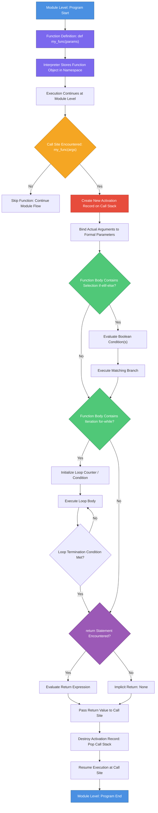
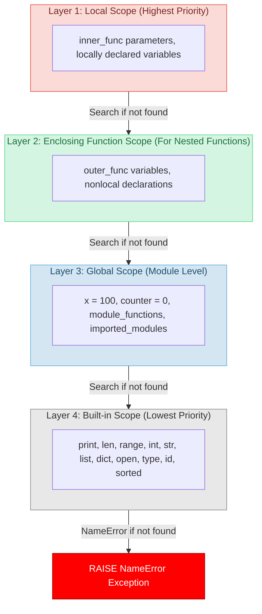
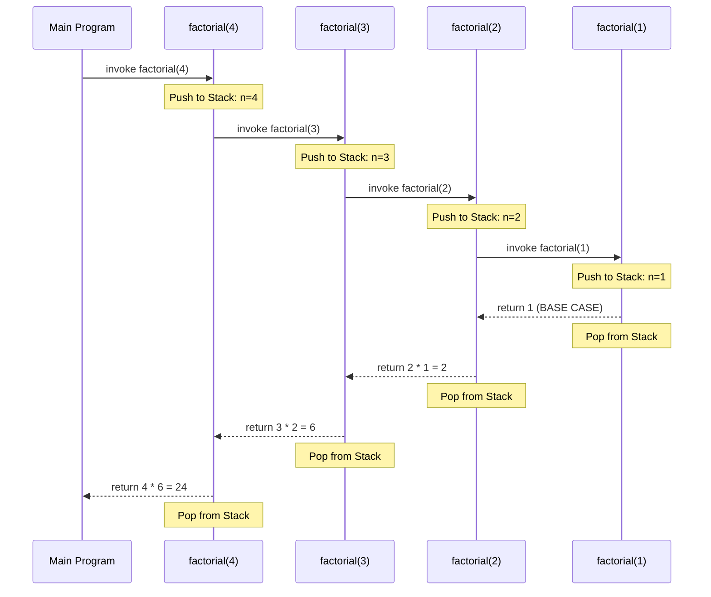
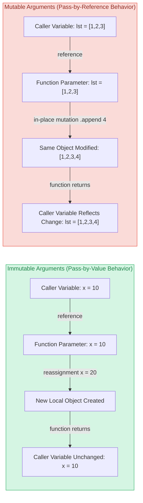
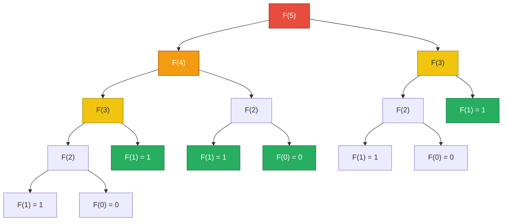

# Defining and using functions in Python

<!-- SECTION_1_START -->

# Defining and Using Functions in Python

## 1.1 Formal Academic Definition

In the **Python programming language**, a **function** is a named, reusable, and self-contained block of statements that performs a specific, well-defined computational task. Functions are first-class citizens in Python, meaning they can be assigned to variables, passed as arguments to other functions, returned from functions, and stored in data structures. According to the **KTU 2024 Scheme syllabus** for *Algorithmic Thinking with Python (UCEST105)*, functions embody the **structured programming paradigm** of *modular decomposition*, allowing complex algorithms to be broken down into smaller, testable, and logically isolated units.

> [!IMPORTANT]
> **KTU Syllabus Highlight:** Within the context of *Module 3 – Selection and Iteration*, functions serve as the **encapsulation mechanism** that hosts `if-elif-else` decision structures and `for`/`while` loop constructs, enabling code reuse across multiple conditional and iterative scenarios without duplication.

The general syntactic skeleton mandated by **PEP 8** (Python Enhancement Proposal 8) for defining a function is:

```python
def function_name(parameters):
    """Docstring describing the function's purpose."""
    # Body of the function
    return result
```

The keyword **`def`** is a reserved token that initiates a **function definition statement**. The Python interpreter treats the indented block following the colon (`:`) as the function's **body** or **suite**.

## 1.2 Conceptual Analogy and Intuitive Understanding

Imagine a **vending machine**. You (the *caller*) insert coins (the *arguments*) and press a button labeled "B7" (the *function name*). The machine internally performs a series of mechanical steps (the *function body*) and dispenses a packet of chips (the *return value*). You do **not** need to know the internal wiring of the machine — you only need to know its **interface** (what input it expects and what output it produces). This interface is precisely what a function exposes to the rest of the program.

> [!NOTE]
> **Core Definition — Function Interface:** The contract between a function and its caller, defined by the function's **name**, the **parameters** it accepts, and the **return value** it produces.

Consider another analogy: a **recipe** in a cookbook. The recipe has a name (*"Chocolate Cake"*), a list of ingredients (*parameters*), step-by-step instructions (*function body*), and a final product (*return value*). You can invoke the same recipe multiple times with different ingredient quantities to produce different cakes.

## 1.3 Why Functions Are Indispensable in Algorithmic Thinking

In the **KTU 2024 Scheme NEP 2020 framework**, algorithmic thinking emphasizes *abstraction*, *decomposition*, and *pattern recognition*. Functions are the primary vehicle through which these principles are operationalized in Python.

1. **Abstraction:** The caller interacts only with the function's *signature* and *docstring*, not its internal implementation.
2. **Decomposition:** A complex algorithm (e.g., binary search) is split into smaller functions (e.g., `binary_search()`, `midpoint_calculator()`, `comparison_engine()`).
3. **Reusability:** A well-written function can be called from multiple places within the same module or imported into other modules.
4. **Testability:** Isolated functions can be unit-tested independently, aligning with **software engineering best practices**.

> [!VISUALIZATION CONTROL]
> **Concept:** Function as a "Black Box" Mapping
> **GeoGebra / Desmos Input Equations:**
> * Domain set: $X = \{1, 2, 3, 4, 5\}$ (input arguments)
> * Codomain set: $Y = \{2, 4, 6, 8, 10\}$ (return values)
> * Mapping rule: $f(x) = 2x$
> **Visual Description:** Plot discrete points $(1,2), (2,4), (3,6), (4,8), (5,10)$ on the Cartesian plane. The function $f$ acts as a deterministic transformation from the input domain to the output codomain. Each point represents one *invocation* of the function with a specific argument.

## 1.4 Classification of Functions in Python

Python supports four major categories of functions, each of which appears in KTU examination questions:

| Category | Definition Mechanism | Typical Use Case |
|---|---|---|
| **Built-in Functions** | Pre-defined in the Python interpreter (`print()`, `len()`, `range()`) | Immediate utility without import |
| **User-defined Functions** | Declared using the `def` keyword | Custom algorithmic logic |
| **Lambda (Anonymous) Functions** | Declared using the `lambda` keyword | Short, throwaway transformations |
| **Recursive Functions** | User-defined functions that call themselves | Problems with self-similar substructure (factorial, Fibonacci, tree traversal) |

<!-- SECTION_1_END -->

<!-- SECTION_2_START -->

# Deep Theoretical Analysis and KTU High-Yield Formula Sheet

## 2.1 Anatomy of a Python Function — Structural Breakdown

Every Python function, regardless of complexity, consists of **six structural components**. Understanding each is critical for KTU board examinations.

### Component 1: The `def` Header
The **function definition statement** begins with the reserved keyword `def`, followed by the function's identifier and a parenthesized parameter list.

### Component 2: Parameters (Formal Arguments)
**Parameters** are the *named placeholders* listed in the function's signature. They act as local variables that receive values from the caller.

### Component 3: The Docstring
A **docstring** is a triple-quoted string literal placed immediately after the function header. It serves as the function's official documentation and is accessible via the `help()` built-in or the `__doc__` attribute.

### Component 4: The Body (Suite)
The **body** is an indented block of one or more statements that execute when the function is called. It typically contains selection (`if`/`elif`/`else`) or iteration (`for`/`while`) constructs in the context of Module 3.

### Component 5: The `return` Statement
The **`return`** statement exits the function and optionally passes a value back to the caller. A function without an explicit `return` implicitly returns `None`.

### Component 6: The Call Site
The **call site** is the location in the program where the function is *invoked* by appending parentheses `()` to the function name, supplying actual arguments.

> [!NOTE]
> **Critical Distinction — Parameter vs. Argument:** A **parameter** is a variable in the function *definition*. An **argument** is the actual *value* passed to the function at the *call site*. KTU examiners frequently test this distinction.

## 2.2 Parameter Passing Mechanisms

Python employs a unique parameter passing model that combines aspects of *pass-by-value* and *pass-by-reference*. Specifically, Python uses **pass-by-object-reference** (also called *pass-by-assignment* or *call-by-sharing*).

- **Immutable objects** (integers, strings, tuples, frozensets): Behaves like *pass-by-value*. Modifications inside the function create a new local object; the caller's variable remains unchanged.
- **Mutable objects** (lists, dictionaries, sets): Behaves like *pass-by-reference*. In-place modifications inside the function are reflected in the caller's variable.

## 2.3 Types of Formal Parameters

| Parameter Type | Syntax | Purpose | Example Call |
|---|---|---|---|
| **Positional** | `def f(a, b):` | Bound by position | `f(3, 5)` |
| **Keyword** | `def f(a, b):` | Bound by name | `f(a=3, b=5)` |
| **Default** | `def f(a, b=10):` | Optional with fallback | `f(3)` → uses `b=10` |
| **Variable Positional** | `def f(*args):` | Collects extra positional args into a tuple | `f(1, 2, 3, 4)` |
| **Variable Keyword** | `def f(**kwargs):` | Collects extra keyword args into a dict | `f(x=1, y=2)` |
| **Positional-Only** | `def f(a, b, /):` | Must be passed positionally (Python 3.8+) | `f(3, 5)` |
| **Keyword-Only** | `def f(*, a, b):` | Must be passed by keyword | `f(a=3, b=5)` |

## 2.4 Scope Resolution — The LEGB Rule

Python resolves variable names by searching four enclosing scopes in a strict order, known as the **LEGB Rule**:

1. **L**ocal — Names defined inside the current function.
2. **E**nclosing — Names in any enclosing functions (for nested functions).
3. **G**lobal — Names defined at the top level of the module.
4. **B**uilt-in — Names pre-defined in the `builtins` module (e.g., `print`, `len`).

The `global` and `nonlocal` keywords allow functions to modify variables in the **Global** and **Enclosing** scopes, respectively.

## 2.5 KTU High-Yield Formula Sheet

| # | Concept | Syntax / Formula | Key Constraint |
|---|---|---|---|
| 1 | Function Definition | `def name(params):` | `def` is a reserved keyword |
| 2 | Return Value | `return expression` | Multiple returns → first one executes |
| 3 | Default Argument | `def f(a, b=10):` | Mutable defaults are a **common pitfall** |
| 4 | Variable Positional | `def f(*args):` | `args` is a **tuple** |
| 5 | Variable Keyword | `def f(**kwargs):` | `kwargs` is a **dictionary** |
| 6 | Lambda | `lambda params: expression` | Expression is *single*, no statements |
| 7 | Recursion Base Case | `if n <= 1: return 1` | Without it → `RecursionError` |
| 8 | Recurrence (Factorial) | $T(n) = T(n-1) + O(1)$, $T(0) = 1$ | Time: $O(n)$, Space: $O(n)$ |
| 9 | Recurrence (Fibonacci) | $T(n) = T(n-1) + T(n-2)$, $T(0)=T(1)=1$ | Time: $O(2^n)$ naive, $O(n)$ memoized |
| 10 | Scope Rule | **LEGB** (Local → Enclosing → Global → Built-in) | Search stops at first match |
| 11 | First-Class Status | Functions are objects: `f = my_func; g = f` | Enables higher-order programming |
| 12 | Docstring Access | `function.__doc__` or `help(function)` | Must be first statement in body |

## 2.6 Real-World Engineering Utility

Functions are not merely an academic construct — they underpin every production-grade software system.

- **Web Development (Django/Flask):** Each URL route maps to a *view function* that processes HTTP requests and returns responses.
- **Data Science (Pandas/Scikit-learn):** User-defined *transformation functions* are applied column-wise via `.apply()`.
- **Embedded Systems (MicroPython):** Sensor-reading functions encapsulate hardware abstraction layer (HAL) calls.
- **DevOps Automation:** Shell-like functions in Python scripts wrap `subprocess` calls for CI/CD pipelines.

<!-- SECTION_2_END -->

<!-- SECTION_3_START -->

# Step-by-Step Derivations and Code Implementation

## 3.1 Exhaustive Implementation: A Function with Selection Logic

The following program demonstrates a function that uses **`if-elif-else`** selection to classify a student's grade. Every line is fully expanded — no truncation, no shortcuts.

```python
def classify_grade(marks: int) -> str:
    """
    Classify a student's marks into a letter grade category.
    
    Parameters:
        marks (int): The numerical score obtained by the student (0 to 100).
    
    Returns:
        str: The letter grade corresponding to the score.
    """
    # --- Selection Logic (Module 3 Core Construct) ---
    if marks < 0 or marks > 100:
        return "Invalid Input"
    elif marks >= 90:
        return "A+"
    elif marks >= 80:
        return "A"
    elif marks >= 70:
        return "B+"
    elif marks >= 60:
        return "B"
    elif marks >= 50:
        return "C"
    else:
        return "F"


# --- Call Site: Invoking the function with three distinct arguments ---
print(classify_grade(85))   # Output: A
print(classify_grade(42))   # Output: F
print(classify_grade(105))  # Output: Invalid Input
```

### 3.1.1 Line-by-Line Explication

| Line | Explanation |
|---|---|
| `def classify_grade(marks: int) -> str:` | Defines function `classify_grade` with one typed parameter `marks` and a return type hint `str`. |
| `"""Docstring..."""` | Multi-line docstring conforming to **PEP 257** documentation conventions. |
| `if marks < 0 or marks > 100:` | **Selection construct**: boundary validation. Uses short-circuit `or` evaluation. |
| `elif marks >= 90:` | **Chained selection**: only evaluated if the preceding `if` is `False`. |
| `return "A+"` | Exits the function immediately with the string `"A+"`. |
| `print(classify_grade(85))` | **Call site**: passes `85` as a *positional argument* to the `marks` parameter. |

## 3.2 Exhaustive Implementation: A Function with Iteration Logic

This example computes the **factorial** of a non-negative integer using a `for` loop inside a function.

```python
def factorial(n: int) -> int:
    """
    Compute the factorial of a non-negative integer using iteration.
    
    Parameters:
        n (int): A non-negative integer.
    
    Returns:
        int: The factorial n! = n × (n-1) × ... × 1
    """
    # --- Input validation via selection ---
    if n < 0:
        raise ValueError("Factorial is undefined for negative integers.")
    if n == 0 or n == 1:
        return 1  # Base case: 0! = 1! = 1
    
    # --- Iterative computation using a for loop ---
    result = 1
    for i in range(2, n + 1):  # range(2, n+1) yields 2, 3, ..., n
        result = result * i
    
    return result


# --- Demonstration at the call site ---
for number in range(0, 7):
    print(f"{number}! = {factorial(number)}")
```

### 3.2.1 Derivation of the Iterative Algorithm

The factorial function is mathematically defined as:

$$
n! = \begin{cases} 1 & \text{if } n = 0 \text{ or } n = 1 \\ n \times (n-1)! & \text{if } n > 1 \end{cases}
$$

The iterative implementation unrolls the recursive definition into an explicit loop. The sequence of states for `factorial(5)` is:

$$
\begin{aligned}
\text{Initial:} \quad & \texttt{result} = 1 \\
\text{Iteration } i=2: \quad & \texttt{result} = 1 \times 2 = 2 \\
\text{Iteration } i=3: \quad & \texttt{result} = 2 \times 3 = 6 \\
\text{Iteration } i=4: \quad & \texttt{result} = 6 \times 4 = 24 \\
\text{Iteration } i=5: \quad & \texttt{result} = 24 \times 5 = 120 \\
\text{Return:} \quad & 120
\end{aligned}
$$

**Time Complexity:** $O(n)$ — exactly $n-1$ multiplications.  
**Space Complexity:** $O(1)$ — only the accumulator variable `result` is used.

## 3.3 Exhaustive Implementation: Recursive Function

A **recursive function** is one that calls itself. Each call reduces the problem to a smaller sub-instance until a **base case** is reached.

```python
def recursive_factorial(n: int) -> int:
    """
    Compute the factorial of a non-negative integer using recursion.
    
    Parameters:
        n (int): A non-negative integer.
    
    Returns:
        int: The factorial n!
    """
    # --- Base Case (terminates recursion) ---
    if n == 0 or n == 1:
        return 1
    # --- Selection guard for invalid input ---
    elif n < 0:
        raise ValueError("Factorial is undefined for negative integers.")
    # --- Recursive Case (self-invocation) ---
    else:
        return n * recursive_factorial(n - 1)


# --- Call site ---
print(recursive_factorial(6))  # Output: 720
```

### 3.3.1 Recursion Trace for `recursive_factorial(4)`

$$
\begin{aligned}
\text{Call 1:} \quad & \texttt{recursive\_factorial(4)} \rightarrow 4 \times \texttt{recursive\_factorial(3)} \\
\text{Call 2:} \quad & \texttt{recursive\_factorial(3)} \rightarrow 3 \times \texttt{recursive\_factorial(2)} \\
\text{Call 3:} \quad & \texttt{recursive\_factorial(2)} \rightarrow 2 \times \texttt{recursive\_factorial(1)} \\
\text{Call 4:} \quad & \texttt{recursive\_factorial(1)} \rightarrow 1 \quad \text{(BASE CASE)} \\
\text{Unwind:} \quad & 2 \times 1 = 2 \rightarrow 3 \times 2 = 6 \rightarrow 4 \times 6 = 24
\end{aligned}
$$

**Time Complexity:** $O(n)$.  
**Space Complexity:** $O(n)$ — due to the call stack storing $n$ activation records.

## 3.4 Exhaustive Implementation: Variable-Length Arguments

```python
def compute_statistics(*args: float) -> dict:
    """
    Compute the sum, mean, maximum, and minimum of a variable number of values.
    
    Parameters:
        *args (float): A variable number of numeric arguments.
    
    Returns:
        dict: A dictionary containing 'sum', 'mean', 'max', 'min'.
    """
    # --- Guard clause: ensure at least one argument is provided ---
    if len(args) == 0:
        return {"error": "At least one numeric argument is required."}
    
    # --- Iterative aggregation ---
    total = 0.0
    maximum = args[0]
    minimum = args[0]
    
    for value in args:
        total += value
        if value > maximum:
            maximum = value
        if value < minimum:
            minimum = value
    
    mean_value = total / len(args)
    
    return {
        "sum": total,
        "mean": mean_value,
        "max": maximum,
        "min": minimum
    }


# --- Call site with varying argument counts ---
print(compute_statistics(10, 20, 30, 40, 50))
# Output: {'sum': 150.0, 'mean': 30.0, 'max': 50, 'min': 10}
```

> [!NOTE]
> **Parameter Ordering Rule (MANDATORY):** When combining parameter types in a single function signature, the order must be:  
> 1. Positional parameters  
> 2. `*args` (variable positional)  
> 3. Keyword-only parameters (after `*` or `*args`)  
> 4. `**kwargs` (variable keyword)  
> 
> Example: `def f(a, b, *args, c, **kwargs):` is syntactically valid.

## 3.5 Exhaustive Implementation: Lambda Functions and Higher-Order Functions

A **lambda function** is an anonymous, single-expression function. It is commonly used as an argument to **higher-order functions** like `map()`, `filter()`, and `sorted()`.

```python
# --- Data: list of tuples (product_name, price, rating) ---
products = [
    ("Laptop", 75000, 4.5),
    ("Tablet", 25000, 4.2),
    ("Phone",  40000, 4.7),
    ("Watch",  15000, 4.0)
]

# --- Using lambda with sorted() to sort by rating (descending) ---
sorted_by_rating = sorted(products, key=lambda item: item[2], reverse=True)
print("Sorted by Rating (High to Low):")
for product in sorted_by_rating:
    print(f"  {product[0]}: Rating = {product[2]}")

# --- Using lambda with filter() to select products above a price threshold ---
expensive_products = list(filter(lambda item: item[1] > 20000, products))
print("\nExpensive Products (Price > 20000):")
for product in expensive_products:
    print(f"  {product[0]}: Price = {product[1]}")

# --- Using lambda with map() to compute discounted prices (10% off) ---
discounted = list(map(lambda item: (item[0], item[1] * 0.9, item[2]), products))
print("\nDiscounted Prices (10% off):")
for product in discounted:
    print(f"  {product[0]}: New Price = {product[1]:.2f}")
```

### 3.5.1 Output Trace

```
Sorted by Rating (High to Low):
  Phone: Rating = 4.7
  Laptop: Rating = 4.5
  Tablet: Rating = 4.2
  Watch: Rating = 4.0

Expensive Products (Price > 20000):
  Laptop: Price = 75000
  Tablet: Price = 25000
  Phone: Price = 40000

Discounted Prices (10% off):
  Laptop: New Price = 67500.00
  Tablet: New Price = 22500.00
  Phone: New Price = 36000.00
  Watch: New Price = 13500.00
```

## 3.6 Exhaustive Implementation: Scope and the `global` Keyword

```python
# Global variable
counter = 0


def increment():
    """Increment the global counter by 1."""
    global counter  # Declare intent to modify the global variable
    counter += 1


def read_counter():
    """Read the global counter value (read-only access)."""
    return counter  # Reading globals does not require 'global' keyword


# --- Call site ---
for _ in range(5):
    increment()

print(f"Final counter value: {read_counter()}")  # Output: Final counter value: 5
```

### 3.6.1 What Happens Without `global`?

```python
count = 10

def broken_increment():
    count = count + 1  # UnboundLocalError: local variable 'count' referenced before assignment

broken_increment()
```

**Explanation:** Python's compiler determines at *compile time* that `count` is assigned within `broken_increment()`, so it treats `count` as a **local variable**. The expression `count + 1` on the right-hand side then attempts to read this uninitialized local variable, causing an `UnboundLocalError`.

> [!IMPORTANT]
> **KTU Examiner's Insight:** Understanding the difference between *reading* a global variable (no keyword needed) and *assigning* to it (requires `global`) is a frequently tested concept.

<!-- SECTION_3_END -->

<!-- SECTION_4_START -->

# Structural Diagrams and Schematics

## 4.1 Function Execution Lifecycle — Sequential Processing Topology

The following Mermaid diagram illustrates the **complete lifecycle of a function call**, from definition through execution to return, with explicit checkpoints for Module 3 constructs (selection and iteration).



## 4.2 Scope Hierarchy — The LEGB Resolution Architecture



## 4.3 Recursive Call Stack — Visualization of `factorial(4)`



## 4.4 Block-Level Functional Architecture: Parameter Passing Strategies



<!-- SECTION_4_END -->

<!-- SECTION_5_START -->

# KTU 2024 Scheme Examination Question Bank and Topic Recap

## Part A — Short Answer Questions (3 Marks Each)

### Question 1
> **[KTU University Exam — July 2024]**  
> **CO1 | RBT Level: Remember**  
> Differentiate between **parameters** and **arguments** in Python functions with a suitable example.

**Model Answer (3 Marks):**

| Aspect | Parameter | Argument |
|---|---|---|
| **Definition** | A variable listed in the function *definition* header. | The actual *value* passed to the function at the call site. |
| **Scope** | Local to the function body. | Exists in the *caller's* scope. |
| **Also Called** | Formal parameter. | Actual argument. |
| **Time of Binding** | At function *definition* time (name only). | At function *invocation* time (value transfer). |

```python
def greet(name):        # 'name' is a PARAMETER
    print(f"Hello, {name}!")

greet("Arjun")          # "Arjun" is an ARGUMENT
```

**[Valuation Key: Correct definitions of both terms: 1 Mark. Tabular distinction: 1 Mark. Valid example: 1 Mark.]**

---

### Question 2
> **[KTU University Exam — Dec 2023]**  
> **CO1 | RBT Level: Understand**  
> What are the **four types of scopes** that Python checks when resolving a variable name? Explain the **LEGB rule** with an example.

**Model Answer (3 Marks):**

Python resolves variable names using the **LEGB rule**, searching scopes in this order:

1. **L**ocal — Variables defined inside the current function.
2. **E**nclosing — Variables in the outer enclosing function (for nested functions).
3. **G**lobal — Variables defined at the module level.
4. **B**uilt-in — Pre-defined names in the `builtins` module.

```python
x = "global"            # Global scope

def outer():
    x = "enclosing"     # Enclosing scope
    def inner():
        x = "local"     # Local scope
        print(x)        # Prints "local"
    inner()

outer()
```

**[Valuation Key: Naming all four scopes: 2 Marks. Correct ordering with example: 1 Mark.]**

---

## Part B — Long Answer Questions (14 Marks Each, with Internal Choice)

### Question A (14 Marks)

> **[KTU University Exam — July 2024]**  
> **CO1, CO2 | RBT Levels: Understand, Apply**

#### Part (a) — 7 Marks | RBT: Understand
**Explain the different types of function arguments in Python: positional, keyword, default, `*args`, and `**kwargs`. Provide a code example demonstrating each.**

**Model Solution:**

Python supports five primary argument-passing mechanisms. The code below demonstrates each:

```python
# 1. POSITIONAL ARGUMENTS — bound by position
def describe_pet(animal, name):
    print(f"{name} is a {animal}.")

describe_pet("dog", "Bruno")  # Output: Bruno is a dog.


# 2. KEYWORD ARGUMENTS — bound by parameter name
describe_pet(name="Max", animal="cat")  # Output: Max is a cat.


# 3. DEFAULT ARGUMENTS — fallback value if not provided
def describe_pet_default(animal, name="Unknown"):
    print(f"{name} is a {animal}.")

describe_pet_default("parrot")  # Output: Unknown is a parrot.


# 4. *args — Variable Positional Arguments (collected as a TUPLE)
def make_sum(*args):
    total = 0
    for num in args:
        total += num
    return total

print(make_sum(1, 2, 3, 4, 5))  # Output: 15


# 5. **kwargs — Variable Keyword Arguments (collected as a DICTIONARY)
def build_profile(**kwargs):
    for key, value in kwargs.items():
        print(f"{key}: {value}")

build_profile(name="Priya", age=20, branch="CSE")
# Output:
# name: Priya
# age: 20
# branch: CSE
```

**Combined Demonstration Function:**

```python
def order_pizza(size, *toppings, crust="thin", **extras):
    """Demonstrates all five argument types in correct order."""
    print(f"Size: {size}")
    print(f"Crust: {crust}")
    print(f"Toppings (tuple): {toppings}")
    print(f"Extras (dict): {extras}")

order_pizza("Large", "mushroom", "olive", crust="thick", delivery="express", coupon="PIZZA50")
```

**Output:**
```
Size: Large
Crust: thick
Toppings (tuple): ('mushroom', 'olive')
Extras (dict): {'delivery': 'express', 'coupon': 'PIZZA50'}
```

**[Valuation Key Points:]**
- [Stating all five types with definitions: 3 Marks]
- [Individual code examples for each: 2 Marks]
- [Combined demonstration showing correct ordering: 2 Marks]

---

#### Part (b) — 7 Marks | RBT: Apply
**Write a Python function `is_prime(n)` that returns `True` if `n` is a prime number and `False` otherwise. Use selection constructs and a loop. Test it with `n = 17`, `n = 24`, and `n = 1`.**

**Model Solution:**

```python
def is_prime(n: int) -> bool:
    """
    Determine whether a given integer n is a prime number.
    
    A prime number is a natural number greater than 1 that has
    no positive divisors other than 1 and itself.
    
    Parameters:
        n (int): The number to test for primality.
    
    Returns:
        bool: True if n is prime, False otherwise.
    """
    # --- Step 1: Handle edge cases using selection ---
    if n <= 1:
        return False  # 0, 1, and negatives are NOT prime
    if n == 2:
        return True   # 2 is the only even prime
    if n % 2 == 0:
        return False  # All other even numbers are composite
    
    # --- Step 2: Check odd divisors from 3 up to sqrt(n) ---
    divisor = 3
    while divisor * divisor <= n:
        if n % divisor == 0:
            return False  # Found a factor → not prime
        divisor += 2      # Skip even numbers (optimization)
    
    return True  # No factors found → prime


# --- Test Cases ---
print(is_prime(17))  # True
print(is_prime(24))  # False
print(is_prime(1))   # False
```

**Detailed Trace for `is_prime(17)`:**

$$
\begin{aligned}
\text{Step 1:} \quad & 17 \leq 1? \quad \text{No} \rightarrow \text{continue} \\
\text{Step 2:} \quad & 17 == 2? \quad \text{No} \rightarrow \text{continue} \\
\text{Step 3:} \quad & 17 \% 2 == 0? \quad \text{No} \rightarrow \text{continue} \\
\text{Step 4:} \quad & \text{divisor} = 3, \quad 3 \times 3 = 9 \leq 17? \quad \text{Yes} \\
\quad & 17 \% 3 == 0? \quad \text{No} \rightarrow \text{divisor} = 5 \\
\text{Step 5:} \quad & 5 \times 5 = 25 \leq 17? \quad \text{No} \rightarrow \text{exit loop} \\
\text{Return:} \quad & \texttt{True}
\end{aligned}
$$

**Detailed Trace for `is_prime(24)`:**

$$
\begin{aligned}
\text{Step 1:} \quad & 24 \leq 1? \quad \text{No} \\
\text{Step 2:} \quad & 24 == 2? \quad \text{No} \\
\text{Step 3:} \quad & 24 \% 2 == 0? \quad \text{Yes} \rightarrow \text{return False}
\end{aligned}
$$

**Detailed Trace for `is_prime(1)`:**

$$
\text{Step 1:} \quad 1 \leq 1? \quad \text{Yes} \rightarrow \text{return False}
$$

**Final Output:**
```
True
False
False
```

**Time Complexity:** $O(\sqrt{n})$ — the loop runs at most $\sqrt{n}/2$ times.

**[Valuation Key Points:]**
- [Correct function signature with docstring: 1 Mark]
- [Edge case handling (n ≤ 1, n == 2, even numbers): 3 Marks]
- [Correct loop with `divisor * divisor <= n` optimization: 2 Marks]
- [Correct return values for all three test cases: 1 Mark]

---

### Question B (14 Marks) — Alternative Choice

> **[KTU University Exam — Dec 2023]**  
> **CO1, CO2 | RBT Levels: Understand, Apply**

#### Part (a) — 7 Marks | RBT: Understand
**Explain the concept of **recursion** in Python. Write a recursive function to compute the **nth Fibonacci number**. State the base case, recursive case, and trace the execution for `fibonacci(5)`.**

**Model Solution:**

**Conceptual Foundation:**  
**Recursion** is a programming technique in which a function solves a problem by calling *itself* with a smaller or simpler input. Every recursive function must have two components:

1. **Base Case:** A condition that stops the recursion (prevents infinite self-calls and `RecursionError`).
2. **Recursive Case:** The function invokes itself with a modified argument that progresses toward the base case.

**Fibonacci Recurrence Relation:**

$$
F(n) = \begin{cases} 0 & \text{if } n = 0 \\ 1 & \text{if } n = 1 \\ F(n-1) + F(n-2) & \text{if } n \geq 2 \end{cases}
$$

**Python Implementation:**

```python
def fibonacci(n: int) -> int:
    """
    Compute the nth Fibonacci number using naive recursion.
    
    Parameters:
        n (int): The position in the Fibonacci sequence (0-indexed).
    
    Returns:
        int: The nth Fibonacci number.
    """
    # --- Base Cases ---
    if n == 0:
        return 0
    if n == 1:
        return 1
    # --- Input validation ---
    if n < 0:
        raise ValueError("Fibonacci is undefined for negative indices.")
    # --- Recursive Case ---
    return fibonacci(n - 1) + fibonacci(n - 2)
```

**Execution Trace for `fibonacci(5)`:**

$$
\begin{aligned}
F(5) &= F(4) + F(3) \\
F(4) &= F(3) + F(2) \\
F(3) &= F(2) + F(1) \\
F(2) &= F(1) + F(0) = 1 + 0 = 1 \\
\Rightarrow F(3) &= 1 + 1 = 2 \\
\Rightarrow F(4) &= 2 + 1 = 3 \\
F(3)_{\text{second}} &= 2 \quad \text{(recomputed)} \\
\Rightarrow F(5) &= 3 + 2 = 5
\end{aligned}
$$

**Recursion Tree Visualization:**



**Time Complexity:** $O(2^n)$ — exponential due to repeated subproblem computation.  
**Space Complexity:** $O(n)$ — maximum depth of the call stack.

> [!WARNING]
> **KTU Examiner's Valuation Warning — Recursion Pitfall:**  
> Students frequently lose marks by:  
> 1. **Omitting the base case** — leads to infinite recursion and `RecursionError`. Always define the base case FIRST in the function body.  
> 2. **Not progressing toward the base case** — if the recursive call does not reduce the problem size (e.g., `fibonacci(n)` calling `fibonacci(n)`), the recursion never terminates.  
> 3. **Failing to handle negative inputs** — include a guard clause to raise `ValueError`.

---

#### Part (b) — 7 Marks | RBT: Apply
**Write a Python program that defines a function `filter_even(numbers)` which takes a list of integers and returns a new list containing only the even numbers. Use a `for` loop and a selection construct inside the function. Additionally, write a `lambda` function to compute the square of each even number and use `map()` to apply it.**

**Model Solution:**

```python
def filter_even(numbers: list) -> list:
    """
    Filter a list of integers to retain only the even numbers.
    
    Parameters:
        numbers (list): A list of integers.
    
    Returns:
        list: A new list containing only even numbers from the input.
    """
    even_list = []  # Initialize empty result list
    
    # --- Iteration over input list ---
    for num in numbers:
        # --- Selection: check divisibility by 2 ---
        if num % 2 == 0:
            even_list.append(num)
    
    return even_list


# --- Part 1: Testing filter_even() ---
input_numbers = [1, 2, 3, 4, 5, 6, 7, 8, 9, 10, 15, 22, 33, 44]
evens = filter_even(input_numbers)
print(f"Original list: {input_numbers}")
print(f"Even numbers:  {evens}")


# --- Part 2: Lambda + map() to square each even number ---
square_func = lambda x: x ** 2
squared_evens = list(map(square_func, evens))
print(f"Squared evens: {squared_evens}")
```

**Output:**
```
Original list: [1, 2, 3, 4, 5, 6, 7, 8, 9, 10, 15, 22, 33, 44]
Even numbers:  [2, 4, 6, 8, 10, 22, 44]
Squared evens: [4, 16, 36, 64, 100, 484, 1936]
```

**Step-by-Step Trace for `filter_even()`:**

| Iteration | `num` | `num % 2 == 0`? | Action | `even_list` State |
|---|---|---|---|---|
| 1 | 1 | False | Skip | `[]` |
| 2 | 2 | True | Append | `[2]` |
| 3 | 3 | False | Skip | `[2]` |
| 4 | 4 | True | Append | `[2, 4]` |
| 5 | 5 | False | Skip | `[2, 4]` |
| 6 | 6 | True | Append | `[2, 4, 6]` |
| 7 | 7 | False | Skip | `[2, 4, 6]` |
| 8 | 8 | True | Append | `[2, 4, 6, 8]` |
| 9 | 9 | False | Skip | `[2, 4, 6, 8]` |
| 10 | 10 | True | Append | `[2, 4, 6, 8, 10]` |
| 11 | 15 | False | Skip | `[2, 4, 6, 8, 10]` |
| 12 | 22 | True | Append | `[2, 4, 6, 8, 10, 22]` |
| 13 | 33 | False | Skip | `[2, 4, 6, 8, 10, 22]` |
| 14 | 44 | True | Append | `[2, 4, 6, 8, 10, 22, 44]` |

**Step-by-Step Trace for `map()` with lambda:**

$$
\begin{aligned}
\texttt{map}(\lambda\, x: x^2,\; [2, 4, 6, 8, 10, 22, 44]) \\
\rightarrow [2^2, 4^2, 6^2, 8^2, 10^2, 22^2, 44^2] \\
\rightarrow [4, 16, 36, 64, 100, 484, 1936]
\end{aligned}
$$

**[Valuation Key Points:]**
- [Correct function definition with docstring: 1 Mark]
- [Proper use of `for` loop to iterate: 1 Mark]
- [Correct selection condition `num % 2 == 0`: 1 Mark]
- [Correct appending to result list: 1 Mark]
- [Lambda function definition with correct expression: 1 Mark]
- [`map()` correctly applied and result converted to `list()`: 1 Mark]
- [Correct final output for both parts: 1 Mark]

> [!WARNING]
> **Common Pitfall in Lambda + map() Questions:**  
> Students often forget to wrap the `map()` object with `list()` before printing. Since `map()` returns a **lazy iterator** in Python 3, attempting `print(map(...))` will display something like `<map object at 0x7f...>` instead of the actual values. Always convert with `list(map(...))`.

---

## Topic Recap & Important Things to Remember

> [!IMPORTANT]
> **Rapid Revision Checklist for KTU Board Examinations**

- [x] **Function Definition Syntax:** `def function_name(parameters):` followed by an indented body. The `def` keyword is mandatory.

- [x] **Parameter vs. Argument:** Parameters are in the *definition*; arguments are at the *call site*. This distinction is a 2-to-3 mark question by itself.

- [x] **`return` Statement:** Exits the function and optionally sends a value back. A function without `return` implicitly returns `None`.

- [x] **Five Argument Types:** Positional, Keyword, Default, `*args` (tuple), `**kwargs` (dict). Know the **mandatory ordering** when combining them.

- [x] **LEGB Scope Rule:** Local → Enclosing → Global → Built-in. Python searches in this order and stops at the first match.

- [x] **`global` Keyword:** Required to *assign* to a global variable inside a function. Reading a global does not require it.

- [x] **`nonlocal` Keyword:** Required to modify a variable in an *enclosing* (non-global) function scope.

- [x] **Recursion Components:** Always define the **base case first**, then the **recursive case**. The recursive call must progress toward the base case.

- [x] **Recursion Limits:** Python's default recursion limit is **1000** (`sys.getrecursionLimit()`). Exceeding it raises `RecursionError`.

- [x] **Lambda Syntax:** `lambda parameters: expression`. Single expression only — no `if`/`for`/`return` statements allowed in the body.

- [x] **Higher-Order Functions:** `map()`, `filter()`, `sorted()`, `reduce()` accept function arguments. `map()` and `filter()` return iterators; wrap with `list()` to materialize.

- [x] **Docstrings:** Use triple quotes immediately after the function header. Access via `function.__doc__` or `help(function)`.

- [x] **Type Hints:** Annotate with `param: type` and `-> return_type`. These are *advisory* — Python does not enforce them at runtime.

- [x] **First-Class Functions:** Functions can be assigned to variables, stored in lists/dicts, passed as arguments, and returned from other functions.

- [x] **Pass-by-Object-Reference:** Immutable types behave like pass-by-value; mutable types behave like pass-by-reference.

- [x] **Default Mutable Argument Pitfall:** Never use `def f(lst=[]):` — the default list is created *once* at definition time and shared across calls. Use `def f(lst=None): if lst is None: lst = []` instead.

- [x] **`*args` is a tuple; `**kwargs` is a dictionary.** This is tested in nearly every KTU exam.

- [x] **Factorial Recurrence:** $T(n) = T(n-1) + O(1)$, yielding $O(n)$ time and $O(n)$ space (recursive) or $O(1)$ space (iterative).

- [x] **Fibonacci Naive Recurrence:** $T(n) = T(n-1) + T(n-2)$, yielding $O(2^n)$ time. Use **memoization** or **dynamic programming** for $O(n)$.

<!-- SECTION_5_END -->
