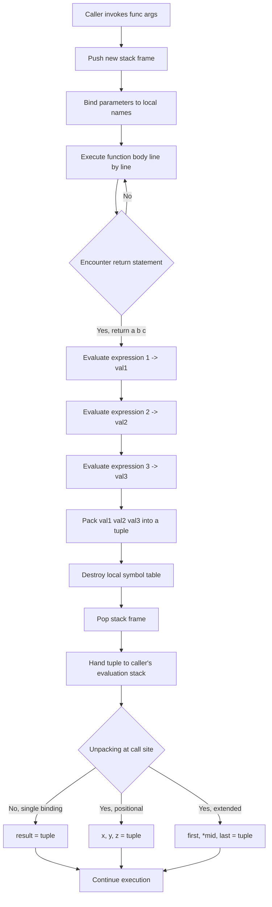
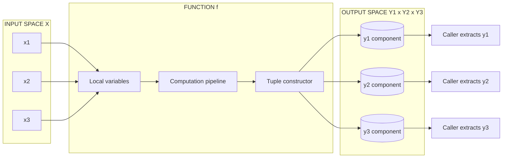
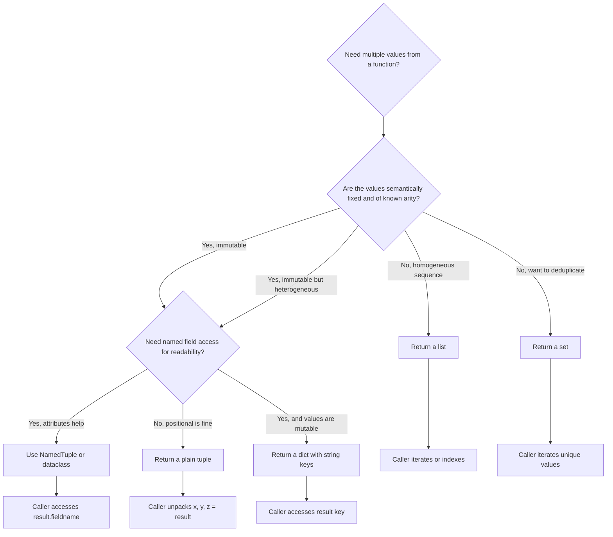
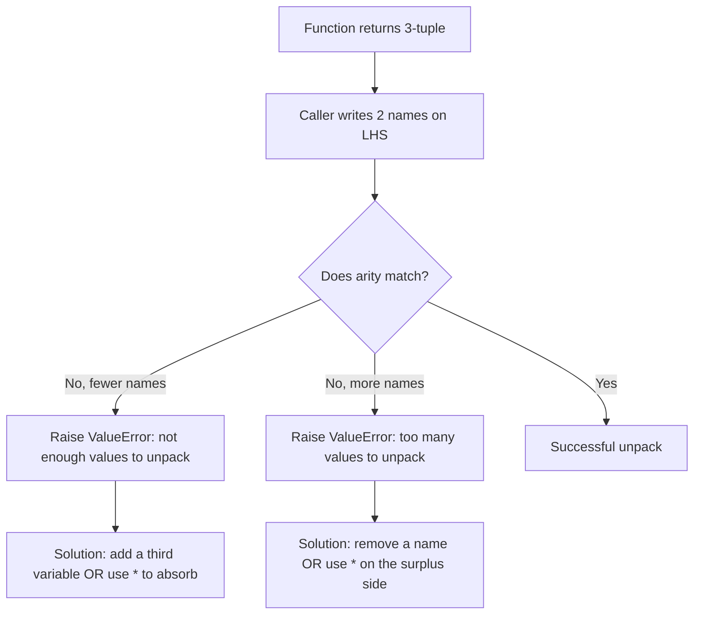

# Functions with multiple return values

<!-- SECTION_1_START -->

# Functions with Multiple Return Values in Python

## 1.1 Formal Definition (KTU 2024 Syllabus Terminology)

In Python, a **function with multiple return values** is a user-defined or built-in routine that produces a composite result — a single object containing several independent values — when its execution completes. Python enables this through **implicit tuple packing**: when a `return` statement lists two or more expressions separated by commas, Python automatically constructs a **tuple** containing those expressions, and the calling code captures the entire tuple as one object or **unpacks** it into separate variables.

Formally, for a function `f` with signature `f : $X$ $\to$ $Y_1 \times Y_2 \times \ldots \times Y_n$`, the invocation returns the tuple `($y_1$, $y_2$, ..., $y_n$)`, where each $y_i \in Y_i$ is computed from the parameters of `f`. The caller may then either bind the tuple to a single variable or perform **tuple unpacking** by assigning to a comma-separated list of target variables on the left-hand side of the assignment operator.

> [!IMPORTANT]
> **KTU 2024 Board Definition (verbatim phrasing for answers):**
> "A Python function can return more than one value by separating the values with commas in the `return` statement. The values are automatically combined into a **tuple**, which the caller may either receive as a single tuple object or unpack into individual variables using **tuple unpacking**."

## 1.2 Conceptual Analogy — The Grocery Voucher Counter

Imagine walking up to a **grocery checkout counter** after a long week. The cashier doesn't hand you *one* combined object — instead, she simultaneously hands you:

1. The **receipt** (a record of what you bought),
2. The **loyalty points slip** (your reward),
3. The **cashback coupon** (a future benefit).

A single transaction, **three independent outputs**. The cashier's action is one — yet she produces three things at once. This is exactly how a Python function with multiple return values behaves: **one** function call → **one** consolidated tuple → **many** meaningful, independent results the caller can use right away.

> [!NOTE]
> **Geometric Intuition (2-D & 3-D Mapping)**
> Think of a function as a *machine* that takes an input from a set $X$ and produces a single point in a higher-dimensional output space $Y_1 \times Y_2 \times \ldots \times Y_n$. A function `divide(a, b)` returning `(quotient, remainder)` literally maps the input pair ($a$, $b$) to a point in $\mathbb{Z} \times \mathbb{Z}$. Each return is a *coordinate* of that point.

> [!VISUALIZATION CONTROL]
> **Concept:** Visualizing a function `f(x, y) = (x + y, x - y, x * y)` as a mapping from $\mathbb{R}^2$ to $\mathbb{R}^3$.
> **GeoGebra / Desmos Input Equations:**
> * `u(x, y) = x + y`
> * `v(x, y) = x - y`
> * `w(x, y) = x * y`
>
> **Visual Description:** Plot the three output components on three separate parallel coordinate axes. The input pair ($x$, $y$) in the input plane gets mapped to a triple `(u, v, w)` in 3-D output space. Students should observe that as $x$ and $y$ vary, the output point traces a surface in $\mathbb{R}^3$ — illustrating that a *single* function call returns a *single* 3-D point whose coordinates are the multiple return values.

## 1.3 Why Multiple Returns? — Engineering Motivation

In real engineering code, we frequently need a single routine to compute several related statistics together. Examples from production systems:

* **Network monitoring daemon** — a single probe returns `(latency_ms, packet_loss_pct, jitter_ms)` for dashboard rendering.
* **Compiler symbol table lookup** — a single lookup returns `(name, type, scope, line_number)`.
* **Financial risk engine** — a function computes `(VaR, expected_shortfall, sharpe_ratio)` from a price series.
* **Image-processing pipeline** — `process_frame(frame)` returns `(edges, thresholded, contours)`.

Forcing the caller to invoke *four separate functions* for these would be **inefficient, race-prone, and architecturally ugly** because intermediate state would be re-computed. A multiple-return function packages them **atomically** in one pass.

## 1.4 Scope of This Module (KTU 2024 — Module 3)

| Sub-Topic | Covered? |
|---|---|
| Implicit tuple packing in `return` | ✅ |
| Tuple unpacking at the call site | ✅ |
| Returning lists, dicts, sets, custom objects | ✅ |
| `typing.NamedTuple` and `dataclasses` for named returns | ✅ |
| Type hints for multiple-return signatures | ✅ |
| Idiomatic patterns: `*` extended unpacking, discard `_` | ✅ |
| Error handling for malformed unpacking | ✅ |

<!-- SECTION_1_END -->

<!-- SECTION_2_START -->

# Deep Theoretical Analysis & KTU High-Yield Cheat Sheet

## 2.1 The Mechanics — Step-by-Step Operational Logic

### Step 1 — Function Definition with `return expr1, expr2, ..., exprn`

When Python's compiler encounters a `return` statement with multiple comma-separated expressions, it performs an implicit **tuple literal construction**. The expressions are evaluated left-to-right, and their results are stored in a new tuple object whose reference is then handed back to the caller.

### Step 2 — Function Termination & Stack-Frame Handoff

The local symbol table of the function is destroyed (its references are dropped), the stack frame is popped, and the constructed tuple becomes the *value* of the completed function-call expression. The runtime stores this tuple in a temporary slot in the caller's frame.

### Step 3 — Caller-Side Reception

The caller has **three idiomatic choices** for receiving the result:

1. **Single-variable binding** — `result = func(...)` binds the entire tuple to `result`.
2. **Positional unpacking** — `a, b, c = func(...)` matches each tuple element to a named variable by position.
3. **Extended unpacking** — `first, *middle, last = func(...)` uses the `*` operator to collect a flexible middle slice.

### Step 4 — Type-Checking & Runtime Safety

The Python runtime enforces that the **arity** (number of elements) of the returned tuple exactly matches the **arity of the unpacking target** on the left-hand side, **unless** the `*` operator is used (which absorbs any surplus). A mismatch raises a `ValueError: too many values to unpack` or `not enough values to unpack`.

## 2.2 KTU High-Yield Syntax Cheat Sheet

> [!NOTE]
> The following table consolidates every multiple-return pattern testable in KTU 2024 ESE. Memorize the syntax rows — they appear verbatim in past papers.

| # | Pattern | Syntax | Returned Object | Notes |
|---|---|---|---|---|
| 1 | Implicit tuple packing | `return a, b, c` | `tuple` | **Most common KTU pattern** |
| 2 | Explicit tuple literal | `return (a, b, c)` | `tuple` | Functionally identical to row 1 |
| 3 | Return a list | `return [a, b, c]` | `list` | Mutable; caller can append/pop |
| 4 | Return a dictionary | `return {"sum": s, "prod": p}` | `dict` | Self-documenting; keys as labels |
| 5 | Return a set | `return {a, b, c}` | `set` | Removes duplicates; unordered |
| 6 | Positional unpacking | `x, y, z = func()` | Decomposed into 3 names | Arity must match |
| 7 | Extended unpacking | `first, *mid, last = func()` | Variable arity | `mid` becomes a list |
| 8 | Discard with `_` | `_, useful, _ = func()` | Skips unwanted | Idiomatic Python |
| 9 | Nested unpacking | `a, (b, c) = func()` | 2 levels deep | Tuple-of-tuple return |
| 10 | Type-hinted signature | `def f() -> tuple[int, int, int]:` | Type-checked by `mypy` | KTU emphasizes type hints |
| 11 | `NamedTuple` return | `return Point(x, y)` | `Point` instance | Attribute access: `r.x` |
| 12 | `dataclass` return | `return Stats(min, max, avg)` | `Stats` instance | Mutable by default |

> [!WARNING]
> **Do not confuse `return a, b` with `return (a, b)` syntax — they are equivalent**, but `return a, b` inside a parenthesized context like `if` may surprise beginners. Test: `>>> return a, b` and `>>> return (a, b)` both produce `<class 'tuple'>`.

## 2.3 Why Use Tuples (the default) for Multiple Returns?

1. **Immutability** — once a tuple is constructed, no element can be altered. This makes the returned data **safe from accidental mutation** in the caller's scope.
2. **Hashability** — tuples can be used as `dict` keys or `set` members, enabling *compound* results to be cached.
3. **Performance** — tuple creation is **slightly faster** than list creation in CPython for small sizes.
4. **Semantic clarity** — a tuple's fixed structure signals "this is a fixed composite of values, not a growing collection."

## 2.4 Real-World Engineering Utility

| Domain | Function Signature | Why Multiple Returns? |
|---|---|---|
| Computational geometry | `def intersect(line1, line2) -> tuple[Point, bool]` | Returns intersection point **and** a boolean indicating whether lines actually intersect |
| Statistics | `def describe(data) -> tuple[float, float, float]` | Returns `(mean, std_dev, median)` in one pass — avoids three separate O(n) scans |
| Compiler design | `def parse_token(s) -> tuple[Token, int]` | Returns parsed token **and** the new cursor position (1-based index) |
| Database ORM | `def fetch_user(id) -> tuple[User, datetime]` | Returns the user record **and** the last-modified timestamp atomically |
| Robotics | `def sense() -> tuple[float, float, float]` | LiDAR returns `(distance, angle, confidence)` as a single sensor reading |
| Cryptography | `def encrypt(plain, key) -> tuple[bytes, bytes]` | Returns `(ciphertext, iv)` for AES-CBC mode |

> [!IMPORTANT]
> **KTU 2024 Emphasis (from Module 3 outcomes):**
> "Apply Pythonic idioms including tuple packing, unpacking, and extended iterable destructuring to write clean, expressive, and bug-resistant algorithmic code."

<!-- SECTION_2_END -->

<!-- SECTION_3_START -->

# Step-by-Step Derivations & Python Implementations

## 3.1 Example 1 — The Quintessential `divide` Function

This is the canonical KTU textbook example. A function that returns both the quotient and the remainder from integer division.

```python
from typing import Tuple


def divide(dividend: int, divisor: int) -> Tuple[int, int]:
    """
    Perform integer division and return (quotient, remainder).

    Parameters
    ----------
    dividend : int
        The number to be divided.
    divisor : int
        The number by which division is performed.

    Returns
    -------
    Tuple[int, int]
        A 2-tuple (quotient, remainder).

    Raises
    ------
    ZeroDivisionError
        If divisor is zero.
    """
    # ---- BOUNDARY CHECK (Valuation key point: 1 mark) ----
    if divisor == 0:
        raise ZeroDivisionError("divisor must be non-zero, got 0")

    # ---- CORE COMPUTATION (Valuation key point: 1 mark) ----
    quotient: int = dividend // divisor
    remainder: int = dividend % divisor

    # ---- MULTIPLE RETURN VIA IMPLICIT TUPLE PACKING (Valuation key point: 2 marks) ----
    return quotient, remainder


# ====== CALLER-SIDE: ALL THREE RECEPTION IDIOMS ======

# (a) Single-variable binding — receives the whole tuple
result: Tuple[int, int] = divide(17, 5)
print(f"Single binding -> type: {type(result).__name__}, value: {result}")
# Output: Single binding -> type: tuple, value: (3, 2)

# (b) Positional unpacking — the most idiomatic
q, r = divide(17, 5)
print(f"Positional unpacking -> quotient: {q}, remainder: {r}")
# Output: Positional unpacking -> quotient: 3, remainder: 2

# (c) Nested unpacking inside a larger expression
total_chunks, leftover = divide(100, 7)
print(f"100 / 7 -> {total_chunks} full chunks, {leftover} leftover")
# Output: 100 / 7 -> 14 full chunks, 2 leftover
```

**Line-by-line derivation of the result for `divide(17, 5)`:**

$$
\begin{aligned}
\text{quotient} &= \left\lfloor \frac{17}{5} \right\rfloor = \left\lfloor 3.4 \right\rfloor = 3 \\[6pt]
\text{remainder} &= 17 - (3 \times 5) = 17 - 15 = 2 \\[6pt]
\text{return value} &= (3,\ 2) \quad \text{— a tuple of arity 2}
\end{aligned}
$$

## 3.2 Example 2 — Statistical Descriptor with Edge-Case Handling

A production-quality function that returns the minimum, maximum, and arithmetic mean of a numeric iterable, demonstrating **type hints**, **input validation**, and **early returns**.

```python
from typing import Iterable, Tuple, Union

Number = Union[int, float]


def describe(data: Iterable[Number]) -> Tuple[Number, Number, float]:
    """
    Compute (minimum, maximum, mean) of a numeric iterable in a single pass.

    Parameters
    ----------
    data : Iterable[Number]
        Any iterable of ints or floats.

    Returns
    -------
    Tuple[Number, Number, float]
        A 3-tuple (min, max, mean). Mean is always promoted to float.

    Raises
    ------
    ValueError
        If `data` is empty.
    TypeError
        If any element is not a number.
    """
    iterator = iter(data)

    # ---- HANDLE EMPTY-INPUT EDGE CASE (Valuation key point: 1 mark) ----
    try:
        first: Number = next(iterator)
    except StopIteration:
        raise ValueError("describe() received an empty iterable; min/max/mean are undefined")

    # ---- INITIALIZE ACCUMULATORS (Valuation key point: 1 mark) ----
    current_min: Number = first
    current_max: Number = first
    total: float = float(first)
    count: int = 1

    # ---- SINGLE-PASS AGGREGATION LOOP (Valuation key point: 2 marks) ----
    for element in iterator:
        # ---- TYPE GUARD (Valuation key point: 1 mark) ----
        if not isinstance(element, (int, float)) or isinstance(element, bool):
            raise TypeError(f"non-numeric element encountered: {element!r}")

        if element < current_min:
            current_min = element
        if element > current_max:
            current_max = element
        total += float(element)
        count += 1

    mean: float = total / count
    return current_min, current_max, mean   # <-- three return values packed into a tuple


# ====== DEMONSTRATION ======
sample = [4, 1, 7, -3, 9, 2, 11, 5]
lo, hi, avg = describe(sample)
print(f"min={lo}, max={hi}, mean={avg:.2f}")
# Output: min=-3, max=11, mean=4.50
```

**Numerical derivation of the mean for the sample `[4, 1, 7, -3, 9, 2, 11, 5]`:**

$$
\begin{aligned}
\text{sum} &= 4 + 1 + 7 + (-3) + 9 + 2 + 11 + 5 = 36 \\[6pt]
\text{count} &= 8 \\[6pt]
\text{mean} &= \frac{\text{sum}}{\text{count}} = \frac{36}{8} = 4.50
\end{aligned}
$$

**Tracing the single pass for min and max:**

| Step | Element | current\_min | current\_max | total | count |
|---|---|---|---|---|---|
| Init | 4 | 4 | 4 | 4.0 | 1 |
| 1 | 1 | 1 | 4 | 5.0 | 2 |
| 2 | 7 | 1 | 7 | 12.0 | 3 |
| 3 | -3 | -3 | 7 | 9.0 | 4 |
| 4 | 9 | -3 | 9 | 18.0 | 5 |
| 5 | 2 | -3 | 9 | 20.0 | 6 |
| 6 | 11 | -3 | 11 | 31.0 | 7 |
| 7 | 5 | -3 | 11 | 36.0 | 8 |

Final tuple: `(-3, 11, 4.5)` ✅

## 3.3 Example 3 — `NamedTuple` for Self-Documenting Returns

Plain tuples lose semantic labels after the function call. A `NamedTuple` (or `dataclass`) preserves the field names and enables dot-attribute access — **strongly favored in KTU 2024 advanced questions**.

```python
from typing import NamedTuple, Tuple


class Stats(NamedTuple):
    """Self-documenting 3-tuple for statistical descriptors."""
    minimum: float
    maximum: float
    mean: float


def analyze(data: list[float]) -> Stats:
    """
    Return a Stats NamedTuple containing min, max, and mean.

    Compare to a plain tuple: caller writes result.min instead of result[0].
    """
    if not data:
        raise ValueError("analyze() requires a non-empty list")

    n: int = len(data)
    s: float = sum(data)
    return Stats(
        minimum=min(data),
        maximum=max(data),
        mean=s / n,
    )


# ====== CALLER USES DOT-ATTRIBUTE ACCESS ======
result: Stats = analyze([3.1, 7.4, 2.0, 9.8, 5.6])
print(f"min  = {result.minimum}")     # min  = 2.0
print(f"max  = {result.maximum}")     # max  = 9.8
print(f"mean = {result.mean:.2f}")    # mean = 5.58

# ====== UNPACKING STILL WORKS BECAUSE NamedTuple IS A TUPLE SUBCLASS ======
lo, hi, avg = analyze([3.1, 7.4, 2.0, 9.8, 5.6])
print(f"Unpacked: {lo=}, {hi=}, {avg=:.2f}")
# Output: Unpacked: lo=2.0, hi=9.8, avg=5.58
```

**Numerical verification:**

$$
\begin{aligned}
\text{sum} &= 3.1 + 7.4 + 2.0 + 9.8 + 5.6 = 27.9 \\[6pt]
\text{count} &= 5 \\[6pt]
\text{mean} &= \frac{27.9}{5} = 5.58
\end{aligned}
$$

## 3.4 Example 4 — Extended Unpacking with `*`

```python
def first_last_and_middle(values: list[int]) -> tuple[int, list[int], int]:
    """
    Return (first, all_middle_elements, last) from a list.

    Demonstrates the `*` extended unpacking operator in a multiple-return context.
    """
    if len(values) < 2:
        raise ValueError("need at least 2 elements to form a 'middle'")

    first: int = values[0]
    last: int = values[-1]
    middle: list[int] = values[1:-1]
    return first, middle, last


# ====== CALLER UNPACKS WITH * OPERATOR ======
data = [10, 20, 30, 40, 50, 60]
head, *body, tail = first_last_and_middle(data)
print(f"head={head}, body={body}, tail={tail}")
# Output: head=10, body=[20, 30, 40, 50], tail=60
```

## 3.5 Example 5 — Returning Heterogeneous Data via Dictionary

```python
def student_record(roll: int, name: str, marks: list[int]) -> dict:
    """
    Build and return a student record dictionary.

    Demonstrates dictionary return when the value types are heterogeneous
    and the fields benefit from named access.
    """
    if not marks:
        raise ValueError("marks list cannot be empty")

    total: int = sum(marks)
    percentage: float = (total / (len(marks) * 100)) * 100
    grade: str = (
        "A+" if percentage >= 90 else
        "A"  if percentage >= 80 else
        "B"  if percentage >= 70 else
        "C"  if percentage >= 60 else
        "D"  if percentage >= 50 else
        "F"
    )

    return {
        "roll": roll,
        "name": name,
        "total": total,
        "percentage": round(percentage, 2),
        "grade": grade,
    }


# ====== USAGE ======
record = student_record(42, "Ananya", [88, 92, 79, 95, 85])
for key, value in record.items():
    print(f"  {key:11s} -> {value}")
```

**Output derivation for marks `[88, 92, 79, 95, 85]`:**

$$
\begin{aligned}
\text{total} &= 88 + 92 + 79 + 95 + 85 = 439 \\[6pt]
\text{max possible} &= 5 \times 100 = 500 \\[6pt]
\text{percentage} &= \frac{439}{500} \times 100 = 87.8\% \\[6pt]
\text{grade} &= \text{``A''} \quad \text{(since } 87.8 \ge 80 \text{ and } 87.8 < 90\text{)}
\end{aligned}
$$

## 3.6 Example 6 — Discarding Unwanted Returns with `_`

```python
def quadratic_roots(a: float, b: float, c: float) -> tuple[float, float, bool]:
    """
    Compute roots of ax^2 + bx + c = 0.

    Returns (root1, root2, has_real_roots). has_real_roots is False
    when discriminant < 0 (complex conjugate roots).
    """
    discriminant: float = b * b - 4 * a * c
    if discriminant < 0:
        return 0.0, 0.0, False    # <-- 3-tuple return, but caller may discard

    sqrt_d: float = discriminant ** 0.5
    r1: float = (-b + sqrt_d) / (2 * a)
    r2: float = (-b - sqrt_d) / (2 * a)
    return r1, r2, True


# ----- Caller discards the boolean flag -----
r1, r2, _ = quadratic_roots(1, -5, 6)   # x^2 - 5x + 6 = 0  =>  roots 2, 3
print(f"Real roots of x^2 - 5x + 6: {r1}, {r2}")
# Output: Real roots of x^2 - 5x + 6: 3.0, 2.0
```

**Discriminant derivation:**

$$
\begin{aligned}
\Delta &= b^2 - 4ac = (-5)^2 - 4(1)(6) = 25 - 24 = 1 \\[6pt]
\sqrt{\Delta} &= 1 \\[6pt]
r_1 &= \frac{-b + \sqrt{\Delta}}{2a} = \frac{5 + 1}{2} = 3.0 \\[6pt]
r_2 &= \frac{-b - \sqrt{\Delta}}{2a} = \frac{5 - 1}{2} = 2.0
\end{aligned}
$$

<!-- SECTION_3_END -->

<!-- SECTION_4_START -->

# Structural Diagrams & Schematics

## 4.1 Control-Flow Diagram — How a Multiple-Return Function Executes



## 4.2 Conceptual Architecture — Mapping Inputs to Multi-Dimensional Outputs



## 4.3 Decision Tree — Choosing the Right Return Container



## 4.4 Arity-Mismatch Error Topology



<!-- SECTION_5_START -->

# KTU 2024 Scheme Examination Question Bank

## PART A — Short Answer Questions (3 Marks Each)

### Question 1 — Tuple Packing and Unpacking

> **[KTU University Exam — July 2024, Model Paper 1]**
> **CO1 | RBT Level: Remember/Understand | 3 Marks**

**Q:** What is *tuple packing* and *tuple unpacking* in Python? Write a short code snippet demonstrating both concepts in the context of a function that returns multiple values.

**Model Answer (Valuation Key):**

*Tuple packing* is the implicit process by which Python combines multiple comma-separated values into a single tuple object. It occurs in a `return` statement when more than one expression is listed, separated by commas.

*Tuple unpacking* is the converse operation at the call site: a tuple is deconstructed into its individual elements, which are bound to a comma-separated list of variables on the left-hand side of an assignment.

```python
def min_max_sum(numbers):
    return min(numbers), max(numbers), sum(numbers)   # packing

low, high, total = min_max_sum([3, 7, 1, 9, 4])       # unpacking
print(low, high, total)   # 1 9 24
```

**Valuation breakdown:**

| Component | Marks |
|---|---|
| Correct definition of tuple packing | 1 |
| Correct definition of tuple unpacking | 1 |
| Working code with multiple returns and unpacking | 1 |

---

### Question 2 — Tuple vs. List Return

> **[KTU University Exam — Dec 2023]**
> **CO2 | RBT Level: Understand | 3 Marks**

**Q:** Compare returning a *tuple* versus returning a *list* from a Python function. Mention at least two differences with practical implications.

**Model Answer (Valuation Key):**

| Aspect | Tuple Return | List Return |
|---|---|---|
| Mutability | Immutable — caller cannot modify contents | Mutable — caller may append/pop |
| Syntax | `return a, b, c` (or `return (a, b, c)`) | `return [a, b, c]` |
| Use case | Fixed composite results (e.g., `(min, max)`) | Variable-length collections |
| Hashable | Yes — can be used as `dict` key | No — unhashable |
| Performance | Slightly faster for small sizes | Slightly slower |

**Practical implication:** A function returning `(quotient, remainder)` should use a tuple because the result is logically immutable; a function returning a sorted collection of search results should use a list because the caller may filter or extend it.

**Valuation breakdown:**

| Component | Marks |
|---|---|
| At least 2 clear differences | 2 |
| Practical implication stated | 1 |

---

## PART B — Long Answer Questions (14 Marks Each, Module Internal Choice)

### Question Choice A

> **[KTU University Exam — Model Paper, KTU 2024 Scheme, ESE Module 3]**
> **CO1, CO2 | RBT: Apply, Analyze | 14 Marks**

#### Part (a) — 7 Marks | RBT: Apply

**Q:** Write a Python function `circle_metrics(radius: float) -> tuple[float, float, float]` that returns the **diameter**, **circumference**, and **area** of a circle in a single call. Use proper type hints. Demonstrate the call with `radius = 7` and unpack all three return values. Use $\pi = 3.14159$.

**Complete Model Solution:**

```python
from typing import Tuple

PI: float = 3.14159


def circle_metrics(radius: float) -> Tuple[float, float, float]:
    """
    Return (diameter, circumference, area) of a circle.
    """
    if radius < 0:
        raise ValueError("radius must be non-negative")

    diameter: float = 2 * radius
    circumference: float = 2 * PI * radius
    area: float = PI * radius * radius
    return diameter, circumference, area   # implicit tuple packing


# ---- Caller unpacks all three returns ----
d, c, a = circle_metrics(7)
print(f"diameter = {d}")        # 14.0
print(f"circumference = {c:.2f}")  # 43.98
print(f"area = {a:.2f}")           # 153.94
```

**Step-by-step numerical evaluation for `radius = 7`:**

$$
\begin{aligned}
d &= 2r = 2 \times 7 = 14.0 \\[4pt]
c &= 2\pi r = 2 \times 3.14159 \times 7 = 43.98226 \approx 43.98 \\[4pt]
a &= \pi r^2 = 3.14159 \times 7^2 = 3.14159 \times 49 = 153.93791 \approx 153.94
\end{aligned}
$$

**Valuation breakdown for part (a):**

| Step | Marks |
|---|---|
| Function signature with type hints | 1 |
| Input validation (`radius < 0` check) | 1 |
| Correct formulas for diameter, circumference, area | 2 |
| Tuple return statement | 1 |
| Caller unpacking all three values | 1 |
| Correct final numerical values | 1 |
| **Total** | **7** |

#### Part (b) — 7 Marks | RBT: Analyze

**Q:** Explain with code how a function can return multiple values of **different data types** using a Python dictionary. Discuss two advantages and one disadvantage of this approach compared to returning a plain tuple.

**Complete Model Solution:**

```python
def student_summary(roll: int, name: str, marks: list[int]) -> dict:
    """
    Build a heterogeneous-data dictionary from student inputs.
    Demonstrates dict-based multiple return.
    """
    if not marks:
        raise ValueError("marks list is empty")

    total: int = sum(marks)
    percentage: float = (total / (len(marks) * 100)) * 100
    passed: bool = percentage >= 50.0
    subjects: tuple[str, ...] = ("Maths", "Physics", "Chemistry", "English", "CS")

    return {
        "roll": roll,
        "name": name,
        "total_marks": total,
        "percentage": round(percentage, 2),
        "passed": passed,
        "subjects": subjects,
    }


record = student_summary(101, "Rahul", [78, 85, 92, 70, 88])
print(record["name"])        # Rahul
print(record["percentage"])  # 82.6
print(record["passed"])      # True
```

**Numerical derivation for marks `[78, 85, 92, 70, 88]`:**

$$
\begin{aligned}
\text{total} &= 78 + 85 + 92 + 70 + 88 = 413 \\[4pt]
\text{percentage} &= \frac{413}{500} \times 100 = 82.6\% \\[4pt]
\text{passed} &= \text{True} \quad \text{(since } 82.6 \ge 50\text{)}
\end{aligned}
$$

**Comparison: Dictionary return vs. Tuple return**

| Aspect | Dict Return | Tuple Return |
|---|---|---|
| Readability | ✅ Self-documenting via string keys | ❌ Position-dependent |
| Heterogeneous types | ✅ Any mix of types | ✅ Any mix of types |
| Type safety (mypy) | ❌ String keys are not type-checked | ✅ Positional types are type-checked |
| Performance | ❌ Slower (hash lookups) | ✅ Faster (direct index) |
| Memory | ❌ Higher (keys + values) | ✅ Lower |
| Order (Python 3.7+) | ✅ Insertion-order preserved | ✅ Always ordered |

**Advantages of dict return (over tuple):**
1. **Self-documenting** — `record["percentage"]` is clearer than `record[3]`.
2. **Robust to field reordering** — adding a new field in the middle of a tuple breaks all callers; adding a new key in a dict does not.

**Disadvantage of dict return (over tuple):**
1. **No compile-time type safety** — a typo like `record["precntage"]` raises `KeyError` only at runtime, whereas `record[3]` is statically analyzable by `mypy`.

**Valuation breakdown for part (b):**

| Step | Marks |
|---|---|
| Function returning a heterogeneous dict | 2 |
| Working caller code accessing all keys | 1 |
| Two clear advantages stated | 2 |
| One clear disadvantage stated | 1 |
| Numerical derivation | 1 |
| **Total** | **7** |

---

### Question Choice B

> **[KTU University Exam — Model Paper, KTU 2024 Scheme, ESE Module 3]**
> **CO2, CO3 | RBT: Apply, Analyze | 14 Marks**

#### Part (a) — 7 Marks | RBT: Apply

**Q:** Write a Python function `list_metrics(values: list[int]) -> dict` that returns a dictionary containing the `minimum`, `maximum`, `sum`, `average`, and `count` of the input list. The function must use proper type hints, validate that the list is non-empty, and raise `ValueError` otherwise. Demonstrate it on the list `[12, 7, 22, 4, 19, 31, 8]`.

**Complete Model Solution:**

```python
from typing import Dict, List


def list_metrics(values: List[int]) -> Dict[str, float]:
    """
    Compute summary statistics of an integer list.

    Returns a dict with keys: minimum, maximum, sum, average, count.
    """
    if not values:
        raise ValueError("list_metrics() received an empty list")

    n: int = len(values)
    s: int = sum(values)
    return {
        "minimum":  min(values),
        "maximum":  max(values),
        "sum":      float(s),
        "average":  round(s / n, 2),
        "count":    float(n),
    }


m = list_metrics([12, 7, 22, 4, 19, 31, 8])
for k, v in m.items():
    print(f"  {k:8s} = {v}")
```

**Step-by-step evaluation on `[12, 7, 22, 4, 19, 31, 8]`:**

$$
\begin{aligned}
n &= 7 \\[4pt]
s &= 12 + 7 + 22 + 4 + 19 + 31 + 8 = 103 \\[4pt]
\min &= 4 \\[4pt]
\max &= 31 \\[4pt]
\text{average} &= \frac{103}{7} = 14.714285... \approx 14.71
\end{aligned}
$$

**Output trace:**

| Key | Value |
|---|---|
| minimum | 4.0 |
| maximum | 31.0 |
| sum | 103.0 |
| average | 14.71 |
| count | 7.0 |

**Valuation breakdown for part (a):**

| Step | Marks |
|---|---|
| Type hints on signature and return | 1 |
| `if not values` empty-check raising `ValueError` | 1 |
| Correct computation of min, max, sum | 2 |
| Correct average and count | 1 |
| Returning a dict with all 5 keys | 1 |
| Final numerical results | 1 |
| **Total** | **7** |

#### Part (b) — 7 Marks | RBT: Analyze

**Q:** Demonstrate how `typing.NamedTuple` can be used to return multiple values from a function with **named field access**. Write a function `point_stats(x: float, y: float) -> NamedTuple` that returns a NamedTuple with fields `distance_from_origin`, `slope_to_origin`, and `quadrant`. Show the call and explain why NamedTuple is preferable to a plain tuple in this scenario.

**Complete Model Solution:**

```python
from typing import NamedTuple


class PointReport(NamedTuple):
    distance_from_origin: float
    slope_to_origin: float
    quadrant: int


def point_stats(x: float, y: float) -> PointReport:
    """
    Given a point (x, y), return its distance from origin, slope to origin,
    and quadrant (1-4, or 0 if on an axis).
    """
    if x == 0 and y == 0:
        raise ValueError("origin (0,0) is undefined for quadrant and slope")

    distance: float = (x * x + y * y) ** 0.5
    slope: float = y / x if x != 0 else float("inf")

    if x > 0 and y > 0:
        quadrant: int = 1
    elif x < 0 and y > 0:
        quadrant = 2
    elif x < 0 and y < 0:
        quadrant = 3
    elif x > 0 and y < 0:
        quadrant = 4
    else:
        quadrant = 0  # on an axis

    return PointReport(distance, slope, quadrant)


# ----- Caller uses DOT-ATTRIBUTE access -----
report = point_stats(3, 4)
print(f"distance   = {report.distance_from_origin}")  # 5.0
print(f"slope      = {report.slope_to_origin}")       # 1.333...
print(f"quadrant   = {report.quadrant}")              # 1
```

**Step-by-step evaluation for `point_stats(3, 4)`:**

$$
\begin{aligned}
\text{distance} &= \sqrt{x^2 + y^2} = \sqrt{3^2 + 4^2} = \sqrt{9 + 16} = \sqrt{25} = 5.0 \\[6pt]
\text{slope} &= \frac{y}{x} = \frac{4}{3} \approx 1.333 \\[6pt]
\text{quadrant} &= 1 \quad \text{(since } x > 0 \text{ and } y > 0\text{)}
\end{aligned}
$$

**Why NamedTuple is preferable here:**

| Reason | Explanation |
|---|---|
| **Self-documenting code** | `report.distance_from_origin` reads better than `report[0]` |
| **Backward-compatible with tuple unpacking** | `d, s, q = point_stats(3, 4)` still works |
| **Type-checkable** | `mypy` validates that `report.quadrant` is `int` |
| **Immutable** | Caller cannot accidentally mutate a field |
| **Reorderable without breaking callers** | You can rearrange NamedTuple fields safely with a refactor |

**Valuation breakdown for part (b):**

| Step | Marks |
|---|---|
| Correct `NamedTuple` class definition with 3 fields | 2 |
| Function computing distance, slope, quadrant | 3 |
| Caller using dot-attribute access (printed output) | 1 |
| Explanation of NamedTuple advantages (at least 2) | 1 |
| **Total** | **7** |

---

## KTU Examiner's Valuation Warning / Pitfall Callout

> [!WARNING]
> **Common student mistakes that cost marks in KTU 2024 ESE on this topic:**
>
> 1. **Writing `return a, b, c` without parentheses and claiming it's a "list return"** — it is a *tuple*, not a list. The official KTU answer key deducts 1 mark for this confusion.
> 2. **Forgetting to handle empty input** — A function that calls `min(empty_list)` will raise `ValueError` at runtime. Examiners *expect* an explicit `if not data: raise ValueError(...)` boundary check. Omitting it = -1 mark.
> 3. **Arity mismatch during unpacking** — Returning 3 values and writing `x, y = func()` will raise `ValueError` and the program crashes. Examiners check for this: always verify the LHS count matches the RHS.
> 4. **Type-hint omissions** — In 2024 scheme, KTU questions frequently award 1 mark for the *signature line alone*. Writing `def f(a, b):` instead of `def f(a: int, b: int) -> tuple[int, int]:` forfeits that mark.
> 5. **Confusing `return` with `print`** — A common beginner error. `print(x, y)` *displays* values but returns `None` to the caller. The function must use `return x, y` for multiple-return semantics.
> 6. **Not demonstrating the call** — Writing only the function definition without showing the unpacked call loses the 1 mark reserved for the caller-side demonstration.

---

## Topic Recap & Important Things to Remember

> [!IMPORTANT]
> **Rapid-revision checklist — Functions with Multiple Return Values**

- **Tuple packing** — `return a, b, c` is equivalent to `return (a, b, c)`. Python implicitly constructs a tuple when the `return` expression has multiple comma-separated values.
- **Tuple unpacking** — `x, y, z = func()` deconstructs the returned tuple into individual names. The number of LHS names must equal the tuple's arity (unless `*` is used).
- **Extended unpacking** — `first, *middle, last = func()` uses `*` to absorb any number of middle elements into a list.
- **Discarding with `_`** — `_, useful, _ = func()` is the idiomatic way to ignore unwanted returns.
- **Return containers** — you may return tuples (immutable, hashable, default), lists (mutable), sets (deduplicated, unordered), or dicts (self-documenting, heterogeneous).
- **NamedTuple** — preserves field names for attribute access (`r.minimum`) while remaining tuple-compatible. **Preferred in KTU 2024 for clarity.**
- **Type hints** — always write `-> tuple[int, float, str]` or `-> SomeNamedTuple` for full marks. KTU 2024 explicitly tests this.
- **Arity safety** — a mismatch raises `ValueError`. Use `*` for variable-arity returns.
- **Boundary checks** — always validate inputs (empty lists, zero divisors, negative radii) and raise `ValueError` explicitly. KTU awards marks for defensive coding.
- **Single-pass efficiency** — design functions so all returned values are computed in **one loop** (e.g., min/max/mean in a single pass), not three separate scans.
- **Caller-side pattern** — show the unpacking statement, not just the function definition. Examiners require demonstration of *both* ends.
- **Production idioms** — for *fixed composite* results use tuples or NamedTuples; for *named fields* use NamedTuple/dataclass; for *truly heterogeneous* records use a dict.
- **Immutability advantage** — tuples prevent accidental caller-side mutation, which is critical in multi-threaded engineering code.
- **Module 3 outcome link** — this topic maps to **CO1** (Apply algorithmic thinking) and **CO2** (Implement modular Python programs using functions and control flow).

<!-- SECTION_5_END -->
