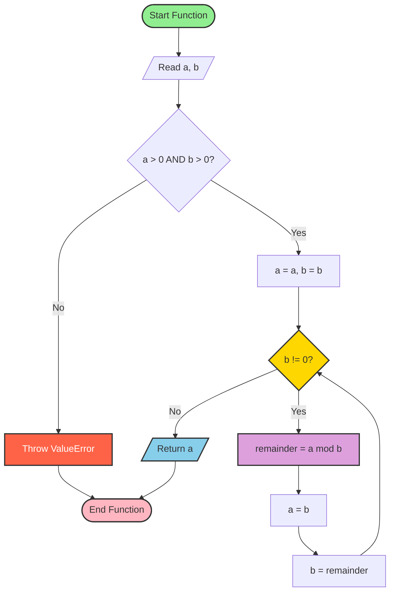
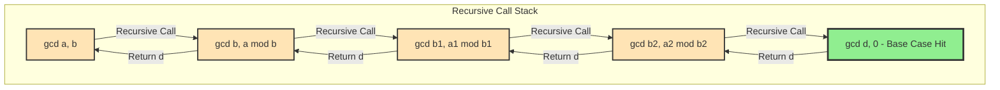
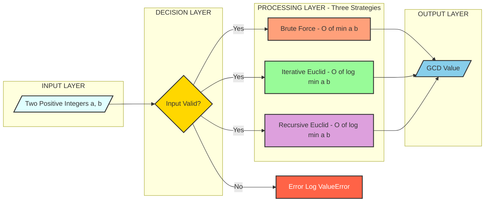

# greatest common divisor of two positive integers

<!-- SECTION_1_START -->
# Greatest Common Divisor (GCD) of Two Positive Integers

## 1.1 Formal Academic Definition

> [!NOTE]
> **GCD Definition (KTU 2024 Module 3 Terminology):**
> The **Greatest Common Divisor (GCD)** of two positive integers $a$ and $b$, denoted as $\gcd(a, b)$, is the **largest positive integer** $d$ such that $d$ divides both $a$ and $b$ without leaving a remainder. Formally:
> $$\gcd(a, b) = \max \{ d \in \mathbb{Z}^{+} : d \mid a \text{ and } d \mid b \}$$

Where the symbol $\mid$ denotes the divisibility operator. The value of $d$ must satisfy the divisibility condition $a \bmod d = 0$ **and** $b \bmod d = 0$ simultaneously.

> [!IMPORTANT]
> **Co-prime Relationship (KTU High-Yield Concept):**
> Two numbers $a$ and $b$ are said to be **co-prime** (or relatively prime) if and only if $\gcd(a, b) = 1$. This relationship is fundamental in modular arithmetic, RSA encryption, and computational number theory algorithms.

## 1.2 Intuitive Real-World Analogy

Imagine you have a classroom of students. You want to arrange them into **square grids** for a physical training drill. You have two groups — say **24 students** and **36 students**. The question is: *What is the largest possible number of students that can fit into a perfectly square arrangement for BOTH groups independently?*

The answer is found by finding the largest number that divides both 24 and 36 perfectly. That magic number is **12**. So $\gcd(24, 36) = 12$.

**Geometric Intuition:** If you lay tiles of size $d \times d$ on a rectangular floor of dimensions $a \times b$, the largest possible tile that perfectly tiles the floor (without cutting or overlapping) has its side length equal to $\gcd(a, b)$.

## 1.3 Mathematical Preliminaries

Before diving into the algorithm, the following mathematical primitives are essential:

- **Modulo Operator:** $a \bmod b$ returns the remainder when $a$ is divided by $b$.
- **Divisibility:** $b \mid a$ means $a$ is exactly divisible by $b$ (remainder is zero).
- **Euclid's Lemma Foundation:** $\gcd(a, b) = \gcd(b, a \bmod b)$ — this is the cornerstone reduction rule.

> [!VISUALIZATION CONTROL]
> **Concept:** Visualization of Common Divisors of 24 and 36
> **GeoGebra / Desmos Input Equations:**
> * `List1 = {1, 2, 3, 4, 6, 8, 12, 24}` (Divisors of 24)
> * `List2 = {1, 2, 3, 4, 6, 9, 12, 18, 36}` (Divisors of 36)
> * `Intersection = {1, 2, 3, 4, 6, 12}` → `Max(Intersection) = 12`
> **Visual Description:** A Venn diagram of divisors of 24 and 36. The overlapping region contains the common divisors {1, 2, 3, 4, 6, 12}. The maximum element in the intersection is the GCD = **12**.

---

<!-- SECTION_1_END -->

<!-- SECTION_2_START -->
# Deep Theoretical Analysis & KTU High-Yield Formula Sheet

## 2.1 Algorithmic Strategies for Computing GCD

There are **three primary algorithmic strategies** commonly evaluated in KTU 2024 Scheme examinations for computing the GCD of two positive integers:

### Strategy 1: Brute Force (Naive Divisor Enumeration)
Iterate from $1$ up to $\min(a, b)$ and track the maximum common divisor encountered.

### Strategy 2: Iterative Euclidean Algorithm
Repeatedly apply the reduction rule $\gcd(a, b) = \gcd(b, a \bmod b)$ until the remainder becomes **0**. The last non-zero remainder is the GCD.

### Strategy 3: Recursive Euclidean Algorithm
A direct recursive formulation of the Euclidean algorithm using the function call stack.

## 2.2 Core Mathematical Properties (High-Yield for KTU)

> [!IMPORTANT]
> The following properties are **frequently tested** in KTU Module 3 examinations:
> 1. **Identity Property:** $\gcd(a, 0) = a$
> 2. **Commutative Property:** $\gcd(a, b) = \gcd(b, a)$
> 3. **Associative Property:** $\gcd(a, \gcd(b, c)) = \gcd(\gcd(a, b), c)$
> 4. **Reduction Rule (Euclid's Key Insight):** $\gcd(a, b) = \gcd(b, a \bmod b)$ when $b \neq 0$
> 5. **Bezout's Identity:** $\gcd(a, b)$ can always be expressed as a linear combination $ax + by$ for some integers $x$ and $y$.
> 6. **Divisor Bound:** $1 \leq \gcd(a, b) \leq \min(a, b)$ for positive integers.

## 2.3 KTU Formula Sheet / Cheat Sheet

| **Formula / Property** | **Mathematical Expression** | **Use Case** | **Computational Complexity** |
| :--- | :--- | :--- | :---: |
| Brute Force GCD | $\max \{ d : d \mid a \text{ and } d \mid b \}$ | Direct enumeration up to $\min(a, b)$ | $O(\min(a, b))$ |
| Euclidean Reduction | $\gcd(a, b) = \gcd(b, a \bmod b)$ | Repeatedly reduce until remainder is 0 | $O(\log(\min(a, b)))$ |
| Base Case (Recursive) | $\gcd(a, 0) = a$ | Termination condition for recursion | Constant |
| LCM-GCD Relationship | $\text{lcm}(a, b) = \dfrac{a \cdot b}{\gcd(a, b)}$ | Computing LCM once GCD is known | $O(\log(\min(a, b)))$ |
| Co-prime Condition | $\gcd(a, b) = 1 \Leftrightarrow a, b$ co-prime | Modular inverse existence test | $O(\log(\min(a, b)))$ |
| Bézout's Identity | $\gcd(a, b) = ax + by$ for some $x, y \in \mathbb{Z}$ | Extended Euclidean Algorithm | $O(\log(\min(a, b)))$ |

## 2.4 Real-World Engineering Applications

> [!NOTE]
> **Production Engineering Use Cases of GCD Algorithms:**
> - **Cryptography (RSA):** GCD is used to verify if a public exponent $e$ is co-prime to $\phi(n)$, ensuring the existence of a modular inverse.
> - **Data Compression:** Lossless compression algorithms use GCD-based pattern detection to identify repeating cycles.
> - **Image Processing:** GCD determines optimal scaling factors for resizing images without distortion.
> - **Network Synchronization:** GCD helps compute minimum sync cycles for periodic data packets in real-time systems.
> - **Compiler Design:** Used in register allocation and loop optimization (e.g., determining minimum loop unroll factors).
> - **CAD/CAM Engineering:** Computing common gear tooth counts and mechanical coupling dimensions.

---

<!-- SECTION_2_END -->

<!-- SECTION_3_START -->
# Step-by-Step Derivations & Python Code Implementation

## 3.1 Approach 1: Brute Force Algorithm (Naive Enumeration)

### 3.1.1 Algorithmic Logic (Step-by-Step)

1. **Input:** Accept two positive integers $a$ and $b$.
2. **Initialize:** Set $\text{limit} = \min(a, b)$ and $\text{gcd\_value} = 0$.
3. **Iterate:** Loop variable $i$ from $1$ to $\text{limit}$ (inclusive).
4. **Divisibility Check:** If $a \bmod i = 0$ **and** $b \bmod i = 0$, then update $\text{gcd\_value} = i$.
5. **Termination:** After the loop ends, return $\text{gcd\_value}$.

### 3.1.2 Complete Python Implementation

```python
def gcd_brute_force(a: int, b: int) -> int:
    """
    Computes the Greatest Common Divisor of two positive integers
    using naive brute-force enumeration.

    Parameters:
        a (int): First positive integer.
        b (int): Second positive integer.

    Returns:
        int: The GCD of a and b.

    Raises:
        ValueError: If either a or b is not a positive integer.
    """
    # --- Step 1: Input validation with strict boundary checks ---
    if not isinstance(a, int) or not isinstance(b, int):
        raise TypeError("Both inputs must be integers.")
    if a <= 0 or b <= 0:
        raise ValueError("Both inputs must be POSITIVE integers (a > 0, b > 0).")

    # --- Step 2: Determine the iteration boundary ---
    limit: int = min(a, b)
    gcd_value: int = 0

    # --- Step 3: Brute force loop from 1 up to limit ---
    for i in range(1, limit + 1):
        # --- Step 4: Divisibility test on BOTH numbers ---
        if (a % i == 0) and (b % i == 0):
            gcd_value = i  # Update running maximum

    # --- Step 5: Return the final GCD ---
    return gcd_value


# --- Driver Code for Testing ---
if __name__ == "__main__":
    try:
        a_input: int = int(input("Enter the first positive integer: "))
        b_input: int = int(input("Enter the second positive integer: "))
        result: int = gcd_brute_force(a_input, b_input)
        print(f"The GCD of {a_input} and {b_input} is: {result}")
    except (ValueError, TypeError) as error:
        print(f"Input Error Log: {error}")
```

## 3.2 Approach 2: Iterative Euclidean Algorithm (Efficient & KTU Preferred)

### 3.2.1 Algorithmic Logic (Step-by-Step)

1. **Input:** Accept two positive integers $a$ and $b$.
2. **Swap if Necessary:** Ensure $a \geq b$ (optional, since the modulus operator handles this).
3. **Loop:** While $b \neq 0$:
   - Compute $\text{remainder} = a \bmod b$.
   - Update $a = b$.
   - Update $b = \text{remainder}$.
4. **Termination:** When $b = 0$, return $a$.

### 3.2.2 Worked Numerical Example (Trace for a = 48, b = 18)

| **Iteration** | $a$ | $b$ | $a \bmod b$ | Updated $a$ | Updated $b$ |
| :---: | :---: | :---: | :---: | :---: | :---: |
| 1 | 48 | 18 | $48 \bmod 18 = 12$ | 18 | 12 |
| 2 | 18 | 12 | $18 \bmod 12 = 6$ | 12 | 6 |
| 3 | 12 | 6 | $12 \bmod 6 = 0$ | 6 | 0 |

**Result:** Loop terminates when $b = 0$. Return $a = \mathbf{6}$. Therefore, $\gcd(48, 18) = 6$.

### 3.2.3 Complete Python Implementation

```python
def gcd_euclidean_iterative(a: int, b: int) -> int:
    """
    Computes the GCD of two positive integers using the
    iterative Euclidean algorithm.

    Parameters:
        a (int): First positive integer.
        b (int): Second positive integer.

    Returns:
        int: The GCD of a and b.
    """
    # --- Step 1: Input validation ---
    if not isinstance(a, int) or not isinstance(b, int):
        raise TypeError("Both inputs must be integers.")
    if a <= 0 or b <= 0:
        raise ValueError("Both inputs must be POSITIVE integers.")

    # --- Step 2: Iterative Euclidean loop ---
    while b != 0:
        remainder: int = a % b  # Compute a mod b
        a = b                    # Shift b into a
        b = remainder            # Shift remainder into b

    # --- Step 3: When b becomes 0, a holds the GCD ---
    return a


# --- Driver Code ---
if __name__ == "__main__":
    try:
        x: int = int(input("Enter first positive integer: "))
        y: int = int(input("Enter second positive integer: "))
        result: int = gcd_euclidean_iterative(x, y)
        print(f"GCD of {x} and {y} = {result}")
    except (ValueError, TypeError) as err:
        print(f"Error: {err}")
```

## 3.3 Approach 3: Recursive Euclidean Algorithm

### 3.3.1 Algorithmic Logic (Step-by-Step)

1. **Base Case:** If $b = 0$, return $a$.
2. **Recursive Case:** Return $\gcd(b, a \bmod b)$.

### 3.3.2 Recursive Tree for a = 48, b = 18

$$\begin{aligned}
\gcd(48, 18) &\rightarrow \gcd(18, 48 \bmod 18) = \gcd(18, 12) \\
\gcd(18, 12) &\rightarrow \gcd(12, 18 \bmod 12) = \gcd(12, 6) \\
\gcd(12, 6) &\rightarrow \gcd(6, 12 \bmod 6) = \gcd(6, 0) \\
\gcd(6, 0) &\rightarrow \text{Base case hit. Return } 6
\end{aligned}$$

### 3.3.3 Complete Python Implementation

```python
def gcd_euclidean_recursive(a: int, b: int) -> int:
    """
    Computes the GCD of two positive integers using recursion.

    Parameters:
        a (int): First positive integer.
        b (int): Second positive integer.

    Returns:
        int: The GCD of a and b.
    """
    # --- Step 1: Input validation ---
    if not isinstance(a, int) or not isinstance(b, int):
        raise TypeError("Both inputs must be integers.")
    if a <= 0 or b <= 0:
        raise ValueError("Both inputs must be POSITIVE integers.")

    # --- Step 2: Base case (termination condition) ---
    if b == 0:
        return a

    # --- Step 3: Recursive case (Euclidean reduction) ---
    return gcd_euclidean_recursive(b, a % b)


# --- Driver Code ---
if __name__ == "__main__":
    try:
        num1: int = int(input("Enter first positive integer: "))
        num2: int = int(input("Enter second positive integer: "))
        result: int = gcd_euclidean_recursive(num1, num2)
        print(f"GCD of {num1} and {num2} = {result}")
    except (ValueError, TypeError) as e:
        print(f"Error: {e}")
```

## 3.4 Approach 4: Using Python's Built-in `math.gcd()`

Python's standard library provides a highly optimized, C-implemented GCD function.

```python
import math

def gcd_builtin(a: int, b: int) -> int:
    """
    Computes GCD using Python's built-in math.gcd().

    Note: math.gcd(0, 0) returns 0 by Python convention.
    """
    if a <= 0 or b <= 0:
        raise ValueError("Inputs must be positive integers.")
    return math.gcd(a, b)


# --- Comparative Driver Code ---
if __name__ == "__main__":
    test_pairs = [(48, 18), (100, 75), (17, 13), (24, 36)]
    print(f"{'a':>5} | {'b':>5} | {'GCD':>5}")
    print("-" * 25)
    for a, b in test_pairs:
        print(f"{a:>5} | {b:>5} | {gcd_builtin(a, b):>5}")
```

## 3.5 Comparative Performance Analysis

| **Algorithm** | **Time Complexity** | **Space Complexity** | **Best Use Case** |
| :--- | :---: | :---: | :--- |
| Brute Force | $O(\min(a, b))$ | $O(1)$ | Small inputs, teaching purposes |
| Iterative Euclidean | $O(\log(\min(a, b)))$ | $O(1)$ | Production code, large inputs |
| Recursive Euclidean | $O(\log(\min(a, b)))$ | $O(\log(\min(a, b)))$ stack space | Elegant mathematical expression |
| Python `math.gcd` | $O(\log(\min(a, b)))$ | $O(1)$ | Most practical Python use case |

---

<!-- SECTION_3_END -->

<!-- SECTION_4_START -->
# Structural Diagrams & Schematics

## 4.1 Mermaid Flowchart: Iterative Euclidean Algorithm Control Flow



## 4.2 Mermaid Flowchart: Recursive Euclidean Algorithm Call Stack



## 4.3 Mermaid Block Diagram: GCD Algorithm Selection Topology



---

<!-- SECTION_4_END -->

<!-- SECTION_5_START -->
# KTU 2024 Scheme Examination Question Bank & Topic Recap

## 5.1 Part A: Short Answer Questions (3 Marks Each)

> [!NOTE]
> **Model Answer Reference Standard:** KTU Board Examiner evaluation pattern — 1 mark for definition, 1 mark for explanation/logic, 1 mark for example/diagram.

---

### Question 1 `[KTU University Exam - Dec 2023]` — **CO1, Remember/Understand**

**Define Greatest Common Divisor (GCD) of two positive integers. State any three mathematical properties of GCD.**

**Model Answer (3 Marks):**

> [!NOTE]
> **Definition (1 Mark):** The GCD of two positive integers $a$ and $b$, denoted $\gcd(a, b)$, is the largest positive integer that divides both $a$ and $b$ without leaving a remainder. Mathematically:
> $$\gcd(a, b) = \max \{ d \in \mathbb{Z}^{+} : d \mid a \text{ and } d \mid b \}$$
> **Three Properties (1.5 Marks - 0.5 each):**
> 1. **Identity Property:** $\gcd(a, 0) = a$
> 2. **Commutative Property:** $\gcd(a, b) = \gcd(b, a)$
> 3. **Euclidean Reduction Rule:** $\gcd(a, b) = \gcd(b, a \bmod b)$
> **Example (0.5 Marks):** $\gcd(24, 36) = 12$ since the common divisors of 24 and 36 are {1, 2, 3, 4, 6, 12}, and 12 is the largest.

---

### Question 2 `[KTU University Exam - July 2024]` — **CO2, Understand**

**Explain the Euclidean algorithm for computing the GCD. How is it more efficient than the brute-force method?**

**Model Answer (3 Marks):**

> [!NOTE]
> **Algorithm Explanation (1.5 Marks):** The Euclidean algorithm computes the GCD by repeatedly applying the reduction rule $\gcd(a, b) = \gcd(b, a \bmod b)$ until the second argument becomes zero. The last non-zero value is the GCD. **Example trace:** $\gcd(48, 18) \to \gcd(18, 12) \to \gcd(12, 6) \to \gcd(6, 0) = 6$.
> **Efficiency Comparison (1.5 Marks):** The brute-force method has time complexity $O(\min(a, b))$ as it checks every integer up to the smaller input. The Euclidean algorithm has time complexity $O(\log(\min(a, b)))$, making it exponentially faster. For instance, computing $\gcd(10^9, 10^9 - 1)$ takes millions of iterations via brute force but fewer than 30 iterations via Euclidean.

---

## 5.2 Part B: Full-Length Questions (14 Marks Each - Internal Choice)

> [!IMPORTANT]
> **KTU 2024 Pattern:** Part B questions carry **14 marks**, typically split as **(a) 7 marks** and **(b) 7 marks**. The internal choice requires students to answer EITHER Option A OR Option B in full.

---

### Question A (14 Marks) `[KTU University Exam - Dec 2024]` — **CO1, CO2, CO3 — Apply / Analyze**

**(a)** Write a Python function `gcd_iter(a, b)` that computes the GCD of two positive integers using the **iterative Euclidean algorithm**. Include proper input validation. **\[7 Marks\]**

**(b)** Write a Python function `gcd_recur(a, b)` that computes the GCD using the **recursive Euclidean algorithm**. Trace the function call stack for `gcd_recur(48, 18)`. **\[7 Marks\]**

#### Model Solution:

**Part (a) — Iterative Implementation (7 Marks):**

```python
def gcd_iter(a: int, b: int) -> int:
    # [Input validation: 2 Marks]
    if a <= 0 or b <= 0:
        raise ValueError("Both numbers must be positive integers.")

    # [Loop initialization: 1 Mark]
    while b != 0:
        # [Core Euclidean reduction logic: 3 Marks]
        remainder = a % b
        a = b
        b = remainder

    # [Return statement: 1 Mark]
    return a
```

**Valuation Key Points:**
- `[Input validation: 2 Marks]`
- `[Correct while loop condition: 1 Mark]`
- `[Correct modulo operation and variable updates: 3 Marks]`
- `[Return statement: 1 Mark]`

**Part (b) — Recursive Implementation with Trace (7 Marks):**

```python
def gcd_recur(a: int, b: int) -> int:
    # [Input validation: 1 Mark]
    if a <= 0 or b <= 0:
        raise ValueError("Both numbers must be positive integers.")

    # [Base case: 1 Mark]
    if b == 0:
        return a

    # [Recursive case: 1 Mark]
    return gcd_recur(b, a % b)
```

**Call Stack Trace for `gcd_recur(48, 18)` (4 Marks):**

| **Recursive Call** | **$a$** | **$b$** | **$a \bmod b$** | **Returned Value** |
| :---: | :---: | :---: | :---: | :---: |
| `gcd_recur(48, 18)` | 48 | 18 | $48 \bmod 18 = 12$ | Recursive call |
| `gcd_recur(18, 12)` | 18 | 12 | $18 \bmod 12 = 6$ | Recursive call |
| `gcd_recur(12, 6)` | 12 | 6 | $12 \bmod 6 = 0$ | Recursive call |
| `gcd_recur(6, 0)` | 6 | 0 | N/A (Base case) | **6** |

**Final Result:** $\gcd(48, 18) = \mathbf{6}$

**Valuation Key Points:**
- `[Function structure with base case: 2 Marks]`
- `[Recursive call correctness: 1 Mark]`
- `[Complete call stack trace: 4 Marks]`

---

### Question B (14 Marks — Alternative Choice) `[KTU University Exam - July 2024]` — **CO1, CO2, CO3 — Apply / Analyze**

**(a)** Write a Python function `gcd_brute(a, b)` that computes the GCD using the **brute-force method** of enumerating all common divisors. **\[7 Marks\]**

**(b)** Write a Python program that reads two positive integers from the user, computes their GCD using **any method**, and also computes their **LCM** using the relationship $\text{lcm}(a, b) = \dfrac{a \cdot b}{\gcd(a, b)}$. Display both results. **\[7 Marks\]**

#### Model Solution:

**Part (a) — Brute Force GCD (7 Marks):**

```python
def gcd_brute(a: int, b: int) -> int:
    # [Input validation: 2 Marks]
    if a <= 0 or b <= 0:
        raise ValueError("Both numbers must be positive integers.")

    # [Initialize gcd_value: 1 Mark]
    gcd_value = 0

    # [For loop enumeration: 2 Marks]
    for i in range(1, min(a, b) + 1):
        # [Divisibility test: 1 Mark]
        if a % i == 0 and b % i == 0:
            gcd_value = i

    # [Return: 1 Mark]
    return gcd_value
```

**Valuation Key Points:**
- `[Input validation: 2 Marks]`
- `[Correct loop range using min(a, b): 2 Marks]`
- `[Divisibility test for both numbers: 2 Marks]`
- `[Return statement: 1 Mark]`

**Part (b) — GCD + LCM Program (7 Marks):**

```python
def gcd_calc(a: int, b: int) -> int:
    # [Helper function using Euclid: 2 Marks]
    while b != 0:
        a, b = b, a % b
    return a


def lcm_calc(a: int, b: int) -> int:
    # [LCM using formula: 2 Marks]
    return (a * b) // gcd_calc(a, b)


# [Main program: 3 Marks]
if __name__ == "__main__":
    try:
        num1 = int(input("Enter first positive integer: "))
        num2 = int(input("Enter second positive integer: "))
        if num1 <= 0 or num2 <= 0:
            raise ValueError("Inputs must be positive.")

        g = gcd_calc(num1, num2)
        l = lcm_calc(num1, num2)
        print(f"GCD of {num1} and {num2} = {g}")
        print(f"LCM of {num1} and {num2} = {l}")
    except ValueError as err:
        print(f"Error: {err}")
```

**Valuation Key Points:**
- `[GCD function implementation: 2 Marks]`
- `[LCM formula application: 2 Marks]`
- `[Input reading, validation, and formatted output: 3 Marks]`

---

## 5.3 KTU Examiner's Valuation Warning / Pitfall Callout

> [!WARNING]
> **Common Mistakes That Cause Mark Deductions in KTU Board Exams:**
> 1. **Missing input validation:** Failing to check whether $a$ and $b$ are positive integers leads to a 2-mark deduction in Part (a) questions.
> 2. **Incorrect loop termination:** Using `while b > 0` instead of `while b != 0` (or vice versa with off-by-one errors) is a frequently penalized mistake.
> 3. **Forgetting to update `a` and `b`:** In the iterative approach, students often compute `remainder = a % b` but forget the swap `a, b = b, remainder`.
> 4. **No base case in recursion:** The recursive function MUST have `if b == 0: return a` as the base case. Missing this results in `RecursionError` and full 7-mark loss.
> 5. **Confusing LCM-GCD formula:** Writing $\text{lcm}(a, b) = a \cdot b \cdot \gcd(a, b)$ (multiplication instead of division) is a classic error.
> 6. **Not stating the mathematical reduction rule:** In viva or theory questions, always write the formula $\gcd(a, b) = \gcd(b, a \bmod b)$ explicitly before writing the code.

---

## 5.4 Topic Recap & Important Things to Remember

> [!IMPORTANT]
> **Rapid Revision Checklist — GCD Algorithms (KTU Module 3):**
> - **Definition:** GCD is the largest positive integer that divides both $a$ and $b$ without remainder.
> - **Key Symbol:** $\gcd(a, b)$ — read as "GCD of $a$ and $b$".
> - **Co-prime Numbers:** $\gcd(a, b) = 1$ means $a$ and $b$ are co-prime / relatively prime.
> - **Euclidean Reduction Rule:** $\gcd(a, b) = \gcd(b, a \bmod b)$ — the **most important formula** in this module.
> - **Base Case:** $\gcd(a, 0) = a$ — this is the termination condition for both iterative and recursive approaches.
> - **Three Algorithmic Approaches:** Brute Force ($O(\min(a, b))$), Iterative Euclid ($O(\log(\min(a, b)))$), Recursive Euclid ($O(\log(\min(a, b)))$).
> - **LCM-GCD Relationship:** $\text{lcm}(a, b) \cdot \gcd(a, b) = a \cdot b$, therefore $\text{lcm}(a, b) = \dfrac{a \cdot b}{\gcd(a, b)}$.
> - **Python Built-in:** Use `import math; math.gcd(a, b)` for production-grade code.
> - **Input Validation:** Always verify $a > 0$ and $b > 0$ to comply with the "positive integers" constraint.
> - **Bézout's Identity:** $\gcd(a, b) = ax + by$ for some integers $x$ and $y$ — foundation of Extended Euclidean Algorithm.
> - **Applications:** RSA cryptography, data compression, image scaling, network packet synchronization, compiler optimization.

<!-- SECTION_5_END -->
