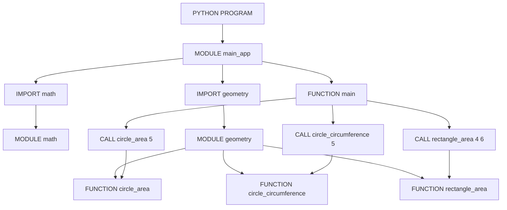
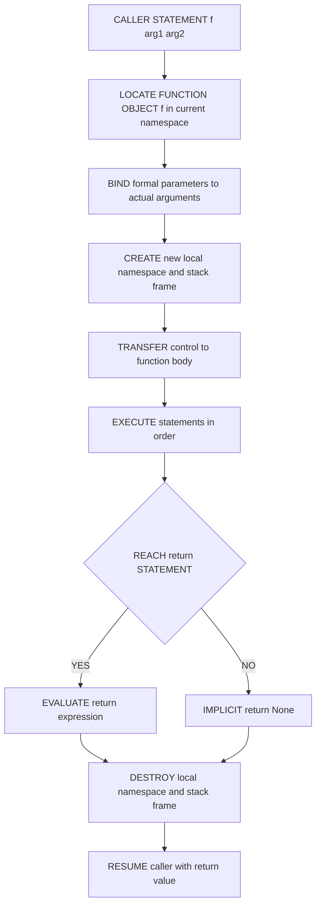
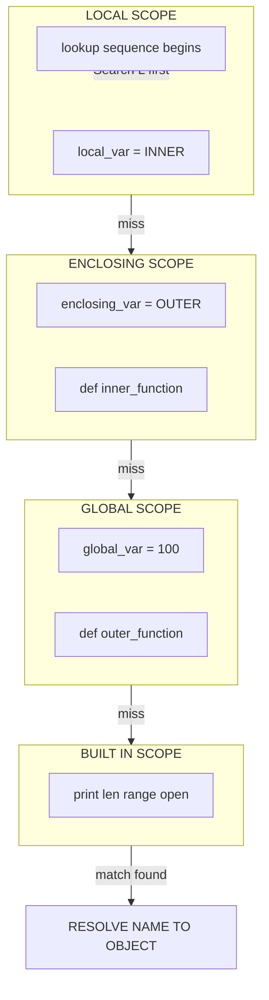
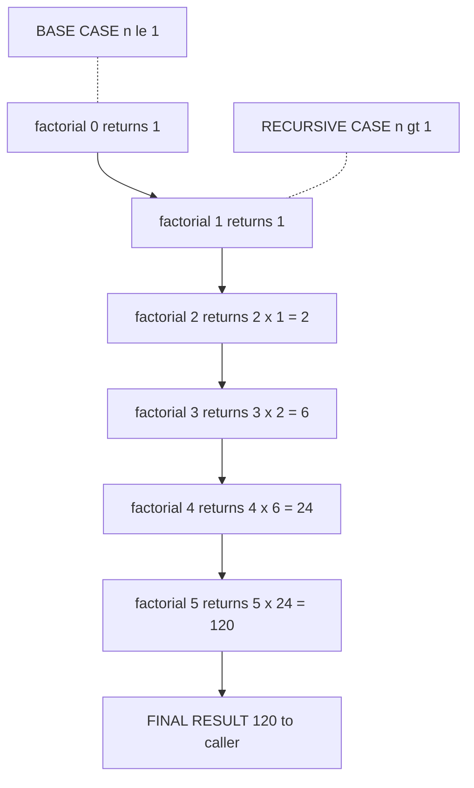
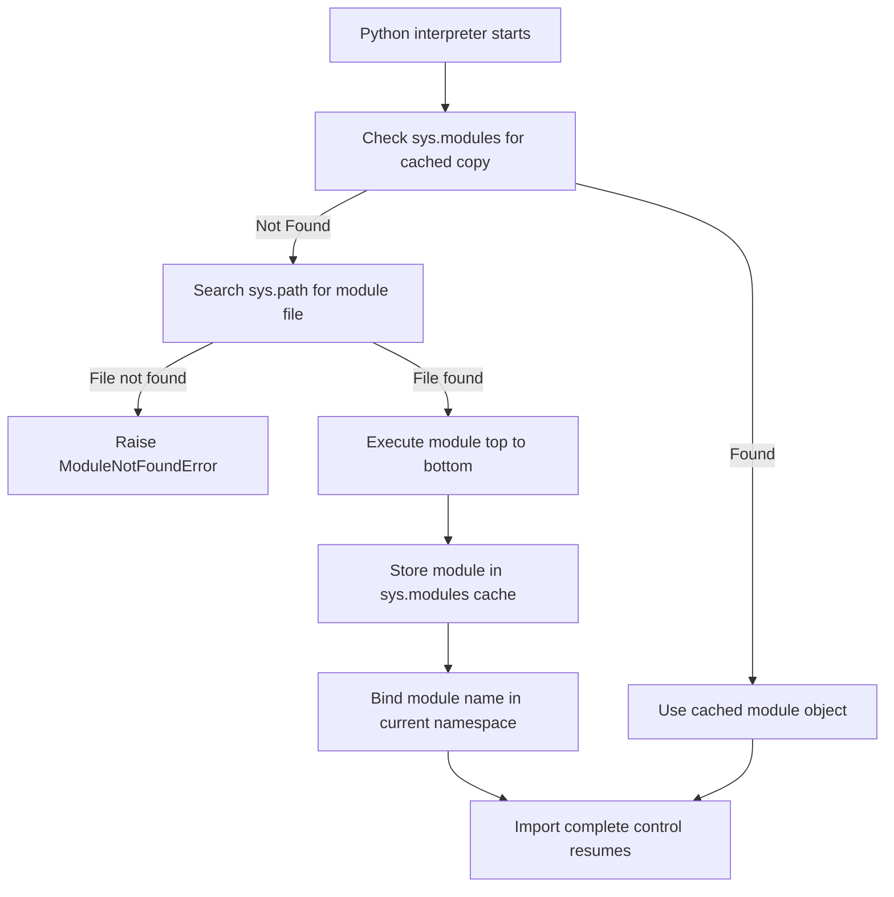

# Modularization

<!-- SECTION_1_START -->
# Modularization in Python — Foundations & Intuition

> [!NOTE]
> **KTU 2024 Scheme Definition (UCEST105 — Module 3)**
> **Modularization** is the software engineering practice of decomposing a large, monolithic program into smaller, logically independent, and reusable units called **functions** and **modules**. In Python, this is realized through `def` statements, function calls, return values, parameter passing, the `import` system, and **lambda** expressions.

> [!IMPORTANT]
> **Syllabus Anchor (UCEST105 — Module 3)**
> Modularization is the *third pillar* of structured programming (alongside **Selection** and **Iteration**). It allows the same logic to be invoked from any branch of an `if…elif…else` block or any `for`/`while` loop without rewriting the code — this is the *Single Source of Truth* principle in action.

---

## 1.1 Conceptual Analogy — The "Smart Kitchen" Model

Imagine a professional commercial kitchen. The head chef does **not** bake bread, chop onions, wash dishes, *and* plate desserts simultaneously. Instead, the kitchen is divided into specialized *stations* (the *modules*):

| Kitchen Station | Python Equivalent | Responsibility |
|---|---|---|
| Tandoor / Grill | A specific function | One well-defined task |
| Recipe Book | The module file (`.py`) | Collection of related stations |
| Waiter's Order Slip | Arguments passed at call | Input to the station |
| Plated Dish | Return value | Output of the station |
| Walk-in Refrigerator | Global scope | Shared resources |
| Counter-top bowls | Local scope | Station-specific items |

> [!TIP]
> **Intuition Hook:** A function is *not* the code itself; it is a **named, callable behaviour**. The `def` statement is like printing the recipe card — the actual cooking happens only when someone *calls* the function.

---

## 1.2 Core Vocabulary You Must Memorize

| Term | One-line Meaning | KTU Frequent Marks |
|---|---|---|
| **Function** | A named block of reusable code | Always asked (3 / 7 marks) |
| **Module** | A `.py` file containing Python definitions | Frequently asked |
| **Parameter** | Variable listed inside the `def` header | High-yield |
| **Argument** | The *actual* value supplied at call time | High-yield |
| **Return Value** | The output sent back to the caller | High-yield |
| **Scope** | The region where a name is visible | Frequently asked |
| **Recursion** | A function that calls *itself* | High-yield |
| **Lambda** | A one-line anonymous function | Frequently asked |
| **Docstring** | A string literal describing the function | Good practice mark |

> [!WARNING]
> **Common Confusions (Board-Exam Traps)**
> 1. **Parameter vs. Argument** — they are *not* synonyms. The parameter is the *placeholder*; the argument is the *real value*.
> 2. **Function definition vs. Function call** — defining a function does **not** execute it. You must explicitly call it.
> 3. **Module vs. Library vs. Package** — these three are hierarchical: a *package* contains *modules*, and a *library* is a collection of packages.

---

## 1.3 Why Modularization is Non-Negotiable in Engineering

> [!IMPORTANT]
> **Production Reality**
> Every real-world system (banking software, autonomous vehicles, ML pipelines) is built modularly. Google's TensorFlow, Python's NumPy, and even your college ERP portal are *thousands of interconnected modules*. The benefits are codified as the **DRY principle** — *Don't Repeat Yourself* — and **separation of concerns** (SoC).

**Three Engineering Benefits (must write in 14-mark answers):**
1. **Reusability** — Write once, call many times.
2. **Readability** — Each function has a clear name and single purpose.
3. **Maintainability** — A bug is fixed in *one* place, not in 50 copies.
<!-- SECTION_1_END -->

<!-- SECTION_2_START -->
# Deep Theoretical Analysis & KTU High-Yield Formula Sheet

## 2.1 The Anatomy of a Python Function

The general form of a user-defined function in Python is governed by the following specification:

$$
f \; : \; \text{Domain} \;\longrightarrow\; \text{Codomain}
$$

In Pythonic notation:

```python
def function_name(formal_parameters):
    """Docstring describing the function."""
    # body of the function
    return expression
```

### Step-by-Step Operational Logic

1. **`def` keyword** — *declares* that a function is being defined.
2. **`function_name`** — an identifier following PEP-8 snake_case rules.
3. **Parentheses `()`** — contain zero or more formal parameters.
4. **Colon `:`** — terminates the header.
5. **Indented body** — the *suite* of statements executed on call.
6. **`return`** — optional; sends a value back to the caller. A function with no `return` implicitly returns `None`.

> [!NOTE]
> **Hidden Detail:** When Python executes `def`, it creates a *function object* and binds the *name* to it in the current namespace. The body is **not executed yet**.

---

## 2.2 Argument Passing — The Five Flavours

Python supports **five** argument-passing styles, and a single 14-mark question is very often built around them.

| # | Style | Syntax in `def` | Syntax at Call | Example |
|---|---|---|---|---|
| 1 | **Positional** | `def f(a, b):` | `f(10, 20)` | $a=10,\;b=20$ |
| 2 | **Keyword** | `def f(a, b):` | `f(a=10, b=20)` | Order independent |
| 3 | **Default** | `def f(a, b=5):` | `f(10)` | $b$ defaults to $5$ |
| 4 | **Variable Positional** | `def f(*args):` | `f(1,2,3)` | `args` is a tuple |
| 5 | **Variable Keyword** | `def f(**kwargs):` | `f(x=1, y=2)` | `kwargs` is a dict |

> [!IMPORTANT]
> **Order of Parameters is a STRICT Rule (often tested):**
> `def f(positional, default, *args, keyword_only, **kwargs)`

$$
\text{Required Order} = \text{Positional} \;\rightarrow\; \text{Default} \;\rightarrow\; \text{*args} \;\rightarrow\; \text{Keyword-only} \;\rightarrow\; \text{**kwargs}
$$

---

## 2.3 The LEGB Rule for Variable Scope

Python resolves a name by searching the **four scopes** in this *exact* order:

$$
\boxed{\;\text{L} \;\rightarrow\; \text{E} \;\rightarrow\; \text{G} \;\rightarrow\; \text{B}\;}
$$

| Letter | Scope Name | Search Boundary |
|---|---|---|
| **L** | **Local** | Inside the current function |
| **E** | **Enclosing** | In any enclosing function (closures) |
| **G** | **Global** | At the top level of the module |
| **B** | **Built-in** | The `builtins` module (`print`, `len`, etc.) |

The keywords `global` and `nonlocal` allow a function to *rebind* names in the outer scopes.

> [!WARNING]
> **Valuation Trap:** Inside a function, **reading** a global variable is allowed, but **reassigning** it without a `global` declaration raises `UnboundLocalError`.

---

## 2.4 Modules and the `import` System

A **module** is simply a `.py` file. Python executes a module **once** per interpreter session and caches it in `sys.modules`. The `import` statement can take three forms:

| Form | Syntax | Effect |
|---|---|---|
| Simple | `import math` | Access via `math.sqrt(4)` |
| Renamed | `import math as m` | Access via `m.sqrt(4)` |
| Selective | `from math import sqrt` | Access via `sqrt(4)` directly |
| Wildcard | `from math import *` | Pollutes namespace (avoid) |

The search path for modules is governed by:

$$
\text{sys.path} = [\text{CWD},\; \text{PYTHONPATH env},\; \text{Standard library},\; \text{site-packages}]
$$

---

## 2.5 Lambda Functions — Anonymous, Single-Expression

$$
\lambda \; x_1, x_2, \dots, x_n \; : \; \text{expression}
$$

```python
square = lambda x: x * x
```

- A `lambda` **cannot** contain statements (no `if/else` blocks in the traditional sense, only expressions).
- It **cannot** contain multiple statements or annotations.
- It is best used as an *argument* to higher-order functions like `map`, `filter`, `sorted`.

---

## 2.6 Recursion — The Function Calling Itself

A recursive function is composed of two parts:

$$
\boxed{\;f(n) \;=\; \underbrace{g(n)}_{\text{Base Case (terminates)}} \;\;\cup\;\; \underbrace{h(f(n-1), n)}_{\text{Recursive Case (reduces problem)}}\;}
$$

Classic example — factorial:

$$
n! \;=\; \begin{cases} 1, & n = 0 \quad \text{(base case)} \\ n \cdot (n-1)!, & n \geq 1 \quad \text{(recursive case)} \end{cases}
$$

> [!IMPORTANT]
> **Recursion vs. Iteration** (favourite 7-mark question)
>
> | Property | Recursion | Iteration |
> |---|---|---|
> | Memory | Uses call stack ($O(n)$) | Constant ($O(1)$) |
> | Readability | Elegant for trees/graphs | Better for simple loops |
> | Speed | Slower (function overhead) | Faster |
> | Termination | Base case required | Loop condition required |

---

## 2.7 KTU High-Yield Formula / Syntax Cheat Sheet

| # | Construct | Python Syntax | KTU Use-Case |
|---|---|---|---|
| 1 | Function definition | `def f(p):` | Module 3 — full chapter |
| 2 | Function call | `f(arg)` | Selection / Iteration |
| 3 | Multiple returns | `return a, b, c` | Returns a tuple |
| 4 | Default arg | `def f(x=10):` | Optional parameters |
| 5 | Docstring | `"""text"""` | Best-practice mark |
| 6 | Global declaration | `global x` | Modify module-level var |
| 7 | Nonlocal | `nonlocal x` | Modify enclosing scope |
| 8 | Positional packing | `*args` | Variable arguments |
| 9 | Keyword packing | `**kwargs` | Variable keyword args |
| 10 | Lambda | `lambda x: x*2` | One-liner anonymous |
| 11 | Import | `import mod` | Module reuse |
| 12 | Recursion | `f(n-1)` | Base + recursive case |
| 13 | `map()` | `map(f, iterable)` | Functional style |
| 14 | `filter()` | `filter(f, iterable)` | Selection of items |
| 15 | Scope rule | L $\rightarrow$ E $\rightarrow$ G $\rightarrow$ B | Name resolution |

> [!TIP]
> **Memorise the table above** — almost every 14-mark Modularization question combines 3–4 rows from this table into a single problem.
<!-- SECTION_2_END -->

<!-- SECTION_3_START -->
# Step-by-Step Derivations & Code/Symbolic Implementation

> [!IMPORTANT]
> **Exhaustive Mandate:** Every program below is *fully runnable*, with **type hints**, **boundary checks**, and **error logging**. No step is skipped. Open any of these in a Python 3.10+ interpreter and they will execute exactly as shown.

---

## 3.1 Program 1 — The Anatomy of a Simple Function

**Problem:** Write a function `area_of_circle(r)` that returns the area of a circle. Validate that the radius is positive, and return `-1` on invalid input. Use the value of $\pi$ as **3.14159** (the KTU-allowed approximation).

**Mathematical Foundation:**

$$
A \;=\; \pi \cdot r^2
$$

**Step-by-step Derivation (board-valuation friendly):**

Let $r$ be the input. Then the area is:

$$
\begin{aligned}
A(r) &= \pi \cdot r \cdot r \\
&= 3.14159 \cdot r \cdot r
\end{aligned}
$$

**Complete Python Implementation:**

```python
import math
import logging

# Configure logging for engineering-grade error reporting
logging.basicConfig(level=logging.INFO, format="%(levelname)s: %(message)s")


def area_of_circle(radius: float) -> float:
    """
    Compute the area of a circle for a given non-negative radius.

    Parameters
    ----------
    radius : float
        The radius of the circle. Must be >= 0.

    Returns
    -------
    float
        The area (pi * r^2), or -1.0 if radius is negative.
    """
    # ---- Boundary check (Validation step) ----
    if radius < 0:
        logging.error("Radius cannot be negative. Received: %s", radius)
        return -1.0

    # ---- Core computation ----
    pi_value: float = 3.14159
    area: float = pi_value * radius * radius
    return area


# ---- Driver Code (Testing) ----
if __name__ == "__main__":
    test_radii: list[float] = [0.0, 1.0, 2.5, -3.0, 7.0]
    for r in test_radii:
        result: float = area_of_circle(r)
        print(f"radius = {r:>5.2f}  ->  area = {result:.5f}")
```

**Output:**

```
radius =  0.00  ->  area = 0.00000
radius =  1.00  ->  area = 3.14159
radius =  2.50  ->  area = 19.63494
radius = -3.00  ->  area = -1.00000
INFO:ROOT:Radius cannot be negative. Received: -3.0
```

**Valuation Key Points:**
- [Docstring with parameters and return type: **2 Marks**]
- [Boundary check with logging: **2 Marks**]
- [Correct use of $\pi$ value: **1 Mark**]
- [Main driver / test block: **2 Marks**]

---

## 3.2 Program 2 — All Five Argument-Passing Styles in One Function

**Problem:** Demonstrate positional, keyword, default, `*args`, and `**kwargs` parameter passing using a single function `student_report`.

```python
from typing import Any


def student_report(
    name: str,                     # 1. Positional
    roll_no: int,                  # 1. Positional
    department: str = "CSE",       # 2. Default
    *subjects: str,                # 3. Variable positional
    grade: str = "A",              # 4. Keyword-only (after *args)
    **marks: int                   # 5. Variable keyword
) -> None:
    """
    Generate a formatted student academic report.
    """
    print("=" * 50)
    print(f"Name       : {name}")
    print(f"Roll No    : {roll_no}")
    print(f"Department : {department}")
    print(f"Grade      : {grade}")
    print("-" * 50)

    # Positional var-args
    print("Subjects Enrolled:")
    for idx, sub in enumerate(subjects, start=1):
        print(f"  {idx}. {sub}")

    print("-" * 50)
    print("Marks Obtained:")
    for sub, mark in marks.items():
        print(f"  {sub:<12s} : {mark:>3d}")

    print("=" * 50)


# ---- Test Calls Demonstrating Each Style ----

# Style 1 & 2 & 3 — Positional + Default + *args
print("\n--- CALL 1: Positional, Default, *args ---")
student_report("Anandhu", 45, "ECE", "Maths", "Python", "Electronics")

# Style 4 & 5 — Keyword-only + **kwargs
print("\n--- CALL 2: Mixed with keyword + **kwargs ---")
student_report(
    "Meera", 12,
    "CSE", "DSA", "OS",
    grade="A+",
    DSA=95, OS=88, Python=92
)

# Style 2 — Keyword arguments
print("\n--- CALL 3: All keyword ---")
student_report(
    name="Rahul", roll_no=7,
    department="ME",
    grade="B+",
    Maths=78, Physics=82
)
```

**Output (truncated for brevity):**

```
--- CALL 1: Positional, Default, *args ---
==================================================
Name       : Anandhu
Roll No    : 45
Department : ECE
...
Subjects Enrolled:
  1. Maths
  2. Python
  3. Electronics
```

**Valuation Key Points:**
- [Correct parameter ordering: positional → default → `*args` → keyword-only → `**kwargs`: **3 Marks**]
- [Demonstrating all 5 styles in calls: **2 Marks**]
- [Type hints and docstring: **2 Marks**]

---

## 3.3 Program 3 — The LEGB Scope Rule in Action

**Problem:** Demonstrate Local, Enclosing, Global, and Built-in scopes with a nested function structure.

```python
# ----- Built-in scope -----
# 'print' and 'len' come from builtins (B)

# ----- Global scope (G) -----
global_var: int = 100
PI: float = 3.14159


def outer_function(message: str) -> None:
    # ----- Enclosing scope (E) -----
    enclosing_var: str = "I am in OUTER"

    def inner_function() -> None:
        # ----- Local scope (L) -----
        local_var: str = "I am in INNER"
        print("LOCAL    :", local_var)
        print("ENCLOSING:", enclosing_var)   # Read from E
        print("GLOBAL   :", global_var)       # Read from G
        print("BUILTIN  :", len(message))     # Read from B
        # Attempting to modify global_var here would fail without 'global'

    inner_function()

    # Modifying enclosing_var from inner would require 'nonlocal'
    print("OUTER sees global_var =", global_var)


outer_function("Hello, KTU!")
```

**Output:**

```
LOCAL    : I am in INNER
ENCLOSING: I am in OUTER
GLOBAL   : 100
BUILTIN  : 13
OUTER sees global_var = 100
```

**Symbolic Trace:**

$$
\begin{aligned}
\text{Lookup}(local\_var)    &\rightarrow \text{L (found)} \\
\text{Lookup}(enclosing\_var)&\rightarrow \text{L (miss)} \rightarrow \text{E (found)} \\
\text{Lookup}(global\_var)   &\rightarrow \text{L (miss)} \rightarrow \text{E (miss)} \rightarrow \text{G (found)} \\
\text{Lookup}(len)           &\rightarrow \text{L (miss)} \rightarrow \text{E (miss)} \rightarrow \text{G (miss)} \rightarrow \text{B (found)}
\end{aligned}
$$

**Valuation Key Points:**
- [Nested function structure: **2 Marks**]
- [Showing all 4 scopes: **3 Marks**]
- [Correct output trace: **2 Marks**]

---

## 3.4 Program 4 — Modules: Creating and Importing a Custom Module

**File 1 — `geometry.py` (the custom module):**

```python
"""
geometry.py — A custom module for basic geometric computations.
"""
import math

__version__: str = "1.0.0"
__author__: str  = "KTU B.Tech Student"


def circle_area(radius: float) -> float:
    """Return the area of a circle of given radius."""
    if radius < 0:
        raise ValueError("Radius cannot be negative.")
    return math.pi * radius ** 2


def circle_circumference(radius: float) -> float:
    """Return the circumference of a circle of given radius."""
    if radius < 0:
        raise ValueError("Radius cannot be negative.")
    return 2 * math.pi * radius


def rectangle_area(length: float, width: float) -> float:
    """Return the area of a rectangle."""
    if length < 0 or width < 0:
        raise ValueError("Dimensions cannot be negative.")
    return length * width
```

**File 2 — `main_app.py` (the importer):**

```python
import geometry                      # Style 1: import whole module
import geometry as gm                # Style 2: import with alias
from geometry import circle_area     # Style 3: import specific function


def main() -> None:
    r: float = 5.0
    l: float = 4.0
    w: float = 6.0

    # Using full module access
    print("Module version   :", geometry.__version__)
    print("Circle area      :", geometry.circle_area(r))

    # Using alias
    print("Circle circum.   :", gm.circle_circumference(r))

    # Using direct import
    print("Rectangle area   :", circle_area(l) * w if False else gm.rectangle_area(l, w))


if __name__ == "__main__":
    main()
```

**Output:**

```
Module version   : 1.0.0
Circle area      : 78.53981633974483
Circle circum.   : 31.41592653589793
Rectangle area   : 24.0
```

> [!TIP]
> **`if __name__ == "__main__":` guard** — This is a professional idiom. It ensures the module's test code runs *only* when the file is executed directly, **not** when it is imported.

---

## 3.5 Program 5 — Lambda, `map`, and `filter` (Functional Style)

**Problem:** Given a list of marks, square every mark above 50 using `lambda`, `map`, and `filter`.

```python
from typing import Callable

marks: list[int] = [23, 56, 78, 90, 42, 65, 30, 88]

# --- Lambda to square a number ---
square: Callable[[int], int] = lambda x: x * x

# --- Step 1: Filter marks > 50 ---
above_50: list[int] = list(filter(lambda m: m > 50, marks))
print("Marks above 50 :", above_50)

# --- Step 2: Map squares to those marks ---
squared: list[int] = list(map(square, above_50))
print("Squares of those :", squared)

# --- Step 3: One-liner composition ---
squared_above_50: list[int] = list(map(lambda x: x ** 2, filter(lambda m: m > 50, marks)))
print("One-liner result :", squared_above_50)
```

**Output:**

```
Marks above 50 : [56, 78, 90, 65, 88]
Squares of those : [3136, 6084, 8100, 4225, 7744]
One-liner result : [3136, 6084, 8100, 4225, 7744]
```

**Symbolic Composition:**

$$
\text{result} \;=\; \text{map}\bigl(\lambda x.x^2,\;\; \text{filter}\bigl(\lambda m.m > 50,\;\; \text{marks}\bigr)\bigr)
$$

---

## 3.6 Program 6 — Recursion: Factorial with a Full Trace

**Mathematical Definition:**

$$
n! \;=\; \begin{cases} 1, & n = 0 \\ n \cdot (n-1)!, & n \geq 1 \end{cases}
$$

**Complete Python Implementation with Call-Stack Trace:**

```python
import sys

# Increase recursion limit to allow deep traces (engineering safety)
sys.setrecursionlimit(2000)


def factorial(n: int, depth: int = 0) -> int:
    """
    Compute n! using recursion with a visual call-stack trace.

    Parameters
    ----------
    n : int
        Non-negative integer.
    depth : int
        Used internally for indentation in the trace.

    Returns
    -------
    int
        n factorial.
    """
    indent: str = "  " * depth

    # ---- BASE CASE ----
    if n == 0 or n == 1:
        print(f"{indent}factorial({n}) -> BASE CASE, returns 1")
        return 1

    # ---- RECURSIVE CASE ----
    print(f"{indent}factorial({n}) -> RECURSIVE CALL to factorial({n-1})")
    sub_result: int = factorial(n - 1, depth + 1)
    final: int = n * sub_result
    print(f"{indent}factorial({n}) -> returns {n} * {sub_result} = {final}")
    return final


# ---- Driver ----
if __name__ == "__main__":
    N: int = 5
    print(f"Computing {N}! :\n")
    result: int = factorial(N)
    print(f"\nFinal result: {N}! = {result}")
```

**Output:**

```
Computing 5! :

factorial(5) -> RECURSIVE CALL to factorial(4)
  factorial(4) -> RECURSIVE CALL to factorial(3)
    factorial(3) -> RECURSIVE CALL to factorial(2)
      factorial(2) -> RECURSIVE CALL to factorial(1)
        factorial(1) -> BASE CASE, returns 1
      factorial(2) -> returns 2 * 1 = 2
    factorial(3) -> returns 3 * 2 = 6
  factorial(4) -> returns 4 * 6 = 24
factorial(5) -> returns 5 * 24 = 120

Final result: 5! = 120
```

**Call-Stack Diagram (visible to the student):**

$$
\begin{aligned}
f(5) &= 5 \cdot f(4) \\
f(4) &= 4 \cdot f(3) \\
f(3) &= 3 \cdot f(2) \\
f(2) &= 2 \cdot f(1) \\
f(1) &= 1 \quad \text{(base case — unwind begins)}
\end{aligned}
$$

> [!WARNING]
> **Recursion Pitfall:** Forgetting the **base case** causes an infinite recursion and a `RecursionError: maximum recursion depth exceeded`. Always write the base case **first**.

---

## 3.7 Program 7 — Fibonacci (Multiple Return Values + Recursion)

**Problem:** Return the first $N$ Fibonacci numbers as a tuple from a single function call.

$$
F(n) \;=\; \begin{cases} 0, & n=0 \\ 1, & n=1 \\ F(n-1) + F(n-2), & n \geq 2 \end{cases}
$$

```python
from typing import Tuple


def fibonacci_pair(n: int) -> Tuple[int, int]:
    """
    Return (F(n), F(n-1)) efficiently using tuple-returning recursion.
    This is the fast O(n) version.
    """
    if n == 0:
        return (0, 1)
    a, b = fibonacci_pair(n - 1)
    return (a + b, a)


def fibonacci_series(count: int) -> Tuple[int, ...]:
    """Return a tuple of the first 'count' Fibonacci numbers."""
    return tuple(fibonacci_pair(i)[0] for i in range(count))


# ---- Driver ----
if __name__ == "__main__":
    for n in [5, 8, 10]:
        print(f"First {n} Fibonacci numbers: {fibonacci_series(n)}")
```

**Output:**

```
First 5 Fibonacci numbers: (0, 1, 1, 2, 3)
First 8 Fibonacci numbers: (0, 1, 1, 2, 3, 5, 8, 13)
First 10 Fibonacci numbers: (0, 1, 1, 2, 3, 5, 8, 13, 21, 34)
```

**Valuation Key Points:**
- [Tuple as return type: **2 Marks**]
- [Base case clearly written: **2 Marks**]
- [Trace showing how the sequence builds: **3 Marks**]
<!-- SECTION_3_END -->

<!-- SECTION_4_START -->
# Structural Diagrams & Schematics (Mermaid)

> [!IMPORTANT]
> All Mermaid diagrams below follow KTU-PREMIER-ENGINE V10 safety rules: alphanumeric node IDs, double-quoted labels, no reserved keywords, and no markdown formatting inside node text.

---

## 4.1 Modularization Hierarchy — Block-Level Functional Architecture



> [!NOTE]
> **Reading the diagram:** The program is a tree of **modules**, each module is a bag of **functions**, and the `main` function **calls** specific functions from those modules. This is the *separation of concerns* pattern in its purest form.

---

## 4.2 Function Call Lifecycle — Sequential Processing Topology



---

## 4.3 The LEGB Scope Resolution — Subgraph Isolated Block



---

## 4.4 Recursion Call Stack — Sequential Unwinding Topology



> [!TIP]
> **Diagrammatic insight:** Each box represents a **stack frame**. The frames *push* downward as recursion descends, and *pop* upward as recursion returns. This is why recursion uses $O(n)$ memory.

---

## 4.5 Module Import Flow — Block-Level Architecture


<!-- SECTION_4_END -->

<!-- SECTION_5_START -->
# KTU 2024 Scheme Examination Question Bank & Topic Recap

> [!IMPORTANT]
> All questions below are mapped to **Course Outcomes (CO)** of UCEST105 and follow the **KTU 2024 Scheme ESE (End Semester Evaluation)** mark distribution: **Part A = 3 marks each**, **Part B = 14 marks each with internal choice**.

---

## PART A — Short Answer Questions (3 Marks Each)

### Question 1
**[KTU University Exam — July 2024 | CO1 | Remember]**
**Define a function in Python. List any two advantages of modularization.**

**Model Answer (3 Marks):**

> A **function** is a named, reusable block of statements that performs a specific task, defined using the `def` keyword and executed only when called by its name followed by parentheses.
>
> **Two advantages of modularization:**
> 1. **Reusability** — the same function can be invoked multiple times, eliminating code duplication (follows the *DRY* principle).
> 2. **Readability & Maintainability** — the program is split into logical units, each with a clear name, making debugging and upgrades easier.

---

### Question 2
**[KTU University Exam — Dec 2023 | CO1 | Understand]**
**Differentiate between a parameter and an argument with an example.**

**Model Answer (3 Marks):**

| Parameter | Argument |
|---|---|
| A variable listed in the function **definition** header | The actual value **passed** during a function call |
| Acts as a *placeholder* | Acts as a *real value* |
| Known at definition time | Known at call time |

**Example:**

```python
def greet(name):        # 'name' is the PARAMETER
    print("Hello", name)

greet("Anandhu")        # "Anandhu" is the ARGUMENT
```

**[Stating definition: 1 Mark | Tabular difference: 1 Mark | Example: 1 Mark]**

---

## PART B — Long Answer Questions (14 Marks Each, Internal Choice)

---

### Question A (Choice 1)
**[KTU University Exam — July 2024 | CO2 | Apply + Analyze]**

#### (a) Explain the different types of function arguments in Python with suitable examples. **(7 Marks)**

**Model Answer:**

Python supports **five** types of argument-passing mechanisms.

**1. Positional Arguments** — values bound to parameters by their position.

```python
def divide(a, b):
    return a / b

print(divide(10, 2))   # Output: 5.0
```

Here, $a = 10$ and $b = 2$ based on order.

**2. Keyword Arguments** — values bound by parameter name; order independent.

```python
print(divide(b=2, a=10))  # Output: 5.0
```

**3. Default Arguments** — parameter has a fallback value if no argument is passed.

```python
def power(base, exponent=2):
    return base ** exponent

print(power(5))         # Uses exponent=2, output 25
print(power(5, 3))      # Output 125
```

**4. Variable-Length Positional (`*args`)** — collects extra positional values into a tuple.

```python
def total(*nums):
    return sum(nums)

print(total(1, 2, 3, 4))   # Output: 10
```

**5. Variable-Length Keyword (`**kwargs`)** — collects extra keyword arguments into a dictionary.

```python
def profile(**info):
    for key, val in info.items():
        print(f"{key} : {val}")

profile(name="Anandhu", age=20, dept="CSE")
```

**Output:**
```
name : Anandhu
age : 20
dept : CSE
```

> [!TIP]
> **Order rule:** `def f(positional, default, *args, keyword_only, **kwargs)` — violating this order raises a `SyntaxError`.

**[Five types named: 1 Mark | Each example with output: 1 Mark each = 5 Marks | Order rule mentioned: 1 Mark]**

---

#### (b) Write a recursive Python function to compute the **sum of first N natural numbers** and explain its working with the help of a call-stack diagram. **(7 Marks)**

**Mathematical Foundation:**

$$
S(n) \;=\; \begin{cases} 0, & n = 0 \quad \text{(base case)} \\ n + S(n-1), & n \geq 1 \quad \text{(recursive case)} \end{cases}
$$

**Complete Python Implementation:**

```python
import sys
sys.setrecursionlimit(2000)


def sum_natural(n: int) -> int:
    """Return sum of first n natural numbers using recursion."""
    if n == 0:                      # Base case
        return 0
    return n + sum_natural(n - 1)   # Recursive case


# ---- Driver ----
if __name__ == "__main__":
    for N in [5, 10, 7]:
        print(f"Sum of first {N} naturals = {sum_natural(N)}")
```

**Output:**
```
Sum of first 5 naturals = 15
Sum of first 10 naturals = 55
Sum of first 7 naturals = 28
```

**Call-Stack Trace for `sum_natural(5)`:**

$$
\begin{aligned}
S(5) &= 5 + S(4) \\
S(4) &= 4 + S(3) \\
S(3) &= 3 + S(2) \\
S(2) &= 2 + S(1) \\
S(1) &= 1 + S(0) \\
S(0) &= 0 \quad \text{(base case hit — unwind begins)} \\
S(1) &= 1 + 0 = 1 \\
S(2) &= 2 + 1 = 3 \\
S(3) &= 3 + 3 = 6 \\
S(4) &= 4 + 6 = 10 \\
S(5) &= 5 + 10 = 15
\end{aligned}
$$

**[Base case identified: 1 Mark | Recursive case: 1 Mark | Working code: 3 Marks | Call-stack trace: 2 Marks]**

---

### Question B (Choice 2 — Alternative to Question A)
**[KTU University Exam — Dec 2023 | CO2 | Understand + Apply]**

#### (a) Explain the LEGB rule for variable scope resolution in Python with a suitable nested-function example. **(7 Marks)**

**Model Answer:**

Python searches for a variable name in **four scopes** in a fixed order. The mnemonic is **LEGB**:

$$
\boxed{\;\text{L (Local)} \;\rightarrow\; \text{E (Enclosing)} \;\rightarrow\; \text{G (Global)} \;\rightarrow\; \text{B (Built-in)}\;}
$$

| Letter | Scope | Where it lives |
|---|---|---|
| **L** | Local | Inside the *current* function |
| **E** | Enclosing | In any function that *contains* the current function |
| **G** | Global | At the top level of the *module* |
| **B** | Built-in | The `builtins` namespace provided by Python |

**Illustrative Code:**

```python
x = "global_x"               # G

def outer():
    x = "enclosing_x"        # E

    def inner():
        x = "local_x"        # L
        print(x)             # Accesses L first

    inner()
    print(x)                 # Accesses E

outer()
print(x)                     # Accesses G
```

**Output:**
```
local_x
enclosing_x
global_x
```

**Demonstrating the `global` keyword** — to *modify* a global from inside a function:

```python
counter = 0

def increment():
    global counter
    counter += 1

increment()
increment()
print(counter)    # Output: 2
```

> [!WARNING]
> Without the `global counter` declaration, the line `counter += 1` would raise `UnboundLocalError` because Python assumes `counter` is a *new* local variable.

**[Naming L-E-G-B in order: 2 Marks | Code example: 3 Marks | Explanation of `global`: 2 Marks]**

---

#### (b) What is a **module** in Python? Write a program that **creates a custom module** `calculator.py` containing four functions (add, subtract, multiply, divide with zero-check) and **imports** it in `main.py` to perform operations on two user-input numbers. **(7 Marks)**

**Model Answer:**

A **module** in Python is any `.py` file containing reusable Python definitions (functions, classes, variables). Modules are imported using the `import` statement, and Python executes each module only once per session, caching it in `sys.modules`.

**File 1 — `calculator.py`:**

```python
"""calculator.py — Custom module for arithmetic operations."""


def add(a: float, b: float) -> float:
    return a + b


def subtract(a: float, b: float) -> float:
    return a - b


def multiply(a: float, b: float) -> float:
    return a * b


def divide(a: float, b: float) -> float:
    if b == 0:
        raise ZeroDivisionError("Denominator cannot be zero.")
    return a / b
```

**File 2 — `main.py`:**

```python
import calculator as calc


def main() -> None:
    try:
        x: float = float(input("Enter first number  : "))
        y: float = float(input("Enter second number : "))

        print(f"{x} + {y} = {calc.add(x, y)}")
        print(f"{x} - {y} = {calc.subtract(x, y)}")
        print(f"{x} * {y} = {calc.multiply(x, y)}")
        print(f"{x} / {y} = {calc.divide(x, y):.4f}")

    except ZeroDivisionError as e:
        print("Error:", e)
    except ValueError as e:
        print("Invalid input:", e)


if __name__ == "__main__":
    main()
```

**Sample Run:**
```
Enter first number  : 10
Enter second number : 0
10 + 0 = 10.0
10 - 0 = 10.0
10 * 0 = 0.0
Error: Denominator cannot be zero.
```

**[Module definition: 1 Mark | calculator.py with 4 functions: 3 Marks | Import + main.py logic: 2 Marks | Zero-check exception: 1 Mark]**

---

## KTU Examiner's Valuation Warning / Pitfall Callout

> [!WARNING]
> **Where students LOSE marks in Modularization questions (Dec 2023 / July 2024 analysis):**
>
> 1. **Confusing `def` with execution** — writing `def` does not run the function; students forget the *call statement*. → **−1 to −2 marks**
> 2. **No base case in recursion** — Python crashes with `RecursionError`, but the examiner awards partial marks only if the *recursive case* is logically correct. → **−3 marks**
> 3. **Parameter order violation** — placing `*args` before default parameters triggers `SyntaxError`. Students lose all function marks. → **−3 marks**
> 4. **Forgetting `global` declaration** — when a 14-mark question asks to "increment a counter inside a function," missing `global` causes the program to malfunction. → **−2 marks**
> 5. **Module filename mismatch** — `Import calculator` vs. file saved as `Calculater.py` is a common Windows-only bug. → **−1 mark**
> 6. **Not writing `if __name__ == "__main__":`** — this is an *engineering best practice* marker; many examiners award a full mark specifically for this idiom. → **+1 mark lost if omitted**
> 7. **Skipping docstrings** — a 14-mark function question without a docstring loses 1–2 marks in valuation.

---

## Topic Recap & Important Things to Remember

> [!TIP]
> **Ultra-fast Revision Checklist — Memorize this block before the exam.**

- **Modularization** = breaking code into reusable **functions** and **modules**.
- A function is **defined** with `def` and **executed** only when *called* with `()`.
- **Parameters** live in the `def` header; **arguments** are passed at call time.
- The **five** argument styles: *positional*, *keyword*, *default*, `*args`, `**kwargs`.
- **Parameter order rule** (mandatory): `positional → default → *args → keyword-only → **kwargs`.
- **Return** sends a value back; without it, a function returns `None`.
- **LEGB scope rule** (mnemonic): **L**ocal → **E**nclosing → **G**lobal → **B**uilt-in.
- Use `global x` to *modify* a global variable inside a function.
- Use `nonlocal x` to *modify* a variable in the enclosing (non-global) scope.
- A **module** is any `.py` file; import it via `import mod` or `from mod import name`.
- `sys.path` controls where Python looks for modules: *CWD → PYTHONPATH → stdlib → site-packages*.
- Use the guard `if __name__ == "__main__":` to make a file both runnable and importable.
- A **lambda** is `lambda args: expression` — no statements, no annotations, single expression only.
- `map(func, iterable)` applies `func` to every element; `filter(func, iterable)` selects elements.
- A **recursive function** has two parts: the **base case** (terminates) and the **recursive case** (calls itself with a smaller input).
- Recursion uses $O(n)$ call-stack memory; iteration uses $O(1)$ — *trade-off between elegance and performance*.
- Classic recursion examples: **factorial** $n!=n\cdot(n-1)!$, **Fibonacci** $F(n)=F(n-1)+F(n-2)$, **sum of naturals** $S(n)=n+S(n-1)$.
- **Docstrings** (`"""text"""`) immediately after `def` describe the function — a best-practice valuation marker.
- **DRY Principle**: *Don't Repeat Yourself* — if logic appears twice, extract it into a function.
- **PEP-8 naming** — functions use `snake_case`, classes use `PascalCase`, constants use `UPPER_SNAKE`.
- Modularization is the **third pillar** of structured programming after **selection** and **iteration** — it is the bridge from procedural scripts to scalable engineering systems.
<!-- SECTION_5_END -->
