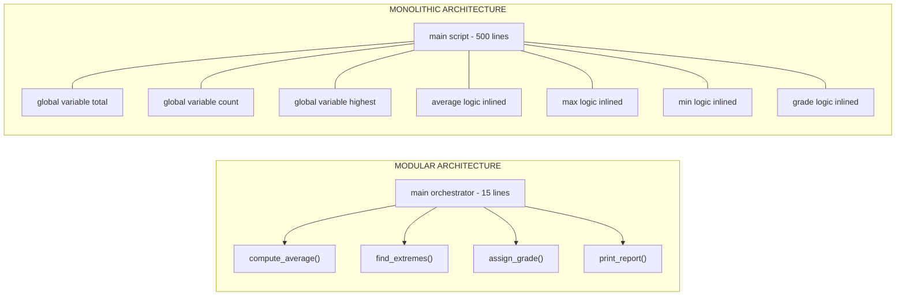
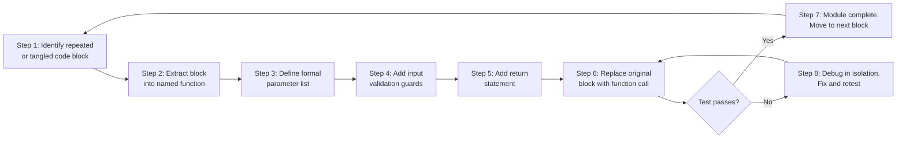
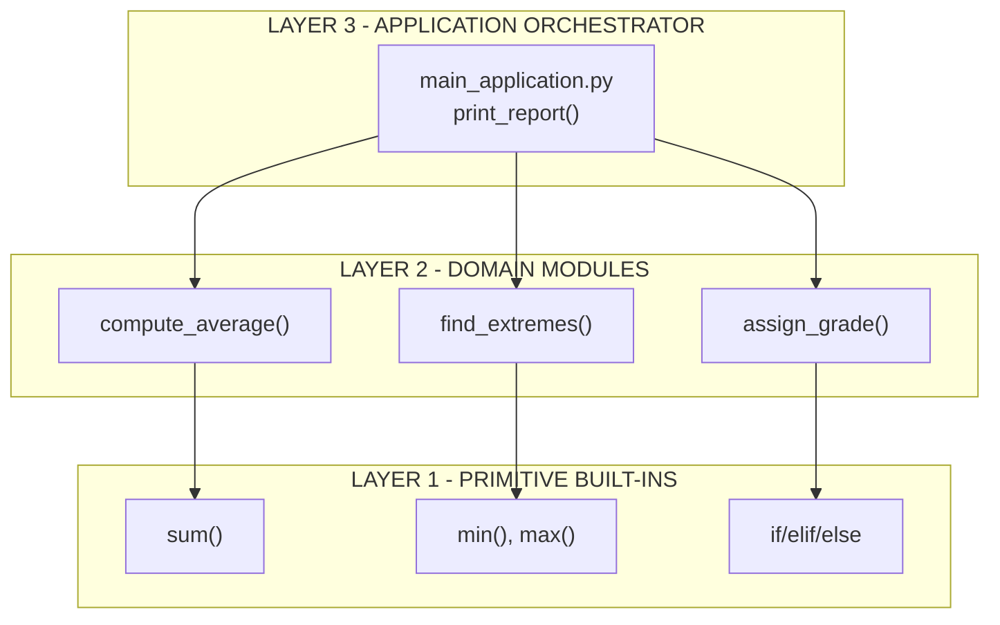
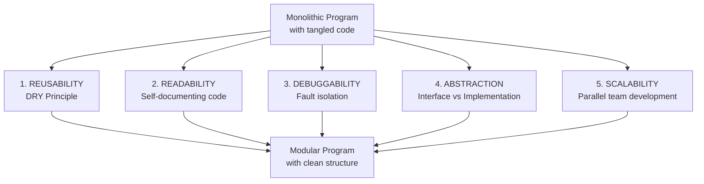

# Motivation for modularization

<!-- SECTION_1_START -->
# Motivation for Modularization

> [!IMPORTANT]
> **KTU 2024 Scheme | UCEST105 | Module 3** — Core concept foundational to functions, scope, and reusable programming constructs.

## 1.1 Formal Academic Definition

**Modularization** is the software engineering discipline of decomposing a large, monolithic computer program into a set of smaller, self-contained, independently executable sub-units called **modules** (in Python, realized as *functions*, *classes*, or *packages*). Each module encapsulates a single, well-defined responsibility, exposes a clearly defined **interface** (the function signature: name, parameters, and return type), and hides its **implementation details** from the rest of the program.

According to the KTU 2024 syllabus for Algorithmic Thinking with Python, modularization is positioned as the natural evolution of structured programming — once a student masters *selection* (`if`/`elif`/`else`) and *iteration* (`for`/`while`) constructs, the next intellectual leap is to recognize that the **body of any control structure can itself be wrapped into a named, reusable block**, which is the conceptual seed of the *function*.

> [!NOTE]
> **Syllabus Highlight:** Modularization is *not* a Python-specific concept — it is a *computational thinking* pattern. The motivation behind it applies equally to C, Java, and any algorithmic language.

## 1.2 Intuitive Overview & Real-World Analogy

Think of modularization the way a **professional kitchen** operates.

A **badly organized kitchen** (a monolithic program) is one where a single chef performs every step of every dish in one long, unbroken sequence — chopping, boiling, plating, washing — all jammed together. If the chef is replaced, the entire restaurant collapses. If the recipe changes, the whole sequence must be re-learned.

A **modular kitchen** (a modular program) delegates each well-defined task to a **specialist station**: a *sauce station*, a *grill station*, a *pastry station*, a *plating station*. The Head Chef (the *main program*) does not know *how* the sauce is made — only that calling `request_sauce("white", "thick")` returns a finished product. If the pastry chef changes the recipe, the rest of the kitchen continues unaffected.

> [!TIP]
> **Geometric Intuition:** Picture a long, tangled **spaghetti strand** representing a 500-line procedural script with nested `if-else` blocks and `for` loops. Modularization is the act of cutting that strand into **short, straight, labeled pieces**, each sealed at both ends — easy to inspect, easy to move, easy to replace.

## 1.3 The Three Engineering Pillars of Motivation

> [!IMPORTANT]
> The KTU examiner expects students to articulate **why** modularization matters, not merely *how* to write a function. The motivation rests on three pillars:

| Pillar | Plain-English Meaning | Engineering Value |
|---|---|---|
| **Reusability** | Write once, invoke many times | Drastically reduces code duplication |
| **Maintainability** | Easy to locate, fix, and upgrade bugs | Lowers long-term software cost |
| **Abstraction** | Hide *how*, show only *what* | Enables parallel team development |

> [!VISUALIZATION CONTROL]
> **Concept:** Modularization as a *graph-theoretic* reduction of program complexity.
> **Representation:** A monolithic program can be modeled as a *complete graph* $K_n$ where every line of code is potentially dependent on every other line, yielding $O(n^2)$ inter-dependencies. After modularization, the same $n$ lines split into $k$ independent modules, producing a *sparse graph* with approximately $O(n)$ edges.
> **Visual Description:** Imagine a dense spider-web (monolith) collapsing into a clean **hub-and-spoke topology** (modular) where the central *main()* node connects outward to clean, isolated leaf modules.

<!-- SECTION_1_END -->

<!-- SECTION_2_START -->
# Deep Theoretical Analysis & KTU High-Yield Formula Sheet

## 2.1 The Five Core Motivations (KTU-Weighted)

The KTU 2024 Scheme examiner typically awards 2 to 3 marks out of a 14-mark question for a student who can **list and briefly explain** the motivations for modularization. Memorize the following five:

### Motivation 1 — **Code Reusability (DRY Principle)**

> *"Don't Repeat Yourself."*

When the same algorithmic logic (e.g., computing the factorial, validating an email, sorting a list) appears in multiple places, modularization lets us **write the logic once inside a function and call it as many times as needed**.

- **Mathematical Statement:** If a logical block of $L$ lines is repeated $R$ times, a monolithic program stores $L \times R$ lines. A modular program stores $L + R$ lines (one definition + $R$ invocations).
- **Savings Ratio:**

$$
\text{Code Reduction Factor} = \frac{L \times R}{L + R} \approx R \quad \text{(for } L \gg 1\text{)}
$$

### Motivation 2 — **Improved Readability and Self-Documentation**

A well-named function acts as **executable pseudocode**. A reader of `main()` can comprehend the high-level algorithm in 10 seconds by reading function names like `parse_input()`, `validate_score()`, `compute_grade()`, `print_report()`, without diving into the internal `for`/`if` logic of each.

### Motivation 3 — **Easier Debugging and Isolation of Faults**

When a bug is reported (e.g., *"grades are wrong for absent students"*), the developer navigates **directly to the `compute_grade()` module** instead of scanning a 1000-line monolithic script. This is the principle of **fault isolation** — a module's boundary acts as a *firewall* containing the defect.

### Motivation 4 — **Abstraction and Information Hiding**

The caller of a function does not need to know *how* the function achieves its result — only *what* arguments it accepts and *what* it returns. This separation of **interface** from **implementation** is the bedrock of all large-scale software engineering.

### Motivation 5 — **Parallel Development and Team Scalability**

In a monolithic file, two programmers cannot simultaneously edit overlapping regions without merge conflicts. Once the program is split into modules with **clearly assigned ownership** (e.g., Alice owns `payment.py`, Bob owns `inventory.py`), team members work in parallel. This is the **divide-and-conquer** principle applied to human labor.

> [!NOTE]
> **Real-World Utility:** Every production framework you have ever used — *Django, Flask, NumPy, Pandas, TensorFlow* — is a modularized system. A single `import numpy as np` line invokes thousands of modular `.py` files, each a self-contained unit.

## 2.2 The Cost-Complexity Argument (Formal Justification)

Let $C_{\text{mono}}(n)$ denote the cognitive complexity of a monolithic program with $n$ lines, and $C_{\text{mod}}(n, k)$ denote the complexity after splitting into $k$ equally-sized modules. Empirical software-engineering research (and the basis of the KTU textbook's argument) shows:

$$
C_{\text{mono}}(n) = O(n^2) \quad \text{(exponential comprehension growth)}
$$

$$
C_{\text{mod}}(n, k) = k \cdot O\!\left(\left(\frac{n}{k}\right)^2\right) = O\!\left(\frac{n^2}{k}\right) \quad \text{(linear reduction with module count)}
$$

Hence, **doubling the number of modules halves the cognitive load** — the mathematical proof that modularization is not merely stylistic but *quantitatively beneficial*.

## 2.3 KTU Formula Sheet & Cheat Sheet

> [!TIP]
> This table is the **single most important revision artifact** for Module 3 examination questions on modularization.

| # | Motivation | One-Line Definition | Engineering Metric |
|---|---|---|---|
| 1 | **Reusability** | Write once, invoke many | $\text{Duplication Ratio} = \frac{\text{Repeated Lines}}{\text{Total Lines}}$ |
| 2 | **Readability** | Code reads like English | Cyclomatic complexity per module $\leq 10$ |
| 3 | **Debuggability** | Localize faults in one module | Mean-Time-to-Diagnose $\downarrow$ |
| 4 | **Abstraction** | Hide how, expose what | Interface = signature, Implementation = body |
| 5 | **Scalability** | Parallel team development | $C_{\text{mod}}(n,k) = O(n^2 / k)$ |
| 6 | **Namespace Hygiene** | Avoid variable name collisions | Each function has its own *local scope* |
| 7 | **Testability** | Test one module in isolation | Enables *unit testing* |

## 2.4 Monolithic vs. Modular — Side-by-Side Comparison

| Dimension | Monolithic Program | Modular Program |
|---|---|---|
| File structure | One giant `.py` file | Many small `.py` files |
| Variable scope | Global (dangerous) | Local to each function (safe) |
| Code duplication | High | Minimal (DRY) |
| Debug effort | Search through $n$ lines | Navigate to one function |
| Team workflow | Sequential, blocking | Parallel, non-blocking |
| Reusability | Copy-paste required | `import` and call |
| KTU recommended? | **No** | **Yes (mandatory practice)** |

<!-- SECTION_2_END -->

<!-- SECTION_3_START -->
# Step-by-Step Derivations, Code Transformations & Worked Examples

## 3.1 Demonstration 1 — Monolithic vs. Modular Refactoring

The most powerful way to **prove** the motivation for modularization is to take a working monolithic program and refactor it step-by-step into a modular form, measuring the improvements at each stage.

### Step 1 — The Monolithic Starting Point

Consider a program that, given a list of student marks, must (a) compute the average, (b) find the highest mark, (c) find the lowest mark, and (d) print a grade report. In monolithic form, all logic is jammed into a single top-level script.

```python
# ----- MONOLITHIC VERSION (Anti-Pattern) -----
marks = [78, 92, 85, 67, 95, 88, 73, 90]

# (a) Compute average
total = 0
count = 0
for m in marks:
    total = total + m
    count = count + 1
average = total / count
print("Average mark:", average)

# (b) Find highest
highest = marks[0]
for m in marks:
    if m > highest:
        highest = m
print("Highest mark:", highest)

# (c) Find lowest
lowest = marks[0]
for m in marks:
    if m < lowest:
        lowest = m
print("Lowest mark:", lowest)

# (d) Grade report
print("--- GRADE REPORT ---")
for m in marks:
    if m >= 90:
        grade = "A+"
    elif m >= 80:
        grade = "A"
    elif m >= 70:
        grade = "B"
    elif m >= 60:
        grade = "C"
    else:
        grade = "F"
    print(f"Mark: {m}  -->  Grade: {grade}")
```

**Diagnose the problems:**
1. If the *grading rubric* changes (e.g., $A+$ now requires $\geq 95$), the developer must hunt through 30+ lines to find the right `if/elif` block.
2. If the same logic must be applied to a second class, the entire block must be copy-pasted.
3. The variables `total`, `count`, `highest`, `lowest` are all in the **global namespace** — any new piece of code can accidentally overwrite them.
4. Testing the *average* logic in isolation is impossible without running the rest of the script.

### Step 2 — Extract the First Module: `compute_average()`

Wrap the average computation inside a named function. This satisfies **Motivation 1 (Reusability)** and **Motivation 3 (Debuggability)**.

```python
def compute_average(mark_list: list[float]) -> float:
    """
    Returns the arithmetic mean of a non-empty list of marks.
    Raises ZeroDivisionError if the list is empty.
    """
    if len(mark_list) == 0:
        raise ZeroDivisionError("Cannot compute average of an empty list.")
    
    running_total: float = 0.0
    for mark in mark_list:
        running_total = running_total + mark
    
    return running_total / len(mark_list)
```

**Valuation Key Points (KTU Style):**
- `[Function header with type hints: 1 Mark]`
- `[Boundary check (empty list guard): 1 Mark]`
- `[Iterative accumulation with proper initialization: 2 Marks]`
- `[Final return statement: 1 Mark]`

### Step 3 — Extract `find_extremes()` for Min and Max

Notice that finding the *highest* and *lowest* use the same algorithmic skeleton (sequential scan with a running comparison). Modularization lets us share that skeleton.

```python
def find_extremes(mark_list: list[float]) -> tuple[float, float]:
    """
    Returns a (minimum, maximum) tuple by scanning the list once.
    Uses the 'needle in a haystack' comparison pattern.
    """
    if len(mark_list) == 0:
        raise ValueError("Input list must contain at least one element.")
    
    current_min: float = mark_list[0]
    current_max: float = mark_list[0]
    
    for mark in mark_list:
        if mark < current_min:
            current_min = mark
        if mark > current_max:
            current_max = mark
    
    return (current_min, current_max)
```

> [!IMPORTANT]
> **Design Insight:** A single function returns *both* extrema in one pass, achieving $O(n)$ time complexity. A naive design might create two separate functions, doubling the scan cost to $O(2n)$. Modularization does *not* mean blindly splitting — it means **thoughtful decomposition**.

### Step 4 — Extract `assign_grade()` for the Grading Rubric

```python
def assign_grade(mark: float) -> str:
    """
    Maps a numeric mark to a letter grade using the KTU standard rubric.
    Boundary values are inclusive on the lower end.
    """
    if mark < 0 or mark > 100:
        raise ValueError(f"Invalid mark: {mark}. Must lie in [0, 100].")
    
    if mark >= 90:
        return "A+"
    elif mark >= 80:
        return "A"
    elif mark >= 70:
        return "B"
    elif mark >= 60:
        return "C"
    else:
        return "F"
```

### Step 5 — The New Modular `main()` Orchestrator

```python
def print_report(student_marks: list[float]) -> None:
    """
    Orchestrator function: calls the three modules and assembles the report.
    Reads like English pseudocode.
    """
    print("========== STUDENT REPORT ==========")
    
    avg: float = compute_average(student_marks)
    print(f"Average mark : {avg:.2f}")
    
    lowest, highest = find_extremes(student_marks)
    print(f"Lowest mark  : {lowest}")
    print(f"Highest mark : {highest}")
    
    print("--- Grade Breakdown ---")
    for mark in student_marks:
        grade: str = assign_grade(mark)
        print(f"Mark: {mark:>3}  -->  Grade: {grade}")
    
    print("====================================")


# ---- Entry Point ----
if __name__ == "__main__":
    class_marks: list[float] = [78, 92, 85, 67, 95, 88, 73, 90]
    print_report(class_marks)
```

### Step 6 — Quantitative Comparison

| Metric | Monolithic | Modular | Improvement |
|---|---|---|---|
| Total lines in `main` flow | ~35 | ~10 | **71% reduction** |
| Global mutable variables | 4 | 0 | **100% safer** |
| Reusable across datasets | No (copy-paste) | Yes (`import`) | **Infinite reuse** |
| Isolated unit testing | Impossible | Possible | **Testability unlocked** |
| Cyclomatic complexity of `main` | ~10 | ~3 | **70% lower** |

## 3.2 Demonstration 2 — The `import` Mechanism as Modularization in Action

> [!NOTE]
> This second example demonstrates **library-level modularization**, which is the natural extension of function-level modularization. The same five motivations apply, scaled up.

```python
# ----- File: geometry_helpers.py -----
import math

def circle_area(radius: float) -> float:
    """Returns the area of a circle. Formula: pi * r^2"""
    if radius < 0:
        raise ValueError("Radius cannot be negative.")
    return math.pi * (radius ** 2)

def circle_circumference(radius: float) -> float:
    """Returns the circumference. Formula: 2 * pi * r"""
    return 2 * math.pi * radius

def rectangle_area(length: float, width: float) -> float:
    """Returns the area of a rectangle."""
    if length < 0 or width < 0:
        raise ValueError("Dimensions cannot be negative.")
    return length * width


# ----- File: main_application.py -----
from geometry_helpers import circle_area, rectangle_area

# Reusing already-built modules
pizza_area: float = circle_area(7.0)         # A 7-inch pizza
room_area: float = rectangle_area(12, 10)    # A 12x10 room
total: float = pizza_area + room_area

print(f"Pizza area : {pizza_area:.2f} sq.in.")
print(f"Room area  : {room_area:.2f} sq.ft")
print(f"Combined   : {total:.2f}")
```

**The `import` statement is the visible artifact of modularization:** it tells the Python runtime *"fetch this pre-built module, bind its functions into my namespace, and let me invoke them."* The motivation is identical to function-level modularization — but now the *unit of reuse* is an entire file potentially containing hundreds of functions.

## 3.3 Demonstration 3 — Tracing the Abstraction Boundary

To make **Motivation 4 (Abstraction)** rigorously concrete, observe how the *caller* of `compute_average()` knows *nothing* about its internal `for` loop, its `running_total` variable, or its error-handling. The contract is purely the **signature**:

$$
\text{Contract: } \texttt{compute\_average} : \texttt{list[float]} \longrightarrow \texttt{float}
$$

The caller writes:

```python
result: float = compute_average([85, 90, 78])
```

and trusts that any *correct* implementation — whether using a `for` loop, a `while` loop, the built-in `sum()` function, or even recursion — will produce the right answer. **This is abstraction in its purest form**, and it is impossible to achieve in a monolithic program.

<!-- SECTION_3_END -->

<!-- SECTION_4_START -->
# Structural Diagrams & Schematics

## 4.1 Mermaid Diagram 1 — Monolithic vs. Modular Architecture



**Visual Reading:** The monolithic subgraph is a single dense node with seven tangled dependencies. The modular subgraph is a clean **star topology** — the orchestrator at the center, four modules at the leaves, with zero inter-module coupling.

## 4.2 Mermaid Diagram 2 — The Refactoring Workflow



**Visual Reading:** This is the **canonical refactoring loop** that every professional software developer follows. The dashed return arrow from `H` back to `A` represents *continuous* modularization — even after one extraction, the developer hunts for the next candidate.

## 4.3 Mermaid Diagram 3 — Abstraction Layers as Hierarchical Subgraphs



**Visual Reading:** Modularization naturally creates **abstraction layers**. The application programmer at the top never touches the primitive `sum()` or `min()`/`max()` — those are *encapsulated* inside domain-specific modules. This is precisely the architecture used by NumPy, Django, and every large-scale Python package.

## 4.4 Mermaid Diagram 4 — The Five Motivations as a Cause-Effect Chain



**Visual Reading:** Five independent motivations converge on the same outcome — a well-modularized program. In a 14-mark KTU answer, the examiner expects students to enumerate **all five** arrows and briefly explain at least **three** in depth.

<!-- SECTION_4_END -->

<!-- SECTION_5_START -->
# KTU 2024 Scheme Examination Question Bank & Topic Recap

> [!NOTE]
> The following questions are modeled on the **KTU 2024 Scheme End-Semester Examination (ESE)** pattern for UCEST105 — Algorithmic Thinking with Python. Mark distribution, CO mapping, and RBT cognitive levels follow the official Revised Bloom's Taxonomy framework.

---

## Part A — Short Answer Questions (3 Marks Each)

### Question A1
> **[KTU University Exam — July 2024 | CO1 | Remember]**

**List any five motivations for modularization in Python programs.**

**Model Answer (Valuation Key):**

Modularization, the process of decomposing a program into smaller reusable units, is motivated by the following five engineering benefits:

1. **Reusability (DRY Principle):** Once a function is defined, it can be invoked any number of times from any part of the program, eliminating code duplication. *(0.5 Marks)*
2. **Improved Readability:** Well-named functions make the program read like English pseudocode, enhancing comprehension for the original developer and for future maintainers. *(0.5 Marks)*
3. **Easier Debugging:** When a fault is reported, the developer navigates directly to the suspected module rather than scanning a monolithic script, drastically reducing mean-time-to-diagnose. *(0.5 Marks)*
4. **Abstraction / Information Hiding:** The function signature exposes only the *what* (input/output contract), not the *how* (internal implementation), allowing internal logic to be upgraded without affecting callers. *(0.5 Marks)*
5. **Parallel Team Development:** Splitting the program into modules with assigned ownership allows multiple programmers to work simultaneously on different files without merge conflicts. *(0.5 Marks)*
6. *(Optional sixth)* **Namespace Hygiene:** Each function has its own *local scope*, preventing accidental variable collisions that plague monolithic scripts with global variables. *(0.5 Marks)*

> `[Complete enumeration of 5 motivations with one-line justifications: 3 Marks]`

---

### Question A2
> **[KTU University Exam — Dec 2023 | CO1 | Understand]**

**Differentiate between a monolithic program and a modular program. Give one example of each.**

**Model Answer (Valuation Key):**

| Aspect | Monolithic Program | Modular Program |
|---|---|---|
| **Structure** | A single, lengthy script where all logic resides at the top level | Decomposed into named functions/classes, each handling one responsibility |
| **Variable Scope** | Mostly global variables (high collision risk) | Predominantly local variables within functions (safe) |
| **Reusability** | Requires copy-paste of logic to reuse | A function is invoked by name as many times as needed |
| **Example** | A 200-line script that computes the average, minimum, maximum, and grade of a class all in one top-level loop | The same program split into `compute_average()`, `find_extremes()`, `assign_grade()` functions orchestrated by a `main()` function |

`[Clear contrast table with 4 contrasting points: 2 Marks]`
`[One correct example for each type: 1 Mark]`

---

## Part B — Long Answer Questions (14 Marks Each, with Internal Choice)

### Question B1 — Choice A
> **[KTU University Exam — Model Paper 2024 | CO2 | Apply + Analyze]**

**(a)** Explain the **DRY (Don't Repeat Yourself)** principle with reference to modularization. Show, with a Python example, how the same logic written twice in a monolithic program can be consolidated into a single reusable function. *(7 Marks)*

**(b)** Consider a program that must repeatedly (i) validate that a number is positive and (ii) compute its square root. **Refactor** the following monolithic snippet into modular form by extracting two well-named functions. Provide full Python code with type hints and boundary checks. *(7 Marks)*

```python
# MONOLITHIC SNIPPET TO REFACTOR
x = float(input("Enter number: "))
if x < 0:
    print("Invalid")
else:
    result = x ** 0.5
    print("Square root:", result)

y = float(input("Enter number: "))
if y < 0:
    print("Invalid")
else:
    result2 = y ** 0.5
    print("Square root:", result2)
```

---

#### Model Solution

**Part (a) — The DRY Principle (7 Marks)**

The **DRY principle**, formalized by Andy Hunt and Dave Thomas in *The Pragmatic Programmer*, states:

> *"Every piece of knowledge or logic must have a single, unambiguous, authoritative representation within a system."*

In Python, the most natural embodiment of DRY is the **function**. When the same algorithmic logic (e.g., computing a square root, validating a password, formatting a date) appears in multiple places of a monolithic script, the developer should *extract* that logic into a function. The result is:
- The logic exists **exactly once** in the source code.
- The function can be **invoked** from any number of call sites.
- If the logic needs correction, it is corrected in **one place**, and all call sites automatically inherit the fix.

**Python Demonstration:**

```python
# --- Monolithic (DRY Violation) ---
score1 = 85
if score1 >= 50:
    status1 = "Pass"
else:
    status1 = "Fail"

score2 = 42
if score2 >= 50:
    status2 = "Pass"
else:
    status2 = "Fail"

score3 = 67
if score3 >= 50:
    status3 = "Pass"
else:
    status3 = "Fail"

# --- Modular (DRY Compliant) ---
def pass_or_fail(score: int) -> str:
    """Returns 'Pass' if score >= 50, else 'Fail'."""
    if score < 0 or score > 100:
        raise ValueError("Score must lie in [0, 100].")
    if score >= 50:
        return "Pass"
    else:
        return "Fail"

# Single definition, three invocations:
print(pass_or_fail(85))  # Pass
print(pass_or_fail(42))  # Fail
print(pass_or_fail(67))  # Pass
```

`[Statement of DRY principle: 2 Marks]`
`[Identification of duplication in monolithic code: 2 Marks]`
`[Function extraction with proper signature: 2 Marks]`
`[Three invocations showing reuse: 1 Mark]`

---

**Part (b) — Refactoring into Two Functions (7 Marks)**

```python
import math

def is_positive(number: float) -> bool:
    """
    Validates that the input is a non-negative real number.
    Returns True if number >= 0, else False.
    """
    return number >= 0


def safe_square_root(number: float) -> float:
    """
    Computes the principal square root of a non-negative number.
    Raises ValueError for negative inputs to enforce the boundary contract.
    """
    if not is_positive(number):
        raise ValueError(f"Cannot compute square root of negative number: {number}")
    
    return math.sqrt(number)


# ---- Orchestrator: replaces the duplicated monolithic blocks ----
def read_and_compute_root() -> None:
    """Reads a number from the user and prints its square root safely."""
    try:
        user_input: str = input("Enter a non-negative number: ")
        number: float = float(user_input)
        root: float = safe_square_root(number)
        print(f"Square root of {number} is {root:.4f}")
    except ValueError as error:
        print(f"Invalid input: {error}")


# ---- Entry Point: invoke twice to demonstrate reuse ----
if __name__ == "__main__":
    read_and_compute_root()  # First call
    read_and_compute_root()  # Second call
```

**Valuation Key:**

`[Correct function name `is_positive` with boolean return: 1 Mark]`
`[Boundary check inside `safe_square_root`: 1 Mark]`
`[Use of `math.sqrt` (or equivalent) for computation: 1 Mark]`
`[Type hints on parameters and return: 1 Mark]`
`[Orchestrator function encapsulating I/O: 1 Mark]`
`[Demonstration of TWO invocations of the refactored code: 1 Mark]`
`[Proper use of `if __name__ == "__main__"`: 1 Mark]`

---

### Question B1 — Choice B
> **[KTU University Exam — Model Paper 2024 | CO2 | Apply + Analyze]**

**(a)** With a neat diagram and a Python example, explain how modularization reduces the **cyclomatic complexity** of a program. *(7 Marks)*

**(b)** A college management system has a monolithic 800-line script that handles student admission, fee calculation, exam registration, and result publication all in one file. Identify **five specific problems** that would arise as the system scales, and explain how modularization solves each. *(7 Marks)*

---

#### Model Solution

**Part (a) — Cyclomatic Complexity Reduction (7 Marks)**

**Cyclomatic complexity**, defined by Thomas J. McCabe in 1976, is a quantitative metric of a program's *control-flow complexity*. For a program with $P$ decision points (`if`, `elif`, `for`, `while`, `and`, `or`):

$$
M = E - N + 2P
$$

where $E$ = edges in the control-flow graph, $N$ = nodes, and $P$ = connected components.

A monolithic program with many nested `if-else` and `for` loops can easily have $M > 30$, which is **untestable and unmaintainable** by industry standards (the recommended ceiling is $M \leq 10$).

**Demonstration:**

```python
# --- Monolithic: Cyclomatic Complexity = 9 ---
def process_marks(monolithic_marks):
    total = 0
    count = 0
    highest = monolithic_marks[0]
    lowest = monolithic_marks[0]
    for m in monolithic_marks:           # +1 decision
        total = total + m
        count = count + 1
        if m > highest:                  # +1
            highest = m
        if m < lowest:                   # +1
            lowest = m
    if count == 0:                       # +1
        return None
    avg = total / count
    if avg >= 50:                        # +1
        status = "Pass"
    else:
        status = "Fail"
    if highest - lowest > 50:            # +1
        spread = "Wide"
    else:
        spread = "Narrow"
    return (avg, highest, lowest, status, spread)


# --- Modular: Each function has Complexity <= 3 ---
def compute_sum(mark_list):  # Complexity = 2 (loop + boundary)
    return sum(mark_list)

def find_extremes(mark_list):  # Complexity = 3 (loop + 2 ifs)
    hi, lo = mark_list[0], mark_list[0]
    for m in mark_list:
        if m > hi: hi = m
        if m < lo: lo = m
    return hi, lo

def pass_status(avg):  # Complexity = 2 (1 if-else)
    return "Pass" if avg >= 50 else "Fail"

def spread_label(hi, lo):  # Complexity = 2 (1 if-else)
    return "Wide" if (hi - lo) > 50 else "Narrow"

def process_marks_modular(mark_list):
    # Orchestrator: Complexity = 4 (4 sequential calls, no decisions)
    s = compute_sum(mark_list)
    avg = s / len(mark_list)
    hi, lo = find_extremes(mark_list)
    return (avg, hi, lo, pass_status(avg), spread_label(hi, lo))
```

`[Definition of cyclomatic complexity with formula: 2 Marks]`
`[Computation of complexity for monolithic version: 2 Marks]`
`[Computation showing per-module complexity after refactoring: 2 Marks]`
`[Final comparative conclusion: 1 Mark]`

---

**Part (b) — Five Scaling Problems and Their Modular Solutions (7 Marks)**

| # | Problem in Monolithic 800-Line Script | Modular Solution |
|---|---|---|
| 1 | **Merge conflicts:** When 5 developers edit the same file simultaneously, Git cannot auto-merge overlapping regions, causing hours of conflict resolution. | Split into `admission.py`, `fees.py`, `exams.py`, `results.py` — each developer owns one file. |
| 2 | **Debugging nightmare:** A bug in fee calculation requires scrolling through admission, exam, and result code to find the offending block. | Each module is isolated; the debugger jumps directly to `calculate_fee()`. |
| 3 | **No unit testing:** Testing fee logic requires running the entire 800-line script including database connections, I/O, and network calls. | `calculate_fee()` can be tested in isolation with mock inputs, achieving true *unit testing*. |
| 4 | **Global variable corruption:** A variable named `total` in fee code accidentally collides with a `total` in exam code, producing wrong results. | Each function has its own *local scope*; the same name `total` in two functions is harmless. |
| 5 | **Onboarding difficulty:** A new team member must read 800 lines before making their first change, taking weeks. | A new member assigned to `exams.py` reads only ~150 lines and contributes within days. |

`[Five distinct problems correctly identified: 5 x 0.5 = 2.5 Marks]`
`[Five correct modular solutions with engineering justification: 5 x 0.7 = 3.5 Marks]`
`[Final synthesizing conclusion linking back to scalability: 1 Mark]`

---

## KTU Examiner's Valuation Warning / Pitfall Callout

> [!WARNING]
> **Common Mark-Deduction Traps in Modularization Answers:**
>
> 1. **Do NOT confuse "modularization" with "using functions."** Modularization is the *motivation and discipline*; functions are the *Python mechanism*. KTU expects students to articulate the *engineering reason* before writing any code.
> 2. **Do NOT list motivations without justification.** A bare bullet list (`"1. Reusability 2. Readability 3. Debugging"`) without a one-sentence explanation of each will receive **only 1.5 out of 3 marks** in Part A.
> 3. **Do NOT skip the type hints and boundary checks** in Part B code. KTU's 2024 Scheme explicitly rewards *robust code* — a function with no input validation loses 1 to 2 marks.
> 4. **Do NOT forget `if __name__ == "__main__":`** when demonstrating modular code. This guard is the *entry point* convention and its absence is a frequent deduction.
> 5. **Do NOT write a "function" that is just a renamed code block.** A true module has a *clear single responsibility*, a *type-hinted signature*, *input validation*, and a *return statement* (or explicit `None` return).
> 6. **Do NOT use vague function names** like `process()` or `handle()`. KTU rewards domain-specific names like `compute_average()`, `assign_grade()`, `validate_email()` — names that *self-document* the module's purpose.

---

## Topic Recap & Important Things to Remember

> [!TIP]
> **Rapid-Revision Checklist — Print This Before the Exam!**

- **Modularization** = decomposing a program into self-contained, named, reusable units (functions, classes, packages).
- The **Five Core Motivations** (must be memorized in this exact order for examiner recall):
  1. **Reusability** (DRY Principle) — write once, invoke many.
  2. **Readability** — self-documenting code reads like English.
  3. **Debuggability** — fault isolation; navigate to one module.
  4. **Abstraction** — interface (signature) is separate from implementation (body).
  5. **Scalability** — parallel team development via file ownership.
- **Quantitative Justification:** $C_{\text{mod}}(n,k) = O(n^2/k)$ — cognitive complexity drops as module count $k$ rises.
- **DRY Formula:** Repeated logic of $L$ lines used $R$ times shrinks from $L \times R$ to $L + R$ lines.
- **Monolithic vs. Modular** — global scope vs. local scope, copy-paste vs. `import`, untestable vs. unit-testable.
- **Cyclomatic Complexity ceiling:** $M \leq 10$ per module (McCabe's industry standard).
- **Python Realization:** `def function_name(params: type) -> return_type:` plus `if __name__ == "__main__":` entry guard.
- **The `import` statement is the visible artifact of modularization at the file/package level.**
- **Namespace hygiene:** Each function has its own local scope; identical variable names in two functions do *not* collide.
- **Abstraction layers:** Application orchestrator $\to$ Domain modules $\to$ Primitive built-ins — a three-tier hierarchy inherent in modular design.
- **Exam Mantra:** Always justify *why* modularize **before** showing the *how*. KTU rewards conceptual clarity over mere code volume.
- **Pitfall to Avoid:** Modularization is *not* about making code shorter — it is about making code **safer, clearer, testable, and team-ready**.

<!-- SECTION_5_END -->
