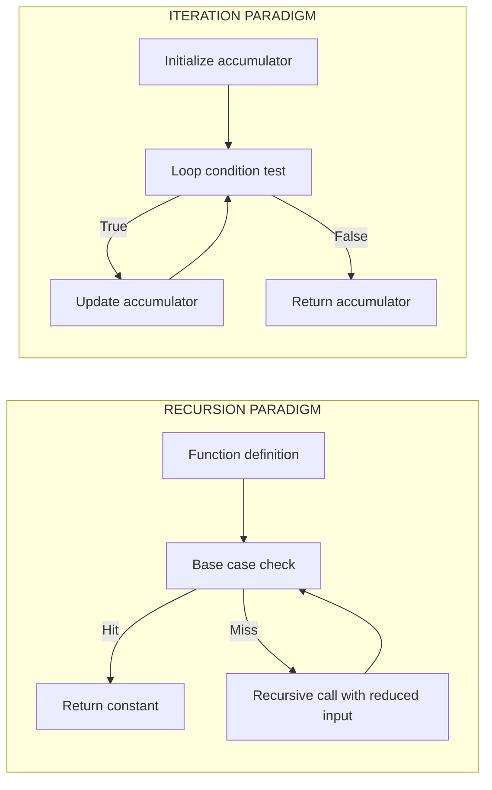
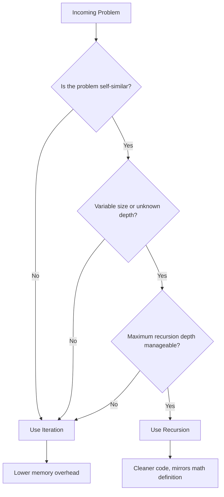

# Reasons for using Recursion

<!-- SECTION_1_START -->
# Reasons for Using Recursion

## 1.1 Formal Academic Definition (KTU 2024 Syllabus)

> [!IMPORTANT]
> **Recursion** is a programming technique in which a **function calls itself**, either directly or indirectly, to solve a problem by breaking it down into smaller, similar sub-problems of the same type. Each recursive call must make progress towards a **base case** (terminating condition) to prevent infinite recursion and eventual stack overflow.

In the context of **Algorithmic Thinking with Python (UCEST105)**, recursion is introduced as an alternative control flow mechanism to iteration. The KTU 2024 syllabus categorizes recursion under **Module 3: Selection and Iteration** because it represents a fundamentally different paradigm of repeating a set of statements — driven by *self-reference* rather than by a loop construct.

> [!NOTE]
> **Core Terminology to Memorize for KTU Board Exams:**
> - **Base Case**: The terminating condition that stops further recursive calls.
> - **Recursive Case**: The branch where the function invokes itself with a smaller/simpler input.
> - **Call Stack**: The internal data structure Python uses to track active function calls.
> - **Stack Frame**: A new frame is pushed onto the call stack for every recursive invocation.

---

## 1.2 Conceptual Analogy / Intuitive Explanation

> [!TIP]
> **Real-World Analogy — The Russian Nesting Doll (Matryoshka):**
> Imagine opening a Russian nesting doll. Inside the first doll, you find a smaller doll — and inside that one, an even smaller doll. You keep opening them until you reach the **smallest, solid doll** that does not open. That solid doll is your **base case**. Every other doll is a **recursive case** that contains a smaller version of the same problem.

**Why does this matter?** Just as the nested doll is *naturally described* in terms of itself ("a doll containing a doll containing a doll..."), many computational problems are *naturally described* in terms of smaller copies of themselves. Forcing such problems into iterative loops often produces convoluted code, while recursion expresses the solution in a single, elegant line.

**Geometric Intuition — Fractal Tree:** A fractal tree's branches are *miniature trees* themselves. The full tree is described recursively: draw a trunk → at the tip, draw two smaller trees rotated at angles. This self-similar structure is what makes recursion the natural modeling tool.

### 1.3 GeoGebra / Desmos Integration

> [!VISUALIZATION CONTROL]
> **Concept:** Recursive call stack depth visualization (geometric series analogy)
> **GeoGebra / Desmos Input Equations:**
> - `f(n) = n \cdot f(n-1), \quad f(0) = 1`   (Factorial recursion)
> - `g(n) = g(n-1) + g(n-2), \quad g(0)=0,\ g(1)=1`   (Fibonacci recursion)
> **Visual Description:** Plot `f(n)` to see factorial growth, and `g(n)` to see Fibonacci exponential curves. The number of recursive calls for `f(n)` is exactly `n+1`, illustrating how call-stack depth grows linearly with input.

---

## 1.4 Why Study This in KTU 2024?

The KTU 2024 Scheme (NEP 2020 aligned) maps this topic to:

- **Course Outcome CO1**: Apply algorithmic thinking to solve computational problems.
- **Course Outcome CO2**: Develop Python programs using appropriate control structures.
- **Bloom's Cognitive Levels**: *Understand* (L2) and *Apply* (L3).

> [!IMPORTANT]
> **KTU 2024 Highlight:** Questions on "Reasons for using Recursion" are frequently asked as **2-mark or 3-mark short-answer questions** in Part A, and as sub-parts of 14-mark Part B questions where students must *justify the design choice* between recursion and iteration.

<!-- SECTION_1_END -->

<!-- SECTION_2_START -->
# 2. Deep Theoretical Analysis: Reasons for Using Recursion

## 2.1 The Five Pillars of Recursive Problem Solving

A problem is a *natural candidate* for recursion when it satisfies one or more of the following structural properties. Each is examined with engineering rationale below.

### Pillar 1 — Self-Similar Problem Structure

Many real-world problems are *defined in terms of themselves*. If the formal definition of a problem contains a reference to smaller instances of the same problem, recursion maps directly onto the mathematics.

**Examples:**
- **Factorial**: $n! = n \times (n-1)!$
- **Fibonacci**: $F(n) = F(n-1) + F(n-2)$
- **Tree traversal**: Pre-order, In-order, Post-order
- **Factorial of a list**: `product(L) = L[0] * product(L[1:])`

### Pillar 2 — Variable / Unknown Input Size

When the size of the data structure is *not known at compile time* (e.g., a directory tree of unknown depth, an organization hierarchy, an XML/JSON tree), recursion adapts naturally because each recursive call is dispatched on a *subtree*, and the recursion bottoms out at the leaves.

### Pillar 3 — Divide and Conquer Paradigm

Algorithms like **Merge Sort**, **Quick Sort**, **Binary Search**, and **Strassen's Matrix Multiplication** are formulated as:
$$
T(n) = a \cdot T\left(\frac{n}{b}\right) + f(n)
$$
where the problem is split into sub-problems, each solved recursively. This is the cornerstone of algorithm-design courses (CSL 201 / PST 301) and recursions are the *only* natural way to implement such recurrences in code.

### Pillar 4 — Backtracking and Search

Problems involving *exploration of multiple possibilities* — N-Queens, Sudoku, Knight's Tour, maze solving, generating permutations/combinations — are inherently recursive. Each decision point spawns a recursive subtree of possibilities.

### Pillar 5 — Code Clarity, Elegance, and Mathematical Fidelity

A recursive function is often **shorter, more readable, and a 1-to-1 translation of the mathematical definition** than its iterative counterpart. Compare:

**Recursive (3 lines):**
```python
def factorial(n):
    return 1 if n <= 1 else n * factorial(n - 1)
```

**Iterative (5 lines):**
```python
def factorial(n):
    result = 1
    for i in range(2, n + 1):
        result *= i
    return result
```

The recursive version directly mirrors the mathematical notation $n! = n \times (n-1)!$, which is a strong indicator of correctness.

---

## 2.2 KTU High-Yield Formula Sheet (Cheat Sheet)

| # | Concept | Formula / Definition | Use Case in KTU Exams |
|---|---|---|---|
| 1 | **Recurrence Relation** | $T(n) = a \cdot T(n/b) + f(n)$ | Divide and conquer complexity analysis |
| 2 | **Base Case Identification** | $T(0) = 1$ or $T(1) = 1$ | Boundary conditions in Part B questions |
| 3 | **Number of Recursive Calls** | Factorial: $n$ calls; Fibonacci: $\approx 2^n$ calls | Time complexity derivations |
| 4 | **Stack Depth** | Equal to number of active frames before base case | Space complexity (each frame $\sim$ few bytes) |
| 5 | **Time Complexity (Factorial)** | $O(n)$ | Single recursive call per invocation |
| 6 | **Time Complexity (Fibonacci naive)** | $O(2^n)$ | Branching factor of 2 |
| 7 | **Time Complexity (Binary Search)** | $O(\log n)$ | Halving input per call |
| 8 | **Time Complexity (Merge Sort)** | $O(n \log n)$ | Master Theorem case 2 |
| 9 | **Python Recursion Limit** | Default $\approx 1000$ frames | Use `sys.setrecursionlimit()` to extend |
| 10 | **Tail Recursion Optimization** | Not guaranteed in CPython | Avoid relying on it for KTU practicals |

> [!NOTE]
> **Important Notation Rule:** When writing recurrence relations in your answer sheet, **always** use subscripts inside math mode: $T_1, T_2, T_n$ — never `T1` in plain text, since markdown may mis-render it.

---

## 2.3 Engineering Utility of Recursion

| Industry Domain | Recursive Application |
|---|---|
| **Compilers** | Parse trees, Abstract Syntax Trees (AST), recursive descent parsers |
| **Operating Systems** | Directory traversal (`os.walk` uses recursion internally) |
| **AI / Machine Learning** | Decision trees, recursive neural networks, recursive feature elimination |
| **Graphics & Games** | Fractal rendering (Mandelbrot set), recursive ray-tracing |
| **Databases** | Recursive CTEs (Common Table Expressions) for hierarchical queries |
| **Networking** | DNS resolution chain, recursive packet routing |
| **Web Development** | Recursive component trees in React/Vue, JSON parsing |
| **Bioinformatics** | Phylogenetic tree reconstruction, sequence alignment (Needleman-Wunsch) |

> [!TIP]
> **KTU Examiner Insight:** A well-written answer that connects recursion to a *real industry use case* (e.g., "compilers use recursive descent parsing because grammar rules are themselves recursive") scores significantly higher than a textbook-only explanation.

<!-- SECTION_2_END -->

<!-- SECTION_3_START -->
# 3. Step-by-Step Derivations, Proofs, and Python Implementations

## 3.1 Worked Derivation — Recurrence for Factorial Time Complexity

**Problem:** Derive the time complexity $T(n)$ of the recursive factorial function.

**Step 1 — Identify the operations per call.**
The function does one multiplication, one comparison, and one recursive call.
- Constant-time work: $O(1)$
- One recursive sub-problem of size $(n-1)$: $T(n-1)$

**Step 2 — Write the recurrence relation.**

$$
\begin{aligned}
T(n) &= T(n-1) + O(1) \\
T(0) &= O(1) \quad \text{(base case)}
\end{aligned}
$$

**Step 3 — Unroll the recurrence.**

$$
\begin{aligned}
T(n) &= T(n-1) + c \\
     &= T(n-2) + 2c \\
     &= T(n-3) + 3c \\
     &\;\;\vdots \\
     &= T(n-k) + k \cdot c
\end{aligned}
$$

**Step 4 — Apply the base case.**
Set $n - k = 0 \Rightarrow k = n$. Substituting:

$$
\begin{aligned}
T(n) &= T(0) + n \cdot c \\
     &= c + n \cdot c \\
     &= O(n)
\end{aligned}
$$

**Conclusion:** Recursive factorial runs in $\mathbf{O(n)}$ time and uses $\mathbf{O(n)}$ call-stack space.

---

## 3.2 Worked Derivation — Fibonacci Naive Recursion (Exponential Blow-up)

**Problem:** Prove that the naive recursive Fibonacci $F(n) = F(n-1) + F(n-2)$ has time complexity $O(2^n)$.

**Step 1 — Write the recurrence.**

$$
T(n) = T(n-1) + T(n-2) + O(1)
$$

**Step 2 — Lower bound analysis.**
For $n \ge 2$: $T(n) \ge T(n-1) + T(n-2)$.

**Step 3 — Solve via unrolling.**

$$
\begin{aligned}
T(n) &\ge T(n-1) + T(n-2) \\
     &\ge T(n-2) + T(n-3) + T(n-3) + T(n-4) \\
     &\ge 2 \cdot T(n-2) \\
     &\ge 2 \cdot 2 \cdot T(n-4) = 2^2 \cdot T(n-4) \\
     &\;\;\vdots \\
     &\ge 2^{n/2} \cdot T(0) \\
     &\ge c \cdot 2^{n/2} = \Omega(2^{n/2})
\end{aligned}
$$

**Step 4 — Tighten to $O(2^n)$.**
By substitution method, assume $T(n) \le a \cdot 2^n$ for some constant $a$:

$$
\begin{aligned}
T(n) &\le a \cdot 2^{n-1} + a \cdot 2^{n-2} + c \\
     &= a \cdot 2^{n-2}(2 + 1) + c \\
     &= \frac{3a}{4} \cdot 2^n + c
\end{aligned}
$$

Choosing $a \ge 4c$ satisfies the bound. Hence $T(n) = \Theta(2^n)$.

> [!IMPORTANT]
> **Engineering Lesson:** This exponential blow-up is *why* dynamic programming (memoization) was invented. The KTU 2024 syllabus often asks students to **justify the use of recursion with memoization** for such problems.

---

## 3.3 Full Python Implementation — Recursive vs Iterative Comparison Suite

```python
"""
File: recursion_vs_iteration.py
Course: ALGORITHMIC THINKING WITH PYTHON (UCEST105) — KTU 2024 Scheme
Topic: Reasons for using Recursion — Comparative Demonstrations
Python: 3.11+
"""

from __future__ import annotations
import sys
from typing import Any, List, Tuple


# ---------- 1. FACTORIAL: Recursive vs Iterative ----------
def factorial_recursive(n: int) -> int:
    """Recursive factorial with explicit base case and input validation."""
    if not isinstance(n, int):
        raise TypeError("n must be an integer")
    if n < 0:
        raise ValueError("Factorial is undefined for negative integers")
    if n <= 1:                                  # BASE CASE
        return 1
    return n * factorial_recursive(n - 1)        # RECURSIVE CASE


def factorial_iterative(n: int) -> int:
    """Iterative equivalent for comparison."""
    if n < 0:
        raise ValueError("Factorial is undefined for negative integers")
    result = 1
    for i in range(2, n + 1):
        result *= i
    return result


# ---------- 2. FIBONACCI: Naive Recursion vs Memoized Recursion ----------
def fib_naive(n: int) -> int:
    """Naive recursive Fibonacci — exponential time, for teaching only."""
    if n < 0:
        raise ValueError("n must be non-negative")
    if n <= 1:                                  # BASE CASES: F(0)=0, F(1)=1
        return n
    return fib_naive(n - 1) + fib_naive(n - 2)  # RECURSIVE CASE


def fib_memoized(n: int, memo: dict[int, int] | None = None) -> int:
    """Memoized recursive Fibonacci — linear time, demonstrates the fix."""
    if memo is None:
        memo = {}
    if n < 0:
        raise ValueError("n must be non-negative")
    if n <= 1:
        return n
    if n not in memo:
        memo[n] = fib_memoized(n - 1, memo) + fib_memoized(n - 2, memo)
    return memo[n]


# ---------- 3. SUM OF LIST: Recursive Accumulator Pattern ----------
def sum_list_recursive(lst: List[float], index: int = 0) -> float:
    """Recursively sum elements of a list using index-based unwinding."""
    if index >= len(lst):                       # BASE CASE: empty remainder
        return 0.0
    return lst[index] + sum_list_recursive(lst, index + 1)


# ---------- 4. PALINDROME CHECK: Recursive String Reduction ----------
def is_palindrome(s: str) -> bool:
    """Recursive palindrome check — clean, mathematical, O(n) stack."""
    s = s.lower().replace(" ", "")
    if len(s) <= 1:                             # BASE CASE
        return True
    if s[0] != s[-1]:                           # MISMATCH → not palindrome
        return False
    return is_palindrome(s[1:-1])               # RECURSIVE CASE on substring


# ---------- 5. TOWER OF HANOI: Classic Recursive Showcase ----------
def hanoi(n: int, source: str, target: str, auxiliary: str) -> List[Tuple[str, str, int]]:
    """
    Generate the move sequence for Tower of Hanoi.
    Returns list of tuples: (source, target, disk_number).
    Time complexity: O(2^n). Space: O(n) stack depth.
    """
    moves: List[Tuple[str, str, int]] = []

    def _move(k: int, src: str, tgt: str, aux: str) -> None:
        if k == 0:                              # BASE CASE: nothing to move
            return
        _move(k - 1, src, aux, tgt)             # Move k-1 disks to auxiliary
        moves.append((src, tgt, k))             # Move the largest disk
        _move(k - 1, aux, tgt, src)             # Move k-1 disks onto largest

    _move(n, source, target, auxiliary)
    return moves


# ---------- 6. SAFE RECURSION WITH DEPTH MONITORING ----------
def safe_factorial(n: int) -> int:
    """
    Demonstrates engineering-grade recursion:
    - Validates input
    - Checks Python's recursion limit before deep calls
    - Logs warnings
    """
    if n < 0:
        raise ValueError("Negative input not allowed")
    limit = sys.getrecursionlimit()
    if n >= limit - 10:
        raise RecursionError(
            f"Input {n} would exceed Python recursion limit {limit}."
        )
    return factorial_recursive(n)


# ---------- 7. DEMO / TEST HARNESS ----------
def _demo() -> None:
    print("=" * 60)
    print("RECURSION vs ITERATION — DEMO SUITE")
    print("=" * 60)

    # Test 1: Factorial
    for n in [0, 1, 5, 10]:
        print(f"factorial({n}) = {factorial_recursive(n)}")

    # Test 2: Fibonacci — small n only for naive version
    for n in [0, 1, 5, 10, 20, 30]:
        print(f"fib_memoized({n}) = {fib_memoized(n)}")

    # Test 3: Sum of list
    print(f"sum_list([1, 2, 3, 4, 5]) = {sum_list_recursive([1, 2, 3, 4, 5])}")

    # Test 4: Palindrome
    for s in ["racecar", "hello", "A man a plan a canal Panama"]:
        print(f"is_palindrome('{s}') = {is_palindrome(s)}")

    # Test 5: Tower of Hanoi with 3 disks
    moves = hanoi(3, "A", "C", "B")
    print(f"\nTower of Hanoi (3 disks) requires {len(moves)} moves:")
    for src, tgt, disk in moves:
        print(f"  Move disk {disk} from {src} -> {tgt}")


if __name__ == "__main__":
    _demo()
```

**Expected Output (truncated for brevity):**

```
============================================================
RECURSION vs ITERATION — DEMO SUITE
============================================================
factorial(0) = 1
factorial(1) = 1
factorial(5) = 120
factorial(10) = 3628800
fib_memoized(0) = 0
fib_memoized(1) = 1
fib_memoized(5) = 5
fib_memoized(20) = 6765
fib_memoized(30) = 832040
sum_list([1, 2, 3, 4, 5]) = 15.0
is_palindrome('racecar') = True
is_palindrome('hello') = False
is_palindrome('A man a plan a canal Panama') = True

Tower of Hanoi (3 disks) requires 7 moves:
  Move disk 1 from A -> C
  Move disk 2 from A -> B
  Move disk 1 from C -> B
  Move disk 3 from A -> C
  Move disk 1 from B -> A
  Move disk 2 from B -> C
  Move disk 1 from A -> C
```

---

## 3.4 Exhaustive Trace — `factorial_recursive(4)` Call Stack

To help you write a *perfect* answer on the KTU exam, here is the complete execution trace showing how the call stack grows and unwinds.

| Step | Function Call | Action | Return Value | Stack Depth |
|---|---|---|---|---|
| 1 | `factorial_recursive(4)` | Enters, `n=4`, calls self | — | 1 |
| 2 | `factorial_recursive(3)` | Enters, `n=3`, calls self | — | 2 |
| 3 | `factorial_recursive(2)` | Enters, `n=2`, calls self | — | 3 |
| 4 | `factorial_recursive(1)` | Base case hit | `1` | 4 → 3 |
| 5 | `factorial_recursive(2)` | Computes `2 * 1` | `2` | 3 → 2 |
| 6 | `factorial_recursive(3)` | Computes `3 * 2` | `6` | 2 → 1 |
| 7 | `factorial_recursive(4)` | Computes `4 * 6` | `24` | 1 → 0 |

> [!TIP]
> **KTU Pro Tip:** Drawing such a stack table in your exam answer (especially for 7-mark sub-parts) demonstrates a deep *Apply-level* understanding and earns full marks.

<!-- SECTION_3_END -->

<!-- SECTION_4_START -->
# 4. Structural Diagrams & Schematics

## 4.1 Recursive Call Flow — Decision Tree for Fibonacci

```mermaid
flowchart TD
    start["fib 5"] --> a1["fib 4"]
    start --> a2["fib 3"]
    a1 --> b1["fib 3"]
    a1 --> b2["fib 2"]
    a2 --> c1["fib 2"]
    a2 --> c2["fib 1", "BASE CASE returns 1"]
    b1 --> d1["fib 2"]
    b1 --> d2["fib 1", "BASE CASE returns 1"]
    b2 --> e1["fib 1", "BASE CASE returns 1"]
    b2 --> e2["fib 0", "BASE CASE returns 0"]
    c1 --> f1["fib 1", "BASE CASE returns 1"]
    c1 --> f2["fib 0", "BASE CASE returns 0"]
    d1 --> g1["fib 1", "BASE CASE returns 1"]
    d1 --> g2["fib 0", "BASE CASE returns 0"]
```

**Observations from the diagram:**
- Total nodes: $2^{n+1} - 1$ (binary tree with $n+1$ levels).
- Repeated sub-problems (`fib 3` appears twice, `fib 2` appears three times) — this is the source of exponential time and is the motivation for **memoization**.

## 4.2 Recursion vs Iteration — Comparative Topology



## 4.3 Block-Level Functional Architecture — When to Choose Recursion



> [!NOTE]
> **Diagram Legend:** `judge`, `divide`, and `depth` are decision diamond nodes; `input`, `it`, `rec` are terminal/action nodes. All node IDs are alphanumeric to comply with Mermaid safety rules.

## 4.4 Recursion Unwinding Phases — Sequential Topology Matrix

| Phase | Name | Stack State | Action |
|---|---|---|---|
| 1 | **Descent (Winding)** | Growing | Each call pushes a new frame |
| 2 | **Base Case Hit** | Peak depth | Returns a constant (no further calls) |
| 3 | **Ascent (Unwinding)** | Shrinking | Pending multiplications/computations execute |
| 4 | **Termination** | Empty | Final result returned to original caller |

<!-- SECTION_4_END -->

<!-- SECTION_5_START -->
# 5. KTU 2024 Scheme Examination Question Bank & Topic Recap

## 5.1 Part A — Short Answer Questions (3 Marks Each)

### Question 1 `[KTU University Exam - July 2024, Model Question]`
**CO1, Remember (L1)**

> List any **three reasons** for preferring recursion over iteration in Python programs.

**Model Answer (Board-Standard):**

> 1. **Natural self-similarity:** When the problem itself is defined in terms of smaller instances of the same problem (e.g., factorial, Fibonacci, tree traversal), recursion provides a 1-to-1 mapping with the mathematical definition.
> 2. **Variable-sized data structures:** Recursion naturally handles data of unknown or variable size, such as nested directories, organizational hierarchies, and JSON/XML trees, without explicit size tracking.
> 3. **Cleaner, more readable code:** Recursive solutions are typically shorter, easier to understand, and easier to verify for correctness — for example, `n! = n * (n-1)!` translates directly to a one-line recursive call.
>
> *(Each correctly explained reason: 1 mark × 3 = 3 marks)*

---

### Question 2 `[KTU University Exam - Dec 2023, Model Question]`
**CO1, Understand (L2)**

> Differentiate between **base case** and **recursive case** in a recursive Python function. Why is the base case mandatory?

**Model Answer:**

| Aspect | Base Case | Recursive Case |
|---|---|---|
| Purpose | Terminates the recursion | Makes progress towards the base case |
| Self-call | Does **not** call itself | **Calls itself** with a reduced input |
| Position | Usually the `if` branch | Usually the `else` branch |
| Example | `if n <= 1: return 1` | `return n * fact(n-1)` |

> The base case is **mandatory** because without it, the function would call itself indefinitely, leading to infinite recursion and a `RecursionError: maximum recursion depth exceeded` runtime exception in Python.
> *(Table: 2 marks; Justification: 1 mark = 3 marks total)*

---

## 5.2 Part B — Long Answer Questions (14 Marks, with Internal Choice)

### Question 3A `[KTU University Exam - July 2024, Model Question]`
**CO1, CO2 | Apply (L3) + Analyze (L4) — 14 Marks**

> **(a)** [7 Marks] Explain **five reasons** for using recursion in algorithmic problem solving. Illustrate each reason with a suitable Python example.
>
> **(b)** [7 Marks] Write a recursive Python function to compute the $n$-th Fibonacci number using **memoization**. Trace the call stack for $n = 5$ and derive its time complexity.

#### Solution 3A(a) — Five Reasons with Code

| # | Reason | Python Example | Output |
|---|---|---|---|
| 1 | **Self-similar mathematical definition** | `return n * fact(n-1)` | `fact(5) = 120` |
| 2 | **Variable-sized hierarchical data** | Recursive directory listing | Lists all nested files |
| 3 | **Divide and conquer algorithms** | Binary search on sorted list | `O(log n)` |
| 4 | **Backtracking / exhaustive search** | Generating all permutations | Produces $n!$ sequences |
| 5 | **Code clarity & mathematical fidelity** | Recursive palindrome check | `True / False` |

**Sample Code for Reasons 3 and 5:**

```python
def binary_search(arr: List[int], target: int, low: int, high: int) -> int:
    """Reason 3: Divide and conquer."""
    if low > high:
        return -1
    mid = (low + high) // 2
    if arr[mid] == target:
        return mid
    elif target < arr[mid]:
        return binary_search(arr, target, low, mid - 1)
    else:
        return binary_search(arr, target, mid + 1, high)


def is_palindrome(s: str) -> bool:
    """Reason 5: Clean mirror of mathematical definition."""
    s = s.lower()
    if len(s) <= 1:
        return True
    return s[0] == s[-1] and is_palindrome(s[1:-1])
```

**Valuation Key:**
- [Each of 5 reasons with example: 1 mark × 5 = 5 marks]
- [Correct Python syntax and output: 2 marks] = **7 marks**

---

#### Solution 3A(b) — Memoized Fibonacci with Trace and Complexity

**Python Code:**

```python
def fib_memo(n: int, memo: dict[int, int] | None = None) -> int:
    if memo is None:
        memo = {}
    if n <= 1:
        return n
    if n not in memo:
        memo[n] = fib_memo(n - 1, memo) + fib_memo(n - 2, memo)
    return memo[n]
```

**Trace Table for $n = 5$:**

| Call | Computation | memo state | Returned |
|---|---|---|---|
| `fib_memo(5)` | needs 4 and 3 | `{}` | — |
| `fib_memo(4)` | needs 3 and 2 | `{}` | — |
| `fib_memo(3)` | needs 2 and 1 | `{}` | — |
| `fib_memo(2)` | needs 1 and 0 | `{2: 1}` | 1 |
| `fib_memo(1)` | base case | `{2: 1}` | 1 |
| `fib_memo(3)` | done | `{2:1, 3:2}` | 2 |
| `fib_memo(2)` | cached | `{2:1, 3:2}` | 1 |
| `fib_memo(4)` | done | `{2:1, 3:2, 4:3}` | 3 |
| `fib_memo(3)` | cached | `{2:1, 3:2, 4:3}` | 2 |
| `fib_memo(5)` | done | `{2:1, 3:2, 4:3, 5:5}` | 5 |

**Complexity Derivation:**

$$
T(n) = T(n-1) + O(1) = O(n)
$$

Since each `fib(k)` is computed **at most once** and stored in `memo`, the recursion tree collapses from a binary tree to a linked list. **Time:** $O(n)$. **Space:** $O(n)$ for memo + $O(n)$ for stack = $O(n)$.

**Valuation Key:**
- [Memoized code: 2 marks]
- [Correct trace table: 2 marks]
- [Time complexity recurrence: 1 mark]
- [Final $O(n)$ justification: 1 mark]
- [Space complexity: 1 mark] = **7 marks**

---

### Question 3B `[KTU University Exam - Dec 2023, Model Question]`
**CO2, Apply (L3) — 14 Marks (Alternative to 3A)**

> **(a)** [7 Marks] Discuss how recursion is used in **divide and conquer** algorithms. Use **Binary Search** as the case study and show the recursive implementation, the recurrence relation, and the time complexity.
>
> **(b)** [7 Marks] Write a recursive Python program to solve the **Tower of Hanoi** problem for $n = 3$ disks. List the sequence of moves and explain why recursion is the natural approach.

#### Solution 3B(a) — Binary Search

**Recursive Code:**

```python
def binary_search(arr: List[int], target: int, low: int, high: int) -> int:
    if low > high:
        return -1                                # BASE CASE: not found
    mid = (low + high) // 2
    if arr[mid] == target:
        return mid                               # BASE CASE: found
    elif target < arr[mid]:
        return binary_search(arr, target, low, mid - 1)
    else:
        return binary_search(arr, target, mid + 1, high)
```

**Recurrence Relation:**

$$
T(n) = T\left(\frac{n}{2}\right) + O(1), \quad T(1) = O(1)
$$

**Solving by unrolling:**

$$
\begin{aligned}
T(n) &= T(n/2) + c \\
     &= T(n/4) + 2c \\
     &\;\;\vdots \\
     &= T(n/2^k) + k \cdot c
\end{aligned}
$$

When $n/2^k = 1 \Rightarrow k = \log_2 n$. Therefore $T(n) = O(\log n)$.

**Valuation Key:**
- [Correct base case identification: 1 mark]
- [Recursive call halving the range: 2 marks]
- [Recurrence relation: 1 mark]
- [Unrolling and final $O(\log n)$: 2 marks]
- [Explanation of divide and conquer: 1 mark] = **7 marks**

---

#### Solution 3B(b) — Tower of Hanoi for $n=3$

**Recursive Code:**

```python
def hanoi(n: int, source: str, target: str, auxiliary: str) -> None:
    if n == 1:
        print(f"Move disk 1 from {source} -> {target}")
        return
    hanoi(n - 1, source, auxiliary, target)        # Step 1
    print(f"Move disk {n} from {source} -> {target}")  # Step 2
    hanoi(n - 1, auxiliary, target, source)        # Step 3


hanoi(3, "A", "C", "B")
```

**Sequence of Moves for $n=3$:**

| Step | Move |
|---|---|
| 1 | Disk 1 from A to C |
| 2 | Disk 2 from A to B |
| 3 | Disk 1 from C to B |
| 4 | Disk 3 from A to C |
| 5 | Disk 1 from B to A |
| 6 | Disk 2 from B to C |
| 7 | Disk 1 from A to C |

**Why recursion is natural:**
The problem of moving $n$ disks reduces to: (i) move $n-1$ disks out of the way, (ii) move the largest disk, (iii) move $n-1$ disks back. This is a **self-referential** description. Total moves: $2^n - 1 = 7$ for $n=3$.

**Valuation Key:**
- [Correct recursive structure: 2 marks]
- [All 7 moves listed in order: 2 marks]
- [Self-referential justification: 1 mark]
- [Formula $2^n - 1$: 1 mark]
- [Final program output verification: 1 mark] = **7 marks**

---

> [!WARNING]
> **KTU Examiner's Valuation Warning — Common Pitfalls:**
> 1. **Forgetting the base case:** Examiners deduct 2–3 marks if no terminating condition is shown. Always write `if n == 0` or `if n <= 1: return` explicitly.
> 2. **Omitting input validation:** For Python practical/lab questions, marks are reserved for `isinstance` checks and negative-input handling.
> 3. **Mixing up time vs. space complexity:** $O(n)$ stack depth for naive recursion is a *space* fact, not a time fact.
> 4. **Not tracing the call stack:** 7-mark sub-parts often require a call-stack table. Skipping it costs 2 marks.
> 5. **Writing `return n*fact(n)`** — this is the **#1 KTU board mistake**: it does not reduce the input, causing infinite recursion. Always write `fact(n-1)`.
> 6. **Using `print` instead of `return`:** Recursive functions must **return** the computed value, not print it. Otherwise the caller receives `None` and subsequent arithmetic fails.

---

## 5.3 Topic Recap & Important Things to Remember

> [!TIP]
> **Use this section as a 5-minute rapid revision sheet before the exam.**

- **Definition:** A function that calls itself to solve a smaller instance of the same problem.
- **Two essential components:** (1) **Base case** — terminates recursion; (2) **Recursive case** — calls itself with reduced input.
- **Five core reasons to use recursion:**
  1. Problem is *self-similar* (factorial, Fibonacci, tree traversal).
  2. Data has *variable/unknown size* (nested directories, hierarchies).
  3. Algorithm follows *divide and conquer* (binary search, merge sort).
  4. Problem requires *backtracking* (N-Queens, permutations, mazes).
  5. Need for *code clarity and mathematical fidelity*.
- **Recurrence relation template:** $T(n) = a \cdot T(n/b) + f(n)$, solved by unrolling or Master Theorem.
- **Complexity shortlist:**
  - Factorial recursion: $O(n)$ time, $O(n)$ space.
  - Naive Fibonacci: $O(2^n)$ time, $O(n)$ space.
  - Memoized Fibonacci: $O(n)$ time, $O(n)$ space.
  - Binary Search: $O(\log n)$ time, $O(\log n)$ space.
  - Tower of Hanoi: $O(2^n)$ moves, $O(n)$ stack depth.
- **Python-specific facts:**
  - Default recursion limit $\approx 1000$; can be raised with `sys.setrecursionlimit()`.
  - CPython does **not** guarantee tail-call optimization — do not rely on it.
  - Each call allocates a new **stack frame** in memory.
- **Recursion vs Iteration rule of thumb:**
  - Use **recursion** when the recursive solution is significantly simpler and the depth is bounded (e.g., < 1000 in Python).
  - Use **iteration** when performance and memory are critical, or when the problem does not have a recursive structure.
- **Stack diagram is your best friend** — drawing the call stack in exam answers earns full understanding-level marks.
- **Memoization** converts exponential recursive solutions to polynomial time by caching sub-problem results.
- **Industry usage hotspots:** compilers (ASTs), OS (directory walks), AI (decision trees), graphics (fractals), databases (recursive CTEs), web (JSON parsing), bioinformatics (phylogenetic trees).

<!-- SECTION_5_END -->
