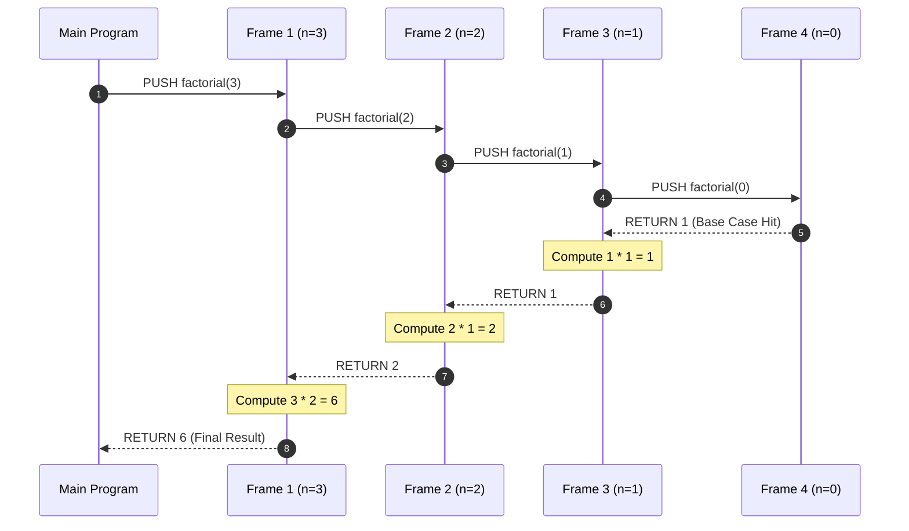
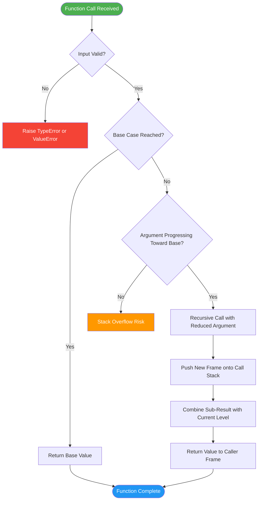
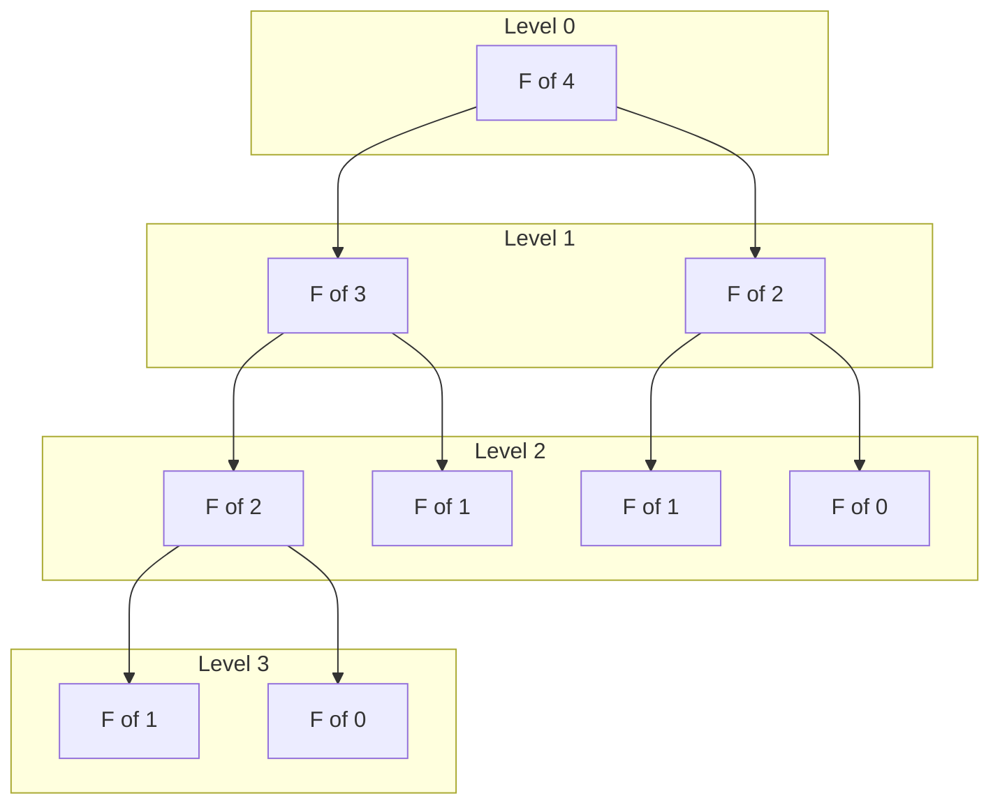
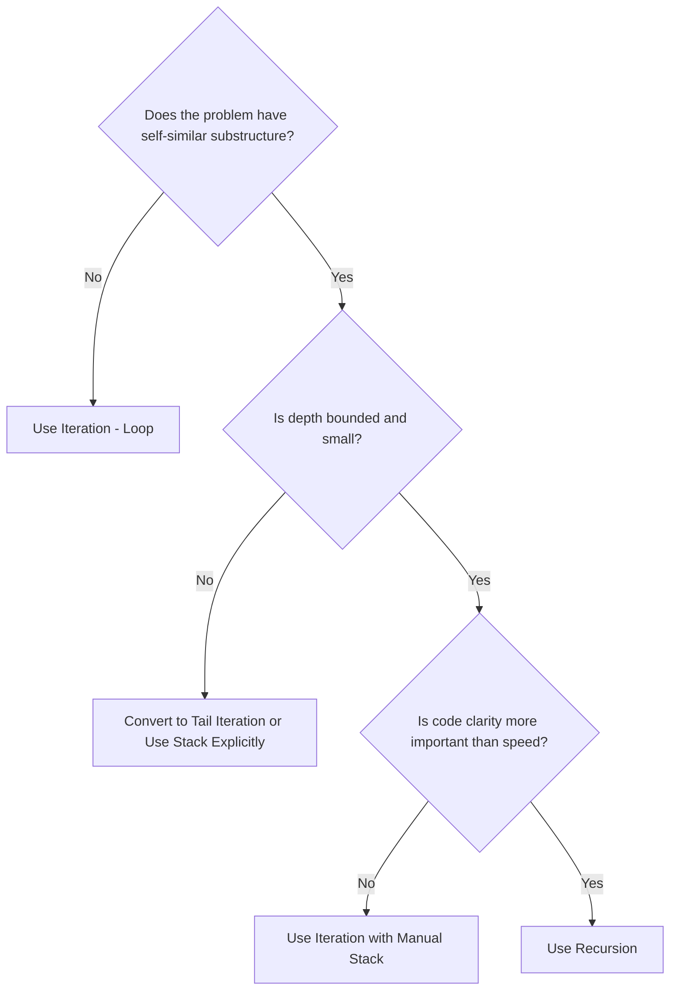

# Recursion and the Stack

<!-- SECTION_1_START -->
# Recursion and the Stack — Core Foundations

## 1.1 Formal Definition

**Recursion** is a problem-solving technique in computer science in which a function calls itself, either directly or indirectly, to solve a problem by breaking it down into smaller, similar sub-problems. Each recursive call works on a reduced instance of the original problem, eventually reaching a **base case** (terminating condition) that stops further recursion.

The **Call Stack** (or simply the **Stack**) is the underlying data structure provided by the Python runtime environment that supports recursion. It is a **Last-In, First-Out (LIFO)** abstract data type that stores activation records—commonly called **stack frames**—one for each active function invocation. When a function calls itself recursively, a new frame is *pushed* onto the stack; when the function returns, its frame is *popped* off.

> [!IMPORTANT]
> **KTU Syllabus Highlight (Module 3 – UCEST105):** Recursion is a core algorithmic construct. You must be able to define it precisely, trace its execution using the call stack, identify the base case and recursive case, and convert between recursive and iterative formulations.

## 1.2 Intuitive Analogy

Picture a set of **Russian nesting dolls (Matryoshka)**. To find the smallest doll, you must open the outer one, then the next, and the next, until you reach the tiniest solid doll at the center. At that point you start stacking the opened shells back together in reverse order.

In recursion, the **outer dolls** are the initial function calls, the **innermost solid doll** is the **base case**, and the act of **restacking the shells in reverse order** mirrors the **unwinding phase** of recursion where pending return values are combined back up the call stack.

> [!NOTE]
> **Memory Trick:** *Push* a new frame every time a function calls itself; *Pop* and combine the result when the function returns. The deepest level of nesting corresponds to the **base case**.

## 1.3 The Call Stack at a Glance

Each stack frame typically contains:

- **Local variables** of that invocation
- **The return address** (where execution should resume after the function returns)
- **The parameters** passed into the function
- A pointer to the **caller's frame**

> [!WARNING]
> **Recursion Depth Limit:** Python imposes a default maximum recursion depth of **1000** calls (`sys.getrecursionlimit()`). Deep recursion without a base case will raise a `RecursionError: maximum recursion depth exceeded`.

> [!VISUALIZATION CONTROL]
> **Concept:** Visualizing the call stack as a vertical tower of frames for `factorial(3)`.
> **GeoGebra / Desmos Input Equations:**
> * Point list representing stack frames (x-axis = frame index, y-axis = stack height):
>   - `(1, 3)`, `(2, 2)`, `(3, 1)`, `(4, 0)`
> * Vertical arrows: `(2, 2) → (2, 1)`, `(3, 1) → (3, 0)`
> **Visual Description:** The student should observe frames being pushed downward (1→4) as recursion deepens, and the parameter value shrinking (`3 → 2 → 1`) until it hits the base case at frame 4, after which results propagate back upward.
<!-- SECTION_1_END -->

<!-- SECTION_2_START -->
# Deep Theoretical Analysis & KTU High-Yield Formula Sheet

## 2.1 The Three Laws of Recursion (Mandatory Rules)

For any recursive algorithm to be correct, it must obey all three laws:

1. **Base Case (Termination Law):** There must exist at least one condition that returns a value *without* making a further recursive call. Without this, the function recurses infinitely and the stack overflows.
2. **Progress Law (Convergence):** Each recursive call must move the arguments strictly closer to the base case (e.g., decrementing `n` to `n - 1`).
3. **Design Assumption (Recursive Leap of Faith):** Assume the recursive call correctly solves the smaller sub-problem; the current level is only responsible for combining that result with the current level's work.

> [!TIP]
> **Why "Leap of Faith"?** A common beginner mistake is trying to mentally simulate *every* recursive call. Instead, trust that the recursive call returns the *correct* sub-answer and focus on writing the **current level's logic** only.

## 2.2 How the Call Stack Supports Recursion

| Phase | Stack Operation | What Happens |
|---|---|---|
| **Calling** | `PUSH` | A new frame is allocated; parameters and return address are stored. |
| **Executing** | Read/Write | Local variables are manipulated within the active frame. |
| **Returning** | `POP` | Return value is handed to the caller's frame; current frame is destroyed. |
| **Unwinding** | Sequential POPs | Pending return statements resolve from the deepest frame outward. |

> [!NOTE]
> **Stack Memory Cost:** Each frame consumes a fixed amount of memory (typically **48–128 bytes** in CPython for local variables and overhead). Therefore, a recursion of depth $n$ requires $O(n)$ auxiliary space, while an iterative solution for the same problem typically requires $O(1)$ space.

## 2.3 Recursion vs. Iteration — Engineering Trade-off

| Property | Recursion | Iteration |
|---|---|---|
| **Code clarity** | Often more elegant for tree/graph problems | More verbose for inherently recursive structures |
| **Space complexity** | $O(n)$ (call stack) | $O(1)$ typically (loop variables only) |
| **Time overhead** | Function call overhead per step | Minimal—direct loop execution |
| **Risk** | Stack overflow on deep recursion | Infinite loop on bad termination condition |
| **When to prefer** | Divide-and-conquer, backtracking, DFS | Simple accumulations, large linear scans |

## 2.4 KTU High-Yield Formula Sheet

> [!IMPORTANT]
> All formulas below are **examination-grade** and are routinely tested in KTU 2024 Scheme assessments for UCEST105.

| # | Concept | Formula / Expression | Description |
|---|---|---|---|
| 1 | Factorial | $n! = n \times (n-1)!,\ \ 0! = 1$ | Classic linear recursion |
| 2 | Fibonacci | $F(n) = F(n-1) + F(n-2),\ \ F(0)=0,\ F(1)=1$ | Binary recursion (two calls per level) |
| 3 | Sum of first $n$ naturals | $S(n) = n + S(n-1),\ \ S(0) = 0$ | Tail-recursive pattern |
| 4 | Power function | $a^n = a \times a^{n-1},\ \ a^0 = 1$ | Reduced recursion |
| 5 | Stack depth for $n$ levels | $\text{depth}(n) = n$ | Frames pushed before base case |
| 6 | Total space complexity | $O(n)$ | Linear in recursion depth |
| 7 | Time complexity (linear recursion) | $O(n)$ | One call per input unit |
| 8 | Time complexity (binary recursion, e.g. naïve Fibonacci) | $O(2^n)$ | Exponential due to repeated sub-problems |
| 9 | Maximum safe recursion depth (Python) | $\le 998$ | Below default limit of 1000 |
| 10 | Tail-recursion optimization | Not in CPython | Use iteration or `sys.setrecursionlimit()` cautiously |

## 2.5 Real-World Engineering Utility

Recursion is the *natural* paradigm for problems exhibiting **self-similar substructure**:

- **File system traversal** (`os.walk` recursively visits directories).
- **Tree and graph algorithms** (DFS, BFS, binary search tree operations).
- **Divide-and-conquer algorithms** (Merge Sort, Quick Sort, Binary Search).
- **Backtracking puzzles** (N-Queens, Sudoku, Maze solving).
- **Compiler design** (Abstract Syntax Trees are evaluated recursively).
- **JSON / XML parsing** (Nested data structures are inherently recursive).
<!-- SECTION_2_END -->

<!-- SECTION_3_START -->
# Step-by-Step Derivations, Trace Tables & Code Implementation

## 3.1 Worked Example 1 — Factorial of $n$

### 3.1.1 Mathematical Derivation

$$
\begin{aligned}
n! &= n \times (n-1) \times (n-2) \times \ldots \times 1 \\[4pt]
   &= n \times \big[(n-1) \times (n-2) \times \ldots \times 1\big] \\[4pt]
   &= n \times (n-1)! \\[4pt]
\text{Base case: } 0! &= 1
\end{aligned}
$$

### 3.1.2 Stack Trace for `factorial(3)`

| Call | Stack State (top → bottom) | Returns To | Value Returned |
|---|---|---|---|
| `factorial(3)` | `[factorial(3)]` | — | — |
| `factorial(3)` calls `factorial(2)` | `[factorial(3), factorial(2)]` | — | — |
| `factorial(2)` calls `factorial(1)` | `[factorial(3), factorial(2), factorial(1)]` | — | — |
| `factorial(1)` calls `factorial(0)` | `[factorial(3), factorial(2), factorial(1), factorial(0)]` | — | — |
| `factorial(0)` returns `1` | `[factorial(3), factorial(2), factorial(1)]` | `factorial(1)` | `1` |
| `factorial(1)` returns `1 * 1 = 1` | `[factorial(3), factorial(2)]` | `factorial(2)` | `1` |
| `factorial(2)` returns `2 * 1 = 2` | `[factorial(3)]` | `factorial(3)` | `2` |
| `factorial(3)` returns `3 * 2 = 6` | `[]` | main | `6` |

### 3.1.3 Python Implementation (Production-Grade)

```python
import sys
from typing import Union

Number = Union[int, float]

def factorial(n: int) -> int:
    """
    Compute n! using recursion.

    Args:
        n: A non-negative integer.

    Returns:
        The factorial of n (n!).

    Raises:
        TypeError: If n is not an integer.
        ValueError: If n is negative.
        RecursionError: If n exceeds Python's recursion limit.
    """
    # ---------- Input validation ----------
    if not isinstance(n, int):
        raise TypeError(f"factorial() expected an integer, got {type(n).__name__}")

    if n < 0:
        raise ValueError("factorial() is undefined for negative integers")

    # ---------- Base case (Law 1: Termination) ----------
    if n == 0 or n == 1:
        return 1

    # ---------- Recursive case (Law 2: Progress) ----------
    # n * factorial(n - 1) strictly reduces the argument toward 0
    return n * factorial(n - 1)


# ---------- Demonstration ----------
if __name__ == "__main__":
    for i in range(6):
        print(f"factorial({i}) = {factorial(i)}")
```

### 3.1.4 Expected Output

```
factorial(0) = 1
factorial(1) = 1
factorial(2) = 2
factorial(3) = 6
factorial(4) = 24
factorial(5) = 120
```

---

## 3.2 Worked Example 2 — Fibonacci Sequence

### 3.2.1 Mathematical Definition

$$
F(n) =
\begin{cases}
0, & n = 0 \\
1, & n = 1 \\
F(n-1) + F(n-2), & n \ge 2
\end{cases}
$$

### 3.2.2 Tree-Style Recursion Trace for $F(4)$

The recursive call structure forms a **binary tree** because each level spawns two sub-calls:

$$
\begin{aligned}
F(4) &= F(3) + F(2) \\[2pt]
F(3) &= F(2) + F(1) \\[2pt]
F(2) &= F(1) + F(0) \\[2pt]
F(1) &= 1 \\[2pt]
F(0) &= 0
\end{aligned}
$$

Notice that $F(2)$ is computed **twice** and $F(1)$ is computed **three times** — this redundancy is what gives naïve Fibonacci its $O(2^n)$ complexity.

### 3.2.3 Python Implementation (Naïve + Optimized Memoized)

```python
from functools import lru_cache
from typing import Dict

# ---------- Naïve O(2^n) ----------
def fibonacci_naive(n: int) -> int:
    """Naïve recursive Fibonacci — exponential time complexity."""
    if not isinstance(n, int) or n < 0:
        raise ValueError("n must be a non-negative integer")

    # Base cases
    if n == 0:
        return 0
    if n == 1:
        return 1

    # Recursive case — two sub-calls
    return fibonacci_naive(n - 1) + fibonacci_naive(n - 2)


# ---------- Optimized O(n) using memoization ----------
@lru_cache(maxsize=None)
def fibonacci_memoized(n: int) -> int:
    """Memoized Fibonacci — linear time complexity via decorator cache."""
    if n < 0:
        raise ValueError("n must be a non-negative integer")
    if n == 0:
        return 0
    if n == 1:
        return 1
    return fibonacci_memoized(n - 1) + fibonacci_memoized(n - 2)


# ---------- Iterative O(n) time, O(1) space ----------
def fibonacci_iterative(n: int) -> int:
    """Iterative Fibonacci — preferred for large n to avoid stack overflow."""
    if n < 0:
        raise ValueError("n must be a non-negative integer")
    a, b = 0, 1
    for _ in range(n):
        a, b = b, a + b
    return a


# ---------- Demonstration ----------
if __name__ == "__main__":
    for i in range(8):
        print(
            f"F({i}) = naive={fibonacci_naive(i)}, "
            f"memo={fibonacci_memoized(i)}, "
            f"iter={fibonacci_iterative(i)}"
        )
```

### 3.2.4 Expected Output

```
F(0) = naive=0, memo=0, iter=0
F(1) = naive=1, memo=1, iter=1
F(2) = naive=1, memo=1, iter=1
F(3) = naive=2, memo=2, iter=2
F(4) = naive=3, memo=3, iter=3
F(5) = naive=5, memo=5, iter=5
F(6) = naive=8, memo=8, iter=8
F(7) = naive=13, memo=13, iter=13
```

---

## 3.3 Worked Example 3 — Sum of First $n$ Naturals (Tail Recursion Pattern)

### 3.3.1 Mathematical Derivation

$$
\begin{aligned}
S(n) &= 1 + 2 + 3 + \ldots + n \\[4pt]
     &= n + S(n-1) \\[4pt]
S(0) &= 0
\end{aligned}
$$

### 3.3.2 Python Implementation

```python
def sum_naturals(n: int) -> int:
    """
    Compute 1 + 2 + ... + n using recursion.

    Args:
        n: A non-negative integer.

    Returns:
        The sum of the first n natural numbers.
    """
    if not isinstance(n, int):
        raise TypeError("n must be an integer")
    if n < 0:
        raise ValueError("n must be non-negative")

    # Base case
    if n == 0:
        return 0

    # Recursive case with progress toward base case
    return n + sum_naturals(n - 1)


# Demonstration
if __name__ == "__main__":
    print(f"sum_naturals(5) = {sum_naturals(5)}")  # Expected: 15
    print(f"sum_naturals(10) = {sum_naturals(10)}")  # Expected: 55
```

### 3.3.3 Step-by-Step Trace of `sum_naturals(5)`

$$
\begin{aligned}
S(5) &= 5 + S(4) \\
     &= 5 + \big[4 + S(3)\big] \\
     &= 5 + 4 + \big[3 + S(2)\big] \\
     &= 5 + 4 + 3 + \big[2 + S(1)\big] \\
     &= 5 + 4 + 3 + 2 + \big[1 + S(0)\big] \\
     &= 5 + 4 + 3 + 2 + 1 + 0 \\
     &= 15
\end{aligned}
$$

---

## 3.4 Worked Example 4 — Tower of Hanoi (Classic KTU Problem)

### 3.4.1 Problem Statement

Move $n$ disks from a source peg to a target peg using an auxiliary peg, obeying:
1. Only one disk may be moved at a time.
2. A larger disk may never be placed on a smaller disk.

### 3.4.2 Recursive Formulation

Let $H(n)$ denote the minimum number of moves required for $n$ disks. Then:

$$
\begin{aligned}
H(n) &= H(n-1) + 1 + H(n-1) \\
     &= 2 \cdot H(n-1) + 1 \\
H(1) &= 1
\end{aligned}
$$

Solving the recurrence:

$$
\begin{aligned}
H(n) &= 2^n - 1
\end{aligned}
$$

### 3.4.3 Python Implementation

```python
def hanoi(n: int, source: str, target: str, auxiliary: str, moves: list) -> None:
    """
    Recursively solve the Tower of Hanoi puzzle.

    Args:
        n: Number of disks.
        source: Label of the source peg.
        target: Label of the target peg.
        auxiliary: Label of the auxiliary peg.
        moves: List to record each move as a tuple (from, to).
    """
    if n < 1:
        raise ValueError("n must be a positive integer")

    # Base case: single disk — just move it
    if n == 1:
        moves.append((source, target))
        return

    # Recursive case:
    # Step 1: Move n-1 disks from source to auxiliary (using target as helper)
    hanoi(n - 1, source, auxiliary, target, moves)

    # Step 2: Move the largest disk from source to target
    moves.append((source, target))

    # Step 3: Move the n-1 disks from auxiliary to target (using source as helper)
    hanoi(n - 1, auxiliary, target, source, moves)


# ---------- Demonstration ----------
if __name__ == "__main__":
    move_log: list = []
    hanoi(3, "A", "C", "B", move_log)
    print(f"Total moves for 3 disks: {len(move_log)}")  # Expected: 7
    for i, (frm, to) in enumerate(move_log, start=1):
        print(f"Move {i}: {frm} -> {to}")
```

### 3.4.4 Expected Output

```
Total moves for 3 disks: 7
Move 1: A -> C
Move 2: A -> B
Move 3: C -> B
Move 4: A -> C
Move 5: B -> A
Move 6: B -> C
Move 7: A -> C
```
<!-- SECTION_3_END -->

<!-- SECTION_4_START -->
# Structural Diagrams & Schematics

## 4.1 Call Stack Lifecycle (Mermaid Sequence Diagram)



## 4.2 Recursion Flowchart (Three-Law Validator)



## 4.3 Binary Recursion Tree for Fibonacci (Subgraph View)



## 4.4 Stack Frame Internal Structure (Block Diagram)

```mermaid
flowchart LR
    subgraph CallerFrame["CALLER FRAME (n=3)"]
        Param3["Parameter: n = 3"]
        Local3["Local Variables"]
        RetAddr3["Return Address: line 12 in main"]
    end

    subgraph CurrentFrame["CURRENT FRAME (n=2)"]
        Param2["Parameter: n = 2"]
        Local2["Local Variables"]
        RetAddr2["Return Address: line 4 in factorial(3)"]
    end

    subgraph BaseFrame["BASE FRAME (n=0)"]
        Param0["Parameter: n = 0"]
        Local0["Local Variables"]
        RetAddr0["Return Address: line 4 in factorial(1)"]
        Result0["Return Value: 1"]
    end

    CallerFrame -->|invokes| CurrentFrame
    CurrentFrame -->|invokes| BaseFrame
    BaseFrame -->|returns 1| CurrentFrame
    CurrentFrame -->|returns 2| CallerFrame
```



## 4.5 Recursion vs Iteration Decision Matrix



> [!TIP]
> **Reading the Diagrams:** In diagram 4.4, observe how the *return value* flows *upward* (from base to caller) while the *function calls* flow *downward*. This bidirectional flow is the hallmark of recursive execution.
<!-- SECTION_4_END -->

<!-- SECTION_5_START -->
# KTU 2024 Scheme Examination Question Bank & Topic Recap

---

## Part A — Short Answer Questions (3 Marks Each)

### Question 1 `[KTU University Exam – July 2024]`
**(CO1, Remember)** Define **recursion** in Python. State the **three laws of recursion** with a one-line explanation for each.

**Model Answer:**

Recursion is a programming technique in which a function solves a problem by calling a smaller version of itself, with each call operating on a reduced input until a stopping condition is met.

**The Three Laws of Recursion:**

1. **Base Case (Termination Law):** There must be at least one scenario where the function returns a value immediately without making a recursive call.
2. **Progress Law (Convergence):** Every recursive call must modify the argument(s) so that they strictly move closer to the base case.
3. **Recursive Leap of Faith:** Assume the recursive call correctly solves the smaller sub-problem; the current level need only combine that answer with its own work.

*[Complete enumeration of three laws with examples: 3 Marks]*

---

### Question 2 `[KTU University Exam – Dec 2023]`
**(CO2, Understand)** Explain the role of the **call stack** in supporting recursive function calls. What happens when the maximum recursion depth is exceeded?

**Model Answer:**

The call stack is a **LIFO (Last-In, First-Out)** data structure maintained by the Python runtime. Each time a function is called, a new **stack frame** containing parameters, local variables, and the return address is *pushed* onto the stack. When a function calls itself recursively, this process repeats, growing the stack. Upon return, the frame is *popped* and its value is passed back to the calling frame.

If recursion continues without reaching a base case, the stack keeps growing until it exceeds the system's allocated memory. Python raises a **`RecursionError: maximum recursion depth exceeded`** when the call count crosses the limit (default **1000**).

*[Definition of call stack: 1 Mark] [Push/Pop mechanism: 1 Mark] [RecursionError explanation: 1 Mark]*

---

## Part B — Long Answer Questions (14 Marks Each — Internal Choice)

### Question 3 — Choice A `[KTU University Exam – Dec 2024]`
**(CO2, CO3 — Apply & Analyze)** 

**(a) [7 Marks]** Write a recursive Python function to compute the **factorial of a non-negative integer $n$**. Draw the call stack diagram showing all frames for the call `factorial(4)`.

**(b) [7 Marks]** Trace the call stack for computing `fibonacci(4)` using the naïve recursive approach. Identify the **repeated sub-problems** and explain how **memoization** eliminates them.

---

#### Solution to (a):

**Python Code:**

```python
def factorial(n: int) -> int:
    if not isinstance(n, int) or n < 0:
        raise ValueError("n must be a non-negative integer")
    if n == 0 or n == 1:        # Base case
        return 1
    return n * factorial(n - 1)  # Recursive case with progress
```

**Call Stack Diagram for `factorial(4)`:**

```
TOP  ┌─────────────────────────┐
     │ factorial(0)  → returns 1 │
     ├─────────────────────────┤
     │ factorial(1)  → returns 1*1 = 1 │
     ├─────────────────────────┤
     │ factorial(2)  → returns 2*1 = 2 │
     ├─────────────────────────┤
     │ factorial(3)  → returns 3*2 = 6 │
     ├─────────────────────────┤
BOTTOM │ factorial(4)  → returns 4*6 = 24 │
     └─────────────────────────┘
```

**Valuation Key:**
- [Base case correctly identified: 2 Marks]
- [Recursive case with progress toward base: 2 Marks]
- [Complete call stack for 4 levels: 2 Marks]
- [Final returned value of 24: 1 Mark]

---

#### Solution to (b):

**Call Stack Trace for `fibonacci(4)`:**

```
fibonacci(4) calls fibonacci(3) and fibonacci(2)
  fibonacci(3) calls fibonacci(2) and fibonacci(1)
    fibonacci(2) returns 1
    fibonacci(1) returns 1
  fibonacci(3) returns 2
  fibonacci(2) returns 1
fibonacci(4) returns 3
```

**Repeated Sub-Problems Identified:**

| Sub-Problem | Number of Times Computed |
|---|---|
| `fibonacci(0)` | 1 |
| `fibonacci(1)` | 2 |
| `fibonacci(2)` | **2** (repeated) |
| `fibonacci(3)` | 1 |

**Memoization Fix:** Store each computed `fibonacci(k)` in a cache (e.g., dictionary or `@lru_cache`). On subsequent calls, return the cached value in $O(1)$ instead of recomputing. This reduces the complexity from $O(2^n)$ to **$O(n)$**.

**Valuation Key:**
- [Correct expansion of binary call tree: 3 Marks]
- [Identification of repeated sub-problems: 2 Marks]
- [Memoization concept and complexity reduction: 2 Marks]

---

### Question 3 — Choice B `[KTU University Exam – July 2024]`
**(CO2, CO3 — Apply & Analyze)**

**(a) [7 Marks]** Write a recursive Python function `power(base, exp)` that computes $b^e$ for non-negative integer exponent $e$. Include proper input validation and explain the **base case**, **recursive case**, and **progress condition**.

**(b) [7 Marks]** Explain the **Tower of Hanoi** problem. Derive the recurrence relation for the minimum number of moves and show that the minimum number of moves for $n=4$ disks is $15$.

---

#### Solution to (a):

**Python Code:**

```python
def power(base: float, exp: int) -> float:
    if not isinstance(exp, int) or exp < 0:
        raise ValueError("exp must be a non-negative integer")

    # Base case: any number raised to 0 is 1
    if exp == 0:
        return 1

    # Recursive case: base * power(base, exp - 1)
    return base * power(base, exp - 1)
```

**Explanation:**

- **Base Case:** When `exp == 0`, the function returns `1` without further recursion. This satisfies the Termination Law.
- **Recursive Case:** The function computes `base * power(base, exp - 1)`, which uses the smaller exponent `exp - 1` to build up the final result.
- **Progress Condition:** The argument `exp` decreases by `1` on every call, strictly moving toward the base case `exp == 0`. After exactly `exp` calls, the base case is reached.

**Valuation Key:**
- [Base case identification: 1 Mark]
- [Recursive case with progress: 2 Marks]
- [Input validation and error handling: 1 Mark]
- [Conceptual explanation of all three laws: 3 Marks]

---

#### Solution to (b):

**Problem Recurrence Derivation:**

$$
\begin{aligned}
H(n) &= H(n-1) + 1 + H(n-1) \quad \text{(move top } n-1 \text{, then biggest, then top } n-1 \text{)} \\[4pt]
     &= 2 \cdot H(n-1) + 1 \\[4pt]
H(1) &= 1
\end{aligned}
$$

**Closed-Form Derivation:**

$$
\begin{aligned}
H(1) &= 1 = 2^1 - 1 \\
H(2) &= 2 \cdot 1 + 1 = 3 = 2^2 - 1 \\
H(3) &= 2 \cdot 3 + 1 = 7 = 2^3 - 1 \\
H(4) &= 2 \cdot 7 + 1 = 15 = 2^4 - 1
\end{aligned}
$$

Therefore, $H(n) = 2^n - 1$.

**For $n=4$ disks:** $H(4) = 2^4 - 1 = 16 - 1 = \mathbf{15}$ moves.

**Valuation Key:**
- [Correct recurrence relation: 3 Marks]
- [Step-by-step evaluation: 2 Marks]
- [Final closed form $2^n - 1$: 1 Mark]
- [Final numerical answer of 15: 1 Mark]

---

> [!WARNING]
> **KTU Examiner's Valuation Warning — Common Pitfalls:**
> 1. **Missing Base Case:** Students frequently write only the recursive case and forget `if n == 0: return 1`. This is an *instant 2-mark deduction* in KTU papers.
> 2. **No Progress Toward Base Case:** Writing `factorial(n - 2)` instead of `factorial(n - 1)` for an even/odd-specific logic still progresses but loses a mark if the condition is not justified.
> 3. **Ignoring Input Validation:** KTU 2024 scheme emphasizes *robust code*. Failing to validate negative input or non-integer types loses **1–2 marks**.
> 4. **Forgetting Return Value Combination:** In Fibonacci, students sometimes forget the `+` operation. Always write `return fibonacci(n-1) + fibonacci(n-2)`.
> 5. **Confusing Stack Overflow with Memory Leak:** Recursion overflow is a *stack* issue, not a *heap* issue. Do not write "memory leak" in answers.

---

## Topic Recap & Important Things to Remember

- **Recursion** is a problem-solving technique where a function calls itself with a smaller argument, governed by **three laws**: base case, progress, and leap of faith.
- The **Call Stack** is a **LIFO** data structure that stores one **stack frame** per active function call.
- Each frame contains the **parameters, local variables, and return address** for that invocation.
- Python's default **recursion limit is 1000**; exceeding it raises a `RecursionError`.
- The **base case** is the termination condition — without it, recursion never ends and the stack overflows.
- The **recursive case** must make progress (e.g., $n \rightarrow n-1$) so that the base case is reachable.
- **Factorial:** $n! = n \cdot (n-1)!$ with $0! = 1$. Time: $O(n)$, Space: $O(n)$.
- **Fibonacci:** $F(n) = F(n-1) + F(n-2)$ with $F(0)=0, F(1)=1$. Naïve time: $O(2^n)$; memoized: $O(n)$.
- **Sum of naturals:** $S(n) = n + S(n-1)$ with $S(0)=0$.
- **Tower of Hanoi:** $H(n) = 2 \cdot H(n-1) + 1$ with $H(1)=1$, giving $H(n) = 2^n - 1$.
- **Space complexity** of recursive algorithms is generally $O(n)$ due to stack frame allocation.
- **Memoization** (using `@lru_cache` or dictionaries) eliminates redundant computations in overlapping sub-problems.
- **Tail recursion** (where the recursive call is the last operation) is *not optimized* in CPython — prefer iteration for deep recursions.
- Use **`sys.setrecursionlimit(new_limit)`** cautiously; it does not increase the C stack size of the OS.
- **Recursion is preferred** for tree/graph traversal, divide-and-conquer, and backtracking problems.
- **Iteration is preferred** for simple linear scans, large $n$ values, or memory-constrained environments.
<!-- SECTION_5_END -->
