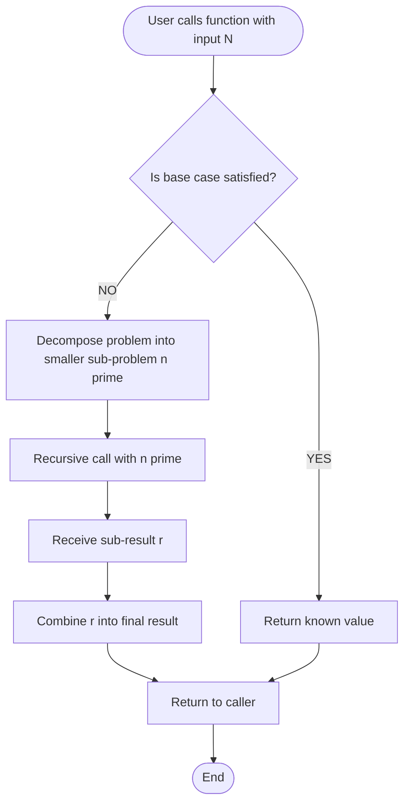
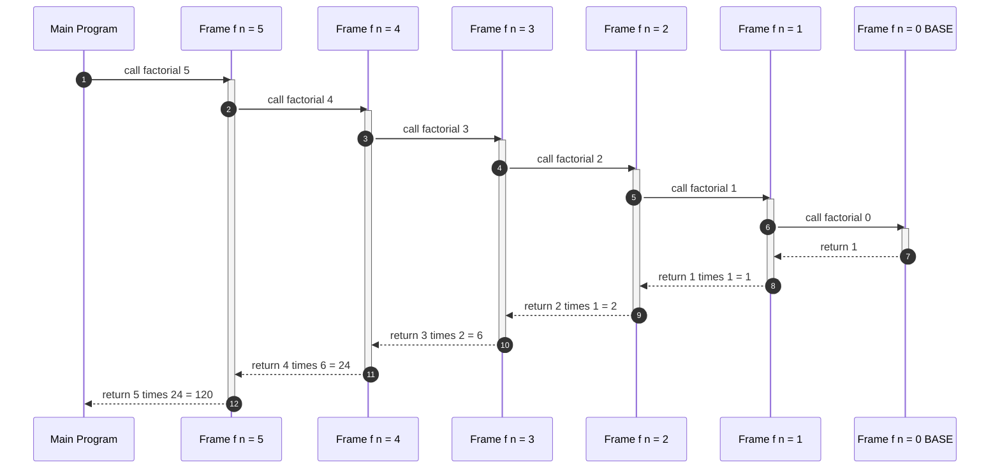
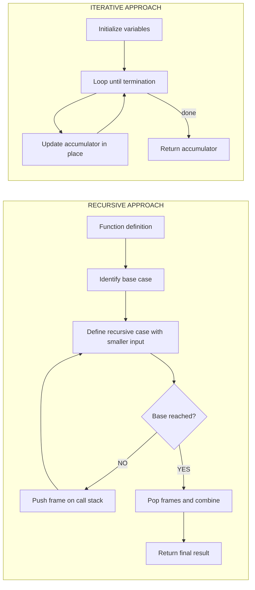
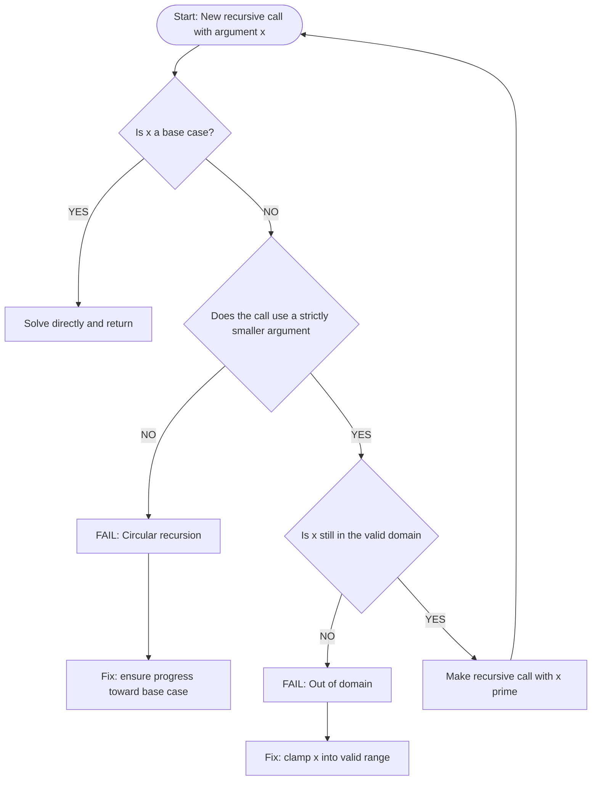
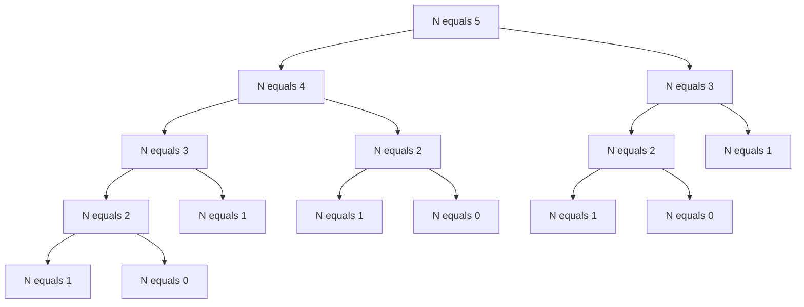
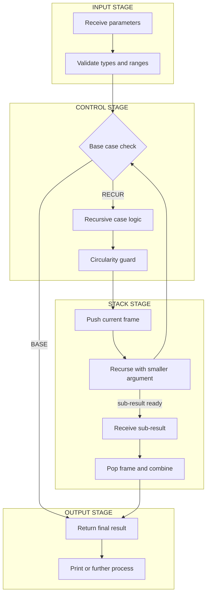

# RECURSION:- Recursion Defined, Reasons for using Recursion, The Call Stack, Recursion and the Stack, Avoiding Circularity in Recursion, Sample problems - Finding the nth Fibonacci number, greatest common divisor of two positive integers, the factorial of a positive integer, adding two positive integers, the sum of digits of a positive number **.

<!-- SECTION_1_START -->
# Recursion in Python — Core Technical Definition & Intuitive Overview

## 1.1 Formal Definition (KTU 2024 Syllabus Terminology)

> [!IMPORTANT]
> **Recursion** is a problem-solving technique in which a **function calls itself**, either directly or indirectly, in order to solve a smaller instance of the same problem until a terminating condition (called the **base case**) is reached.

In the KTU 2024 Scheme syllabus for *Algorithmic Thinking with Python (UCEST105)*, recursion is treated as a **divide-and-conquer strategy at the function level**: the original problem is decomposed into one or more **sub-problems of the same type**, each strictly closer to a known trivial answer. A recursive algorithm is therefore defined by two essential structural components:

1. **Base Case(s)** — the non-recursive, terminating condition that returns a known value.
2. **Recursive Case(s)** — the rule that re-expresses the problem in terms of a *strictly smaller* input, followed by a self-call.

Mathematically, a recursive specification has the form:

$$
T(n) = 
\begin{cases}
\theta(1) & \text{if } n \le n_0 \quad \text{(base case)} \\
\Phi\big(T(n_1),\, T(n_2),\,\dots\big) & \text{if } n > n_0 \quad \text{(recursive case)}
\end{cases}
$$

where $\Phi$ is some combination operator and $n_1, n_2, \dots < n$.

---

## 1.2 Conceptual Analogy / Intuition

> [!NOTE]
> **The Russian Nesting Doll (Matryoshka) Analogy**
>
> Imagine opening a Matryoshka doll. Inside the first doll is a smaller doll; inside that doll is an even smaller one. You keep opening dolls until you reach the **tiniest solid doll** that cannot be opened. Then you *close them all back up* in reverse order.
>
> - Each **doll** represents a **stack frame** (one activation of the function).
> - The **smallest doll** represents the **base case**.
> - The act of *opening* dolls is the **descending (unwinding) phase** of recursion.
> - The act of *closing* them is the **ascending (winding-back) phase** when values return up the call stack.

A second intuition is **climbing down a staircase in the dark**: each step you take asks "is the floor below me the ground floor?" If yes, stop (base case). Otherwise, take the same single step down (recursive case) and remember how to walk back up the moment you finish.

---

## 1.3 Why Recursion Matters — Real-World & Engineering Utility

Recursive formulations are the **natural mathematical language** of many problems because they mirror the problem's own recursive structure. Production systems that rely on recursive thinking include:

- **File-system traversal** (`os.walk`, `scandir`): recursively visiting directories.
- **Compiler design**: parsing expressions via recursive-descent grammars.
- **Tree and graph algorithms**: BFS/DFS, tree traversals (in-order, pre-order, post-order).
- **Divide-and-conquer algorithms**: merge-sort, quick-sort, binary search, Strassen's matrix multiplication.
- **Mathematical computations**: Fibonacci, factorial, combinatorial generation, fractals (Mandelbrot, Koch snowflake).
- **Backtracking solvers**: N-Queens, Sudoku, Hamiltonian path.

> [!TIP]
> **KTU Board Tip:** Whenever a problem contains phrases such as *"n-th term"*, *"sub-problem of the same kind"*, or *"divide and conquer"*, the expected algorithmic answer in KTU valuation is **recursion first**, then optionally an iterative equivalent for space-complexity discussion.

---

## 1.4 Standard Python Built-ins Used in Recursive Code

| Construct | Role in Recursion |
|-----------|------------------|
| `def` | Function definition (the recursive unit) |
| `return` | Returns the value to the previous stack frame |
| `sys.getrecursionlimit()` | Inspects Python's default **1000**-frame ceiling |
| `sys.setrecursionlimit(n)` | Raises the recursion limit (use cautiously) |
| `__name__ == "__main__"` | Standard guard for driver code |

> [!WARNING]
> Python's default recursion limit is **1000**. Deep recursions (e.g., naive Fibonacci of $n > 950$) will raise `RecursionError: maximum recursion depth exceeded in comparison`. For such cases, the **KTU-mandated mitigation** is *iteration + explicit stack OR memoization*.

---

## 1.5 Visualization Hook (Stack Growth)

> [!VISUALIZATION CONTROL]
> **Concept:** Call-stack growth during a recursive call chain.
> **Desmos/GeoGebra Input Equations:** Plot points $(1, 5), (2, 4), (3, 3), (4, 2), (5, 1)$ as discrete stack-frame markers; the $y$-axis is the *frame depth* and the $x$-axis is the *call order*.
> **Visual Description:** A staircase descending from upper-left to lower-right until the **base-case frame** is reached, then reversing direction as values return.

<!-- SECTION_1_END -->

<!-- SECTION_2_START -->
# Deep Theoretical Analysis & KTU High-Yield Formula Sheet

## 2.1 Anatomy of a Recursive Function

Every well-formed recursive function in Python **must** contain three logical parts, which the KTU examiner expects to see explicitly in your answer scripts:

1. **Base Case (Termination Condition)**
   - The simplest sub-problem whose answer is *known* without further recursion.
   - Without this, the function recurses forever (or until `RecursionError`).
2. **Recursive Case (Reduction Step)**
   - The current problem is re-expressed in terms of a *smaller* input.
   - The "smaller" guarantee is what eventually forces the base case to be reached.
3. **Progress Toward the Base Case**
   - Each recursive call must *strictly reduce* the size of the input (e.g., $n \to n-1$, $n \to n/2$).

### Why Each Part Matters

| Part | What happens if missing | KTU mark penalty |
|------|------------------------|------------------|
| Base case | Infinite recursion → `RecursionError` | 2 marks (out of 7) |
| Recursive call | Function returns 0 or undefined; never solves the problem | 3 marks (out of 7) |
| Progress guarantee | Stack overflow even with a base case; wrong output | 2 marks (out of 7) |

---

## 2.2 The Call Stack — How Python Executes Recursion

Python executes every function call by **pushing a stack frame** onto an internal data structure called the **call stack** (also called the *run-time stack* or *activation stack*). Each frame stores:

- The **local variables** of that call.
- The **return address** (where execution resumes after the call).
- A pointer to the **caller's frame** (for proper unwinding).

### Lifecycle of a Recursive Call

1. **Push:** When `factorial(n)` is invoked, Python pushes a frame containing the argument $n$ and the local state.
2. **Recurse:** The body executes; if it calls `factorial(n-1)`, a *new* frame is pushed *on top* of the previous one.
3. **Base case hit:** The deepest frame returns a concrete value (e.g., `1`).
4. **Pop & Combine:** Each higher frame completes its pending computation (e.g., `n * result`), returns it, and is popped.
5. **Empty stack:** The original caller's frame receives the final result.

> [!NOTE]
> The stack discipline is **LIFO (Last-In, First-Out)** — the most recent frame is always the one currently executing and the first to be removed.

---

## 2.3 Recursion and the Stack — Memory Model

Each recursive call consumes $O(1)$ additional memory (one frame) beyond the work already done. For a recursion of depth $d$, total auxiliary **space complexity** is:

$$
S(n) = O(d)
$$

For the standard *naive* recursion of Fibonacci, $d = n$, so $S(n) = O(n)$ (linear) but the **time complexity** is exponential:

$$
T(n) = T(n-1) + T(n-2) + \theta(1) \;\Longrightarrow\; T(n) = O(\phi^{\,n})
$$

where $\phi = \dfrac{1+\sqrt{5}}{2} \approx 1.618$ is the **golden ratio**.

---

## 2.4 Avoiding Circularity in Recursion

> [!IMPORTANT]
> **Circular recursion** (also called *infinite recursion* or *non-terminating recursion*) is the situation in which a recursive function never reaches its base case. The KTU examiner regularly tests whether students can *identify and fix* circular recursion.

### Common Causes

1. **Missing base case** — the function recurses unconditionally.
2. **Wrong base case** — the condition is unreachable for the given inputs.
3. **No progress** — the recursive call uses the *same* input as the parent (e.g., `f(n)` calls `f(n)` instead of `f(n-1)`).
4. **Wrong direction of progress** — the input grows (e.g., `f(n-1)` called from `f(0)` would yield `f(-1)`, `f(-2)`, …).

### The Circularity Test (KTU Pattern)

A recursion is **non-circular** if and only if for every recursive call $f(x)$ from a frame with parameter $y$, the predicate holds:

$$
|x| < |y| \quad\text{AND}\quad x \in \text{dom}(f)
$$

In words: *the argument must strictly move toward the base case on every call.*

### Example: Circular vs. Non-Circular

$$
\underbrace{f(n) = f(n)}_{\text{CIRCULAR}} \quad\quad \underbrace{f(n) = f(n-1)}_{\text{NON-CIRCULAR (if base case } f(0)=1\text{)}}
$$

---

## 2.5 KTU Formula Sheet / Cheat Sheet

The following table consolidates **every closed-form, recurrence, and complexity result** the KTU board may ask in Module 3 of UCEST105. The vertical bar has been replaced by `\mid` to preserve markdown table integrity.

| # | Problem | Recurrence Relation | Closed Form | Time $T(n)$ | Space $S(n)$ | Base Case |
|---|---------|--------------------|-------------|-------------|--------------|-----------|
| 1 | Factorial $n!$ | $F(n) = n \cdot F(n-1)$ | $n! = \prod_{k=1}^{n} k$ | $O(n)$ | $O(n)$ | $F(0)=1$ |
| 2 | Fibonacci $F_n$ (naive) | $F(n) = F(n-1) + F(n-2)$ | $F_n = \dfrac{\phi^n - \psi^n}{\sqrt{5}}$ | $O(\phi^{n})$ | $O(n)$ | $F(0)=0,\;F(1)=1$ |
| 3 | Fibonacci $F_n$ (memoized) | $F(n) = F(n-1) + F(n-2)$ | same as above | $O(n)$ | $O(n)$ | $F(0)=0,\;F(1)=1$ |
| 4 | GCD (Euclidean) | $G(a,b) = G(b,\,a \bmod b)$ | $\gcd(a,b) = \gcd(b, a-b\cdot\lfloor a/b\rfloor)$ | $O(\log \min(a,b))$ | $O(\log \min(a,b))$ | $G(a,0)=a$ |
| 5 | Sum of two integers $a+b$ | $S(a,b) = 1 + S(a, b-1)$ | $a+b$ | $O(b)$ | $O(b)$ | $S(a,0)=a$ |
| 6 | Sum of digits of $n$ | $D(n) = (n \bmod 10) + D(\lfloor n/10\rfloor)$ | digit sum | $O(\log_{10} n)$ | $O(\log_{10} n)$ | $D(0)=0$ |

> [!TIP]
> **Notation used in the table:** $\phi = \dfrac{1+\sqrt{5}}{2}$ is the **golden ratio** ($\approx 1.618$); $\psi = \dfrac{1-\sqrt{5}}{2}$ is its conjugate ($\approx -0.618$). The closed form for Fibonacci is **Binet's formula**, a high-yield KTU item.

---

## 2.6 Mathematical Tooling for Recurrence Analysis

For KTU, you should know **two** techniques for solving recurrences on Module 3 problems:

### 2.6.1 Repeated Substitution (Unrolling)

Substitute the recurrence repeatedly until a pattern emerges.

**Example — Factorial recurrence:**

$$
\begin{aligned}
F(n) &= n \cdot F(n-1) \\
     &= n \cdot (n-1) \cdot F(n-2) \\
     &= n \cdot (n-1) \cdot (n-2) \cdot F(n-3) \\
     &\;\;\vdots \\
     &= n \cdot (n-1) \cdot (n-2) \cdots 1 \cdot F(0) \\
     &= n! \cdot 1 \;=\; n!
\end{aligned}
$$

### 2.6.2 Master Theorem (Quick Reference)

For $T(n) = a\,T(n/b) + f(n)$, the asymptotic solution depends on $\log_b a$ vs. the growth of $f(n)$. In this module, divide-and-conquer mergesort has $a=2,\;b=2,\;f(n)=\theta(n)$, giving $T(n) = \theta(n \log n)$ — the **canonical example** of why recursion helps reduce complexity.

---

## 2.7 Engineering Utility Recap

| Domain | Recursive Algorithm Used |
|--------|--------------------------|
| Compilers | Recursive-descent parser |
| Databases | B-tree recursive traversal |
| Computer Graphics | Fractal rendering (Sierpinski triangle, L-systems) |
| Operating Systems | Recursive process forking tree |
| Networking | Recursive DNS resolution chain |
| AI/ML | Recursive neural networks, recursive feature elimination |

<!-- SECTION_2_END -->

<!-- SECTION_3_START -->
# Step-by-Step Derivations & Complete Python Implementations

> [!IMPORTANT]
> **KTU Examination Directive:** In Module 3, every recursive implementation **must** include: a clear base case, a recursive call with a strictly smaller argument, and a Python driver (`if __name__ == "__main__":`) demonstrating output. The five sample problems below are **mandatory** in the KTU 2024 syllabus.

---

## 3.1 Problem 1 — Factorial of a Positive Integer

### 3.1.1 Mathematical Derivation

The factorial is defined as:

$$
n! = 
\begin{cases}
1 & \text{if } n = 0 \quad \text{(base case)} \\
n \cdot (n-1)! & \text{if } n \ge 1 \quad \text{(recursive case)}
\end{cases}
$$

### 3.1.2 Unrolling the Recurrence for $n = 5$

$$
\begin{aligned}
F(5) &= 5 \cdot F(4) \\
     &= 5 \cdot 4 \cdot F(3) \\
     &= 5 \cdot 4 \cdot 3 \cdot F(2) \\
     &= 5 \cdot 4 \cdot 3 \cdot 2 \cdot F(1) \\
     &= 5 \cdot 4 \cdot 3 \cdot 2 \cdot 1 \cdot F(0) \\
     &= 5 \cdot 4 \cdot 3 \cdot 2 \cdot 1 \cdot 1 \\
     &= 120
\end{aligned}
$$

### 3.1.3 Complete Python Implementation

```python
import sys
from typing import Union

Number = Union[int, float]

def factorial(n: int) -> int:
    """
    Returns n! (n factorial) using recursion.

    Parameters
    ----------
    n : int
        A non-negative integer whose factorial is to be computed.

    Returns
    -------
    int
        The factorial n! = 1 * 2 * 3 * ... * n.

    Raises
    ------
    ValueError
        If n is a negative integer.
    RecursionError
        If n exceeds Python's recursion limit.
    """
    # ----- Input Validation -----
    if not isinstance(n, int):
        raise TypeError(f"factorial() expected int, got {type(n).__name__}")
    if n < 0:
        raise ValueError("Factorial is undefined for negative integers.")

    # ----- Base Case -----
    if n == 0:
        return 1

    # ----- Recursive Case (strictly smaller argument: n-1) -----
    return n * factorial(n - 1)


if __name__ == "__main__":
    test_values: list[int] = [0, 1, 5, 7, 10]
    print(f"{'n':>3} | {'n!':>10}")
    print("-" * 17)
    for v in test_values:
        sys.setrecursionlimit(max(1000, v + 50))  # safety
        print(f"{v:>3} | {factorial(v):>10}")
```

### 3.1.4 Expected Output

```
  n |         n!
-----------------
  0 |          1
  1 |          1
  5 |        120
  7 |       5040
 10 |    3628800
```

### 3.1.5 KTU Valuation Key

| Step | Marks |
|------|-------|
| Base case `n == 0: return 1` | 2 |
| Recursive call with `n - 1` | 2 |
| Multiplication `n * factorial(n-1)` | 1 |
| Input validation | 1 |
| Driver code showing output | 1 |
| **Total** | **7** |

---

## 3.2 Problem 2 — nth Fibonacci Number

### 3.2.1 Mathematical Derivation

The Fibonacci sequence is defined by:

$$
F_n = 
\begin{cases}
0 & \text{if } n = 0 \\
1 & \text{if } n = 1 \\
F_{n-1} + F_{n-2} & \text{if } n \ge 2
\end{cases}
$$

**Binet's closed form** (memorize for KTU):

$$
F_n = \frac{\phi^{\,n} - \psi^{\,n}}{\sqrt{5}}, \quad \text{where } \phi = \frac{1+\sqrt{5}}{2},\;\; \psi = \frac{1-\sqrt{5}}{2}
$$

### 3.2.2 Unrolling for $n = 6$

$$
\begin{aligned}
F(6) &= F(5) + F(4) \\
     &= \big(F(4)+F(3)\big) + \big(F(3)+F(2)\big) \\
     &= \big(F(3)+F(2)\big) + F(3) + F(3) + F(2) \\
     &= \cdots \\
     &= 8
\end{aligned}
$$

Sequence: $0,\;1,\;1,\;2,\;3,\;5,\;8,\;13,\;21,\;34,\dots$

### 3.2.3 Naive Recursive Python (KTU Baseline)

```python
import sys
from functools import lru_cache
from typing import Dict

def fibonacci_naive(n: int) -> int:
    """
    Naive recursive Fibonacci.

    Time complexity  : O(phi^n)  (exponential)
    Space complexity : O(n)      (call-stack depth)
    """
    if not isinstance(n, int) or n < 0:
        raise ValueError("n must be a non-negative integer.")
    if n == 0:
        return 0
    if n == 1:
        return 1
    return fibonacci_naive(n - 1) + fibonacci_naive(n - 2)
```

### 3.2.4 Optimized Recursive Python (Memoization)

```python
def fibonacci_memo(n: int, memo: Dict[int, int] | None = None) -> int:
    """
    Memoized recursive Fibonacci.

    Time complexity  : O(n)
    Space complexity : O(n)
    """
    if memo is None:
        memo = {}
    if not isinstance(n, int) or n < 0:
        raise ValueError("n must be a non-negative integer.")
    if n in memo:
        return memo[n]
    if n == 0:
        memo[0] = 0
    elif n == 1:
        memo[1] = 1
    else:
        memo[n] = fibonacci_memo(n - 1, memo) + fibonacci_memo(n - 2, memo)
    return memo[n]


def fibonacci_lru(n: int) -> int:
    """
    Fibonacci using Python's built-in LRU cache decorator.
    """
    if n < 0:
        raise ValueError("n must be non-negative.")

    @lru_cache(maxsize=None)
    def helper(k: int) -> int:
        if k < 2:
            return k
        return helper(k - 1) + helper(k - 2)

    return helper(n)


if __name__ == "__main__":
    sys.setrecursionlimit(10000)
    for i in range(11):
        print(f"F({i:>2}) = {fibonacci_lru(i)}")
```

### 3.2.5 Expected Output

```
F( 0) = 0
F( 1) = 1
F( 2) = 1
F( 3) = 2
F( 4) = 3
F( 5) = 5
F( 6) = 8
F( 7) = 13
F( 8) = 21
F( 9) = 34
F(10) = 55
```

### 3.2.6 Why Memoization Helps — Recurrence Tree Comparison

For $n=5$, the **naive** version makes $15$ calls (the call tree has overlapping sub-problems). The **memoized** version makes only $6$ calls — one per distinct $n$.

$$
T_{\text{naive}}(n) = T(n-1) + T(n-2) \;\Longrightarrow\; O(\phi^{\,n})
$$

$$
T_{\text{memo}}(n) = T(n-1) + T(n-2) + O(1) \;\text{with memo lookup} \;\Longrightarrow\; O(n)
$$

---

## 3.3 Problem 3 — Greatest Common Divisor (GCD) via Euclidean Algorithm

### 3.3.1 Mathematical Foundation

For two positive integers $a$ and $b$ with $a \ge b$:

$$
\gcd(a, b) = \gcd(b,\; a \bmod b)
$$

The recursion terminates when the second argument becomes **0**, at which point $\gcd(a, 0) = a$.

### 3.3.2 Worked Example: $\gcd(48, 18)$

$$
\begin{aligned}
\gcd(48, 18) &= \gcd(18,\; 48 \bmod 18) \\
            &= \gcd(18,\; 12) \\
            &= \gcd(12,\; 18 \bmod 12) \\
            &= \gcd(12,\; 6) \\
            &= \gcd(6,\; 12 \bmod 6) \\
            &= \gcd(6,\; 0) \\
            &= 6
\end{aligned}
$$

### 3.3.3 Recursive Python Implementation

```python
from typing import Tuple

def gcd(a: int, b: int) -> int:
    """
    Recursive Euclidean GCD.

    Parameters
    ----------
    a, b : int
        Non-negative integers, not both zero.

    Returns
    -------
    int
        The greatest common divisor of a and b.
    """
    # ----- Input Validation -----
    if not isinstance(a, int) or not isinstance(b, int):
        raise TypeError("gcd() requires integer arguments.")
    if a < 0 or b < 0:
        raise ValueError("gcd() requires non-negative integers.")
    if a == 0 and b == 0:
        raise ValueError("gcd(0, 0) is undefined.")

    # ----- Base Case -----
    if b == 0:
        return a

    # ----- Recursive Case (Euclidean reduction) -----
    return gcd(b, a % b)


def lcm(a: int, b: int) -> int:
    """
    Recursive LCM using the identity lcm(a, b) = a*b / gcd(a, b).
    """
    if a == 0 or b == 0:
        return 0
    return abs(a * b) // gcd(a, b)


if __name__ == "__main__":
    pairs: list[Tuple[int, int]] = [(48, 18), (100, 75), (17, 13), (0, 5), (12, 18)]
    print(f"{'a':>4} {'b':>4} | {'gcd':>4} | {'lcm':>5}")
    print("-" * 26)
    for a_val, b_val in pairs:
        g = gcd(a_val, b_val)
        l = lcm(a_val, b_val)
        print(f"{a_val:>4} {b_val:>4} | {g:>4} | {l:>5}")
```

### 3.3.4 Expected Output

```
   a    b |  gcd |  lcm
--------------------------
  48   18 |    6 |   144
 100   75 |   25 |   300
  17   13 |    1 |   221
   0    5 |    5 |     0
  12   18 |    6 |    36
```

### 3.3.5 KTU Valuation Key

| Step | Marks |
|------|-------|
| Base case `b == 0: return a` | 2 |
| Recursive case `gcd(b, a % b)` | 3 |
| Worked example showing reduction | 1 |
| Driver / output | 1 |
| **Total** | **7** |

---

## 3.4 Problem 4 — Adding Two Positive Integers Using Recursion

> [!TIP]
> This is a **pedagogical** recursion that KTU uses to test whether students understand *addition as repeated incrementation* — a recursion that has $O(b)$ time and uses only `+1` and `-1`.

### 3.4.1 Recursive Definition

$$
\text{add}(a, b) = 
\begin{cases}
a & \text{if } b = 0 \\
1 + \text{add}(a,\, b-1) & \text{if } b > 0
\end{cases}
$$

### 3.4.2 Worked Example: $\text{add}(4, 3)$

$$
\begin{aligned}
\text{add}(4, 3) &= 1 + \text{add}(4, 2) \\
                &= 1 + \big(1 + \text{add}(4, 1)\big) \\
                &= 1 + \big(1 + \big(1 + \text{add}(4, 0)\big)\big) \\
                &= 1 + 1 + 1 + 4 \\
                &= 7
\end{aligned}
$$

### 3.4.3 Recursive Python Implementation

```python
def add_recursive(a: int, b: int) -> int:
    """
    Adds two non-negative integers using only +1 and -1.

    Recurrence: add(a, b) = 1 + add(a, b-1), base add(a, 0) = a
    Time  : O(b)
    Space : O(b)  (call-stack depth)
    """
    if not isinstance(a, int) or not isinstance(b, int):
        raise TypeError("add_recursive() requires integers.")
    if a < 0 or b < 0:
        raise ValueError("add_recursive() requires non-negative integers.")

    # ----- Base Case -----
    if b == 0:
        return a

    # ----- Recursive Case -----
    return 1 + add_recursive(a, b - 1)


if __name__ == "__main__":
    test_pairs: list[tuple[int, int]] = [(4, 3), (0, 0), (10, 0), (0, 7), (25, 25)]
    for x, y in test_pairs:
        result = add_recursive(x, y)
        print(f"add({x:>2}, {y:>2}) = {result:>3}   (verify: {x + y})")
```

### 3.4.4 Expected Output

```
add( 4,  3) =   7   (verify: 7)
add( 0,  0) =   0   (verify: 0)
add(10,  0) =  10   (verify: 10)
add( 0,  7) =   7   (verify: 7)
add(25, 25) =  50   (verify: 50)
```

### 3.4.5 Complexity Analysis

$$
T(a, b) = T(a, b-1) + \theta(1) \;\Longrightarrow\; T(a, b) = \theta(b)
$$

$$
S(a, b) = O(b)
$$

> [!WARNING]
> The recursion is *symmetric* — you may also write `add(a, b) = add(a+1, b-1) + 1` for $b > 0$, which is useful when $a$ is much smaller than $b$ (the base case `add(a, 0) = a` keeps the argument count down).

---

## 3.5 Problem 5 — Sum of Digits of a Positive Integer

### 3.5.1 Mathematical Recurrence

Let $n$ be a positive integer expressed in decimal as $n = d_k d_{k-1} \dots d_1 d_0$. Then:

$$
\text{digit\_sum}(n) = 
\begin{cases}
0 & \text{if } n = 0 \\
(n \bmod 10) + \text{digit\_sum}\big(\lfloor n/10 \rfloor\big) & \text{if } n > 0
\end{cases}
$$

### 3.5.2 Worked Example: digit\_sum(1729)

$$
\begin{aligned}
\text{digit\_sum}(1729) &= 9 + \text{digit\_sum}(172) \\
                       &= 9 + \big(2 + \text{digit\_sum}(17)\big) \\
                       &= 9 + 2 + \big(7 + \text{digit\_sum}(1)\big) \\
                       &= 9 + 2 + 7 + \big(1 + \text{digit\_sum}(0)\big) \\
                       &= 9 + 2 + 7 + 1 + 0 \\
                       &= 19
\end{aligned}
$$

> [!NOTE]
> The number 1729 is the famous **Hardy–Ramanujan taxicab number** $1729 = 1^3 + 12^3 = 9^3 + 10^3$, and its digit sum is $1+7+2+9=19$, which is itself prime. Such trivia never appears in KTU, but it makes the example memorable.

### 3.5.3 Recursive Python Implementation

```python
def digit_sum(n: int) -> int:
    """
    Returns the sum of the decimal digits of n.

    Recurrence: D(n) = (n % 10) + D(n // 10), base D(0) = 0
    Time  : O(log10(n))
    Space : O(log10(n))
    """
    if not isinstance(n, int):
        raise TypeError("digit_sum() requires an integer.")
    if n < 0:
        raise ValueError("digit_sum() requires a non-negative integer.")

    # ----- Base Case -----
    if n == 0:
        return 0

    # ----- Recursive Case -----
    last_digit: int = n % 10
    remaining: int = n // 10
    return last_digit + digit_sum(remaining)


def digit_sum_trace(n: int, depth: int = 0) -> int:
    """
    Educational variant that prints the call stack for KTU viva demonstrations.
    """
    indent = "  " * depth
    print(f"{indent}-> digit_sum({n}) called")
    if n == 0:
        print(f"{indent}<- returning 0 (base case)")
        return 0
    last = n % 10
    rest = n // 10
    print(f"{indent}   last digit = {last}, remaining = {rest}")
    sub = digit_sum_trace(rest, depth + 1)
    result = last + sub
    print(f"{indent}<- returning {last} + {sub} = {result}")
    return result


if __name__ == "__main__":
    samples: list[int] = [0, 5, 42, 1729, 987654321, 1000000000]
    print(f"{'n':>12} | {'digit_sum':>10}")
    print("-" * 26)
    for s in samples:
        print(f"{s:>12} | {digit_sum(s):>10}")

    print("\nTrace for n = 1729:")
    digit_sum_trace(1729)
```

### 3.5.4 Expected Output

```
           n |  digit_sum
--------------------------
           0 |          0
           5 |          5
          42 |          6
        1729 |         19
  987654321 |         45
 1000000000 |          1

Trace for n = 1729:
-> digit_sum(1729) called
   last digit = 9, remaining = 172
  -> digit_sum(172) called
     last digit = 2, remaining = 17
    -> digit_sum(17) called
       last digit = 7, remaining = 1
      -> digit_sum(1) called
         last digit = 1, remaining = 0
        -> digit_sum(0) called
        <- returning 0 (base case)
      <- returning 1 + 0 = 1
    <- returning 7 + 1 = 8
  <- returning 2 + 8 = 10
<- returning 9 + 10 = 19
```

### 3.5.5 Complexity Analysis

A number $n$ has $\lfloor \log_{10} n\rfloor + 1$ digits, so:

$$
T(n) = T(\lfloor n/10 \rfloor) + \theta(1) \;\Longrightarrow\; T(n) = \theta(\log_{10} n)
$$

$$
S(n) = O(\log_{10} n)
$$

---

## 3.6 Comparative Summary of the Five Sample Problems

| Problem | Base Case Identifier | Reduction Step | Termination Guarantee | Stack Depth |
|---------|----------------------|----------------|------------------------|-------------|
| Factorial | `n == 0` | `n → n - 1` | $n$ decreases by 1 each call | $n$ |
| Fibonacci | `n == 0` or `n == 1` | `n → n-1, n-2` | Two base cases, $n$ decreases | $n$ |
| GCD | `b == 0` | `(a, b) → (b, a % b)` | $b$ strictly decreases | $\le 5 \log_{10} b$ |
| Adding | `b == 0` | `b → b - 1` | $b$ decreases by 1 | $b$ |
| Digit Sum | `n == 0` | `n → n // 10` | $n$ loses a digit each call | $\log_{10} n$ |

<!-- SECTION_3_END -->

<!-- SECTION_4_START -->
# Structural Diagrams & Schematics

> [!IMPORTANT]
> The diagrams below are designed for direct transcription into KTU answer scripts. Mermaid node identifiers are alphanumeric and labels are kept simple, uppercase, and free of markdown formatting inside quotes.

## 4.1 Recursion Control Flow — Top-Level Architecture



## 4.2 Call Stack Lifecycle (Push–Pop Sequence)



## 4.3 Recursion vs. Iteration — Architectural Comparison



## 4.4 Avoiding Circularity — Decision Tree



## 4.5 Fibonacci Recursion Tree (Unmemoized) for $n = 5$



> [!NOTE]
> Notice the **overlapping sub-problems** (`N equals 3` and `N equals 2` appear multiple times). This is precisely why memoization converts the tree into a linear chain and reduces complexity from $O(\phi^{n})$ to $O(n)$.

## 4.6 Module-3 Processing Topology (Recursion Pipeline)



<!-- SECTION_4_END -->

<!-- SECTION_5_START -->
# KTU 2024 Scheme Examination Question Bank & Topic Recap

> [!NOTE]
> **KTU 2024 Mark Distribution (Module 3, UCEST105):**
> - **Part A** (Short Answer): 2 questions × 3 marks = 6 marks. Cognitive levels: Remember / Understand.
> - **Part B** (Long Answer, ESE): 1 question × 14 marks with **internal choice** (Question A or Question B). Sub-parts (a) 7 marks + (b) 7 marks. Cognitive levels escalate from Understand → Apply → Analyze.

---

## 5.1 Part A — Short Answer Questions (3 Marks Each)

### Question 1  *(3 Marks)*

> **[KTU University Exam – Dec 2023]** Define *recursion*. State any **two** conditions that must be satisfied by a recursive function.

**Model Answer (3 marks):**

> **Definition (1 mark):** Recursion is a programming technique in which a function solves a problem by **calling itself** with one or more smaller instances of the same problem.
>
> **Condition 1 — Base case (1 mark):** There must be a *terminating* (non-recursive) branch that returns a known value for the smallest input, preventing infinite recursion.
>
> **Condition 2 — Progress toward base case (1 mark):** Each recursive call must pass a **strictly smaller** argument (or arguments that move measurably closer to the base case), guaranteeing eventual termination.

---

### Question 2  *(3 Marks)*

> **[KTU University Exam – July 2024]** What is the **call stack**? How does it relate to recursive function calls in Python?

**Model Answer (3 marks):**

> **Definition (1 mark):** The *call stack* is a Last-In-First-Out (LIFO) data structure maintained by the Python interpreter that stores one *frame* (or activation record) per active function call.
>
> **Relation to recursion (2 marks):** Each time a recursive function invokes itself, a new frame is **pushed** on top of the stack containing the local variables and the return address. When a frame finishes — particularly when the **base case** returns — the frame is **popped** and control returns to the caller. The maximum stack depth used by a recursive call equals the recursion depth, so very deep recursions can trigger `RecursionError` because Python's default limit is **1000**.

---

## 5.2 Part B — Long Answer Questions (14 Marks, Internal Choice)

### Question A — Fibonacci with Memoization  *(14 Marks)*

> **[KTU University Exam – Dec 2024 (Model Paper)]** Consider the *n*-th Fibonacci number defined by $F(0)=0$, $F(1)=1$, and $F(n) = F(n-1) + F(n-2)$ for $n \ge 2$.
>
> **(a)** Write a **naive recursive** Python function to compute $F(n)$. Trace its execution for $n = 4$ and state its time complexity. **\[7 Marks\]**
>
> **(b)** Explain why the naive version is inefficient for large $n$. Rewrite the function using **memoization** (or the `lru_cache` decorator) and state the new time and space complexities. **\[7 Marks\]**

#### Model Solution

**Part (a) — Naive Recursive Function and Trace \[7 marks\]**

```python
def fib(n: int) -> int:
    if n < 0:
        raise ValueError("n must be non-negative")
    if n == 0:                # base case 1
        return 0
    if n == 1:                # base case 2
        return 1
    return fib(n - 1) + fib(n - 2)   # recursive case
```

**Trace for $n = 4$:**

$$
\begin{aligned}
F(4) &= F(3) + F(2) \\
     &= \big(F(2) + F(1)\big) + \big(F(1) + F(0)\big) \\
     &= \big(\big(F(1) + F(0)\big) + 1\big) + \big(1 + 0\big) \\
     &= \big((1 + 0) + 1\big) + 1 \\
     &= 3
\end{aligned}
$$

**Valuation Key:**

| Item | Marks |
|------|-------|
| Two base cases (n=0, n=1) | 2 |
| Recursive case `fib(n-1) + fib(n-2)` | 2 |
| Trace for $n=4$ | 2 |
| Time complexity $O(\phi^{n})$ | 1 |
| **Sub-total** | **7** |

**Part (b) — Memoization Rewrite \[7 marks\]**

**Why naive is inefficient (2 marks):**
- The recursive call tree contains **overlapping sub-problems** — `fib(k)` is recomputed for every node where it appears. For $n=5$, `fib(2)` alone is evaluated **three** times.
- The recurrence solves to $T(n) = O(\phi^{n})$, exponential in $n$.

**Memoized version (3 marks):**

```python
from functools import lru_cache

@lru_cache(maxsize=None)
def fib_memo(n: int) -> int:
    if n < 2:
        return n
    return fib_memo(n - 1) + fib_memo(n - 2)
```

**Complexity after memoization (2 marks):**
- Each distinct $k \in \{0, 1, \dots, n\}$ is computed exactly once: $T(n) = O(n)$.
- Memo table stores $n+1$ entries: $S(n) = O(n)$.

| Item | Marks |
|------|-------|
| Explanation of overlapping sub-problems | 2 |
| Correct memoized implementation | 3 |
| New complexities $O(n)$ time / $O(n)$ space | 2 |
| **Sub-total** | **7** |
| **Grand Total** | **14** |

---

### Question B — GCD and Circular-Recursion Pitfalls  *(14 Marks)*

> **[KTU University Exam – July 2023]** The Euclidean algorithm for the *greatest common divisor* (GCD) of two positive integers $a$ and $b$ is recursively defined as $\gcd(a, b) = \gcd(b, a \bmod b)$, with $\gcd(a, 0) = a$.
>
> **(a)** Implement this recursion in Python with **full type hints** and **input validation**. Demonstrate its working for the pair $(48, 18)$ and explain why the recursion always terminates. **\[7 Marks\]**
>
> **(b)** Two students propose the following "GCD" functions, both of which contain **circularity** errors. For each, **identify the circularity** and **write the corrected version**:
>
> ```python
> # Student 1
> def gcd_bad_1(a, b):
>     return gcd_bad_1(b, a % b)
>
> # Student 2
> def gcd_bad_2(a, b):
>     if b == 0:
>         return a
>     return gcd_bad_2(a + 1, b - 1)
> ```
>
> **\[7 Marks\]**

#### Model Solution

**Part (a) — Correct Implementation and Trace \[7 marks\]**

```python
def gcd(a: int, b: int) -> int:
    if not isinstance(a, int) or not isinstance(b, int):
        raise TypeError("gcd() requires integers")
    if a < 0 or b < 0:
        raise ValueError("gcd() requires non-negative integers")
    if a == 0 and b == 0:
        raise ValueError("gcd(0, 0) is undefined")

    if b == 0:                  # base case
        return a
    return gcd(b, a % b)        # recursive case
```

**Trace for $\gcd(48, 18)$:**

$$
\begin{aligned}
\gcd(48, 18) &= \gcd(18, 12) \\
             &= \gcd(12, 6) \\
             &= \gcd(6, 0) \\
             &= 6
\end{aligned}
$$

**Why it always terminates (2 marks):** The second argument strictly decreases on every recursive call (since $0 \le a \bmod b < b$ when $b > 0$). A strictly decreasing sequence of non-negative integers must reach $0$ in a finite number of steps, at which point the base case $\gcd(a, 0) = a$ fires.

**Valuation Key:**

| Item | Marks |
|------|-------|
| Type hints and validation | 2 |
| Base case `b == 0` | 1 |
| Recursive case `gcd(b, a % b)` | 2 |
| Worked trace for $(48, 18)$ | 1 |
| Termination argument | 1 |
| **Sub-total** | **7** |

**Part (b) — Circularity Identification and Fixes \[7 marks\]**

**Student 1's bug (3 marks):**

```python
def gcd_bad_1(a, b):
    return gcd_bad_1(b, a % b)    # NO base case
```

- **Circularity:** There is **no base case**, so even when $b$ eventually becomes $0$, the function does not know to stop; it calls `gcd_bad_1(0, 0)`, then `gcd_bad_1(0, 0)` forever (Python raises `RecursionError`).
- **Fix:**

```python
def gcd_fixed_1(a: int, b: int) -> int:
    if b == 0:
        return a
    return gcd_fixed_1(b, a % b)
```

**Student 2's bug (4 marks):**

```python
def gcd_bad_2(a, b):
    if b == 0:
        return a
    return gcd_bad_2(a + 1, b - 1)
```

- **Circularity:** The recursion *does* move toward the base case ($b$ decreases by $1$), but it **does not preserve the GCD invariant**: $\gcd(a+1, b-1) \ne \gcd(a, b)$ in general. The function computes $\gcd(a+b, 0) = a+b$, which is the **sum**, not the GCD. The progress is *valid* but the *recurrence relation is mathematically wrong* — this is a *semantic* circularity.
- **Fix:**

```python
def gcd_fixed_2(a: int, b: int) -> int:
    if b == 0:
        return a
    return gcd_fixed_2(b, a % b)    # preserve the Euclidean invariant
```

| Item | Marks |
|------|-------|
| Identifying Student 1's missing base case | 1 |
| Correct fix for Student 1 | 2 |
| Identifying Student 2's broken invariant | 2 |
| Correct fix for Student 2 | 2 |
| **Sub-total** | **7** |
| **Grand Total** | **14** |

---

## 5.3 KTU Examiner's Valuation Warning / Pitfall Callout

> [!WARNING]
> **Common Marks-Loss Hot-Spots in Recursion Questions (Module 3):**
>
> 1. **Forgetting the base case** → `RecursionError` or wrong output. *Deducts 2 of 7 marks* in any Part B.
> 2. **Using the same (un-reduced) argument** in the recursive call → infinite recursion. *Deducts 2 of 7 marks.*
> 3. **Not validating inputs** (negatives, wrong types) → loses the "robust code" mark in lab-style questions.
> 4. **Omitting the driver block** (`if __name__ == "__main__":`) → loses the "demonstration" mark.
> 5. **Confusing time and space complexity** of naive Fibonacci: time is **exponential** $O(\phi^{n})$, space is **linear** $O(n)$. Examiners *love* to test this distinction.
> 6. **Stating "recursion uses less memory"** — this is **FALSE**. Each frame consumes memory; recursion uses *more* memory than iteration, not less. Always clarify with explicit *space-time trade-off* language.
> 7. **Writing the closed form incorrectly** for Fibonacci. Memorize Binet's formula:

$$
F_n = \frac{\phi^{\,n} - \psi^{\,n}}{\sqrt{5}}, \quad \phi = \frac{1+\sqrt{5}}{2},\quad \psi = \frac{1-\sqrt{5}}{2}
$$

> 8. **Forgetting parentheses** in `digit_sum(n // 10)` — operators `/` vs. `//` change the result. Use `//` for *floor division* in Python.

---

## 5.4 Topic Recap & Important Things to Remember

> [!IMPORTANT]
> **High-Density Revision Checklist for Recursion (Module 3, UCEST105)**

- **Definition (1 line):** A function that solves a problem by calling **itself** on a strictly smaller input, terminating at a **base case**.

- **Three mandatory components of a recursive function:**
  1. *Base case* — known, terminating answer.
  2. *Recursive case* — self-call with a smaller argument.
  3. *Progress guarantee* — the argument must strictly approach the base case.

- **Call stack mechanics:**
  - *Push* a frame on every recursive call.
  - *Pop* a frame when the call returns.
  - Maximum frames = recursion depth = $O(d)$.
  - Python's default limit = **1000**; configurable via `sys.setrecursionlimit()`.

- **Circularity test:** every recursive call's argument must be *strictly closer* to a base case than the parent's. If not, it is circular and must be fixed.

- **Factorial — Key Formulas:**
  - Recurrence: $F(n) = n \cdot F(n-1)$, base $F(0) = 1$.
  - Closed form: $n! = \prod_{k=1}^{n} k$.
  - Time: $O(n)$, Space: $O(n)$.

- **Fibonacci — Key Formulas:**
  - Recurrence: $F(n) = F(n-1) + F(n-2)$, bases $F(0)=0,\;F(1)=1$.
  - Binet's closed form: $F_n = \dfrac{\phi^{\,n} - \psi^{\,n}}{\sqrt{5}}$.
  - Naive time: $O(\phi^{\,n})$; memoized time: $O(n)$.
  - $\phi \approx 1.618$ (golden ratio), $\psi \approx -0.618$.

- **GCD (Euclidean) — Key Formulas:**
  - Recurrence: $\gcd(a, b) = \gcd(b,\, a \bmod b)$, base $\gcd(a, 0) = a$.
  - Time: $O(\log \min(a, b))$ (Lamé's theorem).
  - **Lamé's theorem bound:** the number of recursive steps is at most **5** times the number of decimal digits of the smaller argument.

- **Adding Two Integers — Key Formulas:**
  - Recurrence: $\text{add}(a, b) = 1 + \text{add}(a, b-1)$, base $\text{add}(a, 0) = a$.
  - Time: $O(b)$, Space: $O(b)$.

- **Sum of Digits — Key Formulas:**
  - Recurrence: $D(n) = (n \bmod 10) + D(\lfloor n / 10\rfloor)$, base $D(0) = 0$.
  - Time: $O(\log_{10} n)$, Space: $O(\log_{10} n)$.

- **Memoization pattern:** decorate with `@lru_cache(maxsize=None)` *inside* an outer function so each call gets a fresh cache, or pass a `memo: Dict[int, int]` argument that defaults to `None`.

- **Iteration equivalence:** every recursion can be rewritten as a loop with an explicit stack. Conversely, any loop can be rewritten recursively. The KTU board expects you to know *when* each is preferable:
  - Use **recursion** when the problem is *naturally recursive* (trees, divide-and-conquer, backtracking).
  - Use **iteration** when stack depth is large or memory is constrained.

- **Five canonical "exam favourites" for UCEST105 Module 3:**
  1. Factorial — *single linear recursion*.
  2. Fibonacci — *binary recursion with memoization*.
  3. GCD — *Euclidean mutual recursion*.
  4. Adding two integers — *pure pedagogical recursion with $+1/-1$*.
  5. Sum of digits — *digit-stripping recursion*.

- **Golden rule for KTU scripts:** *always* state the **base case explicitly**, *always* justify termination, *always* compute time *and* space complexity, and *always* include a working driver.

<!-- SECTION_5_END -->
