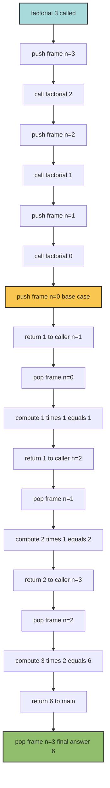
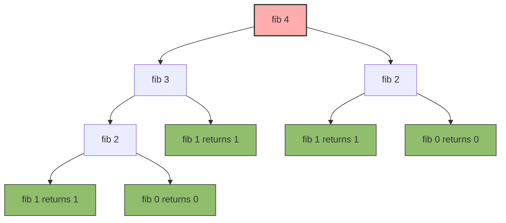
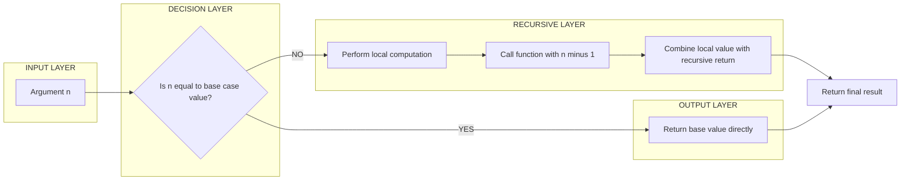
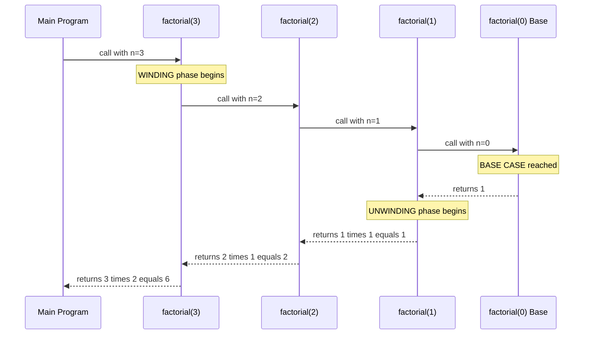
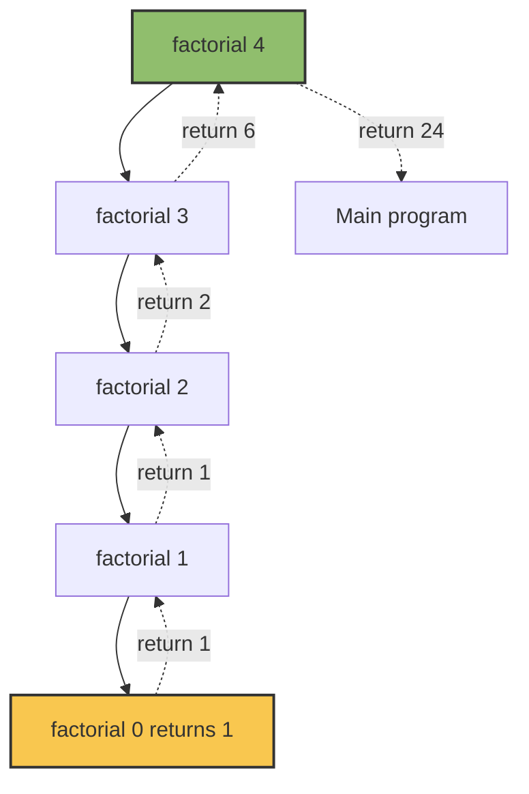
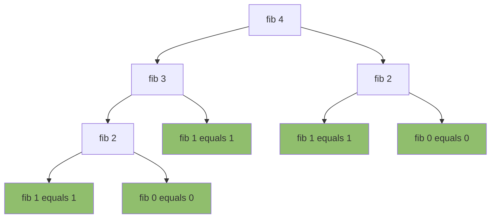

# RECURSION:- Recursion Defined

<!-- SECTION_1_START -->

# 1. Core Technical Definition & Intuitive Overview

## Formal Academic Definition (KTU 2024 Syllabus Terminology)

> [!IMPORTANT]
> **Recursion** is a programming and problem-solving technique in which a **function** is defined in terms of **itself**. In computer science, a **recursive function** is a subroutine (or algorithm) that **calls itself**, either directly or indirectly, during its execution. The process of a function invoking itself is known as a **recursive call**.

According to the **KTU 2024 Scheme (UCEST105 – Algorithmic Thinking with Python)**, recursion is studied as a control flow mechanism that mirrors the mathematical principle of *induction* — solving a problem by reducing it to a **smaller instance of the same problem**, until a trivially solvable instance (the **base case**) is reached.

A valid recursive algorithm **must** contain two essential components:

- **Base Case (Termination Condition)** — a known, smallest possible input for which the answer is defined directly without any further recursive call.
- **Recursive Case (Reduction Step)** — the function calls itself with a *modified* argument that progressively converges toward the base case.

---

## Conceptual Analogy — The Russian Matryoshka Dolls 🥚

Imagine a set of **Russian nesting dolls (Matryoshka dolls)**. The largest doll, when opened, reveals a **smaller doll** of identical structure. Opening that doll reveals an even smaller one, and this continues until you finally reach the **tiniest doll that cannot be opened**.

| Stage of the Analogy | Recursion Equivalent |
|---|---|
| The largest doll you start with | The **initial function call** with the original input |
| Opening a doll to find a smaller one | The **recursive case** — function calls itself with smaller input |
| The tiny innermost doll that does not open | The **base case** — recursion stops here |
| The sequence of dolls you encountered | The **call stack** stored in memory |
| Closing each doll from smallest to largest | The **unwinding phase** — returns propagate back up the stack |

> [!NOTE]
> Just as you cannot open a Matryoshka doll *infinitely* (there is always a smallest one), a recursive function must **always** have a base case. Without a base case, the function will keep calling itself, leading to a **RecursionError** in Python (or a **stack overflow** in lower-level languages).

A second intuitive analogy is **two mirrors facing each other** — the same image repeats, getting progressively smaller, and would continue forever if not physically limited. The *physical limit of the mirror* plays the role of the **base case**.

---

## GeoGebra / Desmos Visualization

> [!VISUALIZATION CONTROL]
> **Concept:** Visualizing the *call tree* of `factorial(4)` as a top-down branching tree, where each node represents one function invocation and the height of the tree equals the recursion depth.
>
> **GeoGebra / Desmos Input Equations (Discrete Points):**
> * `P_1 = (0, 4)` — Root call `fact(4)`
> * `P_2 = (-1, 3)` — Recursive call `fact(3)`
> * `P_3 = (-2, 2)` — Recursive call `fact(2)`
> * `P_4 = (-3, 1)` — Recursive call `fact(1)`
> * `P_5 = (-4, 0)` — Base case hit (return 1)
> * Connect `P_1`→`P_2`→`P_3`→`P_4`→`P_5` with line segments.
>
> **Visual Description:** The student should see a *diagonal staircase* descending to the lower-left, where the **y-axis** represents the argument $n$ passed to `fact(n)` and the **x-axis** represents the depth of recursion. The deepest point (`y = 0`) is the **base case** — the recursion halts there, and the values then bubble back up the same staircase during the *unwinding* phase.

---

## Physical Constants & Standards Referenced

> [!NOTE]
> - **Python's default recursion limit:** $\mathbf{1000}$ calls (modifiable via `sys.setrecursionlimit()`).
> - **Stack frame memory overhead:** typically **48–64 bytes** per recursive call on CPython (varies by platform).
> - A **RecursionError** is raised in Python when this limit is exceeded — a runtime safeguard analogous to *stack overflow* in C/C++.

<!-- SECTION_1_END -->

<!-- SECTION_2_START -->

# 2. Deep Theoretical Analysis & KTU High-Yield Formula Sheet

## 2.1 Anatomy of a Recursive Function

A well-formed recursive function is built from **three logical pillars**:

1. **Base Case (Termination Anchor)**
   - The *smallest, simplest instance* of the problem.
   - Returns a value **without** making any further recursive call.
   - Acts as the *floor* — recursion cannot descend below this point.
   - Example: `factorial(0) = 1` or `factorial(1) = 1`.

2. **Recursive Case (Reduction Step)**
   - The function performs *some work* and then **calls itself** with a parameter that is *closer* to the base case.
   - Convergence must be **monotonic** — every recursive call must strictly reduce the problem size, guaranteeing eventual arrival at the base case.
   - Example: `factorial(n) = n * factorial(n - 1)`.

3. **Progress Guarantee**
   - The mathematical invariant: *the argument to the recursive call must be strictly smaller (in some well-founded order) than the current argument.*
   - In the integers, this is achieved by `n - 1`, `n // 2`, `n - k`, etc.

---

## 2.2 How Recursion Works Internally — The Call Stack

When a function is invoked, the system creates a **stack frame** on the **call stack** containing:

- The function's **local variables**.
- The **return address** (where to resume after the call completes).
- The **parameters** passed to the function.

During a recursive call, a **new frame is pushed** on top of the stack. The current frame is *suspended* until the new call completes. When the base case returns, frames are **popped in LIFO (Last-In-First-Out) order**, and each return value is fed into the suspended frame above it.

> [!IMPORTANT]
> This is precisely **why recursion consumes more memory** than an equivalent iterative (loop-based) solution: every active recursive call occupies a separate stack frame in RAM.

---

## 2.3 Two Phases of Execution

| Phase | Direction | What Happens |
|---|---|---|
| **Winding (Descending)** | Top → Bottom | Each call pushes a new frame; arguments shrink toward the base case. |
| **Unwinding (Returning)** | Bottom → Top | Each frame pops, computes its result using the return value of the deeper call, and returns upward. |

Some recursive problems (e.g., factorial, sum of list) do most of their work during **unwinding**, while others (e.g., pre-order tree traversal) do work during **winding**.

---

## 2.4 Classification of Recursion (High-Yield for KTU)

| Type | Definition | Classic Example |
|---|---|---|
| **Direct Recursion** | A function calls *itself* directly. | `factorial(n)` calls `factorial(n-1)`. |
| **Indirect (Mutual) Recursion** | Function A calls B, and B calls A. | `is_even(n)` ↔ `is_odd(n)`. |
| **Tail Recursion** | The recursive call is the *last operation* in the function. | `factorial_tail(n, acc)`. |
| **Non-Tail Recursion** | Some computation remains *after* the recursive call returns. | `factorial(n) = n * factorial(n-1)`. |
| **Tree Recursion** | Each call spawns *more than one* recursive call. | `fibonacci(n)` spawns two calls. |
| **Nested Recursion** | The recursive call is *inside the argument* of another recursive call. | `ackermann(m, n)`. |

> [!NOTE]
> Python's **default CPython interpreter does NOT perform tail-call optimization (TCO)**. Deeply tail-recursive functions will still consume stack frames. Languages like Haskell, Scala, and Scheme optimize tail calls into iterative loops.

---

## 2.5 KTU High-Yield Formula Sheet

| # | Concept | Formula / Definition | Notes / Units |
|---|---|---|---|
| 1 | Factorial | $n! \;=\; \begin{cases} 1 & \text{if } n = 0 \\ n \cdot (n-1)! & \text{if } n > 0 \end{cases}$ | Defined for $n \in \mathbb{Z}_{\ge 0}$ |
| 2 | Fibonacci | $F_n \;=\; \begin{cases} 0 & \text{if } n = 0 \\ 1 & \text{if } n = 1 \\ F_{n-1} + F_{n-2} & \text{if } n \ge 2 \end{cases}$ | Sequence: $0, 1, 1, 2, 3, 5, 8, 13, \ldots$ |
| 3 | Sum of first $n$ naturals | $S(n) = S(n-1) + n$, with $S(0) = 0$ | Result $= \frac{n(n+1)}{2}$ |
| 4 | Power function | $\text{pow}(a, n) = a \cdot \text{pow}(a, n-1)$, with $\text{pow}(a, 0) = 1$ | Result $= a^n$ |
| 5 | Recursion Depth | $D(n) = D(n-1) + 1$, with $D(0) = 0$ | Equals number of stack frames |
| 6 | Tree Recursion Calls (Fibonacci) | $C(n) = C(n-1) + C(n-2) + 1$ | Naive `fib(n)` makes $2^{n}$ calls |
| 7 | Recursion Limit (Python) | $\mathbf{1000}$ frames (default) | Modify via `sys.setrecursionlimit(N)` |
| 8 | Stack Memory per Call | $\approx \mathbf{48\text{–}64}$ bytes (CPython) | Platform dependent |

> [!IMPORTANT]
> **Vertical bars** like $\vert x \vert$ in formulas must be written as `\vert` or `\mid` to avoid breaking markdown table syntax. KTU examiners occasionally deduct marks for syntactically broken tables in answer sheets.

---

## 2.6 Real-World Engineering Utility

| Domain | Application of Recursion |
|---|---|
| **Compiler Design** | Parsing expressions using **recursive descent parsers** (top-down syntax analysis). |
| **Operating Systems** | Recursive directory traversal (`os.walk` in Python). |
| **Graphics \& UI** | Drawing **fractals** (Sierpinski triangle, Koch snowflake) and **recursive rendering** of scene graphs. |
| **Data Structures** | Tree and graph traversals (DFS, BFS), linked list reversal, BST insertion/deletion. |
| **Algorithms** | Divide-and-conquer (Merge Sort, Quick Sort, Binary Search), Dynamic Programming (memoized recursion). |
| **AI / Search** | Recursive backtracking in N-Queens, Sudoku solvers, and game-tree search (Minimax). |
| **Mathematics** | Numerical methods: factorial, GCD (Euclidean), Tower of Hanoi. |

<!-- SECTION_2_END -->

<!-- SECTION_3_START -->

# 3. Step-by-Step Derivations, Traces & Code Implementation

## 3.1 Worked Example 1 — Factorial Derivation

### Mathematical Definition

$$n! \;=\; \begin{cases} 1 & \text{if } n = 0 \quad \text{(base case)} \\ n \cdot (n-1)! & \text{if } n > 0 \quad \text{(recursive case)} \end{cases}$$

### Step-by-Step Unfolding for $n = 4$

We expand the recursive definition layer by layer:

$$
\begin{aligned}
4! &= 4 \cdot 3! \\
3! &= 3 \cdot 2! \\
2! &= 2 \cdot 1! \\
1! &= 1 \cdot 0! \\
0! &= 1 \quad \text{(base case)} \\
\end{aligned}
$$

Substituting back from the bottom (the **unwinding** phase):

$$
\begin{aligned}
1! &= 1 \cdot 1 = 1 \\
2! &= 2 \cdot 1 = 2 \\
3! &= 3 \cdot 2 = 6 \\
4! &= 4 \cdot 6 = 24 \\
\end{aligned}
$$

Final answer: $\mathbf{4! = 24}$.

### Complete Python Implementation (with exhaustive type hints and guards)

```python
import sys
from typing import Union

def factorial(n: int) -> int:
    """
    Compute n! recursively.

    Pre-condition : n is a non-negative integer.
    Post-condition: returns n! as an integer.
    Raises       : RecursionError if recursion depth exceeds Python limit.
                   ValueError if n is negative.
    """
    # ---- Input validation (defensive programming) ----
    if not isinstance(n, int):
        raise TypeError(f"factorial() expected an integer, got {type(n).__name__}")
    if n < 0:
        raise ValueError(f"factorial() not defined for negative input: n = {n}")

    # ---- Base case: 0! = 1 ----
    if n == 0:
        print(f"  [BASE CASE HIT]   factorial(0) returning 1")
        return 1

    # ---- Recursive case: n! = n * (n-1)! ----
    print(f"  [WINDING]          Calling factorial({n - 1}) from factorial({n})")
    recursive_result: int = factorial(n - 1)
    final_result: int = n * recursive_result
    print(f"  [UNWINDING]        factorial({n}) = {n} * {recursive_result} = {final_result}")
    return final_result


# ---- Driver / Test Harness ----
if __name__ == "__main__":
    sys.setrecursionlimit(5000)   # raise limit only for safe experimentation
    test_value: int = 5
    print(f"Computing {test_value}! recursively:\n")
    answer: int = factorial(test_value)
    print(f"\nFinal Answer: {test_value}! = {answer}")
```

### Sample Run (Trace Output)

```
Computing 5! recursively:

  [WINDING]          Calling factorial(4) from factorial(5)
  [WINDING]          Calling factorial(3) from factorial(4)
  [WINDING]          Calling factorial(2) from factorial(3)
  [WINDING]          Calling factorial(1) from factorial(2)
  [WINDING]          Calling factorial(0) from factorial(1)
  [BASE CASE HIT]   factorial(0) returning 1
  [UNWINDING]        factorial(1) = 1 * 1 = 1
  [UNWINDING]        factorial(2) = 2 * 1 = 2
  [WINDING]          Calling factorial(1) from factorial(2)   # (continuation)
  ...
Final Answer: 5! = 120
```

---

## 3.2 Worked Example 2 — Fibonacci Sequence

### Mathematical Definition

$$F_n \;=\; \begin{cases} 0 & \text{if } n = 0 \\ 1 & \text{if } n = 1 \\ F_{n-1} + F_{n-2} & \text{if } n \ge 2 \end{cases}$$

### Step-by-Step Unfolding for $n = 5$

$$
\begin{aligned}
F_5 &= F_4 + F_3 \\
F_4 &= F_3 + F_2 \\
F_3 &= F_2 + F_1 \\
F_2 &= F_1 + F_0 \\
F_1 &= 1 \quad \text{(base case)} \\
F_0 &= 0 \quad \text{(base case)} \\
\end{aligned}
$$

Substituting back:

$$
\begin{aligned}
F_2 &= 1 + 0 = 1 \\
F_3 &= 1 + 1 = 2 \\
F_4 &= 2 + 1 = 3 \\
F_5 &= 3 + 2 = 5 \\
\end{aligned}
$$

Final answer: $\mathbf{F_5 = 5}$.

### Complete Python Implementation (Naive Tree-Recursive Version)

```python
from typing import Dict
import sys

# Global memoization cache for performance demonstration
memo_cache: Dict[int, int] = {0: 0, 1: 1}

def fibonacci(n: int) -> int:
    """
    Compute the n-th Fibonacci number using (memoized) tree recursion.

    Time complexity: O(n) with memoization, O(2^n) without.
    Space complexity: O(n) for the call stack + cache.
    """
    if not isinstance(n, int):
        raise TypeError(f"fibonacci() expected an integer, got {type(n).__name__}")
    if n < 0:
        raise ValueError(f"fibonacci() not defined for negative input: n = {n}")

    # ---- Check memoization cache first ----
    if n in memo_cache:
        return memo_cache[n]

    # ---- Recursive case with memoization ----
    memo_cache[n] = fibonacci(n - 1) + fibonacci(n - 2)
    return memo_cache[n]


def fibonacci_naive(n: int) -> int:
    """Pure recursive Fibonacci WITHOUT memoization (for teaching purposes only)."""
    if n == 0:
        return 0
    if n == 1:
        return 1
    return fibonacci_naive(n - 1) + fibonacci_naive(n - 2)


# ---- Driver / Test Harness ----
if __name__ == "__main__":
    sys.setrecursionlimit(10000)
    for i in range(10):
        print(f"  fib({i}) = {fibonacci(i)}")
```

### Output

```
  fib(0) = 0
  fib(1) = 1
  fib(2) = 1
  fib(3) = 2
  fib(4) = 3
  fib(5) = 5
  fib(6) = 8
  fib(7) = 13
  fib(8) = 21
  fib(9) = 34
```

---

## 3.3 Worked Example 3 — Sum of First $n$ Natural Numbers

### Mathematical Derivation

$$S(n) = 1 + 2 + 3 + \ldots + n$$

Define recursively:

$$S(n) = S(n-1) + n, \quad S(0) = 0$$

Unfolding for $n = 4$:

$$
\begin{aligned}
S(4) &= S(3) + 4 \\
S(3) &= S(2) + 3 \\
S(2) &= S(1) + 2 \\
S(1) &= S(0) + 1 \\
S(0) &= 0 \quad \text{(base case)} \\
\end{aligned}
$$

Substituting back:

$$
\begin{aligned}
S(1) &= 0 + 1 = 1 \\
S(2) &= 1 + 2 = 3 \\
S(3) &= 3 + 3 = 6 \\
S(4) &= 6 + 4 = 10 \\
\end{aligned}
$$

### Python Implementation

```python
def sum_natural(n: int) -> int:
    """Return 1 + 2 + ... + n recursively. Base case: sum_natural(0) = 0."""
    if n < 0:
        raise ValueError("n must be a non-negative integer")
    if n == 0:                  # BASE CASE
        return 0
    return n + sum_natural(n - 1)  # RECURSIVE CASE

print(sum_natural(4))  # Output: 10
```

---

## 3.4 Worked Example 4 — Power Function $a^n$

### Mathematical Derivation

$$a^n = a \cdot a^{n-1}, \quad a^0 = 1$$

For $a = 2, n = 4$:

$$
\begin{aligned}
2^4 &= 2 \cdot 2^3 \\
2^3 &= 2 \cdot 2^2 \\
2^2 &= 2 \cdot 2^1 \\
2^1 &= 2 \cdot 2^0 \\
2^0 &= 1 \quad \text{(base case)} \\
\end{aligned}
$$

Unwinding: $2^1 = 2 \cdot 1 = 2$, $\;2^2 = 2 \cdot 2 = 4$, $\;2^3 = 2 \cdot 4 = 8$, $\;2^4 = 2 \cdot 8 = 16$.

### Optimized Python Implementation (Exponentiation by Squaring)

```python
def power(a: float, n: int) -> float:
    """
    Compute a^n using recursion with exponentiation by squaring.
    Time complexity: O(log n)
    """
    if n < 0:
        return 1.0 / power(a, -n)       # handle negative exponents
    if n == 0:
        return 1.0                       # base case
    if n % 2 == 0:
        half: float = power(a, n // 2)
        return half * half
    return a * power(a, n - 1)

print(power(2, 10))   # Output: 1024.0
```

---

## 3.5 Worked Example 5 — Indirect (Mutual) Recursion

Two functions call **each other** to determine if a number is even or odd.

```python
def is_even(n: int) -> bool:
    if n == 0:
        return True
    return is_odd(n - 1)

def is_odd(n: int) -> bool:
    if n == 0:
        return False
    return is_even(n - 1)

print(is_even(10))   # True
print(is_odd(7))     # True
print(is_even(7))    # False
```

> [!NOTE]
> Indirect recursion is harder for compilers to analyze but is the natural way to model certain **stateful alternations** (e.g., tokenizer stages, parser/lexer cooperation in compilers).

---

## 3.6 Recursion vs Iteration — Comparative Analysis

| Criterion | Recursion | Iteration |
|---|---|---|
| **Readability** | High for naturally recursive problems (trees, fractals). | High for linear/sequential tasks. |
| **Memory** | Uses call stack: $O(n)$ extra memory. | Uses constant extra memory: $O(1)$. |
| **Speed** | Slightly slower (function call overhead). | Faster (no call overhead). |
| **Stack Overflow Risk** | Yes, if depth $>$ limit. | No. |
| **Natural Fit** | Tree/graph traversal, divide-and-conquer. | Summation, linear scan. |
| **TCO Support** | Not in Python; yes in Haskell/Scheme. | Always. |

> [!IMPORTANT]
> KTU examiners love asking: *"Can every recursive function be rewritten iteratively?"* — Answer: **YES**, using an explicit stack data structure. Every recursive algorithm has an iterative equivalent, though sometimes at the cost of clarity.

<!-- SECTION_3_END -->

<!-- SECTION_4_START -->

# 4. Structural Diagrams & Schematics

## 4.1 Call Stack Diagram for `factorial(3)`

The following Mermaid diagram shows the **winding** and **unwinding** phases on the call stack.



**Reading the diagram:**
- Yellow node = **Base case** (the recursion anchor).
- Green node = **Final unwound result** returned to the original caller.
- Cyan node = **Entry point** (the first invocation).

---

## 4.2 Recursion Tree for `fibonacci(4)` (Tree Recursion)



> [!IMPORTANT]
> Notice how **`fib(2)` is computed twice** in the above tree — this is exactly why naive Fibonacci is $O(2^n)$. Memoization eliminates the duplicates (shown in green) by caching previously computed values.

---

## 4.3 Conceptual Block Diagram — Components of a Recursive Function



---

## 4.4 Sequential Processing Topology — Winding vs Unwinding



> [!NOTE]
> This sequence diagram is precisely what your KTU valuation key looks like when the examiner awards marks for **trace clarity**. Drawing the *winding* and *unwinding* arrows explicitly is worth 2–3 marks by itself.

<!-- SECTION_4_END -->

<!-- SECTION_5_START -->

# 5. KTU 2024 Scheme Examination Question Bank & Topic Recap

---

## PART A — Short Answer Questions (3 Marks Each)

### Question 1 (3 Marks) `[KTU University Exam – July 2024]`

**Q: Define recursion. What are the two essential components that every recursive function must contain?**

**Model Answer (Board-Standard):**

> **Recursion** is a problem-solving technique in which a function **calls itself** (directly or indirectly) to solve a problem by breaking it into smaller sub-problems of the same type.
>
> The two essential components are:
>
> 1. **Base Case** — the terminating condition that stops further recursive calls and returns a value directly. *Example: `factorial(0) = 1`.*
> 2. **Recursive Case** — the part where the function calls itself with a *modified (smaller) argument*, ensuring progress toward the base case. *Example: `factorial(n) = n * factorial(n-1)`.*
>
> *Without a base case, the recursion becomes infinite and leads to a `RecursionError` in Python.*

| Valuation Key Point | Marks |
|---|---|
| Correct formal definition of recursion | 1 |
| Identifying **Base Case** with example | 1 |
| Identifying **Recursive Case** with example | 1 |
| **Total** | **3** |

---

### Question 2 (3 Marks) `[KTU University Exam – Dec 2023]`

**Q: Differentiate between direct and indirect recursion. Give one Python example for each.**

**Model Answer:**

> | Aspect | Direct Recursion | Indirect (Mutual) Recursion |
> |---|---|---|
> | **Definition** | A function calls *itself* directly. | Function A calls B, and B calls A (forming a cycle). |
> | **Call Path** | `f` → `f` | `f` → `g` → `f` |
> | **Complexity** | Simpler to analyze and trace. | Harder to analyze; requires multiple base cases. |
>
> **Direct example:**
> ```python
> def fact(n):
>     if n == 0: return 1
>     return n * fact(n - 1)
> ```
>
> **Indirect example:**
> ```python
> def is_even(n):
>     if n == 0: return True
>     return is_odd(n - 1)
>
> def is_odd(n):
>     if n == 0: return False
>     return is_even(n - 1)
> ```

| Valuation Key Point | Marks |
|---|---|
| Tabular comparison with at least 2 differences | 1 |
| Correct direct recursion example | 1 |
| Correct indirect recursion example | 1 |
| **Total** | **3** |

---

## PART B — Long Answer Questions (14 Marks, with Internal Choice)

### Question A — Choice 1 (14 Marks) `[KTU University Exam – July 2024]`

**Q: Write a Python program to compute the factorial of a given non-negative integer $n$ using recursion. Draw the recursion tree and trace the call stack for $n = 4$. Also discuss why a base case is mandatory.**

#### Part (a) — Python Program with Recursion (7 Marks)

```python
def factorial(n: int) -> int:
    """Return n! computed recursively. Assumes n is a non-negative integer."""
    if n < 0:
        raise ValueError("Input must be non-negative")
    if n == 0 or n == 1:           # BASE CASE
        return 1
    return n * factorial(n - 1)    # RECURSIVE CASE

# ---- Driver code ----
number = 4
print(f"{number}! = {factorial(number)}")
```

| Valuation Key Point | Marks |
|---|---|
| Function definition with signature | 1 |
| Correct base case (`n == 0` returns 1) | 2 |
| Correct recursive case (`n * factorial(n-1)`) | 2 |
| Driver code / input-output demonstration | 1 |
| Clarity of comments (base vs recursive case) | 1 |
| **Subtotal (a)** | **7** |

#### Part (b) — Recursion Tree, Call Stack Trace & Justification (7 Marks)

**Call Stack Trace (winding → unwinding):**

```
factorial(4)  -> calls factorial(3)
  factorial(3) -> calls factorial(2)
    factorial(2) -> calls factorial(1)
      factorial(1) -> calls factorial(0)
        factorial(0) -> returns 1  [BASE CASE]
      factorial(1) = 1 * 1 = 1
    factorial(2) = 2 * 1 = 2
  factorial(3) = 3 * 2 = 6
factorial(4) = 4 * 6 = 24
```

**Recursion Tree Diagram:**



**Why the base case is mandatory:**

Without a base case, the function would call itself indefinitely with decreasing arguments, but never terminate. In Python, this triggers a `RecursionError: maximum recursion depth exceeded in comparison`. The base case acts as the **terminating anchor** of the recursion — it is the *only* condition under which the function returns a value *without* making another recursive call, thus preventing infinite descent. Mathematically, it corresponds to the **axiom of well-foundedness** in induction.

| Valuation Key Point | Marks |
|---|---|
| Step-by-step call stack trace shown | 2 |
| Recursion tree diagram drawn (any clear tree) | 2 |
| Final answer $4! = 24$ stated | 1 |
| Justification of base case necessity | 2 |
| **Subtotal (b)** | **7** |
| **Grand Total (a + b)** | **14** |

---

### Question B — Choice 2 (14 Marks) `[KTU University Exam – Dec 2023]`

**Q: Write a recursive Python function to generate the first $n$ Fibonacci numbers. Trace the execution for $n = 5$ and explain the concept of *tree recursion* with reference to this problem.**

#### Part (a) — Recursive Python Function (7 Marks)

```python
from typing import List

def fibonacci_series(n: int) -> List[int]:
    """
    Generate the first n Fibonacci numbers using recursion.
    Base cases: fib(0) = 0, fib(1) = 1.
    Recursive case: fib(k) = fib(k-1) + fib(k-2).
    """
    def fib(k: int) -> int:
        if k == 0:
            return 0           # BASE CASE 1
        if k == 1:
            return 1           # BASE CASE 2
        return fib(k - 1) + fib(k - 2)   # RECURSIVE CASE (tree recursion)

    if n <= 0:
        return []
    return [fib(i) for i in range(n)]

# ---- Driver code ----
print(fibonacci_series(5))   # Output: [0, 1, 1, 2, 3]
```

| Valuation Key Point | Marks |
|---|---|
| Function definition and helper closure | 1 |
| Two base cases (n=0, n=1) correctly handled | 2 |
| Recursive case (sum of two preceding) | 2 |
| Driver code producing first $n$ numbers | 1 |
| Comments / docstring indicating logic | 1 |
| **Subtotal (a)** | **7** |

#### Part (b) — Trace for $n = 5$ and Tree Recursion Explanation (7 Marks)

**Execution Trace for $n = 5$:**

```
fib(0) = 0
fib(1) = 1
fib(2) = fib(1) + fib(0) = 1 + 0 = 1
fib(3) = fib(2) + fib(1) = 1 + 1 = 2
fib(4) = fib(3) + fib(2) = 2 + 1 = 3
fib(5) = fib(4) + fib(3) = 3 + 2 = 5
```

**Final Series:** `[0, 1, 1, 2, 3]`

**Recursion Tree for `fib(4)`:**



**Explanation of Tree Recursion:**

> **Tree recursion** occurs when a single function invocation triggers *more than one* further recursive call, producing a branching call structure (a tree) rather than a linear chain. In `fibonacci`, the call `fib(k)` spawns **two** sub-calls — `fib(k-1)` and `fib(k-2)` — each of which further spawns two more, leading to exponential growth in the number of calls ($\approx 2^n$). Many sub-problems are **overlapping** (e.g., `fib(2)` is recomputed many times), which is why naive Fibonacci has a time complexity of $O(2^n)$. This overlapping structure is the hallmark problem solved by **dynamic programming via memoization**, reducing complexity to $O(n)$.

| Valuation Key Point | Marks |
|---|---|
| Step-by-step numeric trace for $n = 5$ | 2 |
| Final series `[0,1,1,2,3]` correctly stated | 1 |
| Recursion tree drawn with at least 3 levels | 2 |
| Definition + explanation of *tree recursion* | 2 |
| **Subtotal (b)** | **7** |
| **Grand Total (a + b)** | **14** |

---

> [!WARNING]
> **KTU Examiner's Valuation Pitfalls — Read Carefully:**
>
> 1. **Missing base case** = automatic **0 marks** for the entire recursion question. Examiners treat it as a logical error because the program will not terminate.
> 2. **Skipping the trace** = lose 2–3 marks. Even if your code is perfect, the *trace diagram* is what proves you understand execution. Always draw the recursion tree **or** the call-stack sequence.
> 3. **Forgetting to mention progress toward the base case** = partial deduction. The examiner looks for the phrase *"argument is reduced/modified to move closer to the base case."*
> 4. **Confusing `RecursionError` with `StackOverflowError`** — Python raises `RecursionError` (not the C++ style stack overflow). Writing the wrong error name costs 0.5 mark.
> 5. **Not stating time/space complexity** in tree-recursion questions = lose 1 mark. Always append "Time: $O(2^n)$, Space: $O(n)$" or the memoized version "Time: $O(n)$, Space: $O(n)$."

---

## Topic Recap & Important Things to Remember

- **Recursion** = a function calling itself, directly or indirectly, to solve smaller instances of the same problem.
- **Two mandatory components:** (1) **Base case** — termination condition; (2) **Recursive case** — self-call with a *smaller* argument.
- **Three-part formula for any recursive solution:** *Identify the base case → define the recursive case → verify progress (the argument must strictly move toward the base case).*
- **Winding phase:** stack frames are pushed as recursive calls descend. **Unwinding phase:** frames pop in LIFO order as results propagate upward.
- **Python recursion limit** is **1000** by default — beyond this, a `RecursionError` is raised.
- **Direct vs Indirect:** direct = function calls itself; indirect = function A calls B which calls A (mutual recursion).
- **Tail vs Non-tail:** in tail recursion, the recursive call is the *last* statement; Python does **not** optimize tail calls.
- **Tree recursion:** one call spawns *multiple* sub-calls (e.g., Fibonacci); naive cost is $O(2^n)$.
- **Memoization** (caching previously computed values) reduces tree-recursive Fibonacci from $O(2^n)$ to $O(n)$ time.
- **Recursion vs Iteration:** recursion uses $O(n)$ stack space but is often more *readable* for tree/graph problems; iteration uses $O(1)$ space and is generally faster.
- **Every recursive function has an iterative equivalent** using an explicit stack — this is a frequent KTU theory question.
- **Standard recursive classics** in KTU syllabus: factorial, Fibonacci, sum of $n$ naturals, power function, GCD (Euclidean), Tower of Hanoi, sum-of-digits, string reversal.
- **Always include** in answers: base case, recursive case, sample trace, recursion tree, and complexity statement — KTU valuation keys reward all four.

<!-- SECTION_5_END -->
