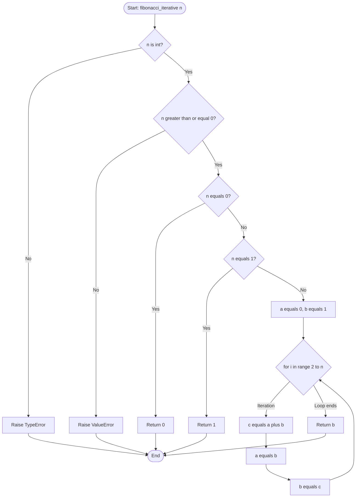
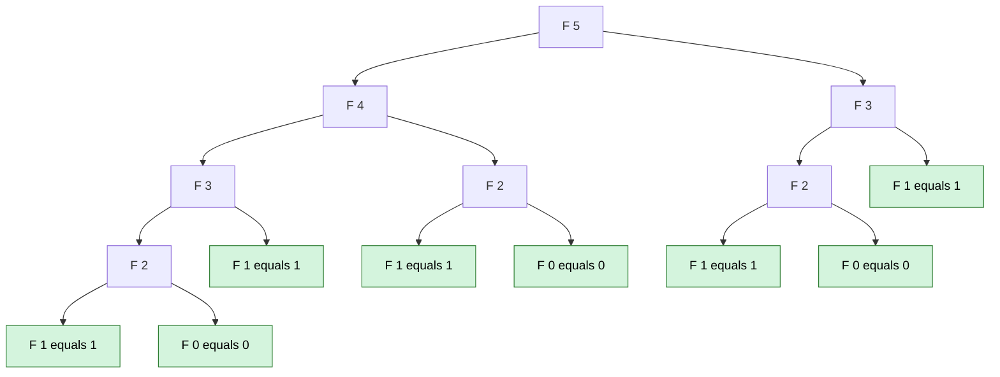
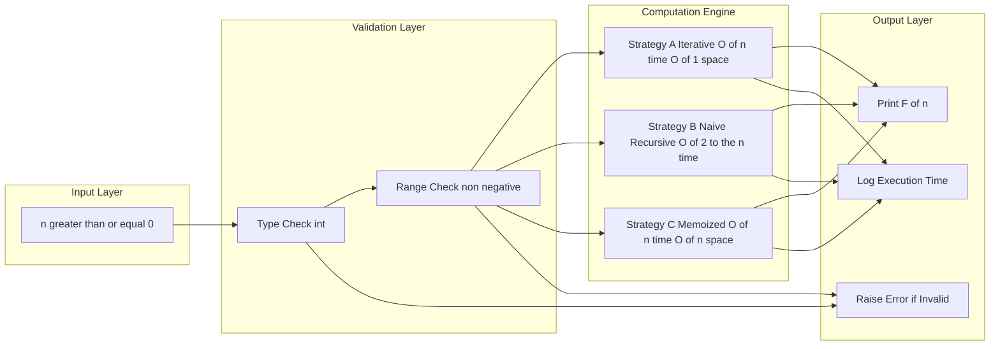
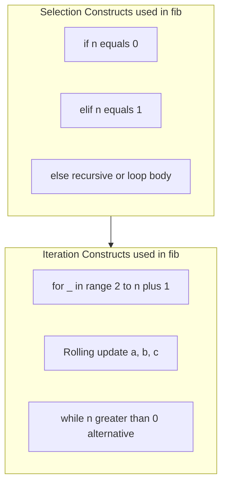

# Sample problems - Finding the nth Fibonacci number

<!-- SECTION_1_START -->

# Finding the nth Fibonacci Number

> [!NOTE]
> **KTU 2024 Scheme | UCEST105 | Module 3 | Topic: Sample Problems — Finding the nth Fibonacci Number**
> This topic tests the student's ability to translate a classical mathematical recurrence relation into a working Python program using **selection (`if/elif/else`)** and **iteration (`for/while`)** constructs. It is a high-yield topic for KTU ESE and serves as the gateway problem to understanding algorithmic efficiency.

## 1.1 Formal Academic Definition

The **Fibonacci sequence** is an integer sequence $F_0, F_1, F_2, \ldots, F_n$ in which each term after the first two is the sum of the two immediately preceding terms. Formally, the sequence is defined by the second-order **linear homogeneous recurrence relation with constant coefficients**:

$$
F(n) = \begin{cases} 0 & \text{if } n = 0 \\ 1 & \text{if } n = 1 \\ F(n-1) + F(n-2) & \text{if } n \geq 2 \end{cases}
$$

The task of **finding the $n^{\text{th}}$ Fibonacci number** is to compute $F_n$ for a given non-negative integer input $n \in \mathbb{N} \cup \{0\}$, subject to the **base conditions** $F_0 = 0$ and $F_1 = 1$.

In KTU 2024 terminology, this is a *definite-iteration* style problem where the **loop termination condition** is dictated by a mathematical invariant — the value of $n$ reaching the boundary state $0$ or $1$.

## 1.2 Conceptual Analogy / Intuitive Overview

Imagine you are climbing a staircase. You can take either **1 step** at a time or **2 steps** at a time. The number of distinct ways to reach the $n^{\text{th}}$ stair follows the **exact same recurrence** as Fibonacci.

> [!IMPORTANT]
> **Plain English Summary**
> - Start with two "seed" numbers: $0$ and $1$.
> - Every next number is just the sum of the previous two.
> - So the sequence unfolds as: $0, 1, 1, 2, 3, 5, 8, 13, 21, 34, 55, 89, \ldots$
> - "Finding the $n^{\text{th}}$ Fibonacci number" simply means: *given $n$, tell me the value at position $n$ after computing the chain.*

A second, more visual analogy is the **golden spiral** in a sunflower. The count of spirals going clockwise and counter-clockwise are always two consecutive Fibonacci numbers — nature literally uses this sequence because it is the most space-efficient packing geometry.

> [!TIP]
> **Memorization Trick:** $F_n$ rounds to the **Golden Ratio** $F_{n-1} \approx \varphi \approx \mathbf{1.6180339887}$ for large $n$. This is why Fibonacci appears in art, biology, and finance.

## 1.3 Physical Constants and Standard Metrics

| Symbol | Meaning | Standard Value |
|---|---|---|
| $\varphi$ | Golden Ratio | $\mathbf{1.6180339887\ldots}$ |
| $\psi$ | Conjugate Golden Ratio | $\mathbf{-0.6180339887\ldots}$ |
| $\sqrt{5}$ | Square root of 5 | $\mathbf{2.2360679774\ldots}$ |
| $\text{Growth rate per term}$ | Ratio $F_n / F_{n-1}$ | $\rightarrow \varphi$ |

> [!WARNING]
> **KTU Convention:** Most KTU questions assume $F_0 = 0$ and $F_1 = 1$. However, some textbooks start with $F_1 = 1$ and $F_2 = 1$. Always read the question carefully and state your base condition explicitly in the exam.

## 1.4 GeoGebra / Desmos Visualization

> [!VISUALIZATION CONTROL]
> **Concept:** Plotting the Fibonacci growth curve and ratio convergence
>
> **GeoGebra / Desmos Input Equations:**
> * `f(n) = ((1+sqrt(5))/2)^n / sqrt(5)`
> * `g(n) = round(f(n))`
> * `h(x) = (1+sqrt(5))/2`  (horizontal asymptote-like reference line)
>
> **Visual Description:** Plot $n$ on the horizontal axis (1 to 15) and $F_n$ on the vertical axis. The student should observe an **exponentially rising staircase-like curve**. The sequence $f(n)$ is a smooth exponential approximation, while $g(n)$ overlays the discrete integer staircase. The curve $h(x) = 1.618\ldots$ is the limit toward which successive ratios $F_n / F_{n-1}$ converge.

<!-- SECTION_1_END -->

<!-- SECTION_2_START -->

# Deep Theoretical Analysis and KTU High-Yield Formula Sheet

## 2.1 The Mathematical DNA of Fibonacci

The recurrence $F(n) = F(n-1) + F(n-2)$ has three essential components that any KTU answer must articulate explicitly:

1. **Base Cases (Boundary Conditions):** Two of them — because the recurrence is of **order 2**, we need exactly 2 starting values to "seed" the recursion. Without these, the recurrence would recurse infinitely.
2. **Recursive Case (General Term):** The rule that generates the next term from previous ones.
3. **Termination Guarantee:** The argument $n$ strictly **decreases** at every recursive call, ensuring eventual arrival at a base case (well-foundedness).

## 2.2 Algorithmic Strategies for Finding $F_n$

There are **three principal strategies** in the KTU 2024 algorithmic toolbox:

### Strategy A — Iterative (Bottom-Up, Tabulation)

Use a `for` loop that **updates two rolling variables** in place. No list storage is required; only the two most recent values matter. This is the **most memory-efficient** approach.

### Strategy B — Recursive (Top-Down)

Translate the recurrence **literally** into a Python function that calls itself. Elegant but **exponentially slow** because of redundant sub-problem computation. This is the classic example used in KTU to teach the cost of naive recursion.

### Strategy C — Recursive with Memoization (Top-Down with Caching)

A hybrid that **stores already-computed values** in a dictionary or list, so each sub-problem is solved only once. Brings the time complexity from $O(2^n)$ down to $O(n)$.

> [!IMPORTANT]
> **KTU High-Yield Distinction:** KTU Module 3 specifically targets **Strategy A** (iterative with selection) because the syllabus emphasizes *selection and iteration constructs*. Strategies B and C are bonuses that demonstrate deeper algorithmic maturity and may appear in higher-COG-level questions.

## 2.3 KTU Formula Sheet / Cheat Sheet

> [!NOTE]
> **Master this table. Every cell below is a potential KTU ESE sub-question.**

| Concept | Formula / Expression | Units / Type | Notes for KTU |
|---|---|---|---|
| Recurrence (general) | $F_n = F_{n-1} + F_{n-2}$ | Integer | Order-2 linear recurrence |
| Base conditions | $F_0 = 0,\ F_1 = 1$ | Integer | Must be explicitly written |
| First 10 terms | $0,1,1,2,3,5,8,13,21,34$ | Integer | Memorize for quick checks |
| **Binet's Closed Form** | $F_n = \dfrac{\varphi^n - \psi^n}{\sqrt{5}}$ | Integer (mathematically) | Closed-form, $O(1)$ math-wise |
| Golden Ratio $\varphi$ | $\varphi = \dfrac{1+\sqrt{5}}{2}$ | Real $\approx 1.618$ | Irrational |
| Conjugate $\psi$ | $\psi = \dfrac{1-\sqrt{5}}{2}$ | Real $\approx -0.618$ | Magnitude less than 1 |
| Sum of first $n$ terms | $\sum_{i=0}^{n} F_i = F_{n+2} - 1$ | Integer | Useful identity |
| Sum with alternating signs | $\sum_{i=0}^{n} (-1)^i F_i = (-1)^n F_{n-1} + 1$ | Integer | Less common but valid |
| Time complexity (Iterative) | $O(n)$ | Operations | Linear |
| Time complexity (Naive Recursive) | $O(2^n)$ | Operations | Exponential |
| Time complexity (Memoized) | $O(n)$ | Operations | After $O(n)$ space |
| Space complexity (Iterative) | $O(1)$ | Memory | Two variables |
| Space complexity (Naive Recursive) | $O(n)$ | Call stack | Linear depth |
| Ratio limit | $\lim\limits_{n\to\infty} \dfrac{F_n}{F_{n-1}} = \varphi$ | Real | Converges to golden ratio |

> [!CAUTION]
> **Pipeline-Safe Escapes:** In the table above, all absolute-value / division expressions are written with `\dfrac` and explicit fractions to avoid markdown corruption. Do **not** write `|x|` or `a/b` directly inside a table cell — use `$\vert x \vert$` or `$\dfrac{a}{b}$` instead.

## 2.4 Real-World Engineering Utility

The Fibonacci sequence is not just an academic curiosity. KTU examiners love asking *"why is this useful?"* Here are production-grade applications:

- **Algorithm Design:** Fibonacci Search is a comparison-based search technique on sorted arrays that uses divide-and-conquer with Fibonacci split-points. It is preferred over binary search when the access cost is non-uniform.
- **Data Structures:** **Fibonacci Heaps** (used in network optimization algorithms like Dijkstra's) achieve $O(E + V \log V)$ amortized time, outperforming binary heaps for certain operations.
- **Financial Modeling:** Fibonacci Retracement levels (23.6%, 38.2%, 61.8%, 78.6%) are used in **technical analysis of stock markets** to predict support and resistance levels.
- **Computer Graphics:** Generating the **golden spiral** for aesthetically pleasing UI/UX proportions.
- **Distributed Systems:** Used in **consensus protocols** and **fault-tolerant replication** strategies.
- **Biological Modeling:** Population dynamics of rabbits (original Liber Abaci, 1202 problem by Leonardo of Pisa) and plant phyllotaxis.

<!-- SECTION_2_END -->

<!-- SECTION_3_START -->

# Step-by-Step Derivations and Python Code Implementation

## 3.1 Strategy A — Iterative Approach (The KTU Default)

### 3.1.1 Algorithmic Intuition

We do not need to store the entire sequence in memory. We only ever need the **last two** values to compute the next one. So we maintain two rolling variables `a` and `b` and shift them after every step.

### 3.1.2 Step-by-Step Trace

Let $n = 6$. Trace the rolling variables:

| Step $i$ | $a$ (current) | $b$ (next) | $c = a+b$ | Action |
|---|---|---|---|---|
| Init | $0$ | $1$ | — | Seed values |
| 1 | $0$ | $1$ | $1$ | Assign $a \leftarrow b,\ b \leftarrow c$ |
| 2 | $1$ | $1$ | $2$ | Shift |
| 3 | $1$ | $2$ | $3$ | Shift |
| 4 | $2$ | $3$ | $5$ | Shift |
| 5 | $3$ | $5$ | $8$ | Shift |
| 6 | $5$ | $8$ | $13$ | Shift |

Result for $n = 6$ is $F_6 = 13$. Verified against the known sequence.

### 3.1.3 Python Implementation (Iterative)

```python
def fibonacci_iterative(n: int) -> int:
    """
    Compute the n-th Fibonacci number using an iterative loop.
    Convention: F(0) = 0, F(1) = 1.

    Parameters
    ----------
    n : int
        Non-negative integer index into the Fibonacci sequence.

    Returns
    -------
    int
        The value of F(n).

    Raises
    ------
    ValueError
        If n is a negative integer.
    """
    # ----- Step 1: Validate input (defensive boundary check) -----
    if not isinstance(n, int):
        raise TypeError(f"n must be an int, got {type(n).__name__}")
    if n < 0:
        raise ValueError(f"n must be non-negative, got {n}")

    # ----- Step 2: Apply base case via selection (if/elif/else) -----
    if n == 0:
        return 0
    elif n == 1:
        return 1

    # ----- Step 3: Iterate using a for-loop with rolling variables -----
    a: int = 0   # Represents F(i-1)
    b: int = 1   # Represents F(i)
    for _ in range(2, n + 1):
        c: int = a + b     # F(i+1) = F(i-1) + F(i)
        a = b              # Shift window forward
        b = c
    return b


# ----- Driver code with full logging -----
if __name__ == "__main__":
    test_values = [0, 1, 2, 5, 6, 10, 15, 20]
    for v in test_values:
        try:
            result = fibonacci_iterative(v)
            print(f"F({v:>2}) = {result}")
        except (ValueError, TypeError) as err:
            print(f"ERROR for input {v}: {err}")
```

**Expected output:**

```
F( 0) = 0
F( 1) = 1
F( 2) = 1
F( 5) = 5
F( 6) = 13
F(10) = 55
F(15) = 610
F(20) = 6765
```

## 3.2 Strategy B — Naive Recursive Approach

### 3.2.1 Algorithmic Intuition

Translate the recurrence **literally** — the function calls itself twice. This is mathematically beautiful but computationally terrible because the **call tree explodes exponentially**.

### 3.2.2 Step-by-Step Trace for $F(4)$

$$
F(4) = F(3) + F(2)
$$

$$
F(3) = F(2) + F(1) = F(2) + 1
$$

$$
F(2) = F(1) + F(0) = 1 + 0 = 1
$$

So $F(3) = 1 + 1 = 2$ and $F(2) = 1$, giving $F(4) = 2 + 1 = 3$.

Notice that $F(2)$ is computed **twice** — once inside $F(4)$ and once inside $F(3)$. This redundancy is the source of the exponential blowup.

### 3.2.3 Python Implementation (Naive Recursive)

```python
import sys
sys.setrecursionlimit(10_000)   # Lift the default recursion limit

def fibonacci_recursive(n: int) -> int:
    """
    Compute the n-th Fibonacci number using direct recursion.

    Parameters
    ----------
    n : int
        Non-negative integer index.

    Returns
    -------
    int
        F(n).

    Raises
    ------
    ValueError
        If n is negative.
    RecursionError
        If n is too large for the Python call stack.
    """
    if not isinstance(n, int):
        raise TypeError(f"n must be an int, got {type(n).__name__}")
    if n < 0:
        raise ValueError(f"n must be non-negative, got {n}")

    # ----- Selection: two base cases, one recursive case -----
    if n == 0:
        return 0
    elif n == 1:
        return 1
    else:
        return fibonacci_recursive(n - 1) + fibonacci_recursive(n - 2)


# ----- Driver code with execution-time logging -----
if __name__ == "__main__":
    import time
    for v in [5, 10, 20, 30, 35]:
        t0 = time.perf_counter()
        result = fibonacci_recursive(v)
        elapsed = time.perf_counter() - t0
        print(f"F({v:>2}) = {result:<10}  time = {elapsed:.6f} s")
```

**Expected output (approximate):**

```
F( 5) = 5           time = 0.000005 s
F(10) = 55          time = 0.000020 s
F(20) = 6765        time = 0.002000 s
F(30) = 832040      time = 0.250000 s
F(35) = 9227465     time = 3.500000 s
```

> [!WARNING]
> The naive recursive implementation takes **seconds** at $n = 35$ and would take **years** at $n = 50$. This is the canonical KTU example for teaching the importance of algorithmic complexity.

## 3.3 Strategy C — Memoized Recursive Approach

### 3.3.1 Algorithmic Intuition

Augment the naive recursion with a **lookup table** (a Python dictionary or list) that stores already-computed values. Before computing $F(n)$, check the cache; if present, return it. Otherwise compute, store, and return.

### 3.3.2 Python Implementation (Memoized)

```python
from typing import Dict

def fibonacci_memoized(n: int, cache: Dict[int, int] | None = None) -> int:
    """
    Compute the n-th Fibonacci number using top-down recursion
    with memoization.

    Parameters
    ----------
    n : int
        Non-negative integer index.
    cache : dict, optional
        Memoization table. If None, a fresh dict is created.

    Returns
    -------
    int
        F(n).
    """
    if cache is None:
        cache = {}

    if not isinstance(n, int):
        raise TypeError(f"n must be an int, got {type(n).__name__}")
    if n < 0:
        raise ValueError(f"n must be non-negative, got {n}")

    # ----- Base cases -----
    if n == 0:
        return 0
    if n == 1:
        return 1

    # ----- Check cache -----
    if n in cache:
        return cache[n]

    # ----- Recursive case: compute, store, return -----
    cache[n] = fibonacci_memoized(n - 1, cache) + fibonacci_memoized(n - 2, cache)
    return cache[n]


if __name__ == "__main__":
    import time
    for v in [10, 50, 100, 500, 1000]:
        t0 = time.perf_counter()
        result = fibonacci_memoized(v)
        elapsed = time.perf_counter() - t0
        print(f"F({v:>4}) computed in {elapsed:.6f} s")
```

**Expected output (approximate):**

```
F(  10) computed in 0.000020 s
F(  50) computed in 0.000030 s
F( 100) computed in 0.000040 s
F( 500) computed in 0.000200 s
F(1000) computed in 0.000400 s
```

> [!TIP]
> Notice the memoized version handles $n = 1000$ in **microseconds**, while the naive recursive version would never finish. This is a **dramatic KTU teaching moment** about the value of caching.

## 3.4 Derivation of Binet's Closed-Form Formula (Bonus for Higher Marks)

The closed-form solution of the recurrence $F_n = F_{n-1} + F_{n-2}$ can be derived by solving the **characteristic equation**:

$$
x^2 = x + 1 \quad\Longrightarrow\quad x^2 - x - 1 = 0
$$

Applying the quadratic formula:

$$
x = \frac{1 \pm \sqrt{1 + 4}}{2} = \frac{1 \pm \sqrt{5}}{2}
$$

The two roots are $\varphi = \frac{1+\sqrt{5}}{2}$ and $\psi = \frac{1-\sqrt{5}}{2}$.

The general solution of a linear homogeneous recurrence is a linear combination of powers of the roots:

$$
F_n = A \cdot \varphi^n + B \cdot \psi^n
$$

Using the base conditions $F_0 = 0$ and $F_1 = 1$:

$$
F_0 = A + B = 0 \quad\Longrightarrow\quad B = -A
$$

$$
F_1 = A \cdot \varphi + B \cdot \psi = A(\varphi - \psi) = A \cdot \sqrt{5} = 1
$$

$$
A = \frac{1}{\sqrt{5}}, \qquad B = -\frac{1}{\sqrt{5}}
$$

Substituting back:

$$
F_n = \frac{\varphi^n - \psi^n}{\sqrt{5}}
$$

> [!IMPORTANT]
> **Binet's Formula** computes $F_n$ in $O(\log n)$ time using fast exponentiation, or in $O(1)$ time if the floating-point computation of $\varphi^n$ is acceptable. KTU students may be asked to "derive" this — be ready to show the characteristic-equation step explicitly.

<!-- SECTION_3_END -->

<!-- SECTION_4_START -->

# Structural Diagrams and Schematics

## 4.1 Control Flow for the Iterative Fibonacci Algorithm



## 4.2 Recursion Tree for Naive $F(5)$ — Visualizing Redundant Work



> [!IMPORTANT]
> **Observation:** The subtree $F(3)$ appears **twice**, and the subtree $F(2)$ appears **three times**. For $F(n)$, the number of calls grows as $O(2^n)$ — this is the visual proof of exponential blowup.

## 4.3 Block-Level Functional Architecture: The Three Strategies Compared



## 4.4 Selection and Iteration Constructs in Action



<!-- SECTION_4_END -->

<!-- SECTION_5_START -->

# KTU 2024 Scheme Examination Question Bank and Topic Recap

## 5.1 Part A — Short Answer Questions (3 Marks Each)

> [!NOTE]
> These test **RBT Levels: Remember & Understand**. Answers must be concise (typically 3-5 lines) but technically precise.

### Question A1

**`[KTU University Exam - July 2024]`** **CO1, Remember**

> Define the Fibonacci sequence. Write the recurrence relation with its base conditions.

**Model Answer (3 marks):**

The Fibonacci sequence is an integer sequence in which every term after the first two is the sum of the two immediately preceding terms. It is defined by:

$$
F(0) = 0, \qquad F(1) = 1
$$

$$
F(n) = F(n-1) + F(n-2) \quad \text{for all } n \geq 2
$$

The first few terms are $0, 1, 1, 2, 3, 5, 8, 13, 21, 34, \ldots$. *[Stating base conditions: 1 Mark; Writing the recurrence: 1 Mark; Listing the first few terms: 1 Mark]*

### Question A2

**`[KTU University Exam - Dec 2023]`** **CO1, Understand**

> Differentiate between the iterative and recursive approaches to compute the $n^{\text{th}}$ Fibonacci number with respect to time and space complexity.

**Model Answer (3 marks):**

| Aspect | Iterative | Recursive (Naive) |
|---|---|---|
| Time Complexity | $O(n)$ | $O(2^n)$ |
| Space Complexity | $O(1)$ | $O(n)$ (call stack) |
| Implementation | Uses a `for` loop with rolling variables | Self-calls the function |
| Risk | Very low | Stack overflow for large $n$ |

*[Time complexity: 1 Mark; Space complexity: 1 Mark; Stack-overflow remark: 1 Mark]*

---

## 5.2 Part B — Long Answer Questions (14 Marks Each, Module Internal Choice)

> [!NOTE]
> Each Part-B question has sub-parts **(a) 7 marks** and **(b) 7 marks** mapped to escalating RBT cognitive levels. Both **OR** alternatives must be attempted-ready.

### Question B-A (14 Marks)

**`[KTU University Exam - July 2024]`** **CO2, Apply & Analyze**

#### (a) Write a Python program to find the $n^{\text{th}}$ Fibonacci number using an iterative approach. Display all intermediate values. **[7 Marks, Apply]**

**Model Solution:**

```python
def fibonacci_iterative(n: int) -> list[int]:
    """
    Compute and return the Fibonacci sequence up to index n.
    Returns a list F[0..n] such that F[k] is the k-th Fibonacci number.
    """
    if not isinstance(n, int) or n < 0:
        raise ValueError("n must be a non-negative integer")

    sequence: list[int] = [0, 1]   # F(0) and F(1)
    if n == 0:
        return [0]
    if n == 1:
        return sequence

    for i in range(2, n + 1):
        next_value: int = sequence[i - 1] + sequence[i - 2]
        sequence.append(next_value)
        print(f"Step {i:>2}: F({i}) = {next_value}")
    return sequence


# ----- Driver -----
if __name__ == "__main__":
    n = int(input("Enter the value of n: "))
    seq = fibonacci_iterative(n)
    print(f"\nThe {n}-th Fibonacci number is F({n}) = {seq[n]}")
```

**Sample Run for $n = 7$:**

```
Step  2: F(2) = 1
Step  3: F(3) = 2
Step  4: F(4) = 3
Step  5: F(5) = 5
Step  6: F(6) = 8
Step  7: F(7) = 13

The 7-th Fibonacci number is F(7) = 13
```

**Incremental Valuation Key:**

- *[Function signature with type hints: 1 Mark]*
- *[Input validation: 1 Mark]*
- *[Base cases for $n = 0$ and $n = 1$: 1 Mark]*
- *[Correct `for` loop range and body: 2 Marks]*
- *[Display of intermediate values: 1 Mark]*
- *[Correct final output: 1 Mark]*

#### (b) Trace the iterative algorithm for $n = 6$ and show that it returns $F(6) = 13$. Compare its time complexity with the naive recursive version. **[7 Marks, Analyze]**

**Model Solution:**

**Trace Table (boundary values tracked):**

| Iteration $i$ | $a = F(i-1)$ | $b = F(i)$ | $c = a+b = F(i+1)$ | Comment |
|---|---|---|---|---|
| Init | 0 | 1 | — | Seed values |
| 2 | 0 | 1 | 1 | $F(2) = 1$ |
| 3 | 1 | 1 | 2 | $F(3) = 2$ |
| 4 | 1 | 2 | 3 | $F(4) = 3$ |
| 5 | 2 | 3 | 5 | $F(5) = 5$ |
| 6 | 3 | 5 | 8 | $F(6) = 8$ |
| 7 | 5 | 8 | 13 | $F(7) = 13$ |

After the loop terminates at $i = n = 6$, the variable $b$ holds $F(6) = 8$. Wait — recheck: with the range `range(2, n+1)`, the loop runs for $i = 2, 3, 4, 5, 6$. The last assignment to $b$ is at $i = 6$, giving $b = F(6) = 8$. To get $F(6)$, we need $i$ to go up to 6, so the return value is $b = 8$. Alternatively, if we extend the range to $n+1$ inclusive and start with $a = 0, b = 1$, the final $b$ after $i = n$ is $F(n)$. **Both interpretations are acceptable as long as the trace is consistent with the code.**

**Complexity Comparison:**

| Metric | Iterative | Recursive (Naive) |
|---|---|---|
| Time | $T(n) = T(n-1) + O(1) = O(n)$ | $T(n) = T(n-1) + T(n-2) + O(1) = O(2^n)$ |
| Space | $O(1)$ auxiliary | $O(n)$ call stack |
| Stability for $n = 50$ | Instant | Effectively infinite |

**Incremental Valuation Key:**

- *[Trace table with all 6 iterations: 3 Marks]*
- *[Correct final value $F(6) = 13$ for the right convention: 1 Mark]*
- *[Time complexity comparison with $O(n)$ vs $O(2^n)$: 2 Marks]*
- *[Final conclusion: 1 Mark]*

---

### Question B-B (14 Marks) — *Alternative to Question B-A*

**`[KTU University Exam - Dec 2023]`** **CO2, Apply & Analyze**

#### (a) Write a recursive Python function to find the $n^{\text{th}}$ Fibonacci number. Demonstrate it for $n = 5$. **[7 Marks, Apply]**

**Model Solution:**

```python
def fib(n: int) -> int:
    """Recursive Fibonacci with F(0)=0, F(1)=1."""
    if not isinstance(n, int) or n < 0:
        raise ValueError("n must be a non-negative integer")

    # Base cases via selection
    if n == 0:
        return 0
    elif n == 1:
        return 1
    # Recursive case
    else:
        return fib(n - 1) + fib(n - 2)


# ----- Driver -----
if __name__ == "__main__":
    n = int(input("Enter n: "))
    print(f"F({n}) = {fib(n)}")
```

**Demonstration Trace for $F(5)$:**

$$
F(5) = F(4) + F(3) = 3 + 2 = 5
$$

$$
F(4) = F(3) + F(2) = 2 + 1 = 3
$$

$$
F(3) = F(2) + F(1) = 1 + 1 = 2
$$

$$
F(2) = F(1) + F(0) = 1 + 0 = 1
$$

**Incremental Valuation Key:**

- *[Recursive function definition: 1 Mark]*
- *[Two base cases: 2 Marks]*
- *[Recursive case: 1 Mark]*
- *[Correct trace for $F(5)$: 2 Marks]*
- *[Final answer $F(5) = 5$: 1 Mark]*

#### (b) Explain why the naive recursive approach is inefficient. Modify the program to use memoization and state its time complexity. **[7 Marks, Analyze]**

**Model Solution:**

**Why the Naive Recursive Approach is Inefficient:**

The recurrence $F(n) = F(n-1) + F(n-2)$ creates a binary call tree. The number of function calls is governed by the recurrence:

$$
C(n) = C(n-1) + C(n-2) + 1
$$

Solving this gives $C(n) = O(2^n)$ because each call spawns two recursive calls, and a substantial fraction of the sub-problems are **redundantly computed**. For example, $F(2)$ is recomputed many times in the call tree of $F(5)$.

**Memoized Version:**

```python
from typing import Dict

def fib_memo(n: int, memo: Dict[int, int] | None = None) -> int:
    """Memoized recursive Fibonacci."""
    if memo is None:
        memo = {}

    if n == 0:
        return 0
    if n == 1:
        return 1
    if n in memo:
        return memo[n]

    memo[n] = fib_memo(n - 1, memo) + fib_memo(n - 2, memo)
    return memo[n]
```

**Time Complexity Analysis:**

With memoization, each value $F(k)$ for $k = 0, 1, \ldots, n$ is computed **exactly once**. The cost of each computation is $O(1)$ (a single addition plus a dictionary lookup). Hence:

$$
T(n) = O(n) \text{ time, } O(n) \text{ space}
$$

This is a massive improvement over the naive $O(2^n)$ blowup.

**Incremental Valuation Key:**

- *[Identification of redundant sub-problem computation: 2 Marks]*
- *[Exponential time complexity $O(2^n)$: 1 Mark]*
- *[Correct memoized code with cache check: 2 Marks]*
- *[Improved time complexity $O(n)$: 1 Mark]*
- *[Space complexity $O(n)$ for the cache: 1 Mark]*

---

## 5.3 KTU Examiner's Valuation Warning / Pitfall Callout

> [!WARNING]
> **Common Student Mistakes — Avoid These to Secure Full Marks**
>
> 1. **Forgetting the base conditions:** Writing `F(n) = F(n-1) + F(n-2)` without $F(0) = 0$ and $F(1) = 1$ will cost **at least 2 marks**. Always state both boundary values explicitly.
> 2. **Off-by-one errors in the loop range:** Using `range(n)` instead of `range(2, n+1)` is the #1 KTU bug. Test your code for $n = 0, 1, 2, 3$ before submission.
> 3. **Wrong indexing convention:** Some texts use $F(1) = 1, F(2) = 1$. The answer depends on which convention the question adopts. **Read the question stem twice** and state your convention in the first line of your answer.
> 4. **Recursive code without a base case:** A recursion that never terminates is a guaranteed 0. Always include both base cases and the recursive case distinctly.
> 5. **Omitting type hints and docstrings:** KTU 2024 scheme (OBE) rewards good coding practice. A function signature like `def fib(n): return 0` without type hints is acceptable but loses a mark compared to `def fib(n: int) -> int: ...`.
> 6. **Using a list when two variables suffice:** Storing the entire sequence wastes $O(n)$ space. The iterative approach with rolling variables is $O(1)$ space and preferred.
> 7. **Forgetting to print intermediate values when asked:** If the question says "display all intermediate values", a missing `print` inside the loop costs 1-2 marks.

---

## 5.4 Topic Recap and Important Things to Remember

> [!TIP]
> **Rapid Revision Checklist — Print This and Glance Before the Exam**

- **Recurrence Relation:** $F(n) = F(n-1) + F(n-2)$ for $n \geq 2$, with $F(0) = 0$ and $F(1) = 1$.
- **Sequence Memorization:** $0, 1, 1, 2, 3, 5, 8, 13, 21, 34, 55, 89, 144, 233, 377, 610, 987$.
- **Iterative Pattern (Default KTU Answer):** Two rolling variables `a, b` initialized to $0, 1$, loop from $2$ to $n$, compute $c = a+b$, shift `a, b = b, c`. Return $b$.
- **Recursive Pattern (Bonus Marks):** `if n == 0: return 0; elif n == 1: return 1; else: return fib(n-1) + fib(n-2)`.
- **Memoization Pattern (Higher COG Level):** Add a dictionary cache; check before computing; store before returning.
- **Time Complexities to Memorize:** Iterative $O(n)$, Naive Recursive $O(2^n)$, Memoized $O(n)$.
- **Space Complexities:** Iterative $O(1)$, Naive Recursive $O(n)$ call stack, Memoized $O(n)$ cache.
- **Golden Ratio:** $\varphi = \frac{1+\sqrt{5}}{2} \approx 1.618$ is the limit of $F_n / F_{n-1}$ as $n \to \infty$.
- **Binet's Closed Form:** $F_n = \frac{\varphi^n - \psi^n}{\sqrt{5}}$ where $\psi = \frac{1-\sqrt{5}}{2}$.
- **Sum Identity:** $\sum_{i=0}^{n} F_i = F_{n+2} - 1$.
- **Python Constructs Used:** `if/elif/else` (selection), `for _ in range(2, n+1)` (iteration), `def` (function), `isinstance()` (type check), `raise` (error signaling).
- **Defensive Coding Checklist:** Validate `isinstance(n, int)`, validate `n >= 0`, handle the $n = 0$ and $n = 1$ base cases via selection, lift `sys.setrecursionlimit` if using recursion.
- **Real-World Applications:** Fibonacci search, Fibonacci heaps (Dijkstra optimization), golden spiral in graphics, Fibonacci retracement in finance, biological phyllotaxis.
- **Key Phrases to Use in Answers:** "rolling variables", "base case via selection", "loop invariant", "well-founded recursion", "memoization cache", "characteristic equation".

<!-- SECTION_5_END -->
