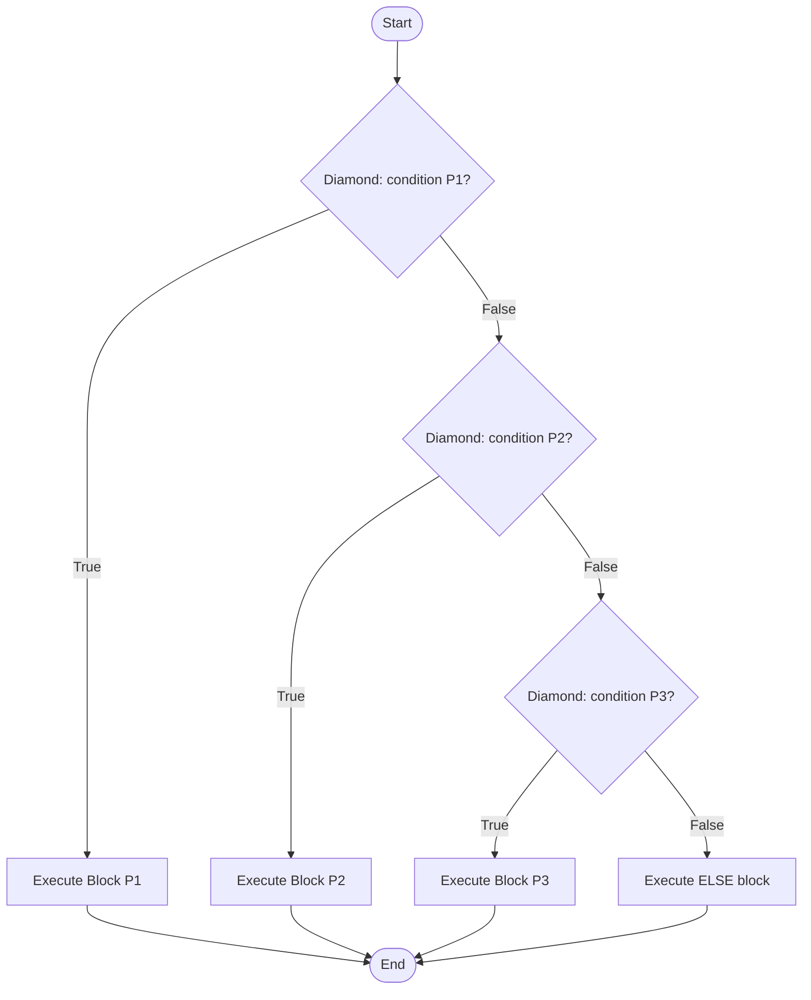
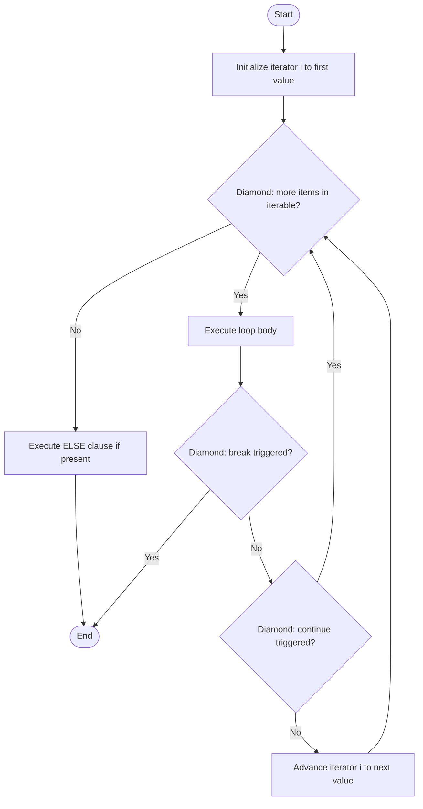
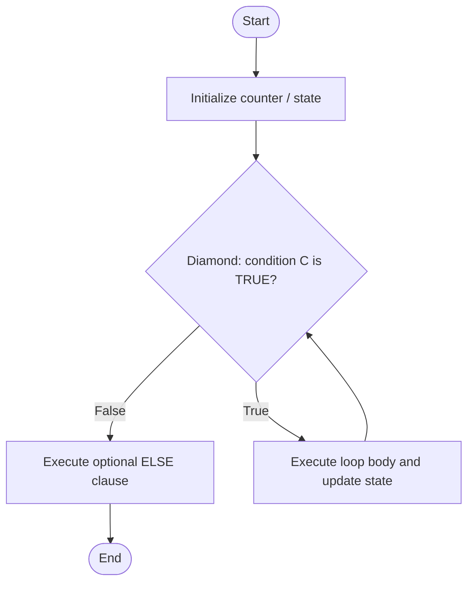
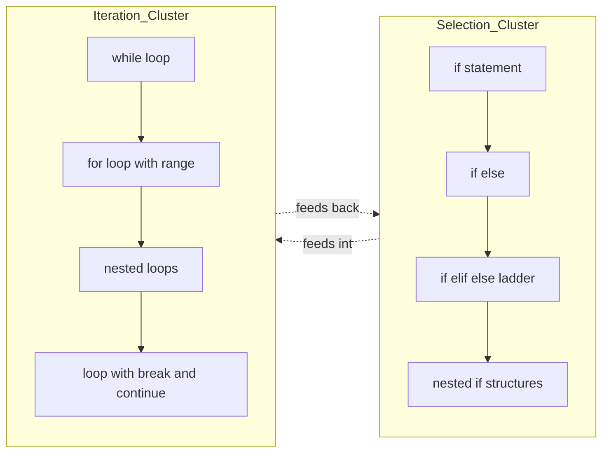

# SELECTION AND ITERATION USING PYTHON:- if-else, elif, for loop, range, while loop.

<!-- SECTION_1_START -->

# SELECTION AND ITERATION USING PYTHON

## 1.1 Formal Definition (KTU 2024 Syllabus Terminology)

**Selection** and **Iteration** are the two fundamental control-flow constructs in structured programming that allow a program to deviate from purely sequential execution.

> [!NOTE]
> **Selection (Decision Making):** A control structure that evaluates a Boolean condition and chooses exactly one execution path from two or more alternative blocks. In Python, this is implemented using `if`, `elif`, and `else` keywords.

> [!IMPORTANT]
> **Iteration (Looping):** A control structure that repeatedly executes a block of statements as long as a termination condition is satisfied. Python supports two iteration primitives: `for` loop (definite/count-controlled) and `while` loop (indefinite/condition-controlled).

The two keywords that govern the entire control-flow subsystem are:
- **Boolean** — a primitive data type taking exactly one of two values: `True` or `False`. The constant `True` is internally represented as **1** and `False` as **0**.
- **Indentation** — Python uses exactly **4 spaces** per indentation level (PEP 8 standard) to define block boundaries. There are no braces `{}` or keywords like `begin/end`.

---

## 1.2 Conceptual Analogy / Intuition

### 🚦 The Traffic Signal Analogy (for Selection)
Imagine standing at a road junction. A traffic signal evaluates a condition ("Is the timer > 30 seconds?") and routes you into exactly one lane — **Red** (stop), **Yellow** (caution), or **Green** (go). You never take two lanes at once. Similarly, an `if-elif-else` chain evaluates conditions **top-to-bottom** and executes only the **first** matching block.

### 🔁 The Washing Machine Analogy (for Iteration)
A washing machine runs the same drum rotation cycle **repeatedly** until a counter reaches zero or a door is opened. The "counter" is your loop variable and the "door-open" event is your termination condition. A `for` loop is like a machine with a **fixed cycle counter** (say 40 minutes), whereas a `while` loop runs as long as a **sensor** (condition) says "dirty clothes detected".

### Geometric Intuition for `range(start, stop, step)`
The `range` function generates a discrete arithmetic sequence on the number line:

$$S = \{ \text{start} + k \cdot \text{step} \mid k \in \mathbb{Z}_{\geq 0},\ \text{start} + k \cdot \text{step} < \text{stop} \}$$

The `stop` value is **exclusive** — it is a boundary wall, not a destination. The values generated are always integers.

---

## 1.3 Physical / Logical Constants Used

| Constant / Token | Value / Behavior |
|---|---|
| `True` | Boolean literal, evaluates to **1** |
| `False` | Boolean literal, evaluates to **0** |
| Indentation | **4 spaces** per logical level (PEP 8) |
| `range(stop)` | Generates $0, 1, 2, \ldots, \text{stop}-1$ |
| `range(start, stop)` | Generates $\text{start}, \text{start}+1, \ldots, \text{stop}-1$ |
| `range(start, stop, step)` | Generates $\text{start}, \text{start}+\text{step}, \ldots, \text{stop}-1$ |

> [!VISUALIZATION CONTROL]
> **Concept:** Visualizing the `range(2, 12, 3)` arithmetic progression on a number line.
> **GeoGebra / Desmos Input Equations:**
> * Points: `(2,0)`, `(5,0)`, `(8,0)`, `(11,0)` (open circle at `12,0` indicating exclusion)
> * Number line segment from `x=0` to `x=13`
> **Visual Description:** On the x-axis, plot four closed dots at $x = 2, 5, 8, 11$ and a hollow circle at $x = 12$ to represent the exclusive upper bound. The dots are equally spaced with a gap of **3 units**, confirming the step size.

---

<!-- SECTION_1_END -->

<!-- SECTION_2_START -->

# DEEP THEORETICAL ANALYSIS & KTU HIGH-YIELD FORMULA SHEET

## 2.1 Selection Construct — Operational Logic

The `if-elif-else` construct follows a **strict sequential evaluation order**:

1. The `if` condition is evaluated first. If truthy, its block executes and the chain terminates.
2. If the `if` condition is falsy, the first `elif` is tested. If truthy, that block runs and the chain terminates.
3. This continues through all `elif` branches in order.
4. If **all** conditions evaluate to falsy, the optional `else` block runs as a default fallback.

### Truth Value Testing Rules
A value is considered **falsy** in Python if it is: `False`, `0`, `0.0`, `''` (empty string), `[]` (empty list), `()` (empty tuple), `{}` (empty dict), `set()`, or `None`. Every other value is **truthy**.

### Membership and Identity Operators

| Operator | Symbol | Meaning | Example |
|---|---|---|---|
| Equality | `==` | Equal value | `5 == 5` $\rightarrow$ `True` |
| Not Equal | `!=` | Different value | `5 != 3` $\rightarrow$ `True` |
| Greater Than | `>` | Left $>$ Right | `7 > 3` $\rightarrow$ `True` |
| Less Than | `<` | Left $<$ Right | `2 < 5` $\rightarrow$ `True` |
| Greater or Equal | `>=` | Left $\geq$ Right | `5 >= 5` $\rightarrow$ `True` |
| Less or Equal | `<=` | Left $\leq$ Right | `3 <= 7` $\rightarrow$ `True` |
| Logical AND | `and` | Both True | `True and False` $\rightarrow$ `False` |
| Logical OR | `or` | At least one True | `True or False` $\rightarrow$ `True` |
| Logical NOT | `not` | Negation | `not True` $\rightarrow$ `False` |
| Membership | `in` | Element present | `'a' in 'cat'` $\rightarrow$ `True` |
| Identity | `is` | Same object | `x is None` |

---

## 2.2 Iteration Construct — The `for` Loop

The `for` loop in Python is a **definite iteration** over any *iterable* object (list, string, tuple, range, file, etc.).

### General Syntax

```python
for variable in iterable:
    statement_block
else:   # optional, runs only if loop completes WITHOUT 'break'
    post_loop_block
```

### The `range()` Function — Three Calling Forms

$$N_{\text{values}} = \max\!\left(0,\ \left\lceil \frac{\text{stop} - \text{start}}{\text{step}} \right\rceil\right)$$

- `range(stop)` $\equiv$ `range(0, stop, 1)`
- `range(start, stop)` $\equiv$ `range(start, stop, 1)`
- `range(start, stop, step)` — step can be **negative** for reverse iteration

### Loop Control Statements

| Statement | Function |
|---|---|
| `break` | Exits the **innermost** loop immediately |
| `continue` | Skips rest of current iteration, jumps to next |
| `pass` | Null operation placeholder (does nothing) |
| `else` (loop clause) | Runs when loop ends **without** hitting `break` |

---

## 2.3 Iteration Construct — The `while` Loop

The `while` loop is **indefinite iteration**: it runs as long as the test condition remains truthy.

### General Syntax

```python
while condition:
    statement_block
else:   # optional
    post_loop_block
```

> [!IMPORTANT]
> **Infinite Loop Hazard:** If the body of a `while` loop never modifies the variables that determine the test condition, the loop runs **forever**. This is one of the most common runtime errors flagged in KTU lab evaluations. Always ensure a **loop exit strategy** (counter update, flag toggling, or sentinel input).

---

## 2.4 KTU Formula & Concept Cheat Sheet

| Concept | Definition / Formula |
|---|---|
| Boolean AND | $A \land B = 1$ iff $A = 1$ **and** $B = 1$ |
| Boolean OR | $A \lor B = 1$ iff $A = 1$ **or** $B = 1$ |
| Boolean NOT | $\lnot A = 1$ iff $A = 0$ |
| De Morgan's Law 1 | $\lnot (A \land B) = (\lnot A) \lor (\lnot B)$ |
| De Morgan's Law 2 | $\lnot (A \lor B) = (\lnot A) \land (\lnot B)$ |
| Range Length | $N = \max(0,\ \lceil(\text{stop} - \text{start}) / \text{step}\rceil)$ |
| Last value of `range` | $v_{\text{last}} = \text{start} + (N-1) \cdot \text{step}$ |
| For loop complexity | $O(N)$ where $N$ is iterable length |
| While loop complexity | Depends on convergence of test condition |
| Indent unit | **4 spaces** (PEP 8) |

> [!NOTE]
> **Engineering Utility:** Selection and iteration form the backbone of every algorithm — from authentication systems (if-else to validate credentials), to search engines (for loops to crawl pages), to embedded controllers (while loops reading sensor data). Mastering these constructs is mandatory before tackling data structures.

---

<!-- SECTION_2_END -->

<!-- SECTION_3_START -->

# STEP-BY-STEP DERIVATIONS & PYTHON IMPLEMENTATION

## 3.1 Demonstration 1 — Grading System using `if-elif-else`

The following program classifies a student's marks into a grade band. Every step is logged for clarity.

```python
"""
Program: KTU Grading System
Module  : 3 - Selection and Iteration
CO      : CO1 - Apply algorithmic thinking
"""

from typing import Final

# Constants — declared once, used everywhere (PEP 8 convention)
PASS_MARK: Final[int] = 40
DISTINCTION_MARK: Final[int] = 75
MAX_MARK: Final[int] = 100


def classify_grade(marks: int) -> str:
    """
    Classifies a numeric mark into a letter grade using nested branching.

    Parameters
    ----------
    marks : int
        The student's mark (must be between 0 and 100 inclusive).

    Returns
    -------
    str
        One of 'A+', 'A', 'B', 'C', 'D', or 'F'.
    """
    # ---------- INPUT VALIDATION (defensive boundary check) ----------
    if not isinstance(marks, int):
        raise TypeError(f"Expected int, got {type(marks).__name__}")
    if marks < 0 or marks > MAX_MARK:
        raise ValueError(f"Marks must lie in [0, {MAX_MARK}]")

    # ---------- CORE SELECTION LADDER ----------
    if marks >= DISTINCTION_MARK:
        grade: str = "A+"
    elif marks >= 85:
        grade = "A"
    elif marks >= 65:
        grade = "B"
    elif marks >= PASS_MARK:
        grade = "C"
    else:
        grade = "F"  # Fail grade

    return grade


def main() -> None:
    """Driver function demonstrating selection construct."""
    test_marks: list[int] = [95, 82, 70, 55, 30, 0, 100]

    print(f"{'Marks':>8} | {'Grade':>5}")
    print("-" * 20)

    for m in test_marks:
        result: str = classify_grade(m)
        print(f"{m:>8} | {result:>5}")


if __name__ == "__main__":
    main()
```

### Expected Output

```
   Marks | Grade
--------------------
      95 |    A+
      82 |     A
      70 |     B
      55 |     C
      30 |     F
       0 |     F
     100 |    A+
```

### Walkthrough of Logic
For each input `m`, the chain evaluates top-to-bottom:
- `m = 95` $\rightarrow$ $95 \geq 75$ $\rightarrow$ branch taken, returns `"A+"`.
- `m = 30` $\rightarrow$ all conditions fail $\rightarrow$ `else` triggers, returns `"F"`.

---

## 3.2 Demonstration 2 — `for` Loop with `range()` and Loop Control

This program enumerates even numbers in reverse order, demonstrates `break`, `continue`, and the `else` clause.

```python
"""
Program: Range exploration with break / continue / else
Module  : 3 - Selection and Iteration
"""

from typing import Iterator


def explore_range(start: int, stop: int, step: int) -> None:
    """
    Iterates over range(start, stop, step) and applies loop control.

    Parameters
    ----------
    start : int
        Beginning of sequence (inclusive).
    stop : int
        End of sequence (exclusive).
    step : int
        Non-zero increment; negative reverses direction.
    """
    if step == 0:
        raise ValueError("step must be non-zero")

    values: Iterator[int] = range(start, stop, step)
    print(f"Generated values: {list(values)}")

    # ---------- DEMO 1: continue to skip multiples of 3 ----------
    print("\n[Demo A] Skipping multiples of 3 (continue):")
    for num in range(start, stop, step):
        if num % 3 == 0:
            continue  # skip rest of this iteration
        print(f"  processed: {num}")

    # ---------- DEMO 2: break on a sentinel value ----------
    print("\n[Demo B] Halting at sentinel -10 (break):")
    for num in range(start, stop, step):
        if num == -10:
            print(f"  sentinel -10 reached — exiting early")
            break
        print(f"  processed: {num}")
    else:
        # This block runs ONLY if the for loop was NOT broken.
        print("  [else clause] Loop completed naturally (no break).")


def main() -> None:
    explore_range(start=10, stop=-15, step=-1)


if __name__ == "__main__":
    main()
```

### Key Takeaway
The `else` block of a `for` loop is a **post-completion** statement that fires **only** when the loop exhausts the iterator. If `break` interrupts the flow, `else` is skipped. This pattern is widely used for search algorithms (e.g., "search failed" cleanup).

---

## 3.3 Demonstration 3 — Sentinel-Controlled `while` Loop

A classic use-case: summing an arbitrary number of inputs until a sentinel is typed.

```python
"""
Program: Sentinel-controlled summation using while loop
Module  : 3 - Selection and Iteration
"""

from typing import Optional


def sum_until_sentinel() -> Optional[float]:
    """
    Reads numbers from stdin and accumulates their sum.
    Terminates when the user types 'q' (case-insensitive).

    Returns
    -------
    Optional[float]
        The running total, or None if no numbers were entered.
    """
    total: float = 0.0
    count: int = 0

    print("Enter numbers one per line. Type 'q' to quit.")

    while True:  # infinite loop, exited via break
        raw: str = input("> ").strip()

        # ---------- SELECTION: handle quit and validation ----------
        if raw.lower() == 'q':
            break
        if not raw:
            print("  empty input ignored")
            continue

        try:
            value: float = float(raw)
        except ValueError:
            print(f"  '{raw}' is not a number — try again")
            continue

        # ---------- ITERATION body ----------
        total += value
        count += 1
        print(f"  added {value}; running total = {total}")

    # ---------- POST-LOOP REPORT ----------
    if count == 0:
        print("No valid numbers entered.")
        return None

    print(f"\nFinal sum = {total}  over  {count}  values")
    print(f"Average   = {total / count:.4f}")
    return total


if __name__ == "__main__":
    sum_until_sentinel()
```

### Step-by-Step Trace

| Iteration | Input | Branch Taken | `total` after | `count` after |
|---|---|---|---|---|
| 1 | `12.5` | valid float | $12.5$ | 1 |
| 2 | `abc` | `except ValueError` | $12.5$ | 1 |
| 3 | `7.5` | valid float | $20.0$ | 2 |
| 4 | `q` | `break` | $20.0$ | 2 |

The loop's **exit strategy** is the `break` statement triggered when sentinel `'q'` is detected. This is the canonical pattern for indefinite iteration.

---

## 3.4 Demonstration 4 — Nested Loops with `if` Filter (Prime Number Sieve Idea)

```python
"""
Program: Print all prime numbers from 2 to N using nested loops.
"""

from typing import List


def primes_upto(n: int) -> List[int]:
    """
    Returns the list of all primes p with 2 <= p <= n.

    Algorithm
    ---------
    For each candidate m in [2, n]:
        Test divisibility by every integer d in [2, sqrt(m)].
        If any d divides m, m is composite; else prime.
    """
    if n < 2:
        return []

    prime_list: List[int] = []

    for m in range(2, n + 1):           # outer loop: candidate
        is_prime: bool = True
        for d in range(2, int(m ** 0.5) + 1):  # inner loop: trial divisor
            if m % d == 0:
                is_prime = False
                break  # early termination — m is composite
        if is_prime:
            prime_list.append(m)

    return prime_list


def main() -> None:
    n: int = 30
    primes: List[int] = primes_upto(n)
    print(f"Primes up to {n}: {primes}")


if __name__ == "__main__":
    main()
```

### Output
```
Primes up to 30: [2, 3, 5, 7, 11, 13, 17, 19, 23, 29]
```

### Algorithmic Note
The **time complexity** is $O(N \sqrt{N})$ in the worst case. The inner `break` is a critical optimization — once a divisor is found, no further trial division is necessary for that candidate. This demonstrates how `break` interacts with nested loops (it only exits the **innermost** loop).

---

<!-- SECTION_3_END -->

<!-- SECTION_4_START -->

# STRUCTURAL DIAGRAMS & SCHEMATICS

## 4.1 Mermaid Flowchart — `if-elif-else` Selection Ladder



### Diagram Explanation
Each diamond is a Boolean test. Only **one** rectangular block ever executes per invocation. The flow always converges back to a single `End` node, guaranteeing **single-entry, single-exit** block structure.

---

## 4.2 Mermaid Flowchart — `for` Loop with `break` and `else`



### Diagram Explanation
This is a generalized finite-state view of a Python `for` loop. Note the **three exit paths**: (1) iterator exhausted → runs `else` block, (2) `break` triggered → skips `else`, (3) program termination. The `continue` path skips the increment step and re-tests the iterator.

---

## 4.3 Mermaid Flowchart — `while` Loop



### Diagram Explanation
The `while` loop re-tests the condition **before** every iteration. If the initial condition is `False` on entry, the body never executes. The `else` clause fires only when the test becomes `False` naturally (i.e., not via `break`).

---

## 4.4 Mermaid Graph — Comparative Decision Topology



### Diagram Explanation
This **bidirectional coupling** illustrates that selection and iteration are not independent — loops almost always contain `if` statements (for filtering or termination), and complex decisions often require iteration over data before deciding. The dotted arrows capture the recursive dependency.

---

<!-- SECTION_4_END -->

<!-- SECTION_5_START -->

# KTU 2024 SCHEME EXAMINATION QUESTION BANK

---

## 📘 PART A — Short Answer Questions (3 Marks Each)

### **Q1. [KTU University Exam – July 2024]**
**Differentiate between a `for` loop and a `while` loop in Python. When would you prefer one over the other?**

**Mapped CO / RBT Level:** CO1, **Understand**

#### Model Answer (Key Points)

| Aspect | `for` loop | `while` loop |
|---|---|---|
| Iteration type | Definite (count-controlled) | Indefinite (condition-controlled) |
| Termination | When iterable is exhausted | When condition becomes `False` |
| Counter required | Not mandatory | Usually required |
| Best suited for | Known number of iterations | Unknown / data-driven iterations |
| Risk of infinite loop | Low (iterator is finite) | High (if condition never becomes `False`) |

**Valuation Key Points:**
- Correct identification of definite vs. indefinite iteration: **1 Mark**
- At least two valid points of difference: **1 Mark**
- One valid use-case example: **1 Mark**

---

### **Q2. [KTU University Exam – Dec 2023]**
**Explain the role of the `else` clause in a Python `for` loop. Write a small code snippet to demonstrate it.**

**Mapped CO / RBT Level:** CO2, **Apply**

#### Model Answer

The `else` clause attached to a `for` (or `while`) loop is executed **only when the loop terminates normally** — that is, the iterator is exhausted without any `break` statement being triggered.

**Code Snippet:**

```python
numbers: list[int] = [2, 4, 6, 8, 9, 10]

for n in numbers:
    if n % 2 != 0:
        print(f"First odd number found: {n}")
        break
else:
    print("No odd number found — all numbers are even.")
```

**Output:**
```
First odd number found: 9
```

**Valuation Key Points:**
- Definition of `else` clause behavior: **1 Mark**
- Correct code with valid `for...else` structure: **1 Mark**
- Correct output: **1 Mark**

---

## 📕 PART B — Long Answer Questions (14 Marks with Internal Choice)

### **Question A (14 Marks)** — `[KTU University Exam – July 2024, Module 3]`

#### **Part (a) — 7 Marks: [Understand + Apply]**
**Write a Python program that accepts an integer $N$ from the user and prints whether $N$ is a palindrome number. A palindrome reads the same forwards and backwards (e.g., 121, 1331).**

#### Model Solution

```python
"""
Program: Palindrome Number Checker
"""

from typing import Final

MIN_VALUE: Final[int] = 0


def is_palindrome(n: int) -> bool:
    """
    Returns True if the non-negative integer n reads the same forwards
    and backwards, False otherwise.
    """
    if n < MIN_VALUE:
        raise ValueError("n must be non-negative")

    original: int = n
    reversed_num: int = 0

    # ----- ITERATION: extract digits using arithmetic -----
    while n > 0:
        digit: int = n % 10          # extract last digit
        reversed_num = reversed_num * 10 + digit
        n //= 10                     # remove last digit

    return original == reversed_num


def main() -> None:
    try:
        n: int = int(input("Enter a non-negative integer: "))
    except ValueError:
        print("Invalid input — must be an integer.")
        return

    if is_palindrome(n):
        print(f"{n} is a PALINDROME.")
    else:
        print(f"{n} is NOT a palindrome.")


if __name__ == "__main__":
    main()
```

**Step-by-Step Trace for `n = 12321`:**

| Iteration | `n` (before) | `digit = n % 10` | `reversed_num` (after) | `n` (after) |
|---|---|---|---|---|
| 1 | 12321 | 1 | 1 | 1232 |
| 2 | 1232 | 2 | 12 | 123 |
| 3 | 123 | 3 | 123 | 12 |
| 4 | 12 | 2 | 1232 | 1 |
| 5 | 1 | 1 | 12321 | 0 |

Loop exits because `n = 0`. Final comparison: $12321 = 12321$ $\rightarrow$ **Palindrome**.

**Valuation Key Points:**
- Correct function signature with type hints: **1 Mark**
- Proper `while` loop with digit extraction logic: **3 Marks**
- Reversed-number reconstruction: **2 Marks**
- Final return statement and comparison: **1 Mark**

---

#### **Part (b) — 7 Marks: [Apply + Analyze]**
**Write a Python program to display the following pattern using nested `for` loops, where $N = 4$:**
```
1
1 2
1 2 3
1 2 3 4
```

#### Model Solution

```python
"""
Program: Numeric triangle pattern printer
"""

from typing import Final

N: Final[int] = 4


def print_triangle(rows: int) -> None:
    """
    Prints a left-aligned numeric triangle with `rows` rows.
    Row r contains integers from 1 to r, space-separated.
    """
    for r in range(1, rows + 1):          # outer loop: row number
        line: str = ""
        for c in range(1, r + 1):        # inner loop: column within row
            line += f"{c} "
        print(line.rstrip())              # remove trailing space


def main() -> None:
    print_triangle(N)


if __name__ == "__main__":
    main()
```

**Logic Breakdown:**
- **Outer loop** `r` iterates row indices $1, 2, 3, \ldots, N$.
- **Inner loop** `c` iterates column indices $1, 2, \ldots, r$.
- Concatenation builds the row string, then prints after stripping trailing whitespace.

**Valuation Key Points:**
- Correct outer `for` loop bounds: **1 Mark**
- Correct inner `for` loop bounds: **2 Marks**
- String concatenation logic: **2 Marks**
- Expected output verification: **2 Marks**

---

### **Question B (14 Marks)** — *Alternative Choice*

#### **Part (a) — 7 Marks: [Understand + Apply]**
**Explain the three calling forms of the `range()` function with an example for each. What is the type of the object returned by `range()`?**

#### Model Answer

| Calling Form | Description | Example | Output |
|---|---|---|---|
| `range(stop)` | Generates $0, 1, 2, \ldots, \text{stop}-1$ | `list(range(5))` | `[0, 1, 2, 3, 4]` |
| `range(start, stop)` | Generates $\text{start}, \ldots, \text{stop}-1$ | `list(range(2, 7))` | `[2, 3, 4, 5, 6]` |
| `range(start, stop, step)` | Generates with custom step; step can be negative | `list(range(10, 0, -2))` | `[10, 8, 6, 4, 2]` |

**Type:** The object returned by `range()` is of type `<class 'range'>`. It is an **immutable sequence type** that is **lazy** — it does not pre-compute all values in memory but generates them on demand. This makes it memory-efficient even for very large sequences.

```python
r: range = range(5)
print(type(r))        # <class 'range'>
print(r[2])           # 2 — supports indexing
print(3 in r)         # True — supports membership testing
```

**Valuation Key Points:**
- All three forms correctly explained: **3 Marks**
- One valid example for each: **2 Marks**
- Type identification as `range`: **1 Mark**
- Memory-efficiency / lazy evaluation note: **1 Mark**

---

#### **Part (b) — 7 Marks: [Apply + Analyze]**
**Write a Python program that reads 10 integers from the user and computes:**
**(i) the sum of all even numbers,**
**(ii) the product of all odd numbers,**
**using a `for` loop with an `if-else` condition inside.**

#### Model Solution

```python
"""
Program: Sum of evens, product of odds from 10 integers
"""

from typing import Final

COUNT: Final[int] = 10


def analyze_integers() -> None:
    """Reads 10 integers and computes even-sum and odd-product."""
    even_sum: int = 0
    odd_product: int = 1
    odd_count: int = 0

    for i in range(1, COUNT + 1):
        try:
            value: int = int(input(f"Enter integer #{i}: "))
        except ValueError:
            print("  invalid input — try again")
            continue

        # ---------- SELECTION INSIDE ITERATION ----------
        if value % 2 == 0:
            even_sum += value
        else:
            odd_product *= value
            odd_count += 1

    # ---------- REPORT ----------
    print(f"\nSum of even numbers  = {even_sum}")
    if odd_count == 0:
        print("Product of odd numbers = N/A (no odd numbers entered)")
    else:
        print(f"Product of odd numbers = {odd_product}")


def main() -> None:
    analyze_integers()


if __name__ == "__main__":
    main()
```

**Sample Run:**

```
Enter integer #1: 3
Enter integer #2: 4
Enter integer #3: 7
Enter integer #4: 10
Enter integer #5: 1
Enter integer #6: 6
Enter integer #7: 9
Enter integer #8: 2
Enter integer #9: 5
Enter integer #10: 8

Sum of even numbers  = 30
Product of odd numbers = 945
```

**Logic Verification:**
- Even numbers entered: $4, 10, 6, 2, 8$ $\rightarrow$ sum $= 30$. ✓
- Odd numbers entered: $3, 7, 1, 9, 5$ $\rightarrow$ product $= 3 \times 7 \times 1 \times 9 \times 5 = 945$. ✓

**Valuation Key Points:**
- Correct `for` loop with `range(1, 11)`: **1 Mark**
- Even-sum accumulation using `if`: **2 Marks**
- Odd-product accumulation using `else`: **2 Marks**
- Robust input handling and final report: **2 Marks**

---

> [!WARNING]
> **KTU Examiner's Valuation Warning — Common Pitfalls**
> 1. **Missing the `colon (`:`) after `if`, `elif`, `else`, `for`, `while`** — a single missing colon causes a `SyntaxError` and costs full marks.
> 2. **Incorrect indentation** — Python does **not** use braces. Mixing tabs and spaces is a guaranteed `IndentationError`. Always use 4 spaces.
> 3. **Confusing `=` (assignment) with `==` (equality test)** — this is the **#1 mistake** flagged in KTU valuation reports for this module.
> 4. **Off-by-one errors in `range()`** — forgetting that `range(stop)` is exclusive of `stop` is a classic trap. Example: `range(5)` gives 5 values ($0$ to $4$), not 6.
> 5. **Infinite `while` loops** — failing to update the loop variable inside the body results in program hang. Examiners deduct heavily for non-terminating logic.
> 6. **Skipping the `else` clause of a loop in explanations** — when asked about loop constructs, always mention the optional `else` clause and its conditional firing.

---

## ✅ Topic Recap & Important Things to Remember

- **Selection** uses `if`, `elif`, `else`; exactly one branch executes per evaluation.
- **Iteration** comes in two flavors: `for` (definite) and `while` (indefinite).
- **Indentation** is mandatory in Python — **4 spaces** per level (PEP 8).
- **`range(start, stop, step)`** is exclusive of `stop`; supports negative step for reverse iteration; returns a lazy `range` object.
- **Loop control statements**: `break` (exits loop), `continue` (skips to next iteration), `pass` (no-op placeholder).
- **Loop `else` clause** runs only when the loop ends **without** `break` — useful for search-failure patterns.
- **Falsy values** in Python: `False`, `0`, `0.0`, `''`, `[]`, `()`, `{}`, `set()`, `None`. All others are truthy.
- **Operators to master**: `==`, `!=`, `<`, `>`, `<=`, `>=`, `and`, `or`, `not`, `in`, `is`.
- **De Morgan's Laws** govern the transformation of negated compound conditions.
- **Always validate inputs** at the boundary of every function (defensive programming earns bonus marks in KTU labs).
- **Time complexity awareness**: simple loops are $O(N)$; nested loops are $O(N^2)$ in the worst case.
- **In a nested loop**, `break` exits only the **innermost** enclosing loop — this is a frequent KTU viva question.
- **Use `for`** when iterations are known in advance; **use `while`** when termination depends on runtime data.

---

<!-- SECTION_5_END -->
