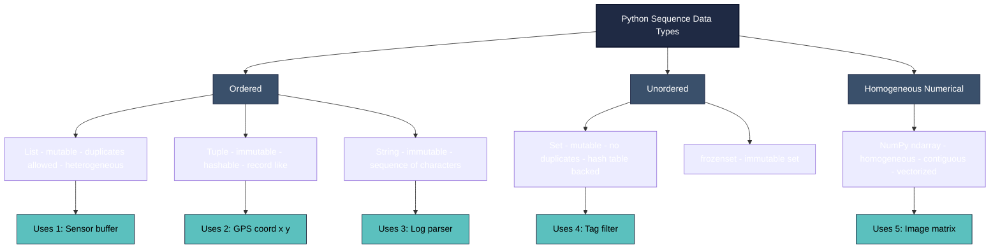
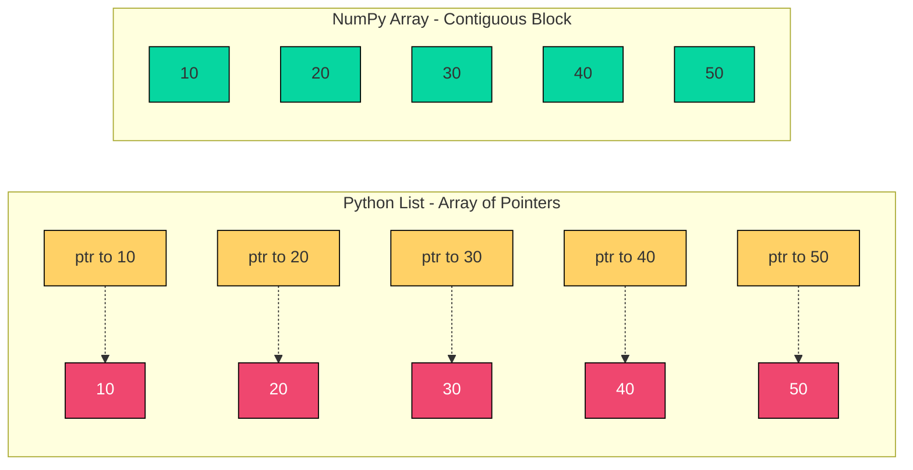
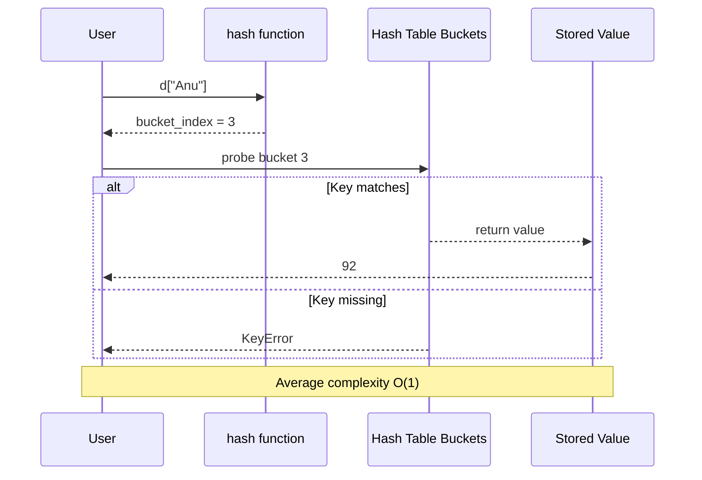
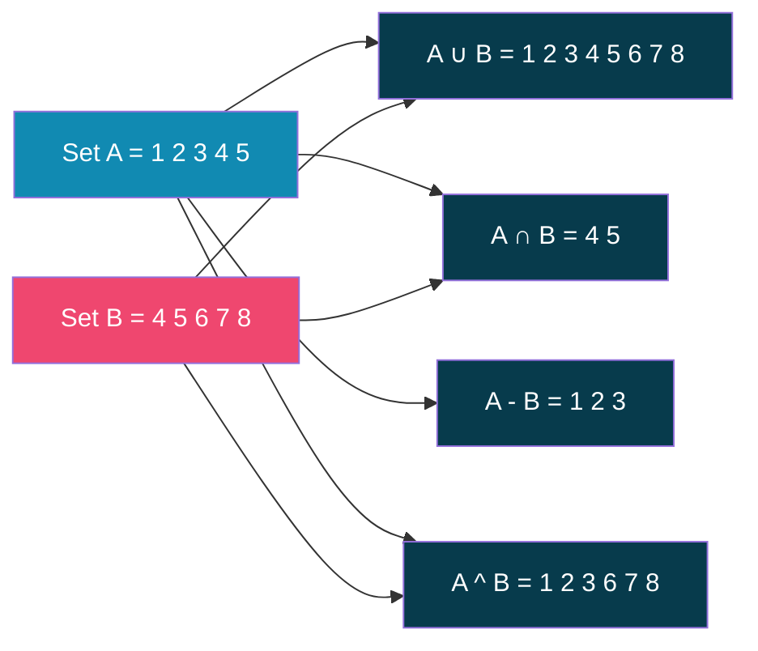
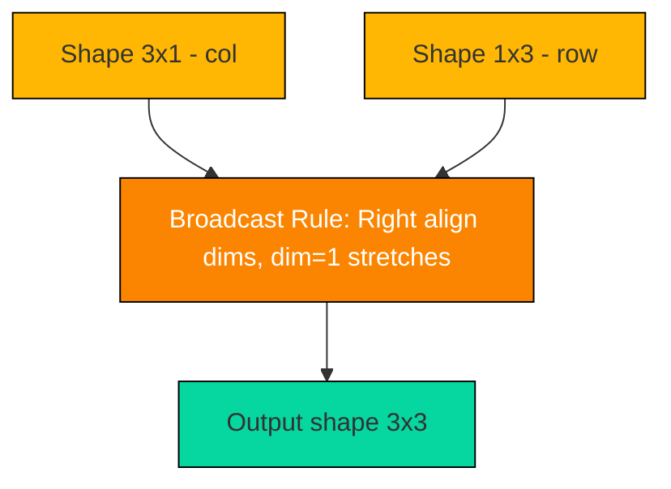

# Sequence data types in Python - list, tuple, set, strings, dictionary, Creating and using Arrays in Python (using Numpy library).

<!-- SECTION_1_START -->
# Sequence Data Types in Python & NumPy Arrays

## 1.1 Formal KTU 2024 Definition

> [!IMPORTANT]
> **KTU 2024 Syllabus Definition:** Sequence data types in Python are ordered (or unordered) collections of items used to store, access, and manipulate groups of related values. The core built-in sequence data types are **List**, **Tuple**, **String**, **Set**, and **Dictionary**. For high-performance numerical computations, the **NumPy** library provides the `ndarray` (N-dimensional array) object, which forms the backbone of scientific computing in Python.

| Data Type | Category | Mutability | Order | Duplicates | Indexing |
|---|---|---|---|---|---|
| **List** | Sequence | Mutable | Ordered | Allowed | Integer / Slice |
| **Tuple** | Sequence | Immutable | Ordered | Allowed | Integer / Slice |
| **String** | Sequence (of chars) | Immutable | Ordered | Allowed | Integer / Slice |
| **Set** | Collection | Mutable | Unordered | Not allowed | No indexing |
| **Dictionary** | Mapping | Mutable | Ordered (3.7+) | Keys unique | By key |
| **NumPy ndarray** | Array | Mutable | Ordered | Allowed | Integer / Slice / Fancy |

---

## 1.2 Conceptual Analogy / Intuition

> [!NOTE]
> **Analogy — A Toolbox with Different Drawers:**
> Imagine a **workshop toolbox** for a Python programmer.
> - A **List** is like a *tool tray with labeled slots* that you can rearrange freely (mutable, ordered, allows duplicates — e.g., a parts list where the same screw may appear twice).
> - A **Tuple** is a *sealed component pack* — once manufactured, the contents cannot change (immutable). Think of a GPS coordinate `(lat, lon)` or a date of birth.
> - A **String** is a *printed label* — a sequence of characters that you can read but cannot alter piece by piece.
> - A **Set** is a *unique-pegboard* — every tool appears at most once, and there is no "first" or "last" position.
> - A **Dictionary** is a *labelled shadow-board* — every tool has a unique label (key), and you fetch it by name, not by position.
> - A **NumPy array** is a *military-grade storage rack* — every slot must be the same type, packed tightly in memory for blazing-fast vectorized math.

---

## 1.3 Why These Types Matter in KTU Exams

> [!TIP]
> **Boards usually test:** (1) Mutability differences, (2) Methods like `append`, `extend`, `insert`, `remove`, `pop`, (3) Dictionary `get()` vs `[]` access, (4) Set operations (union, intersection, difference), (5) NumPy array creation, slicing, broadcasting, and `shape`/`reshape`.

---

## 1.4 GeoGebra / Desmos Visualization

> [!VISUALIZATION CONTROL]
> **Concept:** Visualizing a Python list as an ordered, indexed 1-D structure.
> **Desmos Input (1-D Indexed Sequence):**
> * `x = 1, 2, 3, 4, 5` (list values)
> * Label each `(i, x_i)` point with the index
> **Visual Description:** On the x-axis plot integer indices 0 → 4; on the y-axis plot list values. A 2-D heatmap (5×3) can represent a 2-D NumPy array where every cell is the same datatype — illustrating **homogeneity** vs the **heterogeneity** of a Python list.

---
<!-- SECTION_1_END -->

<!-- SECTION_2_START -->
# 2. Deep Theoretical Analysis & KTU High-Yield Formula Sheet

## 2.1 The List — Mutable Ordered Sequence

A **list** is Python's most versatile sequence container. It is **mutable** (can be modified in place), **ordered** (preserves insertion order), and **allows duplicates** of any heterogeneous objects.

### 2.1.1 Creation Syntax

$$\text{list\_obj} = [e_0, e_1, e_2, \ldots, e_{n-1}]$$

Other constructors:
- `list(iterable)` — converts any iterable
- `[expr for item in iterable if condition]` — list comprehension

### 2.1.2 Memory Model (CPython)

> [!NOTE]
> A Python list does **not** store the items contiguously. Internally, it is an **array of pointers** (`PyObject*`) to heap-allocated objects. This is why list indexing is $O(1)$ (pointer dereference) but `list + list` concatenation is $O(n + m)$ (a new array of pointers is created).

### 2.1.3 Core Methods (High-Yield Table)

| Method | Syntax | Returns | Time Complexity |
|---|---|---|---|
| `append(x)` | `L.append(x)` | `None` (in-place) | $O(1)$ amortized |
| `extend(it)` | `L.extend(it)` | `None` (in-place) | $O(k)$ |
| `insert(i, x)` | `L.insert(i, x)` | `None` (in-place) | $O(n)$ |
| `remove(x)` | `L.remove(x)` | `None` (in-place) | $O(n)$ |
| `pop([i])` | `L.pop()` or `L.pop(i)` | removed element | $O(1)$ / $O(n)$ |
| `index(x)` | `L.index(x)` | first index of `x` | $O(n)$ |
| `count(x)` | `L.count(x)` | frequency of `x` | $O(n)$ |
| `sort()` | `L.sort(key=...)` | `None` (in-place) | $O(n \log n)$ |
| `reverse()` | `L.reverse()` | `None` (in-place) | $O(n)$ |
| `copy()` | `L.copy()` | shallow list | $O(n)$ |
| `clear()` | `L.clear()` | `None` | $O(n)$ |

---

## 2.2 The Tuple — Immutable Ordered Sequence

A **tuple** is identical to a list in functionality **except it cannot be modified** after creation. It uses parentheses `()` and serves three engineering purposes:
1. **Data integrity** — the value cannot be accidentally overwritten.
2. **Hashable** — tuples can be used as `dict` keys and `set` members (provided every element is also hashable).
3. **Performance** — CPython caches small tuples, making them ~2× faster than lists for read-only access.

$$\text{tuple\_obj} = (e_0, e_1, \ldots, e_{n-1})$$

> [!IMPORTANT]
> **Single-element tuple pitfall:** `(5)` is an integer in Python. You **must** write `(5,)` to create a one-element tuple. This is a classic KTU valuation trap.

### Tuple Packing / Unpacking

$$a, b, c = (1, 2, 3) \quad \text{(tuple unpacking)}$$

---

## 2.3 The String — Immutable Sequence of Characters

A **string** is an immutable sequence of Unicode code points. Defined using `'...'`, `"..."`, `'''...'''`, or `"""..."""`. It supports all common sequence operations (indexing, slicing, `in`, `+`, `*`).

### Key String Methods (High-Yield Table)

| Method | Purpose | Example |
|---|---|---|
| `str.upper()` | uppercase all | `"hi".upper()` → `"HI"` |
| `str.lower()` | lowercase all | `"HI".lower()` → `"hi"` |
| `str.strip()` | trim whitespace | `"  x  ".strip()` → `"x"` |
| `str.split(sep)` | split into list | `"a,b,c".split(",")` → `['a','b','c']` |
| `str.join(it)` | join iterable | `",".join(['a','b'])` → `"a,b"` |
| `str.replace(a, b)` | replace substring | `"ab".replace("a","x")` → `"xb"` |
| `str.find(sub)` | first index or `-1` | `"hello".find("ll")` → `2` |
| `str.startswith(p)` | boolean | `"py".startswith("p")` → `True` |
| `str.isdigit()` | all digits? | `"123".isdigit()` → `True` |
| `str.format()` | formatted output | `"{}={}".format("x",5)` → `"x=5"` |

---

## 2.4 The Set — Unordered Unique Collection

A **set** is an **unordered** collection of **unique, hashable** elements, backed by a **hash table**. Average membership test is $O(1)$ (vs $O(n)$ for a list).

$$\text{set\_obj} = \{e_0, e_1, \ldots, e_{n-1}\}$$

### Set Algebra — KTU Favourite

For two sets $A$ and $B$:

| Operation | Symbol | Method | Meaning |
|---|---|---|---|
| Union | $A \cup B$ | `A &#x7c; B` or `A.union(B)` | all elements in either |
| Intersection | $A \cap B$ | `A & B` or `A.intersection(B)` | common elements |
| Difference | $A \setminus B$ | `A - B` or `A.difference(B)` | in A, not in B |
| Symmetric Diff | $A \triangle B$ | `A ^ B` or `A.symmetric_difference(B)` | in one, not both |
| Subset | $A \subseteq B$ | `A.issubset(B)` | A entirely in B |
| Superset | $A \supseteq B$ | `A.issuperset(B)` | A contains B |
| Disjoint | $A \cap B = \emptyset$ | `A.isdisjoint(B)` | no common element |

> [!TIP]
> Use the operator form (`|`, `&`, `-`, `^`) when you want a **new** set; use the method form (`update`, `intersection_update`, etc.) when you want to **modify in place**. This is a recurring KTU question.

---

## 2.5 The Dictionary — Key-Value Mapping

A **dictionary** (`dict`) is a **mutable**, **insertion-ordered (since Python 3.7)**, **key-unique** mapping from hashable keys to arbitrary values.

$$\text{dict\_obj} = \{k_0 : v_0,\ k_1 : v_1,\ \ldots,\ k_{n-1} : v_{n-1}\}$$

Average access is $O(1)$ via the hash of the key. The hash function must satisfy:
$$k_1 = k_2 \implies \text{hash}(k_1) = \text{hash}(k_2)$$

### Key Methods (High-Yield Table)

| Method | Purpose | Returns |
|---|---|---|
| `d[k]` | access value | raises `KeyError` if missing |
| `d.get(k, default)` | safe access | `default` (or `None`) if missing |
| `d[k] = v` | insert / update | `None` |
| `d.keys()` | view of keys | `dict_keys` view |
| `d.values()` | view of values | `dict_values` view |
| `d.items()` | view of (k, v) pairs | `dict_items` view |
| `d.pop(k, d)` | remove & return | value or default |
| `d.update(other)` | merge dicts | `None` (in-place) |
| `k in d` | membership on **keys** | `bool` |
| `del d[k]` | delete entry | `None` |

> [!IMPORTANT]
> **`d[k]` vs `d.get(k)`:** `d[k]` raises `KeyError` if `k` is missing. `d.get(k, default)` returns `default` silently. In KTU coding questions, **always use `.get()`** when a missing key is a possibility.

---

## 2.6 NumPy Arrays — `ndarray`

The **NumPy** library (`numpy.ndarray`) is the de-facto standard for numerical work in Python. Unlike a list:
- All elements are of the **same dtype** (homogeneous).
- Stored in a **contiguous block of memory** (cache-friendly).
- Supports **vectorized** operations (no Python-level `for` loop needed).

### Creation Functions

| Function | Purpose |
|---|---|
| `np.array(list)` | from Python list |
| `np.zeros(shape)` | array of 0s |
| `np.ones(shape)` | array of 1s |
| `np.full(shape, val)` | array filled with `val` |
| `np.arange(start, stop, step)` | like `range`, returns array |
| `np.linspace(start, stop, n)` | `n` evenly spaced values |
| `np.random.randint(lo, hi, size)` | random integers |
| `np.eye(n)` | $n \times n$ identity matrix |
| `np.reshape(arr, shape)` | change shape (no copy if possible) |

### Shape, Size, ndim, dtype

For an array $A$ of shape $(d_1, d_2, \ldots, d_k)$:

$$\text{ndim}(A) = k, \qquad \text{size}(A) = \prod_{i=1}^{k} d_i$$

### Broadcasting Rule (NumPy)

> [!IMPORTANT]
> When operating on two arrays of different shapes, NumPy **right-aligns** the shapes and the smaller dimension must be **1** or match the larger one. Example: shape `(3, 1)` + shape `(1, 4)` $\rightarrow$ broadcasts to `(3, 4)`.

### Vectorized Arithmetic (No Loops!)

For arrays $A$ and $B$ of identical shape:

$$C = A + B \quad \Rightarrow \quad C_{ij} = A_{ij} + B_{ij} \quad \forall \, i, j$$

This is the **formula that beats Python loops** by ~50× in execution speed.

---

## 2.7 Real-World Engineering Use

| Data Type | Real-World Use |
|---|---|
| **List** | Storing sensor readings, queues, dynamic collections |
| **Tuple** | Database row, `(x, y, z)` 3-D points, dictionary keys |
| **String** | Log parsing, file paths, JSON, CSV tokens |
| **Set** | Removing duplicates, fast membership, graph adjacency |
| **Dictionary** | Frequency counts, JSON parsing, caching (`functools.lru_cache` uses a dict) |
| **NumPy array** | Image processing, ML feature matrices, signal processing, scientific simulation |
<!-- SECTION_2_END -->

<!-- SECTION_3_START -->
# 3. Step-by-Step Derivations & Code Implementation

> [!NOTE]
> All code below is **fully executable Python 3.10+**. Type hints are added per KTU coding best-practices. The output comment (`# →`) shows the expected result.

---

## 3.1 Lists — Full Operational Code

```python
from __future__ import annotations
import logging

logging.basicConfig(level=logging.INFO, format="%(levelname)s | %(message)s")
log = logging.getLogger("list_demo")

def list_demo() -> None:
    # ---- 1. Creation ----
    nums: list[int] = [10, 20, 30, 40, 50]
    mixed: list[object] = [1, "two", 3.0, [4]]  # heterogeneous allowed
    log.info("nums = %s", nums)

    # ---- 2. Indexing & Slicing ----
    first: int = nums[0]               # 10
    last:  int = nums[-1]              # 50
    sub:   list[int] = nums[1:4]       # [20, 30, 40]
    step:  list[int] = nums[::2]       # [10, 30, 50]
    log.info("first=%d last=%d sub=%s step=%s", first, last, sub, step)

    # ---- 3. Mutation methods ----
    nums.append(60)                    # → [10,20,30,40,50,60]
    nums.extend([70, 80])              # → [10,...,80]
    nums.insert(0, 5)                  # insert at index 0
    nums.remove(30)                    # remove first occurrence
    popped: int = nums.pop()           # removes & returns last
    idx:    int = nums.index(50)       # find position
    log.info("after mutation = %s, popped=%d, idx of 50=%d", nums, popped, idx)

    # ---- 4. List Comprehension ----
    squares: list[int] = [x * x for x in range(1, 6)]   # [1,4,9,16,25]
    evens:   list[int] = [x for x in nums if x % 2 == 0]
    log.info("squares = %s", squares)
    log.info("evens from nums = %s", evens)

    # ---- 5. Sort with custom key ----
    words: list[str] = ["fig", "apple", "banana"]
    words.sort(key=len)                # sort by length
    log.info("by length = %s", words)  # ['fig','apple','banana']

    # ---- 6. Safe copy (NOT = reference!) ----
    a: list[int] = [1, 2, 3]
    b: list[int] = a                   # SAME object (reference)
    c: list[int] = a.copy()            # NEW object (shallow copy)
    b.append(99)
    log.info("a=%s (changed because b is alias), c=%s (safe)", a, c)

if __name__ == "__main__":
    list_demo()
```

**Sample Output (verify on your system):**
```
INFO | nums = [10, 20, 30, 40, 50]
INFO | first=10 last=50 sub=[20, 30, 40] step=[10, 30, 50]
INFO | after mutation = [5, 10, 20, 40, 50, 60, 70], popped=80, idx of 50=4
INFO | squares = [1, 4, 9, 16, 25]
INFO | evens from nums = [10, 20, 40, 50, 60, 70]
INFO | by length = ['fig', 'apple', 'banana']
INFO | a=[1, 2, 3, 99] (changed because b is alias), c=[1, 2, 3] (safe)
```

---

## 3.2 Tuples — Full Operational Code

```python
def tuple_demo() -> None:
    # ---- 1. Creation ----
    t1: tuple[int, ...] = (1, 2, 3)
    t2: tuple[str, int] = ("Kerala", 1956)         # heterogeneous
    t3: tuple[int]      = (7,)                     # single-element tuple

    # ---- 2. Packing & Unpacking ----
    point: tuple[float, float] = 10.5, 20.7        # implicit packing
    x, y = point                                    # unpacking
    a, b, c = t1

    # ---- 3. Tuple as dict key (hashable) ----
    prices: dict[tuple[str, str], float] = {
        ("apple", "kg"): 180.0,
        ("banana", "dozen"): 60.0,
    }
    log.info("Apple per kg = %.2f", prices[("apple", "kg")])

    # ---- 4. Named Tuple (readable alternative) ----
    from collections import namedtuple
    Student = namedtuple("Student", ["name", "roll", "gpa"])
    s1 = Student(name="Anu", roll=42, gpa=9.1)
    log.info("Student name=%s gpa=%.1f", s1.name, s1.gpa)

    # ---- 5. Immutability proof ----
    try:
        t1[0] = 99
    except TypeError as e:
        log.error("Caught expected TypeError: %s", e)

if __name__ == "__main__":
    tuple_demo()
```

---

## 3.3 Strings — Full Operational Code

```python
def string_demo() -> None:
    raw: str = "  Hello, KTU 2024!  "
    log.info("stripped = '%s'", raw.strip())
    log.info("upper   = '%s'", raw.upper())
    log.info("replace = '%s'", raw.replace("KTU", "APJKTU"))

    parts: list[str] = "a,b,c,d".split(",")          # ['a','b','c','d']
    rejoined: str = "-".join(parts)                  # "a-b-c-d"
    log.info("parts=%s, rejoined='%s'", parts, rejoined)

    # Membership & find
    log.info("'KTU' in stripped? %s", "KTU" in raw.strip())   # True
    log.info("position of 'Hello' = %d", raw.strip().find("Hello"))

    # f-string formatting (preferred in modern KTU answers)
    name, marks = "Arjun", 92.5
    msg: str = f"Student {name} scored {marks:.1f}/100"
    log.info(msg)

    # String slicing trick: reverse a string
    s: str = "Python"
    rev: str = s[::-1]                               # "nohtyP"
    log.info("reverse of '%s' is '%s'", s, rev)

if __name__ == "__main__":
    string_demo()
```

---

## 3.4 Sets — Full Operational Code

```python
def set_demo() -> None:
    A: set[int] = {1, 2, 3, 4, 5}
    B: set[int] = {4, 5, 6, 7, 8}

    log.info("A ∪ B = %s", A | B)            # union
    log.info("A ∩ B = %s", A & B)            # intersection
    log.info("A − B = %s", A - B)            # difference
    log.info("A △ B = %s", A ^ B)            # symmetric difference
    log.info("A ⊆ A∪B ? %s", A.issubset(A | B))
    log.info("disjoint? %s", A.isdisjoint({10, 11}))

    # ---- 1. Deduplicate a list ----
    dupes: list[int] = [3, 1, 4, 1, 5, 9, 2, 6, 5, 3, 5]
    unique: set[int] = set(dupes)
    back_to_list: list[int] = sorted(unique)
    log.info("unique sorted = %s", back_to_list)

    # ---- 2. In-place update ----
    A.intersection_update(B)                # A becomes {4,5}
    log.info("A after &= B -> %s", A)
    A.update({9, 10})                       # A becomes {4,5,9,10}
    log.info("A after |= {9,10} -> %s", A)

if __name__ == "__main__":
    set_demo()
```

---

## 3.5 Dictionaries — Full Operational Code

```python
def dict_demo() -> None:
    # ---- 1. Creation ----
    marks: dict[str, int] = {
        "Anu":  92,
        "Ben":  85,
        "Cia":  78,
    }

    # ---- 2. CRUD ----
    marks["Dan"] = 88                       # create
    marks["Anu"] = 95                       # update
    log.info("Anu's new marks = %d", marks["Anu"])
    log.info("Eva (with default) = %s", marks.get("Eva", "ABSENT"))

    # ---- 3. Iteration ----
    for name, score in marks.items():
        log.info("%-4s -> %d", name, score)

    # ---- 4. Frequency counter (classic KTU question) ----
    sentence: str = "the quick brown fox jumps over the lazy dog the fox"
    freq: dict[str, int] = {}
    for word in sentence.split():
        freq[word] = freq.get(word, 0) + 1
    log.info("word frequencies = %s", freq)

    # ---- 5. Dictionary comprehension ----
    squared: dict[int, int] = {x: x * x for x in range(1, 6)}
    log.info("squared dict = %s", squared)

    # ---- 6. Safe delete with pop ----
    removed: int = marks.pop("Cia", -1)
    log.info("removed Cia -> %d, dict now = %s", removed, marks)

if __name__ == "__main__":
    dict_demo()
```

---

## 3.6 NumPy Arrays — Full Operational Code

```python
import numpy as np
from numpy.typing import NDArray

def numpy_demo() -> None:
    # ---- 1. Creation ----
    a: NDArray[np.int64] = np.array([1, 2, 3, 4, 5])
    z: NDArray[np.float64] = np.zeros((2, 3))           # 2x3 zeros
    o: NDArray[np.float64] = np.ones((3, 3))            # 3x3 ones
    r: NDArray[np.int64]   = np.arange(0, 10, 2)        # [0,2,4,6,8]
    l: NDArray[np.float64] = np.linspace(0, 1, 5)       # [0, 0.25, 0.5, 0.75, 1]
    I: NDArray[np.float64] = np.eye(3)                  # 3x3 identity

    log.info("a = %s, shape=%s, dtype=%s", a, a.shape, a.dtype)
    log.info("zeros 2x3 =\n%s", z)
    log.info("identity 3x3 =\n%s", I)

    # ---- 2. Reshape ----
    m: NDArray[np.int64] = np.arange(1, 13).reshape(3, 4)   # 3 rows, 4 cols
    log.info("3x4 matrix =\n%s", m)
    log.info("transposed =\n%s", m.T)

    # ---- 3. Slicing ----
    first_row:  NDArray[np.int64] = m[0, :]                  # row 0
    last_col:   NDArray[np.int64] = m[:, -1]                 # column -1
    sub_mat:    NDArray[np.int64] = m[0:2, 1:3]              # 2x2 block
    log.info("first row = %s", first_row)
    log.info("last col  = %s", last_col)
    log.info("2x2 block =\n%s", sub_mat)

    # ---- 4. Vectorized arithmetic (no loops!) ----
    x: NDArray[np.int64] = np.array([1, 2, 3, 4])
    y: NDArray[np.int64] = np.array([10, 20, 30, 40])
    log.info("x + y  = %s", x + y)
    log.info("x * y  = %s", x * y)              # element-wise
    log.info("x ** 2 = %s", x ** 2)
    log.info("sum x  = %d, mean x = %.2f", x.sum(), x.mean())

    # ---- 5. Broadcasting ----
    col: NDArray[np.int64]   = np.array([[1], [2], [3]])      # shape (3,1)
    row: NDArray[np.int64]   = np.array([10, 20, 30])         # shape (3,)
    result: NDArray[np.int64] = col + row                      # shape (3,3)
    log.info("broadcasted 3x3 =\n%s", result)

    # ---- 6. Mathematical functions ----
    angles: NDArray[np.float64] = np.array([0, np.pi / 2, np.pi])
    log.info("sin = %s", np.sin(angles))
    log.info("dot(x, y) = %d", np.dot(x, y))

if __name__ == "__main__":
    numpy_demo()
```

**Expected Sample Output (key lines):**
```
INFO | a = [1 2 3 4 5], shape=(5,), dtype=int64
INFO | zeros 2x3 = [[0. 0. 0.] [0. 0. 0.]]
INFO | broadcasted 3x3 = [[11 21 31] [12 22 32] [13 23 33]]
INFO | dot(x, y) = 300
```

---

## 3.7 Derivation: List Memory Cost vs NumPy

Let $n$ be the number of elements and $s$ be the size of a float in bytes.

**Python list** of $n$ floats:

$$\text{memory}_{\text{list}} = n \cdot (\text{pointer size} + \text{PyObject overhead}) \approx 28n \text{ bytes}$$

**NumPy array** of $n$ floats:

$$\text{memory}_{\text{array}} = n \cdot 8 \text{ bytes}$$

$$\text{ratio} = \frac{28n}{8n} = 3.5$$

Therefore, a NumPy float array uses **~3.5× less memory** than the equivalent Python list, and vectorized operations avoid Python's interpreter loop, often achieving **>50× speed-up** for tight numerical kernels.

> [!IMPORTANT]
> **KTU Board Insight:** If asked *"Why use NumPy over a list?"*, this 3-part answer is the gold standard: (1) homogeneous dtype, (2) contiguous memory, (3) vectorized C-level operations.
<!-- SECTION_3_END -->

<!-- SECTION_4_START -->
# 4. Structural Diagrams & Schematics

## 4.1 Taxonomy of Python Sequence Types



---

## 4.2 Internal Memory Architecture: List vs NumPy Array



---

## 4.3 Dictionary Lookup Sequence



---

## 4.4 Set Algebra — Venn Diagram (Conceptual)



---

## 4.5 NumPy Broadcasting Flow (3×1 + 1×3 → 3×3)


<!-- SECTION_4_END -->

<!-- SECTION_5_START -->
# 5. KTU 2024 Scheme Examination Question Bank & Topic Recap

---

## 5.1 Part A — Short Answer Questions (2 × 3 = 6 Marks)

> **Q1. [KTU University Exam – July 2024]**
> *Differentiate between a Python list and a tuple. Mention any two situations where a tuple is preferred over a list.* **[CO1, Understand] [3 Marks]**

### Model Answer (Valuation Key):

| Step | Content | Marks |
|---|---|---|
| 1. State mutability difference | A list is **mutable** (can be modified in place); a tuple is **immutable** (cannot be modified after creation). | 1 |
| 2. State syntax difference | Lists use `[ ]`; tuples use `( )`. | 0.5 |
| 3. Tuple as dict key (hashable) | A tuple can be used as a key in a dictionary; a list cannot. | 0.5 |
| 4. Use case 1 | Tuples are used for **fixed records** like `(roll_no, name, dob)` where data integrity must be preserved. | 0.5 |
| 5. Use case 2 | Tuples are used as **return values of multiple items** from a function (`return a, b, c`). | 0.5 |

> **Q2. [KTU University Exam – Dec 2023]**
> *Explain the difference between `d[k]` and `d.get(k)` in Python dictionaries with an example.* **[CO1, Understand] [3 Marks]**

### Model Answer (Valuation Key):

| Step | Content | Marks |
|---|---|---|
| 1. Behaviour of `d[k]` | Raises a **`KeyError`** if the key `k` is not present in the dictionary. | 1 |
| 2. Behaviour of `d.get(k)` | Returns the value if the key exists; otherwise returns `None` (or a specified default). | 1 |
| 3. Working example | `d = {"a": 1}`; `d["b"]` → **KeyError**; `d.get("b", 0)` → **`0`**. | 1 |

---

## 5.2 Part B — Long Answer Questions (Module Internal Choice)

### ▶ Question A — Sets + Dictionary [14 Marks]

**[KTU University Exam – July 2024, Model Paper Style]**
**(a)** Explain the set operations in Python with suitable examples. Write a program to perform union, intersection, difference, and symmetric difference of two sets entered by the user. **[CO2, Apply, 7 Marks]**

**(b)** Write a Python program to count the frequency of each word in a given string and store the result in a dictionary. Display the words in descending order of frequency. **[CO3, Apply, 7 Marks]**

### Model Answer — Part (a)

```python
def set_ops() -> None:
    A_input: str = input("Enter elements of set A separated by space: ")
    B_input: str = input("Enter elements of set B separated by space: ")

    # Convert space-separated strings to sets of integers
    A: set[int] = {int(x) for x in A_input.split()}
    B: set[int] = {int(x) for x in B_input.split()}

    print("A            =", A)
    print("B            =", B)
    print("Union        =", A | B)
    print("Intersection =", A & B)
    print("Difference A-B =", A - B)
    print("Symmetric Diff =", A ^ B)
    print("A subset of union?", A.issubset(A | B))
    print("Disjoint?      ", A.isdisjoint(B))

if __name__ == "__main__":
    set_ops()
```

| Valuation Step | Marks |
|---|---|
| Reading input & converting to set | 2 |
| Union + Intersection shown | 2 |
| Difference + Symmetric diff shown | 2 |
| Output formatting & correct operator use | 1 |

### Model Answer — Part (b)

```python
from collections import Counter

def word_frequency() -> None:
    text: str = input("Enter a sentence: ").lower().strip()
    words: list[str] = text.split()

    # Using a plain dict (no imports) — KTU friendly
    freq: dict[str, int] = {}
    for w in words:
        freq[w] = freq.get(w, 0) + 1

    # Sort by frequency descending, then alphabetically for ties
    sorted_items: list[tuple[str, int]] = sorted(
        freq.items(), key=lambda kv: (-kv[1], kv[0])
    )

    print("\nWord : Frequency")
    print("-" * 20)
    for word, count in sorted_items:
        print(f"{word:<10}: {count}")

if __name__ == "__main__":
    word_frequency()
```

| Valuation Step | Marks |
|---|---|
| Correct tokenization of sentence | 1 |
| Dictionary `get(...,0)` pattern (or `Counter`) | 2 |
| `sorted()` with `key=lambda` for descending freq | 2 |
| Tie-breaker logic (alphabetical) | 1 |
| Formatted output | 1 |

---

### ▶ Question B — NumPy Arrays + Strings [14 Marks]

**[KTU University Exam – Dec 2023, Model Paper Style]**
**(a)** With neat examples, explain the following NumPy array creation functions: `np.array`, `np.zeros`, `np.ones`, `np.arange`, `np.linspace`, and `np.reshape`. **[CO2, Understand, 7 Marks]**

**(b)** Write a Python program using NumPy to: (i) create a $4 \times 4$ matrix with values from 1 to 16, (ii) extract the principal diagonal, (iii) find the sum of all elements, (iv) compute the transpose. Print each result. **[CO3, Apply, 7 Marks]**

### Model Answer — Part (a)

| Function | Purpose | Example | Output |
|---|---|---|---|
| `np.array(list)` | Convert Python list to ndarray | `np.array([1,2,3])` | `[1 2 3]` |
| `np.zeros((r,c))` | All-zero matrix of shape `(r,c)` | `np.zeros((2,3))` | `[[0. 0. 0.] [0. 0. 0.]]` |
| `np.ones((r,c))` | All-one matrix | `np.ones((2,2))` | `[[1. 1.] [1. 1.]]` |
| `np.arange(s, e, step)` | Evenly spaced by step | `np.arange(0,10,2)` | `[0 2 4 6 8]` |
| `np.linspace(s, e, n)` | `n` evenly spaced including both ends | `np.linspace(0,1,5)` | `[0. 0.25 0.5 0.75 1.]` |
| `np.reshape(a, (r,c))` | Change shape (total size must match) | `np.arange(6).reshape(2,3)` | `[[0 1 2] [3 4 5]]` |

### Model Answer — Part (b)

```python
import numpy as np

def matrix_ops() -> None:
    # (i) 4x4 matrix with values 1 to 16
    M: np.ndarray = np.arange(1, 17).reshape(4, 4)
    print("Matrix M (4x4) =\n", M)

    # (ii) Principal diagonal using np.diagonal
    diag: np.ndarray = np.diagonal(M)
    print("\nPrincipal diagonal =", diag)

    # (iii) Sum of all elements
    total: int = int(M.sum())
    print("Sum of all elements =", total)

    # (iv) Transpose
    Mt: np.ndarray = M.T
    print("\nTranspose M.T =\n", Mt)

if __name__ == "__main__":
    matrix_ops()
```

| Valuation Step | Marks |
|---|---|
| Correct creation of 4×4 matrix using `arange` + `reshape` | 2 |
| Diagonal extraction with `np.diagonal` or `M[i,i]` loop | 1 |
| `M.sum()` correct value 136 | 1 |
| Transpose `.T` (or `M.transpose()`) | 1 |
| Clean output with `print` statements | 1 |
| Import statement and structure | 1 |

**Expected Output (verify):**
```
Matrix M (4x4) =
 [[ 1  2  3  4]
  [ 5  6  7  8]
  [ 9 10 11 12]
  [13 14 15 16]]

Principal diagonal = [ 1  6 11 16]
Sum of all elements = 136
```

---

## 5.3 KTU Examiner's Valuation Warning / Pitfall Callout

> [!WARNING]
> **Common places students lose marks on this topic:**
> 1. **Forgetting the comma in single-element tuples** — `(5,)` vs `(5)`. KTU examiners **specifically** deduct for this. Always write `(5,)`.
> 2. **Using `dict[k]` instead of `dict.get(k, default)`** when the key may be missing — causes `KeyError` and runtime crash.
> 3. **Confusing `list.sort()` (in-place, returns `None`) with `sorted(list)` (returns new list)**. If a student writes `L = L.sort()`, the answer is `L = None` — full mark cut.
> 4. **Set vs Frozenset** — a set is unhashable; if the question asks "can a set be a dict key?", the answer is **no**, but a frozenset **can**.
> 5. **NumPy `reshape` size mismatch** — `np.arange(10).reshape(3,4)` raises `ValueError` because $3 \times 4 = 12 \neq 10$. Examiners deduct 1 mark for not mentioning the size constraint.
> 6. **List copy pitfall** — writing `B = A` does **not** copy a list; it creates an alias. Use `B = A.copy()` (or `list(A)`) for a shallow copy. Marks lost for missing this nuance.

---

## 5.4 Topic Recap & Important Things to Remember

> [!TIP]
> **Rapid Revision Checklist — keep this open during revision:**

- **List `[ ]`** — mutable, ordered, duplicates allowed, **heterogeneous** items, methods: `append`, `extend`, `insert`, `remove`, `pop`, `sort`, `reverse`, `index`, `count`.
- **Tuple `( )`** — immutable, ordered, hashable, faster than list, used as dict keys and for multi-value return. Single-element tuple must use a trailing comma `(x,)`.
- **String** — immutable sequence of Unicode characters; methods: `upper`, `lower`, `strip`, `split`, `join`, `replace`, `find`, `startswith`, `endswith`, `isdigit`. Use **f-strings** for formatting in modern answers.
- **Set `{ }`** — unordered, no duplicates, hash-table backed, $O(1)$ membership. Operators: `|` (union), `&` (intersection), `-` (difference), `^` (symmetric diff). Methods with `_update` suffix mutate in place.
- **Dictionary `{k:v}`** — insertion-ordered (≥3.7), keys must be unique and hashable. Always prefer `d.get(k, default)` over `d[k]` for safe access. Methods: `keys`, `values`, `items`, `pop`, `update`, `clear`.
- **NumPy `ndarray`** — homogeneous, contiguous memory, vectorized ops. Creation: `np.array`, `zeros`, `ones`, `full`, `arange`, `linspace`, `eye`, `random.randint`. Properties: `shape`, `ndim`, `size`, `dtype`. Operations: element-wise arithmetic, `reshape`, `.T`, `np.dot`, broadcasting (right-align rule, dim must be 1 or match).
- **Memory rule of thumb** — Python list ≈ 28 bytes/element; NumPy float64 = 8 bytes/element ⇒ **3.5× memory saving** + **>50× speedup** for numeric loops.
- **Copying** — `B = A` is an alias, not a copy. Use `B = A.copy()` or `B = list(A)` for shallow copy; `copy.deepcopy` for nested.
- **Hashable** types (can be dict keys / set members): `int`, `float`, `str`, `bool`, `tuple` (of hashables), `frozenset`. **Not hashable:** `list`, `dict`, `set`.
- **KTU top-3 question patterns:** (1) Difference between mutable/immutable types, (2) Frequency counter with `dict.get`, (3) NumPy matrix operations with `reshape` and broadcasting.
<!-- SECTION_5_END -->
