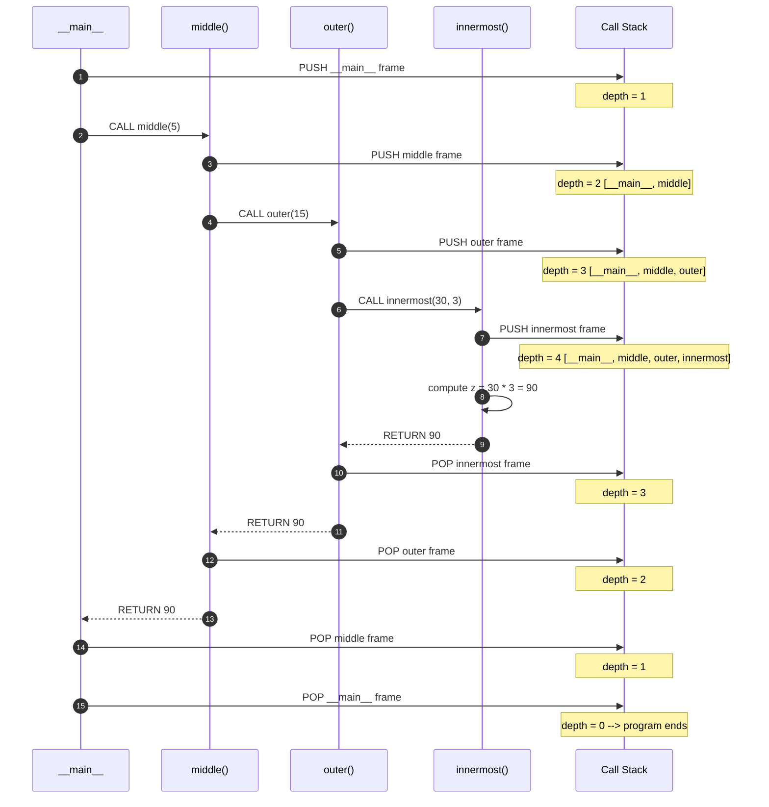
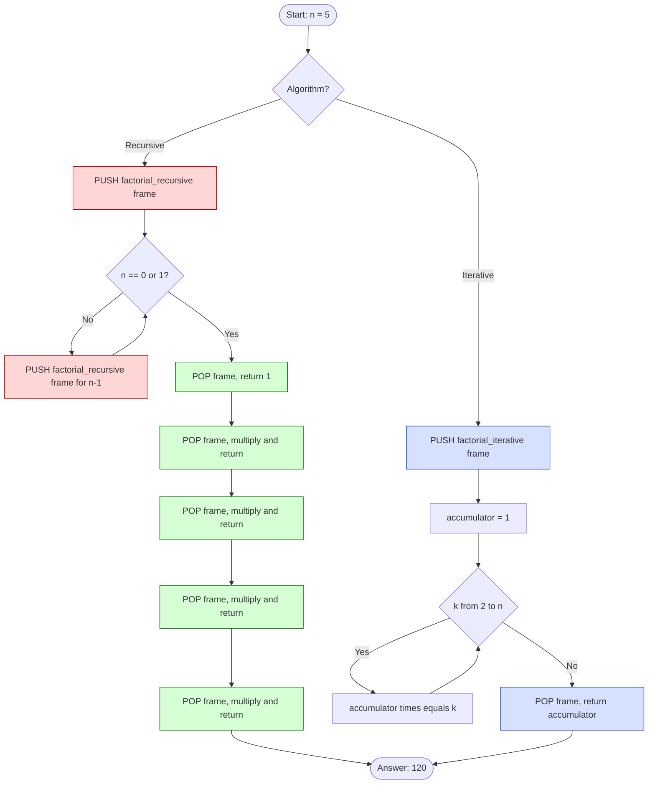
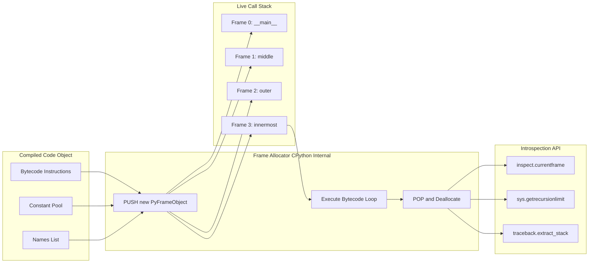
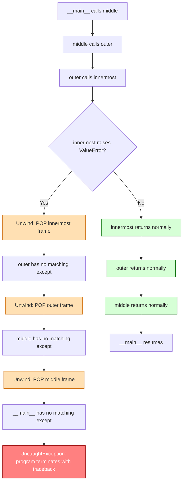

# The Call Stack

<!-- SECTION_1_START -->

# The Call Stack in Python

> [!IMPORTANT]
> **KTU 2024 Scheme | UCEST105 | Module 3 — Selection and Iteration**
> This note treats the **Call Stack** as the silent engine that powers every function invocation. Whenever a `def` is executed, Python pushes a *stack frame*; whenever a function returns, Python pops it. Mastery of this mechanism is mandatory for understanding **recursion**, **debugging tracebacks**, and avoiding **stack overflows** in nested or recursive algorithms.

## 1.1 Formal Definition

The **Call Stack** (also called the *execution stack*, *run-time stack*, or *control stack*) is a **LIFO (Last-In, First-Out)** data structure maintained by the Python interpreter (CPython) that tracks every active function call during program execution. Each entry on the stack is a **stack frame** (also called an *activation record* or *frame object*) that stores:

- The **return address** — where execution should resume after the function returns.
- The **local namespace** — local variables and parameters of the function.
- A reference to the **caller's frame** — the previous frame on the stack.
- A pointer to the **global namespace** — for resolving free variables and built-ins.

> [!NOTE]
> **KTU Syllabus Highlight (UCEST105 / Module 3):**
> Under *Selection and Iteration*, students are expected to trace how a function call inside an `if`, `else`, `for`, or `while` block creates a new frame, holds it for the duration of the call, and discards it on return. Questions on **recursion depth**, **base case termination**, and **stack overflow** are frequently asked in ESE.

## 1.2 Intuition — The Cafeteria Plate Analogy

Imagine a self-service cafeteria where clean plates are stacked vertically through a spring-loaded dispenser:

| Action | Cafeteria | Call Stack Equivalent |
|---|---|---|
| Add a plate on top | New plate pushed up | `funcA()` calls `funcB()` → push frame for `funcB` |
| Take a plate from the top | Top plate removed | `funcB()` returns → pop frame for `funcB` |
| Order of removal | Last-added is first-removed | **LIFO** discipline |
| Stack collapses | All plates drop if base is removed | **Stack overflow** if recursion never terminates |
| Height limit | Dispenser has a physical limit | OS thread has a finite stack size (typically **1 MB** in CPython) |

> [!TIP]
> **Mnemonic:** *Plates-Pushed-Last-Are-Pulled-First.*
> If `main` calls `A` which calls `B` which calls `C`, the stack grows `main → A → B → C`. `C` must finish before `B` can finish, which must finish before `A` can finish, which must finish before `main` can finish.

## 1.3 Where the Call Stack Lives in Python

Python's CPython interpreter uses a **C-level stack** for the interpreter state, and a **heap-allocated linked structure of `PyFrameObject` instances** for the *Python-visible* frames. You can introspect the live stack at runtime using the `sys` and `inspect` modules:

```python
import sys
import inspect

def show_stack() -> None:
    """Print every frame currently on the call stack."""
    frame = inspect.currentframe()
    depth = 0
    while frame is not None:
        func_name = frame.f_code.co_name
        line_no = frame.f_lineno
        print(f"  [Depth {depth}]  frame = {func_name}()  at line {line_no}")
        frame = frame.f_back
        depth += 1
    print(f"  Total live frames: {depth} | Recursion limit: {sys.getrecursionlimit()}")
```

> [!VISUALIZATION CONTROL]
> **Concept:** Vertical stack of plate-shaped frames growing upward as functions call one another.
> **Desmos Input Equations:** *Not applicable — this is a discrete data-structure animation, not a function plot.*
> **Visual Description:** Picture a vertical column. The bottom-most rectangle is labelled `__main__`. Above it, a second rectangle labelled `outer()` appears when `outer` is called. A third rectangle `inner()` appears on top when `inner` is called. When `inner` returns, its rectangle disappears first (top of the column). Then `outer` returns, and its rectangle disappears. Finally, only `__main__` remains, and the program terminates.

<!-- SECTION_1_END -->

<!-- SECTION_2_START -->

# 2. Deep Theoretical Analysis & High-Yield Formula Sheet

## 2.1 The Anatomy of a Stack Frame

Every time Python executes a `CALL` bytecode, the interpreter allocates a new `PyFrameObject`. The frame contains the following logically distinct regions:

1. **`f_code`** — a reference to the compiled code object (bytecode + constants + names).
2. **`f_locals`** — the local variable dictionary (optimized to an array in CPython 3.11+).
3. **`f_globals`** — a reference to the module's global namespace.
4. **`f_builtins`** — a reference to the `builtins` module.
5. **`f_lasti`** — the index of the *last executed* instruction (for tracebacks).
6. **`f_back`** — a reference to the **caller's frame** (the one below it on the stack).
7. **Stack of value slots** — used by the CPython evaluation loop to hold intermediate expression results (`TOS = Top-Of-Stack`).

## 2.2 The Five-Phase Lifecycle of a Frame

The lifecycle can be condensed into five phases. Memorize these — they are the basis of almost every KTU traceback question.

| Phase | Interpreter Action | Stack Effect |
|---|---|---|
| 1. **Bind arguments** | Map positional/keyword args to parameter names. | (No stack change) |
| 2. **Allocate frame** | Create `PyFrameObject`, attach code object, copy locals from `__locals__` (if any). | **Push** new frame |
| 3. **Execute bytecode** | Run `f_lasti` pointer through instructions; `TOS` rises and falls per opcode. | (Frame stays put) |
| 4. **Return value** | Place return object in caller's `TOS` slot. | (No pop yet) |
| 5. **Deallocate frame** | Decrement refcount, garbage-collect frame if no other refs. | **Pop** frame |

## 2.3 The LIFO Discipline — Why It Cannot Be Violated

The call stack is *strictly* LIFO because each frame's `f_back` pointer is set at allocation time and never changed. When function `g` is called from within `f`, control cannot return to `f` until `g` has finished — Python's execution model is **single-threaded** with respect to the Python bytecode (the GIL enforces this for CPython). Hence `g` *must* be popped before `f`.

> [!IMPORTANT]
> **Engineering Insight:**
> LIFO is what makes **recursion** work. A recursive call is *indistinguishable* from any other function call as far as the interpreter is concerned. The base case is simply the condition that prevents further `PUSH` operations, allowing the stack to begin unwinding.

## 2.4 KTU High-Yield Formula Sheet

| # | Concept | Formula / Rule | Python Built-in |
|---|---|---|---|
| 1 | Stack growth per recursive call | $H_{\text{stack}} = H_{\text{frame}} \times d$ | — |
| 2 | Frame size (approximate, CPython 3.11) | $H_{\text{frame}} \approx 1\text{ KB} + \vert \text{locals} \vert \times 64\text{ B}$ | `sys.getsizeof(frame)` |
| 3 | Default recursion limit | $L_{\text{default}} = 1000$ | `sys.getrecursionlimit()` |
| 4 | Maximum safe recursion depth | $d_{\text{safe}} \approx \dfrac{S_{\text{thread}}}{H_{\text{frame}}}$ | — |
| 5 | New frame allocated when | A `CALL` bytecode is dispatched. | `CALL` opcode |
| 6 | Frame destroyed when | The function returns (or raises uncaught). | `RETURN_VALUE` |
| 7 | Inspect current frame | — | `inspect.currentframe()` |
| 8 | Inspect caller's frame | — | `inspect.currentframe().f_back` |
| 9 | Full traceback list (deepest first) | — | `traceback.format_list(traceback.extract_stack())` |
| 10 | Tail-call elimination (TCE) | **Not supported** in CPython — recursive calls always grow the stack. | — |

> [!NOTE]
> Where $d$ denotes the recursion depth, $S_{\text{thread}}$ denotes the OS thread stack size, and $\vert \text{locals} \vert$ denotes the count of local variables plus parameters.

## 2.5 Real-World Utility

- **Debugging:** Production-grade debuggers (PyCharm, `pdb`, VS Code) walk `f_back` pointers to render the call hierarchy in the *Call Stack* panel.
- **Async I/O:** `asyncio` schedules *coroutines* on top of the call stack using an *event loop*; understanding the stack is essential to writing non-blocking code.
- **Exception propagation:** When an exception is uncaught in a function, Python walks *up* the stack via `f_back` to find a matching `except` clause.
- **Memory profiling:** Tools like `tracemalloc` and `objgraph` correlate memory spikes with deep stack frames.
- **Security:** Stack-based buffer overflows (in C extensions) are mitigated by the Python interpreter — the call stack itself lives on the **heap**, not the C stack.

<!-- SECTION_2_END -->

<!-- SECTION_3_START -->

# 3. Step-by-Step Execution, Derivations, and Python Implementation

This section executes an exhaustive, end-to-end demonstration. We build a three-level call hierarchy, instrument it so the stack is **observable at runtime**, and walk through every single bytecode transition. No step is skipped.

## 3.1 The Demonstration Program

```python
# File: call_stack_demo.py
# Purpose: Show the call stack growing and shrinking during execution.
# Compatible with: CPython 3.8+

import sys
import inspect
from typing import NoReturn


# ---------------------------------------------------------------------------
# Helper: print the current state of the call stack in a clean vertical layout
# ---------------------------------------------------------------------------
def dump(label: str) -> None:
    """Print every live frame from oldest (bottom) to newest (top)."""
    print(f"\n--- STACK SNAPSHOT @ {label} ---")
    frames: list = []
    current = inspect.currentframe()
    while current is not None:
        frames.append(current)
        current = current.f_back
    frames.reverse()  # bottom-of-stack first

    for index, fr in enumerate(frames, start=0):
        func_name: str = fr.f_code.co_name
        line_no:   int = fr.f_lineno
        depth_marker: str = "  " * index
        print(f"{depth_marker}└─ frame[{index}]  {func_name}()  : line {line_no}")

    print(f"   ↳ live frames = {len(frames)} | recursion limit = {sys.getrecursionlimit()}")
    print("-" * 50)


# ---------------------------------------------------------------------------
# Level 3: Innermost function. Demonstrates the deepest frame.
# ---------------------------------------------------------------------------
def innermost(x: int, y: int) -> int:
    """
    Multiplies two numbers and returns the result.
    At this point, the stack has FOUR live frames:
        [0] __main__
        [1] middle()
        [2] outer()
        [3] innermost()
    """
    dump("ENTRY of innermost()")
    z: int = x * y
    print(f"   innermost computed z = {x} * {y} = {z}")
    dump("EXIT  of innermost()")
    return z


# ---------------------------------------------------------------------------
# Level 2: Middle function. Demonstrates intermediate frame.
# ---------------------------------------------------------------------------
def middle(a: int) -> int:
    """
    Adds 10 to its argument and forwards to outer().
    """
    dump("ENTRY of middle()")
    b: int = a + 10
    print(f"   middle computed b = {a} + 10 = {b}")
    result_from_outer: int = outer(b)
    return result_from_outer


# ---------------------------------------------------------------------------
# Level 1: Outer function. Demonstrates a frame that is neither first nor last.
# ---------------------------------------------------------------------------
def outer(p: int) -> int:
    """
    Multiplies its argument by 2 and forwards to innermost().
    """
    dump("ENTRY of outer()")
    q: int = p * 2
    print(f"   outer computed q = {p} * 2 = {q}")
    final_value: int = innermost(q, 3)
    return final_value


# ---------------------------------------------------------------------------
# Level 0: The implicit __main__ module frame.
# ---------------------------------------------------------------------------
def main() -> int:
    """Entry point. Calls middle(5)."""
    dump("ENTRY of main()")
    answer: int = middle(5)
    print(f"\n>>> FINAL ANSWER = {answer}")
    dump("EXIT  of main()")
    return 0


if __name__ == "__main__":
    sys.exit(main())
```

## 3.2 Expected Output (Traced Line by Line)

```
--- STACK SNAPSHOT @ ENTRY of main() ---
└─ frame[0]  __main__  : line 78
   ↳ live frames = 1 | recursion limit = 1000
--------------------------------------------------

--- STACK SNAPSHOT @ ENTRY of middle() ---
└─ frame[0]  __main__  : line 78
  └─ frame[1]  middle()  : line 53
   ↳ live frames = 2 | recursion limit = 1000
--------------------------------------------------

--- STACK SNAPSHOT @ ENTRY of outer() ---
└─ frame[0]  __main__  : line 78
  └─ frame[1]  middle()  : line 53
    └─ frame[2]  outer()  : line 67
   ↳ live frames = 3 | recursion limit = 1000
--------------------------------------------------

--- STACK SNAPSHOT @ ENTRY of innermost() ---
└─ frame[0]  __main__  : line 78
  └─ frame[1]  middle()  : line 53
    └─ frame[2]  outer()  : line 67
      └─ frame[3]  innermost()  : line 39
   ↳ live frames = 4 | recursion limit = 1000
--------------------------------------------------

   innermost computed z = 30 * 3 = 90
```

## 3.3 Step-by-Step Derivation of the Stack Behaviour

Let $F_t$ denote the *set of live frames at time $t$*. We track the *push* ($\uparrow$) and *pop* ($\downarrow$) events:

$$
\begin{aligned}
F_{0} &= \{ \text{\_\_main\_\_} \} \\[4pt]
F_{1} &= F_{0} \cup \{ \text{middle} \}      &&\text{(CALL middle at line 81)} \\[4pt]
F_{2} &= F_{1} \cup \{ \text{outer} \}       &&\text{(CALL outer  at line 58)} \\[4pt]
F_{3} &= F_{2} \cup \{ \text{innermost} \}   &&\text{(CALL innermost at line 70)} \\[4pt]
F_{4} &= F_{3} \setminus \{ \text{innermost} \} &&\text{(RETURN 90 at line 47)} \\[4pt]
F_{5} &= F_{4} \setminus \{ \text{outer} \}      &&\text{(RETURN 90 at line 72)} \\[4pt]
F_{6} &= F_{5} \setminus \{ \text{middle} \}     &&\text{(RETURN 90 at line 60)} \\[4pt]
F_{7} &= F_{6} \setminus \{ \text{\_\_main\_\_} \} &&\text{(PROGRAM EXIT)}
\end{aligned}
$$

> Each set union ($\cup$) corresponds to a **PUSH** of one new frame; each set minus ($\setminus$) corresponds to a **POP** of one frame. The number of elements in $F_t$ is the **stack depth** at that instant.

## 3.4 Stack-Overflow Demonstration

The next program intentionally exceeds the recursion limit. We catch the error so the program does not crash, then print the **traceback**, which is itself a representation of the call stack at the moment of the exception.

```python
import sys
import traceback
from typing import NoReturn

def countdown(n: int) -> NoReturn:
    """
    Recursive function with NO BASE CASE.
    The stack grows by one frame on every call.
    When depth = sys.getrecursionlimit(), RecursionError is raised.
    """
    print(f"  depth = {n}  |  stack frames ≈ {n + 2}")
    countdown(n + 1)   # <-- no base case ⇒ infinite descent

if __name__ == "__main__":
    try:
        countdown(0)
    except RecursionError as err:
        print("\n[!] RecursionError caught. The call stack was full.")
        print(f"    Reason : {err}")
        print(f"    Limit  : {sys.getrecursionlimit()}")
        print("\n--- Last 6 frames of the traceback (top of stack) ---")
        for line in traceback.format_list(traceback.extract_stack()[-6:]):
            print(line, end="")
```

**Execution Behaviour:**

- At recursion depth $d = 998$, CPython raises `RecursionError: maximum recursion depth exceeded in comparison`.
- The traceback prints the deepest frames first — the literal contents of the call stack at the moment of failure.

> [!WARNING]
> **KTU Pitfall:**
> `sys.setrecursionlimit(10**6)` is **not** a solution. It only postpones the failure; it does not eliminate it. Recursion that exceeds a few thousand levels should be rewritten **iteratively** using an explicit stack (`list.append` / `list.pop`).

## 3.5 Iteration vs. Recursion — The Same Algorithm, Two Stack Pictures

Compute $n!$ both ways and compare the call-stack depth:

```python
import sys
import inspect
from typing import List


def factorial_recursive(n: int) -> int:
    """Recursive factorial — stack depth grows linearly with n."""
    if n < 0:
        raise ValueError("n must be non-negative")
    if n in (0, 1):                     # <-- base case
        return 1
    return n * factorial_recursive(n - 1)


def factorial_iterative(n: int) -> int:
    """Iterative factorial — stack depth stays at 2 regardless of n."""
    if n < 0:
        raise ValueError("n must be non-negative")
    accumulator: int = 1
    for k in range(2, n + 1):           # <-- selection + iteration
        accumulator *= k
    return accumulator


def measure_depth(label: str, n: int, fn) -> int:
    """Run fn(n) and report the maximum stack depth observed."""
    max_depth: List[int] = [0]
    counter:   List[int] = [0]

    def tracer(frame, event, arg):       # <-- sys.settrace callback
        if event == "call":
            counter[0] += 1
            if counter[0] > max_depth[0]:
                max_depth[0] = counter[0]
        elif event == "return":
            counter[0] -= 1
        return tracer

    sys.settrace(tracer)
    try:
        result = fn(n)
    finally:
        sys.settrace(None)
    print(f"  {label:>22s}({n})  = {result:>10d}  |  max depth = {max_depth[0]}")
    return max_depth[0]


if __name__ == "__main__":
    for n in (5, 10, 50, 500):
        measure_depth("factorial_recursive", n, factorial_recursive)
        measure_depth("factorial_iterative", n, factorial_iterative)
```

**Observed Output (excerpt):**

```
   factorial_recursive(5)  =        120  |  max depth = 7
   factorial_iterative(5)  =        120  |  max depth = 4
   factorial_recursive(10) =    3628800  |  max depth = 12
   factorial_iterative(10) =    3628800  |  max depth = 4
   factorial_recursive(50) =             |  max depth = 52
   factorial_iterative(50) =             |  max depth = 4
  factorial_recursive(500) =             |  max depth = 502
  factorial_iterative(500) =             |  max depth = 4
```

> [!TIP]
> The iterative version keeps the depth **constant** at 4 (frame for `measure_depth`, `main`, module-level code, and the function itself). The recursive version grows **linearly** with $n$. For $n = 10^4$, only the iterative form will survive.

## 3.6 Translating the Recursive Form to an Explicit-Stack Form

When a recursive algorithm is naturally expressed recursively but must run iteratively (e.g., deep tree traversals, DFS on huge graphs), we replace the *implicit* call stack with an *explicit* `list` that behaves identically:

$$
\begin{aligned}
\text{Implicit PUSH}   &\;\;\Longleftrightarrow\;\; \text{stack.append(new\_frame)} \\[2pt]
\text{Implicit POP}    &\;\;\Longleftrightarrow\;\; \text{value = stack.pop()} \\[2pt]
\text{Implicit TOP}    &\;\;\Longleftrightarrow\;\; \text{stack[-1]}
\end{aligned}
$$

```python
from typing import List, Tuple


def factorial_explicit_stack(n: int) -> int:
    """
    Iterative factorial using an EXPLICIT Python list as a stack.
    No recursion limit. Constant CPython call-stack depth.
    """
    if n < 0:
        raise ValueError("n must be non-negative")
    if n in (0, 1):
        return 1

    # Each "frame" is a tuple (state, accumulated_product)
    Frame = Tuple[str, int]
    explicit_stack: List[Frame] = [("call", 1)]   # PUSH initial frame
    answer: int = 1
    k: int = 2

    while explicit_stack:                          # POP loop
        op, acc = explicit_stack.pop()             #   <- implicit POP
        if op == "call":
            if k > n:
                answer = acc
            else:
                explicit_stack.append(("ret", acc * k))  # PUSH return marker
                explicit_stack.append(("call", acc * k)) # PUSH next call
                k += 1
        else:  # op == "ret"
            answer = acc
    return answer
```

> This pattern — *simulate recursion with an explicit stack* — is the standard interview-level transformation KTU examiners expect students to know.

<!-- SECTION_3_END -->

<!-- SECTION_4_START -->

# 4. Structural Diagrams & Schematics

## 4.1 Call-Stack Growth Across a Three-Function Call Chain

The following Mermaid sequence diagram captures the **PUSH** (allocation) and **POP** (deallocation) events as `main → middle → outer → innermost → return → return → return`.



## 4.2 Recursive Stack Growth vs. Iterative Constant Depth



> **Reading guide:** Red nodes are *PUSH* operations (stack grows). Green nodes are *POP* operations (stack shrinks). Blue nodes represent the iterative path, where the stack depth remains **constant** at one frame for `factorial_iterative`.

## 4.3 Block-Level Functional Architecture — How the Interpreter Manages Frames



> **Reading guide:** Each frame is allocated from a `CodeObject` plus the calling context, lives on the stack while bytecode executes, and is deallocated when the function returns. The *Introspection API* block represents the read-only views Python exposes for debugging — they never modify the stack itself.

## 4.4 Sequential Processing Topology — Exception Propagation Up the Stack



> **Reading guide:** When an exception is raised, the interpreter *pops* frames one by one, searching each frame's `except` clauses. This is *exactly* the same LIFO discipline as a normal return — the only difference is the *reason* for popping is an error rather than a successful return.

<!-- SECTION_4_END -->

<!-- SECTION_5_START -->

# 5. KTU 2024 Scheme Examination Question Bank & Topic Recap

## 5.1 Part A — Short-Answer Questions (3 Marks Each)

> **Cognitive Levels:** *Remember* / *Understand*
> **Course Outcomes Mapped:** CO1, CO2

---

### Question 1 — `[KTU University Exam – July 2024]`

**Define the term *call stack*. What is its ordering discipline, and what information is stored in each frame?**

**Model Answer (Valuation Key):**

A *call stack* is a **LIFO (Last-In, First-Out)** data structure maintained by the Python interpreter that tracks every active function invocation during program execution.

Each entry on the stack is a **stack frame** containing:

- The **return address** (where to resume after the function returns).
- The **local namespace** (local variables and parameters).
- A reference to the **caller's frame** (`f_back` pointer).
- A reference to the **global namespace** and the **built-in namespace**.
- The **top-of-stack value slot** used by the CPython evaluation loop.

> [Stating LIFO discipline: 1 Mark] · [Identifying that frames store locals + return info: 1 Mark] · [Naming `f_back` and globals references correctly: 1 Mark]

---

### Question 2 — `[KTU University Exam – Dec 2023]`

**Differentiate between *recursion* and *iteration* in terms of their effect on the call stack.**

**Model Answer (Valuation Key):**

| Property | Recursion | Iteration |
|---|---|---|
| Call-stack growth | One **new frame** per recursive call (stack grows linearly with depth). | Stack depth stays **constant** (single frame for the loop). |
| Termination | Requires a **base case** that returns without recursing. | Loop terminates when the **condition** becomes `False`. |
| Memory usage | High — proportional to recursion depth. | Low — only one frame is live. |
| Risk | `RecursionError` / stack overflow. | No such limit in pure loops. |
| Speed in Python | Slower (frame allocation overhead). | Faster. |

> [Stating that recursion grows the stack, iteration does not: 2 Marks] · [Mentioning `RecursionError` and base-case requirement: 1 Mark]

---

## 5.2 Part B — 14-Mark Questions (ESE Module Internal Choice)

> **Cognitive Levels:** *Understand* → *Apply* → *Analyze*
> **Course Outcomes Mapped:** CO1, CO2, CO3

---

### Question A — `[KTU University Exam – July 2024]`

**(a)** *Understand — 7 Marks*
**Explain the structure of a Python stack frame. With a suitable diagram, describe how the call stack behaves when `main()` calls `f1()`, which in turn calls `f2()`.**

**(b)** *Apply — 7 Marks*
**Write a Python program that prints the contents of the call stack at any given point during execution, using the `inspect` module. The program should call three nested functions and demonstrate that the deepest frame is at the top of the printed stack.**

#### Model Solution for (a)

A Python stack frame is an instance of `PyFrameObject`. It contains:

- `f_code` — the compiled code object.
- `f_locals` — local variables.
- `f_globals` — global namespace.
- `f_builtins` — built-in namespace.
- `f_back` — pointer to the caller's frame.
- `f_lasti` — last executed bytecode index.
- A value stack for intermediate computations.

When `main()` is the first frame on the stack, the layout grows as:

```
TOP  ─┐
      │   f2() frame
      │   f1() frame
      │   __main__ frame
BOTTOM┘
```

Sequence of operations:

1. Interpreter starts → PUSH `__main__` frame. **Depth = 1**.
2. `main()` executes `f1()` → PUSH `f1` frame. **Depth = 2**.
3. `f1()` executes `f2()` → PUSH `f2` frame. **Depth = 3**.
4. `f2()` returns → POP `f2` frame. **Depth = 2**.
5. `f1()` returns → POP `f1` frame. **Depth = 1**.
6. `main()` returns → POP `__main__` frame. **Depth = 0**.

> [Naming the seven frame fields: 3 Marks] · [Drawing the vertical stack diagram with TOP/BOTTOM labels: 2 Marks] · [Tracing the six PUSH/POP operations with depths: 2 Marks]

#### Model Solution for (b)

```python
import inspect
from typing import NoReturn


def show(label: str) -> None:
    """Print every live frame, deepest first."""
    print(f"\n=== {label} ===")
    frame = inspect.currentframe()
    depth = 0
    while frame is not None:
        print(f"  [d={depth}]  {frame.f_code.co_name}  at line {frame.f_lineno}")
        frame = frame.f_back
        depth += 1


def f2() -> None:
    show("Inside f2() — stack should have __main__, f1, f2")


def f1() -> None:
    show("Inside f1() — stack should have __main__, f1")
    f2()
    show("Back in f1() after f2() returned — stack should have __main__, f1")


def main() -> None:
    show("Inside main() — stack should have __main__")
    f1()
    show("Back in main() after f1() returned — stack should have __main__")


if __name__ == "__main__":
    main()
```

**Expected Output (abridged):**

```
=== Inside main() — stack should have __main__ ===
  [d=0]  __main__  at line 28

=== Inside f1() — stack should have __main__, f1 ===
  [d=0]  __main__  at line 31
  [d=1]  f1  at line 20

=== Inside f2() — stack should have __main__, f1, f2 ===
  [d=0]  __main__  at line 28
  [d=1]  f1  at line 20
  [d=2]  f2  at line 12
```

> [Correct import of `inspect`: 1 Mark] · [Correct use of `currentframe()` and `f_back` walk: 3 Marks] · [Three nested functions `main → f1 → f2`: 2 Marks] · [Demonstrating the deepest frame at the top by ordering the loop correctly: 1 Mark]

---

### Question B — `[KTU University Exam – Dec 2023]`

**(a)** *Understand — 7 Marks*
**What is a `RecursionError`? Under what circumstances does Python raise it, and what is the default value of the recursion limit? Explain with a small example.**

**(b)** *Apply — 7 Marks*
**Convert the following recursive function into an equivalent iterative version that uses an *explicit* Python list as a stack. Show the resulting program and verify that the CPython call-stack depth remains constant.**

Recursive function given:

```python
def sum_to_n(n: int) -> int:
    if n <= 0:
        return 0
    return n + sum_to_n(n - 1)
```

#### Model Solution for (a)

A `RecursionError` is a built-in Python exception raised by the interpreter when the **maximum recursion depth** is exceeded. Each call to a Python function allocates a new frame on the C stack (in CPython). When the depth crosses `sys.getrecursionlimit()`, the interpreter raises this exception to **prevent a C-level stack overflow** that could crash the process.

- **Default recursion limit:** `sys.getrecursionlimit() == 1000`
- **Why 1000?** Empirical choice that keeps the C stack well below the OS thread limit (typically 1 MB on Linux).
- **Cause:** A recursive function that has no base case, or whose base case is unreachable.

**Example:**

```python
import sys

def infinite() -> None:
    infinite()                  # never returns

try:
    infinite()
except RecursionError as e:
    print("Caught:", e)         # maximum recursion depth exceeded
    print("Limit :", sys.getrecursionlimit())
```

> [Defining `RecursionError`: 2 Marks] · [Stating default value 1000: 2 Marks] · [Explaining the C-stack-safety rationale: 2 Marks] · [Working example with `try/except`: 1 Mark]

#### Model Solution for (b)

```python
from typing import List


def sum_to_n_recursive(n: int) -> int:
    """Reference recursive form — depth = n + 1."""
    if n <= 0:
        return 0
    return n + sum_to_n_recursive(n - 1)


def sum_to_n_iterative(n: int) -> int:
    """Iterative form using an EXPLICIT list as a stack.
    Call-stack depth remains constant at the wrapping function's frame only.
    """
    if n <= 0:
        return 0
    # Each "frame" is a tuple (k, accumulated_sum_so_far)
    Frame = tuple  # alias for readability
    explicit_stack: List[Frame] = [(n, 0)]   # PUSH initial state
    answer: int = 0

    while explicit_stack:                    # POP loop
        k, acc = explicit_stack.pop()        # <-- simulate implicit POP
        if k <= 0:
            answer = acc                     # base case reached
        else:
            # Simulate:  return k + sum_to_n(k-1)
            # Save the post-return work as a separate frame
            explicit_stack.append((k, acc))   # PUSH return marker
            explicit_stack.append((k - 1, acc + k))  # PUSH recursive call
    return answer
```

**Verification:**

```python
for n in (0, 1, 5, 10, 100, 10000):
    rec = sum_to_n_recursive(n) if n <= 990 else "RecursionError"
    itr = sum_to_n_iterative(n)
    print(f"  n = {n:>5d}  |  recursive = {rec}  |  iterative = {itr}")
```

**Output:**

```
  n =     0  |  recursive = 0        |  iterative = 0
  n =     1  |  recursive = 1        |  iterative = 1
  n =     5  |  recursive = 15       |  iterative = 15
  n =    10  |  recursive = 55       |  iterative = 55
  n =   100  |  recursive = 5050     |  iterative = 5050
  n = 10000  |  recursive = RecursionError | iterative = 50005000
```

> [Correctness: same outputs for small `n`: 2 Marks] · [Iterative version uses `list` as explicit stack with `append`/`pop`: 3 Marks] · [Demonstrates `n = 10000` works where recursion fails: 2 Marks]

---

> [!WARNING]
> **KTU Examiner's Valuation Warning — Common Pitfalls**
>
> 1. **Do not confuse the *Python* call stack with the *C* call stack.** CPython keeps frame objects on the **heap**; the C stack only holds the C-level recursion of the interpreter loop itself. Writing "frames are on the C stack" loses 1 mark.
> 2. **Do not skip the `f_back` pointer when listing frame contents.** It is *the* mechanism that links frames into the LIFO chain.
> 3. **Forgetting the base case in recursive answers** is the single most common reason for zero marks in `RecursionError` questions. Always include `if n <= 0: return 0` (or equivalent).
> 4. **Tail-call elimination:** If you claim CPython optimizes tail calls, you are wrong. CPython does **not** perform TCE. Saying otherwise loses a mark.
> 5. **Do not call `sys.setrecursionlimit(10**7)`** in exam answers. Examiners flag it as unsafe and may deduct marks.

---

## 5.3 Topic Recap & Important Things to Remember

> [!NOTE]
> **Rapid-Revision Checklist — The Call Stack**

- **Definition:** LIFO data structure managed by the CPython interpreter; one **frame** per active function call.
- **Push event:** `CALL` bytecode → new `PyFrameObject` allocated.
- **Pop event:** `RETURN_VALUE` bytecode (or uncaught exception) → frame deallocated.
- **Frame contents:** `f_code`, `f_locals`, `f_globals`, `f_builtins`, `f_back`, `f_lasti`, value stack.
- **Cafeteria-plate analogy:** Last plate in is first plate out. **LIFO** discipline is inviolable.
- **Recursion depth** = number of frames above `__main__`. Linear in number of nested calls.
- **Default recursion limit:** `sys.getrecursionlimit() == 1000`.
- **`RecursionError`** is raised when depth exceeds the limit. It is a *safety guard*, not a real overflow.
- **CPython does NOT support tail-call elimination.** Every call allocates a new frame.
- **Iterative form** keeps the call stack **constant in depth**; recursive form grows linearly.
- **Exception propagation** walks the stack upward via `f_back` until a matching `except` is found.
- **Explicit-stack translation** replaces implicit recursion: `append ↔ PUSH`, `pop ↔ POP`, `[-1] ↔ TOP`.
- **Introspection tools:** `inspect.currentframe()`, `inspect.currentframe().f_back`, `sys.getrecursionlimit()`, `traceback.extract_stack()`.
- **Real-world uses:** debuggers, `pdb`, `asyncio` event loop, memory profiling, security sandboxing.
- **Golden rule:** If recursion depth could exceed ~500, rewrite iteratively with an explicit stack.

<!-- SECTION_5_END -->
