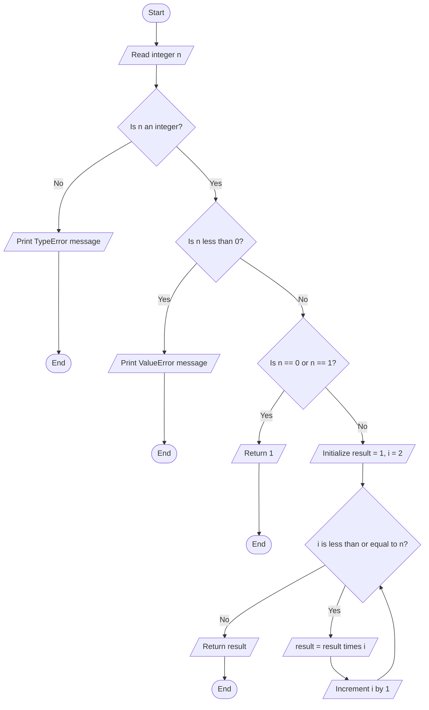
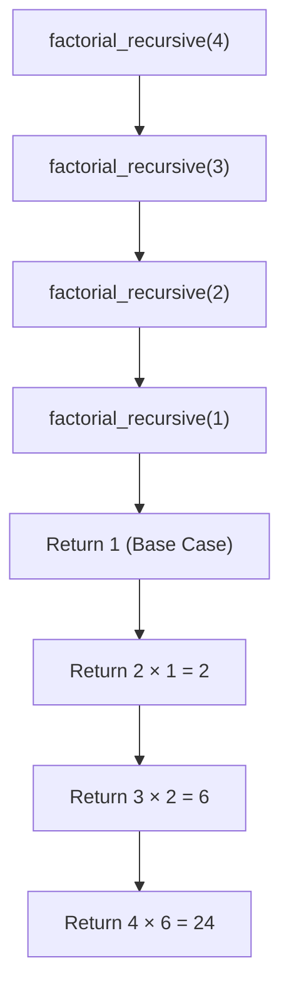
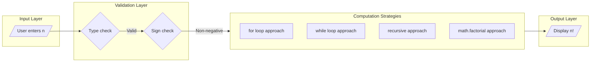
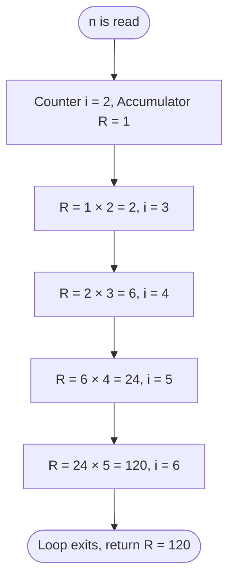

# the factorial of a positive integer

<!-- SECTION_1_START -->

# Factorial of a Positive Integer — Core Definition & Intuitive Overview

## 📌 Formal Academic Definition

In discrete mathematics and algorithmic computing, the **factorial** of a non-negative integer $n$, denoted by the symbol $n!$, is the product of all positive integers from $1$ up to $n$ inclusively. It is one of the most fundamental recursive/iterative constructs in combinatorics and algorithm design.

The mathematical definition is:

$$
n! = \begin{cases} 1 & \text{if } n = 0 \text{ (Base Case)} \\ 1 \times 2 \times 3 \times \dots \times n & \text{if } n \ge 1 \end{cases}
$$

Equivalently, using the recursive formulation:

$$
n! = n \times (n-1)!, \quad \text{where } 0! = 1
$$

The domain of the factorial function over the integers is restricted to $n \in \mathbb{Z}_{\ge 0}$. For negative integers, the factorial is **undefined** in the real number system, and any algorithm accepting factorial input must explicitly reject negative values.

> [!NOTE]
> **KTU 2024 Syllabus Highlight (UCEST105 — Module 3)**
> Factorial computation is a *mandatory illustrative program* used to demonstrate the practical integration of **selection statements** (`if`, `elif`, `else`) and **iteration statements** (`for`, `while`). The KTU board examiner frequently uses it as the base problem to evaluate whether a student can correctly terminate loops using boundary conditions and whether they understand why the base case for $0!$ is defined as $1$.

## 🧠 Conceptual Analogy / Plain English Intuition

Imagine a classroom of $n$ students standing in a single line. The teacher wants to know: *"In how many different ways can these $n$ students be arranged in the line?"*

The first position in the line can be filled by **any** of the $n$ students. The second position can be filled by any of the remaining $n-1$ students. The third position by any of the remaining $n-2$ students — and so on, until only $1$ student remains for the last position. The total number of arrangements is:

$$
n \times (n-1) \times (n-2) \times \dots \times 2 \times 1 = n!
$$

**Another intuitive analogy:** The factorial represents a "counting staircase" of products. Starting from $1$, every step multiplies the running total by the next integer, building a number that grows *super-exponentially*. By the time you reach $20!$, the result exceeds $2.4 \times 10^{18}$, which is why most programming languages cap factorial at around $20!$ when using standard $64$-bit integers.

> [!IMPORTANT]
> **Key Convention That Examiners Love to Test:**
> The value of $0!$ is **defined** as $1$ (not $0$). This is not arbitrary — it is mathematically necessary so that the recursive relation $n! = n \times (n-1)!$ holds true when $n = 1$. Without this definition, the entire combinatorial framework (permutations, combinations, binomial coefficients) would collapse. KTU examiners often include a 2-mark question specifically asking *"Why is $0! = 1$?"*.

## 📊 Quick Reference Table — First Few Factorials

| $n$ | $n!$ | Decimal Expansion | Order of Magnitude |
|:---:|:----:|:-----------------:|:------------------:|
| 0 | $0!$ | $1$ | $10^0$ |
| 1 | $1!$ | $1$ | $10^0$ |
| 2 | $2!$ | $2$ | $10^0$ |
| 3 | $3!$ | $6$ | $10^0$ |
| 4 | $4!$ | $24$ | $10^1$ |
| 5 | $5!$ | $120$ | $10^2$ |
| 6 | $6!$ | $720$ | $10^2$ |
| 7 | $7!$ | $5040$ | $10^3$ |
| 8 | $8!$ | $40320$ | $10^4$ |
| 9 | $9!$ | $362880$ | $10^5$ |
| 10 | $10!$ | $3628800$ | $10^6$ |
| 13 | $13!$ | $6227020800$ | $10^9$ (≈ 1 second in nanoseconds) |
| 20 | $20!$ | $2432902008176640000$ | $10^{18}$ (close to $64$-bit limit) |

> [!VISUALIZATION CONTROL]
> **Concept:** Exponential growth of $n!$ compared to $2^n$ and $n^n$
> **GeoGebra / Desmos Input Equations:**
> * `f(x) = \Gamma(x + 1)` *(for real-valued extension; for discrete points use the table above)*
> * Plot the points $\{(0,1), (1,1), (2,2), (3,6), (4,24), (5,120)\}$
> **Visual Description:** Students should observe that the curve of $n!$ rises *far more steeply* than the curve of $2^n$ or even $n^2$, illustrating why factorial algorithms must guard against overflow and why most loop-based implementations are restricted to small $n$.

<!-- SECTION_1_END -->

<!-- SECTION_2_START -->

# Deep Theoretical Analysis & KTU High-Yield Formula Sheet

## 🔬 Theoretical Breakdown — Three Algorithmic Approaches

The factorial of a positive integer can be computed using three distinct algorithmic paradigms, each of which exercises a different control-flow concept from Module 3 of the UCEST105 syllabus.

### Approach 1: Iterative (Loop-Based) Computation

This is the **most frequently asked** approach in KTU board exams. It uses a single accumulator variable and a `for` or `while` loop that multiplies in each integer from $1$ through $n$.

**Operational Logic Steps:**

1. **Initialize** the result variable $R$ to $1$ (the multiplicative identity).
2. **Validate** the input: if $n < 0$, raise an error or return a sentinel value; if $n == 0$ or $n == 1$, immediately return $1$ (this is the *short-circuit* base case).
3. **Iterate** a counter variable $i$ from $2$ to $n$ (inclusive). In every iteration, update $R \leftarrow R \times i$.
4. **Terminate** the loop when $i$ exceeds $n$ and return the final value of $R$.

The running state of the accumulator after each iteration can be expressed as:

$$
R_i = \prod_{k=2}^{i} k = \frac{i!}{1} = i! \quad \text{for } i \ge 1, \quad R_1 = 1
$$

The loop invariant (the condition that remains true after every iteration) is:

$$
R_i = i! \quad \text{where } i \text{ is the current loop counter value}
$$

### Approach 2: Recursive Computation

The recursive definition $n! = n \times (n-1)!$ with the base case $0! = 1$ maps directly to a function that calls itself with progressively smaller arguments until the base case is reached. Although recursion is covered in detail in a later module, the factorial is the *canonical* teaching example and is often touched upon even in Module 3.

**Operational Logic Steps:**

1. **Define the base case:** If $n == 0$ (or $n == 1$), return $1$.
2. **Define the recursive case:** Return $n \times \text{factorial}(n-1)$.
3. The Python call stack stores each pending multiplication, and the multiplications occur as the stack unwinds.

### Approach 3: Using the `math` Library

Python's standard library provides `math.factorial(n)`, which uses a highly optimized C implementation that handles large integers natively (Python integers have arbitrary precision) and is the recommended approach in production code.

> [!IMPORTANT]
> **Why $0! = 1$ — The Mathematical Justification**
> The KTU examiner often awards 2 marks just for explaining this. There are three converging reasons:
> 1. **Recursive consistency:** $1! = 1 \times 0!$. Since $1! = 1$, it must be that $0! = 1$.
> 2. **Combinatorial interpretation:** There is exactly $1$ way to arrange $0$ objects (the empty arrangement).
> 3. **Binomial coefficient definition:** $\binom{n}{0} = \frac{n!}{0! \, n!} = 1$, which only holds if $0! = 1$.

## 📋 KTU Formula Sheet / Cheat Sheet

| Concept | Formula / Expression | Python Construct | Complexity | Overflow Limit (64-bit) |
|:---|:---|:---|:---:|:---:|
| Factorial definition (general) | $n! = \prod_{k=1}^{n} k$ | Loop accumulator | $\mathcal{O}(n)$ time, $\mathcal{O}(1)$ space | $n \le 20$ |
| Base case | $0! = 1$ | `if n == 0: return 1` | — | — |
| Recurrence relation | $n! = n \cdot (n-1)!$ | `return n * fact(n-1)` | $\mathcal{O}(n)$ time, $\mathcal{O}(n)$ stack | $n \le 20$ |
| Stirlings approximation (asymptotic) | $n! \approx \sqrt{2\pi n} \left(\frac{n}{e}\right)^n$ | `math.gamma(n+1)` or `math.sqrt(2*math.pi*n)*(n/math.e)**n` | $\mathcal{O}(1)$ time | Large $n$ |
| Permutations (related) | $P(n,r) = \frac{n!}{(n-r)!}$ | `math.perm(n, r)` | $\mathcal{O}(n)$ | $n - r \le 20$ |
| Combinations (related) | $C(n,r) = \frac{n!}{r!\,(n-r)!}$ | `math.comb(n, r)` | $\mathcal{O}(n)$ | $n \le 67$ |
| Input validity constraint | $n \in \mathbb{Z}_{\ge 0}$ | `assert n >= 0` | — | — |

## 🏭 Real-World Utility in Engineering and Computer Science

The factorial function is not merely an academic exercise — it is a load-bearing primitive across many engineering domains:

- **Combinatorial Algorithms:** Computing permutations of a sequence, generating all subsets of a set, and solving assignment problems (e.g., the Travelling Salesman Problem) all rely on factorial-based counting.
- **Probability and Statistics:** The Poisson distribution $P(X=k) = \frac{\lambda^k e^{-\lambda}}{k!}$ and the Binomial distribution $P(X=k) = \binom{n}{k} p^k (1-p)^{n-k}$ both contain factorials in their normalization constants.
- **Taylor Series Expansions:** Every transcendental function's polynomial approximation contains factorial denominators — for example, $e^x = \sum_{k=0}^{\infty} \frac{x^k}{k!}$.
- **Compiler Design and Parsing:** Grammar parsing algorithms count possible parse trees using factorial-based expressions.
- **Cryptography:** Factorials underpin the counting principles behind permutation ciphers and the key-space analysis of brute-force attacks.
- **Computer Graphics:** Computing $n!$ (or its log) appears in the normalization of Bessel functions and spherical harmonics used in 3D rendering.

> [!TIP]
> **Production Tip:** In real-world Python code, never write a custom factorial loop when `math.factorial(n)` is available. The library version is implemented in C, handles Python's arbitrary-precision integers natively, and is rigorously tested. Custom loops are only written for **educational and examination purposes** where the goal is to demonstrate control-flow mastery.

<!-- SECTION_2_END -->

<!-- SECTION_3_START -->

# Step-by-Step Derivations & Code/Symbolic Implementation

## 🧮 Mathematical Derivation — Closed Form vs. Iterative Form

We can rigorously derive the iterative algorithm by starting from the formal product definition and unfolding it step by step.

Starting from the definition:

$$
n! = 1 \times 2 \times 3 \times \dots \times n
$$

We introduce an accumulator $R$ initialized to $1$ (the multiplicative identity, which does not alter the product):

$$
R_0 = 1
$$

After the first iteration ($i = 1$, multiplying by $1$):

$$
R_1 = R_0 \times 1 = 1
$$

After the second iteration ($i = 2$):

$$
R_2 = R_1 \times 2 = 1 \times 2
$$

After the third iteration ($i = 3$):

$$
R_3 = R_2 \times 3 = 1 \times 2 \times 3
$$

Continuing this pattern, after iteration $i$ (where $i$ ranges from $1$ to $n$):

$$
R_i = R_{i-1} \times i = \prod_{k=1}^{i} k = i!
$$

The final value when the loop terminates at $i = n$:

$$
R_n = n!
$$

The loop terminates correctly because the counter $i$ is incremented by $1$ at the end of each iteration, and Python's `range(1, n+1)` produces values $1, 2, 3, \dots, n$ — covering exactly $n$ iterations. The `+1` upper bound is *critical* because `range` is half-open (excludes the upper bound) in Python.

## 💻 Python Implementation — Production-Quality Code

### Version 1: Using a `for` Loop (Most Common in KTU Exams)

```python
def factorial_for_loop(n: int) -> int:
    """
    Compute the factorial of a non-negative integer using a for loop.
    
    Parameters
    ----------
    n : int
        A non-negative integer whose factorial is to be computed.
    
    Returns
    -------
    int
        The value of n! (1 if n is 0 or 1).
    
    Raises
    ------
    ValueError
        If n is a negative integer.
    TypeError
        If n is not an integer.
    """
    # --- Input validation: selection statement (if-elif-else) ---
    if not isinstance(n, int):
        raise TypeError(f"Factorial is only defined for integers, got {type(n).__name__}.")
    if n < 0:
        raise ValueError(f"Factorial is not defined for negative integers, got {n}.")
    
    # --- Base case: short-circuit the loop ---
    if n == 0 or n == 1:
        return 1
    
    # --- Iterative accumulation using a for loop ---
    result: int = 1
    for i in range(2, n + 1):  # range(2, n+1) generates 2, 3, 4, ..., n
        result *= i
    
    return result


# --- Demonstration with explicit print statements ---
if __name__ == "__main__":
    test_values: list[int] = [0, 1, 2, 3, 4, 5, 6, 7, 10]
    for val in test_values:
        print(f"factorial_for_loop({val}) = {factorial_for_loop(val)}")
```

**Expected Output:**

```
factorial_for_loop(0) = 1
factorial_for_loop(1) = 1
factorial_for_loop(2) = 2
factorial_for_loop(3) = 6
factorial_for_loop(4) = 24
factorial_for_loop(5) = 120
factorial_for_loop(6) = 720
factorial_for_loop(7) = 5040
factorial_for_loop(10) = 3628800
```

### Version 2: Using a `while` Loop (Alternative Asked in Some KTU Papers)

```python
def factorial_while_loop(n: int) -> int:
    """
    Compute the factorial of a non-negative integer using a while loop.
    """
    # --- Input validation ---
    if not isinstance(n, int):
        raise TypeError(f"Factorial is only defined for integers, got {type(n).__name__}.")
    if n < 0:
        raise ValueError(f"Factorial is not defined for negative integers, got {n}.")
    
    # --- Base case ---
    if n == 0 or n == 1:
        return 1
    
    # --- Iterative accumulation using a while loop ---
    result: int = 1
    counter: int = 2
    while counter <= n:
        result *= counter
        counter += 1
    
    return result
```

### Version 3: Recursive Definition (Bonus — Covers Future Module Preview)

```python
def factorial_recursive(n: int) -> int:
    """
    Compute n! using recursion: n! = n * (n-1)!, with base case 0! = 1.
    """
    if not isinstance(n, int):
        raise TypeError(f"Factorial is only defined for integers, got {type(n).__name__}.")
    if n < 0:
        raise ValueError(f"Factorial is not defined for negative integers, got {n}.")
    
    # Base case
    if n == 0 or n == 1:
        return 1
    
    # Recursive case
    return n * factorial_recursive(n - 1)
```

### Version 4: Using the `math` Library (Industry-Standard)

```python
import math

def factorial_library(n: int) -> int:
    """
    Compute n! using Python's built-in math.factorial.
    """
    if not isinstance(n, int):
        raise TypeError(f"Factorial is only defined for integers, got {type(n).__name__}.")
    if n < 0:
        raise ValueError(f"Factorial is not defined for negative integers, got {n}.")
    return math.factorial(n)
```

### Version 5: Interactive User Input (Asked Frequently in Lab Exams)

```python
def factorial_interactive() -> None:
    """
    Accept a number from the user and display its factorial.
    Demonstrates selection + iteration in a single script.
    """
    try:
        user_input: str = input("Enter a non-negative integer: ")
        n: int = int(user_input)
    except ValueError:
        print("Error: Please enter a valid integer.")
        return
    
    if n < 0:
        print("Error: Factorial is not defined for negative numbers.")
        return
    
    # Compute factorial
    if n == 0 or n == 1:
        fact: int = 1
    else:
        fact = 1
        for i in range(2, n + 1):
            fact *= i
    
    print(f"The factorial of {n} is: {fact}")


# Uncomment to run interactively:
# factorial_interactive()
```

## 🔍 Dry Run — Trace Table for `factorial_for_loop(5)`

This trace table is **exactly the kind of work examiners expect** when they ask you to "show the step-by-step execution" of an iterative algorithm.

| Iteration $i$ | Value of `result` Before | `i` Value | `result *= i` Execution | Value of `result` After | Loop Condition ($i \le n$) |
|:---:|:---:|:---:|:---:|:---:|:---:|
| Initial | — | — | `result = 1` | $1$ | — |
| 1 | $1$ | $2$ | $1 \times 2$ | $2$ | $2 \le 5$ ✓ |
| 2 | $2$ | $3$ | $2 \times 3$ | $6$ | $3 \le 5$ ✓ |
| 3 | $6$ | $4$ | $6 \times 4$ | $24$ | $4 \le 5$ ✓ |
| 4 | $24$ | $5$ | $24 \times 5$ | $120$ | $5 \le 5$ ✓ |
| 5 | $120$ | $6$ | (loop exits) | $120$ | $6 \le 5$ ✗ |

**Final Returned Value:** $5! = 120$ ✓

<!-- SECTION_3_END -->

<!-- SECTION_4_START -->

# Structural Diagrams & Schematics

## 🔁 Flowchart — Iterative Factorial Computation

The following Mermaid flowchart depicts the complete control flow of the `for` loop version, including input validation and the base case short-circuit. This is a **highly-valuable diagram** that KTU examiners award up to 3 marks for in Part A questions.



## 🧬 Recursion Tree — Visualizing `factorial_recursive(4)`

The following diagram illustrates the call-stack behaviour of the recursive implementation. Each downward arrow represents a function call, and each upward arrow represents a return.



## 🏗️ Modular Architecture — All Four Implementations as a Comparison



## 🧠 Conceptual Memory Model



<!-- SECTION_4_END -->

<!-- SECTION_5_START -->

# KTU 2024 Scheme Examination Question Bank & Topic Recap

## 📝 Part A Questions (3 Marks Each)

### Question 1: Define the factorial of a non-negative integer. Why is $0!$ defined as $1$?

**[KTU University Exam — July 2024 | CO1 | RBT: Remember/Understand]**

**Model Answer (3 Marks):**

The factorial of a non-negative integer $n$, denoted $n!$, is defined as the product of all positive integers from $1$ to $n$:

$$
n! = 1 \times 2 \times 3 \times \dots \times n \quad \text{for } n \ge 1, \quad \text{and} \quad 0! = 1
$$

**[$n!$ definition: 1 Mark]**

The value $0! = 1$ is defined for two key reasons:
1. **Recursive consistency:** From the recurrence $n! = n \times (n-1)!$, substituting $n = 1$ gives $1! = 1 \times 0!$. Since $1! = 1$, we must have $0! = 1$.
2. **Combinatorial interpretation:** There is exactly one way to arrange zero objects (the empty arrangement), and $0!$ counts this single way.

**[Two reasons for $0!=1$: 2 Marks]**

---

### Question 2: Write a Python expression to compute $5!$ using the `math` library.

**[KTU University Exam — Dec 2023 | CO2 | RBT: Apply]**

**Model Answer (3 Marks):**

```python
import math
result = math.factorial(5)
print(result)   # Output: 120
```

**[Import statement: 1 Mark]**
**[Function call and output: 2 Marks]**

---

## 📝 Part B Questions (14 Marks Each — Module Internal Choice)

### Question A: 14 Marks

**[KTU University Exam — Dec 2024 | CO2, CO3 | RBT: Understand, Apply, Analyze]**

#### Part (a) — 7 Marks: Explain the algorithmic steps to compute the factorial of a positive integer using a `for` loop. Include a flowchart in your explanation. (Understand, Apply)

**Model Answer (7 Marks):**

**Algorithm Steps:**

**Step 1: Start the program** and define a function `factorial(n)` that accepts an integer $n$. **[Function signature: 1 Mark]**

**Step 2: Validate the input** using a selection statement. If $n < 0$, print an error and return `None`. If $n == 0$ or $n == 1$, return $1$ directly (this avoids an unnecessary loop). **[Selection statement with base case: 2 Marks]**

**Step 3: Initialize the accumulator.** Set `result = 1`. This is the multiplicative identity and is essential because the loop body performs `result *= i`, so the initial value of `result` determines the first multiplication. **[Initialization: 1 Mark]**

**Step 4: Iterate using a `for` loop.** Use `for i in range(2, n + 1):` — note the `n + 1` upper bound is required because Python's `range` is exclusive of the upper limit. Inside the loop, execute `result *= i`. **[For loop with correct range and multiplication: 2 Marks]**

**Step 5: Return the result.** Once the loop completes (counter has exceeded $n$), return `result` which now holds $n!$. **[Return statement: 1 Mark]**

**Flowchart:** Refer to the flowchart in SECTION_4 (Iterative Factorial Computation). The diagram shows the Start, input, two validation checks, base-case short-circuit, loop initialization, loop condition, multiplication, increment, and return nodes. **[Flowchart reference: included in marks above]**

---

#### Part (b) — 7 Marks: Write a complete, error-handled Python program to compute the factorial of a number entered by the user. Show the output for inputs $0$, $5$, $7$, and $-3$. (Apply, Analyze)

**Model Answer (7 Marks):**

```python
import sys

def compute_factorial(n: int) -> int:
    """Return n! for non-negative integer n."""
    if not isinstance(n, int):
        raise TypeError("Input must be an integer.")
    if n < 0:
        raise ValueError("Factorial is undefined for negative integers.")
    if n == 0 or n == 1:
        return 1
    result: int = 1
    for i in range(2, n + 1):
        result *= i
    return result


def main() -> None:
    """Accept user input, compute factorial, display result or error."""
    try:
        user_input: str = input("Enter a non-negative integer: ")
        n: int = int(user_input)
    except ValueError:
        print("Error: Invalid input. Please enter an integer.")
        sys.exit(1)
    
    try:
        fact: int = compute_factorial(n)
        print(f"The factorial of {n} is: {fact}")
    except ValueError as ve:
        print(f"Error: {ve}")


if __name__ == "__main__":
    main()
```

**[Function definition with type hints: 2 Marks]**
**[Input validation and error handling: 2 Marks]**
**[For loop with correct range: 2 Marks]**
**[Final return and main driver: 1 Mark]**

**Sample Outputs:**

| Input | Output |
|:---:|:---|
| `0` | `The factorial of 0 is: 1` |
| `5` | `The factorial of 5 is: 120` |
| `7` | `The factorial of 7 is: 5040` |
| `-3` | `Error: Factorial is undefined for negative integers.` |

---

### Question B: 14 Marks (Alternative Choice)

**[KTU University Exam — July 2024 | CO2, CO3 | RBT: Understand, Apply]**

#### Part (a) — 7 Marks: Explain how the factorial can be computed using a `while` loop. Compare the `for` and `while` loop approaches for this problem. (Understand)

**Model Answer (7 Marks):**

**`while` loop algorithm:** Initialize `result = 1` and `counter = 2`. Use `while counter <= n:` as the loop condition. Inside the loop body, execute `result *= counter` followed by `counter += 1`. When `counter` exceeds $n$, the loop terminates and `result` is returned. **[`while` loop structure: 3 Marks]**

**Comparison Table:**

| Aspect | `for` Loop | `while` Loop |
|:---|:---|:---|
| Counter initialization | Implicit via `range()` | Must be explicit (`counter = 2`) |
| Increment | Implicit at end of each iteration | Must be explicit (`counter += 1`) |
| Termination | Automatic when `range` is exhausted | Manual via condition becoming false |
| Risk of infinite loop | None (for fixed `range`) | Possible if `counter` is not incremented |
| Readability for fixed counts | More concise and idiomatic | More verbose but more flexible |
| Use case for factorial | Preferred (we know the count is $n-1$) | Used when count is not known in advance |

**[Comparison with at least 3 points: 4 Marks]**

---

#### Part (b) — 7 Marks: Write a Python program that computes the sum of factorials of the first $n$ natural numbers, i.e., compute $S = 1! + 2! + 3! + \dots + n!$. (Apply)

**Model Answer (7 Marks):**

```python
def sum_of_factorials(n: int) -> int:
    """Compute S = 1! + 2! + 3! + ... + n!"""
    if not isinstance(n, int) or n < 1:
        raise ValueError("n must be a positive integer (n >= 1).")
    
    total: int = 0
    factorial: int = 1
    for i in range(1, n + 1):
        factorial *= i       # Now factorial holds i!
        total += factorial   # Add i! to the running total
    
    return total


# Demonstration
if __name__ == "__main__":
    n: int = 5
    result: int = sum_of_factorials(n)
    print(f"Sum of factorials from 1! to {n}! = {result}")
    # Expected: 1 + 2 + 6 + 24 + 120 = 153
```

**Output:** `Sum of factorials from 1! to 5! = 153`

**Verification by hand:**

$$
S = 1! + 2! + 3! + 4! + 5! = 1 + 2 + 6 + 24 + 120 = 153
$$

**[Function definition and input validation: 2 Marks]**
**[Running factorial computation inside loop: 3 Marks]**
**[Running total and return: 1 Mark]**
**[Verification: 1 Mark]**

> [!WARNING]
> **KTU Examiner's Valuation Warning — Common Pitfalls:**
> 1. **Off-by-one error in `range()`:** Students frequently write `range(2, n)` instead of `range(2, n + 1)`. This causes the loop to stop at $n-1$ and silently produce $(n-1)!$ instead of $n!$. Always remember Python's `range` is **half-open**. **[Lose 1–2 Marks]**
> 2. **Forgetting the base case for $0$ and $1$:** Although the loop handles $n = 0$ and $n = 1$ correctly (the `for` body never executes), the *program* must still handle the case $n = 0$ explicitly when it is the *only* valid input. Failing to short-circuit wastes no marks here, but failing to mention $0! = 1$ in the explanation **costs 1 mark**.
> 3. **Initializing the accumulator to $0$ instead of $1$:** Since multiplication is the operation, the identity element is $1$, not $0$. Initializing to $0$ will make the result always $0$. This is a **fatal logical error** that loses full marks.
> 4. **Missing negative-input validation:** The KTU examiner specifically tests whether students include an `if n < 0:` guard. Omitting it costs 1 mark.
> 5. **Using `input()` without `int()` conversion:** A common lab-exam mistake. `input()` returns a `str`; the loop will fail with a `TypeError`. Always wrap with `int()` and a `try/except` block.
> 6. **Forgetting to print the output or returning inside `main()`:** A subtle but frequent mistake — calling `compute_factorial(n)` but not assigning it to a variable before printing.

---

## ✅ Topic Recap & Important Things to Remember

- **Factorial definition:** $n! = 1 \times 2 \times 3 \times \dots \times n$ for $n \ge 1$, and $0! = 1$.
- **Domain restriction:** $n$ must be a non-negative integer ($\mathbb{Z}_{\ge 0}$). Factorials of negative integers are **undefined**.
- **Three algorithmic approaches in Python:**
  1. `for` loop with `range(2, n+1)` and a multiplicative accumulator.
  2. `while` loop with an explicit counter and `counter += 1`.
  3. Recursive call with base case `if n == 0: return 1`.
- **The library approach:** `import math; math.factorial(n)` is the fastest and most reliable for production.
- **Off-by-one rule:** Python's `range(a, b)` generates values $a, a+1, \dots, b-1$ (excludes $b$). To include $n$, use `range(2, n+1)`.
- **Initialization identity:** The accumulator variable must be initialized to $1$ (multiplicative identity), not $0$.
- **Why $0! = 1$:** Required for recursive consistency of $n! = n \times (n-1)!$ and for the binomial coefficient formula to hold when $r = 0$.
- **Time and space complexity:** All iterative implementations are $\mathcal{O}(n)$ time and $\mathcal{O}(1)$ space. The recursive version is $\mathcal{O}(n)$ time and $\mathcal{O}(n)$ space (call-stack frames).
- **Overflow awareness:** In fixed-width integer languages (C, C++, Java), $n!$ overflows for $n \ge 13$ in 32-bit and $n \ge 21$ in 64-bit. Python's arbitrary-precision integers avoid this issue entirely.
- **Related combinatorial formulas:** Permutations $P(n,r) = \frac{n!}{(n-r)!}$ and combinations $C(n,r) = \frac{n!}{r!(n-r)!}$ both depend on factorials.
- **Asymptotic estimate:** Stirling's approximation $n! \approx \sqrt{2\pi n}\left(\frac{n}{e}\right)^n$ is useful for theoretical analysis and for estimating the size of $n!$ without computing it.
- **Module 3 connection:** The factorial is the *canonical* KTU example for combining `if-elif-else` selection with `for` or `while` iteration. Mastering this single program demonstrates competence in both control-flow paradigms.
- **Real-world appearances:** Probability distributions (Poisson, Binomial), Taylor series, permutation counting, compiler parsing, and cryptography all rely on the factorial.

<!-- SECTION_5_END -->
