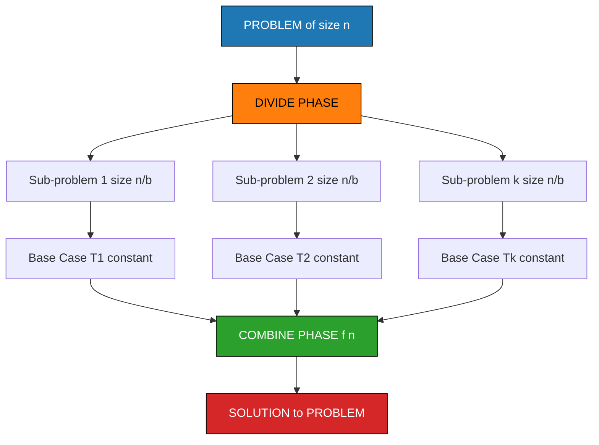
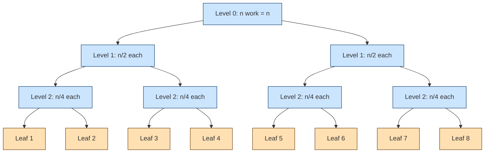
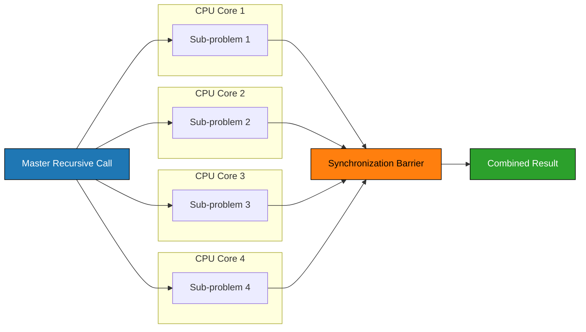
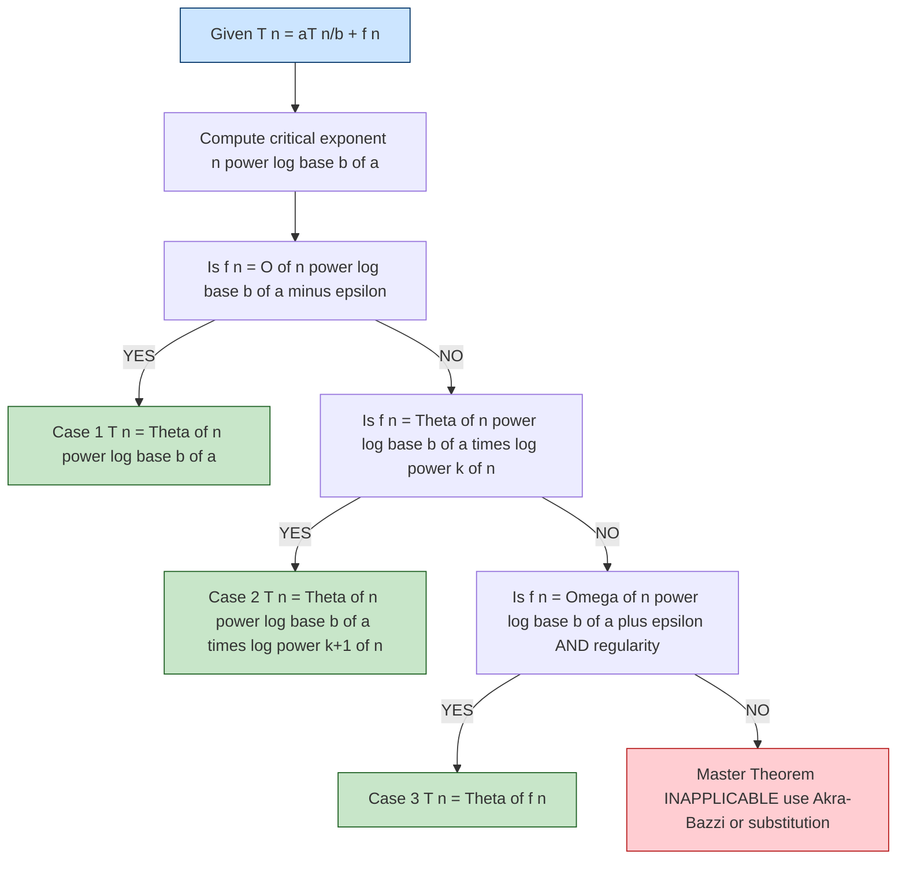

# - Advantages of Divide and Conquer Approach

<!-- SECTION_1_START -->
# 1. Core Technical Definition & Intuitive Overview

## Formal Definition
**Divide and Conquer (D\&C)** is a recursive algorithmic paradigm in which a problem of size $n$ is decomposed into two or more smaller independent sub-problems of the same type, each solved recursively, and whose partial solutions are merged to produce the final result. The general recurrence form is:

$$
T(n) = a \cdot T\!\left(\frac{n}{b}\right) + f(n)
$$

where $a \ge 1$ is the number of sub-problems, $n/b$ is the size of each sub-problem, and $f(n)$ is the cost of dividing and combining the work.

> [!IMPORTANT]
> **KTU 2024 Syllabus Highlight (UCEST105 – Module 4):**
> The advantages of D\&C are evaluated under the Course Outcomes **CO1 (Apply algorithmic thinking)** and **CO2 (Analyze time/space complexity)**. Students are expected to articulate *why* D\&C outperforms naive brute-force solutions.

## Conceptual Analogy / Intuition
Imagine a **treasure hunt on a university campus** organized by the KTU fest committee. Instead of one coordinator (brute force) searching every bench, the hunt is **divided geographically** — one team scans the CS block, another the canteen, another the library. After each team returns, the results are **merged** to declare the winner.

- **Divide** $\rightarrow$ Split the campus into zones.
- **Conquer** $\rightarrow$ Each zone team searches recursively.
- **Combine** $\rightarrow$ Aggregate findings to produce the final answer.

This mirrors how D\&C structures memory access, parallelism, and time efficiency.

## Key Quantitative Metrics
- **Master Theorem constants**: $a$, $b$, and the critical exponent $n^{\log_b a}$.
- **Space overhead** for recursion stack: $\mathcal{O}(\log n)$ (balanced) or $\mathcal{O}(n)$ (skewed).
- **Parallel speedup ceiling (Amdahl's Law)**: $S = \dfrac{1}{(1-p) + \dfrac{p}{n}}$, where $p$ is the parallelizable fraction.

> [!NOTE]
> **Standard D\&C Algorithms Catalog (Recall-Ready):**
> 1. Binary Search — $\mathcal{O}(\log n)$
> 2. Merge Sort — $\mathcal{O}(n \log n)$
> 3. Quick Sort — average $\mathcal{O}(n \log n)$
> 4. Strassen's Matrix Multiplication — $\mathcal{O}(n^{2.8074})$
> 5. Karatsuba Integer Multiplication — $\mathcal{O}(n^{\log_2 3}) \approx \mathcal{O}(n^{1.585})$
> 6. Closest Pair of Points — $\mathcal{O}(n \log n)$

> [!VISUALIZATION CONTROL]
> **Concept:** Recursion tree expansion of $T(n) = 2T(n/2) + n$ (Merge Sort recurrence).
> **GeoGebra / Desmos Input Equations:**
> * `f(x) = x * log2(x)` — cost at level $x$ of recursion.
> * `g(x) = n` — constant work per level.
> **Visual Description:** A balanced binary tree with $n$ nodes at the root, $n/2$ at depth 1, $\ldots$, $1$ at the leaves. The total work per level is constant $n$, and the height of the tree is $\log_2 n$, yielding total cost $n \log_2 n$.
<!-- SECTION_1_END -->

<!-- SECTION_2_START -->
# 2. Deep Theoretical Analysis & KTU High-Yield Formula Sheet

## 2.1 The Seven Pillars of D\&C Advantage

1. **Asymptotic Superiority**
   Naive algorithms often exhibit $\mathcal{O}(n^2)$ or $\mathcal{O}(2^n)$ behavior. D\&C reduces these to polynomial or quasi-linear bounds, e.g., $\mathcal{O}(n \log n)$ for sorting and $\mathcal{O}(n^{2.81})$ for matrix multiplication.

2. **Natural Parallelism**
   Sub-problems are *independent* — they share no mutable state during recursion. This maps cleanly onto multi-core CPUs, GPUs, and distributed clusters (MapReduce, Spark).

3. **Cache Locality (Memory Hierarchy Friendliness)**
   Smaller sub-problems fit into faster cache levels (L1/L2). Merge Sort, for instance, exhibits excellent spatial locality, halving cache misses compared to naive methods.

4. **Mathematical Tractability via Master Theorem**
   Recurrences of the form $T(n) = aT(n/b) + f(n)$ admit closed-form solutions using the **Master Theorem** — invaluable in KTU's analysis section.

5. **Modular Reusability**
   Sub-problem routines are reusable across multiple algorithms. Binary search logic underpins interval trees, order-statistic trees, and search engines.

6. **Predictable Worst-Case Performance**
   Unlike greedy or randomized algorithms, balanced D\&C (e.g., Merge Sort) guarantees a deterministic worst case — critical in safety-critical systems (avionics, medical devices).

7. **Composability with DP and Greedy**
   D\&C is the substrate upon which Dynamic Programming adds memoization, and Greedy adds local-optimal selection. Mastery of D\&C enables recognition of hybrid patterns.

## 2.2 KTU Formula Sheet

| # | Concept | Formula / Expression | Units / Domain | Notes |
|---|---------|----------------------|----------------|-------|
| 1 | General D\&C Recurrence | $T(n) = aT(n/b) + f(n)$ | $a \ge 1,\; b > 1$ | $a$ = #sub-problems, $b$ = shrink factor |
| 2 | Critical Exponent | $n^{\log_b a}$ | — | Compared against $f(n)$ in Master Theorem |
| 3 | Master Theorem Case 1 | $f(n) = \mathcal{O}(n^{\log_b a - \varepsilon})$ | $\varepsilon > 0$ | $T(n) = \Theta(n^{\log_b a})$ |
| 4 | Master Theorem Case 2 | $f(n) = \Theta(n^{\log_b a} \log^k n)$ | $k \ge 0$ | $T(n) = \Theta(n^{\log_b a} \log^{k+1} n)$ |
| 5 | Master Theorem Case 3 | $f(n) = \Omega(n^{\log_b a + \varepsilon})$ | regularity cond. | $T(n) = \Theta(f(n))$ |
| 6 | Merge Sort Complexity | $T(n) = 2T(n/2) + n$ | — | Solves to $\Theta(n \log n)$ |
| 7 | Binary Search Complexity | $T(n) = T(n/2) + 1$ | — | Solves to $\Theta(\log n)$ |
| 8 | Strassen's Multiplication | $T(n) = 7T(n/2) + n^2$ | — | Solves to $\Theta(n^{\log_2 7})$ |
| 9 | Karatsuba Multiplication | $T(n) = 3T(n/2) + n$ | — | Solves to $\Theta(n^{\log_2 3})$ |
| 10 | Recursion Stack Space | $\mathcal{O}(\log n)$ (balanced) / $\mathcal{O}(n)$ (skewed) | bytes | Lower bound on auxiliary memory |
| 11 | Amdahl's Speedup | $S = 1 / \big((1-p) + p/n\big)$ | ratio | $p$ = parallelizable fraction |
| 12 | Parallelism in D\&C | $T_\infty = \mathcal{O}(\log n)$ depth | seconds | Work $\times$ depth model |

> [!NOTE]
> **Engineering Utility:** Master Theorem Case 2 ($k=0$) covers Merge Sort and is the single most-tested D\&C recurrence in KTU valuation scripts. Memorize the form $T(n) = 2T(n/2) + cn$ $\Rightarrow$ $\Theta(n \log n)$.

## 2.3 Where D\&C Excels in Production Engineering
- **Database query optimization**: divide-and-conquer join strategies.
- **Computer graphics**: BSP trees for rendering.
- **Cryptography**: Karatsuba multiplication in RSA implementations.
- **Bioinformatics**: Closest-pair algorithms for genome alignment.
- **Search engines**: Distributed indexing using recursive partitioning.
<!-- SECTION_2_END -->

<!-- SECTION_3_START -->
# 3. Step-by-Step Derivations & Code/Symbolic Implementation

## 3.1 Worked Derivation — Merge Sort Recurrence

We derive the closed-form bound for $T(n) = 2T(n/2) + n$ with $T(1) = 1$.

**Step 1: Recursion Tree Expansion**

The recursion tree at level $i$ (with $i = 0$ as the root) contains $2^i$ sub-problems, each of size $n/2^i$. The cost contributed by each sub-problem is $n/2^i$.

$$
\text{Cost at level } i = 2^i \cdot \frac{n}{2^i} = n
$$

**Step 2: Determine Tree Height**

The recursion bottoms out when $n/2^h = 1$, hence:

$$
h = \log_2 n
$$

**Step 3: Aggregate Cost Across All Levels**

$$
\begin{aligned}
T(n) &= \sum_{i=0}^{h-1} \big(\text{cost at level } i\big) + \text{leaf cost} \\
     &= \sum_{i=0}^{\log_2 n - 1} n \;+\; 2^{\log_2 n} \cdot T(1) \\
     &= n \cdot \log_2 n \;+\; n \\
     &= \Theta(n \log_2 n)
\end{aligned}
$$

**Step 4: Cross-Check via Master Theorem (Case 2)**

Here $a = 2$, $b = 2$, $f(n) = n$, and $n^{\log_b a} = n^{\log_2 2} = n^1 = n$. Since $f(n) = \Theta(n)$ matches $n^{\log_b a}$ with $k = 0$:

$$
T(n) = \Theta(n \log n)
$$

Both methods agree — confirming the derivation.

## 3.2 Worked Derivation — Binary Search Recurrence

Binary Search on a sorted array of size $n$ splits into *one* sub-problem of size $n/2$ plus constant work:

$$
T(n) = T\!\left(\frac{n}{2}\right) + 1
$$

**Step 1: Recursion Tree**

The cost at every level is $1$. The depth is $\log_2 n$.

**Step 2: Summation**

$$
\begin{aligned}
T(n) &= \sum_{i=0}^{\log_2 n - 1} 1 \\
     &= \log_2 n
\end{aligned}
$$

**Step 3: Master Theorem Verification**

$a = 1$, $b = 2$, $f(n) = 1$. Critical exponent: $n^{\log_2 1} = n^0 = 1$. Since $f(n) = \Theta(1) = \Theta(n^0 \cdot \log^0 n)$, we apply **Case 2** with $k=0$:

$$
T(n) = \Theta(\log n)
$$

## 3.3 Full Python Implementation — Merge Sort with Counter

```python
from typing import List, Tuple

def merge_sort(arr: List[int]) -> Tuple[List[int], int]:
    """
    Sorts a list using the divide-and-conquer Merge Sort algorithm.
    Returns a tuple of (sorted_array, comparisons_count).
    Demonstrates the 'divide' (split) and 'conquer+combine' (merge) phases.
    """
    if len(arr) <= 1:
        # Base case: an array of length 0 or 1 is already sorted.
        return arr, 0

    # --- DIVIDE PHASE ---
    mid: int = len(arr) // 2
    left, left_comp = merge_sort(arr[:mid])
    right, right_comp = merge_sort(arr[mid:])

    # --- CONQUER + COMBINE PHASE ---
    merged: List[int] = []
    i: int = 0
    j: int = 0
    comp: int = 0

    # Walk both halves, comparing elements and merging in sorted order.
    while i < len(left) and j < len(right):
        comp += 1
        if left[i] <= right[j]:
            merged.append(left[i])
            i += 1
        else:
            merged.append(right[j])
            j += 1

    # Drain any remaining elements (no further comparisons needed).
    merged.extend(left[i:])
    merged.extend(right[j:])

    total_comparisons: int = comp + left_comp + right_comp
    return merged, total_comparisons


def main() -> None:
    sample: List[int] = [38, 27, 43, 3, 9, 82, 10]
    sorted_arr, comparisons = merge_sort(sample)
    print(f"Original: {sample}")
    print(f"Sorted  : {sorted_arr}")
    print(f"Comparisons used: {comparisons}")


if __name__ == "__main__":
    main()
```

**Line-by-Line Algorithmic Mapping**

| Code Section | Algorithmic Phase | D\&C Concept Illustrated |
|--------------|-------------------|---------------------------|
| `len(arr) <= 1` | Base Case | Recursion termination |
| `mid = len(arr) // 2` | Divide | Splits problem into 2 sub-problems of size $n/2$ |
| `merge_sort(arr[:mid])` | Conquer (Left) | Recursive call, $T(n/2)$ |
| `merge_sort(arr[mid:])` | Conquer (Right) | Recursive call, $T(n/2)$ |
| `while i < len(left) and j < len(right)` | Combine | Merges sorted halves, $f(n) = \Theta(n)$ |

## 3.4 Full Python Implementation — Binary Search

```python
from typing import List, Optional

def binary_search(arr: List[int], target: int) -> Optional[int]:
    """
    Performs iterative binary search on a sorted list.
    Returns the index of `target` if found, else None.
    Time complexity: O(log n). Space complexity: O(1).
    """
    if not arr:
        return None

    low: int = 0
    high: int = len(arr) - 1

    while low <= high:
        # Avoids integer overflow on extreme inputs.
        mid: int = low + (high - low) // 2

        if arr[mid] == target:
            return mid
        elif arr[mid] < target:
            low = mid + 1   # Target must live in the right half.
        else:
            high = mid - 1  # Target must live in the left half.

    return None


def main() -> None:
    data: List[int] = [2, 5, 8, 12, 16, 23, 38, 56, 72, 91]
    print(binary_search(data, 23))   # Expected: 5
    print(binary_search(data, 100))  # Expected: None


if __name__ == "__main__":
    main()
```

## 3.5 D\&C Trace — Manual Execution on $n=8$

For $T(n) = 2T(n/2) + n$:

| Level $i$ | Sub-problem size | Sub-problems | Work per node | Total level work |
|-----------|------------------|--------------|---------------|------------------|
| 0 | 8 | 1 | 8 | 8 |
| 1 | 4 | 2 | 4 | 8 |
| 2 | 2 | 4 | 2 | 8 |
| 3 | 1 | 8 | 1 | 8 |

Total depth $h = \log_2 8 = 3$. Total work $= 8 \times 3 = 24 = n \log_2 n = 8 \times 3$. ✓
<!-- SECTION_3_END -->

<!-- SECTION_4_START -->
# 4. Structural Diagrams & Schematics

## 4.1 Mermaid — D\&C Topological Workflow



## 4.2 Mermaid — Recursion Tree for $T(n) = 2T(n/2) + n$



## 4.3 Mermaid — Parallelism Map of Sub-problems



## 4.4 Mermaid — Master Theorem Decision Flow


<!-- SECTION_4_END -->

<!-- SECTION_5_START -->
# 5. KTU 2024 Scheme Examination Question Bank & Topic Recap

---

## PART A — 3-Mark Questions (Short Answer)

### Q1. `[KTU University Exam – July 2024]`
**"List any three advantages of the Divide and Conquer approach over naive brute-force methods."** **[CO1, Remember] [3 Marks]**

**Model Answer:**

1. **Asymptotic efficiency** — D\&C reduces complexity (e.g., $\mathcal{O}(n \log n)$ for Merge Sort versus $\mathcal{O}(n^2)$ for bubble sort). **[1 Mark]**
2. **Natural parallelism** — Sub-problems are independent and can be executed concurrently on multi-core hardware. **[1 Mark]**
3. **Cache friendliness** — Smaller sub-problems exploit memory hierarchy, reducing cache misses and improving runtime. **[1 Mark]**

---

### Q2. `[KTU University Exam – Dec 2023]`
**"State the general recurrence relation of a Divide and Conquer algorithm and identify each parameter."** **[CO2, Understand] [3 Marks]**

**Model Answer:**

$$
T(n) = a \cdot T\!\left(\frac{n}{b}\right) + f(n)
$$

- $a$ — number of sub-problems generated. **[1 Mark]**
- $n/b$ — size of each sub-problem ($b$ is the shrink factor). **[1 Mark]**
- $f(n)$ — cost of the *divide* and *combine* (non-recursive) work. **[1 Mark]**

---

## PART B — 14-Mark Questions (ESE Module Choice)

> [!IMPORTANT]
> Each 14-mark question carries internal choice. **Question A** and **Question B** below are independent alternatives. Students attempt **any one full set**.

---

### Q3. Question A — Full 14 Marks `[KTU University Exam – July 2024]`

**(a)** Solve the recurrence $T(n) = 2T(n/2) + n$ using the **Master Theorem** and verify your result using the **recursion tree method**. Show the cost per level and the tree height. **[7 Marks] [CO2, Apply]**

**Solution Outline:**

*Step 1: Master Theorem Application* **[2 Marks]**
- Identify $a = 2$, $b = 2$, $f(n) = n$.
- Critical exponent: $n^{\log_2 2} = n^1 = n$.
- Since $f(n) = \Theta(n) = \Theta(n^{\log_2 2} \cdot \log^0 n)$, this is **Case 2** with $k = 0$.

$$
T(n) = \Theta(n^{\log_2 2} \cdot \log^{0+1} n) = \Theta(n \log n)
$$

*Step 2: Recursion Tree Verification* **[4 Marks]**

| Level $i$ | Sub-problems | Size per node | Work per node | Total level work |
|-----------|--------------|---------------|---------------|------------------|
| 0 | 1 | $n$ | $n$ | $n$ |
| 1 | 2 | $n/2$ | $n/2$ | $n$ |
| 2 | 4 | $n/4$ | $n/4$ | $n$ |
| $\vdots$ | $\vdots$ | $\vdots$ | $\vdots$ | $\vdots$ |
| $\log_2 n$ | $n$ | $1$ | $1$ | $n$ |

- Number of levels: $\log_2 n + 1$. **[1 Mark]**
- Summation: $T(n) = n \cdot (\log_2 n + 1) = \Theta(n \log n)$. **[1 Mark]**

*Step 3: Conclusion* **[1 Mark]**
Both methods yield $T(n) = \Theta(n \log n)$, confirming Merge Sort's complexity bound.

---

**(b)** Explain **four** key advantages of the Divide and Conquer paradigm. For each advantage, mention one real-world engineering application where it is exploited. **[7 Marks] [CO1, Understand]**

**Model Answer:**

1. **Asymptotic efficiency** — D\&C converts intractable $\mathcal{O}(n^2)$ or worse bounds into manageable $\mathcal{O}(n \log n)$ or polynomial forms. *Application*: Merge Sort in database indexing engines. **[1.5 Marks]**
2. **Natural parallelism** — Sub-problems are independent. *Application*: MapReduce's `map` and `reduce` stages in distributed computing (Hadoop/Spark). **[1.5 Marks]**
3. **Cache locality** — Sub-problems fit into faster cache levels, reducing memory latency. *Application*: Quick Sort variants in in-memory OLAP systems. **[1.5 Marks]**
4. **Mathematical tractability** — Recurrences admit closed-form solutions via the Master Theorem. *Application*: Predicting resource requirements in cloud autoscaling. **[1.5 Marks]**
5. *(Optional bonus)* **Modular reusability** — Same sub-routines reused across algorithms. **[1 Mark]**

---

### Q4. Question B — Full 14 Marks (Alternative Choice) `[KTU University Exam – Dec 2023]`

**(a)** Derive the time complexity of **Strassen's Matrix Multiplication** algorithm using a recurrence relation. Apply the Master Theorem and state the final $\Theta$ bound. Compare it with the naive $\mathcal{O}(n^3)$ method. **[7 Marks] [CO2, Apply]**

**Solution Outline:**

*Step 1: Strassen's Recurrence* **[2 Marks]**
Strassen divides each $n \times n$ matrix into four $(n/2) \times (n/2)$ quadrants and uses **7** multiplications (instead of 8) plus $\mathcal{O}(n^2)$ additions:

$$
T(n) = 7 \cdot T\!\left(\frac{n}{2}\right) + n^2
$$

*Step 2: Master Theorem Application* **[2 Marks]**
- $a = 7$, $b = 2$, $f(n) = n^2$.
- Critical exponent: $n^{\log_2 7} \approx n^{2.8074}$.
- Compare $f(n) = n^2$ with $n^{\log_2 7}$: since $2 < 2.8074$, we have $f(n) = \mathcal{O}(n^{\log_2 7 - \varepsilon})$ where $\varepsilon \approx 0.8074$. This is **Case 1**.

$$
T(n) = \Theta\!\left(n^{\log_2 7}\right) \approx \Theta(n^{2.8074})
$$

*Step 3: Comparison with Naive Method* **[2 Marks]**

| Algorithm | Time Complexity | For $n = 1000$ |
|-----------|-----------------|----------------|
| Naive (3 nested loops) | $\mathcal{O}(n^3)$ | $\sim 10^9$ ops |
| Strassen's | $\mathcal{O}(n^{2.8074})$ | $\sim 10^{8.07}$ ops |

*Step 4: Conclusion* **[1 Mark]**
Strassen's achieves a tangible asymptotic speedup, though the constant factor is larger, so for small $n$ the naive method is often faster in practice.

---

**(b)** Discuss how Divide and Conquer enables **parallel computing**. Use Amdahl's Law to show the theoretical speedup obtained when 90% of an algorithm's work is parallelizable across 4 cores. **[7 Marks] [CO1, Apply]**

**Model Answer:**

*Step 1: D\&C and Parallelism* **[2 Marks]**
D\&C decomposes a problem into independent sub-problems. Once divided, these sub-problems share no mutable state and can be distributed across cores without contention. The combine phase is the only sequential bottleneck.

*Step 2: Amdahl's Law Formula* **[1 Mark]**

$$
S = \frac{1}{(1 - p) + \dfrac{p}{N}}
$$

*Step 3: Substitute Values* **[2 Marks]**
- $p = 0.9$ (90% parallelizable)
- $N = 4$ cores

$$
S = \frac{1}{(1 - 0.9) + \dfrac{0.9}{4}} = \frac{1}{0.1 + 0.225} = \frac{1}{0.325} \approx 3.077
$$

*Step 4: Interpretation* **[2 Marks]**
- A **3.08$\times$** speedup is achievable on 4 cores.
- The **10%** sequential portion caps the speedup. Even with infinite cores ($N \to \infty$):

$$
S_\infty = \frac{1}{1 - 0.9} = 10
$$

- Hence, D\&C's *parallel-friendly* nature is limited by the irreducible combine cost.

---

> [!WARNING]
> **KTU Examiner's Valuation Warning / Pitfall Callout:**
> 1. **Always write the Master Theorem constants** ($a$, $b$, $f(n)$) explicitly before applying cases — failing to do so costs **1 Mark**.
> 2. **Do not confuse $\log_b a$ with $\log a$** — the base must be the shrink factor $b$, not 10 or $e$.
> 3. For **Case 3**, the *regularity condition* $a \cdot f(n/b) \le c \cdot f(n)$ for some $c < 1$ must be verified; skipping this invalidates the answer.
> 4. When asked for *advantages*, do **not** write algorithm definitions; mark deduction is 1 mark per incorrect substitution.
> 5. **Show recursion tree work-per-level** explicitly; examiners allocate 1 mark to this sub-step alone.

---

## Topic Recap & Important Things to Remember

- ✅ **Core Recurrence**: $T(n) = aT(n/b) + f(n)$ — know what $a$, $b$, and $f(n)$ represent.
- ✅ **Master Theorem** — Three cases; compute critical exponent $n^{\log_b a}$ first.
- ✅ **Merge Sort**: $T(n) = 2T(n/2) + n$ $\Rightarrow$ $\Theta(n \log n)$.
- ✅ **Binary Search**: $T(n) = T(n/2) + 1$ $\Rightarrow$ $\Theta(\log n)$.
- ✅ **Strassen's**: $T(n) = 7T(n/2) + n^2$ $\Rightarrow$ $\Theta(n^{\log_2 7})$.
- ✅ **Karatsuba**: $T(n) = 3T(n/2) + n$ $\Rightarrow$ $\Theta(n^{\log_2 3})$.
- ✅ **Seven Advantages**: asymptotic efficiency, parallelism, cache locality, mathematical tractability, modularity, predictable worst-case, composability.
- ✅ **Recursion stack space**: $\mathcal{O}(\log n)$ for balanced, $\mathcal{O}(n)$ for skewed.
- ✅ **Amdahl's Law** quantifies parallel speedup ceiling; combine phase is the bottleneck.
- ✅ **Production usage**: MapReduce, database indexing, RSA, BSP rendering, genome alignment.
- ✅ **Pitfall**: For Case 3, always verify the *regularity condition* before declaring $T(n) = \Theta(f(n))$.
<!-- SECTION_5_END -->
