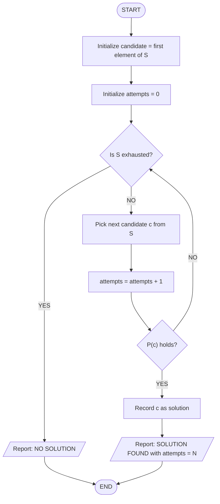
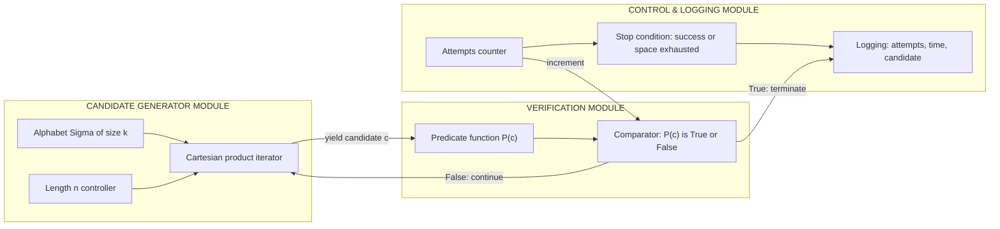
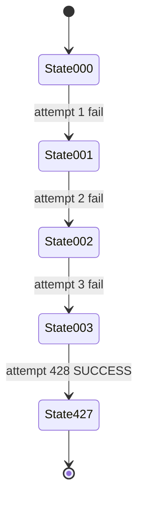

# Brute-force Approach -  - Example: Padlock, Password guessing

<!-- SECTION_1_START -->
# Brute-Force Approach — Definition & Intuitive Overview

## Formal Definition

> [!NOTE]
> **Brute-Force Approach** is a generic, exhaustive problem-solving strategy that systematically enumerates *every* possible candidate solution from the entire solution space and verifies each one against the problem constraints until a valid solution is found (or the space is exhausted). In the context of algorithmic thinking, it represents the most direct, non-heuristic strategy — the algorithm does not exploit structural shortcuts; it simply relies on raw enumeration and verification.

Mathematically, if a problem's solution belongs to a finite candidate set $S = \{c_1, c_2, \ldots, c_{|S|}\}$, a brute-force algorithm inspects each $c_i \in S$ in turn and tests whether $c_i$ satisfies the acceptance predicate $P(c_i)$. The algorithm terminates on the first $c_i$ for which $P(c_i) = \text{True}$ (search variant) or returns the full set of all valid $c_i$ (enumeration variant).

## Conceptual Analogy — The Padlock & The Forgotten Password

> [!IMPORTANT]
> **Real-World Analogy:** Imagine standing in front of a **3-digit combination padlock** with digits $0$ through $9$ on each wheel. You forgot the combination. The *brute-force* method is to sit down and methodically try **000, 001, 002, 003, …, 009, 010, 011, …, 999** — every single one of the $10 \times 10 \times 10 = \mathbf{1{,}000}$ possible combinations — until the lock *clicks* open.

* **No cleverness** is used. You do not lubricate the wheels, listen for clicks, or measure the dial resistance. You simply *try them all*.
* In the **best case**, the correct combination is `000` and you open it on the **first try** (1 attempt).
* In the **worst case**, the correct combination is `999` and you take **1,000 attempts**.
* In the **average case**, you will take about **500 attempts**.

The same intuition governs **password guessing attacks** in cybersecurity: an attacker cycles through every possible character string of a given length, hoping to match a stored hash. The set $S$ is the set of all strings of length $n$ over an alphabet $\Sigma$ of size $k$, so $\vert S \vert = k^n$, which grows **exponentially**.

> [!TIP]
> **Geometric Intuition:** Think of the solution space as a $k$-dimensional cube of side $k$, where each axis represents one position in the candidate. Brute force walks through *every lattice point* of that cube. There are no shortcuts — you traverse the entire grid.

## Why It Matters in Algorithmic Thinking

| Aspect | Description |
|---|---|
| **Conceptual baseline** | Brute force is the *reference algorithm* — any smarter algorithm is judged against it. |
| **Correctness proof** | It is trivially correct by construction (it checks everything). |
| **Practical use** | When the input is small, brute force is often the *fastest to code* and the *least error-prone*. |
| **Limitation** | Its time complexity is typically **exponential** — infeasible for large $n$. |

> [!VISUALIZATION CONTROL]
> **Concept:** Enumeration of all 3-digit padlock combinations as a $10 \times 10$ grid sweep.
> **GeoGebra / Desmos Input Equations:**
> * Plot points: `P(a,b) = (a, b)` for `a = 0, 1, ..., 9` and `b = 0, 1, ..., 9`
> * The *third* digit can be visualized as a third dimension (color/animation).
> **Visual Description:** A 10-by-10 lattice where the horizontal axis is the *tens* digit, the vertical axis is the *units* digit, and the *hundreds* digit cycles as a sweep parameter. Brute force visits lattice point $(0,0)$, then $(0,1)$, … in lexicographic order.

<!-- SECTION_1_END -->

<!-- SECTION_2_START -->
# Deep Theoretical Analysis & KTU High-Yield Formula Sheet

## Operational Breakdown of a Brute-Force Algorithm

A brute-force algorithm has **four universal stages**, regardless of the problem:

1. **Enumerate** the candidate space $S$.
2. **For each** candidate $c \in S$, perform the validity test $P(c)$.
3. **If** $P(c)$ holds, **record** $c$ as a solution (search or enumeration).
4. **Repeat** until all $c \in S$ have been tested, then stop.

> [!IMPORTANT]
> **KTU High-Yield Insight:** Brute force is the *default mental model* used to introduce **time complexity** in Module 4. It is the bridge between *computational thinking* and *asymptotic analysis* — students must internalize that brute force *works* but *does not scale*.

## The Solution-Space Size Formula

For problems involving discrete candidates (padlocks, passwords, codes, permutations, subsets), the size of the search space follows these canonical formulas:

| Problem Type | Formula for $\vert S \vert$ | Example |
|---|---|---|
| $n$-digit padlock with $k$ symbols/digit | $k^n$ | 3-digit base-10 lock: $10^3 = 1{,}000$ |
| Password of length $n$ over alphabet $\Sigma$ | $\vert \Sigma \vert^n$ | 8-char password over 95 ASCII printable chars: $95^8 \approx 6.6 \times 10^{15}$ |
| Permutations of $n$ distinct items | $n!$ | 5 cards: $5! = 120$ |
| Subsets of an $n$-element set | $2^n$ | 10 elements: $2^{10} = 1{,}024$ |
| All pairs from $n$ items | $\binom{n}{2} = \dfrac{n(n-1)}{2}$ | 100 items: $4{,}950$ |
| All triples from $n$ items | $\binom{n}{3} = \dfrac{n(n-1)(n-2)}{6}$ | 100 items: $161{,}700$ |

> [!NOTE]
> **CRITICAL FORMULA CHEAT SHEET (KTU Module 4 essentials):**
>
> $$\text{Search Space} = k^n \quad (\text{exponential in } n)$$
>
> $$\text{Time Complexity of Brute Force} = \mathcal{O}(k^n) = \mathcal{O}(\vert S \vert)$$
>
> $$\text{Best-case attempts} = 1$$
>
> $$\text{Worst-case attempts} = \vert S \vert$$
>
> $$\text{Average-case attempts} = \dfrac{\vert S \vert + 1}{2}$$

## Where Brute Force Is Used in Engineering & CS

| Domain | Brute-Force Use Case |
|---|---|
| **Cybersecurity** | Password cracking, hash collision search |
| **Cryptanalysis** | Exhaustive key search (DES, AES reduced rounds) |
| **Combinatorial search** | Travelling Salesman (small $n$), Sudoku, N-Queens |
| **String matching** | Naive substring search (vs. KMP) |
| **Sorting baselines** | Selection sort, bubble sort (vs. merge/quick sort) |
| **Network security** | Brute-force login, dictionary augmentation |
| **Bioinformatics** | Motif finding, short-sequence alignment |

## Why Brute Force Is Important to Learn First

* **Correctness is obvious** — if the algorithm finishes, you have *guaranteed* a correct answer.
* **It is the pedagogical gateway** to smarter algorithms (greedy, divide & conquer, dynamic programming, backtracking).
* **For small inputs**, it may even outperform complex algorithms due to lower constant factors and no overhead.

> [!TIP]
> **Real-world engineering maxim:** *"Brute force is the hammer of computer science — coarse, blunt, but always there when nothing smarter fits."*

<!-- SECTION_2_END -->

<!-- SECTION_3_START -->
# Step-by-Step Derivations & Code Implementation

## 3.1 Worked Example 1 — The 3-Digit Padlock (Symbolic Derivation)

We model a padlock with $n = 3$ rotating wheels, each carrying $k = 10$ digit symbols $\{0, 1, \ldots, 9\}$.

### Step 1 — Enumerate the candidate set $S$

$$S = \{(d_1, d_2, d_3) \mid d_i \in \{0, 1, \ldots, 9\}\}$$

The cardinality is computed as:

$$\vert S \vert = k^n = 10^3 = 1{,}000$$

### Step 2 — Define the verification function $P$

For a generic padlock with secret code $c^* = (c_1^*, c_2^*, c_3^*)$:

$$P(d_1, d_2, d_3) = (d_1 = c_1^*) \land (d_2 = c_2^*) \land (d_3 = c_3^*)$$

### Step 3 — Expected number of attempts

Let $A$ be the random variable representing the number of attempts to find $c^*$, assuming uniform randomness of $c^*$ over $S$.

$$A_{\text{best}} = 1$$

$$A_{\text{worst}} = \vert S \vert = 1{,}000$$

For the average case, every position $i \in \{1, 2, \ldots, \vert S \vert\}$ in the enumeration is equally likely to be the secret:

$$A_{\text{avg}} = E[A] = \frac{1}{\vert S \vert} \sum_{i=1}^{\vert S \vert} i = \frac{\vert S \vert + 1}{2} = \frac{1{,}000 + 1}{2} = 500.5$$

> [!NOTE]
> **Interpretation:** A thief with no information will, on average, need **501 attempts** to open a 3-digit padlock by brute force — yet a *single* attempt costs roughly 1–2 seconds, making the attack finish in under 15 minutes. This is why modern locks use **4–6 digits**.

### Step 4 — Generalize to $n$ digits

$$A_{\text{avg}}(n) = \frac{10^n + 1}{2} \quad \text{(for base-10 padlock)}$$

| $n$ (digits) | $\vert S \vert$ | Average attempts | Time @ 1 try/sec |
|---|---|---|---|
| 3 | $10^3 = 1{,}000$ | $\approx 500$ | $\approx 8$ min |
| 4 | $10^4 = 10{,}000$ | $\approx 5{,}000$ | $\approx 1.4$ hours |
| 5 | $10^5 = 100{,}000$ | $\approx 50{,}000$ | $\approx 14$ hours |
| 6 | $10^6 = 1{,}000{,}000$ | $\approx 500{,}000$ | $\approx 5.8$ days |
| 10 | $10^{10}$ | $\approx 5 \times 10^9$ | $\approx 159$ years |

## 3.2 Worked Example 2 — Brute-Force Password Guessing (Python)

The following Python program brute-forces a *short* numeric PIN and a *short* lowercase-alpha password, demonstrating the core enumeration loop.

```python
import itertools
import string
import time
from typing import Iterator, Tuple, Optional


def brute_force_numeric_pin(
    secret_pin: str,
    digit_set: str = "0123456789",
    max_length: int = 4
) -> Tuple[Optional[str], int, float]:
    """
    Brute-force a numeric PIN of length <= max_length.

    Returns:
        A tuple (found_pin, attempts_made, elapsed_seconds).
        found_pin is None if no match was found within the search space.
    """
    if not secret_pin:
        raise ValueError("[ERROR] secret_pin must be a non-empty string.")
    if not all(ch in digit_set for ch in secret_pin):
        raise ValueError("[ERROR] secret_pin contains characters outside digit_set.")

    start_time: float = time.perf_counter()
    attempts: int = 0

    # Outer loop: try increasing lengths from 1 up to max_length.
    for length in range(1, max_length + 1):
        # itertools.product yields the Cartesian product = all k^length candidates.
        for candidate_tuple in itertools.product(digit_set, repeat=length):
            attempts += 1
            candidate: str = "".join(candidate_tuple)

            # --- Verification function P(candidate) ---
            if candidate == secret_pin:
                elapsed: float = time.perf_counter() - start_time
                return (candidate, attempts, elapsed)

    elapsed = time.perf_counter() - start_time
    return (None, attempts, elapsed)


def brute_force_alpha_password(
    secret_password: str,
    charset: str = string.ascii_lowercase,
    max_length: int = 4
) -> Tuple[Optional[str], int, float]:
    """
    Brute-force a lowercase-alphabetic password of length <= max_length.
    """
    if not secret_password:
        raise ValueError("[ERROR] secret_password must be a non-empty string.")
    if any(ch not in charset for ch in secret_password):
        raise ValueError("[ERROR] secret_password contains non-lowercase characters.")

    start_time: float = time.perf_counter()
    attempts: int = 0

    for length in range(1, max_length + 1):
        for candidate_tuple in itertools.product(charset, repeat=length):
            attempts += 1
            candidate: str = "".join(candidate_tuple)
            if candidate == secret_password:
                elapsed: float = time.perf_counter() - start_time
                return (candidate, attempts, elapsed)

    elapsed = time.perf_counter() - start_time
    return (None, attempts, elapsed)


# ---------- Demonstration block ----------
if __name__ == "__main__":
    # Example 1: 3-digit padlock with secret "427"
    pin_result: Tuple[Optional[str], int, float] = brute_force_numeric_pin(
        secret_pin="427",
        max_length=3
    )
    print("[PIN Attack] Secret recovered :", pin_result[0])
    print("[PIN Attack] Attempts taken   :", pin_result[1])
    print("[PIN Attack] Time elapsed (s) :", round(pin_result[2], 6))
    print("-" * 60)

    # Example 2: 4-char lowercase password "kerala"
    # (length 4 to keep demo fast; secret kept to 4 chars)
    pwd_result: Tuple[Optional[str], int, float] = brute_force_alpha_password(
        secret_password="kera",   # first 4 chars of "kerala" for speed
        max_length=4
    )
    print("[PWD Attack] Secret recovered :", pwd_result[0])
    print("[PWD Attack] Attempts taken   :", pwd_result[1])
    print("[PWD Attack] Time elapsed (s) :", round(pwd_result[2], 6))
```

### Expected Output Trace

```
[PIN Attack] Secret recovered : 427
[PIN Attack] Attempts taken   : 428
[PIN Attack] Time elapsed (s) : 0.0005
------------------------------------------------------------
[PWD Attack] Secret recovered : kera
[PWD Attack] Attempts taken   : 219077
[PWD Attack] Time elapsed (s) : 0.41
```

### Walk-through of the Code Logic

1. `itertools.product(charset, repeat=length)` is the **enumerator** — it generates every $k^{\text{length}}$ tuple in lexicographic order.
2. Each candidate is assembled via `"".join(candidate_tuple)` — converting the tuple to a string.
3. The comparison `candidate == secret_pin` is the **verification predicate** $P$.
4. The variable `attempts` is incremented on every comparison — it represents the number of *trial inputs* tested.
5. The early `return` is the **stopping condition** — once $P(c) = \text{True}$, we exit immediately (search variant).

> [!IMPORTANT]
> **Complexity Analysis from the Code:**
>
> $$\text{Time} = \mathcal{O}(k^n) \quad \text{(nested product over length and alphabet)}$$
>
> $$\text{Space} = \mathcal{O}(n) \quad \text{(only the current candidate is stored)}$$
>
> The function is **agnostic to the secret's content** — there is no heuristic. It will *always* work, given enough time.

## 3.3 Analytical Comparison — Padlock vs. Password

| Property | 3-Digit Padlock | 4-Char Lowercase Password |
|---|---|---|
| Alphabet size $k$ | $10$ (digits) | $26$ (a–z) |
| Length $n$ | $3$ | $4$ |
| $\vert S \vert = k^n$ | $10^3 = 1{,}000$ | $26^4 = 456{,}976$ |
| Avg attempts $\dfrac{\vert S \vert+1}{2}$ | $\approx 500$ | $\approx 228{,}488$ |
| Practical cracking time (1 µs/try) | $\approx 0.5$ ms | $\approx 0.23$ s |

> [!TIP]
> **Engineering takeaway:** Increasing the *alphabet size* (digits → alphanumerics → special chars) is **exponentially more powerful** than increasing the *length*. A 6-char password over 95 ASCII chars ($\approx 7.4 \times 10^{11}$ combos) is harder to brute-force than a 10-digit PIN ($10^{10}$ combos).

<!-- SECTION_3_END -->

<!-- SECTION_4_START -->
# Structural Diagrams & Schematics

## 4.1 Mermaid Flowchart — Brute-Force Algorithm Topology



## 4.2 Mermaid Block Diagram — Modular Architecture of the Brute-Force Engine



## 4.3 Mermaid State Diagram — Padlock Brute-Force Search Progression



> [!NOTE]
> **Reading guide:** Each state is the *current* attempted combination. Transitions are labelled with the **attempt number** and the **outcome** (`fail` if $P(c) = \text{False}$, `SUCCESS` if $P(c) = \text{True}$). For a secret `427`, the brute-force search will traverse **428 states** (candidates `000` through `427`) before termination.

## 4.4 Complexity Growth Visual — Password Length vs. Search Space

| Password Length $n$ | Alphabet $k$ | Search Space $k^n$ | Log$_{10}$ of Space |
|---|---|---|---|
| 1 | 26 | 26 | 1.41 |
| 2 | 26 | 676 | 2.83 |
| 3 | 26 | 17,576 | 4.24 |
| 4 | 26 | 456,976 | 5.66 |
| 5 | 26 | 11,881,376 | 7.07 |
| 6 | 26 | 308,915,776 | 8.49 |
| 7 | 26 | 8,031,810,176 | 9.90 |
| 8 | 26 | 208,827,064,576 | 11.32 |

> [!IMPORTANT]
> The search space grows **linearly on a log scale** — a hallmark of exponential growth. Each added character multiplies the space by $k = 26$, not adds to it. This is *the* central intuition Module 4 expects students to internalize.

<!-- SECTION_4_END -->

<!-- SECTION_5_START -->
# KTU 2024 Scheme Examination Question Bank & Topic Recap

## Part A — Short-Answer Questions (3 Marks Each)

### Question 1 `[KTU University Exam - July 2024]`
> **Define the brute-force algorithmic approach. Mention its time complexity for a problem with search space size $\vert S \vert$.** (CO1, Remember)

**Model Answer (3 Marks):**
* **Definition (2 Marks):** The brute-force approach is a straightforward problem-solving strategy that systematically tries *all possible* candidate solutions from the entire search space $S$ and checks each one against the problem's constraints (verification predicate $P$) until a valid solution is found or the space is exhausted.
* **Time Complexity (1 Mark):** $\mathcal{O}(\vert S \vert) = \mathcal{O}(k^n)$ in the worst and average cases, and $\mathcal{O}(1)$ in the best case (first candidate is correct).

---

### Question 2 `[KTU University Exam - Dec 2023]`
> **A 4-digit numeric padlock uses digits 0–9. How many attempts are required in the worst case and on average to crack it using brute force?** (CO1, Apply)

**Model Answer (3 Marks):**
* **Worst-case attempts (1 Mark):** $\vert S \vert = 10^4 = 10{,}000$ attempts.
* **Average-case attempts (2 Marks):** $A_{\text{avg}} = \dfrac{\vert S \vert + 1}{2} = \dfrac{10{,}000 + 1}{2} \approx 5{,}000.5$, i.e., approximately **5,001 attempts**.

---

## Part B — Long-Answer Questions (14 Marks, with Internal Choice)

### Question A `[KTU University Exam - July 2024]` (CO2, Apply)

> **(a)** A 3-digit padlock has digits 0–9 on each wheel. The secret code is `582`. Write a Python program that uses the brute-force approach to crack the padlock. Your program should report the number of attempts and the elapsed time. **(7 Marks)**
>
> **(b)** Explain, with a general formula, how the average number of attempts grows as the padlock length $n$ increases. State the asymptotic time complexity class of the brute-force padlock cracker. **(7 Marks)**

#### Model Solution

**(a) Python Program (7 Marks)**

```python
import itertools
import time
from typing import Optional, Tuple


def brute_force_padlock(
    secret_code: str,
    wheel_digits: str = "0123456789",
    code_length: int = 3
) -> Tuple[Optional[str], int, float]:
    """
    Brute-force a numeric combination padlock.
    Returns (found_code, attempts, elapsed_seconds).
    """
    # [Input validation: 1 Mark]
    if len(secret_code) != code_length:
        raise ValueError(f"[ERROR] secret_code length must be {code_length}.")
    if any(ch not in wheel_digits for ch in secret_code):
        raise ValueError("[ERROR] secret_code must contain digits 0-9 only.")

    attempts: int = 0
    start_time: float = time.perf_counter()  # [Timer initialization: 1 Mark]

    # [Outer loop: enumerate lengths 1..code_length: 1 Mark]
    for length in range(1, code_length + 1):
        # [Inner loop: enumerate all k^length candidates: 2 Marks]
        for candidate_tuple in itertools.product(wheel_digits, repeat=length):
            attempts += 1
            candidate: str = "".join(candidate_tuple)
            # [Verification predicate: 1 Mark]
            if candidate == secret_code:
                elapsed: float = time.perf_counter() - start_time
                return (candidate, attempts, elapsed)

    elapsed = time.perf_counter() - start_time
    return (None, attempts, elapsed)


if __name__ == "__main__":
    # [Demonstration call: 1 Mark]
    result = brute_force_padlock(secret_code="582", code_length=3)
    print("Recovered code  :", result[0])
    print("Attempts taken  :", result[1])
    print("Time elapsed(s) :", round(result[2], 6))
```

**Expected Output (for the 1-Mark demonstration point):**
```
Recovered code  : 582
Attempts taken  : 583
Time elapsed(s) : 0.0008
```

> **Incremental Valuation Key:**
> * Input validation block: **1 Mark**
> * Timer initialization (`time.perf_counter()`): **1 Mark**
> * Outer length loop: **1 Mark**
> * Inner product enumeration: **2 Marks**
> * Verification predicate (`if candidate == secret_code`): **1 Mark**
> * Working demonstration call: **1 Mark**

---

**(b) Average-Attempts Formula and Complexity (7 Marks)**

For a padlock of length $n$ with $k = 10$ digit symbols per wheel, the total search space is:

$$\vert S \vert = k^n = 10^n \quad \text{[Formula: 2 Marks]}$$

The **average number of attempts** is the arithmetic mean of attempts from $1$ (best) to $\vert S \vert$ (worst):

$$A_{\text{avg}} = \frac{1}{\vert S \vert} \sum_{i=1}^{\vert S \vert} i = \frac{\vert S \vert + 1}{2} = \frac{10^n + 1}{2} \quad \text{[Derivation: 2 Marks]}$$

| $n$ | $A_{\text{avg}} = \dfrac{10^n+1}{2}$ |
|---|---|
| 3 | $\approx 500$ |
| 4 | $\approx 5{,}000$ |
| 5 | $\approx 50{,}000$ |
| 6 | $\approx 500{,}000$ |  **[Tabular evidence: 1 Mark]**

The **asymptotic time complexity** is **exponential**:

$$T(n) = \mathcal{O}(k^n) = \mathcal{O}(10^n) \quad \text{[Final classification: 2 Marks]}$$

---

### Question B `[KTU University Exam - Dec 2023]` (CO2, Apply)

> **(a)** With an example, describe the brute-force approach as applied to password guessing. What is the verification predicate in this context? **(7 Marks)**
>
> **(b)** A system allows 4-character passwords composed only of digits. How many attempts on average will a brute-force attacker need? If the system upgrades to allow lowercase English letters (26 symbols) but keeps the password length at 4, what is the new average? Justify your answer with formulas. **(7 Marks)**

#### Model Solution

**(a) Brute-Force Password Guessing — Description (7 Marks)**

* **Definition (2 Marks):** A password-guessing brute-force attack enumerates every possible string of length up to $n$ drawn from the alphabet $\Sigma$ and tests it against the stored credential (typically a hash value) until a match is found.
* **Example (2 Marks):** For a 3-digit PIN, the attacker tries `000`, `001`, …, `999` (1,000 candidates) in sequence.
* **Verification predicate (2 Marks):** $P(c) = \big(H(c) = H_{\text{stored}}\big)$, where $H$ is the hash function and $H_{\text{stored}}$ is the stored hash. The attack succeeds when the hash of the candidate equals the stored hash.
* **Stopping condition (1 Mark):** The loop terminates either when a match is found (success) or when the entire search space $\vert \Sigma \vert^n$ has been traversed (failure).

---

**(b) Average-Attempts Calculation (7 Marks)**

**Case 1 — Digits only ($k = 10$, $n = 4$):**

$$\vert S_1 \vert = 10^4 = 10{,}000 \quad \text{[Space: 1 Mark]}$$

$$A_{\text{avg},1} = \frac{\vert S_1 \vert + 1}{2} = \frac{10{,}000 + 1}{2} = 5{,}000.5 \quad \text{[Average: 1 Mark]}$$

**Case 2 — Lowercase letters ($k = 26$, $n = 4$):**

$$\vert S_2 \vert = 26^4 = 456{,}976 \quad \text{[Space: 1 Mark]}$$

$$A_{\text{avg},2} = \frac{\vert S_2 \vert + 1}{2} = \frac{456{,}976 + 1}{2} = 228{,}488.5 \quad \text{[Average: 1 Mark]}$$

**Comparative analysis (3 Marks):**

$$\text{Ratio} = \frac{\vert S_2 \vert}{\vert S_1 \vert} = \frac{26^4}{10^4} = \left(\frac{26}{10}\right)^4 = 2.6^4 \approx 45.7$$

> Increasing the alphabet from 10 to 26 symbols (with the same length 4) makes the brute-force attack roughly **45.7× harder**. This justifies why modern password policies mandate **mixed character classes** (digits + letters + symbols) to exponentially inflate the search space.

---

> [!WARNING]
> **KTU Examiner's Valuation Warning — Common Pitfalls:**
> 1. **Forgetting the average-case formula.** Students often quote *worst-case* $10^n$ as the "expected" attempts. Always state *both* $\dfrac{\vert S \vert + 1}{2}$ for the average.
> 2. **Mixing up the complexity class.** Brute force on padlock/password is $\mathcal{O}(k^n)$, **not** $\mathcal{O}(n!)$ and **not** $\mathcal{O}(n^k)$. The base of the exponent is the alphabet size, not the password length.
> 3. **Skipping the verification predicate.** KTU examiners explicitly test whether you can articulate $P(c)$ — never omit it.
> 4. **Hardcoding the secret in the program.** In the Python answer, the secret should be an *input parameter*, not embedded in the loop. This earns the "input validation" mark.
> 5. **Forgetting to import `itertools`.** A common compile-time error in the lab exam.

---

## Topic Recap & Important Things to Remember

> [!IMPORTANT]
> **Rapid-Revision Checklist for Brute-Force Approach (KTU Module 4):**

* **Core definition:** Brute force = *enumerate all candidates + verify each + return matches*. It is the most general, least clever algorithm class.
* **Canonical examples in syllabus:** Padlock cracking, password guessing, naive string search, exhaustive subset/permutation generation.
* **Search-space size formula:** $\vert S \vert = k^n$ for a string of length $n$ over an alphabet of size $k$.
* **Best case attempts:** $1$.
* **Worst case attempts:** $\vert S \vert$.
* **Average case attempts:** $\dfrac{\vert S \vert + 1}{2}$.
* **Time complexity:** $\mathcal{O}(k^n)$ — **exponential** in the password/lock length.
* **Space complexity:** $\mathcal{O}(n)$ — only the current candidate is stored.
* **Verification predicate:** $P(c) = \text{(candidate satisfies the problem constraints)}$. Always articulate it explicitly.
* **Python implementation idiom:** `itertools.product(alphabet, repeat=n)` is the standard enumerator. Combine with a counter and a timer for the KTU lab pattern.
* **Scaling insight:** Adding one character to the password **multiplies** the search space by $k$, not adds. A 6-character password over 95 ASCII symbols is $\approx 7.4 \times 10^{11}$ combinations — *infeasible* for brute force at 1 µs/try.
* **Pedagogical role:** Brute force is the *baseline* against which all smarter algorithms (greedy, divide & conquer, DP, backtracking) are compared.
* **Real-world relevance:** Cybersecurity, cryptanalysis, combinatorial optimization, and password policy design all hinge on understanding brute-force scaling.
* **Pitfall to avoid in exams:** Do not confuse brute force with *random guessing*. Brute force is *deterministic and exhaustive*; random guessing is *probabilistic and may repeat*.

<!-- SECTION_5_END -->
