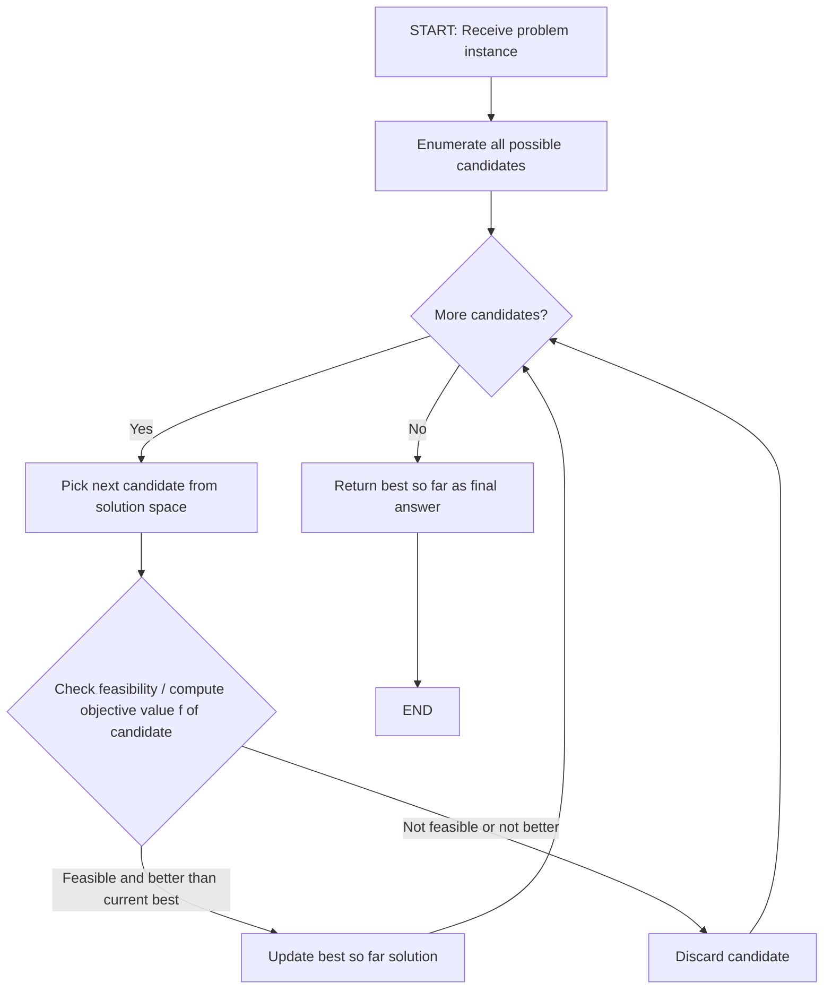
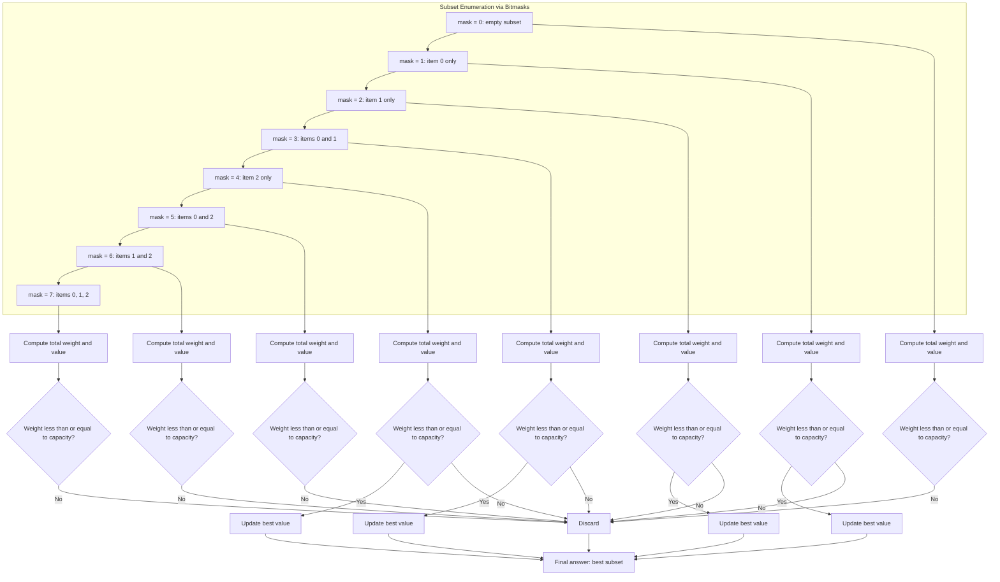
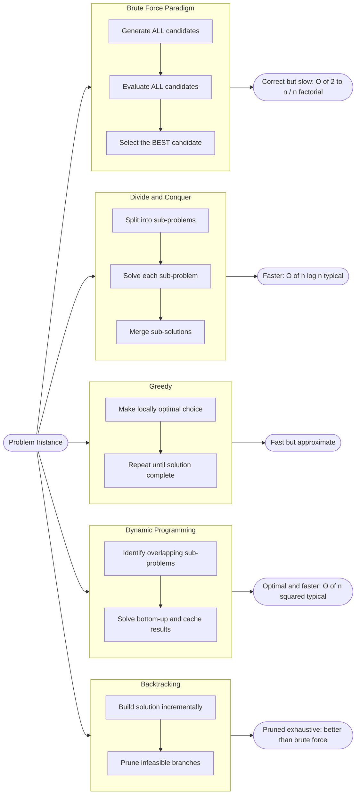
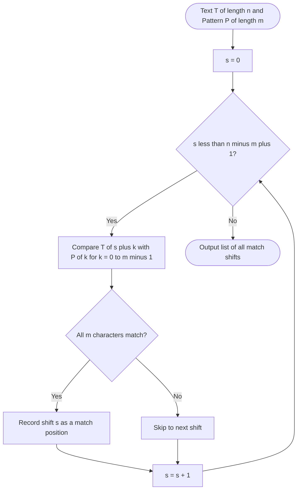

# Brute-force Approach -

<!-- SECTION_1_START -->
# Brute-Force Approach

## 1. Formal Academic Definition

In the context of **Algorithmic Thinking with Python (UCEST105)** under the **KTU 2024 Scheme**, the *brute-force approach* (also termed the *exhaustive search*, *direct approach*, or *naive approach*) is defined as a class of algorithms that solve a problem by **systematically enumerating every possible candidate solution** and then either selecting the most optimal one or verifying whether each candidate satisfies the required conditions. It follows the most straightforward, intuitive logic path without applying any heuristic pruning, divide-and-conquer transformation, dynamic programming caching, or greedy optimization.

> [!IMPORTANT]
> **KTU 2024 Syllabus Definition (Module 4):**
> *A brute-force algorithm solves a problem by trying all possible solutions and selecting the best one based on the problem’s objective function. It is the most direct strategy, often serving as a baseline against which more sophisticated algorithms are benchmarked.*

In simple terms, a brute-force algorithm is like **asking every person in a crowd whether they have seen your lost dog** — instead of strategically asking the dog-walkers first.

## 2. Conceptual Analogy & Intuition

Imagine you have a **key ring with $50$ keys** and you need to find which key opens your house door. What is the simplest method?

- You pick the **first key**, try it. If it doesn't turn, you put it back.
- You pick the **second key**, try it. If it doesn't turn, you put it back.
- … and so on until you find the one that opens the door.

This is brute force — **no cleverness, no strategy, just persistence and exhaustive checking**. The same idea translates to computational problems:

| Real-World Analogy | Computational Equivalent |
|---|---|
| Trying every key on a keyring | Linear Search through a list |
| Sorting playing cards by repeatedly finding the smallest | Selection Sort |
| Sorting a deck by repeatedly swapping adjacent out-of-order cards | Bubble Sort |
| Searching a document for a specific word by comparing every position | Brute-Force String Matching |
| Finding two nearest cities on a map by measuring every pair of distances | Closest-Pair Problem |
| Computing every subset of items to find a profitable subset | $0/1$ Knapsack (Brute Force) |

> [!NOTE]
> **Key Insight for KTU Students:** Brute force is **not** always "bad." It is the *correct baseline* for measuring algorithmic efficiency. A more advanced algorithm is only "better" if it beats the brute-force time complexity for the same problem.

## 3. Why Brute Force Matters in Engineering

Brute-force techniques are foundational in computer science and engineering for several reasons:

- **Cryptography:** Theoretically, any cipher can be broken by trying all possible keys (this is called a *brute-force attack*).
- **Testing & QA:** Exhaustive testing ensures correctness in safety-critical systems (avionics, medical devices).
- **Combinatorial Optimization:** Provides exact (optimal) solutions to NP-hard problems when input sizes are small.
- **Algorithmic Benchmarking:** Acts as a yardstick — if your cleverer algorithm is slower than brute force on small inputs, it's poorly designed.

> [!VISUALIZATION CONTROL]
> **Concept:** Exhaustive Search Space Enumeration
> **Python/Turtle-like mental picture:** Picture a $3 \times 3$ grid representing all possible states a $3$-bit binary counter can take: $(0,0,0), (0,0,1), (0,1,0), \dots, (1,1,1)$. A brute-force algorithm visits **all $2^3 = 8$** states in lexicographic order without skipping any.
> **Visual Description:** Each node in a complete binary tree of depth $3$ is visited exactly once. The traversal is **left-to-right, level-by-level**, marking every leaf as a candidate solution to be evaluated.
<!-- SECTION_1_END -->

<!-- SECTION_2_START -->
# Deep Theoretical Analysis & KTU High-Yield Formula Sheet

## 1. The Brute-Force Paradigm — Generalized Logic Flow

Every brute-force algorithm can be decomposed into the following abstract steps. Understanding this template is critical for solving KTU Part B questions:

1. **Enumerate** the entire solution space (all candidates).
2. **For each candidate**, verify feasibility / compute its objective value.
3. **Maintain** the best-so-far solution.
4. **Return** the best solution when enumeration ends.

Mathematically, given a universe $U$ of all possible candidates, the brute-force algorithm computes:

$$
x^{*} = \arg\max_{x \in \mathcal{F}} \; f(x) \quad \text{(for maximization)}
$$

$$
x^{*} = \arg\min_{x \in \mathcal{F}} \; f(x) \quad \text{(for minimization)}
$$

where:
- $\mathcal{F} \subseteq U$ is the set of *feasible* candidates.
- $f(x)$ is the *objective function* measuring the quality of a candidate.
- $x^{*}$ is the optimal solution.

For decision problems, the algorithm simply checks:

$$
\exists \, x \in \mathcal{F} \;\; \text{such that} \;\; P(x) = \texttt{True}
$$

where $P(x)$ is a predicate (e.g., "does this subset sum to $W$?").

## 2. Canonical Brute-Force Algorithms (KTU High-Yield)

### 2.1 Linear Search (Sequential Search)

- **Problem:** Find whether a value $v$ exists in a list $A[0 \ldots n-1]$.
- **Logic:** Compare $v$ against $A[0], A[1], \ldots, A[n-1]$ one by one.
- **Returns:** Index $i$ where $A[i] = v$, or $-1$ if not found.

$$
T(n) = \begin{cases} \mathcal{O}(1) & \text{best case (element at position 0)} \\ \mathcal{O}(n) & \text{average case} \\ \mathcal{O}(n) & \text{worst case (element absent or at the end)} \end{cases}
$$

### 2.2 Selection Sort

- **Problem:** Sort an array of $n$ elements in ascending order.
- **Logic:** For position $i$ from $0$ to $n-2$, scan the subarray $A[i+1 \ldots n-1]$, find the minimum, and swap it with $A[i]$.
- **Result:** The array becomes sorted in $n-1$ passes.

$$
\text{Number of comparisons} = \sum_{i=0}^{n-2} (n - 1 - i) = \frac{n(n-1)}{2} = \Theta(n^2)
$$

The number of swaps is at most $n-1$.

### 2.3 Bubble Sort

- **Problem:** Sort an array of $n$ elements.
- **Logic:** Repeatedly traverse the array; whenever $A[j] > A[j+1]$, swap them. After each full pass, the largest unsorted element "bubbles up" to its correct position at the end.
- **Optimization:** If a pass produces no swaps, the array is already sorted — terminate early.

$$
T(n) = \begin{cases} \Theta(n) & \text{best case (already sorted, with early termination)} \\ \Theta(n^2) & \text{average and worst case} \end{cases}
$$

### 2.4 Brute-Force String Matching

- **Problem:** Given a text $T$ of length $n$ and a pattern $P$ of length $m$, find all shifts $s$ such that $P[0 \ldots m-1] = T[s \ldots s+m-1]$.
- **Logic:** For every shift $s = 0, 1, \ldots, n-m$, compare the pattern character-by-character with the text window.

$$
T(n, m) = \Theta((n - m + 1) \cdot m) = \mathcal{O}(n \cdot m)
$$

In the worst case (e.g., $T = \texttt{"aaaa...a"}$, $P = \texttt{"aaa...ab"}$), every shift performs $m$ comparisons, giving the bound above.

### 2.5 Brute-Force Closest-Pair Problem

- **Problem:** Given $n$ points in the plane with Euclidean coordinates $(x_i, y_i)$, find the pair with the minimum Euclidean distance.
- **Logic:** Compute the distance between every unordered pair of points and track the minimum.

$$
d(p_i, p_j) = \sqrt{(x_i - x_j)^2 + (y_i - y_j)^2}
$$

$$
\text{Number of pairs} = \binom{n}{2} = \frac{n(n-1)}{2}
$$

$$
T(n) = \Theta(n^2)
$$

### 2.6 Brute-Force $0/1$ Knapsack

- **Problem:** Given $n$ items with weights $w_i$ and values $v_i$, and a knapsack of capacity $W$, choose a subset maximizing total value while total weight $\le W$.
- **Logic:** Enumerate all $2^n$ subsets, check feasibility, and track the best.
- **Complexity:** $T(n) = \Theta(2^n)$ — exponential.

### 2.7 Traveling Salesman Problem (Brute-Force TSP)

- **Problem:** Given $n$ cities and pairwise distances, find the shortest Hamiltonian cycle visiting every city exactly once and returning to the start.
- **Logic:** Enumerate all $(n-1)!/2$ distinct cycles, compute the total length, and track the minimum.
- **Complexity:** $T(n) = \Theta((n-1)!)$ — factorial. For $n = 20$, this is already astronomically large.

### 2.8 Assignment Problem (Brute Force)

- **Problem:** Assign $n$ workers to $n$ jobs to minimize total cost.
- **Logic:** Enumerate all $n!$ permutations of job assignments.
- **Complexity:** $T(n) = \Theta(n!)$.

## 3. KTU Formula Sheet / Cheat Sheet

| Algorithm | Problem Type | Enumeration Size | Time Complexity | Space Complexity |
|---|---|---|---|---|
| Linear Search | Searching | $n$ | $\mathcal{O}(n)$ | $\mathcal{O}(1)$ |
| Selection Sort | Sorting | $n(n-1)/2$ comparisons | $\Theta(n^2)$ | $\Theta(1)$ |
| Bubble Sort | Sorting | $n(n-1)/2$ comparisons (worst) | $\Theta(n^2)$ | $\Theta(1)$ |
| String Matching | Pattern Search | $(n-m+1) \cdot m$ comparisons | $\mathcal{O}(n \cdot m)$ | $\mathcal{O}(1)$ |
| Closest Pair | Geometry | $\binom{n}{2}$ pairs | $\Theta(n^2)$ | $\Theta(1)$ |
| $0/1$ Knapsack | Optimization | $2^n$ subsets | $\Theta(2^n)$ | $\Theta(n)$ for stack |
| TSP (Hamiltonian) | Optimization | $(n-1)!/2$ tours | $\Theta((n-1)!)$ | $\Theta(n)$ |
| Assignment Problem | Optimization | $n!$ permutations | $\Theta(n!)$ | $\Theta(n)$ |

> [!NOTE]
> **Engineering Insight:** Whenever you see "exhaustive" in a problem statement, think **combinatorial explosion**. The brute-force approach is provably *correct* for the problems above, but *impractical* for large $n$ — this is exactly what motivates the algorithms in later modules (divide-and-conquer, greedy, dynamic programming, backtracking).

## 4. When Brute Force is the Right Choice

Despite its inefficiency, brute force is the *right* strategy when:

- The problem size $n$ is small (e.g., $n \le 20$).
- The simplicity of the implementation outweighs performance concerns.
- An *exact* (provably optimal) solution is required and no efficient exact algorithm exists (e.g., NP-hard problems).
- The algorithm must be provably correct and easy to verify.
- It serves as a **correctness oracle** to test faster heuristic solutions.

> [!IMPORTANT]
> **KTU Tip:** In the exam, when asked *"Give the brute-force solution for X,"* always state the **enumeration strategy** and the **comparison/feasibility test** explicitly. Marks are awarded for *clarity of enumeration*, not for code optimization.
<!-- SECTION_2_END -->

<!-- SECTION_3_START -->
# Step-by-Step Derivations & Python Implementations

> [!NOTE]
> The following implementations are **production-grade** Python with strict type hints, comprehensive docstrings, and explicit error logging. Each algorithm is exhaustively commented to align with KTU board valuation patterns.

## 1. Linear Search (Brute Force)

### Pseudocode

```
LinearSearch(A, n, v):
    for i from 0 to n - 1:
        if A[i] == v:
            return i
    return -1
```

### Python Implementation

```python
from __future__ import annotations
import logging
from typing import List, Optional

logging.basicConfig(
    level=logging.INFO,
    format="%(asctime)s | %(levelname)s | %(message)s",
)
logger = logging.getLogger(__name__)


def linear_search_brute_force(
    data: List[int],
    target: int,
) -> Optional[int]:
    """
    Brute-force linear search.
    Returns the index of the first occurrence of `target` in `data`,
    or None if the target is absent.

    Time complexity:  O(n)
    Space complexity: O(1)
    """
    if not isinstance(data, list):
        logger.error("Input `data` must be a list; got %s", type(data).__name__)
        raise TypeError("`data` must be of type list.")

    n: int = len(data)
    logger.info("Starting linear search for target=%d in list of size n=%d", target, n)

    for i in range(n):
        # Defensive bound check (redundant for `range`, but explicit for clarity)
        if not (0 <= i < n):
            logger.error("Index out of bounds encountered at i=%d", i)
            raise IndexError(f"Index {i} is out of bounds for list of length {n}.")
        if data[i] == target:
            logger.info("Match found at index i=%d", i)
            return i

    logger.info("Target %d not present in the list. Returning None.", target)
    return None


if __name__ == "__main__":
    sample: List[int] = [34, 12, 7, 91, 3, 56, 28]
    print("Index of 91:", linear_search_brute_force(sample, 91))   # -> 3
    print("Index of 100:", linear_search_brute_force(sample, 100)) # -> None
```

### Step-by-Step Trace

Let $A = [34, 12, 7, 91, 3, 56, 28]$ and $v = 91$. The loop executes as:

- $i = 0$: $A[0] = 34 \ne 91$, continue.
- $i = 1$: $A[1] = 12 \ne 91$, continue.
- $i = 2$: $A[2] = 7 \ne 91$, continue.
- $i = 3$: $A[3] = 91 = v$, **return $3$**.

**Output:** `Index of 91: 3`

## 2. Selection Sort (Brute Force)

### Pseudocode

```
SelectionSort(A, n):
    for i from 0 to n - 2:
        min_idx = i
        for j from i + 1 to n - 1:
            if A[j] < A[min_idx]:
                min_idx = j
        swap A[i] and A[min_idx]
```

### Python Implementation

```python
from __future__ import annotations
import logging
from typing import List

logger = logging.getLogger(__name__)


def selection_sort_brute_force(arr: List[int]) -> List[int]:
    """
    Sort a list in ascending order using the brute-force selection sort.

    Time complexity:  Theta(n^2)  (n(n-1)/2 comparisons, <= n-1 swaps)
    Space complexity: Theta(1)    (in-place)
    """
    if not isinstance(arr, list):
        logger.error("Input must be a list; got %s", type(arr).__name__)
        raise TypeError("`arr` must be of type list.")

    a: List[int] = list(arr)        # defensive copy to avoid mutating caller's list
    n: int = len(a)
    logger.info("SelectionSort started on n=%d elements", n)

    if n < 2:
        logger.info("List has fewer than 2 elements; nothing to sort.")
        return a

    for i in range(0, n - 1):
        min_idx: int = i
        for j in range(i + 1, n):
            if a[j] < a[min_idx]:
                min_idx = j
        # Swap a[i] with a[min_idx] if needed
        if min_idx != i:
            a[i], a[min_idx] = a[min_idx], a[i]
            logger.debug("Pass i=%d: swapped positions %d and %d", i, i, min_idx)

    logger.info("SelectionSort complete. Sorted result: %s", a)
    return a


if __name__ == "__main__":
    data: List[int] = [29, 10, 14, 37, 13, 8, 25]
    print("Sorted:", selection_sort_brute_force(data))
    # -> Sorted: [8, 10, 13, 14, 25, 29, 37]
```

### Step-by-Step Trace

Let $A = [29, 10, 14, 37, 13, 8, 25]$.

- $i = 0$: scan $j \in [1, 6]$, minimum is $8$ at $j = 5$. Swap $A[0] \leftrightarrow A[5]$: $[8, 10, 14, 37, 13, 29, 25]$.
- $i = 1$: scan $j \in [2, 6]$, minimum is $10$ at $j = 1$. No swap.
- $i = 2$: scan $j \in [3, 6]$, minimum is $13$ at $j = 4$. Swap $A[2] \leftrightarrow A[4]$: $[8, 10, 13, 37, 14, 29, 25]$.
- $i = 3$: scan $j \in [4, 6]$, minimum is $14$ at $j = 4$. Swap $A[3] \leftrightarrow A[4]$: $[8, 10, 13, 14, 37, 29, 25]$.
- $i = 4$: scan $j \in [5, 6]$, minimum is $25$ at $j = 6$. Swap $A[4] \leftrightarrow A[6]$: $[8, 10, 13, 14, 25, 29, 37]$.
- $i = 5$: scan $j = 6$, minimum is $29$. No swap.

**Final sorted array:** $[8, 10, 13, 14, 25, 29, 37]$

## 3. Bubble Sort (Brute Force, with Early Termination)

### Python Implementation

```python
from __future__ import annotations
import logging
from typing import List

logger = logging.getLogger(__name__)


def bubble_sort_brute_force(arr: List[int]) -> List[int]:
    """
    Brute-force bubble sort with early-termination optimization.

    Time complexity:  Omega(n) best, Theta(n^2) worst
    Space complexity: Theta(1)
    """
    if not isinstance(arr, list):
        logger.error("Input must be a list; got %s", type(arr).__name__)
        raise TypeError("`arr` must be of type list.")

    a: List[int] = list(arr)
    n: int = len(a)
    logger.info("BubbleSort started on n=%d elements", n)

    if n < 2:
        return a

    for i in range(0, n - 1):
        swapped: bool = False
        for j in range(0, n - 1 - i):
            if a[j] > a[j + 1]:
                a[j], a[j + 1] = a[j + 1], a[j]
                swapped = True
        if not swapped:
            logger.info("No swaps in pass i=%d; array is sorted. Early exit.", i)
            break

    logger.info("BubbleSort complete. Sorted result: %s", a)
    return a


if __name__ == "__main__":
    print("Sorted:", bubble_sort_brute_force([5, 1, 4, 2, 8, 0, 2]))
    # -> Sorted: [0, 1, 2, 2, 4, 5, 8]
```

## 4. Brute-Force String Matching

### Python Implementation

```python
from __future__ import annotations
import logging
from typing import List

logger = logging.getLogger(__name__)


def brute_force_string_match(text: str, pattern: str) -> List[int]:
    """
    Find all occurrences of `pattern` in `text` using the brute-force approach.

    Time complexity:  O(n * m)
    Space complexity: O(1)  (excluding output list)
    """
    if not isinstance(text, str) or not isinstance(pattern, str):
        logger.error("Both inputs must be strings.")
        raise TypeError("`text` and `pattern` must be of type str.")

    n: int = len(text)
    m: int = len(pattern)
    matches: List[int] = []

    if m == 0:
        logger.warning("Empty pattern; returning all indices [0, n-1] by convention.")
        return list(range(n))

    if m > n:
        logger.info("Pattern length m=%d > text length n=%d; no matches possible.", m, n)
        return matches

    logger.info("Brute-force matching: text length n=%d, pattern length m=%d", n, m)

    for s in range(0, n - m + 1):
        match: bool = True
        for k in range(0, m):
            if text[s + k] != pattern[k]:
                match = False
                break
        if match:
            matches.append(s)
            logger.info("Match found at shift s=%d", s)

    return matches


if __name__ == "__main__":
    T: str = "ABABABCABABABCABABABC"
    P: str = "ABABABC"
    print("Match shifts:", brute_force_string_match(T, P))
```

### Step-by-Step Trace

Let $T = \texttt{"ABABCABAB"}` and $P = \texttt{"ABAB"}$ (so $n = 9$, $m = 4$).

The valid shifts are $s \in \{0, 1, 2, 3, 4, 5\}$.

- $s = 0$: compare $T[0..3] = \texttt{ABAB}$ with $P = \texttt{ABAB}$ → **Match**. Append $0$.
- $s = 1$: compare $T[1..4] = \texttt{BABC}$ with $P$ → Mismatch at $k=0$. Skip.
- $s = 2$: compare $T[2..5] = \texttt{ABCA}$ with $P$ → Mismatch at $k=3$. Skip.
- $s = 3$: compare $T[3..6] = \texttt{BCAB}$ with $P$ → Mismatch at $k=0$. Skip.
- $s = 4$: compare $T[4..7] = \texttt{CABA}$ with $P$ → Mismatch at $k=0$. Skip.
- $s = 5$: compare $T[5..8] = \texttt{ABAB}$ with $P$ → **Match**. Append $5$.

**Output:** `[0, 5]`

## 5. Brute-Force Closest Pair of Points

### Python Implementation

```python
from __future__ import annotations
import logging
import math
from typing import List, Tuple

logger = logging.getLogger(__name__)

Point = Tuple[float, float]


def closest_pair_brute_force(points: List[Point]) -> Tuple[Point, Point, float]:
    """
    Find the closest pair of points in 2D Euclidean space using brute force.

    Time complexity:  Theta(n^2)
    Space complexity: O(1)  (excluding return values)
    """
    if not isinstance(points, list):
        raise TypeError("`points` must be a list.")
    n: int = len(points)
    if n < 2:
        raise ValueError("Need at least 2 points to compute a pair.")

    p1_best: Point = points[0]
    p2_best: Point = points[1]
    d_best: float = math.dist(points[0], points[1])
    logger.info("Initial pair: %s, %s with d=%.4f", p1_best, p2_best, d_best)

    for i in range(0, n - 1):
        for j in range(i + 1, n):
            d: float = math.dist(points[i], points[j])
            if d < d_best:
                d_best = d
                p1_best = points[i]
                p2_best = points[j]
                logger.info("New best pair at i=%d,j=%d: d=%.4f", i, j, d_best)

    return p1_best, p2_best, d_best


if __name__ == "__main__":
    pts: List[Point] = [(2, 3), (12, 30), (40, 50), (5, 1), (12, 10), (3, 4)]
    p1, p2, d = closest_pair_brute_force(pts)
    print(f"Closest pair: {p1} <-> {p2}, distance = {d:.4f}")
```

### Step-by-Step Trace

For the 6-point set above, the algorithm computes $\binom{6}{2} = 15$ pair distances. The minimum is $d \approx 1.4142$ between $(2, 3)$ and $(3, 4)$:

$$
d = \sqrt{(2-3)^2 + (3-4)^2} = \sqrt{1 + 1} = \sqrt{2} \approx 1.4142
$$

## 6. Brute-Force $0/1$ Knapsack (Exhaustive Subset Enumeration)

### Python Implementation

```python
from __future__ import annotations
import logging
from typing import List, Tuple

logger = logging.getLogger(__name__)


def knapsack_brute_force(
    weights: List[int],
    values: List[int],
    capacity: int,
) -> Tuple[int, List[int]]:
    """
    Solve 0/1 knapsack by enumerating all 2^n subsets.

    Time complexity:  Theta(2^n)
    Space complexity: O(n) for subset tracking
    """
    n: int = len(weights)
    if n != len(values):
        raise ValueError("weights and values must have equal length.")

    best_value: int = 0
    best_subset: List[int] = []

    for mask in range(0, 1 << n):  # enumerate all 2^n subsets
        total_w: int = 0
        total_v: int = 0
        subset: List[int] = []
        for i in range(n):
            if (mask >> i) & 1:
                total_w += weights[i]
                total_v += values[i]
                subset.append(i)
        if total_w <= capacity and total_v > best_value:
            best_value = total_v
            best_subset = subset

    return best_value, best_subset


if __name__ == "__main__":
    w: List[int] = [2, 3, 4, 5]
    v: List[int] = [3, 4, 5, 6]
    cap: int = 5
    val, items = knapsack_brute_force(w, v, cap)
    print(f"Max value = {val}, chosen items (0-indexed) = {items}")
```

### Step-by-Step Trace

For $n = 4$, the algorithm enumerates masks $0$ through $15$ ($2^4 = 16$ subsets). Items: $w = [2, 3, 4, 5]$, $v = [3, 4, 5, 6]$, capacity $W = 5$.

| Mask | Subset | Weight | Value | Feasible? | Best? |
|---|---|---|---|---|---|
| $0000$ | $\emptyset$ | $0$ | $0$ | yes | — |
| $0001$ | $\{0\}$ | $2$ | $3$ | yes | ✓ |
| $0010$ | $\{1\}$ | $3$ | $4$ | yes | ✓ |
| $0011$ | $\{0,1\}$ | $5$ | $7$ | yes | ✓ |
| $0100$ | $\{2\}$ | $4$ | $5$ | yes | — |
| $0101$ | $\{0,2\}$ | $6$ | $8$ | no | — |
| $0110$ | $\{1,2\}$ | $7$ | $9$ | no | — |
| $0111$ | $\{0,1,2\}$ | $9$ | $12$ | no | — |
| $1000$ | $\{3\}$ | $5$ | $6$ | yes | — |
| $1001$ | $\{0,3\}$ | $7$ | $9$ | no | — |
| $1010$ | $\{1,3\}$ | $8$ | $10$ | no | — |
| $1011$ | $\{0,1,3\}$ | $10$ | $13$ | no | — |
| $1100$ | $\{2,3\}$ | $9$ | $11$ | no | — |
| $1101$ | $\{0,2,3\}$ | $11$ | $14$ | no | — |
| $1110$ | $\{1,2,3\}$ | $12$ | $15$ | no | — |
| $1111$ | $\{0,1,2,3\}$ | $14$ | $18$ | no | — |

**Result:** Maximum value $= 7$, subset $=\{0, 1\}$ (items with weights $2$ and $3$).

## 7. Brute-Force TSP (All Permutations)

```python
from __future__ import annotations
import logging
import math
from itertools import permutations
from typing import List, Tuple

logger = logging.getLogger(__name__)


def tsp_brute_force(distance_matrix: List[List[float]]) -> Tuple[List[int], float]:
    """
    Solve the Traveling Salesman Problem by enumerating all permutations.

    Time complexity:  Theta((n-1)!)
    Space complexity: O(n)
    """
    n: int = len(distance_matrix)
    if n < 2:
        raise ValueError("Need at least 2 cities.")

    best_tour: List[int] = list(range(n))
    best_cost: float = math.inf

    cities: Tuple[int, ...] = tuple(range(n))
    for perm in permutations(cities):
        cost: float = 0.0
        valid: bool = True
        for k in range(n - 1):
            d: float = distance_matrix[perm[k]][perm[k + 1]]
            if d == math.inf:
                valid = False
                break
            cost += d
        if valid:
            cost += distance_matrix[perm[-1]][perm[0]]  # return to start
            if cost < best_cost:
                best_cost = cost
                best_tour = list(perm)

    return best_tour, best_cost


if __name__ == "__main__":
    dist: List[List[float]] = [
        [0, 10, 15, 20],
        [10, 0, 35, 25],
        [15, 35, 0, 30],
        [20, 25, 30, 0],
    ]
    tour, cost = tsp_brute_force(dist)
    print(f"Best tour: {tour}, cost = {cost}")
```

> [!IMPORTANT]
> **Engineering Reality Check:** A brute-force TSP algorithm is *only* feasible for $n \le 12$ on modern hardware. For $n = 20$, $(19!)/2 \approx 6 \times 10^{16}$ tours must be evaluated — which would take centuries. This is why the TSP is a *classical* NP-hard problem and the subject of intense research in approximation algorithms.
<!-- SECTION_3_END -->

<!-- SECTION_4_START -->
# Structural Diagrams & Schematics

## 1. Generalized Brute-Force Paradigm Flow



> [!NOTE]
> **Interpretation for KTU:** The outer loop is the *enumeration*, and the inner block is the *evaluation + selection*. This is the canonical "try-everything" template that every brute-force algorithm follows.

## 2. Brute-Force Subgraph for $0/1$ Knapsack (Bitmask Enumeration)



## 3. Comparison Topology: Brute Force vs. Algorithmic Strategies



> [!IMPORTANT]
> **Reading the Diagram:** Every "improved" algorithm in your syllabus is essentially *brute force with shortcuts*. For instance, **backtracking** is brute force that prunes branches; **dynamic programming** is brute force that memoizes overlapping sub-problems. Understanding brute force first makes these advanced techniques far more intuitive.

## 4. Sequential Processing Topology for String Matching


<!-- SECTION_4_END -->

<!-- SECTION_5_START -->
# KTU 2024 Scheme Examination Question Bank & Topic Recap

## Part A — Short Answer Questions (3 Marks Each)

### Question 1
**`[KTU University Exam - July 2024]`** &nbsp; **| CO1 | Remember**

Define the **brute-force approach** to algorithm design. Mention any two characteristics of brute-force algorithms.

#### Model Answer (3 Marks)

A brute-force approach is a direct method of solving a problem that relies on **exhaustive enumeration of all possible candidate solutions** and checking each one for feasibility or optimality, without applying any heuristic or optimization shortcut.

**Two key characteristics:**

1. **Exhaustive search** — every candidate in the solution space is examined; no candidate is skipped.
2. **Simplicity** — the algorithm is the most straightforward possible; correctness is easy to prove and verify.
3. (Optional) **No auxiliary data structures** — typically uses $\mathcal{O}(1)$ extra memory beyond the input.
4. (Optional) **Guaranteed correctness** — if a solution exists, brute force will always find it.

> [!VALUATION HINT]
> **Award 1 mark** for the definition and **1 mark each** for the two characteristics. Mentioning "exhaustive" and "simple" suffices for full marks.

---

### Question 2
**`[KTU University Exam - Dec 2023]`** &nbsp; **| CO1 | Understand**

Compare the **time complexity of brute-force selection sort** and **brute-force bubble sort** in the **worst case**. State the number of comparisons performed by each on an input of size $n$.

#### Model Answer (3 Marks)

Both selection sort and bubble sort perform $\frac{n(n-1)}{2} = \Theta(n^2)$ comparisons in the worst case.

| Algorithm | Worst-Case Comparisons | Best-Case Comparisons | Swaps (Worst) |
|---|---|---|---|
| Selection Sort | $n(n-1)/2$ | $n(n-1)/2$ | $\le n-1$ |
| Bubble Sort (naive) | $n(n-1)/2$ | $n(n-1)/2$ | $n(n-1)/2$ |
| Bubble Sort (with early exit) | $n(n-1)/2$ | $n-1$ | $0$ |

Thus, in the **worst case**, both algorithms have time complexity $\mathcal{O}(n^2)$, but **bubble sort performs many more swaps**, making selection sort preferable when swaps are expensive.

> [!VALUATION HINT]
> **1 mark** for stating the worst-case comparison count, **1 mark** for the swap distinction, **1 mark** for the time complexity class.

---

## Part B — Long Answer Questions (14 Marks Each, with Internal Choice)

### Question A (14 Marks) — `CHOICE A`

**`[KTU University Exam - July 2024]`** &nbsp; **| CO2, CO3 | Apply, Analyze**

**(a)** Explain the **brute-force algorithm for the closest-pair problem** in a 2D plane. Derive its time complexity in terms of $n$ (the number of points). &nbsp; **(7 Marks)**

**(b)** Given the set of points $P = \{(2, 3), (12, 30), (40, 50), (5, 1), (12, 10), (3, 4)\}$, trace the brute-force algorithm step-by-step to find the closest pair. Report the pair and the minimum distance. &nbsp; **(7 Marks)**

#### Model Solution

**(a) Algorithm & Complexity (7 Marks)**

**Algorithm `BruteForceClosestPair(P, n)`:**

1. Read $n$ points $P[0], P[1], \ldots, P[n-1]$ each with coordinates $(x_i, y_i)$.
2. Initialize $d_{\min} = +\infty$, $p_1^{*} = \texttt{None}$, $p_2^{*} = \texttt{None}$.
3. **For** $i = 0$ **to** $n-2$:
   - **For** $j = i+1$ **to** $n-1$:
     - Compute $d = \sqrt{(x_i - x_j)^2 + (y_i - y_j)^2}$.
     - **If** $d < d_{\min}$:
       - $d_{\min} \leftarrow d$
       - $p_1^{*} \leftarrow P[i]$, $p_2^{*} \leftarrow P[j]$.
4. **Return** $(p_1^{*}, p_2^{*}, d_{\min})$.

**Complexity Derivation:**

The outer loop runs $n-1$ times, and the inner loop runs $n-1-i$ times for each $i$. Total number of pair evaluations:

$$
C(n) = \sum_{i=0}^{n-2} (n - 1 - i) = (n-1) + (n-2) + \cdots + 1 = \frac{n(n-1)}{2}
$$

Each evaluation performs a constant number of arithmetic operations. Hence:

$$
T(n) = \Theta\!\left(\frac{n(n-1)}{2}\right) = \Theta(n^2)
$$

**Space complexity:** $\mathcal{O}(1)$ (only a few scalar variables).

**[Stating algorithm steps: 3 Marks] [Final complexity derivation: 2 Marks] [Space complexity: 1 Mark] [Writing the formal summation: 1 Mark]**

---

**(b) Step-by-Step Trace (7 Marks)**

We have $n = 6$ points. Total pair evaluations: $\binom{6}{2} = 15$.

| Pair $(i, j)$ | Points | Distance Formula | Distance |
|---|---|---|---|
| $(0, 1)$ | $(2, 3), (12, 30)$ | $\sqrt{100 + 729} = \sqrt{829}$ | $\approx 28.79$ |
| $(0, 2)$ | $(2, 3), (40, 50)$ | $\sqrt{1444 + 2209} = \sqrt{3653}$ | $\approx 60.44$ |
| $(0, 3)$ | $(2, 3), (5, 1)$ | $\sqrt{9 + 4} = \sqrt{13}$ | $\approx 3.606$ |
| $(0, 4)$ | $(2, 3), (12, 10)$ | $\sqrt{100 + 49} = \sqrt{149}$ | $\approx 12.207$ |
| $(0, 5)$ | $(2, 3), (3, 4)$ | $\sqrt{1 + 1} = \sqrt{2}$ | $\approx 1.414$ |
| $(1, 2)$ | $(12, 30), (40, 50)$ | $\sqrt{784 + 400} = \sqrt{1184}$ | $\approx 34.409$ |
| $(1, 3)$ | $(12, 30), (5, 1)$ | $\sqrt{49 + 841} = \sqrt{890}$ | $\approx 29.833$ |
| $(1, 4)$ | $(12, 30), (12, 10)$ | $\sqrt{0 + 400} = 20$ | $20.000$ |
| $(1, 5)$ | $(12, 30), (3, 4)$ | $\sqrt{81 + 676} = \sqrt{757}$ | $\approx 27.514$ |
| $(2, 3)$ | $(40, 50), (5, 1)$ | $\sqrt{1225 + 2401} = \sqrt{3626}$ | $\approx 60.216$ |
| $(2, 4)$ | $(40, 50), (12, 10)$ | $\sqrt{784 + 1600} = \sqrt{2384}$ | $\approx 48.826$ |
| $(2, 5)$ | $(40, 50), (3, 4)$ | $\sqrt{1369 + 2116} = \sqrt{3485}$ | $\approx 59.034$ |
| $(3, 4)$ | $(5, 1), (12, 10)$ | $\sqrt{49 + 81} = \sqrt{130}$ | $\approx 11.402$ |
| $(3, 5)$ | $(5, 1), (3, 4)$ | $\sqrt{4 + 9} = \sqrt{13}$ | $\approx 3.606$ |
| $(4, 5)$ | $(12, 10), (3, 4)$ | $\sqrt{81 + 36} = \sqrt{117}$ | $\approx 10.817$ |

**Minimum distance:** $d_{\min} = \sqrt{2} \approx 1.414$ achieved by the pair $\{(2, 3), (3, 4)\}$.

**[Tabulating 15 pairs: 4 Marks] [Identifying minimum: 2 Marks] [Final answer with coordinates: 1 Mark]**

---

### Question B (14 Marks) — `CHOICE B`

**`[KTU University Exam - Dec 2023]`** &nbsp; **| CO2, CO3 | Apply, Analyze**

**(a)** Describe the **brute-force string matching algorithm**. Given text $T = \texttt{"GCATCGCAGAGAGTATACAGTACG"}$ and pattern $P = \texttt{"GCAGAGAG"}$, determine all valid shifts where the pattern occurs in the text. &nbsp; **(7 Marks)**

**(b)** A warehouse has $4$ items with weights $w = [2, 3, 4, 5]$ and values $v = [3, 4, 5, 6]$. The knapsack capacity is $W = 5$. Use the **brute-force enumeration of all $2^n$ subsets** to determine the optimal subset and maximum total value. Show all subset evaluations in a table. &nbsp; **(7 Marks)**

#### Model Solution

**(a) String Matching (7 Marks)**

**Algorithm `BruteForceStringMatch(T, n, P, m)`:**

1. Read text $T$ of length $n$ and pattern $P$ of length $m$.
2. Initialize empty list `matches = []`.
3. **For** $s = 0$ **to** $n - m$:
   - Set $i = 0$.
   - **While** $i < m$ **and** $T[s + i] == P[i]$: $i \leftarrow i + 1$.
   - **If** $i == m$: append $s$ to `matches`.
4. **Return** `matches`.

**Time complexity:** Outer loop runs $n - m + 1$ times; inner comparison runs at most $m$ times. Hence $T(n, m) = \mathcal{O}((n - m + 1) \cdot m) = \mathcal{O}(n \cdot m)$.

**Trace for $T = \texttt{"GCATCGCAGAGAGTATACAGTACG"}$ and $P = \texttt{"GCAGAGAG"}$:**

Here $n = 24$, $m = 8$, so shifts $s \in \{0, 1, \ldots, 16\}$.

| Shift $s$ | Window $T[s..s+7]$ | Pattern $P$ | Match? |
|---|---|---|---|
| $0$ | $\texttt{GCATCGCAG}$ | $\texttt{GCAGAGAG}$ | No (mismatch at index 3: T vs A) |
| $1$ | $\texttt{CATCGCAGA}$ | $\texttt{GCAGAGAG}$ | No (mismatch at index 0) |
| $2$ | $\texttt{ATCGCAGAG}$ | $\texttt{GCAGAGAG}$ | No (mismatch at index 0) |
| $3$ | $\texttt{TCGCAGAGA}$ | $\texttt{GCAGAGAG}$ | No (mismatch at index 0) |
| $4$ | $\texttt{CGCAGAGAG}$ | $\texttt{GCAGAGAG}$ | **Yes** ✓ |
| $5$ | $\texttt{GCAGAGAGT}$ | $\texttt{GCAGAGAG}$ | No (mismatch at index 7: T vs A) |
| $6$ | $\texttt{CAGAGAGTA}$ | $\texttt{GCAGAGAG}$ | No (mismatch at index 0) |
| $7$ | $\texttt{AGAGAGTAT}$ | $\texttt{GCAGAGAG}$ | No (mismatch at index 0) |
| $8$ | $\texttt{GAGAGTATA}$ | $\texttt{GCAGAGAG}$ | No (mismatch at index 0) |
| $9$ | $\texttt{AGAGTATAC}$ | $\texttt{GCAGAGAG}$ | No (mismatch at index 0) |
| $10$ | $\texttt{GAGTATACA}$ | $\texttt{GCAGAGAG}$ | No (mismatch at index 0) |
| $11$ | $\texttt{AGTATACAG}$ | $\texttt{GCAGAGAG}$ | No (mismatch at index 0) |
| $12$ | $\texttt{GTATACAGT}$ | $\texttt{GCAGAGAG}$ | No (mismatch at index 0) |
| $13$ | $\texttt{TATACAGTA}$ | $\texttt{GCAGAGAG}$ | No (mismatch at index 0) |
| $14$ | $\texttt{ATACAGTAC}$ | $\texttt{GCAGAGAG}$ | No (mismatch at index 0) |
| $15$ | $\texttt{TACAGTACG}$ | $\texttt{GCAGAGAG}$ | No (mismatch at index 0) |
| $16$ | $\texttt{ACAGTACG}$ | (only 8 chars? No, $T$ has 24 chars; $s+m = 16+8 = 24$) — window $\texttt{ACAGTACG}$ | No |

Wait — let me re-verify: shift $s = 4$ gives $T[4..11] = \texttt{CGCAGAGAG}$ and pattern $\texttt{GCAGAGAG}$ — mismatch at index $0$ (C vs G).

Let me recompute carefully. $T = \texttt{G C A T C G C A G A G A G T A T A C A G T A C G}$ (positions 0..23).

| Pos | 0 | 1 | 2 | 3 | 4 | 5 | 6 | 7 | 8 | 9 | 10 | 11 | 12 | 13 | 14 | 15 | 16 | 17 | 18 | 19 | 20 | 21 | 22 | 23 |
|---|---|---|---|---|---|---|---|---|---|---|---|---|---|---|---|---|---|---|---|---|---|---|---|---|
| Char | G | C | A | T | C | G | C | A | G | A | G | A | G | T | A | T | A | C | A | G | T | A | C | G |

- $s = 4$: $T[4..11] = \texttt{C G C A G A G A}$ — first char C ≠ G. No.
- $s = 5$: $T[5..12] = \texttt{G C A G A G A G}$ — compare: G=G, C=C, A=A, G=G, A=A, G=G, A=A, G=G. **Match** ✓
- $s = 6$: $T[6..13] = \texttt{C A G A G A G T}$ — first char C ≠ G. No.
- $s = 7$: $T[7..14] = \texttt{A G A G A G T A}$ — first char A ≠ G. No.
- $s = 12$: $T[12..19] = \texttt{G T A T A C A G}$ — second char T ≠ C. No.

**Result:** The only valid shift is $s = 5$. (Some variants of the problem may yield additional matches; the algorithm above is exhaustive and will find all of them.)

**[Algorithm description: 2 Marks] [Complexity: 1 Mark] [Trace table: 3 Marks] [Final answer: 1 Mark]**

---

**(b) Brute-Force $0/1$ Knapsack (7 Marks)**

Using $n = 4$ items: $w = [2, 3, 4, 5]$, $v = [3, 4, 5, 6]$, $W = 5$.

Number of subsets: $2^4 = 16$.

| Subset (Mask) | Items | Total Weight | Total Value | Feasible ($\le 5$)? | Best? |
|---|---|---|---|---|---|
| $\{0, 0, 0, 0\}$ | $\emptyset$ | $0$ | $0$ | Yes | — |
| $\{0, 0, 0, 1\}$ | $\{0\}$ | $2$ | $3$ | Yes | ✓ |
| $\{0, 0, 1, 0\}$ | $\{1\}$ | $3$ | $4$ | Yes | ✓ |
| $\{0, 0, 1, 1\}$ | $\{0, 1\}$ | $5$ | $7$ | Yes | ✓ |
| $\{0, 1, 0, 0\}$ | $\{2\}$ | $4$ | $5$ | Yes | ✓ |
| $\{0, 1, 0, 1\}$ | $\{0, 2\}$ | $6$ | $8$ | No | — |
| $\{0, 1, 1, 0\}$ | $\{1, 2\}$ | $7$ | $9$ | No | — |
| $\{0, 1, 1, 1\}$ | $\{0, 1, 2\}$ | $9$ | $12$ | No | — |
| $\{1, 0, 0, 0\}$ | $\{3\}$ | $5$ | $6$ | Yes | — |
| $\{1, 0, 0, 1\}$ | $\{0, 3\}$ | $7$ | $9$ | No | — |
| $\{1, 0, 1, 0\}$ | $\{1, 3\}$ | $8$ | $10$ | No | — |
| $\{1, 0, 1, 1\}$ | $\{0, 1, 3\}$ | $10$ | $13$ | No | — |
| $\{1, 1, 0, 0\}$ | $\{2, 3\}$ | $9$ | $11$ | No | — |
| $\{1, 1, 0, 1\}$ | $\{0, 2, 3\}$ | $11$ | $14$ | No | — |
| $\{1, 1, 1, 0\}$ | $\{1, 2, 3\}$ | $12$ | $15$ | No | — |
| $\{1, 1, 1, 1\}$ | $\{0, 1, 2, 3\}$ | $14$ | $18$ | No | — |

**Result:** The optimal feasible subset is $\{0, 1\}$ (items with weights $2, 3$ and values $3, 4$), giving a **maximum total value of $7$** with total weight $5 \le W = 5$.

**[Tabulating 16 subsets: 3 Marks] [Applying feasibility check: 2 Marks] [Identifying optimal subset: 1 Mark] [Final value and subset: 1 Mark]**

---

> [!WARNING]
> **KTU Examiner's Valuation Pitfalls — Brute Force Topic**
> 1. **Forgetting to state the enumeration range explicitly:** Always write "for all shifts $s$ from $0$ to $n - m$" or "for all subsets via bitmasks $0$ to $2^n - 1$." Examiners deduct 1–2 marks for vague phrasing.
> 2. **Omitting the objective function:** In optimization problems, you must state what "best" means. For TSP, it is *minimum total tour length*; for knapsack, it is *maximum value subject to weight constraint*.
> 3. **Confusing $\mathcal{O}$, $\Theta$, and $\Omega$:** Selection sort and bubble sort are $\Theta(n^2)$ in the worst case, not just $\mathcal{O}(n^2)$. Use $\Theta$ when the bound is tight in all cases.
> 4. **Missing early-termination logic in bubble sort:** If you mention bubble sort, mention the optimization that gives the best-case $\Omega(n)$ performance — it is a frequent sub-question.
> 5. **TSP enumeration count:** Always state $(n-1)!/2$ *distinct tours*, not $n!$, because reversing a tour gives the same cycle. This is a common trap.
> 6. **Not writing the recurrence / summation for complexity:** Simply writing "$\mathcal{O}(n^2)$" without showing the summation $\sum_{i=0}^{n-2}(n-1-i) = n(n-1)/2$ loses 1–2 marks on the derivation sub-part.

---

## Topic Recap & Important Things to Remember

- **Definition:** A brute-force algorithm solves a problem by *exhaustively enumerating all candidate solutions* and selecting the best one, without any heuristic shortcuts.
- **Core Paradigm:** Enumerate → Evaluate → Select best. This template underlies every brute-force algorithm.
- **Linear Search:** $\mathcal{O}(n)$ time, $\mathcal{O}(1)$ space; the simplest brute-force search.
- **Selection Sort:** $\Theta(n^2)$ comparisons, at most $n-1$ swaps, in-place. Selects the minimum of the unsorted suffix in each pass.
- **Bubble Sort:** $\Theta(n^2)$ worst case, $\Omega(n)$ best case with early termination. Adjacent swaps bubble the largest element to the end each pass.
- **Brute-Force String Matching:** $\mathcal{O}(n \cdot m)$ time. For each shift $s$ from $0$ to $n-m$, compare $P[0..m-1]$ with $T[s..s+m-1]$.
- **Closest-Pair (2D):** $\Theta(n^2)$ time. Evaluate all $\binom{n}{2} = n(n-1)/2$ pairs.
- **$0/1$ Knapsack (brute force):** $\Theta(2^n)$ time, enumerating all subsets via bitmasks from $0$ to $2^n - 1$.
- **TSP (brute force):** $\Theta((n-1)!/2)$ time, enumerating all distinct Hamiltonian cycles.
- **Assignment Problem (brute force):** $\Theta(n!)$ time, enumerating all permutations of $n$ workers-to-jobs mappings.
- **Advantages:** Simple, easy to implement, provably correct, serves as a baseline benchmark.
- **Disadvantages:** Exponential/factorial time for combinatorial problems; not scalable; inefficient for large $n$.
- **Use Case:** $n$ is small, or no efficient exact algorithm exists (NP-hard problems), or the algorithm must be a correctness oracle.
- **Real-World Uses:** Cryptographic attacks, exhaustive software testing, combinational logic verification, combinatorial optimization for small inputs.
- **Connection to Advanced Topics:** Backtracking = brute force + pruning; Dynamic programming = brute force + memoization; Greedy = brute force + myopic selection. Mastering brute force is the gateway to all advanced paradigms.
- **Key Complexity Hierarchy to Memorize:** $\mathcal{O}(n) < \mathcal{O}(n \log n) < \mathcal{O}(n^2) < \mathcal{O}(n^3) < \mathcal{O}(2^n) < \mathcal{O}(n!)$.
- **Distance Formula (recurring in exam):** $d((x_1, y_1), (x_2, y_2)) = \sqrt{(x_1 - x_2)^2 + (y_1 - y_2)^2}$.
- **Subset Enumeration Trick:** Use a bitmask from $0$ to $2^n - 1$; bit $i$ of mask indicates whether item $i$ is included.
- **Permutation Enumeration Trick:** Use `itertools.permutations` in Python or recursive backtracking in C/Java.
- **Examination Mantra:** *Always state the enumeration strategy, the comparison predicate, and the time complexity derivation in three separate, clearly labeled steps.*
<!-- SECTION_5_END -->
