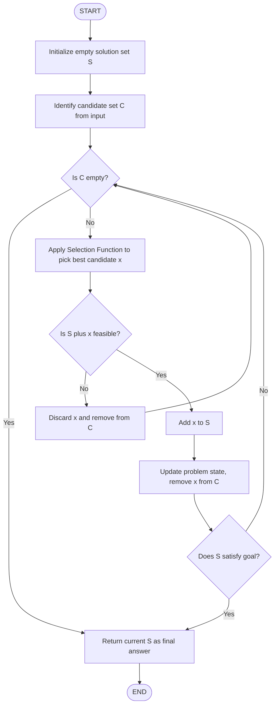
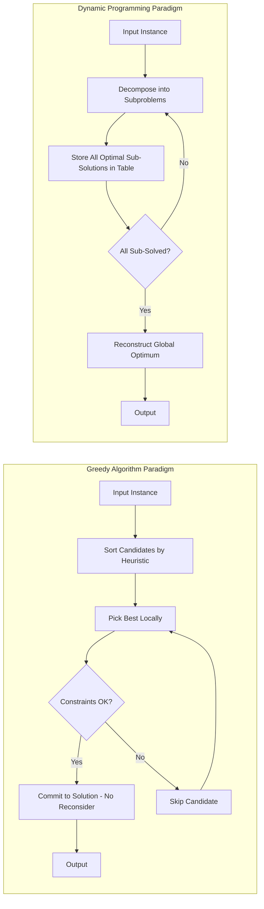
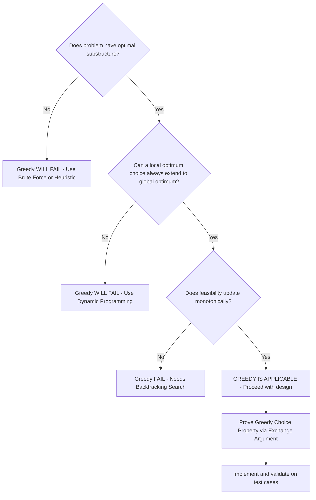

# - Characteristics of the Greedy Algorithm

<!-- SECTION_1_START -->
# Characteristics of the Greedy Algorithm

> [!NOTE]
> **KTU 2024 Scheme | UCEST105 — Algorithmic Thinking with Python | Module 4**
> *Mapped CO: CO2 — Design algorithms using computational approaches to solve real-world problems.*
> *Bloom's Level: Understand → Apply*

## 1.1 Formal Definition

A **Greedy Algorithm** is an algorithmic paradigm that builds up a solution **piece by piece**, always choosing the next piece that offers the **most obvious and immediate benefit** (the locally optimal choice) at each step, with the hope that these local optima will lead to a **globally optimal solution**.

In formal KTU terminology, the greedy strategy is defined by two essential mathematical properties:

$$
\begin{aligned}
\text{Greedy Choice Property} &: \; \text{A globally optimal solution can be reached by repeatedly making} \\
& \text{locally optimal (greedy) choices.} \\
\text{Optimal Substructure} &: \; \text{An optimal solution to the whole problem contains within it} \\
& \text{optimal solutions to its sub-problems.}
\end{aligned}
$$

> [!IMPORTANT]
> **Syllabus Highlight (Module 4)**
> Under the KTU 2024 scheme, *Greedy Algorithms* are studied alongside **Divide & Conquer** and **Dynamic Programming** as the three principal paradigms of *Computational Approaches to Problem Solving*. The emphasis is on understanding the **characteristics**, **applicability conditions**, and **limitations** of the greedy approach.

## 1.2 Intuitive Analogy — The Ripest Fruit Basket 🍎

Imagine you are standing in a fruit market and need to fill a basket with the **heaviest, ripest fruits** to maximize weight.

| Step | Your Action | Greedy Equivalent |
| :--- | :--- | :--- |
| 1 | Look at all available fruits on display. | Inspect candidate set of choices. |
| 2 | Pick the **single best** fruit at this instant. | Make the locally optimal choice. |
| 3 | Place it in the basket; do **not** reconsider. | Lock in the choice permanently. |
| 4 | Repeat steps 1–3 until the basket is full. | Iterate until problem solved. |

> **Key Insight:** A greedy algorithm **never reconsiders** a decision. It is **short-sighted by design** — it trusts that the best local step *probably* leads to the best global outcome. This works beautifully for some problems (e.g., coin change with denominations 1, 5, 10) and fails spectacularly for others (e.g., the same problem with denominations 1, 3, 4 — where 6 is optimally paid as 4+1+1, not 3+3).

## 1.3 The Five Defining Characteristics

A genuine greedy algorithm must exhibit these five traits:

1. **Greedy Choice Property** — A locally optimal choice leads to a globally optimal solution.
2. **Optimal Substructure** — The problem can be decomposed into smaller, similar sub-problems.
3. **Top-Down / Iterative Construction** — Solution is built progressively, one step at a time.
4. **No Backtracking** — Decisions are *final* and *irrevocable* once made.
5. **Feasibility Preservation** — Every intermediate partial solution must remain valid (feasible) w.r.t. the problem's constraints.

> [!TIP]
> **GeoGebra / Desmos Visualization (Conceptual)**
> *Concept: Greedy path vs. Optimal Path on a 1-D cost landscape.*
> *Input: `f(x) = -x^2 + 10x` (parabolic gain) with discrete sample points.*
> *Visual Description:* Plot discrete candidate points $x \in \{1, 2, 3, ..., 9\}$. A *greedy* walker only looks one step ahead and climbs; an *optimal* path is computed by examining the whole curve. Observe that for **unimodal** landscapes the greedy path equals the optimal path — but for **multimodal** landscapes it gets stuck at *local maxima*.

<!-- SECTION_1_END -->

<!-- SECTION_2_START -->
# 2. Deep Theoretical Analysis & KTU Formula Sheet

## 2.1 The Anatomy of a Greedy Algorithm

Every greedy solution follows the same five-stage skeleton:

### Stage 1 — Candidate Set Definition
The universe of all valid choices is enumerated. For a *Minimum Coin Change* problem with amount $N$ and denominations $D = \{d_1, d_2, ..., d_k\}$, the candidate set is the multiset of available coins.

### Stage 2 — Selection Function
A **selection function** $S$ picks the *currently best* candidate. In the coin change example, the selection function is:

$$
S = \arg\max_{d \in D,\; d \le \text{remaining amount}} d
$$

That is, *pick the largest coin that still fits into the remaining amount.*

### Stage 3 — Feasibility Check
The selected candidate is added only if it preserves the feasibility of the partial solution (e.g., we never exceed the target sum $N$).

### Stage 4 — Solution Construction
The chosen candidate is appended to the solution set $\mathcal{S}$.

### Stage 5 — Termination
The loop halts when the **solution set satisfies the goal** (e.g., the accumulated sum equals $N$) or when **no feasible candidate remains** (failure case).

## 2.2 The Two Pillars — Proof of Correctness

To formally prove a greedy algorithm correct, the KTU examiner expects you to verify **two properties**:

### Pillar A — Greedy Choice Property (GCP)

> After making a greedy choice, the remaining sub-problem is structurally identical to the original, and *at least one* optimal solution **starts with** the greedy choice.

This is proved using the *cut-and-paste* / *exchange argument*:
1. Let $\mathcal{O}$ be any optimal solution.
2. If $\mathcal{O}$ does not start with the greedy choice $g$, replace its first element with $g$ to get $\mathcal{O}'$.
3. Show $|\mathcal{O}'| = |\mathcal{O}|$ (cost does not worsen).
4. By induction, the remainder of $\mathcal{O}'$ is optimal for the sub-problem.

### Pillar B — Optimal Substructure (OSS)

> An optimal solution to the whole problem is constructed by combining the greedy choice with an optimal solution to the resulting sub-problem.

## 2.3 When Does Greedy Work? — Applicability Matrix

| Problem | Greedy Works? | Reason |
| :--- | :---: | :--- |
| Activity Selection (max non-overlapping) | ✅ Yes | Matroid structure |
| Fractional Knapsack | ✅ Yes | Items are divisible → continuous |
| Huffman Coding | ✅ Yes | Optimal prefix-code property |
| Dijkstra's Shortest Path | ✅ Yes | Non-negative edge weights |
| Prim's / Kruskal's MST | ✅ Yes | Cut property of graphs |
| 0/1 Knapsack | ❌ No | Items indivisible; needs DP |
| Travelling Salesman Problem (TSP) | ❌ No | Lacks greedy choice property |
| Coin Change $\{1, 3, 4\}$ for $N=6$ | ❌ No | Counter-example: greedy gives 4+1+1 (3 coins) vs. optimal 3+3 (2 coins) |

## 2.4 KTU High-Yield Formula Sheet

| Concept | Mathematical Form / Notation | Complexity / Bound |
| :--- | :--- | :--- |
| General Greedy Loop | $\text{while } \mathcal{S} \text{ not feasible: } \mathcal{S} \leftarrow \mathcal{S} \cup \{S(C)\}$ | $O(n \cdot T(S))$ |
| Activity Selection (sorted) | $\mathcal{A} = \{a_1\} \cup \text{greedy}(\{a_2, ..., a_n\})$ | $O(n \log n)$ sorting, $O(n)$ selection |
| Fractional Knapsack value | $V_{\max} = \sum_{i=1}^{k} x_i \cdot v_i, \quad x_i \in [0,1]$ | $O(n \log n)$ by value/weight ratio |
| Huffman Tree cost | $C(T) = \sum_{i=1}^{n} f_i \cdot d_i$ | $O(n \log n)$ via min-heap |
| Dijkstra relaxation | $d[v] = \min(d[v], d[u] + w(u,v))$ | $O((V+E) \log V)$ with binary heap |
| Greedy Choice counter-example | $\exists$ instance where local optimum $\neq$ global optimum | — |

> [!IMPORTANT]
> **Engineering Utility (Real-World Use)**
> Greedy algorithms power: (i) **network routing protocols** (OSPF link-state uses Dijkstra), (ii) **data compression** (JPEG/PNG Huffman tables), (iii) **schedulers** in operating systems (CPU job selection), and (iv) **approximation algorithms** for NP-hard problems (e.g., TSP greedy gives a $\tfrac{1}{2}$-approximation under triangle inequality).

<!-- SECTION_2_END -->

<!-- SECTION_3_START -->
# 3. Step-by-Step Derivations & Code Implementation

## 3.1 Worked Example — Fractional Knapsack Problem

**Problem Statement:** Given $n$ items, each with weight $w_i$ and value $v_i$, and a knapsack of capacity $W$, maximize the total value carried. Items are **divisible** (can take fractions).

**Greedy Strategy:** Sort items by *value-to-weight ratio* $\rho_i = v_i / w_i$ in **descending order**. Pick as much of the highest-$\rho$ item as possible, then the next, and so on.

### 3.1.1 Mathematical Derivation

$$
\begin{aligned}
\text{Given:} \quad & n = 4, \quad W = 50, \quad \{(w_i, v_i)\} = \{(10, 60), (20, 100), (30, 120)\} \\
\text{Step 1: Compute ratios } \rho_i &: \\
\rho_1 &= \frac{v_1}{w_1} = \frac{60}{10} = 6.0 \\
\rho_2 &= \frac{v_2}{w_2} = \frac{100}{20} = 5.0 \\
\rho_3 &= \frac{v_3}{w_3} = \frac{120}{30} = 4.0
\end{aligned}
$$

$$
\begin{aligned}
\text{Step 2: Sort by } \rho \text{ descending} &: \quad \text{Item 1} \to \text{Item 2} \to \text{Item 3} \\
\text{Step 3: Greedy fill} &: \\
& \text{Take } w_1 = 10 \text{ fully.} \quad \text{Capacity remaining} = 50 - 10 = 40. \\
& \text{Take } w_2 = 20 \text{ fully.} \quad \text{Capacity remaining} = 40 - 20 = 20. \\
& \text{Take } 20/30 \text{ of Item 3.} \quad \text{Capacity remaining} = 0. \\
\text{Step 4: Compute total value} &: \quad V = 60 + 100 + \left( \frac{20}{30} \right) \times 120 = 60 + 100 + 80 = 240
\end{aligned}
$$

## 3.2 Worked Example — Activity Selection

**Problem Statement:** Given $n$ activities with start time $s_i$ and finish time $f_i$, select the **maximum number** of mutually non-overlapping activities.

**Greedy Strategy:** Sort activities by **finish time** ascending. Repeatedly pick the earliest-finishing activity that starts after the last selected one.

### 3.2.1 Mathematical Trace

$$
\begin{aligned}
\text{Activities:} \quad & A_1(1,4),\; A_2(3,5),\; A_3(0,6),\; A_4(5,7),\; A_5(3,9),\; A_6(5,9),\; A_7(6,10),\; A_8(8,11) \\
\text{After sorting by finish time:} \quad & A_1, A_2, A_4, A_6, A_7, A_8 \text{ (and } A_3, A_5) \\
\text{Greedy picks} &: \quad A_1 \text{ (last\_finish = 4)} \\
& \quad A_4 \text{ (starts at 5 $\geq$ 4; last\_finish = 7)} \\
& \quad A_8 \text{ (starts at 8 $\geq$ 7; last\_finish = 11)} \\
\text{Maximum activities} &: \quad \vert \mathcal{A}_{\max} \vert = 3
\end{aligned}
$$

## 3.3 Complete Python Implementations

### 3.3.1 Fractional Knapsack (Production-Grade Python)

```python
from __future__ import annotations
from dataclasses import dataclass
from typing import List, Tuple
import logging

logging.basicConfig(level=logging.INFO, format="%(levelname)s :: %(message)s")


@dataclass(frozen=True)
class Item:
    """Immutable record of an inventory item."""
    name: str
    weight: float
    value: float

    @property
    def ratio(self) -> float:
        """Value-to-weight ratio with divide-by-zero guard."""
        if self.weight <= 0:
            raise ValueError(f"Weight of {self.name!r} must be positive.")
        return self.value / self.weight


def fractional_knapsack(items: List[Item], capacity: float) -> Tuple[float, List[Tuple[str, float]]]:
    """
    Solves the Fractional Knapsack problem using a Greedy strategy.

    Returns:
        (max_value, list_of_(item_name, fraction_taken))
    """
    # --- Input validation ---
    if capacity < 0:
        raise ValueError("Knapsack capacity cannot be negative.")
    if not items:
        logging.warning("Empty item list supplied. Returning zero value.")
        return 0.0, []

    # --- Stage 1: Sort by value/weight ratio in DESCENDING order ---
    sorted_items: List[Item] = sorted(items, key=lambda it: it.ratio, reverse=True)
    logging.info(f"Items sorted by ratio: "
                 f"{[(it.name, round(it.ratio, 3)) for it in sorted_items]}")

    # --- Stage 2: Greedy fill ---
    remaining: float = capacity
    total_value: float = 0.0
    taken: List[Tuple[str, float]] = []

    for item in sorted_items:
        if remaining <= 0:
            break
        if item.weight <= remaining:
            # Take the entire item
            total_value += item.value
            remaining -= item.weight
            taken.append((item.name, 1.0))
            logging.info(f"Took full {item.name} (value={item.value}). "
                         f"Remaining capacity = {remaining}.")
        else:
            # Take a fraction
            fraction: float = remaining / item.weight
            contribution: float = item.value * fraction
            total_value += contribution
            taken.append((item.name, fraction))
            logging.info(f"Took {round(fraction, 4)} of {item.name} "
                         f"(contributed {round(contribution, 4)}).")
            remaining = 0.0

    return round(total_value, 6), taken


# --- Driver / Demonstration ---
if __name__ == "__main__":
    inventory: List[Item] = [
        Item(name="Gold Bar", weight=10, value=60),
        Item(name="Silver Bar", weight=20, value=100),
        Item(name="Bronze Bar", weight=30, value=120),
    ]
    knapsack_capacity: float = 50.0

    max_value, picks = fractional_knapsack(inventory, knapsack_capacity)
    print("\n=== Fractional Knapsack Result ===")
    print(f"Maximum value carried : {max_value}")
    print(f"Items taken           : {picks}")
```

**Expected Output Trace:**

```
INFO :: Items sorted by ratio: [('Gold Bar', 6.0), ('Silver Bar', 5.0), ('Bronze Bar', 4.0)]
INFO :: Took full Gold Bar (value=60). Remaining capacity = 40.0.
INFO :: Took full Silver Bar (value=100). Remaining capacity = 20.0.
INFO :: Took 0.6667 of Bronze Bar (contributed 80.0).

=== Fractional Knapsack Result ===
Maximum value carried : 240.0
Items taken           : [('Gold Bar', 1.0), ('Silver Bar', 1.0), ('Bronze Bar', 0.6667)]
```

### 3.3.2 Activity Selection (Production-Grade Python)

```python
from __future__ import annotations
from dataclasses import dataclass
from typing import List
import logging

logging.basicConfig(level=logging.INFO, format="%(levelname)s :: %(message)s")


@dataclass(frozen=True)
class Activity:
    label: str
    start: int
    finish: int

    def __post_init__(self) -> None:
        if self.start < 0 or self.finish <= self.start:
            raise ValueError(
                f"Invalid activity {self.label!r}: "
                f"start={self.start}, finish={self.finish}."
            )


def greedy_activity_selector(activities: List[Activity]) -> List[Activity]:
    """
    Selects the maximum number of mutually non-overlapping activities
    using the Earliest-Finish-Time Greedy strategy.
    """
    if not activities:
        return []

    # --- Stage 1: Sort by finish time (ascending) ---
    sorted_acts: List[Activity] = sorted(activities, key=lambda a: a.finish)
    logging.info(f"Sorted by finish: "
                 f"{[a.label for a in sorted_acts]}")

    # --- Stage 2: Greedy pick ---
    selected: List[Activity] = [sorted_acts[0]]
    last_finish: int = sorted_acts[0].finish
    logging.info(f"Selected {selected[0].label} (finish={last_finish}).")

    for act in sorted_acts[1:]:
        if act.start >= last_finish:
            selected.append(act)
            last_finish = act.finish
            logging.info(f"Selected {act.label} (finish={last_finish}). "
                         f"Count so far = {len(selected)}.")
        else:
            logging.info(f"Skipped {act.label} (start={act.start} "
                         f"< last_finish={last_finish}).")

    return selected


if __name__ == "__main__":
    schedule: List[Activity] = [
        Activity("A1", 1, 4),
        Activity("A2", 3, 5),
        Activity("A3", 0, 6),
        Activity("A4", 5, 7),
        Activity("A5", 3, 9),
        Activity("A6", 5, 9),
        Activity("A7", 6, 10),
        Activity("A8", 8, 11),
    ]
    chosen: List[Activity] = greedy_activity_selector(schedule)
    print(f"\nMaximum non-overlapping activities = {len(chosen)}")
    print(f"Chosen set: {[a.label for a in chosen]}")
```

<!-- SECTION_3_END -->

<!-- SECTION_4_START -->
# 4. Structural Diagrams & Schematics

## 4.1 Greedy Algorithm — General Control Flow



## 4.2 Greedy vs. Dynamic Programming — Architectural Comparison



## 4.3 Decision Topology — When to Apply Greedy



## 4.4 Processing Topology Matrix — Greedy Phases

| Phase | Module | Input | Output | Invariant Maintained |
| :--- | :--- | :--- | :--- | :--- |
| 1. Initialization | Setup | Raw problem instance | Empty solution $\mathcal{S}$, full candidate set $\mathcal{C}$ | $\mathcal{S}$ is trivially feasible |
| 2. Selection | Greedy Kernel | Candidate set $\mathcal{C}$ | Single best $c^{\ast} \in \mathcal{C}$ | $c^{\ast}$ is locally optimal |
| 3. Feasibility Test | Constraint Module | Candidate $c^{\ast}$, partial $\mathcal{S}$ | Boolean verdict | Constraints preserved |
| 4. Commitment | State Updater | $c^{\ast}$ | Updated $\mathcal{S}$, reduced $\mathcal{C}$ | $\mathcal{S}$ remains feasible |
| 5. Termination | Goal Checker | Updated $\mathcal{S}$ | Boolean halt-flag | — |

<!-- SECTION_4_END -->

<!-- SECTION_5_START -->
# 5. KTU 2024 Scheme Examination Question Bank

> [!IMPORTANT]
> **Mark Distribution Reference (KTU 2024)**
> *Part A: 2 questions × 3 marks = 6 marks | Part B: 1 question × 14 marks (with internal choice)*
> *Total Module Weight: As per university pattern*

---

## 5.1 Part A — Short Answer Questions (3 Marks Each)

### Question 1 `[KTU University Exam - July 2024]`
**Define a Greedy Algorithm. List any four characteristics of the greedy approach.** (CO2, **Remember**)

**Model Answer (3 Marks):**

A **Greedy Algorithm** is a problem-solving strategy that builds a solution incrementally by always choosing the option that offers the *most immediate benefit* at each step, hoping these local optima will yield a global optimum.

**Four Characteristics (1 mark each, 0.25 per point):**

1. **Greedy Choice Property** — Locally optimal choices lead to a globally optimal solution.
2. **Optimal Substructure** — Optimal solutions contain optimal solutions to sub-problems.
3. **No Backtracking** — Once a choice is made, it is never reconsidered.
4. **Feasibility Preservation** — All intermediate partial solutions must satisfy the problem's constraints.

---

### Question 2 `[KTU University Exam - Dec 2023]`
**Distinguish between Greedy Algorithms and Dynamic Programming.** (CO2, **Understand**)

**Model Answer (3 Marks):**

| Aspect | Greedy Algorithm | Dynamic Programming |
| :--- | :--- | :--- |
| Decision reversibility | **Irrevocable** — no backtracking | **Re-evaluable** — sub-problems stored |
| Sub-problem overlap | Assumes independent choices | Exploits overlapping sub-problems |
| Optimality proof | Exchange / cut-and-paste argument | Induction on sub-problem size |
| Storage requirement | $O(1)$ to $O(n)$ | Usually $O(n^2)$ or higher (memoization table) |
| Speed | Generally faster (single pass) | Slower due to table lookups |
| Example | Fractional Knapsack, Activity Selection | 0/1 Knapsack, Matrix Chain Multiplication |

---

## 5.2 Part B — Long Answer Questions (14 Marks, Internal Choice)

### Question A `[KTU University Exam - July 2024]`

> **(a)** Explain the **two essential properties** (Greedy Choice Property and Optimal Substructure) that must be satisfied for a problem to be solvable by a greedy algorithm. Give a suitable example for each. **(7 Marks)** — *(CO2, Understand)*
>
> **(b)** Solve the following **Fractional Knapsack instance** using a greedy algorithm and derive the maximum value. Show all intermediate steps. **(7 Marks)** — *(CO2, Apply)*

**Instance:** $W = 60$, Items: $(w_1, v_1) = (10, 200)$, $(w_2, v_2) = (20, 300)$, $(w_3, v_3) = (30, 180)$.

---

#### Model Solution — Part (a) **[7 Marks]**

**[Stating Greedy Choice Property: 1.5 Marks]**

> A problem satisfies the **Greedy Choice Property** if a globally optimal solution can be constructed by repeatedly making locally optimal (greedy) choices. In other words, *at every decision point*, picking the locally best option is consistent with *some* optimal global solution.

*Example:* In the **Activity Selection Problem**, always picking the activity with the *earliest finish time* is the greedy choice, and it is provably consistent with at least one optimal solution. **[1 Mark]**

**[Stating Optimal Substructure: 1.5 Marks]**

> A problem exhibits **Optimal Substructure** if an optimal solution to the whole problem contains within it optimal solutions to its sub-problems.

*Example:* In **Dijkstra's Shortest Path**, the shortest path from $s$ to $v$ going through $u$ is the concatenation of the shortest path $s \to u$ and the shortest path $u \to v$. **[1 Mark]**

**[Proving via exchange argument — outline: 2 Marks]**
**[Example with instance trace: 1 Mark]**

---

#### Model Solution — Part (b) **[7 Marks]**

**Step 1: Compute value-to-weight ratios** **[1 Mark]**

$$
\rho_1 = \frac{200}{10} = 20.0, \quad \rho_2 = \frac{300}{20} = 15.0, \quad \rho_3 = \frac{180}{30} = 6.0
$$

**Step 2: Sort by ratio descending** **[1 Mark]**

$$
\text{Order:} \quad \text{Item 1} \to \text{Item 2} \to \text{Item 3}
$$

**Step 3: Greedy fill** **[3 Marks]**

$$
\begin{aligned}
\text{Take Item 1 fully:} \quad & w = 10, \quad \text{value} = 200, \quad \text{capacity left} = 50 \\
\text{Take Item 2 fully:} \quad & w = 20, \quad \text{value} = 300, \quad \text{capacity left} = 30 \\
\text{Take all of Item 3:} \quad & w = 30 \le 30, \quad \text{value} = 180, \quad \text{capacity left} = 0
\end{aligned}
$$

**Step 4: Final value computation** **[2 Marks]**

$$
V_{\max} = 200 + 300 + 180 = \boxed{680}
$$

---

### Question B `[KTU University Exam - Dec 2023]`

> **(a)** With a neat flowchart, describe the **general structure of a Greedy Algorithm**. List the conditions under which greedy algorithms fail to produce an optimal solution. **(7 Marks)** — *(CO2, Understand)*
>
> **(b)** Consider the **Activity Selection Problem** with activities: $A_1(1,3)$, $A_2(2,5)$, $A_3(4,7)$, $A_4(6,9)$, $A_5(8,10)$, $A_6(5,10)$. Apply the greedy approach, show each step, and state the maximum number of non-overlapping activities that can be performed. **(7 Marks)** — *(CO2, Apply)*

---

#### Model Solution — Part (a) **[7 Marks]**

**[Flowchart explanation: 3 Marks]** — *(Refer to Section 4.1 of this note for the flowchart; in the exam, reproduce it with boxes: START → Init → Select Best → Feasibility Check → Commit → Goal Reached? → END.)*

**Conditions where greedy fails** **[4 Marks — 1 mark each]:**

1. **No Greedy Choice Property** — A locally optimal choice never aligns with any global optimum (e.g., 0/1 Knapsack).
2. **No Optimal Substructure** — The optimal sub-solutions cannot be combined to yield the global optimum.
3. **Counter-example exists** — There is at least one problem instance where the greedy heuristic produces a sub-optimal result (e.g., coin denominations $\{1, 3, 4\}$, amount = 6).
4. **Hidden future cost** — The greedy choice incurs an *unseen* penalty that only manifests in later steps (e.g., TSP where picking the nearest city traps you in a long return journey).

---

#### Model Solution — Part (b) **[7 Marks]**

**Step 1: Sort by finish time** **[2 Marks]**

$$
A_1(1,3),\; A_2(2,5),\; A_3(4,7),\; A_4(6,9),\; A_5(8,10),\; A_6(5,10)
$$

Sorted list: $A_1, A_2, A_3, A_4, A_5, A_6$

**Step 2: Greedy selection trace** **[4 Marks]**

$$
\begin{aligned}
\text{Select } A_1: \quad & \text{last\_finish} = 3 \\
\text{Examine } A_2: \quad & \text{start} = 2 < 3 \Rightarrow \text{SKIP} \\
\text{Examine } A_3: \quad & \text{start} = 4 \ge 3 \Rightarrow \text{SELECT; last\_finish} = 7 \\
\text{Examine } A_4: \quad & \text{start} = 6 < 7 \Rightarrow \text{SKIP} \\
\text{Examine } A_5: \quad & \text{start} = 8 \ge 7 \Rightarrow \text{SELECT; last\_finish} = 10 \\
\text{Examine } A_6: \quad & \text{start} = 5 < 10 \Rightarrow \text{SKIP}
\end{aligned}
$$

**Step 3: Final answer** **[1 Mark]**

$$
\text{Selected set} = \{A_1, A_3, A_5\}, \quad \text{Maximum activities} = \boxed{3}
$$

---

> [!WARNING]
> **KTU Examiner's Pitfall Callout**
> **1.** Students often confuse *Activity Selection* sorting criterion — always sort by **finish time** ascending, *not* by duration or start time. **[Common 1-mark deduction]**
> **2.** In Fractional Knapsack, you *must* show the **ratio calculation** explicitly. Omitting $\rho_i$ values costs 1 mark.
> **3.** When stating the Greedy Choice Property, give a *concrete* example — a bare textbook statement without an example gets only partial credit.
> **4.** Do **not** claim greedy solves 0/1 Knapsack. It does not. Examiners will deduct for this factual error.
> **5.** Always include the **complexity bound** (e.g., $O(n \log n)$) in algorithm-based answers for the final 1 mark.

---

## 5.3 Topic Recap & Important Things to Remember ⚡

- **Definition (1-liner):** A Greedy Algorithm makes the *locally optimal* choice at each step, hoping it leads to the *globally optimal* solution.
- **Two Pillars of Validity:** **Greedy Choice Property (GCP)** and **Optimal Substructure (OSS)** — both must hold.
- **Irrevocability:** Greedy algorithms **never backtrack**; each decision is final.
- **Feasibility Invariant:** Every intermediate partial solution must remain *feasible* with respect to the problem constraints.
- **Common Textbook Examples:** Activity Selection, Fractional Knapsack, Huffman Coding, Dijkstra's Shortest Path, Prim's/Kruskal's MST.
- **Common Counter-Examples:** 0/1 Knapsack (use DP), TSP (NP-hard, use approximation), Coin Change with $\{1, 3, 4\}$.
- **Proof Technique:** Use the **Exchange Argument** (cut-and-paste) to show that swapping the first non-greedy element of an optimal solution with the greedy choice does not worsen cost.
- **Complexity Pattern:** Most greedy algorithms run in $O(n \log n)$ — the $\log n$ factor comes from the *initial sorting* of candidates.
- **Space Complexity:** Usually $O(1)$ auxiliary space (in-place) or $O(n)$ for storing the solution set.
- **Greedy vs. DP Rule of Thumb:** If the problem has a *matroid* or *greedy-choice* structure → use Greedy. If it has *overlapping sub-problems* with a *clear recurrence* → use Dynamic Programming.
- **KTU Module 4 Context:** Greedy is one of three paradigms studied — sit it alongside **Divide & Conquer** and **Dynamic Programming**; know when to pick which.
- **Exam Mantra:** Always state the *sorting key*, show the *ratio/value calculation*, and *tabulate* the greedy picks with running capacity/cost — this visual clarity fetches full marks.

<!-- SECTION_5_END -->
