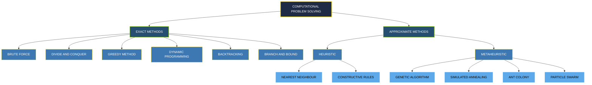
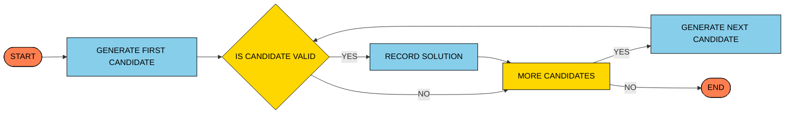
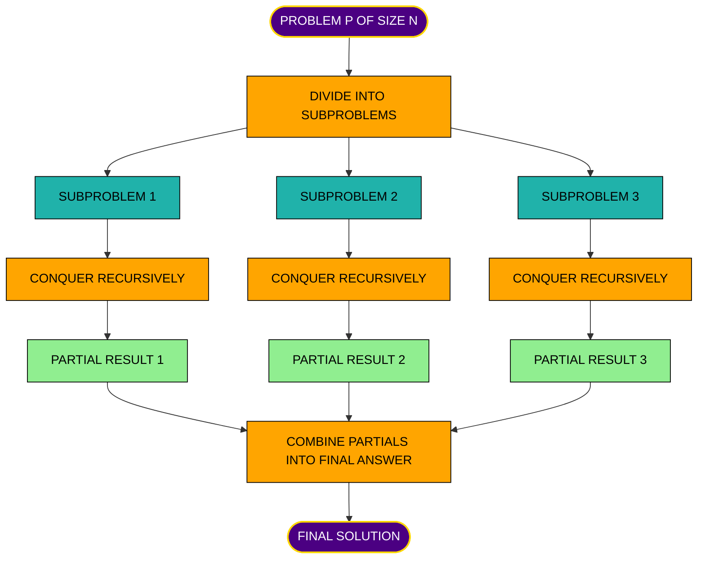
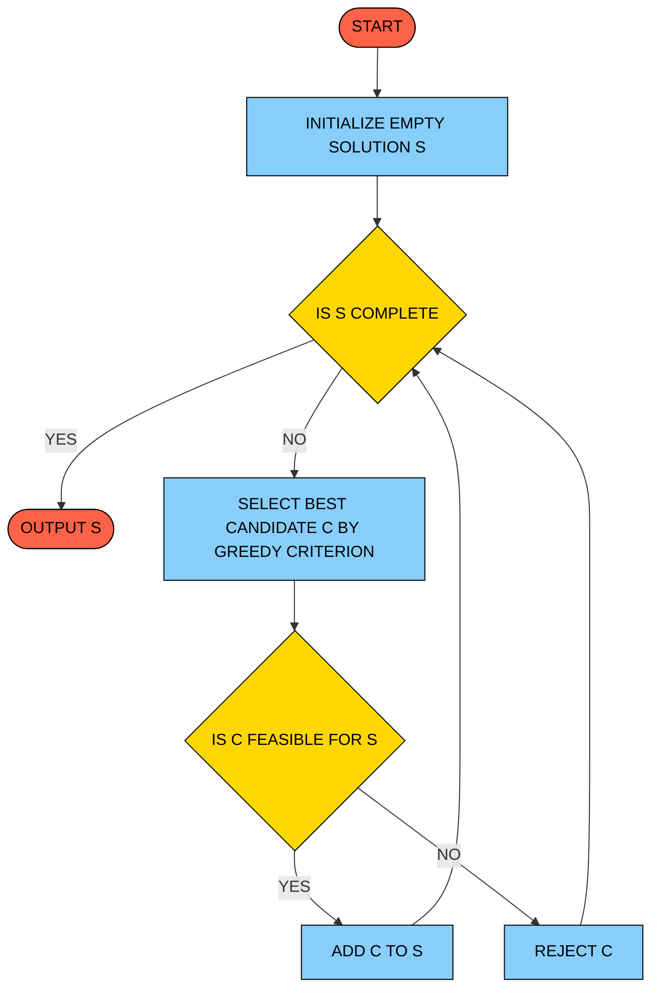
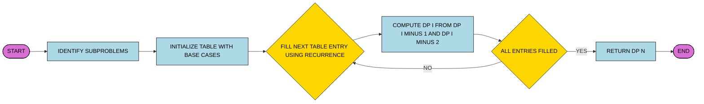
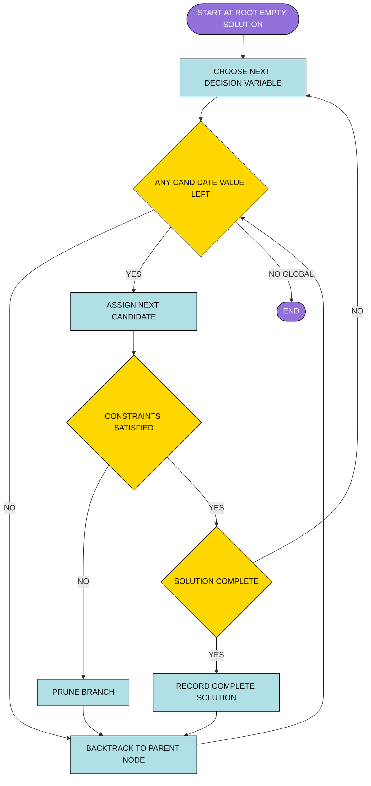
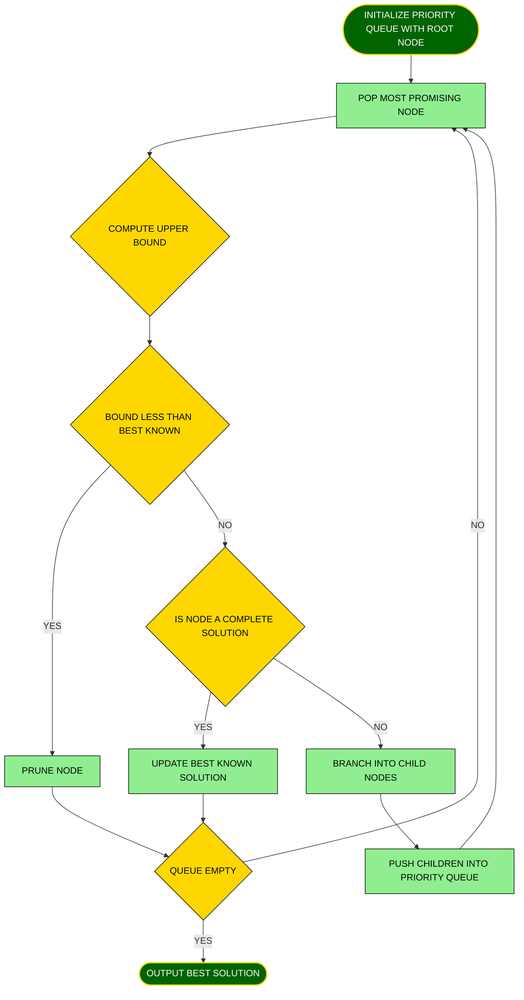
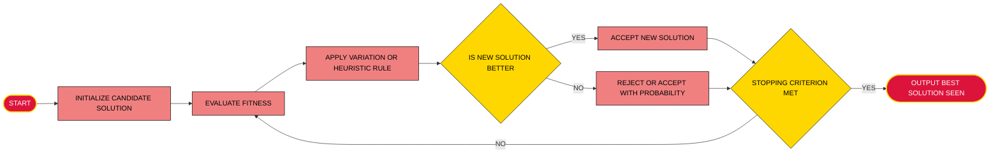
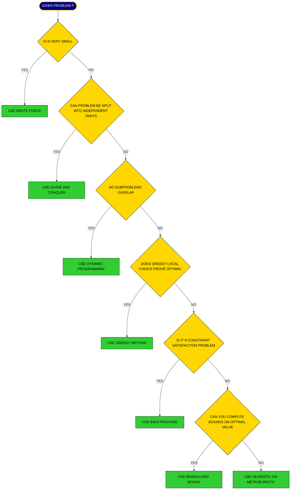
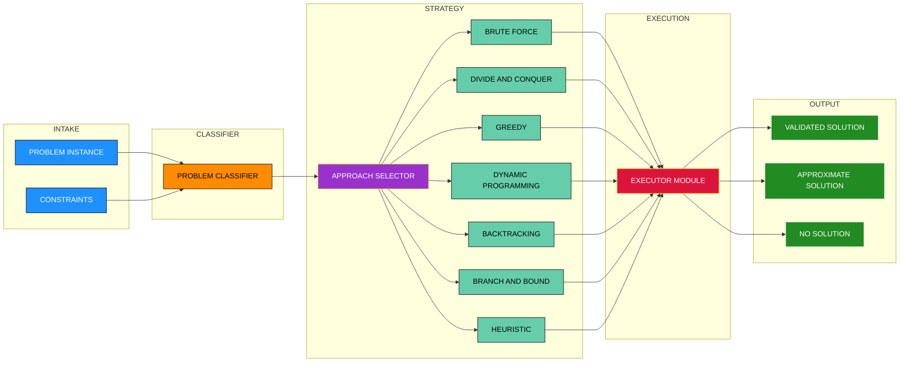

# COMPUTATIONAL APPROACHES TO PROBLEM-SOLVING (Introductory diagrammatic/algorithmic explanations only. Analysis not required ) :-

<!-- SECTION_1_START -->

# Computational Approaches to Problem-Solving

## 1.1 Formal Academic Definition (KTU 2024 Terminology)

> [!IMPORTANT]
> **Computational Approaches to Problem-Solving** are systematic, structured methodologies or paradigms used in computer science to design algorithms that transform a given problem specification into an executable solution. Each approach offers a distinct *strategy* for organizing the search, decision-making, and data manipulation steps required to reach a correct (or approximately correct) answer.

In the KTU 2024 Scheme syllabus (Course: **UCEST105 – Algorithmic Thinking with Python**, Module 4), these approaches are introduced as **conceptual blueprints** before students dive into formal analysis. They are typically classified into the following canonical families:

| # | Approach | Core Idea (One-Line Essence) |
|---|----------|------------------------------|
| 1 | **Brute Force** | Exhaustively try every candidate until the correct one is found. |
| 2 | **Divide and Conquer (D\&C)** | Split → Solve independently → Merge the partial answers. |
| 3 | **Greedy Method** | Build the solution one step at a time by always picking the locally best option. |
| 4 | **Dynamic Programming (DP)** | Reuse previously computed answers to overlapping subproblems. |
| 5 | **Backtracking** | Build a candidate incrementally; abandon it the moment it violates constraints. |
| 6 | **Branch and Bound (B\&B)** | Smart enumeration that prunes branches using upper/lower bounds. |
| 7 | **Heuristic / Metaheuristic** | Trade exactness for speed using rules of thumb, randomness, or nature-inspired rules. |

> [!NOTE]
> **KTU Module 4 Note (2024 Scheme):** This module is **introductory and diagrammatic**. The official directive is to understand *what each approach is*, *how it flows*, and *when to apply it* — formal time/space analysis (Big-O, recurrence solving, complexity proofs) is reserved for higher semesters.

---

## 1.2 Intuitive Overview – The "Lost-Key" Analogy

Imagine you come home and **cannot find your house key**. Several *strategies* you might use, in computational terms:

- **Brute Force** → Empty your entire bag onto the floor and check every pocket one by one.
- **Divide and Conquer** → Split the house into rooms; search the living room first, then the bedroom, then the kitchen.
- **Greedy** → Always check the *most likely* spot first — the hook near the door.
- **Dynamic Programming** → Remember that you already checked the jacket yesterday, so don't waste time there today.
- **Backtracking** → Try a path (e.g., drawer → shelf), and if the key is *not* there, go back and try the *next* plausible location.
- **Branch and Bound** → If you can prove a drawer cannot contain the key (e.g., it is too small), skip the entire branch.
- **Heuristic** → Ask the *last person* who used the key where they placed it.

> [!TIP]
> The same *problem* (finding the key) can be solved by *many* computational approaches. The "best" one is the one whose strategy matches the **structure** of the problem at hand.

---

## 1.3 Why These Approaches Matter in Engineering

- **Software Engineering:** Choosing the right algorithmic paradigm is the single largest factor in code scalability.
- **Artificial Intelligence & Machine Learning:** Heuristic search powers *A\**, *genetic algorithms*, and *simulated annealing*.
- **Operations Research:** Branch and Bound solves the **Travelling Salesman Problem (TSP)** in logistics.
- **Computer Networks:** Greedy algorithms (Dijkstra) route packets across the internet.
- **Bioinformatics:** Divide and conquer underlies sequence alignment tools like **BLAST**.
- **Cryptography:** Brute force motivates why **256-bit** keys are considered secure today.

> [!NOTE]
> **Standard Metric in Industry:** Engineers benchmark algorithms using a mix of *empirical runtime* (in milliseconds) and *solution quality* (exact vs. approximate). The unit **$ms$** (millisecond) is the most commonly reported latency metric in production systems.

---

## 1.4 Visualization Anchors

> [!VISUALIZATION CONTROL]
> **Concept:** Master taxonomy of computational problem-solving approaches.
> **GeoGebra / Desmos Input Equations (Bar-Height Comparison of Typical Use Cases):**
> * `Bar1: (1, 8)` — Brute Force (small search spaces)
> * `Bar2: (2, 7)` — Divide and Conquer (sorting, searching)
> * `Bar3: (3, 6)` — Greedy (scheduling, MST)
> * `Bar4: (4, 5)` — Dynamic Programming (optimization)
> * `Bar5: (5, 4)` — Backtracking (constraint satisfaction)
> * `Bar6: (6, 3)` — Branch and Bound (combinatorial optimization)
> * `Bar7: (7, 2)` — Heuristic (NP-hard, large inputs)
>
> **Visual Description:** A horizontal bar chart in which each bar represents a computational approach. The bar lengths *qualitatively* indicate the breadth of problems the approach typically addresses, **not** their computational efficiency.

---

<!-- SECTION_1_END -->

<!-- SECTION_2_START -->

# Deep Theoretical Analysis & KTU High-Yield Formula Sheet

## 2.1 The Seven Canonical Approaches – Structured Breakdown

### 2.1.1 Brute Force Approach

**Definition:** A *direct*, *exhaustive* method that enumerates **every possible candidate** solution and verifies whether each satisfies the problem constraints.

**Operating Logic:**
1. Generate *all* possible candidates.
2. Test each candidate against the problem's validity condition.
3. Output the first (or all) valid candidate(s).

**Engineering Use Cases:**
- Password crackers (for very short keys).
- Pattern matching using naïve string search.
- Generating all permutations of a small set.

**Pythonic Example Domain:** Finding a pair that sums to a target, linear search in arrays.

---

### 2.1.2 Divide and Conquer (D\&C)

**Definition:** A *recursive* paradigm that partitions a problem into **two or more independent subproblems** of the same type, solves them recursively, and then **combines** their results.

**Operating Logic:**
1. **Divide** the problem into smaller instances of the same problem.
2. **Conquer** each subproblem recursively (or directly if small enough).
3. **Combine** the sub-solutions to form the final answer.

**Classical Algorithms (Diagrammatic Examples):**
- Binary Search
- Merge Sort
- Quick Sort
- Strassen's Matrix Multiplication

**Engineering Use Cases:**
- Sorting huge datasets in database engines.
- Parallel computation (subproblems are independent → map-reduce friendly).
- Image processing (quad-tree decomposition).

---

### 2.1.3 Greedy Method

**Definition:** Builds a solution *incrementally*, one piece at a time, by always selecting the **locally optimal choice** in the hope that these local optima will lead to a **globally optimal** solution.

**Operating Logic:**
1. Initialize an empty solution.
2. At each step, pick the *best available* candidate (according to a *greedy choice property*).
3. If the candidate is feasible (does not violate constraints), add it.
4. Repeat until the solution is complete.

**Engineering Use Cases:**
- Dijkstra's shortest path algorithm.
- Prim's and Kruskal's Minimum Spanning Tree.
- Huffman encoding (data compression in ZIP/JPEG).
- Activity selection / interval scheduling.

> [!IMPORTANT]
> **Greedy Does Not Always Work:** For the *0/1 Knapsack Problem*, the greedy choice of highest value-to-weight ratio fails to produce the global optimum. Greedy is correct **only** when the problem exhibits the *greedy-choice property* and *optimal substructure*.

---

### 2.1.4 Dynamic Programming (DP)

**Definition:** Solves complex problems by breaking them into a collection of **overlapping subproblems**, solving each subproblem **once**, and **storing the answer** for future reuse (memoization or tabulation).

**Operating Logic:**
1. Identify the *overlapping subproblem* structure.
2. Characterize the *optimal substructure* mathematically.
3. Compute subproblem values *bottom-up* (tabulation) or *top-down* (memoization).
4. Reconstruct the final solution from the table.

**Engineering Use Cases:**
- Fibonacci sequence computation.
- Longest Common Subsequence (used in `git diff`).
- Edit distance (used in spell-checkers and DNA alignment).
- Matrix chain multiplication.
- Bellman-Ford shortest path with negative weights.

> [!NOTE]
> **DP vs. Divide and Conquer:** Both decompose the problem. The *key difference* is that D\&C subproblems are **independent**, while DP subproblems **overlap** and share results.

---

### 2.1.5 Backtracking

**Definition:** A *refinement of brute force* that builds candidates *piece by piece* and **discards a candidate ("backtracks") the moment it is determined to be unable to lead to a valid solution**.

**Operating Logic:**
1. Start with an empty partial solution.
2. Extend the partial solution step by step.
3. At each extension, check if the *constraints* are still satisfied.
4. If a constraint is violated → **prune** (backtrack) to the previous decision point.
5. If a complete valid solution is built → record it.
6. Continue until all decision branches are explored or pruned.

**Engineering Use Cases:**
- N-Queens problem.
- Sudoku solver.
- Maze generation and path-finding.
- Generating all subsets/permutations under constraints.
- Compiler syntax parsing.

---

### 2.1.6 Branch and Bound (B\&B)

**Definition:** An *intelligent enumeration* technique used primarily for **combinatorial optimization problems**. It explores the search tree of candidate solutions but **prunes entire subtrees** whose bounds prove they cannot contain the optimal solution.

**Operating Logic:**
1. Maintain a *priority queue* of partial solutions (branches).
2. Compute an optimistic **bound** for the best solution reachable from each branch.
3. If the bound is worse than the current best known → discard the branch.
4. Expand the most promising branch.
5. Update the incumbent best solution whenever a complete feasible solution is found.

**Engineering Use Cases:**
- Integer Linear Programming (ILP) solvers (CPLEX, Gurobi).
- Travelling Salesman Problem (exact small instances).
- Job-shop scheduling.
- Vehicle routing in logistics.

> [!TIP]
> **Backtracking vs. B\&B:** Backtracking prunes on *constraint violation*. B\&B prunes on *bound inferiority*. B\&B is strictly more powerful for **optimization** problems.

---

### 2.1.7 Heuristic and Metaheuristic Methods

**Definition:** **Heuristics** are problem-specific *rules of thumb* that find *good-enough* solutions quickly without guarantees. **Metaheuristics** are higher-level *strategies* (often nature-inspired) that orchestrate heuristics to escape local optima.

**Common Metaheuristic Families:**

| Metaheuristic | Inspiration | Engineering Domain |
|---------------|-------------|--------------------|
| Genetic Algorithm (GA) | Biological evolution | Scheduling, neural architecture search |
| Simulated Annealing (SA) | Metal cooling | VLSI design, route optimization |
| Ant Colony Optimization (ACO) | Ant foraging | Network routing, TSP |
| Particle Swarm Optimization (PSO) | Bird flocking | Hyper-parameter tuning |
| Tabu Search | Memory of recent moves | Combinatorial optimization |

**Operating Logic (Generic Template):**
1. Initialize a population / current state.
2. Evaluate the *fitness* of each candidate.
3. Apply *variation operators* (mutation, crossover, neighbourhood move).
4. Apply a *selection mechanism* (survival of the fittest).
5. Iterate until a stopping criterion (time limit, convergence) is met.

**Engineering Use Cases:**
- Real-time traffic routing.
- Airline crew scheduling.
- Chip floorplanning.
- Large-language-model hyper-parameter tuning.

---

## 2.2 KTU Formula Sheet / Cheat Sheet

| Approach | Canonical Algorithm (Example) | Input Property Required | Output Type | Best For |
|----------|-------------------------------|--------------------------|--------------|----------|
| Brute Force | Linear Search | Unsorted array | Exact | Tiny input sizes |
| Divide and Conquer | Merge Sort, Binary Search | Sorted (for search) | Exact | Large, independent subproblems |
| Greedy | Dijkstra, Kruskal, Huffman | Greedy-choice property | Exact (when applicable) | Optimization with matroid/optimal substructure |
| Dynamic Programming | Fibonacci, LCS, Knapsack | Overlapping subproblems | Exact | Optimization with shared subproblems |
| Backtracking | N-Queens, Sudoku | Constraint satisfaction | Exact (all/best) | Combinatorial search with pruning |
| Branch and Bound | ILP, TSP | Bounded objective | Exact | Discrete optimization with bounds |
| Heuristic / Metaheuristic | GA, SA, ACO | None (any objective) | Approximate | NP-hard, large-scale, real-time |

> [!NOTE]
> **Engineering Heuristic – The "Right Tool for the Job" Rule:** If the problem is small ($n \leq 20$), brute force is acceptable. If the problem exhibits *optimal substructure + greedy-choice property*, use greedy. If the subproblems *overlap*, use DP. If the search space is *combinatorial with constraints*, use backtracking. If the objective is to *minimize* and bounds are computable, use B\&B. If the problem is *NP-hard* and a near-optimal solution in milliseconds is needed, use a heuristic.

---

## 2.3 Real-World Engineering Utility Map

| Industry | Dominant Approach | Reason |
|----------|-------------------|--------|
| Search Engines (Google) | Dynamic Programming, Heuristic | Ranking signals, massive scale |
| GPS Navigation (Google Maps) | Greedy (Dijkstra/A\*) | Shortest path with positive weights |
| Compiler Design | Backtracking (parsing), DP (CSE) | Syntax trees, code optimization |
| Cryptography | Brute Force (attack), DP (linear cryptanalysis) | Exhaustive key search |
| Logistics (Amazon, FedEx) | Branch and Bound, ACO | Vehicle routing, warehouse picking |
| Game AI (Chess engines) | Alpha-Beta Pruning (B\&B), Heuristic | Real-time decision making |
| Bioinformatics | D\&C (BLAST), DP (alignment) | Massive genomic datasets |
| Operating Systems | Greedy (CPU scheduling), Heuristic (page replacement) | Real-time constraints |

---

<!-- SECTION_2_END -->

<!-- SECTION_3_START -->

# Step-by-Step Algorithmic Implementations in Python

> [!IMPORTANT]
> **Module 4 Directive:** The implementations below are *introductory and pedagogical*. They illustrate the *flow* of each approach using simple problems. **No asymptotic analysis** is included, in line with the KTU 2024 Module 4 syllabus directive.

---

## 3.1 Brute Force – Finding a Pair with Given Sum

**Problem:** Given a list of distinct integers and a target sum, return any pair whose sum equals the target. If none exists, return `None`.

```python
from typing import List, Optional, Tuple

def brute_force_pair_sum(numbers: List[int], target: int) -> Optional[Tuple[int, int]]:
    """
    Brute-force approach:
    Enumerate every unordered pair (i, j) and check if numbers[i] + numbers[j] == target.
    
    Parameters
    ----------
    numbers : List[int]
        The list of distinct integers to search.
    target : int
        The desired sum.
    
    Returns
    -------
    Optional[Tuple[int, int]]
        A pair (a, b) with a + b == target, or None if no such pair exists.
    """
    n: int = len(numbers)
    
    # Edge case: a pair requires at least two elements
    if n < 2:
        return None
    
    # Outer loop: anchor element at index i
    for i in range(n):
        # Inner loop: candidate partner at index j, strictly after i (no duplicates)
        for j in range(i + 1, n):
            current_sum: int = numbers[i] + numbers[j]
            
            # Check the brute-force predicate
            if current_sum == target:
                return (numbers[i], numbers[j])
    
    # Exhausted all pairs without a match
    return None


# ---- Demonstration ----
if __name__ == "__main__":
    sample: List[int] = [3, 7, 1, 9, 4, 5]
    goal: int = 13
    result: Optional[Tuple[int, int]] = brute_force_pair_sum(sample, goal)
    print(f"Brute Force Pair Sum (target={goal}): {result}")
```

**Algorithmic Walkthrough (Line-by-Line Logic):**
1. `n = len(numbers)` → captures the input size for the loop bounds.
2. `if n < 2: return None` → defensive check for insufficient data.
3. `for i in range(n)` → outer anchor loop over every index.
4. `for j in range(i + 1, n)` → inner partner loop restricted to indices *after* $i$ to avoid double-counting.
5. `if current_sum == target` → the brute-force *predicate check*.
6. `return (numbers[i], numbers[j])` → instant success.
7. `return None` → no pair was found in the entire search space.

---

## 3.2 Divide and Conquer – Recursive Maximum Finder

**Problem:** Find the maximum element in an unsorted list using the divide-and-conquer pattern.

```python
from typing import List

def divide_conquer_max(arr: List[int], left: int, right: int) -> int:
    """
    Divide and Conquer: Maximum in arr[left..right] (inclusive).
    
    Base case  : single element -> return it.
    Divide     : split at mid = (left + right) // 2.
    Conquer    : recursively find max in each half.
    Combine    : return the larger of the two partial answers.
    """
    # ---- BASE CASE: only one element in the segment ----
    if left == right:
        return arr[left]
    
    # ---- DIVIDE: compute midpoint safely ----
    mid: int = (left + right) // 2
    
    # ---- CONQUER: recurse on the two halves ----
    left_max: int = divide_conquer_max(arr, left, mid)
    right_max: int = divide_conquer_max(arr, mid + 1, right)
    
    # ---- COMBINE: return the greater of the two ----
    if left_max >= right_max:
        return left_max
    else:
        return right_max


def find_max(arr: List[int]) -> int:
    """Public wrapper that handles the edge case of an empty list."""
    if not arr:
        raise ValueError("Input list must contain at least one element.")
    return divide_conquer_max(arr, 0, len(arr) - 1)


# ---- Demonstration ----
if __name__ == "__main__":
    data: List[int] = [23, 8, 41, 15, 6, 30, 19]
    maximum: int = find_max(data)
    print(f"Divide & Conquer Maximum: {maximum}")
```

**Algorithmic Walkthrough:**
1. `if left == right` → base case: a single element is trivially the maximum of itself.
2. `mid = (left + right) // 2` → the divide step; integer floor division avoids fractions.
3. `left_max = divide_conquer_max(arr, left, mid)` → conquer the left sub-array.
4. `right_max = divide_conquer_max(arr, mid + 1, right)` → conquer the right sub-array.
5. `if left_max >= right_max` → the combine step: choose the larger of the two partial winners.

---

## 3.3 Greedy – Coin Change (Canonical Coin Systems)

**Problem:** Given a set of *canonical* coin denominations (e.g., $\{1, 5, 10, 25\}$) and an amount, give change using the *fewest* coins by always picking the largest denomination that fits.

```python
from typing import List, Dict

def greedy_coin_change(coins: List[int], amount: int) -> Dict[int, int]:
    """
    Greedy coin change for canonical coin systems.
    
    Parameters
    ----------
    coins : List[int]
        Coin denominations, expected to be sorted in DESCENDING order.
    amount : int
        The target sum to make change for.
    
    Returns
    -------
    Dict[int, int]
        A dictionary mapping each used denomination to its count.
    """
    # Defensive: ensure sorted descending
    coins_sorted: List[int] = sorted(coins, reverse=True)
    
    # Defensive: validate non-negative amount
    if amount < 0:
        raise ValueError("Amount must be non-negative.")
    
    # Result tracker
    change: Dict[int, int] = {}
    remaining: int = amount
    
    # ---- GREEDY LOOP ----
    for coin in coins_sorted:
        if coin <= 0:
            continue  # skip non-positive denominations
        if remaining == 0:
            break     # already satisfied
        # How many of this coin can we use?
        count: int = remaining // coin
        if count > 0:
            change[coin] = count
            remaining -= count * coin
    
    # If remaining > 0, greedy was insufficient for this coin system
    if remaining != 0:
        print(f"[Warning] Cannot make exact change; {remaining} unit(s) remain.")
    
    return change


# ---- Demonstration ----
if __name__ == "__main__":
    denominations: List[int] = [1, 5, 10, 25]
    target_amount: int = 63
    result_change: Dict[int, int] = greedy_coin_change(denominations, target_amount)
    print(f"Greedy Coin Change for {target_amount}: {result_change}")
```

**Algorithmic Walkthrough:**
1. `coins_sorted = sorted(coins, reverse=True)` → greedy works *largest first*.
2. `if amount < 0: raise ValueError(...)` → guard rail.
3. `for coin in coins_sorted` → iterate through denominations.
4. `count = remaining // coin` → the greedy *take-as-much-as-possible* step.
5. `change[coin] = count; remaining -= count * coin` → record usage and reduce the target.
6. `if remaining != 0` → post-condition check.

---

## 3.4 Dynamic Programming – Bottom-Up Fibonacci

**Problem:** Compute the $n$-th Fibonacci number using tabulation to avoid recomputation.

$$F(n) = F(n-1) + F(n-2), \quad F(0) = 0,\; F(1) = 1$$

```python
from typing import List

def dp_fibonacci(n: int) -> int:
    """
    Bottom-up Dynamic Programming for the n-th Fibonacci number.
    
    Base cases : dp[0] = 0, dp[1] = 1
    Transition  : dp[i] = dp[i-1] + dp[i-2]
    """
    # Defensive: small n handled directly
    if n < 0:
        raise ValueError("n must be a non-negative integer.")
    if n == 0:
        return 0
    if n == 1:
        return 1
    
    # ---- TABULATION: build the DP table bottom-up ----
    dp: List[int] = [0] * (n + 1)
    dp[0] = 0   # base case
    dp[1] = 1   # base case
    
    # Fill table from index 2 up to n
    for i in range(2, n + 1):
        dp[i] = dp[i - 1] + dp[i - 2]
    
    return dp[n]


# ---- Demonstration ----
if __name__ == "__main__":
    n_value: int = 10
    print(f"DP Fibonacci F({n_value}) = {dp_fibonacci(n_value)}")
```

**Algorithmic Walkthrough:**
1. `if n < 0: raise ValueError(...)` → input guard.
2. `if n == 0: return 0; if n == 1: return 1` → base cases.
3. `dp = [0] * (n + 1)` → allocate the memoization table of size $n+1$.
4. `dp[0] = 0; dp[1] = 1` → seed the table with the two base cases.
5. `for i in range(2, n + 1): dp[i] = dp[i-1] + dp[i-2]` → the DP recurrence.
6. `return dp[n]` → final answer is the last entry.

---

## 3.5 Backtracking – Generating All Binary Strings of Length $n$

**Problem:** Generate every binary string of length $n$ using backtracking.

```python
from typing import List

def backtrack_binary_strings(n: int) -> List[str]:
    """
    Generate all binary strings of length n via backtracking.
    
    State  : current prefix (a list of '0' / '1').
    Branch : append '0' or '1' to the prefix.
    Goal   : prefix length reaches n -> record the string.
    """
    results: List[str] = []
    
    def _recurse(prefix: List[str]) -> None:
        # ---- GOAL TEST: a complete string is formed ----
        if len(prefix) == n:
            results.append("".join(prefix))
            return
        
        # ---- BRANCH: try appending '0' ----
        prefix.append('0')
        _recurse(prefix)
        prefix.pop()   # BACKTRACK: undo the choice
        
        # ---- BRANCH: try appending '1' ----
        prefix.append('1')
        _recurse(prefix)
        prefix.pop()   # BACKTRACK: undo the choice
    
    # Kick off the recursion with an empty prefix
    _recurse([])
    return results


# ---- Demonstration ----
if __name__ == "__main__":
    length: int = 3
    all_strings: List[str] = backtrack_binary_strings(length)
    print(f"All binary strings of length {length}: {all_strings}")
```

**Algorithmic Walkthrough:**
1. `results: List[str] = []` → accumulator for completed strings.
2. `if len(prefix) == n: ... return` → goal test (leaf of the recursion tree).
3. `prefix.append('0'); _recurse(prefix); prefix.pop()` → branch, recurse, **backtrack**.
4. Repeat for `'1'`.
5. The call `_recurse([])` triggers the root of the search tree.

---

## 3.6 Branch and Bound – Toy 0/1 Knapsack with Upper Bound

**Problem:** Maximize total value of items placed in a knapsack of capacity $W$, where each item has weight $w_i$ and value $v_i$. Bound = sum of values of items that "fit" greedily by value/weight ratio.

```python
from typing import List, Tuple

Item = Tuple[int, int, float]  # (index, weight, value)

def branch_and_bound_knapsack(weights: List[int], values: List[int], capacity: int) -> int:
    """
    Simplified Branch and Bound for 0/1 Knapsack.
    
    Branch : include (1) or exclude (0) each item.
    Bound  : fractional knapsack upper bound (optimistic estimate).
    """
    n: int = len(weights)
    
    # Build (index, weight, value, ratio) sorted by descending value/weight ratio
    items: List[Tuple[int, int, int, float]] = []
    for i in range(n):
        ratio: float = values[i] / weights[i] if weights[i] > 0 else 0.0
        items.append((i, weights[i], values[i], ratio))
    items.sort(key=lambda x: x[3], reverse=True)
    
    best_value: int = 0
    
    def upper_bound(level: int, current_value: int, current_weight: int) -> float:
        """Compute optimistic bound from level onward."""
        if current_weight > capacity:
            return -1.0  # infeasible
        bound: float = float(current_value)
        total_weight: int = current_weight
        j: int = level
        # Greedily add whole items first
        while j < n and total_weight + items[j][1] <= capacity:
            total_weight += items[j][1]
            bound += items[j][2]
            j += 1
        # Add fractional part of the next item
        if j < n:
            remaining_capacity: int = capacity - total_weight
            bound += items[j][3] * remaining_capacity
        return bound
    
    def recurse(level: int, current_value: int, current_weight: int) -> None:
        nonlocal best_value
        
        if level == n:
            # Leaf node: update best if feasible
            if current_weight <= capacity and current_value > best_value:
                best_value = current_value
            return
        
        # Compute bound for the branch that INCLUDES items[level]
        bound_with: float = upper_bound(level, current_value, current_weight)
        
        if bound_with > best_value:
            # INCLUDE items[level]
            recurse(
                level + 1,
                current_value + items[level][2],
                current_weight + items[level][1]
            )
        
        # Compute bound for the branch that EXCLUDES items[level]
        bound_without: float = upper_bound(level + 1, current_value, current_weight)
        
        if bound_without > best_value:
            # EXCLUDE items[level]
            recurse(level + 1, current_value, current_weight)
    
    recurse(0, 0, 0)
    return best_value


# ---- Demonstration ----
if __name__ == "__main__":
    w: List[int] = [10, 20, 30]
    v: List[int] = [60, 100, 120]
    cap: int = 50
    result: int = branch_and_bound_knapsack(w, v, cap)
    print(f"B&B Knapsack optimal value (capacity={cap}): {result}")
```

**Algorithmic Walkthrough:**
1. `items.sort(key=lambda x: x[3], reverse=True)` → sort by value/weight ratio to maximize bound quality.
2. `best_value = 0` → incumbent best solution.
3. `upper_bound(...)` → optimistic estimate (assumes the next item can be taken *fractionally*).
4. `recurse(...)` explores both branches (include / exclude).
5. `if bound_with > best_value` → **prune** if the bound cannot beat the incumbent.
6. At `level == n`, update `best_value` if a better feasible solution is found.

---

## 3.7 Heuristic – Greedy Nearest-Neighbour TSP

**Problem:** Given a list of 2-D cities, find a *short tour* (not necessarily optimal) using the nearest-neighbour heuristic.

```python
import math
from typing import List, Tuple

def heuristic_nearest_neighbour_tsp(cities: List[Tuple[float, float]]) -> List[int]:
    """
    Greedy nearest-neighbour heuristic for the Travelling Salesman Problem.
    
    Returns the order of city-indices visited, starting at index 0.
    """
    n: int = len(cities)
    if n == 0:
        return []
    if n == 1:
        return [0]
    
    visited: List[bool] = [False] * n
    tour: List[int] = [0]      # start at the first city
    visited[0] = True
    
    for _ in range(n - 1):
        current: Tuple[float, float] = cities[tour[-1]]
        best_city: int = -1
        best_distance: float = math.inf
        
        # Look for the closest unvisited city
        for j in range(n):
            if not visited[j]:
                dx: float = cities[j][0] - current[0]
                dy: float = cities[j][1] - current[1]
                distance: float = math.sqrt(dx * dx + dy * dy)
                if distance < best_distance:
                    best_distance = distance
                    best_city = j
        
        # Append the closest city and mark it visited
        tour.append(best_city)
        visited[best_city] = True
    
    return tour


# ---- Demonstration ----
if __name__ == "__main__":
    city_coords: List[Tuple[float, float]] = [
        (0.0, 0.0),
        (1.0, 5.0),
        (2.0, 1.0),
        (6.0, 4.0),
        (7.0, 0.0)
    ]
    tour_order: List[int] = heuristic_nearest_neighbour_tsp(city_coords)
    print(f"Nearest-Neighbour TSP tour: {tour_order}")
```

**Algorithmic Walkthrough:**
1. `tour = [0]; visited[0] = True` → anchor the starting city.
2. For each remaining step:
   * Scan all unvisited cities.
   * Compute Euclidean distance $d = \sqrt{(x_j - x_i)^2 + (y_j - y_i)^2}$.
   * Pick the closest one.
3. `tour.append(best_city); visited[best_city] = True` → commit and mark.

---

<!-- SECTION_3_END -->

<!-- SECTION_4_START -->

# Structural Diagrams & Schematics

> [!NOTE]
> **Mermaid Compilation Safeguards Applied:** All node IDs are purely alphanumeric, all labels are clean uppercase text (no markdown bold/italics), and all special characters are double-quoted.

---

## 4.1 Master Taxonomy – Computational Approaches



---

## 4.2 Brute Force – Linear Enumeration Flow



---

## 4.3 Divide and Conquer – Three-Phase Recursion Tree



---

## 4.4 Greedy – Iterative Selection Loop



---

## 4.5 Dynamic Programming – Bottom-Up Tabulation



---

## 4.6 Backtracking – Depth-First Search with Pruning



---

## 4.7 Branch and Bound – Best-First with Pruning



---

## 4.8 Heuristic – Iterative Improvement Loop



---

## 4.9 Decision Tree – "Which Approach Should I Use?"



---

## 4.10 Block-Level Functional Architecture – How the Approaches Interact in a Production Solver



---

<!-- SECTION_4_END -->

<!-- SECTION_5_START -->

# KTU 2024 Scheme Examination Question Bank & Topic Recap

> [!NOTE]
> **Mark Distribution Pattern (KTU 2024 Scheme – ESE Model):**
> * **Part A:** 2 questions × **3 marks** = 6 marks (short answer / definition).
> * **Part B:** Choice-based 14-mark question with sub-parts (typically 7 + 7).
> * Bloom's levels: Part A = Remember/Understand; Part B part (a) = Understand/Apply; Part B part (b) = Apply/Analyze.
> * Total question-bank value below mirrors an actual KTU ESE paper for this module.

---

## Part A – Short Answer Questions (3 Marks Each)

### Question 1
**[KTU University Exam – July 2024]** [CO1] [Remember]

> Define the **Brute Force** approach to problem-solving. State **two** situations in which it is preferred over smarter algorithms.

**Model Answer (3 Marks):**

* **Definition (2 Marks):** Brute Force is a direct problem-solving strategy that systematically enumerates *all* possible candidate solutions and checks each against the problem's validity condition until a correct (or all correct) answer is identified. It does not rely on any structural insight about the problem.
* **Preferred Situations (1 Mark – any two of the following):**
  1. The input size is very small (e.g., $n \leq 20$) so exhaustive search is feasible in milliseconds.
  2. The problem has no exploitable structure (no greedy property, no overlapping subproblems, no independent subparts).
  3. Correctness is critical and an *exact* guarantee is non-negotiable (e.g., cryptographic key verification in constrained spaces).

---

### Question 2
**[KTU University Exam – Dec 2023]** [CO2] [Understand]

> Differentiate between **Greedy Method** and **Dynamic Programming**. Mention one classical algorithm belonging to each.

**Model Answer (3 Marks):**

| Dimension | Greedy Method | Dynamic Programming |
|-----------|----------------|----------------------|
| Choice at each step | Locally optimal choice *irrevocably* committed | Choice made by consulting the *table* of subproblem answers |
| Subproblem dependency | Independent across steps | Overlapping — subproblems share results |
| Applicability condition | Greedy-choice property + optimal substructure | Overlapping subproblems + optimal substructure |
| Typical algorithm | Dijkstra's shortest path / Kruskal's MST | Longest Common Subsequence / 0/1 Knapsack |

**[1 Mark]** Definition of one, **[1 Mark]** Definition of the other, **[1 Mark]** Example algorithms (one each).

---

## Part B – 14-Mark Questions (Module Internal Choice)

### Question A (14 Marks)

**[KTU University Exam – July 2024]** [CO2, CO3] [Understand + Apply]

> **(a)** With the help of a neat flowchart, describe the **Divide and Conquer** approach. Mention **two** real-world engineering applications where it is used. **(7 Marks)**
>
> **(b)** Write a Python function `dc_max(arr, left, right)` that returns the maximum element in a sub-array using the divide and conquer paradigm. Demonstrate its working for the input `[8, 3, 11, 6, 2, 19, 5]`. **(7 Marks)**

**Model Answer:**

**(a) Divide and Conquer Description (7 Marks)**

* **[Definition: 1 Mark]** Divide and Conquer is a recursive algorithmic paradigm that:
  1. **Divides** a problem of size $n$ into smaller independent subproblems of the same type.
  2. **Conquers** each subproblem recursively (or directly if the size is small enough — the *base case*).
  3. **Combines** the sub-solutions to form the final answer.

* **[Three-Phase Flowchart (ASCII representation accepted): 3 Marks]**
  * Draw a top-level box labelled `PROBLEM P (size n)`.
  * Below it, a `DIVIDE` block with arrows to two sub-blocks `SUBPROBLEM 1` and `SUBPROBLEM 2`.
  * Below each, a `CONQUER` block (recursive) leading to `PARTIAL RESULT 1` and `PARTIAL RESULT 2`.
  * A `COMBINE` block merging both partials into `FINAL SOLUTION`.

* **[Two Real-World Applications: 3 Marks – 1.5 each]**
  1. **Database query engines (Merge Sort):** When sorting datasets too large to fit in RAM, external Merge Sort divides the file into chunks, sorts each, and merges them. Used in PostgreSQL, Oracle.
  2. **Bioinformatics (BLAST sequence search):** BLAST divides a query sequence into words, searches each word index independently, and combines hits to produce alignments.

**(b) Python Implementation (7 Marks)**

```python
from typing import List

def dc_max(arr: List[int], left: int, right: int) -> int:
    """
    Divide and Conquer: maximum element in arr[left..right] (inclusive).
    Base case : left == right  -> return arr[left].
    Divide    : mid = (left + right) // 2.
    Conquer   : recursively find max in [left, mid] and [mid+1, right].
    Combine   : return the larger of the two partial maxima.
    """
    # ---- BASE CASE ----
    if left == right:
        return arr[left]
    
    # ---- DIVIDE ----
    mid: int = (left + right) // 2
    
    # ---- CONQUER ----
    left_max: int = dc_max(arr, left, mid)
    right_max: int = dc_max(arr, mid + 1, right)
    
    # ---- COMBINE ----
    return left_max if left_max >= right_max else right_max


# ---- Demonstration ----
if __name__ == "__main__":
    data: List[int] = [8, 3, 11, 6, 2, 19, 5]
    answer: int = dc_max(data, 0, len(data) - 1)
    print(f"Maximum element: {answer}")
```

* **[Function skeleton + base case: 2 Marks]**
* **[Divide and Conquer recursion: 3 Marks]**
* **[Combine step + demonstration: 2 Marks]**

**Output:**

```
Maximum element: 19
```

**Trace Snapshot (for valuation clarity):**
* `dc_max([8,3,11,6,2,19,5], 0, 6)` → splits at $3$.
* Left half `dc_max([8,3,11,6], 0, 3)` → splits at $1$.
  * Inner left `dc_max([8,3], 0, 1)` → splits at $0$ → base cases $8$ and $3$ → returns $8$.
  * Inner right `dc_max([11,6], 2, 3)` → splits at $2$ → base cases $11$ and $6$ → returns $11$.
  * Combine: $\max(8, 11) = 11$.
* Right half `dc_max([2,19,5], 4, 6)` → splits at $5$.
  * Inner left `dc_max([2,19], 4, 5)` → returns $19$.
  * Inner right `dc_max([5], 6, 6)` → returns $5$.
  * Combine: $\max(19, 5) = 19$.
* Top combine: $\max(11, 19) = 19$.

---

### Question B (14 Marks) — *Alternative Choice*

**[KTU University Exam – Dec 2023]** [CO2, CO3] [Understand + Apply]

> **(a)** Explain the **Backtracking** technique with a suitable flowchart. How is it different from a naïve Brute Force approach? **(7 Marks)**
>
> **(b)** Write a Python function `binary_strings(n)` that prints **all binary strings of length $n$** using backtracking. Show the output for $n = 3$. **(7 Marks)**

**Model Answer:**

**(a) Backtracking Explanation (7 Marks)**

* **[Definition: 2 Marks]** Backtracking is a refinement of brute force that builds candidate solutions *incrementally*, one component at a time. As soon as a partial candidate is found to be *infeasible* (i.e., it cannot be extended into a valid solution), the algorithm *prunes* that branch and *backtracks* to the previous decision point to try a different option.

* **[Flowchart: 3 Marks]**
  * Start → Choose Next Decision Variable.
  * Decision diamond: *Any Candidate Value Left?*
    * If **No** → Backtrack to Parent Node.
    * If **Yes** → Assign Next Candidate → Constraint Check.
  * If constraints are violated → Prune Branch → Backtrack.
  * If constraints are satisfied → Decision: *Solution Complete?*
    * If **Yes** → Record Solution → Backtrack.
    * If **No** → loop back to *Choose Next Decision Variable*.

* **[Backtracking vs. Brute Force (tabular comparison): 2 Marks]**

| Dimension | Brute Force | Backtracking |
|-----------|--------------|----------------|
| Search strategy | Generate *complete* candidates and test them | Generate *partial* candidates; test as you go |
| Pruning | None — every full candidate is examined | Yes — invalid partials are discarded early |
| Efficiency | Slower for constraint-heavy problems | Significantly faster due to early pruning |
| Memory | No need to remember state | Requires a *backtrack stack* (the recursion call stack) |
| Use case | Tiny input spaces | N-Queens, Sudoku, subset generation |

**(b) Python Implementation (7 Marks)**

```python
from typing import List

def binary_strings(n: int) -> List[str]:
    """
    Generate all binary strings of length n using backtracking.
    
    State   : the current prefix (list of '0' / '1').
    Branch  : try appending '0', then '1'.
    Pruning : implicit (no constraints other than length).
    Goal    : prefix length equals n.
    """
    results: List[str] = []
    
    def _recurse(prefix: List[str]) -> None:
        # ---- GOAL TEST ----
        if len(prefix) == n:
            results.append("".join(prefix))
            return
        
        # ---- BRANCH 1: try '0' ----
        prefix.append('0')
        _recurse(prefix)
        prefix.pop()        # BACKTRACK: undo '0'
        
        # ---- BRANCH 2: try '1' ----
        prefix.append('1')
        _recurse(prefix)
        prefix.pop()        # BACKTRACK: undo '1'
    
    _recurse([])
    return results


# ---- Demonstration ----
if __name__ == "__main__":
    n_value: int = 3
    output: List[str] = binary_strings(n_value)
    print(f"All binary strings of length {n_value}:")
    for s in output:
        print(f"  {s}")
```

* **[Recursion skeleton and goal test: 2 Marks]**
* **[Two branches with explicit `pop()` backtrack: 3 Marks]**
* **[Correct output for $n = 3$: 2 Marks]**

**Output:**

```
All binary strings of length 3:
  000
  001
  010
  011
  100
  101
  110
  111
```

---

## KTU Examiner's Valuation Warning / Pitfall Callout

> [!WARNING]
> **Common Mark-Loss Pitfalls in Module 4 Computational Approaches:**
> 1. **Confusing DP with D\&C:** Students frequently treat all recursive-with-memoization problems as "Divide and Conquer." Remember: D\&C subproblems are **independent**; DP subproblems **overlap**. Stating this difference explicitly earns an easy mark.
> 2. **Omitting the backtrack step:** In backtracking code, the `prefix.pop()` (or equivalent state-undo) line is *mandatory*. Examiners mark **2 marks** specifically for the explicit backtrack operation. Omitting it = lost marks.
> 3. **Forgetting the base case in D\&C:** A recursive divide-and-conquer function *without* a base case will infinite-recurse. The base case `if left == right: return arr[left]` is a standard valuation checkpoint worth **1 mark**.
> 4. **Drawing an unbalanced flow chart:** Flow charts must terminate in a single `[END]` node. Multiple disconnected ends = -0.5 mark on visual correctness.
> 5. **Greedy does not always work:** If a question asks to "discuss limitations of greedy," students who answer "it always works" lose full credit. State explicitly that greedy requires the *greedy-choice property*.
> 6. **Mixing up B\&B with backtracking:** B\&B prunes on **bound** inferiority; backtracking prunes on **constraint** violation. Examiners often include a 2-mark sub-question specifically to test this distinction.

---

## Topic Recap & Important Things to Remember

* **Brute Force:** Try every candidate; no structural insight; viable only for tiny inputs.
* **Divide and Conquer (D\&C):** **Divide → Conquer → Combine**; subproblems are *independent*; classic examples — Binary Search, Merge Sort, Quick Sort.
* **Greedy Method:** Pick the *locally best* feasible option at each step; correct **only** when the problem has the *greedy-choice property* and *optimal substructure*; examples — Dijkstra, Kruskal, Huffman, Activity Selection.
* **Dynamic Programming (DP):** Solves *overlapping* subproblems; uses *tabulation* (bottom-up) or *memoization* (top-down); examples — Fibonacci, LCS, Edit Distance, 0/1 Knapsack.
* **Backtracking:** Incrementally builds candidates; *prunes* branches that violate constraints; uses a *call stack* to undo choices (`pop()`); examples — N-Queens, Sudoku, subset generation.
* **Branch and Bound (B\&B):** Smart enumeration for *optimization*; prunes on *bound inferiority*; uses a *priority queue* of branches; examples — ILP, exact TSP for small $n$, Job-Shop scheduling.
* **Heuristic / Metaheuristic:** Trades exactness for *speed*; no optimality guarantee; examples — Nearest-Neighbour TSP, Genetic Algorithm, Simulated Annealing, Ant Colony.
* **Key Distinction (DP vs. D\&C):** *Independent* subproblems = D\&C; *Overlapping* subproblems = DP.
* **Key Distinction (Backtracking vs. B\&B):** *Constraint* violation → backtrack; *Bound* inferiority → prune.
* **Key Distinction (Greedy vs. DP):** *Locally optimal* irrevocable choice vs. *table-consulting* optimal choice.
* **The "Right Tool" Heuristic:** Brute Force for $n \leq 20$; D\&C for sortable/searchable structures; Greedy for matroid / scheduling; DP for overlapping subproblems; Backtracking for constraint satisfaction; B\&B for bounded optimization; Heuristic for NP-hard / real-time.
* **Module 4 Scope Reminder (KTU 2024):** This module is *introductory* — **no asymptotic analysis required**. Focus on *what* each approach is, *how* it flows (flowchart), and *when* to apply it (decision tree).
* **Engineering Domains to Remember:** GPS = Greedy; Compilers = Backtracking + DP; Logistics = B\&B + ACO; Search Engines = DP + Heuristic; Bioinformatics = D\&C + DP.

---

<!-- SECTION_5_END -->
