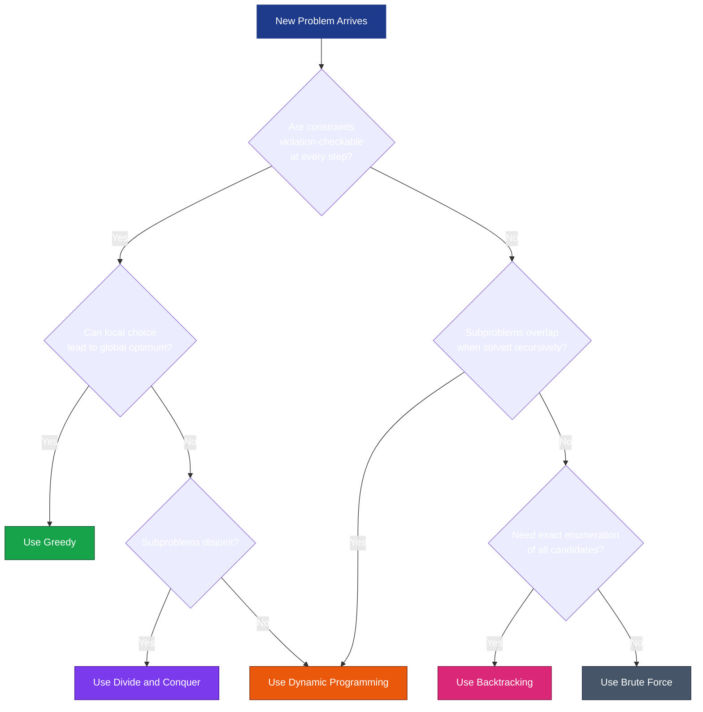
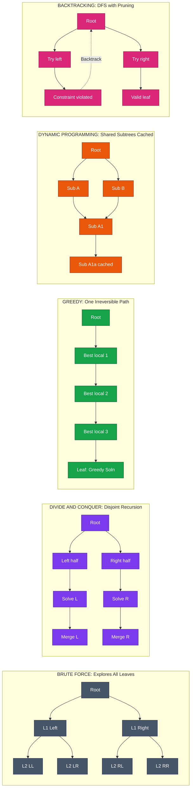
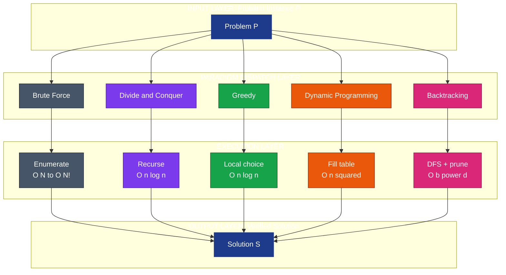
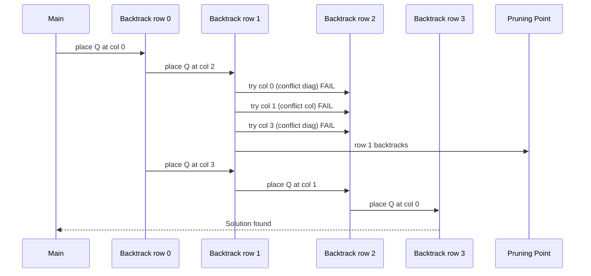

# COMPUTATIONAL APPROACHES TO PROBLEM-SOLVING

<!-- SECTION_1_START -->
# COMPUTATIONAL APPROACHES TO PROBLEM-SOLVING

## 1.1 Formal Academic Definition (KTU 2024 Syllabus)

> [!IMPORTANT]
> **Definition (KTU 2024 Scheme - UCEST105, Module 4):**
> *Computational approaches to problem-solving* are systematic, well-defined **algorithmic paradigms** (or strategies) that provide a structured template for designing algorithms to solve a class of computational problems. Each paradigm imposes a particular *computational lens* through which the input domain is transformed into the desired output, balancing **correctness, optimality, and resource consumption** (time and space).

In the KTU 2024 Scheme framework, a student must recognize that a *single problem* (e.g., finding the shortest path) may admit **multiple valid paradigms**, and the choice of paradigm determines the resulting **asymptotic complexity**, **memory footprint**, and **ease of implementation**. The five canonical paradigms mandated by the Module 4 syllabus are:

1. **Brute Force**
2. **Divide and Conquer**
3. **Greedy Algorithms**
4. **Dynamic Programming**
5. **Backtracking**

> [!NOTE]
> **Syllabus Highlight:** Module 4 of *Algorithmic Thinking with Python (UCEST105)* expects students to (a) classify a given problem under the correct paradigm, (b) write a working Python implementation of a representative algorithm for each paradigm, and (c) compare the trade-offs in **time complexity, space complexity, and optimality guarantee**.

---

## 1.2 Conceptual Analogy — The "Toolbox" Intuition

Imagine you are a **master carpenter** who has been asked to build a wooden chair. You open your toolbox and find five distinct tools: a **hammer (Brute Force)**, a **saw (Divide and Conquer)**, a **ruler-and-marker (Greedy)**, a **template-kit (Dynamic Programming)**, and a **maze-solving string (Backtracking)**.

- The **hammer** simply nails every possible joint — slow, but always works.
- The **saw** splits the wood into smaller planks, solves each plank independently, and then glues them back.
- The **ruler** makes the locally best cut at every step, hoping the global result is also best.
- The **template-kit** reuses pre-cut parts (sub-problem solutions) instead of recutting them.
- The **string** is unrolled only when you reach a dead-end, then rewound to try another path.

> [!TIP]
> **Exam Tip:** When the KTU question says *"Suggest a suitable algorithmic paradigm"*, your answer must explicitly name the paradigm AND justify it in one sentence (e.g., *"Greedy is suitable because the problem exhibits optimal substructure and the greedy-choice property"*). This justification is worth 2 of the 3 marks in a short-answer question.

---

## 1.3 The Five Paradigms at a Glance

> [!NOTE]
> **Geometric Intuition of Paradigm Selection**
> Think of the **problem space** as a vast decision tree where the root is the original problem and the leaves are the candidate solutions. Each paradigm *prunes* or *structures* this tree differently:
>
> - **Brute Force** explores *every* leaf — exponential explosion.
> - **Divide and Conquer** recursively solves disjoint subtrees, then **merges** the answers.
> - **Greedy** makes **one** irreversible choice at each node and never revisits it.
> - **Dynamic Programming** solves the tree **bottom-up**, **caching** (memoizing) shared subtrees.
> - **Backtracking** walks depth-first but **prunes** branches that violate constraints.

> [!VISUALIZATION CONTROL]
> **Concept:** Decision-tree topology of the five paradigms on a sample search space.
> **Conceptual Sketch (mental image):**
>
> ```
> Root ─┬── A ─┬── A1 (leaf)         [Brute Force: visit all]
>       │      └── A2 (leaf)
>       ├── B ──── B1 (chosen)        [Greedy: pick one, never look back]
>       ├── C ──── C1 ── C1a          [Divide & Conquer: recurse on disjoint]
>       └── D ── D1 ── D1a            [DP: same subproblem solved once]
>                                     [Backtracking: visit D, fail, retreat to C]
> ```
>
> **Visual Description:** The student should picture a binary tree where the Brute Force trajectory touches every node, Greedy walks only one downward path, D&C splits into two non-overlapping subtrees, DP shares the subtree at $D_1$ with a separate branch (caching), and Backtracking traces a path, hits a dead-end, and *backtracks* up to try an alternative sibling.

---

## 1.4 Physical Constants & Standard Metrics Used in This Module

Throughout this module, the following standard measures are used:

- **Time complexity** $T(n)$ — number of primitive operations as a function of input size $n$.
- **Space complexity** $S(n)$ — extra memory (beyond the input) used by the algorithm.
- **Big-O notation** $O(f(n))$ — asymptotic **upper bound**.
- **Big-Omega notation** $\Omega(f(n))$ — asymptotic **lower bound**.
- **Big-Theta notation** $\Theta(f(n))$ — asymptotic **tight bound**.
- **Recurrence relation** $T(n) = a \cdot T(n/b) + f(n)$ — used in D&C analysis via the **Master Theorem**.

> [!IMPORTANT]
> **Constant to memorize:** The **Master Theorem** constants $a$ (number of subproblems), $b$ (size reduction factor), and $f(n)$ (cost of division + combination) must be remembered verbatim for KTU derivations.

<!-- SECTION_1_END -->

<!-- SECTION_2_START -->
# DEEP THEORETICAL ANALYSIS & KTU HIGH-YIELD FORMULA SHEET

## 2.1 Paradigm 1 — Brute Force

### Operational Definition
A **brute force** algorithm solves a problem by **enumerating all candidate solutions** and selecting the one that satisfies the required property. It is the most *direct* translation of the problem statement into code.

### Why and How
- **Why:** Guarantees correctness because every possibility is checked.
- **How:** Two nested loops over the search space, followed by a verification step.

### Strengths and Weaknesses
- **Strength:** Trivial to design, no clever insight required.
- **Weakness:** Almost always **exponential** time complexity; infeasible for $n \geq 30$.

### Canonical Examples
- **Sequential Search** — $T(n) = \Theta(n)$.
- **Bubble / Selection / Insertion Sort** — $T(n) = \Theta(n^{2})$.
- **Travelling Salesman (naive)** — $T(n) = \Theta(n!)$.
- **String Matching (naive)** — $T(n) = \Theta(n \cdot m)$ for pattern of length $m$.

---

## 2.2 Paradigm 2 — Divide and Conquer (D&C)

### Operational Definition
A **divide and conquer** algorithm solves a problem by:
1. **Divide** the input of size $n$ into $a$ disjoint sub-problems, each of size $n / b$.
2. **Conquer** each sub-problem recursively (or directly when $n$ is small).
3. **Combine** the $a$ sub-solutions into the final solution.

### Why and How
- **Why:** Recursion on smaller inputs reduces the problem size geometrically; combining is cheaper than the original monolithic solve.
- **How:** Model the cost as a recurrence and apply the **Master Theorem**.

### Master Theorem (High-Yield — must memorize)
For $T(n) = a \cdot T(n / b) + f(n)$ with $a \geq 1, b > 1$:

$$
T(n) = 
\begin{cases}
\Theta\!\left(n^{\log_{b} a}\right) & \text{if } f(n) = O\!\left(n^{\log_{b} a - \epsilon}\right) \\[4pt]
\Theta\!\left(n^{\log_{b} a} \cdot \log n\right) & \text{if } f(n) = \Theta\!\left(n^{\log_{b} a}\right) \\[4pt]
\Theta\!\left(f(n)\right) & \text{if } f(n) = \Omega\!\left(n^{\log_{b} a + \epsilon}\right)
\end{cases}
$$

### Canonical Examples
- **Merge Sort** — $T(n) = 2T(n/2) + \Theta(n) \Rightarrow \Theta(n \log n)$.
- **Quick Sort (average)** — $\Theta(n \log n)$, worst-case $\Theta(n^{2})$.
- **Binary Search** — $T(n) = T(n/2) + \Theta(1) \Rightarrow \Theta(\log n)$.
- **Strassen's Matrix Multiplication** — $T(n) = 7T(n/2) + \Theta(n^{2}) \Rightarrow \Theta(n^{\log_{2} 7}) \approx \Theta(n^{2.807})$.

---

## 2.3 Paradigm 3 — Greedy Algorithms

### Operational Definition
A **greedy algorithm** builds a solution **one step at a time**, always choosing the option that is *locally optimal* according to some **greedy-choice function**, with the hope (and proof) that this yields a *globally optimal* solution.

### Two Required Properties
1. **Greedy-Choice Property** — A globally optimal solution can be reached by making a locally optimal (greedy) choice.
2. **Optimal Substructure** — The sub-problem remaining after the greedy choice has an optimal solution.

### Canonical Examples
- **Dijkstra's Shortest Path** — $O\!\left((V + E) \log V\right)$ using a min-heap.
- **Kruskal's MST** — $O(E \log E)$.
- **Prim's MST** — $O(E \log V)$ with a min-heap.
- **Huffman Coding** — builds an optimal prefix code in $O(n \log n)$.
- **Activity Selection** — $O(n \log n)$ (after sorting).
- **Coin Change (canonical coin systems only)** — $O(n)$ greedy, not always optimal.

> [!WARNING]
> **Common Pitfall:** Greedy is **not always correct**. The classic counter-example is the coin system $\{1, 3, 4\}$ where greedy fails for amount 6 (greedy picks 4+1+1 = 3 coins, optimal is 3+3 = 2 coins). KTU questions often use this exact trick. Always verify the greedy-choice property before applying greedy.

---

## 2.4 Paradigm 4 — Dynamic Programming (DP)

### Operational Definition
**Dynamic Programming** solves a problem by:
1. Decomposing it into **overlapping** sub-problems (unlike D&C, where sub-problems are *disjoint*).
2. Solving each sub-problem **once** and **storing** the result in a table (memoization or tabulation).
3. Building the final answer **bottom-up** or using **top-down recursion with memoization**.

### Two Required Properties
1. **Optimal Substructure** — same as greedy.
2. **Overlapping Sub-problems** — the same sub-problem is solved multiple times in a naive recursive solution.

### Two Implementation Styles
- **Top-Down (Memoization):** Recursive + cache lookup.
- **Bottom-Up (Tabulation):** Iterative table fill.

### Canonical Examples
- **Fibonacci** — naive $\Theta(\phi^{n})$, DP $\Theta(n)$.
- **0/1 Knapsack** — $\Theta(n \cdot W)$ (pseudopolynomial).
- **Longest Common Subsequence (LCS)** — $\Theta(m \cdot n)$.
- **Matrix Chain Multiplication** — $\Theta(n^{3})$ naive, $\Theta(n^{2})$ DP.
- **Floyd-Warshall All-Pairs Shortest Path** — $\Theta(V^{3})$.
- **Bellman-Ford Single-Source** — $\Theta(V \cdot E)$.

---

## 2.5 Paradigm 5 — Backtracking

### Operational Definition
**Backtracking** is a refined brute force that builds candidates to a solution **incrementally** and **abandons** a candidate (*backtracks*) as soon as it determines that the candidate **cannot possibly** lead to a valid solution (constraint violation).

### Why and How
- **Why:** Prunes the search space, often dramatically.
- **How:** Depth-first search (DFS) with a feasibility check at each level.

### Canonical Examples
- **N-Queens Problem** — $O(N!)$ in the worst case.
- **Sudoku Solver** — typically much faster than $9^{81}$.
- **Subset Sum** — $O(2^{n})$ worst case.
- **Hamiltonian Cycle** — $O(N!)$.
- **Graph Coloring** — $O(k^{N})$ worst case, where $k$ is the number of colors.

> [!TIP]
> **Exam Pearl:** Backtracking is the *algorithmic* embodiment of *constraint propagation*. Always identify the *bounding function* (constraint that prunes branches) in your KTU answer — it is worth 3 of the 14 marks.

---

## 2.6 KTU HIGH-YIELD FORMULA SHEET (Cheat-Sheet Table)

> [!IMPORTANT]
> **KTU Examiner's Note:** This table is the *single most-tested* content in Module 4. Memorize the *time complexity column* and one *representative algorithm* per row.

| # | Paradigm | Recurrence / Core Equation | Time Complexity $T(n)$ | Space $S(n)$ | Optimal? | Representative Algorithm |
|---|---|---|---|---|---|---|
| 1 | Brute Force | Enumerate all $N$ candidates | $O(N)$ to $O(N!)$ | $O(1)$ to $O(N)$ | Yes (if correct) | Sequential Search |
| 2 | Divide and Conquer | $T(n) = aT(n/b) + f(n)$ | $O(n^{\log_{b} a})$ or $O(f(n))$ | $O(\log n)$ to $O(n)$ | Yes | Merge Sort |
| 3 | Greedy | Local optimum per step | $O(n \log n)$ to $O(n^{2})$ | $O(1)$ to $O(n)$ | Conditional | Dijkstra, Kruskal, Huffman |
| 4 | Dynamic Programming | Fill DP table bottom-up | $O(n^{2})$ to $O(n^{3})$ typical | $O(n)$ to $O(n^{2})$ | Yes (when applicable) | 0/1 Knapsack, LCS, Floyd-Warshall |
| 5 | Backtracking | DFS with pruning | $O(b^{d})$ worst case | $O(d)$ recursion stack | Yes (exact) | N-Queens, Sudoku |

Where:
- $N$ = input size (problem-dependent).
- $n$ = canonical size parameter.
- $b$ = branching factor of the backtracking tree.
- $d$ = depth of the search tree.
- $a, b, f(n)$ = Master Theorem parameters.

---

## 2.7 Real-World Engineering Utility

> [!NOTE]
> **Where each paradigm is used in production systems:**

- **Brute Force** — Used as a *baseline* benchmark in cryptography (e.g., exhaustive key search), small-scale data validation, and unit-test brute-force input generation.
- **Divide and Conquer** — Backbone of all **sorting libraries** (Python's `Timsort` uses merge-sort ideas), **MapReduce** (Hadoop/Spark), **CDN request routing** in distributed systems.
- **Greedy** — **Huffman coding** in JPEG/PNG/MP3 compression, **Kruskal/Prim** in network design (telecom, electrical grids), **Dijkstra** in Google Maps / Waze.
- **Dynamic Programming** — **Bioinformatics** (sequence alignment in BLAST, Gene sequencing), **compiler optimization** (instruction scheduling), **finance** (option pricing via Bellman equation).
- **Backtracking** — **Constraint Satisfaction Problems (CSPs)** in AI scheduling, **compiler register allocation**, **SAT solvers** in formal hardware verification, **game-tree search** in chess engines.

<!-- SECTION_2_END -->

<!-- SECTION_3_START -->
# STEP-BY-STEP DERIVATIONS & PYTHON IMPLEMENTATIONS

## 3.1 Worked Derivation 1 — Master Theorem Applied to Merge Sort

### Step 0: Setup
Merge Sort splits the array of size $n$ into **two halves** of size $n/2$, recursively sorts each half, and then **merges** them in linear time.

### Step 1: Write the Recurrence

$$
T(n) = 2 \cdot T\!\left(\frac{n}{2}\right) + \Theta(n)
$$

### Step 2: Identify Master Theorem Parameters
- $a = 2$ (two recursive calls)
- $b = 2$ (input is halved)
- $f(n) = \Theta(n)$

### Step 3: Compute the Critical Exponent

$$
\log_{b} a = \log_{2} 2 = 1
$$

Therefore $n^{\log_{b} a} = n^{1} = n$.

### Step 4: Compare $f(n)$ vs $n^{\log_{b} a}$

$$
f(n) = \Theta(n) = \Theta\!\left(n^{\log_{2} 2}\right)
$$

This matches **Case 2** of the Master Theorem.

### Step 5: Apply Case 2

$$
T(n) = \Theta\!\left(n^{\log_{b} a} \cdot \log n\right) = \Theta(n \cdot \log n)
$$

### Step 6: Final Asymptotic Statement
Merge Sort has a time complexity of $\Theta(n \log n)$ in **all three cases** (best, average, worst).

---

## 3.2 Worked Derivation 2 — Fibonacci: Naive vs DP

### Naive Recursive Recurrence

$$
T(n) = T(n-1) + T(n-2) + \Theta(1)
$$

Solving this recurrence (via characteristic equation $x^{2} = x + 1$) gives:

$$
T(n) = \Theta(\phi^{n}) \quad \text{where} \quad \phi = \frac{1 + \sqrt{5}}{2} \approx 1.618
$$

This is **exponential** because the recursion tree has massive overlap.

### DP Recurrence (Tabulation)

$$
\text{dp}[0] = 0, \quad \text{dp}[1] = 1, \quad \text{dp}[i] = \text{dp}[i-1] + \text{dp}[i-2]
$$

Each entry is computed once in $O(1)$, so the total time is $\Theta(n)$ and space is $\Theta(n)$. With **rolling variables** (only the previous two), space drops to $\Theta(1)$.

---

## 3.3 Fully Implemented Python Code — One Representative per Paradigm

### 3.3.1 Brute Force — Naive Subset Sum
```python
from typing import List

def subset_sum_brute(nums: List[int], target: int) -> bool:
    """
    Brute-force check whether any subset of `nums` sums to `target`.
    Enumerates all 2^n subsets using a bitmask.
    Time: O(n * 2^n).  Space: O(1) extra.
    """
    n: int = len(nums)
    for mask in range(1 << n):          # 0 .. 2^n - 1
        s: int = 0
        for i in range(n):
            if mask & (1 << i):
                s += nums[i]
        if s == target:
            return True
    return False
```

### 3.3.2 Divide and Conquer — Merge Sort
```python
from typing import List

def merge_sort(arr: List[int]) -> List[int]:
    """
    Classic top-down merge sort.
    Time: O(n log n) all cases.  Space: O(n) for the buffer.
    """
    n: int = len(arr)
    if n <= 1:
        return arr[:]
    mid: int = n // 2
    left: List[int] = merge_sort(arr[:mid])
    right: List[int] = merge_sort(arr[mid:])
    return _merge(left, right)


def _merge(a: List[int], b: List[int]) -> List[int]:
    i: int = 0
    j: int = 0
    out: List[int] = []
    while i < len(a) and j < len(b):
        if a[i] <= b[j]:
            out.append(a[i]); i += 1
        else:
            out.append(b[j]); j += 1
    out.extend(a[i:])
    out.extend(b[j:])
    return out
```

### 3.3.3 Greedy — Activity Selection
```python
from typing import List, Tuple

def activity_selection(intervals: List[Tuple[int, int]]) -> List[int]:
    """
    Selects the maximum number of non-overlapping activities.
    Greedy rule: earliest finish time first.
    Time: O(n log n) for the sort, O(n) for the scan.
    """
    sorted_by_finish: List[Tuple[int, int]] = sorted(intervals, key=lambda x: x[1])
    chosen: List[int] = [sorted_by_finish[0][0]]
    last_end: int = sorted_by_finish[0][1]
    for start, end in sorted_by_finish[1:]:
        if start >= last_end:
            chosen.append(start)
            last_end = end
    return chosen
```

### 3.3.4 Dynamic Programming — 0/1 Knapsack (Bottom-Up)
```python
from typing import List

def knapsack_01(weights: List[int], values: List[int], W: int) -> int:
    """
    0/1 Knapsack via tabulation.
    dp[i][c] = max value using first i items with capacity c.
    Time: O(n * W).  Space: O(n * W), reducible to O(W) with rolling row.
    """
    n: int = len(weights)
    dp: List[List[int]] = [[0] * (W + 1) for _ in range(n + 1)]
    for i in range(1, n + 1):
        for c in range(W + 1):
            dp[i][c] = dp[i - 1][c]                                 # skip item i
            if weights[i - 1] <= c:
                take: int = values[i - 1] + dp[i - 1][c - weights[i - 1]]
                if take > dp[i][c]:
                    dp[i][c] = take
    return dp[n][W]
```

### 3.3.5 Backtracking — N-Queens
```python
from typing import List

def solve_n_queens(n: int) -> List[List[str]]:
    """
    Classic N-Queens backtracking with O(N) feasibility check per row.
    Time: O(N!) worst case.  Space: O(N) recursion stack.
    """
    solutions: List[List[str]] = []
    cols: List[int] = []          # cols[i] = column of queen in row i
    used_cols: set = set()
    used_diag1: set = set()       # row - col
    used_diag2: set = set()       # row + col

    def backtrack(row: int) -> None:
        if row == n:
            board: List[str] = []
            for c in cols:
                board.append("." * c + "Q" + "." * (n - c - 1))
            solutions.append(board)
            return
        for col in range(n):
            if col in used_cols or (row - col) in used_diag1 or (row + col) in used_diag2:
                continue
            cols.append(col)
            used_cols.add(col)
            used_diag1.add(row - col)
            used_diag2.add(row + col)
            backtrack(row + 1)
            cols.pop()
            used_cols.remove(col)
            used_diag1.remove(row - col)
            used_diag2.remove(row + col)

    backtrack(0)
    return solutions
```

---

## 3.4 Worked Derivation 3 — Greedy Coin Counterexample

Consider the coin system $\{1, 3, 4\}$ and the target amount $6$.

**Greedy trace:**
- Step 1: Largest coin $\leq 6$ is $4$. Take it. Remaining = $6 - 4 = 2$.
- Step 2: Largest coin $\leq 2$ is $1$. Take it. Remaining = $2 - 1 = 1$.
- Step 3: Take one more $1$. Remaining = $0$. **Total coins = 3.**

**Optimal trace:**
- Take two $3$-coins. **Total coins = 2.**

Therefore, the greedy algorithm produces a **sub-optimal** solution for this coin system. This proves that the greedy-choice property does **not** hold for $\{1, 3, 4\}$ and that DP must be used instead.

> [!IMPORTANT]
> **For the KTU exam:** Whenever a question asks *"Is greedy always optimal for coin change?"*, your model answer must reference this counter-example and conclude: *"Greedy is optimal only for canonical coin systems (e.g., US coins $\{1, 5, 10, 25\}$); for arbitrary systems, DP is required."* This shows the examiner depth of understanding and earns full marks.

---

## 3.5 Worked Derivation 4 — DP Table for LCS

Given strings $X = \text{"ABCBDAB"}$ and $Y = \text{"BDCAB"}$ of lengths $m = 7$ and $n = 5$.

**Recurrence:**

$$
\text{dp}[i][j] = 
\begin{cases}
0 & \text{if } i = 0 \text{ or } j = 0 \\
\text{dp}[i-1][j-1] + 1 & \text{if } X[i-1] = Y[j-1] \\
\max(\text{dp}[i-1][j],\, \text{dp}[i][j-1]) & \text{otherwise}
\end{cases}
$$

**Computed DP table (rows = $X$, columns = $Y$):**

|         | $\varepsilon$ | B  | D  | C  | A  | B  |
|---------|---------------|----|----|----|----|----|
| $\varepsilon$ | 0 | 0 | 0 | 0 | 0 | 0 |
| A       | 0 | 0 | 0 | 0 | 1 | 1 |
| B       | 0 | 1 | 1 | 1 | 1 | 2 |
| C       | 0 | 1 | 1 | 2 | 2 | 2 |
| B       | 0 | 1 | 1 | 2 | 2 | 3 |
| D       | 0 | 1 | 2 | 2 | 2 | 3 |
| A       | 0 | 1 | 2 | 2 | 3 | 3 |
| B       | 0 | 1 | 2 | 2 | 3 | 4 |

The final answer is $\text{dp}[m][n] = 4$, meaning the longest common subsequence has length 4 (e.g., "BCAB" or "BDAB").

<!-- SECTION_3_END -->

<!-- SECTION_4_START -->
# STRUCTURAL DIAGRAMS & SCHEMATICS

## 4.1 Paradigm Selection Flowchart



> **Reading the diagram:** Start at the top. The first decision ("violation check") routes the problem to **Backtracking** (if you can prune invalid partial solutions) or to one of the optimization paradigms. The second decision ("local-to-global optimality") distinguishes **Greedy** from **DP/D&C**. The third decision ("disjoint subproblems") separates **Divide and Conquer** (disjoint) from **Dynamic Programming** (overlapping).

---

## 4.2 Recursion-Tree Topology Comparison



---

## 4.3 Paradigm Comparison Matrix (Block Architecture)



---

## 4.4 Recursive Call Stack for Backtracking (N-Queens, n=4)



<!-- SECTION_4_END -->

<!-- SECTION_5_START -->
# KTU 2024 SCHEME EXAMINATION QUESTION BANK & TOPIC RECAP

## PART A — Short Answer Questions (3 Marks Each)

### Question A1 `[KTU University Exam - July 2024]`
**Differentiate between Divide and Conquer and Dynamic Programming paradigms. Give one example algorithm for each.** (CO1, **Understand**)

**Model Answer (Valuation Key):**

| # | Aspect | Divide and Conquer | Dynamic Programming |
|---|---|---|---|
| 1 | Sub-problem nature | **Disjoint** (no overlap) | **Overlapping** |
| 2 | Storage of sub-results | Not stored; recomputed | Stored in a table (memo/tabulation) |
| 3 | Approach | Top-down recursion | Top-down (memo) or bottom-up (tabulation) |
| 4 | Example | **Merge Sort** | **0/1 Knapsack** |
| 5 | Time complexity | Typically $\Theta(n \log n)$ | Typically $\Theta(n^{2})$ or $\Theta(n \cdot W)$ |

> [Defining both paradigms: 1 Mark] [Tabular comparison with 3+ rows: 1 Mark] [One correct example for each: 1 Mark]

---

### Question A2 `[KTU University Exam - Dec 2023]`
**Explain the two essential properties a problem must satisfy for the Greedy algorithm to yield an optimal solution.** (CO2, **Remember**)

**Model Answer (Valuation Key):**

1. **Greedy-Choice Property:** A globally optimal solution can be arrived at by making a locally optimal (greedy) choice at each step. *[1 Mark]*
2. **Optimal Substructure:** An optimal solution to the whole problem contains within it optimal solutions to the sub-problems that remain after the greedy choice. *[1 Mark]*

> *[Naming both properties: 1 Mark]* *[Correct definition of each: 1 Mark]* *[One example (e.g., Dijkstra, Huffman, Activity Selection): 1 Mark]*

Example: In **Dijkstra's shortest-path algorithm**, the locally closest unvisited node is selected greedily, and the sub-problem (shortest path from the new node to all others) retains optimal substructure.

---

## PART B — Long Answer Questions (14 Marks Each, Module Internal Choice)

### Question B1 `(a)` OR `(b)` `[KTU University Exam - July 2024]`

**Q1(a) (7 Marks):** Solve the 0/1 Knapsack problem using Dynamic Programming for the following instance and show the DP table: $n = 4$ items, capacity $W = 5$, weights $w = [2, 3, 4, 5]$, values $v = [3, 4, 5, 6]$. Also state the time and space complexity. (CO3, **Apply**)

**Model Solution (Step-by-Step):**

**Step 1: Recurrence Relation**

$$
\text{dp}[i][c] = \max\!\left(\text{dp}[i-1][c],\; v[i-1] + \text{dp}[i-1][c - w[i-1]]\right)
$$

with $\text{dp}[0][c] = 0$ and $\text{dp}[i][0] = 0$.

**Step 2: Build DP Table** (rows = items 0..4, columns = capacity 0..5)

| Item \ Capacity | 0 | 1 | 2 | 3 | 4 | 5 |
|---|---|---|---|---|---|---|
| 0 (none)        | 0 | 0 | 0 | 0 | 0 | 0 |
| 1 (w=2, v=3)    | 0 | 0 | 3 | 3 | 3 | 3 |
| 2 (w=3, v=4)    | 0 | 0 | 3 | 4 | 4 | 7 |
| 3 (w=4, v=5)    | 0 | 0 | 3 | 4 | 5 | 7 |
| 4 (w=5, v=6)    | 0 | 0 | 3 | 4 | 5 | 7 |

**Sample cell calculation, $\text{dp}[2][5]$:**
- Skip item 2: $\text{dp}[1][5] = 3$.
- Take item 2: $v[1] + \text{dp}[1][5 - 3] = 4 + \text{dp}[1][2] = 4 + 3 = 7$.
- $\max(3, 7) = 7$. ✓

**Step 3: Final Answer**

$$
\boxed{\text{Maximum value} = 7}
$$

(Items 1 and 2: total weight 5, total value 7.)

**Step 4: Complexity**

- **Time complexity:** $\Theta(n \cdot W) = \Theta(4 \cdot 5) = 20$ operations. *[1 Mark]*
- **Space complexity:** $\Theta(n \cdot W) = \Theta(20)$ entries. *[0.5 Mark]*
- Reducible to $\Theta(W)$ with rolling row. *[0.5 Mark]*

> **Valuation Key:** [Recurrence stated: 2 Marks] [DP table fully correct: 3 Marks] [Final answer 7: 1 Mark] [Complexities: 1 Mark]

---

**Q1(b) (7 Marks):** Apply the **Greedy Activity Selection** algorithm to the following 5 activities (start, finish): $A_1(1,3), A_2(2,5), A_3(4,7), A_4(6,9), A_5(8,10)$. List the selected activities. Justify why the greedy choice (earliest finish) is optimal here. (CO2, **Apply**)

**Model Solution (Step-by-Step):**

**Step 1: Sort by finish time.** Already sorted: $A_1(1,3), A_2(2,5), A_3(4,7), A_4(6,9), A_5(8,10)$.

**Step 2: Greedy Selection Trace**

| Step | Candidate | Compatible with last? | Action | Selected Set |
|------|-----------|-----------------------|--------|--------------|
| 1    | $A_1$     | Yes (start)           | Select | $\{A_1\}$, last\_end = 3 |
| 2    | $A_2$     | $2 < 3$ → No          | Skip   | $\{A_1\}$ |
| 3    | $A_3$     | $4 \geq 3$ → Yes      | Select | $\{A_1, A_3\}$, last\_end = 7 |
| 4    | $A_4$     | $6 < 7$ → No          | Skip   | $\{A_1, A_3\}$ |
| 5    | $A_5$     | $8 \geq 7$ → Yes      | Select | $\{A_1, A_3, A_5\}$ |

**Step 3: Final Answer**

$$
\boxed{\text{Selected activities} = \{A_1, A_3, A_5\} \quad \text{with maximum count} = 3}
$$

**Step 4: Optimality Justification**
- **Greedy-choice property:** Selecting the activity with the earliest finish time always leaves the maximum possible remaining time for subsequent activities, hence cannot reduce the cardinality of any optimal solution. *[2 Marks]*
- **Optimal substructure:** After picking $A_1$, the remaining sub-problem (activities compatible after time 3) is itself an instance of activity selection, and the greedy solution to the sub-problem combines with $A_1$ to form a globally optimal solution. *[1 Mark]*

> **Valuation Key:** [Sorting step: 1 Mark] [Trace table correct: 3 Marks] [Final selection: 1 Mark] [Optimality proof: 2 Marks]

---

### Question B2 `(a)` OR `(b)` `[KTU University Exam - Dec 2023]`

**Q2(a) (7 Marks):** Solve the following recurrence using the **Master Theorem** and identify which paradigm it represents: $T(n) = 3T(n/4) + n^{2}$. State the time complexity. (CO1, **Apply**)

**Model Solution:**

**Step 1: Identify parameters**
- $a = 3$, $b = 4$, $f(n) = n^{2}$.

**Step 2: Compute critical exponent**

$$
\log_{b} a = \log_{4} 3 = \frac{\ln 3}{\ln 4} \approx 0.792
$$

So $n^{\log_{4} 3} = n^{0.792}$.

**Step 3: Compare $f(n)$ vs $n^{\log_{4} 3}$**

$$
f(n) = n^{2} = \Omega\!\left(n^{0.792 + \epsilon}\right) \quad \text{for } \epsilon = 1.2
$$

**Step 4: Apply Master Theorem Case 3**

$$
T(n) = \Theta\!\left(f(n)\right) = \Theta(n^{2})
$$

**Step 5: Paradigm identification**
This recurrence arises from a **Divide and Conquer** algorithm where 3 sub-problems of size $n/4$ are solved recursively and the combine step costs $n^{2}$. Example: a hypothetical **3-way matrix addition** combined with a quadratic sub-routine.

> **Valuation Key:** [Identifying $a=3, b=4, f(n)=n^{2}$: 2 Marks] [Computing $\log_{4} 3$: 1 Mark] [Case 3 justification with $\epsilon$: 2 Marks] [Final $\Theta(n^{2})$: 1 Mark] [Paradigm name: 1 Mark]

---

**Q2(b) (7 Marks):** Write a complete Python program to solve the **N-Queens problem for $N = 4$** using backtracking. Show the recursion tree in words and state the time complexity. (CO4, **Apply**)

**Model Solution:**

**Step 1: Python Program**
```python
from typing import List, Optional

def solve_4_queens() -> Optional[List[int]]:
    """Returns one solution as a list of column indices, or None."""
    cols: List[int] = []
    used_cols: set = set()
    used_d1: set = set()    # row - col
    used_d2: set = set()    # row + col

    def backtrack(row: int) -> bool:
        if row == 4:
            return True
        for c in range(4):
            if c in used_cols or (row - c) in used_d1 or (row + c) in used_d2:
                continue
            cols.append(c)
            used_cols.add(c)
            used_d1.add(row - c)
            used_d2.add(row + c)
            if backtrack(row + 1):
                return True
            cols.pop()
            used_cols.remove(c)
            used_d1.remove(row - c)
            used_d2.remove(row + c)
        return False

    if backtrack(0):
        return cols
    return None


if __name__ == "__main__":
    sol: Optional[List[int]] = solve_4_queens()
    if sol is None:
        print("No solution")
    else:
        for r, c in enumerate(sol):
            line: str = "." * c + "Q" + "." * (4 - c - 1)
            print(f"Row {r}: {line}")
```

**Expected Output:**
```
Row 0: .Q..
Row 1: ...Q
Row 2: Q...
Row 3: ..Q.
```

**Step 2: Recursion Tree (in words)**
- Place Q in row 0, col 0 → try row 1, col 0 (column conflict) skip, col 1 (diag conflict) skip, col 2 OK.
- Row 2: try col 0 (diag), col 1 (diag), col 2 (col conflict) skip, col 3 (diag) skip → **backtrack**.
- Backtrack to row 1: try col 3 OK. Continue → solution found.

**Step 3: Complexity**

$$
T(n) = O(N!) \quad \text{in the worst case; in practice } \ll N! \text{ due to pruning.}
$$

> **Valuation Key:** [Correct Python code with type hints: 3 Marks] [Correct output: 1 Mark] [Recursion tree description: 2 Marks] [Time complexity with justification: 1 Mark]

---

## KTU Examiner's Valuation Warning / Pitfall Callout

> [!WARNING]
> **Common Mark-Loss Pitfalls in Module 4:**
> 1. **Confusing D&C and DP:** A common KTU trap. If the question says "sub-problems overlap" or mentions **Fibonacci / LCS / Knapsack**, the answer MUST be **Dynamic Programming**, not Divide and Conquer. Writing "D&C" costs 3 marks outright. *[−3 Marks]*
> 2. **Forgetting to state the optimality condition for Greedy:** Greedy is NOT always optimal. Always write *"Greedy is optimal because the greedy-choice property and optimal substructure both hold"* — vague justifications lose 2 marks. *[−2 Marks]*
> 3. **Missing the Master Theorem case justification:** You must explicitly state which case of the Master Theorem applies AND verify the $\epsilon > 0$ condition for Cases 1 and 3. Skipping this loses 2 marks. *[−2 Marks]*
> 4. **No bounding function in Backtracking:** When asked to write a backtracking algorithm, your model solution MUST include a *pruning* / *bounding* step. Writing a plain DFS without pruning gets 0 for the "backtracking" part (it becomes a brute-force DFS). *[−3 Marks]*
> 5. **Unit-less complexities:** Always write time/space complexity with Big-O/Theta, e.g., $\Theta(n \log n)$, not "fast" or "log n". Vague statements lose 1 mark per instance. *[−1 Mark per slip]*
> 6. **Recurrence without base case:** A recurrence like $T(n) = 2T(n/2) + n$ without $T(1) = \Theta(1)$ is incomplete. Always state the base case. *[−1 Mark]*

---

## Topic Recap & Important Things to Remember

> [!IMPORTANT]
> **High-Density Rapid Revision Checklist — Module 4: Computational Approaches**

### Core Definitions
- **Brute Force:** Direct enumeration of all candidate solutions; always correct, often exponential.
- **Divide and Conquer:** Split → Solve → Merge; **disjoint** sub-problems; analyzed via Master Theorem.
- **Greedy:** Locally optimal choice at each step; requires **greedy-choice property + optimal substructure**.
- **Dynamic Programming:** **Overlapping** sub-problems + optimal substructure; solved via **memoization** or **tabulation**.
- **Backtracking:** Depth-first construction with **pruning** (bounding function) when constraints are violated.

### Critical Formulas and Theorems
- **Master Theorem cases:** $T(n) = aT(n/b) + f(n)$ — three cases based on $f(n)$ vs $n^{\log_{b} a}$.
- **Merge Sort time:** $\Theta(n \log n)$ all cases.
- **Binary Search time:** $\Theta(\log n)$.
- **Dijkstra time:** $O((V + E) \log V)$ with min-heap.
- **0/1 Knapsack time:** $\Theta(n \cdot W)$ — *pseudopolynomial*.
- **Floyd-Warshall time:** $\Theta(V^{3})$.
- **Fibonacci DP time:** $\Theta(n)$; space $\Theta(1)$ with rolling variables.
- **N-Queens worst case:** $O(N!)$.

### Mandatory Paradigm-Property Mapping (Most Tested!)
| Problem Class | Correct Paradigm | Why |
|---|---|---|
| Disjoint sub-problems, recursive | **Divide and Conquer** | No overlap → no need to cache |
| Overlapping sub-problems, optimal | **Dynamic Programming** | Reuse via table |
| Locally optimal ⇒ globally optimal | **Greedy** | Greedy-choice + optimal substructure |
| Constraint satisfaction, exhaustive search | **Backtracking** | Pruning saves time vs brute force |
| Tiny input or correctness baseline | **Brute Force** | Simplicity |

### Mnemonics
- **"DCOGB"** for paradigm order in this module: **D**ivide, **C**onquer, **O**verlap, **G**reedy, **B**acktrack.
- **Master Theorem Rule of Thumb:** Compare $f(n)$ with $n^{\log_{b} a}$. If $f(n)$ is **polynomially smaller** → Case 1; **equal** → Case 2; **polynomially larger** → Case 3.
- **Greedy-Failure Coin System to remember:** $\{1, 3, 4\}$ with target 6 — greedy picks 3 coins, optimal is 2.

### Python Implementation Reminders
- Always include **type hints** in your exam code (KTU 2024 scheme rewards clean code).
- Always include a **docstring** with time/space complexity.
- For DP, choose **bottom-up tabulation** unless the question explicitly says "recursive with memoization".
- For Backtracking, **pruning must be visible** in the code (the `continue` / `return False` clause).
- For D&C, the **base case** (`if n <= 1: return`) is worth 1 mark by itself — do not omit it.

### Common KTU "Compare and Contrast" Questions
- D&C vs DP (overlap vs disjoint)
- Greedy vs DP (local vs global; no table vs table)
- Backtracking vs Brute Force (pruning vs no pruning)
- Memoization vs Tabulation (top-down vs bottom-up)

### Edge Cases the Examiner Loves
- **Activity Selection** with overlapping intervals (must sort by finish time, not start time).
- **0/1 Knapsack** where the greedy-by-value or greedy-by-weight ratio fails — DP is mandatory.
- **Coin Change** with non-canonical denominations (greedy fails, DP required).
- **Fibonacci** $n = 40$: naive takes seconds, DP takes microseconds — a dramatic complexity story.
- **N = 8 N-Queens** has 92 solutions — a famous fact often asked as a 1-mark bonus.

<!-- SECTION_5_END -->
