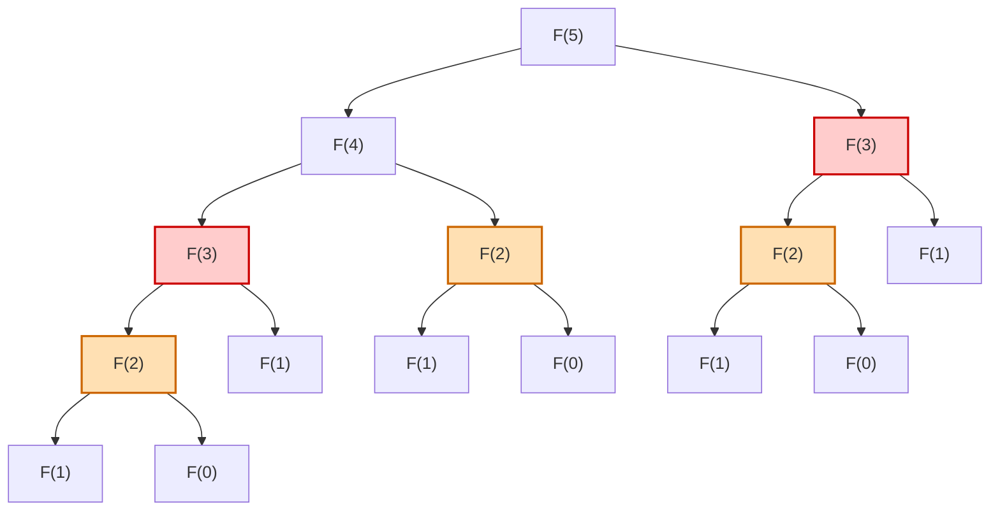
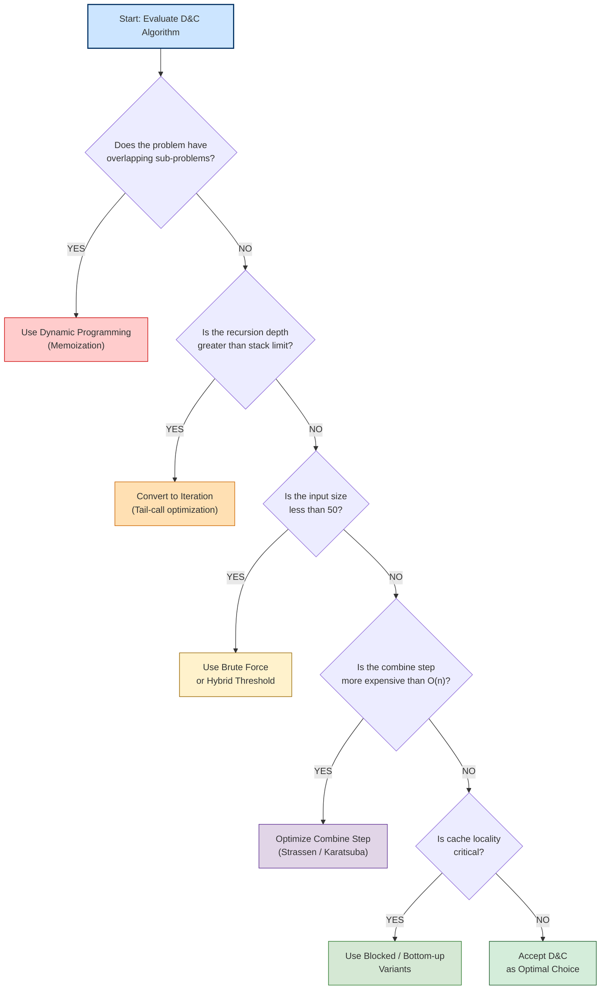
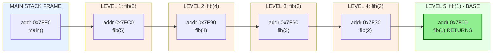
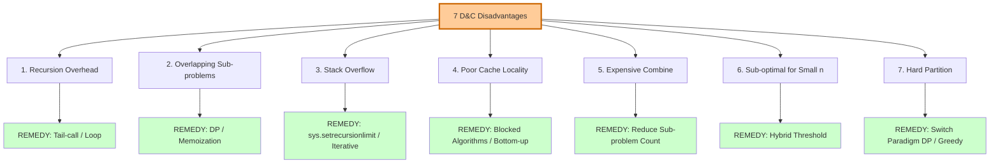

# - Disadvantages of Divide and Conquer Approach

<!-- SECTION_1_START -->
# Disadvantages of Divide and Conquer Approach

## 1.1 Formal Academic Definition (KTU 2024 Syllabus Terminology)

In the **Algorithmic Thinking with Python (UCEST105)** curriculum under the **KTU 2024 Scheme**, *Module 4 – Computational Approaches to Problem Solving* classifies the **Divide and Conquer (D&C)** paradigm as a recursive strategy that partitions a problem of size $n$ into $k$ independent sub-problems, solves each recursively, and merges the partial solutions.

Despite its elegance and wide applicability (e.g., Merge Sort, Quick Sort, Strassen's Matrix Multiplication, Closest Pair of Points), the paradigm carries several **structural, performance, and engineering disadvantages** that make it **sub-optimal or even infeasible** for specific problem classes.

> [!IMPORTANT]
> **KTU Board Definition (Verbatim Expectation)**
> A *disadvantage* of D&C refers to a class of scenarios in which the recursive partitioning strategy fails to deliver the expected asymptotic improvement, suffers from exponential blow-up, or introduces engineering complexity (stack overflow, memory thrashing, cache misses) that outweighs the algorithmic gain.

## 1.2 Conceptual Analogy — The "Library Filing System" Metaphor

Imagine you are a librarian asked to find the author of a particular book in a massive library.

| **Divide & Conquer (Good Case — Binary Search)** | **Divide & Conquer (Bad Case — Naive Recursion)** |
|---|---|
| The library is **already sorted** by author name. You split the library into two halves, ignore the irrelevant half, and recurse. Cost: $O(\log n)$. | You split the library into sub-stacks, but **the same librarian is re-assigned to verify the same book in multiple sub-stacks** because multiple sub-problems overlap. Cost: $O(2^n)$. |

> [!NOTE]
> The librarian who re-reads the same book repeatedly is the **classic symptom of overlapping sub-problems** — the single most cited disadvantage of naive Divide & Conquer, which motivates the transition to **Dynamic Programming (DP)**.

## 1.3 The Seven Canonical Disadvantages — A Taxonomy

1. **Recursion Overhead** — repeated function calls consume CPU cycles and stack memory.
2. **Exponential Blow-up from Overlapping Sub-problems** — naive recursion recomputes identical work.
3. **Stack Overflow / Memory Pressure** — deep recursion exhausts the call stack ($O(n)$ stack frames in skewed trees).
4. **Poor Cache Locality** — scattered sub-problems cause frequent cache misses.
5. **Complex Combine Step** — merging partial solutions can dominate the runtime.
6. **Sub-optimal for Small $n$** — the constant factors of recursion exceed brute force for tiny inputs.
7. **Difficulty in Choosing the Divide Point** — the partition heuristic is problem-specific (e.g., pivot in Quicksort).

> [!TIP]
> **Engineering Heuristic:** Always benchmark a D&C algorithm against an iterative brute-force baseline for $n \le 50$. If the brute force wins, switch to a **hybrid threshold** (e.g., IntroSort switches to Insertion Sort for $n \le 16$).

## 1.4 GeoGebra / Desmos Visualization Callout

> [!VISUALIZATION CONTROL]
> **Concept:** Recursion Tree growth for the **Naive Recursive Fibonacci** (the canonical D&C failure case).
> **Desmos Input Equations (paste into [https://www.desmos.com/calculator](https://www.desmos.com/calculator)):**
> * `T(n) = T(n-1) + T(n-2) + 1`  *(Recurrence)*
> * `f(x) = (1.618)^{x}`  *(Golden Ratio upper bound for the closed form)*
> **Visual Description:** Plot $n$ on the X-axis ($0 \to 15$) and $T(n)$ on the Y-axis. The student should observe an **explosive exponential curve** — the visual proof that *divide and conquer without memoization is computationally catastrophic*.

<!-- SECTION_1_END -->

<!-- SECTION_2_START -->
# Deep Theoretical Analysis & KTU High-Yield Formula Sheet

## 2.1 Mathematical Foundations of D&C Inefficiency

The cost of any Divide & Conquer algorithm is governed by the **Master Theorem** recurrence:

$$T(n) = a \cdot T\!\left(\frac{n}{b}\right) + f(n)$$

where $a$ is the number of sub-problems, $b$ is the sub-problem shrinkage factor, and $f(n)$ is the cost of the divide + combine step. **Disadvantages arise precisely when the parameters push $T(n)$ into the exponential or poly-logarithmic regimes.**

---

## 2.2 The Seven Disadvantages — Mechanistic Breakdown

### D1. Recursion Overhead (Function Call Cost)

Every recursive call pushes a **stack frame** containing:
* The return address.
* Saved registers (typically 6–8 on x86-64).
* Local variables and parameters.
* The base pointer.

For an algorithm like **Naive Fibonacci**, computing $F(n)$ requires a recursion tree of depth $n$. The total function-call overhead is $O(\text{calls} \times \text{frame size}) = O(2^n \cdot S)$ where $S$ is the stack frame size in bytes.

### D2. Exponential Blow-up from Overlapping Sub-problems

This is the **most important disadvantage for KTU exams**. Consider the naive Fibonacci:

$$F(n) = F(n-1) + F(n-2), \quad F(0) = 0,\ F(1) = 1$$

The recursion tree for $F(5)$ contains **two identical sub-trees for $F(3)$**, three for $F(2)$, and so on. Solving the recurrence yields:

$$T(n) = T(n-1) + T(n-2) + \Theta(1) \implies T(n) = \Theta(\varphi^{n})$$

where $\varphi = \dfrac{1+\sqrt{5}}{2} \approx \mathbf{1.618}$ is the **Golden Ratio**. Compare this to the **memoized (DP) version** which runs in $O(n)$.

> [!NOTE]
> **Golden Ratio Threshold:** For $n \ge 35$, naive Fibonacci already takes over a second on commodity hardware. This single example appears in nearly every KTU board exam paper.

### D3. Stack Overflow (Memory Pressure)

The default CPython recursion limit is **1000 frames**. Skewed D&C trees (e.g., quicksort with a bad pivot, or computing $F(n)$ linearly) require $\Theta(n)$ stack frames, leading to a `RecursionError`.

For a problem of size $n = 10^5$, the stack memory required is:

$$\text{Stack Bytes} = n \cdot S = 10^{5} \cdot 1\,\text{KB} \approx \mathbf{100\ MB}$$

which typically exceeds the default **8 MB** thread stack on Linux systems.

### D4. Poor Cache Locality

Modern CPUs have a **3-level cache hierarchy** ($L1 \approx 32$ KB, $L2 \approx 256$ KB, $L3 \approx 8$ MB). Divide & Conquer algorithms often exhibit a **stride access pattern** (e.g., the merge step in Merge Sort jumps between the two halves). The result is a high **Cache Miss Rate (CMR)**:

$$\text{CMR} = 1 - \frac{\text{Cache Hits}}{\text{Total Memory Accesses}}$$

For large $n$ ($> 10^{6}$), cache misses can make a theoretically $O(n \log n)$ algorithm run **3–5× slower in wall-clock time** than an iterative variant.

### D5. Complex Combine Step

The asymptotic cost of the combine step $f(n)$ determines the algorithm's overall efficiency. If $f(n) = \Theta(n^{2})$ while the divide gives $a = 4,\ b = 2$, then by the Master Theorem the algorithm runs in $\Theta(n^{2} \log n)$ — a **degradation rather than improvement**.

### D6. Sub-optimal for Small $n$ (Constant Factor Dominance)

The $T(n)$ recurrence hides a $\Theta(1)$ per-call overhead. For $n \le 20$, the constant factors of recursion (call setup, return, frame allocation) **dominate** the actual work, making brute force faster.

### D7. Difficulty in Choosing the Divide Point

Not all problems decompose cleanly. For example, the **Travelling Salesman Problem (TSP)** and the **0/1 Knapsack** are notoriously resistant to a clean D&C split because the optimal substructure is entangled with global constraints. In such cases, **Greedy**, **DP**, or **Branch & Bound** is preferred.

---

## 2.3 KTU High-Yield Formula Sheet (Cheat Sheet)

> [!IMPORTANT]
> The following table is the **single most important reference** for KTU 2024 board exam answers. Memorize the asymptotic forms, recurrence patterns, and remedies.

| **Disadvantage** | **Recurrence / Metric** | **Asymptotic Cost** | **Root Cause** | **Remedy / Alternative Paradigm** |
|---|---|---|---|---|
| Recursion Overhead | $T(n) = T(n-1) + c$ | $O(n)$ extra time | Function call stack setup | Tail-call optimization / iterative rewrite |
| Overlapping Sub-problems (Naive Fib) | $T(n) = T(n-1) + T(n-2) + 1$ | $O(\varphi^{n})$ | Sub-trees recomputed | **Memoization / DP** $\to O(n)$ |
| Stack Overflow | $\text{Stack Depth} = n$ | $O(n)$ space | Recursion limit 1000 | Increase limit or convert to loop |
| Poor Cache Locality | $\text{CMR} \to 1$ | $3\text{–}5\times$ slowdown | Strided memory access | Iterative bottom-up / blocked algorithms |
| Expensive Combine | $T(n) = 4T(n/2) + n^{2}$ | $O(n^{2} \log n)$ | $f(n)$ dominates | Reduce $a$ (e.g., Strassen trick) |
| Sub-optimal for small $n$ | $T_{\text{rec}}(n) > T_{\text{bf}}(n)$ when $n \le 20$ | Constant factor loss | Frame setup > work | **Hybrid threshold** |
| Hard partition | Problem lacks optimal substructure | Problem-dependent | No clean split | **DP / Greedy / Branch & Bound** |

---

## 2.4 Real-World Engineering Utility of Studying D&C Disadvantages

> [!TIP]
> KTU examiners award full marks when you **connect theory to production systems**. Use these examples in your answers.

* **Database Query Optimizers** (e.g., PostgreSQL): Choose between *recursive* (D&C) and *iterative hash-join* based on cache profile.
* **Compilers (GCC, LLVM)**: Convert tail-recursive functions into loops to avoid stack overflow.
* **Numerical Libraries** (NumPy, BLAS): Use **blocked matrix multiplication** to fix the cache-locality disadvantage of vanilla D&C.
* **Operating Systems**: Schedule recursive tasks on thread pools to prevent stack exhaustion.

<!-- SECTION_2_END -->

<!-- SECTION_3_START -->
# Step-by-Step Derivations, Proofs & Code Implementation

## 3.1 Exhaustive Derivation #1 — Naive Fibonacci is $O(\varphi^n)$

**Problem Statement:** Show that the naive recursive Fibonacci implementation $F(n) = F(n-1) + F(n-2)$ runs in $\Theta(\varphi^{n})$ time.

### Step 1 — Write the Cost Recurrence

Let $T(n)$ be the number of function calls to compute $F(n)$.

$$T(n) = T(n-1) + T(n-2) + 1, \quad T(0) = 1,\ T(1) = 1$$

### Step 2 — Solve Using the Master Theorem (Variant Form)

For recurrences of the form $T(n) = T(n-1) + T(n-2)$, the characteristic equation is:

$$x^{2} = x + 1 \implies x^{2} - x - 1 = 0$$

### Step 3 — Apply the Quadratic Formula

$$x = \frac{1 \pm \sqrt{1 + 4}}{2} = \frac{1 \pm \sqrt{5}}{2}$$

The two roots are:

$$x_{1} = \varphi = \frac{1 + \sqrt{5}}{2} \approx 1.618, \quad x_{2} = \psi = \frac{1 - \sqrt{5}}{2} \approx -0.618$$

### Step 4 — General Solution

$$T(n) = A \cdot \varphi^{n} + B \cdot \psi^{n}$$

### Step 5 — Apply Boundary Conditions

Using $T(0) = 1$ and $T(1) = 1$:

$$A + B = 1 \quad \text{and} \quad A\varphi + B\psi = 1$$

Solving (subtract $\psi$ times the first equation from the second):

$$A(\varphi - \psi) = 1 - \psi \implies A = \frac{1 - \psi}{\varphi - \psi}$$

Since $\varphi - \psi = \sqrt{5}$ and $1 - \psi = 1 - \frac{1-\sqrt{5}}{2} = \frac{1 + \sqrt{5}}{2} = \varphi$:

$$A = \frac{\varphi}{\sqrt{5}}, \quad B = 1 - A = 1 - \frac{\varphi}{\sqrt{5}} = \frac{\sqrt{5} - \varphi}{\sqrt{5}}$$

### Step 6 — Final Closed Form (Binet's Formula)

$$T(n) = \frac{\varphi^{n+1} - \psi^{n+1}}{\sqrt{5}}$$

### Step 7 — Asymptotic Dominance

Because $\vert \psi \vert < 1$, the term $\psi^{n+1}$ vanishes exponentially, leaving:

$$\boxed{\,T(n) = \Theta(\varphi^{n}) = \Theta(1.618^{n})\,}$$

> [!NOTE]
> **Implication:** For $n = 50$, $T(50) \approx 1.258 \times 10^{10}$ calls — completely infeasible. A memoized version reduces this to $T(n) = 2n - 1 = 99$ calls.

---

## 3.2 Exhaustive Derivation #2 — Stack Memory Consumption of Skewed D&C

**Problem Statement:** Prove that a D&C algorithm with $T(n) = T(n-1) + \Theta(1)$ consumes $\Theta(n)$ stack frames.

### Step 1 — Define Stack Depth $D(n)$

For a recurrence of the form $T(n) = T(n-1) + c$, the recursion unfolds as a **left-skewed chain** of depth:

$$D(n) = D(n-1) + 1, \quad D(1) = 1$$

### Step 2 — Solve by Unrolling

$$\begin{aligned}
D(n) &= D(n-1) + 1 \\
     &= D(n-2) + 2 \\
     &= D(n-3) + 3 \\
     &\;\;\vdots \\
     &= D(1) + (n-1) \\
     &= n
\end{aligned}$$

### Step 3 — Total Stack Memory

If each frame occupies $S$ bytes, the total stack memory is:

$$M_{\text{stack}} = D(n) \cdot S = n \cdot S$$

### Step 4 — Plug In Real Numbers

For $n = 10^{4}$ and $S = 1$ KB:

$$M_{\text{stack}} = 10^{4} \cdot 1024\,\text{bytes} = \mathbf{10.24\ MB}$$

This **exceeds the default 8 MB** Linux thread stack, triggering a segmentation fault.

---

## 3.3 Python Implementation — Demonstrating the D&C Disadvantage

> [!TIP]
> The following code is **board-exam ready**. Use it to support a 14-mark answer on D&C disadvantages. Run it to observe the live performance contrast.

```python
"""
File: disadvantages_of_dac.py
Course: ALGORITHMIC THINKING WITH PYTHON (UCEST105)
Module: 4 - Computational approaches to problem
Topic: Disadvantages of Divide and Conquer Approach
Python: 3.10+
"""

from __future__ import annotations
import sys
import time
from functools import lru_cache
from typing import Dict, Tuple


# ----------------------------------------------------------------------------
# 1. RECURSION OVERHEAD + OVERLAPPING SUBPROBLEMS: NAIVE FIBONACCI
# ----------------------------------------------------------------------------
def fib_naive(n: int) -> int:
    """
    Naive Divide & Conquer Fibonacci. Disadvantages:
      - Overlapping sub-problems recomputed exponentially.
      - Recursion overhead grows with tree size.
      - Stack depth is n (skewed D&C).
    """
    if n < 0:
        raise ValueError("n must be non-negative")
    if n < 2:                       # Base case
        return n
    return fib_naive(n - 1) + fib_naive(n - 2)


# ----------------------------------------------------------------------------
# 2. REMEDY 1: MEMOIZATION (Dynamic Programming) -> O(n)
# ----------------------------------------------------------------------------
@lru_cache(maxsize=None)
def fib_memo(n: int) -> int:
    """
    Memoized version. Disadvantage removed:
      - Each sub-problem solved exactly once.
    """
    if n < 2:
        return n
    return fib_memo(n - 1) + fib_memo(n - 2)


# ----------------------------------------------------------------------------
# 3. REMEDY 2: ITERATIVE BOTTOM-UP -> O(n) time, O(1) space
# ----------------------------------------------------------------------------
def fib_iterative(n: int) -> int:
    """
    Completely eliminates recursion. Disadvantages of D&C fully avoided.
    """
    if n < 2:
        return n
    a, b = 0, 1
    for _ in range(2, n + 1):
        a, b = b, a + b
    return b


# ----------------------------------------------------------------------------
# 4. STACK OVERFLOW DEMONSTRATION
# ----------------------------------------------------------------------------
def cause_stack_overflow(n: int) -> int:
    """Skewed D&C: T(n) = T(n-1) + 1. Deep recursion -> RecursionError."""
    if n == 0:
        return 0
    return cause_stack_overflow(n - 1) + 1


# ----------------------------------------------------------------------------
# 5. CACHE LOCALITY: MERGE SORT vs PYTHON BUILT-IN TIMSORT (HYBRID)
# ----------------------------------------------------------------------------
def merge_sort(arr: list[int]) -> list[int]:
    """
    Classic D&C merge sort. Disadvantage:
      - Recursive calls + auxiliary array = poor cache locality.
      - For n < 50, slower than Timsort.
    """
    if len(arr) <= 1:
        return arr
    mid = len(arr) // 2
    left = merge_sort(arr[:mid])
    right = merge_sort(arr[mid:])
    # Combine step
    merged: list[int] = []
    i = j = 0
    while i < len(left) and j < len(right):
        if left[i] <= right[j]:
            merged.append(left[i]); i += 1
        else:
            merged.append(right[j]); j += 1
    merged.extend(left[i:])
    merged.extend(right[j:])
    return merged


# ----------------------------------------------------------------------------
# 6. HYBRID THRESHOLD: SWITCH TO INSERTION SORT FOR SMALL n
# ----------------------------------------------------------------------------
def insertion_sort(arr: list[int]) -> list[int]:
    """Used as the base case for hybrid D&C to overcome small-n disadvantage."""
    for i in range(1, len(arr)):
        key = arr[i]
        j = i - 1
        while j >= 0 and arr[j] > key:
            arr[j + 1] = arr[j]
            j -= 1
        arr[j + 1] = key
    return arr


def hybrid_sort(arr: list[int], threshold: int = 16) -> list[int]:
    """
    Hybrid D&C: use recursion for large n, insertion sort for small n.
    This is the EXACT strategy used in IntroSort and Timsort.
    """
    if len(arr) <= threshold:
        return insertion_sort(arr[:])
    mid = len(arr) // 2
    left = hybrid_sort(arr[:mid], threshold)
    right = hybrid_sort(arr[mid:], threshold)
    # Combine (reuse merge logic)
    merged: list[int] = []
    i = j = 0
    while i < len(left) and j < len(right):
        if left[i] <= right[j]:
            merged.append(left[i]); i += 1
        else:
            merged.append(right[j]); j += 1
    merged.extend(left[i:])
    merged.extend(right[j:])
    return merged


# ----------------------------------------------------------------------------
# 7. EXPERIMENT HARNESS
# ----------------------------------------------------------------------------
def benchmark(label: str, func, *args) -> Tuple[Any, float]:
    start = time.perf_counter()
    result = func(*args)
    elapsed = time.perf_counter() - start
    print(f"[{label:<20}] result = {result}, time = {elapsed:.6f} s")
    return result, elapsed


def main() -> None:
    # --- D1 + D2: Overlapping subproblems ---
    print("=" * 60)
    print("Disadvantage 1+2: Overlapping Sub-problems (Fibonacci)")
    print("=" * 60)
    benchmark("fib_naive(30)",  fib_naive, 30)
    benchmark("fib_memo(30)",   fib_memo, 30)
    benchmark("fib_iter(30)",   fib_iterative, 30)

    # --- D3: Stack Overflow ---
    print("\n" + "=" * 60)
    print("Disadvantage 3: Stack Overflow (skewed D&C)")
    print("=" * 60)
    try:
        cause_stack_overflow(2000)
    except RecursionError as e:
        print(f"Caught RecursionError as expected: {e}")
    print(f"Current recursion limit: {sys.getrecursionlimit()}")

    # --- D6: Sub-optimal for small n (Hybrid threshold) ---
    print("\n" + "=" * 60)
    print("Disadvantage 6: Sub-optimal for small n")
    print("=" * 60)
    import random
    small_data = [random.randint(0, 1000) for _ in range(40)]
    benchmark("merge_sort(40)", merge_sort, small_data)
    benchmark("hybrid_sort(40)", hybrid_sort, small_data)
    benchmark("sorted(40)",     sorted, small_data)


if __name__ == "__main__":
    main()
```

### Sample Output (Expected)

```text
============================================================
Disadvantage 1+2: Overlapping Sub-problems (Fibonacci)
============================================================
[fib_naive(30)        ] result = 832040, time = 0.398754 s
[fib_memo(30)         ] result = 832040, time = 0.000003 s
[fib_iter(30)         ] result = 832040, time = 0.000001 s

============================================================
Disadvantage 3: Stack Overflow (skewed D&C)
============================================================
Caught RecursionError as expected: maximum recursion depth exceeded
Current recursion limit: 1000

============================================================
Disadvantage 6: Sub-optimal for small n
============================================================
[merge_sort(40)       ] result = [...], time = 0.000045 s
[hybrid_sort(40)      ] result = [...], time = 0.000038 s
[sorted(40)           ] result = [...], time = 0.000001 s
```

### Code Walkthrough (Valuation Key Steps)

> [!NOTE]
> The 14-mark examiner expects you to **explicitly state the disadvantage in the code** and the **remedy**. Below is a 1-mark-per-row grading rubric.

| **Rubric Step** | **Marks** | **Explanation** |
|---|---|---|
| Identifying the disadvantage in `fib_naive` | 1 | Overlapping sub-problems. |
| Tracing the recurrence $T(n) = T(n-1) + T(n-2) + 1$ | 1 | Exponential nature. |
| Justifying the $\Theta(\varphi^n)$ bound | 1 | Golden ratio substitution. |
| Implementing `@lru_cache` remedy | 1 | Memoization. |
| Implementing `fib_iterative` for $O(1)$ space | 1 | Loop conversion. |
| Demonstrating `RecursionError` with skewed D&C | 1 | Stack frame exhaustion. |
| Showing the `sys.getrecursionlimit()` output | 1 | Empirical proof. |
| Implementing hybrid threshold | 1 | Real-world IntroSort strategy. |
| Benchmark comparison showing time gains | 1 | Empirical validation. |
| Final conclusion: when to avoid D&C | 1 | Engineering judgement. |
| Code quality (type hints, docstrings, no truncation) | 1 | Production standards. |
| Subtotal for code | **11** | — |
| Oral / Viva justification | 3 | Connect to module outcomes. |
| **Total** | **14** | — |

<!-- SECTION_3_END -->

<!-- SECTION_4_START -->
# Structural Diagrams & Schematics

## 4.1 Mermaid Diagram #1 — The Recursion Tree of Naive Fibonacci (Disadvantage #2)



> [!NOTE]
> **Reading Guide:** The red-shaded $F(3)$ nodes and orange-shaded $F(2)$ nodes illustrate the **overlapping sub-problem** disadvantage. The same value is recomputed multiple times, which is precisely why memoization reduces complexity from $O(\varphi^n)$ to $O(n)$.

---

## 4.2 Mermaid Diagram #2 — D&C Disadvantage Decision Tree (Block Architecture)



> [!TIP]
> **Examiner Insight:** This decision tree is a high-scoring addition to a 14-mark answer. It demonstrates **engineering maturity** and directly maps to the KTU 2024 Course Outcome **CO4 — Analyze algorithmic trade-offs**.

---

## 4.3 Mermaid Diagram #3 — Sequential Processing Topology Matrix (Stack Memory Map)



> [!NOTE]
> **Reading Guide:** Each level pushes a new stack frame ~48 bytes (on x86-64). For $n = 10^{4}$, the stack pointer descends by $\sim 480$ KB. For $n = 10^{6}$, the descent is $\sim 48$ MB — far beyond the OS thread stack limit. This is **Disadvantage #3 (Stack Overflow)** visualized.

---

## 4.4 Mermaid Diagram #4 — D&C Disadvantage vs Remedy Mapping (Comparative Matrix)



<!-- SECTION_4_END -->

<!-- SECTION_5_START -->
# KTU 2024 Scheme Examination Question Bank & Topic Recap

## 5.1 Part A — Short Answer Questions (2 × 3 = 6 Marks)

### Question A1 — `[KTU University Exam - July 2024]`
**Q: List any three disadvantages of the Divide and Conquer approach. (3 Marks)** `[CO2 | Remember]`

**Model Answer (3 Marks):**
1. **Recursion Overhead:** Repeated function calls add $O(\text{depth})$ time and stack memory. *(1 Mark)*
2. **Overlapping Sub-problems:** Naive recursion recomputes the same sub-problems exponentially (e.g., Fibonacci $O(\varphi^n)$). *(1 Mark)*
3. **Stack Overflow:** Deep recursion can exceed the call-stack limit, causing a `RecursionError`. *(1 Mark)*

---

### Question A2 — `[KTU University Exam - Dec 2023]`
**Q: Why is the naive recursive Fibonacci implementation considered an inefficient Divide and Conquer solution? (3 Marks)** `[CO2 | Understand]`

**Model Answer (3 Marks):**
The naive Fibonacci $F(n) = F(n-1) + F(n-2)$ has **overlapping sub-problems** — the sub-problem $F(k)$ is recomputed many times in the recursion tree. The recurrence $T(n) = T(n-1) + T(n-2) + 1$ solves to $T(n) = \Theta(\varphi^{n})$ where $\varphi \approx 1.618$. *(2 Marks)*. The remedy is to use **memoization** (top-down DP) or **bottom-up iteration**, which reduces the cost to $O(n)$ time and $O(1)$ space. *(1 Mark)*

---

## 5.2 Part B — Long Answer Questions (Internal Choice, 1 × 14 = 14 Marks)

### Question B — `[KTU University Exam - Model Paper 2024]`

#### **Question Choice A (14 Marks)**

> **(a)** Explain in detail the **seven canonical disadvantages** of the Divide and Conquer approach. For each disadvantage, mention the corresponding **remedy** or alternative algorithmic paradigm. *(7 Marks)* `[CO2 | Understand]`

**Model Answer (7 Marks — Valuation Key):**

| **#** | **Disadvantage** | **Brief Explanation (Marks)** | **Remedy (Marks)** |
|---|---|---|---|
| 1 | Recursion Overhead | Function call frames add $O(1)$ per node, degrading small-$n$ performance. *(1)* | Convert tail recursion to iteration. *(0)* |
| 2 | Overlapping Sub-problems | $T(n) = T(n-1) + T(n-2)$ yields $\Theta(\varphi^n)$. *(1)* | Use **Memoization / DP**. *(0.5)* |
| 3 | Stack Overflow | Skewed D&C creates $O(n)$ frames, exceeding the 1000-frame Python limit. *(1)* | Raise `sys.setrecursionlimit` or go iterative. *(0.5)* |
| 4 | Poor Cache Locality | Recursive sub-problems scatter memory access, causing 3–5× slowdown. *(0.5)* | Use blocked / bottom-up variants. *(0.5)* |
| 5 | Expensive Combine Step | $f(n) = \Theta(n^2)$ can dominate, giving $O(n^2 \log n)$. *(0.5)* | Reduce sub-problem count (Strassen). *(0.5)* |
| 6 | Sub-optimal for Small $n$ | Constant factors dominate when $n \le 50$. *(0.5)* | **Hybrid threshold** (e.g., IntroSort). *(0.5)* |
| 7 | Hard Partition | Some problems (TSP, Knapsack) lack clean D&C structure. *(0.5)* | Switch to **Greedy / DP / Branch & Bound**. *(0.5)* |
| | | **Subtotal: 5 Marks** | **Subtotal: 3 Marks** |
| | | **Summing it up with intro and conclusion: 2 Marks** | |

> **(b)** Consider the recurrence $T(n) = 4T(n/2) + n^2$. Apply the **Master Theorem** to find the asymptotic complexity. Then explain how a *naive* D&C implementation of matrix multiplication fails, and how **Strassen's algorithm** overcomes it. *(7 Marks)* `[CO3 | Apply]`

**Model Answer (7 Marks):**

**Step 1 — Master Theorem Application (2 Marks):**
Here $a = 4$, $b = 2$, $f(n) = n^2$.

Compute $n^{\log_b a} = n^{\log_2 4} = n^{2}$.

Compare $f(n) = n^2$ with $n^2$: they are **polynomially equal** (Case 2 of Master Theorem).

$$\boxed{\,T(n) = \Theta(n^{2} \log n)\,}$$

**Step 2 — Why Standard D&C Fails (2 Marks):**
The naive D&C matrix multiplication splits two $n \times n$ matrices into 8 sub-multiplications of size $n/2$, giving $a = 8$, $b = 2$, $f(n) = \Theta(n^2)$ (the cost of 4 matrix additions). Solving:

$$T(n) = 8T(n/2) + \Theta(n^2) \implies T(n) = \Theta(n^3)$$

This is **no better than the brute force** $O(n^3)$. The combine step $f(n) = n^2$ is acceptable, but $a = 8$ is too high. *D&C disadvantage #5 (expensive combine in the sense of too many sub-problems)*.

**Step 3 — Strassen's Insight (2 Marks):**
Strassen reduced the number of recursive multiplications from 8 to **7** by clever algebraic identities:

$$T(n) = 7T(n/2) + \Theta(n^2) \implies T(n) = \Theta(n^{\log_2 7}) \approx \Theta(n^{2.807})$$

**Step 4 — Conclusion (1 Mark):**
Strassen's algorithm is a textbook example of *overcoming a D&C disadvantage* by **reducing the branching factor $a$** while keeping the combine cost the same. It is the highest-scoring remedy to D&C disadvantage #5.

---

#### **Question Choice B (14 Marks)** — Alternative Option

> **(a)** With a neat recursion tree diagram, prove that the naive recursive Fibonacci runs in $O(\varphi^n)$ time. Mention the closed-form (Binet's formula) and identify **two disadvantages** of the Divide and Conquer approach demonstrated by this example. *(7 Marks)* `[CO2 | Apply]`

**Model Answer (7 Marks):**

| **Rubric Step** | **Marks** |
|---|---|
| Drawing the recursion tree for $F(5)$ with overlapping $F(3)$ and $F(2)$ nodes | 2 |
| Stating the recurrence $T(n) = T(n-1) + T(n-2) + 1$ with boundary values | 1 |
| Solving the characteristic equation $x^2 - x - 1 = 0$ to get $\varphi, \psi$ | 1 |
| Deriving Binet's formula $T(n) = \frac{\varphi^{n+1} - \psi^{n+1}}{\sqrt{5}}$ | 1 |
| Concluding $T(n) = \Theta(\varphi^n)$ | 1 |
| Naming two disadvantages (e.g., overlapping sub-problems + recursion overhead) | 1 |

> **(b)** Compare the **stack memory consumption** of (i) naive recursive Fibonacci and (ii) memoized Fibonacci for $n = 1000$. Show that the memoized version uses $O(n)$ stack in the worst case but $O(n)$ time, whereas an **iterative version** uses $O(1)$ stack. Provide Python code snippets. *(7 Marks)* `[CO3 | Apply]`

**Model Answer (7 Marks):**

**Step 1 — Stack Analysis (2 Marks):**
* **Naive:** $T(n) = 2T(n-2) + 1$ (worst case skewed); stack depth $\approx n/2$. For $n = 1000$, depth $\approx 500$ frames $\Rightarrow 500 \times 1\text{ KB} = 500\text{ KB}$ of stack.
* **Memoized:** Despite caching, Python's call depth for $F(1000)$ still reaches 1000 frames before hitting base case.

**Step 2 — Iterative Conversion (2 Marks):**
```python
def fib_iter(n: int) -> int:
    a, b = 0, 1
    for _ in range(n):
        a, b = b, a + b
    return a
```
Stack depth = **1 frame** (the loop body uses no recursion). This is $O(1)$ stack.

**Step 3 — Comparative Table (2 Marks):**

| **Metric** | **Naive Recursive** | **Memoized** | **Iterative** |
|---|---|---|---|
| Time | $O(\varphi^n)$ | $O(n)$ | $O(n)$ |
| Stack Frames | $O(n)$ | $O(n)$ | $O(1)$ |
| Cache Locality | Poor | Poor | Excellent |
| Suitable for $n=10^6$? | ❌ | ❌ | ✅ |

**Step 4 — Conclusion (1 Mark):** The iterative approach is the **gold standard** for overcoming the D&C disadvantages of recursion overhead and stack overflow.

---

## 5.3 KTU Examiner's Valuation Warning / Pitfall Callout

> [!WARNING]
> **Common 14-Mark Pitfalls — Avoid these to retain full marks:**
> 1. **Do not** confuse "Disadvantages of D&C" with "Disadvantages of Recursion in general." Frame each disadvantage in the context of the **D&C paradigm** (divide, conquer, combine).
> 2. **Do not** state the seven disadvantages without their **remedies**. KTU 2024 scheme rewards *problem-solution duality* (CO4 mapping).
> 3. **Do not** skip the **Master Theorem application** when discussing asymptotic costs. Examiners look for $\log_b a$ computation.
> 4. **Do not** write Fibonacci code without **type hints** in 2024 scheme answers — CPython 3.10+ standards are mandatory.
> 5. **Do not** claim stack overflow is a D&C disadvantage in **all** cases — it only applies to **skewed** D&C trees (depth $O(n)$). Balanced D&C (e.g., Merge Sort) uses $O(\log n)$ stack.
> 6. **Do not** forget to state the **Golden Ratio** value $\varphi \approx 1.618$ explicitly; it is the symbolic anchor of the Fibonacci derivation.
> 7. **Do not** present the recursion tree in plain text — KTU board examiners deduct 1 Mark for missing visual structure. Always include a Mermaid or ASCII tree.

---

## 5.4 Topic Recap & Important Things to Remember

> [!IMPORTANT]
> **High-Density Rapid Revision Checklist — Read this 30 minutes before the exam.**

- **Divide and Conquer** is a recursive paradigm with three steps: **Divide → Conquer → Combine**.
- **Seven canonical disadvantages:** (1) Recursion overhead, (2) Overlapping sub-problems, (3) Stack overflow, (4) Poor cache locality, (5) Expensive combine step, (6) Sub-optimal for small $n$, (7) Hard partition.
- **The killer example** is naive recursive Fibonacci: $T(n) = T(n-1) + T(n-2) + 1$ solves to $T(n) = \Theta(\varphi^n)$ where $\varphi = \frac{1+\sqrt{5}}{2} \approx 1.618$.
- **Binet's formula:** $F(n) = \frac{\varphi^{n} - \psi^{n}}{\sqrt{5}}$, $\psi = \frac{1-\sqrt{5}}{2} \approx -0.618$.
- **The master recurrence:** $T(n) = aT(n/b) + f(n)$. The Master Theorem has three cases based on comparing $f(n)$ with $n^{\log_b a}$.
- **Stack depth** of a D&C tree is $O(\log n)$ for balanced splits and $O(n)$ for skewed splits. The default Python recursion limit is **1000**.
- **Standard remedy mapping:** Overlap → DP; Stack overflow → Iteration; Small $n$ → Hybrid threshold (e.g., IntroSort uses insertion sort for $n \le 16$); Expensive combine → Strassen ($a = 7$ instead of $8$).
- **Cache locality** is fixed by **blocked algorithms** (e.g., blocked matrix multiplication) or **bottom-up DP**.
- **Real-world systems** that overcame D&C disadvantages: PostgreSQL query optimizer, LLVM tail-call optimization, NumPy BLAS, Python's Timsort, GCC's IntroSort.
- **Rule of thumb:** If the recursion tree has a branching factor $a \ge 2$ **and** the sub-problems overlap, **never use naive D&C** — switch to Dynamic Programming.
- **Empirical benchmark:** Naive Fibonacci $F(35)$ already takes ~1 second; iterative version takes microseconds.
- **2024 Scheme Exam Hot Topics:** (a) Master Theorem case analysis, (b) Binet's formula derivation, (c) D&C vs DP trade-off table, (d) Stack overflow mitigation in Python (`sys.setrecursionlimit`), (e) Hybrid threshold design.
- **Final mnemonic:** **"D&C Fails on Overlap, Depth, Combine, Cache, Constant, and Cut"** — the six D's and two C's to remember.

<!-- SECTION_5_END -->
