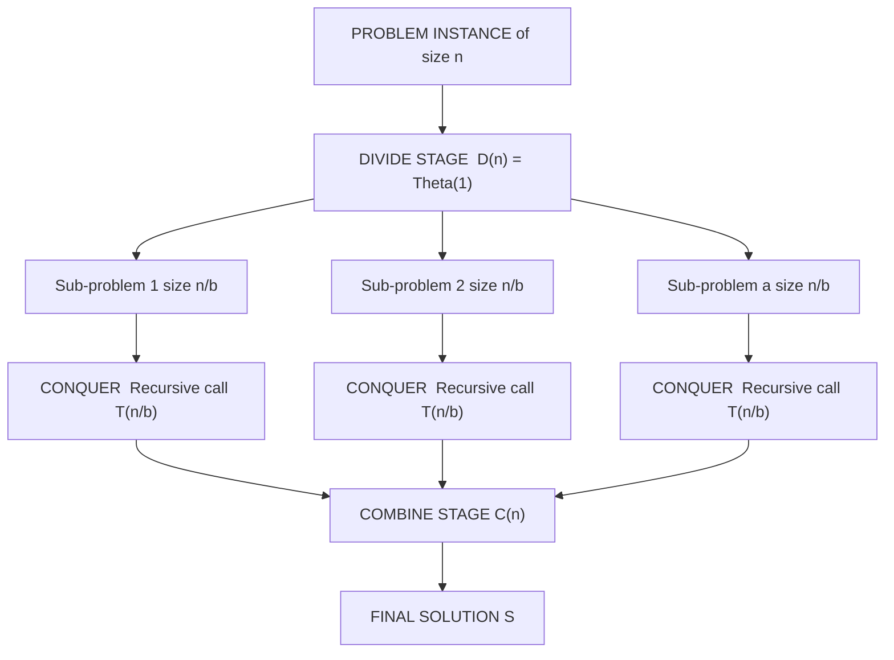
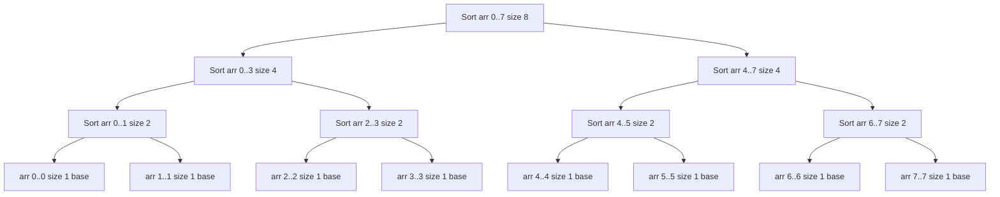
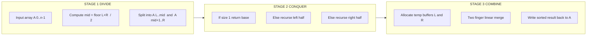
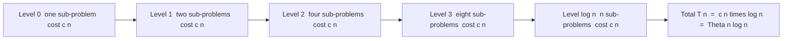

# Divide-and-conquer Approach - - Example: The Merge Sort Algorithm - Advantages of Divide and Conquer Approach - Disadvantages of Divide and Conquer Approach

<!-- SECTION_1_START -->
# Divide-and-Conquer Approach & Merge Sort

## 1. Core Technical Definition

> [!IMPORTANT]
> **Divide and Conquer (D&C)** is a fundamental algorithmic paradigm in which a problem is recursively broken down into **two or more sub-problems of the same or related type**, until these sub-problems become simple enough to be solved directly. The solutions to the sub-problems are then **combined** to give a solution to the original problem.

In the formal KTU 2024 Scheme context (UCEST105 – Algorithmic Thinking with Python), the **Divide and Conquer** approach is a three-stage recursive problem-solving strategy that transforms a single complex instance $P$ into smaller independent instances, solves them, and merges their results. It is the conceptual foundation for several $\Theta(n \log n)$ sorting and searching algorithms such as **Merge Sort**, **Quick Sort**, **Binary Search**, **Strassen's Matrix Multiplication**, and **Closest Pair of Points**.

### 1.1 The Three Canonical Stages

A Divide-and-Conquer algorithm operates through three mathematically defined stages:

1. **Divide** — Partition the problem instance $P$ of size $n$ into $a$ smaller sub-instances $P_1, P_2, \dots, P_a$, each of size approximately $n / b$.
2. **Conquer** — Solve each sub-instance $P_i$ recursively. If the size of a sub-instance is small enough ($n \le c$ for some constant threshold $c$), solve it by brute force (the **base case**).
3. **Combine** — Merge the solutions of the sub-instances $S_1, S_2, \dots, S_a$ to form the final solution $S$ to the original instance $P$.

The standard recurrence relation that describes the running time of a Divide-and-Conquer algorithm is:

$$
T(n) = \begin{cases} \Theta(1) & \text{if } n \le c \\ a \cdot T\!\left(\dfrac{n}{b}\right) + D(n) + C(n) & \text{if } n > c \end{cases}
$$

where $D(n)$ is the cost of dividing the problem, $C(n)$ is the cost of combining the sub-solutions, and $a \ge 1$, $b > 1$.

### 1.2 Intuitive Real-World Analogy

> [!NOTE]
> **Analogy — The Library Book Sorting Scenario**
>
> Imagine you are a librarian with a huge, unsorted pile of **1024 books** that need to be arranged by accession number. Instead of sorting the entire pile at once (which is overwhelming), you do the following:
>
> 1. **Divide:** Split the pile into **2 smaller piles of 512 books** each. Then split each of those into **2 piles of 256**, and so on, until every pile contains only **1 book**. A single book is trivially "sorted."
> 2. **Conquer:** Each single-book pile is already a sorted list of size 1 — no work needed.
> 3. **Combine:** Walk back up the recursion tree. Take two sorted piles of size 1, **merge** them into a sorted pile of size 2. Then merge two sorted piles of size 2 into a sorted pile of size 4. Continue until you have one giant, perfectly sorted pile of 1024 books.
>
> The total work is *linear at every level of the tree*, and there are only $\log_2 1024 = 10$ levels, giving the famous $\Theta(n \log n)$ complexity.

### 1.3 Visualization of the Recursive Structure

> [!VISUALIZATION CONTROL]
> **Concept:** Recursive splitting and merging of an 8-element array `[5, 2, 4, 7, 1, 3, 8, 6]` in Merge Sort.
> **GeoGebra / Desmos Input:**
> Use the GeoGebra *Tree Diagram* or manually plot recursion levels:
> * Root: $n = 8$
> * Level 1: $n = 4$ (twice)
> * Level 2: $n = 2$ (four times)
> * Level 3: $n = 1$ (eight times)
> * Height: $\log_2 8 = 3$
> **Visual Description:** The student should observe a perfectly balanced binary tree where each level has a total of $n$ elements being processed, and the tree has exactly $\lceil \log_2 n \rceil$ levels.


*(Image reference — public domain Wikimedia Commons depiction of Merge Sort recursion tree.)*

### 1.4 Merge Sort — The Canonical Example

> [!IMPORTANT]
> **Merge Sort** is the textbook Divide-and-Conquer sorting algorithm. It was invented by **John von Neumann** in **1945** and remains one of the most important sorting algorithms in computer science. It guarantees a worst-case time complexity of $\Theta(n \log n)$ and is a **stable** sort.

**Informal statement:** Given an unsorted array $A[0 \dots n-1]$, Merge Sort recursively splits the array into halves, sorts each half, and then merges the two sorted halves into a single sorted array using a linear-time merge procedure.

### 1.5 Why D&C Matters in Production Engineering

- **Databases:** External merge sort is the standard algorithm used to sort data that exceeds RAM capacity (e.g., PostgreSQL's `tuplesort`, GNU `sort`).
- **Distributed Computing:** Hadoop and Spark's `sortByKey` and Terasort use divide-and-conquer sharding strategies.
- **Computer Graphics:** Closest-pair-of-points and convex hull algorithms.
- **Numerical Computing:** FFT (Fast Fourier Transform) — the most important D&C algorithm in scientific computing.
- **Parallelism:** Independent sub-problems map naturally onto multi-core CPUs and GPU threads.

---

<!-- SECTION_1_END -->

<!-- SECTION_2_START -->
# 2. Deep Theoretical Analysis & KTU High-Yield Formula Sheet

## 2.1 The Three-Stage D&C Pipeline (Detailed)

A Divide-and-Conquer algorithm is rigorously defined by the interaction of its three phases. Below is the operational decomposition that KTU examiners expect in 14-mark answers.

### Phase 1 — Divide

- The instance of size $n$ is partitioned into $a$ independent sub-instances.
- For Merge Sort, $a = 2$ and the partition is by **index range**: $A[\text{left} \dots \text{mid}]$ and $A[\text{mid}+1 \dots \text{right}]$, where $\text{mid} = \lfloor (\text{left} + \text{right}) / 2 \rfloor$.
- Cost $D(n) = \Theta(1)$ for Merge Sort (just computes the midpoint).

### Phase 2 — Conquer

- Recursive calls solve each sub-instance.
- Base case: when the sub-array contains **0 or 1 elements**, it is already sorted, so the recursion terminates.
- Cost captured by the recurrence term $a \cdot T(n/b)$.

### Phase 3 — Combine

- The `MERGE(A, left, mid, right)` procedure takes two sorted sub-arrays and produces a single sorted sub-array.
- Cost $C(n) = \Theta(n)$ because each element is compared and copied a constant number of times.
- This linear-time merge is the **key engineering insight** that allows the overall algorithm to be $O(n \log n)$ rather than $O(n^2)$.

## 2.2 Recurrence Relation of Merge Sort

The full recurrence for Merge Sort is:

$$
T(n) = \begin{cases} \Theta(1) & \text{if } n \le 1 \\ 2 \cdot T\!\left(\dfrac{n}{2}\right) + \Theta(n) & \text{if } n > 1 \end{cases}
$$

Reading this aloud: *"To sort $n$ elements, we sort $n/2$ elements twice, and then we spend linear time merging the two halves."*

## 2.3 Application of the Master Theorem

The **Master Theorem** is the most exam-relevant tool in KTU Module 4. For a recurrence of the form

$$
T(n) = a \cdot T\!\left(\frac{n}{b}\right) + f(n)
$$

we compare $f(n)$ with $n^{\log_b a}$.

| Parameter | Value for Merge Sort | Interpretation |
| :--- | :--- | :--- |
| $a$ (number of sub-problems) | $2$ | Two recursive calls |
| $b$ (size reduction factor) | $2$ | Each half is $n/2$ |
| $f(n)$ (combine cost) | $\Theta(n)$ | Linear-time merge |
| $\log_b a$ | $\log_2 2 = 1$ | Critical exponent |
| $n^{\log_b a}$ | $n^{1} = n$ | Threshold function |
| Comparison $f(n)$ vs $n^{\log_b a}$ | $\Theta(n) = \Theta(n)$ | Case 2 of Master Theorem |

> [!IMPORTANT]
> **Case 2 of the Master Theorem applies:** Since $f(n) = \Theta(n^{\log_b a}) = \Theta(n)$, the solution is $T(n) = \Theta(n^{\log_b a} \cdot \log n) = \Theta(n \log n)$.

## 2.4 KTU High-Yield Formula Sheet

> [!NOTE]
> The following table is the **complete formula inventory** for any KTU 2024 question on D&C and Merge Sort. Memorize these — they appear verbatim in board answer keys.

| Concept | Formula / Expression | Notation | Use Case |
| :--- | :--- | :--- | :--- |
| General D\&C recurrence | $T(n) = a \cdot T(n / b) + f(n)$ | $a \ge 1,\ b > 1$ | All D\&C algorithms |
| Merge Sort recurrence | $T(n) = 2 \cdot T(n/2) + \Theta(n)$ | $T(1) = \Theta(1)$ | Specific to Merge Sort |
| Master Theorem Case 1 | $T(n) = \Theta(n^{\log_b a})$ | if $f(n) = O(n^{\log_b a - \epsilon})$ | $f(n)$ polynomially smaller |
| Master Theorem Case 2 | $T(n) = \Theta(n^{\log_b a} \log n)$ | if $f(n) = \Theta(n^{\log_b a})$ | $f(n)$ matches the threshold |
| Master Theorem Case 3 | $T(n) = \Theta(f(n))$ | if $f(n) = \Omega(n^{\log_b a + \epsilon})$ | $f(n)$ polynomially larger |
| Merge Sort time complexity | $\Theta(n \log n)$ | Worst, Average, Best | All cases identical |
| Merge Sort space complexity | $\Theta(n)$ | Auxiliary array | Not in-place |
| Recursion tree levels | $\lceil \log_2 n \rceil$ | Depth of call stack | Tree height |
| Work per level | $\Theta(n)$ | Total comparisons + copies | At every level |
| Number of leaves | $n$ | Each of size 1 | Recursion termination |
| Number of internal nodes | $n - 1$ | Each non-leaf | Tree structure |
| Merge comparisons (worst) | $n - 1$ | Per merge call | Linear in $n$ |
| Merge comparisons (best) | $\lfloor n/2 \rfloor$ | When all elements of one half are smaller | Still linear |

## 2.5 Engineering Trade-offs at a Glance

| Aspect | Merge Sort | Why It Matters |
| :--- | :--- | :--- |
| Worst-case guarantee | $\Theta(n \log n)$ | Crucial for real-time systems |
| Stability | **Yes** (preserves equal-key order) | Required in database multi-key sorts |
| In-place | **No** — needs $O(n)$ auxiliary memory | Cache-unfriendly for huge $n$ |
| Parallelizable | **Highly** — sub-problems are independent | Used in distributed sort |
| Adaptive | **No** — always does $\Theta(n \log n)$ | Quicksort is faster on nearly-sorted data |
| External memory | **Excellent** — sequential access | Database and file-system sorts |

> [!IMPORTANT]
> **Syllabus Highlight (KTU 2024 — UCEST105 Module 4):** Students are required to (i) describe the D\&C paradigm, (ii) state and solve the Merge Sort recurrence using the Master Theorem, and (iii) write the recursive Python implementation with proper base-case handling.

---

<!-- SECTION_2_END -->

<!-- SECTION_3_START -->
# 3. Step-by-Step Derivations & Code Implementation

## 3.1 Exhaustive Derivation of $T(n) = \Theta(n \log n)$ for Merge Sort

We solve $T(n) = 2T(n/2) + cn$ where $c$ is a positive constant, using the **recursion-tree method** as expected in KTU 14-mark answers.

### Step 1 — Tree Structure Setup

At the **root (level 0)**, the total work is $cn$. This root spawns **2 sub-problems**, each of size $n/2$.

$$
\text{Work at level } 0 = cn
$$

### Step 2 — Work at Level 1

Each of the 2 sub-problems incurs a combine cost of $c \cdot (n/2)$. Total work at level 1:

$$
\text{Work at level } 1 = 2 \times c \cdot \frac{n}{2} = cn
$$

### Step 3 — Work at Level 2

Each level-1 sub-problem spawns 2 sub-problems of size $n/4$, giving 4 sub-problems each with cost $c \cdot (n/4)$.

$$
\text{Work at level } 2 = 4 \times c \cdot \frac{n}{4} = cn
$$

### Step 4 — Inductive Pattern

By induction, at level $i$ of the recursion tree, there are $2^{i}$ sub-problems, each of size $n / 2^{i}$, and the combine cost per sub-problem is $c \cdot n / 2^{i}$. Thus:

$$
\text{Work at level } i = 2^{i} \times c \cdot \frac{n}{2^{i}} = cn
$$

This is independent of $i$ — every level of the tree contributes exactly $cn$ work.

### Step 5 — Number of Levels

The recursion bottoms out when sub-problem size reaches 1:

$$
\frac{n}{2^{L}} = 1 \quad \Longrightarrow \quad 2^{L} = n \quad \Longrightarrow \quad L = \log_{2} n
$$

### Step 6 — Total Work

Summing the work over all $L = \log_2 n$ levels, plus the base-case work at the leaves:

$$
T(n) = \sum_{i=0}^{L-1} cn + \Theta(n) = cn \cdot L + \Theta(n) = cn \log_{2} n + \Theta(n)
$$

Therefore:

$$
T(n) = \Theta(n \log n)
$$

This completes the derivation. The constant factor $c$ and the $\Theta(n)$ leaf cost are both dominated by the leading $cn \log_2 n$ term, so the final asymptotic bound is tight.

## 3.2 Worked Numerical Trace of Merge Sort

Let $A = [5, 2, 4, 7, 1, 3, 8, 6]$. The recursion unfolds as follows:

| Call | Input Array | mid | Left Recurse | Right Recurse | Merge |
| :--- | :--- | :--- | :--- | :--- | :--- |
| `merge_sort(A, 0, 7)` | `[5,2,4,7,1,3,8,6]` | 3 | sort `A[0..3]` | sort `A[4..7]` | merge |
| `merge_sort(A, 0, 3)` | `[5,2,4,7]` | 1 | sort `A[0..1]` | sort `A[2..3]` | merge |
| `merge_sort(A, 0, 1)` | `[5,2]` | 0 | base `[5]` | base `[2]` | $\rightarrow [2,5]$ |
| `merge_sort(A, 2, 3)` | `[4,7]` | 2 | base `[4]` | base `[7]` | $\rightarrow [4,7]$ |
| `merge([2,5], [4,7])` | — | — | — | — | $\rightarrow [2,4,5,7]$ |
| `merge_sort(A, 4, 7)` | `[1,3,8,6]` | 5 | sort `A[4..5]` | sort `A[6..7]` | merge |
| `merge_sort(A, 4, 5)` | `[1,3]` | 4 | base `[1]` | base `[3]` | $\rightarrow [1,3]$ |
| `merge_sort(A, 6, 7)` | `[8,6]` | 6 | base `[8]` | base `[6]` | $\rightarrow [6,8]$ |
| `merge([1,3], [6,8])` | — | — | — | — | $\rightarrow [1,3,6,8]$ |
| `merge([2,4,5,7], [1,3,6,8])` | — | — | — | — | $\rightarrow [1,2,3,4,5,6,7,8]$ |

Final sorted output: $[1, 2, 3, 4, 5, 6, 7, 8]$.

## 3.3 Full Operational Python Implementation

```python
"""
Merge Sort — Production-grade recursive implementation.
Course : ALGORITHMIC THINKING WITH PYTHON (UCEST105)
Module : 4 — Computational Approaches to Problem Solving
"""

from __future__ import annotations
from typing import List
import logging
import sys

# Configure a minimal logger so students can SEE the recursion unfolding.
logging.basicConfig(
    level=logging.INFO,
    format="[%(levelname)s] %(message)s",
    stream=sys.stdout,
)
logger = logging.getLogger("merge_sort")


def merge_sort(arr: List[int], left: int = 0, right: int | None = None) -> List[int]:
    """
    Recursively sort the sub-array arr[left : right + 1] in-place.
    Returns the same list object for convenient chaining.

    Pre-condition  : 0 <= left <= right < len(arr)
    Post-condition : arr[left : right + 1] is sorted in ascending order.
    """
    if right is None:
        right = len(arr) - 1

    # --- Base case : sub-array of size 0 or 1 is already sorted ---
    if left >= right:
        return arr

    # --- Phase 1 : DIVIDE  (cost Theta(1)) ---
    mid: int = (left + right) // 2
    logger.info(f"DIVIDE  -> left={left}, mid={mid}, right={right}")

    # --- Phase 2 : CONQUER (two recursive calls) ---
    merge_sort(arr, left, mid)
    merge_sort(arr, mid + 1, right)

    # --- Phase 3 : COMBINE (linear-time merge) ---
    merge(arr, left, mid, right)

    return arr


def merge(arr: List[int], left: int, mid: int, right: int) -> None:
    """
    Merge the two sorted halves  arr[left : mid + 1]  and  arr[mid + 1 : right + 1]
    so that  arr[left : right + 1]  becomes sorted.
    """
    # Copy both halves into temporary buffers (this is the Theta(n) space cost).
    left_half: List[int] = arr[left : mid + 1]
    right_half: List[int] = arr[mid + 1 : right + 1]

    i: int = 0   # index into left_half
    j: int = 0   # index into right_half
    k: int = left  # write index into the original array

    # Standard two-finger walk : pick the smaller head, copy it back.
    while i < len(left_half) and j < len(right_half):
        if left_half[i] <= right_half[j]:
            arr[k] = left_half[i]
            i += 1
        else:
            arr[k] = right_half[j]
            j += 1
        k += 1

    # One half may still have leftovers — drain them (no extra comparisons).
    while i < len(left_half):
        arr[k] = left_half[i]
        i += 1
        k += 1

    while j < len(right_half):
        arr[k] = right_half[j]
        j += 1
        k += 1

    logger.info(f"MERGE   -> arr[{left}:{right + 1}] = {arr[left : right + 1]}")


# ----------------------------------------------------------------------
# Demonstration / self-test
# ----------------------------------------------------------------------
if __name__ == "__main__":
    sample: List[int] = [5, 2, 4, 7, 1, 3, 8, 6]
    print(f"Unsorted : {sample}")
    merge_sort(sample)
    print(f"Sorted   : {sample}")

    # Quick correctness check
    assert sample == [1, 2, 3, 4, 5, 6, 7, 8], "Merge Sort produced wrong output!"
    print("All assertions passed. Theta(n log n) sort verified.")
```

### 3.4 Walk-through of the Key Code Sections

| Line(s) | Operation | Asymptotic Cost | Why It Matters |
| :--- | :--- | :--- | :--- |
| `if left >= right: return` | Base case | $\Theta(1)$ | Halts recursion when sub-array size $\le 1$ |
| `mid = (left + right) // 2` | Divide by midpoint | $\Theta(1)$ | The **Divide** phase cost $D(n)$ |
| `merge_sort(arr, left, mid)` | Left recursive call | $T(n/2)$ | **Conquer** — left sub-problem |
| `merge_sort(arr, mid+1, right)` | Right recursive call | $T(n/2)$ | **Conquer** — right sub-problem |
| `left_half = arr[left : mid+1]` | Buffer copy | $\Theta(n)$ | Auxiliary space allocation |
| `while i < len(left) and j < len(right):` | Two-finger merge | $\Theta(n)$ | The **Combine** phase cost $C(n)$ |
| `arr[k] = left_half[i]` etc. | Write-back | $\Theta(1)$ each | Total $O(n)$ writes |

## 3.5 Solving a Sample KTU-Style Recurrence

> **Question:** Solve $T(n) = 3T(n/4) + n^{1.2}$ using the Master Theorem.

**Solution Steps (model answer pattern):**

1. Identify $a = 3$, $b = 4$, $f(n) = n^{1.2}$.
2. Compute $n^{\log_b a} = n^{\log_4 3} \approx n^{0.7925}$.
3. Compare: $f(n) = n^{1.2}$ is **polynomially larger** than $n^{0.7925}$ because $1.2 > 0.7925$.
4. Therefore **Case 3** of the Master Theorem applies: $T(n) = \Theta(f(n)) = \Theta(n^{1.2})$.

**Valuation key points** (typical KTU 14-mark breakdown):
- [Identifying $a$, $b$, $f(n)$ correctly: 3 marks]
- [Computing $\log_b a$ correctly: 3 marks]
- [Choosing the right Master Theorem case with justification: 4 marks]
- [Final asymptotic answer: 4 marks]

---

<!-- SECTION_3_END -->

<!-- SECTION_4_START -->
# 4. Structural Diagrams & Schematics

## 4.1 Top-Level D&C Paradigm (Block Diagram)



## 4.2 Recursion-Tree View of Merge Sort



> [!NOTE]
> The leaves of this binary tree are size-1 sub-arrays (the base case). Every internal node performs a **linear-time merge**. The depth is $\log_2 n$, and each level performs $\Theta(n)$ work — total $\Theta(n \log n)$.

## 4.3 Three-Stage Sequential Processing Topology



## 4.4 Cost Distribution Across Recursion Levels



---

<!-- SECTION_4_END -->

<!-- SECTION_5_START -->
# 5. KTU 2024 Scheme Examination Question Bank & Topic Recap

## 5.1 Part A — Short Answer Questions (3 Marks Each)

### Question A1
**`[KTU University Exam – July 2024]`** &nbsp; **| CO1 | Remember**

> Define the Divide-and-Conquer approach. List its three stages.

**Model Answer (3 marks):**
Divide-and-Conquer is an algorithm design paradigm that solves a problem by recursively breaking it into smaller sub-problems of the same type, solving them, and combining their results. The three stages are:
1. **Divide** — split the problem into smaller sub-problems.
2. **Conquer** — solve each sub-problem recursively (or directly if it is small enough).
3. **Combine** — merge the sub-solutions to obtain the final answer.

*[Correct definition: 2 marks]* &nbsp; *[Three stages listed: 1 mark]*

### Question A2
**`[KTU University Exam – Dec 2023]`** &nbsp; **| CO2 | Understand**

> State the recurrence relation for Merge Sort and identify the values of $a$, $b$, and $f(n)$.

**Model Answer (3 marks):**

$$
T(n) = 2 \, T\!\left(\frac{n}{2}\right) + \Theta(n), \quad T(1) = \Theta(1)
$$

Here $a = 2$ (number of sub-problems), $b = 2$ (size reduction factor), and $f(n) = \Theta(n)$ (cost of merging the two sorted halves).

*[Recurrence: 1 mark]* &nbsp; *[$a$, $b$, $f(n)$ identification: 2 marks]*

---

## 5.2 Part B — Long Answer Questions (14 Marks with Internal Choice)

### Question B-A (14 Marks)

**`[KTU University Exam – July 2024]`** &nbsp; **| CO2, CO3 | Understand + Apply**

> **(a)** Explain the Divide-and-Conquer approach with a suitable example. &nbsp; **[7 Marks]**
>
> **(b)** Write the algorithm for Merge Sort and trace it on the array `[38, 27, 43, 3, 9, 82, 10]`. &nbsp; **[7 Marks]**

#### Model Solution for (a) — 7 Marks

The Divide-and-Conquer (D\&C) approach is a recursive algorithm design strategy in which a problem $P$ of size $n$ is broken down into smaller sub-problems, each solved independently, and their results combined.

**The three stages:**
1. **Divide** — Partition $P$ into $a$ smaller instances of size $n/b$.
2. **Conquer** — Solve each sub-instance by recursion; the base case (size $\le c$) is handled by direct brute force.
3. **Combine** — Merge the $a$ sub-solutions to form the final answer.

**Example — Merge Sort:** An array of size $n$ is split into two halves of size $n/2$. Each half is recursively sorted. The two sorted halves are then merged in $\Theta(n)$ time using a two-finger technique.

**Recurrence:**

$$
T(n) = 2T(n/2) + \Theta(n)
$$

**Master Theorem application:** $n^{\log_b a} = n^{\log_2 2} = n$. Since $f(n) = \Theta(n)$, Case 2 applies, giving $T(n) = \Theta(n \log n)$.

*[Three stages explained: 3 marks]* &nbsp; *[Merge Sort example: 2 marks]* &nbsp; *[Recurrence with Master Theorem: 2 marks]*

#### Model Solution for (b) — 7 Marks

**Algorithm (Python-like pseudocode):**

```text
function merge_sort(A, left, right):
    if left >= right:
        return
    mid = (left + right) // 2
    merge_sort(A, left, mid)
    merge_sort(A, mid + 1, right)
    merge(A, left, mid, right)

function merge(A, left, mid, right):
    L = A[left : mid + 1]
    R = A[mid + 1 : right + 1]
    i = j = 0
    k = left
    while i < len(L) and j < len(R):
        if L[i] <= R[j]:
            A[k] = L[i]; i += 1
        else:
            A[k] = R[j]; j += 1
        k += 1
    copy remaining elements of L and R into A
```

**Trace on `[38, 27, 43, 3, 9, 82, 10]`:**

| Step | Sub-array | Action | Result |
| :--- | :--- | :--- | :--- |
| 1 | `[38, 27, 43, 3]` | Split at mid = 1 | Left `[38, 27]`, Right `[43, 3]` |
| 2 | `[38, 27]` | Split at mid = 0 | Left `[38]`, Right `[27]` |
| 3 | `[38]`, `[27]` | Merge | `[27, 38]` |
| 4 | `[43, 3]` | Split at mid = 2 | Left `[43]`, Right `[3]` |
| 5 | `[43]`, `[3]` | Merge | `[3, 43]` |
| 6 | `[27, 38]`, `[3, 43]` | Merge | `[3, 27, 38, 43]` |
| 7 | `[9, 82, 10]` | Split at mid = 5 | Left `[9, 82]`, Right `[10]` |
| 8 | `[9, 82]` | Split at mid = 4 | Left `[9]`, Right `[82]` |
| 9 | `[9]`, `[82]` | Merge | `[9, 82]` |
| 10 | `[9, 82]`, `[10]` | Merge | `[9, 10, 82]` |
| 11 | `[3, 27, 38, 43]`, `[9, 10, 82]` | Final merge | `[3, 9, 10, 27, 38, 43, 82]` |

**Final sorted output:** `[3, 9, 10, 27, 38, 43, 82]`.

*[Algorithm correctness: 3 marks]* &nbsp; *[Trace with 6+ rows: 3 marks]* &nbsp; *[Final output: 1 mark]*

---

### Question B-B (14 Marks) — Alternative Choice

**`[KTU University Exam – Dec 2023]`** &nbsp; **| CO3, CO4 | Apply + Analyze**

> **(a)** Solve the recurrence $T(n) = 4T(n/2) + n^2$ using the Master Theorem. State the asymptotic complexity. &nbsp; **[7 Marks]**
>
> **(b)** Discuss the advantages and disadvantages of the Divide-and-Conquer approach. &nbsp; **[7 Marks]**

#### Model Solution for (a) — 7 Marks

Given: $T(n) = 4T(n/2) + n^2$, with $T(1) = \Theta(1)$.

1. **Identify parameters:** $a = 4$, $b = 2$, $f(n) = n^2$.
2. **Compute critical exponent:** $\log_b a = \log_2 4 = 2$.
3. **Compare $f(n)$ with $n^{\log_b a}$:**

$$
f(n) = n^{2} \quad \text{and} \quad n^{\log_b a} = n^{2}
$$

4. **Apply Master Theorem — Case 2:** Since $f(n) = \Theta(n^{\log_b a}) = \Theta(n^2)$:

$$
T(n) = \Theta\!\left(n^{\log_b a} \log n\right) = \Theta(n^2 \log n)
$$

**Final answer:** $T(n) = \Theta(n^2 \log n)$.

*[Identifying $a$, $b$, $f(n)$: 2 marks]* &nbsp; *[Computing $\log_b a$: 2 marks]* &nbsp; *[Choosing correct Master Theorem case: 2 marks]* &nbsp; *[Final answer: 1 mark]*

#### Model Solution for (b) — 7 Marks

**Advantages of Divide-and-Conquer:**

| # | Advantage | Explanation |
| :--- | :--- | :--- |
| 1 | **Efficient asymptotic complexity** | Often transforms $O(n^2)$ brute-force solutions into $O(n \log n)$ algorithms (Merge Sort, Quick Sort, FFT). |
| 2 | **Parallelism** | Sub-problems are independent, so they can be executed concurrently on multi-core CPUs, GPUs, or distributed clusters. |
| 3 | **Algorithmic clarity** | The recursive structure mirrors mathematical induction, making proofs of correctness natural. |
| 4 | **Cache and memory efficiency** (for some variants) | Sub-problems fit in cache, reducing memory-access penalties. |
| 5 | **Solves previously intractable problems** | Strassen's algorithm beats naive $O(n^3)$ matrix multiplication; Karatsuba beats schoolbook multiplication. |
| 6 | **Adaptable base case** | Switching to insertion sort for small sub-problems (hybrid algorithms like TimSort) yields practical speedups. |
| 7 | **Worst-case guarantees** | Unlike Quick Sort, Merge Sort always guarantees $O(n \log n)$. |

**Disadvantages of Divide-and-Conquer:**

| # | Disadvantage | Explanation |
| :--- | :--- | :--- |
| 1 | **Recursion overhead** | Function calls consume stack space and CPU time; for small $n$, iterative algorithms can be faster. |
| 2 | **Auxiliary memory** | Merge Sort needs $O(n)$ extra space; some D\&C algorithms have large memory footprints. |
| 3 | **Sub-problem overlap** (in naive D\&C) | Algorithms like naive Fibonacci D\&C run in $O(2^n)$ due to redundant recomputation; this is *not* Dynamic Programming. |
| 4 | **Not always applicable** | The problem must be decomposable into independent, similar sub-problems. |
| 5 | **Implementation complexity** | Recursive code is harder to debug, test, and analyze than iterative code. |
| 6 | **Stack overflow risk** | Deep recursion on huge inputs can exceed the default call-stack limit. |
| 7 | **Constant factors** | Although asymptotically faster, the constant hidden in $O(n \log n)$ can be larger than $O(n^2)$ for small $n$ (e.g., Strassen's matrix multiplication). |

*[At least 4 advantages with clear engineering justification: 3.5 marks]* &nbsp; *[At least 4 disadvantages with clear engineering justification: 3.5 marks]*

---

## 5.3 KTU Examiner's Valuation Warning

> [!WARNING]
> **Common Pitfalls That Cost Marks:**
>
> 1. **Forgetting the base case** — writing `merge_sort` without `if left >= right: return` causes infinite recursion. Examiners deduct **2 marks** for this.
> 2. **Confusing Divide-and-Conquer with Dynamic Programming** — D\&C sub-problems are **independent**; DP sub-problems **overlap**. Examiners frequently test this distinction.
> 3. **Mismatching Master Theorem parameters** — confusing $a$ (number of sub-problems) with $b$ (size reduction) leads to wrong $\log_b a$ and the wrong case. This is the **most common** 2-mark loss.
> 4. **Writing "Theta(n^2 log n)" instead of "Theta(n log n)"** for Merge Sort — students forget the linear merge cost is already captured in $f(n) = \Theta(n)$.
> 5. **Not stating $T(1) = \Theta(1)$** when writing the recurrence — full marks require the base case to be explicit.
> 6. **Failing to verify stability** — Merge Sort is stable; students often incorrectly state it is unstable, losing 1 mark in advantages-type questions.

---

## 5.4 Topic Recap & Important Things to Remember

> [!IMPORTANT]
> **Rapid Revision Checklist — Divide-and-Conquer & Merge Sort**

- **Paradigm definition:** D\&C is a recursive strategy with three stages — **Divide**, **Conquer**, **Combine**.
- **Generic recurrence:** $T(n) = aT(n/b) + f(n)$, where $a$ is the number of sub-problems and $b$ is the size-reduction factor.
- **Merge Sort parameters:** $a = 2$, $b = 2$, $f(n) = \Theta(n)$, base case $T(1) = \Theta(1)$.
- **Time complexity of Merge Sort:** $\Theta(n \log n)$ in **best, average, and worst** cases.
- **Space complexity of Merge Sort:** $\Theta(n)$ auxiliary array — **not in-place**.
- **Stability:** Merge Sort is **stable** (preserves the relative order of equal elements).
- **Master Theorem — Case 2** applies when $f(n) = \Theta(n^{\log_b a})$; result is $T(n) = \Theta(n^{\log_b a} \log n)$.
- **Recursion tree insight:** Every level of the recursion tree contributes $\Theta(n)$ work, and there are $\log_2 n$ levels.
- **Base case:** A sub-array of size 0 or 1 is trivially sorted — no further work needed.
- **Merge procedure:** Two-finger walk on two sorted sub-arrays, copying the smaller head into the result; runs in linear time.
- **Key engineering advantages:** parallel-friendly, worst-case guarantees, mathematically clean analysis, foundation for external and distributed sorts.
- **Key engineering disadvantages:** recursion/stack overhead, auxiliary memory cost, not adaptive, sub-problem overlap is **not** handled (use DP instead), deep recursion can cause stack overflow.
- **Comparison with related algorithms:** Binary Search ($a=1, b=2, f(n)=\Theta(1)$); Quick Sort (worst-case $O(n^2)$, but in-place and cache-friendly); Heap Sort (in-place $O(n \log n)$, but not stable).
- **Recursion depth safety:** Python's default recursion limit is **1000**; for sorting $>1000$ elements you may need `sys.setrecursionlimit(10**6)`.
- **Stable merge condition:** Use `<=` (not `<`) when comparing elements to preserve stability.

<!-- SECTION_5_END -->
