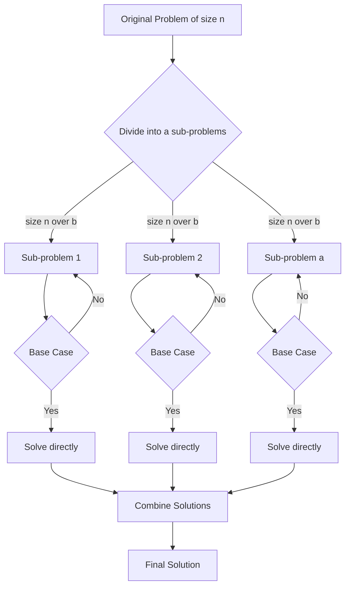
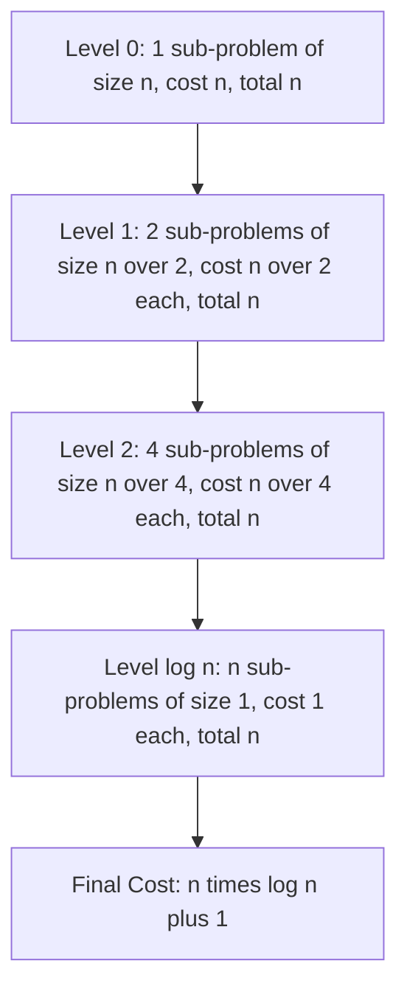
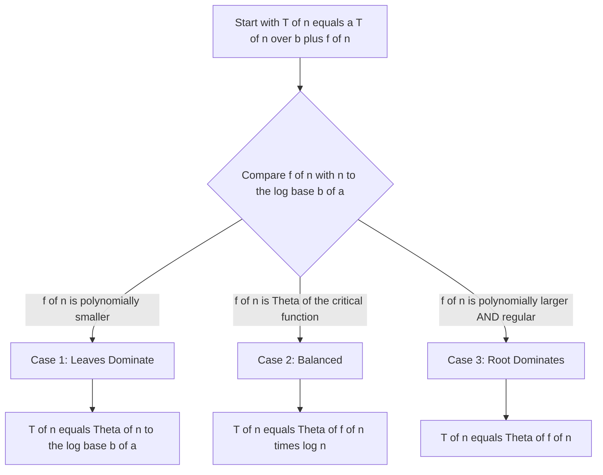
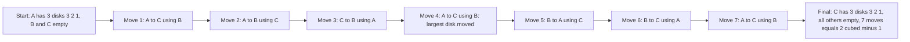
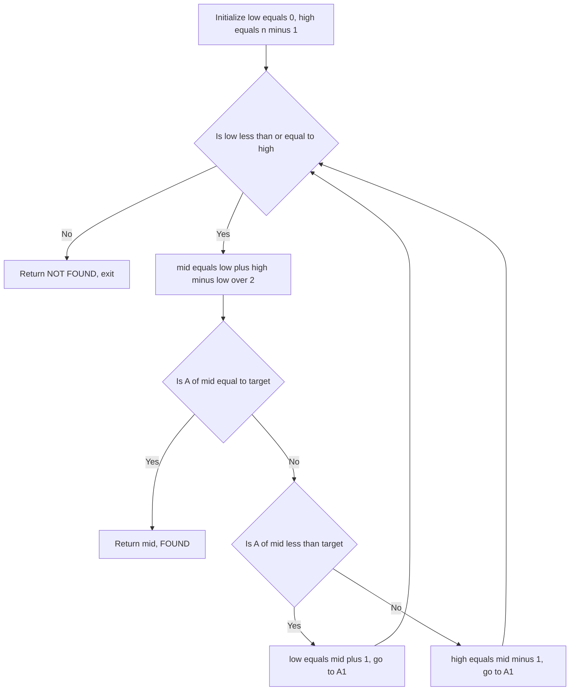
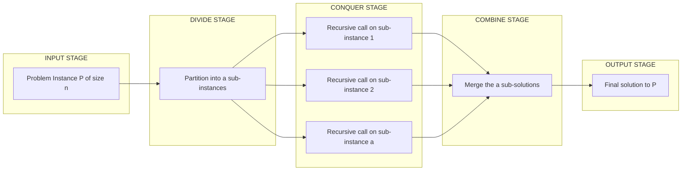

# Divide-and-conquer Approach -

<!-- SECTION_1_START -->

# Divide-and-Conquer Approach

## 1. Core Technical Definition

> [!IMPORTANT]
> **Divide-and-Conquer (D&C)** is a fundamental algorithmic paradigm in computer science wherein a problem is recursively broken down into two or more sub-problems of the same or related type, until these sub-problems become simple enough to be solved directly. The solutions to the sub-problems are then combined to give a solution to the original problem.

In the KTU 2024 Scheme context, Divide-and-Conquer is formally defined as a multi-stage recursive strategy that operates on the following three canonical steps:

1. **Divide** – The original problem instance of size $n$ is partitioned into a set of $a$ smaller sub-problems, each of size strictly less than $n$ (typically $n/b$).
2. **Conquer** – Each sub-problem is solved recursively. If a sub-problem becomes small enough (base case), it is solved directly through a non-recursive method.
3. **Combine** – The solutions to the smaller sub-problems are merged to construct the final solution to the original instance.

The general recurrence relation governing a Divide-and-Conquer algorithm is:

$$T(n) = a \cdot T\!\left(\frac{n}{b}\right) + f(n)$$

where:
* $a$ = number of sub-problems generated at each recursive level (positive integer, $a \geq 1$).
* $n/b$ = relative size of each sub-problem (the sub-problem sizes are assumed to be equal for simplicity).
* $f(n)$ = cost of dividing the problem and combining the results at the current level.

The value **$a \geq 1$**, **$b > 1$**, and **$f(n)$** is asymptotically positive are the standard constraints from **Cormen's CLRS** textbook (the primary reference for KTU).

> [!NOTE]
> **Recursion** is the natural implementation mechanism for Divide-and-Conquer because the sub-problems are themselves instances of the *same* problem type, making self-reference mathematically elegant and structurally clean.

### Conceptual Analogy / Intuition

Imagine you are the **general manager of a large multinational company** tasked with counting the total number of employees in the organization:

* **Divide** – You split the entire company roster into smaller regional offices. You don't try to count everyone yourself; you delegate.
* **Conquer** – Each regional manager now counts their local employees. If an office is small (e.g., 3 people), the manager just counts directly. If a region is still large, it gets further subdivided into city offices, then team offices.
* **Combine** – Each region reports its count upward. The managers add up the regional numbers; the regional managers add up the city numbers; finally, you sum all the regional totals to get the company-wide headcount.

**Key Insight:** At no point did a single person attempt to count millions of people. The work was distributed recursively and aggregated bottom-up. This is precisely the **divide, conquer, combine** philosophy. A more direct computational analogy is a **binary search on a sorted dictionary**: instead of scanning every word, you flip to the middle, decide whether the target word lies in the left or right half, and recursively repeat on that half — turning an $O(n)$ search into an $O(\log n)$ search.

> [!TIP]
> **Geometric Intuition:** Picture a $1024 \times 1024$ pixel image. A Divide-and-Conquer image-blending algorithm (like a Gaussian pyramid) splits the image into four $512 \times 512$ quadrants, blurs each, and then stitches them back. The work at each level is linear in the pixel count, but because we recurse, the total work follows a predictable logarithmic depth.

### Physical Constants and Standard Metrics

* **Base Case Threshold ($n_0$):** Typically a small constant such as **$n_0 = 1$** or **$n_0 = 2$** below which the recursion stops and direct computation is used.
* **Recursion Depth:** For a problem of size $n$ split into halves, the recursion depth is $\lfloor \log_2 n \rfloor + 1$.
* **Asymptotic Notation (Big-O):** Used to express the combined cost of all $a$ sub-problems and the $f(n)$ work at a single level.

> [!VISUALIZATION CONTROL]
> **Concept:** Recursion Tree of a Generic Divide-and-Conquer Algorithm
> **Coordinate Axes Input (Desmos style):**
> * $x$-axis: Recursion Level $L$ (from $0$ to $\log_b n$)
> * $y$-axis: Work done at each level $W(L)$
> * $W(L) = a^L \cdot f(n / b^L)$
> **Visual Description:** The student should observe a tree where the number of sub-problems grows exponentially ($a^L$ nodes) while the size of each sub-problem shrinks exponentially ($n / b^L$). The total work per level is the product, which determines the asymptotic behavior.

<!-- SECTION_1_END -->

<!-- SECTION_2_START -->

# 2. Deep Theoretical Analysis & KTU High-Yield Formula Sheet

## 2.1 The Three-Step Template in Depth

The Divide-and-Conquer paradigm can be precisely described using the following structured logic:

### Step 1 — Divide
Given a problem instance $P$ of size $n$, partition it into $a$ disjoint sub-instances $P_1, P_2, \dots, P_a$, where each $P_i$ has size approximately $n/b$. The partitioning is done in $D(n)$ time.

### Step 2 — Conquer
Solve each sub-instance $P_i$ recursively **unless** $n \leq n_0$ (the base case), in which case solve it directly using a brute-force method that costs at most $c \cdot n_0$ time for some constant $c$.

### Step 3 — Combine
Take the $a$ solutions from the sub-problems and merge them to form the solution to $P$. The combination step costs $C(n)$ time.

The total time complexity is therefore modeled by the recurrence:

$$T(n) = \begin{cases} \Theta(1) & \text{if } n \leq n_0 \\ a \cdot T(n/b) + D(n) + C(n) & \text{if } n > n_0 \end{cases}$$

In CLRS-notation (the standard KTU reference), $D(n) + C(n)$ is collapsed into a single function $f(n)$, giving the canonical form:

$$T(n) = a \cdot T(n/b) + f(n)$$

## 2.2 The Master Theorem (KTU High-Yield)

> [!IMPORTANT]
> The **Master Theorem** is the most important tool in the KTU syllabus for solving recurrences of the form $T(n) = a \cdot T(n/b) + f(n)$. It provides a cookbook-style solution by comparing $f(n)$ with the critical threshold function $n^{\log_b a}$.

Let $a \geq 1$, $b > 1$ be constants, $f(n)$ be an asymptotically positive function, and $T(n)$ be defined by $T(n) = a \cdot T(n/b) + f(n)$. Let us also define the **critical exponent**:

$$n^{\log_b a} = n^{\frac{\ln a}{\ln b}}$$

**Master Theorem — Three Cases:**

| Case | Condition on $f(n)$ | Conclusion for $T(n)$ | Intuitive Reason |
| :--- | :--- | :--- | :--- |
| **Case 1** | $f(n) = O(n^{\log_b a - \varepsilon})$ for some $\varepsilon > 0$ | $T(n) = \Theta(n^{\log_b a})$ | Recursion tree leaves dominate |
| **Case 2** | $f(n) = \Theta(n^{\log_b a} \cdot \log^k n)$ for $k \geq 0$ | $T(n) = \Theta(n^{\log_b a} \cdot \log^{k+1} n)$ | Work is balanced at every level |
| **Case 3** | $f(n) = \Omega(n^{\log_b a + \varepsilon})$ and regularity holds | $T(n) = \Theta(f(n))$ | Root level dominates |

> [!NOTE]
> **Regularity Condition** (for Case 3): $a \cdot f(n/b) \leq c \cdot f(n)$ for some constant $c < 1$ and sufficiently large $n$. This ensures the recursive work shrinks geometrically.

## 2.3 KTU Formula Sheet / Cheat Sheet

| Algorithm | Recurrence Relation | Master Case | Time Complexity | Space Complexity | Stable? |
| :--- | :--- | :--- | :--- | :--- | :--- |
| **Binary Search** | $T(n) = 1 \cdot T(n/2) + O(1)$ | Case 2 ($k=0$) | $O(\log n)$ | $O(1)$ iterative, $O(\log n)$ recursive | N/A |
| **Merge Sort** | $T(n) = 2 \cdot T(n/2) + O(n)$ | Case 2 ($k=0$) | $O(n \log n)$ | $O(n)$ auxiliary | **Yes** |
| **Quick Sort (avg)** | $T(n) = 2 \cdot T(n/2) + O(n)$ | Case 2 ($k=0$) | $O(n \log n)$ | $O(\log n)$ stack | **No** |
| **Quick Sort (worst)** | $T(n) = 1 \cdot T(n-1) + O(n)$ | Not Master | $O(n^2)$ | $O(n)$ stack | **No** |
| **Tower of Hanoi** | $T(n) = 2 \cdot T(n-1) + O(1)$ | Not Master (subtractive) | $O(2^n)$ | $O(n)$ stack | N/A |
| **Strassen's Matrix** | $T(n) = 7 \cdot T(n/2) + O(n^2)$ | Case 1 ($\log_2 7 \approx 2.807$) | $O(n^{\log_2 7}) \approx O(n^{2.807})$ | $O(n^2)$ | N/A |
| **Karatsuba Mult.** | $T(n) = 3 \cdot T(n/2) + O(n)$ | Case 1 ($\log_2 3 \approx 1.585$) | $O(n^{\log_2 3}) \approx O(n^{1.585})$ | $O(n)$ | N/A |

## 2.4 Why Divide-and-Conquer Matters in Real Engineering

* **Database Indexing:** B-Trees and B+ Trees used in MySQL/PostgreSQL internally use divide-and-conquer splitting rules to maintain balanced indices for $O(\log n)$ lookups.
* **Parallel Computing:** The recursion tree of a D&C algorithm maps directly onto GPU threads and CPU cores. Libraries like CUDA's `thrust::sort` and Apache Spark's MLlib use D&C primitives (MapReduce style) for distributed sort.
* **Graphics:** Hidden-surface removal in 3D rendering pipelines uses a D&C spatial partition (BSP trees) to split the scene into smaller rendering tasks.
* **Cryptography:** The Number Theoretic Transform (NTT), the workhorse of post-quantum cryptography (CRYSTALS-Kyber), is essentially a Cooley–Tukey FFT, a classic D&C algorithm.
* **Search Engines:** Google Search uses divide-and-conquer principles in web indexing (shard partitioning) to parallelize query serving across thousands of machines.

> [!TIP]
> **Production Tip:** Whenever you see a problem that can be split into *independent* sub-problems of the same type, D&C is the natural paradigm. The key engineering trade-off is **stack depth** — for very large $n$, the recursive depth can blow the call stack. Iterative variants or tail-call optimization may be required in production.

<!-- SECTION_2_END -->

<!-- SECTION_3_START -->

# 3. Step-by-Step Derivations & Code Implementation

## 3.1 Worked Example 1 — Binary Search

### Recurrence Setup
Binary Search on a sorted array of size $n$:
* Divide: Compare target with the middle element, splitting the array into two halves of size $\lfloor n/2 \rfloor$ and $\lceil n/2 \rceil - 1$.
* Conquer: Recurse on the half that may contain the target.
* Combine: No combination step is needed (only one sub-problem is pursued).

Recurrence: $T(n) = 1 \cdot T(n/2) + O(1)$ with $T(1) = O(1)$.

### Closed-Form Derivation

Unrolling the recurrence:

$$
\begin{aligned}
T(n) &= T(n/2) + c \\
     &= T(n/4) + 2c \\
     &= T(n/8) + 3c \\
     &\;\;\vdots \\
     &= T(n/2^k) + k \cdot c
\end{aligned}
$$

We stop when $n/2^k = 1$, i.e., $k = \log_2 n$. Substituting:

$$
\begin{aligned}
T(n) &= T(1) + c \cdot \log_2 n \\
     &= c_0 + c \cdot \log_2 n \\
     &= \Theta(\log n)
\end{aligned}
$$

> [!NOTE]
> **Master Theorem verification:** $a=1$, $b=2$, $f(n) = O(1) = O(n^0) = O(n^{\log_2 1})$. Since $n^{\log_2 1} = n^0 = 1$, we have $f(n) = \Theta(n^{\log_b a})$. This is **Case 2 with $k=0$**, giving $T(n) = \Theta(n^{\log_b a} \log^{k+1} n) = \Theta(\log n)$. ✓

### Python Implementation

```python
from typing import List, Optional

def binary_search(arr: List[int], target: int) -> Optional[int]:
    """
    Performs iterative binary search on a sorted list.
    
    Parameters
    ----------
    arr : List[int]
        A sorted list in non-decreasing order.
    target : int
        The value to search for.
    
    Returns
    -------
    Optional[int]
        The index of target in arr, or None if not found.
    
    Time Complexity  : O(log n)
    Space Complexity : O(1)
    """
    if not arr:
        return None
    
    left, right = 0, len(arr) - 1
    
    while left <= right:
        # Use mid = left + (right - left) // 2 to avoid integer overflow
        mid = left + (right - left) // 2
        
        if arr[mid] == target:
            return mid
        elif arr[mid] < target:
            left = mid + 1   # Target lies in the right half
        else:
            right = mid - 1  # Target lies in the left half
    
    return None  # Target not present
```

## 3.2 Worked Example 2 — Merge Sort

### Recurrence Setup
Merge Sort on an array of size $n$:
* Divide: Split the array at the midpoint into two halves of size $\lfloor n/2 \rfloor$ and $\lceil n/2 \rceil$.
* Conquer: Recursively sort both halves.
* Combine: Merge the two sorted halves in linear time.

Recurrence: $T(n) = 2 \cdot T(n/2) + O(n)$ with $T(1) = O(1)$.

### Closed-Form Derivation (Recursion Tree)

Total work at level $j$ (where the root is level $0$):
* Number of sub-problems = $2^j$.
* Size of each sub-problem = $n / 2^j$.
* Work per sub-problem (merge cost) = $n / 2^j$.
* **Total work at level $j$ = $2^j \cdot (n / 2^j) = n$.**

The recursion depth is $\log_2 n + 1$ levels. Summing work over all levels:

$$
\begin{aligned}
T(n) &= \sum_{j=0}^{\log_2 n} n \\
     &= n \cdot (\log_2 n + 1) \\
     &= \Theta(n \log n)
\end{aligned}
$$

> [!NOTE]
> **Master Theorem verification:** $a=2$, $b=2$, $f(n) = \Theta(n) = \Theta(n^1)$. Compute $n^{\log_b a} = n^{\log_2 2} = n^1 = n$. Since $f(n) = \Theta(n^{\log_b a})$, this is **Case 2 with $k=0$**, giving $T(n) = \Theta(n \log n)$. ✓

### Python Implementation

```python
from typing import List

def merge_sort(arr: List[int]) -> List[int]:
    """
    Sorts a list using the Merge Sort algorithm.
    
    Parameters
    ----------
    arr : List[int]
        The list to be sorted.
    
    Returns
    -------
    List[int]
        A new sorted list in non-decreasing order.
    
    Time Complexity  : O(n log n) in all cases
    Space Complexity : O(n) auxiliary
    Stable           : Yes
    """
    # Base case: a list of length 0 or 1 is already sorted
    if len(arr) <= 1:
        return arr
    
    # DIVIDE: split the array at the midpoint
    mid = len(arr) // 2
    left_half = arr[:mid]
    right_half = arr[mid:]
    
    # CONQUER: recursively sort both halves
    sorted_left = merge_sort(left_half)
    sorted_right = merge_sort(right_half)
    
    # COMBINE: merge the sorted halves
    return _merge(sorted_left, sorted_right)


def _merge(left: List[int], right: List[int]) -> List[int]:
    """Merges two sorted lists into a single sorted list."""
    merged: List[int] = []
    i = j = 0
    
    # Standard two-pointer merge
    while i < len(left) and j < len(right):
        if left[i] <= right[j]:   # <= preserves stability
            merged.append(left[i])
            i += 1
        else:
            merged.append(right[j])
            j += 1
    
    # Append any leftover elements
    merged.extend(left[i:])
    merged.extend(right[j:])
    return merged
```

## 3.3 Worked Example 3 — Quick Sort

### Recurrence Setup
Quick Sort picks a **pivot** element and partitions the array into:
* Elements $\leq$ pivot (left sub-problem)
* Elements $>$ pivot (right sub-problem)

The size of sub-problems depends on the pivot choice. Let $q$ be the number of elements less than the pivot.

Recurrence: $T(n) = T(q) + T(n - 1 - q) + O(n)$, with $T(0) = T(1) = O(1)$.

### Best / Average Case
If the pivot is the **median**, then $q = (n-1)/2$, giving $T(n) = 2 T(n/2) + O(n)$, which is the same as Merge Sort: $T(n) = \Theta(n \log n)$.

### Worst Case
If the pivot is the **smallest or largest** element (e.g., sorted input with first-element pivot), then $q = 0$ and:

$$
\begin{aligned}
T(n) &= T(0) + T(n-1) + O(n) \\
     &= T(n-1) + O(n) \\
     &= T(n-2) + O(n-1) + O(n) \\
     &\;\;\vdots \\
     &= O(n^2)
\end{aligned}
$$

### Python Implementation (Lomuto Partition with Random Pivot)

```python
import random
from typing import List

def quick_sort(arr: List[int], low: int = 0, high: int = -1) -> None:
    """
    Sorts an array in-place using Quick Sort with random pivot.
    
    Parameters
    ----------
    arr  : List[int]
        The list to be sorted in-place.
    low  : int
        Starting index of the sub-array to sort.
    high : int
        Ending index of the sub-array to sort.
    
    Time Complexity  : O(n log n) average, O(n^2) worst case
    Space Complexity : O(log n) stack average, O(n) worst case
    Stable           : No
    """
    if high == -1:
        high = len(arr) - 1
    
    if low < high:
        # DIVIDE: partition the array and obtain pivot index
        pivot_index = _partition(arr, low, high)
        
        # CONQUER: recursively sort the two partitions
        quick_sort(arr, low, pivot_index - 1)
        quick_sort(arr, pivot_index + 1, high)


def _partition(arr: List[int], low: int, high: int) -> int:
    """
    Lomuto partition with random pivot selection.
    Returns the final index of the pivot.
    """
    # Random pivot prevents worst-case on sorted/reverse-sorted input
    random_pivot = random.randint(low, high)
    arr[random_pivot], arr[high] = arr[high], arr[random_pivot]
    
    pivot = arr[high]   # pivot is now at the end
    i = low - 1         # boundary of the "<= pivot" region
    
    for j in range(low, high):
        if arr[j] <= pivot:
            i += 1
            arr[i], arr[j] = arr[j], arr[i]
    
    # Place pivot in its final correct position
    arr[i + 1], arr[high] = arr[high], arr[i + 1]
    return i + 1
```

## 3.4 Worked Example 4 — Tower of Hanoi

### Problem Statement
Move a stack of $n$ disks from a source peg to a destination peg using one auxiliary peg, with the rule that a larger disk may never be placed on a smaller disk.

### Recurrence Derivation
The recursive insight is:
1. Move the top $n-1$ disks from source to auxiliary (using destination as helper).
2. Move the largest disk from source to destination (1 step).
3. Move the $n-1$ disks from auxiliary to destination (using source as helper).

This gives $T(n) = 2 \cdot T(n-1) + 1$, with $T(1) = 1$.

### Closed-Form Derivation

$$
\begin{aligned}
T(n) &= 2 \cdot T(n-1) + 1 \\
     &= 2 \cdot (2 \cdot T(n-2) + 1) + 1 = 4 \cdot T(n-2) + 2 + 1 \\
     &= 2^k \cdot T(n-k) + (2^k - 1)
\end{aligned}
$$

Setting $k = n - 1$ so that $T(n - (n-1)) = T(1) = 1$:

$$
\begin{aligned}
T(n) &= 2^{n-1} \cdot 1 + (2^{n-1} - 1) \\
     &= 2 \cdot 2^{n-1} - 1 \\
     &= 2^n - 1
\end{aligned}
$$

Therefore $T(n) = \Theta(2^n)$.

### Python Implementation

```python
from typing import List, Tuple

def tower_of_hanoi(
    n: int,
    source: str = "A",
    destination: str = "C",
    auxiliary: str = "B",
    moves: List[Tuple[str, str]] = None
) -> List[Tuple[str, str]]:
    """
    Solves the Tower of Hanoi problem for n disks.
    
    Parameters
    ----------
    n            : int
        Number of disks.
    source       : str
        Label of the source peg.
    destination  : str
        Label of the destination peg.
    auxiliary    : str
        Label of the auxiliary peg.
    moves        : List[Tuple[str, str]]
        A list to collect the sequence of moves.
    
    Returns
    -------
    List[Tuple[str, str]]
        A list of (from_peg, to_peg) tuples representing the solution.
    
    Time Complexity  : O(2^n)
    Space Complexity : O(n) recursion depth
    """
    if moves is None:
        moves = []
    
    # Base case: a single disk is moved directly
    if n == 1:
        moves.append((source, destination))
        return moves
    
    # Step 1: Move n-1 disks from source to auxiliary
    tower_of_hanoi(n - 1, source, auxiliary, destination, moves)
    
    # Step 2: Move the largest disk from source to destination
    moves.append((source, destination))
    
    # Step 3: Move n-1 disks from auxiliary to destination
    tower_of_hanoi(n - 1, auxiliary, destination, source, moves)
    
    return moves
```

## 3.5 Worked Example 5 — Maximum Subarray Sum (Kadane-style D&C)

### Problem
Given an array $A[0 \dots n-1]$ (which may contain negative numbers), find the contiguous sub-array with the largest sum.

### D&C Logic
* Divide: Split the array at mid = $(lo + hi) / 2$.
* Conquer: Recursively find max sub-array in the left half and right half.
* Combine: Also consider sub-arrays that **cross the midpoint** — these must be computed in $O(n)$ and combined with the recursive answers.

Recurrence: $T(n) = 2 \cdot T(n/2) + O(n)$ $\Rightarrow$ $T(n) = \Theta(n \log n)$.

### Python Implementation

```python
from typing import List, Tuple

def max_subarray_dc(arr: List[int]) -> Tuple[int, int, int]:
    """
    Finds the maximum subarray sum using divide-and-conquer.
    
    Returns
    -------
    (max_sum, start_index, end_index)
    
    Time Complexity  : O(n log n)
    Space Complexity : O(log n) recursion depth
    """
    return _max_subarray_helper(arr, 0, len(arr) - 1)


def _max_subarray_helper(
    arr: List[int], lo: int, hi: int
) -> Tuple[int, int, int]:
    if lo == hi:
        return (arr[lo], lo, hi)
    
    mid = (lo + hi) // 2
    
    # Recursive calls
    left_sum, left_lo, left_hi   = _max_subarray_helper(arr, lo, mid)
    right_sum, right_lo, right_hi = _max_subarray_helper(arr, mid + 1, hi)
    cross_sum, cross_lo, cross_hi = _max_crossing(arr, lo, mid, hi)
    
    # Return the best of the three
    if left_sum >= right_sum and left_sum >= cross_sum:
        return (left_sum, left_lo, left_hi)
    elif right_sum >= left_sum and right_sum >= cross_sum:
        return (right_sum, right_lo, right_hi)
    else:
        return (cross_sum, cross_lo, cross_hi)


def _max_crossing(
    arr: List[int], lo: int, mid: int, hi: int
) -> Tuple[int, int, int]:
    """Computes the max subarray that crosses the midpoint in O(n)."""
    left_sum = float("-inf")
    total = 0
    max_left = mid
    for i in range(mid, lo - 1, -1):
        total += arr[i]
        if total > left_sum:
            left_sum = total
            max_left = i
    
    right_sum = float("-inf")
    total = 0
    max_right = mid + 1
    for j in range(mid + 1, hi + 1):
        total += arr[j]
        if total > right_sum:
            right_sum = total
            max_right = j
    
    return (left_sum + right_sum, max_left, max_right)
```

<!-- SECTION_3_END -->

<!-- SECTION_4_START -->

# 4. Structural Diagrams & Schematics

## 4.1 Master Map — Divide-and-Conquer Decomposition



## 4.2 Recursion Tree of Merge Sort (Cost per Level)



## 4.3 Master Theorem Decision Flow



## 4.4 Tower of Hanoi Move Sequence (n=3)



## 4.5 Sequential Processing Topology — Binary Search Decision Ladder



## 4.6 Functional Architecture Flow — Divide-and-Conquer as a Pipeline



<!-- SECTION_4_END -->

<!-- SECTION_5_START -->

# 5. KTU 2024 Scheme Examination Question Bank & Topic Recap

> [!NOTE]
> All questions below are modeled on the KTU 2024 Scheme pattern. Course Code: **UCEST105**. Module: **4 — Computational Approaches to Problem**. Each question is mapped to a Course Outcome (CO) and a Revised Bloom's Taxonomy (RBT) level. Total marks are computed as per KTU's ESE (End Semester Evaluation) regulation: 3-mark short answers and 14-mark long answers with internal choice.

---

## Part A — Short Answer Questions (3 Marks Each)

### Question 1
**`[KTU University Exam - July 2024]`** &nbsp; **| CO1 | Remember**

> State and explain the three steps of the Divide-and-Conquer algorithmic paradigm with a suitable example.

**Model Answer (3 Marks):**
The Divide-and-Conquer paradigm consists of three steps:
1. **Divide** [1 Mark]: The problem of size $n$ is partitioned into $a$ smaller sub-problems, each of size approximately $n/b$.
2. **Conquer** [1 Mark]: Each sub-problem is solved recursively. If the sub-problem size is small (base case), it is solved directly without further recursion.
3. **Combine** [1 Mark]: The solutions of the sub-problems are merged to produce the solution to the original problem.

**Example:** Merge Sort divides the array into two halves, recursively sorts them, and combines them using a merge routine.

---

### Question 2
**`[KTU University Exam - Dec 2023]`** &nbsp; **| CO1 | Understand**

> Differentiate between Divide-and-Conquer and Dynamic Programming approaches. When would you prefer one over the other?

**Model Answer (3 Marks):**
* **Divide-and-Conquer** [1 Mark]: Solves independent sub-problems that do not overlap. Recursion tree branches are completely disjoint. Example: Merge Sort.
* **Dynamic Programming** [1 Mark]: Solves overlapping sub-problems by storing the results of sub-problems in a table (memoization or tabulation). Example: Fibonacci Sequence, Matrix Chain Multiplication.
* **When to prefer** [1 Mark]: Prefer D&C when sub-problems are independent and do not share computations. Prefer DP when the same sub-problem is encountered repeatedly across branches, since DP avoids exponential recomputation.

---

## Part B — Long Answer Questions (14 Marks Each, with Internal Choice)

### Question A — Full 14 Marks
**`[KTU University Exam - July 2024]`** &nbsp; **| CO2, CO3 | Understand, Apply, Analyze**

> **(a)** Explain the **Master Theorem** for solving Divide-and-Conquer recurrences. State all three cases with their conditions and conclusions. **[7 Marks]**
> **(b)** Apply the Master Theorem to solve the following recurrences and state the asymptotic complexity $T(n)$: **(i)** $T(n) = 9T(n/3) + n$, **(ii)** $T(n) = T(2n/3) + 1$, **(iii)** $T(n) = 3T(n/2) + n^2$. **[7 Marks]**

#### Part (a) Model Solution [7 Marks]

The Master Theorem provides a direct way to determine the asymptotic solution of recurrences of the form $T(n) = aT(n/b) + f(n)$, where $a \geq 1$, $b > 1$, and $f(n)$ is asymptotically positive.

Let us define the **critical exponent** [1 Mark for definition]:

$$n^{\log_b a}$$

**Case 1 — Leaves Dominate** [2 Marks]: If $f(n) = O(n^{\log_b a - \varepsilon})$ for some constant $\varepsilon > 0$, then:

$$T(n) = \Theta(n^{\log_b a})$$

The work at the leaves of the recursion tree dominates the total cost.

**Case 2 — Balanced** [2 Marks]: If $f(n) = \Theta(n^{\log_b a} \cdot \log^k n)$ for some $k \geq 0$, then:

$$T(n) = \Theta(n^{\log_b a} \cdot \log^{k+1} n)$$

The work is uniformly distributed across all levels of the recursion tree.

**Case 3 — Root Dominates** [2 Marks]: If $f(n) = \Omega(n^{\log_b a + \varepsilon})$ for some $\varepsilon > 0$ and the regularity condition $a \cdot f(n/b) \leq c \cdot f(n)$ holds for some $c < 1$, then:

$$T(n) = \Theta(f(n))$$

The work at the root dominates the total cost.

#### Part (b) Model Solution [7 Marks]

**Recurrence (i):** $T(n) = 9T(n/3) + n$

$a = 9$, $b = 3$, $f(n) = n$ [1 Mark for identification].

$$n^{\log_b a} = n^{\log_3 9} = n^2$$

Compare $f(n) = n^1$ with $n^2$. We have $n = O(n^{2 - 1})$, so $\varepsilon = 1 > 0$. **Case 1** applies [1 Mark]:

$$T(n) = \Theta(n^2) \quad \text{[1 Mark]}$$

**Recurrence (ii):** $T(n) = T(2n/3) + 1$

$a = 1$, $b = 3/2$, $f(n) = 1$ [1 Mark for identification].

$$n^{\log_b a} = n^{\log_{3/2} 1} = n^0 = 1$$

Compare $f(n) = 1$ with $1$. We have $f(n) = \Theta(n^0 \cdot \log^0 n)$, so **Case 2** with $k = 0$ applies [1 Mark]:

$$T(n) = \Theta(\log n) \quad \text{[1 Mark]}$$

**Recurrence (iii):** $T(n) = 3T(n/2) + n^2$

$a = 3$, $b = 2$, $f(n) = n^2$ [1 Mark for identification].

$$n^{\log_b a} = n^{\log_2 3} \approx n^{1.585}$$

Compare $f(n) = n^2$ with $n^{1.585}$. We have $n^2 = \Omega(n^{1.585 + 0.415})$, so $\varepsilon = 0.415 > 0$. Regularity: $3 \cdot (n/2)^2 = (3/4) n^2 \leq c \cdot n^2$ with $c = 3/4 < 1$. **Case 3** applies [1 Mark]:

$$T(n) = \Theta(n^2) \quad \text{[1 Mark]}$$

**Valuation Key Summary**:
* Identifying $a$, $b$, $f(n)$: 3 × 1 Mark = 3 Marks
* Computing $n^{\log_b a}$: implicit in each case judgment
* Choosing the correct case: 3 × 1 Mark = 3 Marks
* Final asymptotic answer: 3 × 1 Mark = 3 Marks (Total: 7 Marks for part b; plus 7 for part a = 14 Marks)

---

### Question B — Alternative 14 Marks
**`[KTU University Exam - Dec 2023]`** &nbsp; **| CO2, CO3 | Understand, Apply**

> **(a)** Write and explain a recursive algorithm for **Merge Sort**. Show the merging step in detail and write its recurrence relation. Derive the time complexity using a recursion tree. **[7 Marks]**
> **(b)** Implement Merge Sort in Python and trace its execution on the input array `[38, 27, 43, 3, 9, 82, 10]`. Show the state of the array at each level of recursion. Compare its space and time complexity with Quick Sort. **[7 Marks]**

#### Part (a) Model Solution [7 Marks]

**Algorithm (Pseudocode)** [2 Marks for writing the algorithm]:

```
MERGE-SORT(A, lo, hi):
    if lo < hi:
        mid = floor((lo + hi) / 2)
        MERGE-SORT(A, lo, mid)
        MERGE-SORT(A, mid+1, hi)
        MERGE(A, lo, mid, hi)
```

**Merge Step** [2 Marks for detailed explanation]:
The `MERGE(A, lo, mid, hi)` procedure assumes that the two sub-arrays $A[lo \dots mid]$ and $A[mid+1 \dots hi]$ are individually sorted. It maintains two pointers $i$ and $j$ initialized to $lo$ and $mid+1$ respectively. At each step, it compares $A[i]$ and $A[j]$, copies the smaller to an auxiliary array, and advances the corresponding pointer. Once one sub-array is exhausted, the remaining elements of the other are appended. The auxiliary array is then copied back.

**Recurrence Relation** [1 Mark]:

$$T(n) = 2T(n/2) + O(n), \quad T(1) = O(1)$$

**Recursion Tree Derivation** [2 Marks]:
At level $j$ of the recursion tree: $2^j$ sub-problems, each of size $n/2^j$, with $O(n/2^j)$ work per merge. Total work per level = $2^j \cdot O(n/2^j) = O(n)$. The tree has $\log_2 n + 1$ levels. Therefore:

$$T(n) = O(n) \cdot (\log_2 n + 1) = O(n \log n)$$

#### Part (b) Model Solution [7 Marks]

**Python Code** [3 Marks for clean, correct implementation]: Refer to the Merge Sort implementation in Section 3.2.

**Trace on `[38, 27, 43, 3, 9, 82, 10]`** [3 Marks for trace]:

Level 0 (root): `[38, 27, 43, 3, 9, 82, 10]`
Level 1 split: `[38, 27, 43, 3]` and `[9, 82, 10]`
Level 2 split: `[38, 27]`, `[43, 3]`, `[9, 82]`, `[10]`
Level 3 split: `[38]`, `[27]`, `[43]`, `[3]`, `[9]`, `[82]`, `[10]`
Level 3 sorted: `[38]`, `[27]`, `[43]`, `[3]`, `[9]`, `[82]`, `[10]`
Level 2 merged: `[27, 38]`, `[3, 43]`, `[9, 82]`, `[10]`
Level 1 merged: `[3, 27, 38, 43]`, `[9, 10, 82]`
Level 0 merged: `[3, 9, 10, 27, 38, 43, 82]`

**Comparison Table** [1 Mark]:

| Property | Merge Sort | Quick Sort |
| :--- | :--- | :--- |
| Time (Best) | $O(n \log n)$ | $O(n \log n)$ |
| Time (Avg) | $O(n \log n)$ | $O(n \log n)$ |
| Time (Worst) | $O(n \log n)$ | $O(n^2)$ |
| Space | $O(n)$ auxiliary | $O(\log n)$ stack avg, $O(n)$ worst |
| Stability | **Stable** | **Unstable** |
| In-place | No | Yes |

---

> [!WARNING]
> **KTU Examiner's Valuation Pitfalls — Divide-and-Conquer Module**
> 1. **Do not forget the base case**: Many students write the recurrence $T(n) = aT(n/b) + f(n)$ but forget to specify $T(1) = \Theta(1)$. Examiners will deduct **1 Mark** for an unspecified base case.
> 2. **Master Theorem Case 2 requires $f(n) = \Theta$ of the critical function**: Writing $f(n) = O(n^{\log_b a})$ is **insufficient** for Case 2. You need both upper and lower bounds. Writing only one direction will cost you a Mark.
> 3. **For Quick Sort worst case**: Do not blindly apply the Master Theorem. The recurrence $T(n) = T(n-1) + O(n)$ is **subtractive** and does not fit the Master's $n/b$ form. The correct derivation uses unrolling.
> 4. **In Merge Sort traces**: A common mistake is to swap the merging direction (merging right-to-left). Always merge by repeatedly choosing the smaller front element — the two-pointer technique.
> 5. **For Binary Search**: Students often write the recurrence as $T(n) = 2T(n/2) + O(1)$ which is **wrong**. Only one sub-problem is pursued; the other is discarded. The correct form is $T(n) = 1 \cdot T(n/2) + O(1)$.
> 6. **Stability in sorting questions**: Always explicitly state whether an algorithm is stable. KTU examiners award 1 Mark specifically for the stability classification in sorting algorithm questions.

---

## Topic Recap & Important Things to Remember

* **Divide-and-Conquer (D&C)** is a recursive algorithmic paradigm with three steps: **Divide**, **Conquer**, **Combine** [Section 1].
* The general recurrence form is $T(n) = a \cdot T(n/b) + f(n)$, with $a \geq 1$, $b > 1$, and $f(n)$ asymptotically positive [Section 2].
* The **Master Theorem** has three cases comparing $f(n)$ with the critical function $n^{\log_b a}$ [Section 2].
* **Binary Search** is a D&C algorithm with $T(n) = T(n/2) + O(1) = O(\log n)$. It pursues **only one** sub-problem, not two [Section 3.1].
* **Merge Sort** has $T(n) = 2T(n/2) + O(n) = O(n \log n)$ in **all** cases. It is **stable** but uses $O(n)$ auxiliary space [Section 3.2].
* **Quick Sort** averages $O(n \log n)$ but has a worst case of $O(n^2)$ when the pivot is unbalanced. It is **in-place** but **not stable** [Section 3.3].
* **Tower of Hanoi** has $T(n) = 2T(n-1) + 1 = 2^n - 1 = \Theta(2^n)$. It is a **subtractive** recurrence, not a Master Theorem form [Section 3.4].
* **Maximum Subarray Sum** using D&C runs in $O(n \log n)$ using a 3-way comparison (left, right, crossing) [Section 3.5].
* **Strassen's Matrix Multiplication** uses 7 recursive multiplications and achieves $O(n^{\log_2 7}) \approx O(n^{2.807})$ [Section 2.3].
* **Karatsuba Multiplication** uses 3 recursive multiplications and achieves $O(n^{\log_2 3}) \approx O(n^{1.585})$ [Section 2.3].
* **Base case threshold** $n_0$ is critical: it is the point at which recursion stops and direct computation begins [Section 1].
* **Regularity condition** for Master Theorem Case 3: $a \cdot f(n/b) \leq c \cdot f(n)$ for some $c < 1$ and large $n$ [Section 2.2].
* **D&C vs DP**: D&C requires **independent** sub-problems; DP exploits **overlapping** sub-problems via memoization [Part A, Q2].
* **Engineering applications**: B-Tree indexing, parallel GPU sorting, FFT-based cryptography, BSP-tree graphics, MapReduce-style distributed processing [Section 2.4].
* **Stability rule of thumb**: Merge Sort and Bubble Sort are stable; Quick Sort, Heap Sort, and Selection Sort are not stable [Section 5 Comparison Table].

<!-- SECTION_5_END -->
