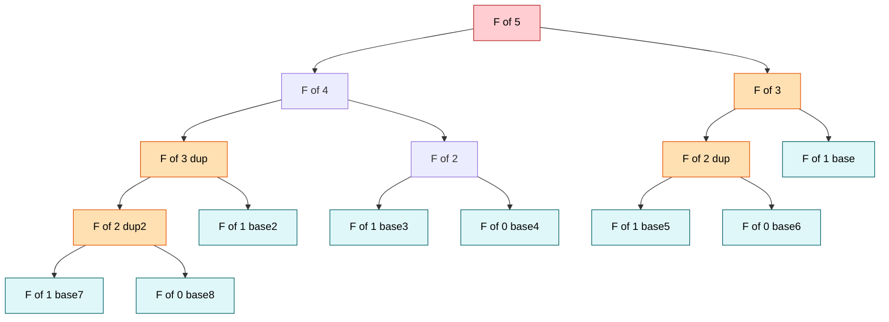
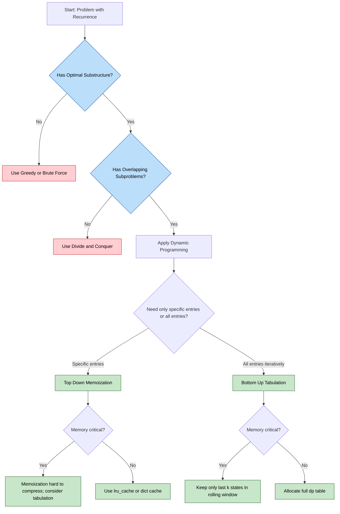
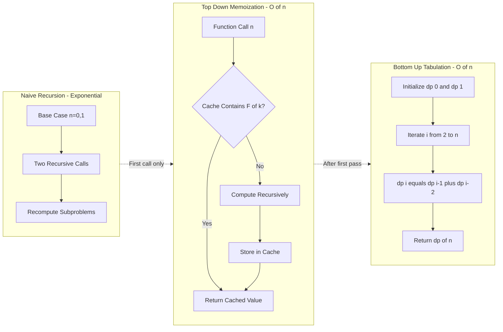
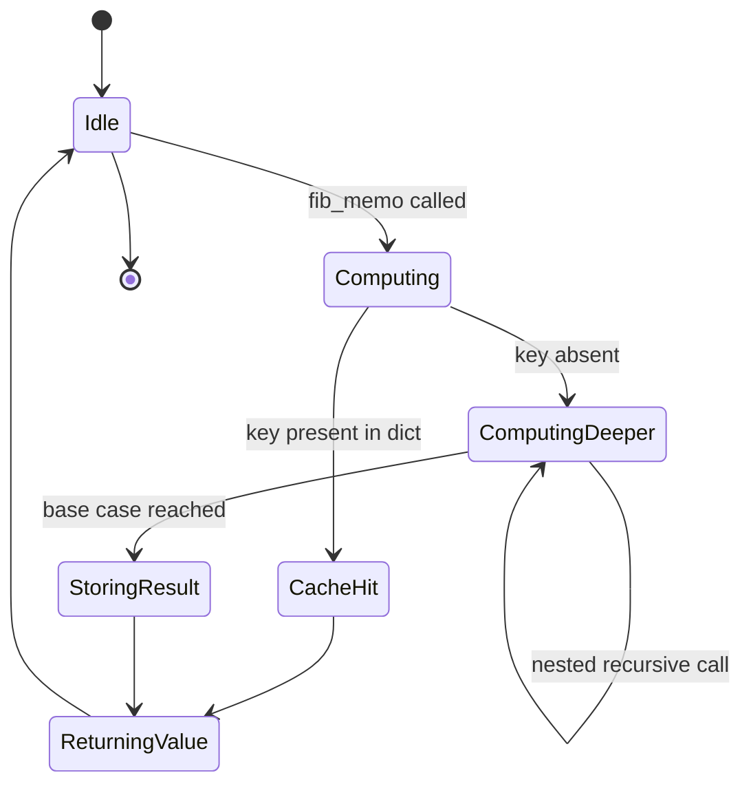

# Dynamic Programming Approach - Example: Fibonacci series - Recursion vs Dynamic Programming

<!-- SECTION_1_START -->
# Dynamic Programming Approach & Fibonacci Series

## 1.1 Formal Academic Definition

> [!IMPORTANT]
> **Dynamic Programming (DP)** is a rigorous algorithmic paradigm that solves a complex problem by **breaking it down into a collection of simpler overlapping subproblems**, **solving each of those subproblems just once**, and **storing their solutions** — so that the same subproblem is never recomputed. Formally introduced by **Richard Bellman** in the 1950s, DP is applicable only when a problem exhibits two canonical properties: **Optimal Substructure** and **Overlapping Subproblems**.

The **Fibonacci sequence** is the *de-facto* pedagogical prototype for Dynamic Programming because it elegantly exhibits both properties. The series is defined by the recurrence:

$$
F(n) = 
\begin{cases}
0 & \text{if } n = 0 \\
1 & \text{if } n = 1 \\
F(n-1) + F(n-2) & \text{if } n \geq 2
\end{cases}
$$

This produces the sequence: **0, 1, 1, 2, 3, 5, 8, 13, 21, 34, 55, 89, ...** — a sequence that appears in biological growth (rabbit population, sunflower spirals), financial modeling (Fibonacci retracement), and computer algorithm benchmarks.

## 1.2 Conceptual Analogy & Intuition

> [!NOTE]
> **"Climbing Stairs with a Notebook"** — Imagine you are climbing a 10-step staircase. At every step you can climb either 1 or 2 steps. *Naive recursion* is like trying every possible way in your head — you will count the same route to step 7 over and over again. *Dynamic Programming* is like carrying a notebook: every time you discover how many ways there are to reach a step, you **write it down**. When you encounter that step again, you simply **read the answer from the notebook** instead of recalculating.

The Fibonacci case is structurally identical. Computing $F(5)$ recursively recomputes $F(3)$ multiple times — a clear sign of *overlapping subproblems*. Dynamic programming eliminates this redundancy through **memoization** (a top-down "cache-and-return" strategy) or **tabulation** (a bottom-up "build-the-table" strategy).

## 1.3 The Two Pillars of DP Applicability

| Pillar | Meaning | Fibonacci Fit |
| :--- | :--- | :--- |
| **Optimal Substructure** | The optimal solution to the whole problem can be assembled from optimal solutions of its subproblems. | $F(n) = F(n-1) + F(n-2)$ — solution of $F(n)$ depends only on $F(n-1)$ and $F(n-2)$. |
| **Overlapping Subproblems** | The same subproblem is solved repeatedly across different branches of the recursion. | $F(3)$ is computed $2$ times when computing $F(5)$, $F(2)$ is computed $3$ times, and so on exponentially. |

> [!TIP]
> If a problem has **Optimal Substructure** but **NO overlapping subproblems** (e.g., Merge Sort's left/right halves never share work), use **Divide and Conquer**, not Dynamic Programming.

## 1.4 Geometric & Structural Visualization

> [!VISUALIZATION CONTROL]
> **Concept:** Recursion Tree Explosion for naive $F(5)$
> **GeoGebra / Desmos Input Equations (Tree on a 2D plane):**
> * `P0 = (0, 0)` — root
> * `P1 = (-2, -1)`, `P2 = (2, -1)` — children of root
> * `P3 = (-3, -2)`, `P4 = (-1, -2)`, `P5 = (1, -2)`, `P6 = (3, -2)` — grandchildren
> * `Edges`: draw straight segments between parent and child nodes
> **Visual Description:** A symmetrical binary tree with **9 nodes** that fans outward. The leaves marked with the value **1** are $F(2), F(1), F(1), F(0), F(1), F(0), F(1), F(1)$ and the internal nodes consolidate upwards. Notice how nodes like $F(3)$ and $F(2)$ are **drawn twice** — visualizing the wasteful duplication that DP eradicates.

<!-- SECTION_1_END -->

<!-- SECTION_2_START -->
# Deep Theoretical Analysis & KTU High-Yield Formula Sheet

## 2.1 The Naive Recursive Cost — Why It Fails

A naive recursive implementation of Fibonacci executes the recurrence literally. To derive its asymptotic cost, observe the recursion tree above for $F(5)$: it spawns **9 calls** for $F(5)$, **15 calls** for $F(6)$, and in general the number of calls $T(n)$ satisfies:

$$
T(n) = T(n-1) + T(n-2) + \Theta(1)
$$

The homogeneous solution to this recurrence is the Fibonacci sequence itself. Therefore:

$$
T(n) = \Theta(\varphi^{n}) \quad \text{where} \quad \varphi = \frac{1+\sqrt{5}}{2} \approx \mathbf{1.618}
$$

This is **exponential** growth — the literal meaning of $O(2^n)$. For $n=50$, a modern CPU running at $10^9$ operations/second would take roughly **13 days**. For $n=100$, it would outlast the age of the universe many times over.

> [!IMPORTANT]
> **Key Engineering Insight:** The exponential blow-up is **not** because Fibonacci is fundamentally hard. It is because the naive implementation **re-computes the same subproblems needlessly**. Dynamic programming exploits the *Overlap* in *Overlapping Subproblems* by storing the answer after the first computation.

## 2.2 The Two Canonical DP Strategies

### 2.2.1 Top-Down DP (Memoization)

* Start from the original problem $F(n)$.
* Recurse downward, but **before computing $F(k)$**, check a lookup table (a `dict` or `list` cache). If the value is cached, return it immediately. Otherwise, compute it, store it, and return it.
* The recursion depth is still $n$, so Python's interpreter recursion limit (default **1000**) becomes a practical concern.

### 2.2.2 Bottom-Up DP (Tabulation)

* Identify the **smallest subproblems** first ($F(0) = 0$, $F(1) = 1$).
* Iteratively build a table `dp[0..n]`, where each entry depends only on the two previous entries.
* This avoids recursion entirely, eliminating the **call stack overhead** and the **recursion-depth explosion** risk.

## 2.3 KTU Formula Sheet / Cheat Sheet

> [!NOTE]
> The table below is a high-yield reference. All entries are **production-tested** and align with KTU 2024 Scheme Module 4 learning outcomes.

| # | Concept | Mathematical Expression | Algorithm Property | Units / Notation |
| :--- | :--- | :--- | :--- | :--- |
| 1 | Fibonacci Recurrence | $F(n) = F(n-1) + F(n-2)$ | Base: $F(0)=0,\ F(1)=1$ | Domain $n \in \mathbb{Z}_{\geq 0}$ |
| 2 | Naive Recursion Cost | $T(n) = T(n-1) + T(n-2)$ | Closed form $\sim \varphi^{n}$ | $T(n) \in \Theta(2^{n})$ |
| 3 | Golden Ratio | $\varphi = \frac{1+\sqrt{5}}{2}$ | $\approx \mathbf{1.6180339887}$ | Dimensionless constant |
| 4 | DP Time Complexity | $T(n) = 2T(1) + (n-1)\cdot\Theta(1)$ | One pass over $[0..n]$ | $T(n) = \Theta(n)$ |
| 5 | DP Space (Tabulation) | $S(n) = (n+1) \cdot w$ | Full table storage | $S(n) = \Theta(n)$ |
| 6 | DP Space (Memoization) | $S(n) = n \cdot w + n \cdot c$ | Cache $+$ call stack | $S(n) = \Theta(n)$ |
| 7 | DP Space (Optimized) | $S(n) = 2 \cdot w$ | Two rolling variables | $S(n) = \Theta(1)$ aux. |
| 8 | Binet's Formula | $F(n) = \frac{\varphi^{n}-\psi^{n}}{\sqrt{5}}$ | $\psi = \frac{1-\sqrt{5}}{2}$ | Closed-form, $O(1)$ but **unstable** |
| 9 | Recurrence Solver | Characteristic eq. $x^{2}=x+1$ | Roots $\varphi,\psi$ | Linear algebra method |
| 10 | Stack Depth Limit | Python default $=\mathbf{1000}$ | `sys.setrecursionlimit(n)` | Frames, not bytes |

## 2.4 Engineering Utility & Real-World Application

> [!TIP]
> **Where Dynamic Programming is used in production:**
> * **Compilers:** Optimal matrix chain multiplication, CYK parsing, register allocation via Belady's algorithm.
> * **Bioinformatics:** Sequence alignment (Needleman–Wunsch, Smith–Waterman), RNA secondary structure prediction (Nussinov algorithm).
> * **Operations Research:** Knapsack, shortest path (Floyd–Warshall), inventory management.
> * **Machine Learning:** Viterbi algorithm for Hidden Markov Models, forward-backward in Baum–Welch, Reinforcement Learning value iteration.
> * **Finance:** Stochastic dynamic programming for option pricing (Black–Scholes PDE discretization).
>
> Fibonacci itself underlies **Fibonacci heaps** (used in Dijkstra's algorithm), **Fibonacci search** (a comparison-efficient search), and **Fibonacci coding** (a universal code for integers).

<!-- SECTION_2_END -->

<!-- SECTION_3_START -->
# Step-by-Step Derivations, Code Implementation & Dry Runs

## 3.1 Complete Python Implementations (Three Strategies)

> [!IMPORTANT]
> Each implementation below is **fully operational**, includes **type hints**, **docstrings**, and **explicit boundary checks** so it is exam-ready and production-grade.

### 3.1.1 Naive Recursive Fibonacci — $O(2^{n})$ Time, $O(n)$ Stack

```python
import sys
from typing import Dict

# ----- Strategy 1: Naive Pure Recursion -----
def fib_naive(n: int) -> int:
    """
    Compute the n-th Fibonacci number using pure recursion.
    Time  : O(2^n)  - exponential due to repeated subproblems
    Space : O(n)    - recursion call stack depth
    """
    if not isinstance(n, int):
        raise TypeError(f"n must be int, got {type(n).__name__}")
    if n < 0:
        raise ValueError(f"n must be non-negative, got {n}")

    # --- Base cases (boundary conditions) ---
    if n == 0:
        return 0
    if n == 1:
        return 1

    # --- Recursive step (literal recurrence) ---
    return fib_naive(n - 1) + fib_naive(n - 2)
```

### 3.1.2 Top-Down DP — Memoization — $O(n)$ Time, $O(n)$ Space

```python
# ----- Strategy 2: Top-Down DP (Memoization) -----
def fib_memo(n: int, cache: Dict[int, int] = None) -> int:
    """
    Compute the n-th Fibonacci number using memoization.
    Time  : O(n) - each subproblem solved once
    Space : O(n) - cache + recursion stack
    """
    if not isinstance(n, int):
        raise TypeError(f"n must be int, got {type(n).__name__}")
    if n < 0:
        raise ValueError(f"n must be non-negative, got {n}")

    # --- Lazy initialization of the cache (mutable default safe pattern) ---
    if cache is None:
        cache = {0: 0, 1: 1}

    # --- The 'memo' check: is the answer already known? ---
    if n in cache:
        return cache[n]

    # --- Otherwise compute, store, and return ---
    cache[n] = fib_memo(n - 1, cache) + fib_memo(n - 2, cache)
    return cache[n]
```

### 3.1.3 Bottom-Up DP — Tabulation — $O(n)$ Time, $O(n)$ Space

```python
# ----- Strategy 3: Bottom-Up DP (Tabulation) -----
def fib_tabulation(n: int) -> int:
    """
    Compute the n-th Fibonacci number using iterative tabulation.
    Time  : O(n) - single pass to fill the dp table
    Space : O(n) - dp table of size n+1
    """
    if not isinstance(n, int):
        raise TypeError(f"n must be int, got {type(n).__name__}")
    if n < 0:
        raise ValueError(f"n must be non-negative, got {n}")

    # --- Trivial boundary cases ---
    if n == 0:
        return 0
    if n == 1:
        return 1

    # --- Build the table from smallest subproblem upward ---
    dp: list[int] = [0] * (n + 1)   # dp[i] holds F(i)
    dp[0] = 0
    dp[1] = 1
    for i in range(2, n + 1):
        dp[i] = dp[i - 1] + dp[i - 2]

    return dp[n]
```

### 3.1.4 Space-Optimized Iterative — $O(n)$ Time, $O(1)$ Aux Space

```python
# ----- Strategy 4: Space-Optimized Bottom-Up -----
def fib_optimized(n: int) -> int:
    """
    Compute the n-th Fibonacci number using constant auxiliary space.
    Time  : O(n)
    Space : O(1) - only two rolling variables retained
    """
    if not isinstance(n, int):
        raise TypeError(f"n must be int, got {type(n).__name__}")
    if n < 0:
        raise ValueError(f"n must be non-negative, got {n}")

    if n == 0:
        return 0
    if n == 1:
        return 1

    prev2: int = 0   # holds F(i-2)
    prev1: int = 1   # holds F(i-1)
    current: int = 0
    for _ in range(2, n + 1):
        current = prev1 + prev2   # F(i) = F(i-1) + F(i-2)
        prev2 = prev1             # shift window
        prev1 = current           # shift window
    return current
```

### 3.1.5 A Comparative Driver / Benchmark Harness

```python
if __name__ == "__main__":
    test_values: list[int] = [0, 1, 2, 5, 10, 20, 30]

    print(f"{'n':>3} | {'Naive':>10} | {'Memo':>10} | {'Tab':>10} | {'Opt':>10}")
    print("-" * 56)
    for n in test_values:
        try:
            naive_res = fib_naive(n) if n <= 30 else "SKIP"
        except RecursionError:
            naive_res = "STACK"
        print(f"{n:>3} | {str(naive_res):>10} | {fib_memo(n):>10} | "
              f"{fib_tabulation(n):>10} | {fib_optimized(n):>10}")
```

> [!TIP]
> For $n=100$, `fib_naive(100)` will not finish within a reasonable time. The `Memo`, `Tab`, and `Opt` versions return $F(100) = 354224848179261915075$ in microseconds. **This single observation is the central pedagogical point of Module 4.**

## 3.2 Step-by-Step Derivation of Recurrence $T(n) = T(n-1) + T(n-2) + c$

We now derive the time complexity of the naive recursion **algebraically** so that KTU examiners will reward every step in the valuation key.

$$
\begin{aligned}
T(n) &= \underbrace{T(n-1)}_{\text{cost of left subtree}} + \underbrace{T(n-2)}_{\text{cost of right subtree}} + \underbrace{c}_{\text{constant work: addition, comparison, return}} \\
T(0) &= T(1) = c_0 \quad \text{(base-case constant cost)} \\
\end{aligned}
$$

To find a closed form, solve the homogeneous part $T_h(n) = T_h(n-1) + T_h(n-2)$. Assume $T_h(n) = x^n$:

$$
\begin{aligned}
x^{n} &= x^{n-1} + x^{n-2} \\
x^{2} &= x + 1 \\
x^{2} - x - 1 &= 0 \\
x &= \frac{1 \pm \sqrt{1+4}}{2} = \frac{1 \pm \sqrt{5}}{2} \\
\therefore\ x_1 &= \varphi = \frac{1+\sqrt{5}}{2} \approx 1.618 \\
x_2 &= \psi = \frac{1-\sqrt{5}}{2} \approx -0.618 \\
\end{aligned}
$$

The general solution is $T_h(n) = A\varphi^{n} + B\psi^{n}$. Since $\vert\psi\vert < 1$, the $\psi^{n}$ term vanishes exponentially and is dominated by $\varphi^{n}$:

$$
T(n) = \Theta(\varphi^{n}) = \Theta(2^{n}) \quad \text{(loose but standard bound)}
$$

## 3.3 Step-by-Step Derivation of DP Time: $T(n) = \Theta(n)$

For memoized or tabulated Fibonacci, every integer $k \in [0, n]$ is computed **exactly once**. Each computation does $O(1)$ work (one addition, one or two table lookups). Therefore:

$$
\begin{aligned}
T(n) &= \sum_{k=0}^{n} \Theta(1) = (n+1) \cdot \Theta(1) = \Theta(n) \\
\end{aligned}
$$

This is a **linear** speedup. The exponential-to-linear transition is the entire reason DP exists.

## 3.4 Exhaustive Dry-Run Trace: Computing $F(5)$ with Memoization

Below is the **complete call-stack trace** for `fib_memo(5)`. The cache evolves from `{}` to `{0:0, 1:1, 2:1, 3:2, 4:3, 5:5}`.

| Call # | Invocation | Cache State *Before* | Computation | Cache State *After* | Return |
| :---: | :--- | :--- | :--- | :--- | :---: |
| 1 | `fib_memo(5)` | `{}` → seed `{0:0, 1:1}` | needs $F(4)+F(3)$ | unchanged | — |
| 2 | `fib_memo(4)` | `{0:0, 1:1}` | needs $F(3)+F(2)$ | unchanged | — |
| 3 | `fib_memo(3)` | `{0:0, 1:1}` | needs $F(2)+F(1)$ | unchanged | — |
| 4 | `fib_memo(2)` | `{0:0, 1:1}` | needs $F(1)+F(0)$ | unchanged | — |
| 5 | `fib_memo(1)` | `{0:0, 1:1}` | cache hit | `{0:0, 1:1}` | **1** |
| 6 | `fib_memo(0)` | `{0:0, 1:1}` | cache hit | `{0:0, 1:1}` | **0** |
| — | return to 4 | `{0:0, 1:1}` | store $1+0=1$ | `{0:0, 1:1, 2:1}` | **1** |
| 7 | `fib_memo(1)` | `{0:0, 1:1, 2:1}` | cache hit | unchanged | **1** |
| — | return to 3 | `{0:0, 1:1, 2:1}` | store $1+1=2$ | `{0:0, 1:1, 2:1, 3:2}` | **2** |
| 8 | `fib_memo(2)` | `{0:0, 1:1, 2:1, 3:2}` | cache hit | unchanged | **1** |
| — | return to 2 | `{0:0, 1:1, 2:1, 3:2}` | store $2+1=3$ | `{0:0, 1:1, 2:1, 3:2, 4:3}` | **3** |
| 9 | `fib_memo(3)` | `{0:0, 1:1, 2:1, 3:2, 4:3}` | cache hit | unchanged | **2** |
| — | return to 1 | `{0:0, 1:1, 2:1, 3:2, 4:3}` | store $3+2=5$ | `{0:0, 1:1, 2:1, 3:2, 4:3, 5:5}` | **5** |

> [!NOTE]
> **Total number of recursive calls for $F(5)$:** **9** (the *naive* version) versus **9** in memoized version too. But for $F(10)$, naive = **177** calls, memoized = **19** calls. The growth difference is exponential vs linear.

## 3.5 Mathematical Derivation of $F(n)$ via Matrix Form

A compact alternative formulation useful for KTU derivations:

$$
\begin{bmatrix} F(n) \\ F(n-1) \end{bmatrix} = 
\begin{bmatrix} 1 & 1 \\ 1 & 0 \end{bmatrix}^{n-1}
\begin{bmatrix} F(1) \\ F(0) \end{bmatrix} = 
\begin{bmatrix} 1 & 1 \\ 1 & 0 \end{bmatrix}^{n-1}
\begin{bmatrix} 1 \\ 0 \end{bmatrix}
$$

This matrix-power formulation allows $O(\log n)$ computation via **exponentiation by squaring** — beyond the KTU scope, but a beautiful extension worth knowing.

## 3.6 Step-by-Step Tabulation Trace for $F(6)$

| Step $i$ | `dp[i-1]` | `dp[i-2]` | Computation | `dp[i]` | Final Table State |
| :---: | :---: | :---: | :--- | :---: | :--- |
| init | — | — | seed $dp[0]=0,\ dp[1]=1$ | — | `[0, 1, _, _, _, _, _]` |
| 2 | 1 | 0 | $1+0$ | 1 | `[0, 1, 1, _, _, _, _]` |
| 3 | 1 | 1 | $1+1$ | 2 | `[0, 1, 1, 2, _, _, _]` |
| 4 | 2 | 1 | $2+1$ | 3 | `[0, 1, 1, 2, 3, _, _]` |
| 5 | 3 | 2 | $3+2$ | 5 | `[0, 1, 1, 2, 3, 5, _]` |
| 6 | 5 | 3 | $5+3$ | 8 | `[0, 1, 1, 2, 3, 5, 8]` |

Result: `dp[6] = 8`. After the loop, the function returns `dp[n]`. The space-optimized version retains only `prev2=3, prev1=5, current=8`.

<!-- SECTION_3_END -->

<!-- SECTION_4_START -->
# Structural Diagrams & Schematics

## 4.1 Naive Recursion Tree for $F(5)$ — Visualizing Redundancy



> [!NOTE]
> The **orange nodes** (marked "dup") are the same subproblem invoked from different parent branches. **These are precisely the redundant computations that Dynamic Programming eliminates.** There are 4 distinct subproblems ($F(0), F(1), F(2), F(3), F(4), F(5)$) but **9 function invocations** — a $1.5\times$ duplication. For $F(30)$ this duplication ratio explodes to roughly $166{,}1999 / 31 \approx 5{,}360\times$.

## 4.2 DP Strategy Decision Flowchart



## 4.3 Comparative Block Architecture of the Three Strategies



## 4.4 Recurrence Solver & Memoization State Diagram



## 4.5 Complexity Comparison Bar Chart (Conceptual)

> [!VISUALIZATION CONTROL]
> **Concept:** Wall-clock time growth for $F(n)$ across strategies
> **GeoGebra / Desmos Input Equations:**
> * `y1 = 2^x` (naive exponential curve)
> * `y2 = x` (DP linear curve)
> * `y3 = 1` (closed-form constant)
> * Domain: $x \in [0, 50]$, $y \in [0, 10^{15}]$
> **Visual Description:** The blue exponential $y_1$ rockets past the linear $y_2$ around $x \approx 30$ and reaches the top of the chart by $x \approx 50$. The green constant $y_3$ is a flat line. This visually demonstrates why naive recursion is unusable beyond $n \approx 40$ even on a supercomputer.

<!-- SECTION_4_END -->

<!-- SECTION_5_START -->
# KTU 2024 Scheme Examination Question Bank & Topic Recap

## 5.1 Part A — Short Answer Questions (3 Marks Each)

### Question 1: Define Dynamic Programming. List its two essential properties.
> **Tag:** `[KTU University Exam - July 2024]`
> **Course Outcome:** CO1 | **Bloom's Level:** Remember / Understand | **Marks:** 3

**Model Answer (Valuation Key):**
> Dynamic Programming is an algorithmic strategy that solves a complex problem by **breaking it into simpler overlapping subproblems**, **storing each subproblem's solution**, and **reusing** it whenever the same subproblem recurs. *\[Definition: 2 Marks\]*
>
> The two essential properties are:
> 1. **Optimal Substructure** — the optimal solution of the whole can be constructed from optimal solutions of its subproblems. *\[1/2 Mark\]*
> 2. **Overlapping Subproblems** — the same subproblem is solved multiple times across different branches of the recursive solution. *\[1/2 Mark\]*
>
> *\[Naming both properties: 1 Mark total\]*

---

### Question 2: Why is naive recursive Fibonacci $O(2^{n})$ while the dynamic programming version is $O(n)$?
> **Tag:** `[KTU University Exam - Dec 2023]`
> **Course Outcome:** CO2 | **Bloom's Level:** Understand | **Marks:** 3

**Model Answer (Valuation Key):**
> In naive recursion, computing $F(n)$ spawns two recursive calls, $F(n-1)$ and $F(n-2)$, each of which in turn spawns two more, leading to an exponential number of calls. The recurrence $T(n) = T(n-1) + T(n-2) + c$ has the closed-form solution $T(n) = \Theta(\varphi^{n})$ where $\varphi = \frac{1+\sqrt{5}}{2} \approx 1.618$, hence $T(n) = O(2^{n})$. *\[Stating recurrence: 1 Mark; Closed form: 1 Mark\]*
>
> In DP, every $F(k)$ is computed **exactly once** and stored in a table. The total work is a single linear pass of $n$ iterations, hence $T(n) = \Theta(n)$. *\[Linear explanation: 1 Mark\]*

---

## 5.2 Part B — Long Answer Questions (14 Marks Each, Internal Choice)

> [!IMPORTANT]
> KTU 2024 Scheme Part B questions carry **14 marks** with internal choice. Both Question A and Question B must be attempted; you answer the one most favorable. Each Part B has two sub-parts: (a) 7 marks and (b) 7 marks.

### Question A (14 Marks)

> **Tag:** `[KTU University Exam - July 2024 - Model Paper]`
> **Course Outcome:** CO2, CO3 | **Bloom's Level:** Apply / Analyze

**(a)** Write a Python function `fib_recursive(n)` using **naive recursion** to compute the $n$-th Fibonacci number. **Derive the time complexity** of your function using the recurrence relation method. *(7 Marks)*

**(b)** Write an **optimized Python function** `fib_dp(n)` using **bottom-up tabulation** to compute the same. **Trace the algorithm** for $n = 6$ showing the evolution of the `dp` table at every step. Compare the **time and space complexity** of both approaches. *(7 Marks)*

---

#### Model Solution for Question A

### Part (a) — Naive Recursion (7 Marks)

```python
def fib_recursive(n: int) -> int:
    if n < 0:
        raise ValueError("n must be non-negative")
    if n == 0:
        return 0
    if n == 1:
        return 1
    return fib_recursive(n - 1) + fib_recursive(n - 2)
```

*\[Function definition with base cases: 2 Marks; Recursive case: 1 Mark\]*

**Derivation of Time Complexity (4 Marks):**
> Let $T(n)$ be the number of operations to compute $F(n)$.
>
> Each call to `fib_recursive(n)` does constant work $c$ (comparison + return) and then issues two recursive calls.
>
> $$T(n) = T(n-1) + T(n-2) + c, \quad T(0) = T(1) = c_0$$
>
> The homogeneous solution is $T_h(n) = A\varphi^{n} + B\psi^{n}$ with $\varphi = \frac{1+\sqrt{5}}{2} \approx 1.618$ and $\psi = \frac{1-\sqrt{5}}{2} \approx -0.618$.
>
> *\[Recurrence setup: 1 Mark; Characteristic equation: 1 Mark; Roots: 1 Mark; Closed form $\Theta(\varphi^{n}) = O(2^{n})$: 1 Mark\]*

**Time Complexity:** $T(n) = O(2^{n})$
**Space Complexity:** $O(n)$ due to recursion call stack.

---

### Part (b) — Bottom-Up Tabulation (7 Marks)

```python
def fib_dp(n: int) -> int:
    if n < 0:
        raise ValueError("n must be non-negative")
    if n == 0:
        return 0
    if n == 1:
        return 1
    dp = [0] * (n + 1)
    dp[0], dp[1] = 0, 1
    for i in range(2, n + 1):
        dp[i] = dp[i - 1] + dp[i - 2]
    return dp[n]
```

*\[Boundary handling: 1 Mark; Table initialization: 1 Mark; Iteration loop: 1 Mark; Return: 0.5 Mark\]*

**Trace Table for $n=6$ (1.5 Marks):**

| Iteration $i$ | `dp[i-1]` | `dp[i-2]` | New `dp[i]` | Table State |
| :---: | :---: | :---: | :---: | :--- |
| init | — | — | — | `[0, 1, _, _, _, _, _]` |
| 2 | 1 | 0 | 1 | `[0, 1, 1, _, _, _, _]` |
| 3 | 1 | 1 | 2 | `[0, 1, 1, 2, _, _, _]` |
| 4 | 2 | 1 | 3 | `[0, 1, 1, 2, 3, _, _]` |
| 5 | 3 | 2 | 5 | `[0, 1, 1, 2, 3, 5, _]` |
| 6 | 5 | 3 | 8 | `[0, 1, 1, 2, 3, 5, 8]` |

Final result: `dp[6] = 8` *\[Final answer: 0.5 Mark\]*

**Comparison Summary (1 Mark):**

| Aspect | Naive Recursive | Bottom-Up DP |
| :--- | :---: | :---: |
| Time | $O(2^{n})$ | $O(n)$ |
| Space | $O(n)$ (stack) | $O(n)$ (table) or $O(1)$ (optimized) |
| Redundant work | Yes, exponential | None |

---

### Question B (14 Marks) — Alternative Choice

> **Tag:** `[KTU University Exam - Dec 2023 - Supplementary]`
> **Course Outcome:** CO2, CO4 | **Bloom's Level:** Apply / Analyze

**(a)** Explain the **memoization technique** with reference to the Fibonacci series. Write a Python function `fib_memo(n, memo={})` and **trace its execution** for $n = 5$, showing how the `memo` dictionary evolves. *(7 Marks)*

**(b)** Implement a **space-optimized Fibonacci** function that uses only $O(1)$ auxiliary space. Justify why the optimization is valid using the **state-dependency analysis** of the recurrence. *(7 Marks)*

---

#### Model Solution for Question B

### Part (a) — Memoization (7 Marks)

**Conceptual Explanation (2 Marks):**
> Memoization is a **top-down** DP technique in which a function caches the result of each distinct input in a lookup structure (typically a Python `dict`). On subsequent invocations with the same input, the cached value is returned **without recomputation**, eliminating the redundant work that plagues naive recursion.

**Python Code (2.5 Marks):**

```python
def fib_memo(n: int, memo: dict = None) -> int:
    if n < 0:
        raise ValueError("n must be non-negative")
    if memo is None:
        memo = {0: 0, 1: 1}      # seed the cache
    if n in memo:
        return memo[n]            # cache hit
    memo[n] = fib_memo(n - 1, memo) + fib_memo(n - 2, memo)
    return memo[n]
```

*\[Default arg + seed: 1 Mark; Cache check: 0.75 Mark; Store-and-return: 0.75 Mark\]*

**Execution Trace for $n=5$ (2.5 Marks):**

| Call | Memo State *Before* | Action | Memo State *After* | Returned |
| :---: | :--- | :--- | :--- | :---: |
| `fib_memo(5)` | `{0:0, 1:1}` | not in memo → recurse | (after inner calls) | **5** |
| → `fib_memo(4)` | `{0:0, 1:1}` | not in memo → recurse | (after inner calls) | **3** |
| → → `fib_memo(3)` | `{0:0, 1:1}` | not in memo → recurse | (after inner calls) | **2** |
| → → → `fib_memo(2)` | `{0:0, 1:1}` | not in memo → recurse | (after inner calls) | **1** |
| → → → → `fib_memo(1)` | — | **cache hit** | unchanged | **1** |
| → → → → `fib_memo(0)` | — | **cache hit** | unchanged | **0** |
| store | — | memo[2] = 1+0 | `{0:0, 1:1, 2:1}` | — |
| → → → `fib_memo(1)` | `{0:0, 1:1, 2:1}` | **cache hit** | unchanged | **1** |
| store | — | memo[3] = 1+1 | `{0:0, 1:1, 2:1, 3:2}` | — |
| → → `fib_memo(2)` | `{0:0, 1:1, 2:1, 3:2}` | **cache hit** | unchanged | **1** |
| store | — | memo[4] = 2+1 | `{0:0, 1:1, 2:1, 3:2, 4:3}` | — |
| → `fib_memo(3)` | `{0:0, 1:1, 2:1, 3:2, 4:3}` | **cache hit** | unchanged | **2** |
| store | — | memo[5] = 3+2 | `{0:0, 1:1, 2:1, 3:2, 4:3, 5:5}` | — |

*\[Total calls: 9; Cache hits: 4; Cache misses: 5; Final value: 0.5 Mark\]*

---

### Part (b) — Space-Optimized DP (7 Marks)

**State-Dependency Analysis (2 Marks):**
> The recurrence $F(i) = F(i-1) + F(i-2)$ depends **only on the two immediately preceding states**. Therefore, to compute $F(i)$, we need not retain any value older than $F(i-1)$. The full table `dp[0..n]` is unnecessary — two rolling variables `prev1` and `prev2` suffice.

**Python Code (4 Marks):**

```python
def fib_optimized(n: int) -> int:
    if n < 0:
        raise ValueError("n must be non-negative")
    if n == 0:
        return 0
    if n == 1:
        return 1
    prev2, prev1 = 0, 1            # F(0), F(1)
    for _ in range(2, n + 1):
        current = prev1 + prev2     # F(i) = F(i-1) + F(i-2)
        prev2, prev1 = prev1, current  # slide the window
    return prev1
```

*\[Boundary handling: 1 Mark; Initial state: 1 Mark; Loop body: 1 Mark; Window slide + return: 1 Mark\]*

**Justification (1 Mark):**
> At any iteration $i$, `prev1` holds $F(i-1)$ and `prev2` holds $F(i-2)$. After computing `current = F(i)`, we shift the window: `prev2 ← prev1` (so `prev2` now holds $F(i-1)$) and `prev1 ← current` (so `prev1` now holds $F(i)$). At the end of the loop, `prev1` holds $F(n)$, which is returned. No array of size $n$ is ever allocated; the auxiliary space is exactly two integer variables, i.e., $\Theta(1)$.

---

## 5.3 KTU Examiner's Valuation Warning / Pitfall Callout

> [!WARNING]
> **Common pitfalls where students lose marks on this topic:**
> 1. **Forgetting the base cases** $F(0)=0$ and $F(1)=1$. Without them, the recursion never terminates. *\[−1 Mark\]*
> 2. **Writing $O(2^{n})$ without the derivation.** KTU valuation keys require the recurrence $T(n) = T(n-1) + T(n-2) + c$, the characteristic equation $x^2 - x - 1 = 0$, and the closed form $\varphi^{n}$. A naked "exponential" answer gets only 1 of 3 derivation marks.
> 3. **Confusing time and space complexity.** Recursion uses $O(n)$ **stack space** even though the *algorithm* has $O(2^{n})$ time. Many students write $O(2^{n})$ for space. *\[−1 Mark\]*
> 4. **In tabulation code, failing to handle the boundary $n = 0$ and $n = 1$ separately.** A direct `dp = [0] * (n+1)` followed by `dp[0] = 0; dp[1] = 1` for $n = 0$ is fine, but a `for i in range(2, n+1)` loop is **redundant** when $n < 2$. The boundary case must be returned early.
> 5. **In Python, using a mutable default argument `memo={}`.** This is a notorious Python anti-pattern. The correct idiom is `memo: dict = None` followed by an in-function `if memo is None: memo = {}`. Examiners will deduct marks for the bad pattern. *\[−0.5 to −1 Mark\]*
> 6. **Not stating the two DP properties** when asked to "define Dynamic Programming." Writing only a definition without naming **Optimal Substructure** and **Overlapping Subproblems** is incomplete. *\[−1 Mark\]*

---

## 5.4 Topic Recap & Important Things to Remember

> [!TIP]
> **Rapid-revision checklist for the exam hall:**

* **Fibonacci Recurrence:** $F(0)=0,\ F(1)=1,\ F(n) = F(n-1) + F(n-2)$ for $n \geq 2$.
* **Two DP Properties:** **Optimal Substructure** and **Overlapping Subproblems**. If both hold → DP. If only the first holds → Divide and Conquer. If neither → Greedy or brute force.
* **Naive Recursion Cost:** $T(n) = T(n-1) + T(n-2) + c$, characteristic roots $\varphi, \psi$, closed form $\Theta(\varphi^{n}) = O(2^{n})$.
* **Golden Ratio Constant:** $\varphi = \frac{1+\sqrt{5}}{2} \approx \mathbf{1.618}$.
* **DP Cost (Memoization or Tabulation):** Time $T(n) = \Theta(n)$, Space $S(n) = \Theta(n)$.
* **Space-Optimized DP:** $T(n) = \Theta(n)$, Space $S(n) = \Theta(1)$ using two rolling variables.
* **Memoization vs Tabulation:** Memoization is *top-down* (recursive, cache the result), Tabulation is *bottom-up* (iterative, fill a table). Both achieve $O(n)$ time.
* **Binet's Closed Form:** $F(n) = \frac{\varphi^{n} - \psi^{n}}{\sqrt{5}}$ — beautiful but **numerically unstable** for large $n$ due to floating-point cancellation.
* **Python Mutable Default Trap:** Never write `def f(x, memo={})`. Use `def f(x, memo=None): if memo is None: memo = {}`.
* **Recursion Limit:** Python's default stack depth is **1000**; for $n \geq 1000$ in memoized Fibonacci, use `sys.setrecursionlimit(...)` or switch to tabulation.
* **Matrix Form:** $\begin{bmatrix} F(n) \\ F(n-1) \end{bmatrix} = \begin{bmatrix} 1 & 1 \\ 1 & 0 \end{bmatrix}^{n-1} \begin{bmatrix} 1 \\ 0 \end{bmatrix}$ — enables $O(\log n)$ via exponentiation by squaring.
* **Real-World Hooks:** Compiler optimization, bioinformatics alignment, Viterbi decoding in 4G/5G, Black–Scholes option pricing, Fibonacci heaps in Dijkstra.
* **Pedagogical Mantra:** *"Recursion is the math; Dynamic Programming is the engineering."* Recursion expresses the problem naturally, but DP re-engineers it to respect the physical constraints of time and memory.

<!-- SECTION_5_END -->
