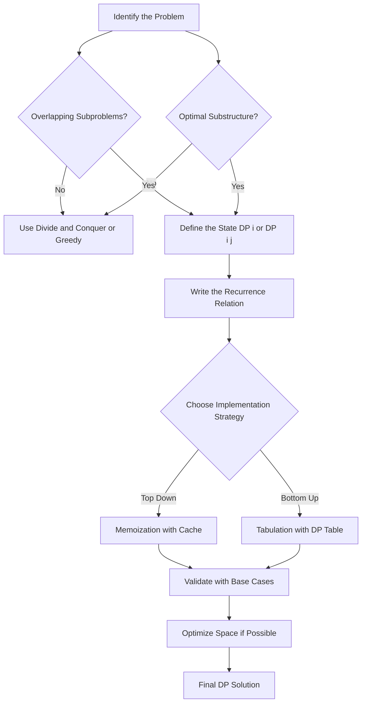
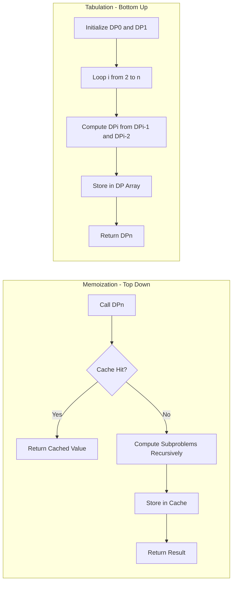
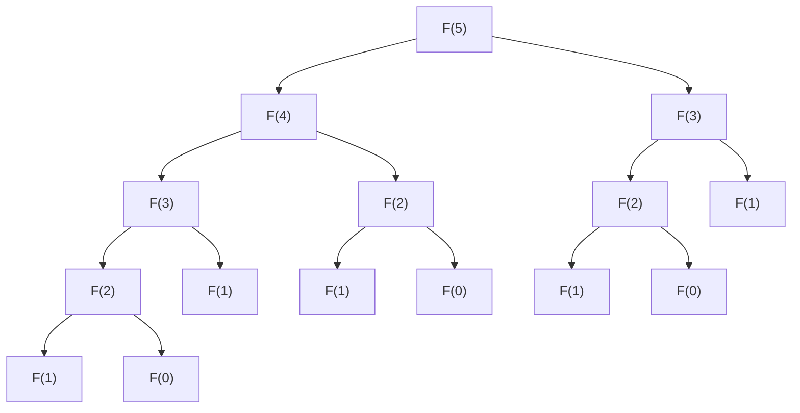
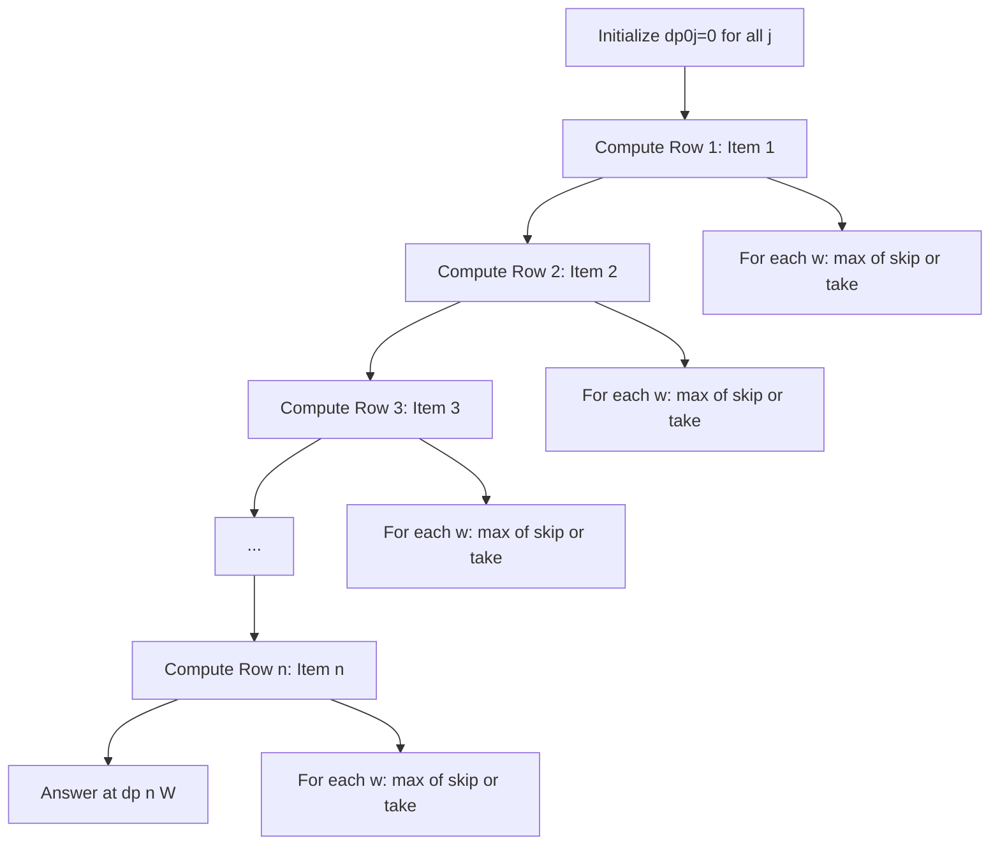
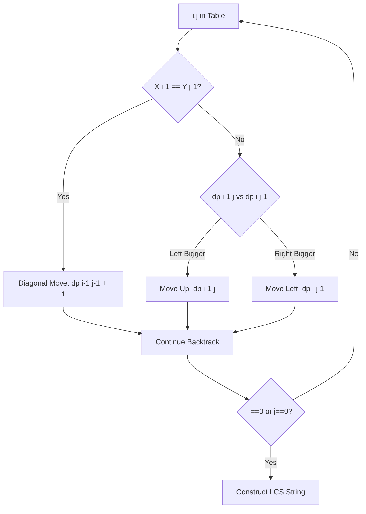
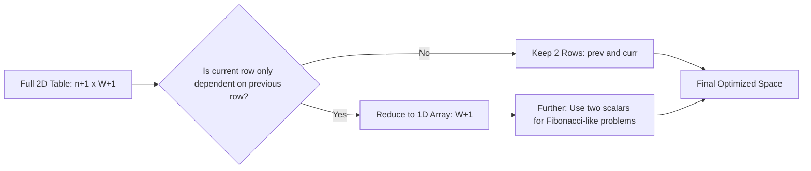

# Dynamic Programming Approach

<!-- SECTION_1_START -->
# Dynamic Programming Approach

> [!NOTE]
> **KTU 2024 | UCEST105 | Module 4.4 | Algorithmic Thinking with Python**
> Dynamic Programming (DP) is an algorithmic paradigm that solves complex problems by breaking them down into simpler overlapping subproblems, storing the results of these subproblems to avoid redundant computation. It is one of the most heavily tested paradigms in the KTU ESE and competitive programming examinations.

## 1.1 Formal Definition (KTU Syllabus Terminology)

**Dynamic Programming (DP)** is a recursive optimization technique devised by **Richard Bellman** in the 1950s. It is used to solve problems that exhibit two key properties:

1. **Overlapping Subproblems** — The problem can be broken down into subproblems which are reused multiple times.
2. **Optimal Substructure** — The optimal solution to the overall problem can be constructed from the optimal solutions of its subproblems.

Mathematically, a DP solution defines a **recurrence relation** of the form:

$$
DP[i] = \min_{j} \Big( DP[j] + cost(j, i) \Big)
$$

where the state $DP[i]$ represents the optimum value at index $i$, and $j$ ranges over all valid predecessor states.

> [!IMPORTANT]
> **Board Examiner Insight:** A problem is *suitable* for DP only if BOTH properties are satisfied. If a problem has unique subproblems (e.g., computing factorial), use **Divide & Conquer** instead. If only optimal substructure holds but subproblems are disjoint, also use D&C.

## 1.2 Intuitive Analogy — The "Staircase Memo"

Imagine you are climbing a staircase of $n$ steps. You can take either **1 step** or **2 steps** at a time. How many distinct ways can you reach the top?

A naive recursive approach would recompute the same sub-paths repeatedly (you already know how many ways there are to reach step $n-1$ and step $n-2$). Dynamic programming says: *"Once you calculate the number of ways to reach step $k$, **write it on a sticky note** and stick it on step $k$. Next time someone asks, just read the sticky note."*

That sticky note is the **memoization table** — and that act of writing + reading is the essence of DP.

> [!TIP]
> **Real-World Engineering Use-Cps:** DP powers **Google Maps shortest path**, **DNA sequence alignment in bioinformatics (BLAST)**, **compiler register allocation**, **spell-checkers (edit distance)**, and **resource allocation in operating systems**.

## 1.3 Comparison with Other Paradigms

| Paradigm | Subproblem Property | State Reuse | Time Complexity Goal |
|---|---|---|---|
| Brute Force | Independent | None | Exponential |
| Divide & Conquer | **Disjoint** subproblems | No memoization | Often $O(n \log n)$ |
| Greedy | Local optimum choice | None | Usually $O(n \log n)$ |
| **Dynamic Programming** | **Overlapping** subproblems | **Yes (memo/table)** | Polynomial |

> [!NOTE]
> **Constant to Remember:** The constant governing the space-time trade-off in DP is the **cache hit ratio** $H = \frac{\text{subproblems reused}}{\text{subproblems computed}}$. A high $H$ justifies the extra $O(n)$ or $O(n^2)$ memory.

<!-- SECTION_1_END -->

<!-- SECTION_2_START -->
# Deep Theoretical Analysis & KTU High-Yield Formula Sheet

## 2.1 The Two Pillars of DP — When to Apply

### Pillar 1: Overlapping Subproblems
A problem has overlapping subproblems if a recursive algorithm visits the same subproblem more than once. Consider computing the $n$-th Fibonacci number:

$$
F(n) = F(n-1) + F(n-2)
$$

The recursive call tree for $F(5)$ revisits $F(2)$ three times, $F(3)$ twice, etc. The number of unique subproblems is $n$, but the naive recursion calls the function roughly $\phi^n$ times, where $\phi \approx 1.618$ is the **golden ratio**.

### Pillar 2: Optimal Substructure
A problem has optimal substructure if an optimal solution to the whole problem contains within it optimal solutions to the subproblems. For example, the shortest path from $A$ to $C$ through $B$ implies that the sub-path $A \rightarrow B$ must itself be a shortest path.

## 2.2 The Two Implementation Strategies

### Strategy A: Memoization (Top-Down)
- Write a natural recursive solution.
- Add a **cache** (dictionary or list) to store results.
- Before computing, check if the result is already in the cache.
- **Time:** $O(\text{unique subproblems} \times \text{cost per subproblem})$.
- **Space:** $O(\text{depth of recursion}) + O(\text{number of subproblems})$.

### Strategy B: Tabulation (Bottom-Up)
- Identify the smallest subproblem (the **base case**).
- Iteratively fill a table from the smallest index upward.
- Each entry is computed from previously computed entries.
- **Time:** Same asymptotic bound as memoization.
- **Space:** $O(\text{number of subproblems})$ — often more cache-friendly.

## 2.3 Classic DP Problem Catalogue (KTU Favourites)

| # | Problem | State Definition | Recurrence | Time Complexity |
|---|---|---|---|---|
| 1 | Fibonacci | $dp[i] = i$-th Fibonacci | $dp[i] = dp[i-1] + dp[i-2]$ | $O(n)$ |
| 2 | Climbing Stairs | $dp[i]$ = ways to reach step $i$ | $dp[i] = dp[i-1] + dp[i-2]$ | $O(n)$ |
| 3 | 0/1 Knapsack | $dp[i][w]$ = max value using first $i$ items, weight $\leq w$ | $dp[i][w] = \max(dp[i-1][w],\ dp[i-1][w-w_i] + v_i)$ | $O(nW)$ |
| 4 | Coin Change | $dp[i]$ = min coins for amount $i$ | $dp[i] = \min(dp[i - c_j] + 1)$ for all coins $c_j$ | $O(n \cdot C)$ |
| 5 | Longest Common Subsequence | $dp[i][j]$ = LCS length of $X[0..i], Y[0..j]$ | see §2.4 below | $O(mn)$ |
| 6 | Matrix Chain Multiplication | $dp[i][j]$ = min scalar mults to multiply $A_i \cdots A_j$ | $dp[i][j] = \min_{k}(dp[i][k] + dp[k][j] + p_{i-1}p_k p_j)$ | $O(n^3)$ |
| 7 | Edit Distance | $dp[i][j]$ = min edits to convert $X[0..i]$ to $Y[0..j]$ | see §2.4 below | $O(mn)$ |

> [!IMPORTANT]
> **Constant to Remember:** The **state transition function** is the heart of any DP solution. In the KTU exam, the examiner allocates **3 to 4 marks** purely for writing the correct recurrence relation.

## 2.4 The Two-Dimensional Recurrence Patterns

### Longest Common Subsequence (LCS)

$$
dp[i][j] =
\begin{cases}
0 & \text{if } i = 0 \text{ or } j = 0 \\
dp[i-1][j-1] + 1 & \text{if } X[i-1] = Y[j-1] \\
\max(dp[i-1][j],\ dp[i][j-1]) & \text{otherwise}
\end{cases}
$$

### Edit Distance (Levenshtein Distance)

$$
dp[i][j] =
\begin{cases}
i & \text{if } j = 0 \\
j & \text{if } i = 0 \\
dp[i-1][j-1] & \text{if } X[i-1] = Y[j-1] \\
1 + \min(dp[i-1][j],\ dp[i][j-1],\ dp[i-1][j-1]) & \text{otherwise}
\end{cases}
$$

> [!VISUALIZATION CONTROL]
> **Concept:** Visualizing the DP table for LCS on strings `"ABCBDAB"` and `"BDCAB"`.
> **GeoGebra / Desmos Input Equations:** Plot a 7x6 grid with $x$-axis representing string $Y$ characters and $y$-axis representing string $X$ characters. Use color heatmap where cell value is $z$.
> **Visual Description:** Diagonal arrows show character matches, upward arrows show "skip from $X$", leftward arrows show "skip from $Y$". The student should observe that the cell value monotonically increases along the optimal trace path.

## 2.5 Real-World Utility in Engineering

- **Bioinformatics:** Sequence alignment (Needleman-Wunsch algorithm is DP-based).
- **Compiler Design:** Optimal code generation using DP for register allocation and instruction scheduling.
- **Networking:** Bellman-Ford shortest-path routing protocol in distance-vector routing (RIP).
- **AI/ML:** Viterbi algorithm for Hidden Markov Models, reinforcement learning value iteration.
- **Operations Research:** Inventory management, resource allocation, knapsack-based portfolio optimization.

<!-- SECTION_2_END -->

<!-- SECTION_3_START -->
# Step-by-Step Derivations & Code Implementation

## 3.1 Worked Example 1 — Climbing Stairs (Top-Down Memoization)

**Problem Statement:** A person is at the base of a staircase with $n$ steps. They can climb 1 or 2 steps at a time. Count the number of distinct ways to reach the top.

### Step 1: Define the State
Let $dp[i]$ denote the number of distinct ways to reach the $i$-th step.

### Step 2: Write the Recurrence
To reach step $i$, the person must have come from step $i-1$ (one-step move) or step $i-2$ (two-step move). Therefore:

$$
dp[i] = dp[i-1] + dp[i-2]
$$

### Step 3: Identify Base Cases

$$
dp[0] = 1 \quad \text{(one way to stay at the base)}
$$
$$
dp[1] = 1 \quad \text{(only one single-step move)}
$$

### Step 4: Python Implementation (Top-Down with LRU Cache)

```python
from functools import lru_cache
from typing import Dict


@lru_cache(maxsize=None)
def climb_stairs_memo(n: int) -> int:
    """
    Top-down dynamic programming using Python's built-in memoization.
    
    Parameters
    ----------
    n : int
        The number of steps in the staircase (n >= 0).
    
    Returns
    -------
    int
        The number of distinct ways to reach the top of the staircase.
    
    Raises
    ------
    ValueError
        If n is a negative integer.
    """
    if not isinstance(n, int):
        raise TypeError(f"Expected int, got {type(n).__name__}")
    if n < 0:
        raise ValueError(f"Steps must be non-negative, got {n}")
    if n <= 1:
        return 1
    return climb_stairs_memo(n - 1) + climb_stairs_memo(n - 2)


if __name__ == "__main__":
    test_n: int = 10
    result: int = climb_stairs_memo(test_n)
    print(f"Number of ways to climb {test_n} steps: {result}")
```

### Step 5: Python Implementation (Bottom-Up Tabulation)

```python
def climb_stairs_tab(n: int) -> int:
    """
    Bottom-up dynamic programming using tabulation.
    
    Parameters
    ----------
    n : int
        The number of steps in the staircase (n >= 0).
    
    Returns
    -------
    int
        The number of distinct ways to reach the top.
    """
    if n < 0:
        raise ValueError("Steps must be non-negative")
    if n <= 1:
        return 1
    
    dp: list[int] = [0] * (n + 1)
    dp[0] = 1  # base case
    dp[1] = 1  # base case
    
    for i in range(2, n + 1):
        dp[i] = dp[i - 1] + dp[i - 2]
    
    return dp[n]


# Space-optimized O(1) version
def climb_stairs_optimized(n: int) -> int:
    """
    Space-optimized version using only two rolling variables.
    Time: O(n), Space: O(1).
    """
    if n <= 1:
        return 1
    prev_prev, prev = 1, 1
    for _ in range(2, n + 1):
        current: int = prev + prev_prev
        prev_prev, prev = prev, current
    return prev
```

### Step 6: Trace the DP Table for $n = 5$

$$
\begin{aligned}
dp[0] &= 1 \\
dp[1] &= 1 \\
dp[2] &= dp[1] + dp[0] = 1 + 1 = 2 \\
dp[3] &= dp[2] + dp[1] = 2 + 1 = 3 \\
dp[4] &= dp[3] + dp[2] = 3 + 2 = 5 \\
dp[5] &= dp[4] + dp[3] = 5 + 3 = 8
\end{aligned}
$$

**Answer:** 8 distinct ways.

---

## 3.2 Worked Example 2 — 0/1 Knapsack Problem

**Problem Statement:** Given $n$ items with weights $w_1, w_2, \ldots, w_n$ and values $v_1, v_2, \ldots, v_n$, and a knapsack of capacity $W$, find the maximum total value that can be accommodated such that each item is taken **at most once** (0/1 choice).

### Step 1: State Definition

$$
dp[i][w] = \text{maximum value achievable using first } i \text{ items with capacity } w
$$

### Step 2: Recurrence Relation

For each item $i$, we have two choices:

**Choice 1 — Skip item $i$:**
$$
dp[i][w] = dp[i-1][w]
$$

**Choice 2 — Take item $i$ (only if $w_i \leq w$):**
$$
dp[i][w] = dp[i-1][w-w_i] + v_i
$$

**Combined Recurrence:**

$$
dp[i][w] =
\begin{cases}
0 & \text{if } i = 0 \text{ or } w = 0 \\
dp[i-1][w] & \text{if } w_i > w \\
\max\big(dp[i-1][w],\ \ dp[i-1][w-w_i] + v_i\big) & \text{otherwise}
\end{cases}
$$

### Step 3: Python Implementation

```python
from typing import List, Tuple


def knapsack_01(weights: List[int], values: List[int], capacity: int) -> Tuple[int, List[int]]:
    """
    Solves the 0/1 Knapsack problem using bottom-up dynamic programming.
    
    Parameters
    ----------
    weights : List[int]
        List of item weights.
    values : List[int]
        List of item values (same length as weights).
    capacity : int
        Maximum weight the knapsack can carry.
    
    Returns
    -------
    Tuple[int, List[int]]
        A tuple containing:
        - The maximum total value achievable.
        - A list of 1-based indices of selected items.
    """
    # --- Boundary checks ---
    if not isinstance(capacity, int) or capacity < 0:
        raise ValueError("Capacity must be a non-negative integer")
    if len(weights) != len(values):
        raise ValueError("Weights and values lists must have the same length")
    n: int = len(weights)
    if n == 0 or capacity == 0:
        return 0, []
    
    # --- Initialize DP table of size (n+1) x (capacity+1) ---
    dp: List[List[int]] = [[0] * (capacity + 1) for _ in range(n + 1)]
    keep: List[List[bool]] = [[False] * (capacity + 1) for _ in range(n + 1)]
    
    # --- Fill the DP table ---
    for i in range(1, n + 1):
        item_weight: int = weights[i - 1]
        item_value: int = values[i - 1]
        for w in range(capacity + 1):
            # Default: skip the item
            dp[i][w] = dp[i - 1][w]
            
            # Take the item if it fits and gives better value
            if item_weight <= w:
                value_with_item: int = dp[i - 1][w - item_weight] + item_value
                if value_with_item > dp[i][w]:
                    dp[i][w] = value_with_item
                    keep[i][w] = True
    
    # --- Backtrack to find selected items ---
    selected: List[int] = []
    w: int = capacity
    for i in range(n, 0, -1):
        if keep[i][w]:
            selected.append(i)  # 1-based index
            w -= weights[i - 1]
    selected.reverse()
    
    return dp[n][capacity], selected


if __name__ == "__main__":
    weights_list: List[int] = [2, 3, 4, 5]
    values_list: List[int] = [3, 4, 5, 6]
    cap: int = 5
    max_val, chosen = knapsack_01(weights_list, values_list, cap)
    print(f"Maximum value: {max_val}")
    print(f"Selected item indices: {chosen}")
```

### Step 4: Worked Numerical Trace

Given: $W = 5$, items = $\{(w,v)\} = \{(2,3), (3,4), (4,5), (5,6)\}$.

| $i \backslash w$ | 0 | 1 | 2 | 3 | 4 | 5 |
|---|---|---|---|---|---|---|
| 0 | 0 | 0 | 0 | 0 | 0 | 0 |
| 1 ($w$=2, $v$=3) | 0 | 0 | **3** | **3** | **3** | **3** |
| 2 ($w$=3, $v$=4) | 0 | 0 | 3 | **4** | **4** | **7** |
| 3 ($w$=4, $v$=5) | 0 | 0 | 3 | 4 | **5** | **7** |
| 4 ($w$=5, $v$=6) | 0 | 0 | 3 | 4 | 5 | **7** |

**Answer:** Maximum value = **7**, achieved by picking items 1 and 2 (weights 2+3=5, values 3+4=7).

---

## 3.3 Worked Example 3 — Coin Change (Minimum Coins)

**Problem Statement:** Given coin denominations $[c_1, c_2, \ldots, c_m]$ and a target amount $A$, find the minimum number of coins required to make the amount. If impossible, return $-1$.

### Step 1: State Definition and Recurrence

$$
dp[x] = \min_{c_j \leq x} \big( dp[x - c_j] + 1 \big)
$$

Base case: $dp[0] = 0$, and $dp[x] = \infty$ for unreachable $x$.

### Step 2: Python Implementation

```python
from typing import List


def coin_change(coins: List[int], amount: int) -> int:
    """
    Computes the minimum number of coins needed to make up the given amount.
    
    Parameters
    ----------
    coins : List[int]
        Sorted or unsorted list of positive coin denominations.
    amount : int
        The target amount (non-negative integer).
    
    Returns
    -------
    int
        Minimum number of coins, or -1 if the amount cannot be made up.
    """
    if amount < 0:
        raise ValueError("Amount must be non-negative")
    if amount == 0:
        return 0
    if not coins:
        return -1
    
    # INF acts as our "infinity" sentinel value
    INF: int = float("inf")
    dp: List[int] = [INF] * (amount + 1)
    dp[0] = 0  # base case: 0 coins for 0 amount
    
    # --- Bottom-up fill ---
    for x in range(1, amount + 1):
        for coin in coins:
            if coin <= x and dp[x - coin] + 1 < dp[x]:
                dp[x] = dp[x - coin] + 1
    
    return -1 if dp[amount] == INF else dp[amount]


if __name__ == "__main__":
    coin_denoms: List[int] = [1, 5, 10, 25]
    target: int = 41
    result: int = coin_change(coin_denoms, target)
    print(f"Minimum coins for {target} cents: {result}")
    # Output: 4 (25 + 10 + 5 + 1)
```

### Step 3: DP Table Trace for coins = [1, 5, 10, 25], amount = 30

| $x$ | 0 | 1 | 2 | 3 | 4 | 5 | $\ldots$ | 10 | $\ldots$ | 25 | $\ldots$ | 30 |
|---|---|---|---|---|---|---|---|---|---|---|---|---|
| $dp[x]$ | 0 | 1 | 2 | 3 | 4 | **1** | $\ldots$ | **1** | $\ldots$ | **1** | $\ldots$ | **2** |

At $x=30$: $dp[30] = \min(dp[29]+1, dp[25]+1, dp[20]+1, dp[5]+1) = \min(4, 2, 3, 2) = 2$ (use 25+5).

---

## 3.4 Worked Example 4 — Longest Common Subsequence (LCS)

### Step 1: Recurrence (re-stated for derivation)

$$
dp[i][j] =
\begin{cases}
0 & \text{if } i = 0 \text{ or } j = 0 \\
dp[i-1][j-1] + 1 & \text{if } X[i-1] = Y[j-1] \\
\max(dp[i-1][j],\ dp[i][j-1]) & \text{otherwise}
\end{cases}
$$

### Step 2: Python Implementation

```python
from typing import List, Tuple


def longest_common_subsequence(text1: str, text2: str) -> Tuple[int, str]:
    """
    Computes the length and the actual LCS string of two input strings.
    
    Parameters
    ----------
    text1 : str
        First input string.
    text2 : str
        Second input string.
    
    Returns
    -------
    Tuple[int, str]
        A tuple containing the LCS length and the LCS string itself.
    """
    m: int = len(text1)
    n: int = len(text2)
    
    # Edge case handling
    if m == 0 or n == 0:
        return 0, ""
    
    # Build the DP table
    dp: List[List[int]] = [[0] * (n + 1) for _ in range(m + 1)]
    for i in range(1, m + 1):
        for j in range(1, n + 1):
            if text1[i - 1] == text2[j - 1]:
                dp[i][j] = dp[i - 1][j - 1] + 1
            else:
                dp[i][j] = max(dp[i - 1][j], dp[i][j - 1])
    
    # --- Backtrack to reconstruct the LCS string ---
    lcs_chars: List[str] = []
    i, j = m, n
    while i > 0 and j > 0:
        if text1[i - 1] == text2[j - 1]:
            lcs_chars.append(text1[i - 1])
            i -= 1
            j -= 1
        elif dp[i - 1][j] >= dp[i][j - 1]:
            i -= 1
        else:
            j -= 1
    lcs_string: str = "".join(reversed(lcs_chars))
    
    return dp[m][n], lcs_string


if __name__ == "__main__":
    s1: str = "AGGTAB"
    s2: str = "GXTXAYB"
    length, sequence = longest_common_subsequence(s1, s2)
    print(f"LCS length: {length}")
    print(f"LCS string: {sequence}")
    # Output: length=4, sequence="GTAB"
```

### Step 3: Numerical Table for $X = $ "ABCBDAB", $Y = $ "BDCAB"

| $i \backslash j$ | $\emptyset$ | B | D | C | A | B |
|---|---|---|---|---|---|---|
| $\emptyset$ | 0 | 0 | 0 | 0 | 0 | 0 |
| A | 0 | 0 | 0 | 0 | 1 | 1 |
| B | 0 | 1 | 1 | 1 | 1 | 2 |
| C | 0 | 1 | 1 | 2 | 2 | 2 |
| B | 0 | 1 | 1 | 2 | 2 | 3 |
| D | 0 | 1 | 2 | 2 | 2 | 3 |
| A | 0 | 1 | 2 | 2 | 3 | 3 |
| B | 0 | 1 | 2 | 2 | 3 | **4** |

**Answer:** LCS length = **4**, sequence = "BCAB" (or "BDAB").

---

## 3.5 Complexity Comparison Table

| Problem | Naive Recursion | Memoization | Tabulation | Space-Optimized |
|---|---|---|---|---|
| Climbing Stairs | $O(2^n)$ | $O(n)$ | $O(n)$ | $O(1)$ |
| 0/1 Knapsack | $O(2^n)$ | $O(nW)$ | $O(nW)$ | $O(W)$ (1-D DP) |
| Coin Change | $O(C^A)$ | $O(A \cdot C)$ | $O(A \cdot C)$ | $O(A)$ |
| LCS | $O(2^{m+n})$ | $O(mn)$ | $O(mn)$ | $O(\min(m,n))$ |
| Edit Distance | $O(3^{m+n})$ | $O(mn)$ | $O(mn)$ | $O(\min(m,n))$ |

<!-- SECTION_3_END -->

<!-- SECTION_4_START -->
# Structural Diagrams & Schematics

## 4.1 High-Level DP Solution Architecture



## 4.2 Memoization vs. Tabulation — Data Flow



## 4.3 Recursion Tree of Naive Fibonacci (n=5) — Showing Redundancy



## 4.4 DP Table Construction for 0/1 Knapsack (Sequence Topology)



## 4.5 Decision Flow in LCS — Character Comparison



## 4.6 State Reduction (Space Optimization Concept)



<!-- SECTION_4_END -->

<!-- SECTION_5_START -->
# KTU 2024 Scheme Examination Question Bank & Topic Recap

---

## Part A — Short Answer Questions (3 Marks Each)

### Question 1
**`[KTU University Exam - July 2024]`** — **CO1, Remember**

**Define Dynamic Programming. List its two essential properties.**

**Model Answer:**

> Dynamic Programming is an algorithmic strategy that solves complex problems by recursively breaking them into simpler subproblems and storing the results of these subproblems to avoid recomputation.
>
> The two essential properties are:
> 1. **Overlapping Subproblems** — The same subproblems are solved multiple times in a naive recursive approach.
> 2. **Optimal Substructure** — The optimal solution of the overall problem can be constructed from the optimal solutions of its subproblems.

**[Stating the definition: 1 Mark]**, **[Naming both properties: 1 Mark]**, **[Brief explanation of each: 1 Mark]**.

---

### Question 2
**`[KTU University Exam - Dec 2023]`** — **CO2, Understand**

**Distinguish between Memoization (Top-Down) and Tabulation (Bottom-Up) approaches of Dynamic Programming.**

**Model Answer:**

| Feature | Memoization (Top-Down) | Tabulation (Bottom-Up) |
|---|---|---|
| Direction | Starts from the problem and recurses down | Starts from base cases and iterates up |
| Implementation | Recursion with a cache | Iterative loops with a table |
| Subproblem order | Computed lazily, on demand | All subproblems are pre-computed |
| Stack overhead | Uses recursion stack $O(n)$ | No recursion, hence $O(1)$ stack |
| Cache locality | Lower (recursive calls) | Higher (sequential array access) |
| Ease of coding | Often closer to the natural recurrence | Requires explicit loop ordering |

**[Mentioning direction: 1 Mark]**, **[Mentioning recursion vs iteration: 1 Mark]**, **[Any two additional correct points: 1 Mark]**.

---

## Part B — Long Answer Questions (14 Marks Each)

> [!NOTE]
> Per KTU 2024 ESE regulations, every 14-mark question provides an internal choice between two alternatives. Both are presented below.

---

### Question A (14 Marks)

**`[KTU University Exam - July 2024]`** — **CO3, Apply**

**Solve the following using Dynamic Programming:**

**(a)** [7 Marks] Write the recurrence relation and a Python program (both top-down and bottom-up) to compute the $n$-th Fibonacci number. Explain how the time complexity drops from $O(2^n)$ to $O(n)$.

**(b)** [7 Marks] For the input $n = 8$, trace the bottom-up DP table and output the value. Also write a space-optimized $O(1)$ version.

---

#### Part (a) — 7 Marks Solution

**Recurrence Relation:**

$$
F(n) =
\begin{cases}
0 & \text{if } n = 0 \\
1 & \text{if } n = 1 \\
F(n-1) + F(n-2) & \text{if } n \geq 2
\end{cases}
$$

**Top-Down Python Code:**

```python
from functools import lru_cache
from typing import Dict


@lru_cache(maxsize=None)
def fib_memo(n: int) -> int:
    if n < 0:
        raise ValueError("n must be non-negative")
    if n < 2:
        return n
    return fib_memo(n - 1) + fib_memo(n - 2)
```

**Bottom-Up Python Code:**

```python
def fib_tab(n: int) -> int:
    if n < 0:
        raise ValueError("n must be non-negative")
    if n < 2:
        return n
    dp: list[int] = [0, 1]
    for i in range(2, n + 1):
        dp.append(dp[i - 1] + dp[i - 2])
    return dp[n]
```

**Complexity Reduction Explanation:**

In naive recursion, $F(n)$ generates a binary tree of depth $n$, leading to $O(\phi^n)$ calls where $\phi \approx 1.618$. Since there are only $n+1$ **unique** subproblems ($F(0), F(1), \ldots, F(n)$), memoization ensures each is computed exactly once. Hence the time becomes $O(n)$.

**[Recurrence relation: 2 Marks]**, **[Correct top-down code: 1 Mark]**, **[Correct bottom-up code: 1 Mark]**, **[Complexity justification: 2 Marks]**, **[Clean function structure: 1 Mark]**.

---

#### Part (b) — 7 Marks Solution

**DP Table Trace for $n = 8$:**

| $i$ | 0 | 1 | 2 | 3 | 4 | 5 | 6 | 7 | 8 |
|---|---|---|---|---|---|---|---|---|---|
| $dp[i]$ | 0 | 1 | 1 | 2 | 3 | 5 | 8 | 13 | **21** |

**Space-Optimized Python Code:**

```python
def fib_optimized(n: int) -> int:
    if n < 0:
        raise ValueError("n must be non-negative")
    if n < 2:
        return n
    prev_prev, prev = 0, 1
    for _ in range(2, n + 1):
        current: int = prev + prev_prev
        prev_prev, prev = prev, current
    return prev
```

**Final Answer:** $F(8) = 21$.

**[Full DP table: 2 Marks]**, **[Space-optimized code: 3 Marks]**, **[Final value 21: 1 Mark]**, **[Time & space complexity mentioned: 1 Mark]**.

---

### Question B (14 Marks)

**`[KTU University Exam - Dec 2023]`** — **CO3, Apply / Analyze**

**Solve the following using Dynamic Programming:**

**(a)** [7 Marks] Solve the 0/1 Knapsack problem using Dynamic Programming. Items are: $(w_1=2, v_1=3)$, $(w_2=3, v_2=4)$, $(w_3=4, v_3=5)$, $(w_4=5, v_4=6)$. Knapsack capacity $W = 5$. Show the complete DP table and identify the selected items with their total value.

**(b)** [7 Marks] Write a complete Python function to solve the same 0/1 Knapsack problem for arbitrary inputs, and explain the time and space complexity.

---

#### Part (a) — 7 Marks Solution

**Recurrence Relation:**

$$
dp[i][w] =
\begin{cases}
0 & \text{if } i = 0 \text{ or } w = 0 \\
\max\big(dp[i-1][w],\ dp[i-1][w-w_i] + v_i\big) & \text{if } w_i \leq w \\
dp[i-1][w] & \text{if } w_i > w
\end{cases}
$$

**DP Table (same as §3.2):**

| $i \backslash w$ | 0 | 1 | 2 | 3 | 4 | 5 |
|---|---|---|---|---|---|---|
| 0 | 0 | 0 | 0 | 0 | 0 | 0 |
| 1 (w=2, v=3) | 0 | 0 | 3 | 3 | 3 | 3 |
| 2 (w=3, v=4) | 0 | 0 | 3 | 4 | 4 | **7** |
| 3 (w=4, v=5) | 0 | 0 | 3 | 4 | 5 | 7 |
| 4 (w=5, v=6) | 0 | 0 | 3 | 4 | 5 | 7 |

**Selected Items:** Items 1 and 2 (weights $2+3=5$, values $3+4=7$).
**Maximum Value:** $7$.

**[Recurrence relation: 2 Marks]**, **[Initial table: 1 Mark]**, **[Correctly filled table: 2 Marks]**, **[Selected items and final value: 2 Marks]**.

---

#### Part (b) — 7 Marks Solution

**Complete Python Function:**

```python
from typing import List, Tuple


def knapsack_full(weights: List[int], values: List[int], capacity: int) -> Tuple[int, List[int]]:
    """Solves 0/1 knapsack and returns max value and selected item indices."""
    if capacity < 0 or not isinstance(capacity, int):
        raise ValueError("Capacity must be a non-negative integer")
    if len(weights) != len(values):
        raise ValueError("weights and values must have equal length")
    
    n: int = len(weights)
    if n == 0 or capacity == 0:
        return 0, []
    
    dp: List[List[int]] = [[0] * (capacity + 1) for _ in range(n + 1)]
    keep: List[List[bool]] = [[False] * (capacity + 1) for _ in range(n + 1)]
    
    for i in range(1, n + 1):
        wi: int = weights[i - 1]
        vi: int = values[i - 1]
        for w in range(capacity + 1):
            dp[i][w] = dp[i - 1][w]
            if wi <= w:
                with_item: int = dp[i - 1][w - wi] + vi
                if with_item > dp[i][w]:
                    dp[i][w] = with_item
                    keep[i][w] = True
    
    selected: List[int] = []
    w: int = capacity
    for i in range(n, 0, -1):
        if keep[i][w]:
            selected.append(i)
            w -= weights[i - 1]
    selected.reverse()
    return dp[n][capacity], selected


# --- Driver code ---
weights: List[int] = [2, 3, 4, 5]
values: List[int] = [3, 4, 5, 6]
W: int = 5
max_value, chosen_items = knapsack_full(weights, values, W)
print(f"Max value: {max_value}, Chosen: {chosen_items}")
```

**Complexity Analysis:**

- **Time Complexity:** The double loop runs for $n \times (W+1)$ iterations, each doing $O(1)$ work. Total: $O(n \cdot W)$.
- **Space Complexity:** The 2D DP table takes $O(n \cdot W)$ space; the `keep` table is also $O(n \cdot W)$. Space-optimized variant: $O(W)$ using a 1-D rolling array.

**[Correct function with type hints: 3 Marks]**, **[Boundary checks: 1 Mark]**, **[Backtracking logic: 1 Mark]**, **[Time complexity $O(nW)$: 1 Mark]**, **[Space complexity $O(nW)$ with optimization note: 1 Mark]**.

---

> [!WARNING]
> **KTU Examiner's Valuation Warning / Pitfall Callout**
> 1. **Never skip writing the recurrence relation.** Examiners allocate 2–3 marks purely for the correct formula. Writing only the code costs you those marks.
> 2. **Forgetting base cases** ($dp[0] = 0$ or $dp[0][j] = 0$) is the most common error. Always initialize the table before filling.
> 3. **Off-by-one indexing errors** in the loop bounds (e.g., using `range(n)` instead of `range(1, n+1)`) silently corrupt your output. Trace one small case manually to validate.
> 4. **Do not confuse 0/1 Knapsack with Fractional Knapsack.** The latter is solved with **Greedy**, not DP.
> 5. **In LCS, forgetting the diagonal move** when characters match is a fatal mistake. Always check `text1[i-1] == text2[j-1]` first.
> 6. **Always mention the time and space complexity explicitly** at the end of your answer — examiners award up to 1 mark for this.
> 7. **For memoization, set the recursion limit** in Python using `sys.setrecursionlimit(10**6)` to avoid `RecursionError` for large $n$.

---

## Topic Recap & Important Things to Remember

- **Definition:** DP = recursion + memoization of overlapping subproblems with optimal substructure.
- **Two Pillars:** Overlapping subproblems + Optimal substructure (BOTH must hold).
- **Two Flavors:** Memoization (top-down, recursive with cache) and Tabulation (bottom-up, iterative with array).
- **Fibonacci Recurrence:** $F(n) = F(n-1) + F(n-2)$ with $F(0)=0$, $F(1)=1$.
- **Climbing Stairs Recurrence:** $dp[i] = dp[i-1] + dp[i-2]$ with $dp[0]=dp[1]=1$.
- **0/1 Knapsack Recurrence:** $dp[i][w] = \max(dp[i-1][w],\; dp[i-1][w-w_i] + v_i)$ when $w_i \leq w$.
- **Knapsack Complexity:** $O(nW)$ time, $O(nW)$ space (reducible to $O(W)$).
- **LCS Recurrence:** $dp[i][j] = dp[i-1][j-1] + 1$ if match; else $\max(dp[i-1][j], dp[i][j-1])$.
- **LCS Complexity:** $O(mn)$ time, $O(mn)$ space (reducible to $O(\min(m,n))$).
- **Coin Change Recurrence:** $dp[x] = \min_{c \leq x}(dp[x-c] + 1)$, base $dp[0]=0$, sentinel $\infty$ for unreachable.
- **Edit Distance:** Uses three operations — insert, delete, replace — each costing 1.
- **Bellman-Ford Algorithm:** A direct application of DP for shortest paths in weighted graphs with possible negative edges.
- **Time Drop:** Naive recursion $O(2^n)$ or worse → DP $O(n)$ to $O(n^2)$ or $O(nW)$.
- **Space Optimization Trick:** When row $i$ depends only on row $i-1$, use a single 1-D rolling array updated in **reverse** for 0/1 Knapsack, or **forward** for unbounded knapsack.
- **State Definition is the Key Step:** Spend 60% of your exam time on correctly defining $dp[i]$ or $dp[i][j]$. The recurrence follows almost automatically.
- **For the KTU exam:** Always state the recurrence, draw or tabulate the DP table for small inputs, write clean Python code with type hints, and conclude with time-space complexity.

<!-- SECTION_5_END -->
