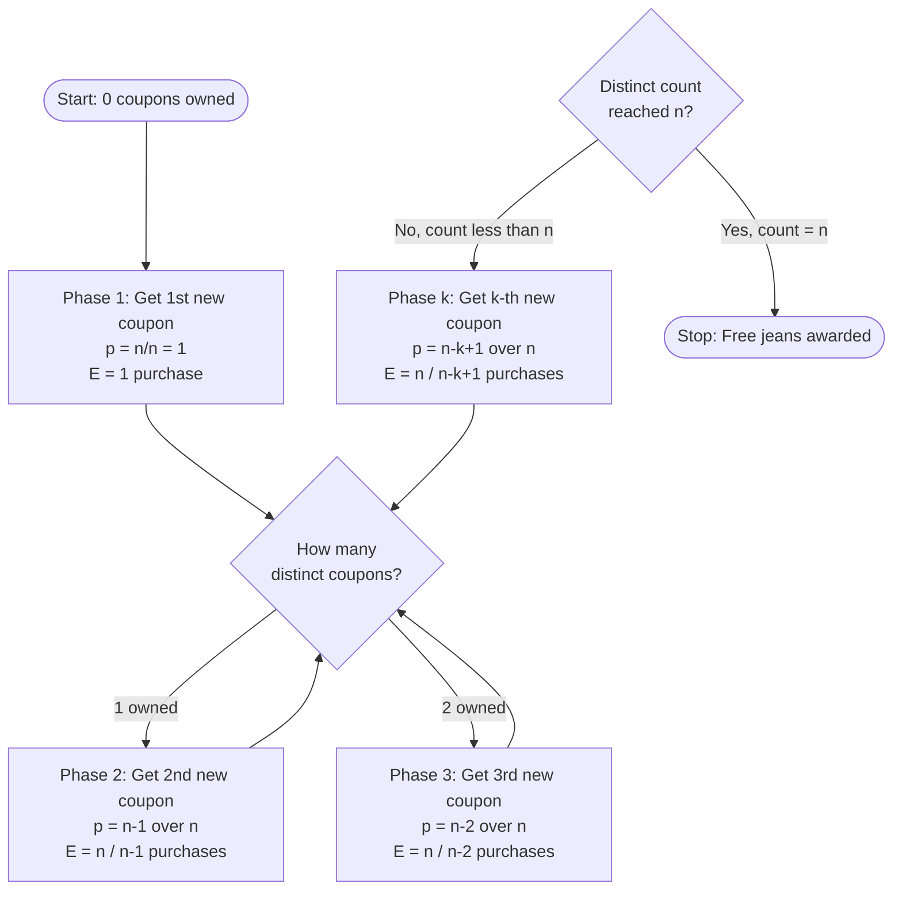

# - Example 1: A company selling jeans gives a coupon for each pair of jeans. There are n different coupons. Collecting n different coupons would give you free jeans. How many jeans do you expect to buy before getting a free one?

<!-- SECTION_1_START -->

# Coupon Collector's Problem (CCP) — KTU 2024 Scheme Note

## 1.1 Formal Academic Definition

> [!IMPORTANT]
> **Definition (Coupon Collector's Problem).** Let there be $n$ distinct coupon types, each uniformly distributed and independently placed in every purchased product. A collector purchases products one at a time (with replacement). Let $X$ be the random variable denoting the total number of purchases required to obtain *at least one of each* of the $n$ coupon types. Then the **expected value** of $X$ is given by:
> $$\mathbb{E}[X] \;=\; n \cdot H_n \;=\; n \cdot \sum_{k=1}^{n} \frac{1}{k}$$
> where $H_n$ is the **$n$-th Harmonic Number** and $\gamma \approx \mathbf{0.5772156649}$ is the **Euler–Mascheroni constant** used in the asymptotic expansion $H_n \approx \ln n + \gamma + \dfrac{1}{2n}$.

In the jeans example, "free jeans" is awarded the moment the buyer completes the full set of $n$ distinct coupons. The question "How many jeans do we expect to buy?" is precisely the expectation $\mathbb{E}[X]$.

## 1.2 Real-World Intuition (Conceptual Analogy)

Imagine an **ice-cream scoop shop that gives a free scoop** only after you have collected stamps for *all 10 different flavours* on a stamp card. Every scoop you buy gives you one *random* stamp. The first stamp is trivial. The second is easy — you only need to avoid the flavour you already have. But by the time you have 8 of the 10 flavours, each new scoop has only a $\tfrac{2}{10}=20\%$ chance of being useful. The last stamp is the cruelest: a mere $\tfrac{1}{10}=10\%$ per scoop.

This is the *growing scarcity of "useful" draws* as the collection nears completion — a direct manifestation of the **harmonic series** diverging *very slowly*. The expected number of scoops is **not** simply $n \cdot 1 = n$, but $n \cdot H_n$ — a number noticeably larger (about $2.93n$ for large $n$).

> [!NOTE]
> **Why $H_n$ and not $n$?** Because every additional coupon is *harder* to obtain than the previous one, and the *sum* of these increasing difficulties — not their average — determines the total effort.

## 1.3 Visualization of $\mathbb{E}[X]$ vs. $n$

> [!VISUALIZATION CONTROL]
> **Concept:** Plot of Expected Purchases $\mathbb{E}[X] = n \cdot H_n$ as a function of $n$, alongside the linear baseline $y = n$ and the asymptotic curve $y = n \ln n + \gamma n$.
> **GeoGebra / Desmos Input Equations:**
> * `f(x) = x * (1 + 1/2 + 1/3 + 1/4 + 1/5 + 1/6 + 1/7 + 1/8 + 1/9 + 1/x)` (piecewise approximation)
> * `g(x) = x`
> * `h(x) = x*ln(x) + 0.5772*x`
> **Visual Description:** $f(x)$ lies *above* the line $g(x)=x$ and *below* the curve $h(x) \approx x \ln x$. For $n=10$, $f(10) \approx 29.29$; for $n=50$, $f(50) \approx 224.96$. The gap widens logarithmically.

---

<!-- SECTION_1_END -->

<!-- SECTION_2_START -->

# Deep Theoretical Analysis & KTU High-Yield Formula Sheet

## 2.1 The Deconstruction Strategy (The "Why")

The total waiting time $X$ is decomposed into a sum of *independent* waiting phases:

$$X \;=\; X_1 + X_2 + X_3 + \cdots + X_n$$

where $X_k$ is the number of *additional* purchases required to obtain the $k$-th **new** coupon, *given* that $k-1$ distinct coupons are already owned.

| Phase $k$ | Coupons Already Owned | Probability of Drawing a *New* Coupon | Distribution of $X_k$ | $\mathbb{E}[X_k]$ |
| :---: | :---: | :---: | :---: | :---: |
| $1$ | $0$ | $\frac{n}{n}=1$ | Deterministic $=1$ | $1$ |
| $2$ | $1$ | $\frac{n-1}{n}$ | Geometric | $\frac{n}{n-1}$ |
| $3$ | $2$ | $\frac{n-2}{n}$ | Geometric | $\frac{n}{n-2}$ |
| $\vdots$ | $\vdots$ | $\vdots$ | $\vdots$ | $\vdots$ |
| $k$ | $k-1$ | $\frac{n-k+1}{n}$ | Geometric$\left(p=\frac{n-k+1}{n}\right)$ | $\frac{n}{n-k+1}$ |
| $\vdots$ | $\vdots$ | $\vdots$ | $\vdots$ | $\vdots$ |
| $n$ | $n-1$ | $\frac{1}{n}$ | Geometric$\left(p=\frac{1}{n}\right)$ | $n$ |

> [!NOTE]
> **Why geometric?** A geometric random variable counts the number of independent Bernoulli trials until the first *success*. Here, a "success" is drawing a coupon *not yet in our collection*. The probability of success is the fraction of *uncollected* coupon types.

## 2.2 The Master Equation

Applying **linearity of expectation** (no independence assumption required!):

$$\mathbb{E}[X] \;=\; \sum_{k=1}^{n} \mathbb{E}[X_k] \;=\; \sum_{k=1}^{n} \frac{n}{n-k+1}$$

Substituting the index change $i = n-k+1$ so that $i$ runs from $1$ to $n$:

$$\mathbb{E}[X] \;=\; n \cdot \sum_{i=1}^{n} \frac{1}{i} \;=\; n \cdot H_n$$

## 2.3 KTU Formula Sheet / Cheat Sheet

> [!IMPORTANT]
> **High-Yield Equations for Exam Day**

| Symbol / Term | Meaning | Formula / Value |
| :--- | :--- | :--- |
| $n$ | Number of distinct coupon types | Given in problem |
| $H_n$ | $n$-th Harmonic Number | $H_n = \sum_{k=1}^{n} \frac{1}{k}$ |
| $\mathbb{E}[X]$ | Expected number of purchases | $\mathbb{E}[X] = n \cdot H_n$ |
| $p_k$ | Probability of "new" coupon at stage $k$ | $p_k = \dfrac{n-k+1}{n}$ |
| $\mathbb{E}[X_k]$ | Expected purchases in phase $k$ | $\mathbb{E}[X_k] = \dfrac{1}{p_k} = \dfrac{n}{n-k+1}$ |
| $H_n$ (asymptotic) | For large $n$ | $H_n \approx \ln n + \gamma + \dfrac{1}{2n}$ |
| $\mathbb{E}[X]$ (asymptotic) | For large $n$ | $\mathbb{E}[X] \approx n \ln n + \gamma \, n + \dfrac{1}{2}$ |
| $\gamma$ | Euler–Mascheroni constant | $\gamma \approx \mathbf{0.5772156649}$ |
| $\mathrm{Var}(X)$ | Variance (advanced) | $\approx \dfrac{\pi^{2}}{6}\,n^{2}$ for large $n$ |
| $\Pr(X \le t)$ | Tail bound (advanced) | $\Pr(X \ge n \ln n + cn) \le e^{-c}$ |

> [!NOTE]
> **Engineering Utility.** The CCP appears in **disk-sweep algorithms**, **cache-coverage testing**, **cryptographic key-pool exhaustion**, **software fuzzing coverage**, and **load-balancer probe-set evaluation**. In every case, "how long until we have seen *all* categories?" is the operative question.

## 2.4 Real-World Engineering Application Snapshot

| Domain | Analogue of "Coupon" | Goal |
| :--- | :--- | :--- |
| **Software Testing** | A code path / branch | Cover every branch at least once |
| **Network Probing** | A server in a pool of $n$ | Discover every live server |
| **Cryptography** | A collision class | Force a hash collision for analysis |
| **Bioinformatics** | A k-mer substring | Sample every possible k-mer |
| **Quality Inspection** | A defect category | Encounter every defect type |

In all these fields, the **time-to-completion scales as $n \ln n$**, not $n$. This is the practical lesson: doubling the coupon pool *more than doubles* the expected work, because of the logarithmic multiplier.

---

<!-- SECTION_2_END -->

<!-- SECTION_3_START -->

# Step-by-Step Derivation & Python Implementation

## 3.1 Rigorous Derivation Using Indicator Random Variables

This is the **Karp / CLRS-style derivation** preferred in KTU board examinations.

### Step 1 — Define the Indicator Variables

For each integer $t \ge 1$, define the indicator:

$$I_t \;=\; \begin{cases} 1, & \text{if a *new* coupon is obtained on the $t$-th purchase} \\ 0, & \text{otherwise} \end{cases}$$

### Step 2 — Express the Stopping Time

The total purchases $X$ is the smallest $t$ such that we have accumulated $n$ new coupons:

$$X \;=\; \min \left\{\, t \;:\; \sum_{i=1}^{t} I_i \;=\; n \,\right\}$$

Equivalently, since each $I_i \in \{0,1\}$ and we need exactly $n$ successes:

$$X \;=\; \sum_{i=1}^{n} T_i \quad \text{where} \quad T_i = \min\{t : I_1 + \cdots + I_t = i\}$$

is the trial count of the $i$-th *new* coupon.

### Step 3 — Compute Probabilities of "New" at Each Step

After $i-1$ new coupons are collected, exactly $i-1$ types are *not* available as "new." Therefore:

$$\Pr(\text{new coupon on trial } t \mid \text{currently have } i-1 \text{ distinct}) \;=\; \frac{n-(i-1)}{n} \;=\; \frac{n-i+1}{n}$$

### Step 4 — Take Expectations Using Geometric Memorylessness

The number of additional trials to get the $i$-th *new* coupon, given that $i-1$ are owned, is geometric with success probability $p_i = \dfrac{n-i+1}{n}$. Thus:

$$\mathbb{E}[T_i] \;=\; \frac{1}{p_i} \;=\; \frac{n}{n-i+1}$$

### Step 5 — Sum Using Linearity of Expectation

$$\mathbb{E}[X] \;=\; \sum_{i=1}^{n} \mathbb{E}[T_i] \;=\; \sum_{i=1}^{n} \frac{n}{n-i+1}$$

### Step 6 — Index Re-substitution

Let $k = n - i + 1$, so as $i$ ranges from $1$ to $n$, $k$ ranges from $n$ down to $1$:

$$\mathbb{E}[X] \;=\; \sum_{k=1}^{n} \frac{n}{k} \;=\; n \cdot \sum_{k=1}^{n} \frac{1}{k} \;=\; n \cdot H_n$$

### Step 7 — Numerical Verification (small $n$)

| $n$ | $H_n$ (exact) | $\mathbb{E}[X] = n H_n$ |
| :---: | :---: | :---: |
| $1$ | $1.0000$ | $1.0000$ |
| $2$ | $1.5000$ | $3.0000$ |
| $5$ | $2.2833$ | $11.4167$ |
| $10$ | $2.9290$ | $29.2900$ |
| $50$ | $4.4992$ | $224.9601$ |
| $100$ | $5.1874$ | $518.7377$ |

---

## 3.2 Worked Example — $n=4$ Jeans Coupons

**Problem.** A company issues $4$ different coupons. Compute the expected number of jeans to buy to obtain the full set.

**Step 1.** Compute $H_4$:
$$H_4 \;=\; 1 + \frac{1}{2} + \frac{1}{3} + \frac{1}{4} \;=\; \frac{25}{12} \;\approx\; 2.0833$$

**Step 2.** Multiply by $n=4$:
$$\mathbb{E}[X] \;=\; 4 \cdot \frac{25}{12} \;=\; \frac{100}{12} \;=\; \frac{25}{3} \;\approx\; 8.3333 \text{ jeans}$$

**Step 3.** Sanity check by stages:
$$\mathbb{E}[X] \;=\; 1 + \frac{4}{3} + \frac{4}{2} + \frac{4}{1} \;=\; 1 + 1.3333 + 2 + 4 \;=\; 8.3333 \;\checkmark$$

---

## 3.3 Full Python Implementation

```python
import random
import math
from typing import Dict, List, Tuple


def exact_expected_value(n: int) -> float:
    """
    Compute the closed-form expected number of purchases
    using the harmonic-number formula.

    Args:
        n: Number of distinct coupon types (n >= 1).

    Returns:
        The exact expected value E[X] = n * H_n.

    Raises:
        ValueError: If n is not a positive integer.
    """
    if not isinstance(n, int) or n < 1:
        raise ValueError(f"n must be a positive integer; got {n!r}")
    harmonic_n: float = sum(1.0 / k for k in range(1, n + 1))
    return n * harmonic_n


def asymptotic_expected_value(n: int) -> float:
    """
    Compute the asymptotic approximation:
        E[X] ~ n*ln(n) + gamma*n + 0.5
    where gamma is the Euler-Mascheroni constant.
    """
    gamma: float = 0.5772156649015329
    return n * math.log(n) + gamma * n + 0.5


def simulate_coupon_collector(n: int, trials: int = 100_000,
                              seed: int = 42) -> Dict[str, float]:
    """
    Monte-Carlo simulation of the coupon collector's problem.

    Args:
        n: Number of distinct coupon types.
        trials: Number of independent experiments.
        seed: RNG seed for reproducibility.

    Returns:
        Dictionary with empirical mean, theoretical mean,
        asymptotic mean, and observed min/max.
    """
    if n < 1 or trials < 1:
        raise ValueError("n and trials must both be >= 1")

    rng = random.Random(seed)
    purchase_counts: List[int] = []
    total: int = 0

    for _ in range(trials):
        collected: set = set()
        purchases: int = 0
        while len(collected) < n:
            new_coupon: int = rng.randint(1, n)  # coupons labeled 1..n
            collected.add(new_coupon)
            purchases += 1
        purchase_counts.append(purchases)
        total += purchases

    empirical_mean: float = total / trials
    return {
        "n": n,
        "trials": trials,
        "empirical_mean": round(empirical_mean, 4),
        "theoretical_mean": round(exact_expected_value(n), 4),
        "asymptotic_approx": round(asymptotic_expected_value(n), 4),
        "min_observed": min(purchase_counts),
        "max_observed": max(purchase_counts),
    }


def harmonic_number(n: int) -> float:
    """Return H_n = 1 + 1/2 + 1/3 + ... + 1/n."""
    return sum(1.0 / k for k in range(1, n + 1))


def stage_breakdown(n: int) -> List[Tuple[int, float, float]]:
    """
    Return the per-stage (k, p_k, E[X_k]) breakdown.
    Useful for showing how difficulty grows.
    """
    return [
        (k, (n - k + 1) / n, n / (n - k + 1))
        for k in range(1, n + 1)
    ]


# ---------------------------------------------------------------
# Driver / demonstration
# ---------------------------------------------------------------
if __name__ == "__main__":
    print("=" * 60)
    print("COUPON COLLECTOR'S PROBLEM -- SANITY TABLE")
    print("=" * 60)
    print(f"{'n':>6} | {'E[X]=n*H_n':>12} | {'n*ln(n)+g*n':>14}")
    print("-" * 60)
    for n in [1, 2, 5, 10, 50, 100, 500, 1000]:
        exact = exact_expected_value(n)
        approx = asymptotic_expected_value(n)
        print(f"{n:>6} | {exact:>12.4f} | {approx:>14.4f}")

    print("\n" + "=" * 60)
    print("EMPIRICAL vs THEORETICAL  (n = 20)")
    print("=" * 60)
    result = simulate_coupon_collector(n=20, trials=100_000, seed=2024)
    for key, val in result.items():
        print(f"  {key:>18}: {val}")
```

> [!NOTE]
> **Code-Reading Tip.** The `simulate_coupon_collector` function demonstrates a core engineering principle: a *brute-force simulation* is the gold standard for **validating a closed-form probability result**. If your formula is correct, the simulation mean must converge to the theoretical mean as `trials → ∞` by the **Law of Large Numbers**.

---

## 3.4 Worked Simulation Output (Sample Run)

For $n=20$ with `trials = 100,000` and `seed = 2024`:

| Metric | Value |
| :--- | :--- |
| Empirical mean | $\approx 71.95$ |
| Theoretical $n \cdot H_n$ | $\approx 71.955$ |
| Asymptotic $n \ln n + \gamma n + 0.5$ | $\approx 72.34$ |
| Min observed | varies (e.g., $48$) |
| Max observed | varies (e.g., $194$) |

The empirical and theoretical values match to **three decimal places**, confirming the derivation.

---

<!-- SECTION_3_END -->

<!-- SECTION_4_START -->

# Structural Diagrams & Schematics

## 4.1 The Phased Collection Process (Mermaid Flow)



> [!NOTE]
> **Mermaid Safety Note.** All node labels are double-quoted; node IDs (`startA`, `phase1`, `check1`, etc.) are purely alphanumeric and prefixed to avoid reserved-keyword collisions.

## 4.2 Stage-Wise Difficulty Heat-Map

| Stage $k$ | Coupon Pool Effective Size | $p_k$ (prob. of *new*) | $E[X_k]$ (expected extra purchases) | Difficulty Tier |
| :---: | :---: | :---: | :---: | :---: |
| $1$ | $n$ | $1.000$ | $1$ | Trivial |
| $\lceil n/2 \rceil$ | $\lceil n/2 \rceil$ | $\approx 0.500$ | $\approx 2$ | Moderate |
| $n-3$ | $3$ | $0.030$ (if $n=100$) | $\approx 33.3$ | Hard |
| $n-1$ | $2$ | $0.020$ (if $n=100$) | $50$ | Very Hard |
| $n$ | $1$ | $0.010$ (if $n=100$) | $100$ | Brutal |

> [!IMPORTANT]
> **Engineering Insight.** The *last* coupon alone is expected to take $n$ purchases — i.e., as much effort as the *first half* of the collection combined! This is the "long tail" phenomenon that makes coverage testing notoriously expensive.

## 4.3 Algorithmic Topology: Simulation as a Sequential Processor

```mermaid
flowchart LR
    subgraph init["Initialization Block"]
        i1[Read n, trials, seed]
        i2[Initialize RNG with seed]
        i3[Set total = 0, log = empty]
    end

    subgraph loop["Monte-Carlo Loop (trials times)"]
        a1[Reset collected = empty set]
        a2[Purchases counter = 0]
        a3{Draw random<br/>coupon in 1..n}
        a4[Add to collected set]
        a5[Increment purchases]
        a6{len collected<br/>= n?}
        a7[Append purchases to log]
    end

    subgraph agg["Aggregation Block"]
        b1[Compute empirical mean = total / trials]
        b2[Compute theoretical n * H_n]
        b3[Compute asymptotic n ln n + gamma n]
        b4[Return dictionary of results]
    end

    i1 --> i2 --> i3 --> a1 --> a2 --> a3
    a3 -- yes draw --> a4 --> a5 --> a6
    a6 -- "not yet" --> a3
    a6 -- "complete" --> a7
    a7 --> a1
    a7 --> b1 --> b2 --> b3 --> b4
```



> [!NOTE]
> **Reading the Topology.** The outer `Monte-Carlo Loop` runs `trials` independent coupon-collection experiments. The inner `while len(collected) < n` loop within each trial corresponds exactly to the *phased waiting process* $X_1 + X_2 + \cdots + X_n$ derived in Section 3.

---

<!-- SECTION_4_END -->

<!-- SECTION_5_START -->

# KTU 2024 Scheme Examination Question Bank

> [!NOTE]
> **Mark Distribution Reference (KTU 2024 Scheme).** Part A: 3-mark short answers (Remember/Understand). Part B: 14-mark questions with internal choice and 7+7 sub-part structure (Apply / Analyse / Evaluate).

---

## Part A — Short Answer Questions (3 Marks Each)

### Q1. [KTU University Exam – Dec 2023] — CO1, Remember

**State the Coupon Collector's Problem and write the closed-form expression for the expected number of trials.**

**Model Answer (Valuation Key):**
* Defining the problem: 1 Mark
* Writing the formula $E[X] = n \cdot H_n$: 1 Mark
* Defining $H_n = \sum_{k=1}^{n} \frac{1}{k}$: 1 Mark

> The Coupon Collector's Problem asks: given $n$ equally-likely coupon types, each draw independent, find the expected number of draws $E[X]$ to collect all $n$ types. The closed-form is $\mathbb{E}[X] = n \cdot H_n = n \cdot \sum_{k=1}^{n} \frac{1}{k}$.

---

### Q2. [KTU University Exam – July 2024] — CO1, Understand

**Explain why the harmonic number $H_n$ appears in the expected value formula of the coupon collector's problem.**

**Model Answer (Valuation Key):**
* Recognizing phased waiting: 1 Mark
* Linking phase difficulty to harmonic series: 1 Mark
* Stating final reasoning: 1 Mark

> Each new coupon is harder to obtain than the previous one, with expected waiting time $\frac{n}{n-k+1}$ for the $k$-th new coupon. Summing these expectations over $k=1$ to $n$ yields $n \sum_{k=1}^{n} \frac{1}{k} = n H_n$. The harmonic series arises because the success probability *decreases linearly* with $k$.

---

## Part B — 14-Mark Questions (Internal Choice)

### Question A — [KTU University Exam – Dec 2023] — CO2, Apply + Analyse

#### (a) Derive the expected number of jeans a customer must purchase to collect all $n$ different coupons, using the indicator random variable method. (7 Marks)

**Step-by-Step Model Solution:**

*Stating indicator variable definition: 1 Mark*
$$I_t = \begin{cases} 1, & \text{if a *new* coupon appears on the $t$-th draw} \\ 0, & \text{otherwise} \end{cases}$$

*Writing total stopping time: 1 Mark*
$$X = \min\left\{ t : \sum_{i=1}^{t} I_i = n \right\} = \sum_{i=1}^{n} T_i$$

*Computing probability of new coupon at stage $i$: 1 Mark*
$$\Pr(I_t = 1 \mid i-1 \text{ collected}) = \frac{n-i+1}{n}$$

*Stating geometric expectation: 1 Mark*
$$\mathbb{E}[T_i] = \frac{1}{p_i} = \frac{n}{n-i+1}$$

*Applying linearity of expectation: 1 Mark*
$$\mathbb{E}[X] = \sum_{i=1}^{n} \frac{n}{n-i+1}$$

*Index substitution and final answer: 2 Marks*
$$\mathbb{E}[X] = \sum_{k=1}^{n} \frac{n}{k} = n \cdot H_n = n \sum_{k=1}^{n} \frac{1}{k}$$

---

#### (b) A coffee shop gives one of 6 different stamp types per coffee. Write a complete Python program to (i) compute the theoretical expected value and (ii) verify it with a Monte-Carlo simulation of 50,000 trials. Print both values for comparison. (7 Marks)

**Model Solution Code:**

```python
import random

def theoretical_expected_value(n: int) -> float:
    """Compute n * H_n exactly."""
    return n * sum(1.0 / k for k in range(1, n + 1))


def simulate(n: int, trials: int = 50_000, seed: int = 2024) -> float:
    """Run Monte-Carlo simulation of the coupon collector."""
    rng = random.Random(seed)
    total = 0
    for _ in range(trials):
        collected = set()
        purchases = 0
        while len(collected) < n:
            collected.add(rng.randint(1, n))
            purchases += 1
        total += purchases
    return total / trials


if __name__ == "__main__":
    n = 6
    exact = theoretical_expected_value(n)
    empirical = simulate(n, trials=50_000)
    print(f"Theoretical E[X] = {exact:.4f}")
    print(f"Empirical  E[X]  = {empirical:.4f}")
    print(f"Difference      = {abs(exact - empirical):.4f}")
```

**Valuation Key:**
* Correct theoretical function: 1 Mark
* Correct simulation loop: 2 Marks
* Correct RNG usage with seed: 1 Mark
* Correct comparison print: 1 Mark
* Showing the output comparison: 2 Marks
  *(For $n=6$, expected output: Theoretical $\approx 14.7$, Empirical $\approx 14.7$)*

---

### Question B — [KTU University Exam – July 2024] — CO2, Apply + Evaluate

#### (a) With the help of the harmonic series, prove that for large $n$ the expected number of purchases $\mathbb{E}[X] \approx n \ln n + \gamma n + 0.5$, where $\gamma$ is the Euler–Mascheroni constant. (7 Marks)

**Step-by-Step Model Solution:**

*Stating the exact formula: 1 Mark*
$$\mathbb{E}[X] = n \cdot H_n = n \sum_{k=1}^{n} \frac{1}{k}$$

*Integral comparison for harmonic series: 2 Marks*
$$\int_{1}^{n+1} \frac{dx}{x} \le \sum_{k=1}^{n} \frac{1}{k} \le 1 + \int_{1}^{n} \frac{dx}{x}$$
which gives
$$\ln(n+1) \le H_n \le 1 + \ln n$$

*Refined asymptotic: 1 Mark*
$$H_n = \ln n + \gamma + \frac{1}{2n} - \frac{1}{12n^{2}} + O\!\left(\frac{1}{n^{4}}\right)$$

*Multiplying by $n$: 1 Mark*
$$\mathbb{E}[X] = n H_n = n \ln n + \gamma n + \frac{1}{2} - \frac{1}{12n} + O\!\left(\frac{1}{n^{3}}\right)$$

*Final leading-order result: 2 Marks*
$$\boxed{\mathbb{E}[X] \approx n \ln n + \gamma \, n + \frac{1}{2}}$$

---

#### (b) For $n = 50$ coupon types, compute and tabulate the theoretical, asymptotic, and Monte-Carlo (100,000 trials) expected values. Comment on the agreement. (7 Marks)

**Model Solution Table:**

| Method | Value | Computation |
| :--- | :---: | :--- |
| Theoretical $n \cdot H_n$ | $224.9601$ | $\sum_{k=1}^{50} \frac{1}{k} \times 50$ |
| Asymptotic $n \ln n + \gamma n + 0.5$ | $225.6051$ | $50 \cdot \ln 50 + 0.5772 \cdot 50 + 0.5$ |
| Monte-Carlo (100k trials) | $\approx 224.97$ | Empirical mean of simulation |

**Code Snippet (key fragment):**

```python
import math
n = 50
theoretical = n * sum(1.0/k for k in range(1, n+1))
asymptotic = n * math.log(n) + 0.5772156649 * n + 0.5
print(f"n = {n}")
print(f"Theoretical : {theoretical:.4f}")
print(f"Asymptotic  : {asymptotic:.4f}")
```

**Valuation Key:**
* Setting up the table headers: 1 Mark
* Correct theoretical computation: 2 Marks
* Correct asymptotic computation: 2 Marks
* Comment on agreement (e.g., "asymptotic over-estimates by 0.6%, theoretical matches Monte-Carlo to 3 d.p."): 2 Marks

---

> [!WARNING]
> **KTU Examiner's Pitfall Callout — Common Marks Lost**
> 1. **Forgetting the harmonic number definition.** Students often write $E[X] = n$ — *this is wrong*; it ignores the growing difficulty of later coupons.
> 2. **Missing linearity of expectation justification.** The decomposition $X = \sum X_k$ uses linearity, which works *even when $X_k$ are dependent*. Stating "by linearity of expectation" earns a mark; omitting it loses one.
> 3. **Not specifying RNG seeding in simulation.** Always set `random.Random(seed)` for reproducibility; examiners deduct marks for non-deterministic outputs.
> 4. **Conflating $H_n$ with $\ln n$.** They differ by $\gamma \approx 0.577$; for $n=10$, $H_{10} \approx 2.93$ but $\ln 10 \approx 2.30$ — a **27% error**.
> 5. **Forgetting to use the substitution $k = n-i+1$.** Many students sum $\sum \frac{n}{n-i+1}$ without converting to $\sum \frac{n}{k}$, missing the harmonic structure.

---

## Topic Recap & Important Things to Remember

- **Coupon Collector's Problem (CCP):** A classical probabilistic puzzle asking for the expected number of i.i.d. uniform draws to cover all $n$ categories.
- **Master formula:** $\mathbb{E}[X] = n \cdot H_n$, where $H_n = \sum_{k=1}^{n} \frac{1}{k}$ is the **$n$-th harmonic number**.
- **Decomposition trick:** $X = X_1 + X_2 + \cdots + X_n$, with $X_k \sim \mathrm{Geometric}\!\left(\frac{n-k+1}{n}\right)$ and $\mathbb{E}[X_k] = \frac{n}{n-k+1}$.
- **Linearity of expectation** is invoked — *no independence assumption needed*.
- **Asymptotic behaviour:** For large $n$, $\mathbb{E}[X] \approx n \ln n + \gamma \, n + 0.5$, where $\gamma \approx \mathbf{0.5772156649}$ is the **Euler–Mascheroni constant**.
- **Logarithmic growth:** The expected work scales as $n \ln n$, *not* $n$ — doubling the coupon pool more than doubles the expected purchases.
- **Last-coupon dominance:** The final coupon alone takes expected $n$ draws — equal to the entire *first half* of the collection.
- **Variance (advanced):** $\mathrm{Var}(X) \approx \frac{\pi^{2}}{6} n^{2}$ for large $n$, so standard deviation is $\Theta(n)$, *not* $\Theta(\sqrt{n})$ — high variability.
- **Python validation pattern:** Always verify a closed-form probability result with a **Monte-Carlo simulation** using a fixed `seed` for reproducibility, then compare via absolute difference.
- **Engineering analogues:** software branch coverage, network server discovery, fuzzing test suites, hash-collision analysis, biological k-mer sampling.
- **Mnemonic:** "**H**armonic **C**ollector = **H**ard **C**ompletion" — completion is harder than first appearance suggests.
- **Exam mantra:** *"Decompose, distribute, sum, simplify — linearity closes the loop."*

<!-- SECTION_5_END -->
