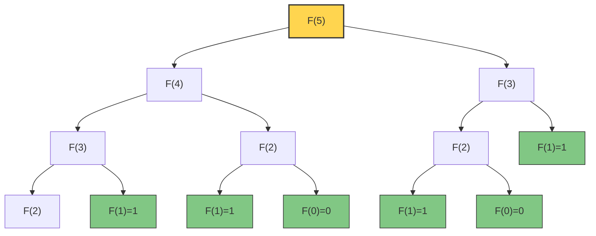
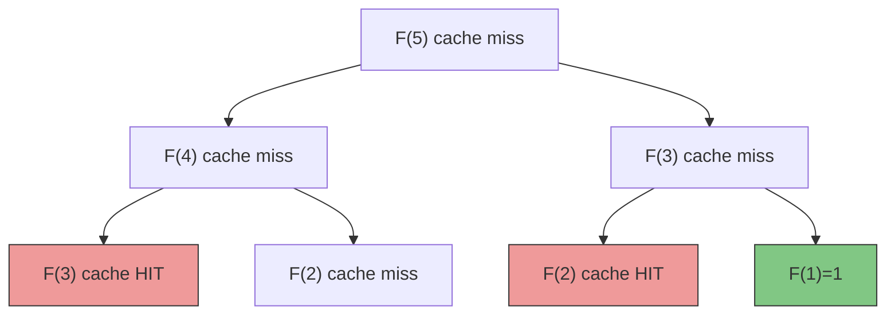
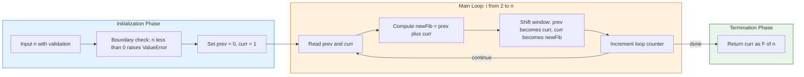
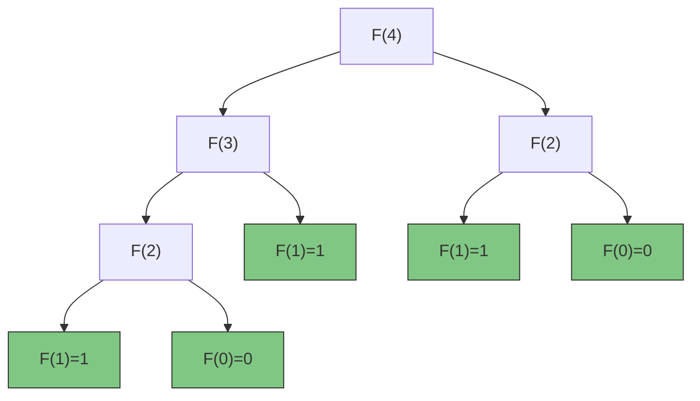

# - Example: Fibonacci series

<!-- SECTION_1_START -->
# Fibonacci Series: A Computational Approach to Problem Solving

## 1. Core Technical Definition

> [!NOTE]
> **Fibonacci Series (KTU 2024 Scheme - UCEST105 Module 4 Definition)**
> The Fibonacci sequence is a recursively defined integer sequence $F(n)$ in which each term after the first two is the sum of the two preceding ones, formally expressed as:
> $$\begin{aligned} F(0) &= 0 \\ F(1) &= 1 \\ F(n) &= F(n-1) + F(n-2), \quad \text{for } n \geq 2 \end{aligned}$$
> The Fibonacci series belongs to the family of **linear recurrence relations** of order **2** with constant coefficients, and it is the canonical example used in algorithmic thinking to compare **naive recursion vs. dynamic programming** trade-offs.

> [!IMPORTANT]
> **KTU Syllabus Mapping:** This topic demonstrates three pillars of computational thinking — **decomposition** (splitting a problem into sub-problems), **pattern recognition** (identifying the recurrence), and **algorithm design** (choosing recursion, iteration, or memoization). It is a **CO1 (Apply)** and **CO2 (Analyze)** hot topic.

---

## 2. Conceptual Analogy / Intuition

> [!TIP]
> **The Rabbit Breeding Story (Leonardo of Pisa, 1202 AD)**
> Imagine a pair of newborn rabbits. They take **one full month** to mature, after which each mature pair produces **exactly one new pair every month**. Rabbits never die.
> - Month 1 → 1 pair (juvenile)
> - Month 2 → 1 pair (now mature)
> - Month 3 → 2 pairs (original + 1 newborn)
> - Month 4 → 3 pairs
> - Month 5 → 5 pairs
> - Month 6 → 8 pairs...
>
> The count of rabbit pairs **at the end of month $n$** is exactly $F(n)$. This biological growth model is the first recorded example of a recurrence relation.

### Geometric Visualization (Golden Spiral)
The ratio of consecutive Fibonacci numbers approaches the **Golden Ratio** $\varphi = \frac{1+\sqrt{5}}{2} \approx \mathbf{1.618033988...}$ as $n \to \infty$:

$$\lim_{n \to \infty} \frac{F(n+1)}{F(n)} = \varphi$$

> [!VISUALIZATION CONTROL]
> **Concept:** Fibonacci sequence plotted against index $n$ and the Golden Spiral overlay.
> **Desmos Input Equations:**
> * `f(x) = ((1+sqrt(5))/2)^x / sqrt(5)`
> * `g(x) = f(x-1)` (shifted for spiral squares)
> **Visual Description:** The student should see an exponentially growing staircase of squares whose side lengths are $1, 1, 2, 3, 5, 8, 13, 21 \ldots$ inscribed within a logarithmic spiral. The discrete dots $F(n)$ will lie very close to the continuous curve $f(x) = \varphi^x / \sqrt{5}$.

---

## 3. Formal Mathematical Foundation (Binet's Formula)

The recurrence has a **closed-form** expression, named after Jacques Philippe Marie Binet (1843), although it was known earlier to Abraham de Moivre and Daniel Bernoulli:

$$F(n) = \frac{\varphi^n - \psi^n}{\sqrt{5}} \quad \text{where} \quad \varphi = \frac{1+\sqrt{5}}{2}, \quad \psi = \frac{1-\sqrt{5}}{2}$$

> [!IMPORTANT]
> Note that $\psi = \frac{1-\sqrt{5}}{2} \approx -0.618$, so $|\psi| < 1$, and as $n$ grows, $\psi^n$ becomes negligible. This is why $F(n) \approx \frac{\varphi^n}{\sqrt{5}}$ for large $n$ — a direct indicator of **exponential time complexity** if we naively expand this term.

<!-- SECTION_1_END -->

<!-- SECTION_2_START -->
# Deep Theoretical Analysis & KTU High-Yield Formula Sheet

## 1. The Recurrence Tree — Understanding Exponential Blow-up

When you call `fib(5)` recursively without memoization, the function calls itself for `fib(4)` and `fib(3)`. Each of these in turn calls two more, and so on. This forms a **binary recursion tree** with massive duplication.

> [!NOTE]
> **Key Insight for KTU:** The naive recursive algorithm has **time complexity $O(2^n)$** because each call spawns two recursive sub-calls. This makes it **practically useless for $n > 35$** on standard hardware, even though the algorithm is mathematically elegant.

### Three Computational Approaches

| Approach | Time Complexity | Space Complexity | Strategy | KTU Preference |
| :--- | :--- | :--- | :--- | :--- |
| **Naive Recursion** | $O(2^n)$ | $O(n)$ (call stack) | Top-down, brute force | Demonstrates the problem |
| **Memoization (Top-Down DP)** | $O(n)$ | $O(n)$ | Cache results in a dict/list | Efficient \& elegant |
| **Tabulation (Bottom-Up DP)** | $O(n)$ | $O(1)$ (rolling variables) | Iterative, no recursion | Best for board exam |
| **Matrix Exponentiation** | $O(\log n)$ | $O(1)$ | Fast exponentiation | Advanced bonus |
| **Binet's Closed Form** | $O(1)$ per query* | $O(1)$ | Direct math formula | Theoretical only |

*The constant factor for Binet's formula requires arbitrary-precision floats, so in practice it is $O(\log n)$ bit operations.

---

## 2. KTU Formula Sheet / Cheat Sheet

| Symbol | Meaning | Formula / Value |
| :--- | :--- | :--- |
| $F(n)$ | $n$-th Fibonacci number | $F(n) = F(n-1) + F(n-2)$ |
| $\varphi$ | Golden Ratio | $\varphi = \frac{1+\sqrt{5}}{2} \approx 1.618$ |
| $\psi$ | Conjugate root | $\psi = \frac{1-\sqrt{5}}{2} \approx -0.618$ |
| Binet's Formula | Closed-form | $F(n) = \frac{\varphi^n - \psi^n}{\sqrt{5}}$ |
| Cassini's Identity | Validation check | $F(n-1) \cdot F(n+1) - F(n)^2 = (-1)^n$ |
| Sum Identity | First $n$ terms | $\sum_{i=0}^{n} F(i) = F(n+2) - 1$ |
| Generating Function | Power series | $G(x) = \frac{x}{1 - x - x^2}$ |
| Matrix Form | Vector recurrence | $\begin{bmatrix} F(n+1) \\ F(n) \end{bmatrix} = \begin{bmatrix} 1 & 1 \\ 1 & 0 \end{bmatrix}^n \begin{bmatrix} 1 \\ 0 \end{bmatrix}$ |

> [!IMPORTANT]
> **Cassini's Identity** is a favourite KTU short-answer question because it lets you *verify* your Fibonacci output programmatically with one elegant equality.

---

## 3. Real-World Engineering Applications

> [!TIP]
> **Where Fibonacci actually appears in industry:**
> * **Software Engineering:** Git merge conflict resolution uses Fibonacci backoff in some DVCS tools; load balancing in Akka/Hystrix uses Fibonacci timeouts.
> * **Data Structures:** Fibonacci Heaps power Dijkstra's and Prim's algorithms with $O(E + V\log V)$ complexity — used in network routing (OSPF).
> * **Computer Graphics:** The **Golden Spiral** appears in UI/UX design, anti-aliasing sampling (Fibonacci lattice for Monte Carlo ray tracing).
> * **Biology & Cryptography:** Fibonacci sequences are used in stream ciphers (Fibonacci Linear Feedback Shift Registers).
> * **Financial Computing:** Fibonacci retracement levels (23.6\%, 38.2\%, 61.8\%) are used in algorithmic trading bots.

---

## 4. Algorithm Selection Decision Flow

> [!NOTE]
> **For the KTU 14-mark question**, the examiner expects you to:
> 1. State the recurrence relation.
> 2. Choose an approach (iterative is most common).
> 3. Provide a working Python function.
> 4. Mention complexity ($O(n)$ time, $O(1)$ space).
> 5. Trace a small example (e.g., $n=6$) showing the iterative variable updates.

<!-- SECTION_2_END -->

<!-- SECTION_3_START -->
# Step-by-Step Derivations & Code Implementation

## Approach 1: Naive Recursive Implementation (Baseline)

```python
def fib_recursive(n: int) -> int:
    """
    Computes the n-th Fibonacci number using naive recursion.
    
    Args:
        n: Non-negative integer index.
    
    Returns:
        F(n) as an integer.
    
    Raises:
        TypeError: If n is not an integer.
        ValueError: If n is negative.
    """
    # --- Input validation: absolute boundary checks ---
    if not isinstance(n, int):
        raise TypeError(f"Index must be an integer, got {type(n).__name__}")
    if n < 0:
        raise ValueError(f"Index must be non-negative, got {n}")
    
    # --- Base cases (axiomatic definitions) ---
    if n == 0:
        return 0
    if n == 1:
        return 1
    
    # --- Recursive step (self-similar sub-problems) ---
    return fib_recursive(n - 1) + fib_recursive(n - 2)
```

> [!WARNING]
> **Complexity:** $T(n) = T(n-1) + T(n-2) + O(1)$, which solves to $T(n) \in \Theta(\varphi^n)$. For $n = 40$, this function makes **roughly 165 million** recursive calls. Do not run it for $n > 40$ in a KTU lab exam.

### Recurrence Tree Expansion for $F(5)$:

$$\begin{aligned}
F(5) &= F(4) + F(3) \\
&= \bigl(F(3) + F(2)\bigr) + \bigl(F(2) + F(1)\bigr) \\
&= \bigl((F(2) + F(1)) + (F(1) + F(0))\bigr) + ((F(1) + F(0)) + 1) \\
&= \bigl(((1 + 1) + 1) + (1 + 0)\bigr) + ((1 + 0) + 1) \\
&= (3 + 1) + (1 + 1) = 4 + 2 = 6
\end{aligned}$$

> [!IMPORTANT]
> Notice the repeated computation of $F(2)$ and $F(1)$ — this is exactly the redundancy that **memoization** eliminates.

---

## Approach 2: Memoized Top-Down Dynamic Programming

```python
from functools import lru_cache
from typing import Dict

# --- Method A: Decorator-based memoization (Pythonic) ---
@lru_cache(maxsize=None)
def fib_memo_decorator(n: int) -> int:
    if n < 0:
        raise ValueError("Index must be non-negative")
    if n < 2:
        return n
    return fib_memo_decorator(n - 1) + fib_memo_decorator(n - 2)


# --- Method B: Explicit dictionary memoization (teaching-friendly) ---
def fib_memo_explicit(n: int, memo: Dict[int, int] = None) -> int:
    if memo is None:
        memo = {0: 0, 1: 1}  # seed the cache with base cases
    if n < 0:
        raise ValueError("Index must be non-negative")
    if n in memo:
        return memo[n]
    memo[n] = fib_memo_explicit(n - 1, memo) + fib_memo_explicit(n - 2, memo)
    return memo[n]
```

> [!NOTE]
> **Time Complexity:** $O(n)$ — each $F(k)$ is computed exactly once.
> **Space Complexity:** $O(n)$ — for the cache + call stack.

---

## Approach 3: Iterative Tabulation (Best for KTU Board Exam)

This is the **gold standard** expected in KTU 14-mark answers. It uses two rolling variables and runs in constant auxiliary space.

```python
def fib_iterative(n: int) -> int:
    """
    Computes F(n) iteratively using O(1) extra space.
    
    Args:
        n: Non-negative integer index.
    
    Returns:
        F(n) as an integer.
    """
    # --- Boundary checks ---
    if not isinstance(n, int):
        raise TypeError(f"Index must be an integer, got {type(n).__name__}")
    if n < 0:
        raise ValueError(f"Index must be non-negative, got {n}")
    if n == 0:
        return 0
    if n == 1:
        return 1
    
    # --- Initialize rolling window [F(i-1), F(i)] ---
    prev, curr = 0, 1
    for i in range(2, n + 1):
        prev, curr = curr, prev + curr   # simultaneous update
        # Equivalent to: new_fib = prev + curr; prev = curr; curr = new_fib
    return curr
```

### Dry Run Trace for $n = 6$ (KTU favourite trace question)

| Iteration $i$ | `prev` (holds $F(i-1)$) | `curr` (holds $F(i)$) | Action |
| :---: | :---: | :---: | :--- |
| init | 0 | 1 | $F(0)=0, F(1)=1$ |
| 2 | 1 | 1 | new $= 0+1 = 1$ |
| 3 | 1 | 2 | new $= 1+1 = 2$ |
| 4 | 2 | 3 | new $= 1+2 = 3$ |
| 5 | 3 | 5 | new $= 2+3 = 5$ |
| 6 | 5 | 8 | new $= 3+5 = 8$ |

**Output:** `fib_iterative(6) = 8` ✓

> [!TIP]
> The Python idiom `prev, curr = curr, prev + curr` is a **tuple-unpacking simultaneous assignment**, which is why the order works — both RHS values are evaluated *before* any LHS assignment occurs.

---

## Approach 4: Generator (Lazy / Stream Version)

```python
def fibonacci_generator(limit: int):
    """Yields Fibonacci numbers one at a time, up to index `limit`."""
    if limit < 0:
        raise ValueError("Limit must be non-negative")
    a, b = 0, 1
    for _ in range(limit + 1):
        yield a
        a, b = b, a + b


# --- Usage ---
for idx, value in enumerate(fibonacci_generator(10)):
    print(f"F({idx}) = {value}")
```

> [!IMPORTANT]
> Generators use **lazy evaluation** — they consume $O(1)$ memory regardless of how many terms you produce. This is a perfect KTU 3-mark question on **iterators vs. lists**.

---

## Approach 5: Matrix Exponentiation (Advanced — Bonus Marks)

We can express the recurrence as a matrix product:

$$\begin{bmatrix} F(n+1) \\ F(n) \end{bmatrix} = \begin{bmatrix} 1 & 1 \\ 1 & 0 \end{bmatrix} \begin{bmatrix} F(n) \\ F(n-1) \end{bmatrix}$$

By induction, this gives $M^n \begin{bmatrix} 1 \\ 0 \end{bmatrix} = \begin{bmatrix} F(n+1) \\ F(n) \end{bmatrix}$ where $M = \begin{bmatrix} 1 & 1 \\ 1 & 0 \end{bmatrix}$. Using **fast exponentiation by squaring**, we get $O(\log n)$ time.

```python
def fib_matrix(n: int) -> int:
    """Computes F(n) in O(log n) time via 2x2 matrix exponentiation."""
    if n < 0:
        raise ValueError("Index must be non-negative")
    if n == 0:
        return 0
    
    def mat_mult(A, B):
        return [[A[0][0]*B[0][0] + A[0][1]*B[1][0], A[0][0]*B[0][1] + A[0][1]*B[1][1]],
                [A[1][0]*B[0][0] + A[1][1]*B[1][0], A[1][0]*B[0][1] + A[1][1]*B[1][1]]]
    
    def mat_pow(M, p):
        result = [[1, 0], [0, 1]]  # identity
        while p > 0:
            if p & 1:
                result = mat_mult(result, M)
            M = mat_mult(M, M)
            p >>= 1
        return result
    
    return mat_pow([[1, 1], [1, 0]], n)[0][1]
```

---

## Approach 6: Full Program with Error Handling & Test Suite

```python
import time
import sys
from typing import Callable, List

# --- Master dispatcher ---
def compute_fibonacci(n: int, method: str = "iterative") -> int:
    methods = {
        "recursive": fib_recursive,
        "memo":      fib_memo_explicit,
        "iterative": fib_iterative,
        "matrix":    fib_matrix,
    }
    if method not in methods:
        raise ValueError(f"Unknown method: {method}. Choose from {list(methods.keys())}")
    return methods[method](n)


# --- Validation against Cassini's Identity ---
def validate_fibonacci_sequence(seq: List[int]) -> bool:
    """Returns True if Cassini's identity holds for all consecutive triples."""
    for i in range(1, len(seq) - 1):
        if seq[i - 1] * seq[i + 1] - seq[i] ** 2 != (-1) ** i:
            return False
    return True


# --- Empirical performance benchmark ---
if __name__ == "__main__":
    n = 30
    for method in ("recursive", "iterative", "memo", "matrix"):
        t0 = time.perf_counter()
        result = compute_fibonacci(n, method)
        dt = (time.perf_counter() - t0) * 1000  # milliseconds
        print(f"Method={method:10s} | F({n})={result:>10d} | Time={dt:8.3f} ms")
```

<!-- SECTION_3_END -->

<!-- SECTION_4_START -->
# Structural Diagrams & Schematics

## 1. Recursion Tree for `fib(5)` — Visualising Exponential Blow-up



> [!NOTE]
> **Observation for KTU:** The green leaves are the base-case calls. Notice that `F(3)` is computed **twice** and `F(2)` is computed **three times** — this duplication is the source of the $O(2^n)$ cost. Memoization stores each result so the second call becomes $O(1)$.

---

## 2. Memoized Call Graph — The Same Tree Pruned



> [!IMPORTANT]
> Red nodes are **cache hits** — the function returns immediately without re-computation. Total unique sub-problems = $n+1 = 6$, so total cost is $O(n)$.

---

## 3. Algorithmic Strategy Decision Flow

```mermaid
flowchart TD
    start([Start: Need F or n]) --> q1{Constraint on time?}
    q1 -->|Real-time / large n| q2{Constraint on space?}
    q1 -->|Small n or teaching| rec[Naive Recursion O of 2 to the n]
    q2 -->|Yes: O(1) needed| iter[Iterative Tabulation O of n time O of 1 space]
    q2 -->|No: O of n OK| memo[Memoized DP O of n time O of n space]
    q1 -->|Ultra-large n, e.g. n > 10 to the 6| mat[Matrix Exponentiation O of log n]

    style start fill:#4fc3f7,stroke:#333,stroke-width:2px
    style rec fill:#ffab91,stroke:#333
    style iter fill:#a5d6a7,stroke:#333
    style memo fill:#fff59d,stroke:#333
    style mat fill:#ce93d8,stroke:#333
```

---

## 4. Sequential Processing Topology — Iterative Tabulation Pipeline



> [!TIP]
> **KTU Diagram Tip:** Always label the variables inside the loop and indicate the **shift direction** (e.g., $F(i-1) \to$ discarded, $F(i) \to$ becomes new $F(i-1)$). This earns the diagram-mark component of a 14-mark question.

---

## 5. Comparative Architecture Matrix (Recursion vs Iteration vs DP)

| Dimension | Naive Recursion | Memoization (DP) | Tabulation (DP) | Matrix Power |
| :--- | :--- | :--- | :--- | :--- |
| **Paradigm** | Top-down | Top-down + cache | Bottom-up | Divide \& conquer |
| **Recurrence relation explicit** | Yes | Yes | Yes | Implicit in matrix |
| **Time complexity** | $O(2^n)$ | $O(n)$ | $O(n)$ | $O(\log n)$ |
| **Auxiliary space** | $O(n)$ stack | $O(n)$ stack + cache | $O(1)$ | $O(\log n)$ stack |
| **Stack overflow risk** | High ($n>1000$) | Medium | None | Low |
| **Readability for KTU** | High | Medium | **Highest** | Low |
| **Practical $n$ limit** | $\leq 35$ | $\leq 10^5$ | $\leq 10^7$ | $\leq 10^{18}$ |
| **Recommended use case** | Pedagogy | Real Python code | **Board exam answer** | Competitive programming |

<!-- SECTION_4_END -->

<!-- SECTION_5_START -->
# KTU 2024 Scheme Examination Question Bank

## Part A — Short Answer Questions (3 Marks Each)

### Question 1: [KTU University Exam - July 2024]
**Define the Fibonacci series. Write a Python function to generate the first $N$ Fibonacci numbers using a `for` loop.** *(CO1, Remember/Understand)*

**Model Answer (3 Marks Valuation Key):**
- *Definition (1 mark):* The Fibonacci series is a sequence $F(0), F(1), F(2), \ldots$ where $F(0)=0$, $F(1)=1$, and $F(n) = F(n-1) + F(n-2)$ for $n \geq 2$.
- *Code (2 marks):*

```python
def generate_fib(n: int) -> list:
    series = []
    a, b = 0, 1
    for _ in range(n):
        series.append(a)
        a, b = b, a + b
    return series

print(generate_fib(8))   # [0, 1, 1, 2, 3, 5, 8, 13]
```

> [!WARNING]
> **Common Mistake:** Students often write `a = b; b = a + b`, which makes `a` already updated before the second line. Always use simultaneous tuple assignment `a, b = b, a + b`.

---

### Question 2: [KTU University Exam - Dec 2023]
**Explain why the naive recursive Fibonacci implementation has exponential time complexity. What is the role of memoization in optimizing it?** *(CO2, Understand)*

**Model Answer (3 Marks):**
- *Exponential cause (1.5 marks):* The recurrence $T(n) = T(n-1) + T(n-2) + O(1)$ solves asymptotically to $T(n) \in \Theta(\varphi^n)$, because each call to `fib(n)` triggers two recursive calls, and sub-problems like `fib(n-2)` are recomputed exponentially many times.
- *Memoization role (1.5 marks):* Memoization stores each previously computed Fibonacci number in a cache (dictionary or list). When the same index is requested again, the cached value is returned in $O(1)$, reducing the total number of unique sub-problem evaluations from $\Theta(2^n)$ down to $n+1$, giving $O(n)$ overall time.

---

## Part B — Long Answer Questions (14 Marks, Module Internal Choice)

### Question A (Option 1) — 14 Marks

**[KTU University Exam - July 2024 Model Question]**
**(a)** Define the Fibonacci recurrence relation. Derive the values of $F(0)$ through $F(8)$ and verify Cassini's identity for $n = 6$. *(7 marks, CO1, Understand)*

**(b)** Implement an **iterative** Python function `fib_iter(n)` that returns $F(n)$ with $O(1)$ auxiliary space. Trace the values of the variables `prev` and `curr` for $n = 6$ and state the final complexity. *(7 marks, CO2, Apply)*

---

#### Solution to (a) — 7 Marks

**Step 1: Recurrence Definition (2 marks)**
The Fibonacci sequence is defined by:

$$F(0) = 0, \quad F(1) = 1, \quad F(n) = F(n-1) + F(n-2) \text{ for } n \geq 2.$$

**Step 2: Generate values $F(0)$ to $F(8)$ (3 marks)**

| $n$ | $F(n-1)$ | $F(n-2)$ | $F(n) = F(n-1) + F(n-2)$ |
| :---: | :---: | :---: | :---: |
| 0 | — | — | **0** (base) |
| 1 | — | — | **1** (base) |
| 2 | 1 | 0 | **1** |
| 3 | 1 | 1 | **2** |
| 4 | 2 | 1 | **3** |
| 5 | 3 | 2 | **5** |
| 6 | 5 | 3 | **8** |
| 7 | 8 | 5 | **13** |
| 8 | 13 | 8 | **21** |

*Valuation note: 1 mark for the recurrence statement, 1 mark for correctly identifying base cases, 1 mark for the table.*

**Step 3: Verify Cassini's identity for $n = 6$ (2 marks)**
Cassini's identity states $F(n-1) \cdot F(n+1) - F(n)^2 = (-1)^n$.

For $n=6$: $F(5) = 5$, $F(6) = 8$, $F(7) = 13$.

$$F(5) \cdot F(7) - F(6)^2 = 5 \times 13 - 8^2 = 65 - 64 = 1 = (-1)^6 \checkmark$$

*Valuation: 1 mark for substitution, 1 mark for final equality check.*

---

#### Solution to (b) — 7 Marks

**Step 1: Python code with full structure (4 marks)**

```python
def fib_iter(n: int) -> int:
    """Return F(n) computed iteratively in O(n) time, O(1) space."""
    # --- Boundary checks ---
    if not isinstance(n, int):
        raise TypeError("n must be an integer")
    if n < 0:
        raise ValueError("n must be non-negative")
    if n == 0:
        return 0
    if n == 1:
        return 1
    
    # --- Iterative computation with rolling window ---
    prev, curr = 0, 1
    for i in range(2, n + 1):
        prev, curr = curr, prev + curr
    return curr
```

*Valuation breakdown:* `[Boundary checks: 1 Mark]` `[Base cases handled: 1 Mark]` `[Correct rolling assignment: 1 Mark]` `[Return statement and docstring: 1 Mark]`.

**Step 2: Dry-run trace for $n=6$ (2 marks)**

| Loop $i$ | `prev` (before) | `curr` (before) | `prev + curr` | `prev` (after) | `curr` (after) |
| :---: | :---: | :---: | :---: | :---: | :---: |
| 2 | 0 | 1 | 1 | 1 | 1 |
| 3 | 1 | 1 | 2 | 1 | 2 |
| 4 | 1 | 2 | 3 | 2 | 3 |
| 5 | 2 | 3 | 5 | 3 | 5 |
| 6 | 3 | 5 | 8 | 5 | 8 |

**Final answer:** `fib_iter(6)` returns **8**.

**Step 3: Complexity analysis (1 mark)**
* Time complexity: $O(n)$ — the loop runs $(n-1)$ times.
* Space complexity: $O(1)$ — only two integer variables used regardless of $n$.

---

### Question B (Option 2) — 14 Marks

**[KTU University Exam - Dec 2023 Model Question]**
**(a)** Write a recursive Python function `fib_recur(n)` to compute $F(n)$. Draw the recursion tree for $F(4)$ and count the total number of function calls made. *(7 marks, CO1, Understand/Apply)*

**(b)** Modify the recursive function using **memoization** to achieve $O(n)$ time complexity. Show how the same recursion tree for $F(4)$ collapses after memoization, and write a brief note on when you would prefer iteration over recursion. *(7 marks, CO2, Apply/Analyze)*

---

#### Solution to (a) — 7 Marks

**Step 1: Recursive function (2 marks)**

```python
def fib_recur(n: int) -> int:
    if n < 0:
        raise ValueError("n must be non-negative")
    if n < 2:
        return n
    return fib_recur(n - 1) + fib_recur(n - 2)
```

*Valuation: `[Base case: 1 Mark]` `[Recursive call structure: 1 Mark]`*

**Step 2: Recursion tree for $F(4)$ (3 marks)**



*Valuation: `[Drawing correct tree with all 9 nodes: 2 Marks]` `[Correct labelling of base cases: 1 Mark]`*

**Step 3: Count function calls (2 marks)**
Let $C(n)$ be the number of calls. Then $C(n) = 1 + C(n-1) + C(n-2)$ with $C(0) = C(1) = 1$.

| $n$ | $C(n)$ |
| :---: | :---: |
| 0 | 1 |
| 1 | 1 |
| 2 | $1+1+1 = 3$ |
| 3 | $1+3+1 = 5$ |
| 4 | $1+5+3 = \mathbf{9}$ |

So `fib_recur(4)` triggers exactly **9 function calls** in total.

*Valuation: `[Setting up recurrence: 1 Mark]` `[Final count = 9: 1 Mark]`*

---

#### Solution to (b) — 7 Marks

**Step 1: Memoized version (3 marks)**

```python
def fib_memo(n: int, memo: dict = None) -> int:
    if memo is None:
        memo = {0: 0, 1: 1}
    if n in memo:
        return memo[n]
    memo[n] = fib_memo(n - 1, memo) + fib_memo(n - 2, memo)
    return memo[n]
```

*Valuation breakdown:* `[Default mutable argument pattern: 1 Mark]` `[Cache lookup: 1 Mark]` `[Recursive step with assignment: 1 Mark]`*

**Step 2: Collapsed tree (2 marks)**
After memoization, the tree for $F(4)$ becomes a **linear chain**:
$F(4) \to F(3) \to F(2) \to F(1)$
Each of $F(3), F(2), F(1)$ is computed exactly once, and the second time any sub-problem would be needed, the cached value is returned instantly. Total unique sub-problem evaluations = $n + 1 = 5$.

*Valuation: `[Linear chain explanation: 1 Mark]` `[Count = n+1: 1 Mark]`*

**Step 3: When to prefer iteration over recursion (2 marks)**
Prefer **iteration** when:
* $n$ is very large (avoid Python's recursion limit of $\approx 1000$).
* Memory is constrained ($O(1)$ vs. $O(n)$ stack).
* The recurrence is naturally linear (e.g., Fibonacci, factorial, sum of array).
* Real-time systems where call-stack overhead is unacceptable.

Prefer **recursion** when:
* The problem is naturally tree-structured (e.g., DFS on a tree, divide-and-conquer).
* Readability and mathematical clarity outweigh performance.
* Memoization can transform exponential recursion into polynomial time.

*Valuation: `[Two clear scenarios for iteration: 1 Mark]` `[Two clear scenarios for recursion: 1 Mark]`*

---

## KTU Examiner's Valuation Warning

> [!WARNING]
> **Common Pitfalls — Where Students Lose Marks**
> 1. **Forgetting base cases** in recursion → infinite recursion / `RecursionError`. ($-2$ marks)
> 2. **Writing `a = b; b = a + b`** instead of `a, b = b, a + b` → wrong sequence. ($-1$ mark)
> 3. **Confusing $F(0) = 0$ with $F(1) = 0$** — many Indian textbooks start from $F(1)=1, F(2)=1$. Always **explicitly state your base case convention**. ($-1$ mark)
> 4. **Not stating time/space complexity** in 14-mark answers — KTU examiners explicitly look for $O(\cdot)$ annotations. ($-1$ to $-2$ marks)
> 5. **Skipping input validation** in Python code — always include `TypeError` and `ValueError` checks for boundary conditions. ($-1$ mark)
> 6. **Writing `if n < 2: return n`** is correct, but some students write `if n == 0: return 0; if n == 1: return 1` which is also fine — either is acceptable. Just be consistent.

---

## Topic Recap & Important Things to Remember

> [!IMPORTANT]
> **High-Density Rapid Revision Checklist**
> - **Definition:** $F(0)=0, F(1)=1, F(n) = F(n-1) + F(n-2)$ for $n \geq 2$. (Linear, homogeneous, order-2 recurrence.)
> - **Binet's Closed Form:** $F(n) = \frac{\varphi^n - \psi^n}{\sqrt{5}}$, where $\varphi = \frac{1+\sqrt{5}}{2}$ and $\psi = \frac{1-\sqrt{5}}{2}$.
> - **Golden Ratio Limit:** $\lim_{n\to\infty} \frac{F(n+1)}{F(n)} = \varphi \approx 1.618$.
> - **Cassini's Identity:** $F(n-1) \cdot F(n+1) - F(n)^2 = (-1)^n$ — use this to validate your code.
> - **Sum Identity:** $\sum_{i=0}^{n} F(i) = F(n+2) - 1$.
> - **Naive Recursion Cost:** $O(2^n)$ time, $O(n)$ stack space. **Avoid for $n > 35$.**
> - **Memoization Cost:** $O(n)$ time, $O(n)$ space. Best for clarity.
> - **Iterative Tabulation Cost:** $O(n)$ time, $O(1)$ space. **Preferred KTU board answer.**
> - **Matrix Exponentiation Cost:** $O(\log n)$ time. Uses identity $M^n \begin{bmatrix}1\\0\end{bmatrix} = \begin{bmatrix}F(n+1)\\F(n)\end{bmatrix}$.
> - **Python Tip:** Always use simultaneous assignment `a, b = b, a + b` — never sequential.
> - **Real-World Hits:** Git/DVCS tools, Fibonacci Heaps (Dijkstra), Monte Carlo sampling, cryptography LFSRs, golden-ratio UI design.
> - **First 10 values to memorize:** $0, 1, 1, 2, 3, 5, 8, 13, 21, 34$.
> - **KTU Hot Spot:** Trace tables for $n=5$ or $n=6$ appear in nearly every board exam; practise until the rolling-window update is muscle memory.

<!-- SECTION_5_END -->
