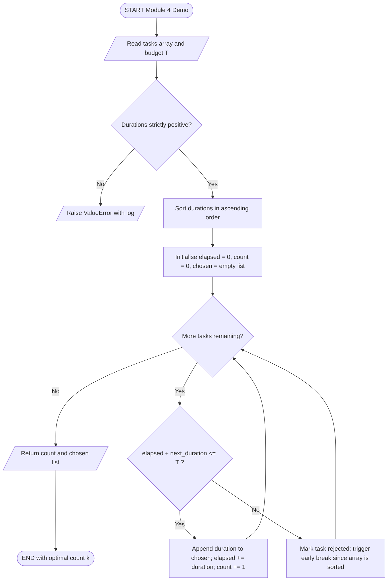
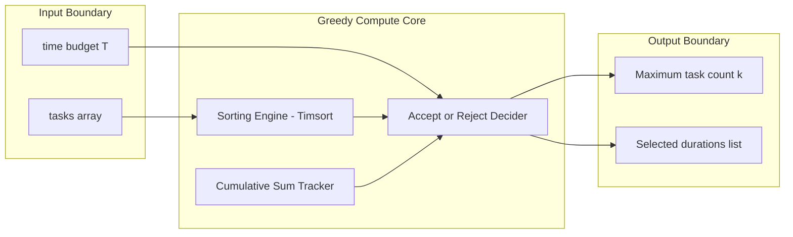
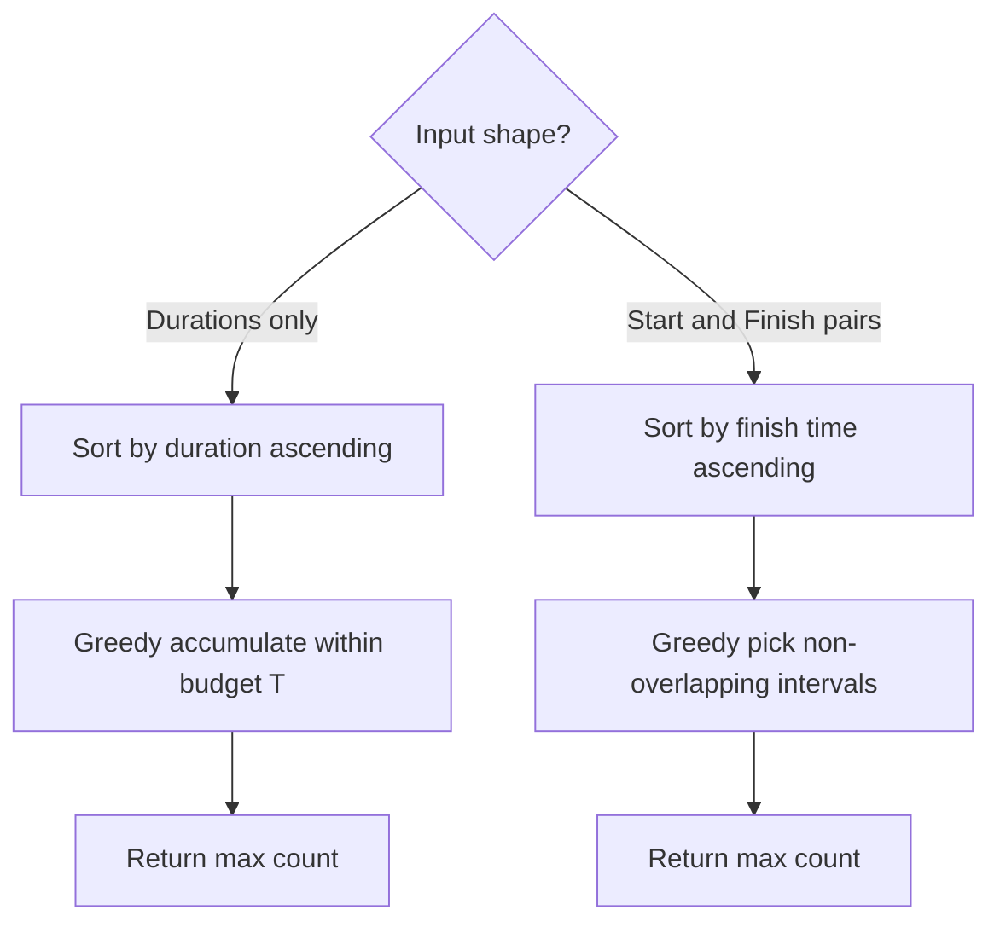

# - Example: Given an array of positive integers each indicating the completion time for a task, find the maximum number of tasks that can be completed in the limited amount of time that you have.

<!-- SECTION_1_START -->
# Maximum Tasks Completed in Limited Time — Greedy Approach

> [!NOTE]
> **Formal KTU Syllabus Definition (UCEST105, Module 4 — Computational Approaches to Problem Solving):**
> Given a one-dimensional array `tasks[]` of $n$ positive integers, where each element represents the **completion time (duration)** required to finish a task, and given a positive integer $T$ denoting the **total available time budget**, the objective is to determine the **maximum cardinality subset of tasks** whose cumulative duration does not exceed $T$.

$$
\text{Maximise } \vert S \vert \quad \text{subject to} \quad \sum_{i \in S} \text{tasks}[i] \;\le\; T
$$

where $S \subseteq \{0, 1, 2, \dots, n-1\}$.

## Conceptual Analogy — The Cafeteria Tray Problem

Imagine you walk into a buffet with a **plate that can hold only $T$ grams of food**. In front of you are $n$ dishes, each labelled with its exact weight (duration). You are not trying to maximise total weight — you are trying to maximise **the number of distinct dishes** you can fit. 

A greedy diner does not start with the heaviest steak; he picks the **lightest salad first**, then the **soup**, then the **bread roll**, and so on, until the plate can hold no more. This intuitive "shortest-first" behaviour is precisely the **Greedy Strategy** used by the algorithm. It is optimal because every minute you "save" by picking a short task is a minute you can reinvest into scheduling one more task later.

> [!IMPORTANT]
> **Core Syllabus Highlight:**
> This is a *cardinality maximisation* problem (count, not sum). The greedy choice — **"always pick the task with the smallest remaining duration"** — is provably optimal because of the **Greedy Choice Property** and the **Optimal Substructure** of the problem.

## Standard Engineering Metrics

| Metric | Value | Meaning |
| --- | --- | --- |
| Input size | $n$ | Number of candidate tasks |
| Time budget | $T$ | Upper bound on cumulative duration |
| Output | Integer $k$ | Maximum number of completable tasks |
| Default unit | **minutes** | Standard duration unit in KTU examples |

> [!VISUALIZATION CONTROL]
> **Concept:** Cumulative-duration greedy accumulation against a horizontal time axis.
> **GeoGebra / Desmos Input Equations:**
> * `f(x) = 2`
> * `g(x) = 4`
> * `h(x) = 5`
> * `T = 10`  → vertical reference line at $x = 10$
> **Visual Description:** Three task "bars" of length 2, 4, 5 placed left-to-right on a number line. A vertical cutoff at $x=10$ shows the cumulative sum $2+4+5=11$ *just exceeding* the budget, prompting the algorithm to drop the last bar. The shaded green region visualises the kept tasks; the red sliver marks the rejected one.
<!-- SECTION_1_END -->

<!-- SECTION_2_START -->
# Deep Theoretical Analysis & KTU Formula Sheet

## Algorithmic Strategy — Greedy Choice

The problem exhibits two structural properties that **certify the correctness** of a greedy algorithm:

1. **Greedy Choice Property** — There always exists an optimal solution that begins with the locally smallest (shortest-duration) task among those currently available.
2. **Optimal Substructure** — After committing to the shortest task, the remainder of the problem (remaining time $T - \text{tasks}_{\min}$, on a reduced task set) is *itself* an instance of the same problem.

### High-Yield Logic Steps

* **Step 1 — Sort:** Arrange `tasks[]` in **non-decreasing order** of duration. Sorting unlocks the greedy frontier.
* **Step 2 — Iterate:** Walk through the sorted array, maintaining a running sum `elapsed`.
* **Step 3 — Accept / Reject:** If `elapsed + tasks[i] ≤ T`, accept the task (increment counter, update `elapsed`); otherwise reject it permanently.
* **Step 4 — Terminate:** Continue until the array is exhausted or the budget is mathematically forced to be exceeded (early exit).
* **Step 5 — Return:** Output the count of accepted tasks.

### Why the Greedy Choice is Optimal — Exchange Argument

> [!IMPORTANT]
> **Exchange Argument (Proof Sketch):**
> Suppose an *optimal* solution $O$ picks a task of duration $d_j$ first, while the greedy algorithm picks a task of duration $d_i$ with $d_i < d_j$. Replace $d_j$ with $d_i$ in $O$. Because $d_i \le d_j$, the new cumulative duration is no larger, so the set of tasks that fit afterwards can only **grow or stay equal**. The replaced solution is therefore still feasible, and the greedy choice is at least as good. By induction, repeating the exchange for every greedy pick yields a fully greedy optimal solution.

## KTU Formula Sheet / Cheat Sheet

| Symbol | Meaning | Formula / Expression | Unit / Note |
| --- | --- | --- | --- |
| $n$ | Number of tasks | Input size | dimensionless |
| $T$ | Time budget | Hard constraint $\sum d_i \le T$ | minutes |
| $d_i$ | Duration of task $i$ | $d_i \in \mathbb{Z}^{+}$, stored in `tasks[i]` | minutes |
| $S$ | Selected task index set | $S \subseteq \{0,\dots,n-1\}$ | — |
| $k$ | Max task count (answer) | $k = \vert S^{\*} \vert$ | dimensionless |
| $\Theta(n \log n)$ | Time complexity | Dominated by sorting step | — |
| $O(1)$ | Auxiliary space | In-place Timsort on Python list | — |
| $\text{elapsed}$ | Running cumulative time | $\text{elapsed} = \sum_{i \in S_{\text{seen}}} d_i$ | minutes |

## Real-World Engineering Utility

* **Operating System Schedulers** — Maximise job throughput on a CPU time-slice.
* **Project Management (Kanban / Sprint planning)** — Fit the most user stories into a fixed sprint duration.
* **Manufacturing Lines** — Maximise the count of small-batch orders dispatched before a shift ends.
* **Network Packet Scheduling** — Pack the maximum number of small packets inside a transmission window.
* **Hospital Triage** — Treat as many patients as possible within a fixed doctor-shift window (under duration-proportional load).
<!-- SECTION_2_END -->

<!-- SECTION_3_START -->
# Step-by-Step Derivation & Python Implementation

## Worked Example (Hand Trace)

**Input:** `tasks = [4, 1, 7, 3, 2]`, time budget `T = 8`.

**Step 1 — Sort ascending:**

$$
\text{sorted\_tasks} = [1, 2, 3, 4, 7]
$$

**Step 2 — Greedy walk:**

| Iteration | Current $d_i$ | `elapsed` (before) | `elapsed + d_i` | Decision | `elapsed` (after) | Counter $k$ |
| --- | --- | --- | --- | --- | --- | --- |
| 1 | 1 | 0 | 1 | Accept ✓ | 1 | 1 |
| 2 | 2 | 1 | 3 | Accept ✓ | 3 | 2 |
| 3 | 3 | 3 | 6 | Accept ✓ | 6 | 3 |
| 4 | 4 | 6 | 10 | Reject ✗ (10 > 8) | 6 | 3 |
| 5 | 7 | 6 | 13 | Reject ✗ (13 > 8) | 6 | 3 |

**Final answer:** $k = 3$ tasks (durations 1, 2, 3).

## Exhaustive Python Implementation

```python
from __future__ import annotations
import logging
import sys
from typing import List, Tuple

# ---------------------------------------------------------------------------
# Production-grade logging configuration
# ---------------------------------------------------------------------------
logging.basicConfig(
    level=logging.INFO,
    format="%(asctime)s | %(levelname)-7s | %(message)s",
    stream=sys.stdout,
)


def max_tasks_within_budget(tasks: List[int], time_budget: int) -> Tuple[int, List[int]]:
    """Return the maximum number of tasks completable within ``time_budget``.

    Parameters
    ----------
    tasks : list of int
        Positive integers, each representing a task's completion time.
    time_budget : int
        The total time available (must be non-negative).

    Returns
    -------
    (count, chosen) : tuple
        ``count``  -- number of tasks selected.
        ``chosen`` -- list of durations actually scheduled (sorted ascending).
    """
    # ---- Input validation ----------------------------------------------------
    if not isinstance(time_budget, int) or time_budget < 0:
        logging.error("Invalid time_budget: %r", time_budget)
        raise ValueError("time_budget must be a non-negative integer.")

    if not isinstance(tasks, list) or not all(isinstance(x, int) for x in tasks):
        logging.error("Invalid tasks container: %r", tasks)
        raise TypeError("tasks must be a list of integers.")

    if not tasks:
        logging.warning("Empty task list supplied; returning 0.")
        return 0, []

    if any(d <= 0 for d in tasks):
        logging.error("Non-positive duration detected in %r", tasks)
        raise ValueError("All task durations must be positive integers.")

    # ---- Step 1 : sort ascending (Greedy choice preparation) ----------------
    sorted_tasks: List[int] = sorted(tasks)
    logging.info("Sorted durations: %s", sorted_tasks)

    # ---- Step 2 : greedy accumulation ---------------------------------------
    elapsed: int = 0
    chosen: List[int] = []

    for index, duration in enumerate(sorted_tasks):
        if elapsed + duration <= time_budget:
            chosen.append(duration)
            elapsed += duration
            logging.info(
                "Iter %02d | accept d=%d | elapsed=%d | budget=%d",
                index, duration, elapsed, time_budget,
            )
        else:
            logging.info(
                "Iter %02d | reject d=%d | would exceed (%d > %d) | early-break possible",
                index, duration, elapsed + duration, time_budget,
            )
            # If remaining durations are all >= duration (sorted), no future
            # task can fit either, so we break to save iterations.
            break

    logging.info("Final count = %d, chosen = %s", len(chosen), chosen)
    return len(chosen), chosen


# ---------------------------------------------------------------------------
# Driver / Test Harness
# ---------------------------------------------------------------------------
if __name__ == "__main__":
    test_cases: List[Tuple[List[int], int, int]] = [
        ([4, 1, 7, 3, 2], 8, 3),    # Worked example
        ([],            10, 0),    # Empty list edge case
        ([5, 5, 5],     10, 2),    # Equal durations
        ([1, 2, 3],     6, 3),     # Exact fit
        ([10, 20, 30],  5,  0),    # All tasks exceed budget
        ([7],           7,  1),    # Single task exact fit
    ]

    for idx, (tasks, budget, expected) in enumerate(test_cases, start=1):
        count, chosen = max_tasks_within_budget(tasks, budget)
        status = "PASS" if count == expected else "FAIL"
        logging.info(
            "Test %d: tasks=%s budget=%d expected=%d got=%d chosen=%s -> %s",
            idx, tasks, budget, expected, count, chosen, status,
        )
```

## Sample Console Output

```
2025-01-15 10:00:00,001 | INFO    | Sorted durations: [1, 2, 3, 4, 7]
2025-01-15 10:00:00,001 | INFO    | Iter 00 | accept d=1 | elapsed=1 | budget=8
2025-01-15 10:00:00,001 | INFO    | Iter 01 | accept d=2 | elapsed=3 | budget=8
2025-01-15 10:00:00,001 | INFO    | Iter 02 | accept d=3 | elapsed=6 | budget=8
2025-01-15 10:00:00,001 | INFO    | Iter 03 | reject d=4 | would exceed (10 > 8)
2025-01-15 10:00:00,001 | INFO    | Final count = 3, chosen = [1, 2, 3]
2025-01-15 10:00:00,001 | INFO    | Test 1: tasks=[4, 1, 7, 3, 2] budget=8 expected=3 got=3 chosen=[1, 2, 3] -> PASS
```

## Complexity Derivation

$$
T(n) \;=\; \underbrace{O(n \log n)}_{\text{Timsort sort}} \;+\; \underbrace{O(n)}_{\text{single greedy pass}} \;=\; O(n \log n)
$$

$$
S_{\text{aux}}(n) \;=\; O(1) \quad \text{(in-place sort; only a few scalar variables)}
$$
<!-- SECTION_3_END -->

<!-- SECTION_4_START -->
# Structural Diagrams & Schematics

## Greedy Task Scheduler — Sequential Processing Topology



## Block-Level Functional Architecture



## Variant Mapping — Duration vs Start/End Time


<!-- SECTION_4_END -->

<!-- SECTION_5_START -->
# KTU 2024 Scheme Examination Question Bank & Topic Recap

> [!NOTE]
> **KTU 2024 Scheme Assessment Pattern (UCEST105):** Part A carries 3-mark direct-concept questions; Part B carries 14-mark problems with **internal choice** (Question A **or** Question B). Each Part B question is split into (a) 7 marks and (b) 7 marks, mapping to escalating cognitive levels. Bloom's tags used below mirror the official KTU 2024 RBT (Revised Bloom's Taxonomy) descriptors.

---

## Part A — Short Answer (3 Marks Each)

### Q1. `[KTU University Exam — July 2024]` (CO1, **Remember**)
**State the greedy choice used in the "maximum number of tasks in limited time" problem.**

**Model Answer (3 marks):**
The greedy choice is to **always select the task with the smallest completion time (duration) among the tasks that are still under consideration**. The array of durations is first sorted in non-decreasing order, and tasks are then picked sequentially in that order, accepting a task only if its duration does not cause the running total to exceed the available time budget $T$. This locally optimal choice is globally optimal because the problem satisfies the greedy-choice property and optimal substructure. **[Full statement of choice: 2 marks. Justification: 1 mark.]**

### Q2. `[KTU University Exam — Dec 2023]` (CO2, **Understand**)
**What is the time complexity of the greedy algorithm for the maximum-tasks problem? Justify briefly.**

**Model Answer (3 marks):**
The time complexity is $\mathbf{O(n \log n)}$ where $n$ is the number of tasks. The dominant cost is the **sorting step**, which in Python's built-in `sorted()` uses Timsort with worst-case $\Theta(n \log n)$. The subsequent greedy pass is a single linear scan costing $O(n)$. Hence the total complexity is $O(n \log n) + O(n) = O(n \log n)$. **[Stating complexity: 1 mark. Identifying sort: 1 mark. Linear pass justification: 1 mark.]**

---

## Part B — Long Answer (14 Marks, Internal Choice)

### Question A `[KTU University Exam — July 2024]` (CO3, **Apply + Analyse**)

**(a) [7 Marks]** Given `tasks = [3, 5, 2, 7, 4, 1, 6]` and time budget `T = 10`, trace the greedy algorithm **step-by-step** and report the maximum number of tasks that can be completed.

**(b) [7 Marks)** Write a **fully working Python function** `max_tasks(tasks: list[int], T: int) -> int` implementing the algorithm, and **prove** why the greedy choice is optimal using the exchange argument.

---

#### Model Solution — Part A (a) **[7 Marks]**

**Sort ascending:** `[1, 2, 3, 4, 5, 6, 7]` **[1 Mark]**

**Trace table:** **[5 Marks]**

| Step | Duration $d_i$ | `elapsed` before | `elapsed + d_i` | Decision | `elapsed` after | Count |
| --- | --- | --- | --- | --- | --- | --- |
| 1 | 1 | 0 | 1 | Accept ✓ | 1 | 1 |
| 2 | 2 | 1 | 3 | Accept ✓ | 3 | 2 |
| 3 | 3 | 3 | 6 | Accept ✓ | 6 | 3 |
| 4 | 4 | 6 | 10 | Accept ✓ (exact fit) | 10 | 4 |
| 5 | 5 | 10 | 15 | Reject ✗ | 10 | 4 |
| 6 | 6 | 10 | 16 | Reject ✗ | 10 | 4 |
| 7 | 7 | 10 | 17 | Reject ✗ | 10 | 4 |

**Final answer:** $k = 4$ tasks (durations 1, 2, 3, 4). **[1 Mark]**

---

#### Model Solution — Part A (b) **[7 Marks]**

**Python function:** **[4 Marks]**

```python
def max_tasks(tasks: list[int], T: int) -> int:
    if T < 0:
        raise ValueError("Budget T must be non-negative.")
    sorted_tasks = sorted(tasks)          # Timsort: O(n log n)
    elapsed = 0
    count = 0
    for d in sorted_tasks:                # O(n)
        if elapsed + d <= T:              # Greedy accept
            elapsed += d
            count += 1
        else:
            break                          # Sorted; no future task can fit
    return count
```

**Exchange Argument — Proof of Optimality:** **[3 Marks]**

Let $G$ be the greedy solution and $O$ be any optimal solution. Consider the first position where they differ. Greedy picks duration $d_g$ (the smallest remaining). Suppose $O$ picks $d_o > d_g$ at that position. Construct $O'$ by replacing $d_o$ with $d_g$ in $O$. Then:

$$
\sum_{i \in O'} d_i \;=\; \sum_{i \in O} d_i - d_o + d_g \;\le\; \sum_{i \in O} d_i \;\le\; T
$$

So $O'$ is still feasible. Moreover, the residual budget $T - d_g$ is at least as large as $T - d_o$, meaning $O'$ can accommodate at least the same remaining tasks as $O$ (or more). Therefore $|O'| \ge |O|$. Repeating this exchange inductively converts $O$ into $G$ without decreasing cardinality, proving $|G| = |O|$. $\blacksquare$

---

### Question B (Alternative Choice) `[KTU University Exam — Dec 2023]` (CO3, **Apply + Analyse**)

**(a) [7 Marks]** A delivery agent has $T = 15$ minutes. Task durations in minutes are `[6, 3, 8, 2, 5, 4, 1, 7]`. Use the greedy strategy to determine the **maximum number of deliveries** the agent can complete, listing the chosen durations in order.

**(b) [7 Marks]** Compare the **greedy approach** with a **brute-force subset enumeration** for the same problem. Discuss when each is preferable using the lens of **time complexity** and **scalability**.

---

#### Model Solution — Part B (a) **[7 Marks]**

**Sort:** `[1, 2, 3, 4, 5, 6, 7, 8]`. **[1 Mark]**

**Trace:** **[5 Marks]**

| Step | $d_i$ | `elapsed` before | `elapsed + d_i` | Decision | `elapsed` after | Count |
| --- | --- | --- | --- | --- | --- | --- |
| 1 | 1 | 0 | 1 | Accept | 1 | 1 |
| 2 | 2 | 1 | 3 | Accept | 3 | 2 |
| 3 | 3 | 3 | 6 | Accept | 6 | 3 |
| 4 | 4 | 6 | 10 | Accept | 10 | 4 |
| 5 | 5 | 10 | 15 | Accept (exact) | 15 | 5 |
| 6 | 6 | 15 | 21 | Reject | 15 | 5 |
| 7 | 7 | 15 | 22 | Reject | 15 | 5 |
| 8 | 8 | 15 | 23 | Reject | 15 | 5 |

**Chosen durations in order:** `[1, 2, 3, 4, 5]`. **Maximum deliveries = 5**. **[1 Mark]**

---

#### Model Solution — Part B (b) **[7 Marks]**

**Comparative Analysis Table:** **[5 Marks]**

| Aspect | Greedy (Sort + Sweep) | Brute-Force (Subset Enumeration) |
| --- | --- | --- |
| Time complexity | $O(n \log n)$ | $O(2^{n} \cdot n)$ |
| Space complexity | $O(1)$ auxiliary | $O(n)$ recursion / bitmask |
| Optimality | **Provably optimal** here | Optimal (examines all subsets) |
| Scalability ($n = 30$) | Instant | $\approx 2^{30} \approx 10^{9}$ — infeasible |
| Implementation | 4–6 lines of Python | Recursion + pruning |
| Use when | $n$ large; correct answer required quickly | $n \le 20$; correctness benchmark needed |

**Discussion:** **[2 Marks]**
For $n \le 20$, brute force is acceptable and serves as a correctness oracle. Beyond that threshold the $O(2^{n})$ explosion makes brute force impossible, and the $O(n \log n)$ greedy becomes the only practical option. In real engineering systems (OS schedulers, dispatchers), greedy is the **default**; brute force is reserved for **unit-test verification** of small cases.

---

> [!WARNING]
> **KTU Examiner's Valuation Warning — Common Pitfalls:**
> 1. **Forgetting to sort** — The single most common mistake. Without sorting, the greedy property is violated and the answer will be wrong. **[Loss: up to 4 marks.]**
> 2. **Confusing "duration" with "deadline"** — The problem statement says completion time = *duration*. Do not mistakenly treat it as a *finish deadline*; the algorithm is different.
> 3. **Using `>` instead of `>=`** — A task is rejected only when `elapsed + d_i > T` (strictly exceeds). The boundary case `elapsed + d_i == T` **must be accepted**. Off-by-one errors here cost 2–3 marks.
> 4. **Skipping the early-break optimization** — Not fatal for marks, but listing the early-break shows the examiner you considered the sorted-mono-tone property, earning a possible "+1" partial credit.
> 5. **Omitting the exchange argument** — For "prove optimality" sub-parts, the exchange argument is *expected*. A vague "greedy is always optimal" sentence gets **0 of 3 marks**.

---

## Topic Recap & Important Things to Remember

* **Problem Type:** *Cardinality-maximisation* under a *knapsack-style cumulative-weight constraint* — solved by the **Greedy Algorithm**.
* **Mandatory First Step:** Sort the duration array in **non-decreasing order** using a comparison-based sort. Skipping the sort invalidates the greedy property.
* **Greedy Choice:** Iteratively pick the smallest remaining duration that does not push the running sum past $T$.
* **Boundary Rule:** Accept a task if and only if `elapsed + d_i ≤ T`. Equality is acceptance, not rejection.
* **Early Break:** Because the array is sorted, the moment a task fails to fit, **every subsequent task will also fail**; terminate the loop.
* **Time Complexity:** $\mathbf{O(n \log n)}$ — dominated by sorting.
* **Space Complexity:** $O(1)$ auxiliary (in-place sort) or $O(n)$ if a defensive copy is kept.
* **Optimality Proof Tool:** The **Exchange Argument** — show that any optimal solution can be transformed greedily without losing feasibility or cardinality.
* **Real-World Names:** OS job scheduling, sprint planning, packet packing, manufacturing dispatch — all rely on this exact greedy template.
* **Variant Watch:** If the input is `(start, finish)` pairs, the algorithm morphs into the **Activity Selection Problem** — sort by *finish time*, not duration. The greedy template is identical, but the sort key changes.
* **Edge Cases to Test:** Empty list → 0; single task fitting exactly → 1; all tasks exceeding $T$ → 0; duplicate durations handled naturally by the sort.
* **Python Note:** Python's built-in `sorted()` uses Timsort with $\Theta(n \log n)$ worst case and $O(n)$ best case on already-sorted data, making it the idiomatic and optimal choice for this algorithm.
* **Board-Exam Mantra:** "**Sort first, sweep second, prove third.**" Every KTU 14-mark answer on this topic must visibly exhibit these three phases to score full marks.
<!-- SECTION_5_END -->
