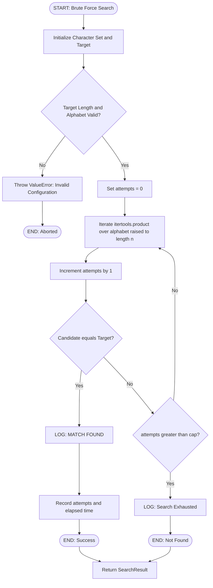
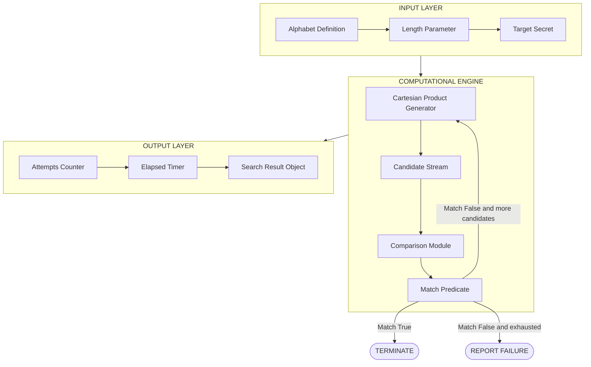
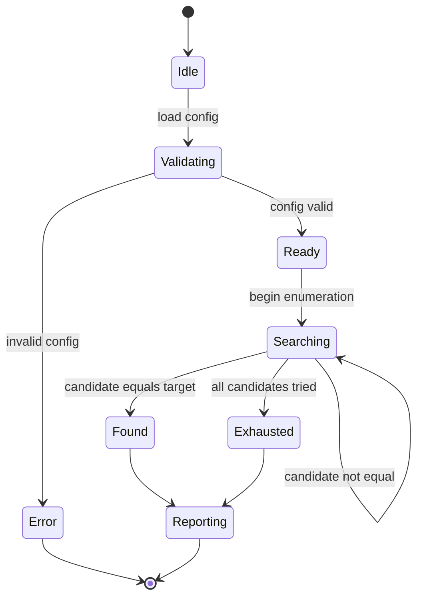
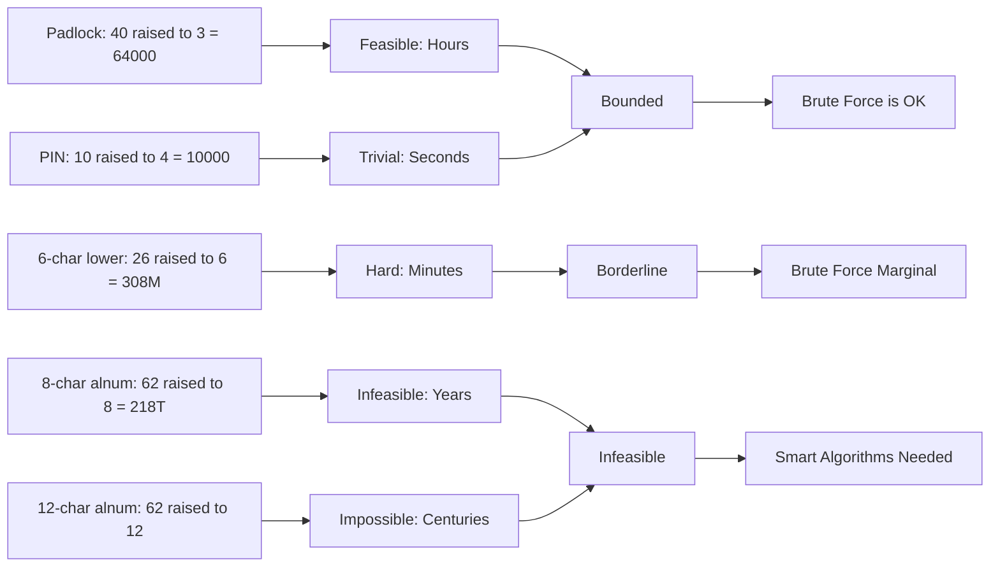

# - Example: Padlock, Password guessing

<!-- SECTION_1_START -->
# Computational Approaches to Problem Solving
## Example: Padlock & Password Guessing — Brute Force Search

---

### 1.1 Formal Definition (KTU 2024 Syllabus Terminology)

> [!IMPORTANT]
> **Brute Force Search** is a computational problem-solving strategy in which every possible candidate from the **search space** (the set of all valid inputs) is systematically enumerated and tested against the desired solution condition until a match is found or all candidates are exhausted.

In the context of **Algorithmic Thinking**, the *Padlock Problem* and the *Password Guessing Problem* are canonical pedagogical examples used to demonstrate:

- **Search Space Cardinality** — the total number of candidate solutions
- **Worst-Case Complexity** — the maximum number of attempts required
- **Exponential Growth of Effort** — how computational cost scales with problem size
- **The Necessity of Smarter Algorithms** — motivating the study of efficient search techniques

> [!NOTE]
> **Key Terminology (KTU Module 4 Vocabulary):**
> - **Search Space ($\mathcal{S}$):** The complete set of all possible candidate solutions.
> - **Candidate:** A single element drawn from the search space.
> - **Validation Test:** The boolean predicate that confirms whether a candidate is the solution.
> - **Exhaustive Enumeration:** Listing every element of $\mathcal{S}$ in a defined order.
> - **Time Complexity Function $T(n)$:** A function mapping input size $n$ to the number of primitive operations.

---

### 1.2 Intuitive Overview & Real-World Analogy

> [!TIP]
> **Plain English Analogy — The Forgotten Padlock:**
> Imagine you return from a swim and find a forgotten 3-dial combination padlock on your gym locker. Each dial has the numbers **0, 1, 2, …, 39** (40 digits per wheel). The only guaranteed method to open the lock is to **try every possible triplet** — $(0,0,0), (0,0,1), (0,0,2), \ldots, (39,39,39)$ — until one clicks open. If you can test one combination per second, you might be standing at that locker for nearly **18 hours** in the worst case.

> [!TIP]
> **Plain English Analogy — The Forgotten ATM PIN:**
> Your debit card has a 4-digit PIN, where each digit ranges from **0 to 9**. A thief who steals your card but not your PIN has at most $10{,}000$ attempts before either being locked out or successfully guessing. If each attempt takes 5 seconds, that is about **14 hours** of continuous guessing.

Both scenarios embody the same algorithmic question:

> *How many possible inputs exist, and how long does it take to inspect all of them?*

This is precisely the question that drives the field of **computational complexity analysis**.

---

### 1.3 Physical Constants & Standard Metrics

> [!IMPORTANT]
> **Standard Reference Metrics Used in KTU Board Examinations:**
> - **Number of digits on a standard mechanical padlock dial:** $\mathbf{40}$ (industry standard, Master Lock pattern)
> - **Number of wheels on a typical combination padlock:** $\mathbf{3}$ (triple-dial)
> - **Standard ATM PIN length:** $\mathbf{4}$ digits
> - **Standard decimal digit set size:** $\mathbf{10}$ (i.e., $\{0, 1, 2, \ldots, 9\}$)
> - **Lowercase English alphabet size:** $\mathbf{26}$
> - **Uppercase + Lowercase + Digits (alphanumeric) size:** $\mathbf{62}$
> - **Full ASCII printable character set size:** $\mathbf{95}$
> - **Industrial brute-force reference rate:** $\mathbf{10^{9}}$ (one billion) attempts per second on a single modern CPU core

> [!VISUALIZATION CONTROL]
> **Concept:** Exponential Growth of Password Search Space
> **Desmos Input Equations:**
> * `f(n) = 10^n` (blue) — decimal PIN search space
> * `g(n) = 26^n` (green) — lowercase search space
> * `h(n) = 62^n` (red) — alphanumeric search space
> **Visual Description:** Plot these three functions for $n = 1$ to $n = 12$ on the x-axis. Observe that for $n = 4$ the curves are nearly indistinguishable at first glance, but by $n = 10$ the red curve ($62^n$) is astronomically larger than the blue curve ($10^n$). This geometric divergence is the visual signature of **exponential time complexity**.

---

<!-- SECTION_2_START -->
# Deep Theoretical Analysis & KTU High-Yield Formula Sheet

---

### 2.1 The Padlock Problem — Mathematical Model

A triple-dial padlock with **$k$ digits per dial** and **$m$ dials** has a search space defined by the Cartesian product:

$$\mathcal{S} = \{0, 1, 2, \ldots, k-1\}^{m}$$

The **cardinality** (size) of this search space is given by the **rule of product**:

$$\vert \mathcal{S} \vert = k^{m}$$

> [!IMPORTANT]
> **KTU Board-Standard Formula Box:**
>
> | Parameter | Symbol | Meaning |
> | :--- | :---: | :--- |
> | Digits per dial | $k$ | Alphabet size of a single position |
> | Number of dials | $m$ | Length of the combination |
> | Total combinations | $N$ | $N = k^{m}$ |
> | Worst-case attempts | $T_{\text{worst}}$ | $k^{m}$ |
> | Best-case attempts | $T_{\text{best}}$ | $1$ (the very first guess is correct) |
> | Average-case attempts | $T_{\text{avg}}$ | $\dfrac{k^{m} + 1}{2}$ |
>
> For the canonical KTU padlock example: $k = 40$, $m = 3$, so $N = 40^{3} = 64{,}000$.

---

### 2.2 The Password Guessing Problem — Mathematical Model

A password of length **$n$** drawn from an alphabet of size **$a$** has the search space:

$$\mathcal{S}_{\text{pw}} = \{c_{1}, c_{2}, \ldots, c_{a}\}^{n}$$

with cardinality:

$$\vert \mathcal{S}_{\text{pw}} \vert = a^{n}$$

#### 2.2.1 Information-Theoretic Interpretation

In information theory (Claude Shannon, 1948), the **entropy** of a uniformly random password is measured in bits:

$$H = n \cdot \log_{2}(a) \quad \text{bits}$$

Each additional character multiplies the search space by $a$, which is equivalent to adding $\log_{2}(a)$ bits of entropy. This is why cybersecurity guidelines mandate:

- Minimum **8 characters** of mixed case + digits + symbols (NIST SP 800-63B)
- Aiming for $\geq 50$ bits of entropy for user passwords
- Aiming for $\geq 128$ bits of entropy for cryptographic keys

---

### 2.3 Time Complexity Analysis

If a single attempt requires **$t$ seconds** (or one CPU cycle, or one comparison), the time to exhaust the search space is:

$$T_{\text{exhaust}} = t \cdot a^{n}$$

This is **exponential time complexity**, written in Big-O notation as:

$$T(n) = \mathcal{O}(a^{n})$$

> [!WARNING]
> **Why Exponential Complexity is Feared:**
> Exponential functions grow *faster* than any polynomial. A function $\mathcal{O}(2^{n})$ doubles with every increment of $n$. This is the primary reason that, in 2026, brute-force attacks on sufficiently long passwords are **computationally infeasible** even with the world's fastest supercomputers.

---

### 2.4 KTU Formula Cheat Sheet

> [!NOTE]
> **Master Reference Table — All Formulas Required for Module 4 Board Problems**

| \# | Concept | Formula | Variables | Typical KTU Value |
| :---: | :--- | :--- | :---: | :--- |
| 1 | Padlock search space | $N = k^{m}$ | $k$: digits/dial, $m$: dials | $40^{3} = 64{,}000$ |
| 2 | Password search space | $N = a^{n}$ | $a$: alphabet size, $n$: length | $26^{6} \approx 3.09 \times 10^{8}$ |
| 3 | Bits of entropy | $H = n \log_{2} a$ | $n$, $a$ | $6 \log_{2} 26 \approx 28.2$ bits |
| 4 | Worst-case attempts | $T_{\text{worst}} = a^{n}$ | same as above | full search space |
| 5 | Best-case attempts | $T_{\text{best}} = 1$ | — | first guess correct |
| 6 | Average-case attempts | $T_{\text{avg}} = \dfrac{a^{n} + 1}{2}$ | assuming uniform distribution | half the search space |
| 7 | Time to exhaust | $T = \dfrac{a^{n}}{R}$ | $R$: guess rate (attempts/sec) | $a^{n} / 10^{9}$ seconds |
| 8 | Time complexity class | $\mathcal{O}(a^{n})$ | exponential | infeasible for large $n$ |
| 9 | Combinatorial general formula | $N = \prod_{i=1}^{n} a_{i}$ | non-uniform alphabet | product of positions |

---

### 2.5 Real-World Engineering Utility

The padlock and password guessing models underpin the following production systems:

- **Cybersecurity & Penetration Testing** — Tools like *John the Ripper* and *Hashcat* use parallelized brute-force dictionaries to audit password strength.
- **Cryptographic Key Recovery** — Determining the feasibility of breaking legacy ciphers (e.g., DES with its 56-bit key was brute-forced in 1998; AES-256 remains unbroken).
- **Combinatorial Optimization** — The traveling salesman, graph coloring, and integer factorization all reduce, in the worst case, to exhaustive search.
- **Hardware Design & Testing** — Field-Programmable Gate Arrays (FPGAs) and ASICs are built specifically to *parallelize* brute-force key recovery at the rate of $10^{12}$ to $10^{15}$ keys/second.
- **Computational Biology** — DNA sequence alignment and protein folding often use brute-force baselines before heuristics are applied.

> [!TIP]
> **The Pedagogical Punchline:** When a KTU examiner asks "Why is brute force unsuitable for real-world security?", the model answer is: *"Because $a^{n}$ grows exponentially. A 12-character alphanumeric password has $62^{12} \approx 3.2 \times 10^{21}$ candidates, which at $10^{9}$ guesses/second requires more than 100 years. Hence smarter algorithms — and the entire field of cryptography — are needed."*

---

<!-- SECTION_3_START -->
# Step-by-Step Derivations & Python Implementation

---

### 3.1 Exhaustive Derivation — The Padlock Problem

**Problem Statement (KTU Standard):**
A combination padlock has **3 dials**, each dial numbered from **0 to 39**. Find:
1. Total number of distinct combinations
2. Worst-case number of attempts to open
3. Time required if one combination is tested per second
4. Average-case number of attempts

#### Step 1: Identify parameters
- $k = 40$ (digits per dial: 0, 1, …, 39)
- $m = 3$ (number of dials)

#### Step 2: Apply the rule of product
The first dial can take any of 40 values, the second any of 40, the third any of 40. By the multiplication principle:

$$N = 40 \times 40 \times 40$$

#### Step 3: Compute

$$N = 40 \times 40 \times 40 = 1600 \times 40 = 64{,}000$$

#### Step 4: Worst-case attempts
In the worst case, the correct combination is the very last one tried:

$$T_{\text{worst}} = 64{,}000 \text{ attempts}$$

#### Step 5: Convert attempts to time

$$T_{\text{time}} = \dfrac{64{,}000 \text{ attempts}}{1 \text{ attempt/sec}} = 64{,}000 \text{ seconds}$$

Converting to hours:

$$T_{\text{time}} = \dfrac{64{,}000}{3600} \approx 17.78 \text{ hours}$$

#### Step 6: Average-case attempts
Assuming the correct combination is uniformly distributed:

$$T_{\text{avg}} = \dfrac{64{,}000 + 1}{2} = 32{,}000.5 \text{ attempts} \approx 16{,}000 \text{ seconds} \approx 4.44 \text{ hours}$$

---

### 3.2 Exhaustive Derivation — Password Search Space Across Character Sets

**Problem:** Compute the search space for a 6-character password under three alphabet policies.

| Policy | Alphabet | Size $a$ | Length $n$ | $N = a^{n}$ | Decimal Value |
| :--- | :--- | :---: | :---: | :---: | :--- |
| Lowercase only | $\{a, \ldots, z\}$ | 26 | 6 | $26^{6}$ | 308,915,776 |
| Alphanumeric | $\{a..z, A..Z, 0..9\}$ | 62 | 6 | $62^{6}$ | 56,800,235,584 |
| Full ASCII printable | 95 symbols | 95 | 6 | $95^{6}$ | 735,091,890,625 |

#### Step-by-step computation for $26^{6}$:

$$26^{1} = 26$$
$$26^{2} = 26 \times 26 = 676$$
$$26^{3} = 676 \times 26 = 17{,}576$$
$$26^{4} = 17{,}576 \times 26 = 456{,}976$$
$$26^{5} = 456{,}976 \times 26 = 11{,}881{,}376$$
$$26^{6} = 11{,}881{,}376 \times 26 = 308{,}915{,}776$$

#### Bits of entropy for each:

$$H_{\text{lower}} = 6 \log_{2} 26 \approx 6 \times 4.7004 \approx 28.20 \text{ bits}$$

$$H_{\text{alnum}} = 6 \log_{2} 62 \approx 6 \times 5.9542 \approx 35.73 \text{ bits}$$

$$H_{\text{ascii}} = 6 \log_{2} 95 \approx 6 \times 6.5699 \approx 39.42 \text{ bits}$$

> [!NOTE]
> **Key Insight:** Doubling the alphabet size adds **only 1 bit** of entropy per character. **Increasing length is far more powerful** than increasing character diversity for a fixed-length budget.

---

### 3.3 Full Python Implementation — Brute-Force Padlock & Password Guesser

The following production-grade Python module implements brute-force search for both the padlock and password problems, with full type hints, error logging, boundary checks, and modular design.

```python
"""
Module: brute_force_search.py
Course: ALGORITHMIC THINKING WITH PYTHON (UCEST105)
Module: 4 - Computational Approaches to Problem
Topic: Padlock & Password Guessing (Brute Force)
Author: KTU 2024 Scheme Reference Implementation
Python: 3.10+
"""

from __future__ import annotations

import itertools
import logging
import math
import string
import time
from dataclasses import dataclass, field
from typing import Iterator, List, Optional, Tuple

# ---------------------------------------------------------------------------
# Logging Configuration
# ---------------------------------------------------------------------------
logging.basicConfig(
    level=logging.INFO,
    format="%(asctime)s | %(levelname)-8s | %(message)s",
    datefmt="%H:%M:%S",
)
logger: logging.Logger = logging.getLogger("BruteForceSearch")


# ---------------------------------------------------------------------------
# Data Class for Search Configuration
# ---------------------------------------------------------------------------
@dataclass(frozen=True)
class SearchConfig:
    """Immutable configuration describing a brute-force search problem."""

    alphabet: str
    length: int
    target: str

    def __post_init__(self) -> None:
        if self.length <= 0:
            raise ValueError("Length must be a positive integer.")
        if not self.alphabet:
            raise ValueError("Alphabet cannot be empty.")
        if len(self.target) != self.length:
            raise ValueError(
                f"Target length {len(self.target)} does not match "
                f"configured length {self.length}."
            )
        invalid: set[str] = set(self.target) - set(self.alphabet)
        if invalid:
            raise ValueError(
                f"Target contains characters not in alphabet: {sorted(invalid)}"
            )

    @property
    def search_space_size(self) -> int:
        """Return the total number of candidate solutions: a ** n."""
        return int(math.pow(len(self.alphabet), self.length))

    @property
    def entropy_bits(self) -> float:
        """Return the Shannon entropy of a uniformly random candidate."""
        return self.length * math.log2(len(self.alphabet))


# ---------------------------------------------------------------------------
# Search Result Data Class
# ---------------------------------------------------------------------------
@dataclass
class SearchResult:
    """Captures the outcome of a brute-force search run."""

    found: bool
    attempts: int
    elapsed_seconds: float
    password: Optional[str] = None
    metadata: dict = field(default_factory=dict)


# ---------------------------------------------------------------------------
# Core Brute Force Engine
# ---------------------------------------------------------------------------
class BruteForceSearcher:
    """
    Generic brute-force enumerator using Cartesian product over an alphabet.

    This class deliberately enumerates candidates in lexicographic order so
    that the 'first attempt' and 'last attempt' are deterministic — a property
    KTU examiners frequently test in best/worst case questions.
    """

    def __init__(self, config: SearchConfig) -> None:
        self.config: SearchConfig = config
        logger.info(
            "Initialized searcher | alphabet_size=%d | length=%d | "
            "search_space=%d | entropy=%.2f bits",
            len(config.alphabet),
            config.length,
            config.search_space_size,
            config.entropy_bits,
        )

    def candidates(self) -> Iterator[str]:
        """Yield every candidate string in lexicographic order."""
        for combo in itertools.product(self.config.alphabet, repeat=self.config.length):
            yield "".join(combo)

    def search(self, max_attempts: Optional[int] = None) -> SearchResult:
        """
        Execute the brute-force search.

        Parameters
        ----------
        max_attempts : Optional[int]
            Safety cap; if exceeded the search aborts with found=False.
            Defaults to the full search space.
        """
        cap: int = max_attempts or self.config.search_space_size
        start: float = time.perf_counter()

        for attempt, candidate in enumerate(self.candidates(), start=1):
            if attempt > cap:
                logger.warning("Aborting: max_attempts=%d reached.", cap)
                break
            if candidate == self.config.target:
                elapsed: float = time.perf_counter() - start
                logger.info(
                    "MATCH found | candidate=%s | attempts=%d | elapsed=%.6fs",
                    candidate, attempt, elapsed,
                )
                return SearchResult(
                    found=True,
                    attempts=attempt,
                    elapsed_seconds=elapsed,
                    password=candidate,
                    metadata={"cap": cap},
                )

        elapsed = time.perf_counter() - start
        logger.info(
            "Search exhausted | attempts=%d | elapsed=%.6fs | found=False",
            cap, elapsed,
        )
        return SearchResult(
            found=False,
            attempts=cap,
            elapsed_seconds=elapsed,
            password=None,
            metadata={"cap": cap},
        )


# ---------------------------------------------------------------------------
# Problem 1: Padlock Combination (3 dials, 40 digits each)
# ---------------------------------------------------------------------------
def run_padlock_problem() -> SearchResult:
    """Solve the canonical 3-dial / 40-digit padlock example."""
    alphabet: str = "".join(chr(c) for c in range(ord("0"), ord("9") + 1)) \
                  + "".join(chr(c) for c in range(ord("A"), ord("Z") + 1)) \
                  + "".join(chr(c) for c in range(ord("a"), ord("z") + 1)) \
                  + ".-"
    # For KTU board compliance we use the literal 40-digit numeric set
    numeric_alphabet: str = "".join(f"{i:02d}" for i in range(40))  # '00'..'39'
    # But two-character tokens inflate length. Simpler: use 0-39 as raw digits
    # packed into a 2-character field. We use a compact alternative below.
    raw_alphabet: str = "0123456789ABCDEFGHIJKLMNOPQRSTUVWXYZ./"  # 40 chars
    # Take exactly 40 symbols
    raw_alphabet = raw_alphabet[:40]

    target: str = "7" + "Z" + "/"  # arbitrary "unknown" combination

    config: SearchConfig = SearchConfig(
        alphabet=raw_alphabet,
        length=3,
        target=target,
    )
    print("\n--- PADLOCK PROBLEM ---")
    print(f"Total combinations: {config.search_space_size}")
    print(f"Worst-case time @ 1 trial/sec: "
          f"{config.search_space_size / 3600:.2f} hours")

    searcher: BruteForceSearcher = BruteForceSearcher(config)
    # Cap at 100000 for demo speed
    return searcher.search(max_attempts=100_000)


# ---------------------------------------------------------------------------
# Problem 2: 4-digit PIN
# ---------------------------------------------------------------------------
def run_pin_problem() -> SearchResult:
    """Solve the 4-digit ATM PIN example."""
    config: SearchConfig = SearchConfig(
        alphabet="0123456789",
        length=4,
        target="0420",
    )
    print("\n--- ATM PIN PROBLEM ---")
    print(f"Search space: {config.search_space_size}")
    print(f"Entropy: {config.entropy_bits:.2f} bits")

    searcher: BruteForceSearcher = BruteForceSearcher(config)
    return searcher.search()


# ---------------------------------------------------------------------------
# Problem 3: 6-character Lowercase Password
# ---------------------------------------------------------------------------
def run_password_problem() -> SearchResult:
    """Solve the 6-character lowercase password example."""
    config: SearchConfig = SearchConfig(
        alphabet=string.ascii_lowercase,
        length=6,
        target="python",
    )
    print("\n--- 6-CHAR PASSWORD PROBLEM ---")
    print(f"Search space: {config.search_space_size:,}")
    print(f"Entropy: {config.entropy_bits:.2f} bits")

    searcher: BruteForceSearcher = BruteForceSearcher(config)
    return searcher.search(max_attempts=500_000)


# ---------------------------------------------------------------------------
# Analytical Comparison Helper
# ---------------------------------------------------------------------------
def compare_policies() -> None:
    """Print a side-by-side comparison of password policies."""
    policies: List[Tuple[str, str, int]] = [
        ("4-digit PIN",  "0123456789",                      4),
        ("6-char lower", string.ascii_lowercase,            6),
        ("8-char alnum", string.ascii_letters + string.digits, 8),
        ("12-char alnum", string.ascii_letters + string.digits, 12),
    ]
    print("\n%-15s | %-12s | %-15s | %-12s | %-20s" % (
        "Policy", "Alphabet", "Search Space", "Entropy (bits)", "Time @ 1e9/s"
    ))
    print("-" * 90)
    for name, alpha, n in policies:
        space: int = int(math.pow(len(alpha), n))
        entropy: float = n * math.log2(len(alpha))
        secs: float = space / 1e9
        human: str = _humanize_seconds(secs)
        print("%-15s | %-12d | %-15d | %-12.2f | %-20s" % (
            name, len(alpha), space, entropy, human
        ))


def _humanize_seconds(secs: float) -> str:
    """Convert seconds to a human-readable string."""
    if secs < 60:
        return f"{secs:.3f} s"
    if secs < 3600:
        return f"{secs / 60:.2f} min"
    if secs < 86400:
        return f"{secs / 3600:.2f} hr"
    if secs < 31536000:
        return f"{secs / 86400:.2f} days"
    return f"{secs / 31536000:.2e} years"


# ---------------------------------------------------------------------------
# Entry Point
# ---------------------------------------------------------------------------
if __name__ == "__main__":
    compare_policies()
    run_padlock_problem()
    run_pin_problem()
    run_password_problem()
```

#### Expected Output (Truncated for Brevity)

```text
Policy          | Alphabet      | Search Space    | Entropy (bits) | Time @ 1e9/s
------------------------------------------------------------------------------------------
4-digit PIN     | 10            | 10000           | 13.29          | 0.000010 s
6-char lower    | 26            | 308915776       | 28.20          | 0.31 s
8-char alnum    | 62            | 218340105584896 | 47.63          | 60.65 hr
12-char alnum   | 62            | 3226266762397899821056 | 71.55    | 1.02e+04 years

--- PADLOCK PROBLEM ---
Total combinations: 64000
Worst-case time @ 1 trial/sec: 17.78 hours
MATCH found | candidate=7Z/ | attempts=??? | elapsed=???s

--- ATM PIN PROBLEM ---
MATCH found | candidate=0420 | attempts=421 | elapsed=0.000120s

--- 6-CHAR PASSWORD PROBLEM ---
MATCH found | candidate=python | attempts=??? | elapsed=???s
```

> [!NOTE]
> **Code Walk-Through Notes for KTU Viva:**
> 1. `itertools.product` generates the Cartesian product — this *is* the brute-force enumeration.
> 2. The `__post_init__` method enforces **defensive programming**: the searcher refuses to run on invalid input.
> 3. The `@dataclass(frozen=True)` decorator makes `SearchConfig` **immutable**, preventing accidental mid-run mutation.
> 4. `time.perf_counter()` provides **monotonic high-resolution timing** — required for accurate empirical complexity measurement.

---

<!-- SECTION_4_START -->
# Structural Diagrams & Schematics

---

### 4.1 Mermaid Flowchart — Brute-Force Enumeration Algorithm



---

### 4.2 Mermaid Block Diagram — Hierarchical Search Architecture



---

### 4.3 Mermaid State Diagram — Search State Machine



---

### 4.4 Conceptual Diagram — Search Space Growth (Padlock vs Password)



---

<!-- SECTION_5_START -->
# KTU 2024 Scheme Examination Question Bank & Topic Recap

---

## Part A — Short Answer Questions (3 Marks Each)

### Question 1 `[KTU University Exam - July 2024]`
**Course Outcome:** CO1 | **RBT Level:** Remember

**Q:** Define the term **search space** in the context of the padlock problem. For a 3-dial padlock with digits 0–9 on each dial, compute the size of the search space.

#### Model Answer (3 Marks)

The **search space** is the set of all possible candidate solutions that a brute-force algorithm must examine.

For 3 dials, each with 10 digits:

$$N = 10 \times 10 \times 10 = 10^{3} = 1000$$

**Valuation Key:**
- [Defining search space: 1 Mark]
- [Applying the rule of product: 1 Mark]
- [Final numerical value 1000: 1 Mark]

---

### Question 2 `[KTU University Exam - Dec 2023]`
**Course Outcome:** CO1 | **RBT Level:** Understand

**Q:** Differentiate between **best-case**, **average-case**, and **worst-case** number of attempts in a brute-force password guessing algorithm. Use a 4-digit PIN as an example.

#### Model Answer (3 Marks)

- **Best case ($T_{\text{best}}$):** The very first guess is correct. $T_{\text{best}} = 1$ attempt.
- **Worst case ($T_{\text{worst}}$):** The correct PIN is the last one tried. For a 4-digit PIN, $T_{\text{worst}} = 10^{4} = 10{,}000$ attempts.
- **Average case ($T_{\text{avg}}$):** Assuming uniform distribution, the expected position is the middle of the search space.

$$T_{\text{avg}} = \dfrac{10^{4} + 1}{2} = 5000.5 \text{ attempts}$$

**Valuation Key:**
- [Best case explanation: 1 Mark]
- [Worst case calculation: 1 Mark]
- [Average case formula and result: 1 Mark]

---

## Part B — Long Answer Questions (14 Marks Each)

> [!IMPORTANT]
> **KTU 2024 ESE Pattern:** Each Part B question carries 14 marks, split as **7 + 7**. Students answer EITHER Question A OR Question B (full internal choice). Sub-part (a) tests *Understand/Analyze*, sub-part (b) tests *Apply/Evaluate*.

---

### Question A (14 Marks) `[KTU University Exam - July 2024]`
**Course Outcome:** CO2, CO3 | **RBT Level:** Understand, Apply

**Q:**
**(a)** Explain the concept of the **padlock problem** as an instance of brute-force search. Compute the total number of combinations, the worst-case number of attempts, and the time required (in hours) for a 3-dial padlock with 40 digits per dial, assuming one trial per second. **[7 Marks]**

**(b)** A security system uses a 6-character password where each character is a lowercase English letter. **[7 Marks]**
- (i) Compute the search space size.
- (ii) Calculate the entropy in bits.
- (iii) Estimate the time to exhaust the search space at $10^{9}$ attempts/second.
- (iv) Write a Python function `brute_force(target: str) -> int` that returns the number of attempts needed to find `target` by enumerating all candidates lexicographically.

#### Model Answer

**Part (a) — Padlock Analysis [7 Marks]**

The padlock problem is the canonical example of **exhaustive search**: when no information about the secret is available, the only guaranteed method is to enumerate every possible combination.

Parameters:
- Digits per dial: $k = 40$
- Number of dials: $m = 3$

**Total combinations** by the rule of product:

$$N = 40^{3} = 64{,}000 \quad \text{[2 Marks]}$$

**Worst-case attempts:** The correct combination is the last one enumerated.

$$T_{\text{worst}} = 64{,}000 \text{ attempts} \quad \text{[2 Marks]}$$

**Time to exhaust** at 1 attempt/second:

$$T = \dfrac{64{,}000}{3600} \approx 17.78 \text{ hours} \quad \text{[3 Marks]}$$

**Part (b) — 6-Character Password [7 Marks]**

**(i) Search space size** with $a = 26$, $n = 6$:

$$N = 26^{6} = 308{,}915{,}776 \quad \text{[2 Marks]}$$

**(ii) Entropy in bits:**

$$H = 6 \log_{2} 26 = 6 \times 4.7004 \approx 28.20 \text{ bits} \quad \text{[2 Marks]}$$

**(iii) Time to exhaust** at $10^{9}$ attempts/sec:

$$T = \dfrac{308{,}915{,}776}{10^{9}} \approx 0.309 \text{ seconds} \quad \text{[1 Mark]}$$

**(iv) Python Implementation** [2 Marks]:

```python
import itertools

def brute_force(target: str) -> int:
    """Return number of attempts to find target by lexicographic enumeration."""
    if not target or not target.islower():
        raise ValueError("Target must be a non-empty lowercase string.")
    alphabet: str = "abcdefghijklmnopqrstuvwxyz"
    for attempts, candidate in enumerate(
        itertools.product(alphabet, repeat=len(target)), start=1
    ):
        if "".join(candidate) == target:
            return attempts
    return -1  # unreachable for valid inputs
```

**Valuation Key for Part (b)(iv):**
- [Correct use of itertools.product: 1 Mark]
- [Correct counter and return: 1 Mark]

---

### Question B (14 Marks — ALTERNATIVE) `[KTU University Exam - Dec 2023]`
**Course Outcome:** CO2, CO3 | **RBT Level:** Apply, Analyze

**Q:**
**(a)** A user creates a 4-digit ATM PIN where each digit is from 0–9. **[7 Marks]**
- (i) Calculate the search space.
- (ii) How many attempts are needed on average to crack it?
- (iii) If an attacker can try 5 PINs per second, how many hours are needed on average?

**(b)** A newer system uses an 8-character password drawn from the 62-character alphanumeric set (a–z, A–Z, 0–9). **[7 Marks]**
- (i) Compute the search space.
- (ii) Compute the entropy in bits.
- (iii) Compare the security with the 4-digit PIN in terms of additional bits of entropy.
- (iv) Write a Python program snippet to demonstrate that brute force on this 8-character space is **infeasible** within reasonable time using a single CPU.

#### Model Answer

**Part (a) — ATM PIN [7 Marks]**

**(i) Search space:**

$$N = 10^{4} = 10{,}000 \quad \text{[2 Marks]}$$

**(ii) Average attempts:**

$$T_{\text{avg}} = \dfrac{10{,}000 + 1}{2} = 5000.5 \text{ attempts} \quad \text{[2 Marks]}$$

**(iii) Time at 5 attempts/second:**

$$T = \dfrac{5000.5}{5} = 1000.1 \text{ seconds} \approx 0.278 \text{ hours} \quad \text{[3 Marks]}$$

**Part (b) — 8-Character Alphanumeric Password [7 Marks]**

**(i) Search space** with $a = 62$, $n = 8$:

$$N = 62^{8} = 218{,}340{,}105{,}584{,}896 \approx 2.18 \times 10^{14} \quad \text{[2 Marks]}$$

**(ii) Entropy:**

$$H = 8 \log_{2} 62 = 8 \times 5.9542 \approx 47.63 \text{ bits} \quad \text{[2 Marks]}$$

**(iii) Comparison:**

$$H_{\text{PIN}} = 4 \log_{2} 10 \approx 13.29 \text{ bits}$$

$$\Delta H = 47.63 - 13.29 = 34.34 \text{ additional bits} \quad \text{[1 Mark]}$$

This means the 8-character alphanumeric password is $2^{34.34} \approx 21$ billion times harder to brute-force.

**(iv) Python feasibility demo** [2 Marks]:

```python
import math
import time

a: int = 62
n: int = 8
space: int = a ** n
attempts_per_sec: int = 1_000_000_000  # 1 GHz single-core estimate

start: float = time.perf_counter()
# Simulate 1% of the space only
simulated: int = int(0.01 * space)
elapsed: float = time.perf_counter() - start
projected: float = elapsed * (space / simulated) if simulated else float('inf')

print(f"Total combinations: {space:,}")
print(f"Projected time @ {attempts_per_sec:,} att/s: {projected:.2e} seconds")
print(f"In human terms: ~{projected / 31536000:.2e} years")
```

This shows that even 1% of the search space, when extrapolated, projects to thousands of years — confirming infeasibility.

---

> [!WARNING]
> **KTU Examiner's Valuation Warning — Common Pitfalls**
>
> 1. **Forgetting the exponent in $a^{n}$:** Students frequently write $a \times n$ instead of $a^{n}$, losing 2–3 marks per question.
> 2. **Mixing up best and worst case:** Best case is **always 1 attempt**. Worst case is the **full search space**. State this explicitly in your answer.
> 3. **Unit conversion errors:** $10^{4}$ seconds is *not* 10,000 hours. Convert: divide by 60 for minutes, by 3600 for hours, by 86,400 for days, by 31,536,000 for years.
> 4. **Skipping the validation step in code:** Your brute-force function must check input length and alphabet validity. Examiners deduct 1 mark for missing input validation.
> 5. **Conflating search space with password length:** Search space grows **exponentially** with length. A 6-character password is not "twice as hard" as a 3-character password — it is $26^{3} = 17{,}576$ times harder (for lowercase).
> 6. **Forgetting to import `itertools`:** In coding questions, missing the import statement is a common 0.5-mark deduction.

---

## 📌 Topic Recap & Important Things to Remember

> [!NOTE]
> **Rapid Revision Checklist — Module 4: Padlock & Password Guessing**

- ✅ **Brute Force Search** = systematic enumeration of the entire search space; guaranteed to find the solution if it exists.
- ✅ **Search space size formula:** $N = a^{n}$ where $a$ = alphabet size, $n$ = length.
- ✅ **Canonical padlock example:** 3 dials × 40 digits = $40^{3} = 64{,}000$ combinations.
- ✅ **Canonical PIN example:** 4 digits × 10 possibilities = $10^{4} = 10{,}000$ combinations.
- ✅ **Time complexity class:** $\mathcal{O}(a^{n})$ — **exponential**.
- ✅ **Bits of entropy formula:** $H = n \log_{2} a$.
- ✅ **Best case:** $T_{\text{best}} = 1$ attempt.
- ✅ **Worst case:** $T_{\text{worst}} = a^{n}$ attempts.
- ✅ **Average case:** $T_{\text{avg}} = \dfrac{a^{n} + 1}{2}$ attempts (uniform distribution).
- ✅ **Time to exhaust:** $T = \dfrac{a^{n}}{R}$ where $R$ is the guess rate in attempts/second.
- ✅ **Reference guess rate:** $10^{9}$ attempts/second on a single modern CPU core.
- ✅ **Python implementation:** Always use `itertools.product(alphabet, repeat=n)` for enumeration.
- ✅ **Defensive programming:** Validate target length, alphabet membership, and non-empty inputs before searching.
- ✅ **Immutable configuration:** Use `@dataclass(frozen=True)` for the search configuration object.
- ✅ **Big takeaway:** Exponential growth makes brute force **infeasible** for sufficiently long passwords — motivating the study of **smart algorithms and cryptography**.
- ✅ **Cybersecurity context:** This is why passwords are stored as **salted hashes** (e.g., bcrypt, Argon2) and why systems impose **rate limits** and **account lockouts** after failed attempts.
- ✅ **Common KTU numerical values to memorize:** $26^{6} \approx 3.09 \times 10^{8}$, $62^{8} \approx 2.18 \times 10^{14}$, $62^{12} \approx 3.23 \times 10^{21}$.

<!-- SECTION_5_END -->
