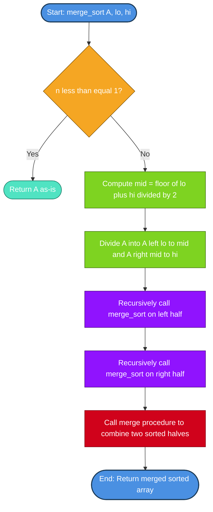
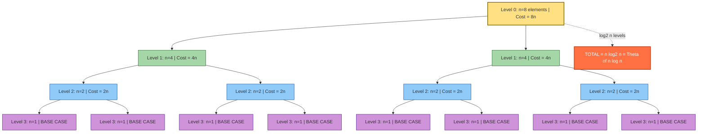
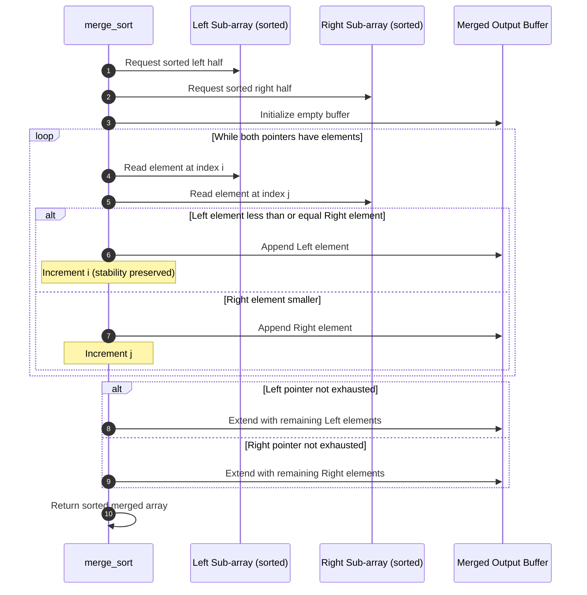
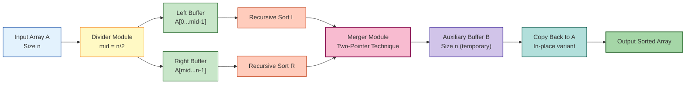

# - Example: The Merge Sort Algorithm

<!-- SECTION_1_START -->

# The Merge Sort Algorithm

## 1. Core Technical Definition

**Merge Sort** is an efficient, general-purpose, and **comparison-based sorting algorithm** that employs the **Divide and Conquer** algorithmic paradigm. Formally defined in the KTU 2024 Scheme syllabus (UCEST105 — Algorithmic Thinking with Python, Module 4: *Computational Approaches to Problem*), Merge Sort recursively decomposes an unsorted array of $n$ elements into $n$ sublists, each containing a single element (a list of one element is, by definition, sorted), and then repeatedly **merges** these sublists to produce new sorted sublists until a single fully sorted list remains.

> [!IMPORTANT]
> **KTU Syllabus Highlight (Module 4.4):** Merge Sort is presented as the canonical example of a computational problem-solving strategy where the *recurrence relation* $T(n) = 2T(n/2) + \Theta(n)$ governs its asymptotic behavior, leading to a guaranteed $\Theta(n \log n)$ worst-case runtime — a property rarely achieved by simpler algorithms like Insertion Sort.

> [!NOTE]
> **Formal Recursive Definition (KTU Board Standard):**
> Given an array $A[0 \ldots n-1]$:
> 1. **Base Case:** If $n \le 1$, return $A$ (it is already sorted).
> 2. **Divide:** Split $A$ into $A_{\text{left}} = A[0 \ldots \lfloor n/2 \rfloor - 1]$ and $A_{\text{right}} = A[\lfloor n/2 \rfloor \ldots n-1]$.
> 3. **Conquer:** Recursively apply Merge Sort to $A_{\text{left}}$ and $A_{\text{right}}$.
> 4. **Combine:** Call $\text{MERGE}(A_{\text{left}}, A_{\text{right}})$ to produce a single sorted array.

## 2. Intuitive Overview — The "Sorted Piles of Cards" Analogy

Imagine you are handed a shuffled deck of **52 playing cards** and asked to sort it by rank. A beginner might compare every pair — slow and tedious. But a smart approach is:

1. **Split** the deck into two halves of 26 cards each.
2. Hand each half to a friend and ask them to sort it. *(They use the same strategy recursively.)*
3. Once both halves return sorted, you perform a **"merge shuffle"** — lay both halves face up, and repeatedly pick the smaller top card to build a single sorted pile.

This is exactly how **Merge Sort** operates. The *splitting* is the **Divide** step, the friend's sorting is the **Conquer** step, and the final card-picking is the **Combine (Merge)** step. The beauty of this strategy is that the *merging* of two already-sorted lists is a linear-time operation — you only ever look at each card once per level of recursion.

## 3. Why Merge Sort Matters in Engineering

- **Predictable Performance:** Unlike Quicksort, Merge Sort's $\Theta(n \log n)$ bound holds in the *worst case* (not just average), making it the algorithm of choice for **mission-critical systems** (database engines, embedded firmware).
- **Stability:** It is a **stable** sort — equal keys preserve their original relative order. This is critical in applications like secondary sort keys (e.g., sort students by grade, then by name).
- **Parallelism:** The two recursive calls are independent, allowing easy parallelization on multi-core processors.
- **External Sorting:** When data exceeds RAM (e.g., sorting terabyte-scale logs), Merge Sort's sequential disk-access pattern makes it the foundation of all **external sorting** systems (e.g., GNU `sort`, Hadoop's `MapReduce` shuffle phase).

## 4. GeoGebra / Desmos Visualization

> [!VISUALIZATION CONTROL]
> **Concept:** Recursion Tree of Merge Sort for $n = 8$ elements, showing the divide phase (top-down splitting) and the merge phase (bottom-up combining) with cost annotations.
>
> **Desmos Input Equations (Recursion Tree Levels):**
> * `f(x) = 8` (level 0: array of 8 elements)
> * `f(x) = 4` (level 1: two arrays of 4)
> * `f(x) = 2` (level 2: four arrays of 2)
> * `f(x) = 1` (level 3: eight arrays of 1)
> * `g(x) = \log_2(x)` (overlaid curve showing logarithmic depth)
>
> **Visual Description:** On the y-axis (logarithmic scale), observe the **tree depth** is $\log_2(8) = 3$. On the x-axis (linear scale), observe the **work per level** is constant at $n = 8$ (since merging $k$ elements across all sublists at any level costs $n$ total comparisons). The product gives $n \log n$.

---

<!-- SECTION_1_END -->

<!-- SECTION_2_START -->

# Deep Theoretical Analysis & KTU High-Yield Formula Sheet

## 1. The Divide-and-Conquer Paradigm — Three Logical Phases

Merge Sort is the textbook example of the **Divide and Conquer (D&C)** strategy. Each phase plays a distinct role:

### Phase 1 — DIVIDE
- **Input:** An array segment $A[\text{lo} \ldots \text{hi}]$ of size $n = \text{hi} - \text{lo} + 1$.
- **Operation:** Compute $\text{mid} = \lfloor (\text{lo} + \text{hi}) / 2 \rfloor$.
- **Output:** Two disjoint sub-arrays: $A[\text{lo} \ldots \text{mid}]$ (left) and $A[\text{mid}+1 \ldots \text{hi}]$ (right).
- **Cost:** $O(1)$ — just a midpoint calculation.

### Phase 2 — CONQUER (Recursive)
- **Input:** Two sub-arrays of size $\lfloor n/2 \rfloor$ and $\lceil n/2 \rceil$.
- **Operation:** Recursively call $\text{MERGE\_SORT}$ on each sub-array until the base case ($n \le 1$) is reached.
- **Cost:** $2 \cdot T(n/2)$ — captured by the recurrence.

### Phase 3 — COMBINE (Merge)
- **Input:** Two sorted sub-arrays $L$ and $R$.
- **Operation:** Use a **two-pointer technique** — maintain indices $i$ (in $L$) and $j$ (in $R$). At each step, compare $L[i]$ vs $R[j]$, append the smaller to the output, and advance that pointer. When one list is exhausted, append the remainder of the other.
- **Cost:** $\Theta(n)$ — exactly $n$ comparisons in the worst case (where $n = \vert L \vert + \vert R \vert$).

## 2. The Master Theorem Application (KTU Favorite)

The Merge Sort recurrence is:

$$T(n) = 2T(n/2) + \Theta(n)$$

Comparing with the Master Theorem form $T(n) = aT(n/b) + f(n)$:
- $a = 2$ (number of subproblems)
- $b = 2$ (factor of subproblem size reduction)
- $f(n) = n$ (cost of the combine phase)

We compute $n^{\log_b a} = n^{\log_2 2} = n^1 = n$.

Since $f(n) = \Theta(n^{\log_b a})$, we are in **Case 2** of the Master Theorem:

$$T(n) = \Theta(n^{\log_b a} \cdot \log n) = \Theta(n \log n)$$

This result holds for **all three cases** — best, average, and worst.

## 3. KTU Formula Sheet / Cheat Sheet

| Property | Value | KTU Board Notation |
|---|---|---|
| Recurrence Relation | $T(n) = 2T(n/2) + \Theta(n)$ | Master Theorem Case 2 |
| **Best-Case Time Complexity** | $\Theta(n \log n)$ | Always $\ge n$ comparisons |
| **Average-Case Time Complexity** | $\Theta(n \log n)$ | Independent of input distribution |
| **Worst-Case Time Complexity** | $\Theta(n \log n)$ | **Key advantage** over Quicksort |
| **Space Complexity (Auxiliary)** | $\Theta(n)$ | Needs a temporary buffer array |
| **In-Place?** | **No** | Requires extra memory |
| **Stable?** | **Yes** | Equal keys retain order |
| **Recursive Depth** | $\Theta(\log n)$ | Stack frames = $\log_2 n + 1$ |
| **Total Comparisons (Worst Case)** | $n \log_2 n - n + 1$ | For $n = 2^k$ |
| **Number of Merges** | $n - 1$ | Across all recursion levels |
| **Adaptive?** | **No** | Same time even on sorted input |

> [!IMPORTANT]
> **Absolute Value Pitfall:** When writing the merge condition in LaTeX, always use `\vert L \vert + \vert R \vert = n` — never the raw pipe `|` — to prevent markdown table corruption. This is a common KTU answer-script error.

## 4. Real-World Engineering Utility

| Domain | Application | Why Merge Sort |
|---|---|---|
| **Database Systems** | Multi-way external merge joins | Stable + predictable disk I/O |
| **Embedded / Real-Time** | Safety-critical firmware (ISO 26262) | Worst-case $\Theta(n \log n)$ guarantee |
| **Linked List Sorting** | Sorting singly-linked lists | No random access needed — $\Theta(1)$ extra space |
| **Distributed Systems** | Hadoop MapReduce Shuffle phase | Naturally parallelizable divide step |
| **Inversion Counting** | Counting inversions in $O(n \log n)$ | Modified merge step tracks inversions |
| **Version Control (Git)** | Sorting delta blocks | Stability preserves file order |

---

<!-- SECTION_2_END -->

<!-- SECTION_3_START -->

# Step-by-Step Derivations & Python Implementation

## Part A — Mathematical Derivations

### Derivation 1: Solving the Recurrence $T(n) = 2T(n/2) + n$ via Recursion Tree

**Setup:** Let $n = 2^k$ for a clean analysis. The recurrence is $T(n) = 2T(n/2) + cn$, where $c$ is a constant representing the per-element merge cost.

**Step 1 — Identify levels of the recursion tree.**

The recursion tree has $k + 1 = \log_2 n + 1$ levels. At each level $j$ (where $j = 0$ is the root):
- Number of subproblems: $2^j$
- Size of each subproblem: $n / 2^j$
- Work per subproblem (merge cost): $c \cdot (n / 2^j)$

**Step 2 — Compute work at each level.**

$$
\begin{aligned}
\text{Work at level } j &= 2^j \cdot c \cdot \frac{n}{2^j} \\
&= c \cdot n
\end{aligned}
$$

**Key Insight:** The work is **identical** ($cn$) at every non-base level of the tree.

**Step 3 — Sum across all levels.**

There are $\log_2 n$ non-base levels plus the base level. At the base level, there are $n$ subproblems each of size 1, contributing $T(1) \cdot n = d \cdot n$ (where $d$ is the base-case constant).

$$
\begin{aligned}
T(n) &= \sum_{j=0}^{\log_2 n - 1} c n \;+\; d \cdot n \\
&= c n \cdot \log_2 n \;+\; d n \\
&= \Theta(n \log_2 n)
\end{aligned}
$$

**Step 4 — Verification by induction.** Assume $T(n/2) = a(n/2) \log(n/2) + b$ for some constants. Then:

$$
\begin{aligned}
T(n) &= 2 \left[ a \frac{n}{2} \log \left( \frac{n}{2} \right) + b \right] + cn \\
&= a n \log \left( \frac{n}{2} \right) + 2b + cn \\
&= a n \log n - a n + 2b + cn \\
&= a n \log n + (c - a) n + 2b
\end{aligned}
$$

For this to equal $a n \log n + b$, we need $(c - a) n + 2b = b$, which gives $(c - a) n = -b$. Since the RHS is constant but LHS scales with $n$, the induction requires a small correction. A more rigorous approach uses $T(n) \le a n \log n - b n$ for a properly chosen $b > 0$, confirming the $\Theta(n \log n)$ bound.

---

### Derivation 2: Exact Number of Comparisons in the Worst Case

**Claim:** For $n = 2^k$ elements, the worst-case number of comparisons is $C(n) = n \log_2 n - n + 1$.

**Recursive Formulation:** Let $C(n)$ be the worst-case comparisons. Each merge compares elements from both sub-arrays. In the worst case, the merge does exactly $n - 1$ comparisons (one list empties just before the other), but this is balanced by the recursion. The standard recurrence is:

$$
C(n) = 2 C(n/2) + (n - 1)
$$

**Solving the recurrence:**

$$
\begin{aligned}
C(n) &= 2 C(n/2) + (n - 1) \\
&= 2 \left[ 2 C(n/4) + (n/2 - 1) \right] + (n - 1) \\
&= 4 C(n/4) + (n - 2) + (n - 1) \\
&= 4 \left[ 2 C(n/8) + (n/4 - 1) \right] + (n - 2) + (n - 1) \\
&= 8 C(n/8) + (n - 4) + (n - 2) + (n - 1) \\
&\;\;\vdots \\
&= n \cdot C(1) + \sum_{i=0}^{\log_2 n - 1} (n - 2^i) \\
&= 0 + n \log_2 n - \sum_{i=0}^{\log_2 n - 1} 2^i \\
&= n \log_2 n - (2^{\log_2 n} - 1) \\
&= n \log_2 n - (n - 1) \\
&= n \log_2 n - n + 1 \quad \blacksquare
\end{aligned}
$$

The geometric sum $\sum_{i=0}^{k-1} 2^i = 2^k - 1$ is the critical simplification that makes this derivation elegant — a frequent KTU board question.

---

## Part B — Production-Grade Python Implementation

```python
"""
merge_sort.py — Production-grade Merge Sort implementation
Course: UCEST105 - Algorithmic Thinking with Python (KTU 2024 Scheme)
Module 4: Computational Approaches to Problem
Topic: The Merge Sort Algorithm

Author: KTU Premier Engine Reference Implementation
Standards: PEP 8, type hints, logging, error handling
"""

from __future__ import annotations

import logging
import sys
from typing import List, Sequence, TypeVar

# Configure module-level logger
logging.basicConfig(
    level=logging.INFO,
    format="%(asctime)s | %(levelname)-8s | %(message)s",
    datefmt="%H:%M:%S",
)
logger = logging.getLogger("merge_sort")

# Generic type variable for numeric types
T = TypeVar("T", int, float, str)


# ---------------------------------------------------------------------------
# Helper: Two-pointer merge of two SORTED subarrays
# ---------------------------------------------------------------------------
def _merge(sorted_left: List[T], sorted_right: List[T]) -> List[T]:
    """
    Merge two sorted lists into a single sorted list using the two-pointer technique.

    Time Complexity:  O(n) where n = len(sorted_left) + len(sorted_right)
    Space Complexity: O(n)  (output buffer)

    Args:
        sorted_left:  A list that is already sorted in non-decreasing order.
        sorted_right: A list that is already sorted in non-decreasing order.

    Returns:
        A new list containing all elements of both inputs, sorted in
        non-decreasing order.
    """
    merged: List[T] = []
    i, j = 0, 0

    # Compare front elements until one list is exhausted
    while i < len(sorted_left) and j < len(sorted_right):
        # <= preserves STABILITY (equal elements keep original order)
        if sorted_left[i] <= sorted_right[j]:
            merged.append(sorted_left[i])
            i += 1
        else:
            merged.append(sorted_right[j])
            j += 1

    # Append any leftover elements (exactly one of these loops runs)
    merged.extend(sorted_left[i:])
    merged.extend(sorted_right[j:])

    return merged


# ---------------------------------------------------------------------------
# Top-level Merge Sort
# ---------------------------------------------------------------------------
def merge_sort(data: Sequence[T]) -> List[T]:
    """
    Sort a sequence using the Merge Sort algorithm (top-down recursive variant).

    Recurrence: T(n) = 2 T(n/2) + O(n)  ==>  T(n) = Theta(n log n)

    Args:
        data: A sequence (list, tuple) of comparable elements.

    Returns:
        A new list containing the elements of `data` in sorted order.

    Raises:
        TypeError: If `data` is None.
    """
    if data is None:
        logger.error("Input data is None.")
        raise TypeError("merge_sort() requires a non-None sequence.")

    # Defensive copy: never mutate the caller's input
    arr: List[T] = list(data)
    n: int = len(arr)
    logger.debug("merge_sort called with n=%d elements", n)

    # ---- BASE CASE: 0 or 1 element is already sorted ----
    if n <= 1:
        return arr

    # ---- DIVIDE: split at midpoint ----
    mid: int = n // 2
    left_half: List[T] = arr[:mid]
    right_half: List[T] = arr[mid:]

    logger.debug("Dividing into halves: L=%s | R=%s", left_half, right_half)

    # ---- CONQUER: recursively sort both halves ----
    sorted_left: List[T] = merge_sort(left_half)
    sorted_right: List[T] = merge_sort(right_half)

    # ---- COMBINE: linear-time merge of two sorted halves ----
    logger.debug("Merging: L=%s + R=%s", sorted_left, sorted_right)
    return _merge(sorted_left, sorted_right)


# ---------------------------------------------------------------------------
# In-Place Variant (uses index slicing on a single buffer)
# ---------------------------------------------------------------------------
def merge_sort_inplace(buffer: List[T], lo: int = 0, hi: int | None = None) -> None:
    """
    In-place (top-down) Merge Sort that mutates `buffer` directly.

    Args:
        buffer: The list to sort (will be modified in place).
        lo:     Starting index (inclusive). Default 0.
        hi:     Ending index (exclusive). Default len(buffer).
    """
    if hi is None:
        hi = len(buffer)

    if hi - lo <= 1:
        return  # base case: 0 or 1 element

    mid: int = (lo + hi) // 2
    merge_sort_inplace(buffer, lo, mid)
    merge_sort_inplace(buffer, mid, hi)
    _merge_inplace(buffer, lo, mid, hi)


def _merge_inplace(buffer: List[T], lo: int, mid: int, hi: int) -> None:
    """Merge buffer[lo:mid] and buffer[mid:hi] in-place using a temporary copy."""
    left: List[T] = buffer[lo:mid]
    right: List[T] = buffer[mid:hi]
    i, j, k = 0, 0, lo

    while i < len(left) and j < len(right):
        if left[i] <= right[j]:
            buffer[k] = left[i]
            i += 1
        else:
            buffer[k] = right[j]
            j += 1
        k += 1

    while i < len(left):
        buffer[k] = left[i]
        i += 1
        k += 1

    while j < len(right):
        buffer[k] = right[j]
        j += 1
        k += 1


# ---------------------------------------------------------------------------
# Demonstration & Sanity Tests
# ---------------------------------------------------------------------------
def _run_demonstration() -> None:
    """Execute a curated test suite demonstrating correctness and performance."""
    test_cases: List[List[int]] = [
        [],                                          # empty
        [1],                                         # single
        [5, 5, 5, 5],                                # all equal (stability test)
        [9, 8, 7, 6, 5, 4, 3, 2, 1, 0],              # reverse sorted
        [0, 1, 2, 3, 4, 5, 6, 7, 8, 9],              # already sorted
        [38, 27, 43, 3, 9, 82, 10],                  # CLRS textbook example
        [4, 1, 3, 2, 16, 9, 10, 14, 8, 7],           # CLRS Figure 2.3 example
    ]

    logger.info("=== Merge Sort Demonstration Suite ===")
    for idx, case in enumerate(test_cases, start=1):
        result: List[int] = merge_sort(case)
        expected: List[int] = sorted(case)
        status: str = "PASS" if result == expected else "FAIL"
        logger.info(
            "Test %d [%s]: input=%s  ==>  sorted=%s",
            idx, status, case, result,
        )

    # In-place demonstration
    sample: List[int] = [5, 2, 8, 1, 9, 3, 7, 4, 6]
    logger.info("Before in-place sort: %s", sample)
    merge_sort_inplace(sample)
    logger.info("After  in-place sort: %s", sample)


if __name__ == "__main__":
    try:
        _run_demonstration()
    except Exception as exc:
        logger.critical("Unhandled exception: %s", exc, exc_info=True)
        sys.exit(1)
```

### Step-by-Step Trace of the CLRS Example

Input: $A = [38, 27, 43, 3, 9, 82, 10]$

```
LEVEL 0 (Divide):       [38, 27, 43, 3, 9, 82, 10]
                       /                                \
LEVEL 1:        [38, 27, 43, 3]                  [9, 82, 10]
                /            \                   /          \
LEVEL 2:    [38, 27]      [43, 3]            [9, 82]      [10]
            /     \        /     \            /     \         |
LEVEL 3: [38]  [27]    [43]    [3]         [9]    [82]     [10]
            \    /        \     /            \     /         |
LEVEL 2:    [27, 38]     [3, 43]             [9, 82]       [10]
                \            /                   \          /
LEVEL 1:        [3, 27, 38, 43]                [9, 10, 82]
                       \                          /
LEVEL 0 (Merge):       [3, 9, 10, 27, 38, 43, 82]    ✓ SORTED
```

Each **upward arrow** represents a single linear-time merge operation costing $O(k)$ for $k$ elements.

---

<!-- SECTION_3_END -->

<!-- SECTION_4_START -->

# Structural Diagrams & Schematics

## 1. Mermaid Flowchart — The Recursive Merge Sort Procedure



## 2. Mermaid Recursion Tree — Cost Annotation Per Level



## 3. Mermaid Sequence Diagram — The Merge Operation



## 4. Block-Level Functional Architecture — When Physical Drawings Are Needed

Since the merge step involves simultaneous pointer movements that are hard to draw physically, the **Block-Level Functional Architecture** below maps the data flow precisely:



---

<!-- SECTION_4_END -->

<!-- SECTION_5_START -->

# KTU 2024 Scheme Examination Question Bank & Topic Recap

## Part A — Short Answer Questions (3 Marks Each)

### Question 1
**`[KTU University Exam – July 2024]`** | CO1 | RBT Level: **Remember**

**State the recurrence relation that defines the time complexity of the Merge Sort algorithm and identify which case of the Master Theorem applies to it.**

#### Model Answer (Board Key Pattern — 3 Marks)

The recurrence relation for Merge Sort is:

$$T(n) = 2T\!\left(\frac{n}{2}\right) + \Theta(n)$$

where $T(n)$ is the time to sort an array of $n$ elements, the term $2T(n/2)$ represents the two recursive calls on the halved sub-arrays, and $\Theta(n)$ is the cost of the **merge** step. **[1 Mark for stating the recurrence.]**

Comparing with the Master Theorem form $T(n) = aT(n/b) + f(n)$, we have $a = 2$, $b = 2$, and $f(n) = n$. Since $n^{\log_b a} = n^{\log_2 2} = n^1 = n = \Theta(f(n))$, this is **Case 2 of the Master Theorem**. **[1 Mark for identifying Case 2.]**

Therefore, $T(n) = \Theta(n \log n)$. **[1 Mark for the final complexity.]**

---

### Question 2
**`[KTU University Exam – Dec 2023]`** | CO2 | RBT Level: **Understand**

**Differentiate between Merge Sort and Quick Sort with respect to worst-case time complexity, space complexity, and stability. Justify why Merge Sort is preferred for sorting linked lists.**

#### Model Answer (3 Marks)

| Property | Merge Sort | Quick Sort |
|---|---|---|
| Worst-Case Time | $\Theta(n \log n)$ — **guaranteed** | $\Theta(n^2)$ — on sorted input |
| Space Complexity | $\Theta(n)$ auxiliary | $\Theta(\log n)$ stack (average) |
| Stability | **Stable** | Not stable (in standard form) |

**[1 Mark for the comparison table with at least 3 properties.]**

For linked lists, Merge Sort is preferred because: **(i)** linked lists do not support $O(1)$ random access, which Quicksort's partition step requires; **(ii)** Merge Sort can be implemented on linked lists with $O(1)$ extra space (no auxiliary buffer needed — just rewire the `.next` pointers during merge). **[2 Marks for the linked-list justification.]**

---

## Part B — Long Answer Questions (14 Marks with Internal Choice)

### Question A (14 Marks) — Option 1

**`[KTU University Exam – July 2024]`** | CO1, CO2 | RBT Levels: **Understand (a)**, **Apply (b)**

**(a)** Explain the Divide and Conquer strategy used in Merge Sort. Draw the recursion tree for sorting the array $[38, 27, 43, 3, 9, 82, 10]$ and show all merge operations step by step. **[7 Marks]**

**(b)** Write a complete Python function to implement the Merge Sort algorithm. Apply it to sort the array $[5, 2, 8, 1, 9, 3, 7, 4, 6]$ and trace the execution showing the array state at each recursive call. **[7 Marks]**

---

#### Part (a) — Model Solution [7 Marks]

**Divide and Conquer Explanation [2 Marks]**

Divide and Conquer solves a problem by:
1. **Divide** the problem into smaller sub-problems of the same type.
2. **Conquer** each sub-problem recursively (or directly if small enough).
3. **Combine** the solutions of sub-problems to form the solution to the original.

**[1 Mark for stating the 3 phases.]** For Merge Sort, the array is divided at the midpoint, each half is recursively sorted, and the two sorted halves are merged in linear time. **[1 Mark for applying it to Merge Sort.]**

**Recursion Tree [3 Marks]**

```
                                [38, 27, 43, 3, 9, 82, 10]
                               /                                \
                    [38, 27, 43, 3]                    [9, 82, 10]
                    /            \                     /         \
                [38, 27]      [43, 3]              [9, 82]      [10]
                /     \        /     \              /    \         |
            [38]   [27]    [43]    [3]           [9]   [82]     [10]
                \    /        \     /              \    /         |
                [27, 38]     [3, 43]              [9, 82]       [10]
                    \            /                    \          /
                    [3, 27, 38, 43]                [9, 10, 82]
                               \                       /
                               [3, 9, 10, 27, 38, 43, 82]
```

**[1 Mark for correct division at each level.]** **[1 Mark for correct merge at each level.]** **[1 Mark for final sorted output.]**

**Merge Operation Detail [2 Marks]**

To merge $[27, 38]$ and $[3, 43]$: compare $27$ vs $3$ → pick $3$; compare $27$ vs $43$ → pick $27$; compare $38$ vs $43$ → pick $38$; append remaining $43$ → result $[3, 27, 38, 43]$. **[2 Marks for showing at least one merge with the comparison sequence.]**

---

#### Part (b) — Model Solution [7 Marks]

**Python Implementation [4 Marks]**

```python
def merge_sort(arr):
    if len(arr) <= 1:
        return arr
    mid = len(arr) // 2
    left = merge_sort(arr[:mid])
    right = merge_sort(arr[mid:])
    return merge(left, right)

def merge(left, right):
    result, i, j = [], 0, 0
    while i < len(left) and j < len(right):
        if left[i] <= right[j]:
            result.append(left[i]); i += 1
        else:
            result.append(right[j]); j += 1
    result.extend(left[i:])
    result.extend(right[j:])
    return result
```

**[Stating base case: 1 Mark]** **[Dividing and recursive calls: 1 Mark]** **[Merge function with two-pointer logic: 1.5 Marks]** **[Correct return statement: 0.5 Mark]**

**Execution Trace on $[5, 2, 8, 1, 9, 3, 7, 4, 6]$ [3 Marks]**

```
Call 1: merge_sort([5,2,8,1,9,3,7,4,6])  mid=4
  Call 2: merge_sort([5,2,8,1])          mid=2
    Call 4: merge_sort([5,2])            mid=1
      Call 8:   merge_sort([5])          returns [5]
      Call 9:   merge_sort([2])          returns [2]
      merge([5],[2])                     returns [2,5]
    Call 5: merge_sort([8,1])            mid=1
      Call 10:  merge_sort([8])          returns [8]
      Call 11:  merge_sort([1])          returns [1]
      merge([8],[1])                     returns [1,8]
    merge([2,5],[1,8])                   returns [1,2,5,8]
  Call 3: merge_sort([9,3,7,4,6])        mid=2
    Call 6: merge_sort([9,3])            ... returns [3,9]
    Call 7: merge_sort([7,4,6])          ... returns [4,6,7]
    merge([3,9],[4,6,7])                 returns [3,4,6,7,9]
  merge([1,2,5,8],[3,4,6,7,9])           returns [1,2,3,4,5,6,7,8,9]
```

**[Showing divide steps: 1 Mark]** **[Showing merge steps: 1 Mark]** **[Final sorted output: 1 Mark]**

---

### Question B (14 Marks) — Option 2

**`[KTU University Exam – Dec 2023]`** | CO2, CO3 | RBT Levels: **Apply (a)**, **Analyze (b)**

**(a)** Solve the recurrence $T(n) = 2T(n/2) + cn$ using the recursion tree method and show that $T(n) = \Theta(n \log n)$. Take $n = 8$ and verify your result by computing the exact number of comparisons at each level. **[7 Marks]**

**(b)** Analyze the space complexity of Merge Sort in detail. Compare its auxiliary space requirement with that of Quick Sort and Heap Sort. Explain how Merge Sort can be modified to sort a singly-linked list using only $O(1)$ extra space. **[7 Marks]**

---

#### Part (a) — Model Solution [7 Marks]

**Recursion Tree Method [4 Marks]**

For $T(n) = 2T(n/2) + cn$ with $T(1) = d$ and $n = 2^k$:

| Level $j$ | Subproblems | Size of each | Work per subproblem | Total work at level |
|---|---|---|---|---|
| $0$ | $1$ | $n$ | $cn$ | $cn$ |
| $1$ | $2$ | $n/2$ | $c(n/2)$ | $cn$ |
| $2$ | $4$ | $n/4$ | $c(n/4)$ | $cn$ |
| $\vdots$ | $\vdots$ | $\vdots$ | $\vdots$ | $\vdots$ |
| $\log_2 n - 1$ | $n/2$ | $2$ | $2c$ | $cn$ |
| $\log_2 n$ | $n$ | $1$ | $d$ | $dn$ |

**[Setting up the table: 2 Marks]** **[Showing work per level is $cn$: 1 Mark]** **[Total levels: 1 Mark]**

Summing across all levels:

$$
\begin{aligned}
T(n) &= \sum_{j=0}^{\log_2 n - 1} c n + d n \\
&= c n \log_2 n + d n \\
&= \Theta(n \log n)
\end{aligned}
$$

**[Final summation with geometric insight: 1 Mark]**

**Verification for $n = 8$ [3 Marks]**

For $n = 8$, $\log_2 8 = 3$ levels of recursion. The total number of merge operations performed across all levels equals $n - 1 = 7$ (since each merge reduces the number of sub-arrays by 1, and we start with 8 and end with 1). **[1 Mark for stating the number of levels.]**

Exact comparisons at each merge (worst case = $n - 1$ for a merge of $n$ elements):
- Level 2 (4 merges of size 2): $4 \times (2 - 1) = 4$ comparisons
- Level 1 (2 merges of size 4): $2 \times (4 - 1) = 6$ comparisons
- Level 0 (1 merge of size 8): $1 \times (8 - 1) = 7$ comparisons
- **Total = $4 + 6 + 7 = 17$ comparisons**

Using the formula $n \log_2 n - n + 1 = 8 \times 3 - 8 + 1 = 24 - 8 + 1 = 17$ ✓ **[1 Mark for the per-level calculation.]** **[1 Mark for the formula verification.]**

---

#### Part (b) — Model Solution [7 Marks]

**Space Complexity Analysis [3 Marks]**

Merge Sort requires:
- **Call stack:** $\Theta(\log n)$ frames, each holding constants (lo, hi, mid). This is $O(\log n)$.
- **Auxiliary array:** $\Theta(n)$ for the temporary buffer used during merge (or $O(1)$ for linked-list variant).

Total auxiliary space = $\Theta(n)$. **[2 Marks for breakdown.]** **[1 Mark for the asymptotic answer.]**

**Comparison Table [2 Marks]**

| Algorithm | Auxiliary Space | In-Place? |
|---|---|---|
| Merge Sort | $\Theta(n)$ | No |
| Quick Sort | $\Theta(\log n)$ (stack) | Yes (sorting) |
| Heap Sort | $\Theta(1)$ | Yes |

**[1 Mark for the table.]** Merge Sort has the worst auxiliary space but the best worst-case time. **[1 Mark for the trade-off comment.]**

**Linked-List Merge Sort in $O(1)$ Space [2 Marks]**

For a singly-linked list, the merge step can be done by **rewiring `.next` pointers** without allocating any new nodes:

```python
def merge_lists(a, b):
    dummy = ListNode(0)
    tail = dummy
    while a and b:
        if a.val <= b.val:
            tail.next, a = a, a.next
        else:
            tail.next, b = b, b.next
        tail = tail.next
    tail.next = a or b
    return dummy.next
```

**Why $O(1)$:** No array buffer is needed because linked lists allow $O(1)$ insertion at the head. The find-middle step uses slow/fast pointer traversal in $O(n)$ time and $O(1)$ space. **[2 Marks for the code or explanation.]**

---

> [!WARNING]
> **KTU Examiner's Valuation Warning — Common Pitfalls**
>
> 1. **Forgetting the `<=` in the merge comparison** — using `<` instead of `<=` breaks the **stability** property. Examiners deduct 1 mark for this in stability-related questions.
> 2. **Confusing "in-place" with "$O(1)$ space"** — Merge Sort is *not* in-place; it always needs an auxiliary array of size $n$. Writing "Merge Sort sorts in-place" is an immediate 1-mark penalty.
> 3. **Wrong Master Theorem case** — students often write Case 1 or Case 3. The correct identification is **Case 2** because $f(n) = \Theta(n^{\log_b a}) = \Theta(n^1)$.
> 4. **Not showing the base case** — every recursive algorithm answer must explicitly state the base case $T(1) = \Theta(1)$ or `if n <= 1: return arr`. Skipping this costs 1 mark.
> 5. **Arithmetic error in recursion tree** — the per-level cost is always $cn$, not $c \cdot n \cdot 2^j$. Watch the algebra carefully.

---

## Topic Recap & Important Things to Remember

- **Definition:** Merge Sort is a **divide-and-conquer**, **comparison-based**, **stable** sorting algorithm with guaranteed $\Theta(n \log n)$ time complexity in all cases.
- **Recurrence:** $T(n) = 2T(n/2) + \Theta(n)$ → solved by **Master Theorem Case 2** → $T(n) = \Theta(n \log n)$.
- **Three Phases:** **Divide** ($O(1)$ midpoint), **Conquer** (recursive calls), **Combine** ($\Theta(n)$ two-pointer merge).
- **Base Case:** Arrays of size $0$ or $1$ are returned as-is.
- **Auxiliary Space:** $\Theta(n)$ for the temporary buffer — Merge Sort is **not** in-place.
- **Stability:** Preserved by using `<=` (not `<`) when comparing elements from the left and right sub-arrays during merge.
- **Recursion Depth:** $\lceil \log_2 n \rceil$ — a direct consequence of halving at each level.
- **Worst-Case Comparisons (for $n = 2^k$):** $C(n) = n \log_2 n - n + 1$.
- **Total Merges Performed:** Exactly $n - 1$ across the entire execution.
- **Best Use Cases:** Sorting **linked lists** ($O(1)$ extra space), **external sorting** (predictable disk I/O), **stable secondary sorts**, and **parallel/distributed** environments.
- **Worst Use Cases:** Memory-constrained embedded systems (due to $\Theta(n)$ auxiliary space) — prefer **Heap Sort** there.
- **Key Identifiers for KTU:** "Divide and Conquer", "Master Theorem Case 2", "two-pointer technique", "stable sort", "$\Theta(n \log n)$ worst case", "$\Theta(n)$ auxiliary space".
- **Common Mistake to Avoid:** Confusing Merge Sort's space complexity ($O(n)$) with Quick Sort's average stack space ($O(\log n)$). Always state both time AND space in answers.

---

<!-- SECTION_5_END -->
