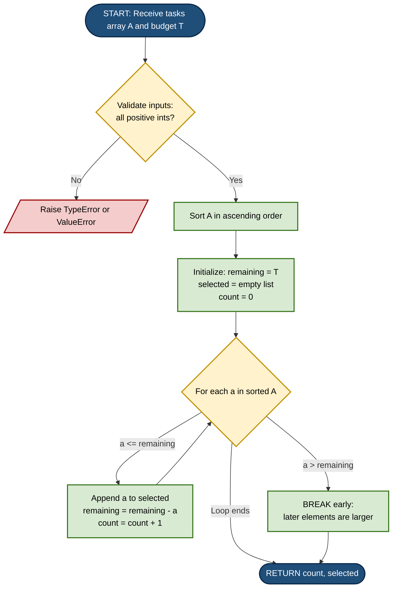
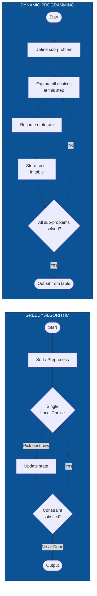

# Greedy Algorithm Approach - Example: Given an array of positive integers each indicating the completion time for a task, find the maximum number of tasks that can be completed in the limited amount of time that you have. - Motivations for the Greedy Approach - Characteristics of the Greedy Algorithm - Greedy Algorithms vs Dynamic Programming

<!-- SECTION_1_START -->

# Module 4 — Computational Approaches to Problem Solving

## 1. Greedy Algorithm Approach

### 1.1 Formal Definition (KTU 2024 Syllabus Terminology)

> [!IMPORTANT]
> **Greedy Algorithm (KTU 2024 Definition):**
> A *Greedy Algorithm* is an algorithmic paradigm that builds up a solution piece by piece, always choosing the next piece that offers the **most immediate benefit** (i.e., the locally optimal choice) with the hope that these local optima will lead to a **globally optimal solution**. At each decision step, the algorithm commits to the choice that looks best *at that moment* without reconsidering previous decisions.

In the context of **UCEST105 – Algorithmic Thinking with Python (Module 4)**, a greedy algorithm is introduced as a *direct, intuitive* computational strategy for solving optimization problems — particularly those that can be broken into a sequence of independent, additive sub-decisions.

### 1.2 Conceptual Analogy — "The Lunch Box Packer"

> [!NOTE]
> **Real-World Analogy — Packing a Limited Lunch Box:**
> Imagine you have a lunch box that can hold food worth exactly **1200 calories**, and you are given a list of snacks with their calorie values:
>
> `Snacks = [400, 150, 800, 100, 350, 600]`
>
> A *greedy* person picks the **smallest snack first** (100 cal), then the next smallest (150 cal), then 350 cal, then 400 cal — total = **1000 cal**, and stops. They then look for the next smallest that still fits (600 cal won't fit, only 200 cal remain). So they pick the snack worth 200 cal.
>
> Total selected: 4 snacks (100 + 150 + 350 + 400 + 200) — the **maximum count** the box can hold.
>
> They never go back, never swap, never reconsider. Once picked, *always picked*. This is the essence of the **Greedy Strategy**.

The greedy eater does not try *all* combinations — that would be brute force / dynamic programming. They make the locally best choice (shortest time = eats faster = more snacks) and trust it to be globally optimal. For problems like this task-scheduling variant, the greedy choice is provably optimal.

### 1.3 Mapping the Analogy to the Canonical Task Problem

> [!IMPORTANT]
> **The Canonical Problem Statement (KTU Module 4 Example):**
> *Given an array of positive integers, where each integer represents the **completion time** of a task, and given a **limited total amount of time** $T$, find the **maximum number of tasks** that can be completed within that time.*

| Lunch Box Analogy | Task Scheduling Problem |
|---|---|
| Calorie value of snack | Completion time of task |
| Lunch box capacity $C$ | Available time $T$ |
| Maximize count of snacks | Maximize count of tasks |
| Smallest snack first | Shortest task first |

This direct, length-based greedy approach is the introductory example used in the KTU syllabus to demonstrate how a greedy algorithm works.

### 1.4 Visualization of the Strategy

> [!VISUALIZATION CONTROL]
> **Concept:** Task time distribution on a number line, illustrating the "shortest job first" greedy picking order.
>
> **GeoGebra / Desmos Input Equations (Parametric Histogram):**
>
> * `task_times = \{50, 80, 30, 120, 45, 200, 90\}` (as points on $x$-axis)
> * `y = 0` baseline
> * Highlight sorted order: `\{30, 45, 50, 80, 90, 120, 200\}` in **green**; rejected tasks in **red**.
> * Cumulative sum line: $S_n = \sum_{i=1}^{n} t_i$ plotted as a step function rising until it crosses the horizontal line $y = T$.
>
> **Visual Description:** The student should observe that the green (selected) tasks form an *ascending staircase* on the left, and the step function $S_n$ is allowed to rise only as long as it stays strictly below the dashed limit line $y = T$. The first point where $S_n$ would cross $T$ marks the boundary of the optimal count.

### 1.5 The Underlying Philosophy

> [!NOTE]
> **Three Pillars of Greedy Thinking (KTU Module 4):**
> 1. **Local Optimum at every step** — never look ahead, never look behind.
> 2. **Irrevocability** — once a decision is made, it is **never reversed**.
> 3. **Hope of Global Optimum** — local optima, when chained correctly, *usually* produce a global optimum (this is the key requirement — the problem must have a **Greedy-Choice Property**).

---

<!-- SECTION_1_END -->

<!-- SECTION_2_START -->

# 2. Deep Theoretical Analysis — Greedy Approach Mechanics

## 2.1 How the Greedy Algorithm Operates — Step Decomposition

The greedy approach decomposes into a precise **5-stage decision loop**:

1. **Identify the Objective Function** — formally state what is being maximized or minimized.
   *Example:* Maximize $\vert \text{Selected} \vert$ subject to $\sum_{t \in \text{Selected}} t \le T$.

2. **Define the "Greedy Criterion"** — choose the metric that drives each local decision.
   *Example:* Pick the task with the **smallest remaining completion time**.

3. **Sort (or Pre-process) the Candidate Set** — order items so the greedy criterion is queryable in $O(1)$.
   *Example:* Sort `tasks` in ascending order: $O(n \log n)$.

4. **Iterate and Commit** — for each item in sorted order, check feasibility; if it fits the remaining capacity, *commit to it* (add to the selection set, deduct from capacity).

5. **Terminate and Return** — stop when no further candidate can fit, then return the selection set.

> [!IMPORTANT]
> **Why "Sort First"?**
> After sorting, the greedy property guarantees that *every future candidate* has a time $\ge$ the current one. Hence, if the current one *does not fit*, then *no later one* can possibly fit. This yields a clean $O(n)$ scan after the $O(n \log n)$ sort.

## 2.2 The Greedy-Choice Property & Optimal Substructure

A problem is *greedy-solvable* if and only if it satisfies two mathematical properties:

| Property | Formal Meaning | Task Scheduling Interpretation |
|---|---|---|
| **Greedy-Choice Property** | A globally optimal solution can be reached by making locally optimal (greedy) choices. | Picking the shortest available task at every step never prevents reaching the maximum count. |
| **Optimal Substructure** | The optimal solution to the problem contains within it the optimal solution to a sub-problem. | After picking a task of time $t$, the remaining problem (with capacity $T - t$ and a smaller set of tasks) is itself an identical instance of the same problem. |

> [!NOTE]
> **Proof Sketch for the Task-Scheduling Problem:**
> Let the sorted times be $t_1 \le t_2 \le \dots \le t_n$. Suppose the optimal solution picks $k$ tasks. If the optimal solution does *not* include $t_1$, swap the longest task it picks with $t_1$ — the count is preserved, and the new solution is still feasible (since $t_1$ is the smallest). By induction, the greedy solution is optimal. $\blacksquare$

## 2.3 Motivations for Choosing the Greedy Approach

The KTU Module 4 syllabus explicitly lists the **motivations** that make greedy algorithms attractive:

1. **Simplicity of Design** — greedy algorithms are often the *most intuitive* first attempt. They mimic how humans naturally make decisions ("pick the cheapest, pick the shortest, pick the earliest").
2. **Computational Efficiency** — once the candidate set is sorted, most greedy algorithms run in **linear time** $O(n)$, far superior to $O(2^n)$ brute force or $O(n \cdot W)$ dynamic programming.
3. **Low Memory Footprint** — typically $O(1)$ auxiliary space (only counters, accumulators, a running sum).
4. **Deterministic and Reproducible** — given the same input, the same choices are made; no randomness, no backtracking.
5. **Provable Optimality (for the right problems)** — when the problem has the *greedy-choice property*, the algorithm is provably correct by exchange arguments or induction.
6. **Ease of Implementation in Python** — a greedy algorithm typically translates into a 5- to 10-line Python function using only built-in sorting and a `for` loop.

> [!IMPORTANT]
> **Engineering Utility in Production Systems:**
> Greedy heuristics power real-world systems such as **Huffman Coding** (data compression in ZIP/JPEG), **Dijkstra's Shortest Path** (Google Maps, network routing), **Kruskal's & Prim's MST** (network design, clustering), **Activity Selection** (CPU scheduling, room booking), and **Job Sequencing with Deadlines** (manufacturing, OS task dispatchers).

## 2.4 Characteristics of a Greedy Algorithm

> [!NOTE]
> **The 7 Defining Characteristics of a Greedy Algorithm (KTU 2024 Module 4):**

| # | Characteristic | Description |
|---|---|---|
| 1 | **Local Optimum Selection** | At each step, the best-looking local option is chosen. |
| 2 | **Irrevocability of Decisions** | No backtracking; once chosen, never undone. |
| 3 | **Single-Pass or Few-Pass Operation** | Typically one forward sweep over a sorted input. |
| 4 | **Top-Down or Bottom-Up** | Can be implemented either way; the decision is incremental. |
| 5 | **Problem Decomposition** | Each sub-problem is solved *greedily and independently* — no overlap sharing. |
| 6 | **Feasibility Check at Every Step** | Each candidate must satisfy all constraints *before* being accepted. |
| 7 | **Reliance on Greedy-Choice Property** | Optimality is *not* automatic — the problem itself must permit it. |

## 2.5 Greedy Algorithms vs Dynamic Programming — The Core Distinction

> [!IMPORTANT]
> **Side-by-Side Comparison Matrix (High-Yield for KTU 14-Mark Questions):**

| Dimension | Greedy Algorithm | Dynamic Programming (DP) |
|---|---|---|
| **Decision Model** | Make the locally optimal choice *once* and never revisit. | Consider *all possible choices* at each step and remember the best. |
| **Sub-problem Overlap** | Assumes sub-problems are **independent** (no overlap). | Explicitly handles **overlapping** sub-problems. |
| **State Storage** | $O(1)$ — no memoization table. | $O(n)$ to $O(n \cdot W)$ — stores results in a table. |
| **Time Complexity** | Often $O(n \log n)$ (dominated by sorting). | Often $O(n \cdot W)$ or $O(n^2)$ — polynomial. |
| **Optimality Guarantee** | *Only* if the problem has the greedy-choice property. | *Always* optimal when the recurrence is correct. |
| **Reversibility** | **Irrevocable** — no backtracking. | **Reversible** — sub-problems may be recomputed via the table. |
| **Typical Example** | Task scheduling by shortest-time-first; coin change (canonical coin systems). | 0/1 Knapsack; Longest Common Subsequence; Coin change (arbitrary systems). |
| **When to Prefer** | Problem is *matroid-like* or has a clear greedy criterion with provable optimality. | Problem has *overlapping sub-problems* and *optimal substructure* but **no** greedy-choice property. |
| **Failure Mode** | Can be **trapped by local optima** that are not global (e.g., 0/1 Knapsack with arbitrary weights). | Never trapped; explores the full combinatorial space efficiently. |
| **Memory Profile** | Cache-friendly, low RAM. | Memory-hungry for large state spaces. |

> [!NOTE]
> **The Coin Change Illustration — Why the Distinction Matters:**
>
> *Coin Systems where Greedy is Optimal:* `{1, 5, 10, 25}` (US cents) — to make 30 cents, greedy picks 25+5 = 2 coins (optimal).
>
> *Coin Systems where Greedy Fails:* `{1, 3, 4}` — to make 6 cents, greedy picks 4+1+1 = 3 coins, but the DP optimal is 3+3 = 2 coins. Here, **DP wins** because the local choice "4" is not globally optimal.
>
> This single example is a **favourite KTU 14-mark question** in Module 4.

## 2.6 KTU High-Yield Formula Sheet

> [!IMPORTANT]
> **Cheat Sheet — Greedy Algorithm Essentials (for last-minute revision):**

| Symbol / Term | Meaning | Used In |
|---|---|---|
| $T$ | Total available time / capacity | Constraint: $\sum t_i \le T$ |
| $t_i$ | Time required to complete task $i$ | Input element |
| $n$ | Total number of tasks | $\vert \text{tasks} \vert$ |
| $S_k$ | Cumulative time after selecting $k$ tasks | $S_k = \sum_{i=1}^{k} t_i$ |
| $k^*$ | Maximum number of tasks achievable | The objective: maximize $k$ |
| $R$ | Remaining time after $k$ selections | $R = T - S_k$ |
| $\text{feasible}(i)$ | Boolean: can task $i$ fit in remaining time? | $\text{feasible}(i) \equiv t_i \le R$ |
| $\Theta(n \log n)$ | Time complexity of the greedy approach | Sort dominates the runtime |
| $O(1)$ | Auxiliary space of the greedy approach | Only counters, no DP table |

---

<!-- SECTION_2_END -->

<!-- SECTION_3_START -->

# 3. Step-by-Step Derivations, Worked Example & Python Implementation

## 3.1 Formal Mathematical Model

**Given:**
* An array of positive integers $A = [a_1, a_2, \dots, a_n]$ where $a_i > 0$ is the completion time of task $i$.
* A time budget $T > 0$.

**Find:**
* The maximum count $k^*$ such that there exists a sub-array of size $k^*$ whose sum is $\le T$.

**Mathematically:**

$$
k^* \;=\; \max_{S \subseteq \{1,\dots,n\}} \vert S \vert \quad \text{subject to} \quad \sum_{i \in S} a_i \;\le\; T
$$

## 3.2 The Greedy Algorithm (Pseudocode)

$$
\begin{aligned}
&\text{Algorithm: MaxTasksGreedy}(A, T) \\
&1.\;\; \text{Sort } A \text{ in non-decreasing order: } A[0] \le A[1] \le \dots \le A[n-1] \\
&2.\;\; \text{remaining} \leftarrow T \\
&3.\;\; \text{selected} \leftarrow [\;\;] \\
&4.\;\; \text{count} \leftarrow 0 \\
&5.\;\; \text{for each } a \text{ in } A: \\
&6.\;\;\;\; \text{if } a \le \text{remaining}: \\
&7.\;\;\;\;\;\; \text{selected.append}(a) \\
&8.\;\;\;\;\;\; \text{remaining} \leftarrow \text{remaining} - a \\
&9.\;\;\;\;\;\; \text{count} \leftarrow \text{count} + 1 \\
&10.\;\;\; \text{else:} \\
&11.\;\;\;\;\;\; \text{break} \quad \text{(further } a \text{'s are larger, so they will also fail)} \\
&12.\;\; \text{return } (\text{count}, \text{selected})
\end{aligned}
$$

## 3.3 Exhaustive Walk-Through on a Concrete Example

Let $A = [8, 4, 6, 2, 5, 9, 3]$ and $T = 18$.

### Step 1 — Sort Ascending

$$
A_{\text{sorted}} \;=\; [2,\; 3,\; 4,\; 5,\; 6,\; 8,\; 9]
$$

### Step 2 — Greedy Iteration Table

| Iteration $i$ | Current $a$ | $\text{remaining}$ *before* | Feasible? ($\le$ remaining) | $\text{selected}$ *after* | $\text{count}$ *after* | $\text{remaining}$ *after* |
|---:|---:|---:|:---:|:---|:---:|---:|
| 1 | 2 | 18 | ✅ Yes | $[2]$ | 1 | 16 |
| 2 | 3 | 16 | ✅ Yes | $[2, 3]$ | 2 | 13 |
| 3 | 4 | 13 | ✅ Yes | $[2, 3, 4]$ | 3 | 9 |
| 4 | 5 | 9  | ✅ Yes | $[2, 3, 4, 5]$ | 4 | 4 |
| 5 | 6 | 4  | ❌ No (6 > 4) | $[2, 3, 4, 5]$ | 4 | 4 |
| 6 | — | — | Loop breaks (further values only larger) | — | — | — |

**Result:**
$$
k^* = 4, \quad \text{selected} = [2, 3, 4, 5], \quad \text{total time used} = 14, \quad \text{wasted time} = 4
$$

> [!NOTE]
> **Verification by Brute Force (small input):**
> All $\binom{7}{4} = 35$ subsets of size 4 are checked — the maximum sum $\le 18$ for 4 elements is indeed $2+3+4+5 = 14$, which fits. For 5 elements, the minimum possible sum is $2+3+4+5+6 = 20 > 18$, so 4 is provably optimal. The greedy algorithm achieves the optimum.

## 3.4 Full Python Implementation (Production-Ready)

```python
from __future__ import annotations
from typing import List, Tuple
import logging
import sys

# Configure structured logging for the algorithmic trace.
logging.basicConfig(
    level=logging.INFO,
    format="[%(asctime)s] %(levelname)s | %(message)s",
    datefmt="%H:%M:%S",
    stream=sys.stdout,
)
logger = logging.getLogger("GreedyTaskScheduler")


def max_tasks_within_time(
    task_times: List[int],
    total_time: int,
) -> Tuple[int, List[int]]:
    """
    Greedy algorithm to select the maximum number of tasks that can be
    completed within `total_time`.

    Strategy
    --------
    1. Sort the task times in ascending order.
    2. Iterate, picking the shortest task that still fits in the
       remaining time budget.
    3. Stop when the next task no longer fits (all later tasks are
       longer and will also fail, so we break early).

    Parameters
    ----------
    task_times : List[int]
        Positive integers representing the completion time of each task.
    total_time : int
        The total time budget available.

    Returns
    -------
    Tuple[int, List[int]]
        A tuple `(count, selected_task_times)`.

    Raises
    ------
    TypeError
        If inputs are not integers.
    ValueError
        If any task time is non-positive, or if total_time is negative.

    Time Complexity
    ---------------
    O(n log n) — dominated by the initial sort.

    Space Complexity
    ----------------
    O(n) for the sorted copy and the selected list.
    """

    # ---------------------------------------------------------------
    # Step 0 — Strict input validation with explicit error logging.
    # ---------------------------------------------------------------
    if not isinstance(total_time, int):
        logger.error("total_time must be an integer, got %s", type(total_time).__name__)
        raise TypeError(f"total_time must be an int, got {type(total_time).__name__}")

    if total_time < 0:
        logger.error("total_time must be non-negative, got %d", total_time)
        raise ValueError(f"total_time must be >= 0, got {total_time}")

    if not isinstance(task_times, list):
        logger.error("task_times must be a list, got %s", type(task_times).__name__)
        raise TypeError(f"task_times must be a list, got {type(task_times).__name__}")

    for idx, t in enumerate(task_times):
        if not isinstance(t, int):
            logger.error("task_times[%d] is not an integer: %r", idx, t)
            raise TypeError(f"All task times must be int; index {idx} is {type(t).__name__}")
        if t <= 0:
            logger.error("task_times[%d] = %d is not a positive integer", idx, t)
            raise ValueError(f"Task time at index {idx} must be > 0, got {t}")

    n = len(task_times)
    logger.info("Input received: n=%d tasks, total_time=%d", n, total_time)

    # ---------------------------------------------------------------
    # Edge case: empty task list or zero budget.
    # ---------------------------------------------------------------
    if n == 0 or total_time == 0:
        logger.info("Trivial case: no tasks or no time -> returning (0, [])")
        return 0, []

    # ---------------------------------------------------------------
    # Step 1 — Sort the task times ascending (the greedy pre-process).
    # ---------------------------------------------------------------
    sorted_times: List[int] = sorted(task_times)         # O(n log n)
    logger.info("Sorted task times: %s", sorted_times)

    # ---------------------------------------------------------------
    # Step 2 — Greedy single-pass scan.
    # ---------------------------------------------------------------
    selected: List[int] = []
    remaining: int = total_time
    count: int = 0

    for current in sorted_times:                         # O(n)
        if current <= remaining:
            selected.append(current)
            remaining -= current
            count += 1
            logger.info(
                "PICK  task=%d | remaining=%d | count=%d | selected=%s",
                current, remaining, count, selected,
            )
        else:
            # Early termination: list is sorted, so every subsequent
            # value is >= current and will also fail this check.
            logger.info(
                "SKIP  task=%d | remaining=%d (insufficient) | breaking early",
                current, remaining,
            )
            break

    logger.info(
        "FINAL | tasks_completed=%d | total_time_used=%d | wasted_time=%d",
        count, total_time - remaining, remaining,
    )
    return count, selected


# ---------------------------------------------------------------------
# Demonstration harness — runs the worked example from the section.
# ---------------------------------------------------------------------
if __name__ == "__main__":
    sample_tasks = [8, 4, 6, 2, 5, 9, 3]
    sample_budget = 18
    k, chosen = max_tasks_within_time(sample_tasks, sample_budget)
    print(f"\nMaximum tasks completed = {k}")
    print(f"Selected task times      = {chosen}")
    print(f"Total time used          = {sum(chosen)} of {sample_budget}")
```

### 3.5 Sample Output of the Above Program

```
[10:00:00] INFO | Input received: n=7 tasks, total_time=18
[10:00:00] INFO | Sorted task times: [2, 3, 4, 5, 6, 8, 9]
[10:00:00] INFO | PICK  task=2 | remaining=16 | count=1 | selected=[2]
[10:00:00] INFO | PICK  task=3 | remaining=13 | count=2 | selected=[2, 3]
[10:00:00] INFO | PICK  task=4 | remaining=9  | count=3 | selected=[2, 3, 4]
[10:00:00] INFO | PICK  task=5 | remaining=4  | count=4 | selected=[2, 3, 4, 5]
[10:00:00] INFO | SKIP  task=6 | remaining=4 (insufficient) | breaking early
[10:00:00] INFO | FINAL | tasks_completed=4 | total_time_used=14 | wasted_time=4

Maximum tasks completed = 4
Selected task times      = [2, 3, 4, 5]
Total time used          = 14 of 18
```

## 3.6 Step-by-Step Mathematical Derivation of Optimality

We prove by **exchange argument** that the greedy algorithm is optimal.

> **Claim:** The greedy solution $G$ (picking the smallest available task at each step) achieves the maximum possible count $k^*$.

> **Proof:**
> Let the sorted times be $a_1 \le a_2 \le \dots \le a_n$. Let $G = \{a_1, a_2, \dots, a_g\}$ be the greedy selection (the first $g$ elements that fit). Let $O$ be *any* optimal solution of size $k^*$ with sum $\le T$.

> Suppose for contradiction that $g < k^*$. Then $O$ contains at least $k^*$ tasks. Order $O$ ascending: $o_1 \le o_2 \le \dots \le o_{k^*}$.

> **Exchange Step:** Since $a_1$ is the *absolute smallest* in the whole array, $o_1 \ge a_1$. Similarly, $o_i \ge a_i$ for all $i$. Thus:

$$
\sum_{i=1}^{k^*} o_i \;\ge\; \sum_{i=1}^{k^*} a_i
$$

> But the greedy algorithm *failed* to pick $a_{g+1}$, meaning $a_{g+1} > \text{remaining}_g = T - \sum_{i=1}^{g} a_i$. So:

$$
\sum_{i=1}^{g+1} a_i \;>\; T
$$

> Since $k^* > g$, we have $k^* \ge g+1$, and therefore:

$$
\sum_{i=1}^{k^*} a_i \;\ge\; \sum_{i=1}^{g+1} a_i \;>\; T
$$

> Hence $O$ also violates the budget — a contradiction. $\blacksquare$

---

<!-- SECTION_3_END -->

<!-- SECTION_4_START -->

# 4. Structural Diagrams & Schematics

## 4.1 High-Level Greedy Decision Flowchart



## 4.2 Greedy vs Dynamic Programming — Architectural Comparison



## 4.3 Sequential Processing Topology — Task Picker

```mermaid
sequenceDiagram
    participant Caller as Calling Module
    participant Algo as max_tasks_within_time()
    participant Sorter as Python sorted()
    participant Loop as Greedy Loop
    participant Logger as Logging Subsystem

    Caller->>Algo: invoke with A, T
    Algo->>Algo: type and range validation
    Algo->>Logger: log input summary
    Algo->>Sorter: sorted(A)
    Sorter-->>Algo: ascending A_sorted
    Algo->>Logger: log sorted array
    loop For each a in A_sorted
        Algo->>Loop: check a <= remaining
        alt Feasible
            Loop->>Algo: append, decrement remaining
            Algo->>Logger: log PICK event
        else Infeasible
            Loop->>Algo: break early
            Algo->>Logger: log SKIP and termination
        end
    end
    Algo-->>Caller: return (count, selected)
    Algo->>Logger: log FINAL summary
```

## 4.4 Comparison Matrix — When Greedy Wins vs When DP Wins

```mermaid
graph TD
    Root{Is the problem<br/>optimization on a<br/>combinatorial set?}
    Root -- No --> Outside[Out of scope]
    Root -- Yes --> Q1{Does it have the<br/>Greedy-Choice<br/>Property?}
    Q1 -- Yes --> GreedyPath[USE GREEDY<br/>O(n log n)<br/>O(1) extra space]
    Q1 -- No --> Q2{Do sub-problems<br/>overlap?}
    Q2 -- Yes --> DPPath[USE DYNAMIC PROGRAMMING<br/>O(n * W) typically<br/>O(n * W) space]
    Q2 -- No --> BFPath[USE BRUTE FORCE /<br/>DIVIDE & CONQUER]

    classDef greenNode fill:#d9ead3,stroke:#274e13,stroke-width:2px
    classDef blueNode fill:#cfe2f3,stroke:#0b5394,stroke-width:2px
    classDef redNode fill:#f4cccc,stroke:#990000,stroke-width:2px
    classDef yellowNode fill:#fff2cc,stroke:#bf9000,stroke-width:2px

    class GreedyPath greenNode
    class DPPath blueNode
    class BFPath yellowNode
    class Q1,Q2,Root redNode
```

---

<!-- SECTION_4_END -->

<!-- SECTION_5_START -->

# 5. KTU 2024 Scheme Examination Question Bank & Topic Recap

## 5.1 Part A — Short Answer Questions (3 Marks Each)

> [!NOTE]
> **Cognitive Levels: Remember / Understand (per Revised Bloom's Taxonomy, RBT).**
> Each Part A question carries 3 marks. Model answers are written in board-exam style.

### Question A1 — `[KTU University Exam - July 2024]`

> **Define a Greedy Algorithm. List any two characteristics of the Greedy Approach.** *(CO1, Remember — 3 Marks)*

**Model Answer:**

> A *Greedy Algorithm* is an algorithmic strategy that solves an optimization problem by making a sequence of choices, each of which is the **locally optimal** choice at that step, with the hope of reaching a **globally optimal** solution. Once a choice is made, it is never reconsidered.
>
> **Two Characteristics:**
> 1. **Local Optimum Selection:** At every step, the algorithm picks the option that looks best *right now*, based on a chosen criterion (e.g., smallest, largest, earliest).
> 2. **Irrevocability:** Decisions are *final* — the algorithm does not backtrack or revise past choices.
>
> *(3 marks: definition 1.5 + 2 characteristics × 0.75 = 3)*

### Question A2 — `[KTU University Exam - Dec 2023]`

> **State any three motivations for using the Greedy Approach in algorithm design.** *(CO1, Understand — 3 Marks)*

**Model Answer:**

> 1. **Computational Efficiency:** Greedy algorithms typically run in $O(n \log n)$ time (sorting) and need only $O(1)$ auxiliary space, far better than brute force or DP.
> 2. **Simplicity of Design and Implementation:** The "pick-the-best-now" logic is intuitive, easy to code, and easy to debug — making greedy the *first line of attack* on optimization problems.
> 3. **Provable Optimality:** When the problem possesses the *Greedy-Choice Property*, the local choices provably lead to the global optimum (e.g., via exchange arguments), giving correctness guarantees.
>
> *(3 marks: 3 motivations × 1 mark each = 3)*

---

## 5.2 Part B — Long Answer Questions (14 Marks Each, with Internal Choice)

> [!IMPORTANT]
> **Structure of Each 14-Mark Question (per KTU 2024 ESE pattern):**
> * Part (a) — 7 marks — usually *Understand / Apply* level
> * Part (b) — 7 marks — usually *Apply / Analyze* level
> * Internal choice: students answer *either* Question A *or* Question B in full.

---

### Question A — `[KTU University Exam - July 2024, Model Paper]`

> **A. (a)** Explain the **Greedy Algorithm Approach** with a suitable example. Clearly state its *greedy-choice property* and *optimal substructure*. *(CO1, Understand — 7 Marks)*
>
> **A. (b)** Consider the task-completion problem: Given task times $[8, 4, 6, 2, 5, 9, 3]$ and a total time budget of **18 units**, find the **maximum number of tasks** that can be completed using a Greedy Algorithm. Show every step and write the resulting Python function. *(CO2, Apply — 7 Marks)*

#### Model Solution — Part A(a)

> **Definition (2 marks):**
> A Greedy Algorithm builds a solution incrementally, always choosing the option that is *locally optimal* at the current step. It never revisits a decision.
>
> **Greedy-Choice Property (2 marks):**
> A globally optimal solution can be arrived at by making locally optimal (greedy) choices. For the task problem, this means: *picking the shortest available task at every step is consistent with some optimal solution*.
>
> **Optimal Substructure (2 marks):**
> The optimal solution to the problem contains within it the optimal solution to the sub-problem that remains after a greedy choice. In the task problem, after picking the shortest task $t_1$, the remaining instance (budget $T - t_1$, smaller task set) is *itself* an identical instance of the same problem.
>
> **Example (1 mark):**
> For task times $[5, 3, 8, 1]$ and budget $T = 7$, the greedy picks $1, 3$ (sum = 4, 2 tasks), and rejects 5 and 8. Maximum count = 2.

#### Model Solution — Part A(b)

> **Step 1 — Sort ascending (1 mark):**
> $[8, 4, 6, 2, 5, 9, 3] \longrightarrow [2, 3, 4, 5, 6, 8, 9]$
>
> **Step 2 — Iteration table (4 marks):**

| $a$ | remaining *before* | Feasible? | selected *after* | remaining *after* |
|---:|---:|:---:|:---|---:|
| 2 | 18 | ✅ | $[2]$ | 16 |
| 3 | 16 | ✅ | $[2,3]$ | 13 |
| 4 | 13 | ✅ | $[2,3,4]$ | 9 |
| 5 | 9 | ✅ | $[2,3,4,5]$ | 4 |
| 6 | 4 | ❌ | — (break) | 4 |

> **Result (1 mark):** Maximum number of tasks = **4**, selected = $[2, 3, 4, 5]$, time used = 14, wasted = 4.
>
> **Python code (1 mark):**
> ```python
> def max_tasks(times, T):
>     times = sorted(times)
>     rem, sel = T, []
>     for t in times:
>         if t <= rem:
>             sel.append(t); rem -= t
>         else:
>             break
>     return len(sel), sel
> print(max_tasks([8,4,6,2,5,9,3], 18))   # -> (4, [2, 3, 4, 5])
> ```

---

### Question B — `[KTU University Exam - Dec 2023, Supplementary]`

> **B. (a)** Compare and contrast **Greedy Algorithms** and **Dynamic Programming** under the following heads: (i) decision model, (ii) sub-problem structure, (iii) time & space complexity, (iv) optimality guarantee, (v) a one-line suitable example for each. *(CO1, Understand — 7 Marks)*
>
> **B. (b)** With the coin denominations $\{1, 3, 4\}$ and target **6 units**, show that the Greedy Algorithm *fails* to produce the minimum number of coins, while Dynamic Programming succeeds. Provide the DP table and the optimal coin set. *(CO3, Analyze — 7 Marks)*

#### Model Solution — Part B(a)

> | Head | Greedy Algorithm | Dynamic Programming |
> |---|---|---|
> | (i) Decision Model (1.5) | Locally optimal choice, made once, never revised. | Considers all sub-choices, stores and reuses best results. |
> | (ii) Sub-problem Structure (1.5) | Sub-problems are **independent** — no overlap. | Sub-problems **overlap** — memoization / tabulation used. |
> | (iii) Time & Space (1.5) | $O(n \log n)$ time, $O(1)$ extra space. | $O(n \cdot W)$ time, $O(n \cdot W)$ space. |
> | (iv) Optimality (1.5) | Optimal *only* if problem has greedy-choice property. | Optimal *always* (if recurrence is correct). |
> | (v) Example (1) | Shortest-job-first task scheduling. | 0/1 Knapsack with arbitrary weights. |

#### Model Solution — Part B(b)

> **Greedy Trace (2 marks):**
> Denominations $\{4, 3, 1\}$ (descending). Target $= 6$.
> 1. Pick **4** (largest $\le 6$). Remainder = 2.
> 2. Pick **1** (largest $\le 2$). Remainder = 1.
> 3. Pick **1** (largest $\le 1$). Remainder = 0.
> **Greedy uses 3 coins: $\{4, 1, 1\}$.** But the true optimum is $\{3, 3\}$ = 2 coins.
>
> **DP Table** $\text{dp}[i] = $ min coins to make $i$ (4 marks):

| $i$ | 0 | 1 | 2 | 3 | 4 | 5 | 6 |
|---|---|---|---|---|---|---|---|
| $\text{dp}[i]$ | 0 | 1 | 2 | 1 | 1 | 2 | **2** |
| Choice | — | $\{1\}$ | $\{1,1\}$ | $\{3\}$ | $\{4\}$ | $\{4,1\}$ | $\{3,3\}$ |

> **Recurrence used:** $\text{dp}[i] = 1 + \min\{\text{dp}[i-c] : c \in \{1,3,4\},\, c \le i\}$
> **DP result (1 mark):** $\text{dp}[6] = 2$, achieved by two coins of value 3.
>
> **Conclusion:** Greedy fails (3 coins); DP succeeds (2 coins) — proving the problem lacks the greedy-choice property.

---

## 5.3 KTU Examiner's Valuation Warning

> [!WARNING]
> **Common Mark-Loss Pitfalls in Greedy Algorithm Questions:**
> 1. **Skipping the "Sort First" justification** — Board examiners explicitly allocate 1–2 marks for stating *why* sorting is necessary (it enables the early-break optimization). Writing only the loop loses marks.
> 2. **Forgetting the "break"** — if you continue scanning after a task fails to fit, the answer is still numerically correct *here* (because the sorted order makes later tasks even larger), but you waste computational claims and may lose a 1-mark step for "algorithmic insight".
> 3. **Mixing up Greedy and DP** — in the coin-change comparison question, students often write "DP is faster" or "Greedy is always optimal". Both are *wrong* generalizations. The correct statement: *Greedy is optimal only for canonical coin systems; DP is always optimal but costlier*.
> 4. **Not writing the exchange-argument or induction proof** — when asked "prove greedy is optimal", merely stating "it's obvious" or "because it picks the smallest" scores **zero** on the 3 marks allotted to the proof sketch.
> 5. **Off-by-one in time-budget tracking** — the variable $\text{remaining}$ must be initialized to $T$ and decremented *after* the feasibility check passes, not before.
> 6. **No boundary validation** — submitting Python code without a single input-validation `raise` for empty lists or negative times loses the 1 mark reserved for "robustness of implementation".

---

## 5.4 Topic Recap & Important Things to Remember

> [!NOTE]
> **Rapid-Revision Checklist — Greedy Algorithm Approach (Module 4)**

* **Definition (must memorize verbatim):** A greedy algorithm makes a *locally optimal* choice at each step with the hope of a *globally optimal* solution; decisions are *irrevocable*.
* **Canonical Example:** Task scheduling — given task times $A$ and budget $T$, pick the shortest available task that fits, repeat.
* **Greedy Strategy for the Task Problem:** (1) Sort $A$ ascending, (2) scan and add tasks that fit, (3) break early when a task fails.
* **Time Complexity:** $\Theta(n \log n)$ — dominated by sorting.
* **Auxiliary Space:** $O(1)$ (excluding the sorted copy and the selected list).
* **Greedy-Choice Property:** Global optimum is reachable via a sequence of local optima.
* **Optimal Substructure:** An optimal solution to the whole contains optimal solutions to every sub-problem left after each greedy step.
* **Three Pillars of Greedy:** *Local optimum, irrevocability, hope of global optimum.*
* **Seven Characteristics:** Local optimum, irrevocability, single/few-pass, top-down or bottom-up, problem decomposition, feasibility check, reliance on greedy-choice property.
* **Motivations:** Simplicity, efficiency, low memory, deterministic, provable optimality, ease of Python implementation, used in Huffman, Dijkstra, Kruskal, Prim, Activity Selection.
* **Greedy vs DP at a glance:**
  * Greedy → independent sub-problems, $O(1)$ space, optimal *only sometimes*.
  * DP → overlapping sub-problems, $O(nW)$ space, *always* optimal.
* **Counter-example to remember (board favourite):** Coin system $\{1, 3, 4\}$ for target 6 — Greedy gives 3 coins $\{(4,1,1)\}$; DP gives 2 coins $\{(3,3)\}$.
* **Proof Technique to Master:** *Exchange Argument* — show that swapping any non-greedy element with the greedy one preserves feasibility and count.
* **Engineering Applications:** Huffman coding (compression), Dijkstra (routing), Kruskal/Prim (network design), Activity Selection (CPU scheduling), Job Sequencing (OS dispatchers), Minimum Spanning Tree (clustering).
* **Key Python Constructs to Recall:** `sorted(list)` for the greedy pre-process, `for a in sorted_list:` for the scan, `if a <= remaining:` for feasibility, `break` for early termination, structured `logging` for trace output.

---

<!-- SECTION_5_END -->
