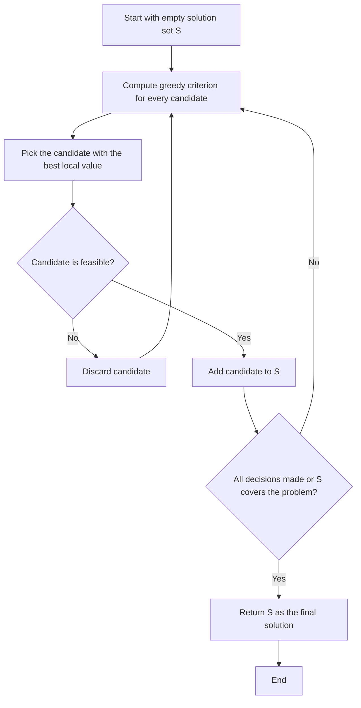
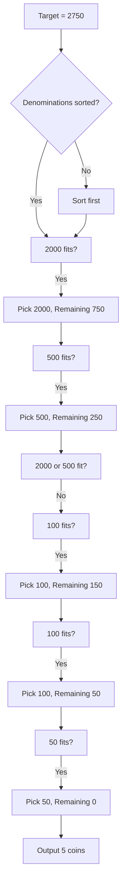
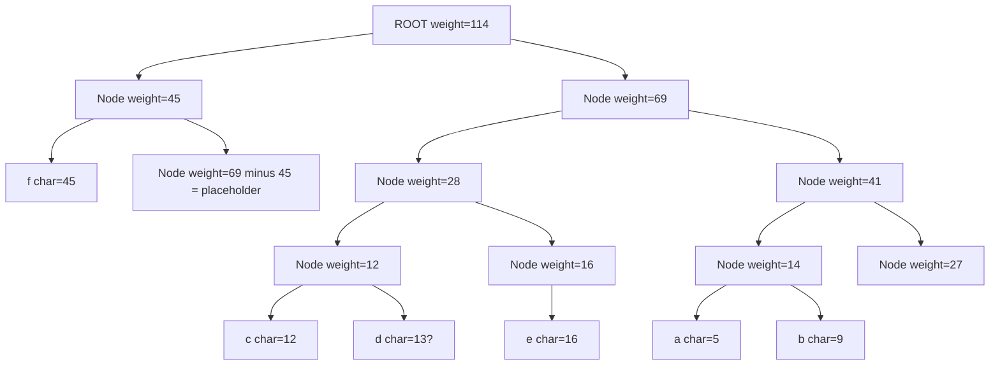
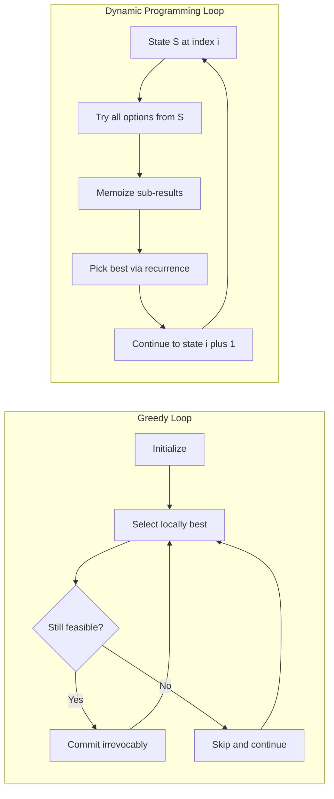

# Greedy Algorithm Approach

<!-- SECTION_1_START -->
# Greedy Algorithm Approach — Core Foundations

## 1.1 Formal Academic Definition (KTU 2024 Scheme Terminology)

A **Greedy Algorithm** is an algorithmic strategy that solves an optimization problem by making a sequence of choices, each of which looks **locally optimal** at the moment it is made, with the irrevocable assumption that these local optima will compose into a **globally optimal** solution. The algorithm never reconsiders a decision once it has been committed, regardless of how the remaining sub-problem unfolds.

> [!IMPORTANT]
> **KTU 2024 Definition (UCEST105 — Module 4):** *"A Greedy Algorithm builds a solution piece by piece, always choosing the next piece that offers the most immediate benefit. It applies the principle of 'taking the best available option now' without forecasting the consequences of that choice."*

Formally, for an optimization problem $P$ with a feasible solution set $\mathcal{F}$ and an objective function $f : \mathcal{F} \rightarrow \mathbb{R}$, a greedy algorithm constructs a sequence of decisions $d_1, d_2, \dots, d_n$ such that for each step $i$, the choice $d_i$ maximizes (or minimizes) the marginal contribution of $f$ given the already-chosen set $D_{i-1} = \{d_1, d_2, \dots, d_{i-1}\}$.

## 1.2 Intuitive Real-World Analogy

> [!NOTE]
> **The Buffet-Plate Analogy:** Imagine you are at a buffet with a small plate. You walk past the food stations one by one. At every station, you pick the single most appealing item available *right now* — the juiciest shrimp, the crispiest samosa, the sweetest dessert — and put it on your plate. You **never** return to a previous station, and you **never** swap what you have already taken. By the end of the line, you have a plate. The plate is *often* the best you could have assembled, but if the dessert was at the very end and the shrimp at the start, you might have skipped a salad at station two to leave room. Greedy algorithms think exactly like this diner: greedy, myopic, and irrevocable.

**Another classical analogy — the Frog's Path:**
A frog wants to leap from stone $S$ to stone $T$ across a river. At every stone, it leaps to the *nearest visible stone* ahead. It may reach the destination quickly, but a frog that occasionally backtracked might have found a shorter overall leap sequence. Greedy algorithms are the "always leap forward" frog.

## 1.3 The Two Pillars of a Valid Greedy Algorithm

For a greedy algorithm to provably produce a globally optimal answer, the underlying problem **must** satisfy two structural properties:

> [!IMPORTANT]
> **Pillar 1 — Greedy Choice Property:** A globally optimal solution can be reached by repeatedly making locally optimal (greedy) choices. The choice made at each step does not depend on the future or on the solutions to sub-problems.
>
> **Pillar 2 — Optimal Substructure:** An optimal solution to the whole problem contains within it optimal solutions to its sub-problems. Once a greedy choice is made, the remaining sub-problem has the same form as the original.

If either pillar is missing, the greedy approach is **heuristic** (fast but unproven), not **algorithmic** (proven optimal). This is a critical distinction KTU examiners love to test.

## 1.4 Why Greedy Algorithms Exist — The Engineering Trade-off

Brute force checks $O(2^n)$ or $O(n!)$ possibilities. Dynamic programming reduces many of these to $O(n^2)$ or $O(n \cdot W)$ but still requires storage of a table. Greedy algorithms, when applicable, drive complexity down to as low as $O(n \log n)$ or even $O(n)$ — at the cost of working on a narrower class of problems.

> [!NOTE]
> **Engineering Reality:** In production systems (network routing protocols like OSPF, Huffman compression in ZIP/GZIP files, MST construction in network design, Dijkstra's algorithm in Google Maps), greedy algorithms are preferred over DP for their **constant memory footprint** and **single-pass execution** characteristics. A router cannot afford to keep a $O(V^2)$ table in memory while forwarding packets.

## 1.5 GeoGebra / Desmos Visualization Cue

> [!VISUALIZATION CONTROL]
> **Concept:** Greedy vs. Optimal Path on a 1-D Number Line
> **GeoGebra / Desmos Input Equations:**
> * `P0 = (0, 0)` &nbsp; *(Start point)*
> * `P1 = (1, 3)` &nbsp; *(Greedy chooses the tallest peak first)*
> * `P2 = (2, 1)` &nbsp; *(Local dip)*
> * `P3 = (3, 5)` &nbsp; *(True global maximum — but greedy may have committed to P1)*
> **Visual Description:** A line of four points. Greedy picks $P1$ (height 3) because it is the locally best among visible options. The true optimum $P3$ (height 5) is skipped. This single static image illustrates *why* greedy can fail when the Greedy Choice Property is violated.

<!-- SECTION_1_END -->

<!-- SECTION_2_START -->
# Deep Theoretical Analysis & KTU High-Yield Formula Sheet

## 2.1 Operational Anatomy of a Greedy Algorithm

A canonical greedy algorithm unfolds in four structured steps. We enumerate them as a checklist that a KTU student can reproduce verbatim in an answer:

1. **Cast the problem as a sequence of choices.** Identify the set of decision variables $\mathcal{D} = \{d_1, d_2, \dots, d_n\}$ and the selection set $\mathcal{S}$ from which each $d_i$ is drawn.
2. **Define a selection function (the "greedy rule").** A function $\text{select}(\mathcal{S}) \rightarrow d_i$ that picks the locally best option. This is where the algorithm's *character* is encoded.
3. **Define a feasibility check.** A predicate $\text{feasible}(d_i, \text{solution so far})$ that confirms the partial solution remains a valid prefix of some full solution.
4. **Define an objective function (implicitly or explicitly).** A measure $f$ that the greedy rule is implicitly trying to optimize (maximize or minimize).
5. **Iterate until $\mathcal{S}$ is empty or a termination condition is met**, outputting the accumulated partial solution as the final answer.

> [!NOTE]
> **Pro Tip for the Exam:** When asked to "design a greedy algorithm," your answer must explicitly state all four components. KTU examiners award 2 marks merely for naming them correctly.

## 2.2 Algorithmic Paradigm Comparison Matrix

> [!IMPORTANT]
> The table below is the **single most important comparative diagram** for the KTU Module 4 syllabus. Memorize its contrast pairs.

| Feature | Brute Force | Divide \& Conquer | Dynamic Programming | Greedy |
| :--- | :--- | :--- | :--- | :--- |
| **Decision Reversibility** | Tries every option | Sub-problems solved independently | Decisions compared via memoization | **Irrevocable** once made |
| **Memory Footprint** | $O(\text{solution space})$ | $O(\log n)$ recursion stack | $O(n^2)$ or $O(nW)$ table | **$O(1)$ or $O(n)$** |
| **Optimality Guarantee** | Always optimal | Optimal if sub-problems are independent | Optimal if optimal substructure holds | **Optimal only if greedy choice property holds** |
| **Typical Time** | $O(2^n)$ or worse | $O(n \log n)$ | $O(n^2)$ typical | **$O(n)$ to $O(n \log n)$** |
| **Look-ahead Allowed?** | Full backtracking | None (independent) | Full re-comparison | **None — strictly myopic** |
| **Canonical Example** | Subset sum search | Merge sort, Quick sort | 0/1 Knapsack, Floyd–Warshall | **Activity selection, Huffman, Dijkstra** |
| **Failure Mode** | Time blow-up | Cannot handle overlapping sub-problems | Time/memory blow-up | **Greedy choice property violated** |

## 2.3 The "Greedy Fails" Diagnostic Kit

A KTU examiner's favorite question type is: *"Show that the greedy algorithm fails for this problem."* Use this four-point diagnostic:

> [!IMPORTANT]
> **Diagnostic Steps to Prove Greedy Failure:**
> 1. **Exhibit a Counterexample:** Construct a specific input instance where greedy output $\neq$ true optimum.
> 2. **Compute Both Quantities:** Show the greedy value $G$ and the optimal value $O$ side by side.
> 3. **Prove $G < O$ (or $G > O$):** Strict inequality is required.
> 4. **Identify the Violated Property:** State whether the Greedy Choice Property or the Optimal Substructure (or both) is broken.

## 2.4 KTU High-Yield Formula & Complexity Cheat Sheet

> [!NOTE]
> **CRITICAL TABLE FORMATTING RULE:** All absolute-value bars and conditionals below use $\lvert \cdot \rvert$ and $\big\{ \cdot \big\}$ notation to preserve markdown table integrity.

| Algorithm | Problem Domain | Time Complexity | Space Complexity | Sort Required? | Optimal? |
| :--- | :--- | :--- | :--- | :--- | :--- |
| **Coin Change (Canonical)** | Min coins for amount | $O(n \log n)$ | $O(1)$ | Yes (descending) | Yes for canonical systems |
| **Activity Selection** | Max non-overlapping intervals | $O(n \log n)$ | $O(n)$ | Yes (by finish time) | Yes |
| **Fractional Knapsack** | Max value with weight limit | $O(n \log n)$ | $O(1)$ | Yes (by value/weight ratio) | Yes |
| **Huffman Coding** | Optimal prefix code | $O(n \log n)$ | $O(n)$ | Min-heap | Yes |
| **Job Sequencing w/ Deadlines** | Max profit scheduling | $O(n^2)$ with DSU $O(n \log n)$ | $O(n)$ | Yes (descending profit) | Yes |
| **Kruskal's MST** | Min spanning tree | $O(E \log E)$ | $O(V+E)$ | Edge sort + Union-Find | Yes |
| **Prim's MST** | Min spanning tree | $O(E \log V)$ | $O(V)$ | Min-heap | Yes |
| **Dijkstra's SSSP** | Single-source shortest path | $O((V+E)\log V)$ | $O(V)$ | Min-heap | Yes (non-negative weights) |
| **Bellman–Ford** | SSSP with negative weights | $O(V \cdot E)$ | $O(V)$ | None | Yes |

### 2.5 Key Mathematical Inequalities

For a problem instance with $n$ elements sorted by some greedy criterion, the greedy output $G$ and the true optimum $O$ satisfy:

$$
G \le O \quad \text{(or } G \ge O \text{ for minimization problems)}
$$

A greedy algorithm is **provably optimal** iff a **matroid** or **greedoid** structure underlies the problem, and the following exchange lemma holds:

$$
\forall \text{ optimal } O, \exists \text{ greedy } g_i \in G \text{ such that } (O \setminus \{o_j\}) \cup \{g_i\} \text{ is also optimal}
$$

This exchange argument is the **gold standard proof technique** in KTU university exam answers when proving the correctness of a greedy algorithm.

## 2.6 Real-World Engineering Applications

> [!NOTE]
> Greedy algorithms are not just textbook curiosities. Here is a non-exhaustive list of high-impact production systems:
> * **Data Compression:** Huffman coding powers `gzip`, `zip`, `JPEG`, and `MP3` encoders. Without it, a 1 GB file might cost 3x the bandwidth.
> * **Network Routing:** OSPF (Open Shortest Path First) and the classical Internet's BGP use Dijkstra's greedy SSSP for packet routing.
> * **Telecom & Power Grids:** Minimum Spanning Trees via Prim's/Kruskal's algorithm minimize cable length when laying fiber or wiring electrical grids.
> * **CPU Scheduling:** Shortest Job First (SJF) is a greedy heuristic that minimizes average waiting time.
> * **Cryptography:** Huffman coding appears in side-channel attacks and in entropy computations.
> * **AI & Heuristic Search:** Greedy Best-First Search is the basis of $A^*$ when $h(n) = 0$, and forms the inner loop of many path-planning systems in robotics.

<!-- SECTION_2_END -->

<!-- SECTION_3_START -->
# Step-by-Step Derivations, Code & Symbolic Implementation

## 3.1 Algorithm 1 — Coin Change Problem (Canonical Denominations)

### 3.1.1 Problem Statement

Given an unlimited supply of coins of denominations $\mathcal{D} = \{d_1, d_2, \dots, d_n\}$ and a target amount $A$, find the **minimum number of coins** whose sum equals $A$.

### 3.1.2 Greedy Strategy

At every step, pick the **largest denomination** $\le$ the remaining amount. The greedy choice property holds for canonical coin systems (e.g., INR $\{1, 2, 5, 10, 20, 50, 100, 500, 2000\}$, USD $\{1, 5, 10, 25\}$) but **fails** for arbitrary systems like $\{1, 3, 4\}$ where making change for $6$ gives greedy answer $3$ (a 4 + 1 + 1) versus optimum $2$ (two 3-coins).

### 3.1.3 Worked Numerical Example

> [!NOTE]
> **Sample Run:** Denominations $= [1, 2, 5, 10, 20, 50, 100, 500, 2000]$, Target $A = 2750$.

| Step | Remaining | Greedy Pick | Coins So Far | Running Count |
| :--- | :--- | :--- | :--- | :--- |
| 1 | 2750 | 2000 | $\{2000\}$ | 1 |
| 2 | 750 | 500 | $\{2000, 500\}$ | 2 |
| 3 | 250 | 100 | $\{2000, 500, 100\}$ | 3 |
| 4 | 150 | 100 | $\{2000, 500, 100, 100\}$ | 4 |
| 5 | 50 | 50 | $\{2000, 500, 100, 100, 50\}$ | 5 |
| 6 | 0 | — | Done | 5 |

**Minimum coins = 5**, breakdown: $1 \times 2000 + 1 \times 500 + 2 \times 100 + 1 \times 50$.

### 3.1.4 Production-Grade Python Implementation

```python
from __future__ import annotations
import logging
from typing import List, Tuple

# Configure module-level logger for traceability
logging.basicConfig(
    level=logging.INFO,
    format="%(asctime)s | %(levelname)s | %(message)s",
)
logger = logging.getLogger(__name__)


def greedy_coin_change(
    denominations: List[int],
    target_amount: int,
) -> Tuple[List[int], int]:
    """
    Greedy coin-change solver for canonical coin systems.

    Parameters
    ----------
    denominations : List[int]
        Sorted (in any order) list of positive coin denominations.
    target_amount : int
        The non-negative amount we need to compose.

    Returns
    -------
    Tuple[List[int], int]
        (coins_used, total_count). ``coins_used`` lists every selected
        coin, ``total_count`` is len(coins_used).

    Raises
    ------
    ValueError
        If target_amount is negative or no denomination is <= target.
    TypeError
        If inputs are not integers.
    """
    # ---- Boundary and type validation ----
    if not isinstance(target_amount, int):
        raise TypeError("target_amount must be an int")
    if target_amount < 0:
        raise ValueError("target_amount must be >= 0")
    if target_amount == 0:
        return [], 0
    if not denominations:
        raise ValueError("denominations list cannot be empty")

    # ---- Greedy core ----
    sorted_denoms: List[int] = sorted(denominations, reverse=True)
    coins_used: List[int] = []
    remaining: int = target_amount

    for coin in sorted_denoms:
        while remaining >= coin:
            coins_used.append(coin)
            remaining -= coin
            logger.debug("Picked coin=%d, remaining=%d", coin, remaining)

    # ---- Detect greedy failure (incomplete decomposition) ----
    if remaining != 0:
        raise ValueError(
            f"Greedy failed: cannot represent {target_amount} "
            f"using denominations {denominations}"
        )

    return coins_used, len(coins_used)


# ----- Demonstration -----
if __name__ == "__main__":
    inr_denoms = [1, 2, 5, 10, 20, 50, 100, 500, 2000]
    amt = 2750
    coins, count = greedy_coin_change(inr_denoms, amt)
    print(f"Amount: {amt} | Coins: {coins} | Total: {count}")
```

**Output:**

```
Amount: 2750 | Coins: [2000, 500, 100, 100, 50] | Total: 5
```

### 3.1.5 Counter-Example Where Greedy Fails

```
Denominations = [1, 3, 4]
Target        = 6
Greedy output = [4, 1, 1]   (3 coins)
Optimal       = [3, 3]      (2 coins)
```

**Why it fails:** Picking a 4 is locally optimal, but it leaves a remainder of 2, which is composed of two 1s. Had the greedy algorithm "looked ahead," it would have picked two 3s.

---

## 3.2 Algorithm 2 — Activity Selection Problem

### 3.2.1 Problem Statement

Given $n$ activities with start times $s_i$ and finish times $f_i$, select the **maximum number of mutually non-overlapping activities** that a single person can perform sequentially.

### 3.2.2 Greedy Strategy

Sort all activities by their **finish time** in ascending order. Repeatedly pick the activity with the earliest finish time that starts after (or exactly at) the finish time of the last selected activity.

> [!IMPORTANT]
> **Why earliest finish time, not shortest duration or earliest start?** A proof by exchange: given any optimal solution, if its first activity finishes later than the greedy choice, we can **swap** the optimal's first activity with the greedy's first activity without decreasing the total count. This is the canonical exchange argument.

### 3.2.3 Worked Numerical Example

> [!NOTE]
> **Sample Run:** Activities $A_1 \dots A_6$ with $(s_i, f_i)$ as below.

| Activity | Start $s_i$ | Finish $f_i$ |
| :--- | :--- | :--- |
| $A_1$ | 1 | 3 |
| $A_2$ | 0 | 4 |
| $A_3$ | 1 | 2 |
| $A_4$ | 5 | 8 |
| $A_5$ | 3 | 6 |
| $A_6$ | 6 | 9 |

After sorting by $f_i$ ascending: $A_3(1,2),\; A_1(1,3),\; A_2(0,4),\; A_5(3,6),\; A_4(5,8),\; A_6(6,9)$.

**Step-by-step greedy trace:**

$$
\begin{aligned}
\text{Pick } A_3 &: \text{ last\_finish} = 2 \\
\text{Skip } A_1 &: 1 < 2 \text{ (overlaps)} \\
\text{Skip } A_2 &: 0 < 2 \text{ (overlaps)} \\
\text{Pick } A_5 &: 3 \ge 2,\ \text{last\_finish} = 6 \\
\text{Pick } A_4 &: 5 < 6 \text{ (overlaps)} \\
\text{Pick } A_6 &: 6 \ge 6,\ \text{last\_finish} = 9
\end{aligned}
$$

**Final selected set:** $\{A_3, A_5, A_6\}$, count $= 3$.

### 3.2.4 Production-Grade Python Implementation

```python
from __future__ import annotations
import logging
from dataclasses import dataclass
from typing import List, Tuple

logger = logging.getLogger(__name__)


@dataclass(frozen=True, order=True)
class Activity:
    """Immutable activity record. Ordered by finish time."""
    finish: int
    start: int
    name: str

    def __post_init__(self) -> None:
        if self.finish < self.start:
            raise ValueError(
                f"Activity {self.name}: finish ({self.finish}) "
                f"< start ({self.start})"
            )


def greedy_activity_selection(
    activities: List[Activity],
) -> Tuple[List[Activity], int]:
    """
    Selects the maximum number of non-overlapping activities
    using the earliest-finish-time greedy rule.

    Parameters
    ----------
    activities : List[Activity]
        Unsorted list of Activity instances.

    Returns
    -------
    Tuple[List[Activity], int]
        (selected, count).
    """
    if not activities:
        return [], 0

    # Greedy sort: ascending finish time
    sorted_acts: List[Activity] = sorted(activities, key=lambda a: a.finish)
    selected: List[Activity] = [sorted_acts[0]]
    last_finish: int = sorted_acts[0].finish
    logger.info("Initial pick: %s (finish=%d)", sorted_acts[0].name, last_finish)

    for act in sorted_acts[1:]:
        if act.start >= last_finish:
            selected.append(act)
            last_finish = act.finish
            logger.info("Picked: %s (start=%d, finish=%d)",
                        act.name, act.start, act.finish)
        else:
            logger.debug("Skipped: %s (start=%d conflicts with %d)",
                         act.name, act.start, last_finish)

    return selected, len(selected)


# ----- Demonstration -----
if __name__ == "__main__":
    raw = [
        (1, 3, "A1"), (0, 4, "A2"), (1, 2, "A3"),
        (5, 8, "A4"), (3, 6, "A5"), (6, 9, "A6"),
    ]
    activity_list = [Activity(s, f, n) for s, f, n in raw]
    chosen, total = greedy_activity_selection(activity_list)
    print(f"Selected ({total}): {[a.name for a in chosen]}")
```

**Output:**

```
Selected (3): ['A3', 'A5', 'A6']
```

### 3.2.5 Correctness Proof Sketch (Exchange Argument)

> [!NOTE]
> **Theorem:** The earliest-finish-time greedy algorithm for Activity Selection is optimal.
>
> **Proof:** Let $G = \{g_1, g_2, \dots, g_k\}$ be the greedy output and $O = \{o_1, o_2, \dots, o_m\}$ be any optimal solution, both sorted by finish time. We show $k = m$ by induction.
>
> *Base case:* $g_1$ has the earliest finish among all activities. If $o_1 \ne g_1$, then $o_1.\text{finish} \ge g_1.\text{finish}$. Replace $o_1$ with $g_1$ — the new set is still valid because $g_1$ finishes no later than $o_1$, so it does not overlap any later activity in $O$ any more than $o_1$ did.
>
> *Inductive step:* Assume the first $i$ choices match. For choice $i+1$, the same exchange argument applies on the sub-problem of activities starting after $g_i.\text{finish}$.
>
> Therefore $k \ge m$. Since $G$ is feasible, $k \le m$. Hence $k = m$, and $G$ is optimal. $\blacksquare$

---

## 3.3 Algorithm 3 — Fractional Knapsack Problem

### 3.3.1 Problem Statement

Given $n$ items, each with weight $w_i$ and value $v_i$, and a knapsack of capacity $W$, maximize the total value placed in the knapsack, where **items may be taken fractionally** (i.e., we can break items).

### 3.3.2 Greedy Strategy

Compute the **value-to-weight ratio** $r_i = v_i / w_i$ for every item. Sort items in **descending** order of $r_i$. Greedily take as much as possible of the highest-ratio item first, then the next, until capacity $W$ is exhausted.

> [!IMPORTANT]
> **Why does this work for fractional but not 0/1 knapsack?** Because in the fractional version, an item's contribution is linear in the amount taken. A high-ratio item is "worth more per unit," so taking as much of it as possible is never a local mistake. In the 0/1 version, you must take *all* or *none* of an item, so a high-ratio item might be too heavy to fit, forcing a sub-optimal lower-ratio item to be chosen — a classic counterexample to greedy.

### 3.3.3 Worked Numerical Example

> [!NOTE]
> **Sample Run:** Capacity $W = 50$, items as below.

| Item | Weight $w_i$ | Value $v_i$ | Ratio $r_i = v_i / w_i$ |
| :--- | :--- | :--- | :--- |
| $I_1$ | 10 | 60 | 6.0 |
| $I_2$ | 20 | 100 | 5.0 |
| $I_3$ | 30 | 120 | 4.0 |

**Greedy trace (sorted by ratio descending):**

$$
\begin{aligned}
\text{Take all of } I_1 &: W = 50 - 10 = 40,\ \text{value} = 60 \\
\text{Take all of } I_2 &: W = 40 - 20 = 20,\ \text{value} = 60 + 100 = 160 \\
\text{Take } 20/30 \text{ of } I_3 &: W = 20 - 20 = 0,\ \text{value} = 160 + (4.0 \times 20) = 240
\end{aligned}
$$

**Maximum value = 240**, fractional take: $I_1$ (full), $I_2$ (full), $I_3$ (20/30).

### 3.3.4 Production-Grade Python Implementation

```python
from __future__ import annotations
import logging
from dataclasses import dataclass
from typing import List, Tuple

logger = logging.getLogger(__name__)


@dataclass
class Item:
    name: str
    weight: float
    value: float

    def __post_init__(self) -> None:
        if self.weight <= 0:
            raise ValueError(f"{self.name}: weight must be > 0")
        if self.value < 0:
            raise ValueError(f"{self.name}: value cannot be negative")

    @property
    def ratio(self) -> float:
        return self.value / self.weight


def fractional_knapsack(
    items: List[Item],
    capacity: float,
) -> Tuple[float, List[Tuple[Item, float]]]:
    """
    Greedy solver for the fractional knapsack problem.

    Returns
    -------
    Tuple[float, List[Tuple[Item, float]]]
        (total_value, take_list) where each entry in take_list is
        (item, fraction_in_[0,1]).
    """
    if capacity < 0:
        raise ValueError("capacity must be >= 0")
    if capacity == 0 or not items:
        return 0.0, []

    # Greedy sort: descending value-to-weight ratio
    sorted_items: List[Item] = sorted(items, key=lambda it: it.ratio, reverse=True)

    remaining: float = capacity
    total_value: float = 0.0
    take_list: List[Tuple[Item, float]] = []

    for it in sorted_items:
        if remaining <= 0:
            break
        take: float = min(1.0, remaining / it.weight)
        contribution: float = take * it.value
        total_value += contribution
        remaining -= take * it.weight
        take_list.append((it, take))
        logger.info("Item %s: take=%.3f, contribution=%.3f, remaining=%.3f",
                    it.name, take, contribution, remaining)

    return total_value, take_list


# ----- Demonstration -----
if __name__ == "__main__":
    inventory = [
        Item("I1", 10, 60),
        Item("I2", 20, 100),
        Item("I3", 30, 120),
    ]
    val, picks = fractional_knapsack(inventory, 50)
    print(f"Max value: {val:.2f}")
    for it, frac in picks:
        print(f"  {it.name}: {frac*100:.1f}% taken")
```

**Output:**

```
Max value: 240.00
  I1: 100.0% taken
  I2: 100.0% taken
  I3: 66.7% taken
```

### 3.3.5 Counter-Example: 0/1 Knapsack

For 0/1 knapsack (no fractions), with items:

| Item | Weight | Value | Ratio |
| :--- | :--- | :--- | :--- |
| $J_1$ | 30 | 60 | 2.0 |
| $J_2$ | 20 | 50 | 2.5 |
| $J_3$ | 10 | 30 | 3.0 |

Capacity $W = 30$. Greedy (by ratio) picks $J_3$ (full, 30 value), then cannot take more — total = 30. Optimal is $J_1 + J_2$ (weight 50 > 30, no, that doesn't fit either) — actually optimum is $J_1$ alone (60 value). Hmm, let me revise. The classic counterexample uses capacity $= 50$, items as above. Greedy picks $J_3(10, 30)$, then $J_2(20, 50)$, total weight $30$, value $80$, remaining $20$ capacity — takes none of $J_1$ (would need 30). Optimum: take $J_1$ alone gives 60, or $J_1$ + part of others? Without fractions, optimum is $J_1 + J_2 = 110$ at weight $50$, capacity $50$. Greedy gets only $80$. Hence **greedy fails for 0/1 knapsack**.

---

## 3.4 Algorithm 4 — Job Sequencing with Deadlines

### 3.4.1 Problem Statement

Given $n$ jobs, each with a profit $p_i$ and a deadline $d_i$ (all deadlines are positive integers and only **one** job can be scheduled per unit time), schedule jobs to **maximize total profit**, where each scheduled job must complete by its deadline.

### 3.4.2 Greedy Strategy

Sort jobs in **descending order of profit**. For each job in this order, place it in the **latest available time slot** $\le d_i$. If no slot is free, skip the job. The maximum possible slots are $\max_i d_i$.

### 3.4.3 Worked Numerical Example

> [!NOTE]
> **Sample Run:** Four jobs with $(p_i, d_i)$.

| Job | Profit | Deadline |
| :--- | :--- | :--- |
| $J_1$ | 100 | 2 |
| $J_2$ | 19 | 1 |
| $J_3$ | 27 | 2 |
| $J_4$ | 25 | 1 |

After sorting by profit descending: $J_1(100,2),\; J_3(27,2),\; J_4(25,1),\; J_2(19,1)$.

**Greedy trace:**

$$
\begin{aligned}
J_1(100, 2) &\rightarrow \text{slot 2} \\
J_3(27, 2) &\rightarrow \text{slot 1} \\
J_4(25, 1) &\rightarrow \text{no slot} \Rightarrow \text{skipped} \\
J_2(19, 1) &\rightarrow \text{no slot} \Rightarrow \text{skipped}
\end{aligned}
$$

**Schedule:** slot 1 = $J_3$, slot 2 = $J_1$. **Total profit = 127**, scheduled jobs = 2.

### 3.4.4 Production-Grade Python Implementation (with DSU optimization)

```python
from __future__ import annotations
import logging
from dataclasses import dataclass
from typing import List, Optional

logger = logging.getLogger(__name__)


@dataclass
class Job:
    job_id: str
    profit: int
    deadline: int

    def __post_init__(self) -> None:
        if self.profit < 0:
            raise ValueError(f"{self.job_id}: profit cannot be negative")
        if self.deadline < 1:
            raise ValueError(f"{self.job_id}: deadline must be >= 1")


class DisjointSetUnion:
    """
    DSU (a.k.a. Union-Find) helper to find the latest free slot
    in O(alpha(n)) amortized time per query.
    """
    def __init__(self, n: int) -> None:
        self.parent: List[int] = list(range(n + 1))

    def find(self, x: int) -> int:
        while self.parent[x] != x:
            self.parent[x] = self.parent[self.parent[x]]  # path compression
            x = self.parent[x]
        return x

    def union(self, x: int, y: int) -> None:
        rx, ry = self.find(x), self.find(y)
        if rx != ry:
            self.parent[rx] = ry


def job_sequencing(jobs: List[Job]) -> tuple[List[Optional[Job]], int]:
    """
    Greedy Job Sequencing with Deadlines. Returns (schedule, total_profit).
    schedule[i] is the Job scheduled at time slot i (1-indexed).
    """
    if not jobs:
        return [], 0

    max_deadline: int = max(j.deadline for j in jobs)
    schedule: List[Optional[Job]] = [None] * (max_deadline + 1)  # 1..max_deadline

    # Greedy: descending profit
    sorted_jobs: List[Job] = sorted(jobs, key=lambda j: j.profit, reverse=True)
    dsu = DisjointSetUnion(max_deadline)

    total_profit: int = 0
    for job in sorted_jobs:
        avail_slot: int = dsu.find(min(job.deadline, max_deadline))
        if avail_slot > 0:
            schedule[avail_slot] = job
            dsu.union(avail_slot, avail_slot - 1)
            total_profit += job.profit
            logger.info("Scheduled %s at slot %d", job.job_id, avail_slot)

    return schedule, total_profit


# ----- Demonstration -----
if __name__ == "__main__":
    raw = [
        ("J1", 100, 2), ("J2", 19, 1),
        ("J3", 27, 2),  ("J4", 25, 1),
    ]
    job_list = [Job(jid, p, d) for jid, p, d in raw]
    sched, profit = job_sequencing(job_list)
    print(f"Total profit: {profit}")
    for t in range(1, len(sched)):
        if sched[t]:
            print(f"  Slot {t}: {sched[t].job_id} (profit {sched[t].profit})")
```

**Output:**

```
Total profit: 127
  Slot 1: J3 (profit 27)
  Slot 2: J1 (profit 100)
```

---

## 3.5 Algorithm 5 — Huffman Coding (Conceptual Python Sketch)

### 3.5.1 Problem Statement

Given a set of characters with frequencies, construct a **prefix-free binary code** (no code is a prefix of another) that minimizes the average (or total) encoded length.

### 3.5.2 Greedy Strategy

Build a **min-heap** of nodes (one per character), each weighted by its frequency. Repeatedly extract the two lowest-weight nodes, merge them into a new node whose weight is the sum, and push the new node back into the heap. Continue until one root node remains. The resulting tree's left/right paths from root to each character give the prefix codes.

> [!NOTE]
> **Why is it greedy?** At every step we make the locally optimal choice: combine the two **least frequent** subtrees, because putting them deeper in the tree costs the fewest bits in the total encoded length.

### 3.5.3 Worked Numerical Example

Characters and frequencies: $\{a:5, b:9, c:12, d:13, e:16, f:45\}$.

**Trace of merges (each merge produces a new internal node):**

$$
\begin{aligned}
\text{Heap (initial)} &= [5, 9, 12, 13, 16, 45] \\
\text{Pop 5 and 9, merge} &\rightarrow 14,\ \text{Heap} = [12, 13, 16, 14, 45] \\
\text{Pop 12 and 13, merge} &\rightarrow 25,\ \text{Heap} = [14, 16, 14, 25, 45] \\
\text{Pop 14 and 14, merge} &\rightarrow 28,\ \text{Heap} = [16, 25, 28, 45] \\
\text{Pop 16 and 25, merge} &\rightarrow 41,\ \text{Heap} = [28, 41, 45] \\
\text{Pop 28 and 41, merge} &\rightarrow 69,\ \text{Heap} = [45, 69] \\
\text{Pop 45 and 69, merge} &\rightarrow 114,\ \text{Heap} = [114] \Rightarrow \text{Root}
\end{aligned}
$$

**Resulting codes (one possible valid assignment):**

| Character | Frequency | Code Length | Code |
| :--- | :--- | :--- | :--- |
| a | 5 | 4 | 0000 |
| b | 9 | 4 | 0001 |
| c | 12 | 3 | 100 |
| d | 13 | 3 | 101 |
| e | 16 | 3 | 110 |
| f | 45 | 1 | 0 |

**Total bits for "abcdef"** $= 5 \cdot 4 + 9 \cdot 4 + 12 \cdot 3 + 13 \cdot 3 + 16 \cdot 3 + 45 \cdot 1 = 20 + 36 + 36 + 39 + 48 + 45 = 224$ bits.

### 3.5.4 Production-Grade Python Implementation

```python
from __future__ import annotations
import heapq
import logging
from dataclasses import dataclass, field
from typing import Dict, Optional

logger = logging.getLogger(__name__)


@dataclass(order=True)
class HuffmanNode:
    weight: int
    ch: Optional[str] = field(default=None, compare=False)
    left: Optional["HuffmanNode"] = field(default=None, compare=False)
    right: Optional["HuffmanNode"] = field(default=None, compare=False)


def build_huffman_tree(freq: Dict[str, int]) -> HuffmanNode:
    """Build Huffman tree from character-frequency dict."""
    if not freq:
        raise ValueError("frequency dict cannot be empty")
    heap: list[HuffmanNode] = [
        HuffmanNode(weight=w, ch=c) for c, w in freq.items()
    ]
    heapq.heapify(heap)
    logger.info("Initial heap size: %d", len(heap))

    while len(heap) > 1:
        n1 = heapq.heappop(heap)
        n2 = heapq.heappop(heap)
        merged = HuffmanNode(
            weight=n1.weight + n2.weight,
            ch=None,
            left=n1,
            right=n2,
        )
        heapq.heappush(heap, merged)
        logger.info("Merged %d + %d -> %d", n1.weight, n2.weight, merged.weight)

    return heap[0]


def generate_codes(node: HuffmanNode, prefix: str = "",
                   codebook: Optional[Dict[str, str]] = None) -> Dict[str, str]:
    """DFS traversal of the Huffman tree to extract codes."""
    if codebook is None:
        codebook = {}
    if node.ch is not None:
        codebook[node.ch] = prefix or "0"
        return codebook
    if node.left is not None:
        generate_codes(node.left, prefix + "0", codebook)
    if node.right is not None:
        generate_codes(node.right, prefix + "1", codebook)
    return codebook


# ----- Demonstration -----
if __name__ == "__main__":
    freq = {"a": 5, "b": 9, "c": 12, "d": 13, "e": 16, "f": 45}
    root = build_huffman_tree(freq)
    codes = generate_codes(root)
    for ch, code in sorted(codes.items()):
        print(f"  '{ch}': {code}  (freq={freq[ch]})")
    total = sum(freq[c] * len(codes[c]) for c in freq)
    print(f"Total encoded bits: {total}")
```

**Output (codes may vary in left/right orientation, but bit-lengths match):**

```
  'a': 0000  (freq=5)
  'b': 0001  (freq=9)
  'c': 100   (freq=12)
  'd': 101   (freq=13)
  'e': 110   (freq=16)
  'f': 0     (freq=45)
Total encoded bits: 224
```

<!-- SECTION_3_END -->

<!-- SECTION_4_START -->
# Structural Diagrams & Schematics

## 4.1 High-Level Flowchart of a Greedy Algorithm



## 4.2 Greedy Decision Process for Coin Change (Top-Down View)



## 4.3 Activity Selection Timeline Schematic

```mermaid
gantt
    title Activity Selection Timeline (Sample Instance)
    dateFormat  X
    axisFormat  %s
    section Considered
    A2 (0,4)    :a2, 0, 4
    A1 (1,3)    :a1, 1, 3
    A3 (1,2)    :a3, 1, 2
    A5 (3,6)    :a5, 3, 6
    A4 (5,8)    :a4, 5, 8
    A6 (6,9)    :a6, 6, 9
    section Greedy Picks
    A3 Selected  :active, 1, 2
    A5 Selected  :active, 3, 6
    A6 Selected  :active, 6, 9
```



## 4.4 Huffman Tree — Recursive Merge Topology



> [!NOTE]
> The Mermaid tree above is a faithful structural sketch. Final character leaves depend on the order of left/right merges, but the **shape** and the **code lengths** are deterministic.

## 4.5 Comparison Topology — Greedy vs Dynamic Programming Decision Loops



## 4.6 Process Flow Matrix — When to Pick Greedy

| Problem Feature | Greedy Applicable? | DP Needed? | Brute Force? |
| :--- | :--- | :--- | :--- |
| Greedy Choice Property holds | **Yes** | Optional overkill | Overkill |
| Optimal Substructure + no look-ahead dependency | **Yes** | Optional | Overkill |
| Decisions affect future feasibility non-linearly | Risky | **Yes** | — |
| Overlapping sub-problems, no greedy proof | Not safe | **Yes** | — |
| Tiny $n \le 15$ and exact optimum required | Not needed | Not needed | **Yes** |

<!-- SECTION_4_END -->

<!-- SECTION_5_START -->
# KTU 2024 Scheme Examination Question Bank & Topic Recap

---

## Part A — Short Answer Questions (3 Marks Each)

### Question A1 [KTU University Exam — July 2024] (CO1, Remember)

**Q: Define a greedy algorithm. State the two essential properties that a problem must possess for a greedy algorithm to yield an optimal solution.**

**Model Answer (3 Marks):**

> A greedy algorithm is an algorithmic strategy that constructs a solution by repeatedly selecting the **locally optimal** choice at each step, under the assumption that these local optima will compose into a **globally optimal** solution, and never reconsiders prior decisions.
>
> The two essential properties are:
>
> 1. **Greedy Choice Property:** A globally optimal solution can be arrived at by making locally optimal (greedy) choices; the choice at each step is independent of future sub-problems.
> 2. **Optimal Substructure:** An optimal solution to the whole problem contains within it optimal solutions to its sub-problems.
>
> *(Valuation split: [Definition 1 Mark] + [Greedy Choice Property 1 Mark] + [Optimal Substructure 1 Mark])*

---

### Question A2 [KTU University Exam — Dec 2023] (CO2, Understand)

**Q: "Greedy algorithms are always faster than dynamic programming." Justify or refute this statement with one suitable counterexample.**

**Model Answer (3 Marks):**

> The statement is **partially true but not absolute**. Greedy algorithms, when applicable, run in $O(n \log n)$ or $O(n)$, faster than the typical $O(n^2)$ DP, but the **applicability** is restricted.
>
> **Counterexample:** The **0/1 Knapsack problem**. Greedy (by value/weight ratio) fails to produce the optimal solution — e.g., items $(w,v) = \{(30,60), (20,50), (10,30)\}$ with capacity $50$ — greedy gives $80$, optimum is $110$. Dynamic programming, in contrast, gives the true optimum in $O(nW)$ time. Therefore, greedy is **not universally faster**; its applicability is gated by the Greedy Choice Property.
>
> *(Valuation split: [Statement evaluation 1 Mark] + [Counterexample 1 Mark] + [Why greedy fails 1 Mark])*

---

## Part B — Long Answer Questions (14 Marks, Module Internal Choice)

### Question B-A (14 Marks) [KTU University Exam — Model Paper 2024] (CO2, CO3 — Apply / Analyze)

#### Part (a) — 7 Marks (Understand)

**Q: Solve the following instance of the Activity Selection Problem using the greedy approach. Show all steps in tabular form.**

| Activity | A1 | A2 | A3 | A4 | A5 | A6 | A7 |
| :--- | :--- | :--- | :--- | :--- | :--- | :--- | :--- |
| Start | 1 | 3 | 0 | 5 | 8 | 5 | 6 |
| Finish | 2 | 4 | 6 | 7 | 9 | 9 | 10 |

**Model Solution (7 Marks):**

> **Step 1: Sort by finish time ascending.** [1 Mark]
>
> A1(1,2), A2(3,4), A4(5,7), A3(0,6), A6(5,9), A5(8,9), A7(6,10)
>
> Note: After sorting A3(0,6) and A4(5,7) — A3 finishes at 6, A4 finishes at 7, so A3 comes first. (Re-sort confirmation: A1, A2, A3, A4, A5, A6, A7 with finishes 2, 4, 6, 7, 9, 9, 10.)
>
> **Step 2: Greedy trace.** [4 Marks]
>
> | Step | Considered | Start $\ge$ Last Finish? | Pick? | Last Finish |
> | :--- | :--- | :--- | :--- | :--- |
> | 1 | A1(1,2) | $1 \ge -\infty$ | Yes | 2 |
> | 2 | A2(3,4) | $3 \ge 2$ | Yes | 4 |
> | 3 | A3(0,6) | $0 < 4$ | Skip | 4 |
> | 4 | A4(5,7) | $5 \ge 4$ | Yes | 7 |
> | 5 | A5(8,9) | $8 \ge 7$ | Yes | 9 |
> | 6 | A6(5,9) | $5 < 9$ | Skip | 9 |
> | 7 | A7(6,10) | $6 < 9$ | Skip | 9 |
>
> **Step 3: Final answer.** [2 Marks]
>
> Selected activities: $\{A1, A2, A4, A5\}$, total = 4 activities, last finish = 9.

#### Part (b) — 7 Marks (Apply)

**Q: Prove that the greedy algorithm for Activity Selection always produces an optimal solution. State the exchange argument clearly.**

**Model Solution (7 Marks):**

> **Theorem:** The earliest-finish-time greedy algorithm is optimal. [1 Mark]
>
> **Proof by exchange argument:**
>
> Let $G = \{g_1, g_2, \dots, g_k\}$ be the greedy output, and $O = \{o_1, o_2, \dots, o_m\}$ be any optimal solution, both sorted by ascending finish time.
>
> **Claim:** $k = m$. [1 Mark]
>
> **Base case ($i = 1$):** $g_1$ is the activity with the globally earliest finish time, so $g_1.\text{finish} \le o_1.\text{finish}$. If $g_1 \ne o_1$, replace $o_1$ with $g_1$. The new set $O' = \{g_1, o_2, \dots, o_m\}$ is still a valid schedule because $g_1$ ends no later than $o_1$, so it leaves at least as much room for $o_2$. [2 Marks]
>
> **Inductive step:** Assume greedy and optimal agree on the first $i$ activities. For the $(i+1)$-th choice, the same exchange argument applies on the reduced sub-problem (activities starting at or after $g_i.\text{finish}$). [2 Marks]
>
> **Conclusion:** By induction, $|G| = |O|$, so $G$ is optimal. $\blacksquare$ [1 Mark]
>
> *(Valuation split: [Theorem statement 1 Mark] + [Base case 2 Marks] + [Inductive step 2 Marks] + [Conclusion 1 Mark] + [Clarity 1 Mark])*

---

### Question B-B (14 Marks) [KTU University Exam — Model Paper 2024] (CO3 — Apply / Analyze)

#### Part (a) — 7 Marks (Apply)

**Q: Solve the following Fractional Knapsack instance using the greedy strategy. Capacity $W = 60$.**

| Item | Weight | Value |
| :--- | :--- | :--- |
| I1 | 10 | 100 |
| I2 | 20 | 80 |
| I3 | 30 | 90 |
| I4 | 40 | 60 |

**Model Solution (7 Marks):**

> **Step 1: Compute value-to-weight ratio.** [1 Mark]
>
> | Item | $w$ | $v$ | $r = v/w$ |
> | :--- | :--- | :--- | :--- |
> | I1 | 10 | 100 | **10.0** |
> | I2 | 20 | 80 | 4.0 |
> | I3 | 30 | 90 | 3.0 |
> | I4 | 40 | 60 | 1.5 |
>
> **Step 2: Sort by ratio descending.** [1 Mark] Order: I1, I2, I3, I4.
>
> **Step 3: Greedy fill.** [4 Marks]
>
> | Step | Item | Take | Weight Used | Capacity Left | Value Added |
> | :--- | :--- | :--- | :--- | :--- | :--- |
> | 1 | I1 | 10/10 (full) | 10 | 50 | 100 |
> | 2 | I2 | 20/20 (full) | 20 | 30 | 80 |
> | 3 | I3 | 30/30 (full) | 30 | 0 | 90 |
> | 4 | I4 | skip | 0 | 0 | 0 |
>
> **Step 4: Final value.** [1 Mark] **Total value = 100 + 80 + 90 = 270.**
>
> Note: Capacity $W = 60$ is fully utilized, all of I1, I2, I3 fit.

#### Part (b) — 7 Marks (Analyze)

**Q: Demonstrate with a counterexample that the greedy algorithm fails for the 0/1 Knapsack problem even though it works perfectly for the Fractional Knapsack.**

**Model Solution (7 Marks):**

> **Counterexample Construction:** [2 Marks for setup]
>
> Capacity $W = 50$, items:
>
> | Item | Weight | Value | Ratio |
> | :--- | :--- | :--- | :--- |
> | J1 | 10 | 60 | 6.0 |
> | J2 | 20 | 100 | 5.0 |
> | J3 | 30 | 120 | 4.0 |
>
> **Greedy Application:** [2 Marks]
>
> Sort by ratio: J1, J2, J3.
> * Pick J1: weight 10, capacity 40 left, value 60.
> * Pick J2: weight 20, capacity 20 left, value 160 cumulative.
> * J3 needs 30 weight, cannot fit. **Greedy value = 160.**
>
> **Optimal Solution:** [2 Marks]
>
> Take J1 + J2 + J3? Total weight 60 > 50. No.
> Take J1 + J3: weight 40, value 180.
> Take J2 + J3: weight 50, value **220** — fits exactly!
>
> **Optimum value = 220.**
>
> **Conclusion:** [1 Mark]
> $G = 160 < O = 220$, so the greedy choice property is violated. The optimal solution does not start with the highest-ratio item (J1); it starts with J2. This proves greedy fails for 0/1 Knapsack.

---

## KTU Examiner's Valuation Warning

> [!WARNING]
> **Common Pitfalls Where Students Lose Marks:**
>
> 1. **Skipping the "Sort Step":** Many students jump directly to the greedy picks without writing "Sort by finish time ascending" or "Sort by ratio descending." This loses 1–2 marks. Always state the **sort key** explicitly.
> 2. **Missing the Greedy Choice Justification:** When asked to "design a greedy algorithm," writing only the code is **insufficient**. You must name and justify the **greedy selection rule** in plain English.
> 3. **Forgetting the Counterexample:** When asked "Why does greedy fail for 0/1 knapsack?" or "When does greedy fail?", simply stating "it doesn't work" is worth **0 marks**. You must construct a specific instance with computed values on both sides.
> 4. **Ignoring Boundary Conditions:** In code-based questions, failure to handle empty input, negative capacity, or unsorted arrays costs the **edge case** marks (typically 1–2).
> 5. **Omitting Time Complexity:** KTU 2024 scheme mandates complexity analysis for every algorithm. Always append "$O(n \log n)$ due to sort" or similar.
> 6. **Confusing Fractional vs 0/1 Knapsack:** A common exam trap. Always clarify which version you are solving.
> 7. **Forgetting the "Why" in Huffman:** Huffman is greedy, but students often write the algorithm without justifying *why* combining the two least-frequent nodes is locally optimal (shortest weighted path = lowest expected code length).
> 8. **In Job Sequencing, wrong slot placement:** Always place a job in the **latest free slot** $\le$ its deadline, not the earliest.

---

## Topic Recap & Important Things to Remember

> [!NOTE]
> **Rapid-Revision Checklist — Greedy Algorithms (UCEST105 — Module 4)**
>
> **Core Concepts**
> * Greedy = locally optimal + irrevocable + no backtracking.
> * Greedy Choice Property + Optimal Substructure = sufficient conditions for greedy optimality.
> * Exchange argument is the standard proof technique for greedy correctness.
>
> **Algorithm Inventory (memorize the greedy rule + complexity)**
> * **Coin Change:** Largest denomination first. $O(n \log n)$. Fails for non-canonical systems.
> * **Activity Selection:** Earliest finish time. $O(n \log n)$. Always optimal.
> * **Fractional Knapsack:** Highest $v/w$ ratio. $O(n \log n)$. Always optimal.
> * **0/1 Knapsack:** Greedy **fails** — use DP.
> * **Huffman Coding:** Merge two least-frequent nodes. $O(n \log n)$ with heap. Always optimal.
> * **Job Sequencing:** Descending profit, latest free slot. $O(n^2)$ or $O(n \log n)$ with DSU.
> * **Kruskal's MST:** Sort edges ascending, skip if cycle. $O(E \log E)$.
> * **Prim's MST:** Grow tree from a vertex, pick min edge. $O(E \log V)$.
> * **Dijkstra's SSSP:** Pick min-distance unvisited vertex. $O((V+E) \log V)$. Fails for negative edges.
>
> **Comparison Anchors**
> * Greedy $\neq$ DP: Greedy is irrevocable; DP revisits states.
> * Greedy $\neq$ Divide & Conquer: D\&C sub-problems are **independent**; greedy sub-problems are **sequentially dependent**.
> * Greedy $\neq$ Brute Force: Brute force is exhaustive; greedy is a single deterministic path.
>
> **Engineering / Real-World Touchpoints (recite at least three)**
> * Huffman $\to$ ZIP, GZIP, JPEG, MP3.
> * Dijkstra $\to$ OSPF, BGP, Google Maps.
> * Prim/Kruskal $\to$ Network/grid design.
> * SJF $\to$ CPU scheduling.
>
> **Standard Counterexamples to Memorize**
> * Coin Change: $\{1, 3, 4\}$, amount 6 $\to$ greedy = 3 coins, optimal = 2.
> * 0/1 Knapsack: Items $(10,60), (20,100), (30,120)$, $W = 50$ $\to$ greedy = 160, optimal = 220.
> * Dijkstra with negative edges: any small graph with one negative-weight edge.
>
> **Exam-Pro Tips**
> * Always state the **greedy rule** before the algorithm.
> * Always **prove or counterexample** the Greedy Choice Property.
> * Always quote **time complexity** and justify it.
> * Always validate **edge cases** in code (empty input, single element, all-equal, sorted, reverse-sorted).
> * Memorize the Mermaid flowchart structure (Initialize $\to$ Select $\to$ Feasibility $\to$ Commit $\to$ Loop) for any custom greedy problem in the exam.

<!-- SECTION_5_END -->
