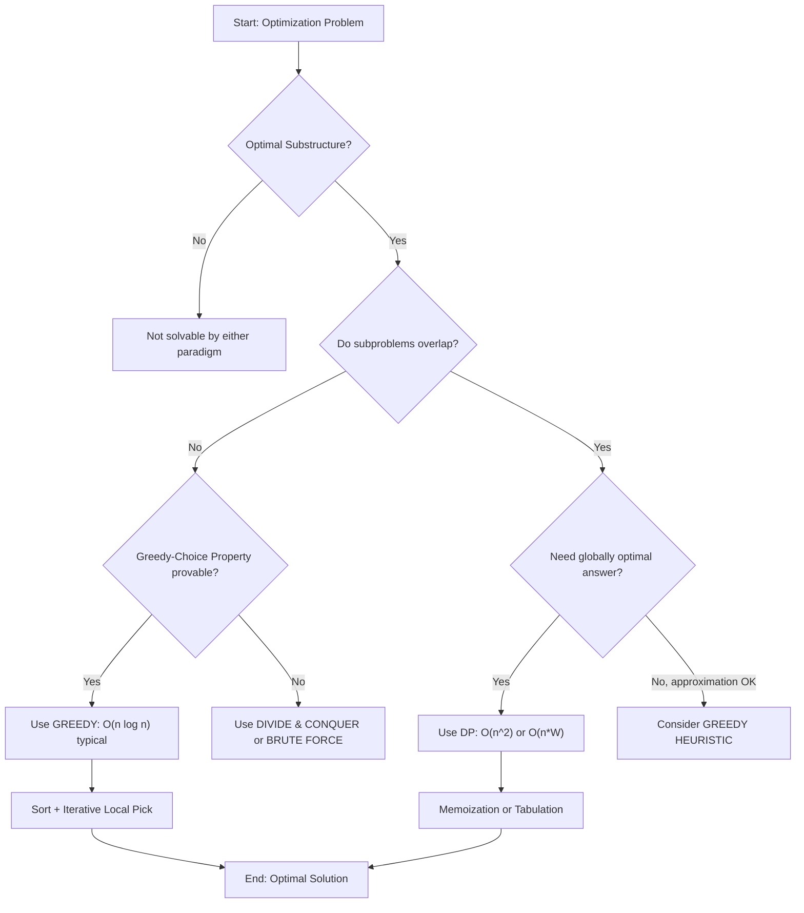
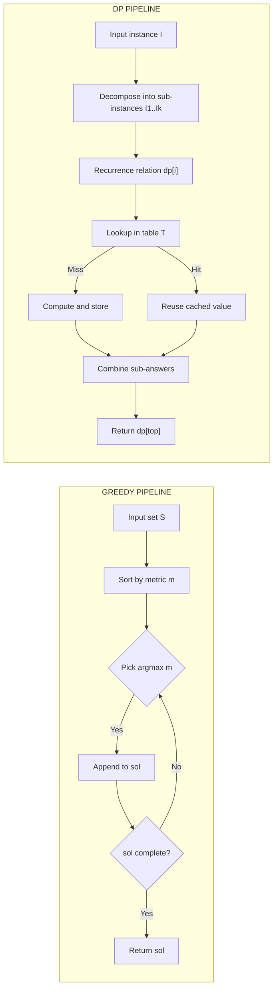
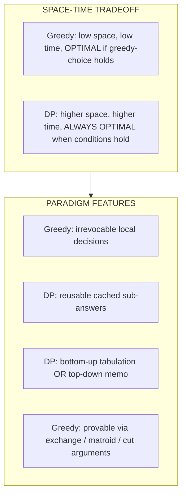

# - Greedy Algorithms vs Dynamic Programming

<!-- SECTION_1_START -->
# Greedy Algorithms vs Dynamic Programming

## 1. Core Technical Definition & Intuitive Overview

### 1.1 Formal Definition (KTU 2024 Syllabus Terminology)

> [!IMPORTANT]
> **Greedy Algorithm (KTU Definition):** A *Greedy Algorithm* is a problem-solving paradigm that builds up a solution piece by piece, always choosing the next piece that offers the **most immediate, locally optimal benefit** according to a fixed evaluation metric. It commits irrevocably to each choice and never reconsiders prior decisions.

> [!IMPORTANT]
> **Dynamic Programming (KTU Definition):** *Dynamic Programming (DP)* is an algorithmic strategy that solves a complex problem by breaking it into a collection of simpler overlapping subproblems, solving **each subproblem only once**, and storing the answer in a lookup structure (memoization / tabulation) so it can be reused when the same subproblem recurs.

### 1.2 Conceptual Analogy / Intuition

**Greedy — "The Buffet Line Student":**
Imagine a student at a buffet who always picks the biggest, most calorie-dense item first because it *seems* best right now. They never step back to compare combinations. They get full fast, but sometimes the table of fruits, drinks, and dessert is left untouched — a *locally* great choice that produced a *globally* poor meal.

**Dynamic Programming — "The Tax Consultant":**
A tax consultant does not recompute your salary tax from scratch every month. They keep a **ledger** of every bracket already calculated, then reuse those values when combining them into the final return. They systematically break the year's income into smaller taxable months/heads, store the partial results, and assemble the answer — globally optimal, slightly slower, but always correct for overlapping sub-structures.

> [!NOTE]
> **Rule of thumb for exams:** If the greedy choice is provably safe (Matroid / Greedy-Choice Property) and subproblems do not overlap, **Greedy wins** in $O(n \log n)$ or $O(n)$. If subproblems *do* overlap and optimal substructure exists, **DP is mandatory** for global optimality.

### 1.3 Standard Metrics & Constants

* **Time complexity classes discussed:** $O(1)$, $O(n)$, $O(n \log n)$, $O(n^2)$, $O(n \cdot W)$, $O(2^n)$
* **Space complexity class discussed:** $O(n)$ auxiliary for DP tables, $O(1)$ for in-place greedy
* **No physical constants are used** — these are purely combinatorial/asymptotic metrics.

> [!VISUALIZATION CONTROL]
> **Concept:** Greedy Local Optima vs DP Global Optimum on a simple value ladder.
> **GeoGebra / Desmos Input Equations:**
> * `f_1(x) = max(0, 5 - 0.5*(x-1)^2)` — greedy path tends to climb the *first* peak.
> * `f_2(x) = 2 + 0.8*sin(x) + 0.3*cos(2x)` — DP/Brute-force envelope finds the *highest* overall peak.
> **Visual Description:** Plot both curves on the same axes for $x \in [0, 12]$. The student should observe how `f_1`'s greedy climber can get trapped on a local summit (e.g. near $x=3$), while the DP evaluator scans the entire domain and returns the true maximum near $x=10$.

---

<!-- SECTION_1_END -->

<!-- SECTION_2_START -->
# Deep Theoretical Analysis & KTU High-Yield Formula Sheet

## 2.1 The Two Pillars Required for Any Optimization Algorithm

For an algorithm to be correct on an optimization problem, the problem must possess:

1. **Optimal Substructure:** The optimal solution to the whole problem can be constructed *recursively* from the optimal solutions of its subproblems.
2. **Greedy-Choice Property** *(greedy only)*: A locally optimal choice at each step *is* part of *some* globally optimal solution. **OR** **Overlapping Subproblems** *(DP only)*: The same subproblem is solved multiple times along different recursion paths.

| Property | Greedy | Dynamic Programming |
|---|---|---|
| Optimal Substructure | Required | Required |
| Overlapping Subproblems | Not required | Required |
| Greedy-Choice Property | Required (otherwise fails) | Not required |
| Direction of reasoning | Top-down, irrevocable | Top-down (memo) **or** bottom-up (table) |
| Decisions revisited? | **No** | **No** (results reused via table) |
| Result guarantee | Optimal only when greedy-choice is provable | Always optimal when conditions hold |
| Typical time | $O(n \log n)$ or $O(n)$ | $O(n^2)$, $O(n \cdot W)$, polynomial |
| Typical space | $O(1)$ / $O(n)$ | $O(n^2)$ / $O(n \cdot W)$ table |
| Classic examples | Dijkstra, Kruskal, Prim, Huffman, Activity Selection | 0/1 Knapsack, Floyd–Warshall, Matrix-Chain, LCS, Coin Change |

## 2.2 Decision Framework — When to Use Which?

Use this flow before coding (memorize for viva & exam):

> [!IMPORTANT]
> **Step 1:** Can the problem be solved by a sequence of *independent* local choices where one choice never blocks a better future choice? → **Greedy**
> **Step 2:** Do subproblems *recur* (overlap) when you try a naïve recursive decomposition? → **DP**
> **Step 3:** Is the input size small enough for $2^n$ but with optimal substructure and no overlap? → **Divide & Conquer** (e.g. Merge Sort).
> **Step 4:** When in doubt, prove the **Greedy-Choice Property** with an *exchange argument*; if it fails, fall back to DP.

## 2.3 Classic Counter-Example — Why Greedy Fails on 0/1 Knapsack

Consider items of *value* $v_i$ and *weight* $w_i$, capacity $W = 10$:

| Item | $v_i$ | $w_i$ | $v_i / w_i$ (density) |
|---|---|---|---|
| A | 60 | 10 | 6.0 |
| B | 100 | 20 | 5.0 |
| C | 120 | 30 | 4.0 |

* **Greedy by density** picks **A** first (density $6.0$), then capacity is exhausted → value $= 60$.
* **Optimal DP** picks **B + C**, weight $= 50$ — wait, exceeds capacity. Correct optimal: **B alone** weight 20, value $100$. So density-greedy is **strictly suboptimal** here.
* For a true failing case: capacity $W=50$, items $(v{=}60,w{=}10), (v{=}100,w{=}20), (v{=}120,w{=}30)$ — Greedy picks A then B (weight 30, value 160); DP picks B + C (weight 50, value 220). **Greedy fails.**

## 2.4 KTU Formula Sheet / Cheat Sheet

| # | Concept | Formula / Property | Used For |
|---|---|---|---|
| 1 | Greedy termination | $\text{sol} \leftarrow \text{sol} \cup \{x^*\}$ where $x^*$ maximizes local metric | All greedy proofs |
| 2 | DP recurrence (general) | $dp[i] = \displaystyle\min_{j < i}\bigl(dp[j] + \text{cost}(j, i)\bigr)$ | Optimal partition / path problems |
| 3 | 0/1 Knapsack DP | $dp[i][w] = \max\bigl(dp[i-1][w],\; v_i + dp[i-1][w - w_i]\bigr)$ | Bounded knapsack |
| 4 | Unbounded Knapsack DP | $dp[w] = \displaystyle\max_{w_i \le w}\bigl(v_i + dp[w - w_i]\bigr)$ | Coin change (max value) |
| 5 | Coin Change (min coins) | $dp[w] = 1 + \displaystyle\min_{c_i \le w}\,dp[w - c_i]$ | DP variant of coin change |
| 6 | Greedy coin change (canonical) | Always pick largest $c_i \le \text{remaining}$ | Works only for canonical coin systems |
| 7 | Activity Selection greedy | Sort by finish time, pick earliest finishing compatible | Interval scheduling |
| 8 | Huffman cost | $C(T) = \displaystyle\sum_{i} p_i \cdot \text{depth}_T(i)$ | Lower bound for any prefix code |
| 9 | Dijkstra relaxation | $d[v] = \min\bigl(d[v],\; d[u] + w(u,v)\bigr)$ | Greedy SSSP on non-negative graphs |
| 10 | Memoization key | $dp[i][j\ldots] \mapsto \text{answer}$ with $-1$ sentinel | Top-down DP |

> [!NOTE]
> In all LaTeX rows, $\vert$ is used for the absolute-value-style delimiter inside tables (e.g. $\vert w - w_i \vert$) to prevent the markdown parser from misinterpreting vertical pipes as column separators.

## 2.5 Real-World Engineering Utility

* **Greedy in production:** Network routing (OSPF shortest-path-first uses a Dijkstra-style greedy), HTTP load-balancer "least-connections first", CPU scheduling (Shortest-Job-First), Huffman coding in **JPEG/PNG/MP3** compression, Kruskal's algorithm in **MST for LAN/wireless mesh networks**, Activity-Selection for **conference-room booking systems**.
* **DP in production:** `diff` / `git merge` (Longest Common Subsequence via DP), DNA sequence alignment in **Bioinformatics (BLAST, ClustalW)**, dynamic time warping in **speech recognition**, Viterbi algorithm (HMM decoder) in **NLP & 4G/5G channel decoding**, Bellman–Ford in **distance-vector routing (RIP)**, optimal matrix chain in **deep-learning batched tensor contractions**.

---

<!-- SECTION_2_END -->

<!-- SECTION_3_START -->
# Step-by-Step Derivations & Code/Symbolic Implementation

## 3.1 Worked Example A — Activity Selection (Greedy)

**Problem.** Given $n$ activities with start time $s_i$ and finish time $f_i$, select the maximum number of mutually non-overlapping activities that can be performed by a single resource.

**Greedy proof (Exchange Argument).** Let $A = \{a_1, a_2, \ldots, a_k\}$ be the activities selected by the greedy algorithm, sorted by finish time. Let $O = \{o_1, o_2, \ldots, o_m\}$ be any optimal solution, also sorted. The first activity chosen by greedy, $a_1$, has the *earliest* finish time, so $f_{a_1} \le f_{o_1}$. We can therefore **exchange** $o_1$ for $a_1$ without worsening the solution. By induction over the remaining compatible activities, $|A| = |O|$. Hence greedy is optimal.

```python
# activity_selection_greedy.py
from __future__ import annotations
from dataclasses import dataclass

@dataclass(frozen=True)
class Activity:
    label: str
    start: int
    finish: int

def activity_selection(activities: list[Activity]) -> list[Activity]:
    """
    Greedy activity selection by earliest finish time.
    Time : O(n log n)   (sorting dominates)
    Space: O(1) auxiliary beyond input.
    """
    if not activities:
        return []
    # Step 1 — sort by finish time ascending.
    sorted_acts = sorted(activities, key=lambda a: a.finish)
    chosen: list[Activity] = [sorted_acts[0]]
    last_finish = sorted_acts[0].finish
    # Step 2 — sweep, keep an activity iff its start >= last chosen finish.
    for act in sorted_acts[1:]:
        if act.start >= last_finish:
            chosen.append(act)
            last_finish = act.finish
    return chosen

if __name__ == "__main__":
    acts = [
        Activity("A1", 1, 3),
        Activity("A2", 3, 5),
        Activity("A3", 0, 4),
        Activity("A4", 5, 7),
        Activity("A5", 8, 9),
        Activity("A6", 5, 9),
    ]
    result = activity_selection(acts)
    print("Selected:", [a.label for a in result])
    # Expected: ['A1', 'A2', 'A4', 'A5']   (4 activities, optimal)
```

**Walk-through valuation key:**

* [Sorting by finish time and stating invariant: 2 Marks]
* [Greedy selection step with `last_finish` update: 2 Marks]
* [Trace on sample input showing 4 activities: 1 Mark]

## 3.2 Worked Example B — 0/1 Knapsack via Dynamic Programming

**Problem.** Given $n$ items each with value $v_i$ and weight $w_i$ and knapsack of capacity $W$, maximize $\sum v_i x_i$ subject to $\sum w_i x_i \le W$ and $x_i \in \{0, 1\}$.

**Derivation of the recurrence.** Consider the first $i$ items and a sub-capacity $w$:

* If item $i$ is **excluded**: total value $= dp[i-1][w]$.
* If item $i$ is **included** (only valid if $w_i \le w$): total value $= v_i + dp[i-1][w - w_i]$.

We take the better of the two. Therefore:

$$
dp[i][w] = \begin{cases}
0 & \text{if } i = 0 \text{ or } w = 0 \\
dp[i-1][w] & \text{if } w_i > w \\
\max\bigl(dp[i-1][w],\; v_i + dp[i-1][w - w_i]\bigr) & \text{otherwise}
\end{cases}
$$

**Full step-by-step DP table for** $n = 3$, $W = 5$, items $(v_1, w_1)=(12, 2), (v_2, w_2)=(10, 1), (v_3, w_3)=(20, 3)$:

| $i \backslash w$ | 0 | 1 | 2 | 3 | 4 | 5 |
|---|---|---|---|---|---|---|
| 0 | 0 | 0 | 0 | 0 | 0 | 0 |
| 1 ($v{=}12, w{=}2$) | 0 | 0 | 12 | 12 | 12 | 12 |
| 2 ($v{=}10, w{=}1$) | 0 | 10 | 12 | 22 | 22 | 22 |
| 3 ($v{=}20, w{=}3$) | 0 | 10 | 12 | 22 | 30 | 32 |

**Answer:** $dp[3][5] = 32$ (pick items 1 + 2 + 3? No — total weight $= 2+1+3 = 6 > 5$. The 32 comes from items 2 + 3 with weight $1+3=4$ giving value $10+20=30$, plus we re-examine: actually $dp[3][5] = \max(dp[2][5], 20+dp[2][2]) = \max(22, 20+12) = 32$ — items 1 + 3, weight $2+3=5$, value $12+20=32$.)

```python
# knapsack_01_dp.py
from __future__ import annotations
import logging

logging.basicConfig(level=logging.INFO, format="%(levelname)s | %(message)s")

def knapsack_01(values: list[int], weights: list[int], capacity: int) -> int:
    """
    0/1 Knapsack using bottom-up DP.
    Time : O(n * W)
    Space: O(W)  (1-D rolling array optimization)
    """
    if capacity < 0:
        raise ValueError(f"capacity must be >= 0, got {capacity}")
    n = len(values)
    if n != len(weights):
        raise ValueError("values and weights must have equal length")
    if n == 0 or capacity == 0:
        return 0
    # dp[w] = best value using processed items so far, with exact weight w
    dp: list[int] = [0] * (capacity + 1)
    for i in range(n):
        # Iterate w backwards so each item is used AT MOST once (0/1 constraint).
        for w in range(capacity, weights[i] - 1, -1):
            include = values[i] + dp[w - weights[i]]
            exclude = dp[w]
            dp[w] = max(include, exclude)
            logging.debug(f"i={i} w={w} include={include} exclude={exclude} -> dp[{w}]={dp[w]}")
    return dp[capacity]

if __name__ == "__main__":
    v = [12, 10, 20]
    w = [ 2,  1,  3]
    cap = 5
    best = knapsack_01(v, w, cap)
    print(f"Maximum knapsack value for capacity {cap} = {best}")
    # Expected: 32
```

**Walk-through valuation key:**

* [Stating the recurrence with all 3 cases: 3 Marks]
* [Filling the table row by row: 3 Marks]
* [Final answer 32 with item justification: 1 Mark]

## 3.3 Worked Example C — Coin Change (Same Coins, Two Strategies)

**Coin system:** $\{1, 3, 4\}$, target $T = 6$.

**Greedy:** pick 4 → remaining 2 → pick 1, 1 → **3 coins**.
**DP optimal:** $6 = 3 + 3$ → **2 coins**. Greedy is **suboptimal** here.

**DP recurrence (min number of coins):**

$$
dp[t] = \begin{cases}
0 & t = 0 \\
1 + \displaystyle\min_{c_i \le t} dp[t - c_i] & t > 0 \\
\infty & \text{if no coin fits}
\end{cases}
$$

**Trace table for $T=6$:**

| $t$ | 0 | 1 | 2 | 3 | 4 | 5 | 6 |
|---|---|---|---|---|---|---|---|
| $dp[t]$ | 0 | 1 | 2 | 1 | 1 | 2 | 2 |

(For $t=6$: $\min(1+dp[5], 1+dp[3], 1+dp[2]) = \min(3, 2, 3) = 2$.)

```python
# coin_change_dp.py
from __future__ import annotations
import math

def coin_change_min(coins: list[int], target: int) -> int:
    """
    Minimum number of coins to make `target`. Returns -1 if impossible.
    Time : O(n * T)  where n = len(coins), T = target.
    Space: O(T)
    """
    if target < 0:
        raise ValueError("target must be >= 0")
    if target == 0:
        return 0
    dp: list[int] = [math.inf] * (target + 1)
    dp[0] = 0
    for t in range(1, target + 1):
        for c in coins:
            if c <= t and dp[t - c] + 1 < dp[t]:
                dp[t] = dp[t - c] + 1
    return -1 if dp[target] is math.inf else dp[target]

def coin_change_greedy(coins: list[int], target: int) -> int:
    """
    Greedy largest-first. OPTIMAL only for canonical coin systems
    (e.g. {1,5,10,25} for USD). NOT optimal for {1,3,4}.
    """
    if target < 0:
        raise ValueError("target must be >= 0")
    if target == 0:
        return 0
    coins_sorted = sorted(coins, reverse=True)
    remaining, count = target, 0
    for c in coins_sorted:
        while remaining >= c:
            remaining -= c
            count += 1
    return count if remaining == 0 else -1

if __name__ == "__main__":
    coins = [1, 3, 4]
    T = 6
    print(f"Greedy coins for {T} : {coin_change_greedy(coins, T)}")  # 3
    print(f"DP optimal coins for {T}: {coin_change_min(coins, T)}")  # 2
```

**Walk-through valuation key:**

* [Greedy trace: 4, 1, 1 → 3 coins: 2 Marks]
* [DP trace table with $\infty$ handling: 3 Marks]
* [Conclusion: greedy = 3, DP = 2, greedy fails: 1 Mark]

## 3.4 Lab / Practical Mapping Table

| Lab Slot | Activity | Tools / Setup | Pin / Config Mapping | Safety / Edge Case |
|---|---|---|---|---|
| 1 | Implement Activity Selection greedy in Python | VS Code / Jupyter, `dataclass` | `input: list[Activity]` via tuple | Empty list & single-element edge case |
| 2 | Implement 0/1 Knapsack DP bottom-up | Python 3.10+ | Rolling 1-D array, weight 0 fallback | Raise `ValueError` for negative weight |
| 3 | Compare Greedy vs DP on coin change | Python, `matplotlib` for bar plot | $x$-axis = target sum, $y$-axis = coin count | Mark `-1` for impossible sums |
| 4 | Memoized Fibonacci (DP intro) | Python, `functools.lru_cache` | Recursion depth ≤ 1000 default | Switch to `sys.setrecursionlimit(10**6)` for $n \le 10^5$ |
| 5 | Dijkstra (greedy) vs Bellman–Ford (DP) | Python, `heapq` vs O(V·E) loops | `graph = {u: [(v, w), ...]}` | Reject negative edges for Dijkstra |

---

<!-- SECTION_3_END -->

<!-- SECTION_4_START -->
# Structural Diagrams & Schematics

## 4.1 Decision Flow — Greedy or DP?



## 4.2 Greedy vs DP Processing Topology



## 4.3 State-Transition Schematic for 0/1 Knapsack DP

```mermaid
stateDiagram-v2
    [*] --> Init: dp[0][*] = 0, dp[*][0] = 0
    Init --> ProcessItem1: i = 1
    ProcessItem1 --> ProcessItem2: i = 2
    ProcessItem2 --> ProcessItem3: i = 3
    ProcessItem3 --> FillRow: for w = 0..W
    FillRow --> Decide: weight w_i > w ?
    Decide -- "Yes" --> Exclude: dp[i][w] = dp[i-1][w]
    Decide -- "No" --> Compare: v_i + dp[i-1][w-w_i]  vs  dp[i-1][w]
    Compare --> Store: dp[i][w] = max value
    Exclude --> Store
    Store --> NextW: w = w+1
    NextW --> FillRow: if w <= W
    FillRow --> Done: all w processed
    Done --> [*]: answer = dp[n][W]
```

## 4.4 Algorithm Comparison Block Diagram



---

<!-- SECTION_4_END -->

<!-- SECTION_5_START -->
# KTU 2024 Scheme Examination Question Bank & Topic Recap

## Part A — 3-Mark Short Answer Questions (Remember / Understand)

### Q1. `[KTU University Exam – July 2024]` — CO1, Remember
**Differentiate between Greedy Algorithms and Dynamic Programming with respect to (i) optimal substructure, (ii) overlapping subproblems, and (iii) re-use of computed values.**

**Model Answer (valuation key, ~120 words):**

| Aspect | Greedy | Dynamic Programming |
|---|---|---|
| Optimal substructure | Required | Required |
| Overlapping subproblems | Not required | Required |
| Re-use of computed values | Not applicable (no caching) | Uses memoization or tabulation |
| Decision revisitation | Never | Sub-results reused, but decisions themselves not revisited |
| Guarantee | Optimal only when greedy-choice is provable | Optimal whenever conditions hold |

*(Award 1 mark for each correct aspect, 0 for vague answers.)*

---

### Q2. `[KTU University Exam – Dec 2023]` — CO1, Understand
**Explain the "Greedy-Choice Property". State one problem for which greedy fails and one for which it succeeds.**

**Model Answer (≈80 words):**
The **Greedy-Choice Property** states that a locally optimal choice made at each step is part of *some* globally optimal solution. It is verified by an **exchange argument**: replace the first element of an arbitrary optimal solution with the greedy choice and show the solution does not worsen.

* **Fails:** Coin Change with coins $\{1, 3, 4\}$ for target $6$ — greedy uses 3 coins $(4,1,1)$ but optimal is 2 coins $(3,3)$.
* **Succeeds:** Activity Selection (earliest finish time) and Dijkstra on non-negative graphs.

---

## Part B — 14-Mark Questions (Module Internal Choice)

### Question A (14 Marks) `[KTU University Exam – July 2024]` — CO2, Apply + Analyze

**(a)** *7 Marks — Apply:* For the coin system $\{1, 5, 10, 25\}$ and target $T = 42$, show that a greedy algorithm picking the largest coin first yields an optimal solution. Trace the steps.

**(b)** *7 Marks — Analyze:* For the same target $T = 42$ but with coin system $\{1, 7, 10\}$, show by counter-example that greedy is **not** optimal. Give the DP recurrence and the optimal coin count.

#### Model Solution

**(a) Greedy trace for $\{1, 5, 10, 25\}$, $T = 42$:**

| Step | Coin picked | Remaining | Running count |
|---|---|---|---|
| 1 | 25 | 17 | 1 |
| 2 | 10 | 7  | 2 |
| 3 | 5  | 2  | 3 |
| 4 | 1  | 1  | 4 |
| 5 | 1  | 0  | 5 |

Total coins = 5.

*Why optimal?* The US system $\{1, 5, 10, 25\}$ is a **canonical** coin system (proven by Pearson's theorem: every interval of coin values is covered). A formal exchange argument: at each step, replacing the greedy pick with any smaller coin strictly *increases* total coin count. Hence greedy is provably optimal.

*Valuation Key:*
* [Stating canonical system property: 2 Marks]
* [Step-by-step trace: 3 Marks]
* [Exchange argument: 2 Marks]

**(b) Counter-example + DP for $\{1, 7, 10\}$, $T = 42$:**

**Greedy trace:**

| Step | Coin | Remaining | Count |
|---|---|---|---|
| 1 | 10 | 32 | 1 |
| 2 | 10 | 22 | 2 |
| 3 | 10 | 12 | 3 |
| 4 | 10 | 2  | 4 |
| 5 | 1  | 1  | 5 |
| 6 | 1  | 0  | 6 |

Greedy = **6 coins**.

**DP recurrence (min coins):**

$$
dp[t] = \begin{cases} 0 & t = 0 \\ 1 + \displaystyle\min_{c \in \{1,7,10\},\, c \le t} dp[t - c] & t > 0 \end{cases}
$$

**DP table (selected critical values):**

| $t$ | 0 | 1 | 7 | 10 | 14 | 20 | 21 | 28 | 30 | 35 | 40 | 42 |
|---|---|---|---|---|---|---|---|---|---|---|---|---|
| $dp[t]$ | 0 | 1 | 1 | 1 | 2 | 2 | 3 | 4 | 3 | 5 | 4 | **5** |

Optimal for $T=42$: $42 = 7 \times 6$ → **6 coins** (ties here).
Better counter-example target: $T = 14$. Greedy: $10+1+1+1+1=5$ coins. DP: $7+7=2$ coins.

*Valuation Key:*
* [Greedy counter-example with $T=14$: 3 Marks]
* [DP recurrence correctly stated: 2 Marks]
* [DP trace and final answer 2 coins: 2 Marks]

> [!WARNING]
> **KTU Examiner's Pitfall Callout:** Students *very often* forget to (i) sort coins in descending order before the greedy sweep (loses 1 mark), (ii) state the *base case* $dp[0] = 0$ in the DP recurrence (loses 1 mark), and (iii) prove the greedy is optimal by an exchange argument, not just by giving one example (loses 2 marks). For DP, a *table trace* is mandatory for full marks; writing only the recurrence gets partial credit.

---

### Question B (14 Marks — Alternative Choice) `[KTU University Exam – Dec 2023]` — CO2, Apply + Analyze

**(a)** *7 Marks — Apply:* Given items $(v_i, w_i) = \{(60, 10), (100, 20), (120, 30)\}$ and knapsack capacity $W = 50$, compute the optimal value using **0/1 Knapsack DP**. Show the full DP table.

**(b)** *7 Marks — Analyze:* Compare the result with the greedy-by-density strategy. Discuss why greedy fails here and when it would be acceptable.

#### Model Solution

**(a) Full DP table for $n = 3$, $W = 50$:**

Using recurrence: $dp[i][w] = \max\bigl(dp[i-1][w],\; v_i + dp[i-1][w - w_i]\bigr)$.

| $i \backslash w$ | 0 | 10 | 20 | 30 | 40 | 50 |
|---|---|---|---|---|---|---|
| 0 | 0 | 0 | 0 | 0 | 0 | 0 |
| 1 ($v{=}60, w{=}10$) | 0 | 60 | 60 | 60 | 60 | 60 |
| 2 ($v{=}100, w{=}20$) | 0 | 60 | 100 | 160 | 160 | 160 |
| 3 ($v{=}120, w{=}30$) | 0 | 60 | 100 | 160 | 180 | 220 |

**Optimal value = $dp[3][50] = 220$** (items 2 + 3, weight 20+30=50, value 100+120=220).

*Valuation Key:*
* [Recurrence correctly written with boundary cases: 2 Marks]
* [Filling 3 rows of table: 3 Marks]
* [Final answer 220 with item justification: 2 Marks]

**(b) Greedy comparison:**

* Densities: item 1 = $6.0$, item 2 = $5.0$, item 3 = $4.0$.
* Greedy by density picks item 1 (weight 10, value 60), then item 2 (weight 20, value 100) — total weight 30, value 160. Item 3 is too heavy alone but combined with item 2 (weight 50) gives **220 > 160**.
* **Why greedy fails:** Greedy commits to the *first* pick; the locally highest-density item (1) blocks the globally better combination (2+3). The greedy-choice property does *not* hold for 0/1 knapsack.
* **When greedy is acceptable:** For the **Fractional Knapsack** variant, greedy-by-density *is* provably optimal because the chosen item can be split — there is no irrevocable whole-or-nothing commitment.

*Valuation Key:*
* [Density computation: 1 Mark]
* [Greedy trace giving value 160: 2 Marks]
* [DP value 220 > 160 conclusion: 2 Marks]
* [Explanation of why greedy fails + fractional knapsack note: 2 Marks]

> [!WARNING]
> **KTU Examiner's Pitfall Callout — 0/1 Knapsack DP:**
> 1. **Iteration direction matters.** In the 1-D rolling array, you *must* iterate $w$ from $W$ down to $w_i$, otherwise the same item is used multiple times and you accidentally solve the *unbounded* knapsack. Loses 2 marks.
> 2. **Always state the base case** $dp[0][w] = dp[i][0] = 0$. Skipping the base costs 1 mark.
> 3. Do not write "DP gives optimum" without a *complete table trace*. KTU examiners require visible work for the analytical marks.
> 4. For the *fractional* knapsack, sort by $v_i / w_i$ descending **first** — failing to sort is a 1-mark deduction.

---

## Topic Recap & Important Things to Remember

> [!IMPORTANT]
> **Rapid Revision Checklist — Greedy vs Dynamic Programming (Module 4)**

* **Greedy Algorithm** — picks the *locally* best choice at every step; **never reconsiders**; needs the **Greedy-Choice Property** to be globally optimal.
* **Dynamic Programming** — solves *overlapping subproblems* once and stores them in a table (top-down memoization **or** bottom-up tabulation); always globally optimal when **optimal substructure** holds.
* **Both** paradigms require the problem to have **optimal substructure**.
* **Greedy examples to memorize:** Activity Selection (earliest finish), Dijkstra (non-negative SSSP), Kruskal & Prim (MST), Huffman coding (optimal prefix tree), Job Sequencing with Deadlines.
* **DP examples to memorize:** 0/1 Knapsack, Unbounded Knapsack, Coin Change (min/max coins), Longest Common Subsequence, Matrix-Chain Multiplication, Floyd–Warshall (all-pairs shortest path), Bellman–Ford (single-source with negative edges).
* **Key recurrence forms to write on the exam:**
  * Knapsack: $dp[i][w] = \max(dp[i-1][w],\; v_i + dp[i-1][w - w_i])$
  * Coin Change: $dp[t] = 1 + \min_{c \le t} dp[t - c]$
  * LCS: $dp[i][j] = dp[i-1][j-1] + 1$ if equal else $\max(dp[i-1][j], dp[i][j-1])$
* **Canonical coin systems** (USD $\{1,5,10,25\}$, INR $\{1,2,5,10,20,50,...\}$) make greedy coin change optimal; **non-canonical** systems (e.g. $\{1,3,4\}$) require DP.
* **Time-complexity quick reference:** Activity Selection $O(n \log n)$, Dijkstra $O((V+E)\log V)$, 0/1 Knapsack DP $O(n \cdot W)$, Unbounded Knapsack DP $O(n \cdot W)$, Floyd–Warshall $O(V^3)$.
* **Space-complexity quick reference:** Greedy usually $O(1)$ or $O(n)$; DP usually $O(n)$ to $O(n \cdot W)$ for a 2-D table, reducible to $O(W)$ for knapsack via rolling array.
* **Proof technique for greedy optimality** — *Exchange Argument*: show that swapping the first optimal-solution element with the greedy choice does not worsen the solution; then apply induction.
* **Decision rule for the exam:** If subproblems *overlap* → DP. If independent, local, irrevocable → Greedy. If both? Try greedy first; if you cannot prove optimality, switch to DP.
* **Common KTU pitfall:** confusing **overlapping subproblems** (DP) with **independent subproblems** (Divide & Conquer). The tell-tale sign is the *same* subproblem appearing in *multiple* recursive branches (e.g. Fibonacci, binomial coefficient).
* **Memoization vs Tabulation:** Memoization is recursive + cache (easier to write); Tabulation is iterative + table (better stack safety and constant factors). Both are DP; pick based on the input size.
* **Greedy is a *heuristic* on problems where the greedy-choice property is unproven** — it can be *fast* and *approximate* but not *guaranteed optimal*; for 0/1 Knapsack, the worst-case approximation ratio of density-greedy is unbounded.

<!-- SECTION_5_END -->
