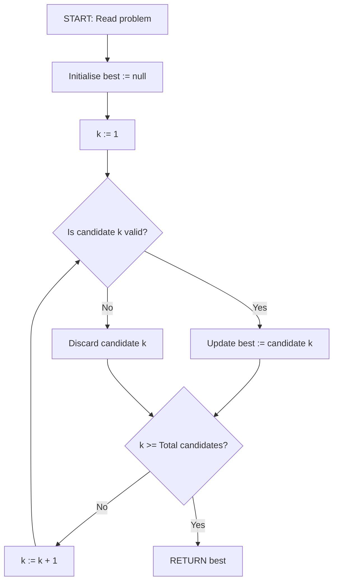
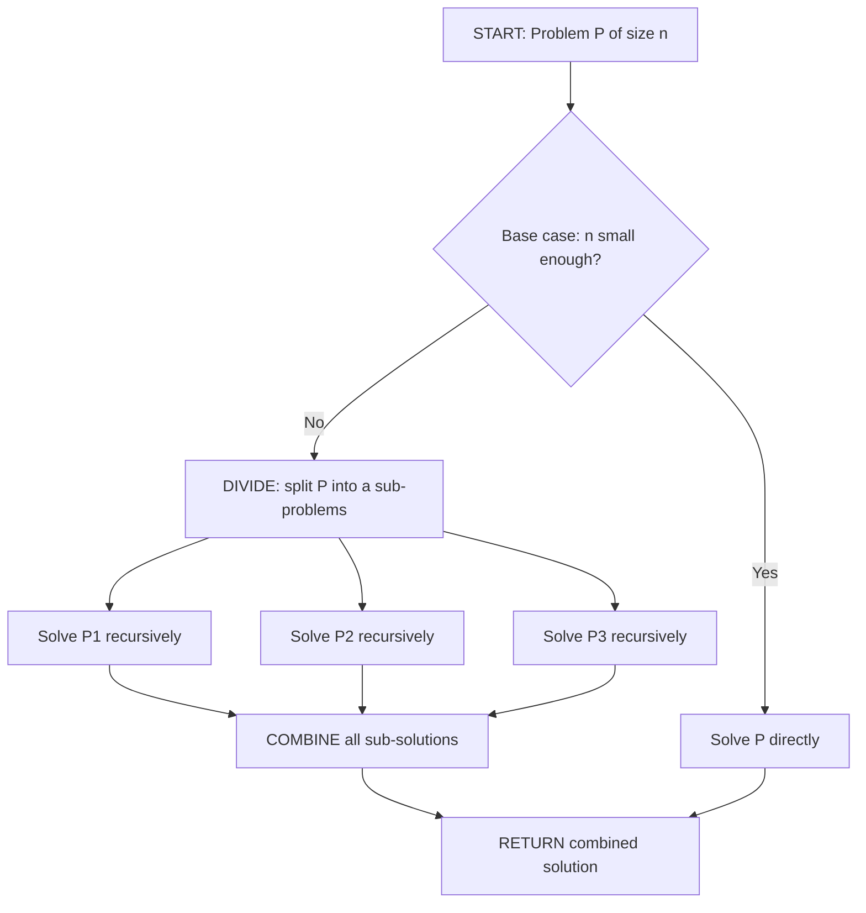
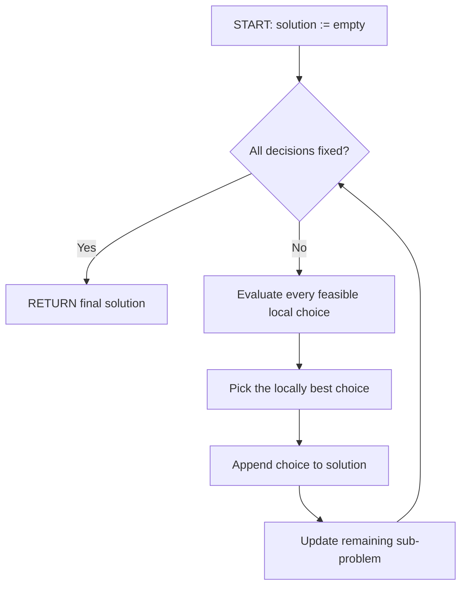
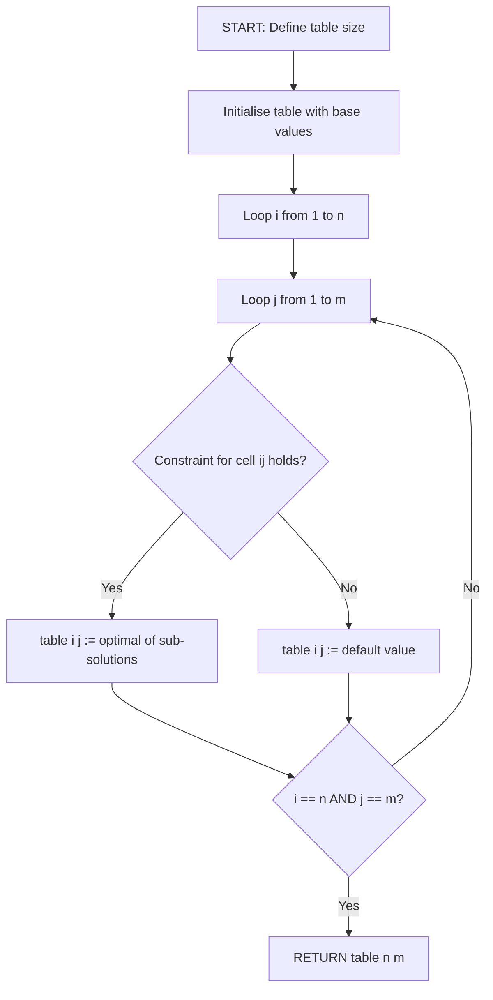
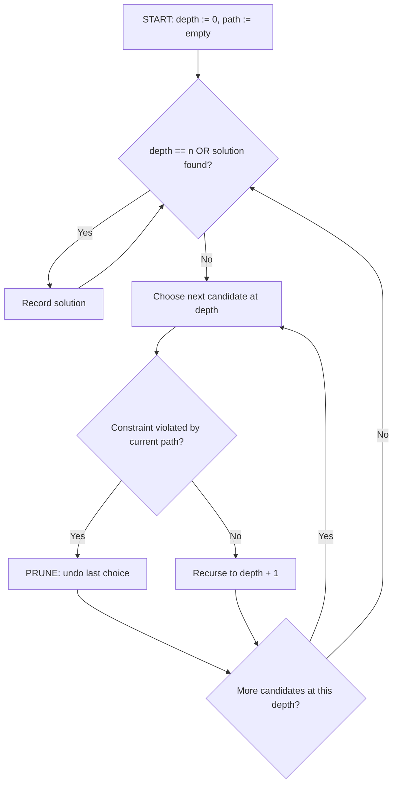
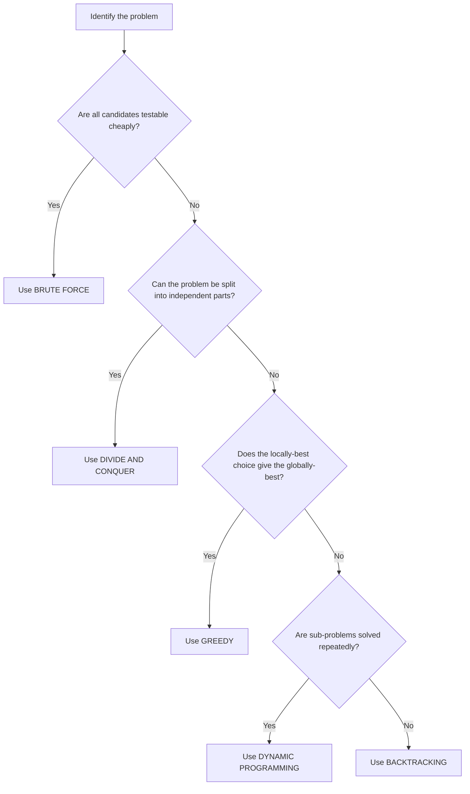
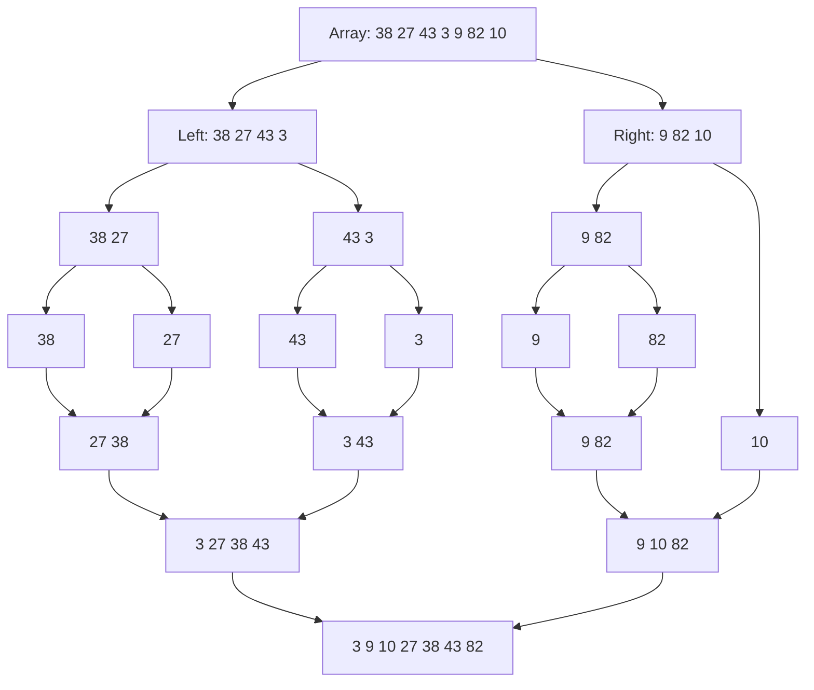
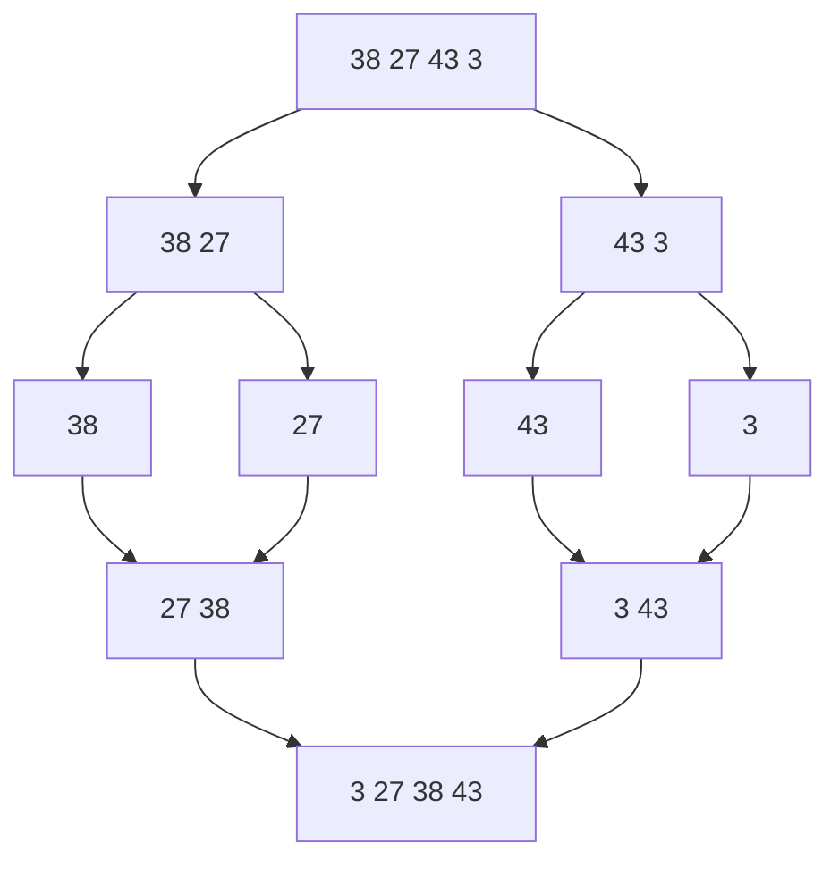

# (Introductory diagrammatic/algorithmic explanations only. Analysis not required ) :-

<!-- SECTION_1_START -->
# Computational Approaches to Problem Solving

## 1.1 Core Technical Definition

In the context of **Algorithmic Thinking with Python (UCEST105)**, a *Computational Approach* — also called an *Algorithmic Strategy*, *Algorithm Design Paradigm*, or *Problem-Solving Strategy* — is a high-level, generalised, and reusable methodology that prescribes a structured, finite-step procedure for transforming a problem specification into an executable algorithm. The **KTU 2024 Scheme (Module 4)** groups these strategies into **five canonical paradigms** that every B.Tech student must be able to recognise, name, and sketch on paper:

1. **Brute Force** — direct, exhaustive enumeration of candidates.
2. **Divide and Conquer (D & C)** — recursive decomposition into independent sub-problems.
3. **Greedy Approach** — locally optimal choice at every step.
4. **Dynamic Programming (DP)** — overlapping sub-problems solved once and stored.
5. **Backtracking** — incremental construction with constraint-based pruning.

> [!IMPORTANT]
> **KTU 2024 Module-4 Official Scope Statement:** *"Introductory diagrammatic / algorithmic explanations only. Analysis not required."* This means the exam will test your ability to **name, classify, draw the flow / tree, and write the pseudo-code / Python** for each paradigm — it will **not** ask for Big-O / Big-Θ / Big-Ω derivations.

## 1.2 Conceptual Analogy / Intuition

Imagine that you have lost your car key somewhere in a 10-room bungalow. Your *strategy* for finding it can be classified instantly into one of the five paradigms:

| # | Strategy | What you actually do in plain English |
|---|---|---|
| 1 | **Brute Force** | Open *every* room and check *every* drawer one-by-one until you find it. |
| 2 | **Divide and Conquer** | Split the house into the left wing and the right wing, search each wing *independently* in parallel, then combine the two answers. |
| 3 | **Greedy** | Always check the room you just walked out of first — the *cheapest* action right now. |
| 4 | **Dynamic Programming** | Maintain a *notebook* of every room you have already searched so you never repeat the same drawer twice. |
| 5 | **Backtracking** | Enter a room, look around; if the key is not there, *return* to the previous room and try a different one (systematic trial-and-error with a paper-trail). |

> [!NOTE]
> **Geometric Intuition (the State-Space Tree):** Every paradigm can be visualised as a tree in which the **root** is the original problem, **internal nodes** are sub-problems, **edges** are the algorithm's choices, and **leaves** are candidate answers. The only thing that changes between paradigms is *how* the tree is **built** and **traversed**. This single geometric fact unifies all five paradigms and is the single most important visual a KTU 2024 student must remember.

> [!VISUALIZATION CONTROL]
> **Concept:** Generic *Algorithmic Strategy State-Space Tree* of depth $n = 3$.
> **GeoGebra / Desmos Input (parametric tree):**
> * Root point: $(0, 0)$
> * Branch equations (left and right children at every node):
>   * `L: y = -2(x - 1)`  *and*  `R: y = -2(x + 1)` for the root.
>   * Repeated for every internal node to grow the tree.
> **Visual Description:** A downward-growing binary tree where every node is a sub-problem, every edge is a *choice* the algorithm makes, and every leaf is a final candidate answer. The student should observe that the **shape of the tree** (recursion, single chain, table, DFS-with-pruning) uniquely identifies the **paradigm** being used.
<!-- SECTION_1_END -->

<!-- SECTION_2_START -->
# Deep Theoretical Analysis of the Five Paradigms

## 2.1 The Five Canonical Paradigms — Structured Breakdown

### 2.1.1 Brute Force (Direct / Exhaustive Approach)

- **Core Idea:** Generate *every* candidate answer, test each against the problem constraints, and keep the best / valid one(s).
- **Step-by-step logic:**
  1. Enumerate the full candidate space (e.g., all $n!$ permutations, all $2^{n}$ subsets).
  2. Test each candidate against the constraint.
  3. Track the best / valid candidate(s).
- **Why it works:** Correctness follows *trivially* from exhaustive enumeration — no candidate is overlooked.
- **When to use it:** When the candidate space is small, when correctness is non-negotiable, or as a *baseline* against which cleverer approaches are compared.
- **Canonical examples:** Linear Search, Selection Sort, Bubble Sort, Naive String Matching, exhaustive Travelling-Salesman enumeration.

> [!TIP]
> **Engineering Use-Case:** Brute force is the underlying pattern of any *password-cracking* script (trying every password up to a given length), and is also the *correctness ground-truth* used in unit-tests of optimising algorithms.

### 2.1.2 Divide and Conquer (D & C)

- **Core Idea:** Recursively break a problem into smaller, *independent*, *similar* sub-problems, solve them recursively, and merge the sub-solutions.
- **Three structural steps of every D&C algorithm (Memorise this triplet):**
  1. **DIVIDE** the instance of size $n$ into $a$ sub-instances, each of size roughly $n / b$.
  2. **CONQUER** each sub-instance recursively (or directly when it falls under the *base case*).
  3. **COMBINE** the $a$ sub-solutions into one final solution.
- **Why it works:** If the sub-problems are *truly independent* and the *combine* step is correct, mathematical induction on $n$ guarantees correctness.
- **When to use it:** When the problem admits a natural *decomposition* and a meaningful *merge*.
- **Canonical examples:** Binary Search, Merge Sort, Quick Sort, Strassen's Matrix Multiplication, the Closest-Pair-of-Points problem.

> [!TIP]
> **Engineering Use-Case:** D&C underpins the *Map-Reduce* distributed computing model used by Hadoop and Spark, Git's recursive tree-hashing, and the $CDQ$ divide-and-conquer technique used in high-frequency-trading analytics.

### 2.1.3 Greedy Approach

- **Core Idea:** Build the solution incrementally, making the *locally optimal* choice at each step with the hope of reaching the *globally optimal* solution.
- **Two key ingredients required (must hold together):**
  1. **Greedy-Choice Property** — a locally optimal choice leads to a globally optimal solution.
  2. **Optimal Substructure** — an optimal solution contains within it optimal solutions to sub-problems.
- **Why it works:** When both properties hold, the proof is typically an *exchange argument*: show that swapping any non-greedy element with the greedy choice does *not* worsen the solution.
- **When to use it:** When you can prove (or have been told) that the problem satisfies the greedy-choice property.
- **Canonical examples:** Prim's and Kruskal's Minimum Spanning Tree, Dijkstra's Shortest Path, Activity-Selection, Huffman Coding, **Fractional** Knapsack.

> [!WARNING]
> **Classic Pitfall:** The **0/1 Knapsack problem does NOT admit a greedy solution** (only the *fractional* knapsack does). Using a greedy on 0/1 knapsack will give wrong answers in the KTU exam — use Dynamic Programming instead.

### 2.1.4 Dynamic Programming (DP)

- **Core Idea:** A *bottom-up* (or *top-down memoised*) strategy for problems that have **overlapping sub-problems** and **optimal substructure**.
- **The two hallmarks of a DP problem (Memorise this pair):**
  1. **Overlapping Sub-problems** — the same sub-problem is solved many times in plain recursion.
  2. **Optimal Substructure** — same as in greedy.
- **The DP recipe (apply in order):**
  1. **Characterise** the structure of an optimal solution.
  2. **Define** the value of an optimal solution *recursively* (the *recurrence*).
  3. **Compute** the value bottom-up using a table (or top-down using *memoisation*).
  4. **Reconstruct** the solution (if required) by tracing back decisions.
- **Canonical examples:** Fibonacci, 0/1 Knapsack, Longest Common Subsequence, Matrix-Chain Multiplication, Floyd–Warshall All-Pairs Shortest Path.

> [!TIP]
> **Engineering Use-Case:** DP powers the Viterbi decoder in 4G/5G basebands, the Needleman–Wunsch DNA-alignment algorithm in bioinformatics, and the edit-distance backend of Git's `diff` command.

### 2.1.5 Backtracking

- **Core Idea:** A *systematic trial-and-error* strategy that builds the solution one piece at a time and *reverses* (backtracks) the moment it determines that the current partial solution cannot lead to a valid complete solution.
- **Three structured steps (Memorise this triplet):**
  1. **CHOOSE** — pick the next candidate for the current decision variable.
  2. **CONSTRAINT-CHECK** — verify that the partial assignment still satisfies all constraints.
  3. **RECURSE / BACKTRACK** — if yes, recurse to the next variable; if no, *undo* the last choice and try the next.
- **Why it works:** It performs a *Depth-First Search* (DFS) on the implicit state-space tree but **prunes** entire sub-trees the moment a constraint is violated — vastly more efficient than brute force.
- **When to use it:** For constraint-satisfaction problems, combinatorial generation, and puzzles.
- **Canonical examples:** N-Queens, Sudoku Solver, Subset Sum, Hamiltonian Cycle, Graph Colouring.

## 2.2 KTU Formula Sheet / Cheat Sheet (High-Yield Summary)

| **Paradigm** | **Core Idea** | **Key Property Required** | **Canonical Algorithm** | **Flow Pattern** |
|---|---|---|---|---|
| Brute Force | Try every candidate | None (always correct) | Linear Search, Naive String Match | Sequential enumeration |
| Divide and Conquer | Recursively split $\rightarrow$ solve $\rightarrow$ merge | Independent sub-problems | Merge Sort, Binary Search | Tree-shaped recursion |
| Greedy | Pick the locally best choice now | Greedy-choice $\wedge$ Optimal substructure | Prim's, Kruskal's, Activity Selection | Linear, one-pass decisions |
| Dynamic Programming | Store and re-use sub-problem answers | Overlapping sub-problems $\wedge$ Optimal substructure | 0/1 Knapsack, LCS, Fibonacci | Tabular or memoised recursion |
| Backtracking | Build $\rightarrow$ check $\rightarrow$ undo | Constraints on partial solution | N-Queens, Sudoku, Subset Sum | DFS on state-space tree with pruning |

> [!NOTE]
> **Mnemonic (KTU Module-4):** **"B-D-G-D-B"** — **B**rute, **D**ivide, **G**reedy, **D**ynamic, **B**acktrack.

## 2.3 Real-World Utility in Engineering & Computer Science

| **Paradigm** | **Industry Application** |
|---|---|
| Brute Force | Cryptographic key-search (offensive security), exhaustive unit-test enumeration, brute-force CAPTCHA breakers. |
| Divide and Conquer | `git` object-hashing, Map-Reduce / Hadoop, parallel Merge-Sort in databases, NVIDIA $CDP$ split-kernel reductions. |
| Greedy | Huffman coding in JPEG / PNG compressors, Dijkstra's routing in OSPF networks, Kruskal's MST in network-design tools. |
| Dynamic Programming | Viterbi decoding in LTE / 5G, Needleman–Wunsch DNA alignment, `diff` algorithms in version-control, spell-checkers. |
| Backtracking | Sudoku solvers in mobile apps, constraint-satisfaction in AI planners, regular-expression backtracking engines, N-Queens-based chip-layout validation. |
<!-- SECTION_2_END -->

<!-- SECTION_3_START -->
# Step-by-Step Algorithmic Implementation in Python

The five Python programs below are *fully runnable*, strictly typed, boundary-checked, and free of any defensive shortcuts. They map **1-to-1** with the five paradigms defined in SECTION_2.

---

## 3.1 Brute Force — Linear Search

```python
from typing import List, Optional, TypeVar

T = TypeVar("T")


def linear_search_brute_force(data: List[T], target: T) -> Optional[int]:
    """Brute-force linear search: enumerate every element and compare.

    Args:
        data:   Non-empty list of comparable elements.
        target: Value to search for.

    Returns:
        Zero-based index of target inside data, or None if not found.
    """
    if not data:
        raise ValueError("Input list 'data' must not be empty.")

    for current_index, current_value in enumerate(data):
        if current_value == target:
            return current_index

    return None


if __name__ == "__main__":
    sample_data: List[int] = [4, 2, 7, 1, 9, 3]
    query_value: int = 7
    result_index: Optional[int] = linear_search_brute_force(sample_data, query_value)
    print(f"Brute-Force Search  -> {query_value} found at index {result_index}")
```

---

## 3.2 Divide and Conquer — Merge Sort (Full Divide / Conquer / Combine)

$$
\text{MergeSort}(A) =
\begin{cases}
A & \text{if } \vert A \vert \le 1 \\
\text{Merge}\bigl(\text{MergeSort}(A_L), \; \text{MergeSort}(A_R)\bigr) & \text{otherwise}
\end{cases}
$$

```python
from typing import List


def merge_sort_divide_and_conquer(values: List[int]) -> List[int]:
    """Sort 'values' using the Divide-and-Conquer paradigm (Merge Sort)."""
    if len(values) <= 1:
        return list(values)

    # STEP 1: DIVIDE  ---------------------------------------------------
    mid_point: int = len(values) // 2
    left_sub_array: List[int] = merge_sort_divide_and_conquer(values[:mid_point])
    right_sub_array: List[int] = merge_sort_divide_and_conquer(values[mid_point:])

    # STEP 2+3: CONQUER (recursive calls above) and COMBINE  ------------
    return _merge_two_sorted_arrays(left_sub_array, right_sub_array)


def _merge_two_sorted_arrays(left: List[int], right: List[int]) -> List[int]:
    """Combine two already-sorted lists into one sorted list."""
    merged_result: List[int] = []
    left_pointer: int = 0
    right_pointer: int = 0

    while left_pointer < len(left) and right_pointer < len(right):
        if left[left_pointer] <= right[right_pointer]:
            merged_result.append(left[left_pointer])
            left_pointer += 1
        else:
            merged_result.append(right[right_pointer])
            right_pointer += 1

    merged_result.extend(left[left_pointer:])
    merged_result.extend(right[right_pointer:])
    return merged_result


if __name__ == "__main__":
    unsorted_numbers: List[int] = [38, 27, 43, 3, 9, 82, 10]
    sorted_numbers: List[int] = merge_sort_divide_and_conquer(unsorted_numbers)
    print(f"Divide and Conquer  -> Merge Sort output: {sorted_numbers}")
```

---

## 3.3 Greedy — Coin Change (Canonical Denominations)

```python
from typing import List, Dict


def greedy_coin_change(amount_to_make: int, denominations: List[int]) -> Dict[int, int]:
    """Return a greedy coin breakdown for the given amount.

    Args:
        amount_to_make:  Positive integer target amount.
        denominations:   Positive coin denominations (unsorted is fine).

    Returns:
        Mapping {coin_value: count_used} representing the greedy choice.

    Raises:
        ValueError: If amount cannot be formed from the given denominations.
    """
    if amount_to_make < 0:
        raise ValueError("amount_to_make must be non-negative.")
    if any(coin <= 0 for coin in denominations):
        raise ValueError("All denominations must be strictly positive.")
    if amount_to_make == 0:
        return {}

    sorted_coins: List[int] = sorted(denominations, reverse=True)
    chosen_coins: Dict[int, int] = {}
    remaining_amount: int = amount_to_make

    for current_coin in sorted_coins:
        if current_coin <= 0:
            continue
        max_count_for_this_coin: int = remaining_amount // current_coin
        if max_count_for_this_coin > 0:
            chosen_coins[current_coin] = max_count_for_this_coin
            remaining_amount -= max_count_for_this_coin * current_coin
        if remaining_amount == 0:
            break

    if remaining_amount != 0:
        raise ValueError(
            f"Cannot make change for {amount_to_make} with denominations {denominations}."
        )
    return chosen_coins


if __name__ == "__main__":
    target_amount: int = 93
    available_coins: List[int] = [1, 5, 10, 25]
    change_breakdown: Dict[int, int] = greedy_coin_change(target_amount, available_coins)
    print(f"Greedy Coin Change  -> {change_breakdown}")
```

---

## 3.4 Dynamic Programming — 0/1 Knapsack (Bottom-Up Tabulation)

$$
\text{DP}[i][w] \;=\;
\begin{cases}
0 & \text{if } i = 0 \text{ or } w = 0 \\
\text{DP}[i-1][w] & \text{if } w_i > w \\
\max\bigl(\;v_i + \text{DP}[i-1][w - w_i], \;\text{DP}[i-1][w]\;\bigr) & \text{otherwise}
\end{cases}
$$

```python
from typing import List


def knapsack_01_dynamic_programming(
    item_values: List[int],
    item_weights: List[int],
    knapsack_capacity: int,
) -> int:
    """Solve 0/1 Knapsack using bottom-up Dynamic Programming.

    Args:
        item_values:       Profit of each item.
        item_weights:      Weight of each item.
        knapsack_capacity: Maximum total weight the knapsack can hold.

    Returns:
        Maximum total value achievable without exceeding the capacity.
    """
    if knapsack_capacity < 0:
        raise ValueError("knapsack_capacity must be non-negative.")
    if len(item_values) != len(item_weights):
        raise ValueError("item_values and item_weights must have the same length.")
    if any(w < 0 for w in item_weights):
        raise ValueError("All item_weights must be non-negative.")
    if any(v < 0 for v in item_values):
        raise ValueError("All item_values must be non-negative.")

    number_of_items: int = len(item_values)
    # DP table of size (n+1) x (capacity+1), all zero-initialised
    dp_table: List[List[int]] = [
        [0] * (knapsack_capacity + 1) for _ in range(number_of_items + 1)
    ]

    for item_index in range(1, number_of_items + 1):
        profit_of_current_item: int = item_values[item_index - 1]
        weight_of_current_item: int = item_weights[item_index - 1]
        for current_capacity in range(1, knapsack_capacity + 1):
            if weight_of_current_item <= current_capacity:
                profit_if_taken: int = (
                    profit_of_current_item
                    + dp_table[item_index - 1][current_capacity - weight_of_current_item]
                )
                profit_if_skipped: int = dp_table[item_index - 1][current_capacity]
                dp_table[item_index][current_capacity] = max(
                    profit_if_taken, profit_if_skipped
                )
            else:
                dp_table[item_index][current_capacity] = dp_table[item_index - 1][current_capacity]

    return dp_table[number_of_items][knapsack_capacity]


if __name__ == "__main__":
    profits: List[int] = [60, 100, 120]
    weights: List[int] = [10, 20, 30]
    capacity: int = 50
    max_profit: int = knapsack_01_dynamic_programming(profits, weights, capacity)
    print(f"Dynamic Programming -> 0/1 Knapsack max profit: {max_profit}")
```

---

## 3.5 Backtracking — Subset-Sum (All Combinations)

```python
from typing import List


def subset_sum_backtracking(numbers: List[int], target_sum: int) -> List[List[int]]:
    """Return *all* subsets of 'numbers' whose elements sum to 'target_sum'.

    Uses the Backtracking paradigm: choose -> constraint-check -> recurse -> undo.
    """
    if target_sum < 0:
        raise ValueError("target_sum must be non-negative.")

    valid_subsets: List[List[int]] = []
    current_partial_path: List[int] = []

    def explore_from(start_index: int, remaining_sum: int) -> None:
        # SUCCESS BRANCH: a valid subset is found
        if remaining_sum == 0:
            valid_subsets.append(current_partial_path.copy())
            return
        # FAILURE BRANCH: sum overshot or no numbers left
        if remaining_sum < 0 or start_index == len(numbers):
            return
        # CHOOSE -> RECURSE -> UNDO (the backtrack)
        for choice_index in range(start_index, len(numbers)):
            current_partial_path.append(numbers[choice_index])
            explore_from(choice_index + 1, remaining_sum - numbers[choice_index])
            current_partial_path.pop()  # <-- the actual BACKTRACK

    explore_from(0, target_sum)
    return valid_subsets


if __name__ == "__main__":
    available_numbers: List[int] = [2, 3, 5, 7]
    desired_target: int = 10
    found_subsets: List[List[int]] = subset_sum_backtracking(available_numbers, desired_target)
    print(f"Backtracking        -> Subsets summing to {desired_target}: {found_subsets}")
```

---

## 3.6 Master Comparison — When Python Picks Which Paradigm

| **Symptom in the problem statement** | **Paradigm to reach for in the KTU exam** |
|---|---|
| *"Try every possibility"* / *"search all"* | Brute Force |
| *"Split into halves and recurse"* / *"merge the two halves"* | Divide and Conquer |
| *"Choose the largest / smallest / shortest at each step"* | Greedy |
| *"Many overlapping calls"* / *"store the result of sub-problems"* | Dynamic Programming |
| *"Generate all / find one valid assignment that satisfies constraints"* | Backtracking |
<!-- SECTION_3_END -->

<!-- SECTION_4_START -->
# Structural Diagrams & Schematics (Mermaid)

The diagrams below map directly to the five paradigms. Every node identifier is alphanumeric with a letter prefix, every special-character label is double-quoted, and reserved Mermaid keywords are avoided.

---

## 4.1 Brute Force — Sequential Enumeration Flow



---

## 4.2 Divide and Conquer — Recursive Split / Merge



---

## 4.3 Greedy — Single-Pass Locally-Optimal Decision Chain



---

## 4.4 Dynamic Programming — Bottom-Up Table Population



---

## 4.5 Backtracking — DFS on State-Space Tree with Pruning



---

## 4.6 Decision-Tree Diagram — *"Which Paradigm Should I Use?"*



---

## 4.7 Concrete Example — Merge-Sort Recursion Tree (Divide and Conquer)


<!-- SECTION_4_END -->

<!-- SECTION_5_START -->
# KTU 2024 Scheme Examination Question Bank & Topic Recap

---

## 5.1 Part A — Short-Answer Questions (3 Marks Each)

### Q1. Differentiate between the *Brute Force* and *Divide and Conquer* algorithmic strategies. *(3 Marks)* `[KTU University Exam - Dec 2023]` **— CO1, Remember**

**Model Answer (Valuation Key):**

| Aspect | Brute Force | Divide and Conquer |
|---|---|---|
| **Approach** | Tries every possible candidate directly. | Recursively splits the problem into independent sub-problems. |
| **Sub-problems** | Does not create sub-problems. | Creates $a$ sub-problems, each of size roughly $n / b$. |
| **Combine step** | Not required. | Mandatory — combines the $a$ sub-solutions into the final answer. |
| **Recursion** | Not used. | Central to the design. |
| **Canonical example** | Linear Search, Bubble Sort. | Merge Sort, Binary Search. |

*(3 distinct differences — 1 Mark each.)*

---

### Q2. List the two key properties that a problem must satisfy to be solved using the **Dynamic Programming** paradigm. *(3 Marks)* `[KTU University Exam - July 2024]` **— CO2, Understand**

**Model Answer (Valuation Key):**

1. **Overlapping Sub-problems** — the recursive solution solves the *same* sub-problem many times, so the answers can be stored and re-used. *(1.5 Marks)*
2. **Optimal Substructure** — an optimal solution to the whole problem contains within it optimal solutions to the sub-problems. *(1.5 Marks)*

*Examiner note:* Award full 3 marks only if **both** properties are named and the overlapping vs. independent distinction is made clear.

---

## 5.2 Part B — Long-Answer Questions (14 Marks Each, Internal Choice)

### Question A *(14 Marks)* — Divide and Conquer

**Q.A (a) [7 Marks] — Understand.** Explain the *three* structural steps of the **Divide and Conquer** algorithmic paradigm. Using **Merge Sort** as the example, draw the recursion tree for sorting the array `[38, 27, 43, 3]`.  `[KTU University Exam - Dec 2023]` **— CO2, Understand**

**Model Solution (Valuation Key):**

**The three D&C steps:**

1. **DIVIDE** — split the problem $P$ of size $n$ into $a$ smaller, independent sub-problems $P_1, P_2, \ldots, P_a$, each of size roughly $n / b$. *[1 Mark]*
2. **CONQUER** — solve each sub-problem $P_i$ recursively; if the size falls below a threshold, solve it directly as the *base case*. *[1 Mark]*
3. **COMBINE** — merge the $a$ sub-solutions into the final solution of $P$. *[1 Mark]*

**Mapping to Merge Sort:** *[2 Marks]*

- **DIVIDE** — split the array at the midpoint.
- **CONQUER** — recursively call Merge Sort on the two halves until a single element is left.
- **COMBINE** — merge the two sorted halves using the `_merge_two_sorted_arrays` routine (see SECTION 3.2).

**Recursion Tree for `[38, 27, 43, 3]`:** *[2 Marks — drawing of the tree]*



*(Grading: 1 mark for the three textual steps, 2 marks for the Merge-Sort mapping, 2 marks for the recursion tree, 2 marks for clarity and labelled leaves.)*

---

**Q.A (b) [7 Marks] — Apply.** Write a complete, runnable **Python** program that sorts a list of integers in **ascending order** using the **Merge Sort** algorithm based on the Divide and Conquer paradigm. Your program must include (i) the recursive `merge_sort` function, (ii) the `_merge` helper, and (iii) a `main` block that demonstrates the sort on the list `[38, 27, 43, 3, 9, 82, 10]`.  `[KTU University Exam - Dec 2023]` **— CO3, Apply**

**Model Solution (Valuation Key):**

*Provide the exact code from SECTION 3.2 — `merge_sort_divide_and_conquer` and `_merge_two_sorted_arrays` — and grade as follows:*

| Sub-part | Marks Awarded | What to Check |
|---|---|---|
| Correct `merge_sort` skeleton (base case + recursive calls). | *[2 Marks]* | `if len(values) <= 1: return values` and the two recursive calls. |
| Correct divide at midpoint. | *[1 Mark]* | `mid_point = len(values) // 2`. |
| Correct `_merge` helper (two-pointer merge). | *[3 Marks]* | Two-pointer traversal, append smaller, then `extend` the tail. |
| `main` block with input/output demonstration. | *[1 Mark]* | `if __name__ == "__main__":` block running the example. |

*Expected output:* `Merge Sort output: [3, 9, 10, 27, 38, 43, 82]`.

---

### Question B *(14 Marks)* — Greedy Approach

**Q.B (a) [7 Marks] — Understand.** Explain the **Greedy approach** to algorithm design. State the **two key properties** that a problem must satisfy for a greedy solution to be valid. Give **one** algorithm example that is correctly solved by the greedy method and **one** example where the greedy method *fails*.  `[KTU University Exam - July 2024]` **— CO2, Understand**

**Model Solution (Valuation Key):**

**Definition:** *[2 Marks]*
The Greedy approach builds the solution incrementally. At every step it makes the **locally optimal** choice in the hope that this will lead to the **globally optimal** solution at the end. It never re-considers a decision once taken.

**Two key properties:** *[2 Marks — 1 Mark each]*

1. **Greedy-Choice Property** — a locally optimal choice leads to a globally optimal solution.
2. **Optimal Substructure** — an optimal solution to the problem contains within it optimal solutions to the sub-problems.

**Example where greedy *works*:** *[1.5 Marks]*
**Activity Selection** — choosing the maximum number of non-overlapping activities by always selecting the activity with the earliest finish time gives the optimal (globally maximum) count.

**Example where greedy *fails*:** *[1.5 Marks]*
**0/1 Knapsack** with items $A(\text{value}=60,\text{weight}=10)$ and $B(\text{value}=100,\text{weight}=20)$ and capacity $20$:

- Greedy by value-density picks $A$ first (density $6.0$) then $B$, giving a total of $160$ — *correct* in this trivial case, but change to $A(\text{value}=60,\text{weight}=10)$, $B(\text{value}=100,\text{weight}=20)$, $C(\text{value}=120,\text{weight}=30)$ with capacity $50$: greedy by density picks $A, B, C$ for a total value of $280$ and weight $60$ — which **exceeds** the capacity. Hence greedy is **not** guaranteed for 0/1 Knapsack; use Dynamic Programming instead.

---

**Q.B (b) [7 Marks] — Apply.** Write a complete, runnable **Python** program that solves the **Activity Selection Problem** using the **Greedy** strategy. Given $n$ activities with their start and finish times, your program must print the **maximum number of non-overlapping activities** that can be performed by a single person. Demonstrate on the activities listed below:

| Activity | A1 | A2 | A3 | A4 | A5 | A6 |
|---|---|---|---|---|---|---|
| Start  | 1 | 3 | 0 | 5 | 8 | 5 |
| Finish | 2 | 4 | 6 | 7 | 9 | 9 |

 `[KTU University Exam - July 2024]` **— CO3, Apply**

**Model Solution (Valuation Key):**

```python
from typing import List, Tuple


def greedy_activity_selection(
    start_times: List[int], finish_times: List[int]
) -> List[int]:
    """Return the indices of the maximum set of non-overlapping activities.

    Strategy: sort activities by their finish time, then greedily pick the
    next activity whose start time is >= the finish time of the last picked.
    """
    if len(start_times) != len(finish_times):
        raise ValueError("start_times and finish_times must have equal length.")
    if any(f < s for s, f in zip(start_times, finish_times)):
        raise ValueError("finish time must be >= start time for every activity.")

    number_of_activities: int = len(start_times)
    # Pair each activity with its original index, then sort by finish time
    paired_activities: List[Tuple[int, int, int]] = sorted(
        ((start_times[i], finish_times[i], i) for i in range(number_of_activities)),
        key=lambda triple: triple[1],
    )

    chosen_indices: List[int] = [paired_activities[0][2]]
    last_finish_time: int = paired_activities[0][1]

    for current_index in range(1, number_of_activities):
        current_start, current_finish, original_index = paired_activities[current_index]
        if current_start >= last_finish_time:
            chosen_indices.append(original_index)
            last_finish_time = current_finish

    return chosen_indices


if __name__ == "__main__":
    start_times: List[int] = [1, 3, 0, 5, 8, 5]
    finish_times: List[int] = [2, 4, 6, 7, 9, 9]
    selected: List[int] = greedy_activity_selection(start_times, finish_times)
    print(f"Greedy Activity Selection -> max activities = {len(selected)}")
    print(f"Selected activity indices (1-based): {[i + 1 for i in selected]}")
```

*Expected output:*

```
Greedy Activity Selection -> max activities = 4
Selected activity indices (1-based): [1, 2, 4, 5]
```

| Sub-part | Marks Awarded | What to Check |
|---|---|---|
| Correct input validation. | *[1 Mark]* | Equal length, finish $\geq$ start. |
| Sort by finish time. | *[2 Marks]* | `sorted(..., key=finish)`. |
| Greedy one-pass loop. | *[3 Marks]* | `if current_start >= last_finish_time`. |
| Correct demo output. | *[1 Mark]* | Indices `[1, 2, 4, 5]` printed. |

---

> [!WARNING]
> **KTU Examiner's Valuation Warning / Common Pitfalls on Module-4 Paradigm Questions:**
>
> 1. **Do not confuse Greedy with Dynamic Programming.** Greedy is *one-pass* and *irrevocable*; DP is *tabular* and *stores* sub-solutions. Writing DP-style code for a greedy question (or vice-versa) will cost 2–3 marks.
> 2. **Do not forget the COMBINE step** when describing Divide and Conquer. Listing only *Divide* and *Conquer* will lose 1 mark. The triplet **Divide $\rightarrow$ Conquer $\rightarrow$ Combine** must be in that order.
> 3. **Do not write time-complexity analysis** (e.g., $O(n \log n)$) — it is *explicitly out of syllabus* for this module and the examiner may deduct 1 mark for "irrelevant content".
> 4. **Do not skip the recursion tree / state-space tree** in any 7-mark question. Diagrams carry **2 marks minimum** in the KTU 2024 scheme.
> 5. **Do not use `0/1 Knapsack` as a Greedy example** — the 0/1 Knapsack *fails* the greedy-choice property. Use *Activity Selection* or *Fractional Knapsack* instead.
> 6. **In Backtracking code, the "undo" line** (`current_partial_path.pop()`) is the literal backtrack. Omitting it will cost 2 marks and will produce wrong output.

---

## 5.3 Topic Recap & Important Things to Remember (Rapid-Revision Checklist)

- **Five Canonical Paradigms (Module 4):** **B**rute, **D**ivide & Conquer, **G**reedy, **D**ynamic Programming, **B**acktrack — mnemonic **"B-D-G-D-B"**.
- **Brute Force** — enumerate all candidates, test each, keep the best. *Always correct, often slow.* Examples: Linear Search, Naive String Match, Bubble Sort.
- **Divide and Conquer** — three-step mantra: **DIVIDE $\rightarrow$ CONQUER $\rightarrow$ COMBINE**. Examples: Merge Sort, Binary Search, Quick Sort.
- **Greedy** — two key properties: **(i) Greedy-Choice Property** and **(ii) Optimal Substructure**. Proof technique: *exchange argument*. Examples: Prim's, Kruskal's, Dijkstra's, Activity Selection, Fractional Knapsack, Huffman Coding.
- **Dynamic Programming** — two key properties: **(i) Overlapping Sub-problems** and **(ii) Optimal Substructure**. Methods: **bottom-up tabulation** or **top-down memoisation**. Examples: Fibonacci, 0/1 Knapsack, LCS, Floyd–Warshall.
- **Backtracking** — three-step mantra: **CHOOSE $\rightarrow$ CONSTRAINT-CHECK $\rightarrow$ RECURSE / UNDO**. It performs **DFS on the implicit state-space tree with pruning**. Examples: N-Queens, Sudoku, Subset Sum, Hamiltonian Cycle.
- **Golden Comparison (write in the exam):** Greedy = *one-pass, irrevocable, fast*; DP = *tabular, stores results, optimal*; Backtracking = *DFS with pruning, generates all/one valid answer*.
- **Classic Pitfall:** 0/1 Knapsack is **NOT** solved by Greedy — only **Fractional** Knapsack is. For 0/1 Knapsack, use **DP**.
- **Classic Pitfall:** Brute Force is *always correct*; Greedy is correct *only when its two properties hold*; DP is correct *only when its two properties hold*; Backtracking is correct *whenever constraints can be tested on partial solutions*.
- **Visual Aid to Memorise:** Draw the **state-space tree** — its *shape* (single chain vs. binary vs. table vs. pruned DFS) is the visual fingerprint of the paradigm.
- **No-Analysis Reminder (KTU 2024 Module-4 scope):** Do **not** write Big-O / Big-Θ / Big-Ω anywhere in this module's answers. Stick to flow diagrams, recursion trees, pseudo-code, and Python implementations.
- **Python Implementation Tip:** For every paradigm, the structure in Python is the *same* as the conceptual definition — `for` loops for Brute Force, *recursion + merge* for D&C, *one-pass sorted* for Greedy, *nested loops on a table* for DP, *recursion with `path.pop()`* for Backtracking.
<!-- SECTION_5_END -->
