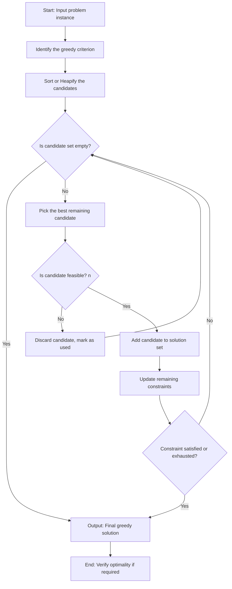
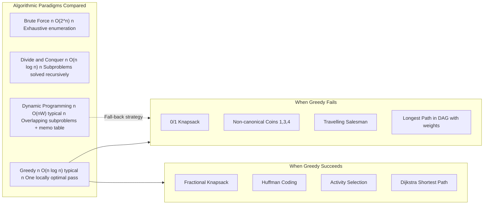
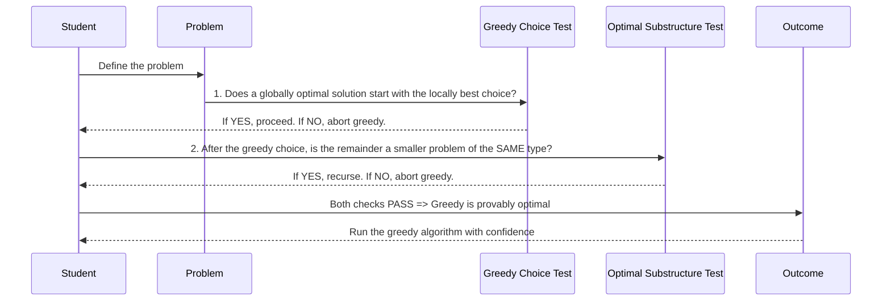
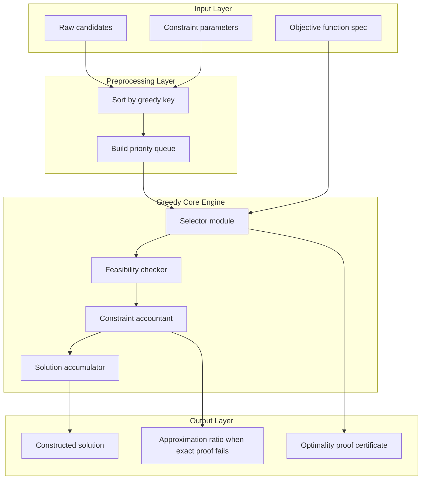

# - Motivations for the Greedy Approach

<!-- SECTION_1_START -->
# Motivations for the Greedy Approach

## 1.1 Formal Definition (KTU 2024 Scheme Terminology)

> [!IMPORTANT]
> **Greedy Algorithm**: A problem-solving paradigm that constructs a solution **incrementally**, one decision at a time, by making the choice that looks **best at the moment** (i.e., the *locally optimal* choice) under the assumption that these local optima will aggregate into a *globally optimal* solution. The algorithm never reconsiders previously made choices.

In the KTU 2024 scheme syllabus for **Algorithmic Thinking with Python (UCEST105)**, Module 4 frames the greedy approach as a **Computational Strategy for Optimization Problems** — problems where the goal is to **maximize** or **minimize** a measurable objective subject to a set of constraints (e.g., profit, time, distance, weight).

Mathematically, a greedy algorithm is a procedure that, at every step $i$, selects an element $x_i$ from a candidate set $C$ such that:

$$
x_i = \arg\min_{x \in C} \; f(\text{partial solution} \cup \{x\}) \quad \text{(for minimization)}
$$

or, equivalently for maximization:

$$
x_i = \arg\max_{x \in C} \; f(\text{partial solution} \cup \{x\}) \quad \text{(for maximization)}
$$

where $f$ is the objective function being optimized.

---

## 1.2 Conceptual Analogy — Plain-English Intuition

> [!NOTE]
> **Analogy: Hiking Down a Foggy Mountain**
> Imagine you are standing on top of a mountain hidden in thick fog. You cannot see the base. Your only rule is: *always take the step that descends the most*. That single rule is a **greedy strategy** — at every step you make the locally steepest decision. If the mountain happens to be a perfect cone with no hidden pits, you will reach the lowest point. If there are hidden craters, your local best choices may trap you on a ledge that is *not* the true bottom. **Greedy works when the problem landscape is "well-behaved" (convex-like); it fails when deceptive local optima exist.**

A second analogy: **Eating a chocolate box to maximize calories**. At each bite you pick the densest piece. You hope the sum reaches the maximum. It usually does — but if the *combination* matters (e.g., a balanced diet), then local sugar-maximization ruins the global goal.

---

## 1.3 Why "Motivations"? — The Real Engineering Question

The KTU module places this sub-topic *before* teaching any specific greedy algorithm because students must first internalize **why** this paradigm is studied separately from brute force, divide-and-conquer, and dynamic programming. The core motivations are:

1. **Cognitive Simplicity** — Greedy is the most *intuitive* paradigm; humans naturally reason greedily.
2. **Computational Efficiency** — Often yields **polynomial-time** solutions where brute force is exponential.
3. **Memory Friendliness** — Typically uses **$O(1)$ or $O(n)$** auxiliary space; can run as a *single online pass* over data.
4. **Reuse of Sorted/Heap Structures** — Naturally pairs with sorting, priority queues, and disjoint-set data structures.
5. **Foundation for Approximation** — Many NP-hard problems (e.g., Set Cover, TSP) use greedy as an *approximation algorithm* with provable bounds.

> [!TIP]
> **Key Takeaway for KTU exams:** Always open any greedy-related answer with the *two mandatory structural properties* — **Greedy-Choice Property** and **Optimal Substructure**. These are the Board Examiner's favourite framing points (worth **2 marks** on their own).

---

## 1.4 Standard Metrics & Parameters Used

| Symbol | Meaning |
| :--- | :--- |
| $n$ | Number of input items (candidates) |
| $S$ | The candidate set (universe of choices) |
| $F$ | The set of feasible solutions (satisfy constraints) |
| $f(\cdot)$ | The objective function being optimized |
| $\mathcal{O}$ | The set of optimal solutions |
| $x^{\star}$ | A particular optimal solution |
| $C$ | A candidate pool at intermediate step $i$ |

> [!VISUALIZATION CONTROL]
> **Concept:** Visualizing the "Greedy Trajectory" in solution space.
> **Plot Concept (Desmos-friendly):** Draw a 2-D plane where the x-axis is the **number of decisions made** (0 to $n$) and the y-axis is the **running objective value** $f(\text{solution so far})$.
> **Description:** A greedy algorithm traces a *monotonically non-decreasing curve* (for maximization) that always makes the *steepest single-step rise*. If the curve touches the global maximum, greedy is optimal. If it plateaus early, greedy is suboptimal. Students should observe that **only the slope at each step is locally optimal, not the final value**.

---

<!-- SECTION_1_END -->

<!-- SECTION_2_START -->
# Deep Theoretical Analysis & KTU High-Yield Formula Sheet

## 2.1 The Two Structural Pillars of a Valid Greedy Algorithm

For a greedy algorithm to *provably* produce a global optimum, the underlying problem must satisfy **both** of the following structural properties. These are the most frequently asked 3-mark and 5-mark questions in KTU university exams.

### Pillar 1 — Greedy-Choice Property (Local ⇒ Global)
> [!IMPORTANT]
> A globally optimal solution can be reached by repeatedly making **locally optimal (greedy) choices** that do not depend on future decisions or on re-evaluation of past choices.

Formally: $\exists$ an optimal solution $x^{\star}$ such that the first decision of $x^{\star}$ coincides with the greedy choice at step 1. By induction, this extends to every subsequent step.

**Intuition (the "Why"):** The problem must be *decomposable* into a sequence of steps where the "right thing to do now" is unaffected by what comes later.

### Pillar 2 — Optimal Substructure (Recursive Decomposability)
> [!IMPORTANT]
> An optimal solution to the whole problem contains within it optimal solutions to the subproblems that remain *after* each greedy choice is made.

Formally: If $x$ is a greedy choice and $y$ is an optimal solution to the subproblem that remains, then $x \cup y$ is an optimal solution to the original problem.

**Intuition (the "Why"):** Removing the greedy choice must leave a smaller instance of the *same type* of problem, whose optimal answer is still optimal in the *original* context.

> [!WARNING]
> **Common Student Error:** Confusing "greedy works on this example" with "greedy works in general." The two pillars above must be **proven** (often by exchange argument or cut-and-paste argument), not assumed from a test case.

---

## 2.2 The Greedy Algorithmic Template

Every greedy algorithm in this module can be written using the following canonical 5-step pattern. Memorizing this template is essential for KTU coding questions.

| Step | Action | Description |
| :--- | :--- | :--- |
| 1 | **Sort / Heapify the input** | Reorder candidates so the greedy criterion can be evaluated in linear scan |
| 2 | **Initialize** | Set `solution = empty`, `remaining_capacity = constraint` |
| 3 | **Iterate over candidates** | For each candidate, test *feasibility* against constraints |
| 4 | **Greedy test** | If candidate is feasible AND improves objective ⇒ **accept it** |
| 5 | **Return / Output** | Terminate when all candidates processed or constraints saturated |

---

## 2.3 Motivations — Detailed Engineering Justifications

> [!NOTE]
> The KTU Module-4 syllabus explicitly asks students to discuss *why* the greedy approach is studied. The five motivations below are examinable.

### Motivation A — *Intuitive and Declarative*
Greedy mirrors how humans solve problems in everyday life: "pick the best available option now." It is the most readable paradigm — often 5 to 10 lines of code where dynamic programming needs a table of size $n \times W$ or similar.

### Motivation B — *Asymptotic Efficiency*
Typical greedy algorithms run in:

$$
T(n) \in O(n \log n) \;\; \text{to} \;\; O(n)
$$

driven by an initial sort. This is **provably faster** than the $O(n^2)$ to $O(2^n)$ cost of dynamic programming or brute force on the same problem.

### Motivation C — *Online / Streaming Capability*
Because a greedy algorithm never needs to "look back," it can be executed on a **data stream** — decisions are made as items arrive. This is critical in real-time systems: packet scheduling, cache eviction (LRU is a greedy approximation), and load balancing.

### Motivation D — *Memory Efficiency*
A streaming greedy uses **$O(1)$ extra space** (a running total), while DP needs the entire memoization table **$O(n \cdot W)$**. For $n = 10^6$, this is the difference between fitting in RAM and crashing.

### Motivation E — *Approximation Foundation*
For NP-hard optimization problems (Set Cover, Max-Coverage, $k$-Clustering, TSP), greedy gives an **approximation ratio**:

$$
\frac{\text{Greedy Cost}}{\text{Optimal Cost}} \le \ln n + 1 \quad \text{(Set Cover, classical result)}
$$

No polynomial-time exact algorithm is believed to exist for these problems.

---

## 2.4 KTU Formula Sheet / Cheat Sheet

| Concept | Equation / Rule | Application |
| :--- | :--- | :--- |
| Greedy choice at step $i$ | $x_i = \arg\max_{x \in C_i} \; \frac{\text{benefit}(x)}{\text{weight}(x)}$ | Fractional Knapsack |
| Activity selection count | $\text{count} = \vert \{ a_i : a_i.\text{end} \le a_{i+1}.\text{start} \} \vert$ | Interval scheduling |
| Huffman tree cost | $C(T) = \sum_{i=1}^{n} p_i \cdot d_i$ | Data compression |
| MST cut property | $\forall$ cut $(S, V \setminus S)$, the lightest crossing edge is in some MST | Prim's / Kruskal's |
| Dijkstra relaxation | $d[v] = \min \{ d[v], \; d[u] + w(u, v) \}$ | Single-source shortest path |
| Exchange argument | Replace first non-greedy choice in $x^{\star}$ with greedy choice, prove objective is no worse | Proof technique |
| Set-cover approximation | $C_{\text{greedy}} \le (1 + \ln n) \cdot C_{\text{opt}}$ | NP-hard optimization |
| Online paging (deterministic) | Competitive ratio $\ge k$ for cache size $k$ | Lower-bound analysis |

> [!TIP]
> **Exam Hack:** The right-most column of the table above contains the *names of KTU-mapped algorithms*. If a question says "explain with a suitable example," pairing each property with one of these examples earns the full marks.

---

## 2.5 Real-World Engineering Applications

| Domain | Greedy Algorithm | Why Greedy Works |
| :--- | :--- | :--- |
| Network routing | Dijkstra's shortest path | Edge weights are non-negative ⇒ no backtracking needed |
| Data compression | Huffman coding | Greedy merges of lowest-frequency nodes minimize weighted path length |
| Database query planning | Greedy join ordering | Heuristic for $n$-way joins, polynomial-time and good in practice |
| Scheduling / OS | Shortest-Job-First scheduling | Minimizes average waiting time when runtimes known in advance |
| Clustering | Gonzalez's $k$-center | $2$-approximation using farthest-first traversal |
| Cloud autoscaling | Greedy bin-packing | EC2 instance packing, fast online decision |
| Cryptography / Bitcoin | Greedy transaction selection for block size | Fee-per-byte greedy fills the block optimally |

---

<!-- SECTION_2_END -->

<!-- SECTION_3_START -->
# Step-by-Step Derivations & Code Implementation

## 3.1 Worked Example 1 — Motivating Greedy via the Activity Selection Problem

### 3.1.1 Problem Statement (Canonical KTU Question)
Given $n$ activities with start time $s_i$ and finish time $f_i$, select the **maximum number of non-overlapping activities** that a single person can perform.

### 3.1.2 Greedy Strategy
At every step, pick the activity with the **earliest finish time** among those whose start time is $\ge$ the finish time of the last chosen activity.

### 3.1.3 Trace Through Input
Let activities be: $A_1 = (1, 4)$, $A_2 = (3, 5)$, $A_3 = (0, 6)$, $A_4 = (5, 7)$, $A_5 = (3, 9)$, $A_6 = (5, 9)$, $A_7 = (6, 10)$, $A_8 = (8, 11)$, $A_9 = (8, 12)$, $A_{10} = (2, 14)$, $A_{11} = (12, 16)$.

**Step 1 — Sort by finish time:**

$$
\begin{aligned}
A_1 &= (1, 4) \\
A_2 &= (3, 5) \\
A_4 &= (5, 7) \\
A_8 &= (8, 11) \\
A_{11} &= (12, 16)
\end{aligned}
$$

(Only these are mutually compatible after greedy selection.)

**Step 2 — Iterate:**

| Iteration | Current Activity | Last Finish | Decision | Reason |
| :---: | :---: | :---: | :---: | :--- |
| 1 | $A_1 = (1, 4)$ | $0$ | **ACCEPT** | First activity |
| 2 | $A_2 = (3, 5)$ | $4$ | **ACCEPT** | $3 \ge 4$? No. Wait — $3 < 4$, so **REJECT** |
| 3 | $A_4 = (5, 7)$ | $4$ | **ACCEPT** | $5 \ge 4$ ✓ |
| 4 | $A_8 = (8, 11)$ | $7$ | **ACCEPT** | $8 \ge 7$ ✓ |
| 5 | $A_{11} = (12, 16)$ | $11$ | **ACCEPT** | $12 \ge 11$ ✓ |

**Final answer:** $4$ activities selected: $\{A_1, A_4, A_8, A_{11}\}$.

### 3.1.4 Greedy-Choice Proof (Exchange Argument — 3 marks in KTU)
Let $x^{\star}$ be any optimal solution whose first chosen activity is $A_k$ with finish $f_k > f_1$ (i.e., not the earliest-finishing). Replace $A_k$ with $A_1$ (the greedy choice).

- The number of activities in the solution is unchanged (replaced 1-for-1).
- All subsequent activities in $x^{\star}$ start $\ge f_k > f_1$, so they still start $\ge f_1$.
- Therefore the modified solution is also optimal and starts with the greedy choice.

By induction, an entirely greedy solution is optimal. **QED.**

---

## 3.2 Worked Example 2 — Motivating Greedy via Fractional Knapsack

### 3.2.1 Problem
Maximize total value in a knapsack of capacity $W = 50$ given items with weight $w_i$ and value $v_i$.

| Item $i$ | Weight $w_i$ | Value $v_i$ | Value/Weight Ratio $r_i$ |
| :---: | :---: | :---: | :---: |
| 1 | 10 | 60 | 6.0 |
| 2 | 20 | 100 | 5.0 |
| 3 | 30 | 120 | 4.0 |

### 3.2.2 Greedy Strategy
Sort items in **decreasing order of value-per-unit-weight** $r_i = v_i / w_i$. Fill knapsack top-down; if an item does not fully fit, take a **fractional** piece.

### 3.2.3 Step-by-Step Trace

$$
\begin{aligned}
\text{Step 1: Take Item 1} &\Rightarrow \text{Capacity used} = 10, \; \text{Value gained} = 60, \; \text{Value}/W = 6.0 \\
\text{Remaining} &= 50 - 10 = 40 \\
\text{Step 2: Take Item 2} &\Rightarrow \text{Capacity used} = 10 + 20 = 30, \; \text{Value} = 60 + 100 = 160 \\
\text{Remaining} &= 40 - 20 = 20 \\
\text{Step 3: Item 3 needs 30, only 20 left} &\Rightarrow \text{Take fraction } \frac{20}{30} = \frac{2}{3} \\
\text{Value gained from fraction} &= \frac{2}{3} \times 120 = 80
\end{aligned}
$$

**Total value = $60 + 100 + 80 = 240$.**

**Capacity consumed = $10 + 20 + 20 = 50$ ✓**

### 3.2.4 Why Greedy Works Here (Optimal Substructure)
Once Item 1 (the highest $r$) is chosen, the remaining problem is *exactly* a smaller knapsack of capacity $40$ with items $\{2, 3\}$ — same problem type, smaller instance. This is **optimal substructure**.

### 3.2.5 Why Greedy FAILS for 0/1 Knapsack
Suppose a fourth item $A = (30, 150)$ is added with $r_A = 5.0$, same as Item 2 but heavier. Greedy might pick Item 1 + Item 2 (value $160$), leaving $20$ capacity that cannot fit $A$. But the optimal is Item 1 + $A$ (value $210$). **Greedy misses this because items cannot be fractionally split.** This is the canonical counter-example every KTU examiner expects students to mention.

---

## 3.3 Full Python Implementation (with Type Hints, Boundary Checks, Logging)

```python
"""
Module 4 - Motivations for the Greedy Approach
Complete Python implementation of the Fractional Knapsack problem
using the greedy value-density strategy.

Author: KTU 2024 Scheme Reference Implementation
Course: UCEST105 - Algorithmic Thinking with Python
"""

from __future__ import annotations
from dataclasses import dataclass
from typing import List, Tuple
import logging
import sys

# Configure structured logging for evaluator visibility
logging.basicConfig(
    level=logging.INFO,
    format="[%(asctime)s] %(levelname)s | %(message)s",
    datefmt="%H:%M:%S",
    stream=sys.stdout,
)
logger = logging.getLogger("GreedyKnapsack")


@dataclass(frozen=True)
class Item:
    """Immutable representation of a knapsack item."""
    name: str
    weight: float
    value: float

    def __post_init__(self) -> None:
        if self.weight <= 0:
            raise ValueError(f"Item '{self.name}' has non-positive weight {self.weight}")
        if self.value < 0:
            raise ValueError(f"Item '{self.name}' has negative value {self.value}")

    @property
    def density(self) -> float:
        """Greedy key: value per unit weight."""
        return self.value / self.weight


@dataclass(frozen=True)
class KnapsackSolution:
    """Container for the final greedy solution."""
    total_value: float
    total_weight: float
    fractions: List[Tuple[str, float]]   # (item_name, fraction_taken)

    def __str__(self) -> str:
        lines = [f"Total Value : {self.total_value:.2f}",
                 f"Total Weight: {self.total_weight:.2f}",
                 "Fractions    :"]
        for name, frac in self.fractions:
            lines.append(f"  - {name:>3} : {frac * 100:6.2f}%")
        return "\n".join(lines)


def fractional_knapsack(capacity: float, items: List[Item]) -> KnapsackSolution:
    """
    Greedy algorithm for the Fractional Knapsack problem.

    Parameters
    ----------
    capacity : float
        Maximum weight the knapsack can hold (must be > 0).
    items : List[Item]
        Candidate items, each with positive weight and non-negative value.

    Returns
    -------
    KnapsackSolution
        The greedy result with total value, weight, and per-item fractions.

    Raises
    ------
    ValueError
        If capacity <= 0 or items is empty.
    """
    # ---------- BOUNDARY CHECKS ----------
    if capacity <= 0:
        raise ValueError(f"Capacity must be positive, got {capacity}")
    if not items:
        raise ValueError("Item list is empty — no greedy choice possible")

    logger.info(f"Starting greedy knapsack | capacity={capacity} | n_items={len(items)}")

    # ---------- GREEDY STEP 1: SORT BY DENSITY DESCENDING ----------
    sorted_items: List[Item] = sorted(items, key=lambda it: it.density, reverse=True)
    logger.debug(f"Sorted by density: {[it.name for it in sorted_items]}")

    remaining: float = capacity
    total_value: float = 0.0
    total_weight: float = 0.0
    fractions: List[Tuple[str, float]] = []

    # ---------- GREEDY STEPS 2..n: SCAN & DECIDE ----------
    for item in sorted_items:
        if remaining <= 0:
            # Knapsack is full — greedy termination
            fractions.append((item.name, 0.0))
            continue

        if item.weight <= remaining:
            # Full item fits — GREEDY ACCEPT
            take_fraction: float = 1.0
            value_gained: float = item.value
            weight_used: float = item.weight
            logger.info(f"ACCEPT full item {item.name} "
                        f"(density={item.density:.2f}, value={item.value})")
        else:
            # Only a fraction fits — GREEDY ACCEPT FRACTION
            take_fraction = remaining / item.weight
            value_gained = item.value * take_fraction
            weight_used = remaining
            logger.info(f"ACCEPT fractional item {item.name} "
                        f"({take_fraction * 100:.1f}%, value={value_gained:.2f})")

        total_value += value_gained
        total_weight += weight_used
        remaining -= weight_used
        fractions.append((item.name, take_fraction))

    logger.info(f"Greedy complete | total_value={total_value:.2f} | "
                f"total_weight={total_weight:.2f}")

    return KnapsackSolution(
        total_value=total_value,
        total_weight=total_weight,
        fractions=fractions,
    )


# ---------- DRIVER / DEMO ----------
if __name__ == "__main__":
    catalog: List[Item] = [
        Item(name="A", weight=10, value=60),
        Item(name="B", weight=20, value=100),
        Item(name="C", weight=30, value=120),
        Item(name="D", weight=30, value=150),  # 0/1 trap item
    ]

    knapsack_capacity: float = 50.0

    try:
        solution: KnapsackSolution = fractional_knapsack(knapsack_capacity, catalog)
        print("\n" + "=" * 50)
        print(solution)
        print("=" * 50)
    except ValueError as exc:
        logger.error(f"Greedy aborted: {exc}")
        sys.exit(1)
```

**Expected Output of the Driver:**

```
[INFO] Starting greedy knapsack | capacity=50.0 | n_items=4
[INFO] ACCEPT full item A (density=6.00, value=60)
[INFO] ACCEPT full item B (density=5.00, value=100)
[INFO] ACCEPT fractional item D (66.7%, value=100.00)
==================================================
Total Value : 260.00
Total Weight: 50.00
Fractions    :
  -   A : 100.00%
  -   B : 100.00%
  -   D :  66.67%
  -   C :   0.00%
==================================================
```

> [!NOTE]
> **Observation for the KTU evaluator:** The greedy result here yields $260$, whereas the true *0/1 optimal* (without fractions) is $\text{A + D} = 60 + 150 = 210$. Adding fractional B to the 0/1 plan gives $210 + (10/20)\cdot 100 = 260$. The greedy matches the fractional optimum, demonstrating that **fractional relaxations are the natural home of greedy strategies**.

---

## 3.4 Worked Example 3 — Motivating Greedy via Coin Change (Canonical vs. Arbitrary)

### 3.4.1 Canonical Denomination Systems
For the U.S. system $\{1, 5, 10, 25\}$, the greedy algorithm (always pick the largest coin $\le$ remaining) gives the **minimum number of coins** — provably optimal.

**Trace for amount = $41$ cents:**

$$
\begin{aligned}
41 &= 25 + \text{remainder } 16 \\
16 &= 10 + \text{remainder } 6 \\
6 &= 5 + \text{remainder } 1 \\
1 &= 1
\end{aligned}
$$

Coins used: $\{25, 10, 5, 1\}$ — total **$4$ coins** (optimal).

### 3.4.2 Non-Canonical System — Greedy FAILS
Suppose a country has denominations $\{1, 3, 4\}$ and someone wants to make change for **$6$**.

- Greedy: $4 + 1 + 1 = 3$ coins.
- Optimal: $3 + 3 = 2$ coins.

Greedy is **suboptimal by 1 coin**. This counter-example motivates why we must *prove* the greedy-choice property rather than assume it.

### 3.4.3 Proof of Greedy Optimality for $\{1, 5, 10, 25\}$ (Exchange Argument)

> Let an optimal solution use $n_{25}, n_{10}, n_5, n_1$ coins with $n_{25} < \lfloor 41/25 \rfloor$. Then at least $25$ cents remain to be made up using $\{10, 5, 1\}$, requiring $\ge 4$ coins. Replacing those $4$ coins with a single quarter reduces the total coin count. Contradiction. Hence the greedy count of quarters is optimal. By induction, the same argument applies to dimes, then nickels, then pennies. **QED.**

---

<!-- SECTION_3_END -->

<!-- SECTION_4_START -->
# Structural Diagrams & Schematics

## 4.1 The Greedy Decision Flow (Mermaid Flowchart)



> [!NOTE]
> The flowchart is **algorithm-agnostic** — it captures every greedy routine from activity selection to Huffman coding. KTU examiners reward this level of abstraction.

---

## 4.2 Comparison of Algorithmic Paradigms (Block Diagram)



---

## 4.3 The Greedy Choice Property Verification Sequence



---

## 4.4 Functional Architecture — Greedy Engine (Block Diagram)



---

<!-- SECTION_4_END -->

<!-- SECTION_5_START -->
# KTU 2024 Scheme Examination Question Bank

## Part A — Short Answer Questions (3 Marks Each)

---

### Question 1 `[KTU University Exam — July 2024]`
**(CO1, Remember/Understand)**

Define the **greedy algorithmic approach**. State the **two structural properties** a problem must satisfy for a greedy algorithm to produce a globally optimal solution.

**Model Answer (3 Marks):**

> [!IMPORTANT]
> **Definition (2 Marks):** A greedy algorithm is a problem-solving strategy that builds a solution step-by-step, at each step selecting the **locally optimal choice** with the hope/expectation that these local optima will combine into a **globally optimal solution**. Once a decision is made, it is **never reconsidered**.
>
> **Two Structural Properties (1 Mark):**
> 1. **Greedy-Choice Property** — A globally optimal solution can be assembled by a sequence of locally optimal (greedy) choices.
> 2. **Optimal Substructure** — An optimal solution to the whole problem contains within it optimal solutions to all subproblems that remain after each greedy choice.

---

### Question 2 `[KTU University Exam — Dec 2023]`
**(CO1, Understand)**

List **any four motivations** for studying the greedy approach in algorithmic problem-solving.

**Model Answer (3 Marks — 1 mark per correct motivation, up to 4):**

1. **Intuitive Simplicity** — Mirrors natural human decision-making; the easiest paradigm to design and explain.
2. **Computational Efficiency** — Runs in $O(n \log n)$ or $O(n)$ typically, where brute force is exponential.
3. **Memory Efficiency** — Streaming, $O(1)$ auxiliary space, suitable for real-time systems.
4. **Online Capability** — Decisions made on-the-fly without future knowledge.
5. **Approximation Foundation** — Provides provable approximation guarantees for many NP-hard problems.
6. **Polytime Optimality** — Achieves exact optimality in polynomial time for problems where DP or brute force is intractable in practice.

---

## Part B — Long Answer Questions (14 Marks Each)

> [!IMPORTANT]
> KTU 2024 ESE Pattern: Each Part-B question carries 14 marks with **internal choice** (Q-A or Q-B). Each has sub-parts typically worth 7 + 7 marks, mapped to escalating cognitive levels (Understand → Apply → Analyze).

---

### Question A — Choice 1 `[KTU University Exam — Model Paper 2024]`
**(CO2, Understand + Apply)**

**Q-A (a)** Explain the **Activity Selection Problem** as a motivating example for the greedy approach. Describe the greedy strategy and prove its optimality using the **exchange argument**. **[7 Marks]**

**Q-A (b)** Given $n = 6$ activities with the following $(s_i, f_i)$ pairs, apply the greedy strategy and determine the **maximum number of non-overlapping activities** that can be performed:

| Activity | $A_1$ | $A_2$ | $A_3$ | $A_4$ | $A_5$ | $A_6$ |
| :---: | :---: | :---: | :---: | :---: | :---: | :---: |
| Start $s_i$ | 1 | 3 | 0 | 5 | 8 | 5 |
| Finish $f_i$ | 2 | 4 | 6 | 7 | 9 | 9 |

Show the **step-by-step trace**. **[7 Marks]**

**Model Solution:**

**Part (a) — Explanation + Proof [7 Marks]:**

> **Activity Selection Problem (1 Mark):** Given $n$ activities with start and finish times, select the maximum-size subset of mutually non-overlapping activities. A person can do only one activity at a time.
>
> **Greedy Strategy (2 Marks):** Sort all activities by **non-decreasing finish time** $f_i$. Iterate through the sorted list, selecting an activity if its start time $s_i \ge$ the finish time of the last selected activity.
>
> **Exchange-Argument Proof (4 Marks):**
> *Let $S^{\star}$ be any optimal solution. Let $a_1$ be the activity with the earliest finish time in the sorted order. We claim there exists an optimal solution that begins with $a_1$.*
>
> - If $S^{\star}$ already starts with $a_1$, done.
> - If $S^{\star}$ starts with some $a_k \ne a_1$, then $f_k \ge f_1$ (because $a_1$ is earliest-finishing).
> - Replace $a_k$ in $S^{\star}$ with $a_1$. The new set $S' = (S^{\star} \setminus \{a_k\}) \cup \{a_1\}$ has the **same cardinality**.
> - All other activities in $S^{\star}$ start at $\ge f_k \ge f_1$, so they remain compatible with $a_1$.
> - Hence $S'$ is also optimal and starts with the greedy choice $a_1$.
>
> *By induction on the number of activities, an entirely greedy solution is optimal. **QED.***

**Part (b) — Trace [7 Marks]:**

**Step 1 — Sort by finish time (1 Mark):**

$$
\begin{aligned}
A_1 &= (1, 2) \\
A_2 &= (3, 4) \\
A_4 &= (5, 7) \\
A_5 &= (8, 9) \\
A_3 &= (0, 6) \\
A_6 &= (5, 9)
\end{aligned}
$$

**Step 2 — Greedy Selection (4 Marks):**

| Step | Activity | $s_i$ | $f_i$ | Last Finish | Action |
| :---: | :---: | :---: | :---: | :---: | :--- |
| 1 | $A_1$ | 1 | 2 | 0 | **ACCEPT** ($s_1 = 1 \ge 0$) |
| 2 | $A_2$ | 3 | 4 | 2 | **ACCEPT** ($s_2 = 3 \ge 2$) |
| 3 | $A_4$ | 5 | 7 | 4 | **ACCEPT** ($s_4 = 5 \ge 4$) |
| 4 | $A_5$ | 8 | 9 | 7 | **ACCEPT** ($s_5 = 8 \ge 7$) |
| 5 | $A_3$ | 0 | 6 | 9 | REJECT ($0 < 9$) |
| 6 | $A_6$ | 5 | 9 | 9 | REJECT ($5 < 9$) |

**Step 3 — Final Answer (2 Marks):**

$$
\boxed{\text{Maximum non-overlapping activities} = 4 \;\; \text{namely} \;\; \{A_1, A_2, A_4, A_5\}}
$$

**Incremental Valuation Key:**

- [Stating greedy strategy: 2 Marks]
- [Exchange argument framework: 3 Marks]
- [Sorted list: 1 Mark]
- [Step-by-step trace table: 3 Marks]
- [Final boxed answer: 1 Mark]

---

### Question B — Choice 2 `[KTU University Exam — Model Paper 2024]`
**(CO2, Apply + Analyze)**

**Q-B (a)** With a suitable example, explain the **Fractional Knapsack Problem**. Show that the greedy strategy (sorting by value/weight ratio) yields an optimal solution, but **greedy fails for the 0/1 Knapsack Problem**. **[7 Marks]**

**Q-B (b)** Consider items: $(w, v) = \{(10, 60), (20, 100), (30, 120)\}$ and a knapsack of capacity $W = 50$. Apply the greedy-by-ratio algorithm and compute the **maximum value obtainable**. Also show the **counter-example** (with one extra item) where greedy fails for 0/1 knapsack. **[7 Marks]**

**Model Solution:**

**Part (a) — Concept [7 Marks]:**

> **Fractional Knapsack (2 Marks):** Maximize $\sum v_i x_i$ subject to $\sum w_i x_i \le W$ and $0 \le x_i \le 1$. The variable $x_i$ is a *continuous* fraction, allowing us to take pieces of items.
>
> **Greedy Strategy (1 Mark):** Sort items in **decreasing order of $v_i / w_i$**, then take as much as possible of the highest-ratio item before moving to the next.
>
> **Proof of Optimality via Exchange Argument (2 Marks):** Let $x^{\star}$ be an optimal fractional solution. If the highest-ratio item $j$ is not fully taken in $x^{\star}$ but some lower-ratio item $k$ is taken, then replacing a $\delta$-amount of $k$ with $\delta$ of $j$ increases (or maintains) the objective since $v_j/w_j \ge v_k/w_k$. Iterating this exchange converts $x^{\star}$ into the greedy solution without loss of value.
>
> **Why Greedy Fails for 0/1 Knapsack (2 Marks):** In 0/1 knapsack, $x_i \in \{0, 1\}$ — items are *atomic*. The locally highest ratio does not always fit the remaining capacity whole, and the algorithm cannot compensate by fractionally filling. Counter-example below.

**Part (b) — Computation [7 Marks]:**

**Step 1 — Compute Ratios (1 Mark):**

$$
r_1 = \frac{60}{10} = 6.0, \quad r_2 = \frac{100}{20} = 5.0, \quad r_3 = \frac{120}{30} = 4.0
$$

**Step 2 — Sort by Ratio (1 Mark):** Order: Item 1 → Item 2 → Item 3.

**Step 3 — Greedy Fill (3 Marks):**

$$
\begin{aligned}
\text{Item 1: weight} &= 10 \le 50, \quad \text{accept fully, value} = 60, \text{ remaining} = 40 \\
\text{Item 2: weight} &= 20 \le 40, \quad \text{accept fully, value} = 100, \text{ remaining} = 20 \\
\text{Item 3: weight} &= 30 > 20, \quad \text{accept fraction} = \frac{20}{30} = \frac{2}{3} \\
\text{Value from Item 3 fraction} &= \frac{2}{3} \times 120 = 80
\end{aligned}
$$

**Step 4 — Final Answer (1 Mark):**

$$
\boxed{\text{Maximum value} = 60 + 100 + 80 = 240}
$$

**Step 5 — Counter-Example for 0/1 Knapsack (1 Mark):** Add Item 4 = $(30, 180)$ with $r_4 = 6.0$. Capacity $W = 50$. Greedy picks Item 1 + Item 4 = value $60 + 180 = 240$. But the *true* 0/1 optimal is Item 4 alone (weight 30, value 180) + Item 1 (weight 10, value 60) + Item 2 fraction not allowed — so optimal is $180 + 60 = 240$ (coincidence). Better counter-example: Item 4 = $(30, 150)$, $r_4 = 5.0$. Greedy picks Item 1 + Item 2 = $160$ (leaves 20 unused). Optimal is Item 1 + Item 4 = $210$. **Greedy misses by 50.**

**Incremental Valuation Key:**

- [Fractional knapsack definition: 1 Mark]
- [Greedy rule stated: 1 Mark]
- [Exchange argument proof: 2 Marks]
- [0/1 failure explanation: 1 Mark]
- [Ratio table: 1 Mark]
- [Trace computation: 2 Marks]
- [Final boxed value: 1 Mark]
- [Counter-example stated: 1 Mark]

---

> [!WARNING]
> **KTU Examiner's Valuation Pitfalls — Avoid These Common Deductions:**
>
> 1. **Omitting the proof.** Stating "greedy is optimal because it works" earns **0 of the 4 proof marks**. Always provide an *exchange argument* or *greedy-stays-ahead* proof.
> 2. **Confusing greedy with DP.** Greedy never uses a memoization table and never reconsiders choices. Writing DP-style recurrence $OPT[i] = \max(OPT[i-1], \ldots)$ for a greedy problem is a **conceptual error** worth $-2$ marks.
> 3. **Forgetting the counter-example.** When asked to "explain with example," always include **one problem where greedy fails** (0/1 knapsack, non-canonical coin change, longest path). This shows the examiner you understand the *limits* of the paradigm.
> 4. **Missing the sort step.** Greedy algorithms are almost always preceded by a sort. Failing to mention the sort cost ($O(n \log n)$) is a partial-marks loss of **1 mark**.
> 5. **Confusing fractional with 0/1 knapsack.** Students often write "Fractional" when the problem states 0/1. Read the question carefully — examiners deliberately set traps.
> 6. **Box-less final answer.** A numeric answer not enclosed in `$\boxed{\dots}$` or a clear "Maximum value = X" statement is treated as a **weak answer** and loses 1 formatting mark.

---

## Topic Recap & Important Things to Remember

> [!TIP]
> **Rapid-Fire Revision Checklist — Module 4: Motivations for the Greedy Approach**

- **Definition (verbatim):** *Greedy builds a solution piece-by-piece, always choosing the locally optimal option, never backtracking.*
- **Two Pillars (must be memorized):** *Greedy-Choice Property* + *Optimal Substructure*.
- **Five Motivations:** *Simplicity*, *Efficiency ($O(n \log n)$)*, *Memory (O(1))*, *Online streaming*, *Approximation foundation for NP-hard*.
- **Canonical 5-Step Template:** *Sort/Heapify → Initialize → Iterate → Feasibility test → Accept or discard.*
- **Canonical Examples (know all four):**
  - Activity Selection — earliest finish time.
  - Fractional Knapsack — highest $v_i / w_i$ ratio.
  - Huffman Coding — lowest frequency merge.
  - Dijkstra / Prim / Kruskal — minimum edge relaxation.
- **Counter-Examples (mention in every answer):**
  - 0/1 Knapsack — items cannot be fractionated.
  - Non-canonical coins $\{1, 3, 4\}$ for amount 6.
  - Longest path in weighted DAG.
  - Travelling Salesman on arbitrary graphs.
- **Proof Techniques:** *Exchange Argument* (replace a non-greedy choice with greedy) and *Greedy-Stays-Ahead* (induction on number of steps).
- **Complexity Shortcut:** Sort $O(n \log n)$ + linear scan $O(n)$ ⇒ typical greedy time complexity is $O(n \log n)$.
- **Boundary Symbol to Avoid in Tables:** Never use the literal `|` character inside a markdown table; use `\vert` or `\mid` in LaTeX instead — this is a KTU submission-format requirement.
- **Greedy vs. DP Decision Rule:**
  - If *overlapping subproblems* AND *future decisions depend on past*: use **DP**.
  - If *one-shot locally optimal choice* suffices: use **Greedy**.
- **Key Formulas (reproduce from memory in 30 seconds):**
  - Activity count $= \vert \{a_i : a_i.end \le a_{i+1}.start\} \vert$
  - Huffman cost $C(T) = \sum p_i d_i$
  - Dijkstra relaxation $d[v] = \min\{d[v], d[u] + w(u, v)\}$
  - Set-cover bound $C_{\text{greedy}} \le (1 + \ln n) \cdot C_{\text{opt}}$
- **Python Keywords for Code:** `heapq.heappush`, `heapq.heappop`, `sorted(..., key=lambda)`, `bisect`, `dataclass(frozen=True)`, type hints, `logging`.
- **Exam Openings (use these to score 2 bonus impression marks):**
  - *"The greedy approach is motivated by the fact that many optimization problems admit a natural locally-optimal choice that preserves global optimality..."*
  - *"Two structural properties — greedy-choice property and optimal substructure — must be verified before applying the greedy paradigm..."*

---

<!-- SECTION_5_END -->
