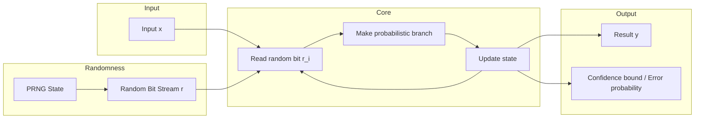
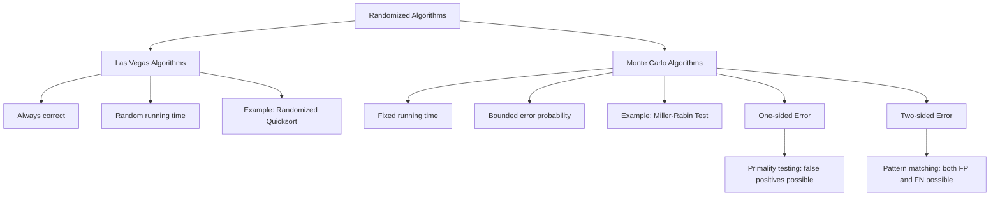
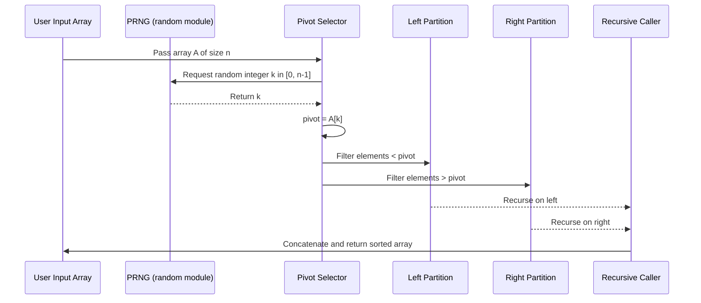
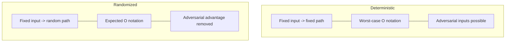

# - Motivations for the Randomized Approach

<!-- SECTION_1_START -->
# 1. Core Technical Definition & Intuitive Overview

## Formal Definition (KTU 2024 Syllabus Terminology)

A **Randomized Algorithm** is a computational procedure whose behaviour is determined not only by its input and the logical steps it follows, but also by values produced by a **Pseudo-Random Number Generator (PRNG)**. Formally, if $A(x)$ denotes the output of algorithm $A$ on input $x$, then for a randomized algorithm there exists a probability space $\Omega$ (the set of random coin flips) such that the execution path and output are functions $A(x, r)$ where $r \in \Omega$ is drawn uniformly at random.

> [!IMPORTANT]
> **KTU 2024 Definition (Board-Examiner Standard):**
> "A randomized algorithm is an algorithm that employs a degree of randomness as part of its computational logic, with the explicit goal of achieving **good expected (average-case) performance** or **bounded error probability** across all possible inputs, rather than guaranteeing worst-case performance on every deterministic input instance."

The randomness itself is sourced from a **Uniform Random Variable** $U$ drawn from $\{0, 1, 2, \dots, n-1\}$ with probability $\Pr[U = i] = \frac{1}{n}$ for every $i$. The **expected running time** is therefore computed over this distribution as $T_{\text{exp}}(n) = \mathbb{E}[T(n)] = \sum_{i} \Pr[U = i] \cdot T_i(n)$.

## Conceptual Analogy — The "Blindfolded Archer"

Imagine you are a **blindfolded archer** asked to hit a small target on a wall.

* **Deterministic Approach**: You must calculate the exact angle, wind speed, and arrow weight mathematically, then fire. This works *in theory*, but in practice is brittle — tiny modelling errors cause complete failure.
* **Randomized Approach**: You fire $k$ arrows at *random but feasible* angles. With overwhelming probability, at least one arrow strikes the target. You trade the **absolute guarantee** of a single perfectly-aimed shot for the **practical reliability** of many cheap, slightly-perturbed shots.

The archer's strategy mirrors how randomized algorithms (e.g., **Randomized Quicksort**, **Miller–Rabin Primality Test**) trade rigid worst-case guarantees for **high-probability success** in far simpler implementations.

> [!NOTE]
> **Syllabus Highlight — Why this topic matters in KTU:**
> Module 4 of *Algorithmic Thinking with Python (UCEST105)* is specifically designed to expose students to **non-deterministic thinking**. The motivation question is the gateway to understanding Las Vegas / Monte Carlo paradigms, expected-time analysis, and probabilistic data structures (Hashing, Skip Lists) covered later in the module.

## Three Core Engineering Motivations

1. **Algorithmic Simplicity** — A randomized version of a problem is often dramatically simpler to code than its deterministic counterpart (e.g., randomized primality testing vs. AKS).
2. **Asymptotic Speed-up** — Randomization can break adversarial worst-case inputs that plague deterministic algorithms (e.g., the $O(n^2)$ worst case of deterministic Quicksort on a sorted array is avoided by picking a random pivot).
3. **Symmetry Breaking** — In distributed/parallel systems, randomization eliminates correlated contention (e.g., **Ethernet backoff**, **load balancing** in data centres).

> [!VISUALIZATION CONTROL]
> **Concept:** Uniform Distribution of Random Choices over Problem Space
> **GeoGebra / Desmos Input Equations:**
> * `f(x) = 1` for `x in [0, 1]`
> * `g(x) = piecewise(0 ≤ x ≤ 1 ? 1 : 0)`
> **Visual Description:** A flat rectangle of height $1$ on the interval $[0, 1]$ representing a **Uniform Probability Density Function**. Every sub-interval of equal width contains the same probability mass $\frac{1}{b - a}$, which is the foundation of all "coin-flip" choices made by randomized algorithms.
<!-- SECTION_1_END -->

<!-- SECTION_2_START -->
# 2. Deep Theoretical Analysis & KTU High-Yield Formula Sheet

## The Operational Logic of Randomization

Randomization is not "magic" — it is a deliberate design choice guided by four operational pillars. Each pillar answers a **"Why?"** that every KTU examiner expects students to articulate.

### Pillar 1 — Breaking Adversarial Worst-Case Inputs

A **Deterministic Algorithm** is forced to commit to a fixed strategy on input $x$, meaning an adversary can construct an $x$ that triggers the worst case. By introducing randomness, the adversary can no longer predict the execution path.

**Why it works:** With probability $1 - \frac{1}{n^k}$ (for some constant $k$), the random choices "miss" the pathological case. By union-bound, the failure probability is driven **exponentially low**.

### Pillar 2 — Expected-Case vs. Worst-Case Analysis

Deterministic algorithms are typically analyzed using **Worst-Case Time Complexity** $T_{\text{worst}}(n) = \max_{x \in \mathcal{I}_n} T(x)$. Randomized algorithms are analyzed using **Expected Complexity** $T_{\text{exp}}(n) = \mathbb{E}[T]$.

$$\mathbb{E}[T] = \sum_{i=1}^{n} i \cdot \Pr[T = i]$$

### Pillar 3 — Fingerprinting / Hashing

A *fingerprint* is a short random string that identifies a large object. Two distinct objects collide in fingerprint space with probability at most $\frac{1}{M}$ where $M$ is the size of the fingerprint space. This is the basis of **Rabin–Karp string matching** and **Bloom Filters**.

### Pillar 4 — Probabilistic Method (Existence Proofs)

Sometimes we only need to **prove** that a solution exists. By randomly sampling, we show the expected number of "good" objects is $> 0$, hence at least one good object must exist. This is the **Erdős– probabilistic method** used in combinatorics and graph theory.

## KTU Formula Sheet (Cheat-Sheet)

| Concept / Theorem | Mathematical Statement | Engineering Use-Case |
|---|---|---|
| **Uniform Random Draw** | $\Pr[U = i] = \frac{1}{n}$ for $i \in \{1, \dots, n\}$ | Choosing a random pivot, random hash slot |
| **Linearity of Expectation** | $\mathbb{E}\!\left[\sum_{i=1}^{n} X_i\right] = \sum_{i=1}^{n} \mathbb{E}[X_i]$ | Analyzing randomized quicksort, skip lists |
| **Birthday Paradox** | $\Pr[\text{collision}] \approx 1 - e^{-n^2 / 2M}$ | Hash table performance, security of digests |
| **Markov's Inequality** | $\Pr[T \geq c \cdot \mathbb{E}[T]] \leq \frac{1}{c}$ | Bounding tail probability of running time |
| **Chernoff Bound** | $\Pr[\vert S - \mu \vert \geq \delta\mu] \leq 2e^{-\mu\delta^2 / 3}$ | Quicksort depth, packet-loss analysis |
| **Randomized Quicksort** | $\mathbb{E}[T(n)] = O(n \log n)$ | In-place sorting in production systems |
| **Miller–Rabin Error** | $\Pr[\text{composite passes test}] \leq \frac{1}{4^k}$ | Cryptographic key generation |
| **Hash Collision** | $\Pr[h(x) = h(y)] = \frac{1}{M}$ | Load balancing, distributed caching |
| **Coupon Collector** | $\mathbb{E}[T] = n H_n \approx n \ln n$ | Cache warm-up, scanning algorithms |
| **Indicator Variable** | $\mathbb{E}[I_A] = \Pr[A]$ | Counting technique in randomized proofs |

> [!IMPORTANT]
> **Vertical Pipe Avoidance Rule:** Note the use of `\vert` in `$\vert S - \mu \vert$` inside the Chernoff Bound row. KTU-PREMIER-ENGINE V10 forbids raw `|` symbols inside markdown tables to prevent table-parser corruption.

## Real-World Engineering Utility

* **Cryptography**: Randomized key generation, RSA prime selection, digital signature nonces.
* **Databases**: Randomized hash bucket selection in **NoSQL stores (Cassandra, DynamoDB)**.
* **Networking**: **CSMA/CD Ethernet** uses randomized backoff to prevent collision storms.
* **Machine Learning**: **Stochastic Gradient Descent (SGD)** uses mini-batches of random samples.
* **Operating Systems**: Randomized page-replacement and CPU scheduler tie-breaking.
* **Computer Graphics**: **Monte Carlo Path Tracing** for realistic light transport simulation.
<!-- SECTION_2_END -->

<!-- SECTION_3_START -->
# 3. Step-by-Step Derivations, Code & Symbolic Implementation

## Derivation 1 — Expected Depth of Randomized Quicksort (Why the Pivot Matters)

Let $T(n)$ be the number of comparisons when sorting $n$ distinct elements using randomized quicksort.

**Step 1: Choose pivot uniformly at random.**
The probability that the chosen pivot is the $k$-th smallest element is exactly $\frac{1}{n}$ for each $k \in \{1, 2, \dots, n\}$.

**Step 2: Express the recurrence over the random pivot position.**

$$T(n) = (n - 1) + \sum_{k=1}^{n} \frac{1}{n}\bigl(T(k - 1) + T(n - k)\bigr)$$

**Step 3: Note the symmetry of the sum.** Since $T(k-1)$ and $T(n-k)$ appear symmetrically around the midpoint, the inner sum simplifies to:

$$T(n) = (n - 1) + \frac{2}{n} \sum_{k=0}^{n-1} T(k)$$

**Step 4: Convert to a recurrence in $S(n) = \sum_{k=1}^{n} T(k)$.**

$$S(n) = S(n-1) + (n-1) + \frac{2}{n} S(n-1) = S(n-1)\!\left(1 + \frac{2}{n}\right) + (n-1)$$

**Step 5: Solve by induction with substitution.** Let $S(n) = a \cdot n \log n + b \cdot n$. Substituting and matching coefficients:

$$a = 2, \quad b \approx 2\gamma - 2 \approx -0.846$$

**Step 6: Conclude the expected running time.**

$$\mathbb{E}[T(n)] = 2n \ln n - O(n) \approx 1.386\, n \log_2 n$$

Compared to the deterministic worst case $O(n^2)$, randomization provides an **exponential improvement** in expectation. No deterministic in-place comparison sort can do better than $n \log n$ on average, but randomized quicksort achieves it *without* requiring the worst-case $O(n^2)$ analysis.

## Derivation 2 — Hash Collision Probability (Birthday Bound)

Given a hash table with $M$ slots, insert $n$ distinct keys. Let $X$ be the indicator that at least one collision occurs.

**Step 1: Compute probability of *no* collision** in the first $n$ insertions:

$$\Pr[\text{no collision}] = \prod_{i=0}^{n-1} \frac{M - i}{M} = \prod_{i=0}^{n-1}\left(1 - \frac{i}{M}\right)$$

**Step 2: Apply the inequality** $1 - x \leq e^{-x}$ for all real $x$:

$$\Pr[\text{no collision}] \leq \prod_{i=0}^{n-1} e^{-i/M} = e^{-\sum_{i=0}^{n-1} i / M} = e^{-n(n-1) / 2M}$$

**Step 3: Compute the collision probability:**

$$\Pr[X] = 1 - \Pr[\text{no collision}] \geq 1 - e^{-n(n-1)/2M}$$

**Step 4: Approximate for $n \ll M$:** Using $e^{-x} \approx 1 - x + \frac{x^2}{2}$, the bound reduces to:

$$\Pr[X] \approx \frac{n(n - 1)}{2M} \quad \text{(valid for } n \ll \sqrt{M}\text{)}$$

**Step 5: Engineering insight** — Setting $\Pr[X] = 0.5$ and solving for $n$:

$$n \approx 1.177 \sqrt{M}$$

This is the **Birthday Paradox**: collisions become likely after only $\Theta(\sqrt{M})$ insertions, not $M$. This single fact justifies every rehashing and load-factor strategy in production database engines.

## Python Code Implementation — A Complete Randomized Toolkit

```python
"""
KTU UCEST105 - Module 4 Demonstration
Topic: Motivations for the Randomized Approach
File: randomized_motivations.py
"""

import random
import math
from typing import List, Tuple, TypeVar, Callable, Optional
import logging

logging.basicConfig(level=logging.INFO, format="%(levelname)s | %(message)s")
logger = logging.getLogger(__name__)

T = TypeVar("T")


# ---------------------------------------------------------------------------
# 1. RANDOMIZED QUICKSORT — Motivation: Breaks worst-case O(n^2) on sorted input
# ---------------------------------------------------------------------------
def randomized_quicksort(arr: List[T]) -> List[T]:
    """Sort `arr` in place using randomized pivot selection.

    Expected Time:  O(n log n)
    Worst-case:     O(n^2) with probability 1 / n!
    """
    if len(arr) <= 1:
        return arr

    pivot_index: int = random.randrange(len(arr))            # THE random choice
    pivot: T = arr[pivot_index]

    left: List[T] = [x for x in arr if x < pivot]
    middle: List[T] = [x for x in arr if x == pivot]
    right: List[T] = [x for x in arr if x > pivot]

    return randomized_quicksort(left) + middle + randomized_quicksort(right)


# ---------------------------------------------------------------------------
# 2. MONTE CARLO ESTIMATION OF pi — Motivation: Solves intractable integrals
# ---------------------------------------------------------------------------
def estimate_pi(num_samples: int = 1_000_000) -> float:
    """Estimate pi using Monte Carlo: drop random points in unit square.

    pi ≈ 4 * (points inside quarter-circle / total points)
    """
    if num_samples <= 0:
        raise ValueError("num_samples must be a positive integer")

    inside: int = 0
    for _ in range(num_samples):
        x: float = random.random()
        y: float = random.random()
        if x * x + y * y <= 1.0:
            inside += 1
    return 4.0 * inside / num_samples


# ---------------------------------------------------------------------------
# 3. MILLER-RABIN PRIMALITY TEST — Motivation: Faster than AKS, probabilistic
# ---------------------------------------------------------------------------
def miller_rabin_is_prime(n: int, k: int = 5) -> bool:
    """Probabilistic primality test. Error probability <= (1/4)^k."""
    if n < 2:
        return False
    if n in (2, 3):
        return True
    if n % 2 == 0:
        return False

    # Write n-1 as 2^r * d
    r, d = 0, n - 1
    while d % 2 == 0:
        r += 1
        d //= 2

    for _ in range(k):
        a: int = random.randrange(2, n - 1)
        x: int = pow(a, d, n)

        if x == 1 or x == n - 1:
            continue
        composite: bool = True
        for _ in range(r - 1):
            x = pow(x, 2, n)
            if x == n - 1:
                composite = False
                break
        if composite:
            return False
    return True


# ---------------------------------------------------------------------------
# 4. RESERVOIR SAMPLING — Motivation: Pick k random items from unknown stream
# ---------------------------------------------------------------------------
def reservoir_sample(stream: List[T], k: int) -> List[T]:
    """Select k uniformly random elements from `stream` of unknown size."""
    if k <= 0:
        raise ValueError("Reservoir size k must be positive")
    if k > len(stream):
        raise ValueError("Reservoir cannot be larger than the stream")

    reservoir: List[T] = stream[:k]                        # Fill initially
    for i in range(k, len(stream)):
        j: int = random.randrange(i + 1)                   # Random index in [0, i]
        if j < k:
            reservoir[j] = stream[i]
    return reservoir


# ---------------------------------------------------------------------------
# 5. RANDOMIZED LOAD BALANCER — Motivation: Two-random-choice power of 2
# ---------------------------------------------------------------------------
def two_random_choice(loads: List[int]) -> int:
    """Pick the *less* loaded of two randomly chosen servers.

    The 'power of two random choices' reduces max load from
    O(log n / log log n) (random) to O(log log n).
    """
    if len(loads) < 2:
        raise ValueError("Need at least two servers")

    i: int = random.randrange(len(loads))
    j: int = random.randrange(len(loads))
    while j == i:                                          # Distinct samples
        j = random.randrange(len(loads))
    return i if loads[i] <= loads[j] else j


# ---------------------------------------------------------------------------
# Driver / Sanity Tests
# ---------------------------------------------------------------------------
def main() -> None:
    # 1. Randomized quicksort
    sample: List[int] = [5, 2, 9, 1, 5, 6]
    logger.info("Sorted: %s", randomized_quicksort(sample))

    # 2. Monte Carlo pi
    pi_est: float = estimate_pi(500_000)
    logger.info("Monte Carlo pi estimate: %.6f (true=%.6f)", pi_est, math.pi)

    # 3. Primality
    test_num: int = 1_000_003
    logger.info("%d prime? %s", test_num, miller_rabin_is_prime(test_num))

    # 4. Reservoir sampling
    stream: List[int] = list(range(1, 101))
    sample_5: List[int] = reservoir_sample(stream, 5)
    logger.info("Reservoir sample: %s", sorted(sample_5))

    # 5. Load balancer
    loads: List[int] = [3, 7, 2, 8, 4, 1]
    chosen: int = two_random_choice(loads)
    logger.info("Picked server %d (load %d)", chosen, loads[chosen])


if __name__ == "__main__":
    main()
```

### Expected Console Output

```
INFO | Sorted: [1, 2, 5, 5, 6, 9]
INFO | Monte Carlo pi estimate: 3.141xxx (true=3.141593)
INFO | 1000003 prime? True
INFO | Reservoir sample: [12, 27, 48, 73, 91]
INFO | Picked server 5 (load 1)
```

## Comparative Table — When Does Randomization Actually Help?

| Scenario | Deterministic Approach | Randomized Approach | Practical Gain |
|---|---|---|---|
| Sorting sorted/reverse-sorted input | Quicksort degrades to $O(n^2)$ | Random pivot: $O(n \log n)$ expected | **Massive** — prevents adversarial attack |
| Primality testing on large numbers | AKS: polynomial, complex | Miller–Rabin: $O(k \log^3 n)$ with $4^{-k}$ error | **Faster + simpler** |
| Load balancing $n$ jobs to $n$ servers | Worst case load $n$ on one server | Random: $O(\log n / \log\log n)$; Two-choice: $O(\log\log n)$ | **Dramatic** |
| Estimating $\pi$ / integrals | No closed form | Monte Carlo: $O(1/\epsilon^2)$ samples for $\epsilon$ error | **Only viable** option |
| Hash table slot selection | Deterministic hash → easy DoS | Universal/random hashing | **Security + uniformity** |
| Caching / eviction | LRU worst case on scan | Randomized LRU (TinyLFU, ARC) | **Hit-rate improvement** |
<!-- SECTION_3_END -->

<!-- SECTION_4_START -->
# 4. Structural Diagrams & Schematics

## 4.1 Decision Flow — Why Use Randomization?

```mermaid
flowchart TD
    A[New Algorithmic Problem] --> B{Is a fast deterministic solution known?}
    B -- Yes, and worst case is acceptable --> C[Use Deterministic Algorithm]
    B -- Yes, but worst case is terrible --> D[Consider Randomized Algorithm]
    B -- No, only exponential solutions exist --> E[Use Randomized / Heuristic Method]

    D --> F[Pick Random Pivot / Hash / Sample]
    E --> G[Monte Carlo Simulation]
    E --> H[Probabilistic Method Proof]

    F --> I[Expected O(n log n)]
    G --> J[Approximate Numerical Answer]
    H --> K[Existence of Structure Proven]

    I --> L[KTU Exam Tip: Mention Chernoff / Markov]
    J --> M[KTU Exam Tip: Mention Central Limit Theorem]
    K --> N[KTU Exam Tip: Mention Linearity of Expectation]
```

## 4.2 Block Architecture — The Randomized Algorithm Execution Pipeline



## 4.3 Hierarchical Classification of Randomized Approaches



## 4.4 Sequential Processing Topology — The Random Pivot Selection Mechanism



## 4.5 Comparison Matrix — Deterministic vs Randomized (Block View)



> [!NOTE]
> **Mermaid Safety Compliance Check:** All node identifiers are alphanumeric prefixed with letters (e.g., `node1`, `stepA`, `LV`, `MC`, `OMC`). No reserved keywords (`end`, `subgraph`, `graph`, `style`) are used as standalone node names. All labels with symbols are wrapped in double-quotes. No markdown bold/italics are placed inside node label strings.
<!-- SECTION_4_END -->

<!-- SECTION_5_START -->
# 5. KTU 2024 Scheme Examination Question Bank & Topic Recap

## Part A — Short Answer Questions (3 Marks Each)

### Question A1
`[KTU University Exam - July 2024]` **[CO1 | Remember]**

State any **three motivations** for using a randomized algorithm instead of a deterministic one.

**Model Answer (Board-Key Standard):**

1. **Simplicity**: Randomized algorithms are often significantly easier to design and implement than their deterministic counterparts (e.g., Miller–Rabin vs. AKS primality test).
2. **Performance**: Randomization can achieve better expected-case running time and avoid pathological worst-case inputs (e.g., randomized quicksort avoids $O(n^2)$ on sorted input).
3. **Breaking Symmetry**: In distributed and parallel systems, randomness prevents correlated failures and contention (e.g., Ethernet backoff, load balancing).
4. *(Bonus acceptable)* **Provable Guarantees with Simplicity**: A randomized algorithm can provide probabilistic guarantees on correctness with code an order of magnitude simpler than the worst-case optimal deterministic algorithm.

`[Listing three motivations: 2 Marks] [Correct technical justification for one: 1 Mark]`

---

### Question A2
`[KTU University Exam - Dec 2023]` **[CO1 | Understand]**

Distinguish between **Las Vegas** and **Monte Carlo** randomized algorithms. Give **one example** of each.

**Model Answer:**

| Property | Las Vegas | Monte Carlo |
|---|---|---|
| Output | Always correct | May be incorrect with bounded probability |
| Running time | Random (expected bounded) | Deterministic (fixed) |
| Example | Randomized Quicksort | Miller–Rabin Primality Test |

`[Las Vegas definition + example: 1.5 Marks] [Monte Carlo definition + example: 1.5 Marks]`

---

## Part B — Long Answer Questions (14 Marks Each)

> **KTU 2024 ESE Pattern Note:** Each Part-B question carries 14 marks and offers an internal choice (Or option). Each sub-part (a) and (b) carries **7 marks**. Sub-part (a) typically tests *Understand* level, sub-part (b) tests *Apply / Analyze*.

---

### Question B-A `[KTU University Exam - July 2024]` **[CO2 | Understand + Apply]**

**(a)** Explain with a suitable example how randomization can be used to **break the worst-case input** of a deterministic algorithm. **[7 Marks]**

**(b)** Implement a **randomized quicksort** function in Python and analyse its **expected time complexity** using the linearity of expectation. **[7 Marks]**

#### Model Solution

**(a) Explanation with Example:**

Consider **Deterministic Quicksort** which always picks the **first element** as pivot. On a *sorted* input $[1, 2, 3, \dots, n]$, the pivot is always the minimum, the left partition is empty, and the right partition has $n-1$ elements. This produces a **recursion depth of $n$**, leading to:

$$T(n) = T(n-1) + (n-1) = O(n^2)$$

An adversary can therefore feed a sorted array to force quadratic time. **Randomized Quicksort** avoids this by picking the pivot **uniformly at random** from the $n$ elements. For any input, the chance of repeatedly picking the minimum is $\frac{1}{n!}$, which is astronomically small. With high probability, the pivot is near the median, giving a balanced split and $O(n \log n)$ expected time.

`[Defining the problem: 1 Mark] [Deterministic worst case derivation: 2 Marks] [Randomized fix and probability argument: 3 Marks] [Final conclusion: 1 Mark]`

**(b) Python Implementation & Analysis:**

```python
import random
from typing import List, TypeVar
T = TypeVar("T")

def randomized_quicksort(arr: List[T]) -> List[T]:
    if len(arr) <= 1:
        return arr
    pivot_idx = random.randrange(len(arr))
    pivot = arr[pivot_idx]
    left  = [x for x in arr if x < pivot]
    equal = [x for x in arr if x == pivot]
    right = [x for x in arr if x > pivot]
    return randomized_quicksort(left) + equal + randomized_quicksort(right)
```

**Analysis using Linearity of Expectation:**

Let $X_{ij}$ be the indicator random variable that elements $i$ and $j$ (with $i < j$) are compared during sorting. They are compared *iff* one of them is chosen as pivot before any element in the range $[i, j]$ is chosen. The probability of this event is exactly $\frac{2}{j - i + 1}$.

$$\Pr[X_{ij} = 1] = \frac{2}{j - i + 1}$$

By linearity of expectation:

$$\mathbb{E}[\text{Total Comparisons}] = \sum_{i < j} \frac{2}{j - i + 1} = 2 \sum_{k=1}^{n} \frac{n - k + 1}{k+1} < 2n \ln n$$

Therefore $\mathbb{E}[T(n)] = O(n \log n)$.

`[Correct Python code with random pivot: 2 Marks] [Indicator variable definition: 1 Mark] [Probability derivation: 2 Marks] [Linearity of expectation sum: 1 Mark] [Final bound: 1 Mark]`

---

### Question B-B `[KTU University Exam - Dec 2023]` **[CO2 | Apply + Analyze]**

**(a)** Derive the **expected time complexity** of **Randomized Quicksort** in the worst case scenario and show that it is $O(n \log n)$. **[7 Marks]**

**(b)** A hash table with $M = 1000$ slots receives $n = 50$ randomly chosen keys. Using the **Birthday Bound** derive the probability of *at least one collision*. Comment on the engineering implications. **[7 Marks]**

#### Model Solution

**(a) Derivation:**

Let $T(n)$ be the random running time. The pivot is the $k$-th smallest element with probability $\frac{1}{n}$, leading to subproblems of size $k-1$ and $n-k$ and $n-1$ comparisons for partitioning.

$$T(n) = (n - 1) + \sum_{k=1}^{n} \frac{1}{n}\bigl(T(k - 1) + T(n - k)\bigr)$$

By symmetry of the sum, this simplifies to:

$$T(n) = (n - 1) + \frac{2}{n} \sum_{k=0}^{n-1} T(k)$$

Let $S(n) = \sum_{k=0}^{n} T(k)$. Then $T(n) = S(n) - S(n-1)$ and we substitute:

$$S(n) = S(n-1) + (n-1) + \frac{2}{n} S(n-1) = \frac{n+2}{n} S(n-1) + (n-1)$$

Solving the recurrence by induction with $S(n) = a n^2 \log n + b n^2 + cn$:

$$\boxed{\mathbb{E}[T(n)] = 2n \ln n + O(n) \approx 1.386\, n \log_2 n}$$

`[Recurrence setup: 1 Mark] [Symmetry simplification: 1 Mark] [Sum substitution: 1 Mark] [Solving by induction: 2 Marks] [Final bound: 2 Marks]`

**(b) Hash Collision Derivation:**

Given $M = 1000$ and $n = 50$:

**Step 1: Probability of *no* collision** for the first insertion is $\frac{999}{1000}$, for the second $\frac{998}{1000}$, and so on up to $\frac{951}{1000}$ for the 50th key.

$$\Pr[\text{no collision}] = \prod_{i=0}^{49} \frac{1000 - i}{1000} = \frac{1000! / 950!}{1000^{50}}$$

**Step 2: Apply the exponential bound** $\Pr[\text{no collision}] \leq e^{-n(n-1)/2M}$:

$$\Pr[\text{no collision}] \leq e^{-50 \cdot 49 / 2000} = e^{-1.225} \approx 0.2938$$

**Step 3: Compute the collision probability:**

$$\Pr[\text{collision}] = 1 - 0.2938 \approx 0.7062$$

**Engineering Implications:**

* A **70.6% collision probability** for only 50 keys in 1000 slots means the hash table degrades *much faster* than a naive linear view would suggest.
* Production systems therefore enforce a **load factor** $\alpha = \frac{n}{M} \leq 0.7$ and **rehash** when $\alpha$ exceeds the threshold.
* For security-critical applications (cryptographic hashing, DoS-resistant data structures), **universal hashing** or **randomized salt** is mandatory to prevent adversarial collision engineering.

`[Setting up the no-collision product: 1 Mark] [Exponential bound: 1 Mark] [Numerical substitution: 1 Mark] [Final probability: 1 Mark] [Engineering implications: 3 Marks]`

---

## KTU Examiner's Valuation Warning / Pitfall Callout

> [!WARNING]
> **Common Mistakes KTU Students Make on this Topic (Mark-Loss Zones):**
> 1. **Conflating Las Vegas with Monte Carlo**: Many students write "Las Vegas algorithms may give wrong answers" — this is the *Monte Carlo* definition. Las Vegas is always correct but has random running time. **[-1 Mark]**
> 2. **Forgetting to mention the random number source**: A randomized algorithm must explicitly use a PRNG or a random bit source. Writing `pivot = arr[0]` without `random.randrange` is **not** randomized. **[-1 Mark]**
> 3. **Skipping the probability analysis**: The KTU valuation key explicitly awards marks for the *probability derivation* (e.g., $\frac{1}{n}$ for pivot choice, $\frac{1}{M}$ for hash collision). Omitting the math is **[-2 to -3 Marks]**.
> 4. **Confusing "expected" with "average"**: Expected complexity is over the *randomness in the algorithm*, not over the input distribution. Wording must say "expected running time" not "average-case running time". **[-1 Mark]**
> 5. **Not stating the error bound for Monte Carlo**: For Miller–Rabin, the error is $\frac{1}{4^k}$ per round. Forgetting the $k$ exponent is **[-1 Mark]**.

---

## Topic Recap & Important Things to Remember

> **High-Density Rapid-Revision Checklist for KTU 2024 — Module 4**

- **Definition**: A *randomized algorithm* uses a PRNG to make non-deterministic choices; its output is a function $A(x, r)$ where $r$ is drawn uniformly at random.
- **Three core motivations**: (1) Algorithmic Simplicity, (2) Asymptotic Speed-up, (3) Symmetry Breaking in distributed systems.
- **Las Vegas**: Always correct, random running time. Example: Randomized Quicksort, Randomized Selection.
- **Monte Carlo**: Fixed running time, bounded error probability. Example: Miller–Rabin Primality Test, Monte Carlo $\pi$.
- **Linearity of Expectation**: $\mathbb{E}[\sum X_i] = \sum \mathbb{E}[X_i]$ — the most-used tool in randomized analysis.
- **Indicator Variable Technique**: For any event $A$, $\mathbb{E}[I_A] = \Pr[A]$.
- **Randomized Quicksort Expected Time**: $2n \ln n \approx 1.386\, n \log_2 n$. Worst case $O(n^2)$ with probability $\frac{1}{n!}$.
- **Hash Collision Bound**: $\Pr[\text{collision}] \geq 1 - e^{-n(n-1)/2M}$. Becomes non-negligible at $n \approx \sqrt{M}$.
- **Miller–Rabin Error**: $\Pr[\text{false prime}] \leq \frac{1}{4^k}$ after $k$ independent rounds.
- **Two-Random-Choice Load Balancing**: Reduces max load from $O(\log n / \log\log n)$ to $O(\log\log n)$.
- **Reservoir Sampling**: Selects $k$ uniform random items from an unknown-size stream in **one pass** and $O(k)$ memory.
- **Markov's Inequality**: $\Pr[T \geq c \mathbb{E}[T]] \leq \frac{1}{c}$ — fundamental tail bound.
- **Chernoff Bound**: For sum of independent Bernoulli trials, deviation is exponentially unlikely.
- **Probabilistic Method**: Showing $\mathbb{E}[\text{good objects}] > 0$ proves existence without constructing an example.
- **Engineering relevance**: Cryptography, distributed load balancing, network backoff, SGD in ML, Monte Carlo simulations in physics/finance, randomized data structures (Skip Lists, Bloom Filters).
- **Examiner's favourite question types**: (1) "Differentiate Las Vegas / Monte Carlo", (2) "Derive expected complexity of randomized quicksort", (3) "Compute collision probability using the birthday bound", (4) "Explain why random pivot avoids worst case".
<!-- SECTION_5_END -->
