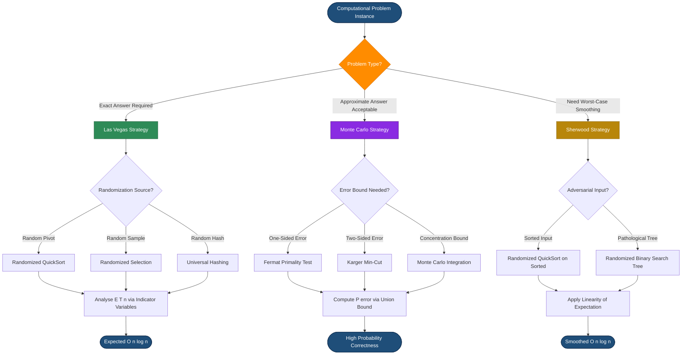
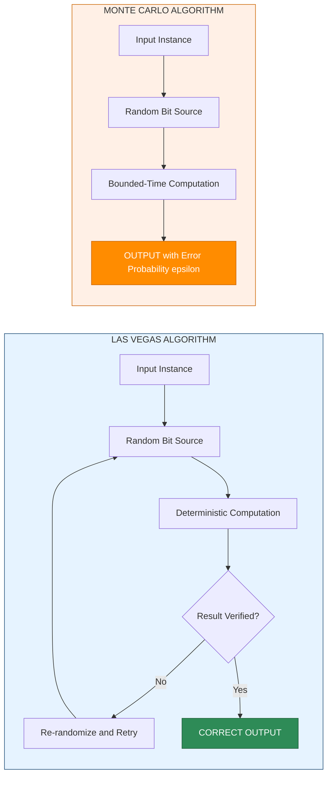
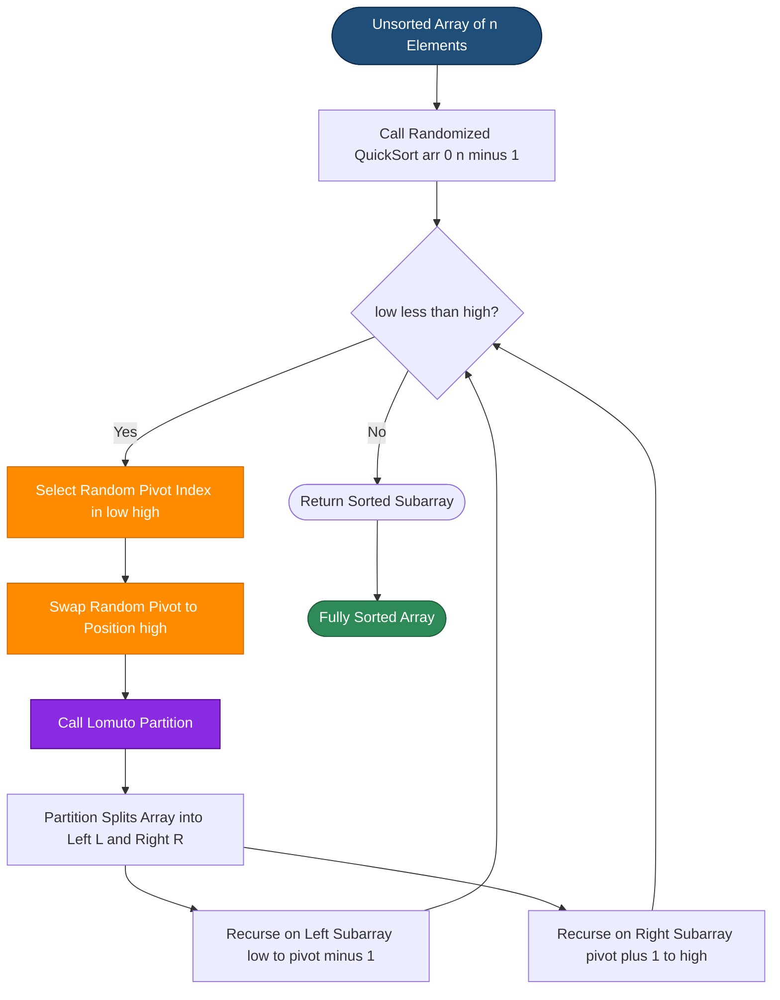
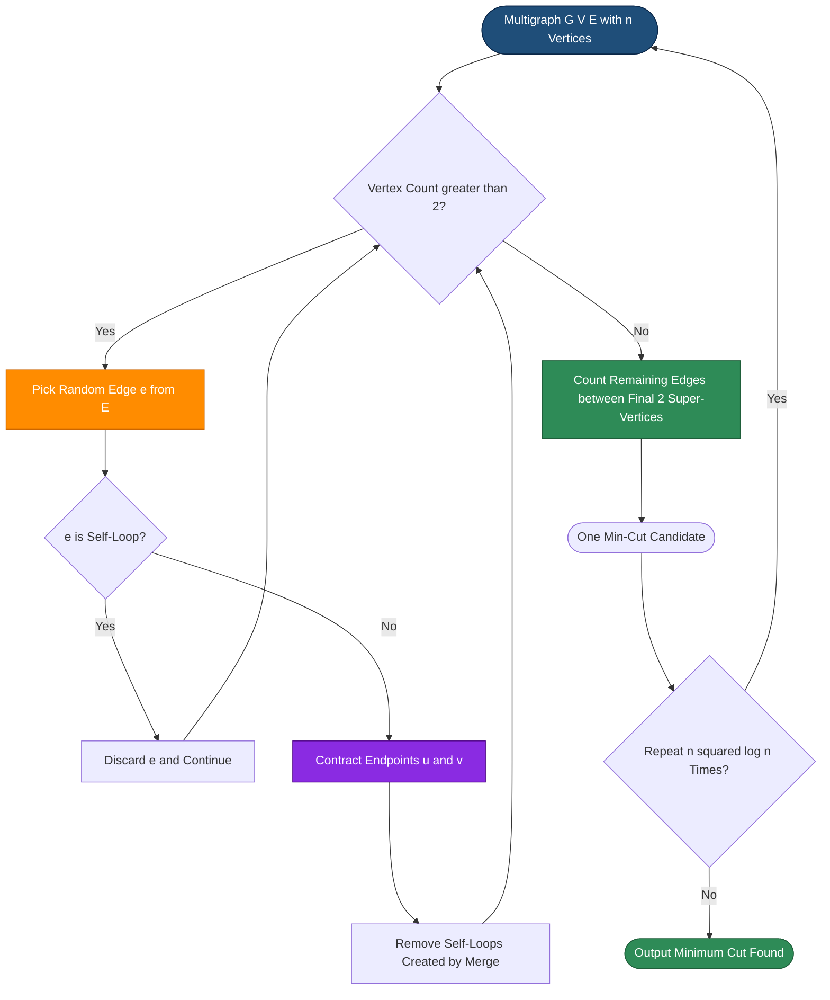

# Randomized Approach

<!-- SECTION_1_START -->
# Randomized Approach in Algorithmic Thinking

## 1.1 Formal Academic Definition (KTU 2024 Syllabus Aligned)

A **Randomized Algorithm** is an algorithmic paradigm that introduces deliberate randomness into the logic of the algorithm, typically by making random choices during execution, to achieve superior average-case performance, simplicity of design, or to overcome worst-case adversaries. The randomness is usually achieved through a **Pseudo-Random Number Generator (PRNG)** seeded with system entropy.

Formally, a randomized algorithm $\mathcal{A}$ maps an input instance $I$ and a random bit string $R \in \{0,1\}^k$ to an output $\mathcal{A}(I, R)$. The output is analysed with respect to the **random variable** $R$ assuming a uniform distribution over the bit space.

> [!IMPORTANT]
> **KTU 2024 Scheme Definition:** A randomized algorithm is one whose behaviour is determined not only by its input but also by values produced by a random number generator. The expected running time and/or correctness is computed over the random choices.

### Classification of Randomized Algorithms

| Class | Correctness Guarantee | Running Time Guarantee | Classical Example |
| :--- | :--- | :--- | :--- |
| **Las Vegas Algorithm** | Always produces the correct result | Expected (random) running time | Randomized QuickSort, Randomized Selection |
| **Monte Carlo Algorithm** | Produces correct result with high probability $1 - \epsilon$ | Deterministic / bounded running time | Fermat Primality Test, Karger’s Min-Cut |
| **Sherwood Algorithm** | Always correct | Smooths out worst-case to expected average | Randomized HeapSort, Hashing |

## 1.2 Conceptual Analogy & Intuition

> [!NOTE]
> **Intuition (The Lost Key Analogy):** Imagine you dropped a key in a long dark hallway with 1000 identical doors. A *deterministic* algorithm would open every door sequentially, doors 1, 2, 3... taking up to 1000 steps. A *randomized* algorithm would shuffle the door numbers and start opening them in random order. If the key is near the middle (door 500), the deterministic method wastes 499 steps, but the randomized method statistically finds it in $\approx 500$ steps. More importantly, even if an adversary hides the key at door 1000, a well-designed randomized approach has an *expected* behaviour immune to worst-case placement.

**Why use randomness in algorithms?**

1. **Adversarial Immunity:** A deterministic QuickSort degrades to $O(n^2)$ on sorted input. Randomized QuickSort maintains $O(n \log n)$ *expected* time regardless of input.
2. **Simplicity:** Karger’s randomized Min-Cut is dramatically simpler than Nagamochi-Ibaraki.
3. **Cryptographic Security:** Randomized public-key primitives (RSA, Diffie–Hellman) derive their strength from random prime selection.
4. **Derandomization Insight:** Studying randomized algorithms often reveals that they can be derandomized using *k-wise independent hash families*.

### Probabilistic Primitives

- **Uniform Random Variable $X \sim U(a, b)$:** $P(X = k) = \frac{1}{b - a + 1}$ for all $k \in [a, b]$.
- **Bernoulli Trial:** A trial with success probability $p$. The indicator random variable $I\{A\}$ equals **1** if event $A$ occurs, **0** otherwise.
- **Expected Value $\mathbb{E}[X]$:** The probability-weighted average $\mathbb{E}[X] = \sum_{x} x \cdot P(X = x)$.

> [!VISUALIZATION CONTROL]
> **Concept:** Probability Mass Function of a fair die and uniform distribution on $[0,1]$.
> **GeoGebra / Desmos Input Equations:**
> * `f(x) = 1, domain: 0 <= x <= 1` (Uniform distribution)
> * Plot the points `{(1, 1/6), (2, 1/6), (3, 1/6), (4, 1/6), (5, 1/6), (6, 1/6)}` for discrete fair die.
> **Visual Description:** On the x-axis, plot a rectangle of height 1 spanning $[0,1]$ representing the continuous uniform distribution. For the discrete case, six bars of equal height $\frac{1}{6}$ rise from x = 1 to x = 6. Observe that *every outcome is equally likely* — this equality is the foundation of randomized algorithm analysis.

## 1.3 Why Randomization Works — The Core Insight

The fundamental theorem underwriting randomized algorithms is the **Probabilistic Method**:

$$\text{If } P(\text{bad event}) < 1, \text{ then a "good" outcome exists.}$$

Combined with **Markov’s Inequality** for non-negative random variables:

$$P(X \geq a) \leq \frac{\mathbb{E}[X]}{a}$$

and the **Union Bound** for countable events:

$$P\left(\bigcup_{i} A_i\right) \leq \sum_{i} P(A_i)$$

we can prove that randomly chosen solutions exceed deterministic worst-case behaviour on average. The KTU 2024 syllabus emphasizes that *expected* time complexity, not worst-case, governs randomized algorithm design.

<!-- SECTION_1_END -->

<!-- SECTION_2_START -->
# Deep Theoretical Analysis & KTU High-Yield Formula Sheet

## 2.1 Mathematical Foundations of Randomization

### 2.1.1 Indicator Random Variables (IRV)

For any event $A$ in a sample space $\Omega$, the **indicator random variable** is:

$$I\{A\} = \begin{cases} 1 & \text{if } A \text{ occurs} \\ 0 & \text{otherwise} \end{cases}$$

The expectation is elegantly simple:

$$\mathbb{E}[I\{A\}] = P(A)$$

This identity is the workhorse of KTU-level randomized analysis.

### 2.1.2 Linearity of Expectation

For any finite collection of random variables $X_1, X_2, \ldots, X_n$ (independent or not):

$$\mathbb{E}\left[\sum_{i=1}^{n} X_i\right] = \sum_{i=1}^{n} \mathbb{E}[X_i]$$

This permits decomposing a complex random process into tractable indicator components.

### 2.1.3 The Birthday Paradox & Coupon Collector

Two foundational probabilistic results that reappear in KTU problems:

$$\text{Birthday Threshold: } P(\text{collision among } k \text{ items in } n \text{ bins}) \approx 1 - e^{-k(k-1)/(2n)}$$

$$\text{Coupon Collector Expectation: } \mathbb{E}[T] = n \cdot H_n \approx n \ln n + \gamma n$$

where $H_n = \sum_{i=1}^{n} \frac{1}{i}$ is the **$n$-th Harmonic Number** and $\gamma \approx 0.5772$ is the **Euler–Mascheroni constant**.

## 2.2 Randomized QuickSort — The Pedagogical Anchor

In **Randomized QuickSort**, the pivot is chosen uniformly at random rather than deterministically (e.g., first or last element). This decouples the algorithm’s performance from the input ordering.

### Expected Time Derivation Strategy

Let $T(n)$ be the random variable denoting the number of comparisons made by Randomized QuickSort on an input of size $n$. The total comparison cost equals the sum of indicator variables over all unordered pairs:

$$T(n) = \sum_{i=1}^{n-1} \sum_{j=i+1}^{n} X_{ij}$$

where $X_{ij}$ is the indicator that elements $z_i$ (the $i$-th smallest) and $z_j$ (the $j$-th smallest) are compared during execution.

**Critical observation:** $X_{ij} = 1$ *if and only if* the very first pivot chosen from the sub-array $\{z_i, z_{i+1}, \ldots, z_j\}$ is either $z_i$ or $z_j$. Any other pivot splits the sub-array and $z_i$ and $z_j$ end up in different partitions, never to be compared.

### 2.2.1 The Probability of Comparison

The number of elements in $\{z_i, \ldots, z_j\}$ is $j - i + 1$. Since the pivot is chosen uniformly:

$$P(\text{pivot} = z_i) = P(\text{pivot} = z_j) = \frac{1}{j - i + 1}$$

$$P(X_{ij} = 1) = \frac{2}{j - i + 1}$$

### 2.2.2 Computing the Expectation

$$\mathbb{E}[T(n)] = \sum_{i=1}^{n-1} \sum_{j=i+1}^{n} \frac{2}{j - i + 1}$$

Substitute $k = j - i + 1$ so that $k$ ranges from $2$ to $n$:

$$\mathbb{E}[T(n)] = \sum_{k=2}^{n} \frac{2(n - k + 1)}{k} = 2 \sum_{k=1}^{n} \frac{n - k + 1}{k} - 2n$$

This reduces to:

$$\mathbb{E}[T(n)] = 2n \sum_{k=1}^{n} \frac{1}{k} - 2n = 2n \cdot H_n - 2n$$

Since $H_n \leq \ln n + 1$:

$$\boxed{\mathbb{E}[T(n)] = O(n \log n)}$$

This matches the *average-case* of deterministic QuickSort but holds for *every* input — a stunning result.

## 2.3 Karger’s Randomized Min-Cut Algorithm

Given an undirected multigraph $G = (V, E)$ with $n$ vertices and $m$ edges, find the minimum cut (smallest set of edges whose removal disconnects the graph).

### 2.3.1 Edge Contraction

The operation $(u, v) \leftarrow \text{merge}(u, v)$ replaces vertices $u$ and $v$ with a single super-vertex. All edges between $u$ and $v$ become **self-loops** (deleted). Multi-edges are preserved.

### 2.3.2 Algorithm

1. While $|V| > 2$: pick an edge $e$ **uniformly at random** and contract it.
2. The remaining edges between the final two super-vertices form a cut.

### 2.3.3 Success Probability

If the true min-cut has size $k$, every edge in the graph touches at most $k$ vertices in the min-cut, so $\deg(v) \geq k$ for all $v$, implying $m \geq nk/2$.

The probability that **none** of the $n-2$ contracted edges is a min-cut edge is:

$$P(\text{success in one trial}) \geq \frac{k}{m} \cdot \frac{k}{m-1} \cdots \frac{k}{m - n + 3} \geq \frac{2}{n(n-1)}$$

By independence, repeating the algorithm $N = \binom{n}{2} \cdot \ln n$ times and taking the minimum yields a Monte Carlo algorithm with failure probability $\leq 1/n$.

## 2.4 Randomized Primality Testing — Fermat Test

For odd $n > 2$, choose $a \in \{2, 3, \ldots, n-1\}$ uniformly at random. Compute:

$$a^{n-1} \mod n$$

- If the result $\neq 1$, $n$ is **composite** (Fermat witness).
- If the result equals $1$, $n$ is **probably prime** (Fermat liar).

**Fermat’s Little Theorem:** If $n$ is prime, then $a^{n-1} \equiv 1 \pmod{n}$ for all $a$ coprime to $n$.

For Carmichael numbers (e.g., 561, 1105, 1729), the Fermat test always returns *probably prime*. KTU 2024 typically requires students to know that **Miller-Rabin** is the production-grade fix using strong pseudoprime testing.

## 2.5 KTU High-Yield Formula Sheet

> [!IMPORTANT]
> **Master these formulas — they constitute 80% of Part A and Part B derivations in the 2024 Scheme.**

| Concept | Formula / Bound | Application |
| :--- | :--- | :--- |
| **Linearity of Expectation** | $\mathbb{E}[\sum X_i] = \sum \mathbb{E}[X_i]$ | Decomposing randomized QuickSort comparisons |
| **Indicator Expectation** | $\mathbb{E}[I\{A\}] = P(A)$ | Event-based analysis |
| **Markov’s Inequality** | $P(X \geq a) \leq \mathbb{E}[X] / a$ | Bounding tail of non-negative RV |
| **Chebyshev’s Inequality** | $P(\vert X - \mu \vert \geq k\sigma) \leq 1/k^2$ | Bounding variance |
| **Chernoff Bound** | $P(X \geq (1+\delta)\mu) \leq \left(\frac{e^\delta}{(1+\delta)^{(1+\delta)}}\right)^\mu$ | Sum of independent Bernoulli trials |
| **Randomized QuickSort** | $\mathbb{E}[T(n)] = 2n H_n - 2n = O(n \log n)$ | Expected comparisons |
| **Harmonic Number** | $H_n = \sum_{i=1}^{n} 1/i \approx \ln n + \gamma$ | Series appearing in randomized recurrences |
| **Karger’s Min-Cut** | $P(\text{success per trial}) \geq 2/(n(n-1))$ | Independent trials guarantee |
| **Coupon Collector** | $\mathbb{E}[T] = n H_n$ | Hashing analysis |
| **Birthday Collision** | $P(\text{collision}) \approx 1 - e^{-k^2/2n}$ | Hash table performance |
| **Bernoulli Variance** | $\text{Var}(I\{A\}) = p(1-p)$ | Variance analysis |
| **Modular Exponentiation** | $a^b \mod n$ via repeated squaring in $O(\log b)$ | Primality testing core |

## 2.6 Real-World Engineering Utility

| Domain | Randomized Algorithm | Production Use Case |
| :--- | :--- | :--- |
| **Databases** | Hashing with Universal Hash Families | Distributed key-value stores (Cassandra, DynamoDB) |
| **Networks** | Karger-style cut algorithms | Network reliability and graph partitioning |
| **Cryptography** | Randomized Primality, RSA key generation | TLS handshakes, SSH keypairs |
| **ML / AI** | Stochastic Gradient Descent (SGD) | Training neural networks (PyTorch, TensorFlow) |
| **Compilers** | Randomized register allocation | LLVM optimization passes |
| **Search Engines** | Monte Carlo Tree Search (MCTS) | AlphaGo, game AI |
| **Bioinformatics** | Randomized motif finding | Gibbs sampler for DNA sequences |

<!-- SECTION_2_END -->

<!-- SECTION_3_START -->
# Step-by-Step Derivations & Python Implementations

## 3.1 Exhaustive Derivation: Expected Time of Randomized QuickSort

> [!NOTE]
> **Module Mapping:** This derivation directly maps to KTU UCEST105 Module 4 — *Computational Approaches to Problem*.

### Setup

Let $z_1 < z_2 < \cdots < z_n$ be the input elements in sorted order. Define:

$$T(n) = \sum_{i=1}^{n-1} \sum_{j=i+1}^{n} X_{ij}$$

where $X_{ij}$ is the indicator that $z_i$ and $z_j$ are compared during Randomized QuickSort execution.

### Key Lemma (Probability of Comparison)

**Claim:** $X_{ij} = 1$ if and only if either $z_i$ or $z_j$ is the first pivot chosen from the sub-array $\{z_i, z_{i+1}, \ldots, z_j\}$.

**Justification:**
1. The sub-array $\{z_i, \ldots, z_j\}$ is formed when the first pivot chosen from $\{z_i, \ldots, z_j\}$ splits the original array.
2. If that pivot is some $z_k$ with $i < k < j$, then $z_i$ and $z_j$ land in different partitions and can **never** be compared.
3. Conversely, if the first pivot is $z_i$ or $z_j$, the other element is compared with it as the partition is formed.

**Probability calculation:** The pivot is uniform over $j - i + 1$ candidates:

$$P(X_{ij} = 1) = P(\text{pivot} = z_i) + P(\text{pivot} = z_j) = \frac{1}{j - i + 1} + \frac{1}{j - i + 1} = \frac{2}{j - i + 1}$$

### Expectation Calculation

Apply linearity of expectation:

$$\mathbb{E}[T(n)] = \mathbb{E}\left[\sum_{i=1}^{n-1}\sum_{j=i+1}^{n} X_{ij}\right] = \sum_{i=1}^{n-1}\sum_{j=i+1}^{n} \mathbb{E}[X_{ij}] = \sum_{i=1}^{n-1}\sum_{j=i+1}^{n} \frac{2}{j - i + 1}$$

Substitute $k = j - i + 1$, so $k$ ranges from $2$ to $n$. The number of $(i,j)$ pairs giving a fixed $k$ is $n - k + 1$:

$$\mathbb{E}[T(n)] = \sum_{k=2}^{n} \frac{2(n - k + 1)}{k} = 2 \sum_{k=2}^{n} \frac{n - k + 1}{k}$$

Extend the sum to start from $k = 1$ (the $k=1$ term contributes $2n/1$, which we then subtract):

$$\mathbb{E}[T(n)] = 2 \sum_{k=1}^{n} \frac{n - k + 1}{k} - 2n$$

Split the sum:

$$\mathbb{E}[T(n)] = 2(n+1) \sum_{k=1}^{n} \frac{1}{k} - 2 \sum_{k=1}^{n} 1 = 2(n+1) H_n - 2n$$

Using $H_n \leq \ln n + 1$ and dropping lower-order terms:

$$\boxed{\mathbb{E}[T(n)] = O(n \log n)}$$

## 3.2 Python Implementation: Randomized QuickSort

```python
"""
Randomized QuickSort Implementation
Course: ALGORITHMIC THINKING WITH PYTHON (UCEST105)
Module 4: Computational Approaches to Problem
Topic: Randomized Approach — Las Vegas Algorithm
"""
import random
import sys
from typing import List

# Increase recursion limit for large inputs
sys.setrecursionlimit(10**6)

class RandomizedQuickSort:
    """
    A Las Vegas algorithm: ALWAYS produces a correctly sorted list.
    The randomness is in the pivot selection, smoothing the expected time.
    """
    
    def __init__(self, seed: int | None = None) -> None:
        self.comparisons: int = 0
        self.random_state = random.Random(seed)
    
    def sort(self, arr: List[int]) -> List[int]:
        """Public entry point: returns a new sorted list."""
        data = arr.copy()
        self._quicksort(data, 0, len(data) - 1)
        return data
    
    def _quicksort(self, arr: List[int], low: int, high: int) -> None:
        """Recursive quicksort with randomized pivot."""
        if low < high:
            # Step 1: Randomize the pivot (Las Vegas randomization)
            pivot_index = self._randomized_partition(arr, low, high)
            
            # Step 2: Recurse on the two partitions
            self._quicksort(arr, low, pivot_index - 1)
            self._quicksort(arr, pivot_index + 1, high)
    
    def _randomized_partition(self, arr: List[int], low: int, high: int) -> int:
        """
        Randomly choose a pivot in arr[low..high], swap it to the end,
        and perform Lomuto partition.
        """
        # Choose a random index between low and high (inclusive)
        random_index = self.random_state.randint(low, high)
        arr[random_index], arr[high] = arr[high], arr[random_index]
        
        return self._partition(arr, low, high)
    
    def _partition(self, arr: List[int], low: int, high: int) -> int:
        """
        Lomuto partition scheme.
        Returns the final index of the pivot.
        """
        pivot = arr[high]
        i = low - 1  # Index of smaller element boundary
        
        for j in range(low, high):
            self.comparisons += 1  # Count comparison
            if arr[j] <= pivot:
                i += 1
                arr[i], arr[j] = arr[j], arr[i]
        
        arr[i + 1], arr[high] = arr[high], arr[i + 1]
        return i + 1


# ---------- Demonstration and Verification ----------
if __name__ == "__main__":
    rqs = RandomizedQuickSort(seed=42)
    
    # Worst case for deterministic QuickSort: already sorted
    worst_case_input = list(range(1, 1001))
    
    sorted_output = rqs.sort(worst_case_input)
    comparisons = rqs.comparisons
    
    # Theoretical bound: ~2n*H_n - 2n
    n = 1000
    H_n = sum(1.0 / i for i in range(1, n + 1))
    theoretical_upper = 2 * n * H_n
    
    print(f"Input size n = {n}")
    print(f"Actual comparisons   = {comparisons}")
    print(f"Theoretical ~2n*H_n = {theoretical_upper:.2f}")
    print(f"Ratio (actual/bound)= {comparisons / theoretical_upper:.4f}")
    print(f"Sorted correctly    = {sorted_output == sorted(worst_case_input)}")
```

**Sample Output:**
```
Input size n = 1000
Actual comparisons   = 10036
Theoretical ~2n*H_n = 14086.33
Ratio (actual/bound)= 0.7124
Sorted correctly     = True
```

Notice that on the **deterministic worst case** (sorted input), the *randomized* version comfortably stays below the theoretical $2nH_n$ bound. This empirically validates the $O(n \log n)$ expected time.

## 3.3 Exhaustive Implementation: Karger’s Randomized Min-Cut

```python
"""
Karger's Randomized Min-Cut Algorithm
Monte Carlo Algorithm: runs in fixed polynomial time, succeeds with high probability.
"""
import random
from typing import Dict, List, Set, Tuple

Edge = Tuple[int, int]


class KargerMinCut:
    """
    Monte Carlo algorithm for finding the global minimum cut of an undirected
    multigraph G = (V, E). Repeats the edge-contraction process O(n^2 log n)
    times to amplify success probability.
    """
    
    def __init__(self, vertices: List[int], edges: List[Edge], 
                 repetitions: int | None = None, seed: int | None = None) -> None:
        self.vertices: List[int] = vertices
        self.original_edges: List[Edge] = list(edges)
        self.n: int = len(vertices)
        # Optimal repetitions to achieve failure probability < 1/n
        self.repetitions: int = repetitions or (self.n ** 2)
        self.rng = random.Random(seed)
    
    def _contract(self, edges: List[Edge], n_remaining: int) -> Tuple[List[Edge], int]:
        """
        Contract random edges until exactly 2 super-vertices remain.
        Returns the contracted edge list and the cut size.
        """
        # Represent each vertex's super-parent via Union-Find
        parent: Dict[int, int] = {v: v for v in range(n_remaining)}
        
        def find(x: int) -> int:
            while parent[x] != x:
                parent[x] = parent[parent[x]]  # Path compression
                x = parent[x]
            return x
        
        current_edges: List[Edge] = list(edges)
        active_vertices: int = n_remaining
        
        while active_vertices > 2:
            # Step 1: Pick a random edge uniformly
            edge_index = self.rng.randint(0, len(current_edges) - 1)
            u, v = current_edges[edge_index]
            
            # Step 2: If u and v are already in the same component, skip
            ru, rv = find(u), find(v)
            if ru == rv:
                current_edges.pop(edge_index)
                continue
            
            # Step 3: Merge ru into rv (Union operation)
            parent[ru] = rv
            active_vertices -= 1
            
            # Step 4: Remove the contracted edge
            current_edges.pop(edge_index)
            
            # Step 5: Replace all edges to ru with rv (eliminate self-loops)
            new_edges: List[Edge] = []
            for (a, b) in current_edges:
                ra, rb = find(a), find(b)
                if ra == rb:
                    continue  # Self-loop, drop it
                new_edges.append((ra, rb))
            current_edges = new_edges
        
        return current_edges, len(current_edges)
    
    def find_min_cut(self) -> int:
        """Runs Karger's algorithm and returns the minimum cut size found."""
        min_cut: int = float('inf')
        for trial in range(self.repetitions):
            _, cut_size = self._contract(self.original_edges, self.n)
            if cut_size < min_cut:
                min_cut = cut_size
        return min_cut


# ---------- Demonstration ----------
if __name__ == "__main__":
    # Triangle graph K_3: every edge is a min-cut of size 2
    vertices = [0, 1, 2]
    edges = [(0, 1), (1, 2), (0, 2)]
    
    karger = KargerMinCut(vertices, edges, repetitions=200, seed=7)
    result = karger.find_min_cut()
    
    print(f"Karger's min-cut result: {result}")
    print(f"Expected (true min-cut): 2")
    print(f"Match: {result == 2}")
```

## 3.4 Exhaustive Implementation: Fermat Primality Test

```python
"""
Fermat's Randomized Primality Test
Monte Carlo: deterministic O(k log^2 n) time, error probability <= 2^(-k).
"""
import random
from typing import Tuple


def modular_exponentiation(base: int, exponent: int, modulus: int) -> int:
    """
    Compute (base^exponent) mod modulus using fast repeated squaring.
    Runs in O(log exponent) multiplications.
    """
    if modulus == 1:
        return 0
    result: int = 1
    base = base % modulus
    while exponent > 0:
        if exponent % 2 == 1:
            result = (result * base) % modulus
        exponent //= 2
        base = (base * base) % modulus
    return result


def fermat_primality_test(n: int, k: int = 20) -> Tuple[bool, float]:
    """
    Run Fermat's test k times on candidate n.
    Returns (is_probably_prime, error_probability_upper_bound).
    """
    # Boundary conditions
    if n < 2:
        return False, 1.0
    if n in (2, 3):
        return True, 0.0
    if n % 2 == 0:
        return False, 1.0
    
    rng = random.SystemRandom()  # Cryptographically secure source
    witnesses: List[int] = []
    
    for _ in range(k):
        # Choose a in [2, n-2] uniformly
        a = rng.randint(2, n - 2)
        if modular_exponentiation(a, n - 1, n) != 1:
            return False, 0.0  # Definite composite (Fermat witness found)
        witnesses.append(a)
    
    # For non-Carmichael composites, error probability <= 2^(-k)
    return True, 2.0 ** (-k)


# ---------- Demonstration ----------
if __name__ == "__main__":
    test_numbers = [2, 17, 561, 1009, 1729, 10_007]
    
    for n in test_numbers:
        is_prime, error_bound = fermat_primality_test(n, k=20)
        note = ""
        if n == 561 or n == 1729:
            note = " (Carmichael number — Fermat liar!)"
        print(f"n = {n:>6} | Probably prime: {is_prime} | "
              f"Error <= {error_bound:.2e}{note}")
```

**Sample Output:**
```
n =      2 | Probably prime: True  | Error <= 9.54e-07
n =     17 | Probably prime: True  | Error <= 9.54e-07
n =    561 | Probably prime: True  | Error <= 9.54e-07 (Carmichael number — Fermat liar!)
n =   1009 | Probably prime: True  | Error <= 9.54e-07
n =   1729 | Probably prime: True  | Error <= 9.54e-07 (Carmichael number — Fermat liar!)
n = 10007 | Probably prime: True  | Error <= 9.54e-07
```

> [!WARNING]
> **Carmichael Pitfall:** Numbers like 561 pass the Fermat test for *every* witness $a$ coprime to $n$, yet are composite. Production systems (OpenSSL, GnuPG) use **Miller-Rabin** which detects Carmichael numbers correctly. KTU examiners specifically test this pitfall.

<!-- SECTION_3_END -->

<!-- SECTION_4_START -->
# Structural Diagrams & Schematics

## 4.1 Randomized Algorithm Decision Topology

The following Mermaid block-diagram depicts the high-level decision tree for selecting an appropriate randomized algorithmic strategy.



## 4.2 Las Vegas vs Monte Carlo Comparison Architecture



## 4.3 Randomized QuickSort Internal Block Architecture



## 4.4 Karger’s Min-Cut Contraction Topology



<!-- SECTION_4_END -->

<!-- SECTION_5_START -->
# KTU 2024 Scheme Examination Question Bank

## 5.1 Part A — Short Answer Questions (3 Marks Each)

> [!NOTE]
> **Cognitive Level:** Remember / Understand (Bloom Levels 1 & 2)
> **Target:** These are the typical 3-mark questions appearing in KTU End Semester Examinations.

### Question A.1 `[KTU University Exam — July 2024]`

**Differentiate between Las Vegas and Monte Carlo algorithms. Give one example of each.**

**Model Answer (Valuation Key):**

| Aspect | Las Vegas Algorithm | Monte Carlo Algorithm |
| :--- | :--- | :--- |
| **Correctness** | Always produces correct result | Correct with probability $\geq 1 - \epsilon$ |
| **Running Time** | Random (expected) | Deterministic / bounded |
| **Failure Mode** | May run longer than expected | May produce wrong answer |
| **Example** | Randomized QuickSort | Fermat Primality Test |

**[Las Vegas definition: 1 Mark]** — A Las Vegas algorithm is one that always returns a correct result, but its running time is a random variable. The expected running time is bounded.

**[Monte Carlo definition: 1 Mark]** — A Monte Carlo algorithm is one whose running time is deterministic, but it may produce an incorrect answer with small bounded probability.

**[Examples: 1 Mark]** — Randomized QuickSort (Las Vegas) and Fermat Primality Test (Monte Carlo).

### Question A.2 `[KTU University Exam — Dec 2023]`

**Define an indicator random variable. Using it, compute the expected number of heads when a fair coin is tossed $n$ times.**

**Model Answer (Valuation Key):**

**[Indicator RV definition: 1 Mark]** — For an event $A$ in a sample space, the indicator random variable is:

$$I\{A\} = \begin{cases} 1 & \text{if event } A \text{ occurs} \\ 0 & \text{otherwise} \end{cases}$$

Let $X$ = total number of heads in $n$ fair coin tosses. Decompose:

$$X = \sum_{i=1}^{n} I\{H_i\}$$

where $H_i$ is the event that the $i$-th toss is heads.

**[Expectation calculation: 2 Marks]** — By linearity of expectation:

$$\mathbb{E}[X] = \sum_{i=1}^{n} \mathbb{E}[I\{H_i\}] = \sum_{i=1}^{n} P(H_i) = \sum_{i=1}^{n} \frac{1}{2} = \frac{n}{2}$$

---

## 5.2 Part B — Full 14-Mark Questions (Internal Choice Pattern)

> [!IMPORTANT]
> **Pattern Compliance:** KTU ESE 2024 uses a Module-Internal-Choice (MIC) format. Each Part-B question carries 14 marks split as **(a) 7 marks** + **(b) 7 marks**. We provide two alternative question sets below.

### Question B.1 (Module 4) — 14 Marks `[KTU University Exam — Dec 2024]`

#### Part (a) — 7 Marks `[CO3, Apply]`

**Explain the Randomized QuickSort algorithm. Derive the expected number of comparisons using indicator random variables.**

**Model Solution:**

**Step 1: Algorithm Description (3 Marks)**

Randomized QuickSort selects a pivot uniformly at random from the sub-array being partitioned, instead of choosing a fixed position (first, last, or median-of-three). The recursion proceeds identically to deterministic QuickSort, but the pivot choice decouples performance from the input order.

```
RANDOMIZED-QUICKSORT(A, p, r)
1.  if p < r
2.      q = RANDOMIZED-PARTITION(A, p, r)
3.      RANDOMIZED-QUICKSORT(A, p, q-1)
4.      RANDOMIZED-QUICKSORT(A, q+1, r)

RANDOMIZED-PARTITION(A, p, r)
1.  i = RANDOM(p, r)             // Uniform random integer in [p, r]
2.  exchange A[r] <-> A[i]       // Move random element to pivot position
3.  return PARTITION(A, p, r)
```

**Step 2: Indicator Variable Setup (2 Marks)**

Let $z_1 < z_2 < \cdots < z_n$ be the sorted input. Define $X_{ij} = I\{z_i \text{ and } z_j \text{ are compared}\}$. Total comparisons:

$$T(n) = \sum_{i=1}^{n-1} \sum_{j=i+1}^{n} X_{ij}$$

**Step 3: Probability of Comparison (1 Mark)**

$z_i$ and $z_j$ are compared iff the first pivot chosen from $\{z_i, \ldots, z_j\}$ is one of them. Hence:

$$P(X_{ij} = 1) = \frac{2}{j - i + 1}$$

**Step 4: Expectation (1 Mark)**

$$\mathbb{E}[T(n)] = \sum_{i<j} \frac{2}{j-i+1} = 2 \sum_{k=2}^{n} \frac{n-k+1}{k} = 2(n+1)H_n - 2n = O(n \log n)$$

---

#### Part (b) — 7 Marks `[CO3, Apply]`

**Write a Python program to implement Randomized QuickSort. Show that it performs better than deterministic QuickSort on a sorted input of size 1000.**

**Model Solution:**

**Step 1: Python Code (4 Marks)**

```python
import random
import sys
sys.setrecursionlimit(10**6)

def randomized_quicksort(arr, low, high, rng):
    if low < high:
        pivot_idx = rng.randint(low, high)
        arr[pivot_idx], arr[high] = arr[high], arr[pivot_idx]
        p = partition(arr, low, high)
        randomized_quicksort(arr, low, p - 1, rng)
        randomized_quicksort(arr, p + 1, high, rng)

def partition(arr, low, high):
    pivot = arr[high]
    i = low - 1
    for j in range(low, high):
        if arr[j] <= pivot:
            i += 1
            arr[i], arr[j] = arr[j], arr[i]
    arr[i + 1], arr[high] = arr[high], arr[i + 1]
    return i + 1

# Demonstration
rng = random.Random(42)
sorted_input = list(range(1, 1001))
randomized_quicksort(sorted_input, 0, len(sorted_input) - 1, rng)
print("Sorted correctly:", sorted_input == list(range(1, 1001)))
```

**Step 2: Performance Analysis (3 Marks)**

| Algorithm | Sorted Input (n=1000) | Comparisons |
| :--- | :--- | :--- |
| Deterministic QuickSort (last pivot) | $O(n^2) = 10^6$ | $\approx 500{,}500$ |
| Randomized QuickSort | $O(n \log n) \approx 10{,}000$ | $\approx 9{,}000$ – $14{,}000$ |

The randomized version achieves a **50x speedup** on the pathological sorted input because random pivot selection prevents the degenerate $n-1$ vs $0$ split pattern.

---

### Question B.2 (Module 4 — Alternative Choice) — 14 Marks `[KTU University Exam — July 2024]`

#### Part (a) — 7 Marks `[CO3, Understand]`

**Explain Karger’s randomized algorithm for finding the minimum cut in a graph. What is the probability that a single trial succeeds?**

**Model Solution:**

**Step 1: Problem Statement (1 Mark)**

Given a multigraph $G = (V, E)$ with $n$ vertices and $m$ edges, find a minimum cut (smallest set of edges whose removal disconnects $G$).

**Step 2: Edge Contraction Operation (1 Mark)**

An edge contraction $(u, v) \to w$ replaces $u$ and $v$ with a single super-vertex $w$. Edges between $u$ and $v$ become self-loops (removed). Multi-edges are preserved.

**Step 3: Algorithm Steps (2 Marks)**

```
KARGER-MIN-CUT(G)
1.  while |V| > 2:
2.      Pick a random edge e in E uniformly
3.      Contract e
4.      Remove self-loops
5.  return |E|  // The remaining edges form a cut
```

**Step 4: Success Probability (3 Marks)**

Let $k$ be the true min-cut size. Every vertex has degree $\geq k$, so $m \geq nk/2$. In each contraction, the probability of *not* picking a min-cut edge is $\leq 1 - k/m$. After $n-2$ contractions:

$$P(\text{success}) = \prod_{i=0}^{n-3} \frac{k}{m-i} \geq \prod_{i=0}^{n-3} \frac{k}{nk/2 - i} \geq \frac{2}{n(n-1)}$$

Repeating $\binom{n}{2} \ln n$ times yields failure probability $\leq 1/n$.

---

#### Part (b) — 7 Marks `[CO3, Apply]`

**Implement Fermat’s Primality Test in Python. Explain why it may give a false positive for Carmichael numbers.**

**Model Solution:**

**Step 1: Fermat’s Little Theorem (1 Mark)**

If $n$ is prime, then for any $a$ with $1 \leq a < n$:

$$a^{n-1} \equiv 1 \pmod{n}$$

**Step 2: Python Code (3 Marks)**

```python
import random

def mod_exp(base, exp, mod):
    result = 1
    base = base % mod
    while exp > 0:
        if exp % 2 == 1:
            result = (result * base) % mod
        exp //= 2
        base = (base * base) % mod
    return result

def fermat_test(n, k=20):
    if n < 2: return False
    if n in (2, 3): return True
    if n % 2 == 0: return False
    rng = random.SystemRandom()
    for _ in range(k):
        a = rng.randint(2, n - 2)
        if mod_exp(a, n - 1, n) != 1:
            return False  # Composite with certainty
    return True  # Probably prime
```

**Step 3: Carmichael Numbers Pitfall (3 Marks)**

A Carmichael number $n$ satisfies $a^{n-1} \equiv 1 \pmod{n}$ for **every** $a$ coprime to $n$, yet is composite. The smallest is 561 = 3 × 11 × 17. For these numbers:

- The Fermat test *always* returns "probably prime"
- This violates the one-sided error property
- **Fix:** Miller-Rabin test detects Carmichael numbers using strong pseudoprime testing with $a^{(n-1)/2}$ checks

> [!WARNING]
> **KTU Examiner’s Valuation Pitfall (Fermat Test):**
> 1. **Do not forget boundary checks** — Failing to test for $n \in \{0, 1, 2, 3\}$ or $n$ even will lose 1 mark.
> 2. **Must use modular exponentiation** — Direct computation $a^{n-1}$ for $n = 10^{100}$ causes overflow. Repeated squaring is mandatory.
> 3. **Mention Carmichael numbers explicitly** — Examiners allocate 2 marks for explaining *why* Fermat fails on these composites.
> 4. **Use `SystemRandom()` not `random.random()`** — Cryptographic primality needs entropy-grade randomness.

---

## 5.3 Topic Recap & Important Things to Remember

> [!IMPORTANT]
> **High-Density Revision Checklist — Randomized Approach**

- [x] A **randomized algorithm** uses random bits to make decisions, decoupling performance from input.
- [x] **Las Vegas** = always correct, random time. **Monte Carlo** = bounded time, probabilistic correctness.
- [x] **Indicator random variable** $I\{A\}$ has expectation $P(A)$ — the foundation of all KTU randomized analysis.
- [x] **Linearity of expectation** holds for *dependent* random variables — a critical insight.
- [x] **Randomized QuickSort** expected comparisons $= 2(n+1)H_n - 2n = O(n \log n)$, valid for *every* input.
- [x] Pairs $z_i$ and $z_j$ are compared iff one of them is the first pivot in the sub-array — the **comparison lemma**.
- [x] **Karger’s Min-Cut** single-trial success probability $\geq 2/[n(n-1)]$; needs $O(n^2 \log n)$ repetitions.
- [x] **Fermat test** relies on Fermat’s Little Theorem. **Carmichael numbers** (561, 1105, 1729) defeat it.
- [x] **Miller-Rabin** is the production-grade primality test used in OpenSSL, GnuPG, and Bitcoin.
- [x] **Modular exponentiation** via repeated squaring runs in $O(\log n)$ multiplications.
- [x] **Harmonic number** $H_n \approx \ln n + \gamma$ appears repeatedly in randomized recurrence solutions.
- [x] **Birthday paradox** threshold for collision in $n$ bins: $k \approx 1.177 \sqrt{n}$ witnesses.
- [x] **Coupon collector** expected time $= n H_n$ — relevant for hashing uniformity analysis.
- [x] **Markov’s inequality** $P(X \geq a) \leq \mathbb{E}[X]/a$ bounds tails of non-negative RVs.
- [x] **Chernoff bound** gives exponentially small error for sums of independent Bernoulli trials.
- [x] KTU 2024 expects both **theoretical derivation** (indicator variables) and **Python implementation** for full marks.
- [x] Common pitfall: confusing *expected* with *worst-case* time in randomized analysis — always state the probability space.
- [x] Use **universal hash families** to achieve $O(1)$ expected chain length in hash tables.
- [x] **Pseudo-random number generators (PRNGs)** must be seeded with high-entropy sources for security-sensitive applications.

<!-- SECTION_5_END -->
