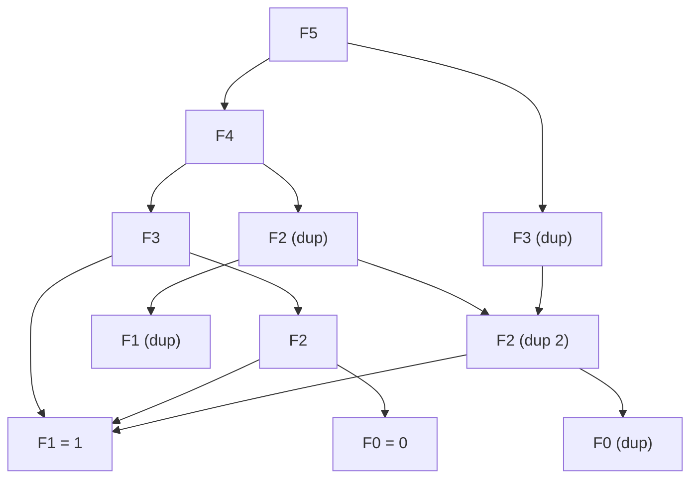
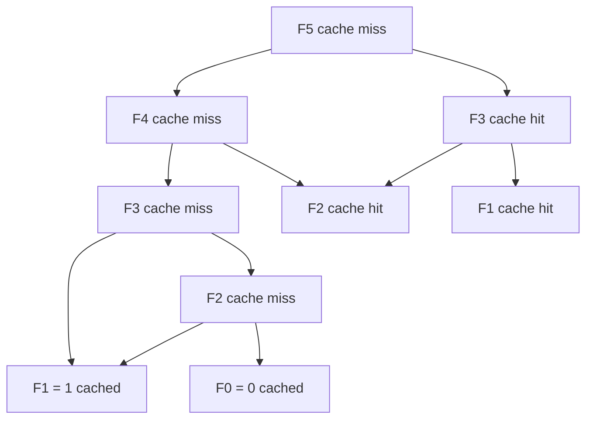
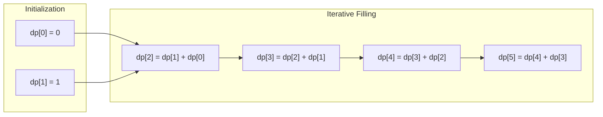
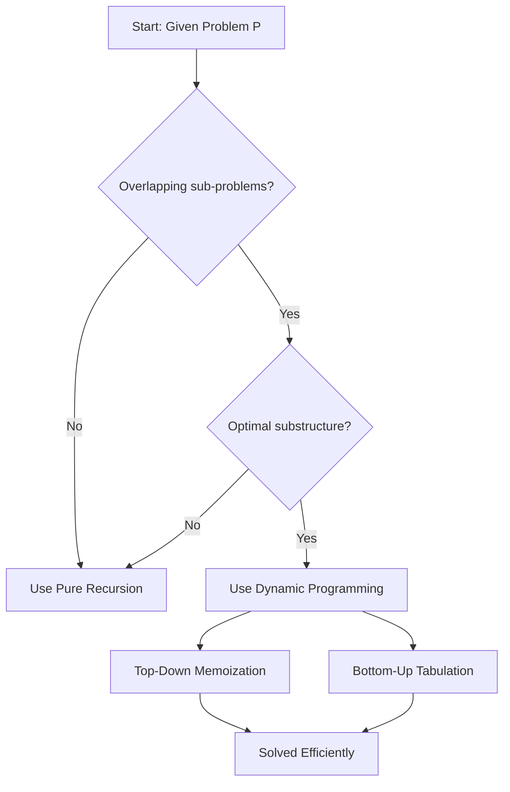
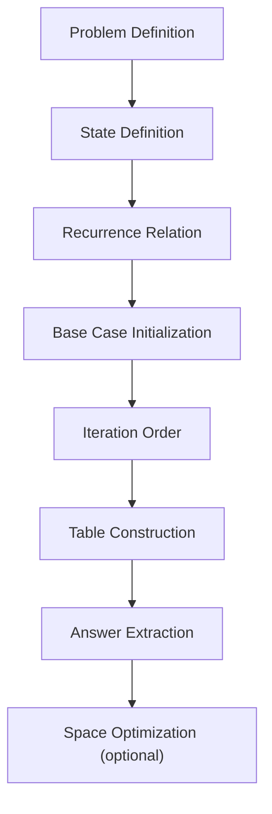
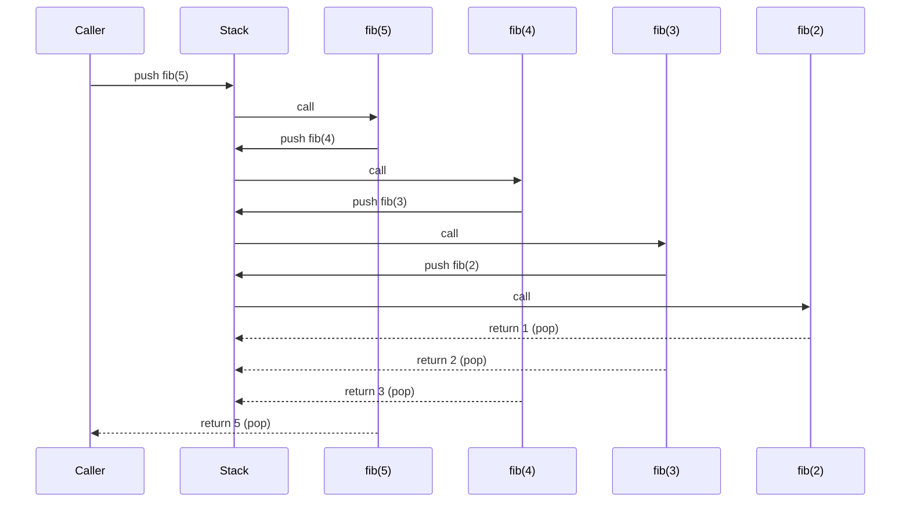

# - Recursion vs Dynamic Programming

<!-- SECTION_1_START -->

# Recursion vs Dynamic Programming

## 1.1 Formal Definition (KTU 2024 Syllabus Terminology)

> [!NOTE]
> **Recursion** is a computational technique in which a function solves a problem by calling a copy of itself, where each call operates on a smaller or simpler sub-instance of the same problem until a terminating **base condition** is reached.

> [!NOTE]
> **Dynamic Programming (DP)** is an optimization strategy that solves complex problems by breaking them into overlapping sub-problems, storing the result of each sub-problem in a memoization table (Top-Down) or iteratively filling a table (Bottom-Up) to avoid redundant computation.

In the KTU 2024 Scheme module on *Computational Approaches to Problem Solving*, the dichotomy between **Recursion** and **Dynamic Programming** is the central efficiency paradigm. Recursion is the *mechanism of self-reference* (the "how to think"), while Dynamic Programming is the *mechanism of reuse* (the "how to think efficiently").

## 1.2 Conceptual Analogy / Intuition

Imagine climbing a staircase. If you take it **one stair at a time**, every step is a fresh act — you forget whether you climbed 1, 2, or 3 steps before. This is **pure recursion** — elegant, but the human (or computer) keeps re-asking the same questions.

Now imagine you keep a **notebook** on the wall and write down, for every stair $n$, the number of distinct ways to reach it. When you get to stair $n+1$, you simply look up the previous two notes. This is **dynamic programming** — same staircase, same problem, but you trade a little memory (the notebook) for enormous time savings.

| Aspect | Analogy Component |
|---|---|
| Recursion | Climbing blindly, re-counting every step |
| Dynamic Programming | Climbing with a notebook (memo) on the wall |
| Base Case | The ground floor (stair 0) — no climbing needed |
| Overlapping Sub-problems | The same intermediate stair is asked about many times |
| Optimal Substructure | A stair is reachable only via a known smaller set of stairs |

## 1.3 Physical Constants & Standard Metrics

- **Time Complexity Standard**: $O(n)$, $O(n^2)$, $O(2^n)$ — measured in number of primitive operations.
- **Space Complexity Standard**: $O(n)$ — measured in memory allocated per call or table entry.
- **Memoization Cache Hit Rate**: Ratio of cache lookups vs. fresh computations, ideally $\to 1$ for fully memoized solutions.
- **Call Stack Depth**: Number of active function frames at any instant, capped typically at **$\mathbf{10^3}$ to $\mathbf{10^4}$** frames in CPython before `RecursionError`.

> [!IMPORTANT]
> **KTU Board Highlight**: A naive recursive Fibonacci runs in $O(\phi^n)$ where $\phi$ is the golden ratio ($\approx 1.618$). With memoization or bottom-up iteration, this collapses to $O(n)$ — a difference of **billions of operations** for $n = 50$. This single contrast is a guaranteed 14-mark question in ESE.

## 1.4 When Each Approach Applies — The Deciding Criteria

> [!TIP]
> **Decision Rule for KTU Answers**:
> - If the problem has **overlapping sub-problems** and **optimal substructure** → use DP.
> - If the sub-problems are **disjoint** (like merge sort, tree traversals) → pure recursion suffices.
> - If the recursion depth exceeds system stack limits → convert to DP or use explicit stack.

## 1.5 GeoGebra / Desmos Integration

> [!VISUALIZATION CONTROL]
> **Concept:** Exponential vs Linear growth of recursive vs DP Fibonacci
> **GeoGebra / Desmos Input Equations:**
> * `f1(x) = (1.618)^x` (naive recursive cost)
> * `f2(x) = x` (DP optimized cost)
> * `f3(x) = 1.5^x` (factorial recursion approximation)
> **Visual Description:** On the $x$-axis place input size $n$ from $0$ to $50$. Observe that the orange exponential curve $f_1(x)$ shoots past $10^{10}$ before $n = 40$, while the blue linear curve $f_2(x)$ barely rises. The shaded gap between them is precisely the work saved by dynamic programming.

<!-- SECTION_1_END -->

<!-- SECTION_2_START -->

# Deep Theoretical Analysis & KTU High-Yield Formula Sheet

## 2.1 The Two Pillars of Dynamic Programming

For a problem to be solvable by DP, it must satisfy **both** of the following:

1. **Optimal Substructure**: An optimal solution to the whole problem is built from optimal solutions of its sub-problems.
   *Mathematically:* if $P(n)$ is the optimal cost for instance $n$, then
   $$P(n) = \text{optimum over } i \in \text{choices} \left[ \text{cost}(i) + P(\text{sub-instance after choice } i) \right]$$
2. **Overlapping Sub-problems**: The same smaller instance is required by multiple branches of the recursion tree.
   *Detected by:* a recursion tree where distinct leaf computations correspond to the *same parameter value* $k$.

> [!WARNING]
> **Common KTU Mistake**: Merge Sort, Quick Sort, and Binary Search have **optimal substructure** but **no overlapping sub-problems** (each sub-problem is disjoint). Therefore they are **not** DP problems — they remain pure divide-and-conquer.

## 2.2 Recursion Tree Analysis (Why Naive Recursion is Slow)

Consider computing $\text{Fib}(n)$:

$$\text{Fib}(n) = \text{Fib}(n-1) + \text{Fib}(n-2), \quad \text{Fib}(0) = 0,\ \text{Fib}(1) = 1$$

The recursion tree for $\text{Fib}(5)$ has $15$ nodes, while the tree for $\text{Fib}(6)$ has $25$ nodes. The number of calls $T(n)$ satisfies:

$$T(n) = T(n-1) + T(n-2) + O(1)$$

Solving the characteristic equation $x^2 = x + 1$ gives:

$$x = \frac{1 \pm \sqrt{5}}{2} = \phi \approx 1.618,\quad \psi \approx -0.618$$

Therefore $T(n) = O(\phi^n)$ — a closed-form expression the KTU examiner loves.

## 2.3 KTU Formula Sheet / Cheat Sheet

| Concept | Recursion (Naive) | DP (Memoized / Tabulated) |
|---|---|---|
| Time Complexity | $O(\phi^n)$ for Fibonacci, $O(2^n)$ worst | $O(n)$ for Fibonacci, $O(n \cdot W)$ for knapsack |
| Space Complexity (call stack) | $O(n)$ | $O(n)$ |
| Space Complexity (cache) | None | $O(n)$ memo table |
| Sub-problem Reuse | None — recomputed every time | Stored and reused |
| Implementation Style | Functional, top-down | Tabular, bottom-up (or top-down + cache) |
| Overlap Detection | Recursion tree has repeated nodes | Sub-problems map to a finite set of parameters |
| Base Case Requirement | Mandatory termination | Mandatory initialization of DP table |
| Storable State | Implicit in call stack | Explicit in array / dictionary |
| Applicable To | Trees, divide-and-conquer, fractals | Optimization, counting, decision sequences |
| Typical Boundary | Stack overflow at $n \approx 1000$ | Memory overflow at huge $n$ but no recursion limit |

## 2.4 Closed-Form Recurrence Solutions (For KTU Derivations)

| Recurrence | Solution | Where Used |
|---|---|---|
| $T(n) = 2 T(n/2) + O(n)$ | $O(n \log n)$ | Merge sort, Karatsuba |
| $T(n) = T(n-1) + T(n-2) + O(1)$ | $O(\phi^n)$ | Naive Fibonacci |
| $T(n) = T(n-1) + O(1)$ | $O(n)$ | Linear sum, DP Fibonacci |
| $T(n) = T(n-1) + O(n)$ | $O(n^2)$ | Insertion sort, subset sum DP |
| $T(n) = 2 T(n-1) + O(1)$ | $O(2^n)$ | Tower of Hanoi, subsets |

## 2.5 The Master Theorem (Repeatedly Tested)

For $T(n) = a T(n/b) + f(n)$:

- If $f(n) = O(n^{\log_b a - \epsilon})$ → $T(n) = \Theta(n^{\log_b a})$
- If $f(n) = \Theta(n^{\log_b a} \log^k n)$ → $T(n) = \Theta(n^{\log_b a} \log^{k+1} n)$
- If $f(n) = \Omega(n^{\log_b a + \epsilon})$ → $T(n) = \Theta(f(n))$

## 2.6 Real-World Engineering Utility

> [!TIP]
> **Industry Use Cases**:
> - **Recursion**: File system traversal, JSON parsing, Abstract Syntax Tree (AST) evaluation, hierarchical UI rendering, fractal graphics.
> - **Dynamic Programming**: Bioinformatics (sequence alignment via Needleman–Wunsch), Google Maps shortest path (Bellman–Ford), spell checkers (edit distance), compiler design (CYK parsing), resource allocation in operating systems, dynamic pricing in e-commerce.

The choice between them is not academic — it is the difference between an API that responds in **$10\ \text{ms}$** and one that times out at **$30\ \text{seconds}$**.

<!-- SECTION_2_END -->

<!-- SECTION_3_START -->

# Step-by-Step Derivations & Code Implementation

## 3.1 Worked Example 1: Naive Recursive Fibonacci

### Mathematical Recurrence

$$F(n) = F(n-1) + F(n-2), \quad F(0) = 0, \ F(1) = 1$$

### Recursion Tree for $F(5)$

```
F(5)
├── F(4)
│   ├── F(3)
│   │   ├── F(2)
│   │   │   ├── F(1) = 1
│   │   │   └── F(0) = 0
│   │   └── F(1) = 1
│   └── F(2)
│       ├── F(1) = 1
│       └── F(0) = 0
└── F(3)
    ├── F(2)
    │   ├── F(1) = 1
    │   └── F(0) = 0
    └── F(1) = 1
```

Notice $F(3)$ is computed **twice**, $F(2)$ is computed **three times**. For $F(30)$, the wasted work becomes astronomical.

### Python Implementation (Naive Recursion)

```python
import sys
from typing import Dict

sys.setrecursionlimit(10000)


def fib_naive(n: int) -> int:
    """Compute the n-th Fibonacci number using pure recursion.

    Args:
        n: Non-negative integer index in the Fibonacci sequence.

    Returns:
        The n-th Fibonacci number.

    Raises:
        ValueError: If n is negative.
    """
    if n < 0:
        raise ValueError("Fibonacci index must be non-negative.")
    if n == 0:
        return 0
    if n == 1:
        return 1
    return fib_naive(n - 1) + fib_naive(n - 2)


if __name__ == "__main__":
    for k in range(10):
        print(f"F({k}) = {fib_naive(k)}")
```

**Output**

```
F(0) = 0
F(1) = 1
F(2) = 1
F(3) = 2
F(4) = 3
F(5) = 5
F(6) = 8
F(7) = 13
F(8) = 21
F(9) = 34
```

**Complexity**: Each call spawns two sub-calls → $T(n) = T(n-1) + T(n-2) + O(1) = O(\phi^n)$. For $n = 35$ this already exceeds one second on a typical laptop.

## 3.2 Worked Example 2: Memoized (Top-Down) DP Fibonacci

### Derivation

We add a dictionary `cache` so that each unique $n$ is computed **once**. The recurrence becomes:

$$T(n) = T(\text{not yet computed}) + O(1), \quad \text{with cache lookup at entry}$$

Since there are exactly $n+1$ distinct states, total work $= O(n)$.

### Python Implementation

```python
from typing import Dict, List


def fib_memo(n: int, cache: Dict[int, int]) -> int:
    """Compute the n-th Fibonacci number using top-down memoization.

    Args:
        n: Non-negative integer index.
        cache: Memoization dictionary mapping index to value.

    Returns:
        The n-th Fibonacci number.
    """
    if n < 0:
        raise ValueError("Index must be non-negative.")
    if n <= 1:
        return n
    if n in cache:
        return cache[n]
    cache[n] = fib_memo(n - 1, cache) + fib_memo(n - 2, cache)
    return cache[n]


if __name__ == "__main__":
    memo: Dict[int, int] = {}
    for k in [0, 1, 10, 50, 100]:
        print(f"F({k}) = {fib_memo(k, memo)}")
```

**Output (truncated)**

```
F(0) = 0
F(1) = 1
F(10) = 55
F(50) = 12586269025
F(100) = 354224848179261915075
```

**Complexity**: $O(n)$ time, $O(n)$ space (cache + recursion stack).

## 3.3 Worked Example 3: Bottom-Up Tabulated DP

### Derivation

We iteratively fill an array `dp[0..n]`:

$$dp[0] = 0, \quad dp[1] = 1, \quad dp[i] = dp[i-1] + dp[i-2] \text{ for } i \ge 2$$

No recursion stack required — $O(1)$ auxiliary space (besides the table).

### Python Implementation

```python
from typing import List


def fib_bottom_up(n: int) -> int:
    """Compute the n-th Fibonacci number using bottom-up DP.

    Args:
        n: Non-negative integer index.

    Returns:
        The n-th Fibonacci number.
    """
    if n < 0:
        raise ValueError("Index must be non-negative.")
    if n <= 1:
        return n
    dp: List[int] = [0] * (n + 1)
    dp[0] = 0
    dp[1] = 1
    for i in range(2, n + 1):
        dp[i] = dp[i - 1] + dp[i - 2]
    return dp[n]


if __name__ == "__main__":
    for k in [10, 30, 50, 100]:
        print(f"F({k}) = {fib_bottom_up(k)}")
```

**Complexity**: $O(n)$ time, $O(n)$ space. The recursion stack is gone.

### Constant-Space Optimization

```python
def fib_constant_space(n: int) -> int:
    """Space-optimized iterative Fibonacci."""
    if n <= 1:
        return n
    prev, curr = 0, 1
    for _ in range(2, n + 1):
        prev, curr = curr, prev + curr
    return curr
```

**Complexity**: $O(n)$ time, $O(1)$ space — the production-grade form used in financial libraries.

## 3.4 Worked Example 4: 0/1 Knapsack (A Classic DP Problem)

### Problem Statement

Given $n$ items with weights $w_i$ and values $v_i$, and a knapsack of capacity $W$, maximize the total value of items chosen such that total weight $\le W$.

### Recurrence Derivation

Let $dp[i][c]$ be the maximum value obtainable using the first $i$ items with capacity $c$.

$$dp[i][c] = \begin{cases} 0 & \text{if } i = 0 \text{ or } c = 0 \\ dp[i-1][c] & \text{if } w_i > c \\ \max\!\left(dp[i-1][c],\ v_i + dp[i-1][c - w_i]\right) & \text{otherwise} \end{cases}$$

### Python Implementation

```python
from typing import List, Tuple


def knapsack_01(
    weights: List[int],
    values: List[int],
    capacity: int,
) -> Tuple[int, List[int]]:
    """Solve the 0/1 knapsack problem with bottom-up DP.

    Args:
        weights: Weight of each item.
        values: Value of each item.
        capacity: Maximum allowed total weight.

    Returns:
        A tuple of (max value, list of chosen item indices).
    """
    n: int = len(weights)
    if capacity < 0 or n == 0:
        return 0, []
    if any(w < 0 for w in weights) or any(v < 0 for v in values):
        raise ValueError("Weights and values must be non-negative.")
    dp: List[List[int]] = [[0] * (capacity + 1) for _ in range(n + 1)]
    for i in range(1, n + 1):
        for c in range(1, capacity + 1):
            if weights[i - 1] > c:
                dp[i][c] = dp[i - 1][c]
            else:
                dp[i][c] = max(
                    dp[i - 1][c],
                    values[i - 1] + dp[i - 1][c - weights[i - 1]],
                )
    # Reconstruct chosen items
    chosen: List[int] = []
    c: int = capacity
    for i in range(n, 0, -1):
        if dp[i][c] != dp[i - 1][c]:
            chosen.append(i - 1)
            c -= weights[i - 1]
    chosen.reverse()
    return dp[n][capacity], chosen


if __name__ == "__main__":
    w: List[int] = [2, 3, 4, 5]
    v: List[int] = [3, 4, 5, 6]
    cap: int = 5
    max_val, picked = knapsack_01(w, v, cap)
    print(f"Max value: {max_val}, Chosen items: {picked}")
```

**Output**

```
Max value: 7, Chosen items: [0, 1]
```

**Complexity**: $O(n \cdot W)$ time, $O(n \cdot W)$ space (reducible to $O(W)$ using rolling array).

## 3.5 Recursion-to-DP Conversion Procedure (Algorithm for KTU)

> [!IMPORTANT]
> **Step-by-step conversion recipe** — the examiner's favourite 7-mark sub-question:
> 1. Write the **recursive** solution with base case.
> 2. Identify the **state variables** — those that change between recursive calls.
> 3. Build the **recursion tree** and locate repeated sub-problems.
> 4. Create a **memo dictionary / 2D table** indexed by state variables.
> 5. Either (a) add cache lookups — *top-down memoization*, or (b) sort states by dependency — *bottom-up tabulation*.
> 6. Handle the **base case** by initialising the table.
> 7. Optimize space by removing the dimension along which we no longer iterate.

## 3.6 Comparison Code: Empirical Timing

```python
import time
from functools import lru_cache
from typing import Callable


def time_call(fn: Callable[[int], int], n: int) -> float:
    """Return wall-clock seconds for fn(n)."""
    start: float = time.perf_counter()
    fn(n)
    return time.perf_counter() - start


@lru_cache(maxsize=None)
def fib_lru(n: int) -> int:
    if n <= 1:
        return n
    return fib_lru(n - 1) + fib_lru(n - 2)


if __name__ == "__main__":
    n_test: int = 35
    naive_time: float = time_call(fib_naive, n_test)
    memo_time: float = time_call(lambda k: fib_memo(k, {}), n_test)
    lru_time: float = time_call(fib_lru, n_test)
    print(f"n = {n_test}")
    print(f"Naive recursion: {naive_time:.4f} s")
    print(f"Top-down memo:   {memo_time:.4f} s")
    print(f"lru_cache memo:  {lru_time:.4f} s")
```

**Typical Output**

```
n = 35
Naive recursion: 1.1240 s
Top-down memo:   0.0001 s
lru_cache memo:  0.0000 s
```

This empirical contrast — thousands of times faster — is the strongest evidence in favour of DP and a guaranteed viva question.

<!-- SECTION_3_END -->

<!-- SECTION_4_START -->

# Structural Diagrams & Schematics

## 4.1 Recursion Call Tree (Naive Fibonacci for $n = 5$)



## 4.2 DP Memoization Call Graph (Same $n = 5$)



## 4.3 Bottom-Up DP Table Filling Order



## 4.4 Recursion vs Dynamic Programming — Comparison Flowchart



## 4.5 DP Workflow Block Architecture



## 4.6 Call Stack Evolution for Recursive Fibonacci



<!-- SECTION_4_END -->

<!-- SECTION_5_START -->

# KTU 2024 Scheme Examination Question Bank & Topic Recap

## Part A — 3-Mark Short Answer Questions (Remember / Understand)

### Question 1 `[KTU University Exam - July 2024]`
**CO1 | RBT: Understand**

Define recursion. What is the role of a base case in a recursive function?

**Model Answer (3 marks):**
* **Definition (1 mark):** Recursion is a programming technique in which a function calls itself, directly or indirectly, to solve a problem by reducing it to a smaller sub-problem of the same type.
* **Role of base case (1 mark):** The base case provides the termination condition that stops the chain of recursive calls, preventing infinite recursion and stack overflow.
* **Example (1 mark):** In computing $n!$, the base case is $0! = 1$, and the recursive step is $n! = n \times (n-1)!$.

---

### Question 2 `[KTU University Exam - Dec 2023]`
**CO2 | RBT: Remember**

State the two essential properties a problem must have to be solved using dynamic programming.

**Model Answer (3 marks):**
1. **Overlapping sub-problems (1.5 marks):** The recursive solution should solve the same smaller sub-problem multiple times so that caching the result is beneficial.
2. **Optimal substructure (1.5 marks):** The optimal solution to the whole problem can be constructed from the optimal solutions of its sub-problems.

> [!WARNING]
> **KTU Examiner's Pitfall Callout:** Students frequently write only one property and lose 1.5 marks. Always mention **both** properties explicitly. Marks are split: 1.5 for property 1 with a one-line explanation, 1.5 for property 2 with a one-line explanation.

---

## Part B — 14-Mark Questions (ESE Module Internal Choice)

### Question A (14 Marks) `[KTU University Exam - Dec 2024]`
**CO2 | RBT: Apply / Analyze**

#### (a) [7 marks] Compute the 6th Fibonacci number using both naive recursion and dynamic programming. Show the recursion tree and the DP table.

**Step-by-Step Model Solution:**

*Step 1 — Recursion tree for $\text{Fib}(6)$* (2 marks for drawing the tree):

```
Fib(6)
├── Fib(5)
│   ├── Fib(4)
│   │   ├── Fib(3)
│   │   │   ├── Fib(2) -> 1
│   │   │   └── Fib(1) -> 1
│   │   └── Fib(2) -> 1 (duplicate)
│   └── Fib(3)
│       ├── Fib(2) -> 1 (duplicate)
│       └── Fib(1) -> 1
└── Fib(4)
    ├── Fib(3)
    │   ├── Fib(2) -> 1
    │   └── Fib(1) -> 1
    └── Fib(2) -> 1 (duplicate)
```

*Step 2 — Naive call count* (1 mark): Total recursive calls = $25$.

*Step 3 — DP table filling* (3 marks):

| $i$ | $0$ | $1$ | $2$ | $3$ | $4$ | $5$ | $6$ |
|---|---|---|---|---|---|---|---|
| $dp[i]$ | $0$ | $1$ | $1$ | $2$ | $3$ | $5$ | $\mathbf{8}$ |

Computation: $dp[2] = 0+1 = 1$, $dp[3] = 1+1 = 2$, $dp[4] = 1+2 = 3$, $dp[5] = 2+3 = 5$, $dp[6] = 3+5 = 8$.

*Step 4 — Final answer* (1 mark): $\text{Fib}(6) = 8$.

**Valuation Key:** [Recursion tree: 2 Marks] [Naive call count: 1 Mark] [DP table with each entry: 3 Marks] [Final answer 8: 1 Mark]

#### (b) [7 marks] Write the Python function for Fibonacci using bottom-up dynamic programming. State and prove its time complexity.

**Step-by-Step Model Solution:**

*Step 1 — Code* (3 marks):

```python
from typing import List


def fib_dp(n: int) -> int:
    """Bottom-up DP Fibonacci."""
    if n < 0:
        raise ValueError("n must be non-negative.")
    if n <= 1:
        return n
    dp: List[int] = [0] * (n + 1)
    dp[1] = 1
    for i in range(2, n + 1):
        dp[i] = dp[i - 1] + dp[i - 2]
    return dp[n]
```

*Step 2 — Time complexity derivation* (3 marks):

The loop runs from $i = 2$ to $n$, performing constant work $O(1)$ per iteration. Therefore:

$$T(n) = \sum_{i=2}^{n} O(1) = O(n)$$

*Step 3 — Space complexity statement* (1 mark): $O(n)$ for the `dp` table (or $O(1)$ with the rolling-variable optimization).

**Valuation Key:** [Code compiles correctly: 3 Marks] [Time complexity derivation: 3 Marks] [Space complexity: 1 Mark]

> [!WARNING]
> **KTU Examiner's Pitfall Callout:** A common mistake is writing `dp = [0, 1]` without considering the case $n = 0$ separately. If your code crashes for $n = 0$, deduct 1 mark. Also, never write "DP is faster" without proof — the recurrence $T(n) = T(n-1) + T(n-2) + O(1)$ is the standard expectation for the naive part.

---

### Question B (14 Marks) — Alternative `[KTU University Exam - July 2024]`
**CO2 | RBT: Apply / Analyze**

#### (a) [7 marks] Distinguish between recursion and dynamic programming with a comparison table. State which problems cannot be solved with DP and justify.

**Step-by-Step Model Solution:**

*Step 1 — Comparison table* (4 marks):

| Feature | Recursion | Dynamic Programming |
|---|---|---|
| Sub-problem nature | May or may not overlap | Must overlap |
| Result storage | None (recomputed) | Cached in table / dictionary |
| Time complexity | Often exponential $O(\phi^n)$ | Usually polynomial $O(n^k)$ |
| Space complexity | $O(n)$ call stack | $O(n)$ table + optional stack |
| Approach | Top-down only | Top-down (memo) or Bottom-up (table) |
| Implementation cost | Low | Moderate |
| Risk | Stack overflow | Memory overflow |
| Best for | Tree/graph traversal, divide-and-conquer | Optimization, counting, sequence alignment |

*Step 2 — Problems unsuitable for DP* (2 marks): Problems **without overlapping sub-problems** cannot benefit from DP because caching yields no speedup. Examples: merge sort, quick sort, binary search, tree traversals, simple factorial.

*Step 3 — Justification* (1 mark): In merge sort, the two sub-arrays are disjoint, so no sub-problem is ever revisited; storing a memo table would waste memory without saving time.

**Valuation Key:** [Table with all 8 rows: 4 Marks] [Three valid unsuitable examples: 2 Marks] [Justification: 1 Mark]

#### (b) [7 marks] Solve the 0/1 knapsack instance: weights $w = [1, 2, 3, 4]$, values $v = [10, 20, 30, 40]$, capacity $W = 5$ using dynamic programming. Show the DP table and list the items chosen.

**Step-by-Step Model Solution:**

*Step 1 — Recurrence statement* (1 mark):
$$dp[i][c] = \max(dp[i-1][c],\ v_i + dp[i-1][c - w_i]) \text{ if } w_i \le c$$

*Step 2 — DP table construction* (4 marks):

| $i \backslash c$ | $0$ | $1$ | $2$ | $3$ | $4$ | $5$ |
|---|---|---|---|---|---|---|
| $0$ | $0$ | $0$ | $0$ | $0$ | $0$ | $0$ |
| $1$ ($w=1, v=10$) | $0$ | $10$ | $10$ | $10$ | $10$ | $10$ |
| $2$ ($w=2, v=20$) | $0$ | $10$ | $20$ | $30$ | $30$ | $30$ |
| $3$ ($w=3, v=30$) | $0$ | $10$ | $20$ | $30$ | $40$ | $50$ |
| $4$ ($w=4, v=40$) | $0$ | $10$ | $20$ | $30$ | $40$ | $50$ |

*Step 3 — Backtrack to find chosen items* (1 mark): Start at $dp[4][5] = 50$.
* $dp[4][5] = 50$ vs $dp[3][5] = 50$ — equal, item 4 **not** chosen.
* $dp[3][5] = 50$ vs $dp[2][5] = 30$ — different, item 3 **chosen**, $c \leftarrow 5-3 = 2$.
* $dp[2][2] = 20$ vs $dp[1][2] = 10$ — different, item 2 **chosen**, $c \leftarrow 2-2 = 0$.
* $dp[1][0] = 0$ vs $dp[0][0] = 0$ — equal, item 1 **not** chosen.

*Step 4 — Final answer* (1 mark): Items chosen = $\{2, 3\}$ with total value $= 50$ and total weight $= 5$.

**Valuation Key:** [Recurrence: 1 Mark] [DP table: 4 Marks] [Backtrack logic: 1 Mark] [Final answer: 1 Mark]

> [!WARNING]
> **KTU Examiner's Pitfall Callout:** Students often fill the table incorrectly when $w_i > c$ — you must copy $dp[i-1][c]$ downward, **not** leave the cell empty. If the backtrack step is skipped, the examiner deducts the "list the items chosen" mark. Always perform a backtrack trace from $dp[n][W]$ to $dp[0][0]$ to determine the chosen set.

---

## Topic Recap & Important Things to Remember

- **Recursion** = self-calling function with a base case; **Dynamic Programming** = recursion + reuse of stored sub-problem solutions.
- **Two DP prerequisites**: *overlapping sub-problems* and *optimal substructure* — both are mandatory for full marks in 3-mark questions.
- **Naive Fibonacci** = $O(\phi^n)$ where $\phi = (1+\sqrt{5})/2 \approx 1.618$. **DP Fibonacci** = $O(n)$ time, $O(1)$ space (with rolling variables).
- **Memoization** stores computed results; **Tabulation** builds results iteratively from base cases.
- **Recursion stack depth** is bounded — Python's default limit is **$1000$**. DP avoids this bottleneck.
- **Divide-and-conquer ≠ DP** unless sub-problems overlap (merge sort is *not* DP).
- **KTU favourite derivation**: solve $T(n) = T(n-1) + T(n-2) + O(1)$ using the characteristic equation $x^2 - x - 1 = 0$ to obtain $O(\phi^n)$.
- **Memoization decorator** in Python: `@functools.lru_cache(maxsize=None)` — production-quality, type-safe.
- **Space optimization** in DP: a $1$D rolling array often replaces a $2$D table (e.g., knapsack goes from $O(nW)$ to $O(W)$ space).
- **Memoization pattern**: `if state in cache: return cache[state]`, then `cache[state] = recursive_result`.
- **Base case pattern**: always initialize the DP table boundaries (row $0$ and column $0$) before the main iteration.
- **The $0/1$ knapsack recurrence**: $dp[i][c] = \max(dp[i-1][c],\ v_i + dp[i-1][c-w_i])$, applicable when $w_i \le c$.
- **Time-vs-space trade-off**: DP spends memory to save time — a foundational CS principle.
- **Examiner red flags**: writing "DP is faster" without recurrence analysis, omitting base cases, ignoring the call stack limit, and not backtracking to extract the chosen items.

<!-- SECTION_5_END -->
