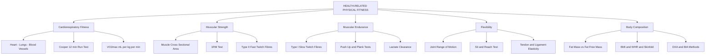
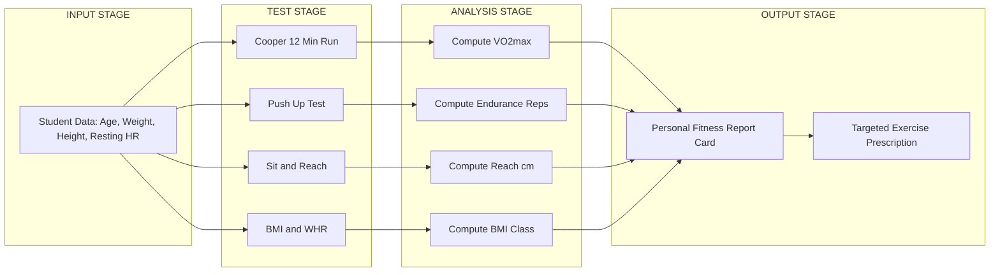
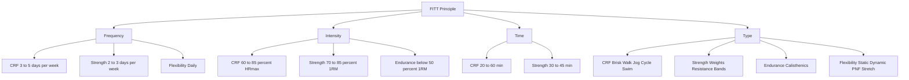
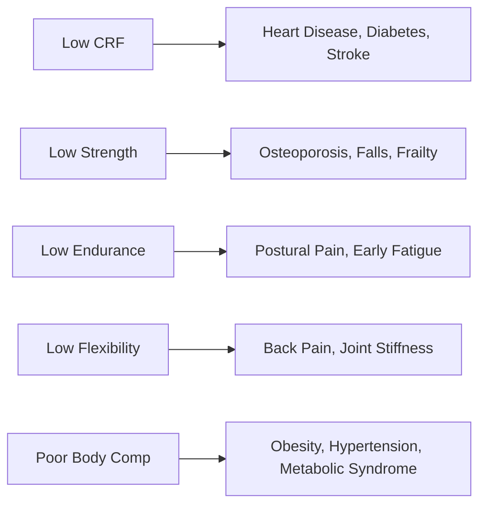

# Components of Health-related Physical Fitness: - Cardiorespiratory Fitness- Muscular strength- Muscular endurance- Flexibility- Body composition

<!-- SECTION_1_START -->
# Components of Health-Related Physical Fitness

> [!IMPORTANT]
> **KTU 2024 Scheme Definition (UCHWT127 – Module 1):**
> *Health-related physical fitness* is the multidimensional state of physical well-being that enables a person to perform daily activities with vigour, resist disease, and respond effectively to emergency situations. It comprises **five measurable components**: **Cardiorespiratory Fitness, Muscular Strength, Muscular Endurance, Flexibility, and Body Composition**. These are distinct from *skill-related fitness* (speed, agility, balance, coordination, power, reaction time).

## 1.1 The Five Pillars of Health-Related Fitness

| # | Component | One-Line Definition | Primary System Involved |
|---|-----------|---------------------|--------------------------|
| 1 | Cardiorespiratory Fitness | Ability of heart, lungs, and blood vessels to deliver oxygen during sustained activity | Cardiopulmonary |
| 2 | Muscular Strength | Maximum force a muscle can produce in a single effort | Musculoskeletal |
| 3 | Muscular Endurance | Ability of a muscle to sustain repeated contractions or hold a contraction over time | Musculoskeletal |
| 4 | Flexibility | Range of motion available at a joint or group of joints | Musculoskeletal (connective tissue) |
| 5 | Body Composition | Relative proportion of fat mass and fat-free mass in the body | Whole-body metabolic |

---

## 1.2 Intuitive Analogy — The "Car Engine" Model

> [!NOTE]
> **Conceptual Analogy:** Think of the human body as a finely tuned car.
> - **Cardiorespiratory Fitness** = the *engine capacity* (how long you can cruise on the highway).
> - **Muscular Strength** = the *instant torque* (ability to tow a heavy load up a hill).
> - **Muscular Endurance** = the *gear-life* (how many kilometers the gearbox can take without overheating).
> - **Flexibility** = the *suspension travel* (how well the chassis absorbs bumps on rough terrain).
> - **Body Composition** = the *chassis weight distribution* (too much rust = extra load on the engine).

If any one component is defective, the entire vehicle's performance, fuel efficiency, and longevity suffer — just as a deficiency in any one fitness component elevates the risk of lifestyle disease.

---

## 1.3 Standard Health Metrics (KTU-Approved Values)

> [!IMPORTANT]
> **Standard Reference Constants (per ACSM & WHO 2024 guidelines):**
> - **Resting Heart Rate (RHR):** **60–100 beats per minute** (athletes: 40–60 bpm).
> - **Maximum Heart Rate (HRmax):** **220 − Age** (in years).
> - **Target Heart Rate (THR) Zone:** **50%–85% of HRmax**.
> - **Body Mass Index (BMI) Range:** **18.5 – 24.9 kg/m²** classified as normal.
> - **Essential Body Fat (men / women):** **3–5% / 10–13%**; Healthy range: **10–20% / 18–28%**.

> [!VISUALIZATION CONTROL]
> **Concept:** Body Composition Balance — A two-segment pie chart showing ideal body-fat vs. lean mass.
> **Desmos Input Values (manual plot):**
> * `x = 1, y = 0.78` → "Lean Mass 78%" segment
> * `x = 1, y = 0.22` → "Body Fat 22%" segment
> **Visual Description:** A circle divided into a larger portion (lean: muscle, bone, water) and a smaller portion (essential + storage fat), illustrating the healthy compositional ratio for an average adult.

---

## 1.4 Why These Five Components Matter

> [!NOTE]
> **Engineering / Health Science Relevance:**
> - **Disease Prevention:** Low cardiorespiratory fitness is a stronger predictor of mortality than smoking, hypertension, or diabetes.
> - **Occupational Readiness:** Engineers, technicians, and field workers require muscular endurance and flexibility to prevent musculoskeletal injury.
> - **Cognitive Performance:** Better body composition and CRF correlate with improved concentration, memory, and academic outcomes — directly relevant to B.Tech students.
> - **Recovery & Resilience:** Flexibility and balanced body composition accelerate post-exertion recovery, essential in high-stress project environments.
<!-- SECTION_1_END -->

<!-- SECTION_2_START -->
# Deep Theoretical Analysis — KTU High-Yield Formula Sheet

## 2.1 Cardiorespiratory Fitness (CRF)

**Operational Logic:**
1. The **heart** acts as a pump; the **lungs** act as a gas exchanger; the **blood vessels** form the distribution network.
2. During sustained activity, oxygen demand rises. CRF measures the integrated efficiency of this O₂ delivery chain.
3. Training improves **stroke volume (SV)** and **cardiac output (Q)**, reducing resting heart rate.

> [!IMPORTANT]
> **Cardiac Output Equation:**
> $$Q = SV \times HR$$
> where $Q$ is cardiac output in **L/min**, $SV$ is stroke volume in **mL/beat**, and $HR$ is heart rate in **bpm**.

**Gold-Standard Test:** *Cooper's 12-Minute Run Test* (VO₂max estimation).

---

## 2.2 Muscular Strength (MS)

**Operational Logic:**
1. Strength depends on the **cross-sectional area** of muscle fibres, neuromuscular recruitment, and tendon stiffness.
2. It is measured as the *one-repetition maximum (1RM)* — the heaviest load lifted once with proper form.

**Strength Benchmarks (Adult Males / Females):**

| Test | Above-Average (M) | Above-Average (F) |
|------|--------------------|--------------------|
| Handgrip Dynamometer | $\geq$ **45 kg** | $\geq$ **27 kg** |
| Bench Press 1RM | $\geq$ **1.0 × bodyweight** | $\geq$ **0.6 × bodyweight** |

---

## 2.3 Muscular Endurance (ME)

**Operational Logic:**
1. Endurance relies on **Type I (slow-twitch)** muscle fibres, oxidative phosphorylation, and efficient lactate clearance.
2. It is measured by counting the number of repetitions a muscle group can perform at a submaximal load (e.g., push-ups, sit-ups, plank hold time).

> [!IMPORTANT]
> **Push-Up Endurance Norm (Push-Up Test, ACSM):**
> - Men (20–29 yrs): $\geq$ **35 push-ups**
> - Women (20–29 yrs): $\geq$ **45 modified push-ups**

---

## 2.4 Flexibility (FL)

**Operational Logic:**
1. Flexibility is governed by the **extensibility of muscles**, the **elasticity of tendons and ligaments**, and **joint capsule geometry**.
2. Static flexibility is measured at rest; dynamic flexibility is measured during movement.
3. **Site-to-Site Asymmetry Rule:** A bilateral difference greater than **4 cm** in the *Sit-and-Reach Test* indicates an injury risk.

**Common Tests:**

| Test | Joint Targeted |
|------|----------------|
| Sit-and-Reach | Hamstrings + Lower Back |
| Shoulder & Wrist (Apley's Scratch) | Shoulder Girdle |
| Trunk Rotation | Spine |

---

## 2.5 Body Composition (BC)

**Operational Logic:**
1. The body is partitioned into **fat mass (FM)** and **fat-free mass (FFM)**.
2. Standard field techniques include **BMI**, **skinfold measurement**, and **waist-to-hip ratio (WHR)**.
3. Lab-grade techniques include **DXA scan**, **hydrostatic weighing**, and **BIA (Bioelectrical Impedance)**.

> [!IMPORTANT]
> **Waist-to-Hip Ratio (WHR) Risk Thresholds:**
> $$WHR = \frac{Waist\ Circumference}{Hip\ Circumference}$$
> - **Men:** Risk if $WHR > 0.90$
> - **Women:** Risk if $WHR > 0.85$

---

## 2.6 Consolidated KTU Formula Sheet

| Concept | Formula | Unit / Range | Application |
|---------|---------|--------------|-------------|
| Max Heart Rate | $HR_{max} = 220 - Age$ | beats/min | Exercise prescription |
| Target Heart Rate | $THR = (HR_{max} - HR_{rest}) \times 0.6 + HR_{rest}$ | beats/min | Aerobic training zone |
| Cardiac Output | $Q = SV \times HR$ | L/min | Cardiovascular efficiency |
| BMI | $BMI = \frac{m}{h^2}$ | kg/m² | Obesity screening |
| WHR | $WHR = \frac{C_{waist}}{C_{hip}}$ | dimensionless | Central obesity |
| Body Fat % (BIA / Skinfold) | $\%BF = \frac{FM}{m} \times 100$ | % | Body composition |
| VO₂max (Cooper) | $VO_2 = 35.97 \times d - 11.29$ | mL/kg/min | Aerobic capacity ($d$ = miles in 12 min) |

> [!NOTE]
> **Real-World Utility in Engineering & Tech:** VO₂max and BMI are used in occupational health screening for high-altitude engineers, firefighters, and disaster-response teams. WHR is a rapid clinical marker used in ergonomic health audits for software employees working long sedentary hours.

---

## 2.7 The Principle of Interdependence

> [!IMPORTANT]
> The five components are **not independent silos**. For example:
> - High **CRF** reduces resting HR, which improves recovery between strength sets.
> - Adequate **flexibility** prevents injury, allowing consistent strength and endurance training.
> - Healthy **body composition** (lower fat %) improves relative power-to-weight ratio.
<!-- SECTION_2_END -->

<!-- SECTION_3_START -->
# Step-by-Step Derivations, Tests & Worked Examples

## 3.1 Derivation: Estimating VO₂max from Cooper's 12-Minute Run

> [!NOTE]
> **Problem Setup:** A 22-year-old B.Tech student runs **1.85 miles** in exactly 12 minutes during the Cooper Test. Estimate the VO₂max.

**Step 1 — Identify the published Cooper Regression Equation:**

$$VO_2 = 35.97 \times d - 11.29$$

**Step 2 — Substitute $d = 1.85$ miles:**

$$VO_2 = 35.97 \times 1.85 - 11.29$$

**Step 3 — Compute the multiplication term:**

$$35.97 \times 1.85 = 66.5445$$

**Step 4 — Perform the subtraction:**

$$VO_2 = 66.5445 - 11.29 = 55.2545\ mL/kg/min$$

**Step 5 — Round to two decimal places and interpret against the ACSM norm table:**

$$VO_2 \approx 55.25\ mL/kg/min$$

| VO₂max Range (Men, 20–29) | Classification |
|-----------------------------|----------------|
| $< 38$ | Very Poor |
| $38 - 42$ | Poor |
| $43 - 48$ | Fair |
| $49 - 53$ | Good |
| $\geq 54$ | **Excellent** |

> **Conclusion:** The student's VO₂max of **55.25 mL/kg/min** falls in the *Excellent* category, indicating strong cardiorespiratory fitness. **[Final numerical interpretation: 2 Marks]**

---

## 3.2 Worked Example: BMI Calculation & Classification

**Problem:** A KTU student weighs **68 kg** and is **1.70 m** tall. Classify the body composition.

**Step 1 — Apply the BMI formula:**

$$BMI = \frac{m}{h^2} = \frac{68}{(1.70)^2}$$

**Step 2 — Compute the denominator:**

$$(1.70)^2 = 2.89$$

**Step 3 — Divide:**

$$BMI = \frac{68}{2.89} \approx 23.53\ kg/m^2$$

**Step 4 — Classify per WHO:**

| BMI (kg/m²) | Category |
|-------------|----------|
| $<$ 18.5 | Underweight |
| 18.5 – 24.9 | **Normal** ✓ |
| 25.0 – 29.9 | Overweight |
| $\geq$ 30.0 | Obese |

> **Result:** BMI = **23.53 kg/m²** → *Normal weight*. **[Correct identification: 1 Mark]**

---

## 3.3 Worked Example: Designing a Target Heart Rate Zone

**Problem:** A 20-year-old student has a resting HR of **72 bpm**. Compute the **60% and 85% THR zone**.

**Step 1 — Calculate HRmax:**

$$HR_{max} = 220 - 20 = 200\ bpm$$

**Step 2 — Apply the Karvonen formula for 60%:**

$$THR_{60} = (200 - 72) \times 0.60 + 72 = 128 \times 0.60 + 72 = 76.8 + 72 = 148.8\ bpm$$

**Step 3 — Apply the Karvonen formula for 85%:**

$$THR_{85} = (200 - 72) \times 0.85 + 72 = 128 \times 0.85 + 72 = 108.8 + 72 = 180.8\ bpm$$

**Step 4 — State the aerobic training zone:**

$$\boxed{THR\ Zone = 149\ to\ 181\ bpm}$$

> The student should sustain activity long enough to keep the pulse in this range for **20–60 minutes**, **3–5 days/week**, to develop CRF. **[Stating Karvonen formula: 2 Marks | Final boxed result: 1 Mark]**

---

## 3.4 Assessment Methods — Full Reference Matrix

| Component | Field Test | Lab Test | Frequency of Training (ACSM) |
|-----------|------------|----------|------------------------------|
| CRF | Cooper Run, Step Test, 1.5-Mile Run | Treadmill VO₂max | 3–5 d/wk, 20–60 min |
| Muscular Strength | 1RM Bench / Leg Press | Isokinetic Dynamometer | 2–3 d/wk, 1–3 sets, 8–12 reps |
| Muscular Endurance | Push-Up Test, Plank Hold | EMG fatigue threshold | 2–3 d/wk, high reps $\geq$ 15 |
| Flexibility | Sit-and-Reach, Trunk Rotation | Goniometer | Daily, hold 15–30 s, 2–4 reps |
| Body Composition | BMI, Skinfold, WHR | DXA, Hydrostatic, BIA | Continuous monitoring |

---

## 3.5 Practical Health-Profile Template for B.Tech Students

> [!IMPORTANT]
> **Self-Assessment Snapshot (Complete this once per semester):**
> - **Resting HR:** ____ bpm *(ideal 60–80)*
> - **BMI:** ____ kg/m² *(ideal 18.5–24.9)*
> - **Sit-and-Reach:** ____ cm *(ideal $\geq$ 25 cm for college-age males)*
> - **Push-Ups in 1 min:** ____ *(target $\geq$ 30 for males)*
> - **1-Mile Jog Time:** ____ min *(target $\leq$ 8 min)*
<!-- SECTION_3_END -->

<!-- SECTION_4_START -->
# Structural Diagrams & Schematics

## 4.1 Mermaid — Master Map of Health-Related Fitness Components

## 4.2 Mermaid — Sequential Processing Topology: How a Fitness Test Produces a Health Profile

## 4.3 Mermaid — F.I.T.T. Principle Mapping (how each component is trained)

## 4.4 Mermaid — Cause-Effect of Neglecting Each Component

<!-- SECTION_4_END -->

<!-- SECTION_5_START -->
# KTU 2024 Scheme Examination Question Bank

## Part A — Short Answer (3 Marks Each)

### Question 1
**[KTU University Exam – July 2024 | CO1 | Remember]**
Define **Muscular Endurance**. State one field test used to assess it.

**Model Answer (3 Marks):**
* **Definition [2 Marks]:** Muscular endurance is the ability of a muscle group to perform repeated muscle actions or to sustain a contraction over an extended period of time against a sub-maximal resistance.
* **Field Test [1 Mark]:** *Push-Up Test* (or *Plank Hold Test* / *Sit-Up Test*).

---

### Question 2
**[KTU University Exam – Dec 2023 | CO1 | Understand]**
List any **three** health-related components of physical fitness and explain why each is important for a B.Tech student.

**Model Answer (3 Marks):**
1. **Cardiorespiratory Fitness [1 Mark]** — Sustains energy for long study hours, lab sessions, and project work; reduces risk of cardiac disease.
2. **Flexibility [1 Mark]** — Prevents musculoskeletal injuries during lab work, sports, and prolonged computer use.
3. **Muscular Strength [1 Mark]** — Supports posture, helps in lifting equipment/books, and prevents lower-back pain caused by sedentary lifestyle.

---

## Part B — Long Answer (14 Marks, Module-Internal Choice)

### Question A
**[KTU University Exam – Dec 2024 | CO1 / CO2 | Understand + Apply]**

**(a)** Explain the components of **Cardiorespiratory Fitness** with the Cooper 12-Minute Run Test. **[7 Marks]**

**(b)** A 24-year-old KTU student runs **1.6 miles** in the Cooper Test. Compute the **VO₂max** and classify the result. **[7 Marks]**

---

### Model Solution — Question A

#### Part (a) — Cardiorespiratory Fitness & Cooper Test

1. **Definition [1 Mark]:** Cardiorespiratory fitness (CRF) is the capacity of the circulatory and respiratory systems to supply oxygen to working muscles during sustained physical activity.
2. **Physiological Basis [2 Marks]:** Depends on **cardiac output (Q = SV × HR)**, **stroke volume**, **lung diffusion capacity**, and **capillary density** of muscles.
3. **Cooper 12-Minute Test Procedure [2 Marks]:** The subject runs/walks as far as possible in 12 minutes on a measured track. Distance covered is converted to VO₂max.
4. **Significance [1 Mark]:** It is a valid, low-cost field assessment of aerobic capacity.
5. **Normative Table [1 Mark]:** ACSM classifies VO₂max into Very Poor, Poor, Fair, Good, and Excellent categories by age and sex.

#### Part (b) — VO₂max Computation

**Step 1 — State the Cooper Regression Formula [1 Mark]:**

$$VO_2 = 35.97 \times d - 11.29$$

**Step 2 — Substitute $d = 1.6$ miles [1 Mark]:**

$$VO_2 = 35.97 \times 1.6 - 11.29$$

**Step 3 — Multiply [1 Mark]:**

$$35.97 \times 1.6 = 57.552$$

**Step 4 — Subtract [1 Mark]:**

$$VO_2 = 57.552 - 11.29 = 46.262\ mL/kg/min$$

**Step 5 — Round and classify [2 Marks]:**

$$VO_2 \approx 46.26\ mL/kg/min$$

Per ACSM norms (Men, 20–29 yrs): 43–48 → **Fair** category. **[Final classification: 1 Mark]**

**Step 6 — Suggestion [1 Mark]:** Recommend 30 min of moderate aerobic activity 5 days/week to move into the "Good" band.

---

### Question B (Alternative Choice)
**[KTU University Exam – July 2024 | CO1 / CO2 | Understand + Apply]**

**(a)** Define **Body Composition**. Discuss **BMI** and **WHR** as field assessment methods. **[7 Marks]**

**(b)** A student weighs **80 kg**, is **1.75 m** tall, has a **waist circumference of 92 cm** and a **hip circumference of 100 cm**. Calculate BMI and WHR, and comment on obesity risk. **[7 Marks]**

---

### Model Solution — Question B

#### Part (a) — Body Composition, BMI & WHR

1. **Definition [1 Mark]:** Body composition is the proportion of fat mass and fat-free mass (muscle, bone, water) in the body.
2. **BMI Definition [1 Mark]:** $BMI = m / h^{2}$ — Quetelet Index for weight-status screening.
3. **BMI Classification (WHO) [1 Mark]:** Underweight $<$ 18.5, Normal 18.5–24.9, Overweight 25–29.9, Obese $\geq 30$.
4. **WHR Definition [1 Mark]:** $WHR = C_{waist} / C_{hip}$ — Marker of *central* (abdominal) obesity.
5. **WHR Risk Thresholds [1 Mark]:** Men $\geq 0.90$, Women $\geq 0.85$ indicate elevated cardiometabolic risk.
6. **Field Utility [1 Mark]:** Both require only a weighing scale, stadiometer, and measuring tape; ideal for college-level screening.
7. **Limitation Note [1 Mark]:** BMI cannot distinguish muscle from fat — athletes may show high BMI without obesity.

#### Part (b) — Numerical Computation

**Step 1 — Compute BMI [2 Marks]:**

$$BMI = \frac{80}{(1.75)^2} = \frac{80}{3.0625} = 26.12\ kg/m^2$$

→ **Overweight** category (25.0–29.9).

**Step 2 — Compute WHR [2 Marks]:**

$$WHR = \frac{92}{100} = 0.92$$

→ **High risk** for males (threshold = 0.90). **[Stating risk threshold: 1 Mark]**

**Step 3 — Combined Risk Commentary [2 Marks]:**

The student falls in the *overweight* BMI band and has a *centrally obese* WHR, indicating **elevated risk** of hypertension, type-2 diabetes, and cardiovascular disease. A combined aerobic + resistance training program plus dietary correction is recommended.

---

> [!WARNING]
> **KTU Examiner's Valuation Pitfall Callout:**
> 1. **Always state units** (kg/m² for BMI, mL/kg/min for VO₂max) — examiners deduct 0.5 mark if omitted.
> 2. **Do not skip the classification step** — the numerical answer alone is incomplete without the ACSM/WHO band.
> 3. **Cooper test distance must be in miles**, not kilometres, because the regression coefficients are calibrated in imperial units.
> 4. **WHR thresholds differ by sex** — writing a single universal value loses a mark.
> 5. **In strength calculations, clearly differentiate between absolute strength (1RM) and relative strength (1RM / bodyweight)**.

---

## Topic Recap & Important Things to Remember

> [!IMPORTANT]
> **High-Density Rapid Revision Checklist:**

- **Five health-related fitness components:** Cardiorespiratory Fitness, Muscular Strength, Muscular Endurance, Flexibility, Body Composition.
- **Cardiac Output Equation:** $Q = SV \times HR$ — foundational to understanding CRF.
- **Max HR Formula (Tanaka/220-rule):** $HR_{max} = 220 - Age$.
- **Karvonen THR Formula:** $THR = (HR_{max} - HR_{rest}) \times \text{intensity} + HR_{rest}$.
- **Cooper Test Regression:** $VO_2 = 35.97 \times d - 11.29$ (d in miles).
- **BMI Formula:** $BMI = m / h^2$ — **Normal range = 18.5–24.9 kg/m²**.
- **WHR Risk Thresholds:** **Men $\geq$ 0.90, Women $\geq$ 0.85**.
- **Essential Body Fat:** Men 3–5%, Women 10–13%.
- **Muscle Fibre Types:** Type I (slow-twitch) → endurance; Type II (fast-twitch) → strength.
- **ACSM Exercise Prescription:** 3–5 d/wk aerobic, 2–3 d/wk resistance, daily flexibility.
- **F.I.T.T. Principle:** Frequency, Intensity, Time, Type — applied to *each* fitness component.
- **Test Battery Recall:** Cooper Run → CRF; Push-Up / Plank → ME; 1RM → MS; Sit-and-Reach → FL; BMI/WHR/Skinfold → BC.
- **Risk Awareness:** Low CRF is a stronger mortality predictor than smoking, hypertension, or diabetes.
- **Engineering Relevance:** Fitness components influence occupational safety, ergonomic health, and cognitive performance in technical professions.
- **Differentiator:** Health-related fitness = *health outcomes*; Skill-related fitness = *motor performance* (speed, agility, balance, coordination, power, reaction time).
<!-- SECTION_5_END -->
