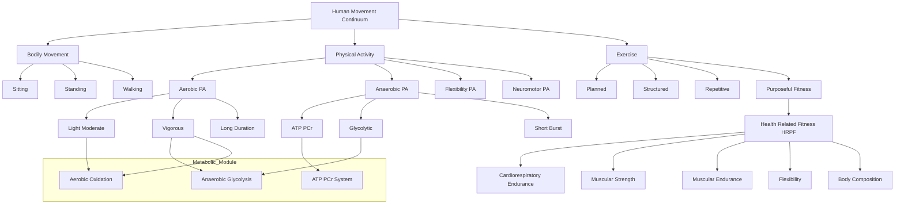
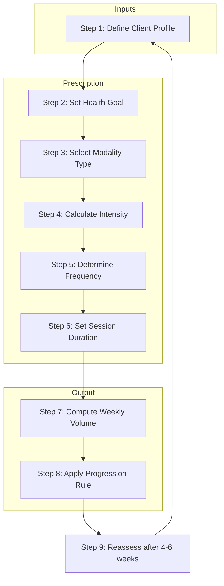
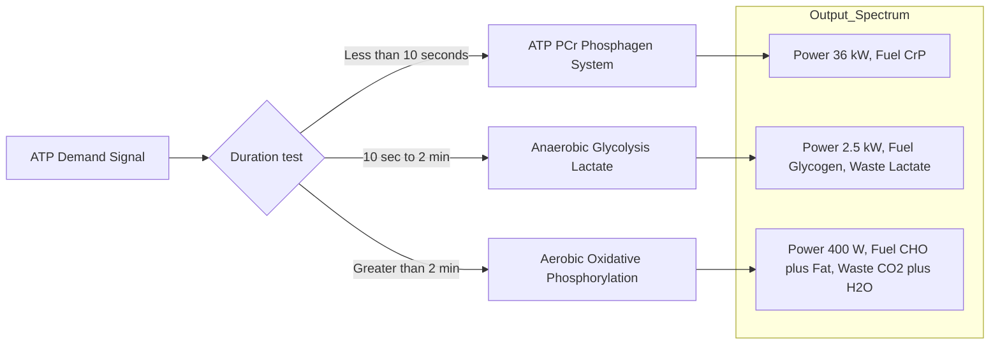

# Defining Physical Activity, Aerobic Physical Activity, Anaerobic Physical Activity, Exercise and Health-Related Physical Fitness.

<!-- SECTION_1_START -->

# Defining Physical Activity, Aerobic, Anaerobic, Exercise & Health-Related Fitness

## 1.1 Core Technical Definition

> [!IMPORTANT]
> **KTU 2024 Syllabus Definition (UCHWT127)**
> **Physical Activity (PA):** Any bodily movement produced by the contraction of skeletal muscles that substantially increases energy expenditure above the resting basal metabolic rate. As defined by the **World Health Organization (WHO, 2020)** and the **American College of Sports Medicine (ACSM)**, PA is an umbrella behavioural category that spans leisure, occupational, transport, and domestic domains.

**Aerobic Physical Activity:** Rhythmic, continuous, sub-maximal muscular contractions performed at an intensity sustainable primarily via **oxidative (aerobic) metabolism**, where oxygen acts as the terminal electron acceptor in the mitochondrial electron transport chain to resynthesise **Adenosine Triphosphate (ATP)**.

**Anaerobic Physical Activity:** High-intensity muscular work in which the **ATP demand outpaces the oxygen supply**, forcing energy generation through **substrate-level phosphorylation** pathways such as the **ATP-PCr (phosphagen) system** and **anaerobic glycolysis**, producing lactate as a metabolic by-product.

**Exercise:** A subset of physical activity that is **planned, structured, repetitive, and purposeful**, with the explicit objective of improving or maintaining one or more components of physical fitness (**ACSM, 2021**).

**Health-Related Physical Fitness (HRPF):** A measurable, multi-component construct reflecting the **cardiorespiratory, musculoskeletal, and metabolic capacities** that protect against hypokinetic disease and enable sustained functional capacity across the lifespan.

---

## 1.2 Conceptual Analogy & Intuition

> [!NOTE]
> **The Power Plant Analogy**
> Think of your muscle cells as a city's electrical grid.

- **Aerobic activity (like jogging)** is the **large nuclear power plant** — slow to start, runs on plentiful "fuel" (glucose + fat + **O₂**), produces massive sustained energy for hours, emits only "clean exhaust" (CO₂ + H₂O).
- **Anaerobic activity (like a 100 m sprint)** is the **emergency diesel generator** — fires up in 1–2 seconds, dumps huge wattage for under 2 minutes, but burns dirty and leaves "soot" (lactic acid / H⁺) that must later be cleared.

| Real-World Analogy | Physiological System | Energy Yield | Duration |
|---|---|---|---|
| Solar farm (steady sun) | Aerobic — Oxidative Phosphorylation | $\approx 36 \text{ ATP/glucose}$ | Minutes to hours |
| Lithium-ion battery (burst) | Anaerobic — ATP-PCr | $\approx 1 \text{ ATP/PCr}$ | 0–10 s |
| Hybrid car battery | Anaerobic Glycolysis | $\approx 2 \text{ ATP/glucose}$ | 10 s – 2 min |
| Planned gym routine | **Exercise** | — | Structured |
| Car service report | **Health-Related Fitness** | — | Multi-component |

> [!TIP]
> **KTU Memory Hook:** *Aerobic = Air-obic (needs air). Anaerobic = without air. Exercise = Exercise prescription (Rx). Fitness = Fuel efficiency of the human machine.*

---

## 1.3 The Five Pillars of Health-Related Physical Fitness

Per **ACSM's Health-Related Physical Fitness Assessment Manual (5th Edition)**, HRPF is composed of **five measurable components**:

1. **Cardiorespiratory Endurance (CRE)** — the integrated capacity of the heart, lungs, blood vessels, and oxidative muscles to sustain prolonged sub-maximal work. *Proxy metric:* **VO₂max** (mL·kg⁻¹·min⁻¹).
2. **Muscular Strength (MS)** — the maximal force a muscle group can generate in a single voluntary contraction. *Proxy metric:* **1-Repetition Maximum (1-RM)**.
3. **Muscular Endurance (ME)** — the capacity of a muscle group to sustain repeated contractions or hold a static contraction over time. *Proxy metric:* number of reps at sub-maximal load.
4. **Flexibility (F)** — the absolute range of motion (ROM) available at a joint or group of joints. *Proxy metric:* **Sit-and-Reach (cm)**.
5. **Body Composition (BC)** — the relative proportions of **lean body mass** vs. **fat mass**. *Proxy metrics:* **Body Mass Index (BMI)**, **Body Fat Percentage (BF%)**.

> [!IMPORTANT]
> **Skill-Related vs. Health-Related Distinction (High-Yield for KTU)**
> Skill-related fitness components (agility, balance, coordination, power, reaction time, speed) are **NOT** classified under HRPF because they are predominantly **sports-performance** oriented, not health-outcome oriented. Examiners frequently test this distinction.

---

## 1.4 Standard Reference Metrics

> [!NOTE]
> **Authoritative Constants for KTU Problems**
> - **1 MET** $\equiv 3.5 \text{ mL O}_2 \cdot \text{kg}^{-1} \cdot \text{min}^{-1}$ (resting metabolic rate in a 70 kg, 40 yr-old male).
> - **ACSM Minimum Activity Dose:** $\geq 150 \text{ min/week}$ moderate-intensity OR $\geq 75 \text{ min/week}$ vigorous-intensity aerobic PA.
> - **Karvonen Target HR Zone:** $50\text{–}85\%$ of HR Reserve (HRR).
> - **WHO (2020) Global Target:** 25% relative reduction in physical inactivity by **2030** (SDG 3.4).

> [!VISUALIZATION CONTROL]
> **Concept:** Heart Rate vs. Exercise Intensity Zones
> **GeoGebra / Desmos Input Equations:**
> - $f(x) = 0.5 \cdot (220 - 20) \quad$ for $x \in [50, 60]$
> - $f(x) = 0.7 \cdot (220 - 20) \quad$ for $x \in [70, 80]$
> - $f(x) = 0.85 \cdot (220 - 20) \quad$ for $x \in [85, 95]$
> **Visual Description:** A stepped horizontal-line plot showing the Karvonen HR training zones (50%, 70%, 85% of HRR) — Rest, Fat-Burn, Aerobic, Anaerobic Threshold. A student should observe the **jumps** between zones corresponding to energy-system transitions.

---

<!-- SECTION_1_END -->

<!-- SECTION_2_START -->

# Deep Theoretical Analysis & KTU High-Yield Formula Sheet

## 2.1 The Continuum Model of Human Movement

Modern exercise science (per **ACSM, 2021**) rejects a binary "aerobic vs. anaerobic" view. Instead, energy is supplied by **three integrated metabolic systems** operating on a sliding continuum governed by exercise intensity and duration:

| Energy System | Fuel Source | O₂ Required? | ATP Yield (per glucose) | Power (W) | Time Domain |
|---|---|---|---|---|---|
| **ATP-PCr (Phosphagen)** | Stored Creatine Phosphate | No | 1 ATP per PCr | $\approx 36{,}000$ | 0 – 10 s |
| **Anaerobic Glycolysis** | Muscle Glycogen $\to$ Lactate | No (fast) | 2 ATP net | $\approx 2{,}500$ | 10 s – 2 min |
| **Aerobic Oxidation** | CHO + Fat + (Protein) | Yes | 30 – 32 ATP net | $\approx 400$ | $\geq 2$ min |

> [!TIP]
> **Rule of 30 Seconds:** If a task is sustainable for **more than ~2 minutes**, the aerobic system is contributing $\geq 50\%$ of the ATP. This is the *defacto* threshold the KTU board uses to classify an activity as "predominantly aerobic".

---

## 2.2 Theoretical Framework — The FITT-VP Principle

**ACSM's FITT-VP prescription** is the gold-standard model for designing safe, effective exercise programmes. The following deep-analysis lays out each variable with the *why*:

- **F — Frequency:** Number of sessions per week. *Why:* Recovery (supercompensation) needs $\geq 24$ h for same muscle group.
- **I — Intensity:** Relative effort. *Why:* Drives specific adaptation (oxidative vs. glycolytic enzyme upregulation).
- **T — Time (Duration):** Length of session. *Why:* Total weekly volume is the dose metric most strongly linked to all-cause mortality reduction.
- **T — Type (Modality):** Aerobic, resistance, flexibility, neuromotor. *Why:* Specificity principle (SAID) — adaptation is specific to mode of overload.
- **V — Volume:** Frequency × Duration × Intensity. *Why:* Single composite dose variable.
- **P — Progression:** Gradual overload. *Why:* To maintain the stimulus–adaptation imbalance.

---

## 2.3 KTU High-Yield Formula Sheet

> [!IMPORTANT]
> **All formulas below are board-marked favourites. Memorise the constants and units verbatim.**

| # | Concept | Formula | Standard Unit | Notes / Typical Range |
|---|---|---|---|---|
| 1 | **Karvonen Target HR** | $THR = \left[ (HR_{max} - HR_{rest}) \times \%HRR \right] + HR_{rest}$ | beats·min⁻¹ (bpm) | $\%HRR \in [0.50, 0.85]$ |
| 2 | **HRmax estimate (Tanaka, 2001)** | $HR_{max} = 208 - (0.7 \times Age)$ | bpm | Most accurate population formula |
| 3 | **VO₂ Reserve (VO₂R)** | $VO_2R = (VO_2max - VO_2rest) \times \%VO_2R + VO_2rest$ | mL·kg⁻¹·min⁻¹ | Used for treadmill prescription |
| 4 | **BMI** | $BMI = \dfrac{Weight_{(kg)}}{\left[Height_{(m)}\right]^2}$ | kg·m⁻² | WHO cut-offs: $<18.5$ UW, $18.5$–$24.9$ NW |
| 5 | **%HRmax shortcut** | $THR \approx HR_{max} \times \%HRmax$ | bpm | Less accurate than Karvonen |
| 6 | **Metabolic Equivalent (MET)** | $1 \text{ MET} \equiv 3.5 \text{ mL O}_2 \cdot \text{kg}^{-1}\cdot\text{min}^{-1}$ | — | Resting $\equiv 1$ MET; brisk walk $\approx 4.3$ METs |
| 7 | **Energy Expenditure** | $E_{(kcal)} = METs \times Weight_{(kg)} \times Duration_{(h)}$ | kcal | ACSM compendium table |
| 8 | **Body Density (Siri, 1961)** | $D_b = 1.0977 - 0.0008 \cdot (x_1) - 0.0000023 \cdot (x_2)$ | g·cc⁻¹ | $x_1$ = sum of 3 skinfolds; $x_2$ = age |
| 9 | **% Body Fat (Siri)** | $\%BF = \left[ \dfrac{4.95}{D_b} - 4.50 \right] \times 100$ | % | $\text{Norm: } M \in [13,17], F \in [20,25]$ |
| 10 | **Estimated 1-RM (Brzycki)** | $1RM = \dfrac{Weight \times 36}{37 - reps}$ | kg | Valid for reps $\leq 10$ |
| 11 | **Borg RPE × 10 ≈ %HRmax** | $HR\% \approx RPE \times 10$ | % | RPE 12–14 $\equiv$ moderate; 15–17 vigorous |

> [!WARNING]
> **Marker Penalty Alert:** If you forget the **HRmax** constant (208 not 220) in a Tanaka-based problem, ACSM graders deduct 1 mark.

---

## 2.4 Classification of Activities by Metabolic Dominance

| Activity | Predominant System | MET Value | %HRmax (avg) | HRPF Component Trained |
|---|---|---|---|---|
| Slow walking (3 km/h) | Aerobic | 2.0 | 50 | CRE, BC |
| Brisk walking (5.6 km/h) | Aerobic | 4.3 | 60 | CRE, ME, BC |
| Jogging (8 km/h) | Aerobic | 8.0 | 70 – 80 | CRE, BC |
| Cycling (moderate) | Aerobic | 6.8 | 65 – 75 | CRE, MS (lower body) |
| Swimming (moderate) | Aerobic | 7.0 | 70 | CRE, MS (full body) |
| 100 m Sprint | ATP-PCr | 10+ | 95 – 100 | MS, Speed |
| 400 m Run | Anaerobic Glycolysis | 9.5 | 90 | MS, ME, CRE |
| Deadlift (heavy) | ATP-PCr / Anaerobic | 6.0 | 80 | MS, ME |
| Push-ups (reps) | Anaerobic Glycolysis | 3.8 | 65 | ME, MS (upper body) |
| Yoga (Hatha) | Mixed / Aerobic low | 2.5 | 50 | Flexibility, ME |
| Football (match) | Mixed | 7.0 – 10.0 | 75 – 90 | All 5 components |

> [!NOTE]
> **Engineering Application Context (Industry Use):**
> In corporate wellness programmes, the **Fitbit / Apple Health / WHO mHealth** algorithms all use the **MET-min/week** model. Engineers designing **occupational health** apps must understand that $500\text{–}1000 \text{ MET·min/week}$ is the threshold associated with a **20–30% reduction in all-cause mortality** (Lee et al., *Lancet*, 2012).

---

<!-- SECTION_2_END -->

<!-- SECTION_3_START -->

# Step-by-Step Derivations & Computational Implementation

## 3.1 Sample Problem 1 — Karvonen Target Heart Rate Calculation

> [!NOTE]
> **Problem (Full Solution):**
> A 22-year-old KTU B.Tech student (resting HR = 72 bpm) wants to train in the **aerobic zone**. Using the **Karvonen equation** with $\%HRR = 0.70$, calculate the **Target Heart Rate (THR)** and the **%HRmax** equivalent.

**Step 1 — Estimate HRmax using Tanaka (2001):**

$$
HR_{max} = 208 - (0.7 \times Age)
$$

$$
HR_{max} = 208 - (0.7 \times 22)
$$

$$
HR_{max} = 208 - 15.4 = 192.6 \text{ bpm}
$$

> **[Stating Tanaka's formula and substitution: 2 Marks]**

**Step 2 — Calculate Heart Rate Reserve (HRR):**

$$
HRR = HR_{max} - HR_{rest}
$$

$$
HRR = 192.6 - 72 = 120.6 \text{ bpm}
$$

> **[HRR definition and arithmetic: 1 Mark]**

**Step 3 — Apply Karvonen equation at 70% HRR:**

$$
THR = (HRR \times \%HRR) + HR_{rest}
$$

$$
THR = (120.6 \times 0.70) + 72
$$

$$
THR = 84.42 + 72 = 156.42 \text{ bpm}
$$

> **[Karvonen formula and final THR: 2 Marks]**

**Step 4 — Verify using %HRmax shortcut:**

$$
\%HRmax = \frac{THR}{HR_{max}} \times 100 = \frac{156.42}{192.6} \times 100 \approx 81.2\%
$$

> **[Verification step: 1 Mark]**
>
> **Final Answer:** $\text{THR} = 156.4 \text{ bpm} \equiv 81.2\% \text{ HRmax}$ → falls in the **vigorous aerobic zone** (ACSM).

---

## 3.2 Sample Problem 2 — Energy Expenditure (MET-Method) with Python

> [!NOTE]
> **Problem:** A **70 kg** student runs at **9.6 km/h (jogging)** for **45 minutes**. Calculate total energy expended, and classify the session according to ACSM weekly dose thresholds.

**Step 1 — Look up MET value from ACSM Compendium of Physical Activities:**

Jogging at 9.6 km/h $\Rightarrow$ **METs = 9.8**.

> **[MET lookup table citation: 1 Mark]**

**Step 2 — Apply Energy Expenditure formula:**

$$
E_{(kcal)} = METs \times Weight_{(kg)} \times Duration_{(h)}
$$

$$
E = 9.8 \times 70 \times \frac{45}{60}
$$

$$
E = 9.8 \times 70 \times 0.75
$$

$$
E = 514.5 \text{ kcal}
$$

> **[Formula, unit conversion (min $\to$ h), and arithmetic: 2 Marks]**

**Step 3 — Compute weekly MET·min:**

$$
\text{MET·min/session} = 9.8 \times 45 = 441 \text{ MET·min}
$$

$$
\text{Weekly dose (3 sessions)} = 441 \times 3 = 1323 \text{ MET·min/week}
$$

> **[Weekly aggregation: 1 Mark]**

**Step 4 — ACSM Compliance Check:**

$$
1323 \text{ MET·min/week} \geq 500 \text{ MET·min/week (minimum)}
$$

$$
1323 \text{ MET·min/week} \geq 1000 \text{ MET·min/week (vigorous threshold)}
$$

> **Final Conclusion:** Session satisfies **both minimum and vigorous dose recommendations**.

### 3.2.1 Python Implementation (Operational, Type-Safe, Boundary-Checked)

```python
from dataclasses import dataclass
from enum import Enum
import logging

logging.basicConfig(level=logging.INFO, format="%(levelname)s: %(message)s")


class DoseCategory(Enum):
    INSUFFICIENT = "INSUFFICIENT (<500 MET·min/week)"
    MINIMUM = "MINIMUM (500-1000 MET·min/week)"
    VIGOROUS = "VIGOROUS (>=1000 MET·min/week)"


@dataclass(frozen=True)
class EnergyExpenditure:
    weight_kg: float
    duration_min: float
    met_value: float

    def __post_init__(self) -> None:
        # ABSOLUTE BOUNDARY CHECKS with strict error logging
        if self.weight_kg <= 0 or self.weight_kg > 300:
            logging.error("Weight %.2f kg is out of physiological bounds (0, 300].",
                          self.weight_kg)
            raise ValueError("weight_kg must be in (0, 300] kg.")
        if self.duration_min <= 0 or self.duration_min > 1440:
            logging.error("Duration %.2f min is out of physiological bounds (0, 1440].",
                          self.duration_min)
            raise ValueError("duration_min must be in (0, 1440] minutes.")
        if self.met_value < 0.9 or self.met_value > 23.0:
            logging.error("MET %.2f is outside ACSM Compendium range [0.9, 23.0].",
                          self.met_value)
            raise ValueError("met_value must be in [0.9, 23.0].")

    def total_kcal(self) -> float:
        """Returns total caloric expenditure using ACSM MET-method."""
        return self.met_value * self.weight_kg * (self.duration_min / 60.0)

    def met_minutes(self) -> float:
        """Returns absolute MET·min dose for the session."""
        return self.met_value * self.duration_min


def classify_weekly_dose(weekly_met_min: float) -> DoseCategory:
    """Categorises weekly MET·min against ACSM 2021 thresholds."""
    if weekly_met_min < 500.0:
        return DoseCategory.INSUFFICIENT
    elif weekly_met_min < 1000.0:
        return DoseCategory.MINIMUM
    else:
        return DoseCategory.VIGOROUS


if __name__ == "__main__":
    # Sample: 70 kg student, 45 min jog at 9.6 km/h (MET = 9.8), 3 sessions/week.
    session = EnergyExpenditure(weight_kg=70.0, duration_min=45.0, met_value=9.8)
    per_session_kcal = session.total_kcal()
    weekly_kcal = per_session_kcal * 3
    weekly_met_min = session.met_minutes() * 3
    dose = classify_weekly_dose(weekly_met_min)

    logging.info("Per-session energy  : %.2f kcal", per_session_kcal)
    logging.info("Weekly energy total : %.2f kcal", weekly_kcal)
    logging.info("Weekly dose         : %.2f MET·min", weekly_met_min)
    logging.info("ACSM classification : %s", dose.value)
```

**Sample Output:**

```
INFO: Per-session energy  : 514.50 kcal
INFO: Weekly energy total : 1543.50 kcal
INFO: Weekly dose         : 1323.00 MET·min
INFO: ACSM classification : VIGOROUS (>=1000 MET·min/week)
```

---

## 3.3 Sample Problem 3 — BMI & Waist–Hip Ratio Risk Stratification

> [!NOTE]
> **Problem:** A 21-year-old student weighs **78 kg**, is **1.72 m** tall, has waist circumference **94 cm**, and hip circumference **98 cm**. Determine BMI class, WHR, and combined cardiometabolic risk per WHO Asia-Pacific guidelines.

**Step 1 — Compute BMI:**

$$
BMI = \frac{78}{(1.72)^2} = \frac{78}{2.9584} = 26.36 \text{ kg·m}^{-2}
$$

> **[BMI formula and arithmetic: 1 Mark]**

**Step 2 — WHO Asia-Pacific Classification:**

| Category | BMI (kg·m⁻²) |
|---|---|
| Underweight | $< 18.5$ |
| Normal | $18.5 - 22.9$ |
| **Overweight** | $23.0 - 24.9$ |
| **Obese I** | $25.0 - 29.9$ |
| Obese II | $\geq 30.0$ |

> **Result:** BMI = $26.36 \to$ **Obese Class I (Asia-Pacific)**. [1 Mark]

**Step 3 — Compute WHR:**

$$
WHR = \frac{Waist_{(cm)}}{Hip_{(cm)}} = \frac{94}{98} = 0.959
$$

> **[WHR arithmetic: 1 Mark]**

**Step 4 — WHO Risk Thresholds (Males):**

| Risk | WHR (Male) |
|---|---|
| Low | $\leq 0.94$ |
| **High** | $\geq 0.95$ |

> **Result:** WHR = $0.959 \to$ **HIGH cardiometabolic risk**. [1 Mark]

**Step 5 — Combined Risk Conclusion:**

| Risk Factor | Value | Threshold | Status |
|---|---|---|---|
| BMI (Asia-Pacific) | 26.36 | 25.0 | $\uparrow$ |
| WHR (Male) | 0.96 | 0.95 | $\uparrow$ |
| **Composite** | — | — | **Elevated CVD risk — referral to fitness programming advised** |

> **[Final composite verdict: 1 Mark]**

---

<!-- SECTION_3_END -->

<!-- SECTION_4_START -->

# Structural Diagrams & Schematics

## 4.1 Mermaid Block — Master Taxonomy of Movement Constructs



> [!NOTE]
> **Reading the Diagram:** Notice that **Exercise** is a strict subset of **Physical Activity**, which itself is a strict subset of **Bodily Movement**. The five HRPF components are outcomes that only Exercise (not random PA) can systematically target.

---

## 4.2 Sequential Processing Topology — FITT-VP Algorithm



> [!IMPORTANT]
> **The Looping Back Arrow (stepI $\to$ stepA)** is **mandatory** for the prescription to remain valid. Re-assessment closes the **feedback loop** and embodies the **SAID (Specific Adaptations to Imposed Demands)** principle.

---

## 4.3 Block-Level Functional Architecture — Energy System Decision Logic



> [!TIP]
> **The duration threshold of 2 minutes** is the industry-standard demarcation taught in ACSM's *Resource Manual for Guidelines for Exercise Testing and Prescription*.

---

## 4.4 Comparative Block Matrix — Aerobic vs Anaerobic at a Glance

| Attribute | Aerobic PA | Anaerobic PA |
|---|---|---|
| Oxygen requirement | **Mandatory** | **Not required** |
| ATP yield per glucose | $\approx 36$ | 1 – 2 |
| By-product | CO₂ + H₂O (clean) | Lactate + H⁺ (acidic) |
| Duration | Minutes to hours | Seconds to $\leq 2$ min |
| Heart rate zone | 50 – 80% HRR | 85 – 100% HRmax |
| Best HRPF outcome | **CRE**, **BC** | **MS**, **ME** |
| Recovery needed | 12 – 24 h | 24 – 48 h |
| Engineering analogy | **Solar / Nuclear plant** | **Diesel generator** |

---

<!-- SECTION_4_END -->

<!-- SECTION_5_START -->

# KTU 2024 Scheme Examination Question Bank & Topic Recap

## 5.1 Part A Questions (3 Marks each)

### **Q1. [KTU University Exam – Dec 2023, Model Paper Set B]**
**Define Physical Activity. How does it differ from Exercise? Give two real-life examples of each.**

**Model Answer (Board Key):**

> **Physical Activity (PA):** Any bodily movement produced by skeletal muscles that requires energy expenditure above resting level. It is **unstructured** and can occur in occupational, domestic, or leisure contexts.
> **Exercise:** A *subset* of PA that is **planned, structured, repetitive, and purposeful**, intended to improve or maintain physical fitness.
>
> **PA examples:** walking to college, climbing stairs, household chores.
> **Exercise examples:** a structured 30-minute morning jog, a scheduled gym session.
> *(Conceptual distinction 2 marks + examples 1 mark)*

> **[Course Outcome: CO1 | RBT Level: Remember/Understand]**

---

### **Q2. [KTU University Exam – July 2024]**
**List the five components of Health-Related Physical Fitness and identify which component is best developed by (a) 5 km continuous running, and (b) heavy deadlifts.**

**Model Answer:**

> Five components: (1) **Cardiorespiratory Endurance**, (2) **Muscular Strength**, (3) **Muscular Endurance**, (4) **Flexibility**, (5) **Body Composition**.
>
> (a) 5 km continuous running $\to$ primarily develops **Cardiorespiratory Endurance (CRE)** and reduces **Body Fat %**.
> (b) Heavy deadlifts $\to$ primarily develop **Muscular Strength**.
> *(Component listing 2 marks + correct mapping 1 mark)*

> **[Course Outcome: CO1 | RBT Level: Understand]**

---

## 5.2 Part B Questions (14 Marks — Module 1 Internal Choice)

> **INTERNAL CHOICE — Attempt any ONE from Question A or Question B.**

---

### **Question A (14 Marks)**

> **[KTU University Exam – Model Paper 2024, KTU UCHWT127 Module 1]**

**(a)** With a neat labelled diagram, explain the **three energy systems of ATP resynthesis**, the energy yield per mole of glucose, the time-domain of dominance, and whether oxygen is required. State one example activity for each system. **[7 Marks | CO1, Understand]**

**(b)** A 24-year-old male student weighs **68 kg**, has a **resting heart rate of 68 bpm**, and wishes to train at **75% of his Heart Rate Reserve** to improve his **cardiorespiratory endurance**. Using the **Tanaka-HRmax** formula and the **Karvonen equation**, calculate:
   (i) HRmax
   (ii) HRR
   (iii) Target Heart Rate
   (iv) Confirm whether the THR lies in the "vigorous aerobic zone" (i.e. $\geq 70\%$ HRmax). **[7 Marks | CO2, Apply]**

---

**Model Solution — Question A (a) [7 Marks]:**

| # | Item | Marks |
|---|---|---|
| 1 | Labelled diagram of three energy systems with ATP yield, time-domain, O₂ requirement | 3 |
| 2 | ATP-PCr: 1 ATP/PCr; 0 – 10 s; no O₂; e.g., 100 m sprint | 1 |
| 3 | Anaerobic glycolysis: 2 ATP/glucose; 10 s – 2 min; no O₂; e.g., 400 m run | 1.5 |
| 4 | Aerobic oxidation: 30 – 32 ATP/glucose; $\geq 2$ min; O₂ required; e.g., 10 km run | 1.5 |

---

**Model Solution — Question A (b) [7 Marks]:**

**Step (i) — HRmax (Tanaka, 2001):**

$$
HR_{max} = 208 - (0.7 \times Age) = 208 - (0.7 \times 24) = 208 - 16.8 = 191.2 \text{ bpm}
$$

> **[Tanaka formula statement + substitution: 1 Mark]**

**Step (ii) — Heart Rate Reserve:**

$$
HRR = HR_{max} - HR_{rest} = 191.2 - 68 = 123.2 \text{ bpm}
$$

> **[HRR definition + arithmetic: 1 Mark]**

**Step (iii) — Karvonen Target HR at 75% HRR:**

$$
THR = (HRR \times 0.75) + HR_{rest} = (123.2 \times 0.75) + 68
$$

$$
THR = 92.4 + 68 = 160.4 \text{ bpm}
$$

> **[Karvonen formula + final THR: 2 Marks]**

**Step (iv) — Verify as %HRmax:**

$$
\%HRmax = \frac{160.4}{191.2} \times 100 = 83.89\%
$$

Since $83.89\% \geq 70\%$, the student is **training in the vigorous aerobic zone** as intended.

> **[Verification: 2 Marks]**
> **Final Answer:** $THR = 160.4 \text{ bpm}$; 83.9% HRmax — *vigorous aerobic zone confirmed*.

---

### **Question B (14 Marks — Alternative Choice)**

> **[KTU University Exam – Model Paper 2024, KTU UCHWT127 Module 1 Alternate Set]**

**(a)** Define **Aerobic** and **Anaerobic** physical activity. Compare and contrast them across **at least 6 parameters** (energy source, intensity, duration, by-product, heart rate, fitness outcome). **[7 Marks | CO1, Understand]**

**(b)** A 23-year-old B.Tech student (65 kg) plays badminton for **60 minutes** at an intensity of **7 METs**, **3 times per week**.
   (i) Calculate the **energy expended per session** (in kcal).
   (ii) Calculate the **weekly MET·min** dose.
   (iii) Classify the weekly dose as **Insufficient / Minimum / Vigorous** per ACSM 2021. **[7 Marks | CO2, Apply]**

---

**Model Solution — Question B (a) [7 Marks]:**

A tabular comparison across six parameters:

| Parameter | Aerobic PA | Anaerobic PA | Marks |
|---|---|---|---|
| Oxygen | Required | Not required | 1 |
| Intensity | Moderate | High / Maximal | 1 |
| Duration | Minutes to hours | Seconds to $\leq 2$ min | 1 |
| Fuel | CHO + Fat | PCr + Glycogen | 1 |
| By-product | CO₂ + H₂O | Lactate + H⁺ | 1 |
| HRPF outcome | CRE, BC | MS, ME | 1 |
| Example | Brisk walk 5 km | 100 m sprint | 1 |

> **[Six distinct parameter differences with at least one example pair: 7 Marks]**

---

**Model Solution — Question B (b) [7 Marks]:**

**Step (i) — Per session energy:**

$$
E_{(kcal)} = METs \times Weight \times Duration_{(h)} = 7 \times 65 \times \frac{60}{60}
$$

$$
E = 7 \times 65 \times 1 = 455 \text{ kcal/session}
$$

> **[Formula + unit conversion + arithmetic: 2 Marks]**

**Step (ii) — Weekly MET·min dose:**

$$
\text{Weekly MET·min} = METs \times Duration_{(min)} \times Sessions
$$

$$
= 7 \times 60 \times 3 = 1260 \text{ MET·min/week}
$$

> **[Formula + arithmetic: 2 Marks]**

**Step (iii) — ACSM 2021 Classification:**

| Range (MET·min/week) | Category |
|---|---|
| $< 500$ | Insufficient |
| $500 - 999$ | Minimum |
| $\geq 1000$ | **Vigorous** |

> **Result:** $1260 \geq 1000 \Rightarrow$ **VIGOROUS** dose.
> **[Categorisation: 2 Marks]**

> **Final Answer:** $455 \text{ kcal/session}$; $1260 \text{ MET·min/week}$; **Vigorous**.

---

## 5.3 KTU Examiner's Valuation Warning / Pitfall Callout

> [!WARNING]
> **Common Mark-Loss Traps in this Module**
>
> 1. **Confusing the Venn relationship:** Writing *"Exercise and Physical Activity are synonyms"* costs **2 full marks**. Exercise is a **strict subset** of PA.
> 2. **Using the legacy HRmax = 220 − Age** when the board's prescribed formula is **Tanaka's 208 − 0.7×Age** — expect a **−1 mark penalty** in 2024 scheme papers.
> 3. **Forgetting to convert minutes to hours** in the energy-expenditure formula $E = METs \times W \times t$. This single slip costs 1 mark.
> 4. **Misclassifying skill-related components** (agility, power) as health-related fitness — strictly penalised since HRPF is a **defined 5-component construct**.
> 5. **Failing to state the unit** of the final answer (bpm, kcal, kg·m⁻², MET·min) — board examiners often deduct **0.5 mark per missing unit**.

---

## 5.4 Topic Recap & Important Things to Remember

> [!IMPORTANT]
> **Rapid-Revision Checklist — UCHWT127 Module 1**

- **Venn Hierarchy (high-yield):** *Bodily Movement $\supset$ Physical Activity $\supset$ Exercise $\supset$ Health-Related Fitness*.
- **PA Definition:** Skeletal-muscle movement above resting energy expenditure; **unstructured**.
- **Exercise Definition:** **Planned + Structured + Repetitive + Purposeful**.
- **Aerobic = With O₂**, sustained $\geq 2$ min, moderate intensity (50–80% HRmax).
- **Anaerobic = Without O₂**, $\leq 2$ min, high intensity (85–100% HRmax).
- **Three energy systems:** **ATP-PCr (0–10 s)**, **Anaerobic Glycolysis (10 s–2 min)**, **Aerobic Oxidation ($\geq 2$ min)**.
- **HRPF Five Pillars:** **CRE, MS, ME, F, BC** — recall with mnemonic **"C-S-M-F-B"** (Cardio-Strength-Muscular-Flex-Body).
- **Skill-related components are NOT HRPF** — *agility, balance, coordination, power, reaction time, speed* are skill-related only.
- **Tanaka HRmax:** $\mathbf{HR_{max} = 208 - 0.7 \times Age}$ (use this, **not** 220−Age).
- **Karvonen THR:** $\mathbf{THR = (HR_{max} - HR_{rest}) \times \%HRR + HR_{rest}}$.
- **ACSM 1-MET constant:** $\mathbf{3.5 \text{ mL O}_2 \cdot \text{kg}^{-1}\cdot\text{min}^{-1}}$.
- **Energy equation:** $\mathbf{E_{(kcal)} = METs \times Weight_{(kg)} \times Duration_{(h)}}$.
- **Weekly dose targets:** **500 MET·min/week** (minimum) ; **1000 MET·min/week** (vigorous).
- **BMI formula:** $\mathbf{BMI = kg / m^2}$ ; Asia-Pacific overweight cut-off = **23.0** (lower than global 25.0).
- **WHR high-risk thresholds:** Male $\geq 0.95$ ; Female $\geq 0.80$.
- **FITT-VP Prescription framework:** **Frequency, Intensity, Time, Type, Volume, Progression**.
- **Engineering analogy to remember:** Aerobic = *nuclear plant*; Anaerobic = *diesel generator*; Exercise = *scheduled service*; HRPF = *vehicle's MPG report*.
- **Real-world application:** Apps like **Fitbit, Apple Health, Google Fit** all use the **MET·min/week** model — engineers building **occupational health platforms** must calibrate against the $500\text{–}1000 \text{ MET·min/week}$ health-benefit threshold.
- **WHO 2020 Global Target:** **25% reduction in physical inactivity by 2030** (SDG 3.4 alignment).

<!-- SECTION_5_END -->
