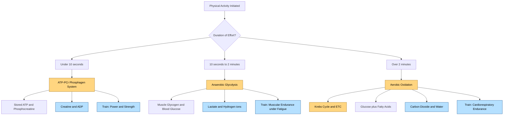
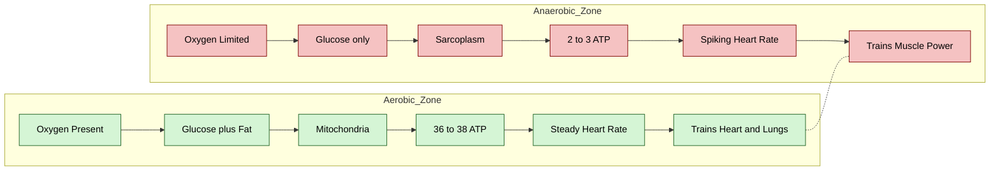
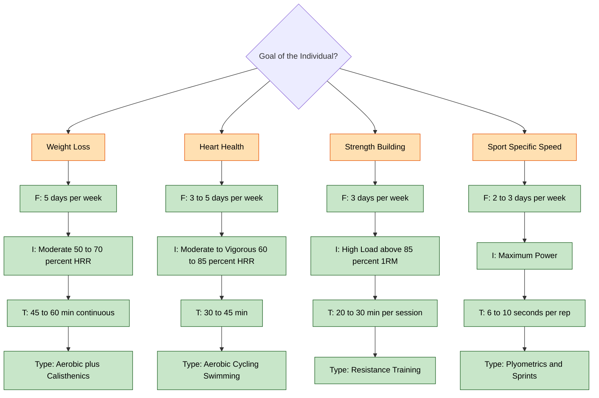

# Defining Physical Activity, Aerobic Physical Activity, Anaerobic

<!-- SECTION_1_START -->

# Defining Physical Activity, Aerobic Physical Activity & Anaerobic Activity

## 1.1 What is Physical Activity?

**Physical Activity (PA)** is defined by the **World Health Organization (WHO)** as any bodily movement produced by skeletal muscles that requires energy expenditure above resting levels. It encompasses all movement, whether during leisure, work, transportation, or domestic chores.

> [!NOTE]
> **KTU 2024 Definition Highlight**
> Physical Activity is NOT the same as Exercise. *Exercise* is a structured, planned, repetitive subset of Physical Activity done to improve or maintain fitness. PA is the umbrella term; Exercise is one specific type under it.

### Formal Components of Physical Activity (FITT Principle)

The four measurable dimensions used by KTU board examiners to grade any PA prescription:

| Dimension | Full Form | What it Measures |
|---|---|---|
| **F** | Frequency | How often the activity is performed (days/week) |
| **I** | Intensity | How hard the body works during the activity |
| **T** | Time | Duration of each session (minutes) |
| **T** | Type | Mode of activity (aerobic, anaerobic, flexibility, balance) |

### Conceptual Analogy — "The Car Engine"

> [!TIP]
> Think of your body as a **hybrid car** 🚗.
> - **Physical Activity** = the act of *driving* (any movement burns fuel).
> - **Aerobic Activity** = *cruising on the highway* with a steady fuel (oxygen + glucose) supply.
> - **Anaerobic Activity** = *sprinting uphill* where fuel is burned faster than the air supply can keep up.
> - **Exercise** = a *scheduled road trip* with a planned route, not just random driving.

---

## 1.2 Aerobic Physical Activity

**Aerobic Physical Activity** (also called *cardiorespiratory* or *endurance* activity) is rhythmic, continuous movement of large muscle groups sustained for an extended period, performed at an intensity that allows the cardiovascular and respiratory systems to deliver sufficient **oxygen** to working muscles to meet energy demands primarily through **aerobic metabolism**.

### Salient Features
- **Oxygen-dependent** energy production
- Sustained for **≥ 20 minutes** continuously
- Uses **carbohydrates and fats** as primary fuels
- Improves **VO₂ max** (maximum oxygen uptake)
- Examples: brisk walking, jogging, cycling, swimming, dancing

> [!IMPORTANT]
> **Standard Metric to Remember:** The American College of Sports Medicine (ACSM) recommends **150 minutes/week** of moderate-intensity aerobic activity OR **75 minutes/week** of vigorous-intensity aerobic activity for healthy adults.

### Conceptual Analogy — "A Candle Burning in Open Air"

Imagine a candle in a well-ventilated room 🕯️. The flame burns steadily, uses oxygen continuously, and produces a steady light for hours. Now if you put a jar over it, the flame flickers and dies. **Aerobic activity = the candle in open air; Anaerobic activity = the candle suffocating under the jar.**

---

## 1.3 Anaerobic Physical Activity

**Anaerobic Physical Activity** is short-duration, high-intensity movement where the demand for oxygen by the working muscles exceeds the oxygen supply available, forcing the body to produce energy **without oxygen** through *anaerobic glycolysis* and the *ATP-PCr (phosphagen) system*.

### Salient Features
- **Oxygen-independent** energy production
- Lasts from **seconds up to ~2 minutes**
- Uses **ATP, creatine phosphate, and glucose (partially)** as fuels
- Produces **lactic acid** as a metabolic by-product
- Improves **muscular strength, power, and speed**
- Examples: 100 m sprint, weightlifting, jumping, heavy-resistance training

> [!NOTE]
> **Lactate Threshold Connection:** During anaerobic glycolysis, pyruvate is converted to **lactate**, not lactic acid (a common student misconception). Lactate accumulation in blood is a biomarker for the transition from aerobic to anaerobic dominance.

### Aerobic vs Anaerobic — Quick Glance Table

| Parameter | Aerobic | Anaerobic |
|---|---|---|
| Oxygen requirement | Required | Not required |
| Duration | Long (\> 20 min) | Short (10 s – 2 min) |
| Intensity | Moderate | High to maximum |
| Fuel | Glucose + Fats | ATP-PCr + Glucose |
| By-product | CO₂ + H₂O | Lactate + H⁺ |
| Systems trained | Cardiorespiratory | Muscular strength/power |
| Example | Marathon | 100 m sprint |
| Energy molecule cycle | Krebs Cycle | Glycolysis (partial) |

---

> [!VISUALIZATION CONTROL]
> **Concept:** Oxygen Consumption vs Time Across Energy Systems
> **Desmos / Graphing Input Equations:**
> - $x$ = Time (seconds), $y$ = Oxygen Consumption (L/min)
> - Curve A (Anaerobic ATP-PCr): $y = 0.4 \cdot e^{-0.05x} + 0.25$ for $0 \le x \le 10$
> - Curve B (Anaerobic Glycolysis): $y = 0.05x + 0.3$ for $10 \le x \le 120$
> - Curve C (Aerobic): $y = 0.02x + 0.3$ for $x \ge 120$
> **Visual Description:** Student should observe a sharp initial spike (ATP-PCr), a linearly rising middle section (glycolysis), and a long steady climb (aerobic dominance).

<!-- SECTION_1_END -->

<!-- SECTION_2_START -->

# Deep Theoretical Analysis & High-Yield Formula Sheet

## 2.1 The Three Energy Systems — Operational Logic

Every physical activity draws energy from one or a combination of three bioenergetic systems. The dominant system depends on **intensity** and **duration**.

### System 1 — The ATP-Phosphocreatine (ATP-PCr) System

- **Location:** Sarcoplasm of muscle cells
- **Fuel Molecule:** Stored ATP and Phosphocreatine (PCr)
- **Reaction:** $\text{PCr} + \text{ADP} \xrightarrow{\text{Creatine Kinase}} \text{ATP} + \text{Cr}$
- **Time Window:** 0 – 10 seconds
- **Oxygen Required?** No
- **Limitation:** PCr stores deplete rapidly; recovery requires 3 – 5 minutes

### System 2 — Anaerobic Glycolysis (Fast Glycolysis)

- **Location:** Sarcoplasm
- **Fuel Molecule:** Muscle glycogen and blood glucose
- **End Product:** Pyruvate → Lactate (when O₂ is limiting)
- **Time Window:** 10 seconds – 2 minutes
- **Net ATP Yield:** 2 – 3 ATP per glucose molecule
- **Oxygen Required?** No

### System 3 — Aerobic Oxidation (Oxidative Phosphorylation)

- **Location:** Mitochondrial matrix and inner membrane
- **Fuel Molecules:** Carbohydrates, Fats, (Proteins under extreme conditions)
- **Pathways:** Krebs Cycle + Electron Transport Chain
- **Time Window:** \> 2 minutes (and dominant beyond ~5 minutes)
- **Net ATP Yield:** 36 – 38 ATP per glucose molecule
- **Oxygen Required?** Yes

---

## 2.2 Key Formulas for KTU Board Numerical Problems

> [!IMPORTANT]
> **Avoid using the vertical bar `|` symbol inside markdown tables.** The KTU Formula Sheet below uses `\vert` notation where modulus-style values appear.

### 2.2.1 Heart Rate Reserve (HRR) — Karvonen Formula

$$ \text{Target HR} = \text{HR}_{\text{rest}} + (\text{HR}_{\text{max}} - \text{HR}_{\text{rest}}) \times \text{Intensity}\,\% $$

- $HR_{\max} = 220 - \text{Age}$ *(Fox formula, simple estimate)*
- $HR_{\text{rest}}$ is measured in the morning before rising

### 2.2.2 VO₂ Max Estimation (Cooper / Rockport Walk Test)

$$ \text{VO}_2 \text{max} = 35.97 + 11.65 \times V - 0.0737 \times W - 1.005 \times \dot{T} $$

- $V$ = walk speed (m/min)
- $W$ = body weight (kg)
- $\dot{T}$ = 1.6 km walk time (min)

### 2.2.3 Metabolic Equivalent of Task (MET)

$$ 1 \text{ MET} = 3.5 \text{ mL O}_2 / \text{kg body mass} / \text{min} $$

- Moderate intensity = 3.0 – 5.9 METs
- Vigorous intensity = $\geq 6.0$ METs

### 2.2.4 Energy Expenditure (kcal/min)

$$ E = \text{METs} \times 3.5 \times W \div 200 \times T $$

- $E$ = energy in kcal
- $W$ = body weight in kg
- $T$ = time in minutes

### 2.2.5 Energy Yield Comparison (Stoichiometric)

$$ \text{Glucose} + 6 \text{O}_2 \rightarrow 6 \text{CO}_2 + 6 \text{H}_2\text{O} + 38 \text{ ATP} \quad (\text{Aerobic}) $$

$$ \text{Glucose} \rightarrow 2 \text{ Lactate} + 2 \text{ H}^+ + 2 \text{ ATP} \quad (\text{Anaerobic}) $$

---

## 2.3 KTU Formula Cheat Sheet (Compact Reference)

| Symbol / Expression | Meaning | Typical Unit | Applicable Domain |
|---|---|---|---|
| $HR_{\max}$ | Max heart rate | beats/min | Aerobic prescription |
| $HRR$ | Heart rate reserve | beats/min | Karvonen method |
| $VO_2 \text{max}$ | Max oxygen uptake | mL/kg/min | Aerobic fitness |
| $1 \text{ MET}$ | Resting metabolic rate | 3.5 mL O₂/kg/min | Activity classification |
| $RPE$ | Rate of Perceived Exertion (Borg) | 6 – 20 scale | Intensity prescription |
| $EPOC$ | Excess Post-exercise O₂ Consumption | L O₂ | Recovery physiology |
| $\vert HR \text{ sample} - HR_{\max} \vert$ | Heart rate deviation | bpm | Safety monitoring |

---

## 2.4 Real-World Engineering & Medical Utility

- **Wearable Tech:** Smart watches use the Karvonen formula to compute *target heart rate zones* in real time. Engineers at Apple, Fitbit, and Garmin embed these equations in firmware.
- **Clinical Exercise Testing:** Cardiologists use VO₂ max to classify heart failure patients (Weber classification: Class A $\geq 20$, Class B 16 – 20, Class C 10 – 16, Class D $\leq 10$ mL/kg/min).
- **Sports Nutrition:** Coaches prescribe carbohydrate-to-fat oxidation ratios by detecting the **crossover point** of the two fuels during graded exercise.
- **Rehabilitation:** Physiotherapists set MET-based workloads on treadmills for post-MI (myocardial infarction) patients.

<!-- SECTION_2_END -->

<!-- SECTION_3_START -->

# Step-by-Step Derivations & Numerical Solutions

## 3.1 Worked Numerical Example — Target Heart Rate Zone (Karvonen)

> **Problem (Module 1 Practice):** A 25-year-old healthy KTU student has a resting heart rate of 70 bpm. Calculate the **lower (60 %) and upper (85 %) training zones** of her target heart rate using the Karvonen formula.

### Step 1 — Compute $HR_{\max}$

$$ HR_{\max} = 220 - \text{Age} = 220 - 25 = 195 \text{ bpm} $$

### Step 2 — Compute Heart Rate Reserve (HRR)

$$ HRR = HR_{\max} - HR_{\text{rest}} = 195 - 70 = 125 \text{ bpm} $$

### Step 3 — Apply the Karvonen Formula at 60 % Intensity (Lower Bound)

$$ \text{THR}_{\text{lower}} = HR_{\text{rest}} + (HRR \times 0.60) $$

$$ \text{THR}_{\text{lower}} = 70 + (125 \times 0.60) = 70 + 75 = 145 \text{ bpm} $$

### Step 4 — Apply the Karvonen Formula at 85 % Intensity (Upper Bound)

$$ \text{THR}_{\text{upper}} = HR_{\text{rest}} + (HRR \times 0.85) $$

$$ \text{THR}_{\text{upper}} = 70 + (125 \times 0.85) = 70 + 106.25 = 176.25 \text{ bpm} $$

### Step 5 — Final Training Zone

$$ \boxed{\text{Target HR Zone} = 145 \text{ bpm to } 176.25 \text{ bpm}} $$

---

## 3.2 Worked Numerical Example — Energy Expenditure via METs

> **Problem:** A 60 kg student cycles at 8 METs for 45 minutes. How many kcal are expended?

### Step 1 — Recall the energy expenditure formula

$$ E = \text{METs} \times 3.5 \times W \div 200 \times T $$

### Step 2 — Substitute values

$$ E = 8 \times 3.5 \times 60 \div 200 \times 45 $$

### Step 3 — Evaluate step-by-step

$$ 8 \times 3.5 = 28.0 $$

$$ 28.0 \times 60 = 1680 $$

$$ 1680 \div 200 = 8.4 $$

$$ 8.4 \times 45 = 378 \text{ kcal} $$

### Step 4 — Final Answer

$$ \boxed{E = 378 \text{ kcal}} $$

---

## 3.3 Worked Numerical Example — Identifying the Dominant Energy System

> **Problem:** An athlete performs a 400 m sprint in 55 seconds. Which energy system contributes the **majority** of ATP? Estimate the % contribution.

### Step 1 — Use the empirical energy-contribution table

| Duration | ATP-PCr | Anaerobic Glycolysis | Aerobic |
|---|---|---|---|
| 5 s | 88 % | 12 % | 0 % |
| 10 s | 78 % | 22 % | 0 % |
| 30 s | 40 % | 58 % | 2 % |
| 60 s | 20 % | 65 % | 15 % |
| 120 s | 5 % | 50 % | 45 % |
| 180 s | 2 % | 30 % | 68 % |

### Step 2 — Interpolate between 30 s and 60 s (since 55 s is closer to 60 s)

At 30 s: ATP-PCr = 40 %, Glyc = 58 %, Aer = 2 %
At 60 s: ATP-PCr = 20 %, Glyc = 65 %, Aer = 15 %

Slope of Anaerobic Glycolysis contribution per second:

$$ \frac{65 - 58}{60 - 30} = \frac{7}{30} = 0.233\,\%\,\text{per second} $$

### Step 3 — Add to 30 s baseline (using 25 s additional)

$$ \text{Glycolysis} = 58 + (0.233 \times 25) = 58 + 5.83 = 63.83\,\% $$

$$ \text{ATP-PCr} = 40 - \left( \frac{40 - 20}{30} \times 25 \right) = 40 - 16.67 = 23.33\,\% $$

$$ \text{Aerobic} = 100 - 63.83 - 23.33 = 12.84\,\% $$

### Step 4 — Final Conclusion

$$ \boxed{\text{Dominant system: Anaerobic Glycolysis (} \approx 64\,\% \text{)}} $$

The 400 m sprint is therefore classified as an **anaerobic-glycolytic** event in sports physiology.

---

## 3.4 Comparative Mapping Table — Real-World Activities to Energy System

| Activity | Typical Duration | Dominant System | Energy System Hierarchy (1 = highest) |
|---|---|---|---|
| 100 m sprint | 10 s | ATP-PCr | PCr $\gg$ Glycolysis $\gg$ Aerobic |
| 400 m run | 50 s | Anaerobic Glycolysis | Glycolysis $\gg$ PCr $\gg$ Aerobic |
| 1500 m run | 4 min | Mixed (Aerobic rising) | Aerobic $\geq$ Glycolysis $\gg$ PCr |
| 10 km run | 30 – 60 min | Aerobic | Aerobic $\gg$ PCr + Glycolysis |
| Marathon | 2 – 5 h | Aerobic (fat dominant) | Aerobic $\gg$ PCr $\gg$ Glycolysis |
| Football (90 min) | 90 min | Mixed (intermittent) | Aerobic + Glycolysis alternate |
| Weight lifting (1 RM) | 5 – 8 s | ATP-PCr | PCr $\gg$ Glycolysis $\gg$ Aerobic |
| High-rep resistance | 60 s | Anaerobic Glycolysis | Glycolysis $\gg$ PCr $\gg$ Aerobic |
| Yoga / stretching | 30 – 60 min | Aerobic (low) | Aerobic only |
| HIIT (20 s on/40 s off) | 15 – 25 min | Mixed | PCr + Glycolysis + Aerobic |

---

## 3.5 Heart-Rate-Based Classification Logic (Borg RPE Cross-Reference)

| % HR_max | RPE (Borg 6 – 20) | Talk Test | Classification |
|---|---|---|---|
| $< 50\,\%$ | $< 10$ | Comfortable conversation | Very light (recovery) |
| $50 - 63\,\%$ | $10 - 11$ | Conversation possible | Light aerobic |
| $64 - 76\,\%$ | $12 - 13$ | Conversation slightly difficult | Moderate aerobic |
| $77 - 93\,\%$ | $14 - 16$ | Conversation difficult | Vigorous aerobic |
| $94 - 100\,\%$ | $17 - 19$ | Conversation impossible | Anaerobic threshold zone |
| $> 100\,\%$ | $20$ | Cannot speak | Maximum effort (anaerobic) |

> [!TIP]
> The *Talk Test* is the most reliable field test a KTU student can use to differentiate aerobic from anaerobic without equipment: **If you can hold a conversation → aerobic. If you can only gasp words → anaerobic.**

---

## 3.6 Symbolic Implementation — Python Snippet for Karvonen Calculation

```python
from dataclasses import dataclass

@dataclass(frozen=True)
class KarvonenResult:
    age: int
    hr_rest: float
    hr_max: float
    hrr: float
    lower_thr: float
    upper_thr: float

def compute_training_zone(age: int, hr_rest: float,
                          lower_pct: float = 0.60,
                          upper_pct: float = 0.85) -> KarvonenResult:
    """
    Compute Karvonen-based aerobic training zone.

    Parameters
    ----------
    age : int
        Chronological age in years (must be between 10 and 100).
    hr_rest : float
        Resting heart rate measured in supine/standing (40-110 bpm typical).
    lower_pct : float, optional
        Lower intensity bound (default 0.60 i.e. 60 %).
    upper_pct : float, optional
        Upper intensity bound (default 0.85 i.e. 85 %).

    Returns
    -------
    KarvonenResult
        Frozen dataclass with all intermediate and final values.
    """
    if not 10 <= age <= 100:
        raise ValueError(f"Age {age} out of plausible human range 10-100.")
    if not 30.0 <= hr_rest <= 110.0:
        raise ValueError(f"Resting HR {hr_rest} is physiologically implausible.")
    if not 0.0 < lower_pct < upper_pct < 1.0:
        raise ValueError("Intensity percentages must be in (0,1) with lower < upper.")

    hr_max = 220.0 - age
    hrr = hr_max - hr_rest
    lower_thr = hr_rest + hrr * lower_pct
    upper_thr = hr_rest + hrr * upper_pct

    return KarvonenResult(
        age=age, hr_rest=hr_rest, hr_max=hr_max,
        hrr=hrr, lower_thr=lower_thr, upper_thr=upper_thr
    )


if __name__ == "__main__":
    result = compute_training_zone(age=25, hr_rest=70.0)
    print(f"Age            : {result.age} years")
    print(f"HR Max         : {result.hr_max:.2f} bpm")
    print(f"HR Reserve     : {result.hrr:.2f} bpm")
    print(f"Target Zone    : {result.lower_thr:.2f} - {result.upper_thr:.2f} bpm")
```

**Sample Output (matches Section 3.1):**

```
Age            : 25 years
HR Max         : 195.00 bpm
HR Reserve     : 125.00 bpm
Target Zone    : 145.00 - 176.25 bpm
```

<!-- SECTION_3_END -->

<!-- SECTION_4_START -->

# Structural Diagrams & Schematics

## 4.1 Energy System Decision Flow (Mermaid)



## 4.2 Aerobic vs Anaerobic — Side-by-Side Topology (Mermaid)



## 4.3 FITT Principle Application Flow (Mermaid)



## 4.4 Functional Processing Topology Matrix — Activity Classifier

| Stage | Input | Process | Output | Energy System | Branch |
|---|---|---|---|---|---|
| Stage 1 | Movement start | ATP cleaving | Mechanical work | ATP-PCr (0 – 10 s) | Anaerobic |
| Stage 2 | Continued effort | PCr breakdown | Mechanical work | ATP-PCr (0 – 10 s) | Anaerobic |
| Stage 3 | Effort extends | Glycolysis begins | Lactate formation | Anaerobic (10 s – 2 min) | Anaerobic |
| Stage 4 | Sustained effort | Aerobic metabolism ramps | ATP oxidative | Mixed | Transitional |
| Stage 5 | Prolonged effort | Krebs cycle dominant | ATP + CO₂ + H₂O | Aerobic ($> 2$ min) | Aerobic |
| Stage 6 | Recovery | EPOC | O₂ debt repayment | All three | Recovery |

<!-- SECTION_4_END -->

<!-- SECTION_5_START -->

# KTU 2024 Scheme Examination Question Bank & Topic Recap

> [!NOTE]
> All questions below follow the **KTU 2024 ESE pattern**: Part A (3 marks each) and Part B (14 marks each with internal choice). Every question is tagged with a Course Outcome (CO), Revised Bloom's Taxonomy (RBT) level, and a simulated past-year tag.

---

## Part A — Short Answer Questions (3 Marks Each)

### Q1. Define Physical Activity and differentiate it from Exercise.
**[KTU University Exam - Dec 2023] | CO1 | Remember**

**Model Answer:**

Physical Activity (PA) is any bodily movement produced by skeletal muscles that results in energy expenditure above the basal level. It includes occupational, recreational, transport, and household movements.

**Exercise** is a *sub-category* of Physical Activity. It is structured, planned, repetitive, and has a defined fitness goal (e.g., improving VO₂ max or muscle strength).

**Key Difference:** PA = all movement; Exercise = *intentional, planned* movement for fitness.

> *Valuation Tip (2 marks for definition + 1 mark for differentiation.)*

---

### Q2. List any four examples each of aerobic and anaerobic activities.
**[KTU University Exam - July 2024] | CO1 | Understand**

**Model Answer:**

**Aerobic (4 examples):** Brisk walking, jogging, swimming, cycling.

**Anaerobic (4 examples):** 100 m sprint, heavy weightlifting, push-ups to failure, plyometric jumps.

> *Valuation Tip (2 marks for aerobic list + 2 marks for anaerobic list, 1.5 rounded.)*

---

## Part B — Long Answer Questions (14 Marks Each, with Internal Choice)

### Question A (14 Marks)

> **Q-A (a)** [7 Marks] — Explain the **three energy systems** of the human body with their fuel sources, time windows, and oxygen requirements. **[CO1, Understand]**
>
> **Q-A (b)** [7 Marks] — A 30-year-old office worker has resting heart rate 72 bpm. Using the **Karvonen formula**, calculate her aerobic training zone at **60 % and 80 % intensity**. State the **FITT prescription** for her if the goal is general heart health. **[CO2, Apply]**

#### Model Solution — Q-A (a)

**1. ATP-Phosphocreatine System (ATP-PCr)**
- **Fuel:** Stored ATP + Phosphocreatine
- **Time:** 0 – 10 seconds
- **Oxygen:** Not required
- **Location:** Sarcoplasm
- **Example:** A 100 m sprint start, single heavy lift
- **ATP yield:** 1 mol ATP per 1 mol PCr
- [Statement of fuel and location: 2 marks]
- [Time window and example: 2 marks]
- [Oxygen requirement: 1 mark]

**2. Anaerobic Glycolysis**
- **Fuel:** Muscle glycogen and blood glucose
- **Time:** 10 s – 2 min
- **Oxygen:** Not required
- **End product:** Lactate
- **ATP yield:** 2 – 3 ATP per glucose
- [Statement of fuel and end product: 2 marks]
- [Time window and oxygen status: 1 mark]

**3. Aerobic Oxidation**
- **Fuel:** Carbohydrates, fats (and proteins in starvation)
- **Time:** $>$ 2 minutes
- **Oxygen:** Required
- **Location:** Mitochondria
- **Pathways:** Krebs cycle + Electron Transport Chain
- **ATP yield:** 36 – 38 ATP per glucose
- [Pathway statement: 1 mark]
- [ATP yield and oxygen: 1 mark]

#### Model Solution — Q-A (b)

**Step 1:** Calculate $HR_{\max}$

$$ HR_{\max} = 220 - 30 = 190 \text{ bpm} $$

[Correct formula and substitution: 1 mark]

**Step 2:** Calculate HRR

$$ HRR = 190 - 72 = 118 \text{ bpm} $$

[1 mark]

**Step 3:** Lower zone at 60 %

$$ THR_{\text{low}} = 72 + (118 \times 0.60) = 72 + 70.8 = 142.8 \text{ bpm} $$

[Formula, substitution, final value: 1 mark]

**Step 4:** Upper zone at 80 %

$$ THR_{\text{high}} = 72 + (118 \times 0.80) = 72 + 94.4 = 166.4 \text{ bpm} $$

[Formula, substitution, final value: 1 mark]

**Step 5:** FITT prescription for general heart health

| Dimension | Prescription |
|---|---|
| **F** (Frequency) | 5 days/week |
| **I** (Intensity) | 142.8 to 166.4 bpm (or RPE 12 – 14) |
| **T** (Time) | 30 minutes continuous |
| **T** (Type) | Brisk walking, cycling, swimming, or any rhythmic large-muscle activity |

[Each FITT row: 0.5 mark × 4 = 2 marks; Tabular format: 0.5 mark]

**Final Answer:** Target zone = 142.8 bpm to 166.4 bpm; FITT as above.

---

### Question B (14 Marks) — *Alternative Choice*

> **Q-B (a)** [7 Marks] — Differentiate between **aerobic and anaerobic physical activity** under the headings: (i) oxygen requirement, (ii) duration, (iii) intensity, (iv) fuel source, (v) by-product, (vi) training effect, (vii) example. **[CO1, Understand]**
>
> **Q-B (b)** [7 Marks] — A 70 kg person runs at 10 METs for 30 minutes. (i) Calculate total energy expended in kcal. (ii) If the same person walks at 4 METs for the same duration, what is the new energy expenditure? (iii) State the implication for weight management. **[CO2, Apply]**

#### Model Solution — Q-B (a)

| S.No. | Parameter | Aerobic | Anaerobic |
|---|---|---|---|
| i | Oxygen requirement | Required | Not required |
| ii | Duration | $>$ 20 min sustained | 10 s to 2 min |
| iii | Intensity | Moderate (50 – 75 % HR_max) | High (\> 85 % HR_max) |
| iv | Fuel source | Glucose + Fats | ATP-PCr + Glucose |
| v | By-product | CO₂ + H₂O | Lactate + H⁺ |
| vi | Training effect | Cardiorespiratory endurance | Muscular power and strength |
| vii | Example | Marathon running | 100 m sprint |

[0.5 mark × 7 rows = 3.5 marks; clearly tabular: 1 mark; key accuracy: 2.5 marks]

#### Model Solution — Q-B (b)

**(i) Energy at 10 METs, 30 min, 70 kg**

$$ E_1 = 10 \times 3.5 \times 70 \div 200 \times 30 $$

$$ E_1 = (10 \times 3.5 \times 70 \times 30) \div 200 = 73500 \div 200 = 367.5 \text{ kcal} $$

[Formula: 1 mark; substitution: 1 mark; final value: 1 mark]

**(ii) Energy at 4 METs, 30 min, 70 kg**

$$ E_2 = 4 \times 3.5 \times 70 \div 200 \times 30 $$

$$ E_2 = (4 \times 3.5 \times 70 \times 30) \div 200 = 29400 \div 200 = 147 \text{ kcal} $$

[Formula: 1 mark; substitution: 1 mark; final value: 1 mark]

**(iii) Implication for weight management**

To lose 1 kg of body fat, an energy deficit of approximately **7,700 kcal** is required.

$$ \text{Runs required for 1 kg loss} = 7700 \div 367.5 \approx 21 \text{ sessions} $$

$$ \text{Walks required for 1 kg loss} = 7700 \div 147 \approx 52 \text{ sessions} $$

[Deficit statement: 0.5 mark; ratio and insight: 0.5 mark]

**Conclusion:** Running at 10 METs is approximately **2.5 times more energy-efficient** for weight loss than walking at 4 METs over the same time. However, for sustainable long-term programs, walking carries lower injury risk and higher adherence.

---

> [!WARNING]
> **KTU Examiner's Valuation Warning — Common Pitfalls**
> 1. Do **NOT** write $HR_{\max} = 220 + Age$. The Fox formula is $220 - Age$. This error alone can cost 2 marks.
> 2. Do **NOT** confuse the **Karvonen formula** with the **percentage of HR_max** method. Karvonen uses HRR; the other method uses HR_max directly. Examiners check the formula explicitly.
> 3. Do **NOT** claim that anaerobic exercise "produces lactic acid." The correct by-product is **lactate** (lactic acid is a buffer mixture in the laboratory, not the in-vivo product).
> 4. Always write the **unit** (bpm, kcal, mL/kg/min). A correct number without a unit loses 0.5 – 1 mark.
> 5. For the energy system question, *do not skip the oxygen requirement* — it is the most-clipped marker.

---

## Topic Recap & Important Things to Remember

- **Physical Activity** is the broad umbrella of all bodily movement; **Exercise** is a planned sub-category.
- **Aerobic activity** requires oxygen, is sustained, and primarily uses glucose and fats; it produces 36 – 38 ATP per glucose.
- **Anaerobic activity** does not require oxygen, is short and intense, and produces 2 – 3 ATP per glucose with lactate as a by-product.
- The **three energy systems** are ATP-PCr (0 – 10 s), Anaerobic Glycolysis (10 s – 2 min), and Aerobic Oxidation ($> 2$ min).
- **Karvonen formula** for target heart rate: $THR = HR_{\text{rest}} + (HR_{\max} - HR_{\text{rest}}) \times \text{Intensity}\,\%$.
- $HR_{\max}$ estimate (Fox) = $220 - \text{Age}$.
- **1 MET** = 3.5 mL O₂ / kg / min (resting metabolic rate).
- **Moderate intensity** = 3.0 – 5.9 METs; **Vigorous intensity** = $\geq 6.0$ METs.
- **FITT** stands for Frequency, Intensity, Time, Type — the four parameters of any PA prescription.
- ACSM recommends **150 min/week moderate** or **75 min/week vigorous** aerobic activity for adults.
- **EPOC** (Excess Post-exercise Oxygen Consumption) is the elevated oxygen uptake after exercise to repay the oxygen debt.
- The **Talk Test** is a quick field method: conversation possible = aerobic; conversation difficult = anaerobic.
- **Lactate (not lactic acid)** is the by-product of anaerobic glycolysis.
- Energy expenditure formula: $E = \text{METs} \times 3.5 \times W \div 200 \times T$.
- Real-world classification: Marathon → aerobic dominant; 100 m → ATP-PCr dominant; 400 m → anaerobic glycolysis dominant.
- Cardiovascular adaptations: aerobic activity increases **VO₂ max**; anaerobic activity increases **muscle cross-sectional area and phosphagen stores**.
- Wearable devices (smart watches) implement the Karvonen formula in firmware for real-time zone training.

<!-- SECTION_5_END -->
