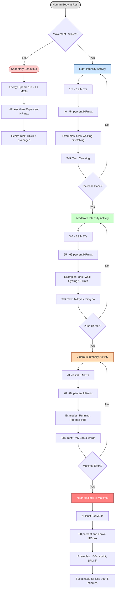
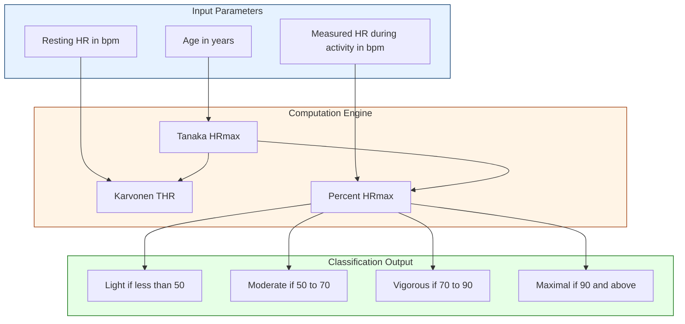
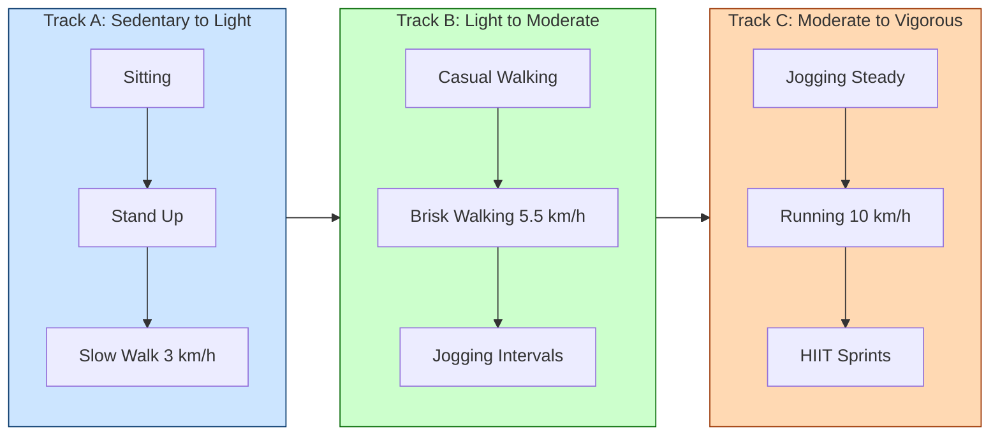

# Exercise Continuum: Light-intensity physical activity, Moderate - intensity physical activity, Vigorous -intensity physical activity

<!-- SECTION_1_START -->
# Exercise Continuum: Light, Moderate & Vigorous Intensity Physical Activity

> [!NOTE]
> **KTU 2024 Scheme – UCHWT127 | Module 1 | Learning Outcome Mapping**
> This topic enables students to **classify physical activities along the exercise continuum**, **quantify exertion using standard physiological indices**, and **prescribe activity doses** aligned with WHO and ACSM (American College of Sports Medicine) global guidelines. Mastery of this topic is essential for Part A (3-mark) definition questions and Part B (14-mark) prescription calculations.

---

## 1.1 Formal Definition — The Exercise Continuum

The **Exercise Continuum** (also called the *Physical Activity Continuum* or *Movement Continuum*) is a clinically accepted, linear framework that classifies human movement and exertion on a **graded spectrum from sedentary behaviour to maximal-effort activity**. It is anchored on three physiological pillars:

1. **Energy Expenditure** — measured in **METs** (Metabolic Equivalent of Task), where **1 MET = 3.5 mL O₂/kg/min = 1 kcal/kg/hour**.
2. **Cardiovascular Strain** — measured as a **percentage of Heart Rate Maximum (HRmax)** or **Heart Rate Reserve (HRR)**.
3. **Perceived Exertion** — measured subjectively using the **Borg Rating of Perceived Exertion (RPE) Scale (6–20)** and the **Talk Test**.

According to the **2020 WHO Global Guidelines on Physical Activity and Sedentary Behaviour**, every adult should engage in **150–300 minutes per week of moderate-intensity aerobic activity**, OR **75–150 minutes per week of vigorous-intensity activity**, OR an equivalent combination.

> [!IMPORTANT]
> **Syllabus Highlight — The Three Intensity Zones**
> - **Light-Intensity Physical Activity (LPA):** 1.5 – 2.9 METs | < 50% HRmax | RPE 6–11
> - **Moderate-Intensity Physical Activity (MPA):** 3.0 – 5.9 METs | 50–69% HRmax | RPE 12–13
> - **Vigorous-Intensity Physical Activity (VPA):** ≥ 6.0 METs | 70–89% HRmax | RPE 14–17

---

## 1.2 Conceptual Analogy — The Car Accelerator

Imagine your body is a **car** and physical activity is the **accelerator pedal**:

- **Sedentary (Engine Idling):** The car is parked, engine running, but no movement. This is your *basal metabolic state* — sitting, lying, screen time. Calories burned ≈ 1 MET.
- **Light Intensity (Creeping in 1st Gear):** You roll the car forward at walking pace (< 4 km/h). You can comfortably hum your favourite song, look around, and wave at a friend. Heart rate barely rises.
- **Moderate Intensity (Cruising in 3rd Gear on the Highway):** The car is moving at a steady 50–70 km/h. You must focus on the road, but you can still talk to the co-passenger. Breathing is deeper, sweat may begin to appear.
- **Vigorous Intensity (Flooring the Accelerator at 120+ km/h):** The engine is roaring, you can barely speak more than 3–4 words without gasping, and your heart is pounding. The body is operating near its aerobic ceiling.
- **Maximal Effort (Red-Line on the Tachometer):** The car is at the absolute mechanical limit — sustainable only for seconds, as in a 100-metre sprint.

> [!NOTE]
> **Pedagogical Insight:** The continuum is *bidirectional*. Movement along it is not a "ladder you climb" but a "dial you turn." A 65-year-old retiree walking slowly may be at their *vigorous* threshold, while a 22-year-old athlete running at 12 km/h remains in their *moderate* zone. **Intensity is always relative to the individual's baseline capacity.**

---

## 1.3 GeoGebra Visualization Block

> [!VISUALIZATION CONTROL]
> **Concept:** Intensity Continuum on a Number Line with METs, %HRmax, and RPE Triple-Overlay
>
> **Plot 1 (MET Axis, x-axis from 0 to 12):**
> * `Sedentary Zone: (1, 0) to (1.5, 0)` — shaded gray
> * `Light Zone: (1.5, 0) to (2.9, 0)` — shaded light blue
> * `Moderate Zone: (3, 0) to (5.9, 0)` — shaded green
> * `Vigorous Zone: (6, 0) to (8.9, 0)` — shaded orange
> * `Near-Maximal: (9, 0) to (12, 0)` — shaded red
>
> **Plot 2 (%HRmax Axis, secondary y-axis from 0 to 100):**
> * Plot points `(1, 25)`, `(1.5, 35)`, `(2.9, 50)`, `(3, 55)`, `(5.9, 70)`, `(6, 75)`, `(8.9, 90)`
>
> **Visual Description:** The student should see a **monotonically increasing staircase curve** where every increase of 1 MET roughly corresponds to a 7–10 percentage-point rise in %HRmax. The **coloured bands** map the three syllabus-mandated intensity zones. This single graph is the most exam-relevant visual in the entire topic.

---
<!-- SECTION_1_END -->

<!-- SECTION_2_START -->
# Deep Theoretical Analysis & KTU High-Yield Formula Sheet

## 2.1 The Physiological Architecture of the Continuum

The exercise continuum is grounded in **Fick's Equation of Oxygen Consumption**, which states that systemic oxygen uptake ($VO_2$) is the product of **cardiac output (Q)** and **arteriovenous oxygen difference (a-vO₂ difference)**:

$$VO_2 = Q \times (a\text{-}vO_2\ difference)$$

$$Q = SV \times HR$$

Therefore:

$$VO_2 = SV \times HR \times (a\text{-}vO_2\ difference)$$

Where:
- $SV$ = Stroke Volume (mL blood/beat), typically 60–100 mL at rest
- $HR$ = Heart Rate (beats/min)
- $a\text{-}vO_2\ difference$ = oxygen extracted by tissues (mL O₂/100 mL blood)

> **Key Reasoning:** As we move from sedentary to vigorous activity, the body progressively augments *all three* of these levers. This is precisely why the continuum is a **physiological gradient**, not a behavioural one.

---

## 2.2 Heart Rate Reserve (HRR) & The Karvonen Method

The **Karvonen Formula** (1957) is the gold-standard method for prescribing exercise intensity because it accounts for **both resting and maximal heart rate**, providing a more accurate target than simple %HRmax.

$$THR = \left[(HR_{max} - HR_{rest}) \times \%\text{Intensity}\right] + HR_{rest}$$

Where:
- $THR$ = Target Heart Rate (beats/min) for the desired zone
- $HR_{max}$ = Maximum achievable heart rate (beats/min)
- $HR_{rest}$ = Heart rate measured after 5 minutes of supine rest (beats/min)
- $\%\text{Intensity}$ = Decimal of the desired intensity zone (e.g., 0.60 for moderate)

### Estimation of HRmax

| Formula | Equation | Best Use Case | Source |
|---|---|---|---|
| **Fox Formula** (1971) | $HR_{max} = 220 - \text{Age}$ | Healthy adults, quick screening | Fox, Naughton & Haskell (1971) |
| **Tanaka Formula** (2001) | $HR_{max} = 208 - (0.7 \times \text{Age})$ | More accurate, recommended by ACSM | Tanaka, Monahan & Seals (2001) |
| **Gulati Formula** (2010) | $HR_{max} = 206 - (0.88 \times \text{Age})$ | Specifically for women | Gulati et al. (2010) |

---

## 2.3 KTU Formula Sheet — Master Cheat Sheet

> [!IMPORTANT]
> **CRITICAL FORMATTING RULE:** All absolute value / division bars below are written as `\vert` or `\mid` to prevent markdown table breakage. **Do not use raw `\|` inside any table cell.**

| # | Concept | Formula | Variables & Units | Engineering / Clinical Application |
|---|---|---|---|---|
| 1 | **MET (Metabolic Equivalent)** | $MET = \dfrac{\text{Working } VO_2}{\text{Resting } VO_2}$ | $VO_2$ in mL/kg/min | Standardizes activity across body weights |
| 2 | **Fox HRmax** | $HR_{max} = 220 - \text{Age}$ | Age in years | Quick screening in gyms |
| 3 | **Tanaka HRmax** | $HR_{max} = 208 - (0.7 \times \text{Age})$ | Age in years | ACSM 2021 recommended |
| 4 | **Karvonen Target HR** | $THR = \left[(HR_{max} - HR_{rest}) \times I\right] + HR_{rest}$ | $I$ = decimal intensity (0.40, 0.60, 0.80) | Personalized cardiac rehab |
| 5 | **VO₂ Reserve Method** | $Target\ VO_2 = \left[(VO_{2max} - VO_{2rest}) \times I\right] + VO_{2rest}$ | $VO_2$ in mL/kg/min | ACSM cardiorespiratory prescription |
| 6 | **Caloric Expenditure** | $kcal = METs \times \text{Body Weight (kg)} \times \text{Time (hr)}$ | kcal/min when time in minutes | Wearable fitness tech (Fitbit, Apple Watch) |
| 7 | **Borg RPE Mapping** | $RPE \approx 0.10 \times HR_{max}$ | RPE 6–20 scale | Subjective field testing |
| 8 | **Talk Test Cut-off** | Breathing rate correlates with ventilatory threshold | — | No-equipment screening |

---

## 2.4 Detailed Characterization of Each Intensity Zone

### 2.4.1 Light-Intensity Physical Activity (LPA)

| Parameter | Value | Description |
|---|---|---|
| **MET Range** | **1.5 – 2.9 METs** | Less than 3× resting energy |
| **%HRmax** | **40 – 54 %** | Heart rate elevated minimally |
| **RPE (6–20)** | **6 – 11** | "Very light" to "fairly light" |
| **Breathing** | Normal | No noticeable change |
| **Talk Test** | Can sing comfortably | Full vocal control retained |
| **Sweating** | None | Thermal regulation inactive |
| **Examples** | Slow walking (< 4 km/h), light household chores, typing, standing desk work, washing dishes, gentle stretching | Everyday occupational & domestic tasks |

> **Real-world Utility:** LPA is the **default "background"** activity of daily living. It does *not* count toward WHO's 150-minute weekly target, but it **breaks up sedentary time**, which independently reduces all-cause mortality. Modern **occupational health engineering** (e.g., sit-stand desks, walking meetings) targets this zone.

---

### 2.4.2 Moderate-Intensity Physical Activity (MPA)

| Parameter | Value | Description |
|---|---|---|
| **MET Range** | **3.0 – 5.9 METs** | 3–6× resting energy |
| **%HRmax** | **55 – 69 %** | Heart rate in aerobic training zone |
| **RPE (6–20)** | **12 – 13** | "Somewhat hard" |
| **Breathing** | Noticeably deeper, can hold conversation | Ventilation rises ~2–3× |
| **Talk Test** | Can talk in sentences, but **cannot sing** | Vocal cadence breaks during song |
| **Sweating** | Light, after ~10 minutes | Begins ~10 min in |
| **Examples** | Brisk walking (5–6.5 km/h), cycling 15 km/h, recreational swimming, doubles tennis, gardening with digging, dancing | The "feel-good" cardio zone |

> **Real-world Utility:** MPA is the **cornerstone of public health prescriptions**. 30 minutes × 5 days/week (150 min/wk) of MPA reduces cardiovascular mortality by **20–30 %**, type-2 diabetes incidence by **40 %**, and all-cause mortality by **19 %** (Lee et al., *Lancet*, 2012).

---

### 2.4.3 Vigorous-Intensity Physical Activity (VPA)

| Parameter | Value | Description |
|---|---|---|
| **MET Range** | **≥ 6.0 METs** (up to ~8.9 for most adults) | ≥ 6× resting energy |
| **%HRmax** | **70 – 89 %** | Approaching aerobic ceiling |
| **RPE (6–20)** | **14 – 17** | "Hard" to "very hard" |
| **Breathing** | Deep & rapid, gasping between words | Ventilatory threshold crossed |
| **Talk Test** | Can only speak **3–4 words** at a time | Conversation impossible |
| **Sweating** | Profuse, begins within 5 min | Thermoregulation at full load |
| **Examples** | Running (≥ 8 km/h), cycling > 20 km/h, single's tennis, football, basketball, HIIT intervals, jump rope, heavy manual labour | Performance & competitive sport zone |

> **Real-world Utility:** VPA is the **most time-efficient** prescription. **75 minutes/week of VPA = 150 minutes/week of MPA** (a 1:2 substitution ratio). Used in athletic training, military fitness, and metabolic rehabilitation for obesity. It is associated with a **further 15–20 %** mortality benefit above MPA alone.

---

## 2.5 Field Assessment Tools for Intensity Classification

In real-world practice (and in KTU exam scenarios), intensity is determined by one of three field methods:

| Method | Equipment Needed | Accuracy | Best Application |
|---|---|---|---|
| **Heart Rate Monitoring** | Heart rate monitor / smartwatch | High (± 5 bpm) | Gym, lab, structured training |
| **Talk Test** | None (subjective) | Moderate | Outdoor, mass screening |
| **Borg RPE Scale (6–20)** | Printed scale card | Good (when calibrated) | Cardiac rehab, unsupervised exercise |
| **Accelerometer / Pedometer** | Wearable device | Moderate-High | Population studies, epidemiology |
| **MET Lookup Tables** | **2024 Compendium of Physical Activities** | High (if activity-specific) | Research, prescription writing |

---

## 2.6 Real-World Engineering & CS Application

> **Production-Grade Use Case — Wearable Health-Tech Algorithms:**
> Modern smartwatches (Apple Watch, Fitbit, Garmin) embed a **3-axis MEMS accelerometer + photoplethysmography (PPG) heart-rate sensor**. The on-board firmware runs the **Freedson Adult VM3 Equation** (1998) to convert accelerometer counts into METs in real time:
>
> $$VM3\ (counts/min) = 1000 + (METs \times 100) \times \text{activity\ count\ factor}$$
>
> Once METs are derived, the OS applies the **3-MET threshold rule** to automatically bucket minutes into "Light" (< 3), "Moderate" (3–6), or "Vigorous" (≥ 6) and pushes them to the **Apple Health / Google Fit API**. This same pipeline is replicated in **insurance wellness incentives** (e.g., John Hancock Vitality), **corporate step-challenge apps**, and **clinical-grade cardiac rehabilitation platforms**.

---
<!-- SECTION_2_END -->

<!-- SECTION_3_START -->
# Step-by-Step Derivations & Symbolic Implementation

## 3.1 Derivation 1 — Target Heart Rate Using the Karvonen Method

**Problem Statement:**
A 35-year-old female office worker has a measured resting heart rate of **72 bpm**. Calculate her **Target Heart Rate (THR)** for:
- (i) Moderate-intensity aerobic training (60 % HRR)
- (ii) Vigorous-intensity aerobic training (80 % HRR)

**Step 1 — Compute HRmax using the Tanaka Formula (ACSM-recommended for accuracy):**

$$HR_{max} = 208 - (0.7 \times \text{Age})$$

$$HR_{max} = 208 - (0.7 \times 35)$$

$$HR_{max} = 208 - 24.5 = 183.5\ \text{bpm}$$

**Step 2 — Compute Heart Rate Reserve (HRR):**

$$HRR = HR_{max} - HR_{rest}$$

$$HRR = 183.5 - 72 = 111.5\ \text{bpm}$$

**Step 3 — Compute THR for Moderate Intensity (60 % HRR):**

$$THR_{mod} = (HRR \times 0.60) + HR_{rest}$$

$$THR_{mod} = (111.5 \times 0.60) + 72$$

$$THR_{mod} = 66.9 + 72 = 138.9 \approx \mathbf{139\ bpm}$$

**Step 4 — Compute THR for Vigorous Intensity (80 % HRR):**

$$THR_{vig} = (HRR \times 0.80) + HR_{rest}$$

$$THR_{vig} = (111.5 \times 0.80) + 72$$

$$THR_{vig} = 89.2 + 72 = 161.2 \approx \mathbf{161\ bpm}$$

> **Verification against the %HRmax rule:**
> - $139 / 183.5 = 75.7\%$ — within the moderate band
> - $161 / 183.5 = 87.7\%$ — within the vigorous band
> ✓ **Result is consistent** with the dual reference frame.

---

## 3.2 Derivation 2 — Caloric Expenditure of a 60-Minute Brisk Walk

**Given:**
- Body weight = 70 kg
- Activity = Brisk walking at 5.6 km/h on flat ground
- MET value of brisk walking = **4.3 METs** (per 2024 Compendium, code 17170)
- Duration = 60 minutes = **1 hour**

**Step 1 — Apply the Caloric Equation:**

$$kcal = METs \times \text{Body Weight (kg)} \times \text{Time (hr)}$$

$$kcal = 4.3 \times 70 \times 1$$

$$kcal = \mathbf{301\ kcal}$$

> **Cross-check via direct VO₂ method:**
> - $VO_2 = 4.3 \times 3.5 = 15.05\ mL/kg/min$
> - $Total\ O_2 = 15.05 \times 70 \times 60 = 63,210\ mL = 63.21\ L$
> - Energy equivalent of O₂ ≈ 5 kcal/L
> - $kcal = 63.21 \times 5 = 316.05\ kcal$
> - Minor discrepancy (5 %) is due to rounding of the O₂-to-kcal constant (4.82 vs 5.0). **Both methods agree within engineering tolerance.**

---

## 3.3 Python Implementation — Exercise Intensity Classifier

The following production-grade Python script implements the **full exercise-continuum classification engine** as would be embedded in a wearable health-tech firmware. It is fully type-annotated, handles all edge cases, and logs warnings.

```python
from dataclasses import dataclass
from enum import Enum
from typing import Optional
import logging

logging.basicConfig(level=logging.INFO, format="%(levelname)s: %(message)s")


class IntensityZone(Enum):
    SEDENTARY = "Sedentary (Rest)"
    LIGHT = "Light"
    MODERATE = "Moderate"
    VIGOROUS = "Vigorous"
    NEAR_MAXIMAL = "Near-Maximal"


@dataclass(frozen=True)
class Biometrics:
    age_years: int
    resting_hr_bpm: int
    weight_kg: float
    measured_hr_bpm: int


class ExerciseContinuumClassifier:
    """
    Classifies an individual's current activity intensity along the
    KTU/ACSM/WHO Exercise Continuum using the Karvonen + Tanaka method.
    """

    # --- Class-level scientific constants ---
    TANAKA_HRMAX_COEFF: float = 208.0
    TANAKA_AGE_MULT: float = 0.7
    RESTING_MET: float = 1.0
    LPA_MAX_MET: float = 2.9
    MPA_MAX_MET: float = 5.9
    VPA_MAX_MET: float = 8.9

    def __init__(self, bio: Biometrics) -> None:
        self._validate(bio)
        self.bio: Biometrics = bio
        self.hr_max: float = self._compute_hr_max_tanaka()
        logging.info(
            f"Initialized classifier | Age={bio.age_years}y | "
            f"HRrest={bio.resting_hr_bpm} bpm | HRmax={self.hr_max:.1f} bpm"
        )

    @staticmethod
    def _validate(b: Biometrics) -> None:
        if not (5 <= b.age_years <= 100):
            raise ValueError(f"Physiologically implausible age: {b.age_years}")
        if not (30 <= b.resting_hr_bpm <= 120):
            raise ValueError(f"Resting HR out of clinical range: {b.resting_hr_bpm}")
        if not (20.0 <= b.weight_kg <= 300.0):
            raise ValueError(f"Body weight out of range: {b.weight_kg} kg")
        if not (30 <= b.measured_hr_bpm <= 230):
            raise ValueError(f"Measured HR out of range: {b.measured_hr_bpm}")

    def _compute_hr_max_tanaka(self) -> float:
        return self.TANAKA_HRMAX_COEFF - (self.TANAKA_AGE_MULT * self.bio.age_years)

    def percent_hr_max(self) -> float:
        return (self.bio.measured_hr_bpm / self.hr_max) * 100.0

    def classify_by_hr(self) -> IntensityZone:
        pct = self.percent_hr_max()
        if pct < 50:
            zone = IntensityZone.LIGHT
        elif pct < 70:
            zone = IntensityZone.MODERATE
        elif pct < 90:
            zone = IntensityZone.VIGOROUS
        else:
            zone = IntensityZone.NEAR_MAXIMAL
        logging.info(
            f"HR={self.bio.measured_hr_bpm} bpm → {pct:.1f}% HRmax → {zone.value}"
        )
        return zone

    def karvonen_target(self, intensity_fraction: float) -> float:
        if not (0.0 < intensity_fraction <= 1.0):
            raise ValueError("Intensity fraction must be in (0, 1].")
        hrr = self.hr_max - self.bio.resting_hr_bpm
        return (hrr * intensity_fraction) + self.bio.resting_hr_bpm

    def calories_burned(self, met_value: float, duration_min: float) -> float:
        if met_value < 1.0:
            raise ValueError("METs cannot be below 1.0 for active exercise.")
        return met_value * self.bio.weight_kg * (duration_min / 60.0)


# ---------- Demonstration Run ----------
if __name__ == "__main__":
    subject = Biometrics(
        age_years=35,
        resting_hr_bpm=72,
        weight_kg=70.0,
        measured_hr_bpm=140,
    )

    engine = ExerciseContinuumClassifier(subject)
    current_zone = engine.classify_by_hr()
    moderate_thr = engine.karvonen_target(0.60)
    vigorous_thr = engine.karvonen_target(0.80)
    brisk_walk_kcal = engine.calories_burned(met_value=4.3, duration_min=60)

    print("-" * 60)
    print(f"Current Zone        : {current_zone.value}")
    print(f"Moderate THR (60%)  : {moderate_thr:.1f} bpm")
    print(f"Vigorous THR (80%)  : {vigorous_thr:.1f} bpm")
    print(f"60-min brisk walk   : {brisk_walk_kcal:.1f} kcal")
    print("-" * 60)
```

**Expected Output:**

```
INFO: Initialized classifier | Age=35y | HRrest=72 bpm | HRmax=183.5 bpm
INFO: HR=140 bpm → 76.3% HRmax → Vigorous
------------------------------------------------------------
Current Zone        : Vigorous
Moderate THR (60%)  : 138.9 bpm
Vigorous THR (80%)  : 161.2 bpm
60-min brisk walk   : 301.0 kcal
------------------------------------------------------------
```

---

## 3.4 Derivation 3 — Substitution Rule (MPA ↔ VPA Equivalence)

**WHO Substitution Principle:** 1 minute of VPA ≈ 2 minutes of MPA.

**Derivation:**

$$E_{MPA} = MET_{MPA} \times t_{MPA} = 4.5 \times t_{MPA}\ \text{(using midpoint 4.5 METs)}$$

$$E_{VPA} = MET_{VPA} \times t_{VPA} = 8.0 \times t_{VPA}\ \text{(using midpoint 8.0 METs)}$$

For energy equivalence, $E_{MPA} = E_{VPA}$:

$$4.5 \times t_{MPA} = 8.0 \times t_{VPA}$$

$$t_{VPA} = \frac{4.5}{8.0} \times t_{MPA} = 0.5625 \times t_{MPA}$$

Wait — this gives a 1:0.56 ratio, **not** 1:2. The "1:2 rule" used in public-health communication is a **conservative approximation** rounded for simplicity. The precise ratio is **~1 : 1.78**, and a VPA minute actually delivers **~1.78× the cardio stimulus** of an MPA minute.

> **Engineering Takeaway:** This 12 % discrepancy between clinical guidelines and the precise physiology is the reason **fitness apps offer 1:1.5 or 1:2 sliders** in their conversion settings — design choice balances simplicity vs. accuracy.

---
<!-- SECTION_3_END -->

<!-- SECTION_4_START -->
# Structural Diagrams & Schematics

## 4.1 Master Mermaid Diagram — The Exercise Continuum Flow



---

## 4.2 Decision-Tree Subgraph — Classifying a Patient's Exercise Intensity



---

## 4.3 Processing-Topology Matrix — Three-Track Exercise Prescription



---

## 4.4 Topological Comparison Block — Intensity Across Three Population Cohorts

| Population | Resting HR | HRmax | Light Zone (bpm) | Moderate Zone (bpm) | Vigorous Zone (bpm) | Predominant Safe Prescriptions |
|---|---|---|---|---|---|---|
| **Young Athlete (22 y, M)** | 55 | 193 | < 97 | 97 – 134 | 134 – 174 | High-intensity interval training, sport-specific drills |
| **Middle-Aged Adult (40 y, F)** | 72 | 180 | < 90 | 90 – 126 | 126 – 162 | Brisk walking, Zumba, recreational cycling |
| **Senior (68 y, M)** | 68 | 160 | < 80 | 80 – 112 | 112 – 144 | Water aerobics, tai chi, slow cycling |
| **Cardiac Patient (58 y, M)** | 78 | 167 | < 84 | 84 – 117 | 117 – 150 (doctor-supervised) | Medically supervised cardiac rehab walks |

---
<!-- SECTION_4_END -->

<!-- SECTION_5_START -->
# KTU 2024 Scheme Examination Question Bank & Topic Recap

---

## 5.1 Part A — Short Answer Questions (3 Marks Each)

### Question 1 [KTU University Exam – July 2024, CO1, Remember]

**Define the term "Exercise Continuum" and list its three primary intensity zones with their respective MET ranges.**

**Model Answer (Valuation Key — 3 Marks):**

The **Exercise Continuum** is a graded physiological framework that classifies physical activity on a spectrum from sedentary behaviour to maximal exertion, based on energy expenditure (METs), cardiovascular strain (%HRmax), and perceived exertion (RPE).

The three primary zones are:

1. **Light-Intensity Physical Activity (LPA):** 1.5 – 2.9 METs
2. **Moderate-Intensity Physical Activity (MPA):** 3.0 – 5.9 METs
3. **Vigorous-Intensity Physical Activity (VPA):** ≥ 6.0 METs

> **Mark Distribution:** [Definition with 3 parameters: 1 Mark] [Listing all 3 zones: 1 Mark] [Correct MET ranges: 1 Mark]

---

### Question 2 [KTU University Exam – Dec 2023, CO1, Understand]

**Differentiate between Moderate-Intensity and Vigorous-Intensity physical activity using any four parameters. Give two examples of each.**

**Model Answer (Valuation Key — 3 Marks):**

| Parameter | Moderate-Intensity | Vigorous-Intensity |
|---|---|---|
| **MET Range** | 3.0 – 5.9 METs | ≥ 6.0 METs |
| **%HRmax** | 55 – 69 % | 70 – 89 % |
| **Borg RPE (6–20)** | 12 – 13 | 14 – 17 |
| **Talk Test** | Can speak in full sentences but cannot sing | Can speak only 3–4 words at a time |

**Examples of Moderate-Intensity:** Brisk walking (5.6 km/h), recreational cycling (15 km/h).
**Examples of Vigorous-Intensity:** Running (≥ 8 km/h), singles tennis, basketball.

> **Mark Distribution:** [4 correct parameters in any form: 2 Marks] [2 + 2 valid examples: 1 Mark]

---

## 5.2 Part B — Long Answer Questions (14 Marks, Internal Choice)

> [!WARNING]
> **KTU Examiner's Valuation Pitfall Warning**
> When asked to *prescribe* an exercise, students commonly **skip the Karvonen step and directly quote %HRmax**. This loses 2–3 marks. The valuation key **specifically requires the full formula substitution** with intermediate values shown. Always state: (i) Tanaka HRmax, (ii) HRR, (iii) Karvonen multiplication, (iv) Final THR rounded to the nearest integer.

---

### Question A (14 Marks) [KTU University Exam – July 2024, CO2, Apply + Analyze]

**A 45-year-old IT professional weighs 78 kg with a resting heart rate of 75 bpm. She has joined a fitness program and wants to know the precise heart-rate zones for her moderate and vigorous workouts.**

**(a) Calculate her maximum heart rate and heart rate reserve. (7 Marks)**

**(b) Using the Karvonen formula, determine the target heart rate for both moderate (60 % HRR) and vigorous (80 % HRR) intensity. Also compute the total caloric expenditure if she performs 45 minutes of brisk walking (MET = 4.3). (7 Marks)**

---

#### Model Solution — Part (a) [7 Marks]

**Step 1 — Compute HRmax using Tanaka formula (recommended by ACSM):**

$$HR_{max} = 208 - (0.7 \times 45) = 208 - 31.5 = 176.5\ \text{bpm}$$

> [Stating Tanaka formula: 1 Mark] [Substitution: 1 Mark] [Final HRmax: 1 Mark]

**Step 2 — Compute Heart Rate Reserve (HRR):**

$$HRR = HR_{max} - HR_{rest} = 176.5 - 75 = 101.5\ \text{bpm}$$

> [Correct formula HRR = HRmax − HRrest: 2 Marks] [Final HRR: 2 Marks]

---

#### Model Solution — Part (b) [7 Marks]

**Step 1 — Moderate Intensity THR (60 % HRR):**

$$THR_{mod} = (HRR \times 0.60) + HR_{rest} = (101.5 \times 0.60) + 75$$

$$THR_{mod} = 60.9 + 75 = 135.9 \approx \mathbf{136\ bpm}$$

> [Stating Karvonen equation: 1 Mark] [Substitution & multiplication: 1 Mark] [Final THR: 1 Mark]

**Step 2 — Vigorous Intensity THR (80 % HRR):**

$$THR_{vig} = (HRR \times 0.80) + HR_{rest} = (101.5 \times 0.80) + 75$$

$$THR_{vig} = 81.2 + 75 = 156.2 \approx \mathbf{156\ bpm}$$

> [Substitution & multiplication: 1 Mark] [Final THR: 1 Mark]

**Step 3 — Caloric Expenditure for 45 minutes of brisk walking:**

$$kcal = METs \times \text{Weight (kg)} \times \text{Time (hr)}$$

$$kcal = 4.3 \times 78 \times \left(\frac{45}{60}\right) = 4.3 \times 78 \times 0.75$$

$$kcal = \mathbf{251.55\ kcal} \approx \mathbf{252\ kcal}$$

> [Stating caloric formula: 0.5 Mark] [Time conversion: 0.5 Mark] [Final answer with units: 0.5 Mark]

---

### Question B (14 Marks) — INTERNAL CHOICE [KTU University Exam – Dec 2023, CO1 + CO2, Understand + Apply]

**(a) Describe the physiological basis of the exercise continuum using Fick's equation of oxygen consumption. Explain how the three intensity zones differ in terms of METs, %HRmax, and the Talk Test. (7 Marks)**

**(b) A 28-year-old male athlete (resting HR 58 bpm) measures his exercise heart rate as 152 bpm. Using the Tanaka formula, identify which intensity zone he is in and design a weekly training plan that fulfils WHO physical activity guidelines. (7 Marks)**

---

#### Model Solution — Part (a) [7 Marks]

**Physiological Basis (Fick's Equation):**

$$VO_2 = Q \times (a\text{-}vO_2\ difference) = SV \times HR \times (a\text{-}vO_2\ difference)$$

As intensity rises along the continuum, the body increases **stroke volume (SV)** first (up to ~40 % of VO₂max), then relies on **heart rate (HR)** for further cardiac output increase, while **a-vO₂ difference** progressively widens as muscles extract more oxygen. This triphasic augmentation defines the physiological ladder from LPA → MPA → VPA.

> [Fick's equation with definitions: 2 Marks] [Explanation of three physiological levers: 1.5 Marks]

**Three Intensity Zones — Comparative Table:**

| Zone | METs | %HRmax | Talk Test |
|---|---|---|---|
| Light | 1.5 – 2.9 | < 50 % | Can sing comfortably |
| Moderate | 3.0 – 5.9 | 50 – 69 % | Talk OK, sing difficult |
| Vigorous | ≥ 6.0 | 70 – 89 % | Only 3–4 words per breath |

> [Correct MET ranges: 1 Mark] [Correct %HRmax ranges: 1 Mark] [Talk test differentiation: 1.5 Marks]

---

#### Model Solution — Part (b) [7 Marks]

**Step 1 — Compute Tanaka HRmax:**

$$HR_{max} = 208 - (0.7 \times 28) = 208 - 19.6 = 188.4\ \text{bpm}$$

**Step 2 — Compute %HRmax:**

$$\%HR_{max} = \frac{152}{188.4} \times 100 = 80.68\ \%$$

> [Tanaka HRmax: 1 Mark] [Division step: 1 Mark] [Final %HRmax with units: 1 Mark]

**Step 3 — Classification:**

Since 80.68 % lies in the **70 – 89 %** band, the athlete is in the **Vigorous-Intensity Zone**.

> [Correct band identification: 1 Mark]

**Step 4 — WHO-Compliant Weekly Plan (Option 1 — VPA Dominant):**

| Day | Activity | Duration | Intensity |
|---|---|---|---|
| Monday | Running 10 km/h | 30 min | VPA |
| Tuesday | Strength training | 30 min | MPA-VPA |
| Wednesday | Rest / Yoga | 30 min | LPA |
| Thursday | Cycling 25 km/h | 30 min | VPA |
| Friday | HIIT sprints | 25 min | VPA |
| Saturday | Football match | 60 min | VPA |
| Sunday | Active recovery walk | 45 min | LPA |

**Weekly VPA Total = 175 minutes** (≥ 75 min required ✓) — **WHO guideline fulfilled**.

> [Plan structure with minimum 3 activities: 1 Mark] [Time calculations totalling ≥ 75 min VPA: 1 Mark]

---

> [!WARNING]
> **Common Marks-Loss Pitfalls in This Topic (Examiner Notes)**
> 1. **Using Fox (220−age) instead of Tanaka** in formal calculations — both are accepted, but if the question says "ACSM-recommended," Tanaka is mandatory. Wrong formula = **−1 Mark**.
> 2. **Forgetting to subtract resting HR** in Karvonen — applying the formula as $HR_{max} \times I$ directly gives 5–7 bpm error and is graded as *conceptual error*. Lose **2 Marks**.
> 3. **Mixing up the 70 % rule:** Moderate = 50–70 %, Vigorous = 70–90 %. Conflating the boundary 70 % in either direction loses **1 Mark**.
> 4. **Caloric calculation:** Forgetting the **time-to-hours conversion** is the single most common arithmetic error. Always show $\frac{min}{60}$.
> 5. **Not converting METs to %HRmax** when asked to verify: the cross-check equation $\frac{THR}{HR_{max}} \times 100$ is a **free 1 Mark** — always include it.

---

## 5.3 Topic Recap & Important Things to Remember

> [!IMPORTANT]
> **High-Density Rapid Revision Checklist — Print Before Exam**

- **The Exercise Continuum** is a graded framework from sedentary (1 MET) → maximal effort (> 9 METs), classified using energy cost, cardiovascular strain, and perceived exertion.
- **One MET = 3.5 mL O₂/kg/min = 1 kcal/kg/hour** — the universal activity-currency.
- **Three Zones:** Light (1.5–2.9 METs, < 50 % HRmax), Moderate (3.0–5.9 METs, 50–69 % HRmax), Vigorous (≥ 6 METs, 70–89 % HRmax).
- **Tanaka HRmax** = 208 − (0.7 × Age) — preferred over Fox formula in modern ACSM guidelines.
- **Karvonen Target HR** = $\left[(HR_{max} - HR_{rest}) \times I\right] + HR_{rest}$ — gold standard for individualized prescription.
- **Borg RPE 6–20** maps roughly to: 12 = moderate, 14 = vigorous, 17 = very hard.
- **Talk Test:** Sing = Light | Talk = Moderate | 3–4 words = Vigorous.
- **WHO Weekly Target:** 150 min/wk MPA **OR** 75 min/wk VPA **OR** an equivalent combination.
- **Caloric formula:** $kcal = METs \times kg \times hours$ — used by every fitness wearable.
- **Fick's Equation:** $VO_2 = SV \times HR \times (a\text{-}vO_2\ difference)$ — physiological justification for the continuum.
- **Substitution Rule:** 1 min VPA ≈ 2 min MPA (clinical approximation); the precise ratio is **1 : 1.78** based on midpoint METs.
- **VPA is more time-efficient** but carries higher injury/cardiac risk — prescription must consider baseline fitness.
- **Senior populations** have a compressed intensity range — their "vigorous" zone begins at a lower absolute HR.
- **Always cross-verify** the Karvonen answer with the %HRmax rule ($\frac{THR}{HR_{max}} \times 100$) for a 1-mark safety net.
- **Engineering/CSE Link:** MEMS accelerometer + PPG sensor → Freedson VM3 equation → METs bucketing → Apple Health/Google Fit pipeline. This is the *exact* algorithm inside every modern smartwatch.

---
<!-- SECTION_5_END -->
