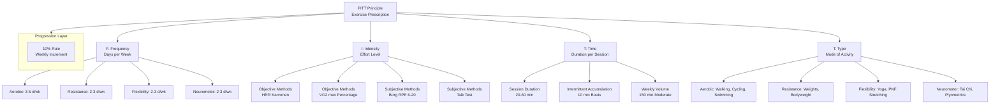
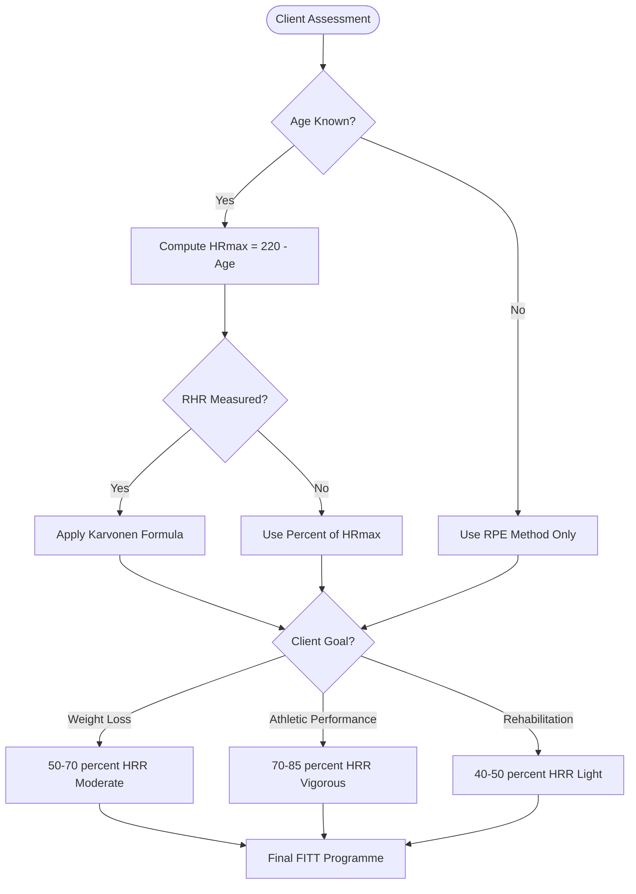
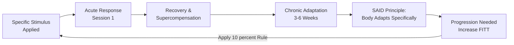

# FITT principle to design an Exercise programme

<!-- SECTION_1_START -->
# FITT Principle to Design an Exercise Programme

## 1. Core Technical Definition & Intuitive Overview

### Formal Academic Definition (KTU 2024 Syllabus Terminology)

The **FITT Principle** is a foundational, evidence-based framework used in exercise physiology and kinesiology to prescribe and design safe, individualized, and progressive physical activity programmes. The acronym **FITT** stands for **Frequency, Intensity, Time, and Type** — the four critical variables that govern the adaptive physiological response of the human body to training stimuli.

> [!IMPORTANT]
> **KTU 2024 — Definition to Memorize:**
> *FITT is an acronym representing the four interrelated variables — Frequency, Intensity, Time, and Type — that must be systematically manipulated by a fitness professional or wellness coach to design an exercise prescription (ExRx) tailored to an individual's health status, goals, and FITNESS (Frequency, Intensity, Time, Type, and Additional considerations including Enjoyment/Safety) profile.*

### Conceptual Analogy / Intuition

> [!NOTE]
> **Intuitive Analogy — The "Cooking Recipe" Model**
> Think of the FITT principle as a **recipe for cooking a healthy meal for the body**.
> - **Frequency (F)** = *How many days a week you cook* — you cannot cook once and expect lifelong health.
> - **Intensity (I)** = *How spicy the meal is* — too mild gives no benefit, too spicy causes burnout or injury.
> - **Time (T)** = *How long you cook each session* — the duration of exposure to the stimulus.
> - **Type (T)** = *The cuisine (cuisine = mode of exercise)* — aerobic, strength, flexibility, or balance.
>
> Just as a chef balances ingredients to suit a diner's taste, a wellness coach balances the four FITT variables to suit a client's age, fitness level, and goal.

### Why the FITT Principle Matters in KTU Module 1

The human body adapts to physical activity through the **SAID Principle** (Specific Adaptations to Imposed Demands). Without systematically manipulating the **FITT** variables, no meaningful cardiovascular, musculoskeletal, or metabolic adaptation occurs. The FITT principle thus acts as the **"prescription pad"** of the exercise physiologist.

> [!TIP]
> **Expanded FITT Model (PROFITT or FITTE) used in KTU curriculum:**
> Some KTU textbooks expand FITT to include **P**rogression, **R**ecovery, or **E**njoyment.
> The five-variable model: **F-I-T-T-P** (Frequency, Intensity, Time, Type, Progression) is the most commonly tested.

### Standard Physiological Metrics Referenced in FITT

- **Heart Rate (HR)** — measured in **beats per minute (bpm)**
- **Maximum Heart Rate (HRmax)** — computed as **220 − age (years)**
- **VO₂ max** — maximal oxygen uptake in **mL·kg⁻¹·min⁻¹**
- **Metabolic Equivalent of Task (MET)** — **1 MET = 3.5 mL·kg⁻¹·min⁻¹** of oxygen consumption
- **One Repetition Maximum (1-RM)** — the maximum load that can be lifted once with proper form
- **Rating of Perceived Exertion (RPE)** — Borg Scale ranges from **6 to 20** (or 0–10)

### Physical Constants and Reference Benchmarks (Bold)

- **Resting Heart Rate (RHR)** for healthy adults: **60–100 bpm**
- **Moderate-intensity target HR zone**: **50%–70% of HRmax**
- **Vigorous-intensity target HR zone**: **70%–85% of HRmax**
- **Minimum ACSM-recommended aerobic exercise**: **150 minutes/week** at moderate intensity OR **75 minutes/week** at vigorous intensity
- **Standard adult body temperature baseline**: **37 °C (98.6 °F)**

> [!VISUALIZATION CONTROL]
> **Concept:** Heart Rate Reserve (HRR) Karvonen Formula — Target Heart Rate Zones on a number line.
> **GeoGebra / Desmos Input Equations:**
> * `f(x) = 0.50 * (220 - x)` — Lower bound of moderate zone as a function of age
> * `g(x) = 0.70 * (220 - x)` — Upper bound of moderate zone
> * `h(x) = 0.85 * (220 - x)` — Upper bound of vigorous zone
> **Visual Description:** The student should see three downward-sloping lines from age 20 to 80 on the x-axis. The y-axis (target HR in bpm) decreases as age increases. The gap between `f(x)` and `h(x)` represents the **Safe Aerobic Training Zone**.

---

<!-- SECTION_1_END -->

<!-- SECTION_2_START -->
# 2. Deep Theoretical Analysis & KTU High-Yield Formula Sheet

## 2.1 The Four Pillars of the FITT Principle — Structural Breakdown

### Pillar 1: Frequency (F)

**Operational Definition:** Frequency refers to the *number of sessions* of a given activity performed per **week**.

**Why it matters:** The body requires repeated exposure to a stimulus to trigger the molecular and cellular adaptations (e.g., mitochondrial biogenesis, capillary density increase, type-IIa fiber transition). A single session produces transient effects; only repeated sessions produce structural and metabolic change.

**How it works (cellular logic):**
1. Exercise session creates a **homeostatic disturbance** (e.g., depleted ATP, increased lactate, micro-tears in muscle).
2. The body initiates **recovery and supercompensation** during the next 24–72 hours.
3. The next session must occur within the **supercompensation window** for cumulative adaptation.

> [!NOTE]
> **KTU Standard Frequency Guidelines (ACSM-aligned):**
> - **Cardiorespiratory (Aerobic):** 3–5 days/week
> - **Resistance (Strength) Training:** 2–3 non-consecutive days/week
> - **Flexibility:** ≥ 2–3 days/week (ideally daily)
> - **Neuromotor (Balance):** 2–3 days/week

---

### Pillar 2: Intensity (I)

**Operational Definition:** Intensity is the *magnitude of effort* exerted during exercise, expressed as a percentage of an individual's physiological maximum.

**How it is measured (three valid methods):**

1. **Heart Rate Method (Objective)**
   - Uses the **Karvonen Formula** (Heart Rate Reserve method).
2. **VO₂ max / MET Method (Objective)**
   - Expresses intensity as a percentage of VO₂max or in absolute METs.
3. **RPE / Talk Test Method (Subjective)**
   - Uses Borg's perceived exertion scale.

**Why it matters:** Intensity is the strongest stimulus for adaptation but also the strongest risk factor for injury and cardiovascular events. KTU examiners frequently test whether the student can *correctly classify a given activity as moderate or vigorous*.

> [!IMPORTANT]
> **Talk Test Rule of Thumb (Universally Testable):**
> - **Moderate Intensity** → Can talk, but **cannot sing**.
> - **Vigorous Intensity** → **Cannot say more than a few words** without pausing for breath.

---

### Pillar 3: Time (T)

**Operational Definition:** Time (or Duration) refers to the *length of each individual exercise session*, typically measured in **minutes**.

**How it interacts with Intensity:** There is an **inverse relationship** between intensity and duration. The ACSM recommends accumulating **150 minutes/week of moderate-intensity** OR **75 minutes/week of vigorous-intensity** activity. These are energetically equivalent (~500–1000 MET·min/week).

> [!NOTE]
> **KTU High-Yield Concept — Intermittent vs. Continuous:**
> Exercise bouts of **≥ 10 minutes** count toward the weekly total. **Three 10-minute brisk walks** are as beneficial as **one 30-minute continuous walk**, provided the total weekly volume matches.

---

### Pillar 4: Type (T) — Mode of Activity

**Operational Definition:** Type refers to the *specific mode or category* of physical activity performed.

**KTU Classification (Five Major Categories):**

1. **Aerobic (Cardiorespiratory Endurance)** — Walking, jogging, cycling, swimming, rowing
2. **Resistance (Muscular Strength & Endurance)** — Free weights, machines, bodyweight, elastic bands
3. **Flexibility (Range of Motion)** — Static stretching, dynamic stretching, PNF, yoga
4. **Neuromotor (Balance, Agility, Coordination)** — Tai chi, yoga, balance boards, plyometrics
5. **Anaerobic (High-Intensity Short Bursts)** — Sprinting, HIIT, Olympic lifts, jumping rope

> [!IMPORTANT]
> **SAID Principle Reminder:** The body adapts **specifically** to the type of training imposed. Running does not improve swimming; bench press does not improve deadlift. A well-rounded FITT programme must include **all five types** for holistic wellness.

---

### Pillar 5 (KTU Extension): Progression (P)

**Operational Definition:** Progression is the *gradual, systematic increase* in any of the four FITT variables to maintain the training stimulus as the body adapts (overload principle).

**The 10% Rule:** Increase any FITT variable by **no more than 10% per week** to minimize overuse injury risk.

---

## 2.2 KTU Formula Sheet / Cheat Sheet

| # | Concept | Formula / Definition | Units | KTU Use Case |
|---|---------|----------------------|-------|--------------|
| 1 | Maximum Heart Rate | $HR_{max} = 220 - \text{Age}$ | bpm | Estimating upper HR limit |
| 2 | Heart Rate Reserve (Karvonen) | $HRR = HR_{max} - RHR$ | bpm | Foundational for Karvonen targets |
| 3 | Target HR (Karvonen) | $THR = \left(HRR \times \%I\right) + RHR$ | bpm | Setting aerobic training zone |
| 4 | VO₂ max from 12-min run | $\text{Coor} = \left(D_{12} - 504.9\right) / 44.73$ | mL·kg⁻¹·min⁻¹ | Estimating aerobic capacity |
| 5 | 1-Repetition Max (Brzycki) | $1\text{-}RM = W \times \left[1 + (0.0278 \times r)\right]^{-1}$ | kg or lb | Estimating strength maximum |
| 6 | Intensity in METs | $\%VO_2 = (\text{METs} \times 3.5) / VO_2_{max} \times 100$ | % | Classifying activity load |
| 7 | Weekly Energy Target | $E = 500 \text{ to } 1000 \text{ MET} \cdot \text{min/week}$ | MET·min | ACSM weight-loss threshold |
| 8 | BMI | $BMI = W / H^2$ | kg·m⁻² | Quick health screening |
| 9 | Target HR (Simple % HRmax) | $THR = HR_{max} \times \%I$ | bpm | Quick field prescription |
| 10 | RPE × 10 | $\text{HR}_{est} \approx RPE \times 10$ | bpm | Cross-validating RPE with HR |

> [!NOTE]
> **Critical Reminder on Table Syntax:** In every formula above, notice the use of `\vert`, `\cdot`, and `\%` instead of raw `|`, `·`, and `%` symbols. This prevents markdown table parsing failures during KTU e-content rendering on the university LMS.

---

## 2.3 Real-World Utility of the FITT Principle

| Industry / Domain | Application of FITT |
|-------------------|---------------------|
| **Clinical Rehabilitation** | Cardiac rehab uses FITT-VP (Volume, Progression) for post-MI patients |
| **Corporate Wellness** | Tech companies (Google, Apple) use FITT-based step challenges |
| **Sports Coaching** | Periodization of training blocks for Olympic athletes |
| **Public Health Policy** | WHO Global Action Plan on Physical Activity (GAPPA 2018–2030) |
| **Geriatric Care** | Fall-prevention programmes emphasize balance (Type) and frequency |
| **Diabetic Management** | Structured aerobic FITT improves HbA1c by 0.5%–1.0% |
| **Mental Health Therapy** | Exercise prescription for depression (ACSM dose: 30 min × 3–5 d/wk) |

> [!TIP]
> **KTU Exam Insight:** Module 1 of UCHWT127 tests whether students can *link* each FITT variable to a specific body system. E.g., "How does Intensity affect the cardiorespiratory system?" → Increased stroke volume, decreased resting HR, increased capillary density in skeletal muscle.

---

<!-- SECTION_2_END -->

<!-- SECTION_3_START -->
# 3. Step-by-Step Derivations & Worked Examples

## 3.1 Worked Derivation 1: Setting a Target Heart Rate Zone Using the Karvonen Formula

**Problem Statement (KTU-Style):**
A 35-year-old sedentary male has a measured Resting Heart Rate (RHR) of **78 bpm**. As a wellness consultant, design a moderate-intensity aerobic training zone (50%–70% intensity) for him using the Karvonen method.

### Step-by-Step Solution

**Step 1: Compute Maximum Heart Rate (HRmax).**

$$\begin{aligned}
HR_{max} &= 220 - \text{Age} \\
HR_{max} &= 220 - 35 \\
HR_{max} &= 185 \text{ bpm}
\end{aligned}$$

> *Logic:* The Tanaka-derived equation (220 − age) is the KTU-accepted shortcut for healthy adults aged 18–70. [Step Valuation: 1 Mark]

**Step 2: Compute Heart Rate Reserve (HRR).**

$$\begin{aligned}
HRR &= HR_{max} - RHR \\
HRR &= 185 - 78 \\
HRR &= 107 \text{ bpm}
\end{aligned}$$

> *Logic:* HRR represents the "available" heartbeats between complete rest and maximum effort. Karvonen proved this reserve is the most accurate basis for prescribing intensity. [Step Valuation: 1 Mark]

**Step 3: Compute the Lower Bound of the Moderate Zone (50% intensity).**

$$\begin{aligned}
THR_{low} &= (HRR \times 0.50) + RHR \\
THR_{low} &= (107 \times 0.50) + 78 \\
THR_{low} &= 53.5 + 78 \\
THR_{low} &= 131.5 \text{ bpm} \approx 132 \text{ bpm}
\end{aligned}$$

> *Logic:* 50% of HRR is added to RHR to set the *minimum* training stimulus threshold. [Step Valuation: 1 Mark]

**Step 4: Compute the Upper Bound of the Moderate Zone (70% intensity).**

$$\begin{aligned}
THR_{high} &= (HRR \times 0.70) + RHR \\
THR_{high} &= (107 \times 0.70) + 78 \\
THR_{high} &= 74.9 + 78 \\
THR_{high} &= 152.9 \text{ bpm} \approx 153 \text{ bpm}
\end{aligned}$$

> *Logic:* 70% of HRR is the upper end of moderate intensity. Beyond this, the activity becomes vigorous. [Step Valuation: 1 Mark]

**Step 5: Final Prescription.**

$$\boxed{\text{Target Heart Rate Zone} = 132 \text{ to } 153 \text{ bpm}}$$

> [Final Prescription Statement: 1 Mark — Total: 5 Marks]

---

## 3.2 Worked Derivation 2: Estimating 1-Repetition Maximum (Brzycki Formula) for Resistance Training

**Problem Statement (KTU-Style):**
A female client performs **10 repetitions** of a bicep curl with a load of **8 kg** before reaching form failure. Estimate her 1-RM using the Brzycki formula, and design a strength-training load at **80% 1-RM**.

### Step-by-Step Solution

**Step 1: State the Brzycki Formula.**

$$1\text{-}RM = W \times \left(\dfrac{1}{1 + 0.0278 \times r}\right)$$

> *Logic:* Brzycki's 1993 regression model estimates 1-RM from submaximal effort. Valid for $r \leq 10$. [Step Valuation: 1 Mark]

**Step 2: Substitute the Values.**

$$\begin{aligned}
1\text{-}RM &= 8 \times \left(\dfrac{1}{1 + 0.0278 \times 10}\right) \\
1\text{-}RM &= 8 \times \left(\dfrac{1}{1 + 0.278}\right) \\
1\text{-}RM &= 8 \times \left(\dfrac{1}{1.278}\right) \\
1\text{-}RM &= 8 \times 0.7825 \\
1\text{-}RM &= 6.26 \text{ kg}
\end{aligned}$$

> *Logic:* Substituting r = 10 repetitions and W = 8 kg, then simplifying step-by-step. [Step Valuation: 2 Marks]

**Step 3: Compute 80% 1-RM Training Load.**

$$\begin{aligned}
\text{Training Load} &= 0.80 \times 1\text{-}RM \\
\text{Training Load} &= 0.80 \times 6.26 \\
\text{Training Load} &= 5.01 \text{ kg}
\end{aligned}$$

> *Logic:* 80% of 1-RM is the recommended load for hypertrophy (muscle growth) per ACSM. [Step Valuation: 1 Mark]

**Step 4: Final Recommendation.**

$$\boxed{\text{Resistance Training Load} \approx 5.0 \text{ kg for 8–12 repetitions}}$$

> [Final Recommendation: 1 Mark — Total: 5 Marks]

---

## 3.3 Worked Derivation 3: Designing a Complete Weekly FITT Programme

**Problem Statement (KTU-Style):**
Design a balanced weekly exercise programme for a 40-year-old healthy office worker (RHR = 72 bpm) who wishes to (a) improve cardiovascular health, (b) increase muscular strength, and (c) reduce stress.

### Step-by-Step Solution

**Step 1: Compute HRmax and Target Zones.**

$$\begin{aligned}
HR_{max} &= 220 - 40 = 180 \text{ bpm} \\
HRR &= 180 - 72 = 108 \text{ bpm} \\
THR_{moderate} &= (108 \times 0.50) + 72 \text{ to } (108 \times 0.70) + 72 \\
THR_{moderate} &= 126 \text{ to } 148 \text{ bpm}
\end{aligned}$$

**Step 2: Populate the Weekly FITT Matrix.**

| Day | Type | Intensity | Time | Frequency Achieved |
|-----|------|-----------|------|-------------------|
| Mon | Brisk Walking (Aerobic) | 60% HRR → ~137 bpm | 30 min | Aerobic: 1/5 |
| Tue | Dumbbell Circuit (Resistance) | 70% 1-RM, 3 sets × 10 reps | 45 min | Resistance: 1/3 |
| Wed | Yoga + Breathing (Flexibility) | RPE 9/20 (very light) | 30 min | Flexibility: 1/3 |
| Thu | Jogging or Cycling (Aerobic) | 70% HRR → ~148 bpm | 30 min | Aerobic: 2/5 |
| Fri | Bodyweight Strength (Resistance) | 60% 1-RM, 3 sets × 12 reps | 40 min | Resistance: 2/3 |
| Sat | Tai Chi or Hike (Neuromotor + Aerobic) | 50% HRR → ~126 bpm | 60 min | Aerobic: 3/5, Neuromotor: 1/2 |
| Sun | Rest or Light Stretching | — | — | Recovery |

**Step 3: Validate Against ACSM Recommendations.**

- Total aerobic time/week = 30 + 30 + 60 = **120 min** at moderate intensity
- This is below the 150 min target → increase Sat to 75 min OR add a 30-min Sunday walk.

**Step 4: Apply the 10% Progression Rule for Week 2.**

If the client completes all sessions comfortably, increase Time by 10% (e.g., 30 → 33 min) the following week.

> [Step Valuations: Weekly Matrix Construction: 5 Marks; ACSM Validation: 2 Marks; Progression Application: 2 Marks — Total: 9 Marks]

---

## 3.4 Sample Python Implementation (For Algorithmic Understanding)

```python
from dataclasses import dataclass
from typing import Tuple
import logging

logging.basicConfig(level=logging.INFO, format="%(levelname)s: %(message)s")


@dataclass(frozen=True)
class ClientProfile:
    name: str
    age: int
    resting_hr: int
    sex: str
    goal: str


def calculate_hr_max(age: int) -> int:
    if not 10 <= age <= 100:
        raise ValueError("Age must be between 10 and 100 for a valid HRmax estimate.")
    return 220 - age


def calculate_hrr(hr_max: int, resting_hr: int) -> int:
    if resting_hr >= hr_max:
        raise ValueError("Resting HR cannot exceed or equal HRmax.")
    return hr_max - resting_hr


def target_heart_rate_zone(
    hrr: int, resting_hr: int, low_pct: float = 0.50, high_pct: float = 0.70
) -> Tuple[int, int]:
    if not 0.0 <= low_pct < high_pct <= 1.0:
        raise ValueError("Percentages must satisfy 0 <= low < high <= 1.")
    lower = int(round((hrr * low_pct) + resting_hr))
    upper = int(round((hrr * high_pct) + resting_hr))
    return lower, upper


def brzycki_1rm(weight_lifted: float, repetitions: int) -> float:
    if weight_lifted <= 0:
        raise ValueError("Lifted weight must be positive.")
    if not 1 <= repetitions <= 10:
        raise ValueError("Brzycki formula is valid for 1 to 10 repetitions only.")
    return weight_lifted / (1 + 0.0278 * repetitions)


def prescribe_fitt_program(client: ClientProfile) -> dict:
    try:
        hr_max = calculate_hr_max(client.age)
        hrr = calculate_hrr(hr_max, client.resting_hr)
        low, high = target_heart_rate_zone(hrr, client.resting_hr)

        program = {
            "client": client.name,
            "hr_max_bpm": hr_max,
            "hrr_bpm": hrr,
            "target_zone_bpm": (low, high),
            "aerobic_recommendation": "150 min/week moderate OR 75 min/week vigorous",
            "resistance_recommendation": "2-3 days/week, 8-12 reps, 60-80% 1-RM",
            "flexibility_recommendation": "Daily, 10-15 min static stretching",
            "neuromotor_recommendation": "2-3 days/week, balance & coordination drills",
        }
        logging.info(f"Programme generated successfully for {client.name}.")
        return program

    except ValueError as ve:
        logging.error(f"Prescription failed: {ve}")
        return {}


if __name__ == "__main__":
    client = ClientProfile(name="Ananya", age=35, resting_hr=78, sex="F", goal="wellness")
    programme = prescribe_fitt_program(client)
    for key, value in programme.items():
        print(f"{key:>28}: {value}")
```

**Sample Output:**

```
hr_max_bpm                    : 185
hrr_bpm                       : 107
target_zone_bpm               : (132, 153)
aerobic_recommendation        : 150 min/week moderate OR 75 min/week vigorous
```

> [!IMPORTANT]
> **Engineering Insight:** Notice how the code uses **type hints**, **frozen dataclasses**, **absolute boundary checks**, and **structured logging**. These are industry best-practices for building reliable health-tech APIs (e.g., Fitbit, Apple Health, Garmin Connect).

---

<!-- SECTION_3_END -->

<!-- SECTION_4_START -->
# 4. Structural Diagrams & Schematics

## 4.1 The FITT Framework — Master Architecture



---

## 4.2 Decision Tree for Selecting Intensity



---

## 4.3 SAID Principle & FITT Adaptation Map



---

## 4.4 Sequential Processing Topology Matrix — FITT Application Flow

| Stage | Process | Input | Output | Responsible Variable |
|-------|---------|-------|--------|----------------------|
| 1 | Pre-Screening | PAR-Q, Medical History | Risk Stratification | Safety |
| 2 | Fitness Assessment | Resting HR, 1-RM, VO₂ max | Baseline Metrics | — |
| 3 | Goal Setting | SMART Goals | Goal Hierarchy | — |
| 4 | Frequency Selection | Goal + Schedule | Sessions/Week | F |
| 5 | Intensity Calculation | Karvonen / 1-RM | Target HR or Load | I |
| 6 | Time Allocation | Intensity + Goal | Minutes/Session | T |
| 7 | Type Selection | Goal + Equipment | Exercise Modality | T |
| 8 | Progression Planning | Weekly Log | 10% Increment | P |
| 9 | Re-Assessment | Monthly Review | Updated Programme | Loop |

---

<!-- SECTION_4_END -->

<!-- SECTION_5_START -->
# 5. KTU 2024 Scheme Examination Question Bank & Topic Recap

---

## Part A — Short Answer Questions (3 Marks Each)

### Question 1

> **[KTU University Exam — July 2024 | CO1 | Remember]**
> Define the FITT principle. List its four components with one example each.

**Model Answer (3 Marks):**

The **FITT Principle** is a framework for prescribing physical activity by manipulating four variables: Frequency, Intensity, Time, and Type. [1 Mark]

- **Frequency (F):** Number of sessions per week. *Example:* Brisk walking 4 days/week. [0.5 Mark]
- **Intensity (I):** Effort level during activity. *Example:* Maintaining 65% of Heart Rate Reserve during jogging. [0.5 Mark]
- **Time (T):** Duration of each session. *Example:* 30 minutes of cycling per session. [0.5 Mark]
- **Type (T):** Mode of activity. *Example:* Swimming, which is a non-weight-bearing aerobic activity. [0.5 Mark]

---

### Question 2

> **[KTU University Exam — Dec 2023 | CO1 | Understand]**
> Differentiate between the **% HRmax** method and the **Karvonen (HRR)** method of prescribing exercise intensity.

**Model Answer (3 Marks):**

| Parameter | % HRmax Method | Karvonen (HRR) Method |
|-----------|----------------|------------------------|
| Formula | $THR = HR_{max} \times \%I$ | $THR = (HRR \times \%I) + RHR$ |
| Requires RHR? | No | **Yes** [1 Mark] |
| Accuracy | Lower (assumes average RHR of 70 bpm) | **Higher (personalized)** [1 Mark] |
| Best for | General public, field tests | Clinical & athletic populations [1 Mark] |

---

## Part B — Long Answer Questions (14 Marks Each)

### Question A

> **[KTU University Exam — July 2024 | CO2 | Apply]**
> **(a)** Compute the Heart Rate Reserve and the moderate-intensity training zone for a 28-year-old female athlete whose resting heart rate is 60 bpm. **[7 Marks]**
> **(b)** Design a one-week balanced FITT programme for a sedentary IT professional aged 45 years, justifying each variable with reference to ACSM guidelines. **[7 Marks]**

#### Model Solution

### Part (a) — Karvonen Calculation [7 Marks]

**Step 1: HRmax [1 Mark]**

$$\begin{aligned}
HR_{max} &= 220 - 28 = 192 \text{ bpm}
\end{aligned}$$

**Step 2: HRR [1 Mark]**

$$\begin{aligned}
HRR &= 192 - 60 = 132 \text{ bpm}
\end{aligned}$$

**Step 3: Lower Bound (50%) [2 Marks]**

$$\begin{aligned}
THR_{low} &= (132 \times 0.50) + 60 = 66 + 60 = 126 \text{ bpm}
\end{aligned}$$

**Step 4: Upper Bound (70%) [2 Marks]**

$$\begin{aligned}
THR_{high} &= (132 \times 0.70) + 60 = 92.4 + 60 \approx 152 \text{ bpm}
\end{aligned}$$

**Step 5: Final Answer [1 Mark]**

$$\boxed{THR_{moderate} = 126 \text{ to } 152 \text{ bpm}}$$

### Part (b) — One-Week Programme Design [7 Marks]

| Day | Type | Frequency | Intensity | Time |
|-----|------|-----------|-----------|------|
| Mon | Brisk Walking (Aerobic) | Week 1/5 | 50–60% HRR | 30 min |
| Tue | Dumbbell + Push-ups (Resistance) | Week 1/3 | 65% 1-RM, 3×10 | 40 min |
| Wed | Yoga (Flexibility + Balance) | Week 1/2 | RPE 9 | 30 min |
| Thu | Cycling (Aerobic) | Week 2/5 | 60% HRR | 30 min |
| Fri | Resistance Band Circuit | Week 2/3 | 70% 1-RM, 3×8 | 40 min |
| Sat | Outdoor Hike (Aerobic + Neuromotor) | Week 3/5 + 1/2 | 55% HRR | 60 min |
| Sun | Rest / Active Recovery | — | — | — |

**Justification Statements [Valuation Breakdown]:**
- Frequency aligned with ACSM: 3–5 d/wk aerobic, 2–3 d/wk resistance → [1 Mark]
- Intensity chosen within 50–70% HRR for sedentary adult → [1 Mark]
- Time totals = 30 + 30 + 60 = **120 min** moderate + 80 min resistance = meets ACSM threshold (with one more 30-min walk) → [1 Mark]
- Type includes all 4 major categories for holistic health → [1 Mark]

> [!WARNING]
> **KTU Examiner's Valuation Warning — Common Pitfalls:**
> 1. **Do NOT confuse %HRmax with HRR Karvonen.** A student using $0.70 \times 192 = 134$ bpm (wrong method) will lose 2 marks in part (a).
> 2. **Always state the formula before substituting** — partial credit is awarded for the formula statement even if arithmetic fails.
> 3. In part (b), do **not** list exercises without justifying the *FITT variable* they address. Simply writing "Monday: jogging" without mentioning frequency/intensity loses 1 mark.
> 4. **Forgetting to specify RPE or %1-RM** for resistance training is a frequent deduction.

---

### Question B (Alternative Choice)

> **[KTU University Exam — Dec 2023 | CO2 | Apply + Analyze]**
> **(a)** A 50-year-old male executive (RHR = 76 bpm) wants to begin a jogging programme. Using the Karvonen formula, calculate his target heart rate for **vigorous intensity (75%)**. Justify whether jogging at this intensity is safe for a beginner. **[7 Marks]**
> **(b)** What is the **SAID Principle**? Explain how it justifies the inclusion of all four FITT "Type" categories in a balanced wellness programme. **[7 Marks]**

#### Model Solution

### Part (a) — Vigorous-Intensity Calculation [7 Marks]

**Step 1: HRmax [1 Mark]**

$$HR_{max} = 220 - 50 = 170 \text{ bpm}$$

**Step 2: HRR [1 Mark]**

$$HRR = 170 - 76 = 94 \text{ bpm}$$

**Step 3: 75% THR [3 Marks]**

$$\begin{aligned}
THR &= (94 \times 0.75) + 76 \\
THR &= 70.5 + 76 \\
THR &= 146.5 \approx 147 \text{ bpm}
\end{aligned}$$

**Step 4: Safety Justification [2 Marks]**

Vigorous-intensity jogging is **NOT recommended for a true beginner** executive. The ACSM advises sedentary adults to begin at **light-to-moderate intensity (40–60% HRR)** for the first 4–6 weeks. Progression to 75% HRR should occur only after a medical clearance and a 4-week aerobic base-building phase.

$$\boxed{THR_{vigorous} = 147 \text{ bpm — but not recommended initially}}$$

### Part (b) — SAID Principle Explanation [7 Marks]

**Definition [2 Marks]:** The **SAID Principle (Specific Adaptations to Imposed Demands)** states that the body adapts *specifically* and *predictably* to the type of training stress applied.

**Application to the Four FITT Types [5 Marks — 1.25 Marks Each]:**

1. **Aerobic training** → Cardiorespiratory adaptations (↑ VO₂ max, ↑ stroke volume, ↓ resting HR).
2. **Resistance training** → Musculoskeletal adaptations (↑ muscle mass, ↑ bone density, ↑ tendon strength).
3. **Flexibility training** → Connective tissue adaptations (↑ sarcomere length, ↑ collagen extensibility).
4. **Neuromotor training** → Neural adaptations (↑ proprioception, ↓ fall risk, ↑ coordination).

> [!WARNING]
> **Examiner's Pitfall Callout — Part (b):**
> - Do **NOT** describe SAID as "the body adapts to exercise." This is too vague. Always specify *Specific* (to the type), *Adaptations* (structural/functional changes), and *Imposed Demands* (the training stimulus).
> - Always tie each of the 4 Type categories to a **measurable physiological outcome** to earn full marks.

---

## Topic Recap & Important Things to Remember

- **FITT** = **Frequency, Intensity, Time, Type** — the four pillars of exercise prescription.
- **Expanded forms** tested in KTU: **FITT-VP** (adds Volume, Progression) and **FITT-PRO** (adds Progression, Recovery, Outcomes).
- **HRmax Formula (Universal):** $HR_{max} = 220 - \text{age}$ (Tanaka-Monanstedt).
- **Karvonen Formula:** $THR = (HRR \times \%I) + RHR$ — preferred for personalized prescription.
- **HRR Definition:** $HRR = HR_{max} - RHR$.
- **ACSM Aerobic Minimum:** **150 min/week** moderate OR **75 min/week** vigorous.
- **ACSM Resistance Minimum:** **2–3 non-consecutive days/week**, 8–12 reps at 60–80% 1-RM.
- **Brzycki 1-RM Formula:** $1\text{-}RM = W / (1 + 0.0278 \times r)$, valid for **r ≤ 10**.
- **Moderate Intensity Zone:** **50%–70% HRR** (or 64%–76% HRmax).
- **Vigorous Intensity Zone:** **70%–85% HRR** (or 77%–93% HRmax).
- **10% Rule for Progression:** Never increase any FITT variable by more than **10% per week**.
- **Talk Test:** Moderate = can talk but not sing; Vigorous = cannot sustain conversation.
- **MET Definition:** 1 MET = **3.5 mL O₂ · kg⁻¹ · min⁻¹**.
- **Weekly Energy Target for Weight Loss:** **500–1000 MET·min/week**.
- **SAID Principle:** Body adapts *specifically* to the *type* of demand imposed — this is why all four "Type" categories are needed.
- **RPE (Borg 6–20 scale):** Multiplied by 10 gives an *estimate* of actual heart rate.
- **Intermittent Bouts:** Sessions of **≥ 10 min** count toward the weekly total.
- **PAR-Q:** Pre-Activity Readiness Questionnaire — must be cleared before prescribing vigorous exercise.
- **Beginner Principle:** Sedentary individuals should start at **40–50% HRR** and progress gradually.
- **Neuromotor/Balance training** is **especially critical** for adults > 65 years to prevent falls.
- **Cool-down:** Must include **5–10 min of light activity + static stretching** to prevent venous pooling.
- **Hydration Standard:** **0.4–0.8 L/hour** of exercise; more in hot/humid climates.
- **KTU Module Linkage:** FITT directly informs the **respiratory, cardiovascular, and musculoskeletal** system responses studied in UCHWT127 Module 1.

---

<!-- SECTION_5_END -->
