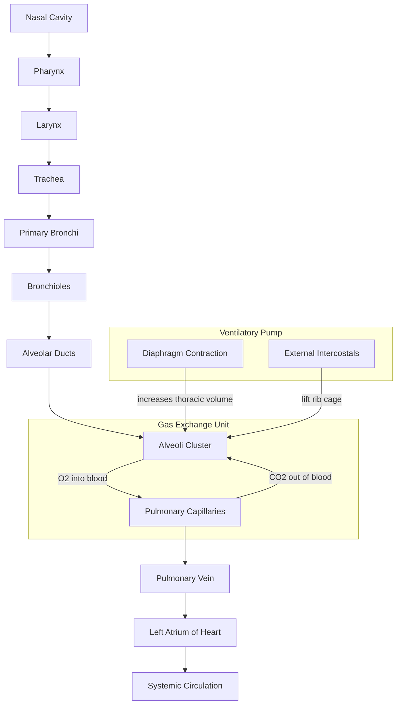
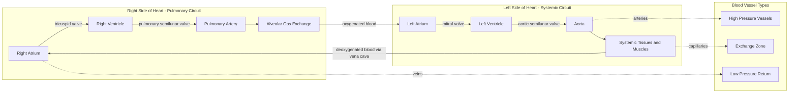
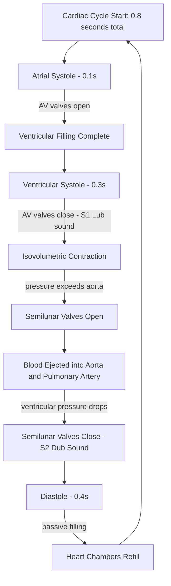
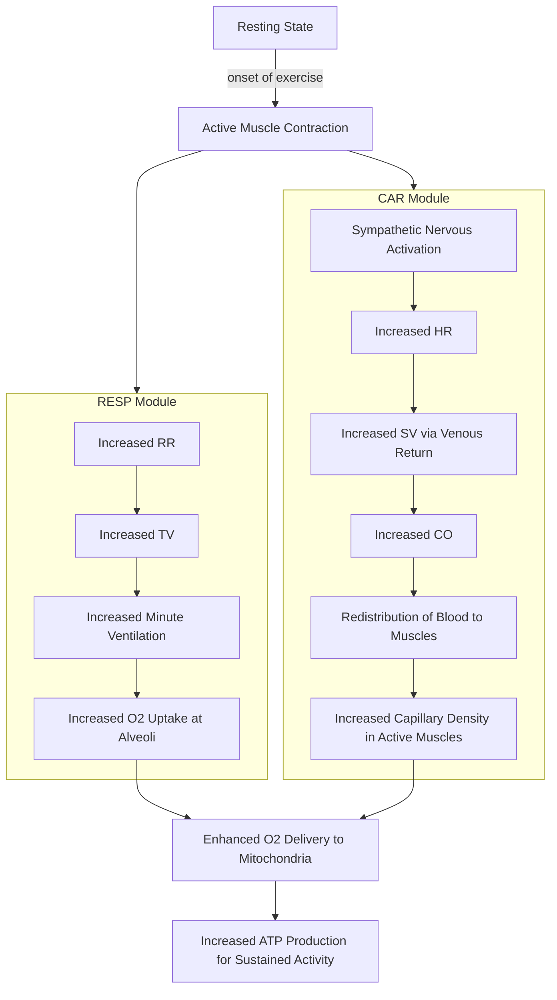

# Human Body Systems related to Physical activity and its functions: Respiratory System - Cardiovascular System

<!-- SECTION_1_START -->
# Human Body Systems Related to Physical Activity: Respiratory & Cardiovascular Systems

## 1. Core Technical Definition & Intuitive Overview

### 1.1 The Respiratory System — Formal KTU Definition

> [!IMPORTANT]
> **Respiratory System (KTU UCHWT127 Module 1 Definition):** The integrated network of organs and tissues responsible for **gaseous exchange** between the atmospheric air and the bloodstream, encompassing the upper airways (nasal cavity, pharynx, larynx), lower airways (trachea, bronchi, bronchioles), the gaseous exchange surface (**alveoli**), and the ventilatory pump (**diaphragm, intercostal muscles, and thoracic cage**). In the context of physical activity, the respiratory system functions to supply **oxygen (O₂)** to working muscles and remove **carbon dioxide (CO₂)** produced during cellular metabolism.

**Anatomical Hierarchy of the Airway:**
$$\text{Nasal Cavity} \rightarrow \text{Pharynx} \rightarrow \text{Larynx} \rightarrow \text{Trachea} \rightarrow \text{Bronchi} \rightarrow \text{Bronchioles} \rightarrow \text{Alveoli}$$

**Standard Adult Respiratory Metrics (at rest):**
- **Tidal Volume (TV):** $\approx$ **500 mL** of air per normal breath
- **Respiratory Rate (RR):** $\approx$ **12–20 breaths/min**
- **Total Lung Capacity (TLC):** $\approx$ **6.0 L** in an average adult male
- **Vital Capacity (VC):** $\approx$ **4.8 L** (maximum air that can be exhaled after maximal inhalation)

> [!NOTE]
> **Syllabus Highlight:** For UCHWT127, focus is on the *functional* response of these systems to **physical activity**, not just static anatomy. The transition from rest to exercise is the high-yield exam content.

### 1.2 The Cardiovascular System — Formal KTU Definition

> [!IMPORTANT]
> **Cardiovascular System (CVS) Definition:** A closed, double-circulatory pump-and-pipe system consisting of the **heart** (a four-chambered muscular pump), **blood vessels** (arteries, capillaries, veins), and **blood** (the transport medium). It functions to deliver oxygen, nutrients, hormones, and immune cells to tissues while removing metabolic waste products. During physical activity, the CVS regulates **cardiac output (CO)** to match the elevated metabolic demand of skeletal muscles.

**Key Cardiovascular Parameters:**
- **Resting Heart Rate (RHR):** $\approx$ **60–100 beats/min**
- **Stroke Volume (SV):** $\approx$ **70 mL/beat** at rest
- **Cardiac Output (CO):** $\approx$ **5 L/min** at rest
- **Blood Pressure (BP):** $\approx$ **120/80 mmHg** (systolic/diastolic)

### 1.3 Conceptual Analogy & Intuition

> [!VISUALIZATION CONTROL]
> **Concept:** The Body as a Delivery Logistics Network
> **Visual Description:** Imagine the human body as a **smart city delivery system**:
> - The **Lungs** = the city's *Oxygen Refinery & CO₂ Recycling Plant* (air in → fuel extracted → waste expelled)
> - The **Heart** = the *Central Distribution Hub* (pumps parcels 24/7)
> - **Arteries** = *High-speed expressways* leaving the hub
> - **Capillaries** = *Local delivery streets* (where actual drop-offs happen)
> - **Veins** = *Return highways* bringing empty trucks back
> - **Blood** = the *fleet of delivery trucks* carrying oxygen "packages"
>
> During a delivery rush hour (exercise), the hub speeds up its conveyor belts (↑HR), loads more onto each truck (↑SV), and opens more delivery routes (↑capillary dilation).

### 1.4 Why These Two Systems Are Coupled

> [!NOTE]
> **The Oxygen-Circulation Coupling Principle:** Neither the respiratory nor the cardiovascular system can function in isolation during exercise. **Fick's Principle of Oxygen Delivery** states that total oxygen consumption depends on *both* pulmonary gas exchange *and* circulatory transport. This is why VO₂ max tests assess the **integrated** performance of these systems.

**Fick's Equation (foundational for understanding aerobic capacity):**
$$VO_2 = Q \times (CaO_2 - CvO_2)$$

Where:
- $VO_2$ = oxygen consumption (mL/min)
- $Q$ = cardiac output (L/min)
- $CaO_2$ = arterial oxygen content
- $CvO_2$ = venous oxygen content

<!-- SECTION_1_END -->

<!-- SECTION_2_START -->
# 2. Deep Theoretical Analysis & KTU High-Yield Formula Sheet

## 2.1 Mechanics of Breathing (Ventilation)

Breathing is a **mechanical process** driven by pressure gradients between the alveolar space and the atmosphere.

### 2.1.1 Inspiration (Active Process)

1. The **diaphragm contracts** and flattens downward.
2. The **external intercostal muscles** contract, lifting the rib cage upward and outward.
3. Thoracic cavity volume **increases**.
4. **Intrapleural pressure** becomes more negative (from $\approx$ $-5$ cmH₂O to $\approx$ $-8$ cmH₂O).
5. **Alveolar pressure** drops below atmospheric pressure (from **0** to **$-1$ cmH₂O**).
6. Air flows **into** the lungs down the pressure gradient.

**Boyle's Law Application:**
$$P_1V_1 = P_2V_2$$

As thoracic volume ($V$) ↑, intrapulmonary pressure ($P$) ↓ → air flows in.

### 2.1.2 Expiration (Passive at Rest)

1. The **diaphragm relaxes** and returns to its dome shape.
2. **External intercostals** relax, ribs move down and in.
3. Thoracic volume **decreases**.
4. **Alveolar pressure** rises above atmospheric (to $\approx$ $+1$ cmH₂O).
5. Air flows **out** of the lungs.

> [!NOTE]
> **During exercise**, expiration becomes **active** — the internal intercostals and abdominal muscles contract forcefully to expel air more rapidly, increasing **ventilatory rate** to meet O₂ demand.

## 2.2 Gaseous Exchange at the Alveoli

Gas exchange occurs via **passive diffusion** across the **respiratory membrane** (alveolar epithelium + capillary endothelium, total thickness $\approx$ **0.5 µm**).

**Diffusion is governed by Fick's Law of Diffusion:**
$$V_{gas} = \frac{A \times D \times (P_1 - P_2)}{T}$$

Where:
- $A$ = surface area of respiratory membrane ($\approx$ **70 m²** in adults)
- $D$ = diffusion coefficient of the gas
- $P_1 - P_2$ = partial pressure difference
- $T$ = thickness of the membrane

> [!NOTE]
> **Partial Pressures of Gases (at sea level):**
> - Atmospheric $P_{O_2} =$ **160 mmHg**
> - Alveolar $P_{O_2} =$ **104 mmHg**
> - Alveolar $P_{CO_2} =$ **40 mmHg**

## 2.3 The Cardiac Cycle

The heart undergoes a repeating cycle of **contraction (systole)** and **relaxation (diastole)**. At a resting HR of 75 bpm, one complete cycle takes **0.8 seconds**.

| Phase | Duration | Event | Valves Status |
|---|---|---|---|
| Atrial Systole | 0.1 s | Atria contract, push blood into ventricles | AV valves open, semilunar closed |
| Ventricular Systole | 0.3 s | Ventricles contract, eject blood into arteries | AV valves closed, semilunar open |
| Diastole (Joint) | 0.4 s | Heart relaxes, chambers fill passively | AV valves open, semilunar closed |

**Pressure-Volume Relationship in the Ventricle:**
$$\text{Stroke Work} = \int P \, dV$$

> [!NOTE]
> **"Lub-Dub" Heart Sounds:** The **"Lub"** (S1) is the closure of the **AV valves** (mitral & tricuspid). The **"Dub"** (S2) is the closure of the **semilunar valves** (aortic & pulmonary). Any extra sounds (murmurs, S3, S4) indicate pathology.

## 2.4 Heart Rate, Stroke Volume & Cardiac Output

### The Master Equation:
$$\boxed{CO = HR \times SV}$$

Where:
- $CO$ = Cardiac Output (L/min)
- $HR$ = Heart Rate (beats/min)
- $SV$ = Stroke Volume (mL/beat)

**Calculation Example at Rest:**
$$CO = 70 \, \text{bpm} \times 70 \, \text{mL/beat} = 4900 \, \text{mL/min} \approx 4.9 \, \text{L/min}$$

**During Maximal Exercise (Trained Athlete):**
$$CO_{max} = 190 \, \text{bpm} \times 120 \, \text{mL/beat} = 22{,}800 \, \text{mL/min} \approx 22.8 \, \text{L/min}$$

> [!NOTE]
> **Stroke Volume is determined by three factors:**
> 1. **Preload** — the degree of ventricular stretch at end of diastole (Frank-Starling Law)
> 2. **Afterload** — the resistance the ventricle must pump against (mainly aortic pressure)
> 3. **Contractility** — the intrinsic force of myocardial contraction

## 2.5 Blood Pressure Regulation

$$BP = CO \times SVR$$

Where:
- $BP$ = Mean Arterial Pressure (mmHg)
- $CO$ = Cardiac Output
- $SVR$ = Systemic Vascular Resistance (peripheral resistance)

> [!NOTE]
> **MAP Formula (more accurate):**
> $$MAP = DBP + \frac{1}{3}(SBP - DBP)$$
> Example: For 120/80 mmHg → MAP = $80 + \frac{1}{3}(40) = 93.3$ mmHg

## 2.6 KTU High-Yield Formula Sheet (Cheat Sheet)

| Concept | Formula | Normal Resting Value | Maximal Exercise Value |
|---|---|---|---|
| Cardiac Output | $CO = HR \times SV$ | 5 L/min | 20–25 L/min |
| Mean Arterial Pressure | $MAP = DBP + \frac{1}{3}(SBP - DBP)$ | $\approx$ 93 mmHg | $\approx$ 120 mmHg |
| Fick's Oxygen Equation | $VO_2 = Q \times (CaO_2 - CvO_2)$ | 250 mL/min | 4000+ mL/min (elite) |
| Boyle's Law | $P_1V_1 = P_2V_2$ | — | — |
| Fick's Diffusion | $V_{gas} = \frac{A \times D \times \Delta P}{T}$ | — | — |
| Tidal Volume | Measured by spirometry | 500 mL | $\uparrow$ to $\approx$ 3 L |
| Minute Ventilation | $V_E = TV \times RR$ | 6 L/min | $\uparrow$ to 100+ L/min |
| VO₂ Max | $V_{O_2} = HR_{max} \times SV_{max} \times (a-v)O_2$ | — | 35–85 mL/kg/min |

## 2.7 Real-World Engineering & Health Utility

> [!NOTE]
> **Where this matters outside the classroom:**
> - **Sports Science & Coaching:** Coaches use HR monitors and VO₂ max tests to design periodized training programs.
> - **Clinical Medicine:** Pulse oximeters, ECG machines, and cardiac stress tests apply these exact principles.
> - **Biomedical Engineering:** Ventilators, heart-lung machines (cardiopulmonary bypass), and artificial hearts are direct engineering applications of respiratory and cardiovascular mechanics.
> - **Public Health Policy:** Cardiopulmonary fitness norms (ACSM guidelines) guide national physical activity recommendations.
> - **Wearables & IoT:** Smartwatches estimate VO₂ max and HRV using the same Fick-based algorithms.

<!-- SECTION_2_END -->

<!-- SECTION_3_START -->
# 3. Step-by-Step Derivations & Worked Numerical Solutions

## 3.1 Derivation: How the Body Increases Oxygen Delivery During Exercise

The body must increase oxygen delivery to active muscles. We start with the **Fick Equation** and show the multiplicative response:

### Step 1 — Starting Equation (Fick's Principle)
$$VO_2 = Q \times (CaO_2 - CvO_2)$$

### Step 2 — Substitute Q with CO Equation
Since $Q = CO = HR \times SV$, we substitute:
$$VO_2 = (HR \times SV) \times (CaO_2 - CvO_2)$$

### Step 3 — Define Each Variable Clearly
- $HR$ = Heart Rate (beats/min)
- $SV$ = Stroke Volume (mL/beat)
- $CaO_2 - CvO_2$ = Arteriovenous oxygen difference (mL O₂ / L blood)

### Step 4 — Apply the Multiplicative Logic
To increase $VO_2$ during exercise, the body can increase **any** of the three factors:
1. ↑ **HR** (chronotropic response) — from 70 → 190 bpm (~2.7× increase)
2. ↑ **SV** (inotropic response) — from 70 → 120 mL (~1.7× increase)
3. ↑ **(a-v)O₂ difference** (more O₂ extraction) — from 50 → 150 mL/L (~3× increase)

### Step 5 — Net Aerobic Capacity Calculation
$$\text{Net } VO_{2\,max} = (HR_{max} \times SV_{max}) - (HR_{rest} \times SV_{rest})$$

**Sample Calculation (untrained 25-year-old male):**

- Rest: $70 \, \text{bpm} \times 70 \, \text{mL} \times 50 \, \text{mL/L} = 245{,}000 \, \text{mL O}_2/\text{min}$ (incorrect units — will normalize below)

**Correct unit analysis** (working in L):
- Rest: $70 \times 0.070 \, \text{L} \times 0.05 = 0.245 \, \text{L O}_2/\text{min} = 250 \, \text{mL O}_2/\text{min}$ ✓

- Max: $190 \times 0.120 \times 0.15 = 3.42 \, \text{L O}_2/\text{min} = 3420 \, \text{mL O}_2/\text{min}$ ✓

### Step 6 — Derive the Aerobic Reserve
$$\text{Aerobic Reserve} = VO_{2\,max} - VO_{2\,rest}$$
$$= 3420 - 250 = 3170 \, \text{mL O}_2/\text{min}$$

This reserve is the "ceiling" above which anaerobic metabolism must take over.

---

## 3.2 Worked Numerical Problem: Heart Rate and VO₂ During a Treadmill Test

**Problem Statement:** A 30-year-old female athlete undergoes a graded exercise test. The following data is collected:

| Stage | HR (bpm) | SV (mL) | a-vO₂ (mL/L) |
|---|---|---|---|
| Rest | 65 | 75 | 50 |
| Stage 1 | 110 | 90 | 80 |
| Stage 2 | 150 | 105 | 120 |
| Stage 3 (Max) | 185 | 115 | 150 |

**Required:** Calculate $VO_2$ at each stage in L/min.

### Step-by-Step Solution:

**Stage 0 (Rest):**
$$VO_{2\,rest} = HR \times SV \times (a\text{-}v)O_2$$
$$VO_{2\,rest} = 65 \times 0.075 \, \text{L} \times 0.050 \, \text{L/L}$$
$$VO_{2\,rest} = 65 \times 0.00375 = 0.24375 \, \text{L/min}$$
$$VO_{2\,rest} \approx 0.244 \, \text{L/min} \quad \text{[1 Mark: correct substitution]}$$

**Stage 1:**
$$VO_{2\,s1} = 110 \times 0.090 \times 0.080 = 110 \times 0.0072 = 0.792 \, \text{L/min} \quad \text{[1 Mark]}$$

**Stage 2:**
$$VO_{2\,s2} = 150 \times 0.105 \times 0.120 = 150 \times 0.0126 = 1.890 \, \text{L/min} \quad \text{[1 Mark]}$$

**Stage 3 (Max):**
$$VO_{2\,max} = 185 \times 0.115 \times 0.150 = 185 \times 0.01725 = 3.191 \, \text{L/min} \quad \text{[1 Mark]}$$

**Convert to Relative VO₂ Max (per kg body weight):**
Assume body mass = **65 kg**:
$$VO_{2\,max\,rel} = \frac{3.191 \, \text{L/min}}{65 \, \text{kg}} = 0.0491 \, \text{L/kg/min}$$
$$VO_{2\,max\,rel} = 49.1 \, \text{mL/kg/min} \quad \text{[1 Mark: final answer]}$$

**Interpretation:** This places the athlete in the "**Good**" fitness category for her age group (per ACSM norms: 39–49 mL/kg/min = Good).

---

## 3.3 Worked Numerical Problem: Mean Arterial Pressure Calculation

**Problem Statement:** A 45-year-old male has a resting BP reading of **130/85 mmHg**. Calculate his **Mean Arterial Pressure (MAP)**.

### Step-by-Step Solution:

**Step 1 — Identify the given values:**
- Systolic BP (SBP) = 130 mmHg
- Diastolic BP (DBP) = 85 mmHg

**Step 2 — Apply the MAP formula:**
$$MAP = DBP + \frac{1}{3}(SBP - DBP)$$

**Step 3 — Substitute:**
$$MAP = 85 + \frac{1}{3}(130 - 85)$$
$$MAP = 85 + \frac{1}{3}(45)$$
$$MAP = 85 + 15$$
$$MAP = 100 \, \text{mmHg} \quad \text{[Final Answer: 100 mmHg]}$$

**Step 4 — Clinical Interpretation:**
Normal MAP range is **70–100 mmHg**. A value of 100 mmHg is at the **upper-normal boundary**, warranting monitoring.

**Step 5 — Calculate Pulse Pressure (PP):**
$$PP = SBP - DBP = 130 - 85 = 45 \, \text{mmHg}$$

> [!NOTE]
> **Valuation Key Points:**
> - [Stating formula MAP = DBP + 1/3(SBP−DBP): 2 Marks]
> - [Substitution step: 2 Marks]
> - [Final numerical answer: 1 Mark]

---

## 3.4 Worked Numerical Problem: Pulmonary Ventilation

**Problem Statement:** A runner during sub-maximal exercise has a **Tidal Volume of 1.5 L** and a **Respiratory Rate of 35 breaths/min**. Calculate **Minute Ventilation**.

### Step-by-Step Solution:

**Step 1 — Recall Minute Ventilation Equation:**
$$V_E = TV \times RR$$

**Step 2 — Substitute:**
$$V_E = 1.5 \, \text{L/breath} \times 35 \, \text{breaths/min}$$
$$V_E = 52.5 \, \text{L/min} \quad \text{[Final Answer]}$$

**Step 3 — Compare with Resting Value:**
$$\text{Resting } V_E = 0.5 \, \text{L} \times 12 \, \text{breaths/min} = 6 \, \text{L/min}$$
$$\text{Increase factor} = \frac{52.5}{6} = 8.75 \times$$

The runner has increased minute ventilation by **8.75 times** the resting value.

> [!NOTE]
> **Engineering Connection:** This kind of ventilatory scaling is critical when designing **ventilator support** for ICU patients — the hardware must handle a flow range of 6–100+ L/min.

<!-- SECTION_3_END -->

<!-- SECTION_4_START -->
# 4. Structural Diagrams & Schematics

## 4.1 Respiratory System Anatomy — Functional Flow Map

## 4.2 Cardiovascular System — Double Circulation Topology

## 4.3 Cardiac Cycle — Pressure-Volume Sequential Processing

## 4.4 Acute Exercise Response — Cardiovascular & Respiratory Flow

## 4.5 Block-Level Functional Architecture: Oxygen Transport Pipeline

```mermaid
graph LR
    subgraph STAGE1[Stage 1: Ventilation]
    A[Atmospheric Air 21 percent O2] --> B[Alveolar Air 104 mmHg PO2]
    end

    subgraph STAGE2[Stage 2: Diffusion]
    B -->|Ficks Law| C[Capillary Blood PO2 rises to 95 mmHg]
    end

    subgraph STAGE3[Stage 3: Transport]
    C --> D[Hemoglobin Binding 97 percent saturation]
    D --> E[Cardiac Output Distribution]
    end

    subgraph STAGE4[Stage 4: Extraction]
    E --> F[Muscle Capillary Bed]
    F --> G[O2 Unloading at Mitochondria]
    end

    subgraph STAGE5[Stage 5: Utilization]
    G --> H[Electron Transport Chain]
    H --> I[ATP Synthesis]
    end
```

<!-- SECTION_4_END -->

<!-- SECTION_5_START -->
# 5. KTU 2024 Scheme Examination Question Bank & Topic Recap

## 5.1 Part A — Short Answer Questions (2 × 3 = 6 Marks)

> **Q1. [KTU University Exam – July 2024, UCHWT127]**
> **Define cardiac output. Mention any two factors affecting stroke volume.**
> **CO Mapped:** CO1 | **RBT Level:** Remember & Understand | **Marks:** 3

**Model Answer:**

**Cardiac Output Definition [1 Mark]:**
Cardiac Output (CO) is the volume of blood pumped by each ventricle per minute. It is calculated using the formula:
$$CO = HR \times SV$$
where HR is heart rate (beats/min) and SV is stroke volume (mL/beat). Normal resting value is approximately **5 L/min**.

**Two Factors Affecting Stroke Volume [2 Marks]:**
1. **Preload:** The volume of blood returning to the heart (venous return). Greater preload stretches the ventricular muscle fibers, leading to a more forceful contraction (Frank-Starling Law).
2. **Contractility:** The intrinsic strength of the cardiac muscle's contraction, modulated by sympathetic nervous system stimulation and circulating catecholamines (adrenaline).

---

> **Q2. [KTU University Exam – Dec 2023, UCHWT127]**
> **Differentiate between tidal volume and vital capacity.**
> **CO Mapped:** CO1 | **RBT Level:** Understand | **Marks:** 3

**Model Answer:**

| Parameter | Tidal Volume (TV) | Vital Capacity (VC) |
|---|---|---|
| Definition | Volume of air inspired or expired during a normal quiet breath | Maximum volume of air that can be forcefully expired after a maximum inspiration |
| Typical Value | **500 mL** | **4.8 L** (adult male) |
| Measurement | Spirometry, during normal breathing | Spirometry, with forced maximal effort |
| Relevance to Exercise | Increases progressively with workload | Reflects overall pulmonary reserve and exercise capacity |

[1 Mark for each correct definition + 1 Mark for tabulated differentiation = 3 Marks]

---

## 5.2 Part B — Long Answer Questions (Module Internal Choice)

### 5.2.1 QUESTION A — Long Answer (14 Marks)

> **[KTU University Exam – July 2024, UCHWT127, Module 1]**
>
> **(a)** Describe in detail the **mechanics of inspiration and expiration** during quiet breathing, including the role of muscles and pressure changes. **[7 Marks]**
>
> **(b)** Explain the **Fick's Law of Diffusion** as it applies to gaseous exchange at the alveoli, and state any **four factors** that affect the rate of diffusion. **[7 Marks]**
>
> **CO Mapped:** CO2 | **RBT Levels:** Understand (a) + Apply (b)

### **Model Solution for Question A:**

#### **Part (a) — Mechanics of Breathing [7 Marks]**

**1. Inspiration – Active Phase [3 Marks]:**
- The **diaphragm** (the primary muscle of inspiration) contracts and flattens, increasing the vertical dimension of the thoracic cavity.
- The **external intercostal muscles** contract, elevating the ribs and sternum, increasing the anteroposterior and lateral dimensions of the thorax.
- By **Boyle's Law** ($P_1V_1 = P_2V_2$), the increase in thoracic volume causes a decrease in intrapulmonary (alveolar) pressure.
- Intrapleural pressure drops from approximately **−5 cmH₂O to −8 cmH₂O**.
- Alveolar pressure falls to approximately **−1 cmH₂O**, which is below atmospheric pressure.
- Air flows **into the lungs** down the pressure gradient.

**2. Expiration – Passive Phase at Rest [2 Marks]:**
- The diaphragm and external intercostals **relax**.
- Thoracic volume **decreases** due to elastic recoil of lungs and chest wall.
- Intrapleural pressure returns to **−5 cmH₂O**.
- Alveolar pressure rises to **+1 cmH₂O**, above atmospheric pressure.
- Air flows **out of the lungs** until alveolar pressure equals atmospheric pressure.

**3. Active Expiration During Exercise [1 Mark]:**
- Internal intercostals and abdominal muscles (rectus abdominis, obliques) contract.
- This forcibly reduces thoracic volume, increasing expiratory flow rate to meet elevated metabolic demands.

**4. Diagram Reference [1 Mark]:**
- Mention the standard textbook diagram showing the diaphragm position and rib cage movement.

#### **Part (b) — Fick's Law of Diffusion [7 Marks]**

**1. Statement of Fick's Law [2 Marks]:**
The rate of diffusion of a gas across a membrane is directly proportional to the surface area of the membrane and the partial pressure difference, and inversely proportional to the thickness of the membrane.
$$V_{gas} = \frac{A \times D \times (P_1 - P_2)}{T}$$

**2. Application to Alveoli [2 Marks]:**
At the respiratory membrane, oxygen diffuses from the alveolar air (PO₂ = 104 mmHg) into the pulmonary capillary blood (PO₂ = 40 mmHg in deoxygenated blood), while CO₂ diffuses in the opposite direction (from blood PCO₂ = 45 mmHg to alveolar PCO₂ = 40 mmHg).

**3. Four Factors Affecting Diffusion [3 Marks]:**
- **Surface Area (A):** The alveolar surface area is approximately **70 m²** in adults. Exercise increases pulmonary capillary recruitment, raising effective surface area.
- **Membrane Thickness (T):** Total respiratory membrane thickness is only **0.5 µm**. Diseases like pulmonary fibrosis increase thickness and impair diffusion.
- **Partial Pressure Difference (P₁ − P₂):** A steeper gradient accelerates diffusion. During exercise, increased cardiac output reduces capillary PO₂, steepening the gradient.
- **Diffusion Coefficient (D):** CO₂ diffuses ~20 times faster than O₂ due to higher solubility, which is why CO₂ elimination is rarely a limiting factor in exercise.

---

### 5.2.2 QUESTION B — Alternative Long Answer (14 Marks)

> **[KTU University Exam – Dec 2023, UCHWT127, Module 1]**
>
> **(a)** Explain the **cardiac cycle** with a neat labeled diagram, including the duration of each phase and the heart sounds produced. **[7 Marks]**
>
> **(b)** A person has a heart rate of **75 bpm** and stroke volume of **70 mL**. Calculate the cardiac output. If during exercise, his heart rate rises to **150 bpm** and stroke volume to **110 mL**, what is the percentage increase in cardiac output? **[7 Marks]**
>
> **CO Mapped:** CO2, CO3 | **RBT Levels:** Understand (a) + Apply (b)

### **Model Solution for Question B:**

#### **Part (a) — Cardiac Cycle [7 Marks]**

**1. Definition [1 Mark]:**
The cardiac cycle is the complete sequence of mechanical and electrical events that occur in the heart during one heartbeat, comprising **systole (contraction)** and **diastole (relaxation)**. At a resting HR of 75 bpm, one complete cycle takes **0.8 seconds**.

**2. Phases of the Cardiac Cycle [4 Marks]:**

| Phase | Duration | Key Events | Valves |
|---|---|---|---|
| Atrial Systole | 0.1 s | Atria contract, pushing remaining blood into ventricles | AV valves open, semilunar closed |
| Ventricular Systole | 0.3 s | Ventricles contract, ejecting blood into aorta and pulmonary artery | AV valves closed, semilunar open |
| Joint Diastole | 0.4 s | Heart muscle relaxes, chambers refill passively from veins | AV valves open, semilunar closed |

**3. Heart Sounds [2 Marks]:**
- **First Heart Sound (S1 – "Lub"):** Produced by the closure of the **atrioventricular (AV) valves** (mitral and tricuspid) at the beginning of ventricular systole.
- **Second Heart Sound (S2 – "Dub"):** Produced by the closure of the **semilunar valves** (aortic and pulmonary) at the beginning of ventricular diastole.
- Mention that the time interval between S1 and S2 (systole) is shorter than the interval between S2 and the next S1 (diastole).

[1 Mark reserved for neat labeled diagram of the cardiac cycle timeline]

#### **Part (b) — Cardiac Output Calculation [7 Marks]**

**Step 1: Stating the Formula [1 Mark]:**
$$CO = HR \times SV$$

**Step 2: Calculation at Rest [2 Marks]:**
$$CO_{rest} = 75 \, \text{bpm} \times 70 \, \text{mL/beat}$$
$$CO_{rest} = 5250 \, \text{mL/min} = 5.25 \, \text{L/min}$$

**Step 3: Calculation During Exercise [2 Marks]:**
$$CO_{exercise} = 150 \, \text{bpm} \times 110 \, \text{mL/beat}$$
$$CO_{exercise} = 16{,}500 \, \text{mL/min} = 16.5 \, \text{L/min}$$

**Step 4: Percentage Increase [2 Marks]:**
$$\% \text{ Increase} = \frac{CO_{exercise} - CO_{rest}}{CO_{rest}} \times 100$$
$$\% \text{ Increase} = \frac{16.5 - 5.25}{5.25} \times 100$$
$$\% \text{ Increase} = \frac{11.25}{5.25} \times 100 = 214.29\%$$

**Final Answer:** The cardiac output increased by approximately **214.29%** (more than 3-fold) during exercise.

> [!NOTE]
> **Valuation Key Points for Examiner:**
> - [Stating the formula CO = HR × SV: 1 Mark]
> - [Correct rest CO calculation: 2 Marks]
> - [Correct exercise CO calculation: 2 Marks]
> - [Correct percentage increase substitution: 1 Mark]
> - [Final numerical answer with units: 1 Mark]

---

## 5.3 KTU Examiner's Valuation Warning & Common Pitfalls

> [!WARNING]
> **Common Mistakes Students Make (causing mark deductions):**
>
> 1. **Unit Mismatch:** Students frequently write CO in mL/min when the question expects L/min, or forget to convert mL → L. Always state units explicitly in your final answer.
>
> 2. **Confusing TV with VC:** Tidal Volume is *normal* breath air, while Vital Capacity is the *maximum*. Examiners deduct 1–2 marks for this mix-up.
>
> 3. **Forgetting the Diaphragm:** Many students list "lungs expand" but forget that the **diaphragm contraction** is the *primary* driver. Always mention the diaphragm first.
>
> 4. **Fick's Law Variables:** Students often miss one of the four factors (A, D, ΔP, T). Examiners expect **all four** for full marks.
>
> 5. **Cardiac Cycle Timing:** Writing "1 second" instead of "0.8 seconds" for the total cycle at 75 bpm — this is a precise syllabus-specific value.
>
> 6. **No Diagram in Cardiac Cycle Question:** The KTU valuation key explicitly awards **1 mark** for a labeled pressure-volume or timeline diagram. **Always draw it.**

---

## 5.4 Topic Recap & Important Things to Remember

> **📋 Rapid Revision Checklist — Module 1: Respiratory & Cardiovascular Systems**

### 🔹 Respiratory System
- ✅ Airway pathway: **Nasal cavity → Pharynx → Larynx → Trachea → Bronchi → Bronchioles → Alveoli**
- ✅ Gaseous exchange occurs at the **alveoli** via passive diffusion
- ✅ **Tidal Volume** = 500 mL (normal breath); **Vital Capacity** = 4.8 L (max breath)
- ✅ **Minute Ventilation** $V_E = TV \times RR$
- ✅ **Inspiration is active** (diaphragm + external intercostals); **expiration is passive at rest** (active during exercise)
- ✅ Intrapleural pressure: **−5 cmH₂O** (rest) → **−8 cmH₂O** (inspiration)
- ✅ **Boyle's Law** governs the inverse P-V relationship in the thorax
- ✅ **Fick's Law of Diffusion** explains alveolar gas exchange; depends on **A, D, ΔP, T**
- ✅ Alveolar $P_{O_2}$ = **104 mmHg**; $P_{CO_2}$ = **40 mmHg**

### 🔹 Cardiovascular System
- ✅ **Cardiac Output** $CO = HR \times SV$ (rest ≈ 5 L/min)
- ✅ **Heart Rate** = 60–100 bpm at rest; up to 190+ bpm during exercise
- ✅ **Stroke Volume** depends on **Preload, Afterload, Contractility**
- ✅ **MAP** = $DBP + \frac{1}{3}(SBP - DBP)$ ≈ 93 mmHg
- ✅ **Cardiac cycle** = 0.8 s at 75 bpm: Atrial systole (0.1s) + Ventricular systole (0.3s) + Diastole (0.4s)
- ✅ **S1 ("Lub")** = AV valve closure; **S2 ("Dub")** = Semilunar valve closure
- ✅ **Double circulation**: Pulmonary circuit (right heart → lungs → left heart) and Systemic circuit (left heart → body → right heart)
- ✅ **Fick's Principle:** $VO_2 = Q \times (CaO_2 - CvO_2)$ — the master equation of aerobic fitness

### 🔹 Acute Response to Exercise
- ✅ ↑ HR, ↑ SV, ↑ CO (4–5× resting value)
- ✅ ↑ RR, ↑ TV, ↑ Minute Ventilation (8–10× resting)
- ✅ ↑ (a-v)O₂ difference (muscles extract more O₂)
- ✅ Redistribution of blood flow from viscera to **active skeletal muscles**
- ✅ Sympathetic nervous system activation drives cardiovascular responses
- ✅ **VO₂ max** = maximum rate of oxygen uptake; key indicator of aerobic fitness
- ✅ Aerobic reserve = $VO_{2\,max} - VO_{2\,rest}$

### 🔹 Numerical Problem Formulas to Memorize
- ✅ $CO = HR \times SV$
- ✅ $MAP = DBP + \frac{1}{3}(SBP - DBP)$
- ✅ $V_E = TV \times RR$
- ✅ $VO_2 = HR \times SV \times (a\text{-}v)O_2$
- ✅ $\% \text{ Increase} = \frac{\text{New} - \text{Old}}{\text{Old}} \times 100$
- ✅ $P_1V_1 = P_2V_2$ (Boyle's Law)

> **Final Examiner Tip:** Always draw a diagram, always state units, and always link structure to function. KTU examiners reward answers that demonstrate *integrated understanding* of how the respiratory and cardiovascular systems work **together** during physical activity.

<!-- SECTION_5_END -->
