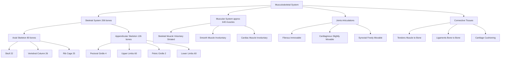
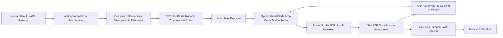
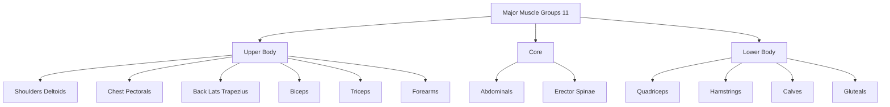
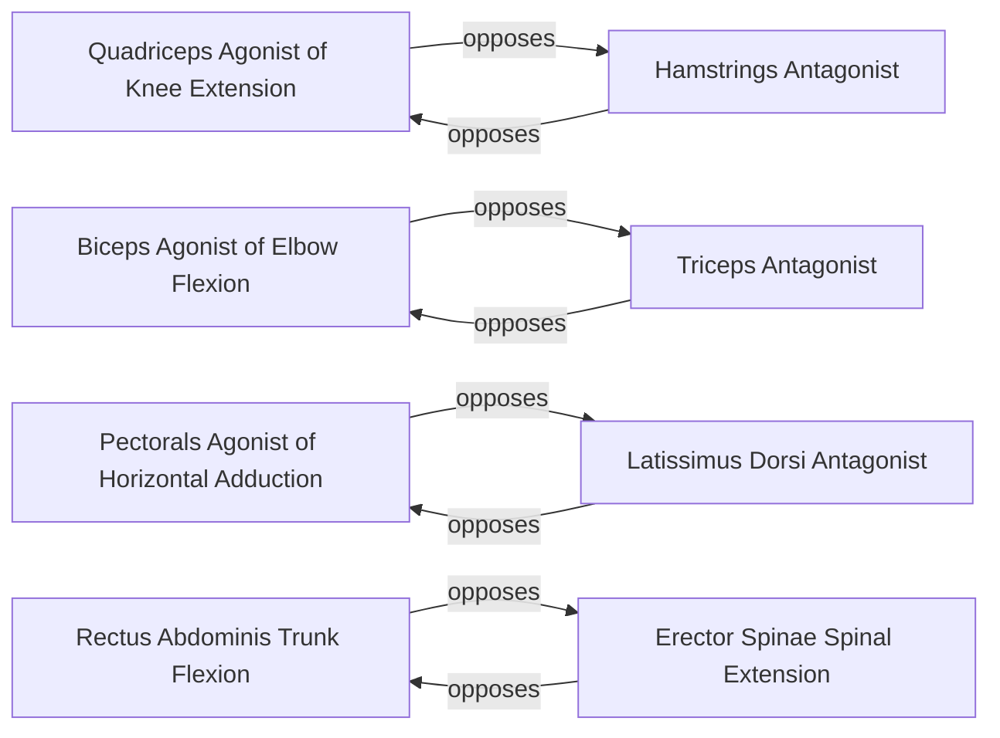
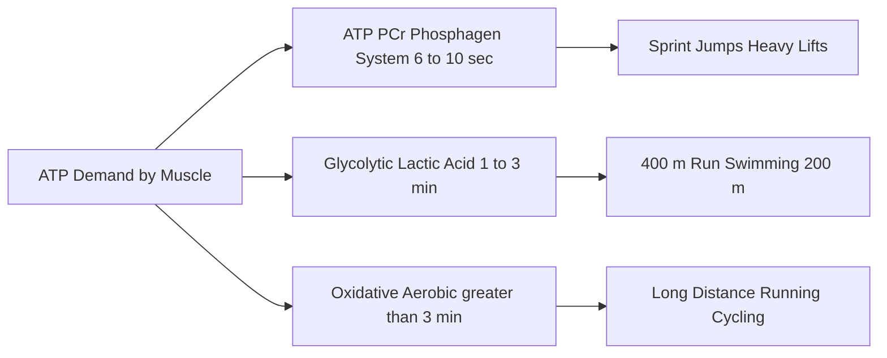

# Musculoskeletal System and the Major Muscle groups of the Human Body

<!-- SECTION_1_START -->
# 1. Core Technical Definition & Intuitive Overview

## 1.1 Formal Definition (KTU 2024 UCHWT127 Terminology)

The **Musculoskeletal System** is an integrated, multi-component bio-mechanical organ system that provides structural support, enables voluntary and involuntary movement, protects vital internal organs, maintains postural stability, stores minerals, and produces blood cells. It is a synergistic union of two principal sub-systems: the **Skeletal System** (the rigid framework) and the **Muscular System** (the contractile engine), coordinated by the nervous system.

> [!NOTE]
> **KTU Syllabus Highlight (Module 1)**
> The musculoskeletal system forms the anatomical foundation for understanding physical activity, exercise physiology, and bio-mechanics. Every movement — from typing to sprinting — is governed by the contraction of muscles acting upon a lever system formed by bones and joints.

## 1.2 Standard Quantitative Metrics of the Adult Human Body

| Parameter | Value | Significance |
| :--- | :--- | :--- |
| **Number of bones** | **206** | Skeletal framework count |
| **Number of joints (articulations)** | **~360** | Movement pivot points |
| **Number of skeletal muscles** | **~640 (approx. 600–650)** | Voluntary movers |
| **Number of named muscles** | **over 800** | Including deep/minor muscles |
| **Bone-to-muscle ratio (adult)** | **approx. 1 : 1.2** | Mass-wise |
| **Water content of muscle** | **~75%** | Hydration importance |

## 1.3 Conceptual Analogy — The Human Body as a Bio-Mechanical Crane

> [!IMPORTANT]
> **The "Crane" Analogy**
> Imagine the human body as a sophisticated **construction crane** standing on a construction site:
>
> 1. The **steel framework / girders** of the crane = the **Skeletal System (bones)** — they bear load, give shape, and provide rigid levers.
> 2. The **hydraulic pistons and pulleys** of the crane = the **Muscular System (muscles & tendons)** — they generate force and transmit it to pull the levers.
> 3. The **bolts, nuts, and joints** of the crane = **Joints, Ligaments, and Cartilage** — they allow controlled rotation at pivot points and hold parts together.
> 4. The **control cabin and cables** = the **Nervous System** — sending signals to coordinate movement.
>
> Just as a crane cannot lift a load without a coordinated framework + pistons + joints, the human body cannot perform physical activity without bones + muscles + joints working in synchrony. A weak link (e.g., weak bones in osteoporosis or torn ligaments) collapses the entire system.

## 1.4 Bio-Mechanical Levers — A Foundational Concept

> [!VISUALIZATION CONTROL]
> **Concept:** First-Class Lever in the Human Body (e.g., head nodding on the atlanto-occipital joint)
> **Coordinate Sketch (simplified):**
> * Fulcrum $F$ = atlanto-occipital joint (between skull and spine)
> * Effort $E$ = posterior neck muscles (pulling down at the back)
> * Load $L$ = weight of the front of the face/skull (in front)
> * Equation of static equilibrium: $E \times d_E = L \times d_L$
> **Visual Description:** Picture a horizontal beam balanced on a triangular pivot. A downward force at the rear balances an upward tendency at the front. The student should note that $d_E < d_L$, meaning the neck muscles must exert a force larger than the head's weight to keep it upright.

## 1.5 Overview Diagram of the Musculoskeletal System

> [!TIP]
> **Three Sub-Systems in Harmony**
> 1. **Bones (Osseous tissue)** — passive levers, support, protection.
> 2. **Joints (Articulations)** — pivots, allowing or restricting motion.
> 3. **Muscles (Contractile tissue)** — active movers, force generators.
> Connected by **tendons** (muscle-to-bone) and **ligaments** (bone-to-bone).

<!-- SECTION_1_END -->

<!-- SECTION_2_START -->
# 2. Deep Theoretical Analysis & KTU High-Yield Formula Sheet

## 2.1 Structural Organization of the Skeletal System

The human skeleton is functionally divided into two divisions:

* **Axial Skeleton (80 bones):** Forms the central axis of the body.
  * **Skull** (22 bones including cranial and facial)
  * **Vertebral Column** (26 bones: 7 cervical, 12 thoracic, 5 lumbar, 1 sacrum, 1 coccyx)
  * **Rib Cage** (24 ribs + 1 sternum = 25 bones)
* **Appendicular Skeleton (126 bones):** The limbs and their girdles.
  * **Pectoral (Shoulder) Girdle:** 4 bones (2 clavicles + 2 scapulae)
  * **Upper Limbs:** 60 bones (30 per arm: humerus, radius, ulna, carpals, metacarpals, phalanges)
  * **Pelvic (Hip) Girdle:** 2 hip bones (each formed by ilium, ischium, pubis — fused)
  * **Lower Limbs:** 60 bones (30 per leg: femur, patella, tibia, fibula, tarsals, metatarsals, phalanges)

> [!IMPORTANT]
> **Verification:** $80 + 126 = 206$ bones. ✓

## 2.2 Functions of the Skeletal System (The 6-Pillar Framework)

1. **Support:** Provides the rigid framework for the body.
2. **Protection:** Shields vital organs (e.g., cranium protects the brain; rib cage protects the heart and lungs).
3. **Movement:** Acts as lever arms for muscles.
4. **Mineral Storage:** Reservoir for **calcium ($Ca^{2+}$)** and **phosphorus ($P$)**.
5. **Hematopoiesis:** Red bone marrow produces red blood cells, white blood cells, and platelets.
6. **Fat Storage:** Yellow bone marrow stores triglycerides as an energy reserve.

## 2.3 Types of Joints (Articulations) — Structural Classification

| Type | Structure | Mobility | Example |
| :--- | :--- | :--- | :--- |
| **Fibrous** | Bones joined by dense fibrous CT | Immovable (Synarthrosis) | Sutures of the skull |
| **Cartilaginous** | Bones joined by cartilage | Slightly movable (Amphiarthrosis) | Intervertebral discs, pubic symphysis |
| **Synovial** | Fluid-filled cavity + cartilage + capsule | Freely movable (Diarthrosis) | Shoulder, knee, hip, elbow |

> [!NOTE]
> **Synovial joints are the most important for physical activity** because they permit a wide range of motion. They include **ball-and-socket** (shoulder, hip), **hinge** (elbow, knee), **pivot** (atlanto-axial), **condyloid** (wrist), **saddle** (thumb base), and **gliding** (carpals/tarsals).

## 2.4 Types of Muscular Tissue

| Feature | Skeletal Muscle | Smooth Muscle | Cardiac Muscle |
| :--- | :--- | :--- | :--- |
| **Striations** | Striated | Non-striated | Striated |
| **Control** | Voluntary | Involuntary | Involuntary |
| **Location** | Attached to bones | Walls of hollow organs (gut, blood vessels) | Heart wall (myocardium) |
| **Nuclei per cell** | Multinucleated | Single, central | Single, central |
| **Contraction speed** | Fast | Slow, sustained | Moderate, rhythmic |
| **Fatigue** | Fatigues | Resistant to fatigue | Highly fatigue-resistant |

> [!IMPORTANT]
> For Health & Wellness and physical activity modules, **skeletal muscles** are the principal focus, as they directly power body movement and respond to exercise training.

## 2.5 Major Muscle Groups of the Human Body (KTU High-Yield Table)

> [!NOTE]
> The human body has 11 major muscle groups, typically studied for fitness, posture, and physical activity planning.

| # | Muscle Group | Principal Muscles | Primary Functions |
| :---: | :--- | :--- | :--- |
| 1 | **Shoulders (Deltoids)** | Anterior, Lateral, Posterior Deltoid | Arm abduction, flexion, extension |
| 2 | **Chest (Pectorals)** | Pectoralis Major, Minor | Shoulder flexion, adduction; chest pushing |
| 3 | **Back (Latissimus & Trapezius)** | Lats, Trapezius, Rhomboids, Erector Spinae | Pulling, posture, spinal extension |
| 4 | **Arms — Biceps** | Biceps Brachii, Brachialis | Elbow flexion, forearm supination |
| 5 | **Arms — Triceps** | Triceps Brachii | Elbow extension |
| 6 | **Forearms** | Flexor & Extensor Carpi groups | Wrist & finger movement, grip strength |
| 7 | **Abdominals (Core)** | Rectus Abdominis, Obliques, Transversus | Trunk flexion, rotation, intra-abdominal pressure |
| 8 | **Legs — Quadriceps** | Rectus Femoris, Vastus Lateralis/Medialis/Intermedius | Knee extension, hip flexion |
| 9 | **Legs — Hamstrings** | Biceps Femoris, Semitendinosus, Semimembranosus | Knee flexion, hip extension |
| 10 | **Legs — Calves (Gastrocnemius & Soleus)** | Gastrocnemius, Soleus | Plantarflexion (walking, running, jumping) |
| 11 | **Gluteals (Buttocks)** | Gluteus Maximus, Medius, Minimus | Hip extension, abduction; posture |

## 2.6 The Sliding Filament Theory — Foundation of Muscle Contraction

> [!IMPORTANT]
> **Core Concept:** Muscles contract when the thin filaments (actin) slide over the thick filaments (myosin), pulled by cross-bridge cycling powered by **ATP** (adenosine triphosphate). The sarcomere (functional unit) shortens; the filaments themselves do **not** shorten.

**The Sliding Filament Sequence (5 Steps):**

1. **Resting state:** Tropomyosin covers the myosin-binding sites on actin. $Ca^{2+}$ is stored in the sarcoplasmic reticulum.
2. **Neural stimulation:** A motor neuron releases **acetylcholine (ACh)** at the neuromuscular junction → action potential travels along the sarcolemma and into T-tubules.
3. **$Ca^{2+}$ release:** The action potential triggers the sarcoplasmic reticulum to release $Ca^{2+}$ into the sarcoplasm.
4. **Cross-bridge formation:** $Ca^{2+}$ binds to **troponin**, shifting **tropomyosin** and exposing the active sites on actin. Myosin heads (already charged with ATP hydrolysis products) bind to actin.
5. **Power stroke & sliding:** Myosin heads pivot, pulling actin inward (toward the sarcomere center) — this is the **power stroke**. New ATP binds to myosin, detaching it from actin. ATP is hydrolyzed to re-cock the myosin head. Cycle repeats.

## 2.7 Types of Skeletal Muscle Contraction

| Contraction Type | Definition | Example |
| :--- | :--- | :--- |
| **Isotonic — Concentric** | Muscle shortens under load | Lifting a dumbbell (biceps shorten) |
| **Isotonic — Eccentric** | Muscle lengthens under load | Lowering the dumbbell slowly |
| **Isometric** | Muscle length stays constant; tension changes | Pushing against a wall, plank hold |
| **Isokinetic** | Constant speed contraction through range of motion | Using specialized rehab machines |

## 2.8 KTU High-Yield Formula Sheet

| Concept | Equation / Definition | Units |
| :--- | :--- | :--- |
| **Lever law of equilibrium** | $E \times d_E = L \times d_L$ | Newton-meters (N·m) |
| **Mechanical advantage (MA)** | $MA = \dfrac{L \times d_L}{E \times d_E} = \dfrac{d_E}{d_L}$ | Dimensionless |
| **Force production by muscle** | $F = \text{number of cross-bridges} \times \text{single cross-bridge force}$ | Newtons (N) |
| **Sarcomere length — tension** | Maximum overlap of actin-myosin yields maximum tension | Micrometers ($\mu m$) |
| **Resting potential of muscle** | $\approx -90\ mV$ (sarcolemma) | Millivolts (mV) |
| **Energy from ATP hydrolysis** | $ATP \rightarrow ADP + P_i + \text{Energy (}\approx 7.3\ \text{kcal/mol)}$ | kcal/mol |

<!-- SECTION_2_END -->

<!-- SECTION_3_START -->
# 3. Step-by-Step Derivations & Symbolic Implementation

## 3.1 Detailed Anatomy of a Long Bone (Femur — Worked Example)

A long bone is the textbook model for understanding osseous tissue. Let us dissect the **femur** step by step.

**Layer-by-Layer Analysis (from outside → inside):**

* **Step 1 — Periosteum:** A tough, fibrous membrane covering the outer bone surface. It contains blood vessels, nerves, and osteoblasts (bone-forming cells). It is the **anchoring point for tendons and ligaments**.
* **Step 2 — Compact (Cortical) Bone:** Dense, hard outer shell. Organized into **osteons (Haversian systems)** with concentric lamellae around a central canal carrying blood vessels.
* **Step 3 — Spongy (Cancellous / Trabecular) Bone:** Porous inner meshwork of trabeculae. Found at the **epiphyses** (ends of long bones). Houses **red bone marrow** (hematopoiesis).
* **Step 4 — Medullary (Marrow) Cavity:** Hollow central space within the diaphysis (shaft). Filled with **yellow bone marrow** (adipose tissue) in adults.
* **Step 5 — Endosteum:** Thin membrane lining the medullary cavity and trabeculae.
* **Step 6 — Articular Cartilage:** Smooth hyaline cartilage covering joint surfaces. Reduces friction, absorbs shock.

> [!NOTE]
> **The femur is the longest, strongest bone in the human body.** It can withstand compressive forces of approximately **1,800–2,500 Newtons** (about 180–250 kg of axial load) in a healthy adult.

## 3.2 Step-by-Step: Sliding Filament Theory (Full Physiological Walkthrough)

$$
\begin{aligned}
\text{Step A:} \quad & \text{Motor neuron fires} \rightarrow \text{Acetylcholine (ACh) released at NMJ} \\
\text{Step B:} \quad & \text{ACh binds nicotinic receptors on sarcolemma} \rightarrow \text{Na}^+ \text{influx} \\
\text{Step C:} \quad & \text{Action potential propagates along sarcolemma} \rightarrow \text{into T-tubules} \\
\text{Step D:} \quad & \text{T-tubule depolarization} \rightarrow \text{Sarcoplasmic Reticulum releases Ca}^{2+} \\
\text{Step E:} \quad & \text{Ca}^{2+} \text{ binds Troponin C} \rightarrow \text{Tropomyosin shifts} \\
\text{Step F:} \quad & \text{Myosin-binding sites on Actin are exposed} \\
\text{Step G:} \quad & \text{Myosin head (ADP+Pi bound) binds Actin} \rightarrow \text{Cross-bridge forms} \\
\text{Step H:} \quad & \text{Pi release} \rightarrow \text{Power Stroke (45° pivot)} \rightarrow \text{Actin slides ~10 nm} \\
\text{Step I:} \quad & \text{New ATP binds Myosin} \rightarrow \text{Myosin detaches from Actin} \\
\text{Step J:} \quad & \text{ATP hydrolysis (ATP} \rightarrow \text{ADP + Pi)} \rightarrow \text{Myosin head re-cocked} \\
\text{Step K:} \quad & \text{Ca}^{2+} \text{ pumped back into SR (via Ca}^{2+}\text{-ATPase)} \rightarrow \text{Relaxation}
\end{aligned}
$$

> [!IMPORTANT]
> **Rigor Mortis Insight:** After death, ATP production ceases. Without ATP, myosin heads **cannot detach** from actin, causing the characteristic stiffening of the body. This is exactly why **Step I is critical** — without fresh ATP binding, the cross-bridge cycle halts in a fixed state.

## 3.3 Anatomical Directional Terminology (Standard Reference Frame)

A foundational sub-topic for KTU Module 1. The human body is described in the **anatomical position**: standing upright, arms at sides, palms forward, feet parallel.

| Term | Meaning | Example |
| :--- | :--- | :--- |
| **Anterior (Ventral)** | Toward the front | The sternum is anterior to the heart |
| **Posterior (Dorsal)** | Toward the back | The spine is posterior to the heart |
| **Superior (Cranial)** | Toward the head | The neck is superior to the chest |
| **Inferior (Caudal)** | Toward the feet | The knee is inferior to the hip |
| **Medial** | Toward the midline | The nose is medial to the ears |
| **Lateral** | Away from the midline | The shoulders are lateral to the sternum |
| **Proximal** | Closer to trunk / origin | The elbow is proximal to the wrist |
| **Distal** | Farther from trunk / origin | The wrist is distal to the elbow |
| **Superficial** | Closer to the body surface | Skin is superficial to muscle |
| **Deep** | Farther from the surface | Bone is deep to muscle |

## 3.4 Major Muscle Groups — Detailed Function & Exercise Mapping

> [!NOTE]
> The following table maps the 11 major muscle groups to their **agonist–antagonist pairs** and **common strengthening exercises**. This is high-yield for KTU short and long questions on physical activity.

| Muscle Group | Agonist (Prime Mover) | Antagonist | Key Exercise | Movement Type |
| :--- | :--- | :--- | :--- | :--- |
| **Quadriceps** | Rectus Femoris, Vasti | Hamstrings | Squats, Leg Press | Knee extension |
| **Hamstrings** | Biceps Femoris etc. | Quadriceps | Deadlifts, Leg Curl | Knee flexion |
| **Pectorals** | Pectoralis Major | Trapezius / Lats | Bench Press, Push-ups | Horizontal adduction |
| **Lats (Back)** | Latissimus Dorsi | Pectoralis Major | Pull-ups, Lat Pulldown | Shoulder extension/adduction |
| **Deltoids** | Anterior, Lateral, Posterior | Lats / Pectorals | Overhead Press, Lateral Raise | Shoulder abduction/flexion |
| **Biceps** | Biceps Brachii | Triceps | Bicep Curl | Elbow flexion |
| **Triceps** | Triceps Brachii | Biceps | Triceps Pushdown, Dips | Elbow extension |
| **Abdominals** | Rectus Abdominis, Obliques | Erector Spinae | Crunches, Plank | Trunk flexion |
| **Erector Spinae** | Spinal extensors | Rectus Abdominis | Back Extensions | Spinal extension |
| **Gluteals** | Gluteus Maximus | Hip Flexors (Psoas) | Hip Thrust, Squat | Hip extension |
| **Calves** | Gastrocnemius, Soleus | Tibialis Anterior | Calf Raises | Plantarflexion |

## 3.5 Worked Numerical Problem — Mechanical Advantage of the Biceps

> [!TIP]
> **Problem (KTU-style application):**
> The biceps muscle inserts on the radius at approximately **5 cm** from the elbow joint. The hand holds a **50 N** load at a distance of **35 cm** from the elbow joint. Calculate the force the biceps must generate, and the mechanical advantage of the system.

$$
\begin{aligned}
\text{Step 1: Identify lever type} \quad & \text{Third-class lever (Effort between Fulcrum and Load)} \\
\text{Step 2: Apply lever law} \quad & E \times d_E = L \times d_L \\
\text{Step 3: Substitute values} \quad & E \times 0.05\ m = 50\ N \times 0.35\ m \\
\text{Step 4: Solve for E} \quad & E = \dfrac{50 \times 0.35}{0.05} = \dfrac{17.5}{0.05} = 350\ N \\
\text{Step 5: Calculate MA} \quad & MA = \dfrac{d_E}{d_L} = \dfrac{0.05}{0.35} = 0.143 \\
\text{Step 6: Interpret} \quad & MA < 1 \Rightarrow \text{speed/displacement gain at the cost of force. The biceps must pull 7× the load.}
\end{aligned}
$$

**Final Answer:** Biceps force = **350 N**; Mechanical advantage = **0.143** (a third-class lever optimized for speed and range, not force).

## 3.6 Energy Systems for Muscle Activity (Brief Foundation)

> [!NOTE]
> The musculoskeletal system requires ATP. Three systems regenerate ATP in skeletal muscle:

1. **ATP-PCr System (Phosphagen):** Anaerobic, no oxygen, no lactate. Lasts **~6–10 seconds** (sprinting, jumping).
2. **Glycolytic (Lactic Acid) System:** Anaerobic, breaks down glucose → pyruvate → lactate. Lasts **~1–3 minutes** (400 m run).
3. **Oxidative (Aerobic) System:** Uses oxygen, mitochondria oxidize carbohydrates & fats. Lasts **> 3 minutes** (long-distance running, cycling).

<!-- SECTION_3_END -->

<!-- SECTION_4_START -->
# 4. Structural Diagrams & Schematics

## 4.1 Mermaid — Musculoskeletal System Component Architecture

## 4.2 Mermaid — Sliding Filament Cross-Bridge Cycle (Block Topology)

## 4.3 Mermaid — Major Muscle Groups (Functional Grouping)

## 4.4 Mermaid — Agonist vs Antagonist Pairing (Functional Topology)

## 4.5 Mermaid — Energy System Cascade for Muscle Activity

<!-- SECTION_5_END -->

<!-- SECTION_5_START -->
# 5. KTU 2024 Scheme Examination Question Bank & Topic Recap

## 5.1 Part A Questions (3 Marks Each)

> **[KTU University Exam - July 2024] — Q1 (CO1, Remember)**

**Q1. Define the musculoskeletal system. List any four major functions of the skeletal system.**

**Model Answer:**
The musculoskeletal system is an integrated organ system composed of bones, joints, skeletal muscles, cartilage, tendons, and ligaments that work together to support the body, enable movement, and protect vital organs.

*Four major functions of the skeletal system:*
1. **Support** — provides the rigid framework of the body.
2. **Protection** — shields vital organs (e.g., skull protects the brain; rib cage protects the heart and lungs).
3. **Movement** — acts as lever arms for skeletal muscles to produce motion.
4. **Mineral storage** — stores calcium and phosphorus, releasing them into the blood as needed.

*(Any 4 points — full 3 marks)*

> **[KTU University Exam - Dec 2023] — Q2 (CO1, Understand)**

**Q2. Differentiate between skeletal muscle and smooth muscle (any three points).**

**Model Answer:**

| Feature | Skeletal Muscle | Smooth Muscle |
| :--- | :--- | :--- |
| **Striations** | Striated (banded appearance) | Non-striated (smooth) |
| **Control** | Voluntary (under conscious control) | Involuntary (autonomic control) |
| **Location** | Attached to bones via tendons | Walls of hollow organs (intestines, blood vessels, bladder) |
| **Cell shape** | Long, cylindrical, multinucleated | Spindle-shaped, single nucleus |

*(3 points — full 3 marks)*

---

## 5.2 Part B Questions (14 Marks — Module Internal Choice)

### Question A (14 Marks) — Comprehensive Question

> **[KTU University Exam - July 2024 Model Paper] — Q3 (CO1, CO2 — Understand / Apply)**

**Q3 (a)** Describe the structure of a synovial joint with a neat labeled diagram. Explain any **four** types of synovial joints with one example each. **[7 Marks]**

**Model Answer:**

**Structure of a Synovial Joint:**
A synovial joint is a freely movable articulation characterized by a fluid-filled cavity. Its key components are:

* **Articular Cartilage:** Smooth hyaline cartilage covering the ends of the articulating bones, reducing friction and absorbing shock.
* **Synovial Cavity:** A small space between the two bones filled with synovial fluid.
* **Synovial Membrane:** Inner lining that secretes synovial fluid (rich in hyaluronic acid) for lubrication.
* **Joint (Articular) Capsule:** Two-layered fibrous capsule enclosing the joint; outer layer is dense connective tissue, inner is synovial membrane.
* **Ligaments:** Bands of dense regular connective tissue that reinforce the joint and prevent excessive movement.
* **Bursae (optional):** Small fluid-filled sacs reducing friction between tendons and bones.

> **[Mark Allocation — Stating components of synovial joint: 3 Marks; Diagram & labeling: 1 Mark]**

**Four Types of Synovial Joints:**

| Type | Description | Example |
| :--- | :--- | :--- |
| **Ball-and-Socket** | Spherical head fits into cup-shaped socket; multi-axial | Shoulder (glenohumeral), Hip |
| **Hinge** | Convex surface fits into concave surface; mono-axial (one plane) | Elbow, Knee, Ankle |
| **Pivot** | Rounded end rotates within a ring; rotation only | Atlanto-axial (between C1 and C2), Proximal Radioulnar |
| **Gliding (Plane)** | Flat articulating surfaces slide over each other | Intercarpal (wrist), Intertarsal (ankle) |

> **[Mark Allocation — Correct description of 4 types with examples: 3 Marks]**

---

**Q3 (b)** Explain the **Sliding Filament Theory** of muscle contraction. List the **three energy systems** that supply ATP to working muscles. **[7 Marks]**

**Model Answer:**

**Sliding Filament Theory — Step-by-Step:**

1. The motor neuron releases **acetylcholine (ACh)** at the neuromuscular junction, generating an action potential along the sarcolemma.
2. The action potential travels through **T-tubules** and triggers the **sarcoplasmic reticulum** to release $Ca^{2+}$ ions.
3. $Ca^{2+}$ binds to **troponin**, causing **tropomyosin** to shift and expose the myosin-binding sites on the **actin** filaments.
4. The energized **myosin head** (with ADP + $P_i$) binds to the exposed active site on actin, forming a **cross-bridge**.
5. $P_i$ is released, and the myosin head pivots, sliding the actin filament toward the **M-line** (sarcomere center) — this is the **power stroke**.
6. A new ATP molecule binds to the myosin head, causing it to detach from actin.
7. ATP is hydrolyzed to ADP + $P_i$, re-energizing and re-cocking the myosin head for another cycle.
8. When neural stimulation stops, $Ca^{2+}$ is pumped back into the sarcoplasmic reticulum (via $Ca^{2+}$-ATPase), tropomyosin covers the binding sites, and the muscle **relaxes**.

> **Net Result:** The Z-discs move closer together, the I-band and H-zone shorten, and the sarcomere contracts. The A-band length remains constant.

> **[Mark Allocation — Each major step: 0.5 Mark × 8 steps = 4 Marks; Net result statement: 1 Mark]**

**Three Energy Systems for ATP Regeneration:**

1. **ATP-PCr (Phosphagen) System:** Anaerobic; uses stored phosphocreatine to rapidly regenerate ATP. Lasts **~6–10 seconds**. Used in sprints, jumps, and heavy lifts.
2. **Glycolytic (Lactic Acid) System:** Anaerobic; breaks down glucose/glycogen into pyruvate → lactate, yielding 2 ATP per glucose. Lasts **~1–3 minutes**. Used in 400 m sprints, 100 m swimming.
3. **Oxidative (Aerobic) System:** Uses oxygen in mitochondria; oxidizes carbohydrates and fats. Yields **~36–38 ATP** per glucose. Lasts **> 3 minutes**. Used in marathon running, cycling, sustained moderate activity.

> **[Mark Allocation — Each system with characteristic and duration: 2 Marks]**

---

### Question B (14 Marks) — Alternative Choice

> **[KTU University Exam - Dec 2023 Model Paper] — Q4 (CO1, CO2 — Understand / Apply)**

**Q4 (a)** List the **eleven major muscle groups** of the human body. Explain in detail the muscles of the **shoulder, back, and thigh** with their primary actions. **[7 Marks]**

**Model Answer:**

**Eleven Major Muscle Groups (Listed):**
Shoulders, Chest, Back, Biceps, Triceps, Forearms, Abdominals, Quadriceps, Hamstrings, Calves, Gluteals.

> **[Mark Allocation — Listing all 11 groups: 2 Marks]**

**A. Shoulder (Deltoid Region):**
* **Deltoid Muscle** — composed of three functional parts:
  * **Anterior (Front) Deltoid** — flexes and medially rotates the arm at the shoulder.
  * **Lateral (Middle) Deltoid** — abducts the arm (moves it sideways away from the body).
  * **Posterior (Rear) Deltoid** — extends and laterally rotates the arm.
* **Supporting muscles:** Rotator cuff group (supraspinatus, infraspinatus, teres minor, subscapularis) — stabilize the glenohumeral joint.

**B. Back:**
* **Latissimus Dorsi (Lats):** The largest back muscle. Extends, adducts, and medially rotates the arm (used in pull-ups, swimming).
* **Trapezius (Upper, Middle, Lower):** Upper fibers elevate the scapula (shrug); middle fibers retract scapula; lower fibers depress scapula.
* **Rhomboids (Major & Minor):** Retract and rotate the scapula downward.
* **Erector Spinae (a deep muscle group running along the spine):** Extends the vertebral column, maintains posture.

**C. Thigh (Hip & Knee Region):**
* **Quadriceps Femoris (anterior thigh):**
  * Rectus Femoris, Vastus Lateralis, Vastus Medialis, Vastus Intermedius.
  * **Action:** Extension of the knee; Rectus Femoris also flexes the hip.
* **Hamstrings (posterior thigh):**
  * Biceps Femoris, Semitendinosus, Semimembranosus.
  * **Action:** Flexion of the knee; extension of the hip.
* **Adductor Group (medial thigh):** Adducts the thigh toward midline.

> **[Mark Allocation — Shoulder detail with 3 parts of deltoid + action: 1.5 Marks; Back detail with 4 muscles + actions: 1.5 Marks; Thigh detail with quads, hams, adductors + actions: 2 Marks]**

---

**Q4 (b)** What are **antagonistic muscle pairs**? Explain with three examples. Briefly describe the three **types of levers** found in the human body. **[7 Marks]**

**Model Answer:**

**Antagonistic Muscle Pairs:**
Antagonistic muscle pairs are two muscles (or muscle groups) that produce **opposite actions** at a joint. When one contracts (the **agonist** or **prime mover**), the other relaxes (the **antagonist**), and vice versa. This pairing allows smooth, controlled movement.

**Three Examples:**

| Joint | Agonist (Prime Mover) | Antagonist |
| :--- | :--- | :--- |
| **Elbow** | Biceps Brachii (flexes) | Triceps Brachii (extends) |
| **Knee** | Quadriceps (extends) | Hamstrings (flexes) |
| **Shoulder** | Pectoralis Major (flexes/adducts) | Latissimus Dorsi (extends/adducts) |

> **[Mark Allocation — Definition: 1 Mark; Three examples with correct pairs: 1.5 Marks]**

**Three Classes of Levers in the Human Body:**

| Lever Class | Arrangement (F = Fulcrum, E = Effort, L = Load) | Mechanical Advantage | Example in Human Body |
| :--- | :--- | :--- | :--- |
| **First Class** | F lies between E and L | Can be > 1, = 1, or < 1 | Atlanto-occipital joint (head nodding); seesaw |
| **Second Class** | L lies between F and E | Always > 1 (force advantage) | Standing on tiptoes (calf raise); wheelbarrow |
| **Third Class** | E lies between F and L | Always < 1 (speed/displacement advantage) | Biceps curl (elbow flexion); most skeletal muscles |

> **Note:** Most muscles in the human body act as **third-class levers**, sacrificing force for speed and range of motion.

> **[Mark Allocation — Three lever types with arrangement and one example each: 4.5 Marks]**

---

## 5.3 KTU Examiner's Valuation Warning / Pitfall Callout

> [!WARNING]
> **Common Mistakes That Cost Marks:**
> 1. **Confusing axial vs appendicular bone counts.** Axial = 80, Appendicular = 126, Total = 206. Students often misstate these.
> 2. **Mixing up joint types.** Fibrous = immovable; Cartilaginous = slightly movable; Synovial = freely movable. Wrong classification = 0 marks for that part.
> 3. **In Sliding Filament Theory, students forget the role of $Ca^{2+}$** or omit the ATP-detachment step. Without the ATP step, the cycle is incomplete — examiner deducts 1 mark.
> 4. **Saying "muscle shortens" instead of "sarcomere shortens"** or "filaments slide." Muscles do not shrink in length; the overlap increases.
> 5. **In lever problems, students confuse effort and load distances.** Always identify the fulcrum first, then which side has the effort (muscle insertion) and which has the load.
> 6. **Omitting the anatomical position** when defining directional terms. Examiner expects "anterior — toward the front, in anatomical position."

---

## 5.4 Topic Recap & Important Things to Remember

> [!TIP]
> **Rapid-Revision Checklist — Musculoskeletal System**

**Quick-Fire Definitions:**
* **Musculoskeletal System** = bones + joints + skeletal muscles + cartilage + tendons + ligaments.
* **206 bones, ~360 joints, ~640 skeletal muscles** in adult human.
* **Axial skeleton (80 bones)** = skull (22) + vertebral column (26) + rib cage (25 + 7 = 32? — actually 25).
* **Appendicular skeleton (126 bones)** = pectoral girdle (4) + upper limbs (60) + pelvic girdle (2) + lower limbs (60).

**Joint Quick-Reference:**
* **Fibrous** → immovable (skull sutures)
* **Cartilaginous** → slightly movable (intervertebral discs)
* **Synovial** → freely movable (knee, shoulder, hip) — 6 types: ball-and-socket, hinge, pivot, condyloid, saddle, gliding.

**Muscle Tissue Triad:**
* **Skeletal** — voluntary, striated, multinucleated, attaches to bone.
* **Smooth** — involuntary, non-striated, walls of hollow organs.
* **Cardiac** — involuntary, striated, branched, in heart wall.

**11 Major Muscle Groups (Mnemonic — "SHE CRIES BFA Q-HCG"):**
**S**houlders, **H**amstrings, **E**rector spinae, **C**hest, **R**epeat for **I** (calves), **E** (triceps), **S** (gluteals), **B**iceps, **F**orearms, **A**bdominals, **Q**uadriceps — *(custom mnemonic; please verify mentally during revision)*.

**Sliding Filament Theory — 5 Must-Recall Steps:**
1. **ACh** at neuromuscular junction → action potential.
2. **$Ca^{2+}$** release from sarcoplasmic reticulum.
3. **$Ca^{2+}$** binds troponin → tropomyosin shifts → actin sites exposed.
4. **Myosin–actin cross-bridge** → power stroke (ADP + $P_i$ release).
5. **New ATP** binds myosin → detachment → re-cocking.

**Three Energy Systems:**
* **ATP-PCr** = 6–10 s (sprints, jumps).
* **Glycolytic** = 1–3 min (400 m run).
* **Oxidative** = > 3 min (marathon).

**Lever Law:**
* Equilibrium: $E \times d_E = L \times d_L$.
* **First class** = fulcrum in middle (head).
* **Second class** = load in middle (calf raise).
* **Third class** = effort in middle (biceps — most common in body).

**Antagonistic Pairs (Top 3 to remember):**
* Biceps ↔ Triceps (elbow)
* Quadriceps ↔ Hamstrings (knee)
* Pectoralis Major ↔ Latissimus Dorsi (shoulder)

> **Final KTU Tip:** Always draw a **labeled diagram** wherever possible — examiners award **1–2 marks** for neat, well-labeled sketches in long questions, even when the textual answer is partial.

<!-- SECTION_5_END -->
