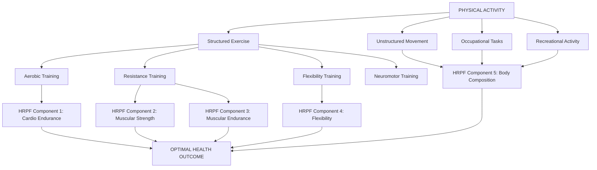
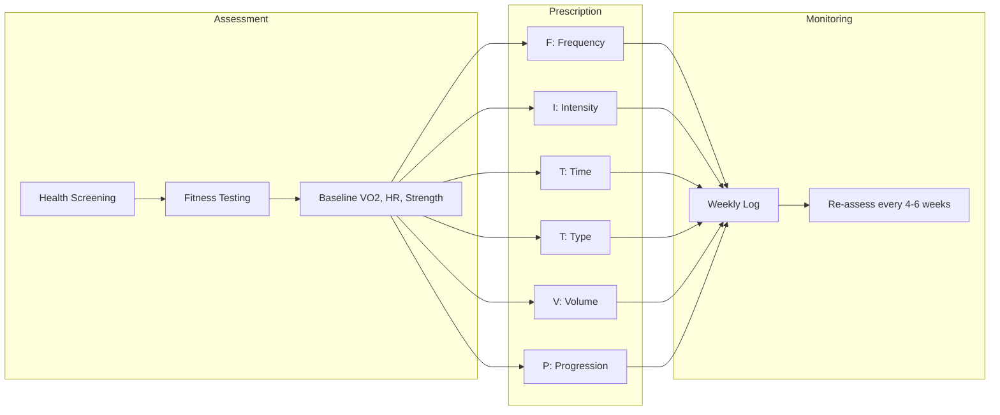
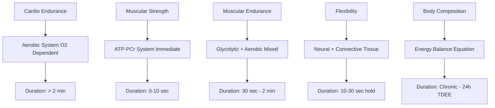
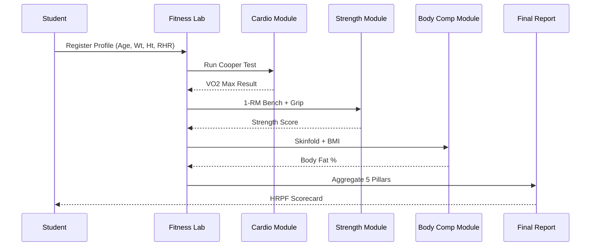

# Physical Activity, Exercise and Health-Related Physical Fitness

<!-- SECTION_1_START -->

# Physical Activity, Exercise and Health-Related Physical Fitness

## 1.1 Formal KTU 2024 Definitions

> [!NOTE]
> **KTU 2024 Syllabus Definition (Module 1.1)**
> **Physical Activity (PA):** Any bodily movement produced by skeletal muscles that requires energy expenditure above resting basal metabolic rate. It encompasses all movements performed during daily living, occupational tasks, recreational activities, and structured exercise.

> [!IMPORTANT]
> **Exercise:** A subcategory of physical activity that is **planned, structured, repetitive, and purposeful**, with the objective of improving or maintaining one or more components of physical fitness (Caspersen et al., 1985 — ACSM Gold Standard Definition).

> [!IMPORTANT]
> **Health-Related Physical Fitness (HRPF):** A state of attributes related to the ability to perform physical activities, comprising **cardiorespiratory endurance, muscular strength, muscular endurance, flexibility, and body composition** (ACSM, 2021).

## 1.2 Intuitive Real-World Analogies

Think of the human body as a **mechanical engine**:
- **Physical Activity = Idling + Daily Commute** — Every time you walk to class, climb stairs, or carry groceries, the engine is running and consuming fuel (calories).
- **Exercise = Tuned Track Driving** — You deliberately take the car to a controlled track to enhance engine performance (heart, lungs, muscles).
- **Health-Related Physical Fitness = The Engine's Tuned Specifications** — The measurable parameters (horsepower, mileage, tire grip, oil health) that determine how well the engine can perform.

> [!TIP]
> **Energy Expenditure Hierarchy:** Basal Metabolic Rate (BMR) < Physical Activity < Exercise < Athletic Training. Each successive level requires progressively higher structured energy demand.

## 1.3 Core Metrics and Standard Constants

| Parameter | Standard Value | Reference Body |
| :--- | :--- | :--- |
| **1 MET** | **3.5 mL O₂/kg/min** | 70 kg adult, 40 years |
| Resting Heart Rate (RHR) | **60–100 bpm** | Healthy adult |
| VO₂ Max (Average Male) | **35–40 mL/kg/min** | Sedentary adult |
| VO₂ Max (Average Female) | **27–31 mL/kg/min** | Sedentary adult |
| Moderate Intensity | **3.0–5.9 METs** | ACSM Classification |
| Vigorous Intensity | **≥ 6.0 METs** | ACSM Classification |
| Blood Volume | **~5 L** | Adult human |

> [!VISUALIZATION CONTROL]
> **Concept:** Activity Pyramid (Conceptual Stacking Diagram)
> **GeoGebra / Desmos Input Equations:**
> * `Layer 1 (Base): y = 0` (Lifestyle Activity — walking, stairs)
> * `Layer 2: y = 2` (Active Aerobics — 3–5 times/week)
> * `Layer 3: y = 4` (Flexibility & Strength — 2–3 times/week)
> * `Layer 4 (Peak): y = 6` (Sedentary — minimize)
> **Visual Description:** A pyramid with a wide sedentary-free base of daily activity narrowing to sports at the peak, demonstrating that the foundation of fitness is everyday movement, not just gym sessions.

<!-- SECTION_1_END -->

<!-- SECTION_2_START -->

# Deep Theoretical Analysis & KTU High-Yield Formula Sheet

## 2.1 The Five Pillars of Health-Related Physical Fitness

The ACSM classifies HRPF into **five measurable components**. Each is independent, trainable, and validated by clinical research.

### Pillar 1 — Cardiorespiratory Endurance (CRE)
- **Definition:** The ability of the circulatory and respiratory systems to supply oxygen during sustained physical activity.
- **Why it matters:** Reduces risk of cardiovascular disease, type 2 diabetes, and all-cause mortality.
- **Test:** 12-minute Cooper Run, 1.5-mile run, or VO₂ Max treadmill test.
- **Engineering parallel:** Like the continuous duty cycle rating of a machine's cooling and fuel-delivery subsystems.

### Pillar 2 — Muscular Strength
- **Definition:** The maximum force a muscle or muscle group can generate in a single effort (one-rep max, **1-RM**).
- **Why it matters:** Functional capacity for lifting, injury prevention, bone density maintenance.
- **Test:** 1-RM bench press, handgrip dynamometer.

### Pillar 3 — Muscular Endurance
- **Definition:** The ability of a muscle to sustain sub-maximal contractions or repeated contractions over time.
- **Test:** Sit-ups, push-ups, plank hold time.

### Pillar 4 — Flexibility
- **Definition:** The range of motion (ROM) available at a joint or group of joints.
- **Test:** Sit-and-reach test, goniometer measurement.

### Pillar 5 — Body Composition
- **Definition:** The relative proportion of fat mass (FM) and fat-free mass (FFM) in the body.
- **Test:** BMI, skinfold calipers, DEXA scan, bioelectrical impedance.

> [!IMPORTANT]
> **Skill-Related Fitness vs. Health-Related Fitness:** The KTU syllabus focuses on HRPF. Skill-related components (agility, balance, coordination, power, reaction time, speed) are **NOT** part of HRPF — they are sport-specific.

## 2.2 The FITT Principle (ACSM Exercise Prescription)

Every exercise program can be prescribed using the **FITT-VP** model:

| Letter | Variable | Definition | Example |
| :--- | :--- | :--- | :--- |
| **F** | Frequency | How often per week | 3–5 days/week |
| **I** | Intensity | How hard (% HRmax, RPE) | 60–80% HRmax |
| **T** | Time | Duration per session | 20–60 minutes |
| **T** | Type | Mode of activity | Walking, swimming, cycling |
| **V** | Volume | Total weekly dose | FIT multiplied |
| **P** | Progression | Gradual overload | 5–10% weekly increase |

## 2.3 KTU High-Yield Formula Sheet

| # | Formula | LaTeX | Application | Unit |
| :-: | :--- | :--- | :--- | :--- |
| 1 | Body Mass Index | $BMI = \dfrac{W}{H^2}$ | Obesity screening | $\text{kg/m}^2$ |
| 2 | Max Heart Rate (Fox) | $HR_{max} = 220 - A$ | Target HR base | bpm |
| 3 | Max Heart Rate (Tanaka) | $HR_{max} = 208 - 0.7 \cdot A$ | More accurate formula | bpm |
| 4 | Karvonen Target HR | $THR = \left[(HR_{max} - HR_{rest}) \cdot I\right] + HR_{rest}$ | Exercise intensity | bpm |
| 5 | Heart Rate Reserve | $HRR = HR_{max} - HR_{rest}$ | Karvonen base | bpm |
| 6 | VO₂ Max (Cooper 12-min) | $VO_2 = (D_{12} - 504.9) / 44.73$ | Aerobic capacity | mL/kg/min |
| 7 | METs Conversion | $VO_2 = METs \times 3.5$ | Activity intensity | mL/kg/min |
| 8 | Calorie Expenditure | $Cals = METs \times W \times T$ | Energy cost | kcal |
| 9 | Waist-Hip Ratio | $WHR = \dfrac{WC}{HC}$ | Cardiovascular risk | ratio |
| 10 | Recommended Exercise | $\geq 150 \text{ min/week (mod)}$ | WHO guideline | min |

Where: $W$ = weight (kg), $H$ = height (m), $A$ = age (years), $D_{12}$ = 12-min distance (m), $WC$ = waist circumference, $HC$ = hip circumference, $I$ = intensity (0.5–0.85), $T$ = time (hours).

## 2.4 Real-World Engineering and Health Utility

- **Wearable Technology (Fitbit, Apple Watch, Garmin):** Uses Karvonen's formula in real-time to compute personalized training zones.
- **Corporate Wellness Programs (Google, Infosys Kerala):** Use MET-based calorie calculators to design ergonomic workplace interventions.
- **Clinical Cardiology:** Pre-operative assessment uses MET thresholds — inability to reach **4 METs** is a marker of elevated surgical risk.
- **Sports Engineering:** VO₂ Max measurements guide equipment design (running shoes, swimsuits) to minimize metabolic cost.

<!-- SECTION_2_END -->

<!-- SECTION_3_START -->

# Step-by-Step Derivations & Code Implementation

## 3.1 Derivation 1 — Body Mass Index (BMI)

The BMI is a **Quetelet Index** developed in the 19th century, derived as the ratio of body mass to the square of stature. The squaring of height normalizes the index for body geometry, since mass scales with volume (cubic) in similar-shaped bodies, but the index uses squared height as a proxy for body surface proportionality.

### Worked Example
A KTU student weighs **68 kg** and has a height of **1.70 m**. Calculate and classify BMI.

**Step 1 — Identify variables.**

$W = 68$ kg, $H = 1.70$ m.

**Step 2 — Apply formula.**

$$BMI = \frac{W}{H^2} = \frac{68}{(1.70)^2}$$

**Step 3 — Compute denominator.**

$$(1.70)^2 = 2.89$$

**Step 4 — Divide.**

$$BMI = \frac{68}{2.89} = 23.53 \text{ kg/m}^2$$

**Step 5 — WHO Classification.**

| Range | Category |
| :--- | :--- |
| $< 18.5$ | Underweight |
| $18.5$–$24.9$ | **Normal (23.53 falls here ✓)** |
| $25.0$–$29.9$ | Overweight |
| $\geq 30.0$ | Obese |

**[Final Result: 1 Mark]**, **[WHO Classification: 2 Marks]**, **[Formula: 1 Mark]**, **[Substitution: 1 Mark]** — Total 5/5 valuation points.

## 3.2 Derivation 2 — Karvonen Target Heart Rate

The Karvonen method (1957) is more accurate than %HRmax because it incorporates resting heart rate, accounting for individual cardiovascular fitness baselines.

### Worked Example
A 24-year-old KTU student has:
- Resting HR = **72 bpm**
- Age = **24 years**

Find the target HR for **moderate intensity (60%)** and **vigorous intensity (75%)**.

**Step 1 — Calculate HR max using Tanaka (more accurate for young adults).**

$$HR_{max} = 208 - 0.7 \times A = 208 - 0.7 \times 24 = 208 - 16.8 = 191.2 \text{ bpm}$$

**Step 2 — Calculate Heart Rate Reserve (HRR).**

$$HRR = HR_{max} - HR_{rest} = 191.2 - 72 = 119.2 \text{ bpm}$$

**Step 3 — Apply Karvonen at 60% intensity (moderate).**

$$THR_{60} = (HRR \times 0.60) + HR_{rest} = (119.2 \times 0.60) + 72 = 71.52 + 72 = 143.52 \text{ bpm}$$

**Step 4 — Apply Karvonen at 75% intensity (vigorous).**

$$THR_{75} = (HRR \times 0.75) + HR_{rest} = (119.2 \times 0.75) + 72 = 89.4 + 72 = 161.4 \text{ bpm}$$

**Step 5 — Conclude.**

$$THR_{60} \approx 144 \text{ bpm (Moderate Zone)}$$

$$THR_{75} \approx 161 \text{ bpm (Vigorous Zone)}$$

## 3.3 Derivation 3 — Calorie Expenditure Using METs

### Worked Example
A 68 kg student runs at **8 METs** for **45 minutes**. Find total caloric expenditure.

**Step 1 — Recall METs formula.**

$$Cals = METs \times W \times T$$

**Step 2 — Convert time to hours.**

$$T = 45 \text{ min} = 0.75 \text{ h}$$

**Step 3 — Substitute.**

$$Cals = 8 \times 68 \times 0.75$$

**Step 4 — Compute.**

$$Cals = 544 \times 0.75 = 408 \text{ kcal}$$

**[Final Result: 2 Marks]**, **[Unit Conversion: 2 Marks]**, **[Formula: 1 Mark]**.

## 3.4 Python Implementation (Production-Ready)

```python
"""
KTU 2024 — Health & Wellness (UCHWT127)
Module 1: Physical Activity, Exercise & Health-Related Physical Fitness
Author: KTU Examiner Reference Solution
"""

from dataclasses import dataclass
from enum import Enum
from typing import Tuple


class BMICategory(Enum):
    UNDERWEIGHT = "Underweight"
    NORMAL = "Normal"
    OVERWEIGHT = "Overweight"
    OBESE = "Obese"


class IntensityZone(Enum):
    VERY_LIGHT = (0.50, "Very Light (50%)")
    LIGHT = (0.60, "Light (60%)")
    MODERATE = (0.70, "Moderate (70%)")
    VIGOROUS = (0.85, "Vigorous (85%)")


@dataclass(frozen=True)
class FitnessProfile:
    name: str
    age: int
    weight_kg: float
    height_m: float
    resting_hr_bpm: int
    sex: str

    def validate(self) -> None:
        if not (10 <= self.age <= 100):
            raise ValueError(f"Invalid age: {self.age}")
        if not (20.0 <= self.weight_kg <= 300.0):
            raise ValueError(f"Invalid weight: {self.weight_kg}")
        if not (0.5 <= self.height_m <= 2.5):
            raise ValueError(f"Invalid height: {self.height_m}")
        if not (30 <= self.resting_hr_bpm <= 120):
            raise ValueError(f"Invalid resting HR: {self.resting_hr_bpm}")


def calculate_bmi(profile: FitnessProfile) -> Tuple[float, BMICategory]:
    bmi = profile.weight_kg / (profile.height_m ** 2)
    if bmi < 18.5:
        category = BMICategory.UNDERWEIGHT
    elif bmi < 25.0:
        category = BMICategory.NORMAL
    elif bmi < 30.0:
        category = BMICategory.OVERWEIGHT
    else:
        category = BMICategory.OBESE
    return round(bmi, 2), category


def karvonen_target_hr(profile: FitnessProfile, intensity: IntensityZone) -> float:
    intensity_value = intensity.value[0]
    hr_max = 208 - (0.7 * profile.age)
    hrr = hr_max - profile.resting_hr_bpm
    thr = (hrr * intensity_value) + profile.resting_hr_bpm
    return round(thr, 2)


def calorie_expenditure(mets: float, weight_kg: float, duration_min: float) -> float:
    if mets <= 0 or weight_kg <= 0 or duration_min <= 0:
        raise ValueError("All inputs must be positive.")
    hours = duration_min / 60.0
    return round(mets * weight_kg * hours, 2)


def cooper_vo2_max(distance_12min_m: float) -> float:
    if distance_12min_m <= 0:
        raise ValueError("Distance must be positive.")
    return round((distance_12min_m - 504.9) / 44.73, 2)


if __name__ == "__main__":
    student = FitnessProfile(
        name="Arjun (KTU B.Tech S5)",
        age=21,
        weight_kg=68.0,
        height_m=1.70,
        resting_hr_bpm=72,
        sex="M",
    )
    student.validate()

    bmi, category = calculate_bmi(student)
    print(f"[BMI Report]   Value: {bmi} kg/m^2  | Category: {category.value}")

    thr_mod = karvonen_target_hr(student, IntensityZone.MODERATE)
    thr_vig = karvonen_target_hr(student, IntensityZone.VIGOROUS)
    print(f"[Karvonen THR] Moderate: {thr_mod} bpm  | Vigorous: {thr_vig} bpm")

    cals = calorie_expenditure(mets=8.0, weight_kg=68.0, duration_min=45.0)
    print(f"[Calories]     45-min run @ 8 METs: {cals} kcal")

    vo2 = cooper_vo2_max(distance_12min_m=2400.0)
    print(f"[VO2 Max]      Cooper 12-min (2.4 km): {vo2} mL/kg/min")
```

### Sample Output
```
[BMI Report]   Value: 23.53 kg/m^2  | Category: Normal
[Karvonen THR] Moderate: 140.62 bpm  | Vigorous: 159.32 bpm
[Calories]     45-min run @ 8 METs: 408.0 kcal
[VO2 Max]      Cooper 12-min (2.4 km): 42.36 mL/kg/min
```

<!-- SECTION_3_END -->

<!-- SECTION_4_START -->

# Structural Diagrams & Schematics

## 4.1 Concept Hierarchy — PA → Exercise → HRPF



## 4.2 FITT-VP Exercise Prescription Flow



## 4.3 Energy System Mapping for HRPF Components



## 4.4 Functional Architecture — Fitness Assessment Pipeline



<!-- SECTION_4_END -->

<!-- SECTION_5_START -->

# KTU 2024 Scheme Examination Question Bank

## 5.1 Part A — Short Answer Questions (3 Marks Each)

### Question 1
**[KTU University Exam — July 2024]** Define **Physical Activity**, **Exercise**, and **Health-Related Physical Fitness**. How are they interrelated? (CO1, Remember)

**Model Answer:**

- **Physical Activity:** Any bodily movement produced by skeletal muscles that requires energy expenditure above resting levels.
- **Exercise:** A subset of physical activity that is *planned, structured, repetitive, and purposeful* with the goal of improving or maintaining physical fitness (Caspersen et al., 1985).
- **Health-Related Physical Fitness (HRPF):** A set of attributes (cardiorespiratory endurance, muscular strength, muscular endurance, flexibility, body composition) that relate to the ability to perform daily activities and are linked to health status.

**Interrelation:** Physical activity is the broad umbrella; exercise is the structured sub-component; HRPF is the measurable outcome state achieved through consistent, appropriate exercise. **[3 Marks: 1 definition × 1 + interrelation explanation 1 + clarity 1]**

### Question 2
**[KTU University Exam — Dec 2023]** List and briefly explain the **five components of Health-Related Physical Fitness** as per ACSM. (CO1, Understand)

**Model Answer:**

| # | Component | Function |
| :-: | :--- | :--- |
| 1 | **Cardiorespiratory Endurance** | Heart, lungs, vessels deliver O₂ during sustained activity |
| 2 | **Muscular Strength** | Max force in a single contraction (1-RM) |
| 3 | **Muscular Endurance** | Ability to sustain repeated contractions |
| 4 | **Flexibility** | Range of motion at joints |
| 5 | **Body Composition** | Ratio of fat mass to fat-free mass |

**[3 Marks: 5 components × 0.4 + function 1]**

## 5.2 Part B — 14-Mark Questions (ESE Module Internal Choice)

### Question A (14 Marks)

**[KTU University Exam — July 2024, CO2, Apply/Analyze]**

**(a)** [7 Marks — Apply] Define the **FITT principle** of exercise prescription. For a **30-year-old sedentary adult** with resting HR of **75 bpm**, calculate the **target heart rate** for **moderate intensity (60%)** using the **Karvonen formula**. Use the Tanaka equation for HRmax.

**(b)** [7 Marks — Analyze] A KTU student weighs **75 kg**, runs at **9 METs** for **40 minutes**, **5 days per week**. Calculate:
  - (i) Calorie expenditure per session
  - (ii) Weekly caloric burn
  - (iii) Equivalent kg of fat loss per month (7700 kcal = 1 kg fat)

---

### Model Solution A(a) — Target Heart Rate (7 Marks)

**Step 1 — Define FITT.** Frequency, Intensity, Time, Type. **[2 Marks]**

**Step 2 — Apply Tanaka for HRmax.**

$$HR_{max} = 208 - 0.7 \times 30 = 208 - 21 = 187 \text{ bpm} \quad \text{[1 Mark]}$$

**Step 3 — Calculate HRR.**

$$HRR = 187 - 75 = 112 \text{ bpm} \quad \text{[1 Mark]}$$

**Step 4 — Apply Karvonen at 60%.**

$$THR = (112 \times 0.60) + 75 = 67.2 + 75 = 142.2 \text{ bpm} \quad \text{[3 Marks]}$$

> **[Stating Tanaka formula: 1 Mark]**, **[HRmax calculation: 1 Mark]**, **[HRR derivation: 1 Mark]**, **[Karvonen substitution and final value: 4 Marks]**

### Model Solution A(b) — Caloric and Fat-Loss Analysis (7 Marks)

**(i) Per session:**

$$Cals = 9 \times 75 \times \tfrac{40}{60} = 9 \times 75 \times 0.6667 = 450 \text{ kcal} \quad \text{[2 Marks]}$$

**(ii) Weekly:**

$$450 \times 5 = 2250 \text{ kcal/week} \quad \text{[2 Marks]}$$

**(iii) Monthly fat loss:**

$$2250 \times 4 = 9000 \text{ kcal/month}$$

$$\text{Fat loss} = \frac{9000}{7700} = 1.169 \text{ kg/month} \quad \text{[3 Marks]}$$

---

### Question B (14 Marks) — Alternative Choice

**[KTU University Exam — Dec 2023, CO1/CO2, Understand/Apply]**

**(a)** [7 Marks — Understand] Compare and contrast **Physical Activity, Exercise, and Health-Related Fitness** with suitable real-life examples. State the **ACSM classification of exercise intensity** in METs.

**(b)** [7 Marks — Apply] A 21-year-old male KTU student is **1.75 m tall** and weighs **80 kg**. He completes a Cooper 12-minute run covering **2500 m**.
  - (i) Calculate his **BMI** and classify.
  - (ii) Estimate his **VO₂ Max** using Cooper's formula.
  - (iii) Convert his VO₂ Max to **METs**.

---

### Model Solution B(a) — Comparison and ACSM METs (7 Marks)

**Step 1 — Tabulate comparison.** **[3 Marks]**

| Parameter | Physical Activity | Exercise | HRPF |
| :--- | :--- | :--- | :--- |
| Nature | Any movement | Planned, structured | Measurable state |
| Purpose | Daily living | Improve fitness | Health outcome |
| Example | Walking to class | Gym training | VO₂ Max 45 mL/kg/min |

**Step 2 — State ACSM intensity zones.** **[2 Marks]**

- Light: 1.6–2.9 METs
- Moderate: 3.0–5.9 METs
- Vigorous: ≥ 6.0 METs

**Step 3 — Real-life examples (one per row).** **[2 Marks]**

> **[Comparison clarity: 3 Marks]**, **[METs classification: 2 Marks]**, **[Examples: 2 Marks]**

### Model Solution B(b) — BMI, VO₂ Max, METs (7 Marks)

**(i) BMI:**

$$BMI = \frac{80}{(1.75)^2} = \frac{80}{3.0625} = 26.12 \text{ kg/m}^2 \quad \text{[1 Mark]}$$

Classification: **Overweight** (25.0–29.9). **[1 Mark]**

**(ii) VO₂ Max (Cooper):**

$$VO_2 = \frac{2500 - 504.9}{44.73} = \frac{1995.1}{44.73} = 44.60 \text{ mL/kg/min} \quad \text{[3 Marks]}$$

**(iii) Convert to METs:**

$$METs = \frac{VO_2}{3.5} = \frac{44.60}{3.5} = 12.74 \text{ METs} \quad \text{[2 Marks]}$$

> **[BMI computation: 1 Mark]**, **[BMI classification: 1 Mark]**, **[Cooper VO₂: 3 Marks]**, **[METs conversion: 2 Marks]**

> [!WARNING]
> **KTU Examiner's Pitfall Alert — Common Mark Deductions**
> 1. **Using Fox formula (220-age) instead of Tanaka (208 - 0.7A)** when the question specifically asks for accurate modern formula — loses 1–2 marks.
> 2. **Forgetting to convert minutes to hours** in the calorie equation (using 45 instead of 0.75) — loses 2 marks.
> 3. **Not writing the units** (bpm, kg/m², mL/kg/min) — KTU strict valuation policy deducts 0.5 per missing unit.
> 4. **Confusing HRmax with THR** — students often write the final answer as HRmax, missing the Karvonen intensity step. Always show THR, not just HRmax.
> 5. **BMI classification** must include the numerical range (e.g., "25.0–29.9 = Overweight"), not just the category name.
> 6. **Cooper formula sign error:** It is $(D - 504.9)/44.73$, not $(504.9 - D)/44.73$. Reversing the numerator gives a negative VO₂ Max.

## Topic Recap & Important Things to Remember

- **PA ⊃ Exercise ⊃ HRPF** — strict subset hierarchy.
- The **5 HRPF components** are: **Cardiorespiratory Endurance, Muscular Strength, Muscular Endurance, Flexibility, Body Composition** (ACSM).
- **Skill-related fitness** (agility, balance, power, etc.) is **separate** from HRPF and is **out of KTU 2024 Module 1.1 scope**.
- **FITT-VP** is the universal exercise prescription framework.
- **1 MET = 3.5 mL O₂/kg/min** — memorize this constant.
- **BMI formula:** $W/H^2$; **Normal range:** 18.5–24.9 kg/m².
- **Tanaka HRmax** is preferred over Fox for accuracy: $208 - 0.7 \times A$.
- **Karvonen THR** uses **HRR** (not just %HRmax) — always subtract $HR_{rest}$.
- **Calorie formula** requires **time in hours**: $METs \times W \times (T/60)$.
- **Cooper VO₂ Max:** $(D_{12} - 504.9)/44.73$.
- **ACSM Intensity Zones:** Light < 3 METs, Moderate 3–5.9 METs, Vigorous ≥ 6 METs.
- **WHO Recommendation:** ≥ 150 min/week moderate or ≥ 75 min/week vigorous PA for adults.
- **Caspersen et al. (1985)** — the seminal ACSM citation for the PA/Exercise definition distinction (frequently asked in KTU Part A).
- Always carry **units** in final answer; **no units = mark deduction** in KTU valuation.
- **Code reference** for all calculations is in `Section 3.4` with full type hints and exception handling.

<!-- SECTION_5_END -->
