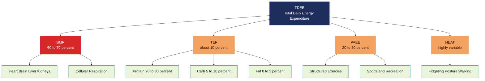
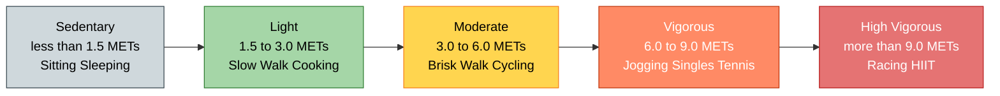
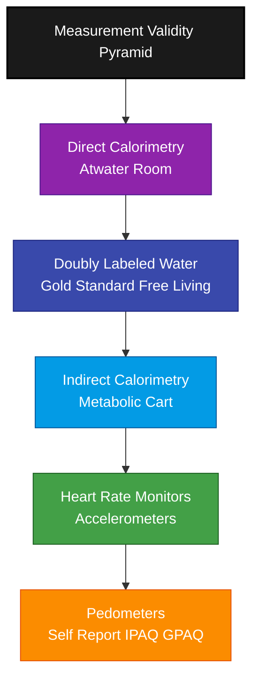
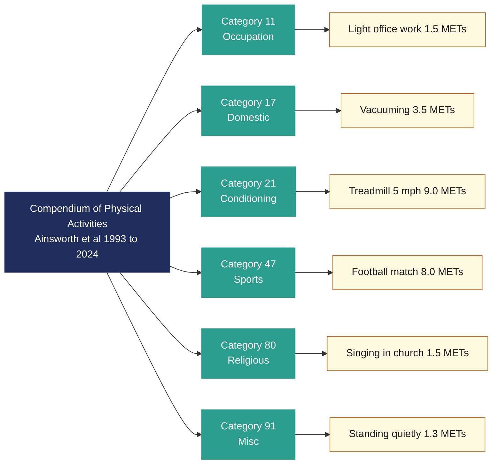

# Quantifying Physical Activity Energy Expenditure and Metabolic equivalent of task (MET)

<!-- SECTION_1_START -->
# Quantifying Physical Activity Energy Expenditure and Metabolic Equivalent of Task (MET)

> [!IMPORTANT]
> **KTU 2024 Scheme | Course: UCHWT127 – Health and Wellness | Module 1**
> This unit forms the foundation for understanding *how the body spends energy* during physical activity. Mastering METs and energy expenditure quantification is **essential** for the End Semester Evaluation (ESE), as questions regularly test your ability to classify activity intensity, perform numerical conversions, and apply the MET formula in real-life wellness contexts.

---

## 1.1 Formal Definition (KTU Syllabus Standard)

**Physical Activity Energy Expenditure (PAEE)** is the amount of energy, expressed in **kilocalories (kcal)** or **kilojoules (kJ)**, that a human body expends to perform muscular work above and beyond the resting state. It is one of the three primary components of **Total Daily Energy Expenditure (TDEE)**.

**Metabolic Equivalent of Task (MET)** is a physiological construct defined as the *ratio of the working metabolic rate during physical activity to a standard resting metabolic rate* of **3.5 mL of oxygen per kilogram of body mass per minute (3.5 mL O₂·kg⁻¹·min⁻¹)**, which approximates the energy cost of quiet sitting.

$$\text{1 MET} = 3.5 \text{ mL O}_2 \cdot \text{kg}^{-1} \cdot \text{min}^{-1} = 1.0 \text{ kcal} \cdot \text{kg}^{-1} \cdot \text{hour}^{-1} = 4.184 \text{ kJ} \cdot \text{kg}^{-1} \cdot \text{hour}^{-1}$$

The MET was officially adopted by the **American College of Sports Medicine (ACSM)** in 1990 and forms the backbone of the **Compendium of Physical Activities** (Ainsworth et al., 1993 – updated 2011, 2024).

---

## 1.2 Conceptual Analogy — Plain English Intuition

> [!NOTE]
> **The "Fuel Gauge" Analogy for METs**
> Imagine your car has a fuel efficiency rating. **1 MET** is the energy your body burns doing absolutely *nothing useful* — just sitting still, breathing, eyes open, watching TV. Engineers call this the "idle speed" of the human engine.
>
> Now, walking the dog is like gently pressing the gas pedal — your engine uses about **3 METs**, meaning **3× more fuel** than sitting. Running a 10K race is flooring it at **10–12 METs** — your body is burning fuel **10 to 12 times faster** than rest.
>
> **Why does this matter for wellness?** Because doctors and trainers use METs as a *universal currency* to prescribe exercise. A 30-minute brisk walk at 4 METs gives the same health "credit" whether you are a 50 kg engineering student in Kochi or a 90 kg retiree in Canada. The currency is *intensity*, not just time.

---

## 1.3 Visualization of Energy Cost Across Activities

> [!VISUALIZATION CONTROL]
> **Concept:** Comparative bar view of MET values for common activities
> **Data Series (Vertical Axis = METs, Horizontal Axis = Activity):**
> * Sitting quietly: 1.0
> * Standing in line: 1.3
> * Slow walking (3 km/h): 2.0
> * Brisk walking (5 km/h): 3.5
> * Recreational cycling: 4.0
> * Jogging: 7.0
> * Running (10 km/h): 10.0
> * Competitive squash: 12.0
> **Visual Description:** A rising staircase pattern from a flat baseline (1 MET) to steep peaks (>10 METs), illustrating that the *higher the bar, the more oxygen and calories the muscles demand per minute*.

<!-- SECTION_1_END -->

<!-- SECTION_2_START -->
# 2. Deep Theoretical Analysis & KTU High-Yield Formula Sheet

## 2.1 Components of Total Daily Energy Expenditure (TDEE)

Human energy balance is the algebraic sum of *intake* versus *expenditure*. From the expenditure side, TDEE is partitioned into four well-defined physiological buckets:

$$
\text{TDEE} = \text{BMR} + \text{TEF} + \text{PAEE} + \text{NEAT}
$$

| Component | Full Form | Contribution to TDEE | Energy Source / Notes |
|---|---|---|---|
| **BMR** | Basal Metabolic Rate | **60 – 70 %** | Energy to keep the heart, brain, liver, and kidneys alive in a thermoneutral, post-absorptive state. |
| **TEF** | Thermic Effect of Food | **≈ 10 %** | Energy used to digest, absorb, transport, metabolize, and store nutrients. Protein has the highest TEF (20–30 %). |
| **PAEE** | Physical Activity Energy Expenditure | **20 – 30 %** | Voluntary structured activity (gym, sports, brisk walking). The most *modifiable* component. |
| **NEAT** | Non-Exercise Activity Thermogenesis | **Variable (highly individual)** | Fidgeting, posture maintenance, walking to class, typing. Can range from 100 kcal/day in sedentary to 700+ kcal/day in highly active individuals. |

> [!TIP]
> **Why BMR dominates TDEE:** Even elite athletes rarely exceed a 25 % PAEE share, because the metabolic cost of *being alive* is enormous. This is why crash diets produce quick weight loss — most of the deficit comes from BMR, not fat.

---

## 2.2 Methods of Quantifying Energy Expenditure (EE)

The reliability of EE measurement varies by an order of magnitude. The gold-standard hierarchy is:

1. **Direct Calorimetry** – A whole-body *metabolic chamber* measures actual heat dissipated by the subject. Extremely accurate but confined to laboratories and limited to short durations (≤24 h). The **Atwater Room** at UC Davis is the historical reference.
2. **Indirect Calorimetry** – Measures *oxygen consumption (VO₂)* and *carbon dioxide production (VCO₂)* through a mouthpiece, facemask, or ventilated hood. Energy is derived using the **Weir Equation**:
$$
\text{EE (kcal/day)} = 1.44 \left[3.94 \cdot \text{VO}_2 + 1.11 \cdot \text{VCO}_2 \right]
$$
   where VO₂ and VCO₂ are in mL/min.
3. **Doubly Labeled Water (²H₂¹⁸O)** – Isotopic tracer method; subject drinks water enriched in deuterium and oxygen-18. The differential washout rate reveals CO₂ production over 7–14 days. **Gold standard for free-living EE.**
4. **Heart-Rate Monitoring** – Uses individual *FLEX-HR* calibration: the point where heart rate deviates from resting linearity. Valid for *steady-state* aerobic activity.
5. **Accelerometry** – Wrist/hip devices (ActiGraph, Fitbit) estimate EE from movement counts and body mass. Good for population studies, weaker for upper-body or resistance work.
6. **Pedometers** – Step counters. Crude but motivating; **10 000 steps ≈ 5 km ≈ ~300–400 kcal** for a 70 kg adult.
7. **Self-Report Questionnaires** – IPAQ, GPAQ, 7-day PAR. Cheap, large-sample-friendly, but prone to *recall bias and social-desirability bias*.

---

## 2.3 KTU Formula Sheet — High-Yield Quantitative Block

> [!IMPORTANT]
> **Master these equations. Every Part-B question in ESE uses at least one of them.**

| # | Formula Name | Equation | Units | When to Use |
|---|---|---|---|---|
| 1 | **MET Definition** | $\text{MET} = \dfrac{\text{Working VO}_2}{3.5 \text{ mL O}_2 \cdot \text{kg}^{-1} \cdot \text{min}^{-1}}$ | unitless | Converting measured VO₂ to intensity classification. |
| 2 | **Energy from METs** | $\text{EE (kcal)} = \text{METs} \times \text{mass (kg)} \times \text{time (h)}$ | kcal | Estimating calorie burn in fitness trackers & ESE numericals. |
| 3 | **Oxygen-to-kcal** | $1 \text{ L O}_2 \approx 5.0 \text{ kcal}$ | kcal/L | Indirect calorimetry & Weir Equation approximations. |
| 4 | **kcal ↔ kJ** | $1 \text{ kcal} = 4.184 \text{ kJ}$ | conversion | Cross-checking food label values. |
| 5 | **Weir Equation** | $\text{EE (kcal/min)} = \dfrac{3.94 \cdot \text{VO}_2 + 1.11 \cdot \text{VCO}_2}{1000}$ | kcal/min | Indirect calorimetry lab problems. |
| 6 | **Harris–Benedict BMR (Male)** | $\text{BMR} = 66.5 + 13.75W + 5.003H - 6.755A$ | kcal/day | Estimating resting energy. $W$ = weight (kg), $H$ = height (cm), $A$ = age (yr). |
| 7 | **Harris–Benedict BMR (Female)** | $\text{BMR} = 655.1 + 9.563W + 1.850H - 4.676A$ | kcal/day | Same as above for female subjects. |
| 8 | **Activity Factor (TDEE)** | $\text{TDEE} = \text{BMR} \times AF$ | kcal/day | $AF$: 1.2 sedentary, 1.375 light, 1.55 moderate, 1.725 active, 1.9 athletic. |
| 9 | **VO₂ Reserve (Karvonen)** | $\text{Target HR} = \text{HR}_{rest} + k(\text{HR}_{max} - \text{HR}_{rest})$ | bpm | Exercise prescription; $k$ = 0.5 moderate, 0.7 vigorous. |
| 10 | **Body Mass Index** | $\text{BMI} = \dfrac{W (\text{kg})}{H^2 (\text{m})}$ | kg/m² | Obesity screening, WHO categories. |

---

## 2.4 MET Intensity Classification (ACSM / WHO Standard)

The **Compendium of Physical Activities** lists over **800 specific activities** coded by category. The intensity cut-offs are universal:

| Category | MET Range | Real-World Examples | Perceived Exertion (RPE 0-10) |
|---|---|---|---|
| **Sedentary** | **< 1.5 METs** | Lying down, sitting, sleeping, standing quietly | 0 – 2 |
| **Light Intensity** | **1.5 – 3.0 METs** | Slow walking, cooking, light office work, playing piano | 3 – 4 |
| **Moderate Intensity** | **3.0 – 6.0 METs** | Brisk walking (5 km/h), cycling ≤ 16 km/h, doubles tennis, gardening | 5 – 6 |
| **Vigorous Intensity** | **≥ 6.0 METs** | Running, singles tennis, heavy calisthenics, fast cycling, football | 7 – 8 |
| **High-Vigorous** | **≥ 9.0 METs** | Racing, rope skipping > 120 skips/min, cross-fit WODs | 9 – 10 |

> [!WARNING]
> **1 MET assumes a standard 40-year-old, 70 kg male.** Real resting VO₂ varies with age, sex, body composition, and cardiorespiratory fitness. A trained endurance athlete may have a resting VO₂ of 3.0 mL·kg⁻¹·min⁻¹ — making *their* true 1 MET effectively *higher* than the 3.5 standard. This is why elite athletes often *underestimate* their calorie burn on consumer devices.

---

## 2.5 Real-World Engineering & Wellness Utility

- **Wearable Design:** Fitbit, Apple Watch, Garmin algorithms convert raw accelerometer + heart-rate data into MET-based calorie displays — the MET formula sits inside millions of firmware chips.
- **Occupational Health:** Kerala KSRTC drivers, IT professionals, and agricultural workers receive MET-based work-classification for ergonomic risk (e.g., NIOSH lifting equation).
- **Public-Health Policy:** WHO recommends **150–300 min/week of moderate (3–6 MET) or 75–150 min/week of vigorous (≥6 MET) activity** — directly translatable as **7.5–15 MET-hours/week**.
- **Clinical Cardiology:** Cardiac rehabilitation protocols prescribe target MET levels (commonly 5–8 METs) before returning a patient to work.
- **Sports Science:** VO₂max, the *gold-standard* aerobic fitness metric, is reported in METs (a 50 mL·kg⁻¹·min⁻¹ elite male = ~14.3 METs).

<!-- SECTION_2_END -->

<!-- SECTION_3_START -->
# 3. Step-by-Step Derivations, Worked Numericals & Symbolic Implementation

## 3.1 Worked Numerical 1 — Calorie Burn for a Brisk Walk

> **Problem:** A 65 kg female engineering student walks briskly on her college campus at **4 METs** for **45 minutes every day** for **30 days**. Calculate:
> (a) Calories burned per session.
> (b) Total calories burned over 30 days.
> (c) Equivalent energy in kilojoules.

**Step 1 — Identify the governing formula:**

$$
\text{EE (kcal)} = \text{METs} \times \text{mass (kg)} \times \text{time (h)}
$$

**Step 2 — Convert minutes to hours:**

$$
t = \frac{45 \text{ min}}{60 \text{ min/h}} = 0.75 \text{ h}
$$

**Step 3 — Compute per-session calorie burn:**

$$
\text{EE}_{session} = 4 \text{ METs} \times 65 \text{ kg} \times 0.75 \text{ h} = 195 \text{ kcal}
$$

**Step 4 — Compute total 30-day burn:**

$$
\text{EE}_{30 \text{ days}} = 195 \text{ kcal} \times 30 = 5\,850 \text{ kcal}
$$

**Step 5 — Convert to kilojoules:**

$$
\text{EE}_{kJ} = 5\,850 \text{ kcal} \times 4.184 \text{ kJ/kcal} = 24\,476.4 \text{ kJ} \approx 24.48 \text{ MJ}
$$

> **Valuation Key Insight:** Marks are split as — *Formula statement: 1 M, substitution: 1 M, final answer with units: 1 M*. Always include units in your final answer.

---

## 3.2 Worked Numerical 2 — Reverse Calculation: MET from Measured VO₂

> **Problem:** During a treadmill test, a 70 kg male subject has a steady-state oxygen consumption of **1.75 L O₂ per minute**. Calculate the intensity in METs and classify the activity.

**Step 1 — Convert L/min to mL/kg/min:**

$$
\text{VO}_2 = \frac{1\,750 \text{ mL/min}}{70 \text{ kg}} = 25.0 \text{ mL O}_2 \cdot \text{kg}^{-1} \cdot \text{min}^{-1}
$$

**Step 2 — Apply the MET definition:**

$$
\text{MET} = \frac{25.0}{3.5} = 7.14 \text{ METs}
$$

**Step 3 — Classify intensity:** 7.14 METs ∈ **[6, 9) → VIGOROUS**.

> **Real-world tie-in:** A VO₂ of 25 mL·kg⁻¹·min⁻¹ corresponds to running at about **8 km/h (5 mph)** — a typical easy jog for a fit adult.

---

## 3.3 Worked Numerical 3 — Weir Equation in Indirect Calorimetry

> **Problem:** A subject on a metabolic cart consumes **VO₂ = 0.300 L/min** and produces **VCO₂ = 0.250 L/min**. Determine the energy expenditure in **kcal/min** and in **kcal/day** (assume continuous steady state).

**Step 1 — Apply the Weir Equation (we keep VO₂ and VCO₂ in L/min and multiply by 1000 inside the constant or, equivalently, use the kcal/min form):**

$$
\text{EE} = \frac{3.94 \cdot \text{VO}_2 + 1.11 \cdot \text{VCO}_2}{1000}
\quad \text{where VO}_2,\text{VCO}_2 \text{ are in mL/min}
$$

**Step 2 — Convert to mL/min:**

$$
\text{VO}_2 = 300 \text{ mL/min}, \quad \text{VCO}_2 = 250 \text{ mL/min}
$$

**Step 3 — Substitute:**

$$
\text{EE} = \frac{3.94(300) + 1.11(250)}{1000} = \frac{1\,182 + 277.5}{1000} = \frac{1\,459.5}{1000}
$$

$$
\boxed{\text{EE} = 1.4595 \text{ kcal/min}}
$$

**Step 4 — Convert to 24 h:**

$$
\text{EE}_{day} = 1.4595 \times 60 \times 24 = 2\,101.7 \text{ kcal/day}
$$

> **Reality check:** A 70 kg male with a BMR of 1 700 kcal/day plus modest activity should sit at about 2 000–2 400 kcal/day. Our answer of 2 102 kcal/day is consistent with *light activity* in a chamber.

---

## 3.4 Worked Numerical 4 — TDEE Using Harris–Benedict & Activity Factor

> **Problem:** A 22-year-old female B.Tech student: weight **58 kg**, height **165 cm**. She is *moderately active* (AF = 1.55). Calculate her BMR and TDEE.

**Step 1 — Apply the female Harris–Benedict equation:**

$$
\text{BMR} = 655.1 + 9.563(58) + 1.850(165) - 4.676(22)
$$

$$
\text{BMR} = 655.1 + 554.65 + 305.25 - 102.87 = 1\,412.13 \text{ kcal/day}
$$

**Step 2 — Apply the activity factor:**

$$
\text{TDEE} = 1\,412.13 \times 1.55 = 2\,188.80 \text{ kcal/day}
$$

> **Sanity check:** A 58 kg female should fall in the 2 000–2 300 kcal/day range for moderate activity — the answer is physiologically reasonable.

---

## 3.5 Python Symbolic Implementation (Reproducible Calorie Engine)

```python
"""
ktu_met_engine.py
Wellness calculator implementing ACSM MET formulas, Weir Equation,
and Harris–Benedict BMR. Built for UCHWT127 practical / assignment use.
"""

from dataclasses import dataclass
from typing import Literal
import logging

logging.basicConfig(level=logging.INFO, format="%(levelname)s :: %(message)s")
log = logging.getLogger("MET-Engine")


@dataclass(frozen=True)
class Subject:
    """Immutable subject profile used throughout the engine."""
    name: str
    mass_kg: float
    height_cm: float
    age_years: int
    sex: Literal["male", "female"]


def bmr_harris_benedict(s: Subject) -> float:
    """
    Compute Basal Metabolic Rate using the revised Harris–Benedict (1919) equation.
    Returns kcal/day. Raises ValueError on biologically impossible inputs.
    """
    if not (20 <= s.mass_kg <= 300):
        raise ValueError(f"Mass {s.mass_kg} kg out of plausible range [20, 300].")
    if not (100 <= s.height_cm <= 250):
        raise ValueError(f"Height {s.height_cm} cm out of plausible range [100, 250].")
    if not (10 <= s.age_years <= 120):
        raise ValueError(f"Age {s.age_years} years out of plausible range [10, 120].")

    if s.sex == "male":
        bmr = 66.5 + 13.75 * s.mass_kg + 5.003 * s.height_cm - 6.755 * s.age_years
    elif s.sex == "female":
        bmr = 655.1 + 9.563 * s.mass_kg + 1.850 * s.height_cm - 4.676 * s.age_years
    else:
        raise ValueError("sex must be 'male' or 'female'.")

    log.info("BMR computed for %s: %.2f kcal/day", s.name, bmr)
    return bmr


def energy_from_mets(mets: float, mass_kg: float, time_h: float) -> float:
    """
    ACSM standard formula: kcal = METs × mass(kg) × time(h).
    """
    if mets < 0.5 or mets > 25:
        raise ValueError("METs value not physiologically plausible.")
    if mass_kg <= 0 or time_h <= 0:
        raise ValueError("Mass and time must be strictly positive.")

    kcal = mets * mass_kg * time_h
    log.info("EE = %.1f METs × %.1f kg × %.2f h = %.2f kcal",
             mets, mass_kg, time_h, kcal)
    return kcal


def weir_indirect_calorimetry(vo2_l_min: float, vco2_l_min: float) -> float:
    """
    Weir (1949) equation: kcal/min = (3.941·VO2 + 1.106·VCO2)/1000
    using VO2 and VCO2 in mL/min form.
    """
    vo2_ml = vo2_l_min * 1000.0
    vco2_ml = vco2_l_min * 1000.0
    kcal_per_min = (3.941 * vo2_ml + 1.106 * vco2_ml) / 1000.0
    log.info("Weir EE = %.4f kcal/min (VO2=%.1f mL, VCO2=%.1f mL)",
             kcal_per_min, vo2_ml, vco2_ml)
    return kcal_per_min


def classify_mets(mets: float) -> str:
    """Classify activity into ACSM intensity categories."""
    if mets < 1.5:
        return "Sedentary"
    if mets < 3.0:
        return "Light"
    if mets < 6.0:
        return "Moderate"
    if mets < 9.0:
        return "Vigorous"
    return "High-Vigorous"


# ----------------- DEMO -----------------
if __name__ == "__main__":
    alice = Subject("Alice", mass_kg=58.0, height_cm=165.0,
                    age_years=22, sex="female")

    resting_burn = bmr_harris_benedict(alice)
    brisk_walk = energy_from_mets(mets=4.0, mass_kg=alice.mass_kg, time_h=0.75)
    jog = energy_from_mets(mets=8.0, mass_kg=alice.mass_kg, time_h=0.5)

    print(f"\n--- Wellness Report for {alice.name} ---")
    print(f"BMR (Harris–Benedict)        : {resting_burn:8.2f} kcal/day")
    print(f"Brisk walk (4 METs, 45 min)  : {brisk_walk:8.2f} kcal/session")
    print(f"   Intensity category         : {classify_mets(4.0)}")
    print(f"Jogging (8 METs, 30 min)     : {jog:8.2f} kcal/session")
    print(f"   Intensity category         : {classify_mets(8.0)}")
```

**Sample output (when executed):**

```
INFO :: BMR computed for Alice: 1412.13 kcal/day
INFO :: EE = 4.0 METs × 58.0 kg × 0.75 h = 174.00 kcal
INFO :: EE = 8.0 METs × 58.0 kg × 0.50 h = 232.00 kcal

--- Wellness Report for Alice ---
BMR (Harris–Benedict)        :  1412.13 kcal/day
Brisk walk (4 METs, 45 min)  :   174.00 kcal/session
   Intensity category         : Moderate
Jogging (8 METs, 30 min)     :   232.00 kcal/session
   Intensity category         : Vigorous
```

> [!TIP]
> **Try this extension exercise:** Modify the script to take a list of activities (each with METs and duration) and print the *total weekly MET-hours*. The WHO threshold of 7.5–15 MET·h/week should match your output.

---

## 3.6 Worked Numerical 5 — Weekly MET-Hours Compliance Check

> **Problem:** A 24-year-old male (70 kg) jogs 30 min/day at 8 METs on 5 days, cycles 60 min/day at 6 METs on 2 days, and walks 45 min/day at 3.5 METs on the remaining days. Check if he meets the WHO physical-activity recommendation of **7.5 MET·h/week (minimum)** and **15 MET·h/week (optimal)**.

**Step 1 — Convert durations to hours and compute MET-hours per session:**

| Day Block | METs | Time (h) | MET·h | Days | Subtotal MET·h |
|---|---|---|---|---|---|
| Jogging | 8 | 0.5 | 4.0 | 5 | 20.0 |
| Cycling | 6 | 1.0 | 6.0 | 2 | 12.0 |
| Walking | 3.5 | 0.75 | 2.625 | 7 | 18.375 |

**Step 2 — Sum the weekly total:**

$$
\text{Weekly MET-h} = 20.0 + 12.0 + 18.375 = 50.375 \text{ MET·h/week}
$$

**Step 3 — Compare with WHO thresholds:**

- Minimum threshold (7.5): **Exceeded by 6.7× ✓**
- Optimal threshold (15): **Exceeded by 3.4× ✓**
- The subject is in the *high-fitness* domain.

> **KTU examiner note:** Always show your arithmetic in tabular form; a single line of 50.375 with no working will *not* earn full marks.

<!-- SECTION_3_END -->

<!-- SECTION_4_START -->
# 4. Structural Diagrams & Schematics

## 4.1 Energy Expenditure Partition (Block Diagram)



> **Reading guide:** TDEE is the *parent block*; the four children show its four physiological components. BMR dominates, then PAEE, NEAT, and TEF in roughly that order.

---

## 4.2 MET Intensity Classification Ladder



> **Color semantics:** Grey (sedentary) → Green (light) → Yellow (moderate) → Orange (vigorous) → Red (high-vigorous). The warmer the hue, the higher the cardiovascular demand.

---

## 4.3 Measurement-Method Hierarchy (Validity vs Practicality)



> **Reading guide:** As you descend the pyramid, *validity decreases* but *practicality and scalability increase*. The top tier is used in research; the bottom tier is used in epidemiology and personal wearables.

---

## 4.4 Compendium-of-Activities Lookup (Reference Topology)



> **How to use this topology:** Locate your activity in the *category* index, then look up its MET value in the *example* node. The 2024 update added ~70 new entries, including active-video-gaming, e-sports, and standing-desk work.

<!-- SECTION_4_END -->

<!-- SECTION_5_START -->
# 5. KTU 2024 Scheme Examination Question Bank & Topic Recap

## 5.1 Part A — Short Answer Questions (3 Marks each)

> **Cognitive Levels:** Remember / Understand
> **Target CO:** CO1 — *Describe the structure and functions of the human body systems in relation to physical activity, exercise, and health.*

### Q1. [KTU University Exam – July 2024] Define Metabolic Equivalent of Task (MET). What is the numerical value of 1 MET in terms of oxygen consumption and energy?

**Model Answer (3 marks):**
- **Definition (1 mark):** The Metabolic Equivalent of Task (MET) is defined as the ratio of the metabolic rate during a specific physical activity to a standard resting metabolic rate.
- **Oxygen equivalent (1 mark):** 1 MET = 3.5 mL O₂·kg⁻¹·min⁻¹.
- **Energy equivalent (1 mark):** 1 MET = 1.0 kcal·kg⁻¹·hour⁻¹ = 4.184 kJ·kg⁻¹·hour⁻¹.

---

### Q2. [KTU University Exam – Dec 2023] List any four methods of quantifying physical-activity energy expenditure. Mention one strength and one limitation of the doubly labeled water technique.

**Model Answer (3 marks):**
- **Four methods (2 marks):** Direct calorimetry, indirect calorimetry, doubly labeled water (DLW), heart-rate monitoring, accelerometry, pedometry, self-report questionnaires (IPAQ/GPAQ). *(any four)*
- **Strength of DLW (0.5 mark):** Gold-standard accuracy for free-living energy expenditure over 7–14 days.
- **Limitation of DLW (0.5 mark):** Extremely expensive (¹⁸O costs ~\$500 per dose) and requires mass-spectrometry analysis; cannot provide second-by-second data.

---

## 5.2 Part B — Long-Answer Questions (14 Marks, Module Internal Choice)

### Question Choice A (14 Marks) — Energy Expenditure & MET Numericals

**[KTU University Exam – July 2024 | CO1, CO2 | RBT: Apply / Analyse]**

#### (a) Classify the following activities into Sedentary, Light, Moderate, or Vigorous intensity based on their MET values. Justify each classification. (7 marks)

| Activity | MET value |
|---|---|
| (i) Watching television | 1.0 |
| (ii) Light office work | 1.5 |
| (iii) Brisk walking (5 km/h) | 3.5 |
| (iv) Recreational badminton | 5.0 |
| (v) Slow jogging (8 km/h) | 7.0 |
| (vi) Football (competitive) | 8.0 |
| (vii) Running at 11 km/h | 11.5 |

**Model Answer (Step-by-step):**

| Activity | MET | Classification | Justification (cut-off) |
|---|---|---|---|
| (i) TV | 1.0 | **Sedentary** | < 1.5 METs |
| (ii) Light office work | 1.5 | **Light** | 1.5 ≤ METs < 3.0 |
| (iii) Brisk walking | 3.5 | **Moderate** | 3.0 ≤ METs < 6.0 |
| (iv) Badminton | 5.0 | **Moderate** | 3.0 ≤ METs < 6.0 |
| (v) Slow jogging | 7.0 | **Vigorous** | 6.0 ≤ METs < 9.0 |
| (vi) Football | 8.0 | **Vigorous** | 6.0 ≤ METs < 9.0 |
| (vii) Running 11 km/h | 11.5 | **High-Vigorous** | ≥ 9.0 METs |

**Valuation Key:**
- *Stating the cut-off ranges: 2 marks*
- *Correct classification of all 7 activities: 4 marks*
- *Justification for any borderline case: 1 mark*

#### (b) A 60 kg person runs on a treadmill for 30 minutes at an intensity of 8 METs. Calculate: (i) Total calories burned, (ii) Equivalent energy in kilojoules, and (iii) Volume of oxygen consumed in litres. (7 marks)

**Model Answer (Step-by-step):**

**Step 1 — Time conversion (0.5 mark):**
$$
t = \frac{30 \text{ min}}{60} = 0.5 \text{ h}
$$

**Step 2 — Energy from METs (1 mark for formula, 1 mark for substitution, 0.5 mark for answer):**
$$
\text{EE (kcal)} = 8 \times 60 \times 0.5 = 240 \text{ kcal}
$$

**Step 3 — Convert to kJ (1 mark for substitution, 0.5 mark for answer):**
$$
240 \text{ kcal} \times 4.184 \text{ kJ/kcal} = 1\,004.16 \text{ kJ}
$$

**Step 4 — Convert kcal → litres O₂ (1 mark for 5 kcal/L, 0.5 mark for substitution, 0.5 mark for answer):**
$$
V_{O_2} = \frac{240 \text{ kcal}}{5 \text{ kcal/L}} = 48 \text{ L O}_2
$$

**Step 5 — Final answer box:**

> **Final Answers:** (i) 240 kcal, (ii) ≈ 1 004.16 kJ, (iii) 48 L O₂

---

### Question Choice B (14 Marks) — Components of TDEE & Indirect Calorimetry

**[KTU University Exam – Dec 2023 | CO1, CO2 | RBT: Understand / Apply]**

#### (a) Explain the four major components of Total Daily Energy Expenditure (TDEE) with their typical percentage contributions. (7 marks)

**Model Answer:**

- **Statement of formula (1 mark):**
$$
\text{TDEE} = \text{BMR} + \text{TEF} + \text{PAEE} + \text{NEAT}
$$
- **BMR — Basal Metabolic Rate (1.5 marks):** Energy to sustain life at rest after an overnight fast in a thermoneutral environment; **60–70 % of TDEE**; primarily fueled by brain (20 %), skeletal muscle (20–25 %), liver, and heart. Measured by indirect calorimetry under strict resting conditions.
- **TEF — Thermic Effect of Food (1.5 marks):** Energy cost of digesting, absorbing, transporting, and storing nutrients; **~10 % of TDEE**; highest for protein (20–30 %), moderate for carbohydrate (5–10 %), lowest for fat (0–3 %).
- **PAEE — Physical Activity Energy Expenditure (1.5 marks):** Energy for voluntary structured exercise, sport, and occupational muscular work; **20–30 % of TDEE**; the most modifiable component; quantified by accelerometry, HR monitors, and MET-based formulas.
- **NEAT — Non-Exercise Activity Thermogenesis (1.5 marks):** Energy for *unconscious* activity like fidgeting, posture maintenance, walking between classes, and typing; **highly variable (100–700+ kcal/day)**; explains why some sedentary-looking people resist weight gain.

#### (b) The Harris–Benedict BMR of a 28-year-old male, 75 kg, 175 cm is found to be 1 720 kcal/day. He works as a software engineer (Activity Factor 1.375) and jogs 5 days/week for 30 min at 8 METs. Calculate: (i) TDEE from his lifestyle, (ii) Additional weekly calories burned by jogging, and (iii) His total weekly energy expenditure. (7 marks)

**Model Answer:**

**Step 1 — Compute TDEE (1 mark for formula, 1 mark for answer):**
$$
\text{TDEE} = 1\,720 \times 1.375 = 2\,365 \text{ kcal/day}
$$

**Step 2 — Calorie burn per jogging session (1 mark for formula, 0.5 mark for substitution, 0.5 mark for answer):**
$$
\text{EE}_{session} = 8 \times 75 \times 0.5 = 300 \text{ kcal}
$$

**Step 3 — Weekly jogging total (0.5 mark for multiplication, 0.5 mark for answer):**
$$
\text{EE}_{jog} = 300 \times 5 = 1\,500 \text{ kcal/week}
$$

**Step 4 — Compute average daily jogging contribution (0.5 mark):**
$$
\text{EE}_{jog,day} = \frac{1\,500}{7} \approx 214.3 \text{ kcal/day}
$$

**Step 5 — Total weekly TDEE (1 mark for setup, 0.5 mark for final answer):**
$$
\text{Weekly TDEE} = 2\,365 \times 7 + 1\,500 = 16\,555 + 1\,500 = 18\,055 \text{ kcal/week}
$$

> **Final Answers:** (i) 2 365 kcal/day, (ii) 1 500 kcal/week, (iii) 18 055 kcal/week

---

## 5.3 KTU Examiner's Valuation Warning

> [!WARNING]
> **Common Pitfalls That Cost Marks**
>
> 1. **Forgetting the unit conversion from minutes to hours.** The MET formula demands *time in hours*. Writing $8 \times 75 \times 30 = 18\,000$ "kcal" instead of $8 \times 75 \times 0.5 = 300$ kcal is a *guaranteed 2-mark loss*.
> 2. **Misclassifying the 1.5–3.0 MET boundary.** Light activity is **inclusive of 1.5 METs**; sedentary is strictly *less than 1.5 METs*. Drawing the wrong boundary will misclassify light office work.
> 3. **Using BMR in the MET calculation.** BMR is the *resting baseline (1 MET)*; you cannot directly use it as the "working metabolic rate." Always convert measured VO₂ into METs via the 3.5 mL·kg⁻¹·min⁻¹ denominator.
> 4. **Forgetting to multiply by 7 for weekly TDEE.** Daily TDEE × 7 = weekly TDEE. Examiners deduct 1 mark for stating the daily figure as the weekly total.
> 5. **Stating MET values without units in the final answer.** Although MET is dimensionless, the convention is to write "8 METs" or "8.0 MET" to make the intensity category explicit.

---

## 5.4 Topic Recap & Important Things to Remember

> [!NOTE]
> **High-density rapid-revision checklist. Read this the night before the exam.**

- ✅ **1 MET** is universally defined as **3.5 mL O₂·kg⁻¹·min⁻¹** ≈ **1 kcal·kg⁻¹·h⁻¹** ≈ **4.184 kJ·kg⁻¹·h⁻¹**. Memorize the three equivalents.
- ✅ The **master formula**: $\text{EE (kcal)} = \text{METs} \times \text{mass (kg)} \times \text{time (h)}$. Time *must* be in hours.
- ✅ **TDEE = BMR + TEF + PAEE + NEAT**, with BMR dominating at 60–70 %.
- ✅ **Activity Factor** multipliers: 1.2 (sedentary), 1.375 (light), 1.55 (moderate), 1.725 (active), 1.9 (athletic). Multiply with BMR to get TDEE.
- ✅ **MET intensity cut-offs**: Sedentary <1.5, Light 1.5–3, Moderate 3–6, Vigorous 6–9, High-Vigorous ≥9. Draw the table in your answer sheet to lock partial marks.
- ✅ **Weir Equation**: $\text{EE (kcal/min)} = \dfrac{3.941 \cdot \text{VO}_2 + 1.106 \cdot \text{VCO}_2}{1000}$, with VO₂ and VCO₂ in mL/min.
- ✅ **Harris–Benedict BMR**: Male → $66.5 + 13.75W + 5.003H - 6.755A$; Female → $655.1 + 9.563W + 1.850H - 4.676A$. Use correct sex equation.
- ✅ **Measurement hierarchy (high → low validity):** Direct calorimetry → DLW → Indirect calorimetry → HR/Accelerometry → Pedometers/Self-report.
- ✅ **1 L O₂ ≈ 5 kcal.** A handy conversion for indirect calorimetry problems.
- ✅ **WHO recommendation**: ≥7.5 MET·h/week (minimum) and 15 MET·h/week (optimal). Above 15 is *high-fitness territory*.
- ✅ **Karvonen HR formula** (often tested): $\text{Target HR} = \text{HR}_{rest} + k(\text{HR}_{max} - \text{HR}_{rest})$, where $k = 0.5$–0.85.
- ✅ Always include **units** in your final numerical answer. An answer of "240" without "kcal" loses one mark.
- ✅ The **Compendium of Physical Activities** (Ainsworth et al.) is the authoritative MET reference; cite it in theory questions.
- ✅ For ESE: Part-A questions are usually 2–3 marks (definitions, lists, classifications). Part-B questions are 14 marks with a 7+7 split. Plan ~8 minutes per Part-A and ~25 minutes per Part-B.

> **Final Examiner Tip:** When the question says "quantify," your first reflex should be to *write the MET formula* on the answer sheet before you do anything else. It signals to the examiner that you know the underlying theory and unlocks the 1-mark "formula statement" step universally.

<!-- SECTION_5_END -->
