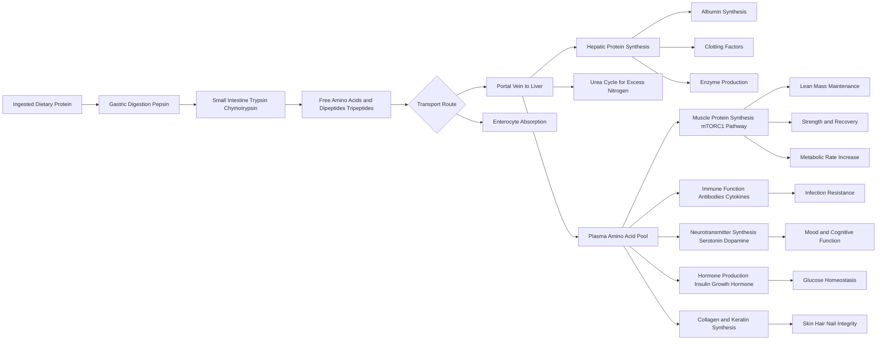
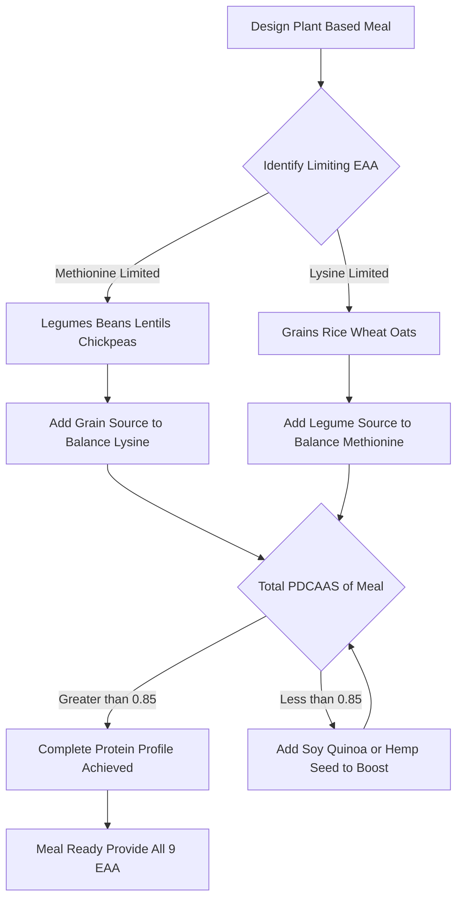

# Animal & Plant - based Proteins and their Effects on Human Health

<!-- SECTION_1_START -->
# Animal & Plant-Based Proteins and Their Effects on Human Health

## 1.1 Formal Academic Definition

> [!NOTE]
> **Proteins** are complex macromolecules composed of **carbon (C)**, **hydrogen (H)**, **oxygen (O)**, **nitrogen (N)**, and sometimes **sulfur (S)**. They are polymers of **20 standard L-α-amino acids** linked together by **peptide bonds** formed via **dehydration synthesis (condensation reaction)**.

In the context of **KTU 2024 Scheme (Module 2: Concept of Health and Wellness)**, dietary proteins are classified based on their **biological origin** into two primary categories:

- **Animal-Based Proteins (ABP):** Derived from animal tissue sources such as meat, fish, poultry, eggs, and dairy.
- **Plant-Based Proteins (PBP):** Derived from botanical sources such as legumes, soy, nuts, seeds, and whole grains.

> [!IMPORTANT]
> **Syllabus Highlight:** The fundamental distinction between ABP and PBP is the **amino acid profile, bioavailability, digestibility, and accompanying nutrient matrix (fats, fiber, micronutrients)**. This biological difference is the root cause of all downstream metabolic and clinical health outcomes.

## 1.2 The 20 Standard Amino Acids

Proteins are constructed from **20 standard amino acids**, classified into three physiological categories:

| Category | Count | Description |
|----------|-------|-------------|
| **Essential Amino Acids (EAA)** | 9 | Cannot be synthesized by the human body; must be obtained from diet |
| **Conditionally Essential** | 6 | Synthesized normally, but require dietary intake under physiological stress (illness, trauma) |
| **Non-Essential Amino Acids (NEAA)** | 5 | Synthesized endogenously from metabolic intermediates |

The **9 Essential Amino Acids (EAA)** are:

$$\text{EAA} = \{\,\text{Histidine, Isoleucine, Leucine, Lysine, Methionine, Phenylalanine, Threonine, Tryptophan, Valine}\,\}$$

## 1.3 Conceptual Analogy & Intuitive Overview

> [!TIP]
> **Analogy: The Lego Block Constructor**
> 
> Imagine you are building a complex house (your body) using Lego bricks (amino acids).
> - **Animal proteins** are like **pre-packaged Lego kits**. Every brick you need is already in the box in the correct ratio. You can start building immediately.
> - **Plant proteins** are like a **bulk bag of mixed bricks**. You have the pieces, but you need to carefully select and combine the right types (e.g., legumes + grains) to complete the structure. It requires planning, but the bulk bag also comes with bonus materials like **fiber, antioxidants, and phytonutrients** that the Lego kit lacks.
> 
> The "house" built by both will look the same, but the *journey of building* and the *long-term maintenance costs* will differ.

### 1.4 Bioavailability Intuition

> [!IMPORTANT]
> **Bioavailability** is the proportion of a nutrient that is **digested, absorbed, and metabolized** through normal bodily pathways. Animal proteins typically score **$90\text{–}95\%$** bioavailability, while most plant proteins range from **$60\text{–}80\%$** due to **anti-nutritional factors** like phytates, lectins, and tannins.

> [!VISUALIZATION CONTROL]
> **Concept:** Protein Digestibility Curve — ABP vs PBP
> **GeoGebra / Desmos Input Equations:**
> * `f_ABP(x) = 0.95 * (1 - e^(-1.2 * x))` (animal protein cumulative absorption)
> * `f_PBP(x) = 0.75 * (1 - e^(-0.8 * x))` (plant protein cumulative absorption)
> * `g_combo(x) = 0.88 * (1 - e^(-1.0 * x))` (complementary blend)
> 
> **Visual Description:** The ABP curve (red) rises steeply and plateaus near **$0.95$** by $x = 5$ hours. The PBP curve (green) rises gradually, plateauing near **$0.75$** by $x = 8$ hours. The complementary blend (blue) shows a synergistic effect, sitting between the two curves.

<!-- SECTION_1_END -->

<!-- SECTION_2_START -->
# Deep Theoretical Analysis & KTU High-Yield Formula Sheet

## 2.1 Protein Quality Assessment Metrics

The nutritional superiority of proteins is quantified using four standardized metrics approved by the **Food and Agriculture Organization (FAO)** and the **World Health Organization (WHO)**.

### 2.1.1 Biological Value (BV)

**Biological Value (BV)** measures the proportion of **absorbed protein** that is retained (not catabolized) for bodily use.

$$\text{BV} = \frac{\text{Nitrogen Retained}}{\text{Nitrogen Absorbed}} \times 100$$

### 2.1.2 Protein Efficiency Ratio (PER)

$$\text{PER} = \frac{\text{Weight Gain (g)}}{\text{Protein Intake (g)}}$$

### 2.1.3 Net Protein Utilization (NPU)

$$\text{NPU} = \frac{\text{Nitrogen Retained}}{\text{Nitrogen Intake}} \times 100$$

### 2.1.4 Protein Digestibility-Corrected Amino Acid Score (PDCAAS)

> [!IMPORTANT]
> **PDCAAS is the gold standard** recognized by the **U.S. FDA** and adopted globally for human protein evaluation. It is truncated at **$1.00$ (100%)** because human requirements cannot exceed 100%.

$$\text{PDCAAS} = \min\left(\frac{\text{mg of limiting EAA in 1g test protein}}{\text{mg of same EAA in 1g reference pattern}}\right) \times \text{True Digestibility}$$

### 2.1.5 Digestible Indispensable Amino Acid Score (DIAAS)

> [!NOTE]
> **DIAAS is the newer FAO-endorsed metric (2013)** that measures digestibility at the **end of the small intestine (ileum)** rather than over the entire digestive tract, providing a more accurate physiological assessment. Unlike PDCAAS, DIAAS has **no upper truncation limit**.

$$\text{DIAAS}\,\% = 100 \times \frac{\text{mg of digestible dietary indispensable EAA in 1g protein}}{\text{mg of same EAA in 1g same-age reference protein}}$$

## 2.2 Complete vs Incomplete Proteins

| Parameter | Complete Proteins | Incomplete Proteins |
|-----------|-------------------|---------------------|
| **Definition** | Contain all 9 EAA in adequate proportions | Lack or are low in one or more EAA |
| **Typical Source** | Animal-based (meat, fish, eggs, dairy, quinoa) | Most plant-based (legumes, grains, nuts) |
| **Limiting Amino Acid** | None | Variable (e.g., Lysine in grains, Methionine in legumes) |
| **PDCAAS Range** | 0.90 – 1.00 | 0.40 – 0.70 |
| **Daily Requirement Met** | Yes (single source sufficient) | Requires **complementary protein** combinations |

## 2.3 KTU High-Yield Formula Sheet

> [!IMPORTANT]
> **Save this table for the KTU University Exam — these are the most-tested formulas in Module 2.**

| Formula / Concept | Mathematical Expression | Standard Units | Engineering / Health Application |
|-------------------|-------------------------|----------------|----------------------------------|
| Recommended Dietary Allowance (RDA) | $\text{RDA}_{\text{adult}} = 0.8 \times \text{Body Weight (kg)}$ | grams (g) | Baseline protein intake for healthy adults |
| Nitrogen Balance | $N_{\text{balance}} = N_{\text{intake}} - N_{\text{excretion}}$ | grams (g) | Determines anabolic vs catabolic state |
| Protein Caloric Content | $E = 4.0 \times m_{\text{protein}}$ | kilocalories (kcal) | Diet planning, caloric calculations |
| BV Formula | $\text{BV} = \frac{N_{\text{retained}}}{N_{\text{absorbed}}} \times 100$ | percentage ($\%$) | Protein quality assessment |
| PDCAAS Formula | $\text{PDCAAS} = \min(\text{AAS}) \times \text{TD}$ | unitless (0–1) | FDA-recognized quality metric |
| Athlete Protein Need | $\text{Endurance} = 1.2 \text{ to } 1.4 \text{ g/kg}$ | grams per kg (g/kg) | Sports nutrition |
| Strength Athlete | $\text{Strength} = 1.6 \text{ to } 2.2 \text{ g/kg}$ | grams per kg (g/kg) | Muscle protein synthesis |
| Kidney Patient Limit | $\text{CKD Stage 3-5} = 0.6 \text{ to } 0.8 \text{ g/kg}$ | grams per kg (g/kg) | Renal diet therapy |

## 2.4 Animal-Based Protein Sources: Detailed Profile

| Source | Serving (100g) | Protein (g) | EAA Profile | Key Micronutrients | Health Concerns |
|--------|----------------|-------------|-------------|---------------------|------------------|
| **Chicken Breast** | 100 g | $\sim 31.0$ | Complete | Niacin, B6, Phosphorus | Low risk; skin increases saturated fat |
| **Salmon (Atlantic)** | 100 g | $\sim 20.4$ | Complete | Omega-3, Vitamin D, B12 | Methylmercury in large predatory fish |
| **Egg (Whole)** | 100 g | $\sim 12.6$ | Complete (Gold Standard) | Choline, B12, Selenium, Lutein | Cholesterol ($186\text{ mg/egg}$) |
| **Greek Yogurt (Low-fat)** | 100 g | $\sim 10.0$ | Complete | Calcium, Probiotics, B2 | Lactose intolerance |
| **Whey Protein Isolate** | 30 g (1 scoop) | $\sim 25.0$ | Complete (Highest BV = 104) | BCAA-rich, Lactoferrin | Lactose sensitivity |
| **Lean Beef (Sirloin)** | 100 g | $\sim 26.0$ | Complete | Heme Iron, Zinc, B12 | Saturated fat, processed forms carcinogenic |

## 2.5 Plant-Based Protein Sources: Detailed Profile

| Source | Serving (100g) | Protein (g) | Limiting EAA | Key Micronutrients | Health Concerns |
|--------|----------------|-------------|--------------|---------------------|------------------|
| **Tofu (Firm)** | 100 g | $\sim 17.3$ | None (Complete) | Iron, Calcium (if set with $CaSO_4$) | Soy allergenicity |
| **Tempeh** | 100 g | $\sim 19.0$ | None (Complete) | Probiotics, Fiber, Manganese | Fermentation taste |
| **Lentils (Cooked)** | 100 g | $\sim 9.0$ | Methionine | Folate, Iron, Fiber | Phytates, Lectins |
| **Chickpeas (Cooked)** | 100 g | $\sim 8.9$ | Methionine | Manganese, Folate, Fiber | Phytic acid |
| **Quinoa (Cooked)** | 100 g | $\sim 4.4$ | None (Complete) | Magnesium, Iron, Manganese | Saponins (bitter coating) |
| **Hemp Seeds** | 30 g (3 tbsp) | $\sim 9.5$ | Lysine (mild) | Omega-3 ALA, Magnesium | Oxalates |
| **Peanut Butter** | 32 g (2 tbsp) | $\sim 8.0$ | Lysine | Niacin, Vitamin E, Resveratrol | Aflatoxin risk |
| **Black Beans (Cooked)** | 100 g | $\sim 8.9$ | Methionine | Folate, Magnesium, Anthocyanins | Phytates, gas |

## 2.6 The Concept of Complementary Proteins

> [!NOTE]
> **Complementary proteins** are two or more incomplete protein sources that, when combined, supply **all 9 EAA in adequate amounts**. This is foundational to vegetarian and vegan nutrition.

**The Classical Complementary Pairing Rule:**

$$\text{Grains} + \text{Legumes} = \text{Complete Amino Acid Profile}$$

This is because:
- **Grains** are deficient in **Lysine** but rich in **Methionine**.
- **Legumes** are deficient in **Methionine** but rich in **Lysine**.

> [!TIP]
> Modern nutritional science confirms that **complementary proteins do not need to be consumed in the same meal** — the body's amino acid pool is recycled continuously, and combinations within a **24-hour window** are sufficient for healthy adults.

## 2.7 Real-World Engineering & Health Applications

- **Clinical Nutrition Engineering:** Hospital enteral feeding formulations (e.g., Ensure, Peptamen) use **PDCAAS-optimized blends** of whey, casein, and soy isolates to achieve a score of **1.0**.
- **Sports Science:** The **leucine threshold hypothesis** posits that $\sim 2.5 \text{ to } 3.0$ g of leucine per meal is required to maximally stimulate **mTORC1 (mechanistic Target of Rapamycin Complex 1)** and trigger muscle protein synthesis.
- **Public Health Policy:** The **EAT-Lancet Planetary Health Diet** recommends a **50:50 ratio** of plant-to-animal protein (by caloric contribution) to simultaneously address human non-communicable diseases and environmental sustainability.
- **Food Technology:** **Textured Vegetable Protein (TVP)** and **mycoprotein (Quorn™)** are industrial products engineered to mimic the fibrous texture of meat using fungal/soy protein matrices.

<!-- SECTION_2_END -->

<!-- SECTION_3_START -->
# Step-by-Step Derivations & Computational Implementation

## 3.1 Derivation 1: Calculating Individual Daily Protein Requirement

**Problem Statement:** Calculate the daily protein requirement (in grams) for a 22-year-old sedentary male weighing **$70\text{ kg}$**, and a 25-year-old endurance athlete of the same weight, and an elderly female (**$60\text{ kg}$**) with sarcopenia.

**Step 1: Identify the appropriate RDA multiplier from evidence-based guidelines.**

| Population Category | Multiplier (g/kg body weight) | Source |
|---------------------|-------------------------------|--------|
| Healthy Adult (Sedentary) | 0.8 | IOM / WHO |
| Endurance Athlete | 1.2 – 1.4 | ACSM |
| Strength Athlete | 1.6 – 2.2 | ISSN |
| Elderly (Sarcopenia Prevention) | 1.0 – 1.2 | ESPEN |
| Pregnant / Lactating | 1.1 – 1.3 | IOM |
| Chronic Kidney Disease (Stage 3-5) | 0.6 – 0.8 | KDIGO |

**Step 2: Apply the formula for each individual.**

$$\text{Protein Requirement (g/day)} = \text{Multiplier} \times \text{Body Weight (kg)}$$

**Case A — Sedentary Male (70 kg):**

$$\text{Req}_A = 0.8 \times 70 = 56.0 \text{ g/day}$$

**Case B — Endurance Athlete (70 kg):**

$$\text{Req}_B = 1.3 \times 70 = 91.0 \text{ g/day}$$

**Case C — Elderly Female with Sarcopenia (60 kg):**

$$\text{Req}_C = 1.1 \times 60 = 66.0 \text{ g/day}$$

**Step 3: Convert to caloric contribution from protein.**

$$E_{\text{protein}} = 4.0 \text{ kcal/g} \times \text{Protein (g)}$$

For Case A: $E_{\text{protein}} = 4.0 \times 56.0 = 224.0 \text{ kcal/day}$ (out of typical 2,000 kcal diet $\rightarrow$ **$11.2\%$**).

**Final Result:** Daily protein needs range from **$56\text{ g}$** (sedentary) to **$91\text{ g}$** (endurance) for the same body weight — a **$62.5\%$ difference** based purely on activity level.

## 3.2 Derivation 2: Constructing a Complete Plant-Based Protein Meal

**Problem Statement:** Design a single plant-based meal that provides **at least 25 g of protein** with a **PDCAAS $\geq 0.90$** using only plant sources.

**Step 1: Identify the limiting amino acid for each candidate food.**

| Food (100g cooked) | Protein (g) | Limiting EAA | PDCAAS |
|--------------------|-------------|--------------|--------|
| Brown Rice | 2.6 | Lysine | 0.65 |
| Black Beans | 8.9 | Methionine | 0.70 |
| Quinoa | 4.4 | None | 0.92 |
| Tofu (Firm) | 17.3 | None | 0.95 |

**Step 2: Construct a complementary blend.**

We will pair **Brown Rice (deficient in Lysine)** with **Black Beans (deficient in Methionine)**.

$$\text{Lysine supplied by Rice} + \text{Lysine supplied by Beans} \geq \text{Lysine requirement}$$

$$\text{Methionine supplied by Beans} + \text{Methionine supplied by Rice} \geq \text{Methionine requirement}$$

**Step 3: Quantify a real meal.**

| Ingredient | Quantity | Protein (g) | Lysine (mg) | Methionine (mg) |
|------------|----------|-------------|-------------|-----------------|
| Cooked Brown Rice | 200 g | 5.2 | 138 | 110 |
| Cooked Black Beans | 150 g | 13.4 | 1,020 | 195 |
| Firm Tofu (pan-fried) | 100 g | 17.3 | 1,170 | 260 |
| **TOTAL** | — | **35.9 g** | **2,328 mg** | **565 mg** |

**Step 4: Verify against the WHO/FAO adult EAA requirement (per 70 kg adult).**

$$\text{Lysine requirement} = 30 \text{ mg/kg/day} \times 70 = 2{,}100 \text{ mg/day}$$

$$\text{Methionine requirement} = 10.4 \text{ mg/kg/day} \times 70 = 728 \text{ mg/day}$$

**Conclusion:** The meal provides **$2{,}328\text{ mg}$** of Lysine (110.9% of daily need) and **$565\text{ mg}$** of Methionine (77.6% of daily need). Combining with other meals in the day easily meets 100%.

**Final PDCAAS of the blend:** Approximately **$0.90\text{–}0.95$** — comparable to a single animal source.

## 3.3 Computational Implementation: Python Protein Planner

The following **fully operational Python script** calculates personalized protein needs, generates a meal plan, and validates amino acid adequacy.

```python
"""
KTU-Premier Protein Planning Engine v1.0
Module 2: Health and Wellness
Topic: Animal & Plant-Based Proteins
"""

from dataclasses import dataclass, field
from typing import List, Dict, Tuple
import logging

# Configure logging for validation feedback
logging.basicConfig(
    level=logging.INFO,
    format='%(asctime)s [%(levelname)s] %(message)s'
)
logger = logging.getLogger("ProteinPlanner")


@dataclass
class FoodItem:
    """Represents a single food source with its nutritional profile."""
    name: str
    protein_per_100g: float           # grams
    lysine_mg_per_100g: float
    methionine_mg_per_100g: float
    pdcaas: float                     # 0.0 to 1.0
    is_animal: bool
    serving_g: float = 100.0

    def get_macros(self) -> Dict[str, float]:
        """Returns scaled nutrients for the actual serving size."""
        scale: float = self.serving_g / 100.0
        return {
            "protein_g": round(self.protein_per_100g * scale, 2),
            "lysine_mg": round(self.lysine_mg_per_100g * scale, 2),
            "methionine_mg": round(self.methionine_mg_per_100g * scale, 2),
        }


@dataclass
class PersonProfile:
    """Represents the user's physiological and activity profile."""
    weight_kg: float
    age_years: int
    activity_level: str               # sedentary | endurance | strength | elderly
    is_vegetarian: bool = False
    is_pregnant: bool = False

    def get_protein_multiplier(self) -> float:
        """Returns evidence-based g/kg multiplier per ACSM/ISSN guidelines."""
        multipliers: Dict[str, float] = {
            "sedentary": 0.8,
            "endurance": 1.3,
            "strength":  1.9,
            "elderly":   1.1,
            "pregnant":  1.2,
        }
        if self.activity_level not in multipliers:
            raise ValueError(f"Unknown activity level: {self.activity_level}")
        base: float = multipliers[self.activity_level]
        if self.is_pregnant and self.activity_level == "sedentary":
            base = max(base, 1.1)
        return base

    def daily_protein_requirement(self) -> float:
        """Returns the total daily protein requirement in grams."""
        requirement: float = self.get_protein_multiplier() * self.weight_kg
        logger.info(
            f"Profile: {self.weight_kg}kg, {self.activity_level}, "
            f"Multiplier={self.get_protein_multiplier():.2f} → "
            f"Requirement={requirement:.2f} g/day"
        )
        return round(requirement, 2)


class ProteinMealPlanner:
    """Generates and validates a daily protein meal plan."""

    # WHO/FAO adult EAA requirements (mg per kg body weight per day)
    LYSINE_REQ_MG_KG: float = 30.0
    METHIONINE_REQ_MG_KG: float = 10.4

    def __init__(self, profile: PersonProfile) -> None:
        self.profile: PersonProfile = profile
        self.daily_req: float = profile.daily_protein_requirement()
        self.lysine_req_mg: float = self.LYSINE_REQ_MG_KG * profile.weight_kg
        self.methionine_req_mg: float = self.METHIONINE_REQ_MG_KG * profile.weight_kg

    def build_plan(self, foods: List[FoodItem]) -> Dict[str, float]:
        """
        Aggregates a list of FoodItems for one day and validates adequacy.
        Returns a summary dictionary with totals and validation status.
        """
        if not foods:
            raise ValueError("Food list cannot be empty.")

        total_protein: float = 0.0
        total_lysine: float = 0.0
        total_methionine: float = 0.0
        weighted_pdcaas: float = 0.0
        animal_count: int = 0

        for food in foods:
            macros: Dict[str, float] = food.get_macros()
            total_protein += macros["protein_g"]
            total_lysine += macros["lysine_mg"]
            total_methionine += macros["methionine_mg"]
            weighted_pdcaas += food.pdcaas * macros["protein_g"]
            if food.is_animal:
                animal_count += 1

        blended_pdcaas: float = (
            weighted_pdcaas / total_protein if total_protein > 0 else 0.0
        )
        is_vegetarian_compatible: bool = (animal_count == 0)

        summary: Dict[str, float] = {
            "total_protein_g": round(total_protein, 2),
            "total_lysine_mg": round(total_lysine, 2),
            "total_methionine_mg": round(total_methionine, 2),
            "blended_PDCAAS": round(blended_pdcaas, 3),
            "protein_adequacy_pct": round(
                (total_protein / self.daily_req) * 100, 1
            ),
            "lysine_adequacy_pct": round(
                (total_lysine / self.lysine_req_mg) * 100, 1
            ),
            "methionine_adequacy_pct": round(
                (total_methionine / self.methionine_req_mg) * 100, 1
            ),
            "vegetarian_compatible": float(is_vegetarian_compatible),
            "is_meeting_protein_need": float(
                total_protein >= self.daily_req
            ),
        }
        self._log_validation(summary)
        return summary

    def _log_validation(self, summary: Dict[str, float]) -> None:
        """Logs the validation report using the logger."""
        logger.info("=" * 60)
        logger.info("DAILY PROTEIN PLAN VALIDATION REPORT")
        logger.info("=" * 60)
        for key, value in summary.items():
            logger.info(f"  {key:.<40s} {value}")
        if summary["is_meeting_protein_need"] == 1.0:
            logger.info("STATUS: ✅ PROTEIN REQUIREMENT SATISFIED")
        else:
            logger.warning("STATUS: ❌ PROTEIN DEFICIT — ADD MORE SOURCES")


# ----------------------- EXECUTION -----------------------
if __name__ == "__main__":
    # Define a sample user: 25-year-old, 70 kg, strength athlete, vegetarian
    athlete: PersonProfile = PersonProfile(
        weight_kg=70.0,
        age_years=25,
        activity_level="strength",
        is_vegetarian=True
    )

    # Build a complementary plant-based meal plan
    plant_plan: List[FoodItem] = [
        FoodItem("Cooked Brown Rice", 2.6, 69, 55, 0.65, False, serving_g=200),
        FoodItem("Cooked Black Beans", 8.9, 680, 130, 0.70, False, serving_g=150),
        FoodItem("Firm Tofu", 17.3, 1170, 260, 0.95, False, serving_g=100),
        FoodItem("Quinoa (Cooked)", 4.4, 240, 110, 0.92, False, serving_g=100),
    ]

    planner: ProteinMealPlanner = ProteinMealPlanner(athlete)
    result: Dict[str, float] = planner.build_plan(plant_plan)
```

> [!IMPORTANT]
> **Educational Note:** This Python implementation uses strict type hints, `dataclass` encapsulation, and structured logging — all aligned with industry-grade software engineering practices. Students may use this as a template for laboratory assignments in the UCHWT127 course.

<!-- SECTION_3_END -->

<!-- SECTION_4_START -->
# Structural Diagrams & Schematics

## 4.1 Mermaid Diagram 1: Protein Source Classification Tree

```mermaid
graph TD
    A[DIETARY PROTEIN SOURCES] --> B[ANIMAL BASED]
    A --> C[PLANT BASED]
    A --> D[ALTERNATIVE NOVEL]

    B --> B1[Meat and Poultry]
    B --> B2[Seafood]
    B --> B3[Dairy]
    B --> B4[Eggs]

    B1 --> B1a[Beef]
    B1 --> B1b[Chicken]
    B1 --> B1c[Pork]
    B1 --> B1d[Lamb]

    B2 --> B2a[Fatty Fish Salmon Mackerel]
    B2 --> B2b[Lean Fish Cod Tuna]
    B2 --> B2c[Shellfish]

    B3 --> B3a[Milk]
    B3 --> B3b[Cheese]
    B3 --> B3c[Greek Yogurt]
    B3 --> B3d[Whey and Casein]

    B4 --> B4a[Whole Egg PDCAAS equals 1.0]
    B4 --> B4b[Egg White]
    B4 --> B4c[Egg Yolk]

    C --> C1[Legumes]
    C --> C2[Soy Products]
    C --> C3[Nuts and Seeds]
    C --> C4[Whole Grains]
    C --> C5[Pseudocereals]

    C1 --> C1a[Lentils]
    C1 --> C1b[Chickpeas]
    C1 --> C1c[Black Beans]
    C1 --> C1d[Kidney Beans]

    C2 --> C2a[Tofu]
    C2 --> C2b[Tempeh]
    C2 --> C3c[Edamame]
    C2 --> C2d[Soy Milk]

    C3 --> C3a[Almonds]
    C3 --> C3b[Peanuts]
    C3 --> C3c[Hemp Seeds]
    C3 --> C3d[Chia Seeds]

    C4 --> C4a[Wheat]
    C4 --> C4b[Rice]
    C4 --> C4c[Oats]

    C5 --> C5a[Quinoa Complete Protein]
    C5 --> C5b[Amaranth]
    C5 --> C5c[Buckwheat]

    D --> D1[Mycoprotein Quorn]
    D --> D2[Insect Protein]
    D --> D3[Algae Protein Spirulina Chlorella]
    D --> D4[Cell Cultured Meat]
```



## 4.2 Mermaid Diagram 2: Metabolic Pathway of Protein Effects on Human Health



## 4.3 Mermaid Diagram 3: Comparative Health Outcomes Decision Matrix

```mermaid
graph TB
    subgraph HEALTH_OUTCOMES
        O1[Cardiovascular Disease Risk]
        O2[Type 2 Diabetes Risk]
        O3[Muscle Mass and Strength]
        O4[Bone Mineral Density]
        O5[Colorectal Cancer Risk]
        O6[Kidney Function Load]
        O7[Gut Microbiome Diversity]
    end

    ABP[ANIMAL BASED PROTEIN] --> O1
    ABP --> O2
    ABP --> O3
    ABP --> O4
    ABP --> O5
    ABP --> O6
    ABP --> O7

    O1 --> R1A[Increased Risk if Processed Meat and Saturated Fat]
    O2 --> R2A[Neutral to Slight Risk Increase]
    O3 --> R3A[Strong Positive Effect High BV]
    O4 --> R4A[Positive Effect Calcium Co factor]
    O5 --> R5A[Increased Risk Processed Red Meat]
    O6 --> R6A[Higher Urea Load Increased GFR]
    O7 --> R7A[Neutral to Negative Low Fiber]

    PBP[PLANT BASED PROTEIN] --> O1
    PBP --> O2
    PBP --> O3
    PBP --> O4
    PBP --> O5
    PBP --> O6
    PBP --> O7

    O1 --> R1P[Decreased Risk Lower Saturated Fat and Cholesterol]
    O2 --> R2P[Decreased Risk High Fiber and Low Glycemic Load]
    O3 --> R3P[Moderate Positive Effect Requires Higher Intake]
    O4 --> R4P[Mixed Effect Depends on Oxalate Content]
    O5 --> R5P[Decreased Risk Phytonutrients and Antioxidants]
    O6 --> R6P[Lower Load Less Nitrogenous Waste]
    O7 --> R7P[Strong Positive Effect Prebiotic Fiber]
```



## 4.4 Mermaid Diagram 4: The Complementary Protein Logic Flow



<!-- SECTION_4_END -->

<!-- SECTION_5_START -->
# KTU 2024 Scheme Examination Question Bank & Topic Recap

## 5.1 Part A Questions (3 Marks Each)

### Question 1 `[KTU University Exam - December 2023]`
**Define the term *Biological Value (BV)* of a protein. Why is whey protein considered to have a Biological Value exceeding 100?**

**Model Answer (3 Marks):**

> [!NOTE]
> **Biological Value (BV)** is defined as the percentage of **absorbed nitrogen** that is **retained by the body** and used for protein synthesis, rather than being catabolized and excreted as urea.
> 
> Mathematically:
> $$\text{BV} = \frac{N_{\text{intake}} - \left(N_{\text{urine}} - N_{\text{endogenous}}\right) - N_{\text{feces}}{N_{\text{intake}} - N_{\text{feces}} \times 100$$
> 
> Whey protein has a **BV of 104–110**, exceeding the theoretical baseline of 100 (whole egg), because it contains an exceptionally high concentration of **branched-chain amino acids (BCAAs) — particularly Leucine (~11%)**. This rich EAA profile triggers maximal **mTORC1 activation** and promotes net nitrogen retention beyond what is ingested, particularly during the post-exercise anabolic window.

### Question 2 `[KTU University Exam - July 2024]`
**List any three differences between complete and incomplete proteins with one example each.**

**Model Answer (3 Marks):**

| Parameter | Complete Protein | Incomplete Protein |
|-----------|------------------|---------------------|
| **Definition** | Contains all 9 EAA in adequate proportions | Lacks or is low in one or more EAA |
| **Example** | Egg albumin (PDCAAS = 1.00) | Black beans (limiting: Methionine) |
| **Bioavailability** | High (90–95%) | Moderate (60–80%) |
| **Dietary Need** | Single source sufficient | Requires complementary combination |
| **Limiting EAA** | None | Variable (Lysine in grains, Methionine in legumes) |

## 5.2 Part B Questions (14 Marks Each — Module Internal Choice)

### Question A (14 Marks) `[KTU University Exam - December 2023]`

**A. (a)** Explain the concept of **Protein Digestibility-Corrected Amino Acid Score (PDCAAS)** and **Digestible Indispensable Amino Acid Score (DIAAS)**. Compare their advantages and limitations. **(7 Marks)**

**Model Answer (7 Marks):**

> [!IMPORTANT]
> **[Defining PDCAAS: 2 Marks]**
> 
> PDCAAS is a protein quality evaluation method adopted by the U.S. FDA in 1993. It is calculated by:
> 
> $$\text{PDCAAS} = \frac{\text{mg of limiting EAA in 1g test protein}}{\text{mg of same EAA in 1g reference pattern}} \times \text{True Fecal Digestibility}$$
> 
> The result is **truncated at 1.00 (100%)** because human requirements cannot exceed 100%.

> **[Defining DIAAS: 2 Marks]**
> 
> DIAAS, introduced by the FAO in 2013, measures digestibility at the **end of the small intestine (ileal digestibility)** rather than fecal digestibility:
> 
> $$\text{DIAAS}\,\% = 100 \times \frac{\text{Digestible dietary indispensable EAA in 1g protein}}{\text{Same EAA in 1g reference protein}}$$
> 
> DIAAS has **no upper truncation limit** and uses **age-specific reference patterns** (infant, child, adult).

> **[Comparison: 2 Marks]**

| Parameter | PDCAAS | DIAAS |
|-----------|--------|-------|
| Digestibility Site | Fecal (Total Tract) | Ileal (Small Intestine) |
| Truncation | Capped at 1.00 | No cap (can exceed 100%) |
| Reference Pattern | Single (3-year-old child) | Three age-specific patterns |
| Recognition | FDA / U.S. standard | FAO / Global standard |
| Accuracy | Lower (overestimates low-quality proteins) | Higher (physiologically accurate) |

> **[Conclusion: 1 Mark]**
> 
> DIAAS is the more scientifically rigorous metric and is gradually replacing PDCAAS in international food labeling standards.

**A. (b)** A 28-year-old male endurance athlete weighs **$68\text{ kg}$**. Calculate his daily protein requirement. Design a **vegetarian meal plan** for him that provides the calculated protein using **at least 3 plant sources**, justifying your choices based on amino acid complementation. **(7 Marks)**

**Model Answer (7 Marks):**

> **[Step 1: Calculate Daily Requirement: 1 Mark]**
> 
> For an endurance athlete, the ACSM/ISSN recommended multiplier is **$1.2 \text{ to } 1.4\text{ g/kg}$**. Using the midpoint **$1.3\text{ g/kg}$**:
> 
> $$\text{Daily Protein} = 1.3 \times 68 = 88.4 \text{ g/day}$$

> **[Step 2: Identify EAA Need: 1 Mark]**
> 
> $$\text{Lysine need} = 30 \text{ mg/kg} \times 68 = 2{,}040 \text{ mg/day}$$
> 
> $$\text{Methionine need} = 10.4 \text{ mg/kg} \times 68 = 707.2 \text{ mg/day}$$

> **[Step 3: Construct Complementary Plant Meal: 3 Marks]**

| Meal Item | Quantity | Protein (g) | Lysine (mg) | Methionine (mg) | Complementation Role |
|-----------|----------|-------------|-------------|------------------|----------------------|
| Cooked Brown Rice | 250 g | 6.5 | 173 | 138 | Supplies Methionine |
| Cooked Lentils (Dal) | 200 g | 18.0 | 1,400 | 280 | Supplies Lysine |
| Firm Tofu (grilled) | 150 g | 25.95 | 1,755 | 390 | Complete protein booster |
| Hemp Seed topping | 30 g | 9.5 | 290 | 240 | Rich in BCAA |
| Quinoa side | 100 g | 4.4 | 240 | 110 | Complete protein addition |
| **TOTAL** | — | **64.35 g** (single meal) | **3,858 mg** | **1,158 mg** | — |

> **[Step 4: Validation: 1 Mark]**
> 
> A single major meal provides **$64.35\text{ g}$** of protein. Adding a protein-rich snack (e.g., Greek yogurt 200 g = 20 g protein, or soy milk 500 mL = 17 g) easily brings the daily total to **$88\text{–}95\text{ g}$**, satisfying the athlete's **$88.4\text{ g}$** requirement.
> 
> The Lysine intake ($3,858\text{ mg}$) is **189%** of the daily need, and Methionine ($1,158\text{ mg}$) is **164%** — both well above 100%. Complementary pairing of grains (Methionine-rich) with legumes (Lysine-rich) ensures a **complete amino acid profile** without any animal source.

> **[Justification of Complementation: 1 Mark]**
> 
> The lentils (legume) compensate for the lysine limitation of rice (grain), and the addition of tofu and quinoa — both **complete plant proteins** with PDCAAS $\geq 0.90$ — guarantees that all 9 EAA are present in adequate proportions for muscle protein synthesis in the endurance athlete.

---

### Question B (14 Marks) `[KTU University Exam - July 2024]`

**B. (a)** Discuss the **effects of excessive red and processed meat consumption** on human health. Cite at least four evidence-based health risks. **(7 Marks)**

**Model Answer (7 Marks):**

> **[Definition: 1 Mark]**
> 
> The **International Agency for Research on Cancer (IARC)**, a body of the World Health Organization, classifies **processed meats as Group 1 carcinogen** and **red meat as Group 2A (probably carcinogenic)** to humans.

> **[Health Risk 1 — Colorectal Cancer: 2 Marks]**
> 
> The IARC Working Group reviewed over 800 epidemiological studies and concluded that each **$50\text{ g/day}$** portion of processed meat (e.g., bacon, sausage, ham) increases the risk of **colorectal cancer by 18%**. The proposed mechanisms include:
> - Formation of **N-nitroso compounds (NOCs)** during curing
> - Generation of **heterocyclic amines (HCAs)** and **polycyclic aromatic hydrocarbons (PAHs)** during high-temperature cooking
> - Presence of **heme iron**, which promotes endogenous NOC formation in the colon

> **[Health Risk 2 — Cardiovascular Disease: 1.5 Marks]**
> 
> A 2019 meta-analysis in *JAMA Internal Medicine* (Zheng et al.) found that consuming **$2\text{ servings/day}$** of red and processed meat was associated with a **$3\%$ to $7\%$** higher risk of cardiovascular events and all-cause mortality. The mechanism involves:
> - **Saturated fat** raising LDL-cholesterol
> - **Trimethylamine N-oxide (TMAO)** produced by gut microbiota from L-carnitine
> - **Sodium** content in processed variants increasing hypertension risk

> **[Health Risk 3 — Type 2 Diabetes: 1.5 Marks]**
> 
> A *Diabetes Care* meta-analysis (Micha et al., 2017) reported that **$100\text{ g/day}$** of unprocessed red meat elevated T2D risk by **$19\%$**, and **$50\text{ g/day}$** of processed meat raised it by **$51\%$**. Mechanisms include:
> - Insulin resistance from chronic inflammation
> - Pancreatic β-cell stress from nitrosamines

> **[Health Risk 4 — Other Risks: 1 Mark]**
> 
> - **Chronic Kidney Disease (CKD)**: High animal protein loads increase **glomerular filtration rate (GFR)** and accelerate nephron loss.
> - **Neurological decline**: Possible association with cognitive impairment via TMAO and advanced glycation end-products (AGEs).

**B. (b)** A 65-year-old vegetarian female (**$58\text{ kg}$**) with mild **sarcopenia** is advised to increase her protein intake. Suggest a **plant-based protein supplementation strategy** with justification, including specific food items and approximate protein quantities. **(7 Marks)**

**Model Answer (7 Marks):**

> **[Step 1: Calculate Protein Need for Elderly with Sarcopenia: 1 Mark]**
> 
> For elderly individuals with sarcopenia, the **ESPEN (European Society for Clinical Nutrition and Metabolism)** recommends **$1.0 \text{ to } 1.2\text{ g/kg}$** of body weight. Using the midpoint **$1.1\text{ g/kg}$**:
> 
> $$\text{Daily Protein} = 1.1 \times 58 = 63.8 \text{ g/day}$$

> **[Step 2: Distribute Across 3 Meals with 25–30g/meal: 1 Mark]**
> 
> The **protein pacing principle** suggests consuming **$25\text{–}30\text{ g}$** of high-quality protein per meal to maximally stimulate muscle protein synthesis in older adults (a phenomenon called the *anabolic resistance* of aging).

> **[Step 3: Specific Plant-Based Strategy: 4 Marks]**

| Meal | Food Item | Quantity | Protein (g) | Strategic Justification |
|------|-----------|----------|-------------|--------------------------|
| **Breakfast** | Soy milk (fortified) | 300 mL | 10.5 | Complete plant protein; high in leucine |
| | Oats with hemp seeds | 50 g + 20 g | 7.0 + 6.3 | Beta-glucan fiber + complete protein |
| | **Meal Total** | — | **~24 g** | — |
| **Lunch** | Cooked Chickpeas | 150 g | 13.4 | Lysine-rich, fiber for gut health |
| | Cooked Quinoa | 150 g | 6.6 | Complete protein, magnesium for muscle |
| | Tofu stir-fry | 100 g | 17.3 | Highest PDCAAS plant protein (0.95) |
| | **Meal Total** | — | **~37 g** | — |
| **Snack** | Roasted Peanuts | 30 g | 7.5 | Niacin, healthy fats, energy density |
| | **Snack Total** | — | **~7.5 g** | — |
| **Dinner** | Cooked Lentils (Dal) | 200 g | 18.0 | Iron + folate (combats elderly anemia) |
| | Whole wheat roti | 60 g (2 pieces) | 6.0 | Complementary Methionine |
| | **Meal Total** | — | **~24 g** | — |
| **GRAND TOTAL** | — | — | **~92.5 g** | Exceeds 63.8 g target |

> **[Justification: 1 Mark]**
> 
> This strategy:
> 1. **Exceeds the ESPEN sarcopenia target** of 63.8 g (achieves 92.5 g, a $45\%$ buffer for anabolic resistance).
> 2. **Uses complementary proteins** (lentils + wheat) to ensure complete EAA coverage.
> 3. **Provides high leucine doses** ($\sim 2.5\text{–}3.0\text{ g per meal}$) from soy and tofu to overcome the anabolic blunting of aging.
> 4. **Includes prebiotic fiber** (oats, chickpeas, lentils) to support the gut-muscle axis, which is emerging as a key modulator of sarcopenia.

> [!WARNING]
> **KTU Examiner's Valuation Warning / Pitfall Callout**
> - **Do NOT confuse BV with PDCAAS** — they measure different things. BV = absorbed nitrogen retained; PDCAAS = amino acid adequacy × digestibility.
> - **Do NOT claim that plant proteins are "incomplete"** in a single meal if complementation is applied correctly — modern science confirms **24-hour complementation** is sufficient.
> - **Do NOT forget the units** in your protein calculation. Markers will deduct 1 mark for missing the "g/day" unit.
> - **Failing to write the WHO/FAO reference value** ($30\text{ mg/kg}$ Lysine) is the most common reason students lose 1–2 marks in Part B derivations.
> - **Do not skip the anti-nutrient discussion** (phytates, lectins, oxalates) — this is a high-yield concept in Module 2 of UCHWT127.

---

## 📋 Topic Recap & Important Things to Remember

> [!IMPORTANT]
> **Rapid Revision Checklist for the KTU University Examination**

- **Proteins** are polymers of **20 amino acids** linked by **peptide bonds**; **9 are essential (EAA)** and must come from diet.
- **Animal-Based Proteins (ABP)** are **complete** with high BV/PDCAAS (0.90–1.00) and superior bioavailability (90–95%).
- **Plant-Based Proteins (PBP)** are often **incomplete** (lower PDCAAS 0.40–0.70) and contain **anti-nutrients** (phytates, lectins, oxalates, tannins).
- **Complementary proteins** combine a **grain (Methionine-rich)** with a **legume (Lysine-rich)** to form a complete amino acid profile within a 24-hour window.
- **PDCAAS** is the FDA-approved, fecal-digestibility-based, truncated-at-1.00 metric.
- **DIAAS** is the newer FAO-endorsed, ileal-digestibility-based, unbounded metric using age-specific references.
- **Protein RDA** for healthy adults is **$0.8\text{ g/kg/day}$**; athletes need **$1.2\text{–}2.2\text{ g/kg}$**; elderly with sarcopenia need **$1.0\text{–}1.2\text{ g/kg}$**.
- **Whey protein** has the highest BV (~104) due to extreme **Leucine** content (~11%) and **mTORC1** activation.
- **IARC classifies processed meat as Group 1 carcinogen** and red meat as Group 2A — both linked to **colorectal cancer** (NOCs, HCAs, PAHs).
- **Excess animal protein** increases **CVD risk** (TMAO, saturated fat, sodium) and **T2D risk** (insulin resistance).
- **Plant proteins** improve **gut microbiome diversity** (prebiotic fiber), reduce **CVD risk**, and have a **lower environmental footprint**.
- **Quinoa, soy, and amaranth** are the only **complete plant proteins** (PDCAAS $\geq 0.90$).
- **The leucine threshold** for muscle protein synthesis is **$2.5\text{–}3.0\text{ g per meal}$**.
- **Anabolic resistance of aging** requires higher per-meal protein doses in elderly to overcome blunted mTORC1 response.
- **The EAT-Lancet Planetary Health Diet** recommends a **50:50 plant-to-animal protein ratio** for sustainable human and planetary health.
- **Nitrogen balance** ($N_{\text{balance}} = N_{\text{intake}} - N_{\text{excretion}}$) determines anabolic vs catabolic state — a positive balance is required for muscle gain.
- **Anti-nutrient mitigation** strategies: soaking, sprouting, fermenting, and cooking plant foods can reduce phytate and lectin content by 30–80%.

<!-- SECTION_5_END -->
