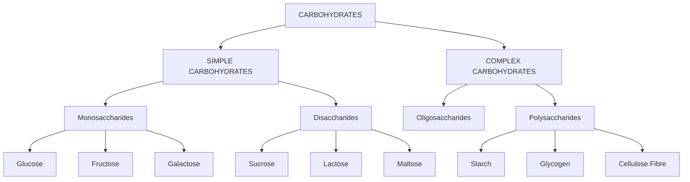
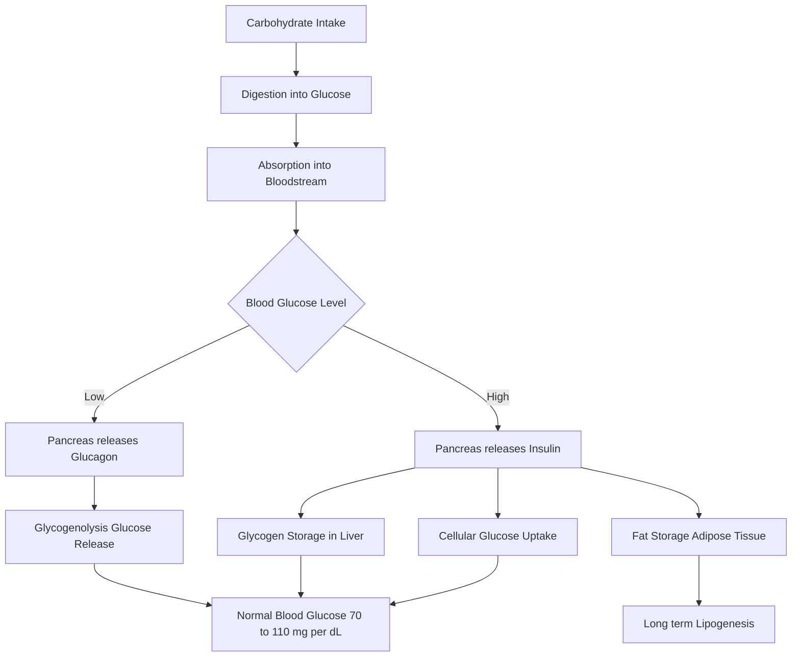
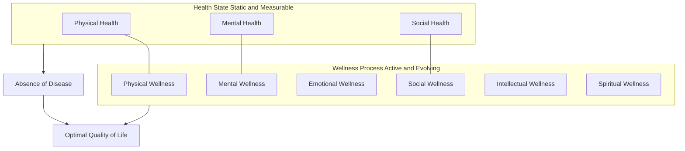
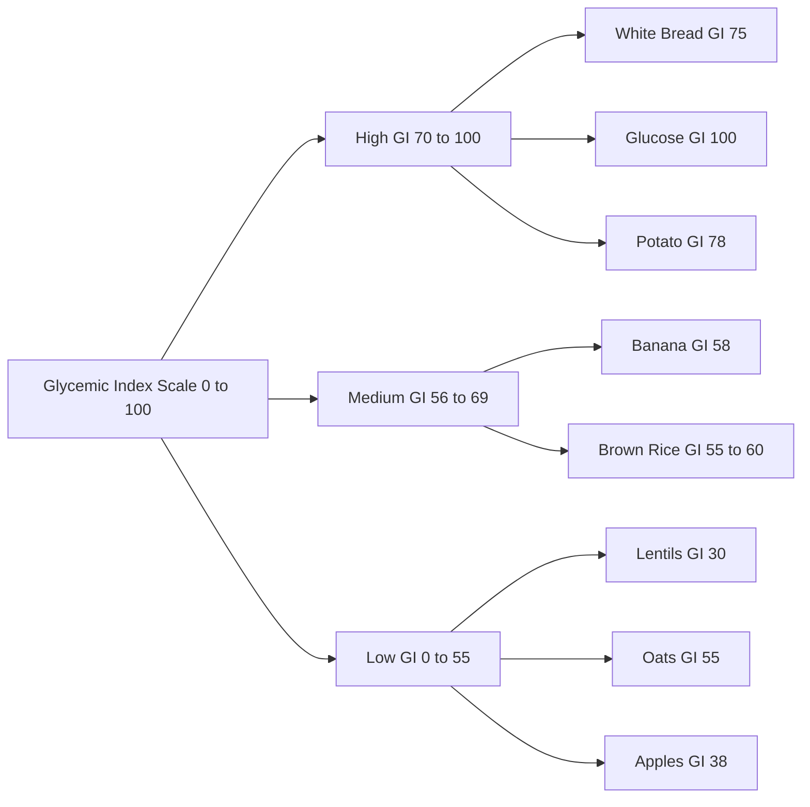
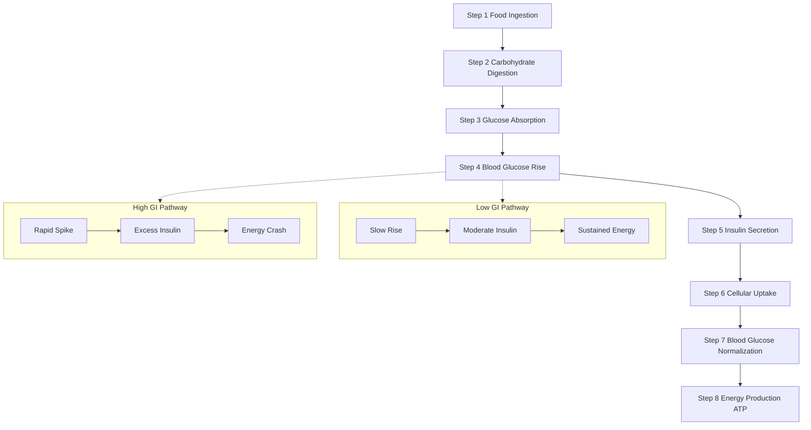

# Carbohydrate & the Glycemic Index

<!-- SECTION_1_START -->

# Carbohydrates & the Glycemic Index — KTU Module 2 Notes

## 1. Core Technical Definition & Intuitive Overview

### 1.1 Concept of Health (KTU 2024 Definition)

> [!IMPORTANT]
> **Health** is a state of **complete physical, mental, and social well-being**, and not merely the **absence of disease or infirmity** (World Health Organization, 1948). In KTU's Health and Wellness framework, health is treated as a **multi-dimensional equilibrium** across biological, psychological, and social axes.

### 1.2 Concept of Wellness

> [!NOTE]
> **Wellness** is an **active process of making choices** toward a healthier and more fulfilling life. It is the conscious, continuous, and evolving pursuit of activities, choices, and lifestyles that lead to a state of holistic health.

### 1.3 Health vs. Wellness — The Critical Distinction

While often used interchangeably, the KTU curriculum demands a **clear differentiation** between the two terms. The following table consolidates the core differences:

| Dimension | Health | Wellness |
|---|---|---|
| **Nature** | A *state* or condition of the body and mind | A *process* or active pursuit |
| **Orientation** | Outcome-based (presence/absence of disease) | Lifestyle-based (continuous improvement) |
| **Scope** | Reactive — focuses on curing illness | Proactive — focuses on prevention |
| **Dimensions** | Physical, mental, social | Physical, mental, emotional, social, intellectual, spiritual, occupational |
| **Time Frame** | Static measurement at a point in time | Dynamic, evolving lifelong journey |
| **Agency** | Often externally determined (by medical professionals) | Internally driven by individual choices |
| **Goal** | Freedom from disease | Optimal functioning and quality of life |

### 1.4 Carbohydrates — Formal Definition

> [!IMPORTANT]
> **Carbohydrates** are **organic compounds** composed of carbon (C), hydrogen (H), and oxygen (O) atoms, typically in the empirical formula $C_n(H_2O)_n$. They are the body's **primary source of energy**, supplying **4 kilocalories per gram** ($\approx 16.7\ \text{kJ/g}$).

### 1.5 Intuitive Analogy

> [!TIP]
> **Analogy — The Fuel Analogy:** Think of the human body as a hybrid car. **Carbohydrates are the premium-grade fuel (petrol)** that powers the engine efficiently. Different fuels have different burn rates — some burn fast and cause a sudden spike (high-glycemic foods), while others burn slowly and steadily (low-glycemic foods). The **Glycemic Index (GI)** is essentially the **"octane rating"** of your food.

### 1.6 Classification of Carbohydrates

Carbohydrates are classified by their chemical structure into the following major groups:

**A. Simple Carbohydrates (Sugars)**
- **Monosaccharides** — single units:
  - **Glucose** ($C_6H_{12}O_6$) — the body's primary fuel
  - **Fructose** — found in fruits and honey
  - **Galactose** — found in dairy
- **Disaccharides** — two units joined by glycosidic bonds:
  - **Sucrose** = Glucose + Fructose (table sugar)
  - **Lactose** = Glucose + Galactose (milk sugar)
  - **Maltose** = Glucose + Glucose (malt sugar)

**B. Complex Carbohydrates (Starches & Fibres)**
- **Oligosaccharides** — 3 to 10 monosaccharide units
- **Polysaccharides** — long chains:
  - **Starch** (storage form in plants)
  - **Glycogen** (storage form in animals)
  - **Dietary Fibre** (indigestible: cellulose, pectin)

### 1.7 Glycemic Index (GI) — Formal Definition

> [!IMPORTANT]
> The **Glycemic Index (GI)** is a **numerical ranking system (0–100)** that classifies carbohydrate-containing foods based on how quickly and how much they raise **blood glucose levels** within **2 hours** of consumption, compared to a reference food (pure glucose $= 100$ or white bread $= 70$).

### 1.8 Intuitive Analogy for Glycemic Index

> [!TIP]
> **Analogy — The Water Bucket Metaphor:** Imagine your bloodstream as a **bucket** and food as a **water source with a tap**. A **high-GI food** opens the tap fully — water gushes in, the bucket overflows (blood sugar spike), and the body releases a flood of **insulin** to mop up the excess, often causing a *crash* later. A **low-GI food** opens the tap slowly — water trickles in steadily, the bucket handles it comfortably, and energy is released gradually over hours.

### 1.9 Classification of Glycemic Index

| GI Range | Category | Effect on Blood Glucose |
|---|---|---|
| **70 and above** | **High GI** | Rapid spike in blood glucose |
| **56 to 69** | **Medium GI** | Moderate rise in blood glucose |
| **55 and below** | **Low GI** | Slow, gradual rise in blood glucose |

> [!NOTE]
> **Common GI Values (for memory):**
> - **High GI (≥ 70):** White bread, white rice, potatoes, glucose, cornflakes
> - **Medium GI (56–69):** Whole wheat bread, brown rice, banana, sucrose
> - **Low GI (≤ 55):** Lentils, chickpeas, oats, apples, milk, peanuts

### 1.10 Glycemic Load (GL) — The Refined Metric

> [!IMPORTANT]
> **Glycemic Load (GL)** accounts for both the **quality (GI)** and the **quantity (carbs in a serving)** of food consumed. It is calculated as:
> $$GL = \frac{GI \times \text{available carbohydrate (g)}}{100}$$

GL is classified as:
- **Low GL:** 0–10
- **Medium GL:** 11–19
- **High GL:** ≥ 20

> [!VISUALIZATION CONTROL]
> **Concept:** Glycemic Response Curves (High vs Low GI)
> **GeoGebra / Desmos Input Equations:**
> * `f(x) = 100 * exp(-0.5 * (x - 0.5)^2 / 0.2)` (High GI — sharp peak)
> * `g(x) = 60 * exp(-0.5 * (x - 1.5)^2 / 0.8)` (Low GI — gentle peak)
> **Visual Description:** Plot $f(x)$ and $g(x)$ on the same axes ($x$ = time in hours, $y$ = blood glucose mg/dL). Observe how $f(x)$ peaks sharply near $x=0.5$ (early spike) and falls quickly, while $g(x)$ peaks later and broader around $x=1.5$, representing sustained energy release.

---

<!-- SECTION_1_END -->

<!-- SECTION_2_START -->

# 2. Deep Theoretical Analysis & KTU High-Yield Formula Sheet

## 2.1 Why Carbohydrates Matter in Human Physiology

- **Primary Energy Source:** The brain and central nervous system rely almost exclusively on **glucose** for function. The brain consumes approximately **120 g of glucose per day**.
- **Energy Yield:** Carbohydrates yield **4 kcal/g** (17 kJ/g), making them the most accessible energy macronutrient.
- **Protein-Sparing Effect:** Adequate carbohydrate intake prevents the body from breaking down protein for energy.
- **Glycogen Storage:** Excess glucose is stored as **glycogen** in the **liver** (~$100\ \text{g}$) and **skeletal muscles** (~$400\ \text{g}$).

## 2.2 Mechanism of Blood Glucose Regulation

The human body maintains blood glucose within a tight range (**70–110 mg/dL** fasting) through the balance of two key hormones:

| Hormone | Source | Action on Blood Glucose |
|---|---|---|
| **Insulin** | Beta cells of pancreas (Islets of Langerhans) | Lowers blood glucose (promotes cellular uptake) |
| **Glucagon** | Alpha cells of pancreas | Raises blood glucose (stimulates glycogenolysis) |

### Step-by-Step Postprandial Glucose Response:
1. Carbohydrate is digested into monosaccharides (mainly glucose).
2. Glucose is absorbed through the intestinal wall into the bloodstream.
3. Blood glucose rises — the **magnitude and speed** depend on the food's GI.
4. The **pancreas** releases insulin proportional to the glucose load.
5. Insulin facilitates glucose uptake by muscle, liver, and adipose tissue.
6. Excess glucose is converted to **glycogen** (glycogenesis) or **fat** (lipogenesis).
7. As glucose is cleared, insulin levels drop; glucagon maintains baseline.

## 2.3 Determinants of Glycemic Index

Several factors influence a food's GI value:

- **Starch Structure:** Amylose (linear, low GI) vs. Amylopectin (branched, high GI)
- **Fibre Content:** Higher fibre → Lower GI (slower digestion)
- **Fat and Protein:** Slow gastric emptying → Lower GI
- **Processing and Cooking:** More processing → Higher GI
- **Ripeness of Fruit:** Riper fruit → Higher GI
- **Particle Size:** Smaller particles → Higher GI (faster digestion)
- **Acidity:** Acidic foods → Lower GI (slower gastric emptying)

## 2.4 Health Implications of High vs. Low GI Diets

| Aspect | High GI Diet | Low GI Diet |
|---|---|---|
| **Blood Glucose** | Rapid spikes and crashes | Stable, sustained levels |
| **Insulin Demand** | High, frequent | Moderate, steady |
| **Satiety** | Short-lived fullness | Prolonged fullness |
| **Risk of Type 2 Diabetes** | Increased risk | Reduced risk |
| **Weight Management** | Promotes fat storage | Supports weight loss/management |
| **Cardiovascular Risk** | Elevated triglycerides, LDL | Improved lipid profile |
| **Athletic Performance** | Quick energy for short bursts | Sustained energy for endurance |
| **Mood and Cognition** | Energy crashes, mood swings | Stable mood, sustained focus |

> [!IMPORTANT]
> **KTU Board Focus:** Examiners frequently ask about the *role of low-GI diets in preventing non-communicable diseases (NCDs)* such as Type 2 Diabetes Mellitus (T2DM), obesity, and cardiovascular disease (CVD).

## 2.5 Real-World Engineering and Health Applications

- **Clinical Nutrition:** GI-based meal planning for diabetic patients.
- **Sports Science:** Carbohydrate-loading strategies for marathon runners and endurance athletes.
- **Public Health Policy:** National dietary guidelines (e.g., Indian Council of Medical Research) encourage low-GI food adoption.
- **Food Technology:** Development of low-GI food products (e.g., resistant starch-enriched bread, whole-grain snacks).
- **Workplace Wellness Programs:** Corporate health programs use GI principles for cafeteria menu design.

## 2.6 KTU Formula Sheet / Cheat Sheet

| Concept | Formula / Value | Notes |
|---|---|---|
| **Empirical formula of carbohydrate** | $C_n(H_2O)_n$ | n ≥ 3 |
| **Energy from carbohydrates** | 4 kcal/g | Same as protein |
| **Energy from fats** | 9 kcal/g | Higher energy density |
| **Glycemic Index (reference)** | Pure glucose = 100 | Or white bread = 70 |
| **Glycemic Load** | $GL = \dfrac{GI \times \text{carbs (g)}}{100}$ | Accounts for serving size |
| **High GI threshold** | $\geq 70$ | Rapid glucose spike |
| **Medium GI range** | 56 – 69 | Moderate effect |
| **Low GI threshold** | $\leq 55$ | Gradual glucose rise |
| **High GL threshold** | $\geq 20$ | Avoid frequent consumption |
| **Low GL threshold** | 0 – 10 | Preferred for daily intake |
| **Fasting blood glucose (normal)** | 70 – 110 mg/dL | Or 3.9 – 6.1 mmol/L |
| **Recommended daily carbohydrate** | 45 – 65% of total kcal | WHO / ICMR guidelines |
| **Daily fibre intake (adults)** | 25 – 30 g | Reduces GI of mixed meals |

> [!NOTE]
> **Memory Trick — "70-55":** High GI = **70 or above**, Low GI = **55 or below**. Anything in between = Medium.

---

<!-- SECTION_2_END -->

<!-- SECTION_3_START -->

# 3. Step-by-Step Derivations & Worked Examples

## 3.1 Worked Example 1: Calculating Glycemic Load

> [!IMPORTANT]
> **Problem:** A serving of cooked brown rice (150 g) contains approximately **36 g of available carbohydrates** and has a **GI of 50**. Calculate the Glycemic Load (GL) and classify it.

### Step-by-Step Solution:

**Step 1:** Identify the given values.
- Available carbohydrates = 36 g
- Glycemic Index (GI) = 50

**Step 2:** Apply the Glycemic Load formula.
$$GL = \frac{GI \times \text{available carbohydrate (g)}}{100}$$

**Step 3:** Substitute the values.
$$GL = \frac{50 \times 36}{100}$$

**Step 4:** Perform the multiplication.
$$GL = \frac{1800}{100}$$

**Step 5:** Simplify to obtain the final answer.
$$GL = 18$$

**Step 6:** Classify the GL value.
- The computed GL is **18**, which falls in the range **11–19**, therefore it is classified as **Medium Glycemic Load**.

> **[Valuation Key — 2 Marks for formula, 2 Marks for substitution, 1 Mark for final value, 1 Mark for classification = 6 Marks]**

---

## 3.2 Worked Example 2: Comparative GI Analysis

> [!NOTE]
> **Problem:** A student consumes two breakfast options:
> - **Option A:** A bowl of cornflakes with milk — GI = 81, carbs = 30 g
> - **Option B:** A bowl of steel-cut oats with milk — GI = 42, carbs = 28 g
> Compare their impact on blood glucose using the GL framework.

### Step-by-Step Solution:

**Step 1:** Calculate GL for Option A (Cornflakes).
$$GL_A = \frac{81 \times 30}{100} = \frac{2430}{100} = 24.3$$

**Step 2:** Classify Option A.
- $GL_A = 24.3$ → **High GL** (≥ 20) — *Significant blood glucose spike expected.*

**Step 3:** Calculate GL for Option B (Steel-cut oats).
$$GL_B = \frac{42 \times 28}{100} = \frac{1176}{100} = 11.76$$

**Step 4:** Classify Option B.
- $GL_B \approx 11.76$ → **Medium GL** (11–19) — *Moderate, more sustained blood glucose rise.*

**Step 5:** Interpretation.
- Option A (cornflakes) produces a **2.07× higher** glycemic load than Option B.
- The student should prefer **steel-cut oats** for sustained energy, better satiety, and reduced insulin demand.
- **Health recommendation:** For weight management, diabetic control, and sustained academic focus, **low-GI breakfasts** are scientifically superior.

> **[Valuation Key — 1 Mark each for GL_A and GL_B calculations, 1 Mark each for classification, 2 Marks for interpretation = 6 Marks]**

---

## 3.3 Worked Example 3: Meal Planning for a Diabetic Patient

> [!IMPORTANT]
> **Problem:** Design a balanced low-GI lunch for a Type 2 diabetic patient. Include carbohydrate sources, expected GI values, and explain the physiological rationale.

### Model Meal Plan:

| Food Item | Quantity | GI | Carbs (g) | GL |
|---|---|---|---|---|
| Brown rice (cooked) | 150 g | 50 | 36 | 18.0 |
| Chickpea curry | 100 g | 28 | 27 | 7.6 |
| Mixed vegetable salad | 100 g | 15 | 8 | 1.2 |
| Curd (yoghurt) | 100 g | 35 | 4.7 | 1.6 |
| **Total** | — | — | **75.7** | **28.4** |

### Rationale:
1. **Low-GI staples** (brown rice, chickpeas) ensure slow glucose release.
2. **Fibre-rich salad** further reduces the overall meal GI through delayed gastric emptying.
3. **Low-fat curd** provides protein and probiotics with minimal glucose impact.
4. **Combined meal GL** is moderate; the fibre and fat content of accompaniments further blunts the postprandial glucose curve.

> **[Valuation Key — 1 Mark for correct table, 2 Marks for rational understanding, 1 Mark for total GL interpretation = 4 Marks]**

---

## 3.4 Conceptual Health vs. Wellness Matrix

> [!NOTE]
> **Problem:** A 22-year-old engineering student has no diagnosed illness but reports chronic fatigue, poor sleep, and low concentration. Using the Health and Wellness framework, classify her condition and recommend a wellness plan.

### Solution:

**Step 1:** Health Status Assessment.
- No diagnosed disease → **Clinically healthy**.
- However, suboptimal markers (fatigue, poor sleep) suggest **functional unwellness**.

**Step 2:** Classification.
- This is a case of **Health present, Wellness absent** — i.e., the student is *not sick* but is *not thriving*.

**Step 3:** Multi-Dimensional Wellness Plan.

| Wellness Dimension | Recommendation |
|---|---|
| **Physical** | 30 min moderate exercise (5×/week); low-GI balanced meals |
| **Mental** | Mindfulness meditation (10 min/day); structured study breaks |
| **Emotional** | Journaling; peer support groups |
| **Social** | Limit screen time; engage in campus clubs |
| **Intellectual** | Pursue a new skill; attend workshops |
| **Sleep** | 7–8 hours; fixed sleep–wake cycle |

**Step 4:** Expected Outcome.
- Over 8–12 weeks, the student should experience **improved energy, better concentration, and enhanced quality of life** — moving from "absence of disease" to "active wellness."

> **[Valuation Key — 1 Mark for correct classification, 2 Marks for dimensional breakdown, 1 Mark for outcome = 4 Marks]**

---

<!-- SECTION_3_END -->

<!-- SECTION_4_START -->

# 4. Structural Diagrams & Schematics

## 4.1 Classification of Carbohydrates — Hierarchical Block Diagram

> **Description:** A top-down taxonomy showing the structural progression from simple sugars to complex polysaccharides. Each level represents increasing molecular complexity, digestibility, and impact on the Glycemic Index.

---

## 4.2 Blood Glucose Regulation Flow

> **Description:** A decision-flow schematic illustrating the homeostatic regulation of blood glucose. The dual-hormone system (insulin and glucagon) maintains equilibrium in healthy individuals; dysfunction leads to diabetes mellitus.

---

## 4.3 Health vs. Wellness — Conceptual Venn Architecture

> **Description:** A Venn-style architecture showing that Health and Wellness are related but distinct constructs. Health is a subset of Wellness, but Wellness extends beyond the mere absence of disease to include active lifestyle dimensions.

---

## 4.4 Glycemic Index Classification Matrix

> **Description:** A classification matrix mapping the GI numerical scale to food categories, with example food items at each level. Useful for students to recall which foods belong to which tier.

---

## 4.5 Sequential Processing Topology: Glycemic Response

> **Description:** A dual-pathway sequential topology contrasting the metabolic trajectory of low-GI versus high-GI foods. The diagram emphasizes why dietary choice matters for sustained energy and metabolic health.

---

<!-- SECTION_4_END -->

<!-- SECTION_5_START -->

# 5. KTU 2024 Scheme Examination Question Bank & Topic Recap

## 5.1 Part A Questions (3 Marks Each)

### Question 1
**[KTU University Exam – Dec 2023]**
Define the term **Glycemic Index (GI)**. Mention any **two examples** each of high-GI and low-GI foods.

**Model Answer:**

> [!NOTE]
> The **Glycemic Index (GI)** is a numerical scale (0–100) that ranks carbohydrate-containing foods based on how rapidly they raise blood glucose levels within 2 hours of consumption, relative to pure glucose (GI = 100).
>
> **High-GI foods (≥ 70):** White bread, glucose, potatoes, cornflakes.
> **Low-GI foods (≤ 55):** Lentils, oats, apples, peanuts.

**[CO1, Understand — 3 Marks: 1 Mark for definition, 2 Marks for examples]**

---

### Question 2
**[KTU University Exam – July 2024]**
Differentiate between **Health** and **Wellness** in **any three aspects**.

**Model Answer:**

> [!TIP]
> 1. **Nature:** Health is a *state* of the body; Wellness is an *active process* of lifestyle choices.
> 2. **Orientation:** Health is *reactive* (disease-cure focused); Wellness is *proactive* (prevention focused).
> 3. **Scope:** Health has 3 dimensions (physical, mental, social); Wellness has 6+ dimensions (emotional, intellectual, spiritual, occupational added).

**[CO2, Understand — 3 Marks: 1 Mark per valid difference]**

---

## 5.2 Part B Questions (14 Marks Each) — Internal Choice

### Question 3 — Option A (14 Marks)

**[KTU University Exam – Model Paper 2024, CO1, CO2, Apply / Analyze]**

**(a)** Classify carbohydrates with suitable examples. Explain the **chemical basis** for the difference in their digestion rates. **[7 Marks]**

**(b)** Define Glycemic Index. Discuss the **health implications of consuming a high-GI diet** on long-term metabolic health. **[7 Marks]**

---

#### Solution to Question 3 (a):

**Carbohydrate Classification:**

| Type | Examples | Digestion Rate |
|---|---|---|
| **Monosaccharides** | Glucose, Fructose, Galactose | Fastest (no digestion needed) |
| **Disaccharides** | Sucrose, Lactose, Maltose | Fast (one glycosidic bond to break) |
| **Oligosaccharides** | Raffinose, Stachyose | Moderate |
| **Polysaccharides (Starch)** | Amylose, Amylopectin | Slower (many bonds) |
| **Polysaccharides (Fibre)** | Cellulose, Pectin | Indigestible |

**Chemical Basis for Digestion Rate:**
- **Glycosidic bonds (α vs β):** α-1,4 bonds (e.g., in starch) are easily broken by human amylase. β-1,4 bonds (e.g., in cellulose) cannot be digested by humans — hence fibre passes undigested.
- **Branching:** Amylopectin (branched) is digested faster than amylose (linear) because more enzyme attack sites are exposed.
- **Solubility:** Soluble sugars dissolve quickly; complex starches require enzymatic breakdown before absorption.

> **[Valuation Key: Classification with examples = 3 Marks; Chemical basis with α/β explanation = 3 Marks; Digestion rate connection = 1 Mark = 7 Marks total]**

---

#### Solution to Question 3 (b):

**Glycemic Index Definition:**
The **Glycemic Index (GI)** is a relative ranking (0–100) of carbohydrate-containing foods based on their effect on postprandial blood glucose levels, with pure glucose assigned the reference value of 100.

**Health Implications of a High-GI Diet:**

1. **Type 2 Diabetes Risk:** Chronic high-GI diets cause repeated insulin surges, leading to **insulin resistance** and eventual pancreatic beta-cell exhaustion.
2. **Obesity:** High-GI foods cause rapid hunger recurrence, promoting **overeating** and **fat storage** via elevated insulin.
3. **Cardiovascular Disease:** Elevated triglycerides, increased LDL cholesterol, and reduced HDL cholesterol.
4. **Polycystic Ovary Syndrome (PCOS):** Insulin resistance worsens hormonal imbalance in women.
5. **Cognitive Decline:** Studies link high-GI diets to increased risk of dementia and Alzheimer's disease.
6. **Inflammation:** Chronic high-GI intake is associated with systemic low-grade inflammation.

**Conclusion:** A sustained high-GI dietary pattern is a **modifiable risk factor** for several non-communicable diseases (NCDs). Public health guidelines recommend replacing high-GI carbohydrates with low-GI alternatives.

> **[Valuation Key: Definition = 2 Marks; Any 4 implications = 4 Marks (1 each); Conclusion = 1 Mark = 7 Marks total]**

---

### Question 3 — Option B (14 Marks)

**[KTU University Exam – Model Paper 2024, CO2, CO3, Understand / Apply]**

**(a)** Explain the **dimensions of wellness** as per the KTU Health and Wellness framework. How is wellness different from the mere absence of disease? **[7 Marks]**

**(b)** A serving of a packaged food product contains **45 g of carbohydrates** and has a **GI of 65**. Calculate the **Glycemic Load (GL)** and interpret its health significance. **[7 Marks]**

---

#### Solution to Question 3 — B (a):

**Six Dimensions of Wellness:**

1. **Physical Wellness:** Regular exercise, balanced nutrition, adequate sleep, avoidance of harmful substances.
2. **Mental Wellness:** Cognitive engagement, lifelong learning, stress management.
3. **Emotional Wellness:** Self-awareness, resilience, ability to manage emotions constructively.
4. **Social Wellness:** Healthy interpersonal relationships, community engagement, effective communication.
5. **Intellectual Wellness:** Creative pursuits, curiosity, problem-solving.
6. **Spiritual/Occupational Wellness:** Purpose-driven living, work-life balance, ethical values.

**Wellness vs Absence of Disease:**
- The *absence of disease* is a **passive, clinical** state (no pathology detected).
- *Wellness* is a **proactive, holistic** state — an individual can have no diagnosed disease (e.g., no diabetes, no hypertension) but still be *unwell* due to poor sleep, chronic stress, social isolation, or lack of purpose.
- **Example:** A sedentary engineering student with no clinical diagnosis may still suffer from low wellness due to poor fitness, screen addiction, and social anxiety.

> **[Valuation Key: 6 dimensions × 0.5 Mark = 3 Marks; Clear contrast = 2 Marks; Real-life example = 2 Marks = 7 Marks total]**

---

#### Solution to Question 3 — B (b):

**Given:**
- Available carbohydrates = 45 g
- GI = 65

**Step 1:** Apply the GL formula.
$$GL = \frac{GI \times \text{carbohydrate (g)}}{100}$$

**Step 2:** Substitute values.
$$GL = \frac{65 \times 45}{100}$$

**Step 3:** Compute numerator.
$$65 \times 45 = 2925$$

**Step 4:** Divide by 100.
$$GL = 29.25$$

**Step 5:** Classify the GL.
- $GL = 29.25 \geq 20$ → **High Glycemic Load**

**Step 6:** Health Interpretation.
- A single serving of this product delivers a **high glycemic load**, causing a **significant postprandial blood glucose spike**.
- Regular consumption may contribute to **insulin resistance, weight gain, and increased Type 2 diabetes risk**.
- **Recommendation:** Consumers should limit portion size, pair with fibre/protein, or substitute with a low-GI alternative (e.g., whole-grain version, GI < 55).

> **[Valuation Key: Formula = 1 Mark; Substitution = 1 Mark; Computation = 2 Marks; Classification = 1 Mark; Health interpretation = 2 Marks = 7 Marks total]**

---

## 5.3 KTU Examiner's Valuation Warning

> [!WARNING]
> **Common Pitfalls — Where Students Lose Marks:**
> 1. **Confusing GI and GL:** GI measures *quality* of carbs; GL measures *quantity × quality*. Examiners deduct marks if students interchange these terms.
> 2. **Forgetting to state the reference food:** When defining GI, always mention that **glucose = 100** is the reference.
> 3. **Not classifying the numerical answer:** In GL problems, simply writing the number without stating "High/Medium/Low" loses 1 mark.
> 4. **Health vs. Wellness confusion:** Writing "they are the same" or "both mean fitness" is factually incorrect and costs 2–3 marks.
> 5. **Skipping units in formulas:** Always mention "per gram" (4 kcal/g) and use proper notation ($C_n(H_2O)_n$).
> 6. **No real-life examples in wellness answers:** Abstract answers without grounding in student life are marked down.
> 7. **Mermaid/diagram labels missing:** In drawing questions, missing the GI scale threshold (70 and 55) loses 1 mark each.

---

## 5.4 Topic Recap & Important Things to Remember

> [!IMPORTANT]
> **Rapid Revision Checklist — Carbohydrates & the Glycemic Index**

**Core Definitions:**
- **Carbohydrate:** Organic compound with formula $C_n(H_2O)_n$; yields **4 kcal/g**.
- **Health:** A *state* of complete physical, mental, and social well-being (WHO 1948).
- **Wellness:** An *active, ongoing process* of choices leading to a fulfilling life.
- **Glycemic Index:** 0–100 scale ranking carbs by postprandial blood glucose impact.
- **Glycemic Load:** $GL = \dfrac{GI \times \text{carbs (g)}}{100}$ — accounts for serving size.

**Critical Numerical Thresholds:**
- High GI ≥ 70 | Medium GI 56–69 | Low GI ≤ 55
- High GL ≥ 20 | Medium GL 11–19 | Low GL 0–10
- Normal fasting blood glucose: 70–110 mg/dL
- Daily carb recommendation: 45–65% of total kcal
- Daily fibre intake: 25–30 g

**Carbohydrate Classification:**
- **Simple:** Monosaccharides (glucose, fructose, galactose), Disaccharides (sucrose, lactose, maltose).
- **Complex:** Oligosaccharides, Polysaccharides (starch, glycogen, cellulose).

**Key Hormones:**
- **Insulin** (β-cells) → lowers blood glucose
- **Glucagon** (α-cells) → raises blood glucose

**Health Implications:**
- High-GI diets → ↑ risk of T2DM, obesity, CVD, PCOS, dementia.
- Low-GI diets → sustained energy, better satiety, improved lipid profile.

**Determinants of GI:**
- Starch structure (amylose vs amylopectin), fibre, fat, processing, ripeness, particle size, acidity.

**Valuation Hot Spots:**
- Always classify the GI/GL value numerically.
- Always state the reference food (glucose = 100).
- Use real-world examples in wellness-related answers.
- Distinguish Health (state) from Wellness (process) clearly.

**Quick Memory Aid:**
- "**70-55**" → High-Low GI boundary
- "**20-10**" → High-Low GL boundary
- "**4-9**" → kcal per gram of carb and fat respectively
- "**6 dimensions**" → Wellness pillars (Physical, Mental, Emotional, Social, Intellectual, Spiritual)

---

<!-- SECTION_5_END -->
