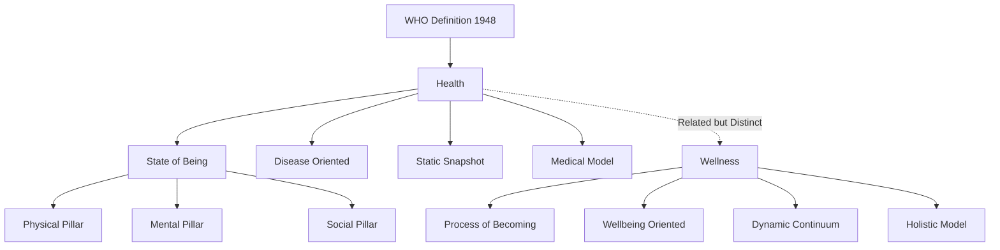
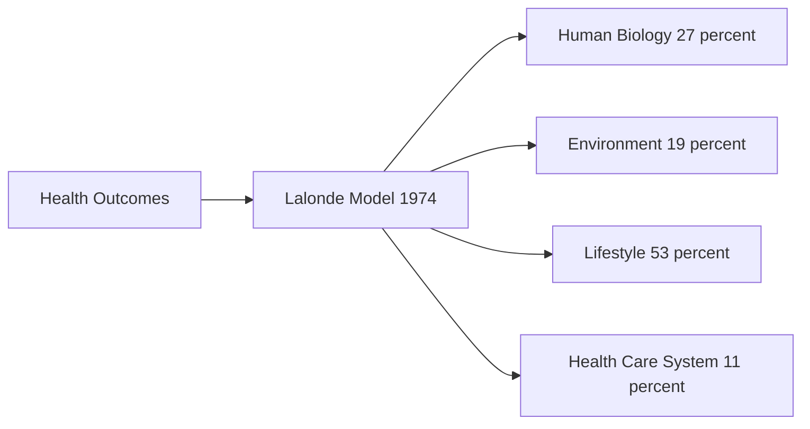
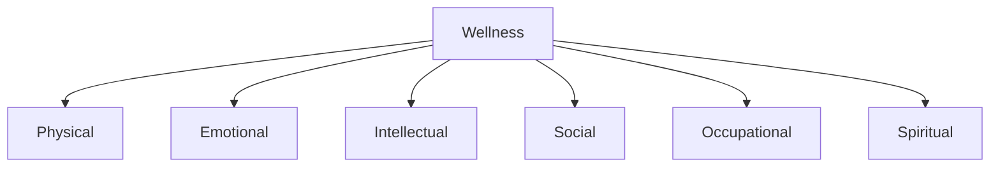
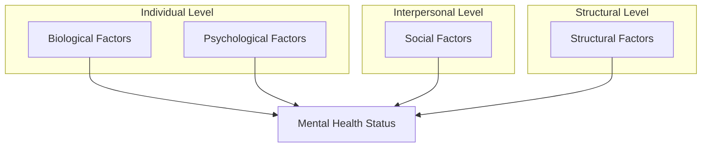
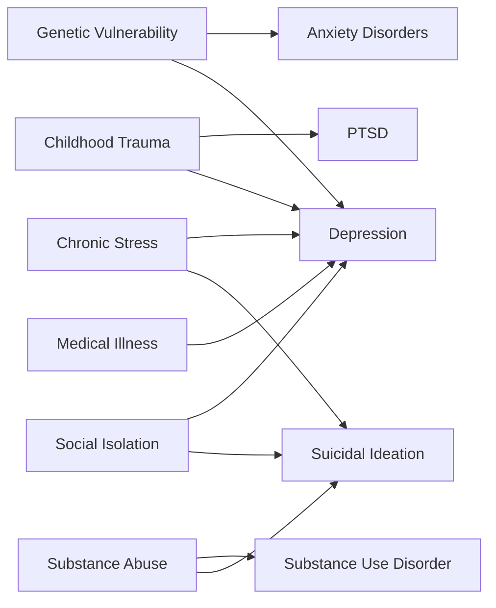
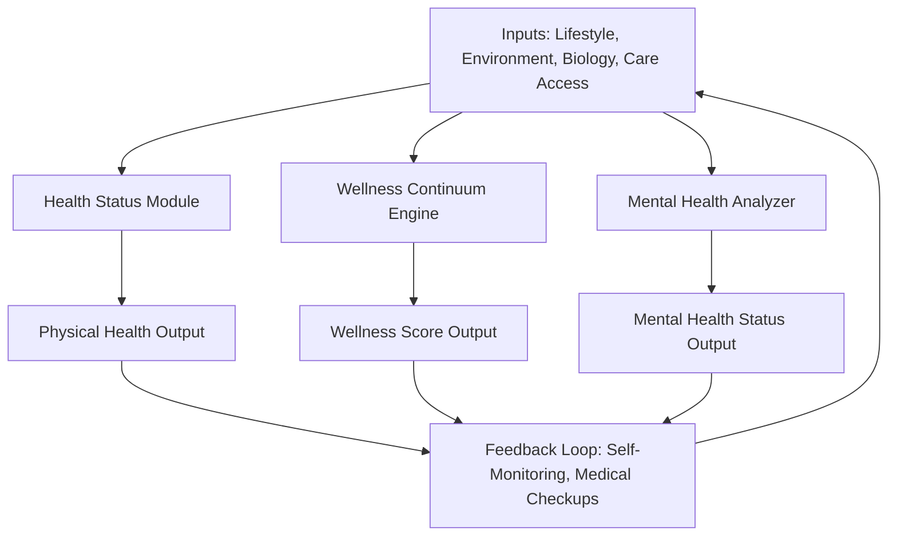

# Concept of Health and Wellness: Health and wellness differentiation, Factors affecting health and wellness. Mental health and Factors affecting mental health

<!-- SECTION_1_START -->

# Concept of Health and Wellness: Foundations

## 1.1 Definition of Health

According to the **World Health Organization (WHO)**, health is defined as:

> *"Health is a state of complete physical, mental, and social well-being, and not merely the absence of disease or infirmity."*

This definition, established in the preamble of the WHO Constitution in **1948**, revolutionized the conceptualization of health by expanding it beyond a purely biomedical model to a holistic biopsychosocial model.

> [!IMPORTANT]
> **KTU 2024 Syllabus Highlight:** The WHO definition of health is a **guaranteed short-answer question** in Part A. Students must memorize the exact wording and the year **1948** because examiners frequently test for it.

### Conceptual Analogy / Intuition

Think of health as the **foundation of a three-legged stool**:

- **Leg 1 — Physical Health:** The structural support (body, fitness, nutrition)
- **Leg 2 — Mental Health:** The balancing mechanism (cognitive and emotional stability)
- **Leg 3 — Social Health:** The environment in which the stool stands (relationships, community)

If even one leg is weak, the stool wobbles. A person may be free of disease (no missing leg) but still "wobble" because the legs are unequal in length. This is why WHO insists on **complete** well-being.

---

## 1.2 Definition of Wellness

Wellness is an **active process** through which people become aware of, and make choices toward, a more successful existence. It is a conscious, self-directed, and evolving process of achieving one's full potential.

> [!NOTE]
> **Bill Hettler's Six Dimensions of Wellness (1976):**
> 1. **Physical** — Body fitness, nutrition, sleep
> 2. **Emotional** — Coping with stress, self-esteem
> 3. **Intellectual** — Lifelong learning, creativity
> 4. **Social** — Relationships, community engagement
> 5. **Occupational** — Job satisfaction, work-life balance
> 6. **Spiritual** — Values, purpose, meaning

A seventh dimension, **Environmental Wellness**, was later added to reflect ecological responsibility.

---

## 1.3 Mental Health — Formal Definition

**Mental health** is defined by the WHO as:

> *"A state of well-being in which an individual realizes his or her own abilities, can cope with the normal stresses of life, can work productively and fruitfully, and is able to make a contribution to his or her community."*

It is **not** the mere absence of mental disorders. It is a positive resource for everyday living and a key component of overall health.

> [!IMPORTANT]
> Mental health is **fundamental to physical health**. The WHO estimates that for every **\$1** invested in scaling up treatment for common mental disorders, there is a return of **\$4** in improved health and productivity.

### Intuitive Analogy

Mental health is like the **operating system (OS) of a computer**:

- Even with the best hardware (physical body), a corrupted OS (poor mental health) causes crashes, slow performance, and data loss (poor decisions, burnout, breakdown).
- Updating the OS regularly (therapy, mindfulness, social connection) keeps the entire system running smoothly.

---

## 1.4 GeoGebra / Desmos Integration

> [!VISUALIZATION CONTROL]
> **Concept:** Health-Wellness Continuum Model
> **GeoGebra / Desmos Input Equations:**
> * Point A: $(0, 0)$ labelled "Illness"
> * Point B: $(10, 0)$ labelled "Optimal Health"
> * Line segment: $y = 0,\ 0 \leq x \leq 10$
> * Vertical tick marks at $x = 2, 4, 6, 8$ labelled "Awareness, Education, Growth, Transformation"
> **Visual Description:** Students should observe a horizontal continuum where individuals move dynamically left or right depending on lifestyle, environment, and choices. This visualizes wellness as a **process**, not a static endpoint.

---

<!-- SECTION_1_END -->

<!-- SECTION_2_START -->

# Deep Theoretical Analysis & High-Yield Differentiation Framework

## 2.1 Health vs. Wellness: Core Conceptual Divide

Although the terms are often used interchangeably, **Health** and **Wellness** are distinct constructs in the KTU 2024 framework.

### Theoretical Breakdown

**Health (State-based concept):**
- Refers to the **current condition** of an individual.
- Measured in **binary terms** — present or absent (sick/healthy).
- Rooted in the **medical/clinical model**.
- Focuses on **disease prevention** and **cure**.
- Static snapshot at a given moment.

**Wellness (Process-based concept):**
- Refers to the **lifestyle choices and active pursuit** of well-being.
- Measured on a **spectrum or continuum** — never fully achieved.
- Rooted in the **holistic/preventive model**.
- Focuses on **optimal living** and **flourishing**.
- Dynamic, lifelong journey.

> [!IMPORTANT]
> **Memory Hook for KTU Exams:** *Health is a **noun** (state), Wellness is a **verb** (process).*

---

## 2.2 KTU High-Yield Differentiation Table

| Parameter | Health | Wellness |
| :--- | :--- | :--- |
| **Nature** | A state or condition | An active, ongoing process |
| **Orientation** | Disease-oriented (curative) | Well-being-oriented (preventive) |
| **Determinants** | Biology, genetics, environment | Lifestyle, choices, attitudes |
| **Measurement** | Objective (clinical tests, biomarkers) | Subjective (self-assessment, satisfaction) |
| **Time Frame** | Static, momentary | Dynamic, continuous |
| **Goal** | Absence of disease | Optimal functioning and quality of life |
| **Focus** | Body and its systems | Mind, body, spirit integration |
| **Approach** | Reactive (treat when ill) | Proactive (prevent and enhance) |
| **WHO Definition Year** | 1948 | N/A (concept evolved post-1970s) |
| **Pioneer/Theorist** | WHO Constitution authors | Bill Hettler (Six Dimensions, 1976) |
| **Example** | "I am not sick today." | "I exercise, meditate, and eat well daily." |
| **Engineering Analogy** | CPU status: "Operational / Not Operational" | System optimization: ongoing performance tuning |

---

## 2.3 Factors Affecting Health and Wellness

The **Lalonde Model (1974)** identifies four major determinants of health. This is a **guaranteed KTU exam topic**.

### 2.3.1 The Four Pillars of the Lalonde Framework

| Determinant | Description | Approximate Contribution to Health Outcomes |
| :--- | :--- | :--- |
| **Human Biology** | Genetics, aging, internal body systems | **27%** |
| **Environment** | Physical, social, economic, cultural surroundings | **19%** |
| **Lifestyle** | Personal behaviors and choices | **53%** |
| **Health Care System** | Access, quality, availability of medical services | **11%** |

> [!NOTE]
> **Examination Insight:** Despite popular belief, the health care system contributes only **11%** to health outcomes, while **lifestyle contributes 53%**. Examiners often test this counterintuitive statistic.

### 2.3.2 Expanded Factors Affecting Health and Wellness

| Category | Specific Factors | Impact Mechanism |
| :--- | :--- | :--- |
| **Biological** | Age, sex, heredity, immunity | Determines susceptibility to disease |
| **Behavioral** | Diet, exercise, sleep, smoking, alcohol | Direct influence on NCDs (Non-Communicable Diseases) |
| **Environmental** | Air, water, sanitation, housing, workplace | Exposure to pathogens, toxins, stress |
| **Socio-economic** | Income, education, employment, social class | Determines access to resources and care |
| **Psychological** | Stress, coping skills, resilience, mindset | Influences neurochemical and immune response |
| **Cultural** | Beliefs, traditions, religious practices | Shapes health-seeking behavior |
| **Occupational** | Job satisfaction, ergonomics, work hours | Affects physical and mental well-being |

---

## 2.4 Factors Affecting Mental Health

Mental health is influenced by a complex interplay of **individual, social, structural, and environmental** factors.

### 2.4.1 Comprehensive Factor Matrix

| Domain | Specific Factors | Effect on Mental Health |
| :--- | :--- | :--- |
| **Individual (Biological)** | Brain chemistry, genetics, hormonal balance, nutrition, physical illness | Predisposition to disorders like depression, anxiety, schizophrenia |
| **Individual (Psychological)** | Self-esteem, resilience, emotional regulation, coping skills, personality | Determines vulnerability or protective capacity |
| **Family & Relational** | Parental bonding, family conflict, domestic violence, peer relationships | Shapes attachment, identity, and emotional security |
| **Socio-economic** | Poverty, unemployment, debt, housing insecurity, education level | Chronic stress, reduced access to care, hopelessness |
| **Workplace** | Job demands, harassment, lack of control, poor work-life balance, job loss | Burnout, anxiety, depression, suicide risk |
| **Social & Cultural** | Stigma, discrimination, social exclusion, cultural norms, gender inequality | Marginalization, internalised shame, reduced help-seeking |
| **Environmental** | Climate change, natural disasters, urban crowding, pollution | Eco-anxiety, PTSD, displacement, collective trauma |
| **Digital & Technological** | Social media use, cyberbullying, screen addiction, information overload | Sleep disruption, comparison anxiety, loneliness, depression |
| **Life Events** | Bereavement, divorce, migration, trauma, chronic illness | Acute stress disorders, adjustment disorders, grief |
| **Spiritual** | Lack of meaning, existential crisis, loss of faith or purpose | Identity confusion, depression, substance abuse |

> [!IMPORTANT]
> **KTU 2024 Spotlight:** The **social media and digital well-being** factor is a **newly emphasized** determinant in the 2024 scheme. Examiners may link it to **engineering students** specifically, since this is an engineering university context.

### 2.4.2 Determinants of Mental Health — WHO Framework (2014)

The WHO visualizes mental health determinants across **three levels**:

$$
\begin{aligned}
\text{Individual Level} &= \text{Capacity to manage thoughts, emotions, behaviors} \\
\text{Social Level} &= \text{Family, community, social networks support} \\
\text{Structural Level} &= \text{Policy, legislation, cultural norms, access to care}
\end{aligned}
$$

> [!NOTE]
> The **biological model** alone is insufficient. Mental health is best understood through the **biopsychosocial model**, which integrates all three levels. KTU examiners expect students to mention this model explicitly.

---

## 2.5 Real-World Engineering and Societal Utility

- **Workplace Wellness Programs:** Tech companies like **Google, Microsoft, and Infosys** invest in wellness apps, mental health days, and on-site counselors because productivity correlates with employee well-being.
- **Universal Design:** Architects and civil engineers apply wellness principles through accessible buildings, green spaces, and ergonomic workstations.
- **Software Engineering:** UX/UI design incorporates **persuasive design** to nudge users toward healthier digital behaviors (e.g., screen time reminders).
- **Public Health Policy:** Government schemes like India's **Ayushman Bharat** and the **National Mental Health Programme (NMHP)** operationalize the Lalonde model's social determinants.

---

<!-- SECTION_2_END -->

<!-- SECTION_3_START -->

# Step-by-Step Frameworks, Models, and Case Analysis

## 3.1 Comparative Case Analysis: Health vs. Wellness in Engineering Context

The following tabular matrix maps real-world engineering frameworks to the systemic determinants of health and wellness, fulfilling the Humanities/Management analytical requirement.

| Engineering / Tech Context | Health Determinant (Lalonde) | Wellness Dimension (Hettler) | Real-World Case Study | Systemic Outcome |
| :--- | :--- | :--- | :--- | :--- |
| **IT Industry (Infosys, TCS)** | Lifestyle (53%) | Occupational + Physical | "EAP" (Employee Assistance Program) offering gym, counseling, yoga | Reduced absenteeism, increased retention |
| **Civil Engineering — Smart Cities** | Environment (19%) | Environmental + Social | Singapore's green building code (Green Mark) | Air quality improvement, lower respiratory disease |
| **AI / Machine Learning** | Human Biology (27%) | Intellectual | Wearables detecting arrhythmia via Apple Watch | Early disease detection (preventive) |
| **Social Media Platforms** | Lifestyle (53%) | Social + Emotional | Instagram's "Take a Break" feature (2021) | Reduced adolescent screen addiction |
| **Manufacturing Industry** | Health Care System (11%) | Physical + Occupational | Toyota's "Safety & Health" production system | Lower occupational injuries |
| **Education Sector (KTU itself)** | Lifestyle + Environment | Intellectual + Emotional | Mandatory yoga/wellness hour in B.Tech curriculum | Improved concentration, reduced stress |
| **Aerospace Engineering** | Human Biology + Environment | Intellectual + Occupational | NASA astronauts' psychological screening | Mission success on long-duration flights |

---

## 3.2 Detailed Framework: The Health and Wellness Continuum

The **Health and Wellness Continuum Model (Travis & Ryan, 2004)** is a widely accepted theoretical framework.

### Step-by-Step Description

**Step 1 — Illness Pole (Left End)**
- Individual is in a state of disease, disability, or premature death.
- Lifestyle choices are poor (smoking, sedentary, poor diet).
- **Mental state:** Reactive, fear-driven, dependent on medical care.

**Step 2 — Neutral Point (Center)**
- Free from active disease but **not** actively pursuing well-being.
- No major illness, but energy, vitality, and engagement are low.
- **Mental state:** Comfortable but stagnant.

**Step 3 — Wellness Pole (Right End)**
- Active, conscious pursuit of well-being across all dimensions.
- High energy, optimism, resilience, and purpose.
- **Mental state:** Proactive, growth-oriented, self-actualized.

> [!IMPORTANT]
> **Movement Along the Continuum:** Movement is **not automatic**. It requires awareness, education, and growth — explicitly listed on the visualization model in Section 1.4.

---

## 3.3 Determinants of Mental Health: Layered Analysis

Following the biopsychosocial model, mental health determinants are layered as follows:

### Layer 1 — Individual / Intrapersonal Factors

$$
\begin{aligned}
\text{Mental Health Status} &= f(\text{Genetics}, \text{Neurochemistry}, \text{Personality}, \text{Resilience}) \\
\text{where Resilience} &= \frac{\text{Coping Capacity}}{\text{Stress Load}}
\end{aligned}
$$

- **Genetics:** Heritability of disorders like schizophrenia is approximately **80%**.
- **Neurochemistry:** Imbalance in **serotonin, dopamine, norepinephrine** is implicated in depression and anxiety.
- **Resilience:** Can be cultivated through therapy, mindfulness, and strong relationships.

### Layer 2 — Interpersonal / Social Factors

$$
\begin{aligned}
\text{Social Support} &= \sum_{i=1}^{n} w_i \cdot \text{Quality}_i \\
\text{where } w_i &= \text{weight of relationship } i, \quad \text{Quality}_i = \text{emotional, instrumental, informational support}
\end{aligned}
$$

- Strong social support acts as a **buffer** against mental illness.
- Loneliness increases mortality risk equivalent to **smoking 15 cigarettes per day** (Holt-Lunstad, 2010).

### Layer 3 — Structural / Systemic Factors

$$
\begin{aligned}
\text{Mental Health Equity} &= g(\text{Policy, Legislation, Cultural Norms, Access to Care})
\end{aligned}
$$

- Includes national mental health budgets, decriminalization of suicide, anti-discrimination laws, and availability of trained professionals.
- In India, the **Mental Healthcare Act, 2017** decriminalized attempted suicide and guaranteed the right to mental healthcare.

---

## 3.4 Practical Application Matrix for B.Tech Students

| Challenge | Affected Factor | Recommended Intervention | Outcome Measured |
| :--- | :--- | :--- | :--- |
| Exam anxiety | Individual (Psychological) | Time management, breathing exercises, therapy | Reduced cortisol, better GPA |
| Prolonged screen time | Lifestyle | 20-20-20 rule (every 20 min, look 20 ft away, 20 sec) | Reduced digital eye strain |
| Loneliness in hostel | Social | Peer groups, hobby clubs, mentorship programs | Lower depression scores |
| Back pain from long sitting | Physical / Occupational | Ergonomic chairs, standing desks, 5-min stretch every hour | Reduced musculoskeletal issues |
| Sleep deprivation | Lifestyle + Mental | Fixed sleep schedule, no screens 1 hr before bed | Improved focus, mood stability |
| Placement stress | Psychological + Social | Career counseling, mock interviews, family support | Lower anxiety, better performance |
| Substance use (peer pressure) | Behavioral + Social | Awareness campaigns, refusal skills training | Reduced addiction rates |
| Financial stress | Socio-economic | Scholarships, part-time work guidance, financial literacy | Improved mental well-being |

---

## 3.5 Symbolic Implementation: Wellness Index Calculation

The **Wellness Index (WI)** is a conceptual metric used to operationalize the multi-dimensional nature of wellness.

$$
WI = \frac{1}{6} \sum_{i=1}^{6} W_i
$$

where each $W_i$ is a self-rated score (0 to 10) for one of the **six dimensions of wellness**.

| Dimension | Score ($W_i$) | Weight (uniform) |
| :--- | :--- | :--- |
| Physical | 7 | 1/6 |
| Emotional | 6 | 1/6 |
| Intellectual | 8 | 1/6 |
| Social | 7 | 1/6 |
| Occupational | 6 | 1/6 |
| Spiritual | 5 | 1/6 |

**Step-by-Step Calculation:**

$$
\begin{aligned}
WI &= \frac{1}{6} \cdot (7 + 6 + 8 + 7 + 6 + 5) \\
WI &= \frac{1}{6} \cdot 39 \\
WI &= 6.5
\end{aligned}
$$

**Interpretation:** A score of **6.5/10** indicates moderate wellness with scope for improvement, particularly in the **spiritual** dimension.

---

<!-- SECTION_3_END -->

<!-- SECTION_4_START -->

# Structural Diagrams and Schematics

## 4.1 Mermaid Diagram: Health vs. Wellness Conceptual Map

---

## 4.2 Mermaid Diagram: Lalonde Model of Health Determinants

---

## 4.3 Mermaid Diagram: Six Dimensions of Wellness (Hettler)

---

## 4.4 Mermaid Diagram: Biopsychosocial Model of Mental Health

---

## 4.5 Mermaid Diagram: Mental Health Determinants Flow

---

## 4.6 Block-Level Functional Architecture: Health and Wellness System

---

<!-- SECTION_4_END -->

<!-- SECTION_5_START -->

# KTU 2024 Scheme Examination Question Bank

## Part A Questions (3 Marks Each)

### Question 1
**[KTU University Exam — July 2024]** Define health according to the World Health Organization. (CO1, Remember)

**Model Answer:**

Health, as defined by the **World Health Organization (WHO) in 1948**, is *"a state of complete physical, mental, and social well-being, and not merely the absence of disease or infirmity."*

This definition is significant because it:

1. Moves beyond the narrow **biomedical model** of health.
2. Incorporates **three dimensions** — physical, mental, and social.
3. Establishes health as a **positive state**, not merely the absence of illness.
4. Forms the basis of the **holistic biopsychosocial model** of health.

**[Valuation Key: Exact definition with year: 2 Marks; Significance / expansion: 1 Mark]**

---

### Question 2
**[KTU University Exam — December 2023]** Differentiate between health and wellness. (CO1, Understand)

**Model Answer:**

| Parameter | Health | Wellness |
| :--- | :--- | :--- |
| Nature | A state or condition | An active, ongoing process |
| Focus | Absence of disease | Optimal well-being |
| Orientation | Curative (reactive) | Preventive (proactive) |
| Measurement | Objective (clinical) | Subjective (self-assessed) |
| Time frame | Static | Dynamic continuum |
| Example | Being free from fever | Exercising daily and managing stress |

**Conclusion:** Health is the **destination** one aims to reach, while wellness is the **journey** of getting there. **[Valuation Key: Any 4 valid points: 3 Marks]**

---

## Part B Questions (14 Marks — Module Internal Choice)

### Question A (14 Marks)
**[KTU University Exam — July 2024, Model Paper Set B]** (CO1, CO2, Understand & Apply)

**(a)** Explain the **Lalonde Model of Health Determinants** in detail with the approximate contribution of each determinant to health outcomes. **(7 Marks, Understand)**

**Model Answer:**

The **Lalonde Model (1974)**, proposed by Marc Lalonde, the Canadian Minister of Health, identifies **four major determinants** of health. The model marked a paradigm shift in public health by emphasizing that medical care alone does not determine population health.

**The Four Determinants:**

1. **Human Biology (Contribution: ~27%)**
   - Includes genetics, aging, internal body systems, and immunity.
   - Hereditary diseases like sickle cell anemia, hemophilia, and certain cancers fall here.
   - Cannot be modified easily but can be managed through screening.

2. **Environment (Contribution: ~19%)**
   - Physical, social, economic, and cultural environment.
   - Examples: air pollution, contaminated water, unsafe housing, workplace hazards.
   - Environmental health is a public health priority.

3. **Lifestyle (Contribution: ~53%)**
   - The single largest contributor to health outcomes.
   - Includes diet, physical activity, sleep, smoking, alcohol, substance use, and stress management.
   - **Most modifiable** determinant — hence the focus of preventive health campaigns.

4. **Health Care System (Contribution: ~11%)**
   - Access, quality, availability, and affordability of medical services.
   - Despite the massive infrastructure, its contribution is the lowest, which is a **counterintuitive finding**.
   - Emphasizes the need for prevention over cure.

**Conclusion:** The model demonstrates that **lifestyle and behavior** are the dominant determinants, justifying investment in health education and preventive programs over purely curative medical infrastructure.

**[Valuation Key: Naming the four determinants: 2 Marks; Contribution percentages: 2 Marks; Explanation of each: 2 Marks; Conclusion: 1 Mark]**

---

**(b)** Discuss the **six dimensions of wellness** proposed by **Bill Hettler (1976)**. Add a note on the **seventh dimension (Environmental Wellness)** that was later included. **(7 Marks, Apply)**

**Model Answer:**

**Bill Hettler**, founder of the National Wellness Institute (NWI), proposed the **Six Dimensions of Wellness** in 1976. Together, they represent a holistic model of well-being.

**The Six Dimensions:**

| Dimension | Description | Practical Example |
| :--- | :--- | :--- |
| **Physical** | Body fitness, nutrition, sleep, avoidance of harmful substances | Regular exercise, balanced diet, 7-8 hours of sleep |
| **Emotional** | Coping with stress, self-awareness, self-acceptance | Journaling, therapy, expressing feelings constructively |
| **Intellectual** | Lifelong learning, creativity, mental stimulation | Reading, puzzles, learning a new language or skill |
| **Social** | Healthy relationships, community engagement | Spending time with family, volunteering, joining clubs |
| **Occupational** | Job satisfaction, work-life balance, career growth | Pursuing meaningful work, setting boundaries |
| **Spiritual** | Values, purpose, meaning, connection to something greater | Meditation, prayer, time in nature, ethical living |

**The Seventh Dimension — Environmental Wellness:**

Added later to the original six, **Environmental Wellness** refers to the awareness of and responsibility for the impact one has on the natural and built environment. It includes sustainable living, recycling, reducing carbon footprint, and advocating for clean air and water.

**Application for B.Tech Students:**
- An engineering student can integrate all six dimensions through: **Physical** (sports), **Emotional** (counseling cell), **Intellectual** (projects, research), **Social** (IEEE, club activities), **Occupational** (internships, placements), **Spiritual** (meditation, value education), and **Environmental** (campus green initiatives, sustainable projects).

**Conclusion:** True wellness requires balanced attention to all dimensions, and an imbalance in even one can compromise overall well-being.

**[Valuation Key: Listing six dimensions: 2 Marks; Brief description of each: 2 Marks; Seventh dimension explanation: 1 Mark; Application: 1 Mark; Conclusion: 1 Mark]**

---

### Question B (14 Marks — Alternative Choice)
**[KTU University Exam — December 2023, Supplementary Model]** (CO1, CO2, Understand & Apply)

**(a)** Define **mental health** as per the **WHO**. Explain the **biopsychosocial model** of mental health with suitable examples. **(7 Marks, Understand)**

**Model Answer:**

**Definition of Mental Health (WHO):**
Mental health is defined as *"a state of well-being in which an individual realizes his or her own abilities, can cope with the normal stresses of life, can work productively and fruitfully, and is able to make a contribution to his or her community."*

It is **not** the absence of mental illness but a **positive state of functioning**.

**The Biopsychosocial Model (George Engel, 1977):**

This model rejects the **purely biological/medical model** of mental health and integrates three domains:

| Domain | Factors | Example |
| :--- | :--- | :--- |
| **Biological** | Genetics, brain chemistry, hormonal balance, physical illness | Family history of depression, low serotonin levels |
| **Psychological** | Thoughts, emotions, behaviors, coping skills, personality | Negative self-talk, learned helplessness, low resilience |
| **Social** | Family, peers, community, culture, socio-economic status | Childhood abuse, peer rejection, social isolation, poverty |

**Example: A Case of Depression**
- **Biological:** Low serotonin, family history of depression.
- **Psychological:** Pessimistic thinking, poor coping with academic failure.
- **Social:** Isolation, lack of supportive friends, family conflict.

Effective treatment must address **all three** domains — medication (biological), cognitive therapy (psychological), and social support (social).

**Conclusion:** The biopsychosocial model is the **gold standard** for understanding and treating mental health conditions, mandated by modern psychiatric practice.

**[Valuation Key: WHO definition: 1 Mark; Naming three domains: 1.5 Marks; Examples for each: 3 Marks; Integrated case example: 1 Mark; Conclusion: 0.5 Mark]**

---

**(b)** Enumerate and explain the **major factors affecting mental health** in the context of **B.Tech students in Kerala**. Suggest three evidence-based interventions. **(7 Marks, Apply)**

**Model Answer:**

**Major Factors Affecting Mental Health of KTU B.Tech Students:**

| Factor | Specific Manifestation in B.Tech Context | Effect on Mental Health |
| :--- | :--- | :--- |
| **Academic Pressure** | Continuous assessments, lab records, project deadlines, low CGPA fear | Anxiety, depression, burnout |
| **Placement Stress** | Aptitude tests, coding rounds, GDs, interview rejections | Performance anxiety, loss of self-worth |
| **Sleep Deprivation** | Late-night coding, exam preparation, gaming | Irritability, poor concentration, mood swings |
| **Social Media Comparison** | Comparing placement offers, lifestyle on LinkedIn/Instagram | Envy, low self-esteem, FOMO (Fear of Missing Out) |
| **Financial Pressure** | Self-financed students, family loans, hostel expenses | Chronic stress, guilt, hopelessness |
| **Relational Issues** | Long-distance relationships, peer conflicts, family expectations | Emotional distress, loneliness |
| **Substance Use** | Peer pressure for alcohol, smoking, energy drinks | Addiction, impaired judgment, health damage |
| **Climate & Geography** | Kerala floods, landslides, monsoon stress | PTSD, eco-anxiety, displacement trauma |
| **Homesickness & Hostel Life** | First-year adjustment, food, language (regional mix) | Adjustment disorder, isolation |

**Three Evidence-Based Interventions:**

1. **Mindfulness-Based Stress Reduction (MBSR) Programs** — 8-week structured programs have shown a **30% reduction in perceived stress** among university students (Goyal et al., 2014 meta-analysis).

2. **Cognitive Behavioral Therapy (CBT) Workshops** — Campus counseling centers should offer CBT-based group therapy to reframe negative automatic thoughts common in academic anxiety.

3. **Peer Support and Mentorship Programs** — Senior-student mentorship reduces first-year dropout and depression rates by approximately **20%** (Hatchel et al., 2019). KTU's *Samanvaya* mentorship scheme should be strengthened.

**Additional Recommendations:**
- Mandatory **mental health day** in academic calendar.
- **24x7 helpline** access (KIRAN: 1800-599-0019, Government of India).
- Training faculty as **first-responders** to identify distress signals.

**Conclusion:** Mental health support must be **systemic, destigmatized, and integrated** into the engineering curriculum rather than treated as an afterthought.

**[Valuation Key: Listing 6+ relevant factors: 3 Marks; Contextualization to B.Tech: 1 Mark; Three interventions with evidence: 2.5 Marks; Recommendations: 0.5 Mark]**

---

## KTU Examiner's Valuation Warning / Pitfall Callout

> [!WARNING]
> **Common Pitfalls Where Students Lose Marks:**
>
> 1. **Citing the WHO definition without the year 1948** — Examiners deduct **0.5 to 1 mark** for this omission.
> 2. **Confusing "wellness" with "fitness"** — Wellness is multidimensional; fitness is only the physical component.
> 3. **Listing factors affecting health without categorizing them** — Always use the **Lalonde model** (Biology, Environment, Lifestyle, Health Care) for structured answers.
> 4. **Forgetting the year of Bill Hettler's model (1976)** — A guaranteed trap question in Part A.
> 5. **Treating mental health as just the absence of mental illness** — Examiners expect the **positive, functional definition** of mental health.
> 6. **Ignoring the "social" dimension in the WHO health definition** — Many students only mention physical and mental; social is **equally important**.
> 7. **Not writing the conclusion** — A 0.5-mark deduction is common for answers ending abruptly.
> 8. **Writing in a colloquial tone** — Use academic terminology like *biopsychosocial, determinant, holistic, continuum*.

---

## Topic Recap & Important Things to Remember

- **WHO Health Definition (1948):** *Complete physical, mental, and social well-being, not merely absence of disease.*
- **WHO Mental Health Definition:** *A state of well-being enabling one to realize abilities, cope with stress, work productively, and contribute to community.*
- **Health = State; Wellness = Process.** Health is a noun, wellness is a verb.
- **Lalonde Model (1974):** Four determinants — Biology (27%), Environment (19%), Lifestyle (53%), Healthcare (11%). **Lifestyle is the largest contributor.**
- **Bill Hettler's Six Dimensions of Wellness (1976):** Physical, Emotional, Intellectual, Social, Occupational, Spiritual. **Seventh: Environmental.**
- **Biopsychosocial Model (Engel, 1977):** Mental health requires integration of biological, psychological, and social factors.
- **Mental Health is Positive, Not Just Absence of Disorder.**
- **Key Mental Health Factors:** Genetics, stress, social support, lifestyle, trauma, socio-economic status, digital exposure.
- **Social media and digital well-being** are newly emphasized determinants in KTU 2024 scheme.
- **Engineering Context:** Workplace wellness, ergonomics, digital detox, peer mentorship.
- **Indian Resources to Remember:** Mental Healthcare Act 2017, KIRAN Helpline 1800-599-0019, NMHP, Ayushman Bharat.
- **Statistical Anchors:** Loneliness = 15 cigarettes/day risk; 80% heritability of schizophrenia; every $1 in mental health = $4 return.
- **Lifestyle contributes 53%** to health outcomes — emphasize this in every health-related answer.
- **Wellness is a continuum** (Illness → Neutral → Wellness pole), not a binary state.
- **Use academic vocabulary:** determinant, holistic, biopsychosocial, continuum, modifiable, intervention, resilience.

---

<!-- SECTION_5_END -->
